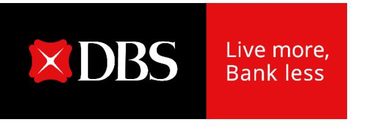

# **Record quarterly income and earnings**

**DBS Group Holdings 1Q 2024 financial results May 2, 2024**

### **Highlights**

#### **First-quarter net profit at \$2.96 billion with ROE at 19.4%, both at new highs**

- Commercial book total income up 14% to \$5.31 billion
  - o NIM expands 8bp to 2.77% from higher interest rates
  - o Net fee income crosses \$1 billion for the first time
  - o Treasury customer sales reaches a new record
- Markets trading income declines 9% due to higher funding cost
- Cost-income ratio at 37%

### **First-quarter net profit up 24% QoQ**

- Commercial book total income rises 9% QoQ as fee income and treasury customer sales reach new highs
- Commercial book net interest margin rises 2bp
- Markets trading income more than doubles

### **Balance sheet remains strong**

- NPL ratio unchanged at 1.1%, SP remains low at 10bp
- Allowance coverage at 125% and at 223% after considering collateral
- CET-1 ratio at 14.7%, LCR at 144%, NSFR at 116%

### **First-quarter dividend at 54 cents per share over the enlarged post-bonus share base**

### 1Q net profit up 15% YoY to new quarterly high

Commercial book

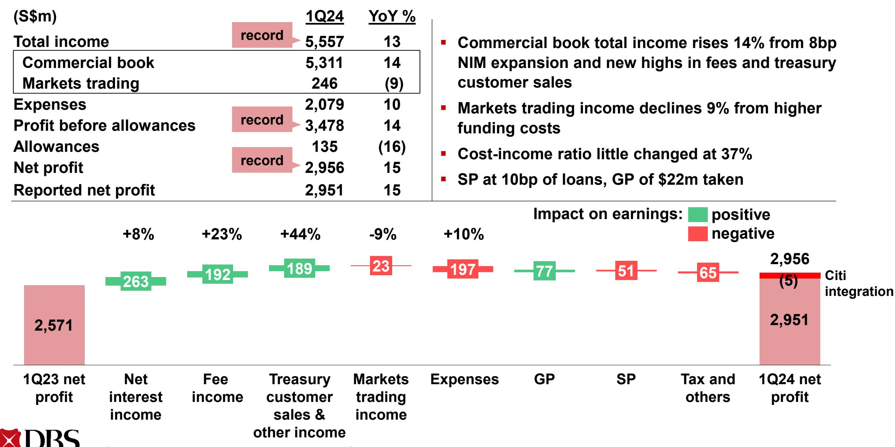

### 1Q net profit rises 24% QoQ

Commercial book

Citi

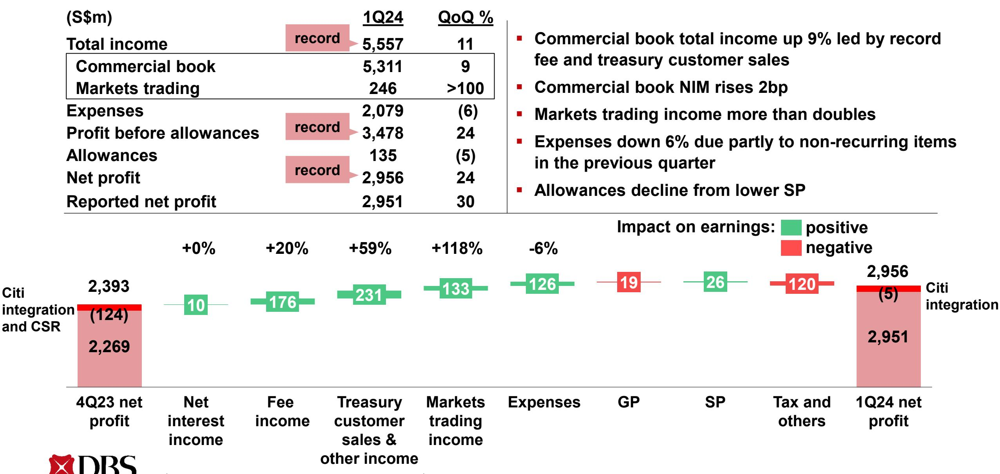

## **1Q commercial book net interest income stable, NIM up 2bp to 2.77%**

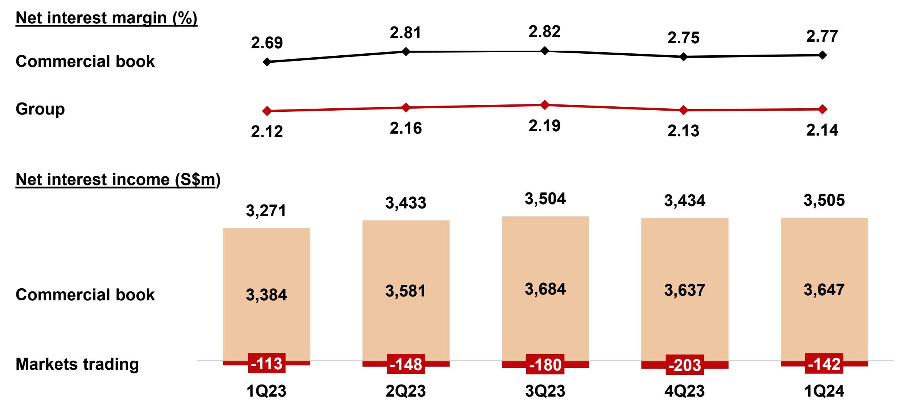

Income from perpetual securities, which have stated coupon rates, was reclassified from Markets trading non-interest income to Markets trading net interest income prospectively from 1Q24. There is no change to total Markets trading income.

### **Loans up 1% QoQ in constant-currency terms**

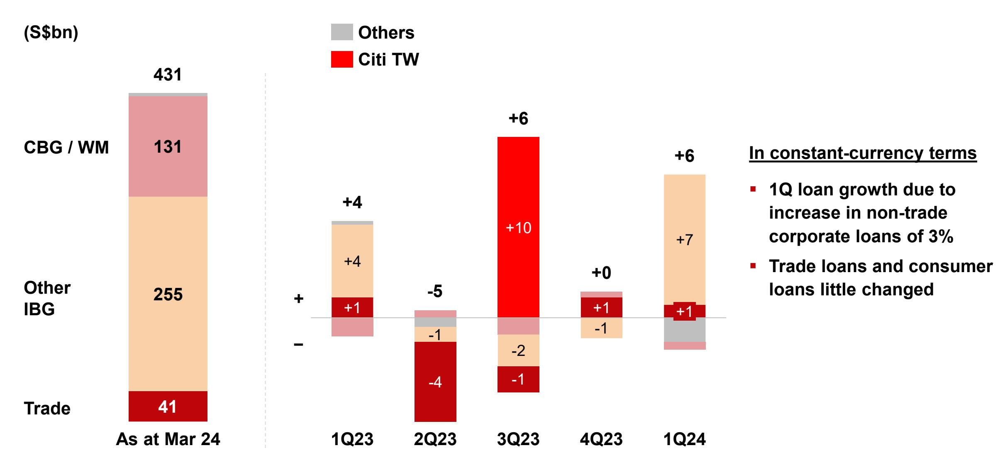

**Constant-currency change**

### Deposits up 1% QoQ in constant-currency terms

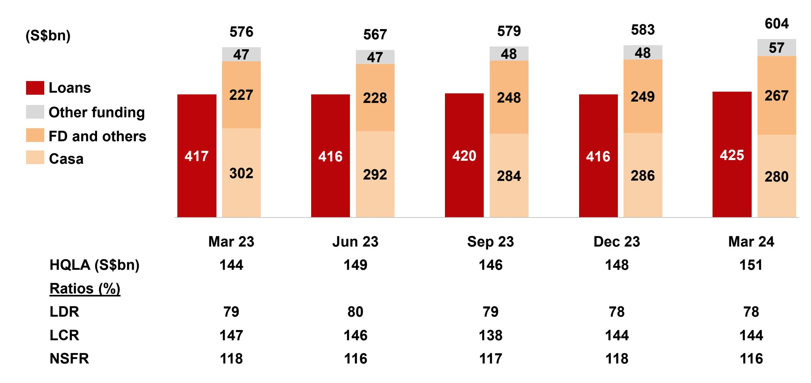

# 1Q fee income growth due to wealth management, cards and loan-related fees

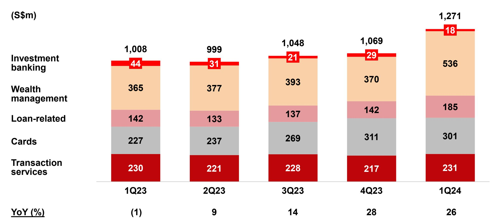

Gross fee income

## **1Q commercial book non-interest income up 30% YoY from record fee income and treasury customer sales**

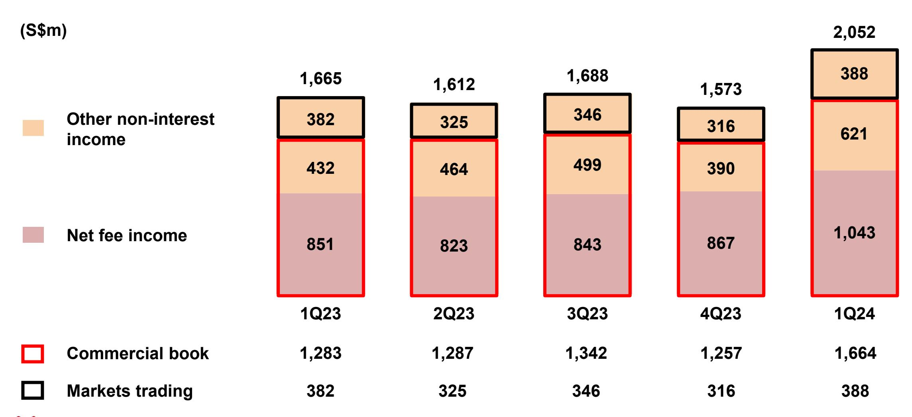

### **1Q cost-income ratio of 37% stable YoY**

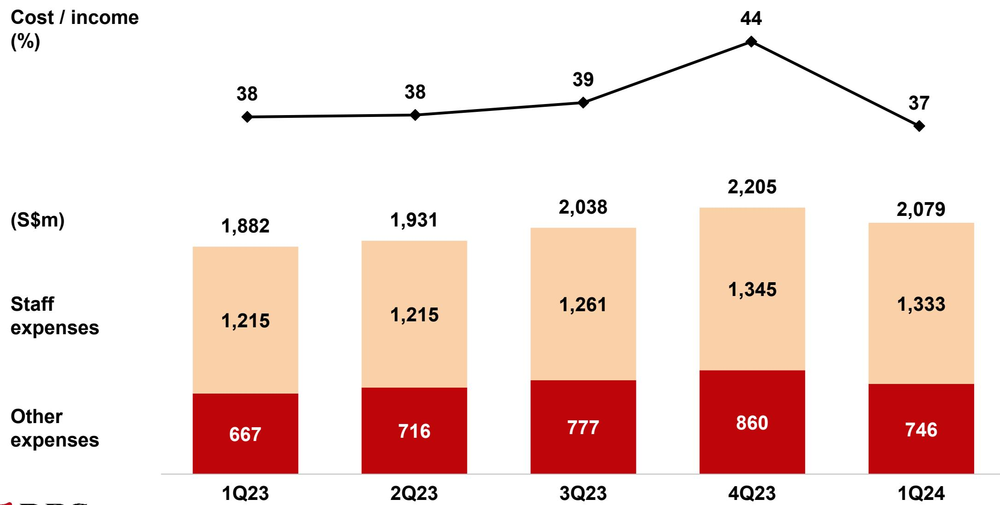

## **NPL ratio unchanged QoQ at 1.1%**

| (S\$m)                                    | 1Q23  | 2Q23  | 3Q23  | 4Q23  | 1Q24  |
|-------------------------------------------|-------|-------|-------|-------|-------|
| NPAs at start of period                   | 5,125 | 4,951 | 4,990 | 5,303 | 5,056 |
| IBG and others                            | (133) | (5)   | (41)  | (139) | 75    |
| New NPAs                                  | 218   | 166   | 224   | 127   | 317   |
| Upgrades, settlements and recoveries      | (251) | (139) | (221) | (139) | (196) |
| Write-offs                                | (100) | (32)  | (44)  | (127) | (46)  |
| CBG / WM                                  | (9)   | (7)   | 45    | (23)  | 43    |
| Translation                               | (32)  | 51    | (17)  | (85)  | 47    |
| NPAs at end of period                     | 4,951 | 4,990 | 4,977 | 5,056 | 5,221 |
| Citi Taiwan                               | -     | -     | 326   | -     | -     |
| NPAs at end of period incl Citi Taiwan | 4,951 | 4,990 | 5,303 | 5,056 | 5,221 |
| NPL ratio (%)                             | 1.1   | 1.1   | 1.2   | 1.1   | 1.1   |

### **1Q SP remains low at 10bp**

| (S\$m)                 | 1Q23 | 2Q23 | 3Q23 | 4Q23 | 1Q24 |
|------------------------|------|------|------|------|------|
| IBG and others         | 24   | 57   | 114  | 25   | 5    |
| Add charges for        | 84   | 110  | 160  | 76   | 54   |
| New NPLs               | 17   | 87   | 97   | 15   | 45   |
| Existing NPLs          | 67   | 23   | 63   | 61   | 9    |
| Subtract charges for   | 60   | 53   | 46   | 51   | 49   |
| Upgrades               | 1    | 0    | 4    | 2    | 0    |
| Settlements            | 50   | 39   | 34   | 40   | 40   |
| Recoveries             | 9    | 14   | 8    | 9    | 9    |
| CBG / WM               | 34   | 49   | 73   | 90   | 96   |
| SP charges for loans   | 58   | 106  | 187  | 115  | 101  |
| Other credit exposures | 4    | 10   | 9    | 24   | 14   |
| Total SP charges       | 62   | 116  | 196  | 139  | 115  |
| SP / loans (bp)        | 6    | 10   | 18   | 11   | 10   |

### **Allowance coverage at 125%**

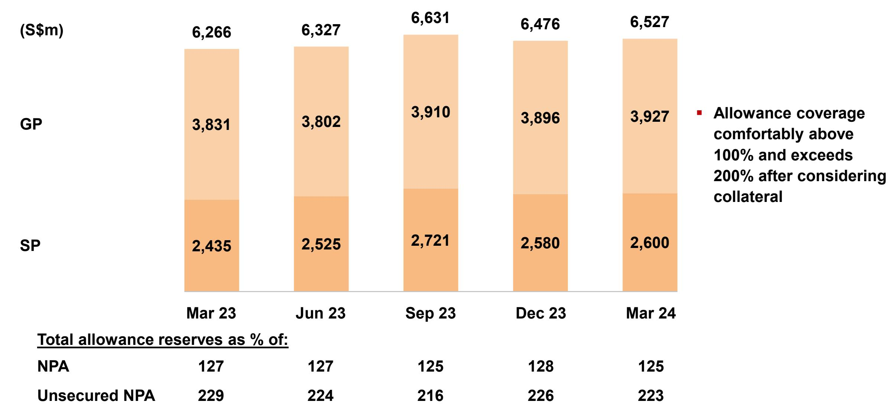

### **Strong CET-1 and leverage ratios**

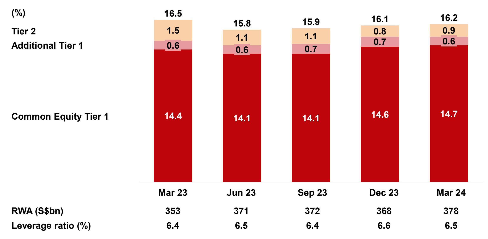

## **1Q dividend at 54 cents per share**

**(S¢ per share)**

**Adjusted for bonus issue**

### **In summary**

**Record quarterly performance with total income, net profit and ROE at new highs**

**Broad-based business momentum with loan growth as well as record fee income and treasury customer sales**

**While geopolitical tensions persist, macroeconomic conditions remain resilient, tempering Fed rate cut expectations**

**Franchise well positioned to deliver strong earnings and shareholder returns in the coming year**

# **Record quarterly income and earnings**

**DBS Group Holdings 1Q 2024 financial results May 2, 2024**