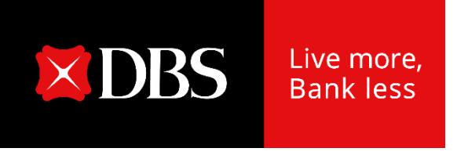

## **CEO observations**

**DBS Group Holdings 2Q 2024 financial results August 7, 2024**

## **Another strong quarter, bringing first half to new high**

- **Group NIM unchanged at 2.14%**
  - o Commercial book up 6bp QoQ led by fixed-rate asset repricing
  - o Impact offset by Market trading's deployment in high-quality assets that are accretive to income but dilutive to NIM
- **Loans stable**
  - o Healthy loan demand offset by idiosyncratic repayments
- **Fee income reaches new high**
  - o Double-digit growth in wealth management, cards and loan-related fees
  - o Strong wealth management fee momentum from higher AUM and shift to investments, card fees from higher spending; Citi Taiwan benefited both
- **Cost-income ratio at 40%**
- **Asset quality healthy, NPL ratio unchanged and SP remains low**

## **Outlook**

- **Market volatility and geopolitical tensions have heightened uncertainty, but we have built resilience against risks of economic slowdown and lower interest rates**
- **Group net interest income growth to be mid-single digit percent**
  - o Net interest income sensitivity reduced to \$4 million per basis point of US Fed funds rate, from \$18-20 million in 2021
- **Commercial book non-interest income growth to be in mid-to-high teens**
  - o Some risks if market uncertainty persists
- **Total income growth to be high-single digit**
- **Cost-income ratio to be around 40%**
- **SP to be 10-15 basis points**
- **Net profit growth to be mid- to high-single-digit**

## **CEO observations**

**DBS Group Holdings 2Q 2024 financial results August 7, 2024**