## **Record first-half income and earnings**

**DBS Group Holdings 2Q 2024 financial results August 7, 2024**

#### **Highlights**

#### **Second-quarter net profit up 4% YoY to \$2.80 billion with ROE at 18.2%**

- Commercial book total income up 9% to \$5.30 billion from broad-based growth
  - o NII rises from balance sheet growth and NIM increase of 2bp to 2.83%
  - o Net fee income reaches new high, treasury customer sales remain strong
- Markets trading income 6% higher
- Expenses increase 12%, with Citi Taiwan accounting for 5%pt. Cost-income ratio at 40%

#### **First-half net profit up 9% to record \$5.76bn**

- Commercial book total income rises 11% as fee income and treasury customer sales reach new highs
- Commercial book net interest margin rises 5bp
- Expenses up 11%, with Citi Taiwan accounting for 5%pt, and little changed from 2H23. Cost-income ratio at 39%

#### **Balance sheet remains strong**

- NPL ratio unchanged at 1.1%, SP remains low at 8bp for 2Q and 9bp for 1H
- Allowance coverage at 129% and at 227% after considering collateral
- CET-1 ratio at 14.8%, LCR at 148%, NSFR at 116%

#### **Second-quarter dividend at 54 cents per share**

## **2Q net profit up 4% YoY as total income rises 9%**

**Commercial book**

**Citi** 

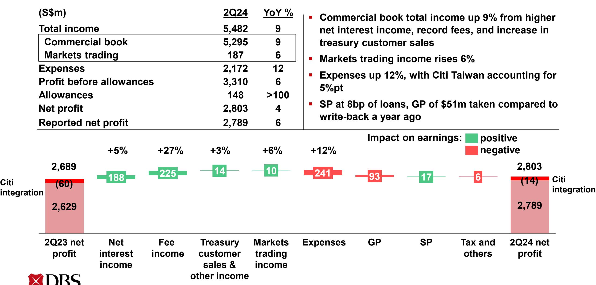

### **2Q net profit down 5% QoQ**

**Commercial book**

|                     | (S\$m) Total income Commercial book Markets trading Expenses Profit before allowances Allowances Net profit Reported net profit |                           |               | 2Q24 5,482 5,295 187 2,172 3,310 148 2,803 2,789 | QoQ % (1) (0) (24) 4 (5) 10 (5) (5) |      | Commercial book net interest income rises 3% from 6bp NIM expansion Fee income at new high Excluding non-recurring gains, Commercial book other non-interest income declines 15% Markets trading income declines 24% Expenses up 4% led by higher staff costs Impact on earnings: positive |    |                   |                        |                     |
|---------------------|---------------------------------------------------------------------------------------------------------------------------------------------------------|---------------------------|---------------|--------------------------------------------------------------------------|-------------------------------------------------------------|-----------------------|--------------------------------------------------------------------------------------------------------------------------------------------------------------------------------------------------------------------------------------------------------------------------------------------------------------------|----|-------------------|------------------------|---------------------|
| Citi integration | 2,956 (5) 2,951                                                                                                                                   | +3% 122                | +0% 5      | -23% 143                                                              | -24% 59                                                  | +4% 93             | 29                                                                                                                                                                                                                                                                                                                 | 16 | negative 28    | 2,803 (14) 2,789 | Citi integration |
|                     | 1Q24 net profit                                                                                                                                      | Net interest income | Fee income | Treasury customer sales & other income                          | Markets trading income                                | Expenses              | GP                                                                                                                                                                                                                                                                                                                 | SP | Tax and others | 2Q24 net profit     |                     |

#### 1H net profit up 9% to new high as total income rises 11%

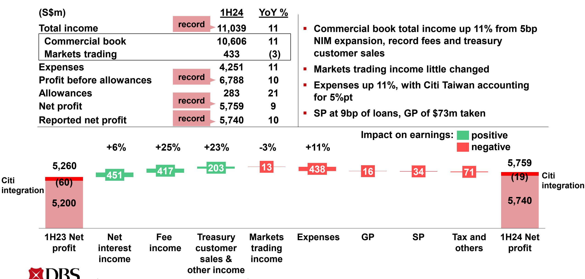

Commercial book

Citi

# 2Q commercial book net interest income up 3% QoQ as NIM rises 6bp to 2.83%

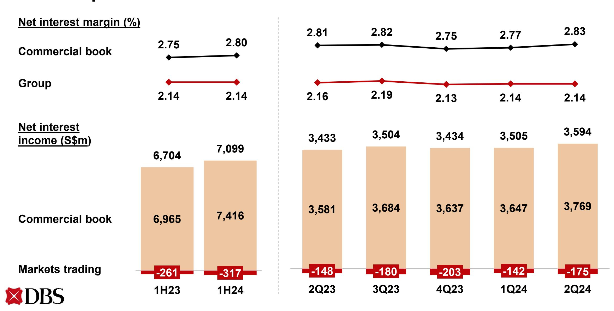

## **Loans stable QoQ, up 1% over first half in constant-currency terms**

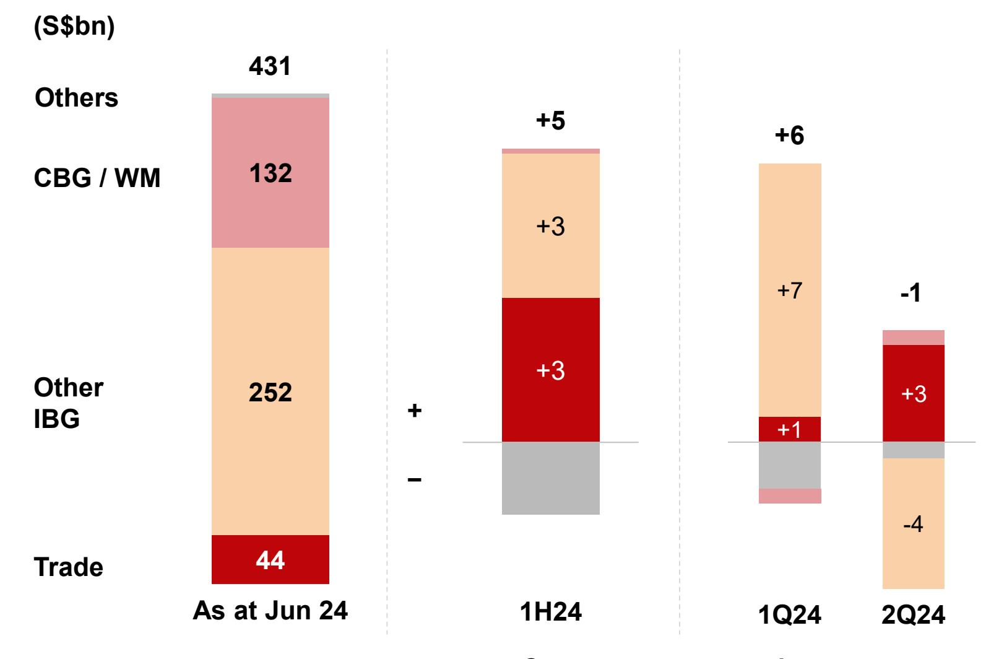

#### **In constant-currency terms**

- **2Q loans stable QoQ as growth in trade loans and wealth management loans offset decline in non-trade corporate loans**
- **1H loans up 1% YTD led by trade loans and non-trade corporate loans**

## Deposits stable QoQ; surplus deposits profitably deployed to HQLA, boosting liquidity ratios

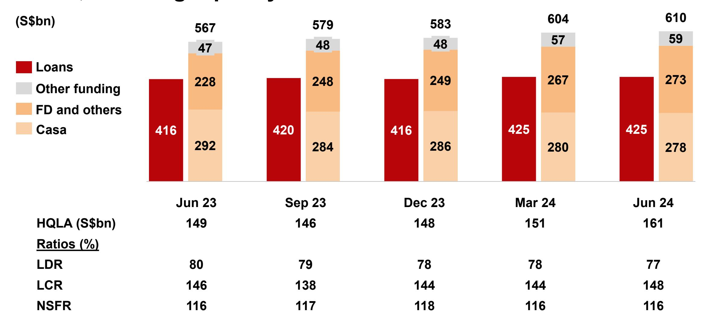

HQLA is high quality liquid assets; Other funding comprises senior medium-term notes, commercial papers, negotiable certificates of deposit, other debt securities and covered bonds

# 2Q fee income rises YoY due to wealth management, cards and loan-related fees, 1H at record

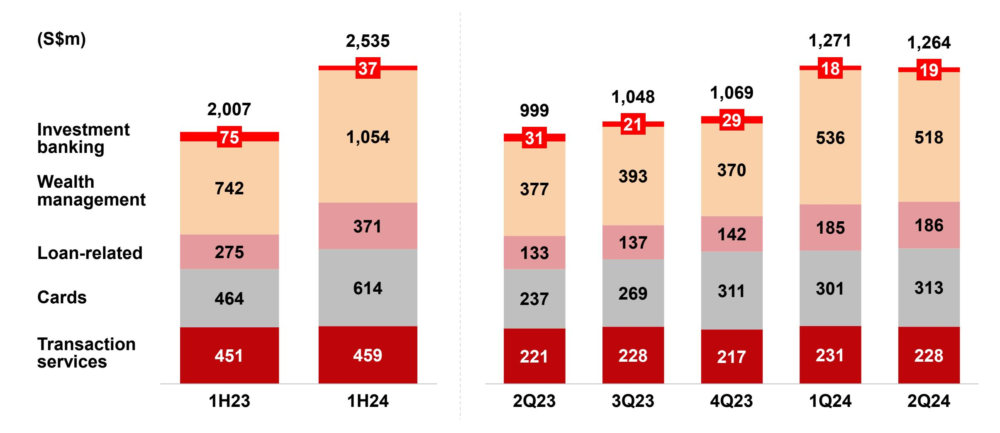

Gross fee income

# 1H commercial book non-interest income up 24% YoY from record fee income and treasury customer sales

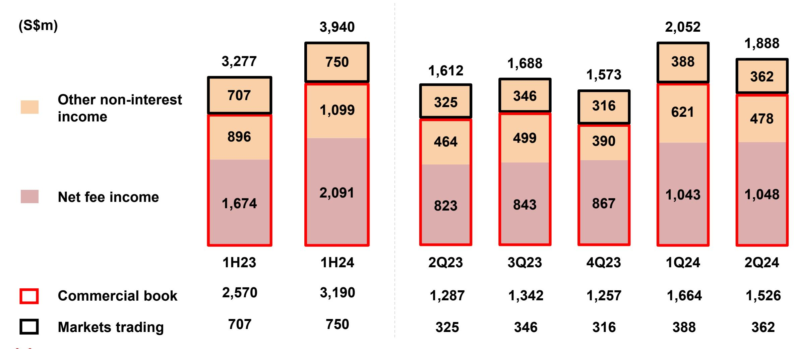

#### **1H cost-income ratio at 39%**

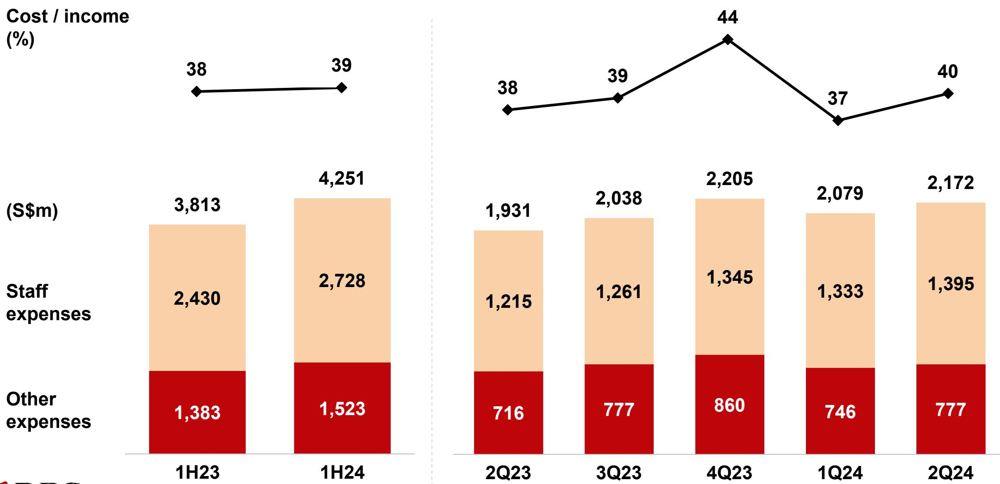

#### **1H CBG / WM income up 18%**

| (S\$m)                       | 1H24  | 1H23  | YoY % |
|------------------------------|-------|-------|-------|
| Total income                 | 5,059 | 4,272 | 18    |
| Loans and deposits           | 3,124 | 2,864 | 9     |
| Investment products          | 1,492 | 1,051 | 42    |
| Cards                        | 420   | 313   | 34    |
| Others                       | 23    | 44    | (48)  |
| Expenses                     | 2,491 | 2,050 | 22    |
| Profit before allowances     | 2,568 | 2,222 | 16    |
|                              |       |       |       |
| AUM (S\$bn)                  | 396   | 320   | 24    |
| SGD savings deposits (S\$bn) | 128   | 132   | (4)   |
| Total CBG deposits (S\$bn)   | 303   | 278   | 9     |

- **Total income up 18% to \$5.06bn from higher net interest income and record cards and wealth management fees, partly driven by Citi Taiwan**
- **Wealth management AUM increases 24% to record \$396bn**

#### **1H IBG income stable**

| (S\$m)                   | 1H24  | 1H23  | YoY % |  |
|--------------------------|-------|-------|-------|--|
| Total income             | 4,687 | 4,693 | (0)   |  |
| Loans                    | 1,741 | 1,702 | 2     |  |
| Trade                    | 320   | 345   | (7)   |  |
| Cash / SFS               | 2,082 | 2,131 | (2)   |  |
| Treasury                 | 498   | 459   | 8     |  |
| Investment banking       | 46    | 56    | (18)  |  |
| Expenses                 | 1,343 | 1,202 | 12    |  |
| Profit before allowances | 3,344 | 3,491 | (4)   |  |
|                          |       |       |       |  |
| Assets (S\$bn)           | 331   | 326   | 2     |  |
|                          |       |       |       |  |
| GTS deposits (S\$bn)     | 192   | 187   | 3     |  |

- **Total income stable at \$4.69bn**
- **Higher loan-related fees, cash management fees and treasury customer income offset by lower net interest income**
- **GTS deposits up 3%**

## **1H treasury customer income up 26% to record, Markets trading income little changed**

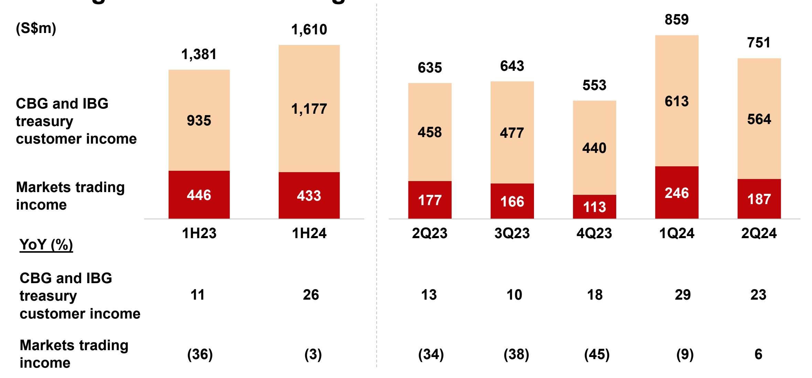

## **1H Hong Kong net profit down 2% YoY, up 3% HoH; ROE at 19%**

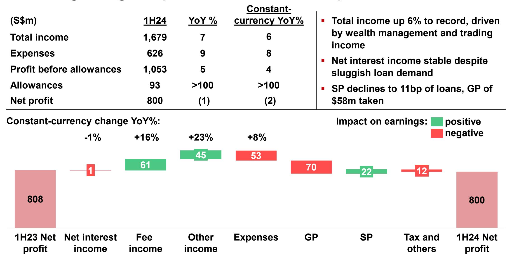

### **NPL ratio unchanged at 1.1%**

| (S\$m)                                    | 1H23  | 1H24  | 2Q23  | 3Q23  | 4Q23  | 1Q24  | 2Q24  |
|-------------------------------------------|-------|-------|-------|-------|-------|-------|-------|
| NPAs at start of period                   | 5,125 | 5,056 | 4,951 | 4,990 | 5,303 | 5,056 | 5,221 |
| IBG and others                            | (138) | (77)  | (5)   | (41)  | (139) | 75    | (152) |
| New NPAs                                  | 379   | 417   | 166   | 224   | 127   | 317   | 191   |
| Upgrades, settlements and recoveries      | (385) | (413) | (139) | (221) | (139) | (196) | (308) |
| Write-offs                                | (132) | (81)  | (32)  | (44)  | (127) | (46)  | (35)  |
|                                           |       |       |       |       |       |       |       |
|                                           |       |       |       |       |       |       |       |
| CBG / WM                                  | (16)  | 48    | (7)   | 45    | (23)  | 43    | 5     |
| Translation                               | 19    | 50    | 51    | (17)  | (85)  | 47    | 3     |
| NPAs at end of period                     | 4,990 | 5,077 | 4,990 | 4,977 | 5,056 | 5,221 | 5,077 |
|                                           |       |       |       |       |       |       |       |
| Citi Taiwan                               | -     | -     | -     | 326   | -     | -     | -     |
|                                           |       |       |       |       |       |       |       |
| NPAs at end of period incl Citi Taiwan | 4,990 | 5,077 | 4,990 | 5,303 | 5,056 | 5,221 | 5,077 |

#### **2Q SP at 8bp, 1H at 9bp**

| (S\$m)                 | 1H23 | 1H24 |  |
|------------------------|------|------|--|
| IBG and others         | 81   | (6)  |  |
| Add charges for        | 185  | 93   |  |
| New NPLs               | 104  | 68   |  |
| Existing NPLs          | 81   | 25   |  |
| Subtract charges for   | 104  | 99   |  |
| Upgrades               | 1    | 15   |  |
| Settlements            | 80   | 67   |  |
| Recoveries             | 23   | 17   |  |
| CBG / WM               | 83   | 196  |  |
| SP charges for loans   | 164  | 190  |  |
| Other credit exposures | 14   | 22   |  |
| Total SP charges       | 178  | 212  |  |
| SP / loans (bp)        | 8    | 9    |  |

| (S\$m)                 | 1H23 | 1H24 | 2Q23 | 3Q23 | 4Q23 | 1Q24 | 2Q24 |
|------------------------|------|------|------|------|------|------|------|
| IBG and others         | 81   | (6)  | 57   | 114  | 25   | 5    | (11) |
| Add charges for        | 185  | 93   | 110  | 160  | 76   | 54   | 50   |
| New NPLs               | 104  | 68   | 87   | 97   | 15   | 45   | 29   |
| Existing NPLs          | 81   | 25   | 23   | 63   | 61   | 9    | 21   |
| Subtract charges for   | 104  | 99   | 53   | 46   | 51   | 49   | 61   |
| Upgrades               | 1    | 15   | 0    | 4    | 2    | 0    | 15   |
| Settlements            | 80   | 67   | 39   | 34   | 40   | 40   | 38   |
| Recoveries             | 23   | 17   | 14   | 8    | 9    | 9    | 8    |
| CBG / WM               | 83   | 196  | 49   | 73   | 90   | 96   | 100  |
| SP charges for loans   | 164  | 190  | 106  | 187  | 115  | 101  | 89   |
| Other credit exposures | 14   | 22   | 10   | 9    | 24   | 14   | 8    |
| Total SP charges       | 178  | 212  | 116  | 196  | 139  | 115  | 97   |
| SP / loans (bp)        | 8    | 9    | 10   | 18   | 11   | 10   | 8    |

### **Allowance coverage rises to 129%**

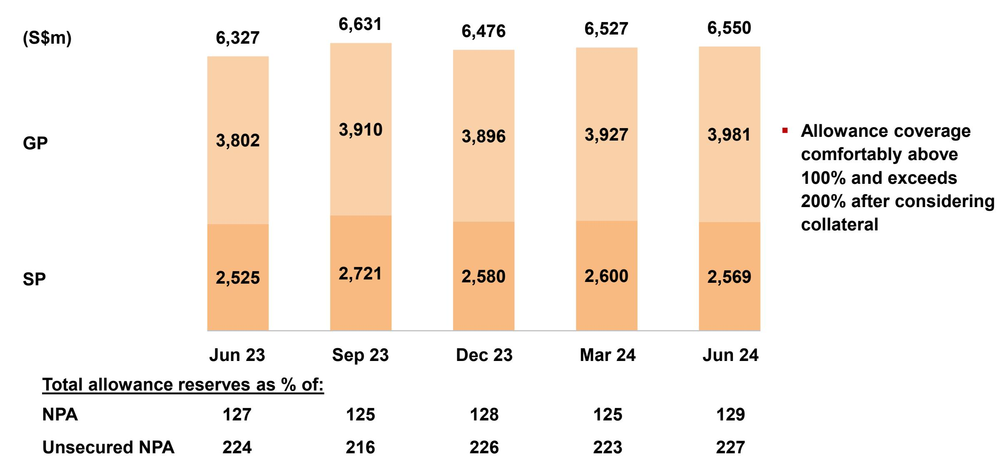

### **Strong CET-1 and leverage ratios**

### **2Q dividend at 54 cents per share**

**(S¢ per share)**

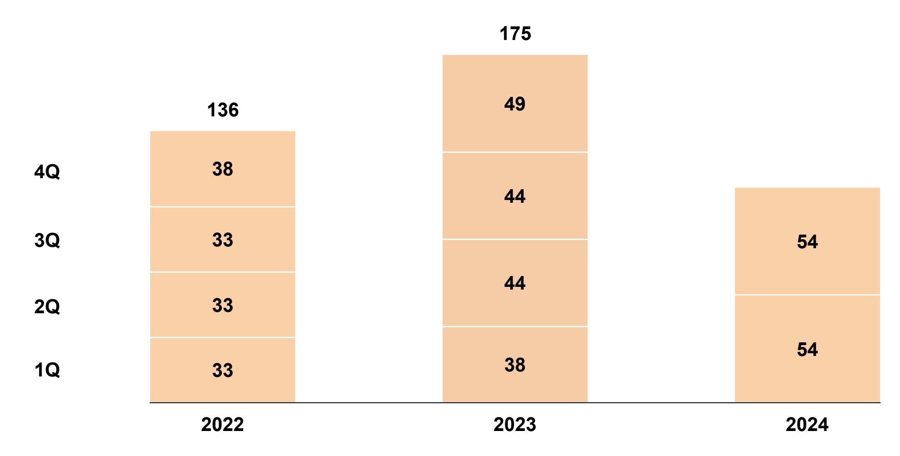

#### **In summary**

**Delivered another strong quarter, bringing first half earnings to new high with ROE at 18.8%**

**Heightened uncertainty from recent market volatility and ongoing geopolitical tensions**

**Resilience built against economic slowdown and lower interest rates**

**High general allowance reserves, reduced interest rate sensitivity, strong capital position and ample liquidity position us to support customers and deliver shareholder returns**

## **Supplementary slides**

**DBS Group Holdings 2Q 2024 financial results August 7, 2024**

### **1H net profit up 9% to record \$5.76bn**

| (S\$m)                                        | 1H24   | 1H23  | YoY % |
|-----------------------------------------------|--------|-------|-------|
| Commercial book total income                  | 10,606 | 9,535 | 11    |
| Net interest income                           | 7,416  | 6,965 | 6     |
| Net fee and commission income                 | 2,091  | 1,674 | 25    |
| Treasury customer sales and other income      | 1,099  | 896   | 23    |
| Markets trading income                        | 433    | 446   | (3)   |
| Net interest income                           | (317)  | (261) | (21)  |
| Non-interest income                           | 750    | 707   | 6     |
| Total income                                  | 11,039 | 9,981 | 11    |
| Expenses                                      | 4,251  | 3,813 | 11    |
| Profit before allowances and amortisation     | 6,788  | 6,168 | 10    |
| Amortisation of intangible assets             | 12     | -     | NM    |
| Allowances for credit and other losses        | 283    | 233   | 21    |
| SP                                            | 210    | 176   | 19    |
| GP                                            | 73     | 57    | 28    |
| Share of profits/losses of associates and JVs | 114    | 105   | 9     |
| Profit before tax                             | 6,607  | 6,040 | 9     |
| Net profit                                    | 5,759  | 5,260 | 9     |
| Reported net profit                           | 5,740  | 5,200 | 10    |

#### **1H Hong Kong net profit down 2%**

#### **Constant-currency terms**

| (S\$m) | ) |
|--------|---|
|--------|---|

| (S\$m)                        | 1H24  | 1H23  | YoY % | YoY % |
|-------------------------------|-------|-------|-------|-------|
| Net interest income           | 1,034 | 1,035 | (0)   | (1)   |
| Net fee and commission income | 411   | 350   | 17    | 16    |
| Other non-interest income     | 234   | 189   | 24    | 23    |
| Total income                  | 1,679 | 1,574 | 7     | 6     |
| Expenses                      | 626   | 573   | 9     | 8     |
| Profit before allowances      | 1,053 | 1,001 | 5     | 4     |
| GP                            | 58    | (12)  | NM    | NM    |
| SP                            | 35    | 57    | (39)  | (38)  |
| Allowances                    | 93    | 45    | >100  | >100  |
| Net profit                    | 800   | 808   | (1)   | (2)   |

#### **Net interest margin (%) 1.80 1.79**

**Loan growth (%)**

Non-trade growth (%)

Trade growth (%)

**Deposit growth (%)**

### **NPL ratio at 1.1%, allowance coverage above 100%**

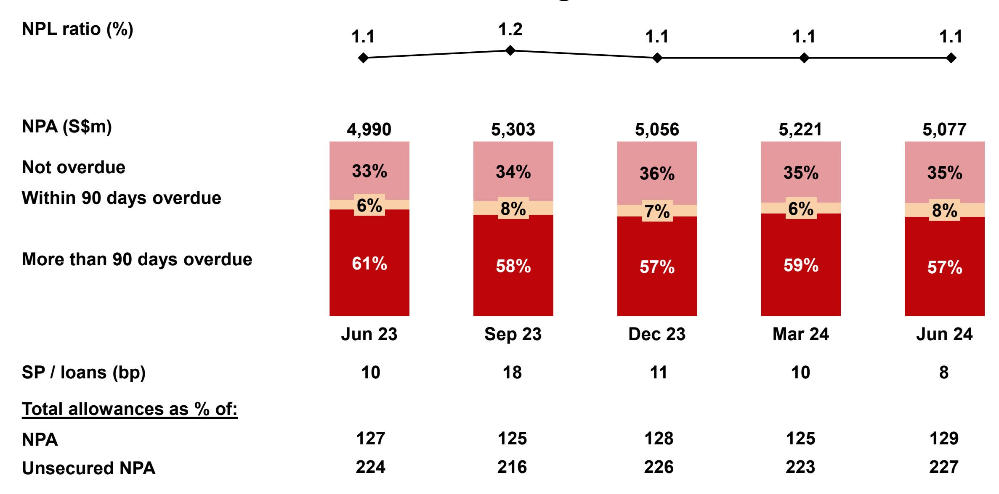

### **Fixed income duration remains short**

| (\$m)                                   | Jun 24 |        |  |
|-----------------------------------------|--------|--------|--|
|                                         | FVOCI  | HTC    |  |
| Government securities                   | 33,526 | 24,415 |  |
| Less than 3 years                       | 25,504 | 8,014  |  |
| 3 to 5 years                            | 3,400  | 3,921  |  |
| 5 to 10 years                           | 3,767  | 11,979 |  |
| More than 10 years                      | 855    | 501    |  |
| Supranational, bank and corporate bonds | 20,529 | 41,448 |  |
| Total                                   | 54,055 | 65,863 |  |

#### **Deposits up 2% HoH and 6% YoY in constant-currency terms**

| By product  |
|-------------|
|             |
|             |
| By currency |
|             |
|             |
|             |
|             |
|             |
|             |
|             |
|             |
|             |

|                           | (S\$bn) | HoH (%)  |            | YoY (%)  |            |
|---------------------------|---------|----------|------------|----------|------------|
|                           | Jun 24  | Reported | Underlying | Reported | Underlying |
| Deposits                  | 551     | 3        | 2          | 6        | 6          |
| By product                |         |          |            |          |            |
| Casa                      | 278     | (3)      | (4)        | (5)      | (5)        |
| Fixed deposits and others | 273     | 10       | 8          | 20       | 20         |
| By currency               |         |          |            |          |            |
| Singapore dollar          | 196     | 2        | 2          | (5)      | (5)        |
| US dollar                 | 220     | 5        | 2          | 10       | 10         |
| HK dollar                 | 34      | 3        | (1)        | 1        | 1          |
| Chinese yuan              | 21      | (15)     | (16)       | 6        | 6          |
| Others                    | 80      | 6        | 6          | 31       | 34         |
| LDR (%)                   | Jun 24  |          | Dec 23     | Jun 23   |            |
| Overall                   | 77      |          | 78         |          | 80         |
| Singapore dollar          | 83      |          | 85         |          | 80         |
| US dollar                 | 49      |          | 48         |          | 55         |

#### **1H Wealth Management segment income up 21%**

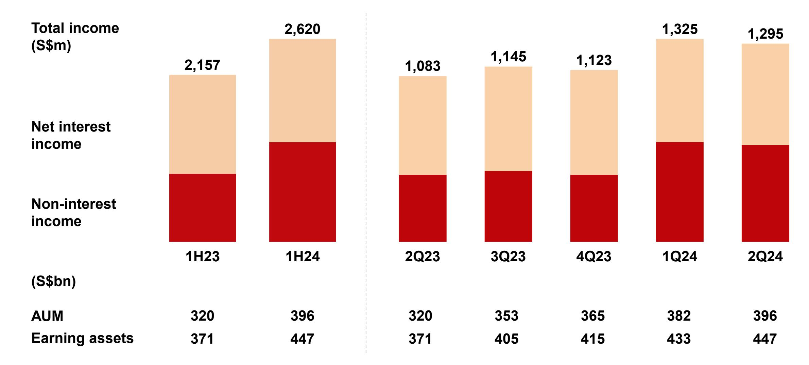

### **1H GTS income down 3%**

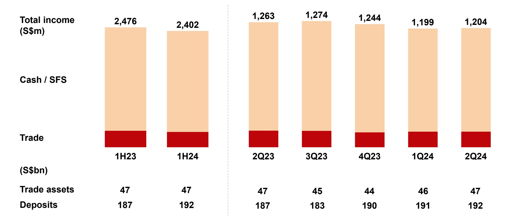

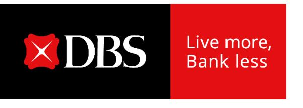

## **Record first-half income and earnings**

**DBS Group Holdings 2Q 2024 financial results August 7, 2024**