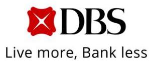
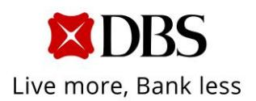
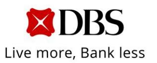
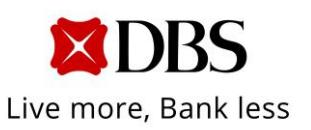
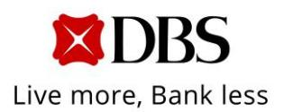

# **News Release**

Ref No. 05/2024

### **DBS SECOND-QUARTER NET PROFIT UP 4% TO SGD 2.80 BILLION, RETURN ON EQUITY AT 18.2%**

**\* \* \***

*First-half net profit up 9% to record SGD 5.76 billion driven by broad-based growth in total income*

Singapore, 7 Aug 2024 – DBS Group achieved net profit of SGD 2.80 billion for second-quarter 2024, up 4% from a year ago. Return on equity was 18.2%. Total income increased 9% to SGD 5.48 billion. Commercial book net interest income rose from balance sheet growth and a slightly higher net interest margin, fee income was at a record, and treasury customer sales remained strong. Markets trading income was also higher. The cost-income ratio was 40% and profit before allowances rose

DBS/Second-quarter 2024 results Page 1 of 6 DBS Group Holdings Ltd

12 Marina Boulevard DBS Asia Central @ Marina Bay Financial Centre Tower 3 Singapore 018982

Tel: 65.6878 8888

[www.dbs.com](http://www.dbs.com/)

6% to SGD 3.31 billion. Compared to the previous quarter's record, net profit was 5% lower.

For the first half, net profit rose 9% to a new high of SGD 5.76 billion, with return on equity at 18.8%. Total income increased 11% to SGD 11.0 billion from broad-based growth in net interest income, fee income and treasury customer sales. The cost-income ratio was 39% and profit before allowances rose 10% to a record SGD 6.79 billion.

Asset quality continued to be resilient with the non-performing loan ratio at 1.1% and specific allowances at eight basis points of loans for the second quarter and nine basis points for the first half.

#### **Second-quarter performance**

Commercial book net interest income increased 5% from a year ago to SGD 3.77 billion as net interest margin improved two basis points to 2.83%, while loans and deposits grew 3% and 6% in constant-currency terms respectively bolstered by the consolidation of Citi Taiwan. Compared to the previous quarter, net interest income rose 3% as net interest margin increased six basis points led by fixed-rate asset repricing. Loans were stable in constant-currency terms at SGD 425 billion as growth in trade loans and wealth management loans offset a decline in non-trade corporate loans. Deposits were also stable in constant-currency terms at SGD 551 billion, with Casa and fixed deposits little changed.

Commercial book net fee income rose 27% from a year ago to a record SGD 1.05 billion. Wealth management fees grew 37% to SGD 518 million driven by a shift from deposits into investments and bancassurance as well as an expansion in assets

DBS/Second-quarter 2024 results Page 2 of 6 DBS Group Holdings Ltd

12 Marina Boulevard DBS Asia Central @ Marina Bay Financial Centre Tower 3

Singapore 018982 [www.dbs.com](http://www.dbs.com/)

Tel: 65.6878 8888

under management. Card fees increased 32% to SGD 313 million from higher spending. The consolidation of Citi Taiwan benefited wealth management and card fees. Loan-related fees were also higher, rising 40% to SGD 186 million. Compared to the previous quarter, net fee income was slightly higher.

Commercial book other non-interest income rose 3% from a year ago to SGD 478 million driven by strong treasury customer sales. Excluding non-recurring gains, it was 15% lower than the previous quarter.

Markets trading income amounted to SGD 187 million, 6% higher than a year ago and 24% lower compared to the previous quarter.

Expenses increased 12% from a year ago to SGD 2.17 billion, with Citi Taiwan accounting for five percentage points of the increase. Compared to the previous quarter, expenses rose 4% led by higher staff costs. The cost-income ratio was at 40%.

Profit before allowances was SGD 3.31 billion, 6% higher than a year ago and 5% lower than the previous quarter's record.

#### **First-half performance**

Commercial book net interest income rose 6% to SGD 7.42 billion. Net interest margin increased five basis points to 2.80% from higher interest rates. Loans grew 1% or SGD 5 billion in constant-currency terms over the first six months led by trade loans and non-trade corporate loans. Deposits increased 2% or SGD 9 billion in constant-currency terms. Casa outflows, which slowed from the previous year, were offset by an increase in fixed deposits.

DBS/Second-quarter 2024 results Page 3 of 6 DBS Group Holdings Ltd

12 Marina Boulevard DBS Asia Central @ Marina Bay Financial Centre Tower 3 Singapore 018982

Tel: 65.6878 8888

[www.dbs.com](http://www.dbs.com/)

Commercial book net fee income rose 25% to SGD 2.09 billion, led by growth in wealth management fees, card fees and loan-related fees.

Commercial book other non-interest income rose 23% to SGD 1.10 billion led by treasury customer sales which reached a new high. Excluding non-recurring gains, it increased 12%.

Expenses were 11% higher than a year ago at SGD 4.25 billion, with Citi Taiwan accounting for five percentage points of the increase. Compared to the previous half, expenses were little changed. The cost-income ratio was at 39%.

Profit before allowances increased 10% to a record SGD 6.79 billion.

#### **Business unit performance**

For the first half, Consumer Banking / Wealth Management income increased 18% to SGD 5.06 billion from higher net interest income, wealth management fees and card fees, partly driven by the consolidation of Citi Taiwan. Institutional Banking income was stable at SGD 4.69 billion as higher loan-related fees, cash management fees and treasury customer income were offset by lower net interest income. Markets Trading income was little changed at SGD 433 million.

## **Balance sheet**

Asset quality remained sound. Non-performing assets fell 3% from the previous quarter to SGD 5.08 billion as new non-performing asset formation was more than offset by repayments and write-offs. The non-performing loan ratio was unchanged at 1.1%.

DBS/Second-quarter 2024 results Page 4 of 6 DBS Group Holdings Ltd

12 Marina Boulevard DBS Asia Central @ Marina Bay Financial

Centre Tower 3 Singapore 018982

[www.dbs.com](http://www.dbs.com/)

Tel: 65.6878 8888

Specific allowances for the second quarter amounted to SGD 97 million or eight basis points of loans, bringing the half-year amount to SGD 210 million or nine basis points. General allowances of SGD 51 million were taken in the second quarter and SGD 73 million for the first half. Allowance coverage stood at 129% and at 227% after considering collateral.

Liquidity continued to be ample. The liquidity coverage ratio of 148% and the net stable funding ratio of 116% were both well above regulatory requirements of 100%.

Capital remained healthy with the Common Equity Tier-1 ratio at 14.8%. The leverage ratio was at 6.5%, more than twice the regulatory minimum of 3%.

The Board declared a dividend of SGD 54 cents per share for the second quarter, bringing the first-half dividend to SGD 1.08 per share.

DBS CEO Piyush Gupta said, "We delivered another strong set of results for the second quarter, bringing first-half earnings to a new high with ROE at 18.8%. While recent market volatility and ongoing geopolitical tensions have resulted in heightened uncertainty, we have built resilience against the risks of an economic slowdown and lower interest rates. Our high general allowance reserves, reduced interest rate sensitivity, strong capital position and ample liquidity will position us to continue supporting customers and delivering shareholder returns."

#### **About DBS**

DBS is a leading financial services group in Asia with a presence in 19 markets. Headquartered and listed in Singapore, DBS is in the three key Asian axes of growth: Greater China, Southeast Asia and South Asia. The bank's "AA-" and "Aa1" credit ratings are among the highest in the world.

Recognised for its global leadership, DBS has been named "World's [Best Bank"](https://www.dbs.com/newsroom/DBS_named_Worlds_Best_Bank_for_fifth_year_running) by Global Finance, ["World's Best Bank"](https://www.dbs.com/newsroom/DBS_honoured_as_Worlds_Best_Bank_for_fourth_straight_year_sg) by Euromoney and ["Global Bank of the Year"](https://www.dbs.com/about-us/who-we-are/awards-accolades/a-world-first/awards-2021#global-bank-of-the-year-2021) by The Banker. The bank is at the forefront of leveraging digital technology to shape the future of banking, having been named ["World's Best Digital Bank"](https://www.dbs.com/about-us/who-we-are/awards-accolades/a-world-first/awards-2021#world-best-digital-bank-2021) by Euromoney and the world's ["Most Innovative in Digital Banking"](https://www.dbs.com/newsroom/DBS_clinches_global_accolade_for_innovation_in_digital_banking) by The Banker. In addition, DBS has been accorded the ["Safest Bank in Asia"](https://www.dbs.com/newsroom/DBS_named_Worlds_Safest_Commercial_Bank_sg) award by Global Finance for 15 consecutive years from 2009 to 2023.

DBS provides a full range of services in consumer, SME and corporate banking. As a bank born and bred in Asia, DBS understands the intricacies of doing business in the region's most dynamic markets.

DBS is committed to building lasting relationships with customers, as it banks the Asian way. Through the DBS Foundation, the bank creates impact beyond banking by supporting businesses for impact: enterprises with a double bottom-line of profit and social and/or environmental impact. DBS Foundation also gives back to society in various ways, including equipping underserved communities with future-ready skills and helping them to build food resilience.

With its extensive network of operations in Asia and emphasis on engaging and empowering its staff, DBS presents exciting career opportunities. For more information, please visit [www.dbs.com.](http://www.dbs.com/)

[End]

*For more information, contact:*

*Edna Koh Group Strategic Marketing & Communications DBS Bank*

*Email: ednakoh@dbs.com Tel: (65) 6878 8134 Mobile: (65) 9753 0117*

*Michael Sia Investor Relations DBS Bank Email: michaelsia@dbs.com*

*Tel: (65) 6878 4751 Mobile: (65) 9636 9472*