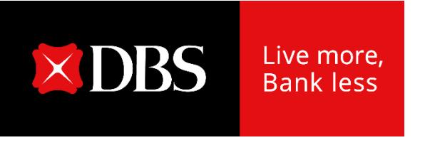

# **CEO observations**

**DBS Group Holdings 2Q 2025 financial results August 7, 2025**

## **Strong quarter, bringing first half to new high**

**Strong 2Q performance despite challenging conditions underscores franchise resilience**

- **Nimble balance sheet management** 
  - o Group NII little changed QoQ, proactive hedging cushions impact of sharp rate declines
- **Robust deposit inflows, momentum continued in July**
- **Ability to capture market opportunities and gain market share**
  - o Record AUM and strong NNM inflow, higher WM fees and treasury customer sales YoY
  - o Strong IBG treasury product sales and loan-related fees
  - o Markets trading at 13-quarter high
- **Asset quality resilient, NPL ratio declines to 1.0%**

# **2025 outlook**

- **Group net interest income slightly above 2024 levels despite lower Sora and Hibor**
  - o Impact of lower rates offset by proactive hedging and strong deposit growth
- **Commercial book non-interest income growth to be mid- to high-single digits**
  - o Double-digit growth in wealth management
- **Cost-income ratio to be in low-40% range**
- **SP assumed to normalise to 17-20bp in 2H, although not seeing signs of stress so far**
  - o GP reserves provide buffer
- **Net profit to be below 2024 levels, mainly due to global minimum tax of 15%**

### Head start in digital assets since 2021

**Issuance & Listing** 

**Trading & Custody** 

**Payment & Settlement** 

Banking the Ecosystem

Capability to list range of tokenised offerings

E.g. Security token offering ("STO"): Listed first STO in 2021

## Venue for customers to trade digital assets and STOs

DBS Digital Exchange (DDEX):
 First bank-backed digital exchange in Asia

### **Custody for safekeeping purpose**

Institutional-grade custody for digital assets

### Trading and structuring of digital assets

- Facilitate clients' investments in digital assets
- Derivative OTC market making and origination / distribution of structured products

### **DBS Token Services**

ANT GROUP

Enterprise Singapore

Treasury Token
24x7 real-time liquidity
management

Payment controls & visibility

### **Programmable Rewards**

Digital rewards at scale via Paylah!

#### **Tokenised Deposits**

Issued digital SGD in the form of tokenised deposits used as payment instruments as part of Project Orchid

### Central Bank Digital Currencies ("CBDC")

<u> </u>

Wholesale CBDC

e-HKD pilot programme

e-CNY merchant solution

Banking digital asset ecosystem players

Banking partner for regulated stablecoin issuers

- Monitoring digital asset regulations; balancing innovation with responsibility
- Continue to build on head start and broaden digital asset offerings

# **CEO observations**

**DBS Group Holdings 2Q 2025 financial results August 7, 2025**