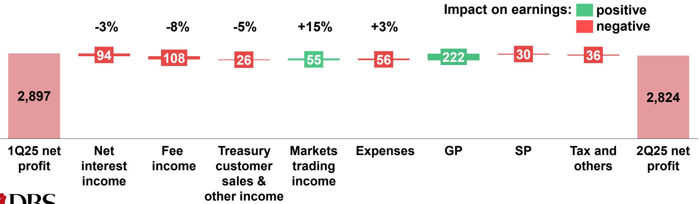
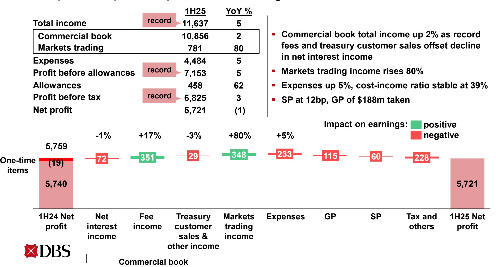
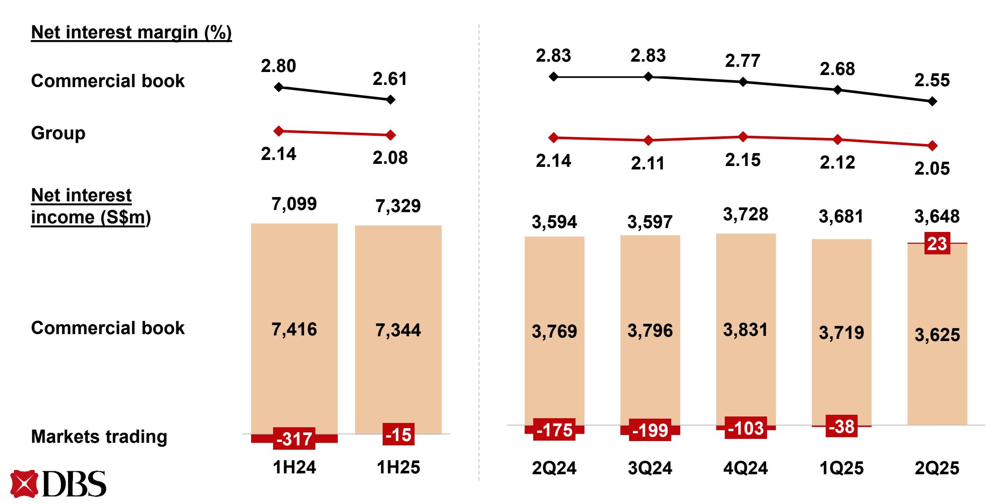
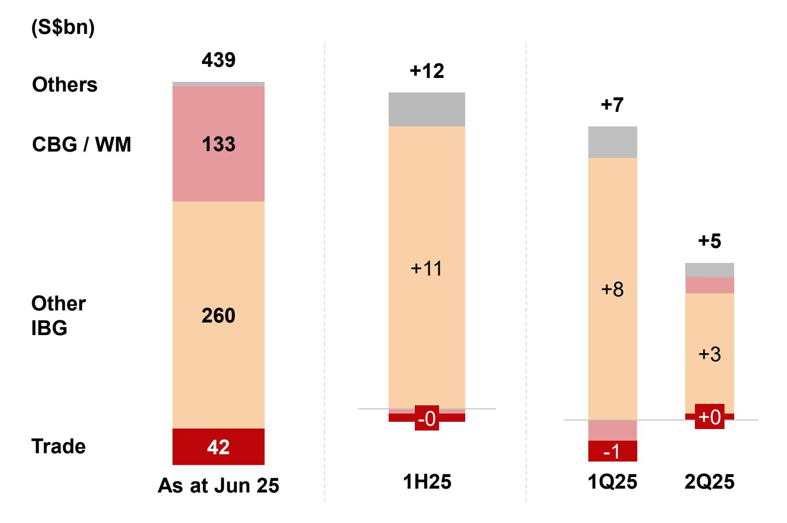
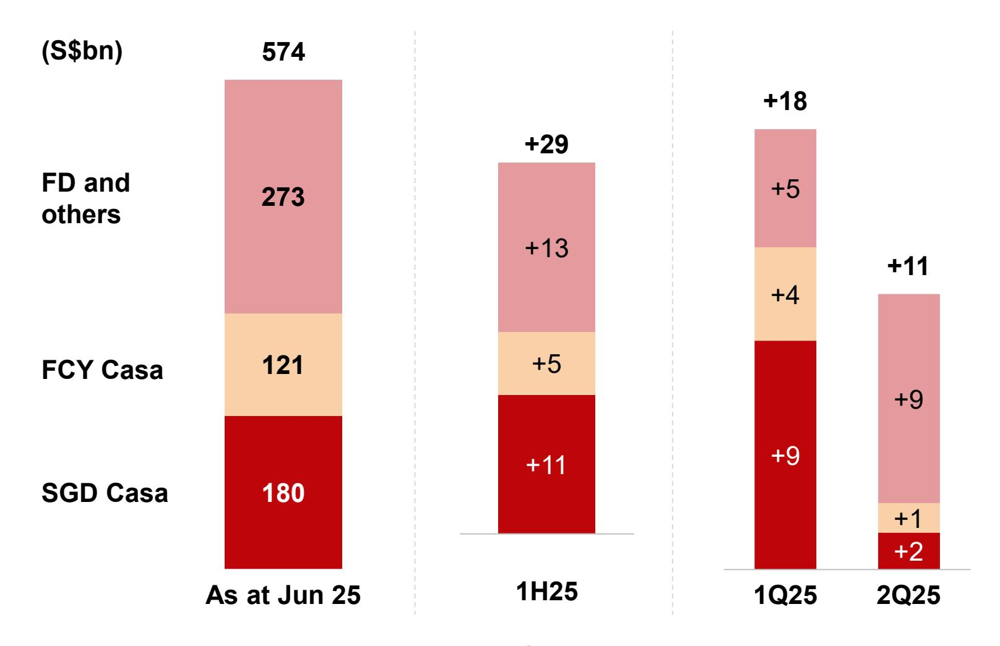
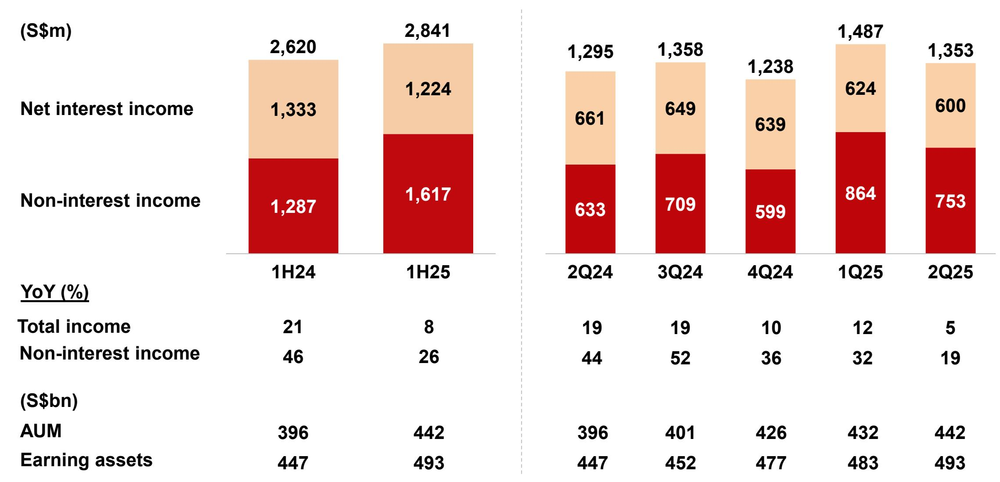
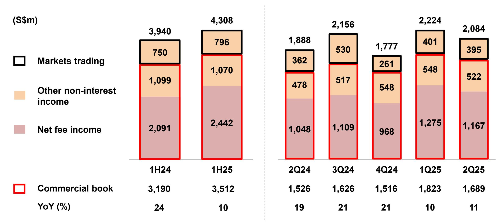
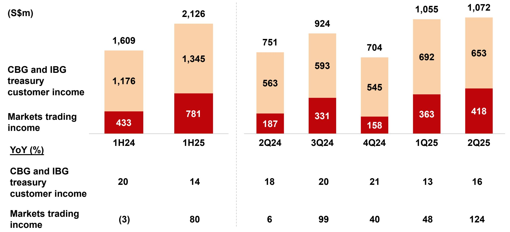
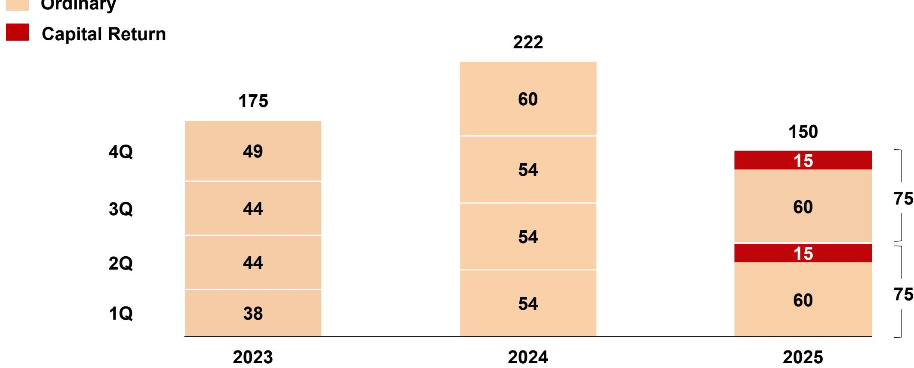
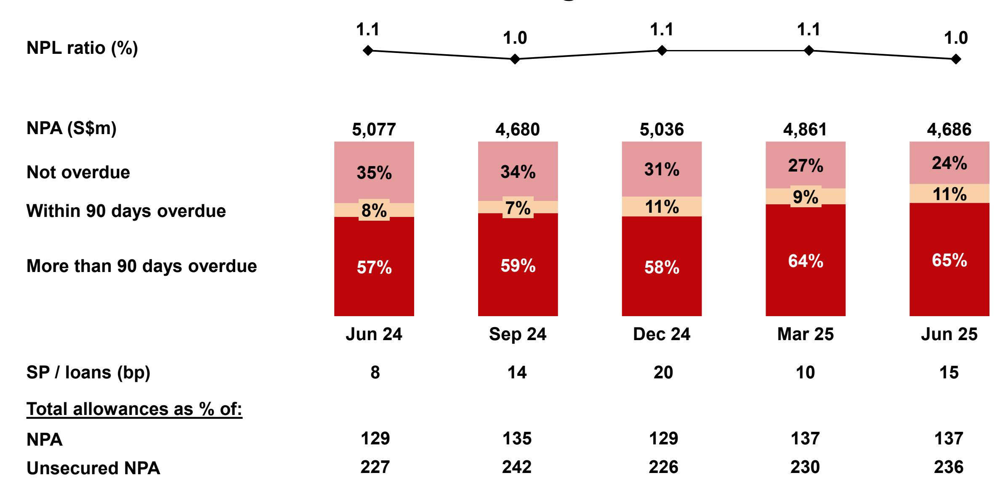

# **Record first-half income and pre-tax profit**

**DBS Group Holdings 2Q 2025 financial results August 7, 2025**

#### **Highlights**

**2Q pre-tax profit up 5% YoY to \$3.39bn; net profit up 1% to \$2.82bn despite heightened uncertainty, sharp Sora and Hibor declines, significant currency fluctuations, and global minimum tax**

- Total income up 5% YoY to \$5.73bn
  - o NII rises 2%, supported by strong deposit growth and proactive balance sheet hedging
  - o Fee income and treasury customer sales rise to second-highest quarterly levels
  - o Markets trading income more than doubles to 13-quarter high

**1H pre-tax profit at record \$6.83bn, ROE at 17.0% and ROTE at 18.8%**

Total income driven by broad-based growth across commercial book and markets trading

#### **Balance sheet remains strong**

- Asset quality resilient. NPL ratio improves to 1.0%, SP at 15bp for 2Q and 12bp for 1H
- Allowance coverage at 137% and 236% after considering collateral
- Transitional CET1 ratio at 17.0%, fully phased-in at 15.1%

**2Q total dividend of 75¢ per share, comprising 60¢ ordinary dividend and 15¢ Capital Return dividend**

### **2Q net profit up 1% YoY**

|                   | (S\$m)                                                                                                                                      |                           |                 | 2Q25                                            | YoY %                        |           |                                                                                                                        |                           |                             |                    |
|-------------------|---------------------------------------------------------------------------------------------------------------------------------------------|---------------------------|-----------------|-------------------------------------------------|------------------------------|-----------|------------------------------------------------------------------------------------------------------------------------|---------------------------|-----------------------------|--------------------|
|                   | Total income Commercial book Markets trading Expenses Profit before allowances Allowances Profit before tax Net profit |                           |                 | 5,732                                           | 5                            |           |                                                                                                                        |                           |                             |                    |
|                   |                                                                                                                                             |                           |                 | 5,314                                           | 0                            |           |  Commercial book net interest income falls 4%; impact of lower rates mitigated by hedging and deposit growth |                           |                             |                    |
|                   |                                                                                                                                             |                           |                 | 418                                             | >100                         |           |                                                                                                                        |                           |                             |                    |
|                   |                                                                                                                                             |                           |                 | 2,270                                           | 5                            |           |                                                                                                                        |                           |                             |                    |
|                   |                                                                                                                                             |                           |                 | 3,462                                           | 5                            |           |  Fee income rises 11% led by wealth management; treasury customer sales also higher                             |                           |                             |                    |
|                   |                                                                                                                                             |                           |                 | 133                                             | (10)                         |           |                                                                                                                        |                           |                             |                    |
|                   |                                                                                                                                             |                           |                 | 3,388                                           | 5                            |           |  Markets trading income more than doubles  Expenses up 5% led by staff costs                                |                           |                             |                    |
|                   |                                                                                                                                             |                           |                 | 2,824                                           | 1                            |           |                                                                                                                        |                           |                             |                    |
| One-time items | 2,803 (14) 2,789                                                                                                                      | -4% 144                | +11% 119     | +9% 44                                       | +124% 231                 | +5% 98 | 68                                                                                                                     | Impact on earnings: 53 | positive negative 146 | 2,824              |
|                   | 2Q24 net profit                                                                                                                          | Net interest income | Fee income   | Treasury customer sales & other income | Markets trading income | Expenses  | GP                                                                                                                     | SP                        | Tax and others           | 2Q25 net profit |
|                   |                                                                                                                                             |                           | Commercial book |                                                 |                              |           |                                                                                                                        |                           |                             |                    |

### **2Q net profit declines 3% QoQ**

| (S\$m)                   | 2Q25  | QoQ % |
|--------------------------|-------|-------|
| Total income             | 5,732 | (3)   |
| Commercial book          | 5,314 | (4)   |
| Markets trading          | 418   | 15    |
| Expenses                 | 2,270 | 3     |
| Profit before allowances | 3,462 | (6)   |
| Allowances               | 133   | (59)  |
| Profit before tax        | 3,388 | (1)   |
| Net profit               | 2,824 | (3)   |

- **Commercial book net interest income declines 3%; impact of lower rates mitigated by hedging and deposit growth**
- **Fee income 8% lower as wealth management and loan-related fees ease from record levels; treasury customer sales also softer**
- **SP at 15bp, GP write-back of \$17m**

**Commercial book**

#### **1H pre-tax profit up 3% to new high**

## **2Q group net interest income higher YoY and little changed QoQ, lower interest rates cushioned by hedging and deposit growth**

### **Loans up 1% QoQ, 3% over first half**

#### **In constant-currency terms**

**Loans up 1% QoQ and 3% YTD, led by broad-based growth in non-trade corporate loans**

**Constant-currency change**

Gross loans 7

#### **Deposits up 2% QoQ, 5% over first half**

#### **In constant-currency terms**

- **2Q deposits up 2% QoQ from both FD and Casa**
- **1H deposits up 5% YTD; more than half the increase from Casa**

### **2Q fee income up YoY led by wealth management, 1H at record**

| (S\$m)               |       | 2,898 |       |             |       | 1,503 16 | 1,395 |
|----------------------|-------|-------|-------|-------------|-------|-------------|-------|
|                      | 2,535 | 47    | 1,264 | 1,315 31 | 1,236 |             | 31    |
| Investment banking   | 37    |       | 19    |             | 33    | 724         |       |
| Wealth management    | 1,054 | 1,373 | 518   | 609         | 520   |             | 649   |
|                      |       |       |       |             |       |             |       |
| Loan-related         | 371   | 412   | 186   | 146         | 127   | 227         | 185   |
| Cards                | 614   | 599   | 313   | 302         | 324   | 297         | 302   |
| Transaction services | 459   | 467   | 228   | 227         | 232   | 239         | 228   |
|                      | 1H24  | 1H25  | 2Q24  | 3Q24        | 4Q24  | 1Q25        | 2Q25  |
| YoY (%)              |       |       |       |             |       |             |       |
| Total                | 26    | 14    | 27    | 25          | 16    | 18          | 10    |
| Wealth management    | 42    | 30    | 37    | 55          | 41    | 35          | 25    |

#### **Record 1H Wealth Management income, AUM at new high**

# 2Q commercial book non-interest income rises 11% YoY, 1H up 10% to record

#### **1H CBG / WM income up 4%**

| (S\$m)                       | 1H25  | 1H24  | YoY % |  |
|------------------------------|-------|-------|-------|--|
| Total income                 | 5,284 | 5,059 | 4     |  |
| Loans and deposits           | 2,955 | 3,124 | (5)   |  |
| Investment products          | 1,846 | 1,492 | 24    |  |
| Cards                        | 455   | 420   | 8     |  |
| Others                       | 28    | 23    | 22    |  |
| Expenses                     | 2,658 | 2,491 | 7     |  |
| Profit before allowances     | 2,626 | 2,568 | 2     |  |
|                              |       |       |       |  |
| AUM (S\$bn)                  | 442   | 396   | 12    |  |
| SGD savings deposits (S\$bn) | 141   | 128   | 10    |  |

- **Total income up 4% to \$5.28bn led by higher fee income from investment product and bancassurance sales**
- **Wealth management AUM increases 16% in constant-currency terms to record \$442bn**

#### **1H IBG income declines 4%**

| (S\$m)                          | 1H25  | 1H24  | YoY % |
|---------------------------------|-------|-------|-------|
| Total income                    | 4,506 | 4,687 | (4)   |
| Loans                           | 1,757 | 1,741 | 1     |
| Trade                           | 315   | 320   | (2)   |
| Cash / SFS                      | 1,848 | 2,082 | (11)  |
| Treasury and investment banking | 586   | 544   | 8     |
| Expenses                        | 1,421 | 1,343 | 6     |
| Profit before allowances        | 3,085 | 3,344 | (8)   |
|                                 |       |       |       |
| Assets (S\$bn)                  | 337   | 331   | 2     |
| GTS deposits (S\$bn)            | 192   | 192   | 0     |

- **Total income declines 4% to \$4.51bn**
- **Higher loan-related fees and treasury customer income offset by lower net interest income**

# **1H treasury customer income up 14% to record, Markets trading income 80% higher**

IBG and CBG treasury customer income mainly comprises fee income and other non-interest income, and includes Equity Capital Markets, DBS Vickers and DBS Digital Exchange following an internal reorganisation in 1Q24. The change has been applied retrospectively to priorperiod comparatives

#### **1H Hong Kong net profit up 11% YoY to record**

|                          |       |       | Constant      |
|--------------------------|-------|-------|---------------|
| (S\$m)                   | 1H25  | YoY % | currency YoY% |
| Total income             | 1,780 | 6     | 8             |
| Expenses                 | 636   | 2     | 4             |
| Profit before allowances | 1,144 | 9     | 11            |
| Allowances               | 106   | 14    | 18            |
| Net profit               | 871   | 9     | 11            |

- **Total income up 8% to record \$1.78bn, driven by wealth management and trading income**
- **Net interest income declines 1% from lower Hibor, partially offset by balance sheet growth**
- **Total allowances up 18%, SP at 19bp**

# **NPA declines 4% QoQ as repayments and write-offs more than offset new NPA formation**

| (S\$m)                               | 1H24  | 1H25  | 2Q24  | 3Q24  | 4Q24  | 1Q25  | 2Q25  |
|--------------------------------------|-------|-------|-------|-------|-------|-------|-------|
| NPAs at start of period              | 5,056 | 5,036 | 5,221 | 5,077 | 4,680 | 5,036 | 4,861 |
| IBG and others                       | (77)  | (243) | (152) | (214) | 81    | (146) | (97)  |
| New NPAs                             | 417   | 345   | 191   | 452   | 338   | 159   | 244   |
| Upgrades, settlements and recoveries | (413) | (391) | (308) | (491) | (208) | (236) | (213) |
| Write-offs                           | (81)  | (197) | (35)  | (175) | (49)  | (69)  | (128) |
|                                      |       |       |       |       |       |       |       |
| CBG / WM                             | 48    | 37    | 5     | (23)  | 101   | 19    | 18    |
| Translation                          | 50    | (144) | 3     | (160) | 174   | (48)  | (96)  |
| NPAs at end of period                | 5,077 | 4,686 | 5,077 | 4,680 | 5,036 | 4,861 | 4,686 |
| NPL ratio (%)                        | 1.1   | 1.0   | 1.1   | 1.0   | 1.1   | 1.1   | 1.0   |

#### **2Q SP at 15bp, 1H at 12bp**

| (S\$m)                 | 1H24 | 1H25 | 2Q24 | 3Q24 |
|------------------------|------|------|------|------|
| IBG and others         | (6)  | 58   | (11) | 43   |
| Add charges for        | 93   | 262  | 50   | 168  |
| New NPLs               | 68   | 93   | 29   | 147  |
| Existing NPLs          | 25   | 169  | 21   | 21   |
| Subtract charges for   | 99   | 204  | 61   | 125  |
| Upgrades               | 15   | 120  | 15   | 1    |
| Settlements            | 67   | 50   | 38   | 75   |
| Recoveries             | 17   | 34   | 8    | 49   |
| CBG / WM               | 196  | 209  | 100  | 110  |
| SP charges for loans   | 190  | 267  | 89   | 153  |
| Other credit exposures | 22   | (7)  | 8    | (33) |
| Total SP charges       | 212  | 260  | 97   | 120  |
| SP / loans (bp)        | 9    | 12   | 8    | 14   |

|  | 4Q24 | 1Q25 | 2Q25 |
|--|------|------|------|
|  | 106  | (14) | 72   |
|  | 124  | 168  | 100  |
|  | 88   | 65   | 29   |
|  | 36   | 103  | 71   |
|  | 18   | 182  | 28   |
|  | 1    | 119  | 1    |
|  | 16   | 33   | 23   |
|  | 1    | 30   | 4    |
|  | 113  | 117  | 92   |
|  | 219  | 103  | 164  |
|  | 9    | 8    | (15) |
|  | 228  | 111  | 149  |
|  |      |      |      |
|  | 20   | 10   | 15   |

### **Allowance coverage ratio at 137%**

| (S\$m)                            | 6,550  | 6,323  | 6,514  | 6,650  | 6,441  |  |
|-----------------------------------|--------|--------|--------|--------|--------|--|
| GP                                | 3,981  | 3,955  | 3,969  | 4,159  | 4,109  |  |
| SP                                | 2,569  | 2,368  | 2,545  | 2,491  | 2,332  |  |
|                                   | Jun 24 | Sep 24 | Dec 24 | Mar 25 | Jun 25 |  |
| Total allowance reserves as % of: |        |        |        |        |        |  |
| NPA                               | 129    | 135    | 129    | 137    | 137    |  |
| Unsecured NPA                     | 227    | 242    | 226    | 230    | 236    |  |

#### **Strong CET-1 and leverage ratios**

| (%)                      |        | 18.8   | 18.6   | 18.6   | 40.0   |
|--------------------------|--------|--------|--------|--------|--------|
|                          |        | 0.9    | 0.9    | 1.0    | 18.2   |
|                          |        | 0.7    | 0.7    | 0.2    | 0.9    |
|                          | 16.2   |        |        |        | 0.3    |
| Tier 2                   | 0.8    |        |        |        |        |
| Additional Tier 1        | 0.6    | 17.2   | 17.0   | 17.4   | 17.0   |
| Common Equity Tier 1     | 14.8   |        |        |        |        |
|                          | Jun 24 | Sep 24 | Dec 24 | Mar 25 | Jun 25 |
| RWA (S\$bn)              | 386    | 338    | 352    | 352    | 355    |
| Leverage ratio (%)       | 6.5    | 6.8    | 6.7    | 6.5    | 6.5    |
|                          |        |        |        |        |        |
| Fully phased-in          |        |        |        |        |        |
| Common Equity Tier 1 (%) |        | 15.2   | 15.1   | 15.2   | 15.1   |

# **2Q total dividend of 75¢ per share, comprising 60¢ ordinary dividend and 15¢ Capital Return dividend**

**(S¢ per share)**

**Ordinary**

#### **In summary**

**Strong first-half performance despite challenging environment** 

**Ability to manage balance sheet nimbly, grow deposits and capture market opportunities help offset external pressures**

**ROE of 17% despite global minimum tax reflects deepening customer relationships across wealth management and corporate banking**

**Proactive balance sheet management as well as strong capital and liquidity position us to navigate interest rate cycle and support customers through uncertainty** 

# **Supplementary slides**

**DBS Group Holdings 2Q 2025 financial results August 7, 2025**

#### **1H pre-tax profit up 3% to record \$6.83bn**

| (S\$m)                                        | 1H25   | 1H24   | YoY % |
|-----------------------------------------------|--------|--------|-------|
| Commercial book total income                  | 10,856 | 10,606 | 2     |
| Net interest income                           | 7,344  | 7,416  | (1)   |
| Net fee and commission income                 | 2,442  | 2,091  | 17    |
| Treasury customer sales and other income      | 1,070  | 1,099  | (3)   |
| Markets trading income                        | 781    | 433    | 80    |
| Net interest income                           | (15)   | (317)  | 95    |
| Non-interest income                           | 796    | 750    | 6     |
| Total income                                  | 11,637 | 11,039 | 5     |
| Expenses                                      | 4,484  | 4,251  | 5     |
| Profit before allowances and amortisation     | 7,153  | 6,788  | 5     |
| Amortisation of intangible assets             | 12     | 12     | -     |
| Allowances for credit and other losses        | 458    | 283    | 62    |
| SP                                            | 270    | 210    | 29    |
| GP                                            | 188    | 73     | >100  |
| Share of profits/losses of associates and JVs | 142    | 114    | 25    |
| Profit before tax                             | 6,825  | 6,607  | 3     |
| Net profit                                    | 5,721  | 5,759  | (1)   |
| Reported net profit                           | 5,721  | 5,740  | (0)   |

#### **1H Hong Kong net profit up 11%**

#### **Constant-currency terms**

| (5\$m) |
|--------|
|--------|

| (S\$m)                        | 1H25  | 1H24  | YoY % | YoY % |
|-------------------------------|-------|-------|-------|-------|
| Total income                  | 1,780 | 1,679 | 6     | 8     |
| Net interest income           | 1,007 | 1,034 | (3)   | (1)   |
| Net fee and commission income | 505   | 411   | 23    | 25    |
| Other non-interest income     | 268   | 234   | 15    | 17    |
| Expenses                      | 636   | 626   | 2     | 4     |
| Profit before allowances      | 1,144 | 1,053 | 9     | 11    |
| Allowances                    | 106   | 93    | 14    | 18    |
| GP                            | 47    | 58    | (19)  | (14)  |
| SP                            | 59    | 35    | 69    | 71    |
| Net profit                    | 871   | 800   | 9     | 11    |

#### **Net interest margin (%) 1.75 1.80**

**Loan growth (%)**

Non-trade growth (%)

Trade growth (%)

**Deposit growth (%)**

#### **NPL ratio at 1.0%, allowance coverage above 100%**

#### **Fixed income duration remains short**

| (\$m)                                   | Jun 25 |        |  |
|-----------------------------------------|--------|--------|--|
|                                         | FVOCI  | HTC    |  |
| Government securities                   | 28,407 | 44,229 |  |
| Less than 3 years                       | 22,292 | 31,014 |  |
| 3 to 5 years                            | 2,895  | 5,098  |  |
| 5 to 10 years                           | 2,949  | 7,624  |  |
| More than 10 years                      | 271    | 493    |  |
| Supranational, bank and corporate bonds | 21,486 | 47,800 |  |
| Total                                   | 49,893 | 92,029 |  |

#### **Deposits up 5% over first half, 7% YoY in constant-currency terms**

|                           | (S\$bn) | HoH (%)  |            |          |            | YoY (%) |  |
|---------------------------|---------|----------|------------|----------|------------|---------|--|
|                           | Jun 25  | Reported | Underlying | Reported | Underlying |         |  |
| Deposits                  | 574     | 2        | 5          | 4        | 7          |         |  |
| By product                |         |          |            |          |            |         |  |
| Casa                      | 301     | 3        | 6          | 8        | 10         |         |  |
| Fixed deposits and others | 273     | 1        | 5          | 0        | 5          |         |  |
| By currency               |         |          |            |          |            |         |  |
| Singapore dollar          | 216     | 5        | 5          | 10       | 10         |         |  |
| US dollar                 | 220     | (2)      | 5          | 0        | 7          |         |  |
| HK dollar                 | 35      | 4        | 12         | 3        | 11         |         |  |
| Taiwan dollar             | 23      | 13       | 7          | 7        | 3          |         |  |
| Chinese yuan              | 23      | 14       | 19         | 6        | 11         |         |  |
| Others                    | 58      | (3)      | (2)        | (1)      | 2          |         |  |

| LDR (%)          | Jun 25 | Dec 24 | Jun 24 |
|------------------|--------|--------|--------|
| Overall          | 75     | 77     | 77     |
| Singapore dollar | 78     | 81     | 83     |
| US dollar        | 49     | 49     | 49     |

#### **1H GTS income down 10%**

| Total income (S\$m) | 2,402 | 2,164 | 1,204 | 1,170 | 1,144 | 1,105 | 1,059 |
|------------------------|-------|-------|-------|-------|-------|-------|-------|
| Cash / SFS             |       |       |       |       |       |       |       |
|                        |       |       |       |       |       |       |       |
| Trade                  |       |       |       |       |       |       |       |
| (S\$bn)                | 1H24  | 1H25  | 2Q24  | 3Q24  | 4Q24  | 1Q25  | 2Q25  |
| Trade assets           | 47    | 44    | 47    | 46    | 48    | 46    | 44    |
| Deposits               | 192   | 192   | 192   | 190   | 192   | 195   | 192   |

# **Record first-half income and pre-tax profit**

**DBS Group Holdings 2Q 2025 financial results August 7, 2025**