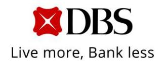
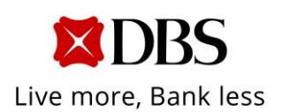
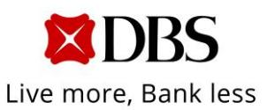
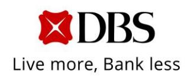
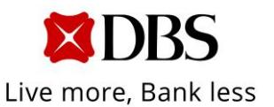
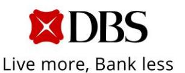
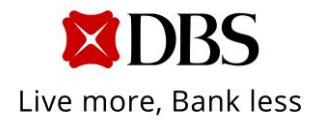

# **News Release**

Ref No. 03/2025

## **DBS SECOND-QUARTER PROFIT BEFORE TAX UP 5% TO SGD 3.39 BILLION, NET PROFIT RISES 1% TO SGD 2.82 BILLION**

**\* \* \***

#### *First-half total income and profit before tax reach new highs*

Singapore, 7 Aug 2025 – DBS Group achieved net profit of SGD 2.82 billion for second-quarter 2025, 1% higher than a year ago, despite heightened macroeconomic uncertainty, sharp declines in Sora and Hibor, significant currency fluctuations, and the implementation of the 15% global minimum tax. Total income rose 5% to SGD 5.73 billion. Net interest income was higher, supported by strong deposit growth and proactive balance sheet hedging. Fee income and treasury customer sales rose to their second highest quarterly levels, while markets trading performance strengthened. The cost-income ratio was stable at 40%. Profit before

DBS/Second-quarter 2025 results Page 1 of 7 DBS Group Holdings Ltd

12 Marina Boulevard DBS Asia Central @ Marina Bay Financial Centre Tower 3 Singapore 018982

Tel: 65.6878 8888

[www.dbs.com](http://www.dbs.com/)

tax rose 5% to SGD 3.39 billion. Compared to the previous quarter, profit before tax and net profit were 1% and 3% lower respectively.

For the first half, total income and profit before tax rose 5% and 3% respectively to new highs of SGD 11.6 billion and SGD 6.83 billion. Net profit was little changed at SGD 5.72 billion despite higher tax expenses. Return on equity was 17.0%, while return on tangible equity was 18.8%.

Asset quality continued to be resilient with the non-performing loan ratio at 1.0% and specific allowances at 15 basis points of loans for the second quarter and 12 basis points of loans for the first half.

## **Second quarter 2025 vs. second quarter 2024**

Commercial book net interest income fell 4% to SGD 3.63 billion due to a 28 basis-point decline in net interest margin to 2.55% from US Fed rate cuts and lower Sora and Hibor. The impact of lower interest rates was mitigated by balance sheet hedging and partly offset by strong deposit growth, which funded loans and an increased deployment into liquid assets.

Loans rose 4% or SGD 19 billion in constant-currency terms to SGD 433 billion, led by non-trade corporate loans from broad-based growth across industries. Deposits increased 7% or SGD 40 billion in constant-currency terms to SGD 574 billion, with the Casa ratio improving to 52%. Surplus deposits were deployed into liquid assets. This was accretive to net interest income and return on equity but modestly reduced net interest margin.

Commercial book net fee income rose 11% to SGD 1.17 billion. The increase was largely due to wealth management fees, which rose 25% to SGD 649 million

DBS/Second-quarter 2025 results Page 2 of 7 DBS Group Holdings Ltd

12 Marina Boulevard DBS Asia Central @ Marina Bay Financial Centre Tower 3

Singapore 018982

[www.dbs.com](http://www.dbs.com/)

Co. Reg. No. 199901152M

from broad-based growth in investment products and bancassurance. Investment banking fees were also higher from increased debt and equity capital market activity.

Commercial book other non-interest income increased 9% to SGD 522 million. Excluding non-recurring items a year ago, it rose 18% driven by strong treasury customer sales to both wealth management and corporate customers.

Markets trading income more than doubled to SGD 418 million from higher contributions across a range of activities, benefiting from lower funding costs and a more conducive trading environment.

Expenses increased 5% to SGD 2.27 billion led by higher staff costs. The cost-income ratio was stable at 40%.

For the Group, total income rose 5% to SGD 5.73 billion. Net interest income increased 2% to SGD 3.65 billion due to balance sheet growth. Net interest margin fell nine basis points to 2.05% as the decline in the commercial book was partially offset by stronger markets trading, supported by lower funding costs. Non-interest income grew 10% to SGD 2.08 billion, driven by higher fee income, treasury customer sales and markets trading gains.

#### **Second quarter 2025 vs. first quarter 2025**

Commercial book net interest income declined 3% as net interest margin narrowed 13 basis points from lower Sora and Hibor. Loans rose 1% or SGD 5 billion in constant-currency terms, led by a SGD 3 billion growth in non-trade corporate loans. Deposits increased 2% or SGD 11 billion in constant-currency terms from growth in both fixed deposits and Casa.

DBS/Second-quarter 2025 results Page 3 of 7 DBS Group Holdings Ltd

12 Marina Boulevard DBS Asia Central @ Marina Bay Financial Centre Tower 3

Tel: 65.6878 8888

Singapore 018982 [www.dbs.com](http://www.dbs.com/)

Commercial book net fee income was the second highest on record. It was 8% lower as wealth management and loan-related fees eased from record levels.

Commercial book other non-interest income declined 5% due to a moderation in treasury customer sales from the previous quarter's record, while markets trading income rose 15% to a 13-quarter high.

Expenses increased 3% from higher non-staff costs.

#### **First half 2025 vs. first half 2024**

Commercial book net interest income was 1% lower at SGD 7.34 billion. A 19-basis-point decline in net interest margin to 2.61% from lower interest rates, softened by balance sheet hedging, was mostly offset by balance sheet growth. Over the first six months, loans grew 3% or SGD 12 billion and deposits increased 5% or SGD 29 billion in constant-currency terms.

Commercial book net fee income rose 17% to a record SGD 2.44 billion, led by a 30% increase in wealth management fees to SGD 1.37 billion. Loan-related fees rose 11% to a record SGD 412 million. Investment banking and transaction service fees were also higher.

Commercial book other non-interest income declined 3% to SGD 1.07 billion. Excluding non-recurring items in the first half of 2024, it grew 11% from record treasury customer sales.

Markets trading income increased 80% to SGD 781 million, reflecting lower funding costs and a more conducive trading environment.

Expenses rose 5% to SGD 4.48 billion led by higher staff costs. The costincome ratio was stable at 39%.

DBS/Second-quarter 2025 results Page 4 of 7 DBS Group Holdings Ltd

12 Marina Boulevard DBS Asia Central @ Marina Bay Financial

Centre Tower 3 Singapore 018982

[www.dbs.com](http://www.dbs.com/)

Tel: 65.6878 8888

Co. Reg. No. 199901152M

### **Business unit performance**

For the first half, Consumer Banking / Wealth Management income rose 4% to SGD 5.28 billion, underpinned by higher net new money inflows and stronger investment product and bancassurance sales. The gains were partially offset by the impact of lower interest rates on deposit income. Institutional Banking income fell 4% to SGD 4.51 billion as a decline in cash management income due to lower interest rates more than offset higher income from treasury product sales. Markets Trading delivered its strongest performance in four years, with income rising to SGD 781 million.

#### **Balance sheet**

Asset quality remained resilient. The non-performing loan ratio improved from 1.1% to 1.0% during the quarter, as new non-performing asset formation stayed low and was more than offset by higher repayments and write-offs. Total non-performing assets fell 8% from a year ago to SGD 4.69 billion.

Specific allowances were SGD 150 million or 15 basis points of loans for the second quarter, bringing the first-half total to SGD 270 million or 12 basis points. Allowance coverage stood at 137% and at 236% after considering collateral.

Liquidity continued to be ample. The liquidity coverage ratio of 147% and the net stable funding ratio of 114% were both well above regulatory requirements of 100%.

The reported Common Equity Tier-1 ratio was 17.0% based on transitional arrangements, while the pro-forma ratio on a fully phased-in basis was 15.1%. The leverage ratio of 6.5% was more than twice the regulatory minimum of 3%.

DBS/Second-quarter 2025 results Page 5 of 7 DBS Group Holdings Ltd

12 Marina Boulevard DBS Asia Central @ Marina Bay Financial Centre Tower 3

Singapore 018982 [www.dbs.com](http://www.dbs.com/)

Tel: 65.6878 8888

The Board declared an ordinary dividend of SGD 60 cents per share and a Capital Return dividend of SGD 15 cents per share for the second quarter, bringing the first-half amounts to SGD 120 cents per share and SGD 30 cents per share respectively.

DBS CEO Tan Su Shan said, "We delivered a strong set of results for the first half despite the challenging environment. Our ability to manage the balance sheet nimbly, grow deposits and capture market opportunities helped offset the external pressures. Net interest income, fee income and treasury customer sales reached record levels, while markets trading performance was the strongest in four years. Return on equity was 17% even after the impact of the global minimum tax, reflecting the benefit of our investments to deepen customer relationships across wealth management and corporate banking. We are also pleased to be recognised once again as the World's Best Bank by Euromoney.

"While external uncertainties remain, we have opportunities ahead of us. Our proactive management of the balance sheet puts us in a good position to navigate the interest rate cycle, while strong capital and liquidity ensure we are well placed to support customers."

#### **About DBS**

DBS is a leading financial services group in Asia with a presence in 19 markets. Headquartered and listed in Singapore, DBS is in the three key Asian axes of growth: Greater China, Southeast Asia and South Asia. The bank's "AA-" and "Aa1" credit ratings are among the highest in the world.

Recognised for its global leadership, DBS has been named ["World's Best Bank"](https://www.dbs.com/newsroom/DBS_named_Worlds_Best_Bank_for_fifth_year_running) by Global Finance, ["World's Best Bank"](https://www.dbs.com/newsroom/DBS_conferred_three_global_awards_including_the_most_prestigious_Worlds_Best_Bank_accolade_by_Euromoney_2025) by Euromoney and ["Global Bank of the Year"](https://www.dbs.com/about-us/who-we-are/awards-accolades/a-world-first/awards-2021#global-bank-of-the-year-2021) by The Banker. The bank is at the forefront of leveraging digital technology to shape the future of banking, having been named ["World's Best Digital Bank"](https://www.dbs.com/about-us/who-we-are/awards-accolades/a-world-first/awards-2021#world-best-digital-bank-2021) by Euromoney and the world's ["Most](https://www.dbs.com/newsroom/DBS_clinches_global_accolade_for_innovation_in_digital_banking)  [Innovative in Digital Banking"](https://www.dbs.com/newsroom/DBS_clinches_global_accolade_for_innovation_in_digital_banking) by The Banker. In addition, DBS has been accorded the ["Safest](https://www.dbs.com/newsroom/DBS_named_Safest_Bank_in_Asia_for_the_16th_consecutive_year_by_Global_Finance_sg)  [Bank in Asia"](https://www.dbs.com/newsroom/DBS_named_Safest_Bank_in_Asia_for_the_16th_consecutive_year_by_Global_Finance_sg) award by Global Finance for 16 consecutive years from 2009 to 2024.

DBS provides a full range of services in consumer, SME and corporate banking. As a bank born and bred in Asia, DBS understands the intricacies of doing business in the region's most dynamic markets.

DBS is committed to building lasting relationships with customers, as it banks the Asian way. Through the DBS Foundation, the bank creates impact beyond banking by uplifting lives and livelihoods of those in need. It provides essential needs to the underprivileged, and fosters inclusion by equipping the underserved with financial and digital literacy skills. It also nurtures innovative social enterprises that create positive impact.

With its extensive network of operations in Asia and emphasis on engaging and empowering its staff, DBS presents exciting career opportunities. For more information, please visit [www.dbs.com.](https://www.dbs.com/default.page)

[End]

*For more information, contact:*

*Edna Koh Group Strategic Marketing & Communications DBS Bank Email: ednakoh@dbs.com*

*Tel: (65) 6878 8134 Mobile: (65) 9753 0117* *Nicholas Teh Investor Relations DBS Bank*

*Email: nicholasteh@dbs.com*

*Tel: (65) 6682 0404 Mobile: (65) 8322 8217*