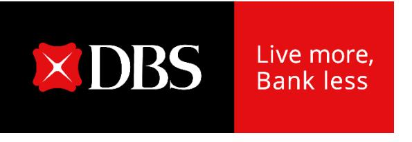

## **CEO observations**

**DBS Group Holdings 3Q 2024 financial results November 7, 2024**

## **Another record quarterly and nine-month performance**

- **Group NII stable QoQ as balance sheet growth offset lower NIM**
  - o Commercial book NIM unchanged, supported by reduced interest rate sensitivity
  - o Lower Group NIM due to markets trading's deployment in products with inherent accounting asymmetry which are accretive to income but dilutive to NIM
- **Fee income reaches new high**
  - o Strong momentum in wealth management
- **Highest markets trading income in ten quarters, capitalised on market volatility**
- **Cost-income ratio stable at 39%**
- **Asset quality resilient, NPL ratio lower**
  - o Repayments, recoveries and write-offs more than offset new NPA formation
- **New share buyback programme another affirmation of commitment to capital management, underpinned by strong capital position and earnings generation**

## **2025 outlook**

- **Group net interest income around 2024 levels**
  - o Slight decline in Group NIM, mostly offset by loan growth
  - o Markets trading to benefit from lower funding cost
- **Commercial book non-interest income growth to be high-single digits**
  - o Led by growth in wealth management fees and treasury customer sales
- **Cost-income ratio to be in low-40% range**
- **SP assumed to normalise to 17-20bp, although not seeing signs of stress so far**
  - o Potential for GP writebacks
- **Pretax profit to be around 2024 levels**
- **Net profit to be below 2024 levels due to global minimum tax of 15%**

## **CEO observations**

**DBS Group Holdings 3Q 2024 financial results November 7, 2024**