# **Record quarterly and nine-month performance**

**DBS Group Holdings 3Q 2024 financial results November 7, 2024**

#### **Highlights**

#### **Third-quarter net profit up 15% YoY to surpass \$3bn for first time**

- Total income up 11% to \$5.75bn from broad-based growth
  - o Commercial book NII rises from balance sheet growth and stable NIM of 2.83%
  - o Record fee income led by wealth management; treasury customer sales also higher
  - o Markets trading income highest in ten quarters
- Expenses increase 10%, with Citi Taiwan accounting for 3%pt. Cost-income ratio at 39%

#### **Nine-month net profit up 11% to record \$8.79bn, ROE at 18.8%**

- Total income rises 11% to new high of \$16.8bn from growth in commercial book and markets trading
  - o Broad-based increase in commercial book income from higher NIM, balance sheet growth, as well as record fee income and treasury customer sales

#### **Balance sheet remains strong**

- NPA falls 8% as repayments, upgrades and write-offs more than offset new NPA formation. NPL ratio declines to 1.0%
- SP of 14bp for 3Q and 11bp for 9M
- Based on final Basel III reforms, transitional CET-1 ratio at 17.2%, fully phased-in at 15.2%

#### **Board announces new \$3bn share buyback programme**

**Third-quarter dividend at 54 cents per share**

#### **Board establishes new share buyback programme of \$3bn**

**Shares will be purchased in open market and cancelled for first time**

- To be carried out at management's discretion and subject to market conditions
- Over and above periodic share buybacks for vesting employee share plans

**Programme will reduce fully phased-in CET-1 ratio by 0.8 percentage points when completed**

**Buyback programme provides permanent lift to EPS in addition to raising ROE**

**Programme is latest in series of capital management initiatives in recent years, which has included**

- Doubling of ordinary dividends over past five years
- Occasional special dividends
- Recent bonus issue that effectively raised dividends

**Existing policy of paying ordinary dividends that are sustainable and rise progressively with earnings affirmed**

### **Dividends continue to be primary means of capital distribution**

**(S\$bn)**

**Ordinary**

**Special**

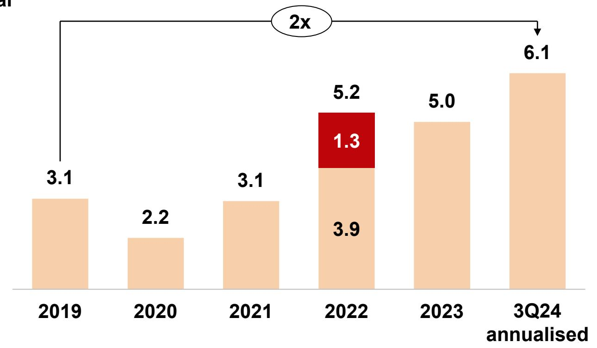

**Ordinary dividends have doubled since 2019 to an annualised \$6.1bn, reflecting significant structural improvements of franchise**

**Dividend yield currently at 5.5%**

**Buyback programme of \$3bn another affirmation of commitment to capital management** 

#### 3Q net profit up 15% YoY to cross \$3bn

Commercial book

Citi

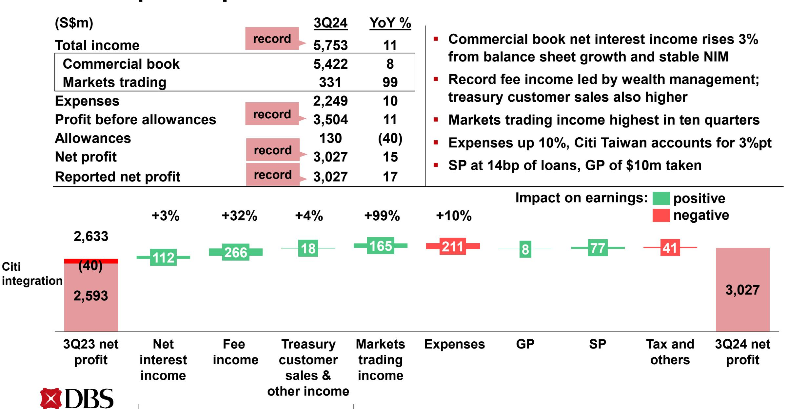

#### 3Q net profit up 8% QoQ as total income rises 5%

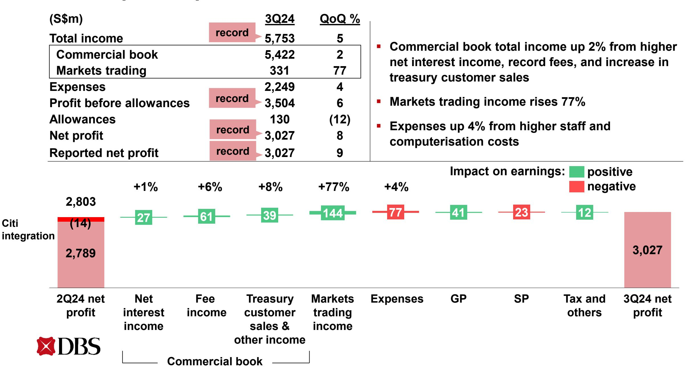

#### 9M net profit up 11% to new high

Commercial book

Citi

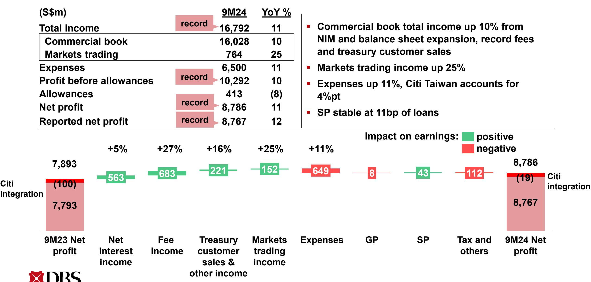

## **3Q commercial book net interest income up 1% QoQ, NIM stable at 2.83%**

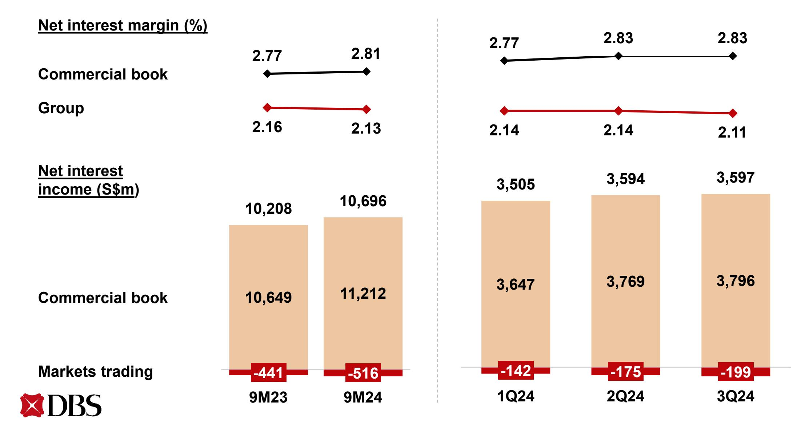

### **Loans up 1% QoQ, 2% over 9M in constant-currency terms**

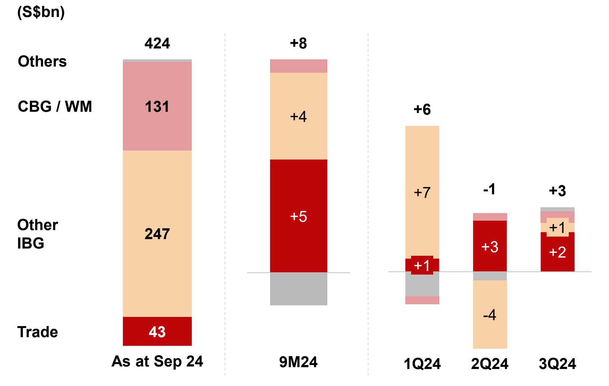

#### **In constant-currency terms**

- **3Q loans up 1% QoQ led by trade loans**
- **9M loans up 2% led by trade loans and non-trade corporate loans**

**Constant-currency change**

Gross loans 9

## **Deposits up 2% QoQ in constant-currency terms from Casa inflows, some of which were transitory**

**Constant-currency change**

## **3Q and 9M fee income rises to record led by wealth management**

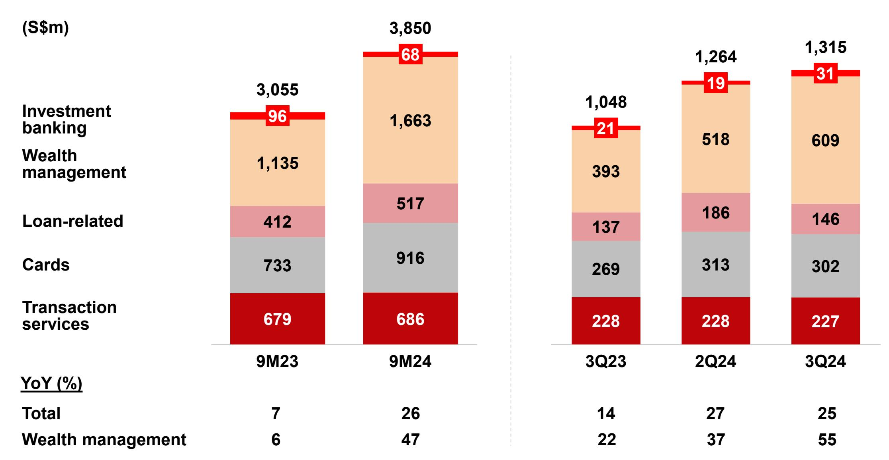

Gross fee income

## **3Q commercial book non-interest income up 21% YoY, 9M up 23% to record**

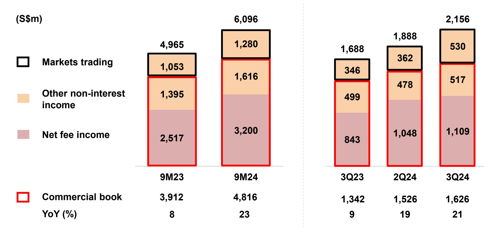

## **Record 3Q and 9M Wealth Management income from AUM inflows and conversion to investments**

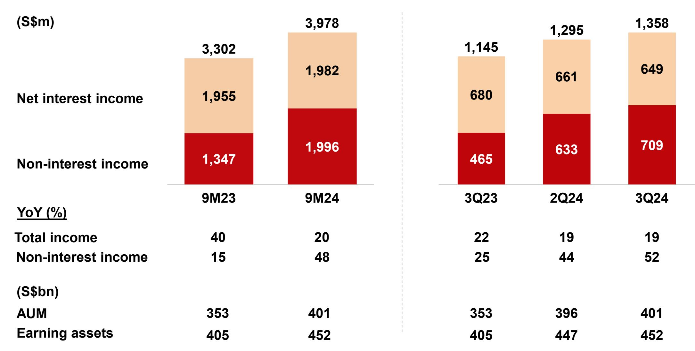

## **3Q and 9M cost-income ratio stable at 39%**

## **NPA declines 8% QoQ contributed by repayment of recent cases**

| (S\$m)                                    | 9M23  | 9M24  | 1Q24  | 2Q24  | 3Q24  |
|-------------------------------------------|-------|-------|-------|-------|-------|
| NPAs at start of period                   | 5,125 | 5,056 | 5,056 | 5,221 | 5,077 |
| IBG and others                            | (173) | (291) | 75    | (152) | (214) |
| New NPAs                                  | 588   | 739   | 317   | 191   | 452   |
| Upgrades, settlements and recoveries      | (585) | (775) | (196) | (308) | (491) |
| Write-offs                                | (176) | (255) | (46)  | (35)  | (175) |
| CBG / WM                                  | 23    | 25    | 43    | 5     | (23)  |
| Translation                               | 2     | (110) | 47    | 3     | (160) |
| NPAs at end of period                     | 4,977 | 4,680 | 5,221 | 5,077 | 4,680 |
| Citi Taiwan                               | 326   | -     | -     | -     | -     |
| NPAs at end of period incl Citi Taiwan | 5,303 | 4,680 | 5,221 | 5,077 | 4,680 |
| NPL ratio (%)                             | 1.2   | 1.0   | 1.1   | 1.1   | 1.0   |

### **9M SP stable at 11bp of loans**

| (S\$m)                 | 9M23 | 9M24 | 1Q24 | 2Q24 | 3Q24 |
|------------------------|------|------|------|------|------|
| IBG and others         | 195  | 37   | 5    | (11) | 43   |
| Add charges for        | 337  | 258  | 54   | 50   | 168  |
| New NPLs               | 224  | 217  | 45   | 29   | 147  |
| Existing NPLs          | 113  | 41   | 9    | 21   | 21   |
| Subtract charges for   | 142  | 221  | 49   | 61   | 125  |
| Upgrades               | 5    | 16   | 0    | 15   | 1    |
| Settlements            | 106  | 139  | 40   | 38   | 75   |
| Recoveries             | 31   | 66   | 9    | 8    | 49   |
| CBG / WM               | 156  | 306  | 96   | 100  | 110  |
| SP charges for loans   | 351  | 343  | 101  | 89   | 153  |
| Other credit exposures | 23   | (11) | 14   | 8    | (33) |
| Total SP charges       | 374  | 332  | 115  | 97   | 120  |
| SP / loans (bp)        | 11   | 11   | 10   | 8    | 14   |

| 1Q24 | 2Q24 | 3Q24 |
|------|------|------|
| 5    | (11) | 43   |
| 54   | 50   | 168  |
| 45   | 29   | 147  |
| 9    | 21   | 21   |
| 49   | 61   | 125  |
| 0    | 15   | 1    |
| 40   | 38   | 75   |
| 9    | 8    | 49   |
| 96   | 100  | 110  |
| 101  | 89   | 153  |
| 14   | 8    | (33) |
| 115  | 97   | 120  |
| 10   | 8    | 14   |

### **Allowance coverage rises to 135%**

#### **Strong CET-1 and leverage ratios**

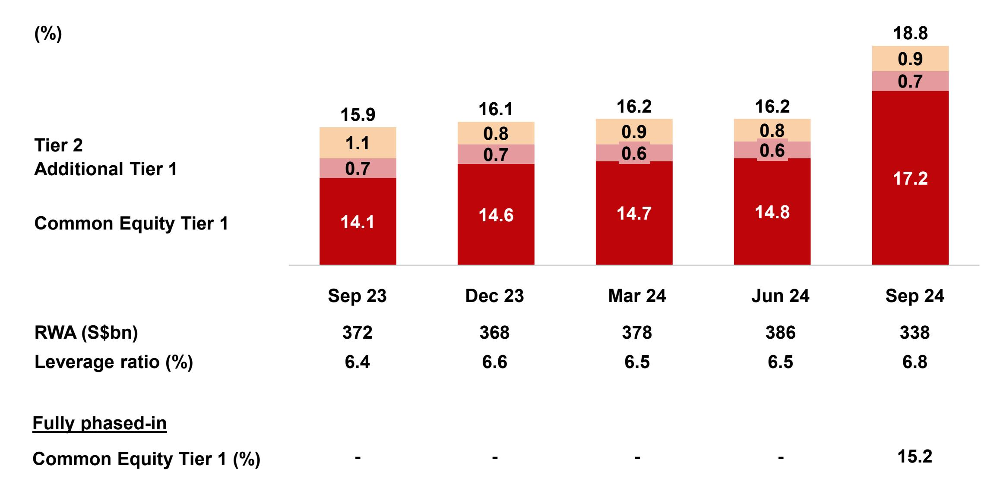

## **3Q dividend at 54 cents per share**

**(S¢ per share)**

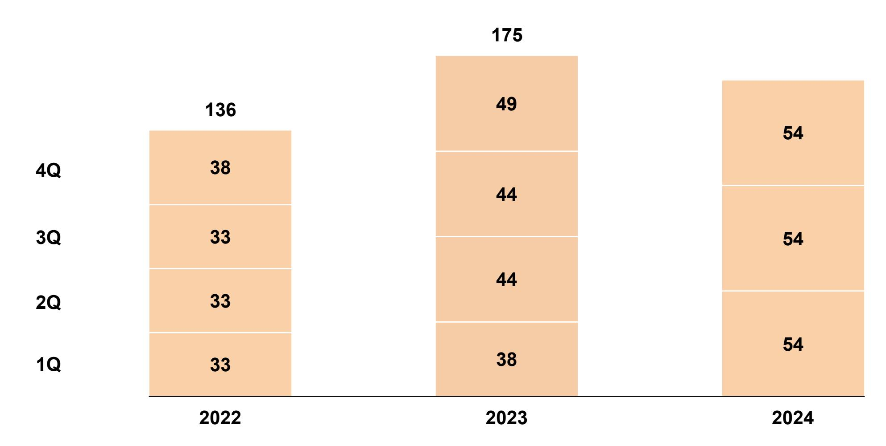

#### **In summary**

**Achieved another record performance in the third quarter and nine months**

**Commercial book net interest margin supported by reduced interest rate sensitivity while wealth management drove fee income to new high**

**New buyback programme another affirmation of commitment to capital management, underpinned by strong capital position and earnings generation**

**Remain well positioned to continue delivering healthy shareholder returns**

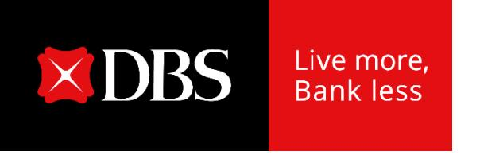

# **Record quarterly and nine-month performance**

**DBS Group Holdings 3Q 2024 financial results November 7, 2024**