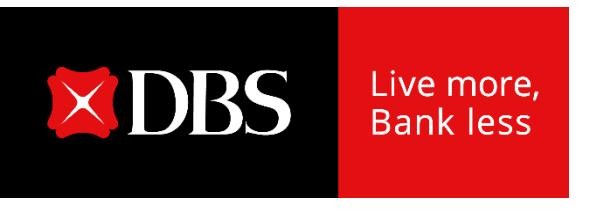

# **CEO and Deputy CEO observations**

**DBS Group Holdings 4Q 2024 financial results February 10, 2025**

## **Operating trends sustained in 4Q**

- **Strong fourth quarter caps record year**
  - o 4Q total income up 10% YoY from broad-based growth
- **Healthy loan demand**
  - o Growth led by non-trade corporate loans, partially offset by high repayments
- **Lower deposit costs from rate cuts and Casa inflows**
- **Group NIM rises 4bp QoQ to 2.15%**
  - o Lower funding cost and accounting asymmetry for markets trading more than offset commercial book NIM decline of 6bp due to lower interest rates
  - o NII up 4% from higher NIM and balance sheet growth

## **Operating trends sustained in 4Q**

- **Strong wealth management momentum sustained**
  - o Fees and treasury customer sales growth led by wealth management
  - o NNM sustained around recent quarter levels, AUM at new high
- **Expense growth well managed, cost-income ratio stable YoY**
- **Asset quality sound**
  - o Higher 4Q SP due to lower recoveries and repayments

## **2025 outlook**

- **Group net interest income slightly above 2024 levels based on two rate cuts in 2H25**
  - o Slight decline in Group NIM, offset by loan growth
  - o Markets trading to benefit from lower funding cost
- **Commercial book non-interest income growth to be high-single digits**
  - o Led by growth in wealth management fees and treasury customer sales
- **Cost-income ratio to be in low-40% range**
- **SP assumed to normalise to 17-20bp**
  - o Potential for GP writebacks
- **Pretax profit to be around 2024 levels**
- **Net profit to be below 2024 levels due to global minimum tax of 15%**

#### **Distributing our earnings to stakeholders**

#### **Shareholders**

- o Quarterly ordinary dividend per share increase of 6 cents to 60 cents from 4Q, bringing annualised ordinary dividend per share going forward to \$2.40
- o Board committed to managing down excess capital over the coming three years
- o Capital Return dividend of 15 cents per share per quarter planned for financial year 2025

#### **Community**

o Another contribution of \$100 million as part of ten-year \$1 billion commitment to support vulnerable segments

#### **Employees**

o Special one-time bonus of SGD 1,0001 each to be paid to all staff except senior managers as additional reward for contribution to record performance

# **CEO and Deputy CEO observations**

**DBS Group Holdings 4Q 2024 financial results February 10, 2025**