# **Record full-year income and earnings**

**DBS Group Holdings 4Q 2024 financial results February 10, 2025**

#### **Highlights**

#### **Full-year net profit at new high of \$11.4 billion, ROE of 18.0% sustained at previous year's record**

- Total income up 10% to \$22.3 billion from broad-based growth
  - o Commercial book NIM expands 4bp to 2.80%
  - o Fee income crosses \$4 billion for the first time, led by wealth management
  - o Treasury customer sales reaches a new high
  - o Markets trading income rebounded
- Expenses increase 10%, with Citi Taiwan accounting for 3%pt. Cost-income ratio unchanged at 40%

#### **Fourth quarter net profit up 10% YoY to \$2.62 billion**

 Total income rises 10% to \$5.51 billion from broad-based growth in both commercial book and markets trading

#### **Balance sheet remains healthy**

- NPA up 4% QoQ in constant-currency terms as new NPA formation partially offset by repayments and write-offs
- SP of 20bp for 4Q and 13bp for FY
- Based on final Basel III reforms, transitional CET-1 ratio at 17.0%, fully phased-in at 15.1%

**Quarterly ordinary dividend rises to 60 cents per share, FY dividend up 27% YoY to \$2.22 Capital Return dividend of 15 cents per share per quarter to be paid out over financial year 2025** 

#### FY net profit up 11% to new high

Commercial book

#### **4Q net profit up 10% YoY**

| (S\$m)                   | 4Q24  | YoY % |
|--------------------------|-------|-------|
| Total income             | 5,505 | 10    |
| Commercial book          | 5,347 | 9     |
| Markets trading          | 158   | 40    |
| Expenses                 | 2,395 | 9     |
| Profit before allowances | 3,110 | 11    |
| Allowances               | 209   | 47    |
| Net profit               | 2,622 | 10    |
| Reported net profit      | 2,522 | 11    |
|                          |       |       |

**Commercial book**

- **Commercial book net interest income rises 5% from 2bp increase in NIM and balance sheet growth**
- **Fee income up 12% led by wealth management; treasury customer sales also higher**
- **Markets trading income rises 40% from low base**
- **Expenses up 9%, cost-income ratio stable**

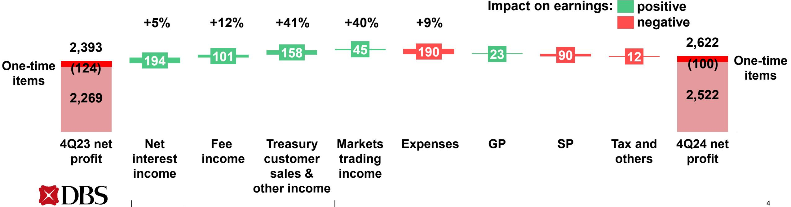

#### **4Q net profit declines 13% QoQ**

**Commercial book**

| (S\$m) Total income Markets trading Expenses Allowances Net profit | Commercial book Profit before allowances Reported net profit |                              | 4Q24 5,505 5,347 158 2,395 3,110 209 2,622 2,522 | QoQ % (4) (1) (52) 6 (11) 61 (13) (17) |  decline in NIM    |          | Commercial book net interest income up 1% as balance sheet growth more than offsets 6bp Fee income down 13% driven by seasonally slower wealth management activity Markets trading income declines 52% from high base and seasonal factors SP at 20bp, GP write-back of \$20m Impact on earnings: | positive                            |                                               |                   |
|-----------------------------------------------------------------------------------|--------------------------------------------------------------------|------------------------------|--------------------------------------------------------------------------|----------------------------------------------------------------|------------------------------------|----------|------------------------------------------------------------------------------------------------------------------------------------------------------------------------------------------------------------------------------------------------------------------------------------------------------------------------|-------------------------------------|-----------------------------------------------|-------------------|
| 3,027 3Q24 net profit                                                       | +1% 35 Net interest income                             | -13% 141 Fee income | +6% 31 Treasury customer sales & other income             | -52% 173 Markets trading income                    | +6% 146 Expenses             | 30 GP | 109 SP                                                                                                                                                                                                                                                                                                              | negative 68 Tax and others | 2,622 (100) 2,522 4Q24 net profit | One-time items |

# 4Q group net interest income up 4% QoQ, NIM up 4bp as higher markets trading more than offsets lower commercial book

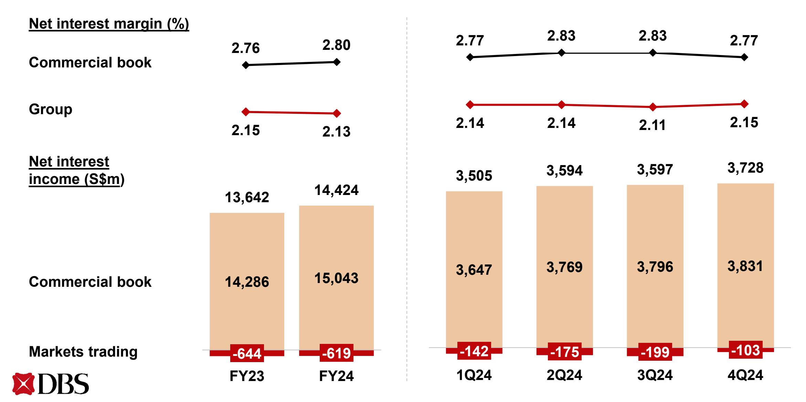

#### **Loans up 1% QoQ, 3% over FY in constant-currency terms**

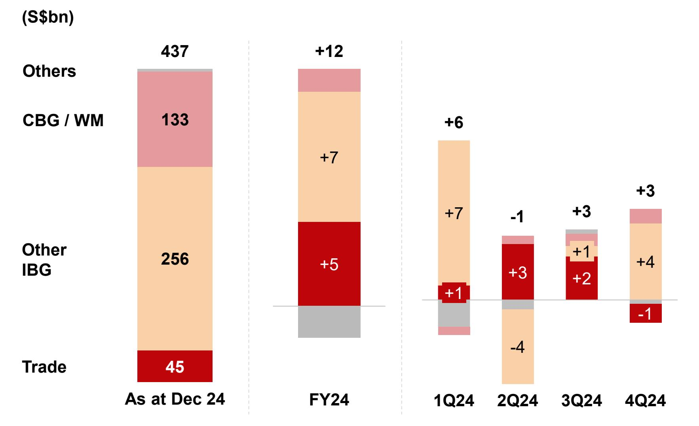

#### **In constant-currency terms**

- **4Q loans up 1% QoQ led by non-trade corporate loans**
- **FY loans up 3% led by non-trade corporate loans and trade loans**

Gross loans 7

#### **Deposits stable QoQ, up 4% over FY in constant-currency terms**

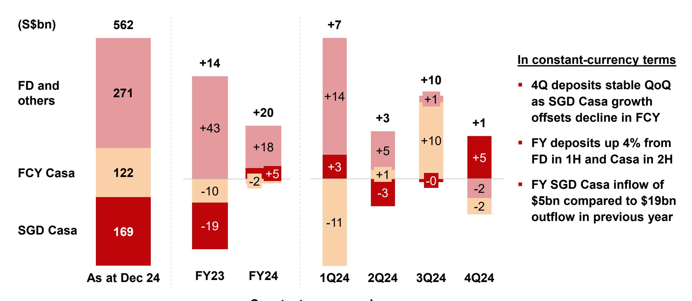

**Constant-currency change**

#### **FY fee income rises to record led by wealth management**

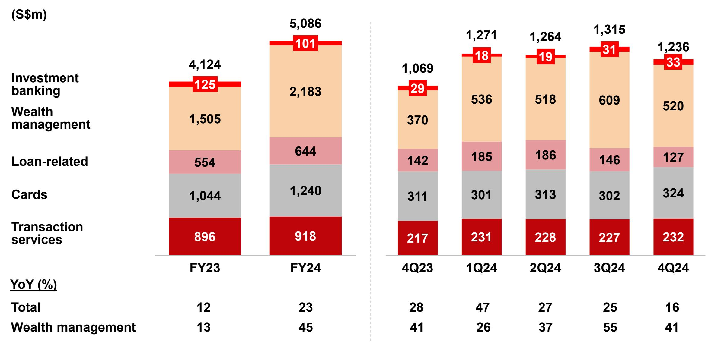

Gross fee income

# FY commercial book non-interest income up 22% from record fee income and treasury customer sales

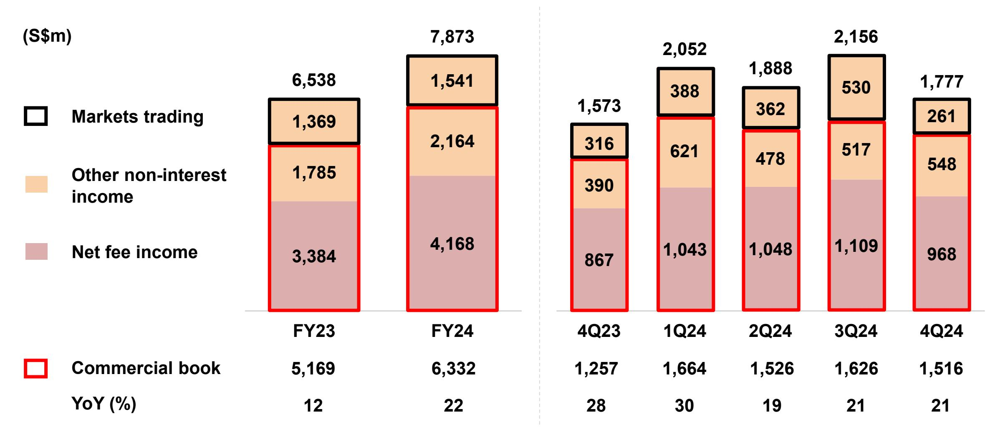

### **FY cost-income ratio unchanged at 40%**

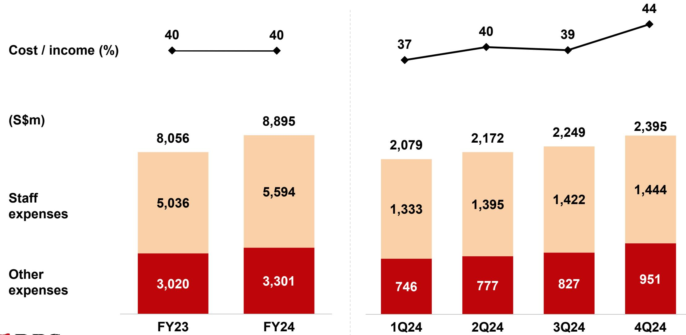

#### **FY CBG / WM income up 13%**

| (S\$m)                       | FY24   | FY23  | YoY % |
|------------------------------|--------|-------|-------|
| Total income                 | 10,155 | 8,957 | 13    |
| Loans and deposits           | 6,239  | 6,045 | 3     |
| Investment products          | 3,026  | 2,141 | 41    |
| Cards                        | 856    | 702   | 22    |
| Others                       | 34     | 69    | (51)  |
| Expenses                     | 5,273  | 4,627 | 14    |
| Profit before allowances     | 4,882  | 4,330 | 13    |
|                              |        |       |       |
| AUM (S\$bn)                  | 426    | 365   | 17    |
| SGD savings deposits (S\$bn) | 133    | 128   | 4     |

- **Total income up 13% to \$10.2bn led by higher fee income from investment product sales, bancassurance, and cards**
- **Wealth management AUM increases 17% to record \$426bn**

## **Record FY Wealth Management income from AUM inflows and conversion to investments**

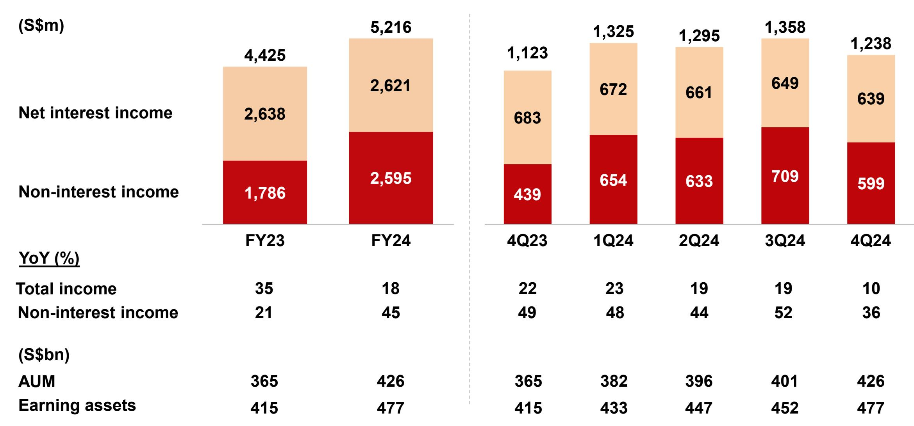

#### **FY IBG income declines 2%**

| (S\$m)                   | FY24  | FY23  | YoY % |
|--------------------------|-------|-------|-------|
| Total income             | 9,159 | 9,388 | (2)   |
| Loans                    | 3,384 | 3,384 | 0     |
| Trade                    | 638   | 666   | (4)   |
| Cash / SFS               | 4,077 | 4,329 | (6)   |
| Treasury                 | 907   | 853   | 6     |
| Investment banking       | 153   | 156   | (2)   |
| Expenses                 | 2,820 | 2,673 | 5     |
| Profit before allowances | 6,339 | 6,715 | (6)   |
|                          |       |       |       |
| Assets (S\$bn)           | 337   | 318   | 6     |
| GTS deposits (S\$bn)     | 192   | 190   | 1     |

- **Total income declines 2% to \$9.16bn**
- **Higher loan-related fees, cash management fees and treasury customer income offset by decline in net interest income**

## **FY treasury customer income up 20% to record, markets trading income rebounds**

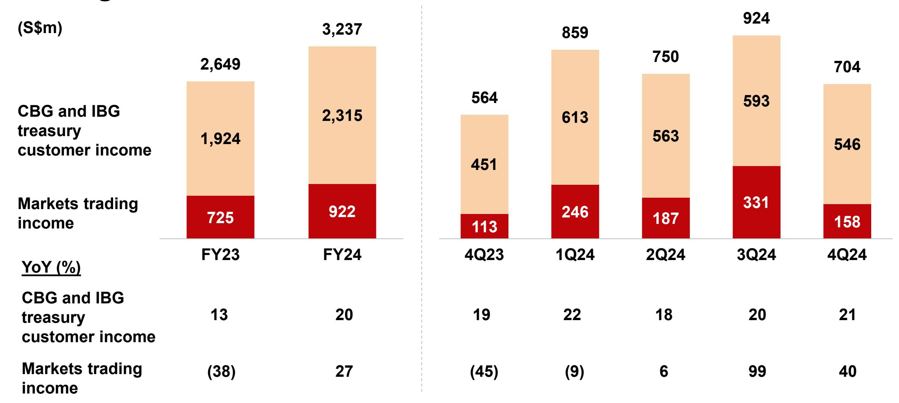

IBG and CBG treasury customer income mainly comprises fee income and other non-interest income, and includes Equity Capital Markets, DBS Vickers and DBS Digital Exchange following an internal reorganisation in 1Q24. The change has been applied retrospectively to prior-period comparatives

#### **Hong Kong FY net profit stable at \$1.6bn**

|                                              |               |                 | Constant      |                                                     |
|----------------------------------------------|---------------|-----------------|---------------|-----------------------------------------------------|
| (S\$m)                                       | FY24          | YoY %           | currency YoY% |  Total income up 6% to record, driven by        |
| Total income                                 | 3,388         | 5               | 6             | wealth management growth and rebound in             |
| Expenses                                     | 1,326         | 10              | 10            | trading income                                      |
| Profit before allowances                     | 2,062         | 2               | 3             |  Net interest income down 4% as NIM declines    |
| Allowances                                   | 152           | 10              | 11            | with sluggish loan demand                           |
| Net profit                                   | 1,597         | 1               | 1             |  SP declines to 14bp, GP of \$56m               |
| Constant-currency change YoY%:               |               |                 |               | Impact on earnings: positive                     |
| -4%                                          | +25%          | +26%            | +10%          | negative                                            |
| 91                                           | 167           | 98              | 124           | 17 56 42                                      |
| 1,578                                        |               |                 |               | 1,597                                               |
| FY23 Net Net interest profit income | Fee income | Other income | Expenses      | GP SP Tax and FY24 Net others profit |

## **NPA rises 4% QoQ in constant-currency terms as new NPA formation partially offset by repayments and write-offs**

| (S\$m)                                    | FY23  | FY24  | 1Q24  | 2Q24  | 3Q24  | 4Q24  |
|-------------------------------------------|-------|-------|-------|-------|-------|-------|
| NPAs at start of period                   | 5,125 | 5,056 | 5,056 | 5,221 | 5,077 | 4,680 |
| IBG and others                            | (311) | (210) | 75    | (152) | (214) | 81    |
|                                           |       |       |       |       |       |       |
| New NPAs                                  | 675   | 903   | 317   | 191   | 452   | 338   |
| Upgrades, settlements and recoveries      | (683) | (808) | (196) | (308) | (491) | (208) |
| Write-offs                                | (303) | (305) | (46)  | (35)  | (175) | (49)  |
|                                           |       |       |       |       |       |       |
|                                           |       |       |       |       |       |       |
| CBG / WM                                  | (1)   | 126   | 43    | 5     | (23)  | 101   |
| Translation                               | (83)  | 64    | 47    | 3     | (160) | 174   |
| NPAs at end of period                     | 4,730 | 5,036 | 5,221 | 5,077 | 4,680 | 5,036 |
|                                           |       |       |       |       |       |       |
| Citi Taiwan                               | 326   | -     | -     | -     | -     | -     |
| NPAs at end of period incl Citi Taiwan | 5,056 | 5,036 | 5,221 | 5,077 | 4,680 | 5,036 |

#### **4Q SP at 20bp, FY at 13bp**

| (S\$m)                 | FY23 | FY24 | 1Q24 | 2Q24 | 3Q24 |
|------------------------|------|------|------|------|------|
| IBG and others         | 220  | 142  | 5    | (11) | 43   |
| Add charges for        | 403  | 377  | 54   | 50   | 168  |
| New NPLs               | 245  | 278  | 45   | 29   | 147  |
| Existing NPLs          | 158  | 99   | 9    | 21   | 21   |
| Subtract charges for   | 183  | 235  | 49   | 61   | 125  |
| Upgrades               | 5    | 17   | 0    | 15   | 1    |
| Settlements            | 138  | 151  | 40   | 38   | 75   |
| Recoveries             | 40   | 67   | 9    | 8    | 49   |
| CBG / WM               | 246  | 420  | 96   | 100  | 110  |
| SP charges for loans   | 466  | 562  | 101  | 89   | 153  |
| Other credit exposures | 47   | (2)  | 14   | 8    | (33) |
| Total SP charges       | 513  | 560  | 115  | 97   | 120  |
| SP / loans (bp)        | 11   | 13   | 10   | 8    | 14   |

|  | 4Q24 |
|--|------|
|  | 106  |
|  | 124  |
|  | 88   |
|  | 36   |
|  | 18   |
|  | 1    |
|  | 16   |
|  | 1    |
|  | 113  |
|  | 219  |
|  | 9    |
|  | 228  |
|  | 20   |

#### **Allowance coverage at 129%**

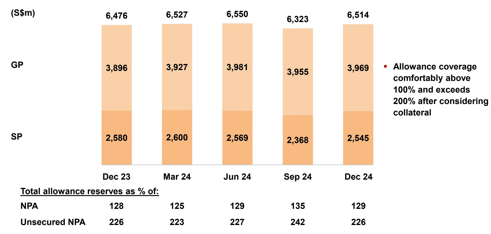

#### **Strong CET-1 and leverage ratios**

| (%)                  |        |        |        | 18.8   | 18.6   |
|----------------------|--------|--------|--------|--------|--------|
|                      |        |        |        | 0.9    | 0.9    |
|                      |        |        |        | 0.7    | 0.7    |
|                      | 16.1   | 16.2   | 16.2   |        |        |
| Tier 2               | 0.8    | 0.9    | 0.8    |        |        |
| Additional Tier 1    | 0.7    | 0.6    | 0.6    | 17.2   | 17.0   |
| Common Equity Tier 1 | 14.6   | 14.7   | 14.8   |        |        |
|                      | Dec 23 | Mar 24 | Jun 24 | Sep 24 | Dec 24 |
| RWA (S\$bn)          | 368    | 378    | 386    | 338    | 352    |
|                      |        |        |        |        |        |
| Leverage ratio (%)   | 6.6    | 6.5    | 6.5    | 6.8    | 6.7    |
|                      |        |        |        |        |        |
| Fully phased-in      |        |        |        |        |        |

## **4Q ordinary dividend at 60 cents per share, up 6 cents from previous payout**

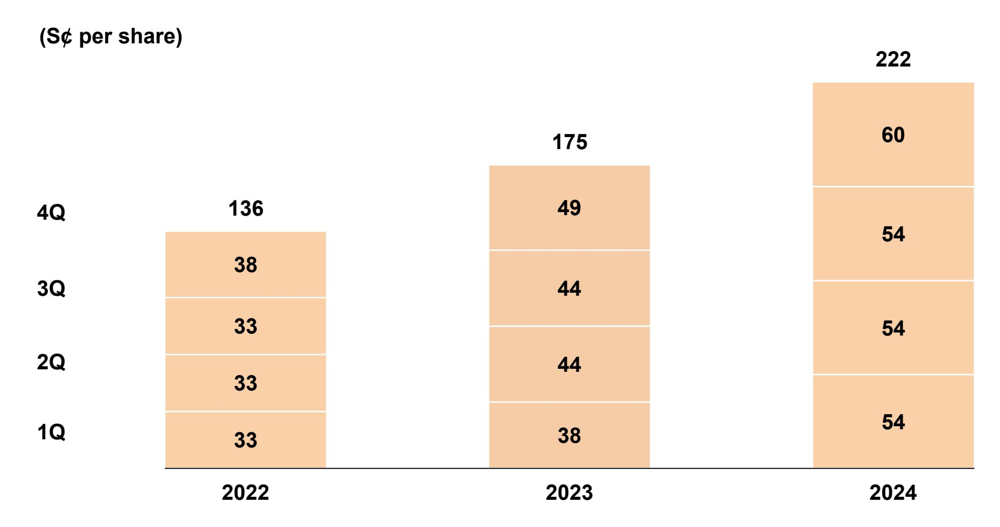

#### **In summary**

**Achieved record full-year performance with ROE of 18.0%, one of the highest among developed market banks**

**Balance sheet management supported net interest income growth, improving investor sentiment drove wealth management fees and treasury customer sales to new highs**

**Franchise and digital transformations position us to continue delivering healthy shareholder returns despite macroeconomic and geopolitical uncertainties**

## **Supplementary slides**

**DBS Group Holdings 4Q 2024 financial results February 10, 2024**

#### **FY net profit up 11% to record \$11.4bn**

| (S\$m)                                        | FY24   | FY23   | YoY % |
|-----------------------------------------------|--------|--------|-------|
| Commercial book total income                  | 21,375 | 19,455 | 10    |
| Net interest income                           | 15,043 | 14,286 | 5     |
| Net fee and commission income                 | 4,168  | 3,384  | 23    |
| Treasury customer sales and other income      | 2,164  | 1,785  | 21    |
| Markets trading income                        | 922    | 725    | 27    |
| Net interest income                           | (619)  | (644)  | 4     |
| Non-interest income                           | 1,541  | 1,369  | 13    |
| Total income                                  | 22,297 | 20,180 | 10    |
| Expenses                                      | 8,895  | 8,056  | 10    |
| Profit before allowances and amortisation     | 13,402 | 12,124 | 11    |
| Amortisation of intangible assets             | 23     | 9      | >100  |
| Allowances for credit and other losses        | 622    | 590    | 5     |
| SP                                            | 559    | 512    | 9     |
| GP                                            | 63     | 78     | (19)  |
| Share of profits/losses of associates and JVs | 250    | 214    | 17    |
| Profit before tax                             | 13,007 | 11,739 | 11    |
| Net profit                                    | 11,408 | 10,286 | 11    |
| Reported net profit                           | 11,289 | 10,062 | 12    |

#### **FY Hong Kong net profit stable at \$1.6bn**

#### **Constant-currency terms**

| (S\$m) | ) |
|--------|---|
|--------|---|

| (S\$m)                        | FY24  | FY23  | YoY % | YoY % |
|-------------------------------|-------|-------|-------|-------|
| Net interest income           | 2,076 | 2,167 | (4)   | (4)   |
| Net fee and commission income | 831   | 664   | 25    | 25    |
| Other non-interest income     | 481   | 383   | 26    | 26    |
| Total income                  | 3,388 | 3,214 | 5     | 6     |
| Expenses                      | 1,326 | 1,202 | 10    | 10    |
| Profit before allowances      | 2,062 | 2,012 | 2     | 3     |
| GP                            | 56    | (0)   | NM    | NM    |
| SP                            | 96    | 138   | (30)  | (30)  |
| Allowances                    | 152   | 138   | 10    | 11    |
| Net profit                    | 1,597 | 1,578 | 1     | 1     |

**Net interest margin (%) 1.80 1.91**

**Loan growth (%)**

Non-trade growth (%)

Trade growth (%)

**Deposit growth (%)**

#### **NPL ratio at 1.1%, allowance coverage above 100%**

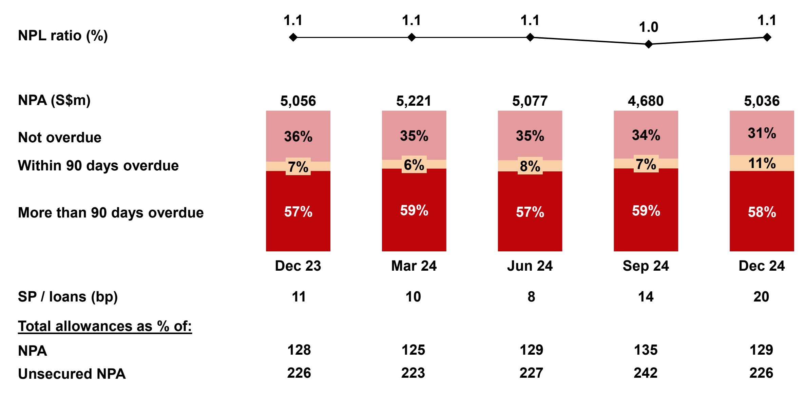

#### **Fixed income duration remains short**

| (\$m)                                   | Dec 24 |        |  |
|-----------------------------------------|--------|--------|--|
|                                         | FVOCI  | HTC    |  |
| Government securities                   | 39,295 | 24,396 |  |
| Less than 3 years                       | 30,791 | 8,581  |  |
| 3 to 5 years                            | 4,050  | 3,889  |  |
| 5 to 10 years                           | 4,117  | 11,432 |  |
| More than 10 years                      | 337    | 494    |  |
| Supranational, bank and corporate bonds | 21,748 | 47,566 |  |
| Total                                   | 61,043 | 71,962 |  |

#### **Deposits up 2% HoH and 4% YoY in constant-currency terms**

| By product  |
|-------------|
|             |
|             |
| By currency |
|             |
|             |
|             |
|             |
|             |
|             |
|             |
|             |
|             |

|                           | (S\$bn) | HoH (%)  |            | YoY (%)  |            |
|---------------------------|---------|----------|------------|----------|------------|
|                           | Dec 24  | Reported | Underlying | Reported | Underlying |
| Deposits                  | 562     | 2        | 2          | 5        | 4          |
| By product                |         |          |            |          |            |
| Casa                      | 291     | 5        | 5          | 2        | 1          |
| Fixed deposits and others | 271     | (1)      | (1)        | 9        | 7          |
| By currency               |         |          |            |          |            |
| Singapore dollar          | 205     | 4        | 4          | 7        | 7          |
| US dollar                 | 224     | 2        | 1          | 7        | 3          |
| HK dollar                 | 33      | (1)      | (1)        | 2        | (2)        |
| Chinese yuan              | 20      | (6)      | (6)        | (21)     | (21)       |
| Others                    | 80      | 0        | 2          | 6        | 9          |
| LDR (%)                   | Dec 24  |          | Jun 24     | Dec 23   |            |
| Overall                   | 77      |          | 77         | 78       |            |
| Singapore dollar          | 81      |          | 83         | 85       |            |
| US dollar                 | 49      |          | 49         | 48       |            |

#### **FY GTS income down 6% from previous year's record**

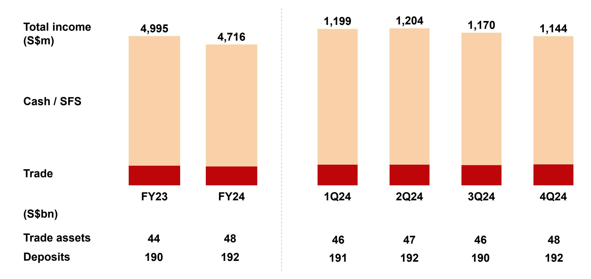

# **Record full-year income and earnings**

**DBS Group Holdings 4Q 2024 financial results February 10, 2025**