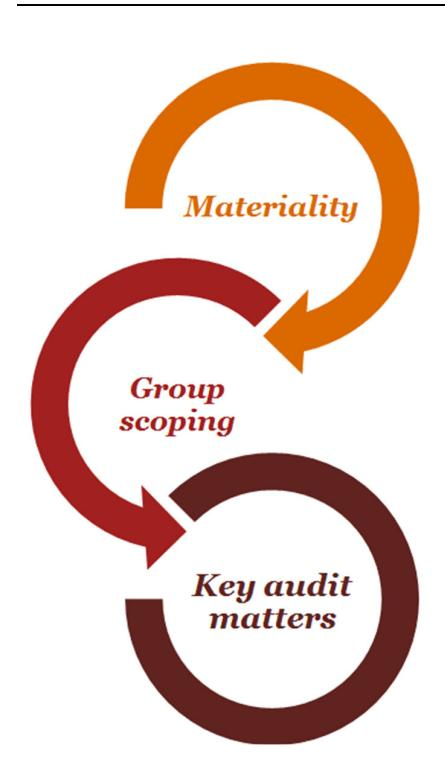

To: Shareholders

The Board of Directors of DBS Group Holdings Ltd ("DBSH" or "the Company") reports the following:

## **Financial Results for the Year Ended 31 December 2024**

Details of the financial results are in the accompanying performance summary.

## **Dividends**

For the financial year ended 31 December 2024, the Directors have recommended a final one-tier tax exempt dividend of 60 cents for each DBSH ordinary share ("FY24 Final Dividend"), subject to shareholders' approval at the Annual General Meeting to be held on 28 March 2025.

Together with the interim tax-exempt dividends of \$1.62, the total dividends for the financial year ended 31 December 2024 will be \$2.22 for each DBSH ordinary share or \$6.31 billion, an increase of 27% from the previous year.

| In \$ millions                                                      | 2024  | 2023  |
|---------------------------------------------------------------------|-------|-------|
| DBSH Ordinary shares                                                |       |       |
| Interim one-tier tax exempt dividends of \$1.62 (2023: \$1.26) # | 4,604 | 3,557 |
| Final one-tier tax exempt dividend of \$0.60 (2023: \$0.49) #    | 1,704 | 1,395 |
|                                                                     | 6,308 | 4,952 |

# Dividends prior to first-quarter 2024 were adjusted for the 1-for-10 bonus issue announced on 7 February 2024.

The DBSH Scrip Dividend Scheme will not be applied to the FY24 Final Dividend.

The DBSH ordinary shares will be quoted ex-dividend on 7 April 2025 (Monday). The FY24 Final Dividend will be payable on or about 16 April 2025 (Wednesday).

The Transfer Books and Register of Members of DBSH will be closed from 5.00 p.m. on 8 April 2025 (Tuesday) up to (and including) 9 April 2025 (Wednesday) for the purpose of determining shareholders' entitlement to the FY24 Final Dividend.

By order of the Board

Marc Tan Group Secretary

10 February 2025 Singapore

*More information on the above announcement is available at www.dbs.com/investor*

…DBS/ DBS Group Holdings Ltd 12 Marina Boulevard DBS Asia Central @ Marina Bay Financial Centre Tower 3 Singapore 018982

Tel: 65.6878 8888

[www.dbs.com](http://www.dbs.com/)

Financial Results For the Year Ended 31 December 2024

| Contents                                                                                                       | Page |
|----------------------------------------------------------------------------------------------------------------|------|
| Overview                                                                                                       | 2    |
| Financial Review                                                                                               |      |
| Net Interest Income                                                                                            | 8    |
| Net Fee and Commission Income                                                                                  | 10   |
| Other Non-Interest Income                                                                                      | 10   |
| Expenses                                                                                                       | 11   |
| Allowances for Credit and Other Losses                                                                         | 11   |
| Performance by Business Segments                                                                               | 12   |
| Performance by Geography                                                                                       | 16   |
| Customer Loans                                                                                                 | 20   |
| Non-Performing Assets and Loss Allowance Coverage                                                              | 21   |
| Customer Deposits                                                                                              | 24   |
| Debts Issued                                                                                                   | 24   |
| Capital Adequacy                                                                                               | 25   |
| Unrealised Property Valuation Surplus                                                                          | 25   |
| Financial Statements                                                                                           |      |
| Audited Consolidated Income Statement                                                                          | 26   |
| Audited Consolidated Statement of Comprehensive Income                                                         | 27   |
| Audited Balance Sheets                                                                                         | 28   |
| Audited Consolidated Statement of Changes in Equity                                                            | 29   |
| Audited Statement of Changes in Equity                                                                         | 31   |
| Audited Consolidated Cash Flow Statement                                                                       | 33   |
| Other Financial Information                                                                                    | 34   |
| Additional Information                                                                                         |      |
| Share Capital                                                                                                  | 35   |
| Interested Party Transactions Pursuant to Listing Rule 920(1)                                                  | 35   |
| Confirmation of Directors and Executive Officers' Undertakings Pursuant to Listing Rule 720(1)                 | 35   |
| Report of Persons Occupying Managerial Positions who are Related to a Director, CEO or Substantial Shareholder | 35   |
| Attachment: Independent Auditor's Report                                                                       |      |

## **OVERVIEW**

DBS Group Holdings Ltd ("DBSH") prepares its consolidated DBSH Group ("Group") financial statements in accordance with Singapore Financial Reporting Standards (International) ("SFRS(I)"). The accounting policies and methods of computation applied for the current financial periods are consistent with those applied for the financial year ended 31 December 2023. The amendments and interpretations effective from 1 January 2024 do not have a significant impact on the Group's financial statements.

|                                                                         | 2nd Half 2024 | 2nd Half 2023 | % chg | 1st Half 2024 | % chg | Year 2024 | Year 2023 | % chg |
|-------------------------------------------------------------------------|------------------|------------------|----------|------------------|----------|--------------|--------------|----------|
| Selected income statement items (\$m)                                   |                  |                  |          |                  |          |              |              |          |
| Commercial book total income                                            | 10,769           | 9,920            | 9        | 10,606           | 2        | 21,375       | 19,455       | 10       |
| Net interest income                                                     | 7,627            | 7,321            | 4        | 7,416            | 3        | 15,043       | 14,286       | 5        |
| Net fee and commission income                                           | 2,077            | 1,710            | 21       | 2,091            | (1)      | 4,168        | 3,384        | 23       |
| Treasury customer sales and other income                                | 1,065            | 889              | 20       | 1,099            | (3)      | 2,164        | 1,785        | 21       |
| Markets trading Income                                                  | 489              | 279              | 75       | 433              | 13       | 922          | 725          | 27       |
| Net interest income1                                                    | (302)            | (383)            | 21       | (317)            | 5        | (619)        | (644)        | 4        |
| Non-interest income                                                     | 791              | 662              | 19       | 750              | 5        | 1,541        | 1,369        | 13       |
| Total income                                                            | 11,258           | 10,199           | 10       | 11,039           | 2        | 22,297       | 20,180       | 10       |
| Expenses                                                                | 4,644            | 4,243            | 9        | 4,251            | 9        | 8,895        | 8,056        | 10       |
| Profit before allowances and amortisation                               | 6,614            | 5,956            | 11       | 6,788            | (3)      | 13,402       | 12,124       | 11       |
| Amortisation of intangible assets                                       | 11               | 9                | 22       | 12               | (8)      | 23           | 9            | >100     |
| Allowances for credit and other losses                                  | 339              | 357              | (5)      | 283              | 20       | 622          | 590          | 5        |
| ECL Stage 3 (SP)                                                        | 349              | 336              | 4        | 210              | 66       | 559          | 512          | 9        |
| ECL Stage 1 and 2 (GP)                                                  | (10)             | 21               | NM       | 73               | NM       | 63           | 78           | (19)     |
| Share of profits/losses of associates and JVs                           | 136              | 109              | 25       | 114              | 19       | 250          | 214          | 17       |
| Profit before tax                                                       | 6,400            | 5,699            | 12       | 6,607            | (3)      | 13,007       | 11,739       | 11       |
| Net profit                                                              | 5,649            | 5,026            | 12       | 5,759            | (2)      | 11,408       | 10,286       | 11       |
| Citi Integration                                                        | -                | (64)             | NM       | (19)             | NM       | (19)         | (124)        | 85       |
| Provision for CSR2                                                      | (100)            | (100)            | -        | -                | NM       | (100)        | (100)        | -        |
| Reported net profit                                                     | 5,549            | 4,862            | 14       | 5,740            | (3)      | 11,289       | 10,062       | 12       |
| Selected balance sheet items (\$m)                                      |                  |                  |          |                  |          |              |              |          |
| Customer loans                                                          | 430,594          | 416,163          | 3        | 424,837          | 1        | 430,594      | 416,163      | 3        |
| Constant-currency change                                                |                  |                  | 3        |                  | 2        |              |              | 3        |
| Total assets                                                            | 827,219          | 739,301          | 12       | 790,111          | 5        | 827,219      | 739,301      | 12       |
| of which: Non-performing assets                                         | 5,036            | 5,056            | (0)      | 5,077            | (1)      | 5,036        | 5,056        | (0)      |
| Customer deposits                                                       | 561,730          | 535,103          | 5        | 551,088          | 2        | 561,730      | 535,103      | 5        |
| Constant-currency change                                                |                  |                  | 4        |                  | 2        |              |              | 4        |
| Total liabilities                                                       | 758,386          | 677,054          | 12       | 724,617          | 5        | 758,386      | 677,054      | 12       |
| Shareholders' funds                                                     | 68,786           | 62,065           | 11       | 65,301           | 5        | 68,786       | 62,065       | 11       |
| Key financial ratios (%)3,4                                             |                  |                  |          |                  |          |              |              |          |
| Net interest margin – Group1                                            | 2.13             | 2.16             |          | 2.14             |          | 2.13         | 2.15         |          |
| Net interest margin – Commercial Book                                   | 2.80             | 2.78             |          | 2.80             |          | 2.80         | 2.76         |          |
| Cost/ income ratio                                                      | 41.3             | 41.6             |          | 38.5             |          | 39.9         | 39.9         |          |
| Return on assets                                                        | 1.41             | 1.33             |          | 1.50             |          | 1.45         | 1.38         |          |
| Return on equity5,6                                                     | 17.2             | 17.1             |          | 18.8             |          | 18.0         | 18.0         |          |
| NPL ratio                                                               | 1.1              | 1.1              |          | 1.1              |          | 1.1          | 1.1          |          |
|                                                                         |                  |                  |          |                  |          |              |              |          |
|                                                                         |                  |                  |          |                  |          |              |              |          |
| Total allowances/ NPA                                                   | 129              | 128              |          | 129              |          | 129          | 128          |          |
| Total allowances/ unsecured NPA                                         | 226              | 226              |          | 227              |          | 226          | 226          |          |
| SP for loans/ average loans (bp) Common Equity Tier 1 (CET-1) ratio7 | 17 17.0       | 14 14.6       |          | 9 14.8        |          | 13 17.0   | 11 14.6   |          |

|                             | 2nd Half 2024 | 2nd Half 2023 | % chg | 1st Half 2024 | % chg | Year 2024 | Year 2023 | % chg |
|-----------------------------|------------------|------------------|----------|------------------|----------|--------------|--------------|----------|
| Per share data (\$)4,9      |                  |                  |          |                  |          |              |              |          |
| Per basic and diluted share |                  |                  |          |                  |          |              |              |          |
| – earnings3                 | 3.92             | 3.49             |          | 4.05             |          | 3.98         | 3.60         |          |
| – reported earnings         | 3.89             | 3.43             |          | 4.04             |          | 3.94         | 3.52         |          |
| – net book value6           | 23.38            | 21.03            |          | 22.12            |          | 23.38        | 21.03        |          |

#### Notes:

- 1 Income from perpetual securities, which have stated coupon rates, was reclassified from Markets Trading non-interest income to Markets Trading net interest income with effect from first-quarter 2024 to better align the income of these securities with its associated funding. The reclassification was applied prospectively. For second-half 2024, \$103 million was reclassified, bringing the full year 2024 amount to \$213 million with a NIM impact of +1.5 basis points. The comparative amount of \$237 million for full year 2023 continued to be classified as Markets Trading non-interest income
- 2 Refers to Corporate Social Responsibility (CSR) commitment to DBS Foundation and other charitable causes
- 3 Excludes impact arising from Citi Integration and Provision for CSR
- 4 Return on assets, return on equity, ECL Stage 3 (SP) for loans/average loans and per share data are computed on an annualised basis
- 5 Calculated based on net profit attributable to the shareholders net of dividends on other equity instruments
- 6 Non-controlling interests and other equity instruments are not included as equity in the computation
- 7 CET-1 ratio as at 31 Dec 2024 was computed based on the Basel III reforms implemented from 1 July 2024 under transitional arrangements
- 8 Calculated based on the Basel III reforms output floor at 72.5% when fully phased-in on 1 January 2029
- 9 The weighted average number of ordinary shares used for per share data computation have been adjusted retrospectively for the 258 million bonus shares issued on 26 April 2024 as if the bonus issue had occurred on 1 January 2023

NM Not Meaningful

NA Not Applicable

## **DBS GROUP HOLDINGS LTD AND ITS SUBSIDIARIES 4th Qtr 2024 4th Qtr 2023 % chg 3rd Qtr 2024 % chg Selected income statement items (\$m) Commercial book total income 5,347** 4,894 9 5,422 (1) Net interest income **3,831** 3,637 5 3,796 1 Net fee and commission income **968** 867 12 1,109 (13) Treasury customer sales and other income **548** 390 41 517 6 **Markets trading Income 158** 113 40 331 (52) Net interest income1 **(103)** (203) 49 (199) 48 Non-interest income **261** 316 (17) 530 (51) **Total income 5,505** 5,007 10 5,753 (4) Expenses **2,395** 2,205 9 2,249 6 Profit before allowances and amortisation **3,110** 2,802 11 3,504 (11) Amortisation of intangible assets **5** 9 (44) 6 (17) Allowances for credit and other losses **209** 142 47 130 61 ECL Stage 3 (SP) **229** 139 65 120 91 ECL Stage 1 and 2 (GP) **(20)** 3 NM 10 NM Share of profits/losses of associates and JVs **70** 47 49 66 6 **Profit before tax 2,966** 2,698 10 3,434 (14) **Net profit 2,622** 2,393 10 3,027 (13) Citi Integration **-** (24) NM - - Provision for CSR2 (100) (100) - - NM **Reported net profit 2,522** 2,269 11 3,027 (17) **Selected balance sheet items (\$m)** Customer loans **430,594** 416,163 3 418,068 3 *Constant-currency change 3 1* Total assets **827,219** 739,301 12 789,609 5 *of which:* Non-performing assets **5,036** 5,056 (0) 4,680 8 Customer deposits **561,730** 535,103 5 544,961 3 *Constant-currency change 4 0* Total liabilities **758,386** 677,054 12 722,154 5 Shareholders' funds **68,786** 62,065 11 67,266 2 **Key financial ratios (%)**3,4 Net interest margin – Group1 **2.15** 2.13 2.11 Net interest margin – Commercial Book **2.77** 2.75 2.83 Cost/ income ratio **43.5** 44.0 39.1 Return on assets **1.30** 1.28 1.52 Return on equity5,6 **15.8** 16.1 18.7 NPL ratio **1.1** 1.1 1.0 Total allowances/ NPA **129** 128 135 Total allowances/ unsecured NPA **226** 226 242

SP for loans/ average loans (bp) **20** 11 14 Common Equity Tier 1 (CET-1) ratio7 **17.0** 14.6 17.2 Fully phased-in CET-1 ratio8 **15.1** NA 15.2

|                             | 4th Qtr 2024 | 4th Qtr 2023 | % chg | 3rd Qtr 2024 | % chg |
|-----------------------------|-----------------|-----------------|----------|-----------------|----------|
| Per share data (\$)4,9      |                 |                 |          |                 |          |
| Per basic and diluted share |                 |                 |          |                 |          |
| – earnings3                 | 3.64            | 3.32            |          | 4.21            |          |
| – reported earnings         | 3.60            | 3.27            |          | 4.21            |          |
| – net book value6           | 23.38           | 21.03           |          | 22.81           |          |

#### Notes:

- 1 Income from perpetual securities, which have stated coupon rates, was reclassified from Markets Trading non-interest income to Markets Trading net interest income with effect from first-quarter 2024 to better align the income of these securities with its associated funding. The reclassification was applied prospectively. For fourth-quarter and third-quarter 2024, \$51 million and \$52 million were reclassified, and the impact to 4Q24 and 3Q24 Group NIM was +1.4 basis points. The comparative amount of \$58 million for fourth-quarter 2023 continued to be classified as Markets Trading non-interest income
- 2 Refers to Corporate Social Responsibility (CSR) commitment to DBS Foundation and other charitable causes
- 3 Excludes impact arising from Citi Integration and Provision for CSR
- 4 Return on assets, return on equity, ECL Stage 3 (SP) for loans/average loans and per share data are computed on an annualised basis
- 5 Calculated based on net profit attributable to the shareholders net of dividends on other equity instruments
- 6 Non-controlling interests and other equity instruments are not included as equity in the computation
- 7 CET-1 ratio as at 31 Dec 2024 and 30 Sep 2024 were computed based on the Basel III reforms implemented from 1 July 2024 under transitional arrangements
- 8 Calculated based on the Basel III reforms output floor at 72.5% when fully phased-in on 1 January 2029
- 9 The weighted average number of ordinary shares used for per share data computation have been adjusted retrospectively for the 258 million bonus shares issued on 26 April 2024 as if the bonus issue had occurred on 1 January 2023

NM Not Meaningful

NA Not Applicable

## **Second Half**

Second-half net profit grew 12% from a year ago to \$5.65 billion, with return on equity of 17.2%. Total income grew 10% to a record \$11.3 billion for a half-year period from broad-based growth in commercial book net interest income, fee income, treasury customer sales and markets trading income. The cost-income ratio was stable at 41%. The NPL ratio was unchanged at 1.1%, and specific allowances were 17 basis points of loans.

Commercial book net interest income increased 4% to \$7.63 billion driven by a two-basis-point expansion in net interest margin to 2.80% and balance sheet growth. Loans increased 3% or \$12 billion in constant-currency terms to \$431 billion from non-trade corporate loans and trade loans. Housing and other consumer loans were little changed. Deposits rose 4% or \$20 billion to \$562 billion in constant-currency terms. The increase was driven by fixed deposits in the first half of the year, and by Casa inflows in the second half.

Commercial book net fee income grew 21% to \$2.08 billion. The increase was led by wealth management fees, which rose 48% to \$1.13 billion from broad-based growth in investment products and bancassurance. Card fees grew 8% to \$626 million from higher spending. The consolidation of Citi Taiwan also contributed to the growth of wealth management and card fees. Transaction services and investment banking fees were also higher. The increases were moderated by a 2% decline in loanrelated fees.

Commercial book other non-interest income rose 20% to \$1.07 billion from higher treasury customer sales and property disposal gains.

Markets trading income rebounded 75% to \$489 million as FX, interest rate and equity derivative activities benefited from market volatility.

Expenses were 9% higher at \$4.64 billion led by staff costs. Citi Taiwan accounted for one percentage point of the increase. The cost-income ratio was stable at 41%.

Profit before allowances increased 11% to \$6.61 billion.

Specific allowances rose to \$349 million or 17 basis points of loans. General allowances of \$10 million were written back. Non-performing assets were stable at \$5.04 billion. The NPL ratio was unchanged at 1.1%.

The Group remained well-capitalised and highly liquid. The reported Common Equity Tier-1 ratio was 17.0% based on transitional arrangements, while the pro-forma ratio on a fully phased-in basis was 15.1%. The leverage ratio of 6.7%, liquidity coverage ratio of 147% and the net stable funding ratio of 115% were all comfortably above regulatory requirements.

Compared to the first half, net profit fell 2%. Total income increased 2% as higher commercial book net interest income and markets trading income were partially offset by the impact of seasonally lower fee income and treasury customers sales in the fourth quarter. Expenses rose 9%. Total allowances were 20% higher with an increase in

specific allowances partially offset by lower general allowances.

#### **Fourth Quarter**

Net profit rose 10% from a year ago to \$2.62 billion. Total income rose 10% to \$5.51 billion from growth in both the commercial book and markets trading. The cost-income ratio was stable. Specific allowances were 20 basis points of loans while general allowances of \$20 million were written back. Compared to the previous quarter, net profit declined 13% from seasonally lower non-interest income and increases in expenses and allowances.

Commercial book net interest income rose 5% from a year ago to \$3.83 billion from a two-basis-point increase in net interest margin to 2.77% and from balance sheet growth. Compared to the previous quarter, net interest income rose 1% as balance sheet growth more than offset a sixbasis-points decline in net interest margin due to lower interest rates.

Commercial book net fee income grew 12% from the previous year to \$968 million. The growth was led by a 41% increase in wealth management fees. Card, transaction service and investment banking fees were also higher. The increases were moderated by a 11% decline in loan-related fees. Compared to the previous quarter, commercial book net fee income fell 13% from seasonally slower wealth management activity and a decline in loanrelated fees.

Commercial book other non-interest income grew 41% from a year ago to \$548 million due to higher treasury customer sales and property disposal gains. Other noninterest income rose 6% from the previous quarter from property disposal gains.

Markets trading income rose 40% to \$158 million from the low base a year ago. It fell 52% from the previous quarter's high base and seasonal factors.

Expenses rose 9% from the previous year to \$2.40 billion. Compared to the previous quarter, expenses were 6% higher.

Specific allowances for the fourth quarter were \$229 million or 20 basis points of loans. General allowances of \$20 million were written back.

## **Full Year**

Full-year net profit rose 11% to \$11.4 billion, with return on equity of 18.0%. Total income grew 10% to \$22.3 billion as commercial book net interest margin expanded, fee income crossed \$4 billion for the first time, treasury customer sales reached a new high and markets trading income rebounded. The cost-income ratio was unchanged at 40%. Asset quality was sound with specific allowances at 13 basis points of loans.

As part of DBS's CSR commitment of up to \$1 billion over 10 years to support vulnerable communities, \$100 million was set aside from the year's profits.

#### **NET INTEREST INCOME**

| In \$m                                | 2nd Half 2024 | 2nd Half 2023 | 1st Half 2024 | Year 2024 | Year 2023 |
|---------------------------------------|---------------|---------------|---------------|-----------|-----------|
| Net interest income (NII)             | 7,325         | 6,938         | 7,099         | 14,424    | 13,642    |
| Less: Markets Trading                 | (302)         | (383)         | (317)         | (619)     | (644)     |
| Commercial Book NII                   | 7,627         | 7,321         | 7,416         | 15,043    | 14,286    |
| Average interest-bearing assets (IBA) | 683,738       | 637,150       | 668,473       | 676,148   | 634,435   |
| Less: Markets Trading                 | 141,226       | 115,053       | 135,392       | 138,325   | 117,744   |
| Commercial Book average IBA           | 542,512       | 522,097       | 533,081       | 537,823   | 516,691   |
| Net interest margin (%)1              | 2.13          | 2.16          | 2.14          | 2.13      | 2.15      |
| Commercial Book NIM (%)1              | 2.80          | 2.78          | 2.80          | 2.80      | 2.76      |

| Average balance sheet        | 2nd Half 2024               |                   |                        |                             | 2nd Half 2023     |                        | 1st Half 2024               |                   |                        |
|---------------------------------|-----------------------------|-------------------|------------------------|-----------------------------|-------------------|------------------------|-----------------------------|-------------------|------------------------|
|                                 | Average balance (\$m) | Interest (\$m) | Average rate (%) | Average balance (\$m) | Interest (\$m) | Average rate (%) | Average balance (\$m) | Interest (\$m) | Average rate (%) |
| Customer non-trade loans     | 380,925                     | 8,891             | 4.63                   | 379,548                     | 9,157             | 4.79                   | 383,071                     | 9,221             | 4.83                   |
| Trade assets                    | 43,260                      | 1,237             | 5.67                   | 41,626                      | 1,213             | 5.78                   | 41,390                      | 1,236             | 5.99                   |
| Interbank assets2               | 91,887                      | 1,747             | 3.77                   | 74,107                      | 1,586             | 4.25                   | 89,578                      | 1,835             | 4.11                   |
| Securities and others        | 167,666                     | 3,585             | 4.24                   | 141,869                     | 2,678             | 3.75                   | 154,434                     | 3,175             | 4.12                   |
| Interest-bearing assets      | 683,738                     | 15,460            | 4.49                   | 637,150                     | 14,634            | 4.56                   | 668,473                     | 15,467            | 4.64                   |
| Customer deposits               | 551,844                     | 5,988             | 2.15                   | 526,429                     | 5,916             | 2.23                   | 543,676                     | 6,374             | 2.35                   |
| Other borrowings                | 94,887                      | 2,147             | 4.49                   | 81,639                      | 1,780             | 4.33                   | 86,882                      | 1,994             | 4.60                   |
| Interest-bearing liabilities | 646,731                     | 8,135             | 2.50                   | 608,068                     | 7,696             | 2.51                   | 630,558                     | 8,368             | 2.66                   |
| Net interest income/margin1  |                             | 7,325             | 2.13                   |                             | 6,938             | 2.16                   |                             | 7,099             | 2.14                   |

|                                 |                             | Year 2024         |                        |                             | Year 2023         |                        |
|---------------------------------|-----------------------------|-------------------|------------------------|-----------------------------|-------------------|------------------------|
| Average balance Sheet        | Average balance (\$m) | Interest (\$m) | Average rate (%) | Average balance (\$m) | Interest (\$m) | Average rate (%) |
| Customer non-trade loans     | 381,992                     | 18,112            | 4.73                   | 375,639                     | 17,291            | 4.60                   |
| Trade assets                    | 42,330                      | 2,473             | 5.83                   | 44,173                      | 2,459             | 5.57                   |
| Interbank assets2               | 90,739                      | 3,583             | 3.94                   | 73,702                      | 3,019             | 4.10                   |
| Securities and others           | 161,087                     | 6,759             | 4.18                   | 140,921                     | 5,093             | 3.61                   |
| Interest-bearing Assets      | 676,148                     | 30,927            | 4.56                   | 634,435                     | 27,862            | 4.39                   |
| Customer deposits               | 547,782                     | 12,362            | 2.25                   | 521,947                     | 10,833            | 2.08                   |
| Other borrowings                | 90,907                      | 4,141             | 4.54                   | 82,840                      | 3,387             | 4.09                   |
| Interest-bearing Liabilities | 638,689                     | 16,503            | 2.58                   | 604,787                     | 14,220            | 2.35                   |
| Net interest income/margin1  |                             | 14,424            | 2.13                   |                             | 13,642            | 2.15                   |

1 Net interest margin is net interest income expressed as a percentage of average interest-bearing assets.

2 Includes non-restricted balances with central banks

|                                                                        |        | 2nd Half 2024 vs 2nd Half 2023 |               | 2nd Half 2024 vs 1st Half 2024 |       |               |  |  |
|------------------------------------------------------------------------|--------|--------------------------------|---------------|--------------------------------|-------|---------------|--|--|
| Volume and rate analysis (\$m) Increase/(decrease) due to change in | Volume | Rate                           | Net change | Volume                         | Rate  | Net change |  |  |
| Interest and similar income                                            |        |                                |               |                                |       |               |  |  |
| Customer non-trade loans                                               | 33     | (299)                          | (266)         | (52)                           | (375) | (427)         |  |  |
| Trade assets                                                           | 48     | (24)                           | 24            | 56                             | (67)  | (11)          |  |  |
| Interbank assets                                                       | 380    | (219)                          | 161           | 47                             | (155) | (108)         |  |  |
| Securities and others                                                  | 487    | 420                            | 907           | 272                            | 99    | 371           |  |  |
| Total                                                                  | 948    | (122)                          | 826           | 323                            | (498) | (175)         |  |  |
| Interest expense                                                       |        |                                |               |                                |       |               |  |  |
| Customer deposits                                                      | 286    | (214)                          | 72            | 96                             | (546) | (450)         |  |  |
| Other borrowings                                                       | 289    | 78                             | 367           | 184                            | (54)  | 130           |  |  |
| Total                                                                  | 575    | (136)                          | 439           | 280                            | (600) | (320)         |  |  |
| Net impact on net interest income                                      | 373    | 14                             | 387           | 43                             | 102   | 145           |  |  |
| Due to change in number of days                                        |        |                                | -             |                                |       | 81            |  |  |
| Net Interest Income                                                    |        |                                | 387           |                                |       | 226           |  |  |

|                                                                        |        | Year 2024 vs Year 2023 |               |
|------------------------------------------------------------------------|--------|------------------------|---------------|
| Volume and rate analysis (\$m) Increase/(decrease) due to change in | Volume | Rate                   | Net Change |
| Interest and similar income                                            |        |                        |               |
| Customer non-trade loans                                               | 292    | 479                    | 771           |
| Trade assets                                                           | (103)  | 109                    | 6             |
| Interbank assets                                                       | 698    | (144)                  | 554           |
| Securities and others                                                  | 729    | 919                    | 1,648         |
| Total                                                                  | 1,616  | 1,363                  | 2,979         |
| Interest expense                                                       |        |                        |               |
| Customer deposits                                                      | 536    | 959                    | 1,495         |
| Other borrowings                                                       | 330    | 413                    | 743           |
| Total                                                                  | 866    | 1,372                  | 2,238         |
| Net impact on net interest income                                      | 750    | (9)                    | 741           |
| Due to change in number of days                                        |        |                        | 41            |
| Net Interest Income                                                    |        |                        | 782           |

Second-half net interest income increased 6% from a year ago to \$7.33 billion, led by the commercial book. The increase in commercial book net interest income was due to balance sheet growth and a two-basis point rise in net interest margin to 2.80% due mainly to fixed-rate asset repricing.

Compared to the previous half, net interest income rose 3% from balance sheet growth.

For the full year, net interest income rose 6% to \$14.4 billion, led by a four-basis-point expansion in commercial book net interest margin and balance sheet growth.

## **NET FEE AND COMMISSION INCOME1**

| (\$m)                               | 2nd Half 2024 | 2nd Half 2023 | % chg | 1st Half 2024 | % chg | Year 2024 | Year 2023 | % chg |
|-------------------------------------|------------------|------------------|----------|------------------|----------|--------------|--------------|----------|
| Investment banking                  | 64               | 50               | 28       | 37               | 73       | 101          | 125          | (19)     |
| Transaction services2               | 459              | 445              | 3        | 459              | 0        | 918          | 896          | 2        |
| Loan-related                        | 273              | 279              | (2)      | 371              | (26)     | 644          | 554          | 16       |
| Cards3                              | 626              | 580              | 8        | 614              | 2        | 1,240        | 1,044        | 19       |
| Wealth management                   | 1,129            | 763              | 48       | 1,054            | 7        | 2,183        | 1,505        | 45       |
| Fee and commission income           | 2,551            | 2,117            | 21       | 2,535            | 1        | 5,086        | 4,124        | 23       |
| Less: Fee and commission expense | 474              | 407              | 16       | 444              | 7        | 918          | 740          | 24       |
| Total                               | 2,077            | 1,710            | 21       | 2,091            | (1)      | 4,168        | 3,384        | 23       |

#### Notes:

- 1 Excludes impact arising from Citi Integration
- 2 Includes trade & remittances, guarantees and deposit-related fees
- 3 Net of interchange fees paid

Second-half net fee income rose 21% from a year ago to \$2.08 billion. The increase was led by wealth management fees, which rose 48% to \$1.13 billion from broad-based growth in investment products and bancassurance. Card fees grew 8% to \$626 million from higher spending. The consolidation of Citi Taiwan also contributed to the growth of wealth management and card fees. Transaction services rose 3% to \$459 million. Investment banking fees recovered 28% to \$64 million. The increases were moderated by a 2% decline in loanrelated fees.

Net fee income decreased 1% from the previous half, due to a decline in loan-related fees and from seasonally slower wealth management activity in the fourth quarter.

For the full year, net fee income rose 23% to \$4.17 billion, led by wealth management fees, which rose 45% to a new high of \$2.18 billion. Card and loan-related fees were also higher while transaction service fees were little changed. Investment banking fees declined 19% from slower equity capital market activities.

### **OTHER NON-INTEREST INCOME**

| (\$m)                                                                                    | 2nd Half 2024 | 2nd Half 2023 | % chg | 1st Half 2024 | % chg | Year 2024 | Year 2023 | % chg |
|------------------------------------------------------------------------------------------|------------------|------------------|----------|------------------|----------|--------------|--------------|----------|
| Net trading income                                                                       | 1,648            | 1,432            | 15       | 1,733            | (5)      | 3,381        | 2,866        | 18       |
| Net income from investment securities                                                 | 72               | 87               | (17)     | 91               | (21)     | 163          | 217          | (25)     |
| Others (include rental income and gain on disposal of properties and fixed assets) | 136              | 32               | >100     | 25               | >100     | 161          | 71           | >100     |
| Total                                                                                    | 1,856            | 1,551            | 20       | 1,849            | 0        | 3,705        | 3,154        | 17       |
| Commercial book                                                                          | 1,065            | 889              | 20       | 1,099            | (3)      | 2,164        | 1,785        | 21       |
| Markets Trading                                                                          | 791              | 662              | 19       | 750              | 5        | 1,541        | 1,369        | 13       |
| Total                                                                                    | 1,856            | 1,551            | 20       | 1,849            | 0        | 3,705        | 3,154        | 17       |

Second-half other non-interest income rose 20% from a year ago to \$1.86 billion from higher treasury customer sales, higher markets trading and from property disposal gains.

Compared to the previous half, other non-interest income was stable as seasonally slower treasury customer sales in the fourth quarter and lower investment gains were offset by property disposal gains.

For the full year, other non-interest income increased 17% to \$3.71 billion from record treasury customer sales, higher markets trading and from property disposal gains.

### **EXPENSES1**

| (\$m)                                                | 2nd Half 2024 | 2nd Half 2023 | % chg | 1st Half 2024 | % chg | Year 2024 | Year 2023 | % chg |
|------------------------------------------------------|------------------|------------------|----------|------------------|----------|--------------|--------------|----------|
| Staff                                                | 2,866            | 2,606            | 10       | 2,728            | 5        | 5,594        | 5,036        | 11       |
| Occupancy                                            | 238              | 230              | 3        | 215              | 11       | 453          | 427          | 6        |
| Computerisation                                      | 729              | 655              | 11       | 606              | 20       | 1,335        | 1,220        | 9        |
| Revenue-related                                      | 283              | 245              | 16       | 253              | 12       | 536          | 446          | 20       |
| Others                                               | 528              | 507              | 4        | 449              | 18       | 977          | 927          | 5        |
| Total                                                | 4,644            | 4,243            | 9        | 4,251            | 9        | 8,895        | 8,056        | 10       |
| Staff count2 at period-end                           | 41,354           | 40,594           | 2        | 40,119           | 3        | 41,354       | 40,594       | 2        |
| Included in the above table was:                     |                  |                  |          |                  |          |              |              |          |
| Depreciation of properties and other fixed assets | 401              | 377              | 6        | 405              | (1)      | 806          | 729          | 11       |

Notes:

1 Excludes impact arising from Citi Integration and Provision for CSR

2 Measured based on full-time equivalent

Second-half expenses increased 9% from a year ago to \$4.64 billion led by an increase in staff costs. Citi Taiwan accounted for one percentage point of the increase. Compared to the previous half, expenses rose 9%.

For the full year, expenses rose 10% to \$8.90 billion with Citi Taiwan accounting for three percentage points of the increase. The cost-income ratio was unchanged at 40%.

#### **ALLOWANCES FOR CREDIT AND OTHER LOSSES**

| (\$m)                                          | 2nd Half 2024 | 2nd Half 2023 | % chg | 1st Half 2024 | % chg | Year 2024 | Year 2023 | % chg |
|------------------------------------------------|------------------|------------------|----------|------------------|----------|--------------|--------------|----------|
| ECL Stage 1 and 2 (GP)                         | (10)             | 21               | NM       | 73               | NM       | 63           | 78           | (19)     |
| ECL Stage 3 (SP) for loans1                    | 372              | 302              | 23       | 190              | 96       | 562          | 466          | 21       |
| Singapore                                      | (19)             | 146              | NM       | 54               | NM       | 35           | 168          | (79)     |
| Hong Kong                                      | 61               | 55               | 11       | 42               | 45       | 103          | 95           | 8        |
| Rest of Greater China                          | 162              | 55               | >100     | 52               | >100     | 214          | 101          | >100     |
| South and Southeast Asia                       | 86               | 38               | >100     | 50               | 72       | 136          | 94           | 45       |
| Rest of the World                              | 82               | 8                | >100     | (8)              | NM       | 74           | 8            | >100     |
| ECL Stage 3 (SP) for other credit exposures | (24)             | 33               | NM       | 22               | NM       | (2)          | 47           | NM       |
| Total ECL Stage 3 (SP)                         | 348              | 335              | 4        | 212              | 64       | 560          | 513          | 9        |
| Allowances for other assets                    | 1                | 1                | -        | - (2)         | NM       | (1)          | (1)          | -        |
| Total                                          | 339              | 357              | (5)      | 283              | 20       | 622          | 590          | 5        |

Notes:

1 SP for loans by geography are determined according to the location where the borrower is incorporated NM Not Meaningful

Second-half total allowances of \$339 million were 5% lower than the previous year and 20% higher than the previous half.

Specific allowances for loans rose 23% from a year ago to \$372 million. There was a general allowance writeback of \$10 million compared to a charge of \$21 million a year ago.

Compared to the previous half, specific allowances for loans rose 96% and was partially offset by lower general allowances.

Full-year total allowances of \$622 million rose 5% from the previous year. Specific allowances for loans were \$562 million or 13 basis points of loans and general allowances of \$63 million were taken.

#### **PERFORMANCE BY BUSINESS SEGMENTS**

| (\$m)                                         |                                              | Commercial Book          |            | Markets    | Total           |  |
|-----------------------------------------------|----------------------------------------------|--------------------------|------------|------------|-----------------|--|
|                                               | Consumer Banking/ Wealth Management | Institutional Banking | Others     | Trading    |                 |  |
| Selected income statement items1, 2           |                                              |                          |            |            |                 |  |
| 2nd Half 2024                                 |                                              |                          |            |            |                 |  |
| Net interest income                           | 3,237                                        | 3,307                    | 1,083      | (302)      | 7,325           |  |
| Net fee and commission income                 | 1,364                                        | 726                      | (13)       | -          | 2,077           |  |
| Other non-interest income                     | 495                                          | 439                      | 131        | 791        | 1,856           |  |
| Total income                                  | 5,096                                        | 4,472                    | 1,201      | 489        | 11,258          |  |
| Expenses                                      | 2,782                                        | 1,477                    | 1          | 384        | 4,644           |  |
| Amortisation of intangible assets             | -                                            | -                        | 11         | -          | 11              |  |
| Allowances for credit and other losses        | 223                                          | (12)                     | 128        | -          | 339             |  |
| Share of profits/losses of associates and JVs | -                                            | 13                       | 119        | 4          | 136             |  |
| Profit before tax                             | 2,091                                        | 3,020                    | 1,180      | 109        | 6,400           |  |
| 1st Half 2024                                 |                                              |                          |            |            |                 |  |
| Net interest income                           | 3,232                                        | 3,423                    | 761        | (317)      | 7,099           |  |
| Net fee and commission income                 | 1,313                                        | 787                      | (9)        | -          | 2,091           |  |
| Other non-interest income                     | 514                                          | 477                      | 108        | 750        | 1,849           |  |
| Total income                                  | 5,059                                        | 4,687                    | 860        | 433        | 11,039          |  |
| Expenses                                      | 2,491                                        | 1,343                    | 64         | 353        | 4,251           |  |
| Amortisation of intangible assets             | -                                            | -                        | 12         | -          | 12              |  |
| Allowances for credit and other losses        | 222                                          | 21                       | 38         | 2          | 283             |  |
| Share of profits/losses of associates and JVs | -                                            | 7                        | 109        | (2)        | 114             |  |
| Profit before tax                             | 2,346                                        | 3,330                    | 855        | 76         | 6,607           |  |
| 2nd Half 2023                                 |                                              |                          |            |            |                 |  |
| Net interest income                           | 3,269                                        | 3,584                    | 468        | (383)      | 6,938           |  |
| Net fee and commission income                 | 1,037                                        | 683                      | (10)       | -          | 1,710           |  |
| Other non-interest income                     | 379                                          | 410                      | 100        | 662        | 1,551           |  |
| Total income                                  |                                              |                          |            |            |                 |  |
| Expenses                                      | 4,685 2,470                               | 4,677 1,378           | 558 51  | 279 344 | 10,199 4,243 |  |
| Amortisation of intangible assets             | -                                            | -                        | 9          | -          | 9               |  |
| Allowances for credit and other losses        | 164                                          | 150                      | 28         | 15         | 357             |  |
| Share of profits/losses of associates and JVs |                                              |                          |            |            |                 |  |
| Profit before tax                             | - 2,051                                   | 5 3,154               | 101 571 | 3 (77)  | 109 5,699    |  |
|                                               |                                              |                          |            |            |                 |  |
| Year 2024                                     |                                              |                          |            |            |                 |  |
| Net interest income                           | 6,469                                        | 6,730                    | 1,844      | (619)      | 14,424          |  |
| Net fee and commission income                 | 2,677                                        | 1,513                    | (22)       | -          | 4,168           |  |
| Other non-interest income                     | 1,009                                        | 916                      | 239        | 1,541      | 3,705           |  |
| Total income                                  | 10,155                                       | 9,159                    | 2,061      | 922        | 22,297          |  |
| Expenses                                      | 5,273                                        | 2,820                    | 65         | 737        | 8,895           |  |
| Amortisation of intangible assets             | -                                            | -                        | 23         | -          | 23              |  |
| Allowances for credit and other losses        | 445                                          | 9                        | 166        | 2          | 622             |  |
| Share of profits/losses of associates and JVs | -                                            | 20                       | 228        | 2          | 250             |  |
| Profit before tax                             | 4,437                                        | 6,350                    | 2,035      | 185        | 13,007          |  |
| Year 2023                                     |                                              |                          |            |            |                 |  |
| Net interest income                           | 6,195                                        | 7,159                    | 932        | (644)      | 13,642          |  |
| Net fee and commission income                 | 2,004                                        | 1,393                    | (13)       | -          | 3,384           |  |
| Other non-interest income                     | 758                                          | 836                      | 191        | 1,369      | 3,154           |  |
| Total income                                  | 8,957                                        | 9,388                    | 1,110      | 725        | 20,180          |  |
| Expenses                                      | 4,627                                        | 2,673                    | 84         | 672        | 8,056           |  |
| Amortisation of intangible assets             | -                                            | -                        | 9          | -          | 9               |  |
| Allowances for credit and other losses        | 270                                          | 88                       | 217        | 15         | 590             |  |
|                                               |                                              |                          |            |            |                 |  |
| Share of profits/losses of associates and JVs | -                                            | 7                        | 200        | 7          | 214             |  |

| (\$m)                                                                                   |                                              | Commercial Book          | Markets |         |                  |
|-----------------------------------------------------------------------------------------|----------------------------------------------|--------------------------|---------|---------|------------------|
|                                                                                         | Consumer Banking/ Wealth Management | Institutional Banking | Others  | Trading | Total            |
| Selected balance sheet and other Items3                                              |                                              |                          |         |         |                  |
| 31 Dec 2024                                                                             |                                              |                          |         |         |                  |
| Total assets before goodwill and intangible assets Goodwill and intangible assets | 133,626                                      | 337,392                  | 115,431 | 234,398 | 820,847 6,372 |
| Total assets                                                                            |                                              |                          |         |         | 827,219          |
| Total liabilities                                                                       | 324,634                                      | 223,665                  | 59,331  | 150,756 | 758,386          |
| Capital expenditure for 2nd Half 2024                                                   | 102                                          | 30                       | 512     | 17      | 661              |
| Depreciation for 2nd Half 2024                                                          | 22                                           | 5                        | 372     | 2       | 401              |
| 30 Jun 2024                                                                             |                                              |                          |         |         |                  |
| Total assets before goodwill and intangible assets                                   | 133,334                                      | 331,045                  | 98,591  | 220,745 | 783,715          |
| Goodwill and intangible assets Total assets                                          |                                              |                          |         |         | 6,396 790,111 |
| Total liabilities                                                                       | 310,614                                      | 226,201                  | 53,701  | 134,101 | 724,617          |
| Capital expenditure for 1st Half 2024                                                   | 61                                           | 11                       | 177     | 6       | 255              |
| Depreciation for 1st Half 2024                                                          | 12                                           | 3                        | 389     | 1       | 405              |
| 31 Dec 2023                                                                             |                                              |                          |         |         |                  |
| Total assets before goodwill and intangible assets                                   | 134,693                                      | 317,552                  | 97,803  | 182,940 | 732,988          |
| Goodwill and intangible assets                                                          |                                              |                          |         |         | 6,313            |
| Total assets                                                                            |                                              |                          |         |         | 739,301          |
| Total liabilities                                                                       | 297,302                                      | 218,527                  | 44,640  | 116,585 | 677,054          |
| Capital expenditure for 2nd Half 2023                                                   | 100                                          | 32                       | 309     | 15      | 456              |
| Depreciation for 2nd Half 2023                                                          | 8                                            | 2                        | 365     | 2       | 377              |

1 Excludes impact arising from Citi Integration and Provision for CSR

2 In 2024, a more refined cost allocation approach was implemented. In addition, following an internal reorganisation, DBS Vickers was reported under the "Institutional Banking" segment instead of "Others". These changes, which have been applied retrospectively to prior-period comparatives, do not affect the Group's total income, expenses or net profit.

3 Refer to sections on Customer Loans and Non-Performing Assets and Loss Allowance Coverage for more information on business segments

The business segment results are prepared based on the Group's internal management reporting, which reflects its management structure. As the activities of the Group are highly integrated, internal allocations have been made in preparing the segment information. Amounts for each business segment are shown after the allocation of certain centralised costs, funding income and the application of transfer pricing, where appropriate. Transactions between segments are recorded within the segment as if they are third party transactions and are eliminated on consolidation.

The various business segments are described below:

#### **Consumer Banking/ Wealth Management**

Consumer Banking/ Wealth Management provides individual customers with a diverse range of banking and related financial services. The products and services available to customers include current and savings accounts, fixed deposits, loans and home finance, cards, payments, investment and insurance products.

Second-half profit before tax was 2% higher than a year ago at \$2.09 billion. Total income rose 9% to \$5.10 billion. Net interest income eased 1% to \$3.24 billion as the impact of a lower net interest margin was moderated by growth in loans and deposits. Non-interest income grew 31% to \$1.86 billion driven by higher fees from investment product sales, bancassurance, and cards. Expenses increased 13% to \$2.78 billion. Total allowances increased 36% to \$223 million from higher specific provisions.

Compared to the previous half year, profit before tax declined 11%. Total income was 1% higher. Net interest income was stable as the impact of a lower net interest margin was offset by growth in loans and deposits. Noninterest income grew 2% from growth in investment product sales, bancassurance and card fees. Expenses grew 12%. Total allowances remained flat.

For the full year, profit before tax increased 9% to \$4.44 billion. Total income grew 13% to \$10.2 billion augmented by the integration of Citi Taiwan. Net interest income rose 4% to \$6.47 billion from growth in loan and deposit volumes. Non-interest income grew 33% to \$3.69 billion on higher fee income from investment product sales, bancassurance, and card fees. Expenses increased 14% to \$5.27 billion. Total allowances increased 65% to \$445 million from higher specific provisions.

#### **Institutional Banking**

Institutional Banking provides financial services and products to institutional clients, including bank and nonbank financial institutions, government-linked companies, large corporates and small and medium sized businesses. Products and services comprise the full range of credit facilities from short-term working capital financing to specialised lending. It also provides global transactional services such as cash management, trade finance and securities and fiduciary services; treasury and markets products; corporate finance and advisory banking as well as capital markets solutions.

Compared to a year ago, second-half profit before tax fell 4% to \$3.02 billion. Total income was 4% lower at \$4.47 billion. Net interest income fell 8% to \$3.31 billion from a lower net interest margin. Non-interest income grew 7% to \$1.17 billion driven by higher loan-related fees, cash management fees and higher treasury customer income. Expenses at \$1.48 billion were 7% higher. Total allowances declined from a charge of \$150 million to a write back of \$12 million.

Compared to the previous half year, profit before tax fell 9%. Total income declined 5%, driven by a 3% decrease in net interest income from a lower net interest margin and an 8% drop in non-interest income due to lower loan-related fees and treasury customer income. Expenses rose 10%, while total allowances fell by \$33 million to a write-back of \$12 million.

For the full year, profit before tax fell 4% to \$6.35 billion. Total income declined 2% to \$9.16 billion as higher loanrelated fees, cash management fees and treasury customer income were offset by lower net interest income. Expenses increased 5% to \$2.82 billion. Total allowances declined by \$79 million to \$9 million due mainly to lower specific allowances.

## **Markets Trading**

"Treasury Markets" was renamed "Global Financial Markets" (GFM) as part of a business reorganisation in first-quarter 2024. Following the reorganisation, income from equity capital markets, DBS Vickers and DBS Digital Exchange have been incorporated into customer sales income which is reflected in the Consumer Banking/ Wealth Management and Institutional Banking business segments under Commercial book. "Markets Trading" comprise the structuring, market-making and trading activities of GFM and excludes customer sales income.

Second-half profit before tax rose to \$109 million from a loss of \$77 million a year ago. Total income increased 75% to \$489 million due to higher interest rate, equity derivatives and foreign exchange activities, partially offset by lower credit activities. Expenses rose 12% to \$384 million from higher staff costs and business-related expenses.

Compared to the previous half year, total income rose 13% mainly due to higher contributions from equity derivatives, foreign exchange and interest rate activities, partially offset by lower contributions from credit activities. Expenses rose 9% mainly due to higher staff costs.

For the full year, profit before tax quadrupled to \$185 million. Total income increased 27% to \$922 million mainly due to increases in foreign exchange, interest rate and equity derivative activities. Expenses increased 10% to \$737 million from higher staff costs and business-related expenses.

Income from treasury customer activities which have been incorporated fully into Consumer Banking/ Wealth Management and Institutional Banking income rose 21% from a year ago to \$1.14 billion for the second half with higher contribution from all products.

Compared to the previous half year, income from treasury customer activities fell 3% mainly from foreign exchange and interest rate products, partially offset by fixed income and equity derivatives products. For the full year, income rose 20% to \$2.32 billion with higher contribution from almost all products.

#### **Others**

The Others segment encompasses the results of corporate decisions that are not attributed to business segments. It includes earnings on capital deployed into high quality assets, earnings from non-core asset sales and certain other head office items such as centrally raised allowances.

## **PERFORMANCE BY GEOGRAPHY**

| (\$m)                                               | Singapore | Hong Kong | Rest of Greater China | South and South-east Asia | Rest of the World | Total  |
|-----------------------------------------------------|-----------|--------------|-----------------------------|---------------------------------|----------------------|--------|
| Selected income statement items1 2nd Half 2024   |           |              |                             |                                 |                      |        |
| Net interest income                                 | 4,807     | 1,042        | 550                         | 629                             | 297                  | 7,325  |
| Net fee and commission income                       | 1,255     | 420          | 212                         | 133                             | 57                   | 2,077  |
| Other non-interest income                           | 1,295     | 247          | 197                         | 27                              | 90                   | 1,856  |
| Total income                                        | 7,357     | 1,709        | 959                         | 789                             | 444                  | 11,258 |
| Expenses                                            | 2,695     | 700          | 671                         | 491                             | 87                   | 4,644  |
| Amortisation of intangible assets                   | -         | -            | 11                          | -                               | -                    | 11     |
| Allowances for credit and other losses              | 36        | 59           | 112                         | 103                             | 29                   | 339    |
| Share of profits/losses of associates and JVs    | 28        | -            | 105                         | -                               | 3                    | 136    |
| Profit before tax                                   | 4,654     | 950          | 270                         | 195                             | 331                  | 6,400  |
| Income tax expense and non-controlling interests | 421       | 153          | 33                          | 43                              | 101                  | 751    |
| Net profit                                          | 4,233     | 797          | 237                         | 152                             | 230                  | 5,649  |
| 1st Half 2024                                       |           |              |                             |                                 |                      |        |
| Net interest income                                 | 4,621     | 1,034        | 557                         | 616                             | 271                  | 7,099  |
| Net fee and commission income                       | 1,244     | 411          | 232                         | 154                             | 50                   | 2,091  |
| Other non-interest income                           | 1,289     | 234          | 229                         | 10                              | 87                   | 1,849  |
| Total income                                        | 7,154     | 1,679        | 1,018                       | 780                             | 408                  | 11,039 |
| Expenses                                            | 2,455     | 626          | 648                         | 450                             | 72                   | 4,251  |
| Amortisation of intangible assets                   | -         | -            | 12                          | -                               | -                    | 12     |
| Allowances for credit and other losses              | (24)      | 93           | 104                         | 71                              | 39                   | 283    |
| Share of profits/losses of associates and JVs    | 15        | -            | 100                         | -                               | (1)                  | 114    |
| Profit before tax                                   | 4,738     | 960          | 354                         | 259                             | 296                  | 6,607  |
| Income tax expense and non-controlling interests | 502       | 160          | 49                          | 54                              | 83                   | 848    |
| Net profit                                          | 4,236     | 800          | 305                         | 205                             | 213                  | 5,759  |
| 2nd Half 2023                                       |           |              |                             |                                 |                      |        |
| Net interest income                                 | 4,507     | 1,132        | 497                         | 546                             | 256                  | 6,938  |
| Net fee and commission income                       | 1,071     | 314          | 140                         | 129                             | 56                   | 1,710  |
| Other non-interest income                           | 1,100     | 194          | 153                         | 36                              | 68                   | 1,551  |
| Total income                                        | 6,678     | 1,640        | 790                         | 711                             | 380                  | 10,199 |
| Expenses                                            | 2,476     | 629          | 591                         | 473                             | 74                   | 4,243  |
| Amortisation of intangible assets                   | -         | -            | 9                           | -                               | -                    | 9      |
| Allowances for credit and other losses              | 174       | 93           | 47                          | 34                              | 9                    | 357    |
| Share of profits/losses of associates and JVs    | 23        | -            | 82                          | -                               | 4                    | 109    |
| Profit before tax                                   | 4,051     | 918          | 225                         | 204                             | 301                  | 5,699  |
| Income tax expense and non-controlling interests | 390       | 148          | 21                          | 50                              | 64                   | 673    |
| Net profit                                          | 3,661     | 770          | 204                         | 154                             | 237                  | 5,026  |

| (\$m)                                               | Singapore | Hong Kong | Rest of Greater | South and South | Rest of the World | Total   |
|-----------------------------------------------------|-----------|--------------|--------------------|--------------------|----------------------|---------|
|                                                     |           |              | China              | east Asia          |                      |         |
| Year 2024                                           |           |              |                    |                    |                      |         |
| Net interest income                                 | 9,428     | 2,076        | 1,107              | 1,245              | 568                  | 14,424  |
| Net fee and commission income                       | 2,499     | 831          | 444                | 287                | 107                  | 4,168   |
| Other non-interest income                           | 2,584     | 481          | 426                | 37                 | 177                  | 3,705   |
| Total income                                        | 14,511    | 3,388        | 1,977              | 1,569              | 852                  | 22,297  |
| Expenses                                            | 5,150     | 1,326        | 1,319              | 941                | 159                  | 8,895   |
| Amortisation of intangible assets                   | -         | -            | 23                 | -                  | -                    | 23      |
| Allowances for credit and other losses              | 12        | 152          | 216                | 174                | 68                   | 622     |
| Share of profits/losses of associates and JVs    | 43        | -            | 205                | -                  | 2                    | 250     |
| Profit before tax                                   | 9,392     | 1,910        | 624                | 454                | 627                  | 13,007  |
| Income tax expense and non-controlling interests | 923       | 313          | 82                 | 97                 | 184                  | 1,599   |
| Net profit                                          | 8,469     | 1,597        | 542                | 357                | 443                  | 11,408  |
| Year 2023                                           |           |              |                    |                    |                      |         |
| Net interest income                                 | 9,008     | 2,167        | 871                | 1,089              | 507                  | 13,642  |
| Net fee and commission income                       | 2,123     | 664          | 228                | 266                | 103                  | 3,384   |
| Other non-interest income                           | 2,273     | 383          | 302                | 68                 | 128                  | 3,154   |
| Total income                                        | 13,404    | 3,214        | 1,401              | 1,423              | 738                  | 20,180  |
| Expenses                                            | 4,792     | 1,202        | 1,011              | 914                | 137                  | 8,056   |
| Amortisation of intangible assets                   | -         | -            | 9                  | -                  | -                    | 9       |
| Allowances for credit and other losses              | 276       | 138          | 95                 | 84                 | (3)                  | 590     |
| Share of profits/losses of associates               | 33        | -            | 173                | -                  | 8                    | 214     |
| and JVs Profit before tax                        | 8,369     | 1,874        | 459                | 425                | 612                  | 11,739  |
| Income tax expense and                              | 851       | 296          | 55                 | 100                | 151                  | 1,453   |
| non-controlling interests                           |           |              |                    |                    |                      |         |
| Net profit                                          | 7,518     | 1,578        | 404                | 325                | 461                  | 10,286  |
| Selected balance sheet items                        |           |              |                    |                    |                      |         |
| 31 Dec 2024                                         |           |              |                    |                    |                      |         |
| Total assets before goodwill and                    |           |              |                    |                    |                      |         |
| intangible assets                                   | 538,730   | 105,804      | 72,219             | 43,906             | 60,188               | 820,847 |
| Goodwill and intangible assets                      | 5,115     | 30           | 1,053              | 174                | -                    | 6,372   |
| Total assets                                        | 543,845   | 105,834      | 73,272             | 44,080             | 60,188               | 827,219 |
| Non-current assets2                                 | 4,511     | 847          | 1,292              | 286                | 10                   | 6,946   |
| Gross customer loans                                | 261,375   | 65,910       | 45,113             | 25,266             | 39,020               | 436,684 |
| 30 Jun 2024                                         |           |              |                    |                    |                      |         |
| Total assets before goodwill and                    |           |              |                    |                    |                      |         |
| intangible assets                                   | 513,077   | 105,734      | 71,203             | 41,234             | 52,467               | 783,715 |
| Goodwill and intangible assets                      | 5,116     | 30           | 1,072              | 178                | -                    | 6,396   |
| Total assets                                        | 518,193   | 105,764      | 72,275             | 41,412             | 52,467               | 790,111 |
| Non-current assets2                                 | 4,506     | 631          | 1,198              | 286                | 12                   | 6,633   |
| Gross customer loans                                | 258,883   | 67,753       | 47,967             | 22,557             | 33,752               | 430,912 |
| 31 Dec 2023                                         |           |              |                    |                    |                      |         |
| Total assets before goodwill and                    |           |              |                    |                    |                      |         |
| intangible assets                                   | 480,704   | 98,721       | 70,415             | 33,326             | 49,822               | 732,988 |
| Goodwill and intangible assets                      | 5,115     | 29           | 995                | 174                | -                    | 6,313   |
| Total assets                                        | 485,819   | 98,750       | 71,410             | 33,500             | 49,822               | 739,301 |
| Non-current assets2                                 | 4,033     | 629          | 1,176              | 318                | 20                   | 6,176   |
| Gross customer loans                                | 258,632   | 67,177       | 44,993             | 18,063             | 33,287               | 422,152 |

1 Excludes impact arising from Citi Integration and Provision for CSR

2 Includes investments in associates and joint ventures, properties and other fixed assets

The Group's performance by geography includes net revenues and expenses from internal and external counterparties. The performance by geography is classified based on the location in which income and assets are recorded, while some items such as centrallymanaged credit allowances and technology-related services are reflected in Singapore. Hong Kong comprises mainly DBS Bank (HK) Limited and DBS HK branch. Rest of Greater China comprises mainly DBS Bank (China) Ltd, DBS Bank (Taiwan) Ltd and DBS Taipei branch and DBS Securities (China) Co., Ltd. South and Southeast Asia comprises mainly PT Bank DBS Indonesia, DBS Bank India Ltd, DBS Labuan branch, DBS Vietnam branch and DBS Gift City branch. All results are prepared in accordance with Singapore Financial Reporting Standards (International).

## **Singapore**

Second-half net profit rose 16% from a year ago to \$4.23 billion. Total income increased 10% to \$7.36 billion from broad-based drivers. Net interest income grew 7% to \$4.81 billion as balance sheet growth more than offset a decline in net interest margin. Fee income grew 17% led by wealth management and card fees. Other noninterest income rose 18% to \$1.30 billion from stronger treasury customer sales, markets trading and from property disposal gains. Expenses rose 9% to \$2.70 billion due mainly to higher staff costs. Total allowances decreased to \$36 million from \$174 million in the previous year which included specific allowances for exposures linked to a money laundering case.

Compared to the previous half year, net profit was stable. Total income rose 3% as net interest income grew 4% while fee income and other non-interest income were stable. Expenses were 10% higher. Total allowances rose to \$36 million from a write-back in the previous half.

For the full year, net profit grew 13% to a record \$8.47 billion. Total income rose 8% to \$14.5 billion from broadbased growth. Net interest income rose 5% to \$9.43 billion from balance sheet growth. Non-interest income grew 16% to \$5.08 billion from higher wealth management fees, treasury customer sales, markets trading and property disposal gains. Expenses rose 7% to \$5.15 billion mainly due to staff costs and the costincome ratio was stable at 35%. Total allowances declined from \$276 million to \$12 million, reflecting higher repayments and recoveries, as well as a general allowance write-back.

#### **Hong Kong**

The second-half results incorporated a 1% depreciation of the Hong Kong dollar against the Singapore dollar from a year ago. For the full-year it was stable from a year ago.

Second-half net profit rose 4% from a year ago to \$797 million. Total income was 4% higher at \$1.71 billion. Net interest income fell 8% to \$1.04 billion driven by a lower net interest margin. The decline was more than offset by double digit growth in net fee income and other noninterest income. Net fee income grew 34% to \$420 million led by wealth management fees. Other noninterest income rose 27% to \$247 million from higher

treasury customer sales and trading gains. Expenses increased 11% to \$700 million led by higher staff costs. Total allowances fell from \$93 million to \$59 million due to a decline in specific allowances and a general allowance write-back.

Compared to the previous half year, net profit was stable. Total income rose 2% from higher net interest income and non-interest income. Expenses grew 12% and profit before allowances fell 4% to \$1.01 billion. The decline was offset by a 37% decrease in total allowances.

For the full year, net profit was stable at \$1.60 billion. Total income rose 5% to a record \$3.39 billion from higher non-interest income. Net fee income grew 25% to \$831 million led by wealth management. Other noninterest income increased 26% to \$481 million from higher wealth management treasury customer sales and trading gains. Net interest income fell 4% to \$2.08 billion from a 11-basis point decline in net interest margin to 1.80%. Loan demand was sluggish due to de-risking and the interest rate differential with mainland China. Expenses rose 10% to \$1.33 billion led by higher staff costs. Total allowances rose 10% as a decline in specific allowances was more than offset by an increase in general allowances.

#### **Rest of Greater China**

Second-half net profit rose 16% from a year ago to \$237 million due to the consolidation of Citi Taiwan in August 2023 and from an increase in stake in Shenzhen Rural Commercial Bank in January 2024. Total income grew 21% to \$959 million with double-digit increases in net interest income and non-interest income driven by the expanded Taiwan franchise. Expenses rose 14% to \$671 million due mainly to the consolidation of Citi Taiwan. Total allowances increased from \$47 million to \$112 million from higher specific allowances in mainland China.

Net profit was 22% lower than in the previous half year. Total income declined 6% from seasonally slower wealth management fees and trading income in the fourth quarter. Expenses rose 4%. Total allowances rose 8% to \$112 million.

For the full year, net profit rose 34% to \$542 million. Total income and expenses were 41% and 30% higher respectively, boosted by the full-year contribution of Citi Taiwan. Total allowances doubled mainly due to higher specific allowances in mainland China. The contribution from associate profits grew 18% to \$205 million due to a larger stake in Shenzhen Rural Commercial Bank.

#### **South and Southeast Asia**

Second-half net profit was stable from a year ago at \$152 million, with increased contribution from India mostly offset by higher allowances in Indonesia. Total income grew 11% to \$789 million driven by increases in net interest income and fee income. Expenses rose 4% to \$491 million, resulting in a 25% growth in profit before allowances to \$298 million. The increase was offset by a rise in total allowances from \$34 million to \$103 million due to Indonesia which had higher specific allowances and a lower general allowance write-back.

Net profit fell 26% from the previous half as stable total income was more than offset by a 9% rise in expenses and 45% increase in total allowances.

For the full year, net profit rose 10% to a record \$357 million. Total income rose 10% due mainly to a 14% increase in net interest income. Expenses were 3% higher. Total allowances rose from \$84 million to \$174 million due to higher specific allowances and to a general allowance write-back in the previous year.

#### **Rest of the World**

Second-half net profit decreased 3% from a year ago to \$230 million. Total income rose 17% to \$444 million from increases in net interest income and other non-interest income. Fee income was little changed. Expenses increased 18% to \$87 million. Total allowances rose from a \$9 million to \$29 million.

Compared to the previous half, net profit was 8% higher. Total income and expenses rose 9% and 21% respectively. Total allowances declined 26%.

For the full year, net profit was 4% lower at \$443 million. Total income grew 15% to \$852 million from higher net interest income and other non-interest income. Expenses were 16% higher at \$159 million due to higher staff costs. Total allowances rose from a \$3 million writeback a year ago to a charge of \$68 million.

## **CUSTOMER LOANS**

| Gross                                                         |         |         |         |
|---------------------------------------------------------------|---------|---------|---------|
|                                                               | 436,684 | 430,912 | 422,152 |
| Less:                                                         |         |         |         |
| ECL Stage 3 (SP)                                              | 2,393   | 2,355   | 2,347   |
| ECL Stage 1 & 2 (GP)                                          | 3,697   | 3,720   | 3,642   |
| Net total                                                     | 430,594 | 424,837 | 416,163 |
| By business unit                                              |         |         |         |
| Consumer Banking/Wealth Management                            | 132,831 | 131,658 | 131,772 |
| Institutional Banking                                         | 300,519 | 295,843 | 285,378 |
| Others                                                        | 3,334   | 3,411   | 5,002   |
| Total (Gross)                                                 | 436,684 | 430,912 | 422,152 |
| By geography1                                                 |         |         |         |
| Singapore                                                     | 196,076 | 191,643 | 193,044 |
| Hong Kong                                                     | 63,003  | 66,056  | 66,065  |
| Rest of Greater China                                         | 57,530  | 61,439  | 59,468  |
| South and Southeast Asia                                      | 36,731  | 34,586  | 31,267  |
| Rest of the World                                             | 83,344  | 77,188  | 72,308  |
| Total (Gross)                                                 | 436,684 | 430,912 | 422,152 |
| By industry                                                   |         |         |         |
| Manufacturing                                                 | 42,934  | 44,090  | 42,402  |
| Building and construction                                     | 113,451 | 112,590 | 113,246 |
| Housing loans                                                 | 85,746  | 85,296  | 86,925  |
| General commerce                                              | 43,709  | 45,293  | 38,684  |
| Transportation, storage & communications                      | 33,599  | 29,944  | 31,316  |
| Financial institutions, investment & holding companies        | 39,641  | 38,182  | 35,786  |
| Professionals & private individuals (excluding housing loans) | 41,579  | 41,301  | 39,451  |
| Others                                                        | 36,025  | 34,216  | 34,342  |
| Total (Gross)                                                 | 436,684 | 430,912 | 422,152 |
| By currency                                                   |         |         |         |
| Singapore dollar                                              | 166,474 | 162,527 | 163,933 |
| US dollar                                                     | 109,112 | 106,863 | 101,344 |
| Hong Kong dollar                                              | 45,403  | 47,681  | 46,923  |
| Chinese yuan                                                  | 21,696  | 20,998  | 21,368  |
| Others                                                        | 93,999  | 92,843  | 88,584  |
| Total (Gross)                                                 | 436,684 | 430,912 | 422,152 |

Notes:

Gross customer loans rose 2% or \$7 billion from the previous half in constant-currency terms to \$437 billion. The increase was led by a 2% or \$4 billion increase in non-trade corporate loans.

Compared to a year ago, gross customer loans were 3% higher in constant-currency terms from growth in nontrade corporate loans and trade loans. Housing and other consumer loans were little changed.

1 Loans by geography are determined according to the location where the borrower, or the issuing bank in the case of bank backed export financing, is incorporated

## **NON-PERFORMING ASSETS AND LOSS ALLOWANCE COVERAGE**

|                                                        | 31 Dec 2024  |                        | 30 Jun 2024 |              |                        | 31 Dec 2023 |              |                        |             |
|--------------------------------------------------------|--------------|------------------------|-------------|--------------|------------------------|-------------|--------------|------------------------|-------------|
|                                                        | NPA (\$m) | NPL (% of loans) | SP (\$m) | NPA (\$m) | NPL (% of loans) | SP (\$m) | NPA (\$m) | NPL (% of loans) | SP (\$m) |
| By business unit                                       |              |                        |             |              |                        |             |              |                        |             |
| Consumer Banking/ Wealth Management                 | 991          | 0.7                    | 304         | 913          | 0.7                    | 270         | 865          | 0.7                    | 258         |
| Institutional Banking and Others                    | 3,789        | 1.2                    | 2,089       | 3,841        | 1.3                    | 2,085       | 3,832        | 1.3                    | 2,089       |
| Total non-performing loans (NPL)                    | 4,780        | 1.1                    | 2,393       | 4,754        | 1.1                    | 2,355       | 4,697        | 1.1                    | 2,347       |
| Debt securities, contingent liabilities & others | 256          | -                      | 152         | 323          | -                      | 214         | 359          | -                      | 233         |
| Total non-performing assets (NPA)                   | 5,036        | -                      | 2,545       | 5,077        | -                      | 2,569       | 5,056        | -                      | 2,580       |
| By geography1                                          |              |                        |             |              |                        |             |              |                        |             |
| Singapore                                              | 1,958        | 1.0                    | 1,190       | 2,250        | 1.2                    | 1,277       | 2,233        | 1.2                    | 1,232       |
| Hong Kong                                              | 1,048        | 1.7                    | 322         | 842          | 1.3                    | 295         | 695          | 1.1                    | 283         |
| Rest of Greater China                                  | 853          | 1.5                    | 289         | 811          | 1.3                    | 289         | 841          | 1.4                    | 294         |
| South and Southeast Asia                            | 594          | 1.6                    | 492         | 591          | 1.7                    | 479         | 661          | 2.1                    | 505         |
| Rest of the World                                      | 327          | 0.4                    | 100         | 260          | 0.3                    | 15          | 267          | 0.4                    | 33          |
| Total non-performing loans (NPL)                    | 4,780        | 1.1                    | 2,393       | 4,754        | 1.1                    | 2,355       | 4,697        | 1.1                    | 2,347       |
| Debt securities, contingent liabilities & others | 256          | -                      | 152         | 323          | -                      | 214         | 359          | -                      | 233         |
| Total non-performing assets (NPA)                   | 5,036        | -                      | 2,545       | 5,077        | -                      | 2,569       | 5,056        | -                      | 2,580       |
| Loss Allowance Coverage                             |              |                        |             |              |                        |             |              |                        |             |
| ECL Stage 3 (SP)                                       |              |                        | 2,545       |              |                        | 2,569       |              |                        | 2,580       |
| ECL Stage 1 and 2 (GP)                                 |              |                        | 3,969       |              |                        | 3,981       |              |                        | 3,896       |
| Total allowances                                       |              |                        | 6,514       |              |                        | 6,550       |              |                        | 6,476       |
| Total allowances/ NPA                                  |              |                        | 129%        |              |                        | 129%        |              |                        | 128%        |
| Total allowances/ unsecured NPA                        |              |                        | 226%        |              |                        | 227%        |              |                        | 226%        |

1 NPLs by geography are determined according to the location where the borrower is incorporated

| (\$m)                                                            | 31 Dec 2024 |       | 30 Jun 2024 |       | 31 Dec 2023 |       |
|------------------------------------------------------------------|-------------|-------|-------------|-------|-------------|-------|
|                                                                  | NPA         | SP    | NPA         | SP    | NPA         | SP    |
| By industry                                                      |             |       |             |       |             |       |
| Manufacturing                                                    | 637         | 363   | 648         | 314   | 673         | 309   |
| Building and construction                                        | 972         | 313   | 940         | 353   | 771         | 334   |
| Housing loans                                                    | 188         | 5     | 187         | 18    | 177         | 17    |
| General commerce                                                 | 921         | 581   | 859         | 569   | 861         | 560   |
| Transportation, storage & communications                         | 898         | 680   | 1,029       | 687   | 1,121       | 688   |
| Financial institutions, investment & holding companies           | 62          | #     | 6           | 1     | 29          | 26    |
| Professionals & private individuals (excluding housing loans) | 768         | 301   | 727         | 252   | 686         | 241   |
| Others                                                           | 334         | 150   | 358         | 161   | 379         | 172   |
| Total non-performing loans                                       | 4,780       | 2,393 | 4,754       | 2,355 | 4,697       | 2,347 |
| Debt securities, contingent liabilities & others                 | 256         | 152   | 323         | 214   | 359         | 233   |
| Total non-performing assets (NPA)                                | 5,036       | 2,545 | 5,077       | 2,569 | 5,056       | 2,580 |

| (\$m)                                    | 31 Dec 2024 |       | 30 Jun 2024 |       | 31 Dec 2023 |       |
|------------------------------------------|-------------|-------|-------------|-------|-------------|-------|
|                                          | NPA         | SP    | NPA         | SP    | NPA         | SP    |
| By loan grading Non-performing assets |             |       |             |       |             |       |
| Substandard                              | 2,732       | 547   | 3,051       | 617   | 3,031       | 647   |
| Doubtful                                 | 1,234       | 928   | 975         | 901   | 989         | 897   |
| Loss                                     | 1,070       | 1,070 | 1,051       | 1,051 | 1,036       | 1,036 |
| Total                                    | 5,036       | 2,545 | 5,077       | 2,569 | 5,056       | 2,580 |
| Of which: restructured assets            |             |       |             |       |             |       |
| Substandard                              | 1,118       | 301   | 1,360       | 307   | 1,460       | 327   |
| Doubtful                                 | 237         | 232   | 358         | 335   | 387         | 355   |
| Loss                                     | 43          | 43    | 47          | 47    | 77          | 77    |
| Total                                    | 1,398       | 576   | 1,765       | 689   | 1,924       | 759   |

| (\$m)                                            | 31 Dec 2024 | 30 Jun 2024 | 31 Dec 2023 |
|--------------------------------------------------|-------------|-------------|-------------|
|                                                  | NPA         | NPA         | NPA         |
| By collateral type                               |             |             |             |
| Unsecured non-performing assets                  | 2,880       | 2,890       | 2,864       |
| Secured non-performing assets by collateral type |             |             |             |
| Properties                                       | 1,211       | 1,105       | 988         |
| Shares and debentures                            | 1           | 26          | 24          |
| Cash deposits                                    | 4           | 7           | 9           |
| Others                                           | 940         | 1,049       | 1,171       |
| Total                                            | 5,036       | 5,077       | 5,056       |

Notes:

# represents less than \$500,000

| (\$m)              | 31 Dec 2024 | 30 Jun 2024 | 31 Dec 2023 |
|--------------------|-------------|-------------|-------------|
|                    | NPA         | NPA         | NPA         |
| By period overdue  |             |             |             |
| Not overdue        | 1,585       | 1,785       | 1,827       |
| Within 90 days     | 564         | 398         | 333         |
| Over 90 to180 days | 485         | 354         | 562         |
| Over 180 days      | 2,402       | 2,540       | 2,334       |
| Total              | 5,036       | 5,077       | 5,056       |

Compared to the first half, non-performing assets declined 1% to \$5.04 billion as upgrades, repayments and write-offs more than offset new non-performing asset formation. The NPL ratio was unchanged at 1.1%. Total allowance reserves were \$6.51 billion, and allowance coverage was at 129% and 226% after considering collateral.

#### **CUSTOMER DEPOSITS**

| (\$m)                   | 31 Dec 2024 | 30 Jun 2024 | 31 Dec 2023 |
|-------------------------|-------------|-------------|-------------|
| By currency and product |             |             |             |
| Singapore dollar        | 204,704     | 196,418     | 191,925     |
| Fixed deposits          | 35,249      | 31,838      | 27,064      |
| Savings accounts        | 132,949     | 127,537     | 127,540     |
| Current accounts        | 36,359      | 36,885      | 37,161      |
| Others                  | 147         | 158         | 160         |
| US dollar               | 223,732     | 220,021     | 209,689     |
| Fixed deposits          | 147,045     | 151,324     | 135,846     |
| Savings accounts        | 25,817      | 22,574      | 23,725      |
| Current accounts        | 48,937      | 43,891      | 47,951      |
| Others                  | 1,933       | 2,232       | 2,167       |
| Hong Kong dollar        | 33,464      | 33,675      | 32,852      |
| Fixed deposits          | 17,746      | 18,031      | 18,140      |
| Savings accounts        | 7,914       | 7,898       | 7,614       |
| Current accounts        | 7,652       | 7,648       | 6,966       |
| Others                  | 152         | 98          | 132         |
| Chinese yuan            | 19,840      | 21,218      | 25,040      |
| Fixed deposits          | 9,973       | 10,932      | 11,152      |
| Savings accounts        | 2,754       | 2,794       | 3,414       |
| Current accounts        | 5,313       | 6,070       | 9,054       |
| Others                  | 1,800       | 1,422       | 1,420       |
| Others                  | 79,990      | 79,756      | 75,597      |
| Fixed deposits          | 56,290      | 56,668      | 52,577      |
| Savings accounts        | 13,731      | 13,473      | 14,332      |
| Current accounts        | 9,640       | 9,285       | 8,235       |
| Others                  | 329         | 330         | 453         |
| Total                   | 561,730     | 551,088     | 535,103     |
| Fixed deposits          | 266,303     | 268,793     | 244,779     |
| Savings accounts        | 183,165     | 174,276     | 176,625     |
| Current accounts        | 107,901     | 103,779     | 109,367     |
| Others                  | 4,361       | 4,240       | 4,332       |

Customer deposits rose 2% from the previous half and 4% from a year ago in constant-currency terms to \$562 billion. Fixed deposits drove the increase in the first half of the year, and Casa inflows drove the increase in the second half as interest rates declined.

## **DEBTS ISSUED**

| (\$m)                                  | 31 Dec 2024 | 30 Jun 2024 | 31 Dec 2023 |  |
|----------------------------------------|-------------|-------------|-------------|--|
| Subordinated term debts1               | 1,318       | 1,330       | 1,319       |  |
| Senior medium term notes1              | 9,864       | 10,434      | 9,541       |  |
| Commercial papers1                     | 15,686      | 9,657       | 3,545       |  |
| Negotiable certificates of deposit1    | 5,616       | 5,179       | 6,037       |  |
| Other debt securities1                 | 19,911      | 18,336      | 15,790      |  |
| Covered bonds and other secured notes2 | 16,773      | 15,367      | 13,166      |  |
| Total                                  | 69,168      | 60,303      | 49,398      |  |
| Due within 1 year                      | 44,486      | 34,012      | 26,316      |  |
| Due after 1 year3                      | 24,682      | 26,291      | 23,082      |  |
| Total                                  | 69,168      | 60,303      | 49,398      |  |

1 Unsecured

2 Collaterals are in the form of residential mortgages and corporate loans

3 Includes instruments in perpetuity

## **CAPITAL ADEQUACY**

| (\$m)                                          | 31 Dec 2024 | 30 Sep 2024 | 30 Jun 2024 | 31 Dec 2023 |
|------------------------------------------------|-------------|-------------|-------------|-------------|
| Common Equity Tier 1 capital                   | 59,993      | 58,032      | 56,955      | 53,789      |
| Tier 1 capital                                 | 62,386      | 60,425      | 59,348      | 56,182      |
| Total capital                                  | 65,601      | 63,535      | 62,531      | 59,306      |
| Risk-Weighted Assets ("RWA")                   |             |             |             |             |
| Credit RWA                                     | 274,670     | 264,553     | 303,707     | 293,747     |
| Market RWA                                     | 39,512      | 39,955      | 30,619      | 26,144      |
| Operational RWA                                | 37,820      | 33,446      | 51,704      | 48,472      |
| Total RWA                                      | 352,002     | 337,954     | 386,030     | 368,363     |
| Capital Adequacy Ratio ("CAR") (%)             |             |             |             |             |
| Common Equity Tier 1 (CET-1)                   | 17.0        | 17.2        | 14.8        | 14.6        |
| Tier 1                                         | 17.7        | 17.9        | 15.4        | 15.3        |
| Total                                          | 18.6        | 18.8        | 16.2        | 16.1        |
| 1 Fully phased-in CET-1                     | 15.1        | 15.2        | NA          | NA          |
| Minimum CAR including Buffer Requirements (%)2 |             |             |             |             |
| CET-1                                          | 9.2         | 9.3         | 9.3         | 9.2         |
| Effective Tier 1                               | 10.7        | 10.8        | 10.8        | 10.7        |
| Effective Total                                | 12.7        | 12.8        | 12.8        | 12.7        |
| Of which: Buffer Requirements (%)              |             |             |             |             |
| Capital Conservation Buffer                    | 2.5         | 2.5         | 2.5         | 2.5         |
| Countercyclical Capital Buffer                 | 0.2         | 0.3         | 0.3         | 0.2         |

## Note:

The CET-1 ratio was at 17.0%, comfortably above the regulatory requirement.

#### **PILLAR 3, LIQUIDITY COVERAGE RATIO AND NET STABLE FUNDING RATIO DISCLOSURES**

The Group's combined Pillar 3, Liquidity Coverage Ratio and Net Stable Funding Ratio disclosures document and Main Features of Capital Instruments document are published in the Investor Relations section of the Group's website [\(https://www.dbs.com/investors/default.page\)](https://www.dbs.com/investors/default.page) and [\(https://www.dbs.com/investors/fixed-income/capital-instruments\)](https://www.dbs.com/investors/fixed-income/capital-instruments) respectively. These disclosures are pursuant to MAS's Notice to Designated Financial Holding Companies FHC-N637 "Notice on Risk Based Capital Adequacy Requirements", FHC-N651 "Liquidity Coverage Ratio ("LCR") Disclosure" and FHC-N653 "Net Stable Funding Ratio ("NSFR") Disclosure".

## **UNREALISED PROPERTY VALUATION SURPLUS**

The unrealised property valuation surplus as at 31 December 2024 was approximately \$1,064 million.

1 Calculated based on the Basel III reforms output floor at 72.5% when fully phased-in on 1 January 2029

2 Includes minimum Common Equity Tier 1, Tier 1 and Total CAR of 6.5%, 8.0% and 10.0% respectively NA Not Applicable

## **AUDITED CONSOLIDATED INCOME STATEMENT**

| 2nd Half | 2nd Half  | +/(-)     | 1st Half | +/(-)     | Year   | Year   | +/(-) |
|----------|-----------|-----------|----------|-----------|--------|--------|-------|
|          |           |           |          |           |        |        | %     |
|          |           |           |          |           |        |        |       |
| 15,460   | 14,634    | 6         | 15,467   | (0)       | 30,927 | 27,862 | 11    |
| 8,135    | 7,696     | 6         | 8,368    | (3)       | 16,503 | 14,220 | 16    |
| 7,325    | 6,938     | 6         | 7,099    | 3         | 14,424 | 13,642 | 6     |
| 2,077    | 1,692     | 23        | 2,091    | (1)       | 4,168  | 3,366  | 24    |
| 1,648    | 1,432     | 15        | 1,733    | (5)       | 3,381  | 2,866  | 18    |
| 72       | 87        | (17)      | 91       | (21)      | 163    | 217    | (25)  |
| 136      | 32        | >100      | 25       | >100      | 161    | 71     | >100  |
| 3,933    | 3,243     | 21        | 3,940    | (0)       | 7,873  | 6,520  | 21    |
| 11,258   | 10,181    | 11        | 11,039   | 2         | 22,297 | 20,162 | 11    |
| 2,866    | 2,614     | 10        | 2,728    | 5         | 5,594  | 5,053  | 11    |
| 1,878    | 1,791     | 5         | 1,546    | 21        | 3,424  | 3,238  | 6     |
| 4,744    | 4,405     | 8         | 4,274    | 11        | 9,018  | 8,291  | 9     |
| 6,514    | 5,776     | 13        | 6,765    | (4)       | 13,279 | 11,871 | 12    |
| 11       | 9         | 22        | 12       | (8)       | 23     | 9      | >100  |
| 339      | 357       | (5)       | 283      | 20        | 622    | 590    | 5     |
| 6,164    | 5,410     | 14        | 6,470    | (5)       | 12,634 | 11,272 | 12    |
| 136      | 109       | 25        | 114      | 19        | 250    | 214    | 17    |
| 6,300    | 5,519     | 14        | 6,584    | (4)       | 12,884 | 11,486 | 12    |
| 750      | 657       | 14        | 844      | (11)      | 1,594  | 1,423  | 12    |
| 5,550    | 4,862     | 14        | 5,740    | (3)       | 11,290 | 10,063 | 12    |
|          |           |           |          |           |        |        |       |
| 5,549    | 4,862     | 14        | 5,740    | (3)       | 11,289 | 10,062 | 12    |
| 1        | -         | NM        | -        | NM        | 1      | 1      | -     |
| 5,550    | 4,862     | 14        | 5,740    | (3)       | 11,290 | 10,063 | 12    |
|          | 1 2024 | 1 2023 | %        | 1 2024 | %      | 2024   | 2023  |

Notes:

1 Unaudited NM Not Meaningful

## **AUDITED CONSOLIDATED STATEMENT OF COMPREHENSIVE INCOME**

| In \$ millions                                                                                                           | 2nd Half 1 2024 | 2nd Half 1 2023 | +/(-) % | 1st Half 1 2024 | +/(-) % | Year 2024 | Year 2023 | +/(-) % |
|--------------------------------------------------------------------------------------------------------------------------|-----------------------|-----------------------|------------|-----------------------|------------|--------------|--------------|------------|
| Net profit                                                                                                               | 5,550                 | 4,862                 | 14         | 5,740                 | (3)        | 11,290       | 10,063       | 12         |
| Other comprehensive income                                                                                               |                       |                       |            |                       |            |              |              |            |
| Items that may be reclassified subsequently to income statement: Translation differences for foreign operations | 18                    | (669)                 | NM         | 500                   | (96)       | 518          | (509)        | NM         |
| Share of other comprehensive income of associates                                                                     | (7)                   | (5)                   | (40)       | -                     | NM         | (7)          | (1)          | (>100)     |
| Gains/ (losses) on debt instruments classified at fair value through other comprehensive income                    |                       |                       |            |                       |            |              |              |            |
| Net valuation gains/ (losses) taken to equity                                                                         | 345                   | 625                   | (45)       | 43                    | >100       | 388          | 810          | (52)       |
| (Gains)/ losses transferred to income statement                                                                       | (17)                  | (82)                  | 79         | (59)                  | 71         | (76)         | (89)         | 15         |
| Taxation relating to components of other comprehensive income                                                         | 3                     | (41)                  | NM         | 22                    | (86)       | 25           | (55)         | NM         |
| Cash flow hedge movements                                                                                                |                       |                       |            |                       |            |              |              |            |
| Net valuation gains/ (losses) taken to equity                                                                         | 1,026                 | 1,164                 | (12)       | (113)                 | NM         | 913          | 967          | (6)        |
| (Gains)/ losses transferred to income statement                                                                       | (260)                 | 143                   | NM         | (25)                  | (>100)     | (285)        | 237          | NM         |
| Taxation relating to components of other comprehensive income                                                         | (31)                  | (89)                  | 65         | 28                    | NM         | (3)          | (84)         | 96         |
| Items that will not be reclassified to income statement:                                                              |                       |                       |            |                       |            |              |              |            |
| Gains/ (losses) on equity instruments classified at fair value through other comprehensive income (net of tax)     | 77                    | (93)                  | NM         | 33                    | >100       | 110          | (181)        | NM         |
| Fair value change from own credit risk on financial liabilities designated at fair value (net of tax)              | 9                     | (50)                  | NM         | (21)                  | NM         | (12)         | (108)        | 89         |
| Defined benefit plans remeasurements (net of tax)                                                                     | 6                     | (5)                   | NM         | (7)                   | NM         | (1)          | (8)          | 88         |
| Other comprehensive income, net of tax                                                                                   | 1,169                 | 898                   | 30         | 401                   | >100       | 1,570        | 979          | 60         |
| Total comprehensive income                                                                                               | 6,719                 | 5,760                 | 17         | 6,141                 | 9          | 12,860       | 11,042       | 16         |
| Attributable to:                                                                                                         |                       |                       |            |                       |            |              |              |            |
| Shareholders                                                                                                             | 6,719                 | 5,761                 | 17         | 6,141                 | 9          | 12,860       | 11,047       | 16         |
| Non-controlling interests                                                                                                | -                     | (1)                   | NM         | -                     | -          | -            | (5)          | NM         |
|                                                                                                                          | 6,719                 | 5,760                 | 17         | 6,141                 | 9          | 12,860       | 11,042       | 16         |

Notes:

1 Unaudited NM Not Meaningful

## **AUDITED BALANCE SHEETS**

|                                          |                | The Group           |                | The Company    |                     |                |  |
|------------------------------------------|----------------|---------------------|----------------|----------------|---------------------|----------------|--|
| In \$ millions                           | 31 Dec 2024 | 30 Jun 1 2024 | 31 Dec 2023 | 31 Dec 2024 | 30 Jun 1 2024 | 31 Dec 2023 |  |
| Assets                                   |                |                     |                |                |                     |                |  |
| Cash and balances with central banks     | 58,646         | 60,814              | 50,213         | -              | -                   | -              |  |
| Government securities and treasury bills | 81,539         | 74,248              | 70,565         | -              | -                   | -              |  |
| Due from banks                           | 80,415         | 78,955              | 67,461         | 27             | 89                  | 225            |  |
| Derivative assets                        | 27,897         | 23,987              | 22,700         | 19             | 16                  | 16             |  |
| Bank and corporate securities            | 105,053        | 93,601              | 81,735         | -              | -                   | -              |  |
| Loans and advances to customers          | 430,594        | 424,837             | 416,163        | -              | -                   | -              |  |
| Other assets                             | 29,757         | 20,640              | 17,975         | 3              | 8                   | 8              |  |
| Investment in subsidiaries               | -              | -                   | -              | 21,090         | 20,995              | 20,997         |  |
| Due from subsidiaries                    | -              | -                   | -              | 4,860          | 6,366               | 6,111          |  |
| Associates and joint ventures            | 3,073          | 3,038               | 2,487          | -              | -                   | -              |  |
| Properties and other fixed assets        | 3,873          | 3,595               | 3,689          | -              | -                   | -              |  |
| Goodwill and intangible assets           | 6,372          | 6,396               | 6,313          | -              | -                   | -              |  |
| Total assets                             | 827,219        | 790,111             | 739,301        | 25,999         | 27,474              | 27,357         |  |
|                                          |                |                     |                |                |                     |                |  |
| Liabilities                              |                |                     |                |                |                     |                |  |
| Due to banks                             | 64,175         | 62,555              | 46,704         | -              | -                   | -              |  |
| Deposits and balances from customers     | 561,730        | 551,088             | 535,103        | -              | -                   | -              |  |
| Derivative liabilities                   | 26,670         | 23,097              | 23,457         | 70             | 91                  | 88             |  |
| Other liabilities                        | 36,643         | 27,574              | 22,392         | 55             | 59                  | 64             |  |
| Due to subsidiaries                      | -              | -                   | -              | 1,488          | 1,488               | 1,474          |  |
| Other debt securities                    | 67,850         | 58,973              | 48,079         | 3,374          | 4,722               | 4,716          |  |
| Subordinated term debts                  | 1,318          | 1,330               | 1,319          | 1,318          | 1,330               | 1,319          |  |
| Total liabilities                        | 758,386        | 724,617             | 677,054        | 6,305          | 7,690               | 7,661          |  |
| Net assets                               | 68,833         | 65,494              | 62,247         | 19,694         | 19,784              | 19,696         |  |
| Equity                                   |                |                     |                |                |                     |                |  |
| Share capital                            | 11,537         | 11,743              | 11,604         | 11,586         | 11,784              | 11,650         |  |
| Other equity instruments                 | 2,392          | 2,392               | 2,392          | 2,392          | 2,392               | 2,392          |  |
| Other reserves                           | 1,694          | 412                 | (23)           | 170            | 65                  | 123            |  |
| Revenue reserves                         | 53,163         | 50,754              | 48,092         | 5,546          | 5,543               | 5,531          |  |
| Shareholders' funds                      | 68,786         | 65,301              | 62,065         | 19,694         | 19,784              | 19,696         |  |
| Non-controlling interests                | 47             | 193                 | 182            | -              | -                   | -              |  |
| Total equity                             | 68,833         | 65,494              | 62,247         | 19,694         | 19,784              | 19,696         |  |
|                                          |                |                     |                |                |                     |                |  |
| Other Information                        |                |                     |                |                |                     |                |  |
| Net book value per share2 (\$)        |                |                     |                |                |                     |                |  |
| (i) Basic and diluted                    | 23.38          | 22.12               | 21.03          | 6.09           | 6.11                | 6.10           |  |

1 Unaudited

2 The number of ordinary shares used for net book value per share computation has been adjusted retrospectively for the 258 million bonus shares issued on 26 April 2024 as if the bonus issue had occurred on 1 January 2023

## **AUDITED CONSOLIDATED STATEMENT OF CHANGES IN EQUITY**

FOR THE YEAR ENDED 31 DECEMBER 2024

| The Group                                                                 |                  | Attributable to shareholders of the Company |                   |                     |                                 |                                 |                 |
|---------------------------------------------------------------------------|------------------|---------------------------------------------|-------------------|---------------------|---------------------------------|---------------------------------|-----------------|
| In \$ millions                                                            | Share capital | Other equity instruments                 | Other reserves | Revenue reserves | Total shareholders' funds | Non controlling interests | Total equity |
| Balance at 1 January 2024                                                 | 11,604           | 2,392                                       | (23)              | 48,092              | 62,065                          | 182                             | 62,247          |
| Purchase of treasury shares                                               | (213)            | -                                           | -                 | -                   | (213)                           | -                               | (213)           |
| Draw-down of share plan reserves upon vesting of performance shares | 146              | -                                           | (149)             | -                   | (3)                             | -                               | (3)             |
| Cost of share-based payments                                              | -                | -                                           | 177               | -                   | 177                             | -                               | 177             |
| Dividends paid to shareholders1                                           | -                | -                                           | -                 | (6,083)             | (6,083)                         | -                               | (6,083)         |
| Change in non-controlling interests                                    | -                | -                                           | -                 | -                   | -                               | (152)                           | (152)           |
| Other movements                                                           | -                | -                                           | -                 | (17)                | (17)                            | 17                              | -               |
| Net profit                                                                | -                | -                                           | -                 | 11,289              | 11,289                          | 1                               | 11,290          |
| Other comprehensive income                                                | -                | -                                           | 1,689             | (118)               | 1,571                           | (1)                             | 1,570           |
| Balance at 31 December 2024                                               | 11,537           | 2,392                                       | 1,694             | 53,163              | 68,786                          | 47                              | 68,833          |
|                                                                           |                  |                                             |                   |                     |                                 |                                 |                 |
| Balance at 1 January 2023                                                 | 11,495           | 2,392                                       | (1,347)           | 44,347              | 56,887                          | 185                             | 57,072          |
| Purchase of treasury shares                                               | (20)             | -                                           | -                 | -                   | (20)                            | -                               | (20)            |
| Draw-down of share plan reserves upon vesting of performance shares | 129              | -                                           | (132)             | -                   | (3)                             | -                               | (3)             |
| Cost of share-based payments                                              | -                | -                                           | 178               | -                   | 178                             | -                               | 178             |
| Dividends paid to shareholders1                                           | -                | -                                           | -                 | (6,013)             | (6,013)                         | -                               | (6,013)         |
| Dividends paid to non controlling interest                             | -                | -                                           | -                 | -                   | -                               | (7)                             | (7)             |
| Disposal of controlling interest in subsidiary                         | -                | -                                           | -                 | -                   | -                               | (2)                             | (2)             |
| Other movements                                                           | -                | -                                           | (61)              | 50                  | (11)                            | 11                              | -               |
| Net profit                                                                | -                | -                                           | -                 | 10,062              | 10,062                          | 1                               | 10,063          |
| Other comprehensive income                                                | -                | -                                           | 1,339             | (354)               | 985                             | (6)                             | 979             |
| Balance at 31 December 2023                                               | 11,604           | 2,392                                       | (23)              | 48,092              | 62,065                          | 182                             | 62,247          |

1 Includes distributions of \$84 million paid on capital securities classified as equity for 2024 (2023: \$84 million)

## **UNAUDITED CONSOLIDATED STATEMENT OF CHANGES IN EQUITY**

FOR THE SIX MONTHS ENDED 31 DECEMBER 2024

| The Group                                                                 |                  | Attributable to shareholders of the Company |                   |                     |                                 |                                 |                 |
|---------------------------------------------------------------------------|------------------|---------------------------------------------|-------------------|---------------------|---------------------------------|---------------------------------|-----------------|
| In \$ millions                                                            | Share capital | Other equity instruments                 | Other reserves | Revenue reserves | Total shareholders' funds | Non controlling interests | Total equity |
|                                                                           |                  |                                             |                   |                     |                                 |                                 |                 |
| Balance at 1 July 2024                                                    | 11,743           | 2,392                                       | 412               | 50,754              | 65,301                          | 193                             | 65,494          |
| Purchase of treasury shares                                               | (206)            | -                                           | -                 | -                   | (206)                           | -                               | (206)           |
| Draw-down of share plan reserves upon vesting of performance shares | -                | -                                           | (1)               | -                   | (1)                             | -                               | (1)             |
| Cost of share-based payments                                              | -                | -                                           | 90                | -                   | 90                              | -                               | 90              |
| Dividends paid to shareholders1                                           | -                | -                                           | -                 | (3,111)             | (3,111)                         | -                               | (3,111)         |
| Change in non-controlling interests                                    | -                | -                                           | -                 | -                   | -                               | (152)                           | (152)           |
| Other movements                                                           | -                | -                                           | -                 | (6)                 | (6)                             | 6                               | -               |
| Net profit                                                                | -                | -                                           | -                 | 5,549               | 5,549                           | 1                               | 5,550           |
| Other comprehensive income                                                | -                | -                                           | 1,193             | (23)                | 1,170                           | (1)                             | 1,169           |
| Balance at 31 December 2024                                               | 11,537           | 2,392                                       | 1,694             | 53,163              | 68,786                          | 47                              | 68,833          |
|                                                                           |                  |                                             |                   |                     |                                 |                                 |                 |
| Balance at 1 July 2023                                                    | 11,612           | 2,392                                       | (1,241)           | 45,985              | 58,748                          | 187                             | 58,935          |
| Purchase of treasury shares                                               | (10)             | -                                           | -                 | -                   | (10)                            | -                               | (10)            |
| Draw-down of share plan reserves upon vesting of performance shares | 2                | -                                           | (3)               | -                   | (1)                             | -                               | (1)             |
| Cost of share-based payments                                              |                  | -                                           | 89                | -                   | 89                              | -                               | 89              |
| Dividends paid to shareholders1                                           | -                | -                                           | -                 | (2,517)             | (2,517)                         | -                               | (2,517)         |
| Dividends paid to non controlling interest                             | -                | -                                           | -                 | -                   | -                               | (7)                             | (7)             |
| Disposal of controlling interest in subsidiary                         | -                | -                                           | -                 | -                   | -                               | (2)                             | (2)             |
| Other movements                                                           | -                | -                                           | (2)               | (3)                 | (5)                             | 5                               | -               |
| Net profit                                                                | -                | -                                           | -                 | 4,862               | 4,862                           | -                               | 4,862           |
| Other comprehensive income                                                | -                | -                                           | 1,134             | (235)               | 899                             | (1)                             | 898             |
| Balance at 31 December 2023                                               | 11,604           | 2,392                                       | (23)              | 48,092              | 62,065                          | 182                             | 62,247          |

1 Includes distributions of \$42 million paid on capital securities classified as equity for 2nd Half 2024 (2nd Half 2023: \$42 million)

## **AUDITED STATEMENT OF CHANGES IN EQUITY**

FOR THE YEAR ENDED 31 DECEMBER 2024

## **The Company**

| In \$ millions                                                         | Share capital | Other equity instruments | Other reserves | Revenue reserves | Total equity |
|------------------------------------------------------------------------|---------------|-----------------------------|-------------------|---------------------|-----------------|
| Balance at 1 January 2024                                              | 11,650        | 2,392                       | 123               | 5,531               | 19,696          |
| Purchase of treasury shares                                            | (198)         | -                           | -                 | -                   | (198)           |
| Transfer of treasury shares                                            | 134           | -                           | -                 | -                   | 134             |
| Draw-down of share plan reserves upon vesting of performance shares | -             | -                           | (148)             | -                   | (148)           |
| Cost of share-based payments                                           | -             | -                           | 177               | -                   | 177             |
| Dividends paid to shareholders1                                        | -             | -                           | -                 | (6,087)             | (6,087)         |
| Net profit                                                             | -             | -                           | -                 | 6,102               | 6,102           |
| Other comprehensive income                                             | -             | -                           | 18                | -                   | 18              |
| Balance at 31 December 2024                                            | 11,586        | 2,392                       | 170               | 5,546               | 19,694          |
| Balance at 1 January 2023                                              | 11,535        | 2,392                       | 37                | 6,489               | 20,453          |
| Transfer of treasury shares                                            | 115           | -                           | -                 | -                   | 115             |
| Draw-down of share plan reserves upon vesting of performance shares | -             | -                           | (132)             | -                   | (132)           |
| Cost of share-based payments                                           | -             | -                           | 178               | -                   | 178             |
| Dividends paid to shareholders1                                        | -             | -                           | -                 | (6,016)             | (6,016)         |
| Net profit                                                             | -             | -                           | -                 | 5,058               | 5,058           |
| Other comprehensive income                                             | -             | -                           | 40                | -                   | 40              |
| Balance at 31 December 2023                                            | 11,650        | 2,392                       | 123               | 5,531               | 19,696          |

1 Includes distributions of \$84 million paid on capital securities classified as equity for 2024 (2023: \$84 million)

## **UNAUDITED STATEMENT OF CHANGES IN EQUITY**

FOR THE SIX MONTHS ENDED 31 DECEMBER 2024

| The Company                                                            |               |                             |                   |                     |                 |
|------------------------------------------------------------------------|---------------|-----------------------------|-------------------|---------------------|-----------------|
| In \$ millions                                                         | Share capital | Other equity instruments | Other reserves | Revenue reserves | Total equity |
| Balance at 1 July 2024                                                 | 11,784        | 2,392                       | 65                | 5,543               | 19,784          |
| Purchase of treasury shares                                            | (198)         | -                           | -                 | -                   | (198)           |
| Cost of share-based payments                                           | -             | -                           | 90                | -                   | 90              |
| Dividends paid to shareholders1                                        | -             | -                           | -                 | (3,113)             | (3,113)         |
| Net profit                                                             | -             | -                           | -                 | 3,116               | 3,116           |
| Other comprehensive income                                             | -             | -                           | 15                | -                   | 15              |
| Balance at 31 December 2024                                            | 11,586        | 2,392                       | 170               | 5,546               | 19,694          |
| Balance at 1 July 2023                                                 | 11,647        | 2,392                       | 7                 | 6,525               | 20,571          |
| Transfer of treasury shares                                            | 3             | -                           | -                 | -                   | 3               |
| Draw-down of share plan reserves upon vesting of performance shares | -             | -                           | (3)               | -                   | (3)             |
| Cost of share-based payments                                           | -             | -                           | 89                | -                   | 89              |
| Dividends paid to shareholders1                                        | -             | -                           | -                 | (2,518)             | (2,518)         |
| Net profit                                                             | -             | -                           | -                 | 1,524               | 1,524           |
| Other comprehensive income                                             | -             | -                           | 30                | -                   | 30              |
| Balance at 31 December 2023                                            | 11,650        | 2,392                       | 123               | 5,531               | 19,696          |

1 Includes distributions of \$42 million paid on capital securities classified as equity for 2nd Half 2024 (2nd Half 2023: \$42 million)

## **AUDITED CONSOLIDATED CASH FLOW STATEMENT**

| In \$ millions                                                                                   | Year 2024      | Year 2023     |
|--------------------------------------------------------------------------------------------------|-------------------|------------------|
| Cash flows from operating activities                                                             |                   |                  |
| Profit before tax                                                                                | 12,884            | 11,486           |
| Adjustments for non-cash and other items:                                                        |                   |                  |
| Allowances for credit and other losses                                                           | 622               | 590              |
| Amortisation of intangible assets                                                                | 23                | 9                |
| Depreciation of properties and other fixed assets                                                | 806               | 737              |
| Share of profits or losses of associates and joint ventures                                      | (250)             | (214)            |
| Net gain on disposal of controlling interest in subsidiary                                       | -                 | (18)             |
| Net gain on disposal, net of write-off of properties and other fixed assets                      | (85)              | 19               |
| Net income from investment securities Cost of share-based payments                            | (163) 177      | (217) 178     |
| Interest expense on subordinated term debts                                                      | 43                | 82               |
| Interest expense on lease liabilities                                                            | 23                | 19               |
| Profit before changes in operating assets & liabilities                                          | 14,080            | 12,671           |
| Increase/(Decrease) in:                                                                          |                   |                  |
| Due to banks                                                                                     | 15,898            | 8,804            |
| Deposits and balances from customers                                                             | 23,075            | (6)              |
| Derivative and other liabilities                                                                 | 19,026            | (19,119)         |
| Other debt securities and borrowings                                                             | 19,485            | 1,150            |
| (Increase)/Decrease in:                                                                          |                   |                  |
| Restricted balances with central banks                                                           | (997)             | (223)            |
| Government securities and treasury bills                                                         | (10,000)          | (6,180)          |
| Due from banks                                                                                   | (11,830)          | (8,152)          |
| Bank and corporate securities                                                                    | (22,016)          | (6,926)          |
| Loans and advances to customers                                                                  | (13,582)          | 2,156            |
| Derivative and other assets                                                                      | (16,360)          | 22,553           |
| Income taxes paid Net cash generated from operating activities (1)                            | (1,438) 15,341 | (1,319) 5,409 |
|                                                                                                  |                   |                  |
| Cash flows from investing activities                                                             |                   |                  |
| Dividends from associates and joint ventures                                                     | 122               | 81               |
| Capital contribution to associates and joint ventures                                            | (517)             | (124)            |
| Return of capital from associates Proceeds from disposal of properties and other fixed assets | 86 134         | - 2           |
| Purchase of properties and other fixed assets                                                    | (916)             | (718)            |
| Proceeds from divestment of subsidiary                                                           | -                 | 49               |
| Net cash proceeds from acquisition of Citi Taiwan Consumer Banking Business                      | -                 | 1,437            |
| Purchase of additional stake in a subsidiary from non-controlling interest                       | (152)             | -                |
| Net cash (used in)/ generated from investing activities (2)                                      | (1,243)           | 727              |
| Cash flows from financing activities                                                             |                   |                  |
| Redemption of subordinated term debts                                                            | -                 | (3,057)          |
| Interest paid on subordinated term debts                                                         | (43)              | (92)             |
| Purchase of treasury shares                                                                      | (213)             | (20)             |
| Dividends paid to shareholders of the Company1                                                   | (6,083)           | (6,013)          |
| Dividends paid to non-controlling interest                                                       | -                 | (7)              |
| Repayment of lease liabilities                                                                   | (265)             | (243)            |
| Net cash used in financing activities (3)                                                        | (6,604)           | (9,432)          |
| Exchange translation adjustments (4)                                                             | (17)              | (805)            |
| Net change in cash and cash equivalents2 (1)+(2)+(3)+(4)                                      | 7,477             | (4,101)          |
| Cash and cash equivalents at beginning of period                                                 | 39,875            | 43,976           |
| Cash and cash equivalents at end of period                                                       | 47,352            | 39,875           |

1 Includes distributions paid on capital securities classified as equity

2 Cash and cash equivalents refer to cash and non-restricted balances with central banks

## **OTHER FINANCIAL INFORMATION**

# **1. Fair Value of Financial Instruments**

The valuation process and fair value hierarchy policies applied for the current financial period are consistent with those for the financial year ended 31 December 2023.

## **Fair Value Hierarchy**

The following table presents assets and liabilities measured at fair value, classified by level within the fair value hierarchy.

|                                               | 31 Dec 2024 |         |         |        | 31 Dec 2023 |         |         |        |
|-----------------------------------------------|-------------|---------|---------|--------|-------------|---------|---------|--------|
| In \$ millions                                | Level 1     | Level 2 | Level 3 | Total  | Level 1     | Level 2 | Level 3 | Total  |
| Assets                                        |             |         |         |        |             |         |         |        |
| Financial assets at FVPL1                     |             |         |         |        |             |         |         |        |
| - Government securities and treasury bills | 12,931      | 4,921   | -       | 17,852 | 13,130      | 3,147   | -       | 16,277 |
| - Bank and corporate securities            | 25,476      | 8,490   | 82      | 34,048 | 16,947      | 4,782   | 108     | 21,837 |
| - Other financial assets                      | 2,605       | 41,325  | -       | 43,930 | 368         | 28,955  | -       | 29,323 |
| FVOCI2 financial assets                    |             |         |         |        |             |         |         |        |
| - Government securities and treasury bills | 35,376      | 3,919   | -       | 39,295 | 27,340      | 2,492   | -       | 29,832 |
| - Bank and corporate securities            | 17,952      | 4,697   | 831     | 23,480 | 17,694      | 5,248   | 632     | 23,574 |
| - Other financial assets                      | 19          | 7,801   | -       | 7,820  | -           | 5,052   | -       | 5,052  |
| Derivative assets                             | 56          | 27,840  | 1       | 27,897 | 35          | 22,543  | 122     | 22,700 |
| Liabilities                                   |             |         |         |        |             |         |         |        |
| Financial liabilities at FVPL1                |             |         |         |        |             |         |         |        |
| - Other debt securities                       | -           | 19,911  | -       | 19,911 | -           | 15,880  | -       | 15,880 |
| - Other financial liabilities                 | 3,451       | 45,352  | -       | 48,803 | 3,040       | 25,710  | -       | 28,750 |
| Derivative liabilities                        | 156         | 26,513  | 1       | 26,670 | 57          | 23,399  | 1       | 23,457 |

Notes:

The bank and corporate securities classified as Level 3 at 31 December 2024 comprised mainly securities which were marked using approximations, less liquid bonds and unquoted equity securities valued based on net asset value of the investments.

# **2. Off-balance Sheet Items**

| In \$ millions         | 31 Dec 2024 | 30 Jun 2024 | 31 Dec 2023 |
|------------------------|-------------|-------------|-------------|
| Contingent liabilities | 37,931      | 38,627      | 38,619      |
| Commitments1           | 439,788     | 430,825     | 424,983     |
| Financial derivatives  | 3,436,974   | 3,190,933   | 2,908,465   |

1 Refers to fair value through profit or loss

2 Refers to fair value through other comprehensive income

1 Includes commitments that are unconditionally cancellable at any time of \$362,303 million as at 31 Dec 2024 (30 Jun 2024: \$356,781 million; 31 Dec 2023: \$348,868 million).

## **ADDITIONAL INFORMATION**

## **SHARE CAPITAL**

(a) The movement in the number of issued and fully paid-up ordinary shares of the Company is as follows:

| Number of shares (million)                     | Year 2024 | Year 2023 | 2nd Half 2024 | 2nd Half 2023 |
|------------------------------------------------|--------------|--------------|------------------|------------------|
| Issued Ordinary shares                         |              |              |                  |                  |
| Balance at beginning of period                 | 2,588        | 2,588        | 2,846            | 2,588            |
| Issue of bonus shares                          | 258          | -            | -                | -                |
| Balance at end of period                       | 2,846        | 2,588        | 2,846            | 2,588            |
| Treasury shares                                |              |              |                  |                  |
| Balance at beginning of period                 | (8)          | (14)         | (2)              | (9)              |
| Purchase of treasury shares                    | (5)          | -            | (5)              | -                |
| Issue of bonus shares                          | #            | -            | -                | -                |
| Shares transferred pursuant to DBSH Share Plan | 7            | 6            | 1                | 1                |
| Balance at end of period                       | (6)          | (8)          | (6)              | (8)              |
| Issued Ordinary shares net of Treasury shares  | 2,840        | 2,580        | 2,840            | 2,580            |

# represents less than 500,000 shares

On 26 April 2024, the Group issued 258 million bonus shares on the basis of one bonus share for every existing 10 ordinary shares held. The bonus shares qualify for dividend payments from the first interim dividend of the financial year ended 31 December 2024.

(b) The weighted average number of Issued Ordinary shares net of Treasury shares (both basic and fully diluted) for the full year of 2024 is 2,843 million1 [.](#page-36-0) 

## **INTERESTED PARTY TRANSACTIONS PURSUANT TO LISTING RULE 920(1)**

The Company has not obtained a general mandate from shareholders for Interested Person Transactions.

## **CONFIRMATION OF DIRECTORS AND EXECUTIVE OFFICERS' UNDERTAKINGS PURSUANT TO LISTING RULE 720(1)**

The Company has procured undertakings from all its directors and executive officers in compliance with Listing Rule 720(1).

## **REPORT OF PERSONS OCCUPYING MANAGERIAL POSITIONS WHO ARE RELATED TO A DIRECTOR, CEO OR SUBSTANTIAL SHAREHOLDER**

Pursuant to Rule 704(13) of the SGX Listing Manual, DBSH wishes to advise that there are no persons occupying a managerial position in DBSH, DBS Bank Ltd or any of the principal subsidiaries of DBSH who are relatives of a director or chief executive officer or substantial shareholder of DBSH.

Note:

1 The weighted average number of ordinary shares has been adjusted retrospectively for the 258 million bonus shares issued on 26 April 2024 as if the bonus issue had occurred on 1 January 2024

The auditor's report dated 7 February 2025, as extracted from the financial statements of DBS Group Holdings Ltd and its subsidiaries for the year ended 31 December 2024, which have been prepared in accordance with Singapore Financial Reporting Standards (International), is as follows:

## **INDEPENDENT AUDITOR'S REPORT TO THE MEMBERS OF DBS GROUP HOLDINGS LTD**

## **Report on the Audit of the Financial Statements**

## **Our Opinion**

In our opinion, the accompanying consolidated financial statements of DBS Group Holdings Ltd (the "Company") and its subsidiaries (the "Group") and the balance sheet of the Company are properly drawn up in accordance with the provisions of the Companies Act 1967 (the "Act") and Singapore Financial Reporting Standards (International) ("SFRS(I)s") so as to give a true and fair view of the financial position of the Company and the consolidated financial position of the Group as at 31 December 2024 and of the consolidated financial performance, the consolidated changes in equity and the consolidated cash flows of the Group for the financial year ended on that date.

#### *What we have audited*

The financial statements of the Company and the Group comprise:

- the consolidated income statement of the Group for the year ended 31 December 2024;
- the consolidated statement of comprehensive income of the Group for the year ended 31 December 2024;
- the balance sheets of the Group and of the Company as at 31 December 2024;
- the consolidated statement of changes in equity of the Group for the year then ended;
- the consolidated cash flow statement of the Group for the year then ended; and
- the notes to the financial statements, including material accounting policy information.

#### **Basis for Opinion**

We conducted our audit in accordance with Singapore Standards on Auditing ("SSAs"). Our responsibilities under those standards are further described in the *Auditor's Responsibilities for the Audit of the Financial Statements* section of our report.

We believe that the audit evidence we have obtained is sufficient and appropriate to provide a basis for our opinion.

## *Independence*

We are independent of the Group in accordance with the Accounting and Corporate Regulatory Authority Code of Professional Conduct and Ethics for Public Accountants and Accounting Entities ("ACRA Code") together with the ethical requirements that are relevant to our audit of the financial statements in Singapore, and we have fulfilled our other ethical responsibilities in accordance with these requirements and the ACRA Code.

## **Our Audit Approach**

*Overview*

## **Materiality**

 We determined the overall Group materiality based on 5% of the Group's profit before tax.

### **Group scoping**

- Full scope audit procedures were performed over the Singapore Operations of DBS Bank Ltd. and DBS Bank (Hong Kong) Limited ("significant components").
- We identified as component entities ("other components") the branches of DBS Bank Ltd. Hong Kong, Taipei and London, as well as the subsidiaries DBS Bank (China) Limited, PT Bank DBS Indonesia, DBS Bank (Taiwan) Ltd and DBS Bank India Limited. This is where certain account balances were considered to be significant in size in relation to the Group. Consequently, audit specified procedures for the significant account balances of these components were performed to obtain sufficient and appropriate audit evidence.

#### **Key audit matters**

- Specific allowances for loans and advances to customers
- General allowances for credit losses (Stage 1 and 2 Expected Credit Loss)
- Valuation of financial instruments held at fair value

As part of designing our audit, we determined materiality and assessed the risks of material misstatement in the accompanying financial statements. In particular, we considered where management made subjective judgements; for example, in respect of significant accounting estimates that involved making assumptions and considering future events that are inherently uncertain. As in all of our audits, we also addressed the risk of management override of internal controls, including, among other matters, consideration of whether there was evidence of bias that represented a risk of material misstatement due to fraud.

#### *Materiality*

The scope of our audit was influenced by our application of materiality. An audit is designed to obtain reasonable assurance as to whether the consolidated financial statements are free from material misstatement. Misstatements may arise due to fraud or error. They are considered material if, individually or in aggregate, they could reasonably be expected to influence the economic decisions of users taken on the basis of the consolidated financial statements.

Based on our professional judgement, we determined certain quantitative thresholds for materiality, including the overall group materiality for the consolidated financial statements as a whole, as set out in the table below. These, together with qualitative considerations, helped us to determine the scope of our audit and the nature, timing and extent of our audit procedures and to evaluate the effect of misstatements, both individually and on the financial statements as a whole.

| How we determined overall Group materiality | 5% of the Group's profit before tax                                                                                                                                                                                                                                                                      |  |
|------------------------------------------------|----------------------------------------------------------------------------------------------------------------------------------------------------------------------------------------------------------------------------------------------------------------------------------------------------------|--|
| Rationale for benchmark applied             |  We chose 'profit before tax' as, in our view, it is the benchmark against which performance of the Group is most commonly measured.  We selected 5% based on our professional judgement, noting that it is also within the range of commonly accepted profit related thresholds. |  |

In performing our audit, we allocated materiality levels to the significant components and other components of the Group. These are less than the overall Group materiality.

#### *How we developed the audit scope*

We tailored the scope of our audit in order to perform sufficient work to enable us to provide an opinion on the financial statements as a whole, taking into account the structure of the Group, the accounting processes and controls, and the industry in which the Group operates. The Group's financial reporting process is dependent on its Information Technology ("IT") systems. Our audit scope included testing the operating effectiveness of the controls over the integrity of key financial data processed through the IT systems that are relevant to financial reporting.

In establishing the overall Group audit approach, we determined the extent of audit procedures that were needed to be performed across the Group by us or by other PwC network firms, operating under our instruction, who are familiar with the local laws and regulations in each respective territory, (the "component auditors"). Where the work was performed by component auditors, we determined the level of involvement we needed to have in the procedures to be able to conclude whether sufficient and appropriate audit evidence had been obtained as a basis for our opinion on the financial statements as a whole.

## *Key audit matters*

Key audit matters are those matters that, in our professional judgement, were of most significance in our audit of the financial statements for the financial year ended 31 December 2024. These matters were addressed in the context of our audit of the financial statements as a whole, and in forming our opinion thereon, and we do not provide a separate opinion on these matters.

## **Specific allowances for loans and advances to customers**

As at 31 December 2024, the specific allowances for loans and advances to customers of the Group was \$2,393 million, the majority of which related to Institutional Banking Group ("IBG") customers. Specific allowances refer to loss allowances for credit-impaired exposures (i.e. Stage 3, per SFRS (I) 9). Expected Credit Losses ("ECL") on nonimpaired exposures (i.e. Stage 1 and Stage 2) are set out under the 'General allowances for credit losses' key audit matter.

We focused on this area because management assessment of impairment can be inherently subjective and involves significant judgement over both the timing and estimation of the size of such impairment. This includes:

- principal assumptions underlying the calculation of specific allowances for loans and advances to IBG customers where there is evidence of impairment losses (including future profitability of borrowers and expected realisable value of collateral held); and
- classification of loans and advances in line with MAS Notice 612 ("MAS 612").

(Refer also to Notes 3 and 18 to the financial statements.)

## **Key audit matter How our audit addressed the key audit matter**

We assessed the design and evaluated the operating effectiveness of key controls over the specific allowances for loans and advances. These controls included:

- oversight of credit risk by the Group Credit Risk Committee;
- timely management review of credit risk;
- watchlist identification and monitoring;
- timely identification of impairment events;
- classification of loans and advances in line with MAS 612; and
- collateral monitoring and valuation.

We determined that we could rely on these controls for the purposes of our audit.

We selected samples of loans and advances to IBG customers to assess whether the classification of the loans and advances was in line with MAS 612. Where there was evidence of an impairment loss, we evaluated whether it had been identified in a timely manner. This included, where relevant, how forbearance had been considered.

For selected samples of loans and advances where impairment had been identified, our work included:

- considering the latest developments in relation to the borrower;
- examining the forecasts of future cash flows prepared by management, including key assumptions in relation to the amount and timing of recoveries;
- comparing the collateral valuation and other sources of repayment to check the calculation of the impairment against external evidence, where available, including independent valuation reports;
- challenging management's assumptions; and
- testing the calculations.

For selected samples of performing loans and advances to IBG customers which had not been

| Key audit matter                                                                                                                                                            | How our audit addressed the key audit matter                                                                                                                                                                                                                                                                                         |
|-----------------------------------------------------------------------------------------------------------------------------------------------------------------------------|-----------------------------------------------------------------------------------------------------------------------------------------------------------------------------------------------------------------------------------------------------------------------------------------------------------------------------------------|
|                                                                                                                                                                             | identified by management as potentially impaired, we evaluated management's assumptions on their classification, using external evidence where available in respect of the relevant borrower. Based on procedures performed, we assessed that the aggregate specific allowance for loans and advances is appropriate. |
|                                                                                                                                                                             |                                                                                                                                                                                                                                                                                                                                         |
| General allowances for credit losses (Stage 1 and 2 Expected Credit Loss) SFRS(I) 9 Financial Instruments ("SFRS(I) 9") requires an ECL                         | We critically assessed management's assumptions and estimates relating to Stage 1 and Stage 2 ECL for retail and non-retail portfolios as at 31 December 2024. This included assessing refinements in methodologies made during the year, as well as to account for changes in risk outlook.                             |
| impairment model which takes into account forward-looking information to reflect potential future economic events.                                                    | We assessed the design and evaluated the operating effectiveness of key controls, focusing on:                                                                                                                                                                                                                                       |
| In estimating ECL over future time periods, significant judgement is required.                                                                                        |  involvement of governance committees, in reviewing and approving certain forward-looking macroeconomic assumptions, including post                                                                                                                                                                                           |
| We focused on the Group's measurement of general allowances on non-impaired exposures (\$3,969 million). This covers both 'Stage 1' exposures (where there has     | model adjustments;  completeness and accuracy of external and internal data inputs into the ECL calculations; and                                                                                                                                                                                                          |
| not been a significant increase in credit risk), and 'Stage 2' exposures (where a significant increase in credit risk has                                             |  accuracy and timeliness of allocation of exposures into Stage 1 and Stage 2 based on quantitative and qualitative triggers.                                                                                                                                                                                                  |
| been observed). The ECL framework implemented by the Group involves significant judgement and assumptions                                                             | We determined that we could rely on these controls for the purposes of our audit.                                                                                                                                                                                                                                                    |
| that relate to, amongst others:  adjustments to the Group's Basel credit models and parameters;  use of forward-looking and macro economic information; | The Group's internal experts continue to perform independent model validation of selected aspects of the Group's ECL methodologies and assumptions each year. We checked their results as part of our work.                                                                                                                 |
|  estimates for the expected lifetime of revolving credit facilities;  assessment of significant increase in credit risk; and                               | We also reviewed the ECL of selected credit portfolios to assess if the methodologies and estimates are appropriate.                                                                                                                                                                                                              |
|  post-model adjustments to account for limitations in the ECL models.                                                                                                | Through the course of our work, we assessed the rationale and calculation basis of post-model adjustments. We also assessed the reasonableness of                                                                                                                                                                                 |
| (Refer also to Notes 3 and 11 to the financial statements.)                                                                                                              | certain forward-looking economic inputs, as well as the overall ECL output.                                                                                                                                                                                                                                                          |
|                                                                                                                                                                             | Overall, we concluded that the Group's ECL on non impaired exposures is appropriate.                                                                                                                                                                                                                                                 |

## **Valuation of financial instruments held at fair value**

Financial instruments held by the Group at fair value include derivative assets and liabilities, trading securities, certain debt instruments and other assets and liabilities designated at fair value.

We considered the valuation of Level 2 and Level 3 financial instruments to be a key audit matter given the financial significance to the Group, the nature of the underlying products and the estimation involved to determine fair value.

In determining fair value, management also make adjustments to recognise credit risk, funding costs, bid-offer spreads and, in some cases, parameter and model risk limitations. This is broadly consistent with the banking industry, albeit the methodology to calculate some of these adjustments is continuing to evolve.

(Refer also to Notes 3 and 40 to the financial statements.)

## **Key audit matter How our audit addressed the key audit matter**

We assessed the design and tested the operating effectiveness of the controls over the Group's financial instruments valuation processes. These included the controls over:

- management's testing and approval of new models and revalidation of existing models;
- the completeness and accuracy of pricing data inputs into valuation models;
- monitoring of collateral disputes; and
- governance mechanisms and monitoring over the valuation processes (including derivative valuation adjustments) by the Group Market and Liquidity Risk Committee and the Group Valuation Committee.

We determined that we could rely on the controls for the purposes of our audit.

In addition, we:

- engaged our own specialists to use their models and input sources to determine an independent estimate of fair value for a sample of the Group's Level 2 financial instruments. We compared these to the Group's calculations of fair value to assess individual material valuation differences or systemic bias;
- assessed the reasonableness of methodologies used and assumptions made for a sample of financial instrument valuations with significant unobservable valuation inputs (Level 3 instruments);
- performed procedures on collateral disputes to identify possible indicators of inappropriate valuations;
- performed tests of inputs and assessed the methodology over fair value adjustments, in light of available market data and industry trends; and

Overall, we considered that the valuation of Level 2 and Level 3 financial instruments was within a reasonable range of outcomes.

## **Other Information**

Management is responsible for the other information. The other information comprises the Directors' Statement (but does not include the financial statements and our auditor's report thereon), which we obtained prior to the date of this auditor's report, and the other sections of the annual report ("the Other Sections") which are expected to be made available to us after that date.

Our opinion on the financial statements does not cover the other information and we do not and will not express any form of assurance conclusion thereon.

In connection with our audit of the financial statements, our responsibility is to read the other information identified above and, in doing so, consider whether the other information is materially inconsistent with the financial statements or our knowledge obtained in the audit, or otherwise appears to be materially misstated.

If, based on the work we have performed on the other information that we obtained prior to the date of this auditor's report, we conclude that there is a material misstatement of this other information, we are required to report that fact. We have nothing to report in this regard.

When we read the Other Sections, if we conclude that there is a material misstatement therein, we are required to communicate the matter to those charged with governance and take appropriate actions in accordance with SSAs.

#### **Responsibilities of Management and Directors for the Financial Statements**

Management is responsible for the preparation of financial statements that give a true and fair view in accordance with the provisions of the Act and SFRS(I)s, and for devising and maintaining a system of internal accounting controls sufficient to provide a reasonable assurance that assets are safeguarded against loss from unauthorised use or disposition; and transactions are properly authorised and that they are recorded as necessary to permit the preparation of true and fair financial statements and to maintain accountability of assets.

In preparing the financial statements, management is responsible for assessing the Group's ability to continue as a going concern, disclosing, as applicable, matters related to going concern and using the going concern basis of accounting unless management either intends to liquidate the Group or to cease operations, or has no realistic alternative but to do so.

The directors' responsibilities include overseeing the Group's financial reporting process.

#### **Auditor's Responsibilities for the Audit of the Financial Statements**

Our objectives are to obtain reasonable assurance about whether the financial statements as a whole are free from material misstatement, whether due to fraud or error, and to issue an auditor's report that includes our opinion. Reasonable assurance is a high level of assurance, but is not a guarantee that an audit conducted in accordance with SSAs will always detect a material misstatement when it exists. Misstatements can arise from fraud or error and are considered material if, individually or in the aggregate, they could reasonably be expected to influence the economic decisions of users taken on the basis of these financial statements.

As part of an audit in accordance with SSAs, we exercise professional judgement and maintain professional scepticism throughout the audit. We also:

- Identify and assess the risks of material misstatement of the financial statements, whether due to fraud or error, design and perform audit procedures responsive to those risks, and obtain audit evidence that is sufficient and appropriate to provide a basis for our opinion. The risk of not detecting a material misstatement resulting from fraud is higher than for one resulting from error, as fraud may involve collusion, forgery, intentional omissions, misrepresentations, or the override of internal control.
- Obtain an understanding of internal control relevant to the audit in order to design audit procedures that are appropriate in the circumstances, but not for the purpose of expressing an opinion on the effectiveness of the Group's internal control.

- Evaluate the appropriateness of accounting policies used and the reasonableness of accounting estimates and related disclosures made by management.
- Conclude on the appropriateness of management's use of the going concern basis of accounting and, based on the audit evidence obtained, whether a material uncertainty exists related to events or conditions that may cast significant doubt on the Group's ability to continue as a going concern. If we conclude that a material uncertainty exists, we are required to draw attention in our auditor's report to the related disclosures in the financial statements or, if such disclosures are inadequate, to modify our opinion. Our conclusions are based on the audit evidence obtained up to the date of our auditor's report. However, future events or conditions may cause the Group to cease to continue as a going concern.
- Evaluate the overall presentation, structure and content of the financial statements, including the disclosures, and whether the financial statements represent the underlying transactions and events in a manner that achieves fair presentation.
- Plan and perform the group audit to obtain sufficient appropriate audit evidence regarding the financial information of the entities or business units within the group as a basis for forming an opinion on the group financial statements. We are responsible for the direction, supervision and performance of the group audit. We remain solely responsible for our audit opinion.

We communicate with the directors regarding, among other matters, the planned scope and timing of the audit and significant audit findings, including any significant deficiencies in internal control that we identify during our audit.

We also provide the directors with a statement that we have complied with relevant ethical requirements regarding independence, and to communicate with them all relationships and other matters that may reasonably be thought to bear on our independence, and where applicable, actions taken to eliminate threats or safeguards applied.

From the matters communicated with the directors, we determine those matters that were of most significance in the audit of the financial statements of the current period and are therefore the key audit matters. We describe these matters in our auditor's report unless law or regulation precludes public disclosure about the matter or when, in extremely rare circumstances, we determine that a matter should not be communicated in our report because the adverse consequences of doing so would reasonably be expected to outweigh the public interest benefits of such communication.

## **Report on Other Legal and Regulatory Requirements**

In our opinion, the accounting and other records required by the Act to be kept by the Company and by those subsidiary corporations incorporated in Singapore of which we are the auditors have been properly kept in accordance with the provisions of the Act.

The engagement partner on the audit resulting in this independent auditor's report is Yura Mahindroo.

PricewaterhouseCoopers LLP

Public Accountants and Chartered Accountants

Singapore, 7 February 2025