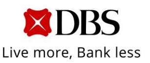
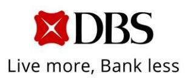
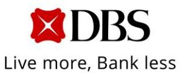

# **News Release**

Ref No. 01/2025

**DBS FULL-YEAR NET PROFIT UP 11% TO NEW HIGH OF SGD 11.4 BILLION, RETURN ON EQUITY OF 18.0% SUSTAINED AT PREVIOUS YEAR'S RECORD**

**\* \* \***

*Board proposes final dividend of 60 cents and will introduce a quarterly Capital Return dividend for financial year 2025*

Singapore, 10 February 2025 – DBS Group achieved a record performance in 2024 as net profit rose 11% to SGD 11.4 billion, with return on equity at 18.0%. Total income grew 10% to SGD 22.3 billion as commercial book net interest margin expanded, fee income crossed SGD 4 billion for the first time, treasury customer sales reached a new high and markets trading income rebounded. The cost-income ratio was unchanged at 40%. Asset quality was sound with specific allowances at 13 basis points of loans.

DBS/Fourth-quarter 2024 results Page 1 of 8 DBS Group Holdings Ltd

12 Marina Boulevard DBS Asia Central @ Marina Bay Financial

Centre Tower 3 Singapore 018982

[www.dbs.com](http://www.dbs.com/)

Tel: 65.6878 8888

For the fourth quarter, net profit grew 10% from a year ago to SGD 2.62 billion. Total income rose 10% to SGD 5.51 billion from growth in both the commercial book and markets trading. The cost-income ratio was stable. Specific allowances were 20 basis points of loans while general allowances of SGD 20 million were written back.

As part of DBS' CSR commitment of up to SGD 1 billion over 10 years to support vulnerable communities, SGD 100 million was set aside from the year's profits.

A special one-time bonus of SGD 1,00[0](#page-1-0)1 each will be paid to all staff except senior managers as an additional reward for their contribution to the record performance. A total of SGD 32 million was set aside for this.

# **Dividends**

The Board proposed a final dividend of 60 cents per share for the fourth quarter, an increase of six cents from the previous payout. This brings the ordinary dividend for the financial full year to SGD 2.22 per share or SGD 6.31 billion, an increase of 27% over the previous year.

In addition, the Board committed to managing down the stock of excess capital over the coming three years. To begin with, it plans to introduce a Capital Return dividend of 15 cents per share per quarter to be paid out over financial year

DBS/Fourth-quarter 2024 results Page 2 of 8 DBS Group Holdings Ltd

12 Marina Boulevard DBS Asia Central @ Marina Bay Financial

Centre Tower 3 Singapore 018982

[www.dbs.com](http://www.dbs.com/)

Tel: 65.6878 8888

1 Indexed to purchasing power parity in markets outside Singapore

2025. In the subsequent two years, it expects to pay out a similar amount of capital either through this or other mechanisms, barring unforeseen circumstances.

The Capital Return dividend is the latest in a series of capital management initiatives undertaken by the Board in recent years, which included regular increases in the ordinary dividend including through a bonus issue, occasional special dividends and a share buyback programme. The Board will continue to consider all forms of returning capital.

### **Full-year performance**

Commercial book net interest income rose 5% to SGD 15.0 billion from higher net interest margin and balance sheet growth. Net interest margin expanded four basis points to 2.80% due mainly to the repricing of fixed-rate assets. Loans increased 3% or SGD 12 billion in constant-currency terms to SGD 431 billion from non-trade corporate loans and trade loans. Housing and other consumer loans were little changed.

Deposits rose 4% or SGD 20 billion to SGD 562 billion in constant-currency terms. The increase was driven by fixed deposits in the first half of the year and by Casa inflows in the second half.

Commercial book net fee income grew 23% to a record SGD 4.17 billion. The increase was led by wealth management fees, which rose 45% to a new high of SGD 2.18 billion from broad-based growth in investment products and bancassurance, as well as the consolidation of Citi Taiwan. Card fees grew 19% to SGD 1.24 billion from the consolidation of Citi Taiwan and from higher spending. Loan-related fees

DBS/Fourth-quarter 2024 results Page 3 of 8 DBS Group Holdings Ltd

12 Marina Boulevard DBS Asia Central @ Marina Bay Financial

Centre Tower 3

Singapore 018982

[www.dbs.com](http://www.dbs.com/)

Tel: 65.6878 8888

increased 16% to SGD 644 million. Transaction service fees were little changed. Investment banking fees declined 19% due to slower equity capital market activities.

Commercial book other non-interest income increased 21% to SGD 2.16 billion from record treasury customer sales and property disposal gains. Excluding the property disposal gains, commercial book other non-interest income grew 15%.

Markets trading income rebounded 27% to SGD 922 million as FX, interest rate and equity derivative activities benefited from market volatility.

Expenses rose 10% to SGD 8.90 billion, led by higher staff costs. Citi Taiwan accounted for three percentage points of the increase. The cost-income ratio was unchanged at 40% and profit before allowances grew 11% to a new high of SGD 13.4 billion.

# **Fourth quarter 2024 vs. fourth quarter 2023**

Commercial book net interest income rose 5% to SGD 3.83 billion from a twobasis-point increase in net interest margin to 2.77% and from balance sheet growth.

Commercial book net fee income grew 12% to SGD 968 million. The growth was led by a 41% increase in wealth management fees. Card, transaction service and investment banking fees were also higher. The increases were moderated by a 11% decline in loan-related fees.

Commercial book other non-interest income grew 41% to SGD 548 million due to higher treasury customer sales and property disposal gains. Excluding the property disposal gains, commercial book other non-interest income was 19% higher.

DBS/Fourth-quarter 2024 results Page 4 of 8 DBS Group Holdings Ltd

12 Marina Boulevard DBS Asia Central @ Marina Bay Financial Centre Tower 3

Singapore 018982

[www.dbs.com](http://www.dbs.com/)

Co. Reg. No. 199901152M

Tel: 65.6878 8888

Markets trading income rose 40% from the previous year's low base to SGD 158 million.

Expenses rose 9% to SGD 2.40 billion. The cost-income ratio was stable. Profit before allowances grew 11% to SGD 3.11 billion.

# **Fourth quarter 2024 vs. third quarter 2024**

Commercial book total income fell 1% to SGD 5.35 billion. Net interest income rose 1% as balance sheet growth more than offset a six-basis-points decline in net interest margin due to lower interest rates. Net fee income fell 13% from seasonally slower wealth management activity and a decline in loan-related fees. Other non-interest income was 6% higher from property disposal gains.

Markets trading income fell 52% from the previous quarter's high base and seasonal factors.

For the group, total income was 4% lower. Net interest income grew 4% to SGD 3.73 billion, with net interest margin rising four basis points to 2.15% as lower funding costs and accounting asymmetry for markets trading more than offset the decline in the commercial book. Non-interest income fell 18% to SGD 1.78 billion due to seasonal factors.

Expenses rose 6% and profit before allowances was 11% lower.

### **Business unit performance**

Full-year Consumer Banking / Wealth Management income increased 13% to SGD 10.2 billion from higher net interest income, wealth management fees and card

DBS/Fourth-quarter 2024 results Page 5 of 8 DBS Group Holdings Ltd

12 Marina Boulevard DBS Asia Central @ Tel: 65.6878 8888

Marina Bay Financial Centre Tower 3 Singapore 018982

[www.dbs.com](http://www.dbs.com/)

fees, partly driven by the consolidation of Citi Taiwan. Institutional Banking income declined 2% to SGD 9.16 billion as higher loan-related fees, cash management fees and treasury customer income were offset by lower net interest income. Markets Trading income rebounded to SGD 922 million.

### **Balance sheet**

Asset quality was sound. Non-performing assets rose 4% in constantcurrency terms from the previous quarter to SGD 5.04 billion as new non-performing assets were partially offset by repayments and write-offs. The NPL ratio of 1.1% was little changed.

For the fourth quarter, specific allowances were SGD 229 million or 20 basis points of loans, while general allowances of SGD 20 million were written back. For the full year, specific allowances were SGD 559 million or 13 basis points of loans and general allowances of SGD 63 million were taken.

Liquidity remained ample with liquidity coverage ratio of 147% and net stable funding ratio of 115%, both above the regulatory requirement of 100%.

The reported Common Equity Tier-1 ratio was 17.0% based on transitional arrangements, while the pro-forma ratio on a fully phased-in basis was 15.1%. The leverage ratio was at 6.7%, more than twice the regulatory minimum of 3%.

DBS CEO Piyush Gupta said, "We achieved a record financial performance in 2024 with return on equity of 18.0%, one of the highest among developed market banks. Balance sheet management supported net interest income growth while

DBS/Fourth-quarter 2024 results Page 6 of 8 DBS Group Holdings Ltd

12 Marina Boulevard DBS Asia Central @ Marina Bay Financial

Centre Tower 3 Singapore 018982

[www.dbs.com](http://www.dbs.com/)

Tel: 65.6878 8888

improving investor sentiment drove wealth management fees and treasury customer sales to new highs.

"While macroeconomic and geopolitical uncertainties persist, the franchise and digital transformations carried out over the past decade position us well to continue delivering healthy returns. As I reflect on my journey at DBS, I feel good about where the bank is and am confident it will reach further heights under Su Shan's leadership."

#### **About DBS**

DBS is a leading financial services group in Asia with a presence in 19 markets. Headquartered and listed in Singapore, DBS is in the three key Asian axes of growth: Greater China, Southeast Asia and South Asia. The bank's "AA-" and "Aa1" credit ratings are among the highest in the world.

Recognised for its global leadership, DBS has been named "World's [Best Bank"](https://www.dbs.com/newsroom/DBS_named_Worlds_Best_Bank_for_fifth_year_running) by Global Finance, ["World's Best Bank"](https://www.dbs.com/newsroom/DBS_honoured_as_Worlds_Best_Bank_for_fourth_straight_year_sg) by Euromoney and ["Global Bank of the Year"](https://www.dbs.com/about-us/who-we-are/awards-accolades/a-world-first/awards-2021#global-bank-of-the-year-2021) by The Banker. The bank is at the forefront of leveraging digital technology to shape the future of banking, having been named ["World's Best Digital Bank"](https://www.dbs.com/about-us/who-we-are/awards-accolades/a-world-first/awards-2021#world-best-digital-bank-2021) by Euromoney and the world's ["Most](https://www.dbs.com/newsroom/DBS_clinches_global_accolade_for_innovation_in_digital_banking)  [Innovative in Digital Banking"](https://www.dbs.com/newsroom/DBS_clinches_global_accolade_for_innovation_in_digital_banking) by The Banker. In addition, DBS has been accorded the ["Safest](https://www.dbs.com/newsroom/DBS_named_Worlds_Safest_Commercial_Bank_sg)  [Bank in Asia"](https://www.dbs.com/newsroom/DBS_named_Worlds_Safest_Commercial_Bank_sg) award by Global Finance for 16 consecutive years from 2009 to 2024.

DBS provides a full range of services in consumer, SME and corporate banking. As a bank born and bred in Asia, DBS understands the intricacies of doing business in the region's most dynamic markets.

DBS is committed to building lasting relationships with customers, as it banks the Asian way. Through the DBS Foundation, the bank creates impact beyond banking by supporting businesses for impact: enterprises with a double bottom-line of profit and social and/or environmental impact. DBS Foundation also gives back to society in various ways, including equipping underserved communities with future-ready skills and helping them to build food resilience.

With its extensive network of operations in Asia and emphasis on engaging and empowering its staff, DBS presents exciting career opportunities. For more information, please visit [www.dbs.com.](http://www.dbs.com/)

[End]

*For more information, contact:*

*Edna Koh Group Strategic Marketing & Communications DBS Bank Email: ednakoh@dbs.com*

*Tel: (65) 6878 8134 Mobile: (65) 9753 0117* *Michael Sia Investor Relations DBS Bank Email: michaelsia@dbs.com*

*Tel: (65) 6878 4751 Mobile: (65) 9636 9472*