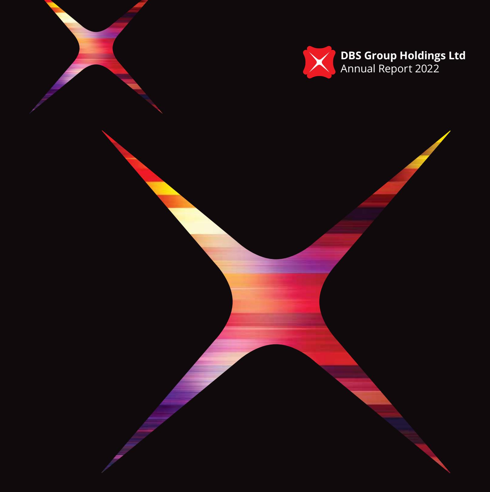

# **A Di erent Kind of Bank**

# **About us**

DBS is a leading nancial services group in Asia with a presence in 19 markets. Headquartered and listed in Singapore, DBS is in the three key Asian axes of growth: Greater China, Southeast Asia and South Asia. The bank's "AA-" and "Aa1" credit ratings are among the highest in the world.

Recognised for its global leadership, DBS has been named "World's Best Bank" by Global Finance, "World's Best Bank" by Euromoney and "Global Bank of the Year" by The Banker. The bank is at the forefront of leveraging digital technology to shape the future of banking, having been named "World's Best Digital Bank" by Euromoney and the world's "Most Innovative in Digital Banking" by The Banker. In addition, DBS has been accorded the "Safest Bank in Asia" award by Global Finance for 14 consecutive years from 2009 to 2022.

# **About this report**

This Annual Report is prepared in accordance with the following regulations, frameworks and guidelines:

- The Financial Holding Companies (Corporate Governance of Designated Financial Holding Companies with Bank Subsidiary) Regulations 2022, the Banking (Corporate Governance) Regulations 2005, and all material aspects of the Code of Corporate Governance 2018, and the Guidelines on Corporate Governance for Designated Financial Holding Companies, Banks, Direct Insurers, Reinsurers and Captive Insurers issued in November 2021 by the Monetary Authority of Singapore (MAS).
- Singapore Exchange Securities Trading Limited (SGX-ST) Listing Rules.
- The Task Force on Climate-related Financial Disclosures (TCFD) recommendations by the Financial Stability Board (updated October 2021).
- The Global Reporting Initiative (GRI) Standards 2021 (updated July 2021).
- The Financial Institutions Climate-related Disclosure Document under the Monetary Authority of Singapore (MAS)-convened Green Finance Industry Taskforce (GFIT) (published May 2021).
- The Guidelines on Responsible Financing issued in October 2015 by the Association of Banks in Singapore (revised June 2018).
- The International Integrated Reporting Framework by the International Integrated Reporting Council (issued December 2014).
- The Sustainability Accounting Standards Board (SASB) standards based on the three SICS industries within the Financials sector most aligned with our mix of businesses: Commercial Banks (FN-CB), Consumer Finance (FN-CN), and Mortgage Finance (FN-MF).

# **Contents**

# **Overview**

This section provides information on who we are and our leadership team. It also contains a joint message from the Chairman and CEO.

- Our achievements
- Who we are
- Board of Directors
- Group Management Committee
- Letter from the Chairman and CEO DBS – Live more, Bank less | A Di erent Kind of Bank

# **Reȵ ections from the top**

This section contains the CEO's thoughts on some pertinent matters and recaps the year's performance through the lens of our senior leaders.

- CEO reȵections
- CFO statement
- CRO statement
- CIO statement
- Institutional Banking
- Consumer Banking/ Wealth Management

### **Governance, Risk Management and Sustainability**

This section details our commitment to sound and e ective governance, risk management and sustainability.

- Corporate governance
- Remuneration report
- How we create value our business model
- How we develop and use our resources
- How we distribute value created
- Material matters
- What our stakeholders are telling us
- Risk management
- Capital management and planning
- Sustainability
- Summary of disclosures corporate governance

## **Financial and other reports**

### **Financial Reports**

- Directors' statement
- Independent auditor's report
- Financial statements
- Five-year summary

### **Annexure**

- Further information on Board of Directors
- Further information on Group Management Committee
- International presence
- Awards and accolades won

### **Shareholder Information**

- Share price
- Financial calendar
- Shareholding statistics
- Notice of Annual General Meeting
- Additional information on Directors seeking re-election Proxy form

# **Our achievements**

2022 saw DBS win a slew of prestigious accolades. Global wins included "World's Best Bank" from Global Finance and "Digital Workplace of the Year: Cutting Edge Award" from Digital Workplace Group. DBS was also featured in the "100 Best Workplaces for Innovators" ranking from Fast Company.

**World's Best Bank**

**Digital Workplace of the Year: Cutting Edge Award**

**100 Best Workplaces for Innovators**

# **Key industry citations:**

*"Rough seas make good sailors. The banking industry faces an ongoing pandemic, regional conή icts with global eά ects and increasing inή ation for the foreseeable future. Add to that the growing economic and humanitarian impact of climate change, and these trends separate the best banks from their rivals. DBS navigated these waters admirably while broadening its product portfolio, growing its business and investing in sustainability."*

*"The powerful set of capabilities that make up the DBS Bank digital workplace is underpinned by ambitious and creative strategic vision, multilevel governance in which business and technology have an equal voice, as well as thoughtful and comprehensive user engagement."* 

**Digital Workplace of the Year: Cutting Edge Award, Digital Workplace Group**

*"Businesses need to transform themselves in order to compete in today's fast-changing markets. Through my numerous conversations with DBS' executives, what came across very strongly were the digital and purpose-focused elements of the transformation and how these permeated every level of the organisation."*

**Professor Ranjay Gulati, Harvard Business School**

**World's Best Bank, Global Finance**

Our commitment to advancing the sustainability agenda was also recognised. DBS received the global award for "Financial Leadership in Sustaining Communities". We were also recognised among leading examples of stewardship excellence in Asia-Paciȴ c by Stewardship Asia. In addition, the National Volunteer and Philanthropy Centre in Singapore acknowledged our e orts as a purpose-driven bank with the "President's Volunteerism & Philanthropy" award.

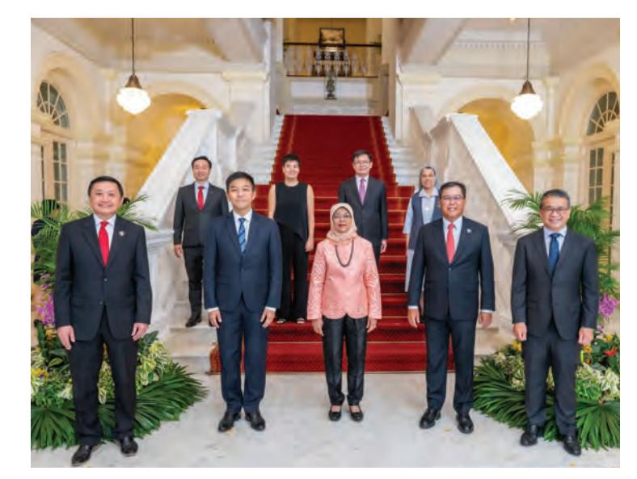

*Shee Tse Koon, DBS Singapore Country Head (top row, extreme left), in a group photo with winners of the President's Volunteerism & Philanthropy Awards 2022.*

# **Who we are**

**DBS is one of Asia's leading banks, operating in the most dynamic region of the world. We are focused on leveraging digital technology to reimagine banking to provide our customers a full range of services in consumer banking, wealth management and institutional banking. We also see a purpose beyond banking and are committed to supporting our customers, employees and the community towards a sustainable future.**

# **Business Highlights**

**Income (SGD)**

**16.5 billion**

**Net proȴ t (SGD)**

**8.19 billion**

**Total assets (SGD)**

**743 billion**

**Return on equity**

**15%**

**Over**

**280,000**

**Institutional Banking customers**

**Over**

**12 million**

**Consumer Banking/ Wealth Management customers**

# **Sustainability Highlights**

**Provided**

**SGD 20.5 billion**

**in sustainable ȴ nancing loans**

**Committed**

**SGD 480 million**

**of transition loans to support our clients' transition journey**

**Set aside**

**SGD 5.6 million**

**to fund programmes by the new Community Impact Chapter of DBS Foundation**

**Engaged**

**1million**

**customers through LiveBetter, a digital platform on DBS digibank designed to empower users to make more sustainable lifestyle choices**

**Engaged in**

**> 140,000 hours**

**of employee volunteerism activities**

**Enabled**

**> 1,300tonnes**

**of food impact such as food waste reduced and recycled, or food redistributed**

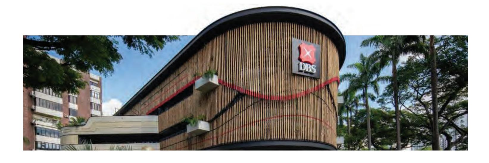

4 **A Di erent Kind of Bank** DBS Annual Report 2022 **Board of Directors** 5

# **Board of Directors**

**The Board is committed to helping the Group achieve long-term success. The Board provides direction to management by setting the Group's strategy and overseeing its implementation. It ensures risks and rewards are appropriately balanced.**

# **Highly-experienced**

Two-thirds of the Board are seasoned bankers, while the rest have extensive experience in other related industries.

# **Independent**

Majority of our Board comprise independent and non-executive directors.

# **Award-winning**

Received the Gold award for "Best Managed Board" at the Singapore Corporate Awards 2022 for all-round excellence in corporate governance.

# **Diverse**

Good mix of nationalities, gender and backgrounds.

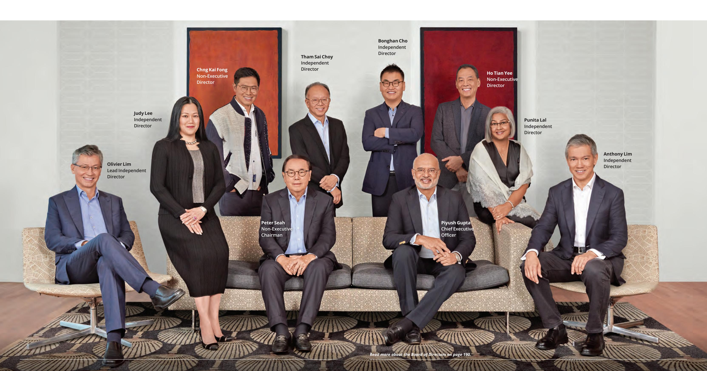

# Group Management Committee

The Group Management Committee executes the strategy and long-term goals of the Group. It drives business performance and organisational synergies. It is also responsible for protecting and enhancing our brand and reputation.

One in four of our Group Management Committee members are women. Group Management Committee members have more than 30 years of experience on average.

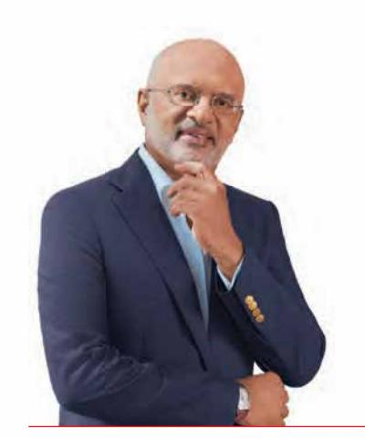

**Piyush Gupta\***, Chief Executive Officer

Chng Sok Hui\*, Chief Financial Officer

**Ginger Cheng,** China

Eng-Kwok Seat Moey, Capital Markets

Philip Fernandez, Corporate Treasury

Derrick Goh, Audit

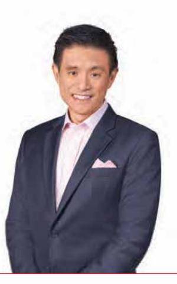

Han Kwee Juan\*, Strategy & Planning

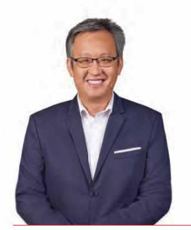

Lam Chee Kin, Legal & Compliance

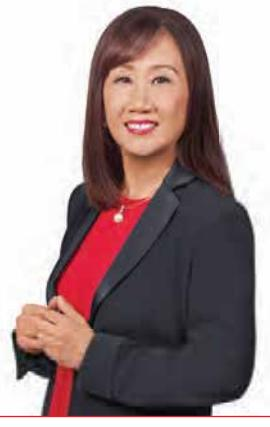

**Lee Yan Hong,** Human Resources

Lim Chu Chong, Indonesia

**Lim Him Chuan,** Taiwan

Sim S Lim\*, Consumer Banking/ Wealth Management

Andrew Ng\*, Treasury & Markets

Jimmy Ng\*, Chief Information Officer

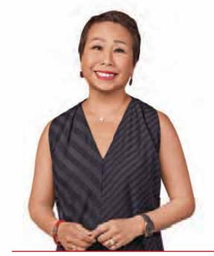

Karen Ngui, Strategic Marketing & Communications

Sebastian Paredes\*, Hong Kong

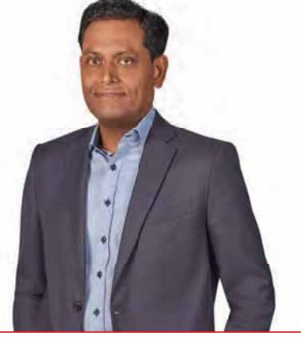

Sanjoy Sen, Consumer Banking

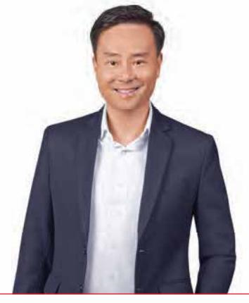

Shee Tse Koon\*, Singapore

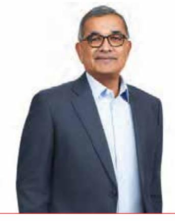

Surojit Shome, India

Soh Kian Tiong\*, Chief Risk Officer

Tan Su Shan\*, Institutional Banking

8 **A Di erent Kind of Bank** DBS Annual Report 2022 **Letter from the Chairman & CEO** 9

# **Letter from the Chairman & CEO**

**DBS' decade-long structural transformation continues to pay o . In a challenging year for the global economy, the bank turned in a solid performance.** 

The global economy faced multiple threats in 2022 – escalating geopolitical tensions, stubbornly high inȵ ation, stalling growth and roiling ȴ nancial markets.

Supply chain disruptions – an issue amid the Covid pandemic of the last two years – were further exacerbated by the Ukraine war. This contributed to rising food, commodities and energy prices.

To ȴ ght decades-high inȵ ation, the US Federal Reserve embarked on its most aggressive monetary tightening since the early 1980s. Altogether, it hiked rates seven times in 2022, raising short-term borrowing costs by 425 basis points to 4.25-4.50%, the highest level in 15 years. Many major central banks around the world similarly followed suit. These moves had a chilling e ect on equity and bond markets.

DBS' key markets Singapore and Hong Kong – being small, open economies – were impacted by slowing external demand. Singapore's economy grew 3.6% in 2022, from 8.9% the year before. Hong Kong's economy shrank by 3.5%. With its strict zero-Covid policy and property market slump, China remained in the doldrums.

Against this backdrop, we had yet another excellent year, with solid ȴ nancial performance and continued delivery against key scorecard goals.

DBS also continued to cement its global standing, being named by Global Finance as "World's Best Bank". This made it the ȴ fth consecutive year we had been lauded as the best in the world.

# **A banner year**

For the year, DBS delivered record total income of SGD 16.5 billion. Net proȴ t rose 20% to an all-time high of SGD 8.19 billion. Return on equity (ROE), at 15%, was not just a record, but also signiȴ cantly higher when compared to previous highs around the 12-13% range.

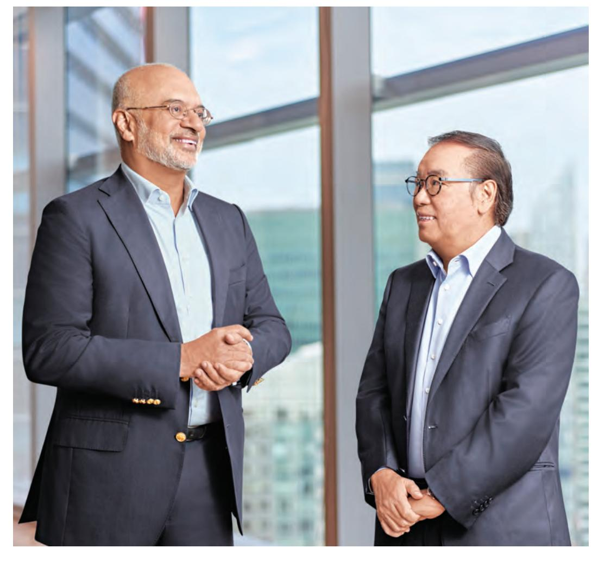

Earnings were propelled by tailwinds from a rising interest rate environment, with net interest margin increasing after three years of decline. Notwithstanding the rise in borrowing costs for corporates and individuals, loans grew 4% in constant-currency terms to SGD 415 billion. Overall, net interest income rose 30% to SGD 10.9 billion.

Non-interest income, however, was a drag, declining 3% to SGD 5.56 billion. While card fees increased 20% with travel spending gradually returning to pre-pandemic levels, this was more than o set by lower wealth management and investment banking fees amid the uncertain market environment.

DBS' solid ȴ nancial performance reȵ ects structural shifts made to our franchise in the last decade, whether the buildout of higherreturn business lines or the pervasive digital transformation we embarked on starting 2014, and which carry through till today.

Consumer Banking/ Wealth Management had a solid year, with total income up 25% to a record SGD 6.65 billion. Wealth Management

**"2022 was a breakout year for DBS, with ROE signiȴ cantly surpassing previous records. This was the result of structural changes made over the years to transform the franchise. We have demonstrated over the past decade a track record of solid performance. In an increasingly fractured and unpredictable world, DBS will continue to be a di erent kind of bank – one that is trusted, purpose-driven and innovationled so our customers can** *Live more, Bank less.***"**

customer segment income rose 20% as higher interest rates beneȴ tted deposit income, more than o setting a decline in investment product sales. Assets under management increased by 3% in constant currency terms to SGD 297 billion, boosted by a doubling of net new monies to SGD 24 billion. Our consumer banking franchise also did well.

Institutional Banking, which saw income rise 28% to a record SGD 7.69 billion, was buoyed by corporate lending, cash management and treasury customer sales. Growth in non-trade loans was broad-based across industries and geographies. Our early investment in digital transactional capabilities continued to pay o , as we won over 800 cash management mandates in 2022. Corporate operating

balances also rose signiȴ cantly. Income from Treasury Markets normalised from the previous year's exceptional levels to SGD 1.17 billion.

Across the franchise, asset quality remained resilient, with the non-performing loan ratio at 1.1%, from 1.3% previously. During the year, we did a range of stress tests under conservative assumptions. These included stress-testing oil at USD 200 a barrel, interest rates at 6-7% for our SME portfolio and a deep recession impacting the cashȵ ow of our customers by 30%. Across most of these situations, we are conȴ dent that asset quality is robust.

In a turbulent time for the global economy, DBS continued to be recognised for our safety, and liquidity was healthy. Underlining the solidity of our franchise, DBS was named by Global Finance as "Safest Bank in Asia" for the 14th consecutive year.

### **Cementing our Asia franchise**

As an Asia-centric bank, in the long term, DBS needs to be more deeply embedded in one or more of our four markets outside of Singapore and Hong Kong, which include China, India, Indonesia and Taiwan.

In 2022, notwithstanding the China-US trade tensions and China's zero-Covid policy, DBS continued to make headway in growing its Greater Bay Area (GBA) franchise. Since launching our GBA strategy in 2018, our large-corporate business targeting companies in China's strategic industries including high-end manufacturing, technology and the new economy, has seen robust growth. Our SME business in the GBA region has also performed well. In the wealth space, DBS Bank (Hong Kong) now provides investment products and solutions to customers from DBS China, Postal Savings Bank of China and Shenzhen Rural Commercial Bank. This makes DBS the only bank with three Southbound Wealth Management Connect partners.

Following the amalgamation of Lakshmi Vilas Bank (LVB) with DBS India in late 2020, all e orts have been focused on integrating both franchises smoothly. In 2022, this involved optimising the combined DBS/ LVB branch network, rebranding the LVB branches, and migrating all former LVB customers to DBS technology systems and operating platforms. With our enlarged presence of over 520 branches across 350 locations, 2.5 million retail customers and 15,000 corporate customers, we now have a strong platform from which to accelerate growth. Strategic partnerships including those with Bajaj Finserv to launch our ȴ rst-ever credit card in India and with ODeX to provide straight-through credit solutions to freight forwarders, continued to scale well. These initiatives helped deliver stronger consumer and SME assets growth, as well as higher income and proȴ tability.

In Taiwan, where DBS agreed to acquire Citi's consumer banking business, we are on track to complete and integrate the acquisition by August 2023. The acquisition will accelerate DBS Taiwan's growth by at least 10 years, making it Taiwan's largest foreign bank by assets. Material synergies will be realised from the combined entity's enlarged scale.

# **SGD 16.5 BILLION**

### **Total income**

Total income crossed SGD 16 billion for the ȴ rst time.

# **SGD 8.19 BILLION**

### **Net proȴ t**

Net proȴ t rose 20% to a record SGD 8.19 billion, as we beneȴ tted from higher interest rates and reaped the rewards of structural changes made over the years.

# **SGD 2.00**

# **Dividend**

The Board proposed a ȴ nal dividend of 42 cents per share, and a special dividend of 50 cents per share, bringing the full-year dividend to SGD 2.00 per share.

**15.0%**

### **Return on equity**

Return on equity climbed from 12.5% to a new high of 15.0%.

In November, DBS opened a representative oɝ ce in Bangladesh, bringing the bank's international presence to 19 markets globally. Bangladesh is an attractive investment destination for companies in various sectors, such as power, energy, and transport and logistics. The establishment of DBS Dhaka will provide further impetus to the bank's activities and enable greater market connectivity to DBS' customers globally.

## **A new way of working**

While DBS was ahead of the curve in transforming digitally, we recognise that digitalisation has become table stakes at most banks. However, there are three areas in which we have invested that continue to be di erentiating.

The ȴ rst is the industrialisation of artiȴ cial intelligence (AI)/ machine learning (ML) and data analytics usage across the bank. Our 260 use cases span customer-facing businesses such as consumer and SME banking, and support functions including Legal and Compliance, and Human Resources. For example, DBS sends 45 million hyperpersonalised nudges each month to customers across the region with suggestions on how to make their money work harder. In the SME space, AI/ ML is used to provide businesses with early warning signals of potential credit stress. In 2022, the revenue uplift from our AI/ ML initiatives was about SGD 150 million, more than double that from the previous year.

The second is our ecosystem strategy, which has allowed us to scale up our business in the large Asian markets without high customer acquisition costs. DBS nearly doubled our ecosystem-led consumer ȴ nance lending in 2022. This was made possible through our partnerships with companies such as ByteDance, Ctrip, Home Credit and Kredivo in markets like China and Indonesia. In institutional banking, we also had good traction in onboarding large platform companies, and through our API suite, ȴ nancing their extensive supply chains digitally.

The third is in the way we manage. While technology is an enabler, companies need to focus on the customer and speed to market to win. This requires a workforce that is agile, nimble, experimental, learning and willing to take risks. A big focus at DBS has been on enabling this internally.

Previously, we had programmed change within the organisation such that our employees are trained to put the customer at the heart of all we do. In the past two years, we took this up a notch with the introduction of a new operating model "Managing through Journeys" (MtJs). With MtJ, we re-architected our most important customer processes – such as those around credit cards, wealth management, consumer ȴ nance, transactional foreign exchange and SMEs – horizontally. Through the formation of cross-functional squads which are guided by data-driven control towers, we have become more agile in delivering new products, and responding to customer pain points and needs. This has translated to improved customer satisfaction, faster turnaround times and positive revenue impact.

# **Our sustainability commitments**

Our conviction has always been that our netzero commitment, made in October 2021, must be supported by a clear and detailed roadmap and plan.

In September 2022, DBS unveiled this plan, which is one of the most comprehensive in scope in the global banking industry. Speciȴ cally, we set 2030 interim decarbonisation targets – that are aligned with science-informed decarbonisation glidepaths – for seven sectors. These are power, oil and gas, automotive, aviation, shipping, steel and real estate. Data coverage targets were also set for two sectors, food and agribusiness, and chemicals. The nine sectors represent the most carbon-intensive institutional banking segments ȴ nanced by DBS and constitute the vast majority of the Institutional Banking Group's (IBG's) ȴ nanced emissions.

As part of the implementation roadmap, DBS will proactively partner our customers with advisory and ȴ nancial solutions to accelerate their transition to a lower-carbon future. We are conȴ dent that many will be willing to come along with us on the journey. This conȴ dence is borne out by our fast-growing sustainable ȴ nance book. We had originally set a target to do SGD 50 billion in sustainable ȴ nance

loans by 2024. As at end-2022, our sustainable ȴ nance portfolio was SGD 61 billion, exceeding our target well ahead of 2024.

In line with e orts to embed sustainability in our business practices and operations, we refurbished an old oɝ ce in Newton into Singapore's ȴ rst net-zero building by a bank. We also launched an in-house café at our headquarters that minimises the bank's carbon footprint and gives new life to food waste. These e orts contributed towards DBS achieving carbon neutrality in our operations as at end-2022.

On the social agenda, the new Community Impact chapter of DBS Foundation aims to foster a more equitable and inclusive society. A total of SGD 5.6 million was committed towards 10 inaugural programmes across our core markets of Singapore, China, Hong Kong, India, Indonesia and Taiwan.

One such programme is in partnership with Haqdarshak Empowerment Solutions, which will provide digital and ȴ nancial literacy courses, and access to social welfare schemes, to 200,000 marginalised individuals in India.

For DBS' commitment to sustainability, the bank was recognised by Global Finance as the global winner for "Financial Leadership in Sustaining Communities". DBS was also named to the Bloomberg Gender Equality Index and the FTSE4Good Developed Index for the sixth consecutive year.

# **Board and management changes**

We would like to express our gratitude to Ho Tian Yee, who is stepping down as a board member in March 2023, for his invaluable contributions. Since joining the DBS Board in 2011, Tian Yee has served in several capacities including as Lead Independent Director and

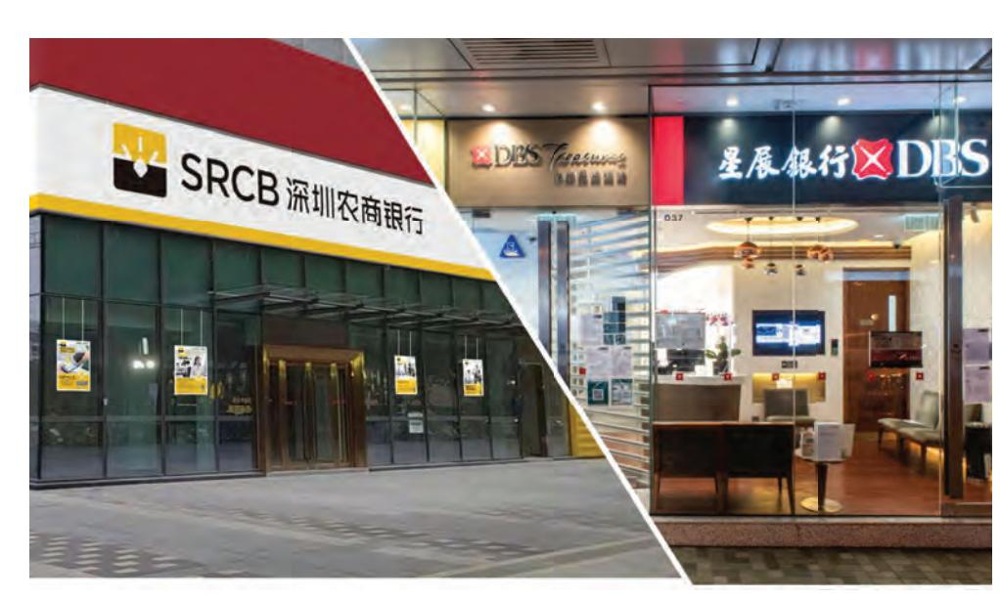

*DBS is the only bank with three Southbound Wealth Management Connect partners.*

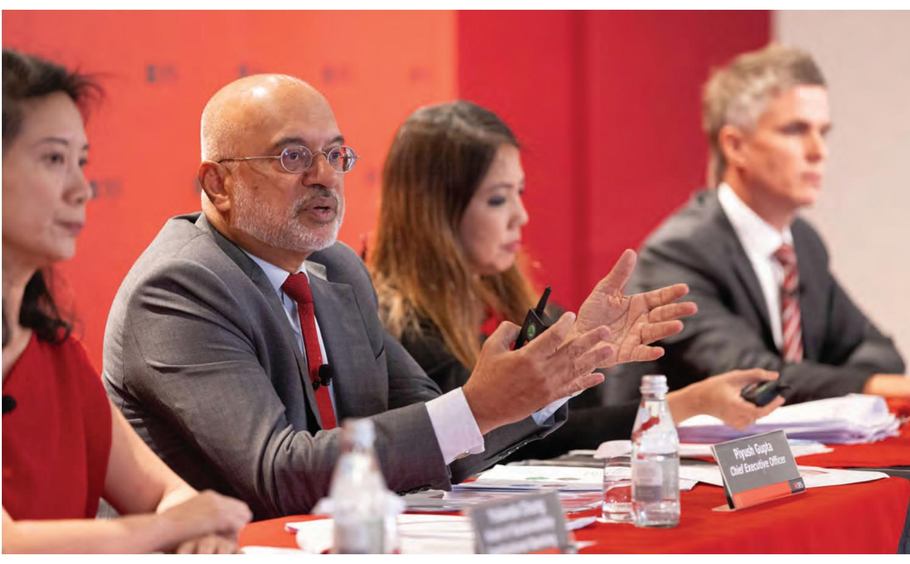

*DBS CEO Piyush Gupta (second from left) announcing the bank's decarbonisation targets.*

Chairman of the Nominating Committee. We have beneȴ tted greatly from his wisdom and insights through the years.

Underscoring our deep bench strength, we are pleased that we were able to ȴ ll two Country Head roles from our slate of internal candidates when the incumbents retired.

Veteran banker Ginger Cheng succeeded Neil Ge when he retired as Country CEO of DBS China. A Chinese citizen, Ginger has had a distinguished 20-year career in DBS spanning Hong Kong and China. Under her leadership, DBS' IBG business in China had grown exponentially, with increased connectivity across the region.

Lim Chu Chong, a career DBS banker, took over as President Director of PT Bank DBS Indonesia, succeeding Paulus Sutisna. A seasoned corporate banker, Chu Chong had held various roles in DBS including Regional Head of SME Banking, Head of IBG in China and Chief Operating Oɝ cer of IBG. Between 2011 and 2016, he was also non-Independent Commissioner of DBS Indonesia.

# **Dividends**

Given the record proȴ t and strong capital base, the Board has proposed a ȴ nal dividend of 42 cents per share and a special dividend of 50 cents a share, bringing the full-year dividend to SGD 2.00 per share. Barring unforeseen

circumstances, the annualised dividend going forward will be SGD 1.68 per share.

# **Going forward**

While uncertainties remain, macroeconomic conditions are improving. Global inȵ ation is expected to decline this year. China's reopening paves the way for a rebound in economic activity. The IMF recently upgraded its growth forecast for 2023 from 2.7% to 2.9%, though this is still below 3.4% in 2022.

Although we remain watchful, we take heart that our loan pipeline looks healthy. If animal spirits return to markets, we should also see some upside to fee income. Barring any unexpected shocks to the global economy, DBS' ROE will comfortably be above 15%.

Despite the collapse in market and ȴ ntech valuations, our ambition to become more like a technology company also remains intact. This reȵ ects a belief that the future of ȴ nance will be underpinned by technology. As we look ahead, we will continue to cement our digital banking leadership, while strategically placing our bets in emerging technologies. It is also imperative that we remain focused on advancing the sustainability agenda and executing on our net-zero commitments.

2022 was a breakout year for DBS, with ROE signiȴ cantly surpassing previous records. This was the result of structural changes made over the years to transform the franchise. We have demonstrated over the past decade a track record of solid performance. In an increasingly fractured and unpredictable world, DBS will continue to be a di erent kind of bank – one that is trusted, purpose-driven and innovation-led so our customers can *Live more, Bank less*.

**Peter Seah Chairman DBS Group Holdings**

**Piyush Gupta Chief Executive Oɝ cer DBS Group Holdings**

More like a startup, less like a bank

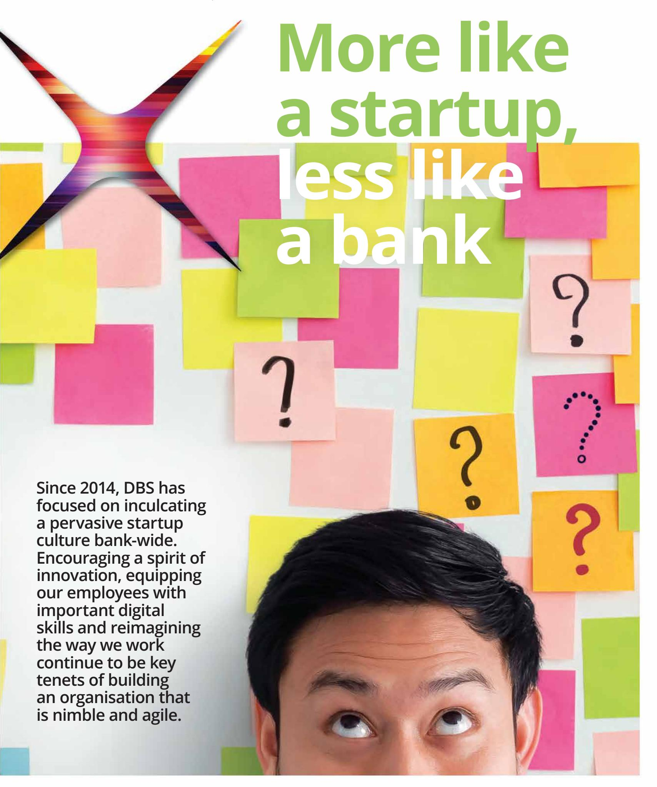

# Redesigning the way we work – Managing through Journeys

Some years back, to ensure we put the customer at the heart of the banking experience, we trained our people in customer journey thinking which encompassed elements like customer discovery and customer science. More recently, we took this up a notch and reorganised the way we work by Managing through Journeys (MtJs). MtJs enable the bank to function as a Horizontal Organisation, with cross-functional teams across the bank collaborating to delive value and enhanced customer experiences. These efforts have resulted in improved customer satisfaction in consumer and SME banking. Employee engagement has also risen, with DBS continuing to be Kincentric's Best Employer in Singapore and across Asia-Pacific.

Industrialising innovation

We seek to industrialise innovation throughout the organisation. Through a proprietary Innovation Pyramid framework, we explore and exploit propositions that are new to bank, new to industry and new to the world. For instance

industry and new to the world. For instance, to be future-ready, we take bets on technologies that may mature only in a few years. Highprofile new businesses such as DBS Digital Exchange and Partior are examples of such bets. We challenge business teams to conceptualise innovations, or "moonshot solutions", that do not currently exist. Product teams are also tasked with elevating existing propositions to exceed customer expectations. Finally, to awaken the innovation DNA in all employees, we often run internal campaigns to crowdsource the best ideas from the bank.

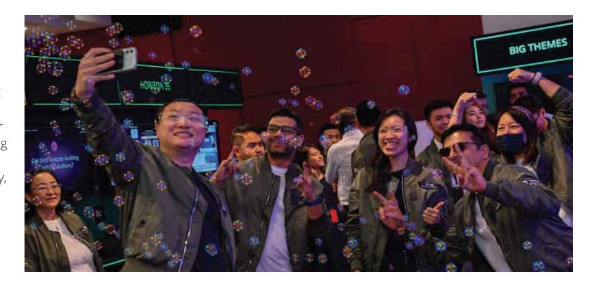

Cultivating a futureready workforce through training and development

Recognising that our people are the driving force behind DBS' transformation, we place significant focus on training and development. DBS' Tech Academy builds technical expertise through in-house curriculums developed by subject matter experts. Since 2021, over 9,000 employees have taken upskilling courses in data and artificial intelligence, while 7,000 have attended site reliability engineering training. We also launched our DBS Sustainability Learning Campus to provide learning opportunities for all employees on sustainability.

**Diversifying our tech workforce**We incorporated an innovation triangle – comp

We incorporated an innovation triangle – comprising three technological hubs – in Singapore, India and China, to grow our own timber. Our technology hubs in Singapore sit under DBS Tech Singapore, while DBS Asia Hub 2 in Hyderabad has been rebranded as DBS Tech India. DBS Tech China will be launched in Guangzhou in mid-2024. These hubs will facilitate continual innovation, provide diversity, and hone our talents as they learn from each other.

# Transforming our workspaces for optimal hybrid working

With hybrid work practices, DBS employees now spend three days in the office and

two days working from home. To ensure that their time in the office is conducive to ideation, collaboration and social connections, we continue to experiment with design of spaces. We have done a series of experiments to drive creative thinking with flexible furniture, immersive lighting and writable surfaces. The insights gathered from employee feedback are being used to design and curate productive workspaces for the future.

4 A Different Kind of Bank DBS Annual Report 2022
Thinking more like a customer, less like a bank

Leveraging Al/ ML
to help customers
make better financial
decisions

DBS' Al/ ML models generate
hyper-personalised nudges
that guide customers to make
better investment decisions and do
financial planning. Every month, we send
out 45 million nudges to some five million

customers across the region to aid their

financial decisions.

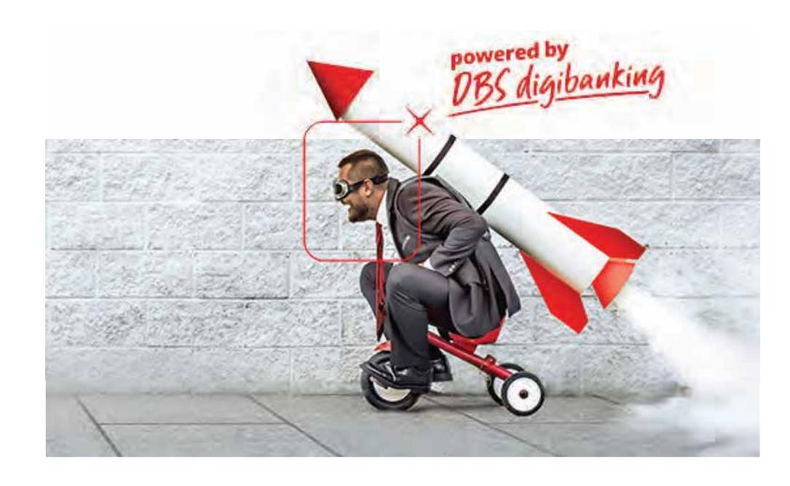

Meeting unmet working capital needs among micro and small businesses

To help small businesses navigate the rising interest rate and inflationary environment, DBS proactively reached out to pre-identified customers to offer almost instant access to financing of up to SGD 300,000. Through hyper-personalised AI and data analytics, the "DBS Quick Finance" application process was reduced to just one minute to apply, one second to approve, and in some instances, even instant disbursement, with no additional paperwork.

Unlocking wealth management opportunities for GBA investors

DBS Bank (Hong Kong) partnered Shenzhen Rural Commercial Bank to provide qualified Greater Bay

Area (GBA) mainland investors with Wealth Management Connect (WMC) Southbound services. The combined expertise of the two banks will help customers manage their wealth and provide them with access to customised diversified investment products, services and digital banking capabilities. DBS Hong Kong is the only bank with three Southbound partners under the WMC scheme.

Introducing ondemand digital trade financing solutions

> DBS Hong Kong, in partnership with GS1 Hong Kong, introduced an

on-demand digital trade financing solution powered by alternative data. By leveraging GS1 Hong Kong's EzTRADE data and DBS' digital capabilities, SMEs are able to access working capital and funding with minimal hassle. This solution redefines the trade financing journey for SMEs by streamlining the credit assessment process.

# Helping customers navigate rising living costs

DBS was the first bank in Singapore to launch a fight inflation package in August, equipping those earning

less than SGD 2,500 a month with a suite of solutions to stretch their dollar. We raised interest rates for our bank-and-earn solution Multiplier, making it easier for customers to earn more rebates on their everyday spend so they can get more cashback. We were also the only bank that offered a competitive Housing Development Board housing loan that is on par with HDB's concessionary loan rate. More recently, we announced that we would subsidise five million hawker meals over a 12-month period until January 2024.

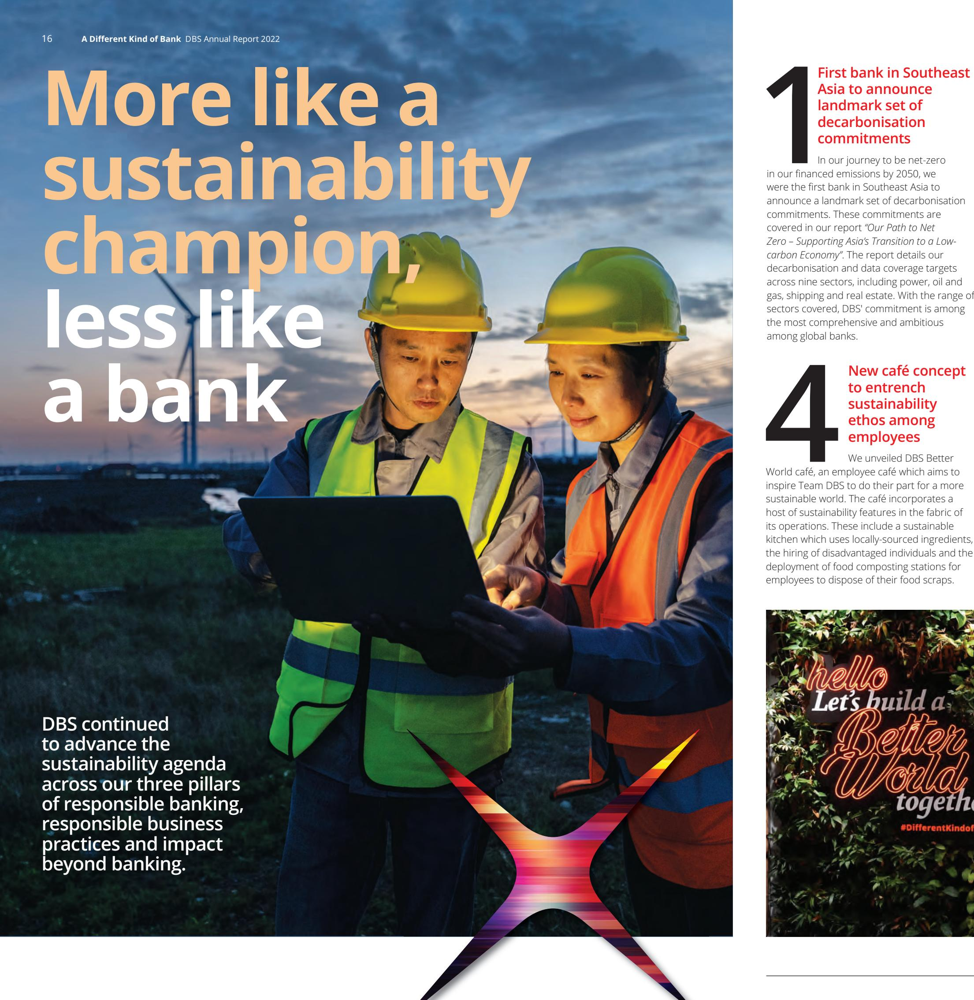

First bank in Southeast Asia to announce landmark set of decarbonisation commitments

In our journey to be net-zero in our financed emissions by 2050, we were the first bank in Southeast Asia to announce a landmark set of decarbonisation commitments. These commitments are covered in our report "Our Path to Net Zero – Supporting Asia's Transition to a Lowcarbon Economy". The report details our decarbonisation and data coverage targets across nine sectors, including power, oil and gas, shipping and real estate. With the range of sectors covered, DBS' commitment is among the most comprehensive and ambitious among global banks.

New café concept to entrench sustainability ethos among employees We unveiled DBS Better World café, an employee café which aims to inspire Team DBS to do their part for a more sustainable world. The café incorporates a host of sustainability features in the fabric of its operations. These include a sustainable kitchen which uses locally-sourced ingredients,

employees to dispose of their food scraps.

Harnessing technology to unlock access to credit A partnership between DBS India and Home Credit India provides joint-financing

solutions to help unlock access to credit for underserved borrowers. Technology enables a better customer experience via an automated and paperless process. Approximately 41,500 loans have been disbursed.

First net-zero building by a bank We opened Singapore's

first net-zero building by a bank, DBS Newton Green. By retrofitting the 30-yearold building, we extended its

lifespan. New technologies and creative design strategies were deployed to reduce energy consumption as much as possible while maximising the building's capacity to generate its own renewable energy.

**DBS Foundation** new grant awardees DBS Foundation committed

SGD 3 million in grants to

15 social enterprises and eight SMEs, enabling them to create greater impact across social and environmental areas. The 23 awardees aim to impact two million lives, reduce greenhouse gas emissions by 319 tonnes and reduce 132,000 tonnes of food waste.

**DBS Foundation** commits SGD 5.6 million to foster a more inclusive society

The new Community Impact chapter of DBS Foundation

aims to foster a more equitable and inclusive society. A total of SGD 5.6 million was committed towards 10 inaugural programmes across DBS' core markets of Singapore, China, Hong Kong, India, Indonesia and Taiwan. Signature programmes include those which will equip beneficiaries with digital and financial literacy skills.

# **CEO reȵ ections**

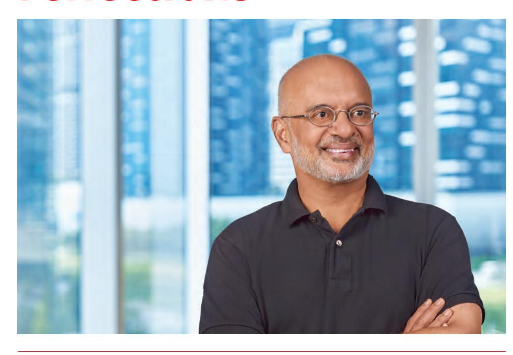

# **Piyush Gupta shares his views on key issues driving the coming year's performance.**

### **What is the outlook for the coming year? Q1**

It is clear the global economy is slowing because of the aggressive tightening by the US Fed, which has occurred alongside ongoing geopolitical tensions and supply chain disruptions. The IMF has projected 2023 global economic growth to be at 2.9%, which would be lower than the 3.4% for 2022.

I expect US interest rates to increase to around 5% and stay there in 2023. The latest core Personal Consumption Expenditures price index of more than 4% is still above the Fed's target. At the same time, job creation in the US remains strong, with the unemployment rate of 3.4% in January 2023, the lowest since 1969.

But several green shoots are emerging.

First, inȵ ation is moderating. Energy prices have declined due to a warmer northern winter and the availability of replacements for Russian oil and gas. At the same time, supply chain constraints have eased signiȴ cantly as port backlogs are cleared. With interest rates already in restrictive territory, ȴ nancial markets have started to price in the end of the rate upcycle. If inȵ ation continues to ease and a mild recession ensues in the developed economies, we will end up with a soft landing.

Second, China's reopening will provide a substantial boost to economic activity, particularly in Asia. We have seen how other countries' reopening in the past year created a resurgence in travel and tourism, which are major economic sectors. China is bigger than other countries in the region. I expect consumption to substantially increase and energies unleashed across the region in the coming year now that the short-term pain from China's reopening appears to have passed.

Domestically, China has also corrected course on policies that clamped down on what it saw as excesses in key sectors. In the property sector, it has now provided liquidity support, including for the weakest companies. I do not foresee any property crisis there. In the technology sector, it has allowed major companies to release new games, sign up new customers and carry out new fundraising.

Third, geopolitical tensions have started to ease, although spats could occur from time to time. The tone has softened since Presidents Joe Biden and Xi Jinping met in Bali in November. China has subsequently appointed its ambassador to the US, who customarily spoke in more measured tones than his wolf warrior foreign ministry colleagues, as foreign minister. High-level exchanges with the US have resumed, with both sides' foreign

and ȴ nance ministers meeting in recent months. Relations with Australia have similarly improved with the resumption of senior government exchanges as well as the easing of trade bans, including for coal, a major export.

One consequence of these improvements will be the return of animal spirits to ȴ nancial markets – well before their e ects are felt in the real economy. Since the start of the year, ȴ nancial assets led by equities and bonds globally have clawed back some of the losses incurred in 2022. I believe Asian markets, having underperformed US markets over the past two years, will lead the upturn.

The macroeconomic and geopolitical backdrop bodes well for our operating outlook in the coming year. A sustained level of high interest rates is beneȴ cial to our established Casa deposit franchise. Our latest net interest margin is now running at more than 2%, which is the highest in more than a decade. The higher rates, together with structural improvements from transformation initiatives, will enable us to sustain a ROE of more than 15% in the foreseeable future. At the same time, the restored conȴ dence in ȴ nancial markets will lead to a signiȴ cant recovery in our wealth management fee income, which was the major drag on our performance in 2022. These factors will more than make up for any potential increase in credit costs. Although idiosyncratic risks cannot be ruled out, our ongoing stress tests indicate that asset quality will remain benign in the coming year.

### **Can ROE be sustained above 15%? Q2**

Our ROE reached a new high of 17% in the second half of 2022. Higher interest rates were a big tailwind, but the record proȴ tability was also driven by signiȴ cant improvements we made to the franchise.

If we look back to 2006-2007, when interest rates (and allowance charges) were at similar levels to the second half of 2022, our ROE was 12-13%. So there has been a four percentage point structural improvement in ROE.

The key to the improvement has been our digital transformation. In 2017, we laid out our thesis that digitalisation would enable us to increase wallet share with lower marginal costs.

In the consumer and SME businesses in Singapore and Hong Kong, where the beneȴ ts of digitalisation are most visible, we grew the proportion of digitally-engaged customers from 42% in 2017 to 60% in 2022. Over the past ȴ ve years, these customers brought in more than twice the income on average than non-digital customers. They were also more cost eɝ cient to serve. As a result, the

ROE they generated was a signiȴ cant 15 percentage points more than non-digital ones. The growing proportion of digital customers enabled operating proȴ t of the consumer and SME businesses in these locations to grow at a compounded annual rate of 7% with ROE rising from 23% to 37%.

We also extended the digital transformation to other parts of the bank. In private banking, it enabled relationship managers to deliver hyper-personalised services to customers, resulting in more customer transactions. In corporate banking, the integration of our services directly into customers' supply chains and networks using application programming interface software (or APIs) resulted in higher volumes at lower costs. In Treasury Markets, the full business process – from distribution to structuring to risk warehousing – was digitalised, enabling us to handle higher volumes with greater speed.

The results are clear. Our assets under management grew at an 8% compounded annual rate since 2017, outpacing the market in Asia. Transaction services fees also increased at an 8% compounded annual rate, while GTS deposits rose almost 40%. Treasury Markets income growth and returns for the past ȴ ve years surpassed the performance of global peers that we track. Wealth management, transaction services and treasury customer sales – which are low-capital-usage and high-return businesses – now make up a greater proportion of income compared to ȴ ve years ago, resulting in higher ROE for the group.

We have also improved credit processes through the use of data and artiȴ cial intelligence for underwriting, early warning and portfolio management, which we expect to drive lower cost of credit going forward. In our key growth markets, we are scaling up organically and through acquisitions.

The announced increase in quarterly dividend payout to 42 cents per share and special dividend of 50 cents per share are part of our ongoing e orts to bring our CET1 ratio closer to the target and beneȴ t ROE.

To be sure, there will be a cyclical impact to ROE from changes in interest rates. If interest rates peak in the coming year, part of the ROE improvement so far will come o , but the structural gains will remain. We expect that as our digital transformation becomes more pervasive, an ROE of 15% is sustainable if interest rates do not return to the unusually low levels seen during most of the past decade.

### **Will the collapse of technology valuations and crypto asset prices in particular have any bearing on your strategy? Q3**

2022 saw a major sell-o in the market, particularly of technology stocks and crypto assets. However, this has little bearing on technology as a continued driver of the global economy. The dot.com crash at the turn of the century testiȴ es to that. Between March 2000 and October 2002, the Nasdaq Composite Index fell by more than 75%. Twenty years on, more than 60% of the global population are Internet users. Social media is a cultural phenomenon. Mobile and online technology have fundamentally reshaped business models.

The fact is that valuations are not necessarily the best indicator of the underlying promise of a technology. Indeed, some technologies we see today have the potential to be truly game-changing.

For example, digital technology is here to stay because it has fundamentally altered the way we live, work and play.

As for artiȴ cial intelligence (AI)/ machine learning (ML), it is already a big part of our lives today. We use conversational AI through our interactions with Siri or Alexa, and AI-powered recommendation engines in our Spotify and Netȵ ix selections. With ChatGPT taking the world by storm recently, 2023 is set to be a year of generative AI.

Blockchain/ distributed ledger technology allows us to reimagine workȵ ows, such as those pertaining to clearing and settlements. This could dramatically change backoɝ ce operations by reducing costs and boosting overall eɝ ciency and e ectiveness. Tokenisation and digital monies will also be a part of our future.

Against this backdrop, our fundamental thesis is that DBS needs to be a technology leader. We have been building our technological prowess over the years, and will continue to do so in two ways:

**•** Internally, DBS has more than 10,000 technologists, as well as two tech centres in Singapore and India today. A third centre will be established in China in mid-2024, giving us access to new tech talent even as we continue to train thousands of our people in AI/ ML and other new technologies. We will continue to invest in strengthening our technological muscle in areas such as cloud computing and site reliability engineering so as to improve scalability, automation and speed to market, while enhancing system resiliency at reduced costs. We will also build on our AI/ ML capabilities, adding to the 260 use cases

 we have to improve productivity, streamline work processes and o er hyper-personalised insights and nudges to customers.

**•** Externally, the bank has sponsored several new businesses, such as Partior and Climate Impact X (CIX). Leveraging blockchain technology, Partior seeks to streamline ineɝ ciencies in cross-border clearing and settlement, while CIX enables the trading of high-quality carbon credits. We have also established DBS Digital Exchange (DDEx) and FIX Marketplace. DDEx is a bank-backed crypto trading exchange, while FIX Marketplace is Asia's ȴ rst fully digital and automated ȴ xed income execution platform. These initiatives not only provide valuable insights into emerging technologies but are also medium-term bets on the future of ȴ nance.

At the same time, we continue to trial new initiatives. In 2022, DBS collaborated with the Monetary Authority of Singapore on two applications. The ȴ rst involved using programmable money and retail central bank digital currencies to distribute purpose-bound vouchers. The second experimented with the trading of tokenised assets. Both pilots allowed us to test new capabilities including the use of smart contracts and the integration of traditional ȴ nance with decentralised ȴ nance.

In an ironic way, the collapse in valuations is also helpful to us as it reduces unsustainable market competition. With cheap money ȵ ooding markets in recent years, a lot of tech companies had been competing irrationally. The latest correction makes for a more rational marketplace. We may also ȴnd that as tech valuations become more reasonable, there may be opportunities to enhance our capabilities.

The ȴnancial services industry is on the cusp of being reshaped by technology, and we must continue to be at the forefront of change for the beneȴ t of customers and society-at-large.

**Piyush Gupta Chief Executive Oɝ cer DBS Group Holdings**

# **CFO statement**

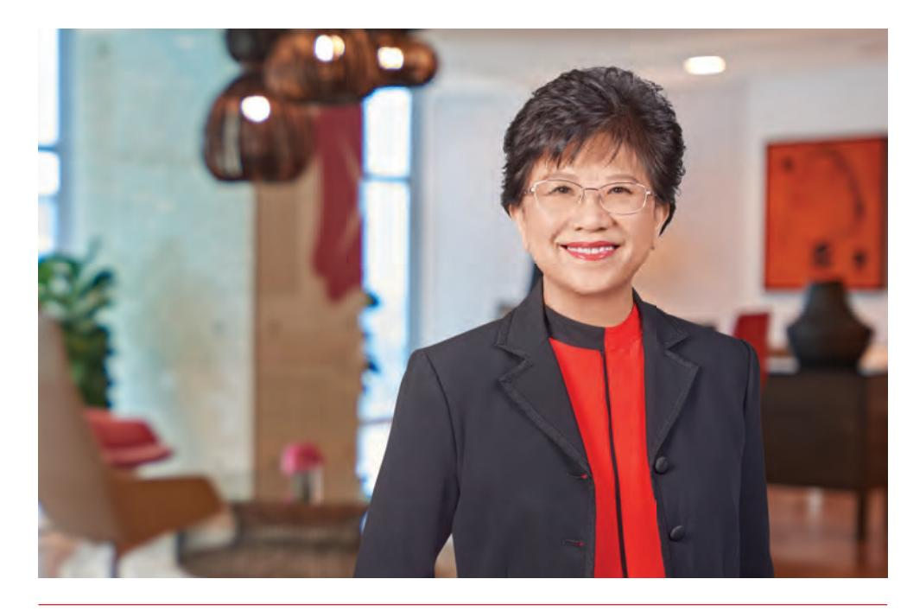

# **We achieved another record performance, with ROE climbing to 15%. The results reȵ ected the pervasive digital transformation we have been making for more than a decade.**

# **Record performance amidst macroeconomic uncertainty and ȴ nancial market volatility reȵ ects fruits of pervasive transformation**

We achieved another record performance in 2022 as net proȴ t rose 20% from a year ago to SGD 8.19 billion. Return on equity climbed to 15%, pulling away from previous highs clustered around 12-13%. The results were driven by a 16% increase in total income to SGD 16.5 billion, which passed the SGD 16 billion mark for the ȴ rst time.

Underpinning the growth was a 30% increase in net interest income to SGD 10.9 billion, boosted by a higher net interest margin as interest rates rose, as well as loan growth. Non-interest income was 3% lower than the previous year's record due to ȴ nancial market volatility. Lower wealth management and investment banking fees as well as gains on investment securities were o set by growth in other fee income activities and net trading income.

The signiȴ cant jump in our results reȵ ected the pervasive digital transformation we have been making to our franchise for more than

a decade. Average interest rates for the year were closer to the years before they were cut to near-zero over the previous two years, enabling the results of the transformation to become more apparent.

Our digital transformation has become more entrenched since we ȴ rst spoke about it in 2017. For wealth management and retail customers, we have been enhancing our digital platforms and increasingly using data and artiȴ cial intelligence to provide them with the tools and insights to manage wealth on their own. We have also made it more convenient for them to carry out payments for everyday activities. For corporates, which already use our cash management platforms for collections and payments, we have employed application programming interfaces (APIs) to embed ourselves into customer ȵ ows and scale up supply chain ȴ nancing. In Treasury Markets, digitalisation has enabled us to handle higher volumes with faster turnaround times, improve trading eɝ ciency and strengthen risk management.

The upshot of all this has been even stickier and deeper customer relationships, greater income per customer and lower unit cost of serving them. A few speciȴ c outcomes of the transformation were pertinent to the year's performance.

First, by cementing our status as customers' primary bank, we were able to attract – and, crucially, retain – low-cost current and savings account (Casa) deposits. During the period of quantitative easing in 2020-21, our Casa deposits had risen by 60% or SGD 143 billion to SGD 381 billion, a signiȴ cantly higher percentage growth than peers despite starting from a much larger base. While Casa deposits did ȵ ow out in the second half as expected as interest rates rose, half of the earlier inȵ ows did stay with us, and we ended 2022 with Casa deposits of SGD 318 billion. The expanded Casa base enabled us to enjoy higher leverage to rising rates than in prior years, which contributed to the strong total income growth.

Second, several fee income activities were structurally larger. Credit and debit card billings rose by double-digit percentage terms for a second consecutive year, reaching new highs as our consumer payments platforms captured the post-pandemic spending recovery. Transaction service fees were propelled by higher domestic and cross-border payment volumes as well as new customer mandates. Compared to 2017, fee income from cards and from transaction services were around 50% bigger. Even wealth management fees, which declined 26% in 2022 due to ȴ nancial market volatility, remained two-ȴ fths larger than ȴ ve years ago. The cumulative ȴ ve-year growth rates of these fee income activities were above peers.

Third, the Treasury Markets business delivered both strong growth and higher returns over the past ȴ ve years. Income from trading and customer sales was two-ȴ fths larger than in 2017.

The digitalisation of our business also meant greater operating leverage as an incremental dollar of income could be generated with lower incremental unit cost. The full-year cost-income ratio improved three percentage points from a year ago to 43%. The second-half underlying ratio was 41%, in line with the longer-term target of around 40% that we had indicated several years ago.

# **Sustained business momentum augmented by higher net interest margin in 2022**

During the year, net interest income and net interest margin increased at an accelerated pace as the year progressed. Net interest income grew 11% in the ȴ rst half and 48% in the second half compared to the year-ago period, resulting in a full-year increase of 30% to SGD 10.9 billion.

Net interest margin rose 30 basis points to 1.75%, with majority of the increase occurring in the second half when the impact of interest rate increases was more fully felt. The biggest

quarterly increase in net interest margin occurred in the third quarter as cumulative Casa outȵ ows and higher deposit costs moderated the increase in the fourth quarter. The deposit beta – or the increase in overall deposit costs relative to market interest rates – rose progressively during the year to 32% by year-end. Still, net interest margin was 2.05% in the fourth quarter, signiȴ cantly above the 1.75% for the full year.

The reported net interest income and net interest margin were a ected by a drag from Treasury Markets due to higher funding costs for non-interest-bearing and marked-tomarket assets as well as net interest margin compression for ȴ xed-income instruments. (The drag is neutralised by gains in other non-interest income and so does not a ect its overall income and earnings.) Net interest income for the Commercial book, which excludes Treasury Markets, rose 40% while its net interest margin increased 48 basis points to 2.11%, with its fourth-quarter net interest margin signiȴ cantly higher at 2.61%. In addition, net interest income and net interest margin did not beneȴ t yet from the repricing of SGD 180 billion of ȴ xed-rate assets, which will take place in the coming years.

Loans grew 4% in constant-currency terms during the year to SGD 415 billion. Growth in the ȴ rst nine months was moderated by a slight decline in the fourth quarter. While underlying demand continued to be healthy in the last three months, some corporates shifted their borrowing to cheaper ȴ nancing options or repaid opportunistic borrowing, and wealth management customers reduced margin loans.

Non-trade corporate loans rose 5% or SGD 13 billion to SGD 248 billion. Like the previous year, the growth was diversiȴ ed across countries and sectors. By region, Singapore and Hong Kong accounted for half the growth, with the rest from elsewhere in the region and from our international centres. By industry, the growth was led by real estate, energy, and technology, media and telecoms. We carried out 156 sustainable loan transactions with a disbursement amount of SGD 20 billion, comparable to the previous year.

Trade loans rose 4% or SGD 2 billion to SGD 44 billion, with an increase in the ȴ rst half partially o set by a decline in the second half due to unattractive pricing.

Housing loans rose 4% or SGD 3 billion to SGD 81 billion. While bookings were below the previous year's record in line with the lower number of market transactions, they were still healthy for new launches, resale activity and reȴ nancing.

Other consumer loans fell 7% or SGD 3 billion to SGD 43 billion as wealth management loans declined with lower risk appetite amidst volatile ȴ nancial markets.

Deposits grew 7% or SGD 33 billion in constantcurrency terms to SGD 527 billion. In contrast to the previous two years, all of the growth was in ȴ xed deposits, mostly in foreign currencies. These deposits were used to fund foreigncurrency loan growth, replace more expensive commercial paper, and replace Casa outȵ ows. Growing foreign-currency ȴ xed deposits enabled us to maintain our surplus Singapore Casa deposits, whose returns progressively rose with interest rates. The ample liquidity resulted in a liquidity coverage ratio of 140% and net stable funding ratio of 117%, well above regulatory requirements.

Net fee income declined 12% to SGD 3.09 billion. Wealth management fees fell 26% to SGD 1.33 billion as market volatility resulted in lower investment product sales. Bancassurance sales were moderately lower. The weaker market conditions also a ected investment banking fees, which fell 44% to SGD 121 million.

Other fee activities continued to grow. Card fees rose 20% to SGD 858 million. The increase picked up as the year progressed and card fees surpassed pre-pandemic levels in the second half. Overall annual card spending rose to a second consecutive record with travel spending continuing to recover towards pre-pandemic levels. Transaction service fees were stable at SGD 929 million as growth led by cash management was moderated by lower brokerage commissions from institutions. Loanrelated fees rose 11% to SGD 459 million.

Other non-interest income grew 11% to SGD 2.47 billion. Increases in Treasury Markets non-interest income as well as treasury customer sales to both corporate and wealth management customers were moderated by lower investment gains.

By business unit, Consumer Banking/ Wealth Management income rose 25% to SGD 6.65 billion as higher interest rates more than o set the impact of lower wealth management investment product sales. Wealth Management customer segment income increased 20% as higher interest rates more than o set lower fee income from investment sales. Assets under management grew 3% in constantcurrency terms to a new high of SGD 297 billion, underpinned by record net new money inȵ ows of SGD 24 billion. Institutional Banking income rose 28% to SGD 7.69 billion. The growth was led by a more than doubling of cash management income as a result of higher interest rates. Income from treasury customer sales was also higher. These gains were moderated by weaker capital markets activity. Treasury Markets income declined 22% from the previous year's exceptional levels to a more normalised SGD 1.17 billion.

By region, Singapore income rose 20% to SGD 10.6 billion from higher interest rates and loan growth. Net interest margin increased as loans repriced in line with higher interest rates. Partially o setting the higher net interest income was lower fee income from wealth management and investment banking fees. Hong Kong income rose 16% in constantcurrency terms to SGD 2.92 billion from higher interest rates and higher trading gains, which were partially o set by lower fee income. Rest of Greater China income was stable at SGD 1.16 billion as higher net interest income and trading income were o set by lower fee income. South and Southeast Asia income rose 5% to SGD 1.18 billion from higher net interest income.

Expenses rose 10% to SGD 7.09 billion, led by higher sta costs. The positive jaw of six percentage points resulted in a three percentage-point improvement in the costincome ratio to 43%. Proȴt before allowances rose to a new high of SGD 9.41 billion.

### **Balance sheet remains strong**

Asset quality was resilient throughout the year. Non-performing assets fell 12% to SGD 5.13 billion while the NPL ratio improved from 1.3% to 1.1%. New non-performing asset formation remained low and was o set by repayments and write-o s. Speciȴ c allowances amounted to eight basis points of loans or SGD 335 million, moderately below the 12 basis points a year ago.

General allowances of SGD 98 million were written back during the year due to transfers to NPA, upgrades and repayments. Total allowance reserves amounted to SGD 6.24 billion, comprising general allowance reserves of SGD 3.74 billion and speciȴ c allowance reserves of SGD 2.51 billion. Allowance coverage was at 122% and at 215% when collateral was considered.

Our Common Equity Tier 1 ratio rose to 14.6%. The leverage ratio of 6.4% was more than twice the regulatory requirement of 3%.

### **Total shareholder returns**

We delivered total shareholder returns of 8%, comprising share price gains of 4% and the dividend paid out during the calendar year of SGD 1.44 per share (comprising the ȴ nal 2021 dividend and the dividends for the ȴ rst three quarters of 2022, each of which was 36 cents per share).

# **Increase in quarterly dividend and a special dividend**

The Board proposed a ȴ nal dividend of 42 cents per share, an increase of six cents from the previous payout, and a special dividend of 50 cents per share. The combined payout of 92 cents per share reȵ ects our robust

23

Barring unforeseen circumstances, the annualised dividend will rise to SGD 1.68 per share.

### Outlook

At time of writing, macroeconomic conditions are improving. Inflation, while still high, is moderating. China's reopening will boost confidence and

economic activity in the region. The IMF recently upgraded its global growth forecast for 2023 from 2.7% to 2.9%, although it would still be below the 3.4% in 2022.

The better environment will support business momentum in the coming year. We expect loans to grow by mid-single-digit percentage terms. Fee income should grow by double digits as the return of animal spirits to financial markets enables wealth management to recover from the declines in 2022, and as travel resumption boosts card spending further.

Our full-year net interest margin will be significantly higher due to base effects as well as net benefits from further interest rate increases at least in the first few months of the year.

Our current stress tests indicate that asset quality will remain benign, with specific allowance charges likely to be below our through-the-cycle average of around 20 basis points.

If these forecasts hold for the year, we expect to deliver another record performance in 2023.

**Chng Sok Hui Chief Financial Officer DBS Group Holdings** 

# (A) Digitalisation

We continued to make significant progress in our digital transformation for the Consumer and SME businesses in Singapore and Hong Kong. Our drive for deeper digital engagement resulted in the number of digital customers more than doubling from 1.9 million in 2015, when we first tracked customers' digital adoption, to 4.1 million in 2022. The proportion of digital customers rose by 27 percentage points over the seven years to 60%, delivering on our targets.

The share of income from digital customers rose 33 percentage points over the seven years to 82% in 2022. The digital segment continued to be more valuable due to stickier, deeper and broader customer relationships. With more diverse product holdings and number of transactions, digital customers consistently generated more than twice the income on average than traditional ones.

The reported cost-income ratio of the overall business improved by 11 percentage points from the previous year to 40% on the back of higher rates and volumes. On an underlying basis, which normalises for changes in net interest margin, the cost-income ratio was 44%, an improvement of one percentage point from the previous year. The underlying cost-income ratio improved five percentage points since 2015 even as we continued to invest to sustain our advantage over peers.

The ROE for the overall business in 2022 was 37%, with the digital segment at 39% compared to 24% for the traditional segment.

2022 income • 37% YoY
• 39% ROE

49% 82%

Digital share of income

- ► The overall consumer and SME businesses in Singapore continued to be material, and Hong Kong contributed 41% of Group income compared to 35% a year ago, boosted by higher rates and volumes
  - ► The digital segment with the proportion of digital customers reaching 60% in 2022, delivering the target we had set for ourselves in 2017.

• 35% YoY

• 37% ROE

35%

2021

▶ Digital customers are consistently more valuable with an increasing share of income, sustained higher income per customer. better efficiency and higher returns compared to the traditional segment.

## Digital share of customers (%)

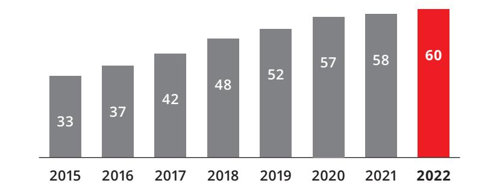

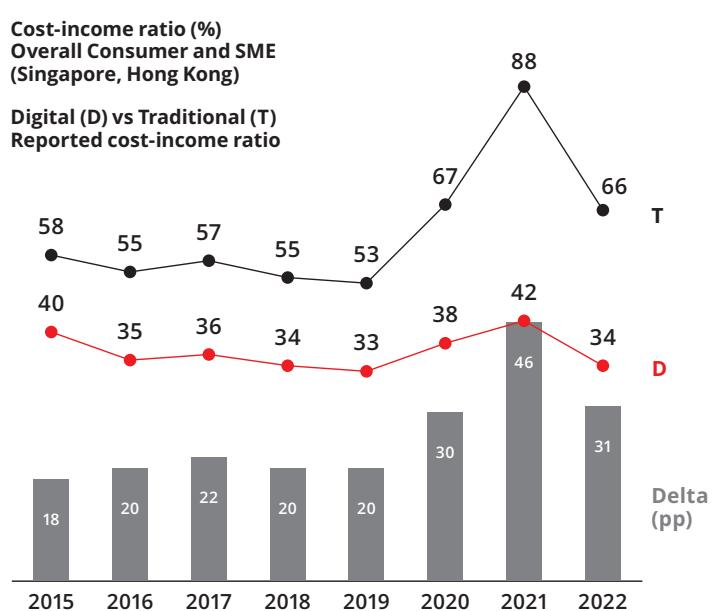

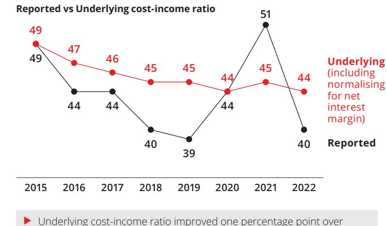

last year while delivering a five percentage point improvement over a seven year period.

- Cost-income ratios in 2022 moderated towards pre-Covid levels.
- ▶ The digital segment fared better over the Covid period due to its income resilience from a more diversified product base. As interest rates rose, the traditional segment benefitted disproportionately from its larger share of Casa base, contributing to a steeper improvement in cost-income ratio.

# (B) Business unit performance

Consumer Banking/ Wealth Management total income grew 25% to SGD 6.65 billion. Net interest income rose 68% to SGD 4.27 billion from a higher net interest margin and growth in loan and deposit volumes. Non-interest income fell 14% to SGD 2.38 billion on lower fee income from investment product sales and bancassurance. Expenses increased 13% to SGD 3.80 billion. Total allowances increased by SGD 112 million to SGD 158 million due mainly to higher general allowances. Profit before tax increased by 40% to SGD 2.69 billion.

Institutional Banking total income rose 28% to SGD 7.69 billion from higher net interest income, increased loan-related activities and stronger treasury customer flows, offset by lower capital market activities. Expenses increased 8% to SGD 2.25 billion. Total allowances declined by SGD 345 million to a write-back of SGD 204 million. Profit before tax rose 50% to SGD 5.64 billion.

Treasury Markets total income normalised to SGD 1.17 billion mainly due to lower contributions from equity derivatives and interest rate activities, partially offset by foreign exchange and credit activities. Expenses fell 4% to SGD 619 million from lower operating costs partially offset by higher staff costs. Profit before tax fell 34% to SGD 569 million.

The Others segment encompasses the results of corporate decisions that are not attributed to business segments. It includes earnings on capital deployed into high quality assets, earnings from non-core asset sales and certain other head office items such as centrally raised allowances. DBS Vickers is also included in this segment.

#### **Commercial book** Consumer Institutional **Treasury** (SGD million) Others Banking/ Wealth Total Banking Markets Management Year 2022 Net interest income 4,270 5,569 880 222 10,941 1,783 1,293 15 3.091 Net fee and commission income Other non-interest 601 826 91 952 2,470 income 6.654 7.688 986 1,174 16,502 **Total income** Expenses 3,803 2,254 414 619 7,090 Total allowances 158 (204)293 (10)237 Share of profits/ losses 203 4 207 of associates and JVs Profit before tax 5,638 482 9,382 2,693 569 Year 2021 2.548 3,999 1,110 783 8.440 Net interest income 2,186 1,282 56 3,524 Net fee and commission income Other non-interest 588 703 207 726 2,224 income **Total income** 5,322 5,984 1,373 1,509 14,188 3,353 2,086 383 647 6,469 Expenses (1) Total allowances 46 141 (130)(5) 52 Share of profits/ losses 109 109 of associates and IVs Profit before tax 1.923 3.757 1.229 867 7,776

### (1) Excluding one-time items

# **(C) Net interest income**

Commercial book net interest income, which excludes Treasury Markets, rose 40% to SGD 10.7 billion. Its full-year NIM rose 48 basis points to 2.11% from higher interest rates. The fourthquarter NIM was signiȴ cantly higher at 2.61%, having risen 100 basis points from fourthquarter 2021.

The increase in Commercial book net interest income was o set by a 72% decline in Treasury Markets net interest income to SGD 222 million due to higher funding costs for its operations. The drag in its net interest income is generally o set by gains in the non-interest income line.

As a result, overall net interest income grew 30% to SGD 10.9 billion.

Gross loans grew 4% or SGD 14 billion in constant-currency terms to SGD 420 billion. Non-trade corporate loans increased 5% or SGD 13 billion from broad-based growth across countries and sectors. Trade loans rose 4% or SGD 2 billion, with an increase in the ȴ rst half partially o set by a decline in the second half due to unattractive pricing. Housing loans grew 4% or SGD 3 billion, with the majority of the growth occurring in the second half. Other consumer loans fell 7% or SGD 3 billion as wealth management loans declined.

Deposits rose 7% or SGD 33 billion in constantcurrency terms to SGD 527 billion as ȴ xed deposit growth more than o set current and savings account outȵ ows. Our market share of Singapore savings deposits rose 0.7 percentage points during the year to slightly more than 53%.

### **Net interest margin (%)**

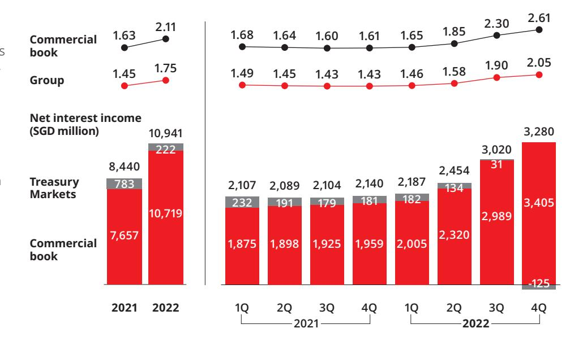

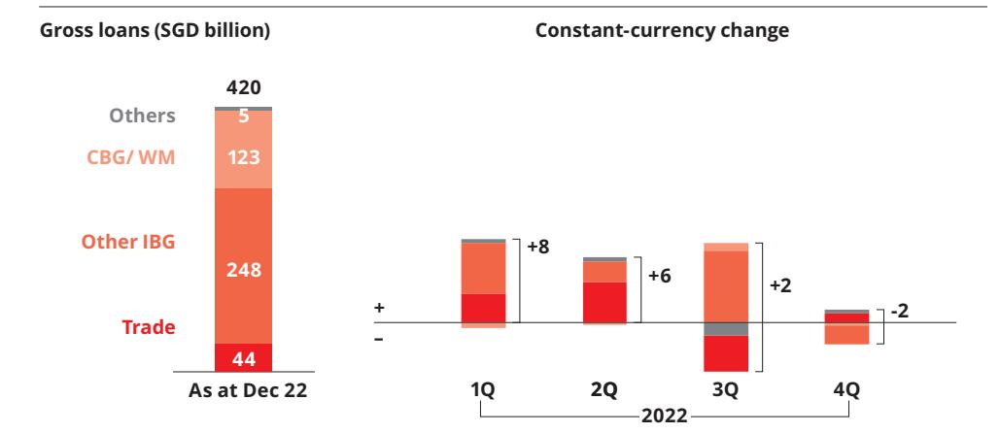

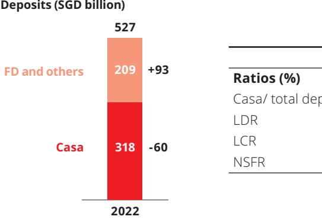

|                      | 2022 | 202΂ |
|----------------------|------|------|
| Ratios (%)           |      |      |
| Casa/ total deposits | 60   | 76   |
| LDR                  | 79   | 81   |
| LCR                  | 140  | 135  |
| NSFR                 | 117  | 123  |

### **(D) Non-interest income**

Net fee income fell 12% to SGD 3.09 billion. Wealth management fees declined 26% to SGD 1.33 billion as weaker market conditions led to lower investment product sales. Investment banking fees were also lower, by 44% to SGD 121 million, as capital market activities slowed.

*(1) Includes trade & remittances, guarantees and deposit-related fees*

*(2) Net of interchange fees paid*

### **Fee income**

| (SGD million)                       | 2022  | 202΂  | YoY% |
|-------------------------------------|-------|-------|------|
|                                     |       |       |      |
| Investment banking                  | 121   | 218   | (44) |
| Transaction services(΂)             | 929   | 925   | 0    |
| Loan-related                        | 459   | 413   | 11   |
| Cards                               | 858   | 715   | 20   |
| Wealth management(2)                | 1,330 | 1,786 | (26) |
| Fee and commission income           | 3,697 | 4,057 | (9)  |
| Less: Fee and commission expense    | 606   | 533   | 14   |
| Total net fee and commission income | 3,091 | 3,524 | (12) |

Other fee activities continued to grow. Card fees rose 20% to a new high of SGD 858 million as overall card spending reached a record and travel spending progressively recovered. Loan-related fees increased 11% to SGD 459 million. Transaction service fees were stable at SGD 929 million as higher cash management and trade fees were o set by lower brokerage commissions from institutional clients.

Other non-interest income rose 11% to SGD 2.47 billion, which was due mainly to Treasury Markets activities.

### **Other non-interest income**

| (SGD million)                                              | 2022  | 202΂  | YoY% |
|------------------------------------------------------------|-------|-------|------|
|                                                            |       |       |      |
| Net trading income                                         | 2,313 | 1,791 | 29   |
| Net income from investment securities                      | 115   | 387   | (70) |
| Others (include rental income and gain on ȴ xed assets) | 42    | 46    | (9)  |
| Total                                                      | 2,470 | 2,224 | 11   |
| Commercial book                                            | 1,518 | 1,498 | 1    |
| Treasury Markets                                           | 952   | 726   | 31   |
| Total                                                      | 2,470 | 2,224 | 11   |

### **(E) Expenses**

Expenses rose 10% to SGD 7.09 billion. The increase was led by a 13% increase in sta costs. Other costs also increased due to higher computerisation expenses.

### **Expenses (SGD million)()**

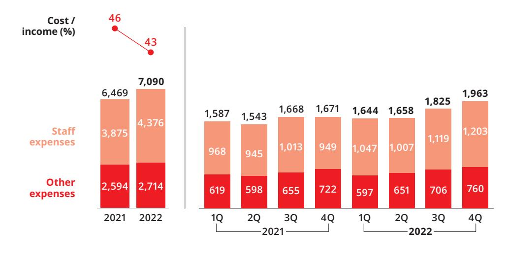

*(1) Excluding one-time item*

# **(F) Asset quality**

Non-performing assets fell 12% to SGD 5.13 billion. New non-performing asset formation was more than o set by repayments and writeo s as well as currency e ects. The NPL ratio improved from 1.3% to 1.1%.

Speciȴ c allowances fell 33% to SGD 335 million or eight basis points of loans. There was a general write-back of SGD 98 million from transfers to NPA, upgrades and repayments.

Allowance reserves continued to be high. General allowance reserves amounted to SGD 3.74 billion, which included SGD 2.05 billion of general allowance overlays. Together with speciȴ c allowance reserves of SGD 2.51 billion, total allowance reserves amounted to SGD 6.24 billion. Allowance coverage of non-performing assets was at 122% and at 215% when collateral was considered.

| (SGD million)                                                  | 2022                      | 202΂                      |
|----------------------------------------------------------------|---------------------------|---------------------------|
| NPAs at start of period                                        | 5,849                     | 6,686                     |
| IBG and others                                                 | (464)                     | (872)                     |
| New NPAs Upgrades, settlements and recoveries Write-o΍ s | 1,157 (1,002) (619) | 1,006 (1,345) (533) |
| CBG/ WM                                                        | (112)                     | (47)                      |
| Translation                                                    | (148)                     | 82                        |
| NPAs at end of period                                          | 5,125                     | 5,849                     |
| NPL ratio (%)                                                  | 1.1                       | 1.3                       |
| SP/ loans (bp)                                                 | 8                         | 12                        |
| Cumulative general and speciȴ c allowances as % of:            |                           |                           |
| NPA                                                            | 122                       | 116                       |
| Unsecured NPA                                                  | 215                       | 214                       |

26 **A Di erent Kind of Bank** DBS Annual Report 2022 **Our 2022 priorities** 27

# **Our 2022 priorities**

**We use a balanced scorecard approach to measure how successfully we are serving stakeholders and executing our long-term strategy. Our scorecard, which is based on our strategy, is used to set objectives, drive behaviours, measure performance and determine the remuneration of our people, making this a living tool.**

# **Traditional Key Performance Indicators (40%)**

### **Shareholders**

### **Achieve sustainable growth**

Measure ȴ nancial outcomes and risk related KPIs to ensure that growth is balanced against the level of risk taken, including compliance and control.

*Read more about this on page 27.*

### **Customers**

#### **Position DBS as bank of choice**

Drive progress in customer satisfaction, depth of customer relationships and strength of brand positioning.

*Read more about this on page 27 and 28.*

### **Employees**

### **Position DBS as employer of choice**

Assess advancement in being an employer of choice, including employee engagement and people development.

*Read more about this on page 28.*

# **Transform the Bank – Make Banking Joyful (20%)**

### **Transforming toward managing through customer journeys**

### **Design improvement in journey architecture for Managing through Journeys (MtJs)**

Improve and build capabilities for managing through customer journeys.

### **Deliver di erentiated customer experiences and superior outcomes**

Broaden the adoption of the new way of managing to additional customer journeys across the organisation, further leverage Artiȴ cial intelligence (AI)/ Machine learning (ML) and experimentation, and deepen focus on customer obsession to deliver di erentiated customer experience, superior ȴ nancial outcome, and joyful employee experience.

*Read more about this on page 29.*

# **Areas of focus (40%)**

### **Continue our transformation journey**

Scale the implementation of Horizontal Organisation and Data-Driven Operating Model (DDOM) across the rest of the bank, and incorporate e ective hybrid working and transformational leadership practices.

Industrialise use of AI/ ML and innovate at scale with continued investments in nextgeneration technology.

*Read more about this on page 30.*

### **Accelerate existing business**

Scale and drive value across the Group with strategic expansions and segment strategies across markets.

*Read more about this on page 30.*

### **Become a technology company**

Explore new income streams and opportunities for growth by leveraging our digital capabilities and emerging technology trends.

*Read more about this on page 31.*

### **Build a sustainable franchise**

Strengthen our risk and compliance framework, improve the resiliency of our systems, and champion e orts in responsible banking, responsible business practices and impact beyond banking.

*Read more about this on page 31.*

# **Traditional KPIs**

# **KPI/ Target Outcome**

### **Shareholders**

*20 to 25 in "CFO statement"*

*Read more about this on pages* 

Deliver consistent income growth

Total income rose 16% to SGD 16.5 billion, crossing the SGD 16 billion mark for the ȴ rst time. A higher net interest margin and loan growth of 4% more than o set a decline in wealth management and investment banking fee income.

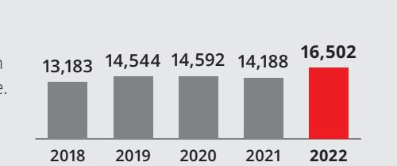

**Income (SGD million)**

Be cost eɝ cient while investing for growth, with cost-income ratio improving over time

The cost-income ratio improved by three percentage points to 43%. Expenses rose 10% to SGD 7.09 billion, led by higher sta costs.

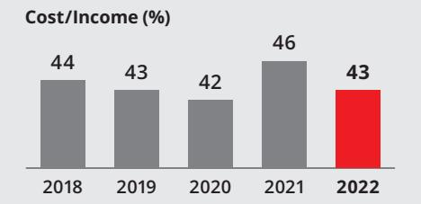

Grow exposures prudently, aligned to risk appetite

Asset quality was resilient. Non-performing assets (NPA) fell 12% as new NPA formation was low and more than o set by recoveries and write-o s. The NPL ratio improved from 1.3% to 1.1%.

Speciȴ c allowances declined to eight basis points of average loans. General allowances of SGD 98 million were written back compared to a writeback of SGD 447 million a year ago.

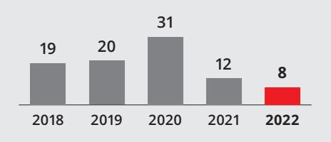

**Speciȴc allowances/ average loans (bp)**

Deliver consistent return on equity (ROE)

ROE rose to a record 15.0%, above previous highs clustered around 12-13%, reȵ ecting structural improvements in the franchise as average interest rates rose to more normalised levels.

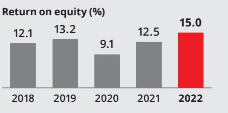

### **Customers** Achieve broad-

based increase in customer satisfaction across markets and segments

Customer satisfaction and CSISG scores rose among Consumer Banking customers, driven by enhancements to our digital platforms, increased product variety, and deeper engagement through leveraging data and personalised alerts. However, volatile market conditions a ected portfolio performance, impacting customer engagement amongst Wealth Management clients.

We retained our overall 2nd rank in market penetration across core markets for Large Corporates, and SME regional CE scores increased four years in a row. We also had a record haul of awards including "Best Bank for Real Estate", "World's Best Bank for SMEs" as well as ȴ rst global wins for DBS IDEAL as the "World's Best Integrated Corporate Banking Site".

### **Customer engagement score()**

|                                                           | 2022 2021 |           |
|-----------------------------------------------------------|-----------|-----------|
| CES for Consumer Banking                                  |           | 4.31 4.27 |
| CES for Wealth Management                                 |           | 4.26 4.27 |
| CES for SME Banking                                       |           | 4.45 4.41 |
| Asia-based Large Corporates Market Penetration Ranking | 2nd       | 2nd       |
| CSISG(2), Finance and Insurance Sector ratings         |           | 74.9 73.8 |
| CSISG, Finance and Insurance Sector rankings           | 2nd       | 5th       |

- *(1) Scale: 1 = worst and 5 = best. Based on Customer Satisfaction Survey (CSS) conducted by Aon Hewitt, Ipsos and Qualtrics for Wealth Management; and Kantar and Qualtrics for Consumer Banking. Based on Aon Hewitt for SME banking and Greenwich Associates for large corporates market penetration ranking.*
- *(2) Customer Satisfaction Index of Singapore, jointly developed by the Institute of Service Excellence at Singapore Management University and the Singapore Workforce Development Agency. The Banking CSISG Study is run in the fourth quarter every year.*

28 **A Di erent Kind of Bank** DBS Annual Report 2022 **Our 2022 priorities** 29

## **Traditional KPIs**

### **KPI/ Target Outcome**

**Customers** Deepen wallet share of individual and corporate customers

IBG non-interest income increased 7% to SGD 2.1 billion on the back of broad-based growth in loan fees and treasury customer sales, partly o set by lower capital market activities.

CBG non-interest income ratio decreased to 36%, reȵ ecting higher net interest income on deposit margin expansion in an elevated rate environment, coupled with lower income from bancassurance and investment products due to market uncertainties.

### **IBG non-interest income (SGD billion)**

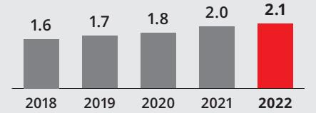

**CBG non-interest income ratio (%)**

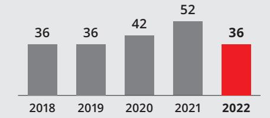

**Employees** Maintain employee engagement levels

With the easing of Covid-19 restrictions, our employees transited seamlessly into hybrid working arrangements. Whilst doing so, our engagement score continued to improve to 87% (+1%), bringing us from 91st percentile in 2021 to 93rd percentile in 2022 against a global benchmark. Dimensions with notable improvements include enabling productivity, customer focus and brand. We continued to receive the accolade of Kincentric Best Employer in Singapore and across APAC for the seventh year, and were certiȴ ed as Best Employer in eight other markets.

To maintain high employee engagement levels, we will continue to focus on workload as well as rewards and recognition to improve on survey follow-up.

### **My Voice employee engagement score (%)**

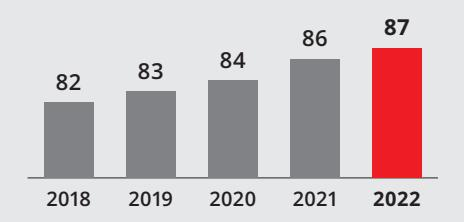

Provide our people with opportunities for internal mobility to enhance professional and personal growth

We are committed to building the long-term careers of our people by providing them with various career opportunities within the organisation. In 2022, we launched iGROW, an AI/ ML-powered personal career companion, to help employees identify future career aspirations and the skills required to reach these goals. iGROW brings together our various people programmes to empower employees in driving their own career growth. Our internal mobility rate improved slightly from 7.6% in 2021 to 7.7% in 2022.

### **Mobility: internal mobility rate (%)**

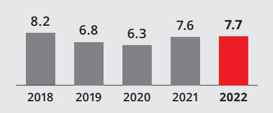

Maintain or reduce voluntary turnover

Our group-wide voluntary attrition rate increased from 13.7% in 2021 to 14.7% in 2022, comparable to pre-Covid (2018-2019) rates. This was largely due to an improvement in business conditions in 2022 compared to the Covid period. That said, our attrition rates across each core market were lower than the market average.

**Turnover (%)**

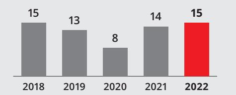

# **Transform the Bank – Make Banking Joyful**

### **KPI/ Target Outcome**

**Transforming toward managing through journeys**

Design improvement in journey architecture for managing through journeys (MtJs)

To better manage through journeys (MtJs), we established overall principles and approaches for systems and workȵ ows that facilitate collaboration between di erent teams. Business and technology teams have been aligned with MtJs, ensuring common technology prioritisation across units.

By implementing a framework to align performance management of the cross-functional teams under MtJs, we provided clarity and accountability over key drivers and business and customer outcomes. As a result, we have seen signiȴ cant positive impact from the new way of managing our businesses.

Deliver di erentiated customer experiences and superior outcomes

We made good progress in our Consumer Banking journeys.

In our Cards and Consumer Finance businesses, we developed new capabilities, strengthened customer value propositions, and optimised application journeys through customer immersions, use of AI/ ML, and experimentation. In our Consumer Finance business, we onboarded new ecosystem partners and transformed the unsecured lending experience across the region through data and digital capabilities. These initiatives resulted in high customer service scores in Singapore, Hong Kong and India.

In our Treasures business, we expanded the use of AI/ ML-driven contextual nudges to relationship managers (RMs) as well as to customers through digital channels. This led to increased customer engagement by 27% through RMs and 10% through digital channels. Our e orts to continuously identify and resolve customer pain points led to improvements in service response time in most markets. Beyond our Cards, Consumer Finance and Treasures businesses, we also scaled journey thinking across the rest of our consumer banking product and retail segments.

Our digital acquisition channel shares for Cards and Treasures remained ȵ at, while that for Consumer Finance saw an increase led by growth in Singapore and India. In both these countries, almost all loan origination is now fully digital.

| Digital Acquisition Channel Share    | 2021 | 2022 |
|--------------------------------------|------|------|
| Credit Card                          | 88%  | 87%  |
| Consumer Finance (Unsecured lending) | 76%  | 83%  |
| Treasures                            | 57%  | 56%  |

We enhanced and expanded our Institutional Banking journeys by working in horizontal teams and using AI/ ML and experimentation.

In our global supply chain business, we improved the transaction journey for suppliers and distributors. This resulted in strong growth in the number of suppliers and distributors to almost 6,500. We also saw signiȴ cant growth in assets (57%) and revenue (23%) as well as a strong customer satisfaction score of 4.51 out of 5.

In our SME business, our new way of working led to strong revenue growth as well as improvements in customer service scores in Singapore and Hong Kong. Embedding data-driven decisions into the daily fabric of our businesses helped drive Singapore SME CASA market share and reduced Hong Kong servicing call volumes by 20%.

Our transactional foreign exchange (FX) business saw our Treasury Markets, Global Transaction Services, and technology teams working horizontally, enabling greater nimbleness in responding to customers' needs and innovating with new products, services and experiences. We also used AI/ ML to enable continuous engagement with customers based on their activities and market movements. Our FX business saw a 15% growth in revenues and a customer satisfaction score of 4.47 out of 5.

*Read more about this in the Letter from the Chairman and CEO on page 8.*

30 **A Di erent Kind of Bank** DBS Annual Report 2022 **Our 2022 priorities** 31

# **Selected Areas of Focus**

# **Continue our**

**transformation** 

**journey**

Scale the implementation of Horizontal Organisation and Data-Driven Operating Model (DDOM) across the rest of the bank, and incorporate e ective hybrid working and transformational leadership

practices

### **KPI/ Target Outcome**

Through working horizontally and using AI/ ML operating models, support units such as HR, Finance, Risk, Legal & Compliance, and Audit have improved the e ectiveness and speed of decision-making. For example, our Finance team uses data control towers on deposit repricing to balance funding needs with marginal deployment rates, market conditions, and net interest income sensitivity impact in a timely manner.

We implemented an e ective 60:40 hybrid work environment and enabled productivity through streamlining of our processes and extensive use of technology tools. We also further reduced employee toil in our reporting journeys. These initiatives resulted in a Hybrid Working E ectiveness Score of 88% in the Kincentric My Voice survey 2022, 17 percentage points above that of APAC Financial Services Institutions and three percentage points above that of APAC Best Employers. Our Enabling Productivity scores also stood at 88%, four percentage points higher than last year.

We improved employee well-being with better beneȴ ts and deepened our e orts to equip our managers with transformational leadership capabilities through close to 200 team e ectiveness workshops and small-group mentoring sessions. We received positive feedback from employees on the revised beneȴ ts, and our manager e ectiveness and psychological safety scores improved to 91%.

Industrialise use of AI/ ML and innovate at scale with continued investments in next-generation technology

We made meaningful progress in driving exponential use of AI/ ML across the bank, delivering signiȴ cant economic impact. In addition, we enhanced our data platform's system performance and stability, and achieved a 30% reduction in deployment time of AI/ ML models. We enhanced our Responsible Data Use (RDU) framework by expanding the scope of models covered under AI governance.

We successfully executed our public cloud strategy, including leveraging public cloud to scale workloads in seconds. Our in-house platform Evolve PavedCloud has enabled a signiȴ cant increase in public cloud adoption over the last four years and reduced the time taken for applications to be onboarded securely onto public cloud by over 40%. CloudOps, our technology marketplace, automates complex services for our private cloud operations.

*Read more about this in the Letter from the Chairman and CEO on page 8 and CIO Statement on page 34.*

### **Accelerate existing businesses**

Scale and drive value across the Group with strategic expansions and segment strategies across markets

We further entrenched our digital bank leadership position in Singapore across both retail and SME segments. 95% of our retail customers are now onboarded digitally and we continued to drive holistic ȴ nancial planning through DBS NAV Planner, which has three million users. We also deepened customer engagement through PayLah!, which saw a 24% growth in transactions. For SME customers, we launched DBS 110 Quick Finance o ering instant application, underwriting and loan disbursement, contributing to our growth in micro-SME loan market share.

Continued Covid lockdowns in China resulted in limited progress in Hong Kong – Greater Bay Area (GBA) Wealth Connect and slower ECM & DCM deal activities in our Securities Joint Venture (SJV). Despite the challenges in the operating environment, our GBA business grew by 20% largely on the back of 67% growth in Open Account Trade (OAT) balances.

We successfully integrated Lakshmi Vilas Bank with DBS India. Our enlarged presence of over 520 branches across 350 locations, 2.5 million retail customers and 15,000 corporate customers provides a strong platform for the various businesses to accelerate growth. We continued to scale by leveraging strategic partnerships including those with Bajaj Finserv, to launch our ȴ rst-ever credit card in India, and with ODeX to provide straight-through credit solutions to freight forwarders. These initiatives helped deliver stronger consumer and SME assets growth, as well as higher income and proȴ tability.

DBS Taiwan will become the largest foreign bank in Taiwan when fully integrated with the consumer banking business of Citibank Taiwan in 2023. The acquisition will enable us to o er full-service commercial bank capabilities and accelerate growth with enlarged customer base and potential crosssell opportunities.

We deepened and expanded ecosystems partnerships in Indonesia, resulting in growth of lending volume and revenue by 148% and 145% respectively. Proȴ tability of digibank remains challenged despite improved new and existing customer quality and increased AUM levels. We continue to focus on the emerging aɞ uent segment, driving growth by leveraging on AI/ ML and continuous experimentation to improve proȴ tability.

*Read more about this in Letter from the Chairman and CEO on page 8 and Head of Consumer Banking/ Wealth Management Statement on page 38.*

# **Selected Areas of Focus**

### **KPI/ Target Outcome**

### **Become a technology company**

Explore new income streams and opportunities for growth by leveraging our digital capabilities and emerging technology trends

Despite a risk-o environment for crypto, we saw an increase in quantity of coins traded on DBS Digital Exchange (DDEx) as well as coins under custody in DBS. In addition, we enabled self-directed buying and selling of cryptocurrencies for accredited investors through our digibank app in Q3 2022.

Our other joint ventures also made encouraging progress. Partior won the Bank of International Settlement (BIS) G20 Techsprint Challenge 2022 with its solution that enables connectivity and interoperability for a multi-Central Bank Digital Currency (CBDC) network. Climate Impact X (CIX) successfully completed an auction with carbon ȴ nance business Respira to sell 250,000 tonnes of high-quality blue carbon removal credits, which were generated by the world's largest mangrove restoration project. The auction settled at a 40% premium to spot prices for other similar credits of the same 2021 vintage.

*Read more about this in Letter from the Chairman and CEO on page 8, Head of Institutional Banking Statement on page 36, and CIO statement on page 34.*

### **Build a sustainable franchise**

Strengthen our risk and compliance framework and champion e orts in responsible banking, responsible business practices and impact beyond banking

We strengthened our technology resiliency with the implementation of improved technology change and outsourcing management. This includes Site Reliability Engineering (SRE) practices relating to third-party vendors for our critical applications. We also continued to progress on our technology systems testing regime.

We extensively applied AI/ ML models to our transaction and fraud surveillance operations. Through these capabilities, we improved our e ectiveness and eɝ ciency in detection of AML bad actors. In addition, we also enhanced investigation capabilities and improved monitoring of customers' activities to bolster our fraud surveillance. This resulted in higher saved rates for our customers from fraud attempts.

We established a new Board Sustainability Committee to improve board oversight and engagement on our sustainability agenda and sharpened our focus on sustainability and climate-related matters. We achieved carbon neutrality in our own operations through our four-lever approach: reduce consumption, generate renewable energy, procure green energy, and purchase high quality Renewable Energy Certiȴ cates (RECs) and carbon credits to o set residual emissions.

We published our report on '*Our Path to Net Zero - Supporting Asia's Transition to a Low Carbon Economy*', which details our science-based decarbonisation pathways and interim 2030 decarbonisation targets across seven key sectors as well as ESG data coverage targets for two sectors. This set of decarbonisation targets marks our commitment to align our lending and ȴ nancing activities with net-zero emissions by 2050. Our committed sustainable ȴ nance transactions(3) in 2022 reached SGD 20.5 billion, exceeding our cumulative SGD 50 billion target two years ahead of our timeline of 2024.

We engaged 1 million customers on our LiveBetter platform and further enhanced our suite of sustainable products and services. We launched a carbon calculator which tracks our customers' carbon footprint based on purchases made with DBS cards and o ered customers the opportunity to o set their carbon footprint by purchasing high quality carbon credits.

Beyond deepening DBS Foundation's e orts in supporting social enterprises and other meaningful businesses to create impact beyond banking, we also expanded the Foundation's scope and scale to prepare communities for the future as we pave the way forward for a more equitable society. With the easing of pandemic restrictions, our employees volunteered over 140,000 hours, almost 40% higher than the previous year. Our e orts to promote Zero Food Waste also saw strong traction as we achieved more than 1,300 tonnes of food impact, more than double that of the previous year.

*Read more about this in the CIO statement on page 34, Head of Institutional Banking Statement on page 36, and Sustainability Report.*

### *(3) Sustainable ȴ nancing comprises-*

- *Green loans: Loans made exclusively to ȴ nance eligible green projects in energy eɝ ciency, pollution prevention and others*
- *Renewable energy loans (Project Finance related loans): Project ȴ nance related loans made to ȴ nance renewable and clean energy projects such as solar, wind and others. Project ȴ nance refers to those that cover advisory and arrangement of non/ limited-recourse ȴ nancing*
- *Sustainability-linked loans: Loans that are structured to enable customers to pay variable interest depending on their achievement of a set of pre-agreed ESG performance targets which are validated by an independent ESG rating agency or veriȴ cation party*
- *Transition loans: Loans to facilitate decarbonisation in line with companies' net-zero strategies. They can be structured as KPI-linked or use-of-proceeds*
- *Others: Others include sustainable loans, which are made exclusively to ȴ nance or reȴ nance eligible social (provision of a ordable basic infrastructure and access to essential services for vulnerable populations) and green (biodiversity conservation, green building) projects, and social loans, which are made exclusively to ȴ nance eligible social projects for a ordable infrastructure for target populations, access to basic services, and others*

32 **A Di erent Kind of Bank** DBS Annual Report 2022 **CRO statement** 33

# **CRO statement**

**Asset quality was resilient despite the rising economic headwinds; nevertheless, we remained vigilant given the uncertain outlook in 2023.**

# **Top and emerging risks**

The Board and senior management drive a robust process to identify and monitor our top and emerging risks.

As the global economy started to recover post pandemic, new challenges arose from the Russia-Ukraine conȵ ict, escalating US-China tensions, and headwinds from elevated inȵ ation and rising interest rates. We stayed vigilant and our portfolios remained resilient and asset quality stable.

In 2022, we continued to identify and monitor top and emerging risks across various areas, including (i) credit and portfolio management, (ii) environmental, social and governance (ESG) risks, (iii) market and liquidity risks, (iv) new business risks, (v) technology risk, (vi) ȴ nancial crime risk, (vii) data governance risk, and (viii) cyber security and data protection.

Our robust risk management e orts were recognised when DBS was awarded the "Best Risk Management" award at the 2022 Singapore Corporate Awards.

# **Credit risk and portfolio management**

In 2022, the Russia-Ukraine conȵ ict resulted in a slowdown of economic growth and increased inȵ ationary pressures across the commodities complex, including oil, gas, and food. Portfolio reviews were conducted in light of these developments. Many sectors, especially for industries with inelastic demand, were able to pass on the higher costs to their customers. While there were no immediate concerns, DBS continued to monitor for potential downstream e ects.

As inȵ ationary pressures persisted, central banks began raising interest rates in response. We evaluated our portfolios taking into account the potential impacts of higher interest rates, slower economic growth, and depreciation of multiple currencies against the USD. While the SMEs were assessed to be the most vulnerable, our SME portfolio had been well-tested in previous years and was mostly on a secured basis. Notwithstanding these headwinds, DBS' overall consumer credit quality remained stable. Residential mortgages, which were primarily in Singapore and Hong Kong, were mainly for owner-occupation and well-secured

with low loan-to-value ratios. Unsecured consumer credit loans represented less than 2% of the bank's total loan exposure.

Despite the challenges posed by China's zero-Covid policy and liquidity issues in the Chinese real estate market, our portfolio remained resilient as our corporate exposure was mainly to top industry players, and consumer exposure was limited. Our Chinese real estate exposures were mainly to larger and investment-grade names, with the remaining exposure generally well-secured. As contagion risks stayed elevated, we remained cautious and closely monitored our exposures.

We saw heightened US-China tensions with increasing military activity, trade restrictions, and the US chip ban. While there was no immediate impact to our portfolio, we continued to closely monitor the situation as it evolved.

We closely monitored our portfolios in Indonesia and India, which primarily consisted of lending to large corporates, to ensure that there was no deterioration in the portfolio amid rising interest rates and currency depreciation.

As headwinds in the macroeconomic and geopolitical environment are expected to persist, we will maintain a prudent approach in client selection and credit underwriting criteria to mitigate potential challenges.

To improve the quality of our risk management, we also made investments in our internal tools, such as the credit risk data infrastructure and workȵ ow management system for our Institutional Banking business. This has brought our relationship and risk managers together on a common platform, allowing us to continue to reȴ ne and streamline our end-to-end credit processes.

We also used artiȴ cial intelligence (AI)/ machine learning (ML) techniques to enhance our credit underwriting and early warning capabilities for our consumer and SME businesses. This was achieved by training and deploying our credit models, emphasising increasing eɝ ciency and speed, and incorporating external data from our partnerships. By doing so, we were able to expand our customer base, improve customer experience and increase model predictiveness to drive business success and strengthen risk management.

# **Environmental, social and governance (ESG) risks**

We recognise that climate change has risk implications on our portfolio and lending to high-risk sectors will in turn have an impact on the pace of climate change. Enhancing ESG risk capabilities and in particular integrating climate risk into our risk identiȴ cation, assessment and management therefore continues to be a top priority.

In 2022, we incorporated environmental risk into our Risk Appetite Statement, focusing on managing portfolio exposures to material climate transition and physical risks, and decarbonisation strategies. To further strengthen our ESG risk management, we developed (i) quantitative methodologies to assess climate-related transition and physical risks for our Institutional Banking Group lending portfolio, and (ii) a counterparty ESG risk scoring mechanism which forms part of our credit risk management framework.

Additionally, we launched comprehensive training programmes with climate risk speciȴ c modules to build bank-wide expertise and deepen knowledge in the ȴ eld.

*Read more about "Responsible ȴ nancing" in the Sustainability Report.*

# **Market and liquidity risks amidst market volatility**

2022 was a year of heightened macroeconomic uncertainty and volatility. We actively adjusted our market risk exposures and rebalanced hedges during the year. Regular and adhoc stress tests were conducted to evaluate the potential implications to our portfolios in the face of elevated interest rates.

As interest rates rose to levels not seen in the past decade, customer funds shifted from our current and savings accounts to ȴ xed deposits and other investments, including government securities. We took measures to maintain our deposit base and continued to do so through active re-pricing and customer engagement. Our liquidity proȴ le remains healthy and welldiversiȴ ed, with multiple avenues to access further wholesale funding whenever necessary.

# **New business risks**

In January 2022, DBS announced the acquisition of Citi's consumer banking business in Taiwan. The integration process is in progress and is expected to be completed in 2023. We do not anticipate any signiȴ cant impact on the consumer banking portfolio with the acquisition.

The integration of Lakshmi Vilas Bank has proceeded as expected. To e ectively manage the risks associated with the new products and expanded network, we have deepened the expertise of our risk management team. We have also strengthened processes for existing products to ensure e ective management over a larger footprint. The ȴ nal stage of system integration into DBS India Limited was successfully completed in December 2022.

# **Technology risk**

Our technology risk management framework is based on a three-pronged approach of risk evaluation, response and governance. As part of risk evaluation, we identify and analyse the risks, deȴ ne the risk metrics and monitor the issues, risk events and key risk indicators. Responses are made through risk-based decisions taking into account risk control and mitigation measures. Updates on our technology risk proȴ les are provided regularly to the various risk committees. Following an independent review on the November 2021 digital disruption in Singapore, we have taken remedial measures to improve the resilience of our services and incident response.

As the bank continues with the pace of technology advancement, we instituted initiatives and measures with focus on change management.

*Read more about how we balance resiliency with technology innovation in the "CIO statement" on page 34.*

# **Financial crime risk**

As part of our ongoing e orts to combat ȴ nancial crime, we have enhanced our risk mitigation programme by utilising technology and data analytics. We implemented a variety of AI/ ML tools to enhance our surveillance capabilities at the transaction, customer, and country level. Our customer due diligence process was further reȴ ned with dynamic analytical reviews based on changes in static data or transactional behaviour. We continued to place strong emphasis on public-private sector collaboration, actively participating in initiatives between ȴ nancial institutions and law enforcement agencies, including the planned Project COSMIC (Collaborative Sharing of Money Laundering / Terrorism Financing Information & Cases) to be launched in Singapore.

In 2022, we intensiȴ ed our e orts to address the risks posed by geopolitical developments, particularly those related to sanctions and attempts to evade them. We also enhanced controls to combat digital payment scams, which have been successful in protecting potential victims. In addition, we have been deploying new capabilities to detect money laundering and sanctions risks related to digital assets, such as blockchain-based tokens. Such capabilities allow us to better identify and mitigate risks across a wider range of digital assets.

# **Data governance risk**

We recognise that responsible practices around data governance are key for customer and stakeholder trust. Our data governance

framework was developed along the following three prisms: (i) a baseline prism encompassing data security, data quality, and legal and regulatory compliance, (ii) an ethical prism – PURE (Purposeful, Unsurprising, Respectful and Explainable) – for the responsible use of data, and (iii) a model governance prism, covering regulated and AI models and their performance over time.

# **Cyber security and data protection**

We faced a deteriorating cyber threat environment as geopolitical tensions escalated and cyber criminals and threat actors sought to target our customers and sta . To combat these threats, we strengthened our control environment to protect our people, information, network, equipment and applications. We stepped up security awareness campaigns and alerted our customers to emerging frauds and scams through timely security advisories. Despite these threats, we made signiȴ cant progress in addressing phishing scams in partnership with the regulators and authorities. Amid rising geopolitical tensions, we will remain vigilant and continue to enhance our control environment to stay ahead of the cyber threat curve.

**Soh Kian Tong Chief Risk Oɝ cer DBS Group Holdings**

# **2023 FOCUS AREAS**

- Further streamline end-to-end credit processes and controls across all markets
- Undertake proactive risk monitoring on emerging economic challenges and continue to strengthen portfolio management capabilities
- Enhance climate risk management and stress testing capabilities
- Mitigate ȴ nancial crime risk through controls, systems and analytics
- Continue to strengthen multi-layered cyber security defence
- Enhance IT resilience and technology change management

34 **A Di erent Kind of Bank** DBS Annual Report 2022 **CIO statement** 35

# **CIO statement**

**Our investment in our people and building a strong technological foundation have enabled us to be a di erent kind of bank. Our rallying call is to optimise our technology stack, scale outputs, and provide all-rounded customer and employee experiences that transform business outcomes.**

# **Introduction**

Amid growing geopolitical uncertainty and an increasingly challenging business climate, DBS continued focusing on innovation to retain our competitive advantage. We adopted a barbell strategy that spurs innovation and experimentation with new technologies on one end, while keeping a vigilant eye on resilience and risks on the other.

# **Driving innovation**

Digitalisation has become table stakes for ȴ nancial institutions, and many digital initiatives we embarked on over the past few years are now par for the course. To retain our lead and widen the gap between us and our competitors, we must continue creating di erentiated technology innovations.

Our artiȴ cial intelligence (AI)/ machine learning (ML) business use cases increased by seven times to 260, enabling us to achieve about SGD 150 million in revenue in 2022. We aspire to achieve SGD 1 billion in the next ȴ ve years.

Our AI deployments made it possible to deliver tailored customer experiences. About 3 million customers from NAV Planner, our intuitive digital advisory tool, beneȴ tted from hyperpersonalised nudges.

These capabilities are enabled by our in-house designed solutions including ADA, a data analytics platform, ALAN, an award-winning AI knowledge management hub, and our hybrid, multi-cloud infrastructure. ADA and ALAN shorten the time required to build and deploy AI models, improving our operations and decision-making.

Evolve PavedCloud, our DBS designed public cloud solution, enables public cloud adoption, and allows developers to deploy and manage applications securely and consistently. Public cloud adoption has increased over 17 times in the last four years. CloudOps, a self-service technology marketplace, automates and enhances the eɝ ciency of private cloud operations, and o ers platform visualisation.

Evolve PavedCloud and CloudOps have garnered strong market interest, especially among ȴ nancial institutions and government bodies embarking on their own cloud transformation journeys.

FIX Marketplace, Asia's ȴ rst digital and automated ȴ xed-income execution platform, directly connects issuers with investors. This promotes synergy, democratises capital allocation, and results in cost beneȴ ts and time eɝ ciencies. Over 80 trades, amounting to SGD 16 billion of issuances in various currencies have been executed.

Riding on the successes of our blockchainbased businesses DBS Digital Exchange, Climate Impact X and Partior, we are developing commercial use cases with new ȴ nancial engagement models and distributed ledger technology. Project Orchid, in collaboration with Open Government Products, uses tokenised SGD to facilitate live transactions with selected merchants, while Project Guardian tests the feasibility of Decentralised Finance (DeFi) trading for tokenised securities against tokenised cash. In Project Dunbar, we are exploring a common platform for Central Bank Digital Currencies (CBDCs) to enable greater eɝ ciency for wholesale cross-border payments.

We are continuously exploring metaverse use cases to provide value-added services to our customers. DBS is the ȴ rst bank in Singapore to partner The Sandbox – one of the largest metaverses on the Ethereum blockchain – and launch DBS BetterWorld, where we will demonstrate how technology can be used as a force for good. Technology & Operations (T&O) was also the ȴ rst in the bank to hold our townhall in the metaverse, setting the stage for further metaverse experiments across the bank.

# **Balancing innovation with resilience**

Even as we innovate, we continue being vigilant in building resilience and identifying potential technology threats. The evolving risk landscape makes Site Reliability Engineering (SRE) more vital than ever.

These changes occur against a backdrop of cutbacks in technology companies which enabled us to opportunistically acquire technology talents. We have doubled our e orts to diversify our technology workforce as we maintain continuity and tribal knowledge within technology teams.

DBS was one of the ȴ rst banks in Asia to set up an SRE practice. This enabled a secure acceleration of our release cadence, which increased by 50 times to 64,000 releases a month. Our Centre of Excellence creates software development toolkits which are embedded with SRE principles and will be plugged into our development process to increase resilience.

Our multi-year application transformation programme to modernise the bank's applications not only increases customer conȴ dence in DBS' systems, but also reduces employee toil. Through it, we have achieved faster time to market, sustainable eɝ ciency, and automated recovery.

With a hybrid-work future, cybersecurity e orts must be strengthened to address the larger attack surface and potential gaps in work processes. Our multi-layered defence includes micro-segmentation of our networks, and multi-factor authentication.

To safeguard customers from fraud, we deployed AI technology to detect and take prompt actions against phishing or scam attempts, with real-time pre-transaction blocking. We worked with the authorities and partners to implement new solutions, such as registering with the SMS Sender ID Registry to provide a secure banking experience.

We are growing our own timber and deepening our innovation DNA across three technological hubs in Asia. Our technology hubs in Singapore sit under DBS Tech Singapore, while DBS Asia Hub 2 has been rebranded as DBS Tech India. DBS Tech China, our third technological hub will open in Guangzhou in mid-2024 and entrench our expanded presence in the Greater Bay Area. These hubs will facilitate continuous innovation, provide diversity, and hone our talents as they learn from each other.

While we innovate at scale, it must be done in a safe and reliable manner. Our multiyear e ort to re-engineer operations has resulted in a uniȴ ed data-driven control tower, integrated workȵ ows and workbenches. We have eliminated manual work and improved connectivity, eɝ ciency and resiliency, and are able to manage operational risks with greater control, and provide insights for pre-emptive actions. Supporting this journey are our reusable digital assets, and automation, which have elevated customer and employee experiences.

# **Cultivating a diverse, future-ready workforce**

We reorganised the way we work through Managing through Journeys, where Technology, Business, Operations, and Support Units work together in crossfunctional teams and share technology prioritisation, goals and KPIs. This drives alignment, accelerates the cross-pollination of knowledge and skills, and leads to greater business impact.

Apart from redesigning the way we work, we recognise that our people are the driving force behind DBS' transformation, and have

implemented initiatives to foster a culture of innovation, growth, and customer centricity through life-long learning. Tech Academy further builds technical expertise through in-house curriculums developed by our subject matter experts. Since 2021, employees have completed 178,000 sessions across 82 modules. The Distinguished Engineers (DE) Programme o ers an alternative career path to the management track, and sees conferred engineers sharing their deep tech expertise with fellow colleagues. Separately, over 9,000 employees have taken data and AI upskilling courses, while 7,000 have attended our SRE Training Programme. Our Operations team is equally zealous in their e orts, with more than 4,400 of them learning to re-engineer our operations.

Equal emphasis is placed on leadership skills. Through Transformational Leadership Circle sessions, over 90 T&O leaders learned how to provide psychological safety, and push for a growth mindset, collaboration, feedback, and courageous conversations. They are on track to impact 1,200 more employees.

We are actively nurturing the next generation of talents. The DBS Fintech Apprenticeship Programme prepares polytechnic students for technology roles in the bank through masterclasses and mentorship by the DE engineers. We have groomed nearly 700 graduates with less than two years of work experience to become technologists through the Skill Enhancement Education and Development (SEED) programme. In addition, we helped over 300 mid-career Singaporeans build lasting ȴ ntech careers through the Technology in Finance Immersion Programme.

# **Banking sustainably for a better world**

We continue delivering positive impact towards a more sustainable future. We achieved our net-zero operational carbon emissions goal across the markets we operate in, and are on track for our operations in Singapore to solely rely on renewable energy by 2030. DBS Newton Green, Singapore's ȴ rst net-zero building by a bank, achieved net zero within three months of its opening.

To educate customers about their carbon footprint, we launched a Carbon Calculator in digibank. This industry-ȴ rst initiative in Singapore enables customers to monitor and o set their carbon footprint, which is calculated through tracking their credit and debit card purchases. Carbon Calculator impacted 430,000 unique customers within the ȴ rst eight months of its launch, and has o set 740 tonnes of carbon.

# **In closing**

Our digital transformation investments over the last decade have equipped us well for the journey ahead. We are strongly positioned with multiple world-class digital platforms, a capacity for continuous innovation, and a future-ready workforce that entrenches us as a di erent kind of bank.

We continue experimenting with new technologies such as human-like conversational AI, digital twins, and 5G, which could revolutionise banking. We are also keeping a pulse on the next wave of breakthroughs in areas such as human/ machine interfaces, and augmented and virtual reality technologies.

We expect these technologies to converge and bring forth extraordinary use cases. As we further tune our digital operations for greater agility, and deploy cutting-edge technologies in our o erings, we remain steadfast in our focus on our customers. We are strengthening an exceptional banking ecosystem that they trust and rely on, while delivering truly di erentiated customer experiences that set us apart from the rest. tom he

**Jimmy Ng Chief Information Oɝ cer DBS Group Holdings immy**

- Strengthen our technology infrastructure to maintain our lead
- Dial up on technology architecture, and building internal expertise for third party software and services, systems recovery, and incident management
- Drive improved developer journeys to enhance technology productivity
- Build operational resilience by re-engineering operations through technology and dial up on workbenches and workȵ ows
- Transition to an AI-fuelled Bank to achieve SGD 1 billion in revenue
- Innovate in blockchain and design additional Distributed Ledger Technology use cases
- Continue experimenting with new technologies and seek opportunities through DeFi, Web 3.0 and beyond

36 **A Di erent Kind of Bank** DBS Annual Report 2022 **Institutional Banking** 37

# **Institutional Banking**

**Our IBG business executed to strategy, enabled by our pervasive digital transformation that deepened customer relationships and ecosystems partnerships, while accelerating net zero transition through comprehensive and measurable actions.**

# **2022 overview**

2022 saw many unexpected challenges including headwinds from geopolitical tensions, deȵ ationary forces giving way to strong inȵ ation, coupled with high volatility in global markets and commodity prices. We also saw large and rapid interest rate rises from rock-bottom rates.

Despite this, the Institutional Banking Group (IBG) business executed to strategy and deepened client relationships. It reported solid ȴ nancial performance, boosted by higher net interest margin, as well as higher loan growth from increased client activities and demand. Through credit vigilance and consistent proactive monitoring of our portfolio, allowances remained low. The digital acceleration at the start of the pandemic in 2020 continued, and our pervasive digital transformation yielded stickier and deeper customer relationships as we embedded our solutions into customer and industry ecosystems.

# **Robust ȴ nancials despite macro challenges**

IBG's total income rose 28% to a record SGD 7.69 billion. Net interest income grew 39% from improved net interest margin as interest rates rose, as well as from increased client activities and loan demand.

Non-interest income grew 7% to a record high of SGD 2.12 billion. Our focus on cementing our position as customers' primary operating bank, coupled with cash mandates won, resulted in strong cash management performance. Growth in fees from cash management and loan-related activities o set declines in investment banking income. Treasury customer income rose 15% as customers took advantage of market volatility opportunities.

Allowances fell below pre-pandemic levels to a net writeback of SGD 204 million. Proȴ t before tax grew 50% to SGD 5.64 billion, driven by a higher interest rate environment, increased productivity and a lower cost-income ratio of 29% compared to 35% in FY2021.

# **Broad-based growth across industries and markets**

There was broad-based growth across industry segments from our focus around Energy Renewables and Infrastructure (ERI), Financial Institutions (FI), Real Estate and Telecoms, Media and Technology.

The ERI industry group saw growth momentum in the renewables sector with investments in energy security and diversiȴ cation into alternative energy sources driving advisory and ȴ nancing opportunities. Demonstrating our leadership position in the APAC renewables arena, DBS was sole ȴ nancial advisor to Taiya Renewable Energy, in forming a joint venture with EDF Renewables to bid for the development of a 440 megawatt o shore wind farm in Taiwan.

We grew our FI key accounts and participated in their increased deal ȵ ows in Asia. Revenues from the FI group grew 45% with deposit income strengthened by new cash application programming interface (API) mandates, as we capitalised on the private capital ȵ ows to Asia.

We continued to execute well across our various key markets. Our business in India saw good momentum as revenues grew 22%. This was bolstered by our expanded network across India with the integration of Lakshmi Vilas Bank which gave us the foundation to expand and deepen relationships with corporate customers. In Southeast Asia, Vietnam led the growth in our international markets with a 64% increase in revenue.

In Greater China, customers saw the value of our cash management and treasury and market solutions. Our Greater Bay Area strategy continued to capture business ȵ ows, resulting in a 24% increase in income.

# **Harnessing digital capabilities to deliver on ecosystem strategy and Global Transaction Services**

Our Global Transaction Services (GTS) business continues to be a strategic priority and a strong contributor to IBG, delivering over 40% of wholesale banking revenue. Our Trade & Supply Chain business continued to deliver strong asset growth, particularly with an increase of 13% in supply chain ȴ nance assets. GTS also saw a 28% increase in payment volumes and over 800 new Cash Management mandate wins.

We executed on key ecosystem partnerships, embedding sustainability and supply chain ȴ nancing solutions into our clients' ecosystems. As a result, our Open Account Trade revenues rose to new highs, growing 15%. Through our innovative partnerships with customers like Cainiao, we leveraged alternative data and API connectivity to create seamless ȴ nancing journeys for our small and medium enterprise

| SGD million                          | 2022                    | 2021                    | YoY%           |
|--------------------------------------|-------------------------|-------------------------|----------------|
| Total income • Corporate • SME | 7,688 5,638 2,050 | 5,984 4,595 1,389 | 28 23 48 |
| Expenses                             | 2,254                   | 2,086                   | 8              |
| Proȴ t before allowances             | 5,434                   | 3,898                   | 39             |
| Allowances                           | (204)                   | 141                     | NM             |
| Proȴ t before tax                    | 5,638                   | 3,757                   | 50             |

(SME) customers, while also fulȴ lling working capital needs. Across the various ecosystem partnerships, we saw a 30% increase in customers.

Our API calls more than tripled year-on-year, as customers put our digital solutions to business use.

# **Deepening engagement of mid-cap clients through industry expertise; rolling out AI/ ML solutions at scale for small enterprises**

We applied our industry expertise across di erent sectors to deepen engagement and support for our mid-sized corporate clients. This proved successful as revenues from the segment increased by 27%, with non-interest income growing at a robust 15%.

Revenues from SME banking grew a record 48%. Our leading digital capabilities enabled us to serve micro and small SME customers with speed and scale, while emerging technologies were used to help micro and small enterprises manage their credit risk.

To help SMEs navigate the inȵ ationary environment and rising interest rates, we rolled out 'DBS Quick Finance' in Singapore, enabling almost instant access to ȴ nancing of up to SGD 300,000. Through artiȴ cial intelligence (AI), machine learning (ML) and data analytics, the lending process has been reduced to just a minute to apply, a second to approve and in some instances, instant disbursement.

DBS has been proactively engaging SMEs identiȴ ed by our AI/ ML models at the earliest signs of trouble. Over 80% of identiȴ ed at-risk borrowers averted risk.

Overall, digital engagement with SME clients tripled year-on-year.

All this earned the SME Banking business two global accolades - "World's Best Bank for SMEs" by Euromoney and "Best SME Bank" by Global Finance.

# **Leading the industry in sustainable ȴ nancing and solutions**

DBS is the ȴ rst bank in Southeast Asia to announce sectoral targets that are aligned with science-based decarbonisation glidepaths in our report – "*Our Path to Net Zero – Supporting Asia's Transition to a Low-carbon Economy*".

DBS' commitment is one of the most comprehensive among global banks and our solutions span products and services, from loans, trade ȴ nancing, capital markets to strategic advisory. Transition ȴ nancing and structured solutions to help our clients execute their decarbonisation plans form key parts of what we have to o er.

We introduced green renovation loans to support SMEs looking to retroȴ t their commercial or industrial premises to more energy eɝ cient ȴ ttings; rolled out campaigns and special pricing packages to ȴ nance commercial electric vehicle ȵ eets; and worked with DBS Foundation on the SME Kickstarter Grant to promote sustsainable business practices.

Our sustainability portfolio grew to SGD 61 billion, exceeding our SGD 50 billion target well ahead of 2024.

# **Leading Asian bond and equity markets**

To facilitate the development of Asian bond markets at a faster and more cost-eɝ cient pace, DBS continued to gain momentum on its fully digital and automated ȴ xed income execution platform, FIX Marketplace. It was awarded "Global Financial Innovation of the Year 2022" by Euromoney. DBS also continued to dominate the SGD bond market in pole position with more than 30% market share.

As the leading equity house in the region, we took pride in spearheading the market development and introduction of the Special Purpose Acquisition Company (SPACs) framework in the Singapore market.

During the consideration period, DBS listed Singapore's ȴ rst SPAC backed by Temasek - Vertex Technology Acquisition Corporation Ltd. It also managed the Novo Tellus Alpha Acquisition initial public o ering listing on the Singapore Stock Exchange.

# **New way of working: Managing through Journeys**

In recent years, the comprehensive digitalisation of workȵ ows has given us the opportunity to dial up client centricity e orts. We started using design thinking, analytics, AI/ ML and agile practices to introduce a new way of working called 'Managing through Journeys' (MtJs). Through MtJs, we are redesigning our processes, constantly experimenting and working horizontally with subject matter competencies to deepen client engagement and produce better business outcomes.

We have seen success in the form of increased foreign exchange transaction volumes, total product holdings per client and customer satisfaction scores.

# **Looking ahead**

We enter the coming year with leverage from rising interest rates and good business momentum. We plan to build on our leadership in sustainability and redirect capital towards more sustainable outcomes.

We will also capitalise on more supply chain resiliency investments as we see outbound investments looking towards alternative supply sources and production bases in South and Southeast Asia.

We are optimistic that these initiatives will bode well for our business and will continue to focus on serving clients through our regional connectivity capabilities and industry expertise. Whilst there will be continued geopolitical and inȵ ationary risks leading to volatile markets, we plan to mitigate these through combining the use of predictive analytic tools with robust processes, to continue being proactive and vigilant in our risk management.

**Tan Su Shan Institutional Banking DBS Group Holdings**

# **2023 FOCUS AREAS**

- Di erentiate DBS as a leader in sustainable ȴ nance
- Through deeper investments in our GTS solutions and technology, capture more cross-border trade ȵ ows and deepen ecosystem relationships
- Continue to lead in digital leadership from API, connectivity, and ecosystems solutions
- Enhance credit vigilance, know-your customer and anti-money laundering and credit processes

38 **A Di erent Kind of Bank** DBS Annual Report 2022 **Consumer Banking/ Wealth Management** 39

# **Consumer Banking/ Wealth Management**

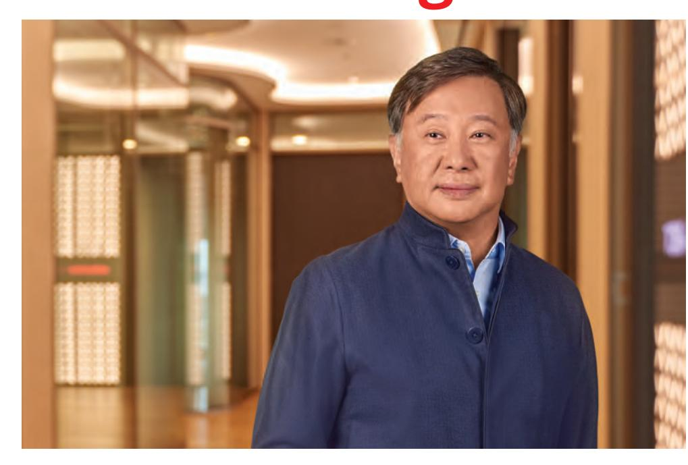

**Digitalisation is now the baseline. The real test for the bank is how we leverage our scale, assets, digital capabilities and people to create innovative solutions that help our customers grow and protect their wealth.**

## **2022 overview**

Amid a volatile macro environment, Consumer Banking/ Wealth Management achieved a robust set of results and maintained a healthy balance sheet. We beneȴ tted from the tailwinds that came through higher interest rates, although growth was moderated by market uncertainty which impacted wealth management fee activities. Business momentum was sustained by record-high net new money ȵ ows into the region and the expansion of our consumer ȴ nance business. We further bolstered our e orts to use artiȴ cial intelligence (AI) and machine learning (ML) capabilities to deepen customer engagement, which also yielded good results. We will continue to expand our business footprint and advance our digital solutions to deliver seamless and di erentiated customer experiences.

# **Consumer Banking/ Wealth Management: Strong interest income growth cushions macro impact**

We delivered solid earnings, driven by higher interest income. Our total income rose 25%

to SGD 6.65 billion, due to substantial net interest margin expansion and growth in loan and deposit volumes. With an improved costincome ratio, net proȴ t before tax grew 40% to SGD 2.69 billion.

Net interest income rose 68% to SGD 4.27 billion, driven by Fed rate hikes, stronger deposit earnings, and loan volume growth in most of our markets. This was partially o set by intensifying competition and accelerated reȴ nancing of home loans. Nonetheless, we maintained our market share lead in Casa deposits and the mortgage loan space in Singapore.

Non-interest income fell 14% to SGD 2.38 billion as investments and bancassurance faced headwinds from market uncertainty. These declines were however o set by growth in card and loan-related fees. Card fees rose 20% to SGD 858 million, as travel spending returned to pre-pandemic levels in most markets. Despite soft consumer demand, the bancassurance business maintained its lead in Singapore for new business market share.

# **Wealth Management: Sustained growth buoyed by net new money**

Our wealth franchise continued its strong performance, with total wealth management income increasing 20% to SGD 3.27 billion. Net new money inȵ ows more than doubled to a record SGD 24 billion, with assets under management (AUM) climbing 3% in constantcurrency terms to SGD 297 billion.

Growing client interest in succession planning and wealth preservation fuelled the growth of our Family Oɝ ce business. Of the 700 Single Family Oɝ ces set up in Singapore, DBS Private Bank onboarded more than one-third of them. Our Family Oɝ ce AUM more than doubled in the last two years. For the third consecutive year, DBS Trustee saw record fund inȵ ows in excess of SGD 1 billion.

More clients shifted to sustainable investments that have MSCI ESG ratings of BBB and above. Today, they make up more than 60% of our AUM. With DBS Foundation and private equity ȴ rm Heritas Capital, we launched the Asia Impact First Fund to drive impact-ȴ rst investing and support promising social enterprises.

We rolled out self-directed crypto trading via DBS digibank, enabling accredited investors to trade cryptocurrencies on DBS Digital Exchange (DDEx), one of the world's ȴ rst bank-backed digital exchanges. Today, nine in 10 trades are executed digitally.

The wealth management business continued to be recognised globally. We clinched the top honour of "Asia's Best Bank for Wealth Management" from Euromoney and were once again named "Most Innovative Private Bank in the World" by Global Finance. We were also accorded "Best Wealth Manager Asia" by The Asset for the sixth consecutive year. DBS digibank (Wealth), our digital wealth management platform, was also named "Best Digital Portal for Wealth Clients" by Cutter Research for the ȴ fth year running.

# **Consumer Banking: Leveraging AL/ ML and ecosystem partnerships to deepen engagement**

One of our biggest di erentiators is how we use data analytics and AI/ ML to better serve our customers. Every month, we leverage our AI/ ML models to generate 45 million hyperpersonalised nudges that are sent to some ȴ ve million customers across the region to guide them towards better investment and ȴ nancial planning decisions.

Some one million nudges have also been delivered to our bankers so they can provide more informed and personalised advisory. DBS NAV Planner, our AI-powered digital

| SGD million                                     | 2022                    | 2021                    | YoY%           |
|-------------------------------------------------|-------------------------|-------------------------|----------------|
| Total income • Retail • Wealth Management | 6,654 3,382 3,272 | 5,322 2,593 2,729 | 25 30 20 |
| Expenses                                        | 3,803                   | 3,353                   | 13             |
| Proȴ t before allowances                        | 2,851                   | 1,969                   | 45             |
| Allowances                                      | 158                     | 46                      | > 100          |
| Proȴ t before tax                               | 2,693                   | 1,923                   | 40             |

ȴ nancial planning tool, has improved our customers' ȴ nancial health. The average AUM of DBS NAV Planner users is 59% higher than non-users. Of the three million NAV Planner users, more than one-third are active users every month.

DBS PayLah! usage continues to grow with more than 25 million logins a month, where users book tickets and rides, pay bills, and scan and pay at more than 180,000 points in Singapore. Every month, we record more than one million scan-to-pay transactions at some 12,000 hawker stalls – six times the number in 2019. We also partnered UnionPay and PromptPay so customers can use DBS Paylah! beyond Singapore in 45 markets.

To help customers better manage their ȴ nances, DBS partnered Mastercard and Pine Labs to o er a "Buy Now Pay Later" option to some two million DBS/ POSB credit cardholders in Singapore, Indonesia and Hong Kong. This enables them to enjoy interest-free instalments with ȵ exible repayment periods in physical and e-commerce stores.

We strengthened our presence overseas by scaling our ecosystem partnerships. In markets where we do not have a large physical distribution network, we were able to expand our consumer ȴ nance business by working with nine ecosystem partners such as ByteDance and Ctrip (China), Home Credit and CRED (India) and Kredivo (Indonesia) to o er lending solutions to their customers.

The volume of loans DBS disbursed across these markets grew 30 times between 2019 and 2022 to SGD 1.7 billion. These partnerships enabled us to acquire customers digitally, leverage data to augment our AI/ ML models, and increase customer engagement. In India, we partnered an India-based ȴ nance and investment services ȴ rm, IIFL, to scale the gold loans business. We grew this portfolio by 33% year-on-year and gold loan gains contributed about 40% of DBS' sales volume growth in India in 2022.

The amalgamation of Lakshmi Vilas Bank (LVB) into DBS Bank India Limited has enabled us to accelerate our growth. Consumer banking revenue in India has grown by 50% between 2021 and 2022. We partnered Bajaj Finance to launch our ȴ rst co-branded credit card in some 120 cities in India.

We are deepening our footprint in the Greater Bay Area (GBA) through the Wealth Management Connect (WMC) scheme. DBS Bank (Hong Kong)'s ȴ rst two partnerships were with the Postal Savings Bank of China, one of the largest retail banks in China, and with DBS Bank (China). We recently announced in May our third partnership with the Shenzhen Rural Commercial Bank, making DBS Bank (Hong Kong) the only bank with three WMC Southbound service partnering banks.

We are on track to complete the integration of Citi Taiwan's consumer banking business into DBS Taiwan in August 2023. When completed, the transaction will accelerate DBS Taiwan's growth by at least 10 years to become the market's biggest foreign bank.

# **Bolstering agility to better serve customers**

We have expedited our transformation to a data-driven, agile organisation that puts our customers at the heart of everything we do. This new way of working, what we call Managing through Journeys (MtJs), galvanises technologists, relationship managers and business teams to leverage our data and digital capabilities to deliver new o erings more quickly. Across our markets, we operationalised MtJs performance cells in key consumer ȴ nance products and customer segments. We made good progress, launching features such as a new online client onboarding process for personal loans in Taiwan and smart fee waivers in Singapore.

# **Helping our customers live sustainably and ȴ ght inȵ ation**

We continued to encourage customers to adopt sustainable living habits with our green o erings.

DBS LiveBetter, a one-stop digital sustainability platform in DBS digibank, is now available in Singapore and Hong Kong. To date, more than one million customers engaged with the platform such as accessing eco-friendly tips; tracking and o setting their carbon footprint with the industry's ȴ rst autonomous carbon calculator. Some 1,000 tonnes of carbon

emissions have been o set. DBS LiveBetter users have also invested some SGD 8 million in green funds and donated over SGD 700,000 towards environmental and social causes.

Amid persistently high inȵ ation and rising cost of living, we were the ȴ rst bank in Singapore to launch a 'Fight Inȵ ation' package last August, equipping those earning less than SGD 2,500 a month with solutions to stretch their dollar. They included rebates and cashback o ers on their everyday spend. We were also the only bank that o ered a competitive HDB loan that is on par with HDB's concessionary loan rate.

As a small gesture of encouragement to the community amid inȵ ationary times, DBS launched an initiative to subsidise ȴ ve million hawker meals over 12 months in Singapore.

### **What we look forward to**

We believe that digitalisation has become the baseline, and the real litmus test for the bank will be how we leverage data and technology to create innovative solutions that can help our customers protect and grow their wealth, and secure their ȴ nancial wellness. It is now more critical than ever to help customers navigate these uncertain times with conȴ dence. Our scale, assets, digital capabilities and people will be the essential levers of positive impact that can foster a more equitable and inclusive society.

**Sim S Lim Consumer Banking/ Wealth Management DBS Group Holdings**

# **2023 FOCUS AREAS**

- Continue to bolster our 'phygital' strategy by expanding AI/ ML capabilities and transforming our physical touchpoints to better engage with customers
- Sustain the wealth business growth momentum by capturing inȵ ows and delivering sustainable fee income stream from the region, including the GBA
- Accelerate our consumer ȴ nance business overseas by onboarding new ecosystem partners
- Further entrench our MtJs transformation to empower more people to embrace agile journey thinking and deliver better customer outcomes

# **POSB Highlights in 2022**

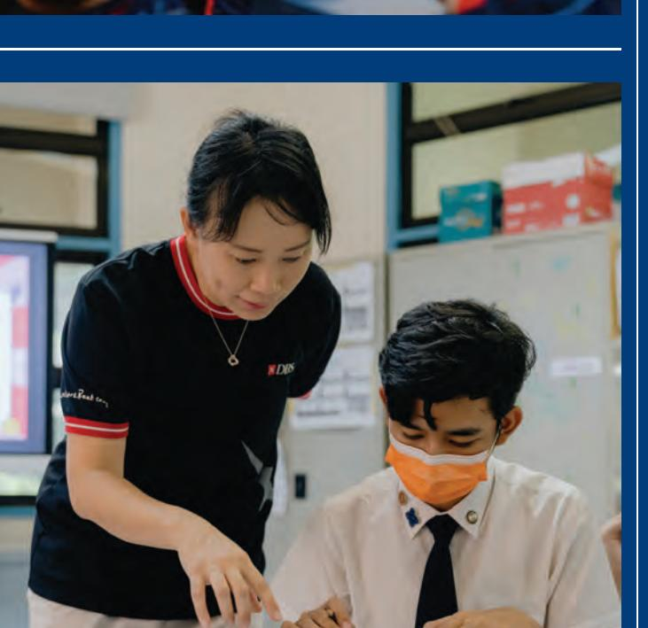

# **Neighbours ȴ rst, bankers second**

**As Singapore's oldest and most loved bank, POSB takes pride in serving generations of Singaporeans from all walks of life since our founding in 1877. While our neighbourhoods and lifestyles have changed with the times, we stayed true to our mission of being the "People's Bank" that provides pioneering** 

**solutions that cater to the evolving needs of all segments of the population. They include children, young adults, families, seniors and the community at large. By widening our reach in the community through various initiatives, we remain committed to bringing value to Singaporeans.**

# **For children and families**

# **POSB Smart Buddy Programme**

We continued to expand the world's ȴ rst integrated in-school savings and payments programme to more schools. The POSB Smart Buddy programme, which was launched in 2017, creates a contactless payments ecosystem within the school environment to help cultivate sensible savings and spending habits among young students in an interactive, engaging manner. These students are then better equipped to achieve ȴ nancial wellness when they transition to the next stage of their lives.

We were the ȴ rst bank to sign a Memorandum of Understanding with the Ministry of Education (MOE) to install a digital payment infrastructure in more than **330** primary, secondary schools, junior colleges/ Millennia Institute and special education (SPED) schools within three years. Under the partnership, we will also provide up to **400,000** students with smartwatches and cards for payments.

Today, some **70,000** students in more than **100** schools are using Smart Buddy smartwatches and cards for digital payments. The programme also supports needy students under the MOE Financial Assistance Scheme. To date, about **60** Smart Buddy schools are administering meal subsidies to some **5,000** students via POSB Smart Buddy.

# **POSB PAssion Run for Kids**

Singapore's largest charity kids run organised a hybrid race, which included a virtual race and onsite sustainability-themed activities. Our beach clean-up and tree planting activity entered the Singapore Book of Records as the Largest Mass Plogging event and raised over **SGD 930,000**.

To date, we have raised **SGD 11.6 million**, with more than **790,000** children beneȴ tting from **198** programmes. One of the marquee programmes included a "EcoHeroes@Home" programme to encourage children and their families to reduce energy consumption at home.

# **Financial literacy workshops for kids and working adults**

We partnered community partners, SPED schools and social service agencies to organise **70** ȴ nancial literacy workshops for more than **2,600** kids and those with special needs. These sessions included bank branch visits to familiarise participants with banking services.

Together with the Singapore Stock Exchange and People's Association (PA), we organised over **13** virtual and physical workshops for more than **3,000** working adults to raise their awareness of retirement, estate planning and investment.

# **For seniors**

# **POSB digital literacy workshops**

We stepped up our digital literacy programmes for seniors, which included a newly created anti-scam and cybersecurity workshop that was co-developed with the Singapore Police Force, National Crime Prevention Council and Cyber Security Agency of Singapore. In 2022, we organised more than **130** virtual and physical workshops, engaging some **5,300** seniors.

Besides deepening collaborations with agencies such as the Infocomm Media Development Authority (IMDA), the Council for Third Age and PA, we worked with new partners such as TOUCH Community Services to empower more seniors. We were a key partner of IMDA's inaugural Digital for Life Festival, which involved more than **65,000** participants and visitors.

# **For the community**

The DBS Foundation contributed **SGD 1 million**, which includes the government's dollar-for-dollar matching, to the Digital for Life movement and stepped up our volunteer participation to bolster digital inclusion e orts in Singapore. The broad-based support, through our strategic collaboration with IMDA, includes jointly launching community programmes and organising workshops to raise digital and ȴ nancial literacy. Through our People of Purpose movement, our employees in Singapore will run the workshops. We aim to reach **100,000** Singaporeans and residents across various community segments, such as youths, persons with disabilities, seniors and hawkers over the next two years.

A Different Kind of Bank DBS Annual Report 2022 Corporate governance

# Corporate governance

# **Awards**

We received several accolades for our corporate governance in 2022, including but not limited to the following Gold awards at the Singapore Corporate Awards 2022 (For companies with SGD 1 billion and above in market capitalisation):

- i) Best Managed Board; and
- ii) Best Risk Management.

### **Governance framework**

Our governance framework is anchored on competent leadership, effective internal controls, a strong risk culture and accountability to stakeholders. Our Board plays a key role in setting our governance standards to meet our stakeholders' expectations, and our leadership model ensures an appropriate balance of power, accountability and independence in decisionmaking across our various functional and geographic units.

Our corporate governance practices comply with the Banking (Corporate Governance) Regulations 2005 (Banking Regulations) and the Financial Holding Companies (Corporate Governance of Designated Financial Holding Companies with Bank Subsidiary) Regulations 2022 (FHC Regulations) (together with the Banking Regulations, the Regulations). We also comply, in all material aspects, with the Guidelines on Corporate Governance for Designated Financial Holding Companies, Banks, Direct Insurers, Reinsurers and Captive Insurers issued by the Monetary Authority of Singapore (MAS) on 9 November 2021 (Revised CG Guidelines), which comprise:

- i) the Code of Corporate Governance 2018 (2018 Code); and
- ii) the additional guidelines added by the MAS to take into account the unique characteristics of the business of banking, given the diverse and complex risks undertaken by financial institutions (Additional Guidelines).

The expectations in the Revised CG Guidelines that relate to disclosures are effective from 1 January 2022 and will apply to financial institutions' annual reports covering financial years commencing from 1 January 2022.

We have described our corporate governance practices for our financial year ended 31 December 2022 with specific reference to the 2018 Code and the Additional Guidelines. A summary disclosure of our compliance with the express disclosure requirements in the 2018 Code and the Additional Guidelines, have been provided on pages 108 to 110.

### Competent leadership

#### Our board

**Key Information on our Directors** 

### Chairman

#### Mr Peter Seah

Our Chairman, Mr Peter Seah, sits on all Board committees (other than the recently established Board Sustainability Committee) and also chairs the Board Executive Committee (EXCO). Mr Seah performs a key role as an ambassador for DBS in our dealings with various stakeholders as well as in ensuring effective communication with our shareholders. He guides the Board through its decision-making process and ensures that the Board operates effectively as a team.

# **Board**

10 Members

Mr Peter Seah Mr Piyush Gupta Mr Olivier Lim\* Mr Chng Kai Fong Dr Bonghan Cho Mr Ho Tian Yee

Ms Punita Lal Ms Judy Lee Mr Anthony Lim Mr Tham Sai Choy

The Board directs DBS in the conduct of its affairs and provides sound leadership to management. We have 10 Board members (including two female directors) with a broad range of experience and deep industry expertise. The make-up of our Board reflects diversity of gender, nationality, age, skills and knowledge. Independent Directors form the maiority of the Board, and there are no alternate Directors on our Board.

### \*Lead Independent director

The Lead Independent director, Mr Olivier Lim, had regular private sessions with the other independent Directors in the course of the year and provided feedback to the Chairman where necessary.

### Chairman, Board and CEO

There is a very positive and constructive working relationship between our Chairman, Mr Peter Seah and CEO, Mr Piyush Gupta. Mr Gupta oversees the execution of DBS' strategy and is responsible for managing the day-to-day operations. Other than the CEO, none of the other Directors is a former or current employee of DBSH or its subsidiaries.

The table below sets out key information on our Directors, the number of meetings which our Directors attended during 2022 as well as the remuneration for each Director

for financial year ended 31 December 2022 (FY2022). The remuneration of Non-Executive Directors (including the Chairman) does not include any variable component. Please refer

to pages 56 to 57 for more details on the Non-Executive Directors' fee structure for FY2022.

43

|                                                                                                                                                                |                    |                              |    |   | s attend to 31 De | Total Directors' remuneration for FY2022 (SGD) |   |                              |                                      |                     |                |                       |
|----------------------------------------------------------------------------------------------------------------------------------------------------------------|--------------------|------------------------------|----|---|----------------------|---------------------------------------------------|---|------------------------------|--------------------------------------|---------------------|----------------|-----------------------|
| Director                                                                                                                                                       | BOD (1) | NC (2)            |    |   |                      |                                                   |   | Offsite (7)       | BSC (8)                   | Directors'          | Share-based    | Others (c) |
| Independence status                                                                                                                                            |                    | No. of meetings held in 2022 |    |   |                      |                                                   | ı | fees (a) (SGD) | remuneration (b) (SGD) | (SGD)               |                |                       |
|                                                                                                                                                                | 5                  | 5                            | 12 | 4 | 5                    | 4                                                 | 1 | 1                            | 2                                    | (333)               | (365)          |                       |
| Mr Peter Seah, 76 Non-Executive and Non-Independent Chairman                                                                                                   | 5                  | 5                            | 12 | 4 | 5                    | 4                                                 | 1 | 1                            |                                      | Total: 1,946,901.41 |                | l                     |
| <ul><li>Chairman since 1 May 10</li><li>Board member since 16 Nov 09</li><li>Last re-elected on 30 Apr 20</li></ul>                                            | 5                  | 5                            | 12 | 4 | 3                    | 4                                                 | ' | '                            | -                                    | 1,329,300           | 569,700        | 47,901.41             |
| <b>Dr Bonghan Cho, 58</b> Non-Executive and Independent Director                                                                                               | 5 5                |                              |    | 1 | _                    | 4                                                 | 1 | 1                            |                                      | Total: 299,000      |                |                       |
| <ul><li>Board member since 26 Apr 18</li><li>Last re-elected on 31 Mar 22</li></ul>                                                                            |                    |                              |    |   |                      |                                                   |   |                              |                                      | 209,300             | 89,700         | -                     |
| Mr Ho Tian Yee, 70 Non-Executive and Non-Independent Director                                                                                                  |                    |                              |    |   |                      |                                                   |   |                              |                                      |                     | Total: 214,000 |                       |
| <ul> <li>Board member since 29 Apr 11</li> <li>Last re-elected on 30 Apr 20</li> <li>Stepped down as Lead Independent Director on 29 Apr 20</li> </ul> | 5                  | -                            | -  | - | 5                    | -                                                 | 1 | 1                            | -                                    | 149,800             | 64,200         | -                     |
| Mr Olivier Lim, 58 Non-Executive and Lead Independent Director                                                                                                 |                    |                              |    |   |                      |                                                   |   |                              |                                      |                     | Total: 429,000 |                       |
| <ul> <li>Board member since 7 Nov 17</li> <li>Last re-elected on 31 Mar 22</li> <li>Lead Independent Director since 29 Apr 20</li> </ul>                   | 5                  | 5                            | 12 | - | 5                    | -                                                 | 1 | 1                            | -                                    | 300,300             | 128,700        | -                     |
| <b>Mr Tham Sai Choy, 63</b> Non-Executive and Independent Director                                                                                             | 5 5                |                              | _  | 4 | 5                    | _                                                 | 1 | 1                            | <b>2</b> (d)              |                     | Total: 407,782 |                       |
| <ul><li>Board member since 3 Sep 18</li><li>Last re-elected on 31 Mar 22</li></ul>                                                                             |                    |                              |    |   |                      |                                                   |   |                              |                                      | 285,447.40          | 122,334.60     | -                     |
| Ms Punita Lal, 60 Non-Executive and Independent Director                                                                                                 | 5                  | 5                            | _  | 4 | _                    | 4                                                 | 1 | 1                            |                                      |                     | Total: 293,500 |                       |
| <ul><li>Board member since 1 Apr 20</li><li>Last re-elected on 30 Mar 21</li></ul>                                                                             |                    | J                            |    | , |                      | 7                                                 |   |                              |                                      | 205,450             | 88,050         | -                     |
| Mr Anthony Lim, 64 Non-Executive and Independent Director                                                                                                      | F                  |                              | 43 |   |                      |                                                   |   |                              |                                      |                     | Total: 369,500 |                       |
| <ul> <li>Board member since 1 Apr 20</li> <li>Last re-elected on 30 Mar 21</li> </ul>                                                                          | 5                  |                              | 12 |   | 5                    | 4                                                 | 1 | 1                            |                                      | 258,650             | 110,850        | -                     |
| Mr Chng Kai Fong, 44  Non-Executive and                                                                                                                        |                    |                              |    |   |                      |                                                   |   |                              |                                      |                     | Total: 292,282 |                       |
| <ul><li>Non-Independent Director</li><li>Board member since 31 Mar 21</li><li>Last re-elected on 31 Mar 22</li></ul>                                           | 5                  | 4                            | -  | 4 | -                    | -                                                 | 1 | 1                            | <b>2</b> (e)              | 292,282             | -              | -                     |

|                                                                                                                                                     |                    | Meetings attendance record (1 January to 31 December 2022) |                     |                   |                     |                     |     |                        |                         |                | Total Directors' remuneration for FY2022 (SGD)           |                       |  |
|-----------------------------------------------------------------------------------------------------------------------------------------------------|--------------------|---------------------------------------------------------------|---------------------|-------------------|---------------------|---------------------|-----|------------------------|-------------------------|----------------|-------------------------------------------------------------|-----------------------|--|
| Director                                                                                                                                            | BOD (1) | NC (2)                                             | EXCO (3) | AC (4) | BRMC (5) | CMDC (6) | AGM | Offsite (7) | BSC (8)      | Directors'     | Share-based                                                 | Others (c) |  |
| Independence status                                                                                                                                 |                    | No. of meetings held in 2022                                  |                     |                   |                     |                     |     |                        |                         |                | remuneration (b)                                 | (SGD)                 |  |
|                                                                                                                                                     | 5                  | 5                                                             | 12                  | 4                 | 5                   | 4                   | 1   | 1                      | 2                       | (SGD)          | (SGD)                                                       |                       |  |
| Ms Judy Lee, 55 Non-Executive and Independent Director                                                                                        | 5                  | _                                                             | _                   | 4                 | 5                   | 4                   | 1   | 1                      | <b>2</b> (f) | Total: 365,282 |                                                             |                       |  |
| <ul><li>Board member since 4 Aug 21</li><li>Last re-elected on 31 Mar 22</li></ul>                                                                  |                    |                                                               |                     |                   |                     |                     |     |                        | _                       | 255,697.40     | 109.584.60                                                  | -                     |  |
| <ul> <li>Mr Piyush Gupta, 63</li> <li>Executive Director/ CEO</li> <li>Board member since 9 Nov 09</li> <li>Last re-elected on 30 Mar 21</li> </ul> | 5                  | 5#                                                            | 12#                 | 4#                | 5#                  | <b>4</b> #          | 1   | 1                      | <b>2</b> (g) | Report or      | efer to the Remur n page 63 for deta EO's compensatio | ils on the            |  |

- Appointment Dates
- Mr Gupta attended these meetings at the invitation of the respective committees.
- (1) Board of Directors (BOD)
- (2) Nominating Committee (NC)
- (3) Board Executive Committee (EXCO)
- (4) Audit Committee (AC)
- (4) Audit Committee (AC)
  (5) Board Risk Management Committee (BRMC)
- (6) Compensation and Management Development Committee (CMDC)
- (7) This is our annual board strategy offsite
- (8) Board Sustainability Committee (BSC)
- (a) Fees payable in cash, in 2023, for being a Director in 2022. This is 70% of each Director's total remuneration and is subject to shareholders' approval at the 2023 AGM.
- (b) This is 30% of each Director's total remuneration and shall be paid in the form of DBSH ordinary shares. The actual number of DBSH's ordinary shares to be awarded will be rounded down to the nearest share, and any residual balance will be paid in cash. This is subject to shareholders' approval at the 2023 AGM.
- (c) Represents non-cash component and comprises for Mr Peter Seah: car and driver.
- (d) Mr Tham Sai Choy was appointed as member of the BSC on 11 February 2022.
   (e) Mr Chng Kai Fong was appointed as member of the BSC on 11 February 2022. Director's remuneration payable to Mr Chng Kai Fong will be paid fully in cash to
- a government agency, the Directorship and Consultancy Appointments Council.
- (f) Ms Judy Lee was appointed as member of the BSC on 11 February 2022.
- (g) Mr Gupta was appointed as chairman of the BSC on 11 February 2022.

(Note: Directors are also paid attendance fees for Board and Board committee meetings, as well as for attending the AGM and the annual Board offsite.)

### 2022 board composition

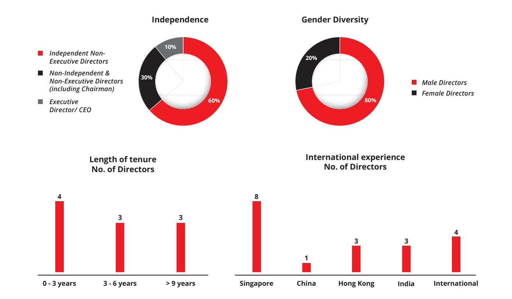

# **Board and Board Committee Composition and Key Responsibilities**

### Members **Composition requirements Key Responsibilities Board** • Sets the strategic direction and long-term goals of DBS, and ensures that In compliance with the Regulations, the Board comprises adequate resources are available to meet these objectives. a majority of directors who • Monitors the responsibilities delegated to the Board committees to ensure are independent and who are proper and effective oversight and control of DBS' activities. Singapore citizens or permanent • Establishes a framework for risks to be assessed and managed. residents. • Reviews management performance. • Determines DBS' values and standards (including ethical standards) and ensures that obligations to its stakeholders are understood and met. • Ensures that corporate responsibility and ethical standards underpin the conduct of DBS' business. • Develops succession plans for the Board and CEO. • Considers sustainability issues (including environmental and social factors) as part of DBS' strategy. **Board meetings and activities** Board and Board committee meetings are scheduled well in advance of each year in consultation with the Directors. There are five scheduled Board meetings each year. Ad-hoc meetings are also held when necessary. Please refer to the Board highlights – 2022 section on pages 49 to 50 for more information on the key focus areas of the Board in 2022. Before each Board meeting, the Chairman oversees the setting of the agenda of Board meetings, in consultation with the CEO, to ensure that there is sufficient information and time to address all agenda items. The agenda also allows for flexibility when needed. Directors are provided with complete information related to agenda items in a timely manner. All materials for Board and Board committee meetings are uploaded onto a secure portal which can be accessed on tablet devices provided to the Directors. During every quarterly Board meeting: • the Chairperson of each Board committee provides an update on significant matters discussed at the Board committee meetings which are typically scheduled before the quarterly Board meeting; • the CFO presents the financial performance for that the quarter/ applicable period and significant financial highlights; • the CEO gives an update on certain aspects of the Group's business and operations and/ or a macro perspective on industry trends and developments; • the Board holds a private session for Directors; and • the Lead Independent Director holds a private session with the other independent Directors. In addition to the quarterly Board meetings, a Board meeting is typically scheduled in December each year where the CEO gives the Board an update on DBS' performance against the balanced scorecard for that financial year. In addition, the CEO and CFO will present the Group's budget for the next financial year to the Board for approval. The Chairman promotes open and frank debates by all Directors at every Board meeting. If there is a conflict of interest, the Director in question will recuse himself or herself from the discussions and abstain from participating in any Board decision. When exigencies prevent a Director from attending a Board or Board committee meeting in person, that Director can participate by telephone or video-conference. Directors have the discretion to engage external advisers. External professionals or in-house subject matter experts may also be invited to present key topics to the Board as well as updates on corporate governance, risk management, capital, tax, accounting, listing and other regulations, which may have an impact on DBS' affairs.

45

46 **A Di erent Kind of Bank** DBS Annual Report 2022 **Corporate governance** 47

|                                                                                                                                                                                                           |                                                                                                                                                                                                                                                                                                                                                                                                                                                                                                                                                                                                                          | Directors have independent access to the Group Secretary. The Group Secretary attends all Board meetings and minutes are prepared to record key deliberations and decisions taken during the meetings. The Group Secretary facilitates communication between the Board, its committees and management, and generally assists Directors in the discharge of their duties. The Group Secretary helps with the induction of new Directors. The appointment and removal of the Group Secretary require the approval of the Board.                                                                                                                                                                                                                                                                                                                                                                                                                                                                                                                                                                                                                                                                          |
|-----------------------------------------------------------------------------------------------------------------------------------------------------------------------------------------------------------|--------------------------------------------------------------------------------------------------------------------------------------------------------------------------------------------------------------------------------------------------------------------------------------------------------------------------------------------------------------------------------------------------------------------------------------------------------------------------------------------------------------------------------------------------------------------------------------------------------------------------|--------------------------------------------------------------------------------------------------------------------------------------------------------------------------------------------------------------------------------------------------------------------------------------------------------------------------------------------------------------------------------------------------------------------------------------------------------------------------------------------------------------------------------------------------------------------------------------------------------------------------------------------------------------------------------------------------------------------------------------------------------------------------------------------------------------------------------------------------------------------------------------------------------------------------------------------------------------------------------------------------------------------------------------------------------------------------------------------------------------------------------------------------------------------------------------------------------------------------|
|                                                                                                                                                                                                           |                                                                                                                                                                                                                                                                                                                                                                                                                                                                                                                                                                                                                          | Annual Board strategy o΍ site Each year, the Board and our senior executives attend a strategy o΍ site held in one of our markets, which allows them to:                                                                                                                                                                                                                                                                                                                                                                                                                                                                                                                                                                                                                                                                                                                                                                                                                                                                                                                                                                                                                                                           |
|                                                                                                                                                                                                           |                                                                                                                                                                                                                                                                                                                                                                                                                                                                                                                                                                                                                          | • focus on DBS' long-term strategy apart from the regular agenda at the quarterly Board meetings; • engage in dynamic and in-depth strategic discussions to promote deeper understanding of our business environment and our operations, and reȴ ne our strategy; and • engage with our stakeholders in the host country (such as regulators, media, customers including CEOs and CFOs of our corporate clients and sta΍ in the local franchise).                                                                                                                                                                                                                                                                                                                                                                                                                                                                                                                                                                                                                                                                                                                                                   |
|                                                                                                                                                                                                           |                                                                                                                                                                                                                                                                                                                                                                                                                                                                                                                                                                                                                          | The 2022 Board strategy o΍ site was held in the third week of September 2022. Please refer to the Board highlights – 2022 section on page 49 for more information on the discussions during the 2022 Board strategy o΍ site.                                                                                                                                                                                                                                                                                                                                                                                                                                                                                                                                                                                                                                                                                                                                                                                                                                                                                                                                                                                       |
|                                                                                                                                                                                                           |                                                                                                                                                                                                                                                                                                                                                                                                                                                                                                                                                                                                                          | Frequent and e΍ ective engagement Directors have ongoing interactions across various levels, functions and countries within DBS. In addition, some Directors also sit on the boards of our overseas subsidiaries; this arrangement gives the Board access to ȴ rst-hand insight on the activities of these subsidiaries. The CFO provides the Board with detailed ȴ nancial performance reports monthly.                                                                                                                                                                                                                                                                                                                                                                                                                                                                                                                                                                                                                                                                                                                                                                                                  |
|                                                                                                                                                                                                           |                                                                                                                                                                                                                                                                                                                                                                                                                                                                                                                                                                                                                          | Directors also have various opportunities to interact with members of the Group Management Committee (GMC) (for instance, at quarterly Board-hosted dinners and during the annual board strategy o΍ site).                                                                                                                                                                                                                                                                                                                                                                                                                                                                                                                                                                                                                                                                                                                                                                                                                                                                                                                                                                                                         |
|                                                                                                                                                                                                           |                                                                                                                                                                                                                                                                                                                                                                                                                                                                                                                                                                                                                          | Delegation by the Board to the Board committees The Board has delegated authority to various Board committees to enable them to oversee certain speciȴ c responsibilities based on their terms of reference. The terms of reference of each Board committee set out the responsibilities of the Board committee, conduct of meetings including quorum, voting requirements and qualiȴ cations for Board committee membership. All our Board committees (other than the BSC) comprise non-executive Directors only. Any change to the terms of reference for any Board committee requires Board approval. The minutes of Board committee meetings, which records the key deliberations and decisions taken during these meetings, are circulated to all Board members for their information.                                                                                                                                                                                                                                                                                                                                                                                                |
| Nominating Committee (NC) • Mr Tham Sai Choy (Chairperson) • Mr Olivier Lim (Lead Independent Director) • Dr Bonghan Cho • Ms Punita Lal • Mr Peter Seah • Mr Chng Kai Fong | In accordance with the requirements of the Regulations, a majority (four out of six members of the NC including the NC Chairperson) are Non Executive and Independent Directors (INED). The Lead Independent Director is a member of the NC. All NC members are required to be re-appointed by the Board annually. Under the Regulations, every NC member shall hold oɝ ce until the next annual general meeting following that member's appointment, and shall be eligible for re-appointment. The appointment and re-appointment of NC members require the prior | • Regularly reviews the composition of the Board and Board committees, and independence of Directors; • Identiȴ es, reviews and recommends Board appointments for approval by the Board, taking into account the industry knowledge, skills, background, experience, professional qualiȴ cations, age and gender of the candidate and the needs of the Board; • Conducts an annual evaluation of the performance of the Board, the Board committees and the Directors; • Implements the Board Diversity Policy and reviews its e΍ ectiveness; • Exercises oversight of the induction programme and continuous development programme for Directors, and ensures that ȴ rst-time directors with no prior experience as a director of a listed company in Singapore undergo relevant training; • Reviews and recommends to the Board the re-appointment of each Director having regard to his/ her performance, commitment and ability to contribute to the Board as well as his/ her age and skillset; • Assesses annually whether each Director has suɝcient time to discharge his/ her responsibilities; and • Reviews the Board's succession plans for Directors. |
|                                                                                                                                                                                                           | approval of MAS.                                                                                                                                                                                                                                                                                                                                                                                                                                                                                                                                                                                                         |                                                                                                                                                                                                                                                                                                                                                                                                                                                                                                                                                                                                                                                                                                                                                                                                                                                                                                                                                                                                                                                                                                                                                                                                                          |

**Members Composition requirements Key Responsibilities**

| Members                                                                                                                                                      | Composition requirements                                                                                                                                                                                                                                                                                                                                                                                                                                                   | Key Responsibilities                                                                                                                                                                                                                                                                                                                                                                                                                                                                                                                                                                                                                                                                                                                                                                                                                                                                                                                                                                                                                                                                                                                                                                                                                                                                                                                                                                                                                                                                                                                                                                                                                                                                                                                                                                                                                                                                                                                                                                                                                                                                                                                                                                                                                                                                                                                                                                                                                                                                                                                                                                   |
|--------------------------------------------------------------------------------------------------------------------------------------------------------------|----------------------------------------------------------------------------------------------------------------------------------------------------------------------------------------------------------------------------------------------------------------------------------------------------------------------------------------------------------------------------------------------------------------------------------------------------------------------------|----------------------------------------------------------------------------------------------------------------------------------------------------------------------------------------------------------------------------------------------------------------------------------------------------------------------------------------------------------------------------------------------------------------------------------------------------------------------------------------------------------------------------------------------------------------------------------------------------------------------------------------------------------------------------------------------------------------------------------------------------------------------------------------------------------------------------------------------------------------------------------------------------------------------------------------------------------------------------------------------------------------------------------------------------------------------------------------------------------------------------------------------------------------------------------------------------------------------------------------------------------------------------------------------------------------------------------------------------------------------------------------------------------------------------------------------------------------------------------------------------------------------------------------------------------------------------------------------------------------------------------------------------------------------------------------------------------------------------------------------------------------------------------------------------------------------------------------------------------------------------------------------------------------------------------------------------------------------------------------------------------------------------------------------------------------------------------------------------------------------------------------------------------------------------------------------------------------------------------------------------------------------------------------------------------------------------------------------------------------------------------------------------------------------------------------------------------------------------------------------------------------------------------------------------------------------------------------|
| Board Executive Committee (EXCO) • Mr Peter Seah (Chairperson) • Mr Olivier Lim • Mr Anthony Lim                                              | In accordance with the requirements of the Regulations, a majority (two out of three members of the EXCO) are INEDs.                                                                                                                                                                                                                                                                                                                                              | • Approves certain matters speciȴ cally delegated by the Board such as acquisitions and divestments up to a certain material limit, credit transactions, investments, capital expenditure and expenses that exceed the limits that can be authorised by the CEO; • Reviews weak credit cases on a quarterly basis; • Oversees the governance of strategic risks such as technology, artiȴ cial intelligence and data (including data privacy and appropriate use of data); and • Reviews and provides recommendations on matters that will require Board approval, including acquisitions and divestments exceeding certain material limits.                                                                                                                                                                                                                                                                                                                                                                                                                                                                                                                                                                                                                                                                                                                                                                                                                                                                                                                                                                                                                                                                                                                                                                                                                                                                                                                                                                                                                                                                                                                                                                                                                                                                                                                                                                                                                                                                                                             |
| Audit Committee (AC) • Mr Tham Sai Choy (Chairperson) • Dr Bonghan Cho • Ms Punita Lal • Ms Judy Lee • Mr Peter Seah • Mr Chng Kai Fong | In accordance with the requirements of the Regulations, a majority (four out of the six members of the AC including the AC Chairperson) are INEDs. Mr Tham possesses an accounting qualiȴ cation and was formerly the managing partner and Head of Audit of KPMG, Singapore. All members of the AC are non-executive directors, and have recent and relevant accounting or related ȴ nancial management expertise or experience. | Financial reporting and disclosure matters • Monitors the ȴ nancial reporting process, signiȴ cant ȴ nancial reporting issues and judgements to ensure the integrity of the Group's consolidated ȴ nancial statements; • Reviews the Group's consolidated ȴ nancial statements, other ȴ nancial disclosures (including Basel Pillar 3 disclosures) and any announcements relating to the Group's ȴ nancial performance prior to submission to the Board; and • Provides oversight of external disclosure governance. Internal controls • Reviews (in parallel with the Board Risk Management Committee) the adequacy and e΍ ectiveness of internal controls, such as ȴ nancial, operational, compliance and information technology controls, as well as risk management systems; • Receives updates on signiȴ cant incidents of non-compliance with laws and regulations, and reviews management's investigations of such incidents; • Reviews and monitors remedial action plans to address signiȴ cant internal control deȴ ciencies identiȴ ed by management, Group Audit, the external auditor and/ or regulators; • Ensures that there are policies and arrangements in place by which DBS sta΍ and any other persons may, in conȴdence, raise concerns about possible improprieties in matters of ȴnancial reporting or other matters and ensures that arrangements are also in place for such concerns to be independently investigated and for appropriate follow-up action to be taken; • Reviews the signiȴ cant matters raised through the whistle-blowing channel; and • Reviews all material related party transactions (including interested person transactions) and keeps the Board informed of such transactions, and the ȴ ndings and conclusions from its review. Internal audit • Reviews at least annually, the independence, adequacy and e΍ ectiveness of the Group's internal audit function (Group Audit) and processes, and ensures that Group Audit is adequately resourced and set up to carry out its functions, including approving its budget; • Reviews Group Audit's audit plans, the proposed areas of audit focus, and results of audits; • Ensures that an internal quality assurance review (QAR) of Group Audit is conducted annually, and that an independent QAR is conducted at least once every ȴ ve years; and • Approves the hiring, removal, resignation, evaluation and compensation of the Head of Group Audit. |

| Members                                                                                                                                                      | Composition requirements                                                                                                                                | Key Responsibilities                                                                                                                                                                                                                                                                                                                                                                                                                                                                                                                                                                                                                                                                                                                                                                                                                                                                                                                                                                                                           |
|--------------------------------------------------------------------------------------------------------------------------------------------------------------|---------------------------------------------------------------------------------------------------------------------------------------------------------|--------------------------------------------------------------------------------------------------------------------------------------------------------------------------------------------------------------------------------------------------------------------------------------------------------------------------------------------------------------------------------------------------------------------------------------------------------------------------------------------------------------------------------------------------------------------------------------------------------------------------------------------------------------------------------------------------------------------------------------------------------------------------------------------------------------------------------------------------------------------------------------------------------------------------------------------------------------------------------------------------------------------------------|
| Compensation and Management Development Committee (CMDC)  Mr Anthony Lim (Chairperson) Dr Bonghan Cho Ms Punita Lal Ms Judy Lee Mr Peter Seah                | In accordance with the requirements of the Regulations, a majority (four out of the five members of the CMDC including the CMDC Chairperson) are INEDs. | <ul> <li>Exercises supervisory oversight of the overall principles, parameters and governance of DBS' remuneration policy and ensures the alignment of compensation with prudent risk taking to build a long-term sustainable business;</li> <li>Oversees the remuneration of senior executives and Directors, including making recommendations to the Board on the remuneration of executive directors; and</li> <li>Exercises oversight on management development and succession planning of the Group and ensures that robust plans are in place to deepen core competencies and bench strength as well as strengthen leadership capabilities and talent pipeline for the continued success of the Group.</li> </ul>                                                                                                                                                                                                                                                                                                        |
| Board Sustainability Committee (BSC)  Mr Piyush Gupta (Chairperson)  Mr Tham Sai Choy  Ms Judy Lee  Mr Chng Kai Fong  Dr Ben Caldecott (Non-Director member) | There are currently no specific composition requirements prescribed under Singapore regulations.                                                        | <ul> <li>Oversees DBS' plans and approves strategies, goals, and targets in relation to the Group's sustainability pillars: Responsible Banking, Responsible Business Practices, and Impact Beyond Banking;</li> <li>Reviews and approves the Group's Sustainability Report, including approaches to meet disclosure requirements such as regulatory specifications or listing obligations;</li> <li>Reviews and approves the Group's climate-related disclosures, including business and financial implications, which may arise from climate-related stress tests, and consider viability of proposed responses;</li> <li>Exercises oversight of the Group's Board and Management governance framework on sustainability matters (e.g., Group Sustainability Council), taking into account regulatory expectations, including those for material operating subsidiaries; and</li> <li>Oversees emerging sustainability issues and the strategies and outreach programmes for engaging our key stakeholder groups.</li> </ul> |

\* Names denoted in red are INEDs.

# Highlights of Board and Board Committees – 2022

### **Board highlights - 2022**

### **Focus on Strategy**

The Board had comprehensive and rigorous discussions in the course of 2022 on how DBS could create value for all stakeholders by (i) leveraging on its technology strengths to build new engines of growth; (ii) accelerating growth in various Asian markets; (iii) increasing and entrenching our market-leading sustainability efforts; and (iv) formulating a strategy for entrenching our Singapore market leadership by leveraging on digitalisation and technology. During the annual Board strategy offsite (which was held in September 2022), the Board actively deliberated on, *inter alia*:

- geopolitical developments on global supply chains and Asian businesses, and macroeconomics;
- our Greater China strategy;
- evolution and future landscape of the digital finance space and our competitive advantage;
- view and current expectations of traditional, institutional and venture-capitalist/ growth investors as well as our communication outreach; and
- sustainability issues.

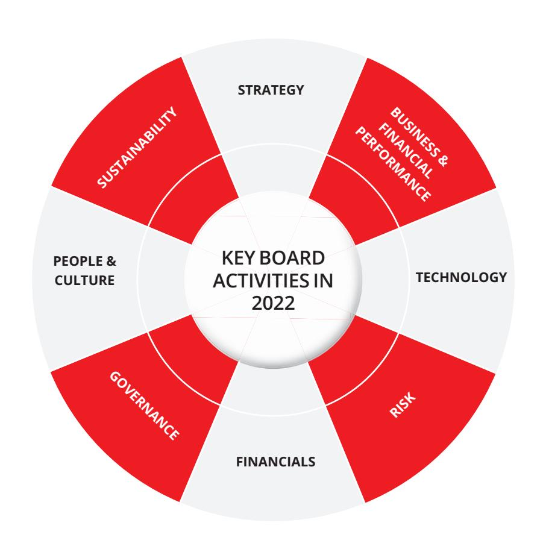

50 **A Di erent Kind of Bank** DBS Annual Report 2022 **Corporate governance** 51

### **Technology, Risks and Resiliency Improvement Plan**

The Board had an in-depth discussion on the independent technology review remediation conducted by KPMG and our Resiliency Improvement Plan updates. In particular, the KPMG independent technology review provided important observations and recommended opportunities for improvement in key areas surrounding DBS' digital banking processes. The updates on our Resiliency Improvement Plan are organised into several pillars to address key technology risks and included uplifting of certain critical applications and runtimes, focusing on technology architecture, third party software and services and system recovery. It also enhances the governance and structure for incident and crisis management. In addition, the Board was updated on the establishment of a resiliency project steering committee, tasked with the objectives of heightening resiliency, reducing incident occurrence, mitigating incident impact and improving recovery speed.

### **Sustainability**

Environmental, social and governance (ESG) issues were a signiȴ cant focus area for the Board during 2022. The Board engaged with external subject matter experts and leading business leaders on various matters, including (i) the impact of the current energy crisis, views of the path to Net Zero by 2050 and the future of energy, (ii) key learnings about the energy situation over the last 20-30 years, (iii) industry best practices on sustainability matters where there is currently no consensus on the data capture or metrics to be used, and (iv) the role of intermediaries such as banks, in helping companies manage trade-o s and facilitating a just transition.

# **People and Culture**

People and culture were another area of focus for the Board in 2022. The CEO updated the Board on the 2022 employee survey, "MyVoice" and noted that (i) the Group saw an improvement in the MyVoice engagement score, with improvements across most dimensions (including enabling productivity, wellbeing and hybrid working), and (ii) most of our core markets recorded an increase in employee engagement and outperformed the respective country ȴ nancial services industry scores.

The Board discussed people and leadership matters, including the need to focus on employee and to provide clear career paths for employees and to drive gender, intergenerational and foreign talent diversity and inclusion. The Board was also updated on (i) feedback from overseas business units, in particular the positive feedback received

from the employees and union of the Citi's Taiwan consumer banking business, (ii) e orts relating to culture and employee experience and integration of the workforce of Lakshmi Vilas Bank (LVB), and (iii) the Group's focus on continuously refreshing leaders, and promoting internal successors with strong innovative, collaborative and growth mindsets.

### **Pursuing inorganic acquisitions and new business initiatives**

The Board reviewed and deliberated on several inorganic acquisitions and new business initiatives, including the (i) establishment of an o shore technology development centre and the setting up of a proprietary development hub in China, to expand our technology capabilities; (ii) establishment of certain variable capital companies to support and expand DBS' wealth management initiatives and product suites; and (iii) commencement of a software business to o er solutions to support enterprises' digital transformation. The Board closely monitored the progress of the (i) acquisition of Citi's Taiwan consumer banking business in the course of 2022; and (ii) progress of the continuing integration process of LVB's business with DBS Bank India (DBIL). The Board also deliberated on the risks arising from new business initiatives and ensured that appropriate risk management and governance policies and procedures were put in place to manage these risks.

### **Board Renewal**

Board renewal is a key focus for us. In 2022, the Nominating Committee (NC) continued the search for potential candidates who could be lined up for appointment as Directors of DBS Group Holdings Ltd (DBSH) and DBS Bank Ltd (DBS Bank). New Directors will be introduced gradually so that the Board and Board committees have a smooth transition period.

Diversity in, *inter alia*, gender and skillsets were one of the key considerations in the board renewal process to ensure that (i) the Board is appropriately balanced to support the long-term success of DBS and (ii) the skillsets of the retiring Directors are replaced and/ or the collective skillsets of the Directors is supplemented, and di erent perspectives are brought to the Board. Other key considerations included (i) whether the candidate would ȴ t in with our Board's culture and diversity; (ii) the independence status of the candidate; and (iii) whether the candidate would be able to commit suɝ cient time to fulȴ l the duties of a Director. A skills matrix is used to assess if the skills and experience of a candidate complement those of the existing Board members. Potential candidates are informed of the level of contribution and commitment expected of a DBS Director.

As part of the Board renewal process:

- Mr Ho Tian Yee will be stepping down from the Board at the conclusion of our forthcoming Annual General Meeting (2023 AGM), having served on the Board for more than 11 years. The Board and Management of DBS would like to express their gratitude to Mr Ho for his invaluable contributions to the DBS Group over the years.
- With Mr Ho's impending retirement and the proposed appointment of an Independent Director: (i) the Board is expected to remain at 10 members; (ii) the proportion of Independent Directors is expected to increase from 6 to 7; and (iii) DBS will beneȴ t from the proposed Independent Director's experience in China, being one of DBS' core market.
- The Board has also taken steps in FY2023 to: (i) e ect the appointment of said Independent Director that possesses the relevant experience in the ȴ nancial industry and in jurisdictions including China and the United States; and (ii) obtain regulatory approval for this appointment.

### **CEO Updates to the Board**

In 2022, the CEO updated the Board on, *inter alia*,

- (i) the entrenchment of our Singapore market leadership;
- (ii) the progress and impact of our digitalisation e orts in Singapore;
- (iii) bringing our Singapore business to the next level with ecosystem partnerships and data and Artiȴ cial Intelligence (AI)/ Machine Learning (ML);
- (iv) DBIL's performance and 2023 outlook, as well as the integration of the business of LVB with DBIL;
- (v) the acquisition of Citi's Taiwan consumer banking businesss;
- (vi) progress on the Group scorecard and performance;
- (vii) the employee engagement survey results and focus areas;
- (viii) the continuation of our transformation journey, by re-architecturing the construct of our support units in 2022 to make them more horizontally driven;
- (ix) updates on the Group's business strategy in the Greater Bay Area, India and Indonesia;
- (x) driving future growth of our business;
- (xi) macro-overview of our core markets;
- (xii) various new business initiatives; and
- (xiii) 2023 key priorities.

### **Nominating Committee (NC)**

*"The NC continued its eά ort to enhance the diversity, gender mix, skills, and experience of the Board. In this respect, we have revised our Board Diversity Policy to adopt a 30% female representation target by 2030 and identiέ ed an excellent independent director candidate, who is expected to join our Board after our AGM in 2023, and would complement the existing skillsets and experience of the Board.*

*The NC also appointed an internationallyrecognised sustainable έ nance expert, Dr Ben Caldecott, as a non-director member to the Board Sustainability Committee, who adds valuable expertise and fresh perspectives to the BSC."*

*Tham Sai Choy, NC Chairman*

*pages 49 to 50.* 

**for Directors**

### **Highlights of NC's activities in 2022**

**Board renewal process** *Please refer to the Board highlights – 2022 section on* 

# **Selection criteria and nomination process**

Before a new Director is appointed, suitable candidates are identiȴ ed from various sources. Thereafter, the NC conducts an assessment to:

- review the candidate (including qualiȴ cations, attributes, capabilities, skills, age, past experience) to determine whether the candidate is ȴ t and proper in accordance with the ȴ t and proper guidelines issued by the MAS; and
- ascertain whether the candidate is independent from DBSH's substantial shareholder and/ or from management and business relationships with DBS.

The NC then interviews the short-listed candidates and makes its recommendations to the Board. All Board appointments are based on merit, taking into account the contributions the candidates can bring to the Board to enhance its e ectiveness. Upon the appointment of a new Director, the NC will recommend to the Board his or her appointment to the appropriate Board committee(s) after matching the Director's skillset to the needs of each Board committee.

### **Induction and Training for Directors**

The NC oversees the onboarding of new Directors. All new Directors go through our induction programme, which covers the duties and obligations of a Director and the responsibilities of and work carried out by the Board committees. We provide a Director's pack, which acts as an aide memoire for the information covered by

the induction programme. We have brieȴ ng sessions for Directors given by members of senior management on the various businesses of DBS and its supporting functions. The NC is also responsible for ensuring that new Directors with no prior experience as a director of a listed company in Singapore undergo training in the roles and responsibilities of a director of a listed company.

To equip Directors with the relevant sustainability knowledge, all Directors have completed their mandatory sustainability training in 2022 by attending the sustainability course, "Environmental, Social and Governance Essentials" conducted by the Singapore Institute of Directors.

### **Annual review of Directors' independence**

The NC reviews and determines annually whether each Director is independent in accordance with the stringent standards required of ȴ nancial institutions prescribed under the Regulations. Under the Regulations, an "independent director" is deȴ ned to mean a Director who is:

- independent from any management and business relationship with DBS;
- independent from any substantial shareholder of DBS; and
- has not served on the Board of DBS for a continuous period of nine years or longer.

The NC assessed and concluded that (i) all Directors are considered to be independent from business relationships with DBS; (ii) with the exception of Mr Piyush Gupta, all Directors are considered to be independent from management relationships with DBS; (iii) with the exception of Mr Chng Kai Fong, all Directors are considered to be independent from DBSH's substantial shareholder, Temasek Holdings (Private) Limited (Temasek). Mr Chng, who is the Second Permanent Secretary for The Smart Nation and Digital Government Group, Prime Minister's Oɝ ce (PMO), Singapore, and concurrently the Second Permanent Secretary for the Ministry of Communications and Information and Cybersecurity, PMO, is considered not independent of Temasek as the Singapore government is its ultimate owner; and (iv) Mr Peter Seah and Mr Ho Tian Yee are Non-Independent directors as they have served on the Board for more than nine years. Based on the NC's assessment, the Independent Directors are Dr Bonghan Cho, Ms Punita Lal, Ms Judy Lee, Mr Olivier Lim, Mr Anthony Lim and Mr Tham Sai Choy.

Although Mr Piyush Gupta, Mr Ho Tian Yee, Ms Judy Lee, Mr Olivier Lim, Mr Anthony Lim, Mr Peter Seah and Mr Tham Sai Choy are on the boards of companies that have business relationships with DBS, and

are also directors of companies in which Temasek has investments (Temasek portfolio companies), the NC considers these Directors (i) independent of business relationships as the revenues arising from such relationships are not material; and (ii) independent of Temasek as their appointments on the boards of Temasek portfolio companies are nonexecutive in nature and they are not involved in the day-to-day conduct of the businesses of the Temasek portfolio companies. In addition, none of these Directors sit on any of the boards of the Temasek portfolio companies as a representative of Temasek and they do not take instructions from Temasek in acting as Directors.

### **Board performance and evaluation**

The NC makes an assessment at least once a year to determine whether the Board and Board committees are performing e ectively and identiȴ es steps for improvement. The NC believes that it is important to obtain an independent perspective on the Board's performance periodically, and to gain insights on the Board's performance against peer boards and best practices. An external evaluator was last engaged to conduct the Board performance evaluation for the ȴ nancial year ended 2021.

In 2022, the NC considered the results and key action items from the 2021 Board evaluation and decided to use substantially the same evaluation questionnaire for 2021 for benchmarking purposes. The questionnaire included questions on Board composition, Board information, Board processes/ culture, Board accountability, Capital/ risk, Management, Standards of Conduct, Board relationships and e ectiveness of Board committees. Each Director was asked to complete the questionnaire and submit it directly to the Group Secretary who collated the responses and produced a summary report for the NC. The NC analysed the report and submitted its ȴ ndings to the Board. The Board noted the ȴ ndings of the evaluation and discussed the comments received from several directors.

In addition to the annual Board evaluation exercise, the NC also conducts an annual review of each Director to determine whether each Director remains qualiȴ ed for oɝ ce. In making its determination, the NC will take into account (i) the Director's age, track record, experience, skills and capabilities; (ii) whether each Director is able to and has been adequately carrying out his/ her duties as a Director, including the contributions and performance of each Director; and (iii) whether each Director has committed suɝ cient time to his/ her duties as a director of DBS. The Board is satisȴ ed that each Director has diligently discharged his or her duties as a Director of DBS and has contributed meaningfully to DBS.

### **Directors' time commitment** The meeting attendance records of all Directors as well as a list of their directorships of listed companies and their principal commitments are fully disclosed in our Annual Report. The NC assesses each Director's ability to commit time to DBS' a airs in accordance with internal guidelines which take into account the number of other board and committee memberships a Director holds, as well as the size and complexity of the companies in which he/ she is a board member. Additionally, each Director is required to complete an annual self-

While the Board has not set a maximum number of listed company board representations a Director may hold, all Directors appreciate the high level of commitment required of a Director. All Directors have met the requirements under the NC's guidelines. Based on the recent individual Director self-assessment for FY2022, and attendance of Board and Board Committee meetings during the year, the NC was satisȴ ed that where a Director had other listed company board representations, and/ or other principal commitments, the Director was able and had been adequately carrying out his/ her duties as a director of DBS.

assessment of his/ her time commitments.

### **Directors' tenure**

The NC members believe that it is in the interests of DBS for the Board to be comprised of some Directors with long tenure who have a deep understanding of the banking industry, as well as Directors with shorter tenures who can bring fresh ideas and perspectives. There are currently three Directors who have served for more than 11 years, and this is balanced by the progressive refreshing of the Board where six long-serving Directors have stepped down and seven new Directors have been appointed since November 2017 (when we commenced the refreshing process). In addition, one of the long-serving Director (being Mr Ho Tian Yee) will step down after the conclusion of the 2023 AGM.

The NC speciȴ cally considered the skillsets and contributions of two long-serving Directors who will be remaining on the Board (being Mr Peter Seah and Mr Piyush Gupta). The NC deliberated and agreed that it is in DBS' interests for these Directors to continue serving on the Board of DBS for the following reasons:

i) it is important that Mr Peter Seah remains as the Board Chairman to provide leadership and continuity. Mr Seah is a veteran former banker with wide industry experience, and he has been instrumental in the growth and transformation of DBS

over the past 13 years. From a strategic perspective, the next few years continue to be critical as DBS continues to execute on its digital transformation, growth and sustainability strategies (especially with the prevailing macro-economic and geo-political headwinds and enhance its franchise in the Greater Bay Area, China, Taiwan, India and Indonesia; and

ii) as CEO, Mr Piyush Gupta should remain as a Director to provide the Board with insights into the business.

### **Re-election of Directors**

Under the Constitution of DBSH, one-third of Directors who are longest-serving since their last re-election are required to retire from oɝ ce and, if eligible, stand for re-election at each AGM. Based on this rotation process, each Director is required to submit himself or herself for re-election by shareholders at least once every three years. In addition, new Directors (who are appointed in between AGMs) are required under DBSH's Constitution to stand for re-election at the ȴ rst AGM after their appointment. The NC reviews and recommends to the Board the rotation and reelection of Directors at the AGM.

Prior to each AGM, Group Secretariat informs the NC which Directors are required to retire at that AGM. The NC will then review the composition of the Board and decide whether to recommend to the Board the re-election of these Directors, after taking into account factors such as their attendance, participation, contribution, expertise and competing time commitments.

At the 2023 AGM, Mr Peter Seah, Mr Ho Tian Yee, Ms Punita Lal and Mr Anthony Lim will be retiring by rotation. At the recommendation of the NC and as approved by the Board, Mr Peter Seah, Ms Punita Lal and Mr Anthony Lim will be standing for re-election at the 2023 AGM, while Mr Ho Tian Yee (who has served on the Board for more than 11 years) will be retiring at the conclusion of the 2023 AGM.

### **Review of composition of Board Committees**

The NC regularly reviewed the size and composition of the Board committees in 2022 to ensure that all independence requirements continue to be met, and that the Board committees are of an appropriate size and comprise the appropriate balance of skills, knowledge and experience, as well as diversity of nationality, age and gender.

### **Continuous development programme for all Directors**

The NC monitors the frequency and quality of the Board training sessions, which are conducted either by external professionals or by management. The NC selects topics which are relevant to the Group's activities. Board members also contribute by highlighting areas of interests and possible topics.

The topics presented to the Board in 2022 as part of the continuous development programme included: (i) training sessions on DBS' country risk management and fundamental review of the trading book, (ii) insights from external experts on (a) climate risk management, as well as (b) managing ransomware and supply chain cyber risks from the regulators' perspective.

### **Board diversity**

We recognise that diversity is not merely limited to gender or any other personal attributes. We adopted a Board Diversity Policy which recognises the importance of having an e ective and diverse Board, and states that the NC is responsible for setting the relevant objectives that promote and achieve diversity on the Board. In discharging its duties, the NC shall give due regard to the beneȴ ts of all aspects of diversity and strive to ensure that the Board is appropriately balanced to support the long-term success of DBS.

The main objective of the Board Diversity Policy is to continue to maintain the appropriate balance of perspectives, skills and experience on the Board to support the long-term success of DBS. The Board Diversity Policy provides that the NC shall endeavour to ensure that female candidates are included for consideration when identifying candidates to be appointed as new directors, with the aim of having not less than two female directors on the Board, and will target to achieve 30% female Board representation by 2030. Currently, two out of 10 directors on the Board (20% of the Board) are female.

The NC is responsible for developing a framework to identify the skills that the Board collectively needs in order to discharge the Board's responsibilities e ectively, taking into account the complexity of DBS' existing risk proȴ le, business operations and future business strategy. The NC has put in place a skills matrix which classiȴ es skills, experience and knowledge of Directors into the following broad categories (i) Industry knowledge and experience; (ii) Financial and commercial acumen; (iii) Governance; (iv) Leadership; (v) Digital Transformation; and (vi) Sustainability.

The NC believes that there is an appropriate balance of industry knowledge, skills, background, experience, professional qualiȴ cations, age and gender on the Board, and is satisȴ ed that the objectives of the Board Diversity Policy continue to be met.

### **Board Executive Committee (EXCO)**

*"In 2022, the Board EXCO continued to serve as a sounding board to Management on signiέ cant issues, including potential acquisitions and divestments, large transactions and material initiatives, and large credit and country limit reviews in markets that the Group has a presence in."*

*Peter Seah Chairman, Board EXCO*

### **Highlights of EXCO's activities in 2022**

- The EXCO assists the Board to enhance the business strategies and strengthen core competencies of DBS. The EXCO meets frequently (12 meetings in 2022) and is able to o er greater responsiveness in the decision-making process of DBS.
- In addition to its quarterly review of weak credit cases, matters discussed and/ or endorsed at the EXCO meetings in 2022 included (i) Russia-Ukraine war and energy price impact on DBS' portfolio; (ii) renewal of the credit programmes in Singapore and Hong Kong for SMEs; (iii) annual reviews of country (transfer risk) limits; (iv) the expansion of the Group's wealth management business and product suites with the establishment of several variable capital companies catering to retail customers, private banking and Treasures private clients; (v) the establishment of a software business leveraging on the Group's expertise in technology; (vi) additional investment in our Climate Impact X joint venture with Temasek Holdings, SGX and Stanchart; and (vii) various acquisition and investment/ divestment opportunities.

### **Audit Committee (AC)**

*"In 2022, the AC focused on key audit matters highlighted by the external auditors as well as areas where management has applied judgement in the preparation of the Group's έ nancial statements.* 

*It also conducted a thorough review of reports from Group Audit and Legal and Compliance, as part of its assessment of the adequacy and eά ectiveness of the Group's internal controls, and determined that the Group's internal controls remain adequate and eά ective.*

*The AC reviewed forthcoming developments that may impact the Bank, including the Base Erosion and Proέ t Shifting Project, as well as new business and accounting initiatives. To ensure we continue to maintain high levels of compliance with sustainability reporting standards and industry best practices, the AC will continue to monitor developments in this area as the industry έ nalises the relevant standards."*

*Tham Sai Choy Chairman, AC*

### **Highlights of AC's activities in 2022**

### **Oversight of ȴ nancial reporting and disclosure matters**

In response to the risk-based approach to quarterly reporting that was adopted by the Singapore Exchange Regulation (SGX RegCo) from 7 February 2020, the Group transitioned to a semi-annual reporting regime that is complemented by trading updates between the half-yearly ȴ nancial reports. The trading updates, which comprise the proȴ t and loss account, key balance sheet items, ȴ nancial ratios and business commentary, are intended to provide investors with continued line of sight on the Group's ongoing performance.

The AC reviewed the Group's trading updates and half-yearly ȴ nancial statements, and recommended these to the Board for approval. The AC also took into account the assurances provided by the CEO and CFO that the ȴ nancial statements are properly drawn up in accordance with the provisions of the Singapore Banking Act, Singapore Companies Act and Singapore Financial Reporting Standards (International) (SFRS(I)), and that the Group's ȴ nancial risk management and internal control systems are adequate and e ective.

The AC members were kept updated on changes to accounting standards and signiȴ cant accounting matters involving the exercise of judgement. During the course of the ȴ nancial year, the AC reviewed the following areas:

- Asset quality and the adequacy of provisions in light of the ongoing Russia-Ukraine war as well as recession concerns amid high inȵ ation and interest rate environment, giving due consideration to the application of the SFRS(I) ECL requirements as well as guidance provided by international regulators and the MAS;
- Valuation matters, including assessing the adequacy of valuation reserves and the carrying value of goodwill;
- Impact of the Base Erosion and Proȴ t Shifting (BEPS) Project on DBS Group and our engagement with the authorities with respect to BEPS; and
- Accounting issues and developments on integration of Citi's Taiwan consumer banking business.

The AC reviewed the Group's audited consolidated ȴ nancial statements for FY2022 and discussed with management and the external auditor the signiȴ cant matters which involved management judgement.

*Please refer to the table on page 54 for further information on these signiȴ cant matters. These matters are also discussed in the independent auditor's report on pages 116 to 121.*

The AC is of the view that the Group's consolidated ȴ nancial statements for FY2022 are fairly presented in conformity with the relevant SFRS(I) in all material aspects. The Board has been notiȴ ed that the Group's external auditor, PricewaterhouseCoopers LLP (PwC), has read and considered the other information (i.e. other than the ȴ nancial statements and auditor's report thereon) in the annual report, whether ȴ nancial or nonȴ nancial, in accordance with the Singapore Standard on Auditing 720. For the ȴ nancial year ended 31 December 2022: (i) no material inconsistencies between the other information, the ȴ nancial statements and PwC's knowledge obtained in the audit; and (ii) no material misstatements of the other information, have been reported.

### **AC commentary on key audit matters**

### **Signiȴcant matters How the AC reviewed these matters Speciȴ c allowances for loans and advances** The AC reviewed the signiȴ cant non-performing credit exposures periodically and considered management's judgments, assumptions and methodologies used in the determination of the level of speciȴ c allowances required. The AC noted that major weak credits are reviewed by the Board Executive Committee quarterly and presented to the AC. The AC was apprised of the external auditor's work over credit, which included sampling across performing, watch-list and non-performing portfolios to assess the appropriateness of the loan ratings and classiȴ cation, as well as the adequacy of speciȴ c allowances where applicable. Additionally, the AC considered the results from Group Audit's independent assessment of the Group's credit portfolios across key markets and credit risk management process. The AC is of the view that the speciȴ c allowances that have been set aside for non-performing credit exposures are appropriate. **General allowances for credit losses** The AC reviewed the governance arrangements, including the matters considered by the Expected Credit Loss (ECL) Review Committee, as well as the key drivers of the quarterly movements in Stage 1 and Stage 2 ECL (General Allowances). These included the changes in portfolio asset quality, prevailing economic and geopolitical conditions, as well as modelled overlays to reȵ ect management's assessment of these factors. The AC noted that ECL models are validated by the Model Validation Team, which also monitors the models' performance, and approved by the Group Credit Risk Models Committee. The AC took into account the external auditor's observations, which included a review of selected portfolios by credit specialists, along with assessments of the Group's methodologies (including the reasonableness of certain forward-looking economic inputs), processes and controls. The AC, on the back of these reviews, considers the General Allowances to be within a reasonable range. **Goodwill** The AC reviewed the methodology and key assumptions driving the cash ȵ ow projections that are used in the determination of the value-in-use of the DBS Bank (Hong Kong) Ltd's franchise, including the macroeconomic outlook. It assesses the sensitivities of the value-in-use to reasonably possible changes in the valuation parameters. The AC was apprised of the external auditor's observations from its review of management's goodwill impairment assessment, and concurs that there is no impairment as at 31 December 2022. **Valuation matters** The AC reviewed the governance arrangements, including the deliberations of the Group Valuation Committee, as well as the fair value hierarchy of ȴ nancial instruments held at fair value, the quarterly movements in valuation reserves, the appropriateness of the Group's valuation methodology in light of industry developments, and the overall adequacy of valuation reserves. The AC was apprised of the external auditor's observations from its assessment of the Group's controls over the valuation process, as well as its conclusion, based on the result of its independent estimates, that the valuation of ȴ nancial instruments held at fair value was within a reasonable range of outcomes. The AC considers the valuation process, policies and estimates as adopted and disclosed in the ȴ nancial

### **Oversight of Group Audit**

The AC has direct oversight of Group Audit. The AC receives reports from Group Audit at each quarterly AC meeting, which provide the AC with an update on (i) the overall control environment (based on the results of the audit reviews in the preceding quarter); (ii) the key ȴ ndings from audit reviews and the remediation actions which have been, or will be, taken to address these ȴ ndings; (iii) an overview of the audit issues (including re-aged and past due issues) and audit reports issued during the preceding quarter; and (iv) any changes to the audit plan for AC approval.

statements to be appropriate.

#### *Please refer to page 59 for details on Group Audit's key responsibilities and processes.*

In addition to the ȴ ndings from the routine audits conducted by Group Audit in 2022, the AC was also apprised of the ȴ ndings from other reviews initiated by Group Audit. These reviews covered new businesses such as the Digital Asset Ecosystem and the variable capital companies established to support and expand DBS' wealth management initiatives

and product suites. The AC was also updated on the audits that focused on the Bank's IT cybersecurity and resiliency that includes the results of the cyber red team simulation conducted to assess DBS' cyber security posture across all locations which covered external attack scenarios, insider threats and IT systems hosted in the cloud.

The AC assessed the adequacy, e ectiveness and independence of Group Audit, and is of the view that Group Audit is independent, e ective and adequately resourced. Group Audit understands the risks that the Group faces and has aligned its work to review these risks.

There is at least one scheduled private session annually for the Head of Group Audit to meet the AC. The Chair of the AC meets the Head of Group Audit regularly to discuss the audit plans, current work, key ȴ ndings and other signiȴ cant matters of Group Audit regularly to discuss the audit plans, current work, key ȴ ndings and other signiȴ cant matters.

### **Reviewing performance, objectivity and independence of the external auditor**

The AC has unfettered access to the external auditor. Separate sessions were held during each of the four quarterly AC meetings in 2022 for the AC to meet with the external auditor without the presence of management to discuss matters that might have to be raised privately. The planned transition of the PwC partner in charge of the audit from Antony Eldridge to Yura Mahindroo was smooth.

The AC monitors the performance, objectivity and independence of the external auditor. For this purpose, the AC takes into account the Audit Quality Indicators Disclosure Framework issued by the Accounting and Corporate Regulatory Authority (ACRA); the guidance provided in Practice Guidance 10 of the 2018 Code, as well as the principles outlined by the Basel Committee on Banking Supervision in its document "The External Audits of Banks".

The total fees due to PwC for the ȴ nancial year ended 31 December 2022 and the breakdown of the fees for audit and non-audit services, are set out in the table below. The AC reviewed the non-audit services provided by the external auditor during the ȴ nancial year and the associated fees. The AC is satisȴ ed that the independence and objectivity of the external auditor have not been impaired by the provision of those services.

| Fees relating to PwC services for FY2022 | SGD (million) |
|---------------------------------------------|------------------|
| For audit and audit-related services     | 10.3             |
| For non-audit services                      | 1.1              |
| Total                                       | 11.4             |

The AC considered the following matters in its review of the external auditor's performance and when formulating its recommendation on the re-appointment of the external auditor:

- the performance of the external auditor against industry and regulatory standards;
- the scope of the audit plan and areas of audit focus as agreed with the external auditor;
- the quality of audit services rendered, and reports and ȴ ndings presented, by the external auditor during the year;
- feedback received from various functions/ geographical locations, through an annual structured internal survey, on the adequacy and quality of the audit team's resources, the level of independence and scepticism exercised in carrying out its work, and its overall eɝ ciency and e ectiveness;
- the Audit Quality Indicators data of the external auditor; and
- the external auditor's self-assessment, including the conȴ rmation of its independence, to the AC.

Based on these considerations, the AC has recommended, and the Board has endorsed, the re-appointment of PwC for shareholders' approval at the 2023 AGM. The Group has complied with Rule 712 and Rule 715 of the SGX Listing Manual in relation to its external auditor.

### **Board Risk Management Committee (BRMC)**

*"In 2022, the BRMC continued to oversee DBS' risk governance approach and monitor all key risk areas. In addition to our ongoing risk management eά orts, the BRMC also considered the impact of the rapidly changing macro environment on our portfolio.*

*During the year, we reviewed many areas, including cybersecurity, scams, integration risk of our acquisitions, έ nancial crimes eά orts, as well as initiatives to improve our technology resiliency.*

*Setting the tone from the top to embed a strong risk culture is critical to DBS' success and remains a focus for the BRMC."*

*Olivier Lim Chairman, BRMC*

### **Highlights of BRMC's activities in 2022**

The BRMC's approach continued to be underpinned by a philosophy that risk management in complex and large organisations is best served by holistically integrating governance, culture, talent, structure and processes.

The BRMC convened at least quarterly to review the bank's risk proȴ le, risk dashboards and other reports through a structured and consistent agenda format. The BRMC monitored global political and economic events, the impact of interest rate hikes, and other factors that might have material consequences for our business.

In 2022, the BRMC discussed the ȴ ndings and the impact arising from scenario analyses and portfolio reviews conducted on certain countries and speciȴ c sectors, including:

- Inȵ ationary pressures prompting signiȴ cant rate hikes by central banks resulting in slower economic growth/ recession
- Russia-Ukraine conȵ ict and the impact on supply chain, commodity/ energy prices and key exports from the two countries
- Defaults of major Chinese real estate developers triggering a property sector downturn in China and other contagion e ect

The scenario analyses are in addition to the reviews of various regulatory and internal stress testing exercises.

The BRMC also reviewed management's assessment of the impact arising from the following events:

- Elevated US-China-Taiwan tensions, in particular, areas such as capital market restrictions, export bans and trade tari s
- Slowdown in China's economy, including weak domestic consumption and RMB depreciation
- Strong USD against the developing/ emerging markets currencies (e.g., INR and IDR).

The BRMC was updated on the liquidity risk proȴ le and discussed the impact of customer funds switching out from current/ savings accounts to ȴ xed deposits. It was kept informed of the utilisation of market risk (for both banking and trading books) and liquidity risk (in all major currencies and legal entities) limits, as well as the key operational risk proȴ les of the Group.

The BRMC endorsed the incorporation of environmental risk in the Group's risk appetite statement, with a focus on managing exposures with material climate transition and physical risks. The BRMC was updated on the risk and controls of new businesses (e.g., Digital Asset Ecosystem) as well as the integration progress of LVB and Citi's Taiwan consumer banking business. It was also regularly updated on the initiatives to improve our technology resiliency in the course of 2022.

The BRMC was advised on the key operational risk proȴ les of the Group and the continued focus on global trends on ȴ nancial crime (such as anti-money laundering, countering the ȴ nancing of terrorism, and digital scams), fair dealing and conduct risks as well as the cyber security environment. In view of the worsening geopolitical tensions, the BRMC was updated on the increased e orts taken to address the risks arising from sanctions evasion and cyber security.

The BRMC reviewed and approved the risk models governance framework, which covers the development, approval and ongoing performance monitoring. The BRMC received regular updates on risk appetite and economic capital utilisation, and was apprised of regulatory feedback and developments (such as approaches for risk models and capital computation) and Basel requirements. In addition, the BRMC was updated on the action plans following the internal group-wide risk and control culture survey conducted in 2021.

*Please refer to the section on 'Risk Management' in this Annual Report for more information on the BRMC's activities.*

### **Compensation and Management Development Committee (CMDC)**

*"In 2022, the CMDC continued to focus on reviewing the strength of human capital in DBS that is required to drive our business outcomes. This included a rigorous assessment of our succession plans for senior leadership roles and an evaluation of how our High Potentials (HIPOs) have been identiέ ed, developed, compensated and progressed in their career with the Bank. 21.0% of our HIPOs took on a new role while 36.4% have an enlarged role.* 

*Given DBS' heavy investment in the development of our people, the CMDC ensured that robust plans have been put in place to drive leadership development at all levels, and also continuous upskilling and reskilling of our people so that they remain future-ready. In 2022, 99.6% of our employees have undergone training, with 8,339 employees in the process of going through upskilling and reskilling.* 

*The CMDC also ensured that the Group's remuneration remained competitive with the right compensation benchmarks being considered, in the context of the Bank's performance, productivity and market conditions."*

*Anthony Lim Chairman, CMDC*

# **Highlights of CMDC's activities in 2022 Group remuneration policy and annual variable pay pool**

*Please refer to the Remuneration Report on pages 63 to 67 for details on the remuneration of the CEO and DBS' remuneration strategy.*

The CMDC reviews and approves DBS' remuneration policy and the annual variable pay pool, which are also endorsed by the Board. The CMDC provides oversight of the remuneration principles of the CEO, senior executives and control functions to ensure that they are in line with the Financial Stability Board's guidelines. As part of the review of the annual variable pay pool as well as the remuneration of the CEO and senior executives, the CMDC appraises how well DBS has performed against the balanced scorecard for each year.

During the year, the CMDC reviews market trends to ensure that the Group's remuneration remains competitive in the context of our performance and productivity.

The following changes were also reviewed for implementation e ective for grants from 2023: (i) increase deferral rates to at least 40% for Material Risk Personnel to be in line with the Additional Guidelines on Code of Corporate Governance, (ii) vest deferred awards for bonus eligible employees equally over 4 years in line with market practice, and (iii) change vesting of Special Award from 4 years to 3 years to enhance talent retention.

DBS also has a robust disciplinary framework linked to individual compensation. The CMDC was apprised of the impact of disciplinary actions on individuals' compensation when approving the annual variable compensation pool and noted that (i) the Group's risk management and internal control systems are adequate and e ective, and (ii) the 2022 Risk & Culture score from the Kincentric My Voice survey increased to 92%. DBS' score is better than the APAC Financial Services Industry and APAC Best Employer benchmarks by 8% and 1% respectively.

### **Talent Review and Succession Planning**

The CMDC reviews the state of talent and the strength of the human capital in DBS in support of its business. This includes a review of the business strategy of the business, the target operating model, and talent bench strength required to drive our business outcomes.

The CMDC also reviews the succession plans for CEO and GMC members. Succession

Planning is a rigorous process in DBS which includes inputs from the respective Country and Group Functional Heads, followed by detailed reviews with the CEO. The CMDC evaluates the succession plans of CEO and the GMC members based on DBS' proprietary "Key Success Factors" framework, which comprises four dimensions of a DBS senior leader success proȴ le: (i) domain knowledge, (ii) critical experiences, (iii) leadership competencies and (iv) leadership traits. Potential successors for GMC are evaluated against these four dimensions to assess their readiness, and development plans to address their leadership gaps are put in place to prepare them for succession.

In reviewing our talent bench strength, the CMDC evaluates how our High Potentials (HIPOs) have been identiȴ ed, developed, compensated and progressed in their career with the Bank. We follow a robust HIPO identiȴ cation process based on the "3P framework", namely Performance, PRIDE! and Potential. The assessment of potential is based on one's ability, aspiration and engagement. Identiȴ ed HIPOs are developed through a comprehensive "Triple-E Development Framework" which focuses on actionable development activities around education (conferences and leadership programs), exposure (mentoring, coaching and networking) and experience (new or stretched

### **Non-executive directors' fee structure for FY2022 (unchanged from FY2021)**

| Basic annual retainer fees                                                                          | SGD       |  |  |
|-----------------------------------------------------------------------------------------------------|-----------|--|--|
| Board                                                                                               | 100,000   |  |  |
| Lead Independent Director                                                                           | 75,000    |  |  |
| Additional Chairman fees for:                                                                       |           |  |  |
| Board                                                                                               | 1,450,000 |  |  |
| Audit Committee                                                                                     | 90,000    |  |  |
| Board Risk Management Committee                                                                     | 90,000    |  |  |
| Board Sustainability Committee                                                                      | 65,000    |  |  |
| Compensation and Management Development Committee                                                   | 65,000    |  |  |
| Executive Committee                                                                                 | 75,000    |  |  |
| Nominating Committee                                                                                | 45,000    |  |  |
| Additional committee member fees for: (Note: Board committee chairpersons do not get these fees) |           |  |  |
| Audit Committee                                                                                     | 60,000    |  |  |
| Board Risk Management Committee                                                                     | 60,000    |  |  |
| Board Sustainability Committee                                                                      | 42,000    |  |  |
| Compensation and Management Development Committee                                                   | 35,000    |  |  |
| Executive Committee                                                                                 | 60,000    |  |  |
| Nominating Committee                                                                                | 30,000    |  |  |

roles, cross country and cross function assignments), all designed to accelerate their growth and groom them for potential succession to key leadership roles in the future. This disciplined process ensures that the Bank builds a robust succession pipeline deeper down the organisation for resilience.

### **Learning and Leadership**

DBS places heavy investment in the development of our people as guided by our Triple-E Development Framework. Areas of learning focus are determined by reviewing market trends and relevant skills needed to drive our business. Campaigns are launched to promote a strong learning culture, and the introduction of bite-sized e-learning modules promotes accessibility to learning for our employees. We have seen an increase in learning consumption during the pandemic years. In 2022, we launched an AI-powered personalised career companion (iGrow) to help every DBS employee identify future career aspirations, skills required to reach these goals and provide relevant learning and role exposure opportunities.

The CMDC is kept apprised on our yearon-year learning metrics including average learning places per employee, average learning hours per employee and training expenses as a percentage of budget. It also reviews how we ensure our employees receive learning in relevant skills for the business.

In 2022, 35,943 active employees (99.6% of total headcount) have undergone training and the average learning places per employee was 40.5. We also identiȴ ed 8,339 employees for upskilling and reskilling, of which 87.3% have completed or are in-progress with their learning roadmaps.

Our DBS Transformational Leadership Plan continues to gain traction. Through our internally-designed and facilitated leadership workshops such as our T-Sprints and T-Circles, and also our signature leadership development programmes such as Building Great Managers and Making Great Decisions, we work to embed our DBS Transformational Leadership attributes into our leaders and our leadership teams. Our average Manager E ectiveness score has improved to 91%.

### **Recruitment**

The CMDC reviews the recruitment trends, such as the year-on-year hiring numbers, job families or roles which the Bank hires for.

In 2022, we experienced a surge in hiring, mainly into technology and revenue generating roles.

In 2023, we expect the hiring pace to slow down in line with the macro environment.

The CMDC also reviews the eɝ cacy of our recruitment strategy including how sourcing is done through various channels such as campus recruitment, career sites, social media, internal mobility, sta referrals etc, and how candidates are assessed and selected using a combination of tools including AI, assessments tests and interviews.

It is kept apprised of the data-driven approach in which the recruitment team uses to drive and track business outcomes such as productivity of recruiters, speed to hire, quality of hires, hiring managers' and candidates' satisfaction level etc.

### **Remuneration of Non-Executive Directors**

*Please refer to pages 43 to 44 for details of remuneration of each Non-Executive Director (including the Chairman) for FY2022.*

The CMDC reviews and recommends a framework to the Board for determining the remuneration of all non-executive Directors. The remuneration of non-executive Directors, including the Chairman, has been benchmarked against global and local ȴ nancial institutions. Unless otherwise determined by the Board, non-executive Directors receive 70% of their fees in cash and the remaining 30% in share awards.

The share awards are not subject to a vesting period, but are subject to a selling moratorium whereby each non-executive Director is required to hold the equivalent of one year's basic retainer fees for his or her tenure as a Director and for one year after the date he or she steps down. The fair value of share grants to the non-executive Directors are based on the volume-weighted average price of the ordinary shares of DBSH over the 10 trading days immediately prior to (and excluding) the date of the AGM. The actual number of ordinary shares to be awarded are rounded down to the nearest share, and any residual balance is paid in cash. Other than these share awards, the non-executive Directors do not receive any other share incentives or securities under the DBSH Share Plan.

The table on page 56 sets out the annual fee structure for the non-executive Directors for FY2022. There is no change to the annual fee structure from FY2021. Non-executive Directors are also paid attendance fees for attending Board and Board committee meetings. Shareholders are entitled to vote on the remuneration of non-executive Directors at the 2023 AGM.

Although the non-executive Directors' fee structure for FY2022 remains unchanged from the previous year, the amount of nonexecutive Directors' remuneration for FY2022 is approximately 8.2% higher than that for FY2021. The higher remuneration for FY2022 is mainly attributable to the following reasons: (i) Higher attendance fees due to the increased number of physical meetings in 2022 (as opposed to virtual); (ii) the establishment of the BSC; and (iii) an increase in the number of AC members.

In addition, Mr Peter Seah (who is also the Chairman of DBS Bank (Hong Kong) Limited) received director's fees of HKD 1,096,000 for FY2022, and Mr Tham Sai Choy (who sits on the board of DBS Bank (China) Limited) received director's fees of CNY 540,000 in FY2022.

None of the Group's employees was an immediate family member of a Director with remuneration exceeding SGD 100,000 in 2022.

### **Board Sustainability Committee (BSC)**

*"In 2022, we established the BSC to build on our sustainability agenda and net-zero commitment. This underscores the growing importance of sustainability as a strategic imperative for us and the additional Boardlevel oversight it warrants.* 

*The BSC provides additional governance and oversight of material ESG matters in respect of our three sustainability pillars, including climate-related matters and our annual sustainability disclosures.* 

*We also welcomed Dr Ben Caldecott to the BSC in June 2022, where his expertise in sustainable έ nance is a valuable asset to the BSC and the Group.*

*The BSC will continue to oversee the complex and extensive work done in driving the transition to net zero, as we further weave ESG into the fabric of our business in 2023."*

*Piyush Gupta, Chairman, BSC* 58 **A Di erent Kind of Bank** DBS Annual Report 2022 **Corporate governance** 59

### **Highlights of BSC's activities in 2022**

# **Appointment of Dr Ben Caldecott**

The BSC has beneȴ ted from the appointment of Dr Caldecott as a non-Director member of the BSC in June 2022. He is an internationallyrecognised sustainable ȴ nance expert who is the founding Director of the Oxford Sustainable Finance Group at the University of Oxford Smith School of Enterprise and the Environment. At the University of Oxford, he is the inaugural Lombard Odier Associate Professor of Sustainable Finance, the ȴ rst ever endowed professorship of sustainable ȴ nance. In addition, he serves on the Adaptation Committee of the UK Climate Change Committee and is co-head of the Transition Plan Taskforce established by HM Treasury in 2022 to advise on net zero transition plans.

### **Oversight of sustainability reporting and climate-related disclosure matters**

In response to tracking our disclosures following our public commitment to join the Net Zero Banking Alliance, the BSC reviewed and approved the publication of a set of targets for our Scope 3 ȴ nanced emissions that will guide us on strategically channeling ȴ nancing away from high-emitting activities towards low-carbon alternatives.

In addition, in order to elevate our commitments and enhance our disclosures on the social agenda, the BSC reviewed and approved the publication of policies relating to human rights and diversity, equity and inclusion, as well as enhanced disclosures related to our approach to human rights due diligence.

### **Oversight of Group Sustainability Council**

The BSC has direct oversight of the Group Sustainability Council, which is chaired by the Chief Sustainability Oɝ cer and comprises senior members from key business and support units across DBS. The BSC received reports from the Chief Sustainability Oɝ cer, who chairs the Group Sustainability Council, which provided the BSC with an update on all material sustainability e orts such as progress on the operationalisation of our net zero commitments, and enhanced sustainability disclosures, among other matters.

### **Oversight of other emerging sustainability issues**

The BSC also discussed on key developments, such as climate ȴ nance and adaptation, addressed at the 27th Conference of the Parties of the United Nations Framework Convention on Climate Change (COP27), and the corresponding risks, opportunities, and impacts to the bank.

### **Announcement of Decarbonisation Commitments**

As part of DBS' commitment to being net zero in its ȴ nanced emissions by 2050, the BSC was actively involved in reviewing and approving a report setting out sectoral targets for nine sectors, and aligned with sciencebased decarbonisation glidepaths. This report was announced in September 2022. The BSC will review the targets periodically and any updates on DBS' progress will be provided annually in the Sustainability Report.

*Please refer to the Governance chapter in the Sustainability Report 2022 for more details on the sustainability-related governance structure.*

# **E ective controls**

### **Group Approving Authority**

The Group Approving Authority (GAA) is an integral part of our corporate governance framework and was updated in August 2022. The Board's responsibilities are well deȴ ned in the GAA. The Board is the decision-making body for matters with signiȴ cant impact to DBS as a whole; these include matters with strategic, ȴ nancial or reputational implications or consequences. The speciȴ c matters that require board approval under the GAA include:

- Group's annual and interim ȴ nancial statements;
- investments and divestments exceeding certain material limits;
- Group's annual budget;
- capital expenditures and expenses exceeding certain material limits;
- capital-related matters including capital adequacy objectives, capital structure, capital issuance and redemption;
- dividend policy; and
- risk strategy and risk appetite statement.

### **Scope of delegation of authority in the GAA**

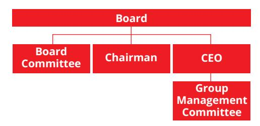

The GAA ensures that appropriate controls and decision-making are consistently applied throughout DBS. Under the GAA, the Board has delegated to the CEO the responsibility to ensure that the Group's businesses and operations are operated in accordance with Board-approved strategies and standards, which include responsibilities for the internal control framework within DBS. On matters where authority has been delegated to him, the CEO may further delegate his responsibilities and authorities to any GMC

member or members and may empower them to, in turn, delegate their responsibilities and authorities to other executives and committees of the Group.

The GAA covers internal authority only and does not override any speciȴ c provisions arising from statutory, regulatory, exchange listing requirements, or the DBSH's Constitution. The GAA is regularly reviewed and updated to accommodate changes in the scope and activities of DBS' business and operations. The Board approves the GAA and any change to it.

### **Internal controls framework**

Our internal controls framework covers ȴ nancial, operational, compliance and information technology controls, as well as risk management policies and systems. The Board, supported by the AC and BRMC, oversees the Group's system of internal controls and risk management. DBS adopts the Three Lines Model for risk management, where each line has clear roles and responsibilities.

### **First line**

Our business and support units are our ȴ rst line. Their responsibilities include the identiȴ cation and management of risks arising from and relating to their respective areas of responsibilities, and ensuring that our operations remain within approved boundaries of our risk appetite and policies. DBS has an established incident notiȴ cation protocol that sets out processes for the escalation of incidents according to the level of severity. In this way, appropriate levels of management are made aware of such incidents and can take action accordingly. There are also well-deȴ ned procedures for the escalation, investigation and follow up of any reported wrong-doing by a DBS employee, customer, vendor or third party.

### **Second line**

Risk Management Group, Group Legal and Compliance and parts of Group Technology & Operations and Group Finance form the second line. They are responsible for the development and maintenance of risk management policies and processes and they provide objective review and challenge on the activities undertaken by business and support units.

### **Third line**

Group Audit forms the third line. It provides an independent assessment and assurance on the reliability, adequacy and e ectiveness of our system of internal controls, risk management, governance framework and processes.

| Board, CEO and Senior Management | Provides oversight of the three lines model                   |                                                                 |                               |  |
|-------------------------------------|---------------------------------------------------------------|-----------------------------------------------------------------|-------------------------------|--|
|                                     | First line                                                    | Second line                                                     | Third line                    |  |
| Role                                | Own and manage risks in respective areas of responsibility | Provide independent risk oversight, monitoring and reporting | Provide independent assurance |  |
| Unit                                | Business and support units                                    | Risk Management, Legal and Compliance                        | Internal Audit                |  |

#### **Group Audit**

#### **Key responsibilities and processes**

Group Audit is independent of the activities it audits. Its objectives, scope of authority and responsibilities are deȴ ned in the Audit Charter, which is approved by the AC. Group Audit reports functionally to the Chairperson of the AC and administratively to the CEO. Group Audit's responsibilities include:

- evaluating the reliability, adequacy and e ectiveness of the Group's system of internal controls, risk management, governance framework and processes;
- providing an objective and independent assessment of the Group's credit portfolio quality, the execution of approved credit portfolio strategies and control standards relating to credit management processes;
- reviewing whether DBS complies with laws and regulations and adheres to established policies; and
- reviewing whether management is taking appropriate steps to address control deȴ ciencies.

Group Audit adheres to the DBS Code of Conduct and is guided by the Mission Statement in the Audit Charter. It adopted the Code of Ethics and aligned its practices with the International Professional Practices Framework established by the Institute of Internal Auditors (IIA). In addition, it has embedded IIA's 10 Core Principles for the Professional Practice of Internal Auditing into its activities.

Group Audit has unfettered access to the AC, the Board and management, as well as the right to seek information and explanation. Group Audit has an organisational and strategic alignment to the Group. The Head of Group Audit has a seat in the GMC and attends all the business reviews and strategic planning forums. The respective heads of audit in each of the ȴ ve key locations outside Singapore are part of that location's management team.

Group Audit adopts a risk-based approach in its auditing activities. An annual audit plan is developed using a structured risk and control assessment framework through which the inherent risk and control e ectiveness of each auditable entity in the Group are assessed. This risk assessment methodology and

approach are aligned with that of the Group, including the risk taxonomy.

The assessment also covers risks arising from new lines of business, new products and emerging risks from DBS' operating environment. Audit projects are planned based on the results of the assessment, with priority given to auditing higher risk areas and as required by regulators.

Audit reports containing identiȴ ed issues and corrective action plans are reported to the AC and senior management. Progress of the corrective action plans is monitored, and past due action plans are included in regular reports to the senior management and the AC. In all routine audits, Group Audit evaluates the control environment and management's control awareness which incorporates risk culture as guided by the Financial Stability Board's Guidance on Sound Risk Culture.

Group Audit apprises regulators and external auditors of all relevant audit matters. It works closely with external auditors to coordinate audit e orts.

### **Quality assurance and key developments**

In line with leading practices, Group Audit has a quality assurance and improvement programme (QAIP) that covers its audit activity and conforms to the International Standards for the Professional Practice of Internal Auditing. As part of the QAIP, internal quality assurance reviews (QAR) are conducted quarterly and external QAR are carried out at least once every ȴ ve years by qualiȴ ed professionals from an external organisation. From 2019 to 2021, the internal QAR was contracted to an independent assessor, Protiviti.

Based on Protiviti's assessment, Group Audit leads the industry in the use of Agile Auditing approach and digital audit tools. These tools incorporate both rule-based and predictive analytics, enabling continuous risk monitoring. For 2021, in Protiviti's capability maturity model, Group Audit was rated the highest level for Reporting in addition to audit planning, agile auditing, dynamic risk assessment, and data analytics. For independence, objectivity and transparency, Group Audit appointed Ernst & Young in 2022 as the new independent assessor for the internal QAR.

In 2022, Group Audit implemented Audit Xchange, a workbench to institutionalise and digitise its Data Driven Operating Model and Agile practices to improve its audit process. We also enhanced on our dynamic risk assessment and continuous monitoring capabilities to improve the speed of risk identiȴ cation and response. The increased use of analytical tools and data driven approach, coupled with DBS' suite of remote working technologies, has helped Group Audit to be more e ective in providing audit assurance.

### **Dealings in securities**

Although the Group has transitioned to a semi-annual reporting regime, the trading updates that are provided for the ȴ rst and third quarters of each ȴ nancial year are, for the purpose of the "black-out" policies prescribed under Rule 1207(19) of the SGX Listing Rules, deemed to constitute "ȴ nancial statements". Accordingly, Directors and employees are prohibited from trading in DBS' securities (i) one month before the release of the full-year ȴ nancial statements; and (ii) two weeks before the release of its quarterly ȴ nancial statements for the ȴ rst, second and third quarters of each ȴ nancial year.

In addition, business units and subsidiaries engaging in proprietary trading are restricted from trading in DBS' securities during the black-out period. Group Secretariat informs all Directors and employees of each blackout period ahead of time. Directors and employees are prohibited at all times from trading in DBS' securities if they are in possession of material non-public information.

GMC members are only allowed to trade in DBS' securities within speciȴc window periods (15 market days immediately following the expiry of each black-out period) subject to preclearance. GMC members are also required to obtain pre-approval from the CEO before any sale of DBS' securities. Similarly, the CEO is required to seek pre-approval from the Chairman before any sale of DBS' securities. As part of our commitment to good governance and the principles of share ownership by senior management, the CEO is expected to build up and hold at least the equivalent of three times his annual base salary as shareholding over time.

60 **A Di erent Kind of Bank** DBS Annual Report 2022 **Corporate governance** 61

DBS has put in place a personal investment policy which prohibits employees with access to price-sensitive information in the course of their duties from trading in securities in which they possess such price-sensitive information. Such employees are also required to seek preclearance before making any personal trades in securities, and may only trade through the Group's stockbroking subsidiaries and bank channels for securities listed in Singapore and Hong Kong. The personal investment policy discourages employees from engaging in short- term speculative trading.

### **Related Party Transactions and Interested Person Transactions**

DBS has embedded procedures to comply with regulations governing related party transactions and interested party transactions.

For related party transactions, we are required to comply with regulations prescribed by the MAS which set out the deȴ nition, scope and general principles governing such transactions, along with the responsibilities of banks to maintain oversight and control so as to mitigate the risk of abuse arising from conȵ icts of interest.

We have established a Board-approved framework to give e ect to these regulatory requirements. This, along with material related party transactions, is reviewed by the Board regularly.

All new Directors are briefed on relevant provisions that a ect them. If necessary, existing credit facilities to related parties are adjusted prior to a Director's appointment, and all credit facilities to related parties are continually monitored.

With respect to interested party transactions, we have established processes to comply with the requirements outlined in Chapter 9 of the SGX-ST Listing Manual. The aggregate contract values of DBS' interested person transactions entered into in 2022 are set out in the table on page 60.

DBS entered into various interested person transactions with Temasek and its associates on arm's length commercial terms and for the purpose of carrying out day-to-day operations (such as leasing of premises, telecommunication/ data services, IT systems and related services, redemption of air miles by DBS/ POSB credit card holders, logistics and security services).

In FY2022, our contracts with Temasek Holdings (Private) Limited Group amounted to an aggregated SGD 79.0 million. This accounted for less than 0.15% of DBS' audited net tangible assets.

### **Material contracts**

Save for the transactions disclosed in the table on page 60 and via SGXNET, there were no material contracts involving the interest of any Director or controlling shareholder of DBS entered into by DBS or any of its subsidiary companies, which are either still subsisting at the end of the ȴ nancial year, or if not then subsisting, entered into since the end of the previous ȴ nancial year.

### **Assessing the e ectiveness of internal controls**

DBS has a risk management process that requires all units to perform a half-yearly risk and control self-assessment (RCSA) to assess the e ectiveness of their internal controls. In addition, all units of the Group are required to submit quarterly attestations on their controls relating to the ȴ nancial reporting process, and annual attestations on their compliance with the overall internal controls framework. Based on the RCSA and the quarterly and annual

attestations, the CEO and the key management personnel responsible for risk management and internal control systems provide an annual attestation to the AC relating to the adequacy and e ectiveness of DBS' risk management and internal control systems.

Group Audit performs regular independent reviews to provide assurance on the adequacy and e ectiveness of DBS' internal controls on risk management, control and governance processes. The overall adequacy and e ectiveness of DBS' internal controls framework is reviewed by the AC and BRMC.

### **Rule 720(1) Undertaking**

In compliance with Rule 720(1) of the Listing Manual, we have procured undertakings from all of our Directors and executive oɝ cers to use their best endeavours to (a) comply with the relevant provisions of the Listing Manual; and (b) procure that DBS complies with the relevant provisions of the Listing Manual.

| Name of interested person                                                                                                 | Aggregate contract value of all interested person transactions in 2022 (excluding transactions less than SGD 100,000) (SGD million) |
|---------------------------------------------------------------------------------------------------------------------------|----------------------------------------------------------------------------------------------------------------------------------------------|
| Transactions entered into with Temasek Holdings (Private) Limited ("Temasek") Group (including Joint Ventures) and DBS |                                                                                                                                              |

| Temasek Group                                                 | 79.0(1)  |  |
|---------------------------------------------------------------|----------|--|
| Transactions entered into with associates of Temasek          |          |  |
| Capitaland Investment Limited Group                           | 2.4      |  |
| Certis CISCO Security Pte Ltd Group                           | 25.0     |  |
| Mapletree Investments Pte Ltd Group                           | 0.2      |  |
| SATS Ltd Group                                                | 1.4      |  |
| Singapore Airlines Limited Group (SIA)                        | 194.6(2) |  |
| Singapore Technologies Telemedia Pte Ltd Group             | 0.2      |  |
| Singapore Telecommunications Limited Group (Singtel Group) | 197.7(3) |  |
| SMRT Corporation Ltd Group                                    | 8.5      |  |
| Starhub Ltd Group                                             | 26.7     |  |
| Surbana Jurong Private Limited Group                          | 4.2      |  |
| Total                                                         | 539.9    |  |

- *1. This value is the aggregate amount of transactions with Temasek Group (including investments in and certain joint venture entities with shareholders other than the Temasek Group) and DBS. It also includes a 5-year co-brand credit and debit card partnership with an associate of Temasek.*
- *2. This includes a renewal of an existing air miles contract with SIA for a further 3 years.*
- *3. This includes a 2-year commitment with a SingTel subsidiary to establish an o shore technology development centre in Guangzhou Knowledge City.*

### **Board's commentary on adequacy and e ectiveness of internal controls**

The Board has received assurance from the CEO and CFO that as at 31 December 2022, the Group's ȴ nancial records have been properly maintained, and the ȴ nancial statements give a true and fair view of DBS Group's operations and ȴ nances.

The Board has also received assurance from the CEO and the key management personnel responsible for risk management and internal control systems that, as at 31 December 2022, the Group's risk management and internal control systems were adequate and e ective to address ȴ nancial, operational, compliance and information technology risks which the Group considers relevant and material to its operations. In particular, but without limiting the foregoing, the Board noted that:

- (i) in relation to the two-day digital disruption in November 2021 in Singapore, management has completed the remedial plans arising from an external independent review. Initiatives to strengthen DBS' technology resilience will continue in 2023; and
- (ii) the systems integration of LVB was completed in December 2022, and post-implementation reviews are currently in progress.

Based on the internal controls established and maintained by the Group, work performed by internal and external auditors, reviews performed by management and various Board committees, as well as assurances received from and mitigation and remedial actions undertaken by management, the Board, with the concurrence of the AC is of the opinion that the Group's internal controls and risk management systems were adequate and e ective as at 31 December 2022 to address ȴ nancial, operational, compliance risks and information technology risks which the Group considers relevant and material to its operations.

The Board notes that the internal controls and risk management systems provide reasonable, but not absolute, assurance that the Group will not be a ected by any event that could be reasonably foreseen as it strives to achieve its business objectives. In this regard, the Board also notes that no system can provide absolute assurance against the occurrence of material errors, poor judgement in decision-making, human error, fraud or other irregularities.

# **Strong culture**

### **E ective safeguards**

We believe that e ective safeguards against undesired business conduct have to go

beyond a "tick-the-box" mentality. In DBS, other than relying on published codes of conduct, we also advocate the following organisational safeguards to maintain a strong risk and governance culture.

- **Tone from the top:** The tone set by the Board and senior management is vital; it is equivalent to the moral compass of the organisation. In addition to having in place comprehensive policies, we conduct a robust self-assessment on the Group's risk culture. Please refer to the risk culture section on this page for more information.
- **Aligning strategies and incentives via the balanced scorecard:** Please refer to the section on "Our 2022 priorities" on pages 26 to 31 for more information.
- **Respecting the voice of control functions:** We believe that respect for the voice of control functions is a key safeguard. We ensure that control functions are well integrated into our organisational structure so that they can properly discharge their responsibilities.
- **Risk ownership:** Please refer to page 58 for details on our three lines of defence.
- **Having established escalation protocols:** We designed a notiȴ cation protocol that makes it mandatory for sta to report signiȴ cant incidents. This means that the organisation is prepared to receive bad news and take necessary remedial actions without shooting the messengers.
- **Encouraging constructive challenges at all levels:** Fundamentally, we inculcate a culture that encourages constructive challenges and debate, where all views are evaluated for decision-making. We also operate a culture where we actively engage the Board for their views early.
- **Reinforcing cultural alignment:** Finally, we conscientiously reinforce our cultural norms by rewarding right behaviours and censuring wrong ones.

# **Risk Culture**

Risk Culture is closely intertwined with our corporate values and it encompasses the general awareness, attitudes and behaviour of our employees towards risks. The results of our Risk Culture and Conduct Survey conducted in 2022 indicated a satisfactory risk culture bank-wide.

In 2022, we continued to monitor our risk culture pulse with a risk culture and conduct dashboard, comprising multi-faceted indicators. Creating awareness remained a key focus as we continue to reinforce a strong culture of risk and control across all levels within the organisation. We leveraged digital communication channels to share culturerelated content and conducted training with case studies to aid managers in strengthening the "Tone from the Middle" and to enhance

employee risk sensing and judgement. We continue to place emphasis on conduct as part of our compensation evaluation process.

### **The DBS Code of Conduct (Code of Conduct)**

The Code of Conduct sets out the principles and standards of behaviour that are expected of employees of the Group (including part-time and temporary employees) when dealing with customers, business associates, regulators and colleagues. The principles covered in the Code of Conduct include professional integrity, conȴ dentiality, conȵ icts of interests, fair dealings with customers and whistle-blowing. It also deȴ nes the procedures for employees of DBS to report incidents and provides protection for those sta for these disclosures.

All employees of DBS are required to read and acknowledge the Code of Conduct on an annual basis. Members of the public may access the Code of Conduct on DBS' website at the following URL: https://go.dbs. com/CodeOfConduct. The Code of Conduct encourages employees of DBS to report their concerns to DBS' dedicated, independent investigation team within Group Compliance which handles whistle-blowing cases according to a well-deȴ ned protocol. Alternatively, in case of actual or potential conȵ ict of interest or fear of retribution, employees of DBS may write in conȴ dence to Human Resources, Group Audit, or even the CEO or the Chairman. In addition, employees of DBS have the option of using the DBS Speak Up service.

### **Whistle-blowing policy**

DBS Speak Up is a hotline service run by an independent external party that gives employees of the Group the opportunity to speak up on misconduct and/ or wrong-doing by a DBS employee, customer, vendor or third party.

DBS Speak Up service includes:

- a dedicated hotline number, website, email address, fax number and postal address for reporting of suspected incidents of misconduct and wrongdoing;
- specialist call centre operators with knowledge of individual organisations;
- expert forensic investigators to analyse reports;
- timely reporting of incidents to dedicated representatives within an organisation; and
- recommendations on corrective action.

# **Accountability to our shareholders**

### **Shareholder rights**

DBS promotes fair and equitable treatment of all shareholders. All shareholders enjoy speciȴ c rights under the Singapore Companies Remuneration report 2022

Act and DBSH's Constitution. These rights include, among others, the right to participate in profit distributions and the right to attend and vote at general meetings. Ordinary shareholders are entitled to attend and vote at general meetings in person or by proxy. Indirect investors who hold DBSH shares through a nominee company or custodian bank or through a CPF agent bank ("Relevant Intermediaries") may attend and vote at general meetings by requesting their Relevant Intermediaries to appoint them as proxies.

DBS respects the equal information rights of all shareholders and is committed to the practice of fair, transparent and timely disclosure. All price-sensitive information is publicly released prior to any sessions with individual investors or analysts.

The Board provides shareholders with regular financial reports, which aim to give shareholders a balanced assessment of the Group's financial performance and position. The Board also ensures timely and full disclosure of material corporate developments to shareholders.

### **Engagement with shareholders**

Our investor relations activities promote regular, effective and fair communication with shareholders. Separate briefing sessions were conducted for the media and analysts when quarterly results were released. All press statements and quarterly financial statements have been published on our website and the SGX website. A dedicated investor relations team supports the CEO and the CFO in maintaining a close and active dialogue with investors. The DBS website provides contact details for investors to submit their feedback and raise any questions.

During the year, we held over 450 meetings with equity investors and over 100 meetings with debt investors. We participated in 27 investor conferences and road shows. These engagements were conducted through inperson or virtual meetings. These meetings

provide a forum for management to explain DBS' strategy and financial performance, and solicit analysts' and investors' perceptions of DBS

In addition, to ensure Directors are kept updated on analysts' views on DBS Group's performance, the Board is updated annually on, inter alia, the following, a summary of analysts' views, feedback and recommendations, share price performance and total shareholders' return.

We have a disclosure policy to ensure that all disclosures of material information are timely, complete and accurate. The policy sets out how material information should be managed to prevent selective disclosure. Our Group Disclosure Committee (GDC) assists the CEO and the CFO in implementing the disclosure policy. The GDC's objectives are to: (a) periodically review DBS' disclosure policy and update it as needed, (b) ensure that all material disclosures are appropriate, complete and accurate, and (c) ensure selective or inadvertent disclosure of material information is avoided.

### **Conduct of shareholder meetings**

DBS encourages and values shareholder participation at its general meetings and was one of the first large market capitalisation companies to incorporate live voting and live question & answer functions at its fully virtual AGM in March 2022.

The Chairman plays a pivotal role in fostering constructive dialogue between shareholders, Board members and management at general meetings. Resolutions requiring shareholders' approval are tabled separately for adoption at general meetings unless they are closely related and are more appropriately tabled together.

DBS puts all resolutions at general meetings to a vote by electronic poll and announces the results by showing the number of votes cast for and against each resolution and the respective percentages. DBS appoints an

independent external party as scrutineer for the electronic poll voting process. Prior to the commencement of a general meeting, the scrutineer would review the proxies and the electronic poll voting system as part of the proxy verification process. At the general meeting, handsets are provided for poll voting and the results of the electronic poll voting are announced immediately after each resolution has been put to a vote. DBS maintains an audit trail of all votes cast at the general meeting. The outcome of the general meeting (including detailed results of the poll vote for each resolution) is promptly disclosed on SGXNET within the same day after the conclusion of that meeting.

Annual General Meetings (AGMs) provide shareholders with the opportunity to share their views and to interact with the Board, including the chairpersons of the Board committees and certain members of senior management. Our external auditor is available to answer shareholders' queries. At each AGM, DBS' financial performance for the preceding year is presented to shareholders.

The Company Secretary prepares minutes of general meetings, which incorporate substantial and relevant comments or queries from shareholders relating to the agenda of the meeting and responses from the Board and management. These minutes may be assessed via our website.

### **Conduct of 2023 AGM**

With the improving COVID-19 situation in Singapore, we will be holding a wholly physical AGM in 2023.

# Where to find key information on each Director?

In this Annual Report:

- Pages 43 to 44- Directors' independence status, appointment dates, meeting attendance and remuneration details
- Pages 190 to 194 Directors' length of directorship, academic and professional qualifications and present and past directorships
- Pages 214 to 217 Additional Information on Directors seeking re-election at the Annual General Meeting to be held on 31 March 2023

At our website (www.dbs.com): Directors' biodata

# Remuneration report

We believe that our long-term success depends in large measure on the contributions of our employees. Our remuneration framework is designed to be consistent with market best practices, drive business strategy and create long-term shareholder value. Remuneration policies and practices as set out in the following report are governed by a set of sound principles which are in compliance with various regulatory requirements.

63

### 1 Objectives of DBS remuneration strategy

DBS' remuneration policy, which is applicable to DBS Bank and all our subsidiaries and overseas offices, seeks to ensure that we are able to attract, motivate and retain employees to deliver long-term shareholder returns, taking into consideration risk management principles and standards set out by the Financial Stability Board (FSB) and the Code of Corporate Governance.

When formulating our remuneration strategy, consideration was given to aligning our remuneration approach with DBS PRIDE!\* values in order to drive desired behaviours and achieve the objectives set out in our balanced scorecard.

The following shows the three main thrusts of our remuneration strategy and how they are implemented within DBS:

| Main thrusts                                               | Details                                                                                                                                                                                                                                                                                                                                                                                                                              |
|------------------------------------------------------------|--------------------------------------------------------------------------------------------------------------------------------------------------------------------------------------------------------------------------------------------------------------------------------------------------------------------------------------------------------------------------------------------------------------------------------------|
| Pay for performance as measured against balanced scorecard | <ul> <li>Instill and drive a pay-for-performance culture</li> <li>Ensure close linkage between total compensation and our annual and long-term business objectives as measured by our balanced scorecard</li> <li>Calibrate mix of fixed and variable pay to drive sustainable performance that is aligned to DBS PRIDE! values, taking into account both "what" and "how" key performance indicators (KPIs) are achieved</li> </ul> |
| Provide market competitive pay                             | <ul> <li>Benchmark our total compensation against other organisations of similar size and standing in the markets we operate in</li> <li>Drive performance differentiation by benchmarking total compensation for top performing employees against the upper quartile or higher in each market</li> </ul>                                                                                                                            |
| Guard against excessive risk-taking                        | <ul> <li>Focus on achieving risk-adjusted returns that are consistent with prudent risk and capital management, as well as emphasise long-term sustainable outcomes</li> <li>Design payout structure to align incentive payments with the long-term performance of the Group through deferral and clawback arrangements</li> <li>Design sales incentive plans to encourage the right sales behaviour</li> </ul>                      |

\* Read more on DBS PRIDE! values on page 69.

64 **A Di erent Kind of Bank** DBS Annual Report 2022 **Remuneration report** 65

# **2 Summary of current total compensation elements**

The table below provides a description of total compensation elements, their purpose and implementation:

| Elements                          | Purpose                                                                                                                                                                                                                                                          | Details                                                                                                                                                                                                                                                                                                                                                                                                                                                                                                                                                                                                                                                     |
|-----------------------------------|------------------------------------------------------------------------------------------------------------------------------------------------------------------------------------------------------------------------------------------------------------------|-------------------------------------------------------------------------------------------------------------------------------------------------------------------------------------------------------------------------------------------------------------------------------------------------------------------------------------------------------------------------------------------------------------------------------------------------------------------------------------------------------------------------------------------------------------------------------------------------------------------------------------------------------------|
| Salary                            | • Attract and retain talent by ensuring our ȴxed pay is competitive vis-à-vis comparable institutions                                                                                                                                                      | • Set at an appropriate level, taking into account market dynamics as well as the skills, experience, responsibilities, competencies and performance of the employee • Typically reviewed annually                                                                                                                                                                                                                                                                                                                                                                                                                                                 |
| Cash bonus and deferred awards | • Provide a portion of total compensation that is performance- linked • Focus employees on the achievement of objectives which are aligned to value creation for our shareholders and multiple stakeholders • Align to time horizon of risk | • Based on DBS, business or support unit, and individual performance • Measured against a balanced scorecard which is agreed to at the start of the year • A Group-wide deferral approach is applicable for all employees. Awards in excess of a certain threshold are subject to a tiered deferral rate with a minimum deferred quantum • For Senior Management (SM) and Material Risk Personnel (MRP i.e. employees whose actions have a material impact on the risk exposure of the bank), awards are generally deferred by a minimum of 40% if it exceeds a certain threshold subject to local regulatory requirements |

# **3 Determination of variable pay pool**

The variable pay pool is derived from a combination of a bottom-up and top-down approach. It is underpinned by our aim to drive a pay-forperformance culture which is aligned to our risk framework.

| Process                             | Details                                                                                                                                                                                                                                                                                                                                  |
|-------------------------------------|------------------------------------------------------------------------------------------------------------------------------------------------------------------------------------------------------------------------------------------------------------------------------------------------------------------------------------------|
| Determining total variable pay pool | • A function of our overall balanced scorecard and benchmarked against market. The scorecard includes substantial risk and control metrics designed and evaluated by the control functions such as Audit, Compliance and Risk. Control functions therefore have a direct role in determining the size of the variable pay pool. |
|                                     | The variable pay pool is further calibrated against the following prisms: – Risk adjustment through review of Return on Risk-Adjusted Capital (RoRAC) – Appropriate distribution of surplus earnings (after cost of equity) between employees and shareholders                                                                  |
| Allocating pool to business units   | • Pool allocation takes into account the relative performance of each unit against their balanced scorecard as evaluated by the CEO • Inputs from control functions are sought • Country Heads are also consulted in the allocation process                                                                                     |
| Determining individual award        | • Unit heads cascade their allocated pool to their teams and individuals • Individual variable pay determined based on performance against goals and DBS PRIDE! values • Employees with disciplinary warning meted out may have their variable pay impacted                                                                     |

The performance of control functions are assessed independently from the business units they support to prevent any conȵicts of interests. The remuneration of the Chief Risk Ofȴcer (CRO) and Group Head of Audit are endorsed by the Chairman of Board Risk Management Committee and Audit Committee respectively and subsequently approved by the Board.

Sales employees are incentivised to promote the development of mutually beneȴcial long-term relationships with their customers, rather than a sole focus on short-term gains. Non-ȴnancial metrics such as customer satisfaction and compliance with fair dealing principles are incorporated into their KPIs.

# **4 Deferred remuneration**

| Plan objectives                                                                                                                                           | Details                                                                                                                                                                                                                                                                                                                                                                                                                                                                                                                                                                                                                                 |
|-----------------------------------------------------------------------------------------------------------------------------------------------------------|-----------------------------------------------------------------------------------------------------------------------------------------------------------------------------------------------------------------------------------------------------------------------------------------------------------------------------------------------------------------------------------------------------------------------------------------------------------------------------------------------------------------------------------------------------------------------------------------------------------------------------------------|
| • Foster a culture that aligns employees' interests with shareholders • Enable employees to share in DBS' performance • Help in talent retention | • Deferred remuneration is paid in restricted shares (DBSH Share Plan) except for SM and MRPs, where it is paid in restricted shares (DBSH Share Plan) and cash • Deferred remuneration comprises two elements: the main award and retention award • The retention award constitutes 15% of the main award and is designed to retain talent and compensate sta΍ for the time value of deferral • Deferred awards vest over four years, and will lapse immediately upon termination of employment (including resignation) except in the event of ill health, injury, disability, redundancy, retirement or death |
| Vesting schedule                                                                                                                                          | Malus of unvested awards and clawback of vested awards                                                                                                                                                                                                                                                                                                                                                                                                                                                                                                                                                                                  |
| Main Award • 25% vest on each anniversary after grant date Retention Award • 100% vest four years after grant date                               | Malus and/ or clawback will be triggered by • Material violation of risk limits • Material losses due to negligent risk-taking or inappropriate individual behaviour • Material restatement of DBS' ȴnancials due to inaccurate performance measures • Misconduct or fraud Vested and unvested awards are subject to clawback within seven years from the date of grant                                                                                                                                                                                                                                               |

Employees on sales incentive plans whose incentives exceed a certain threshold are also subject to deferrals which vest over three years and a 15% retention award.

Special Award is awarded to selected individuals as part of talent retention, and it is subject to three-year vesting period, with 33% vesting on the ȴ rst and second anniversaries of grant and 34% on the third anniversary.

*Read more about the Share Plan on page 113.*

# **5 Summary of 2022 remuneration outcomes**

Our remuneration is linked to how we perform against our balanced scorecard (see pages 26 to 31) which is aligned to long-term value creation for our stakeholders in a sustainable way (see pages 68 to 69). As our scores improved in the current ȴ nancial year, our variable pay pool was better than the previous year. The Compensation and Management Development committee (CMDC) evaluated and approved the variable pay pool which was subsequently endorsed by the Board of Directors (Board).

In 2022, an external compensation consultant, McLagan, was engaged to provide an independent review of the Group's compensation system and processes to ensure compliance with the FSB Principles for Sound Compensation Practices. McLagan and its consultants are independent and not related to us or any of our Directors. The results of the review showed that we are in compliance with the FSB Principles for Sound Compensation Practices.

### **Senior management and material risk personnel**

In line with the principles set out by FSB, a substantial portion of remuneration for our Senior Management as well as Material Risk Personnel are variable. Their variable remuneration is subject to deferral, thus ensuring alignment to the time horizon of risks.

The following charts show the mix of ȴxed and variable pay for both groups for performance year 2022:

66 **A Di erent Kind of Bank** DBS Annual Report 2022 **Remuneration report** 67

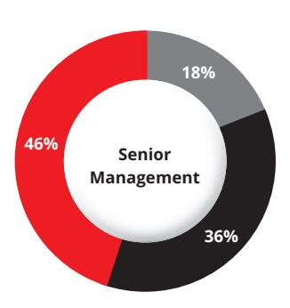

- *Fixed pay*
  - *Variable pay-cash*
  - *Variable pay-deferred shares and/ or deferred cash (including retention awards)*

*Note:*

*We do not provide any other forms of ȴxed and variable remuneration aside from those disclosed in this section*

Our Senior Management's aggregate total remuneration in 2022 amounted to SGD 90.4 million, including the CEO's remuneration of SGD 15.4 million. Excluding the CEO's remuneration which has been separately disclosed, the median increase in total remuneration of the Senior Management who were members of the Group Management Committee for both 2021 and 2022 was 10.7%.

While corporate governance guidelines recommend that at least the top ȴve key executives' remuneration be disclosed, the Board believes that it would be disadvantageous for us to do so because of the constant battle for talent in a highly competitive industry. This is consistent with banking industry practice in the local market. However, we do provide additional information on the median increase in remuneration of our Senior Management in the year as detailed above.

### **Breakdown of deferred remuneration awards**

| Category                                                                                                                                                                                 | SM (1)                       | MRPs (2)         |
|------------------------------------------------------------------------------------------------------------------------------------------------------------------------------------------|------------------------------|------------------|
| Total outstanding deferred remuneration(3): Cash Shares and share-linked instruments Other forms of remuneration Total                                                       | 0.9% 99.1% – 100.0% |                  |
| Outstanding deferred and retained remuneration(3) (4): Of which exposed to ex-post adjustments Cash Shares and share-linked instruments Other forms of remuneration Total | 0.9% 99.1% – 100.0% |                  |
| Total amendment during the year due to ex-post explicit adjustments(5): Cash Shares and share-linked instruments Other forms of remuneration Total                           | – – – –             | – – – – |
| Total amendment during the year due to ex-post implicit adjustments(5): Cash Shares and share-linked instruments(6) Other forms of remuneration Total                        | – 4.5% –               | – (3.3%) – |
| Total deferred remuneration paid out in the ȴ nancial year:                                                                                                                              | 35.3%                        | 29.0%            |
| Headcount                                                                                                                                                                                | 21                           | 315              |

- *(1) Senior Management (SM) is deȴned as the CEO and members of the Group Management Committee who have the authority and responsibility for DBS' overall direction and executing to strategy*
- *(2) In 2022, we also reviewed our criteria used to identify material risk takers to align with the deȴ nition of MRPs, in accordance to MAS's Individual Accountability & Conduct Guidelines. MRPs are deȴ ned as employees whose duties require them to take on material risk on our behalf in the course of their work and/ or employees who can cause harm to a signiȴ cant segment of customers or other stakeholders. These can be either individual employees or a group of employees who may not pose a risk to DBS' ȴnancial soundness on an individual basis, but may present a material risk collectively*
- *(3) Due to data conȴdentiality, the total amount of deferred and retained remuneration for SM and MRPs have been aggregated for reporting*
- *(4) Retained remuneration refers to shares or share-linked instruments that are subject to a retention period under a share retention policy*
- *(5) Examples of explicit ex-post adjustments include malus, clawbacks or similar reversal or downward revaluations of awards. Examples of implicit ex-post adjustments include ȵuctuations in the value of DBSH ordinary shares or performance units*
- *(6) [No. of unvested DBSH ordinary shares as at 31 Dec 22 x share price as at 31 Dec 22] / [No. of unvested DBSH ordinary shares as at 31 Dec 21 x share price as at 31 Dec 21] -1*

### **Guaranteed bonuses, sign-on bonuses and severance payments**

| Category                                                                  | SM | MRPs  |
|---------------------------------------------------------------------------|----|-------|
| Number of guaranteed bonuses                                              | 0  | 0     |
| Number of sign-on bonuses                                                 | 0  | 8     |
| Number of severance payments                                              | 0  | 0     |
| Total amounts of above payments made during the Financial Year (SGD '000) | 0  | 1,661 |

#### **Other provisions**

We do not allow accelerated payment of deferred remuneration except in cases such as death in service or where legally required. There are no provisions for:

- **•** Special executive retirement plans;
- **•** Golden parachutes or special executive severance packages; and/ or
- **•** Guaranteed bonuses beyond one year.

### **Chief Executive Ofȴcer**

Since becoming CEO in November 2009, Piyush Gupta has transformed DBS into a leading bank with multiple engines of growth, solid digital leadership, and a pervasive culture of innovation

Despite 2022 being a challenging year marked by high inȵ ation, slow growth and bearish markets, DBS had a breakout year ȴ nancially. 2022 net proȴ t was a record SGD 8.19 billion, up 20%. Notably, return on equity, at 15%, signiȴ cantly surpassed previous records.

DBS' sterling ȴ nancial performance reȵ ected the beneȴ t of higher interest rates, the strength of a broad-based franchise and multi-year transformation e orts. In particular, the bank's strengthened current and savings account base enabled it to enjoy higher leverage to rising interest rates than in previous years, contributing to strong total income. Diversiȴ ed engines of growth also helped to mitigate the drag from lower wealth management and investment banking fee income.

In 2022, DBS continued to make headway in growing its Asia franchise. In India, with the successful integration of Lakshmi Vilas Bank, DBS India now has an enlarged platform that encompasses 2.5 million retail and 15,000 corporate customers. Income and proȴ t rose for the year. Notwithstanding China-US tensions, DBS' Greater Bay Area franchise also saw robust growth. In Taiwan, DBS is on track to complete the integration of Citi's consumer banking business by August 2023.

Solid progress was also made in cementing a new way of working. A multi-year e ort in industrialising artiȴ cial intelligence/ machine learning continued to deliver not just value to the customer but also revenue uplift to the bank. Ecosystem partnerships enabled the bank to further scale its customer base outside Singapore without high acquisition costs. "Managing through Journeys", which involves cross-functional squads working horizontally to ensure the bank is truly customer-ȴ rst, gained in maturity.

DBS also continued to advance the sustainability agenda. The bank's net-zero roadmap is one of the most comprehensive in scope among global banks. On the social impact front, DBS Foundation's new Community Impact Chapter committed SGD 5.6 million towards 10 programmes to help foster a more equitable and inclusive society.

Finally, DBS was named by Global Finance as "World's Best Bank". This is the seventh global best bank award DBS has won in the past ȴ ve years. The bank was also the only Singapore-headquartered company to be recognised as one of the "100 Best Workplaces for Innovators" by US-based Fast Company.

In recognition of Mr Gupta's 2022 performance, his present-year remuneration is as outlined below:

### **Breakdown of remuneration for performance year 2022 (1 January – 31 December)**

|                 | Salary remuneration SGD | Cash bonus(1) SGD | Deferred remuneration(2) SGD | Others(3) SGD | Total(4) SGD |
|-----------------|-------------------------------|----------------------|------------------------------------|------------------|-----------------|
| Mr Piyush Gupta | 1,500,000                     | 5,765,000            | 8,035,000                          | 80,529           | 15,380,529      |

- *(1) The amount has been accrued in 2022 ȴnancial statements*
- *(2) Of the deferred remuneration, about 17.2% will be in cash, while the remaining will be in the form of shares. At DBS, ordinary dividends on unvested shares do not accrue to employees. For better comparability with other listed companies, this ȴgure excludes the*
- *estimated value of retention award amounting to SGD 1,205,250, which serve as a retention tool and compensate sta for the time value of deferral. This is also similar in nature to practices in those companies which provide accrual of dividends/ interest equivalents for deferred awards*
- *(3) Represents non-cash component and comprises club, car and driver*
- *(4) Refers to performance remuneration for 2022 includes ȴxed pay in 2022, cash bonus received in 2023 and DBSH ordinary shares granted in 2023*

68 **A Di erent Kind of Bank** DBS Annual Report 2022 **How We Create Value – Our Business Model** 69

# How we create value – our business model

**Our business model seeks to create value for stakeholders in a sustainable way.**

Our strategy is clear and simple. It deȴ nes the businesses that we will do and will not do. We use our resources to build competitive advantages. We have put in place a governance framework to ensure e ective execution and risk management. Further, we have a balanced scorecard to measure our performance and align compensation to desired behaviours.

*Read more about how we use our resources on pages 70 to 73.*

### **Our resources How we create value**

building a sustainable future.

**Our stakeholders**

**Brand**

**Customer relationships**

**Intellectual capital**

**Employees**

**Financial**

### **Our strategy**

### Our strategy is predicated on megatrends such as Asia's strong growth and rising intra-regional trade, rapid technological advancements and the digitalisation of industries and economies, as well as the shift towards

**Our strategy Di erentiating ourselves**

We seek to intermediate trade and capital ȵ ows as well as support wealth creation in Asia. Our established and growing presence in Greater China, South Asia and Southeast Asia makes us a compelling Asian bank of choice.

We are a full-service commercial bank in Singapore and Hong Kong and are scaling up these capabilities in India and Taiwan. We engage individuals and SMEs through digital and ecosystem strategies in Indonesia and China (including the Greater Bay Area).

We leverage digital technologies and data to create di erentiated customer and employee experiences. We keep abreast of and invest in emerging technologies that could reshape current banking practices.

We have made wide-ranging commitments to a more sustainable future. They encompass the way we do business, sustainable practices in our operations, as well as our role in the communities we are a part of.

### **Making Banking Joyful**

We seek to "Make Banking Joyful" by leveraging digital technologies and embedding ourselves seamlessly into our customers' lives. We deliver simple, fast and contextual banking solutions and di erentiated customer experiences by managing through journeys.

We architect our most critical customer processes horizontally and leverage data-driven operating models. This helps break silo-thinking and fosters joint accountability across cross-functional teams. We deploy artiȴ cial intelligence/ machine learning and experiment iteratively to achieve superior customer and business outcomes.

### *Read more about our strategy on pages 8 to 11.*

We periodically review our strategy, taking into account emerging megatrends, the operating environment and what our stakeholders are telling us. These are material matters that can impact our ability to create value.

*Read more about our material matters and stakeholder engagement on pages 75 to 81.*

### **Our businesses**

We have three core business segments:

- Institutional Banking
- Consumer Banking/ Wealth Management
- Treasury Markets

*Read more about our businesses on pages 36 to 41 and 180.* 

# **Banking the Asian Way**

### We marry the professionalism of a best-in-class bank with an understanding of Asia's cultural nuances.

### **Asian relationships**

We recognise that relationships have swings and roundabouts and stay by our clients through down cycles.

### **Asian service**

Our service ethos is to be Respectful, Easy to deal with and Dependable.

### **Asian insights**

We know Asia better; we provide unique Asian insights and create bespoke Asian products.

#### **Asian innovation**

We constantly innovate new ways of banking as we strive to make banking faster and simpler, while delivering contextualised and relevant Asian products and services.

### **Asian connectivity**

We work in a collaborative manner across geographies and businesses, supporting our customers as they expand across Asia.

### **Technology and infrastructure**

Over the years, we have invested in our people and skills, and re-architected our technological backbone to be digital to the core (i.e. microservices, cloud-native, resilient and scalable).

To further think and behave like big technology companies where we can respond to rapidly changing consumer demands with agility and scale, we have re-engineered our business and technology towards a platform operating model where business and technology work together with shared KPIs in an agile manner.

In addition, we have embraced design thinking to deliver customer centric front end applications.

### **Nimbleness and agility**

We are of a "goldilocks" size – big enough to have meaningful scale yet nimble enough to quickly act on opportunities. We pivoted to manage through journeys to drive outcomes. This allows us to embed customer centricity, drive agility and increase internal collaboration by embracing experimentation, entrepreneurship and innovation.

### A strong, well-informed and fully-engaged board provides strategic direction to management. Management executes on strategy and drives performance and organisational synergies. A between regional function heads and local country heads.

Our PRIDE! values of Purpose-driven, Relationship-led, Innovative, Decisive and Everything Fun! deȴ ne what we stand for, and anchor how we do business and work with one another.

We have translated these values into a set of 12 behaviours. These behaviours guide how

### **E ective internal controls**

Our internal controls framework covers ȴnancial, operational, compliance and information technology controls, as well as risk management policies and systems. Three lines of defence guard our operational excellence: identiȴ cation and management of by Group Audit.

### **Building a sustainable franchise**

We aim to build a company that is here for the long term, based on responsible banking, responsible business practices, and impact beyond banking. Rooted in our culture is a sense of purpose and an innovative drive to create social value and achieve meaningful impact, while balancing our risk and compliance responsibilities.

We leverage technology and data to strengthen and augment our risk management processes and systems. We further create our own data governance framework setting out clear regulatory, legal and ethical boundaries to ensure that we use data in a respectful and responsible manner.

*Read more about our governance e orts on pages 32 to 33.*

# **Balanced scorecard**

We use a balanced scorecard approach to assess our performance, track the progress we have made in executing our strategy and determine remuneration.

The scorecard is divided into three parts and is balanced in the following ways:

- Between ȴ nancial and non-ȴ nancial performance indicators. Almost onequarter of the total weighting is focused on control and compliance metrics. We have key performance indicators (KPIs) to track progress made on our digital transformation agenda and the value created from digitalisation
- Across multiple stakeholders
- Between current year targets and long-term strategic outcomes

The scorecard is updated yearly and approved by the board before being cascaded throughout the organisation, ensuring that the goals of every business, country and support function are aligned to those of the Group. Performance is assessed against the scorecard to determine remuneration, providing a clear line of sight between employee goals and organisational imperatives. We have achieved a well-established rhythm towards performance monitoring and our rewards are closely linked to scorecard outcomes.

*Read more about our balanced scorecard on pages 26 to 31. Read more about our remuneration policy on pages 63 to 67.*

**Shareholders**

**Customers**

**Employees**

**Society**

**Regulators and policy makers**

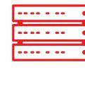

**infrastructure**

**Physical** 

**Natural resources**

**Societal relationships**

### **Competent leadership**

# matrix reporting structure drives joint ownership

**Governing ourselves Measuring ourselves**

*Read more about our leaders on pages 4 to 7.*

### **Our PRIDE! values**

we do business and how we interact with the community.

risks by units, independent oversight exercised by control functions, and independent assurance

*Read more about our internal controls on pages 58 to 61.*

*Read more about our sustainability e orts on pages 70 and 73, pages 104 to 107, and in our Sustainability Report.*

70 **A Di erent Kind of Bank** DBS Annual Report 2022 **How we develop and use our resources** 71

# How we develop and use our resources

**We utilise and enhance our resources to di erentiate ourselves and maximise value creation for our stakeholders in the long run. Read more about how we distribute the value created to our stakeholders on page 74.**

| Resources                                                                                                                                                                                                                                                | Indicators                                                                                                                                                                                                                                                                           | 2022                                               | 2021                                                 | Key highlights                                                                                                                                                                                                                                                                                                                                                                                                                                                                                                                                                                                                                                                                                                                                                                                                                                                                                                                                                                                                                                                                                   |
|----------------------------------------------------------------------------------------------------------------------------------------------------------------------------------------------------------------------------------------------------------|--------------------------------------------------------------------------------------------------------------------------------------------------------------------------------------------------------------------------------------------------------------------------------------|----------------------------------------------------|------------------------------------------------------|--------------------------------------------------------------------------------------------------------------------------------------------------------------------------------------------------------------------------------------------------------------------------------------------------------------------------------------------------------------------------------------------------------------------------------------------------------------------------------------------------------------------------------------------------------------------------------------------------------------------------------------------------------------------------------------------------------------------------------------------------------------------------------------------------------------------------------------------------------------------------------------------------------------------------------------------------------------------------------------------------------------------------------------------------------------------------------------------------|
| Brand A strong brand is an important business driver and allows us to compete not just locally, but also regionally.                                                                                                                   | Brand value according to "Brand Finance Banking 500" report                                                                                                                                                                                                                    | USD 10.5 bn as of Jan 2023                   | USD 8.7 bn as of Feb 2022                      | In 2022, DBS was named "World's Best Bank" by Global Finance. This marked the ȴ fth consecutive year that the bank was recognised as the best bank globally, with previous wins from Global Finance (2018, 2020, 2022), Euromoney (2019, 2021), and The Banker (2018, 2021). DBS was also featured in Fast Company's list of the "100 Best Workplaces for Innovators" in 2022 – ranking 29th out of 100 – as we continued to gain global recognition as a leader in innovation. For 14 consecutive years (2009 to 2022), DBS has been accorded the "Safest Bank in Asia" award by Global Finance as well. DBS also retained the title of ASEAN's Most Valuable Bank Brand in Brand Finance's 2023 Banking 500 report. Read more about this on page 2.                                                                                                                                                                                                                                                                                            |
| Customer relationships Putting customers at the heart of what we do helps di΍ erentiate ourselves in an industry as commoditised as banking, enabling us to build lasting relationships and deepen our wallet share. | Customers Institutional Banking Consumer Banking/ Wealth Management Customer engagement measures (1) Institutional (1=worst, 5=best) – Wealth Management – Consumer Banking – SME Banking – Large Corporates Market Penetration ranking | >280,000 > 12.0m 4.26 4.31 4.45 2nd | > 340,000 > 11.8 m 4.27 4.27 4.41 2nd | For our Institutional Banking Group (IBG) business, our customer base reȵ ected a decrease due to a reclassiȴ cation of about 64,000 accounts to the Consumer Banking Group (CBG) arm of Lakshmi Villas Bank (LVB). For our CBG business, as we continue to build our franchise footprint and expand our ecosystem and partnership plays, the growth of our customer base is moderated by our continuous focus on the rationalisation of inoperative accounts in LVB and digibank accounts in Indonesia and India. Despite volatile market conditions and economic uncertainty impacting customers, we maintained strong customer engagement scores across segments by actively listening to the voice of our customers, ensuring that customer journeys are improved alongside digital platform enhancements. Our SME regional customer engagement scores increased year on year and we retained our overall second rank in market penetration across core markets for Large Corporates. Read more about this on pages 36 to 41. |
|                                                                                                                                                                                                                                                          |                                                                                                                                                                                                                                                                                      |                                                    |                                                      |                                                                                                                                                                                                                                                                                                                                                                                                                                                                                                                                                                                                                                                                                                                                                                                                                                                                                                                                                                                                                                                                                                  |

| Resources                                                                                                                                                                                                                                  | Indicators                                                                                                     | 2022                           | 2021                           | Key highlights                                                                                                                                                                                                                                                                                                                                                                                                                                                                                                                                                                                                                                                                                                                                                                                                                                                                                                                                                      |
|--------------------------------------------------------------------------------------------------------------------------------------------------------------------------------------------------------------------------------------------|----------------------------------------------------------------------------------------------------------------|--------------------------------|--------------------------------|---------------------------------------------------------------------------------------------------------------------------------------------------------------------------------------------------------------------------------------------------------------------------------------------------------------------------------------------------------------------------------------------------------------------------------------------------------------------------------------------------------------------------------------------------------------------------------------------------------------------------------------------------------------------------------------------------------------------------------------------------------------------------------------------------------------------------------------------------------------------------------------------------------------------------------------------------------------------|
| Intellectual capital One key type of intellectual capital pertains to how we digitalise our business. Our digital transformation encompasses technology, customer journey thinking and a startup culture. | Number of data and analytics experts Number of software engineers(2) Number of models developed | > 1,000 > 9,500 > 620    | > 900 > 7,300 > 330      | Driven by our vision to be an artiȴ cial intelligence (AI)-fuelled bank, we have been building our data analytics talent aggressively over the past few years. As such, despite the higher turnover rate in the tech industry in general, we retained our strong pipeline of data talent and software engineers due to our strategy of accelerating hiring to support technology advancements as we navigate through any headwinds. Having a large and continually growing repository of models that teams can rapidly leverage and deploy is key to creating value and improving eɝ ciency. This repository and other analytics assets that have been developed across the bank, called ALAN after Alan Turing, are used by teams to rapidly identify models that can address their use cases for swifter deployment. To date we have over 620 models (up 88% from 2021) and more are being added regularly. |
| Employees An agile and engaged workforce enables us to be nimble and react quickly to opportunities.                                                                                                                        | Employees (3) Employee engagement score Voluntary attrition rate Training hours per employee    | ~ 36,000 87% 15% 35.3 | ~ 33,000 86% 14% 39.2 | We continue to see a steady improvement in our overall engagement scores over the years as we remain committed to helping our people thrive by preparing them for the future and availing multiple career growth opportunities. The decrease in training hours is due to functional training courses becoming shorter in terms of duration, while retaining eɝ cacy. Many employees had also completed their mandatory leadership and upskill/ reskill training programmes in the year before. While our group-wide voluntary attrition rate increased between 2021 and 2022, this remained comparable to pre-Covid times (2018-2019). This is largely attributed to an improvement in business conditions in 2022. In general, our attrition rates across our core markets were lower than the market average. Read more about "Developing Our People" in the Sustainability Report.                      |

| / | 3 |  |
|---|---|--|
|   |   |  |

| Resources                                                                                                                                                                                                         | Indicators                                                                                                                          | 2022                       | 2021                          | Key highlights                                                                                                                                                                                                                                                                                                                                                                                                                                                                                      |
|-------------------------------------------------------------------------------------------------------------------------------------------------------------------------------------------------------------------|-------------------------------------------------------------------------------------------------------------------------------------|----------------------------|-------------------------------|-----------------------------------------------------------------------------------------------------------------------------------------------------------------------------------------------------------------------------------------------------------------------------------------------------------------------------------------------------------------------------------------------------------------------------------------------------------------------------------------------------|
| Financial Our strong capital base and diversiȴ ed funding sources allow us to support our customers through good and bad times, and enable us to provide banking solutions competitively. | Common Equity Tier-1 ratio (CET-1) Liquidity Coverage Ratio (LCR) Net Stable Funding Ratio (NSFR)                    | 14.6% 117% 140%      | 14.4% 123% 135%         | Shareholders' funds were stable from a year ago as proȴ t accretion was o΍ set by dividend distributions and a decline in fair value and cash ȵ ow hedge reserves due to higher interest rates. Funding and liquidity also remained healthy as we grew customer deposits and maintained diversiȴ ed wholesale funding. Read more about the Group's ȴ nancials in the CFO Statement on page 20.                                                                              |
| Infrastructure Our best-in-class digital and physical infrastructure allows us to be nimble and resilient.                                                                                         | Digital infrastructure: Rolling four-year cumulative build-and operate expenditure – Including new build spending | SGD 5.4 bn SGD 2.4 bn   | SGD 4.8 bn SGD 2.1 bn      | Our investment in our people and building a strong technological foundation have enabled us to be a di΍ erent kind of bank. Our rallying call is to optimise our technology stack, scale outputs, and provide all-rounded customer and employee experiences that transform business outcomes. Our focus continues to be on driving innovation, balancing innovation with resilience and cultivating a diverse, future-ready workforce. Read more about this on pages 34. |
| Natural resources We impact the natural environment directly through our operations, as well as indirectly through the ȴ nancing of our customers.                                        | Sustainable ȴ nancing: – Loans (4) – Bonds (6)                                                                             | SGD 20.5 bn SGD 23.9 bn | SGD 21.7 bn(5) SGD 23.5 bn | We empower our customers on their sustainability journey through a wide range of sustainable ȴ nancing o΍ erings, which can be deployed principally through loans and bonds. Read more about "Responsible Financing" and "Managing Our Environmental Footprint" in the Sustainability Report.                                                                                                                                                                                        |

| Resources                                                                                                                                                       | Indicators                                                                                                                                                            | 2022                 | 2021               | Key highlights                                                                                                                                                                                                                                                                                                                                                                                                                                                                                      |
|-----------------------------------------------------------------------------------------------------------------------------------------------------------------|-----------------------------------------------------------------------------------------------------------------------------------------------------------------------|----------------------|--------------------|-----------------------------------------------------------------------------------------------------------------------------------------------------------------------------------------------------------------------------------------------------------------------------------------------------------------------------------------------------------------------------------------------------------------------------------------------------------------------------------------------------|
| Societal relationships It is our belief that our responsibility to shareholders is complemented by our responsibility to society at large. | Cumulative number of Social Enterprises (SEs) banked Value of SE/ small and medium enterprises (SMEs) grants awarded Employee volunteering hours | > 1,000 SGD 3.0 m | > 800 SGD 3.0 m | DBS Foundation is focused on creating impact, improving lives, and enabling change by empowering businesses and communities. It comprises two chapters, the Business for Impact Chapter, and a new Community Impact Chapter established in 2022.                                                                                                                                                                                                                                     |
|                                                                                                                                                                 |                                                                                                                                                                       | > 140,000            | > 100,000          | In 2022, we introduced grants for SMEs, in addition to SEs to kickstart their sustainability journey and impact the broader sphere of businesses. Working with like-minded organisations, our                                                                                                                                                                                                                                                                                           |
|                                                                                                                                                                 | Value of Community Impact funding committed                                                                                                                     | SGD 5.6 m            | NA                 | employees continued to address communities' pressing needs and reached out to more beneȴ ciaries in spite of Covid restrictions. This was done through a hybrid of digital and in person service- and skills-based volunteering programmes.                                                                                                                                                                                                                                          |
|                                                                                                                                                                 | Food impact (in terms of food waste reduced and recycled, or food redistributed)                                                                             | > 1,300 tonnes       | 600 tonnes         | We committed a total funding of SGD 5.6 million towards our inaugural Community Impact programmes, which focused on equipping communities with future ready skills, such as ȴ nancial and digital literacy, to support those who may ȴ nd themselves being displaced by technological or economic disruptions.                                                                                                                                                                    |
|                                                                                                                                                                 |                                                                                                                                                                       |                      |                    | As part of our commitment to a climate-resilient future and a strong focus on sparking collective action, we started a regional movement in 2020 to galvanise multiple stakeholders into action towards zero food waste. We stepped up e΍ orts in 2022 to engage the community, including our employees, to help reduce food waste through a myriad of initiatives. Our concerted e΍ orts led us to cross the 1,000 tonnes mark in terms of food impact created in 2022. |
|                                                                                                                                                                 |                                                                                                                                                                       |                      |                    | Read more about "DBS Foundation", "Employee Volunteerism" and "Towards Zero Food Waste" in the Sustainability Report.                                                                                                                                                                                                                                                                                                                                                                         |
|                                                                                                                                                                 |                                                                                                                                                                       |                      |                    |                                                                                                                                                                                                                                                                                                                                                                                                                                                                                                     |
|                                                                                                                                                                 |                                                                                                                                                                       |                      |                    |                                                                                                                                                                                                                                                                                                                                                                                                                                                                                                     |

- *(1) Scale: 1 = worst and 5 = best. Source: Based on Customer Satisfaction Survey conducted by Aon Hewitt, Ipsos, and Qualtrics for Wealth Management; Ipsos and Qualtrics for Consumer Banking; Aon Solutions Singapore for SME banking, and Coalition Greenwich for Large Corporates Market Penetration ranking.*
- *(2) The total number of software engineers includes resources on DBS' payroll and external service providers.*
- *(3) This ȴ gure refers to the total permanent, contract/ temporary employee headcount on DBS' payroll.*
- *(4) This includes the total amount of sustainability-linked loans as well as use-of-proceeds loans (such as green, social and sustainable loans) concluded in the year.*
- *(5) The 2021 sustainable ȴ nancing amount is restated due to the retrospective inclusion of 8 sustainable ȴ nancing transactions into the full year ȴ gure for 2021, which amounted to SGD 1.2 billion in the year.*
- *(6) This includes the total amount of green bonds, social bonds, sustainable bonds, transition bonds, and sustainability-linked bonds where DBS is involved in as active bookrunner.*

74 A Different Kind of Bank DBS Annual Report 2022 Material matters 75

# How we distribute value created

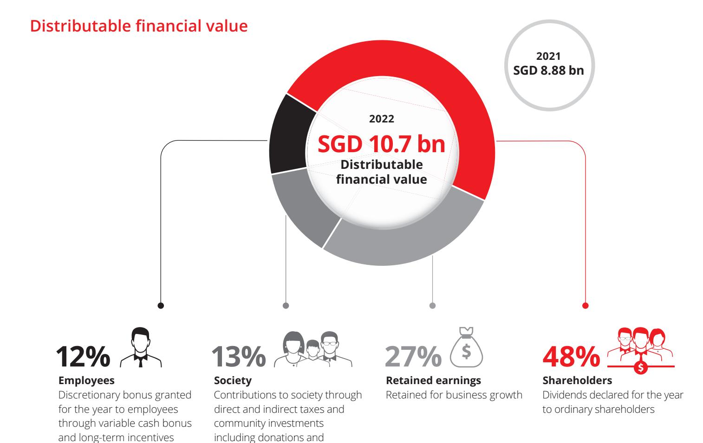

# We distribute value to our stakeholders in several ways: some in financial value, others in intangible benefits.

We define distributable financial value as net profit before discretionary bonus granted for the year, taxes (direct and indirect) and community investments.

In 2022, our distributable financial value amounted to SGD 10.7 billion (2021: SGD 8.88 billion).

In addition, we distribute non-financial value to our stakeholders in the following ways.

### **Customers**

investment of funds in the

broader community

Delivering suitable financial products and services to support our customers' transition towards lower carbon business models, enhance their access to environmental, social and governance (ESG) investments, and deliver customised retail solutions to meet their specific needs.

Read more about this on pages 80 to 81.

### **Employees**

Creating the right workspaces and building the right behaviours to shape joyful work culture, while fostering an inclusive culture with equal opportunities.

Read more about "Building a Great Corporate Culture" and "Driving Diversity, Equity, and Inclusion" in the Sustainability Report.

# Society

Nurturing the growth of Social Enterprises in Asia and fostering a more equitable and inclusive society where the underprivileged are equipped to thrive and grow.

Read more about "DBS Foundation" in the Sustainability Report.

### Regulators

Engaging with local and global regulators and policy-makers on reforms and new initiatives that help to maintain the integrity of the banking industry.

Read more about this on pages 80 to 81.

# Material matters

Material matters have the most impact on our ability to create long-term value as a bank. These matters influence how the Board and senior management steer the bank.

### Identify

matters that may impact the execution of our strategy. This is a group-wide effort considering input from all business and support units, and incorporating feedback from stakeholders.

Read more about our stakeholder engagement on pages 80 and 81.

### **Prioritise**

matters that most significantly impact our ability to successfully execute our strategy in delivering long-term value and influencing the decisions of key stakeholders.

### Integrate

matters that are material to value creation into our balanced scorecard to set objectives, drive behaviours, measure performance and determine the remuneration of our people.

Read more about our balanced scorecard approach under "Our 2022 priorities" on pages 26 to 31.

In 2022, we reviewed the findings of our last formal materiality assessment, which had been completed in the prior year. We also conducted a new analysis, which included desktop research of external trends, data analysis, and regular dialogues with our key stakeholders through various platforms and feedback channels to gain new insights and identify matters of key relevance to them.

It was concluded that last year's outcome of the materiality assessment remained broadly in line. However, based on various engagements with our key stakeholder groups, we included "Human Rights" as a new material matter to better reflect how we uphold the responsibility to respecting human rights in everything we do. Additionally, we made a clearer distinction across "Building a Great Corporate Culture", "Developing Our People" and "Driving Diversity, Equity and Inclusion", as we view these matters to be of increasing importance. Our refined approach responds to the changing needs of our stakeholders and the increasing importance of responsible business practices.

Read more about material ESG matters in our Sustainability Report.

# **DBS 2022 Materiality Matrix**

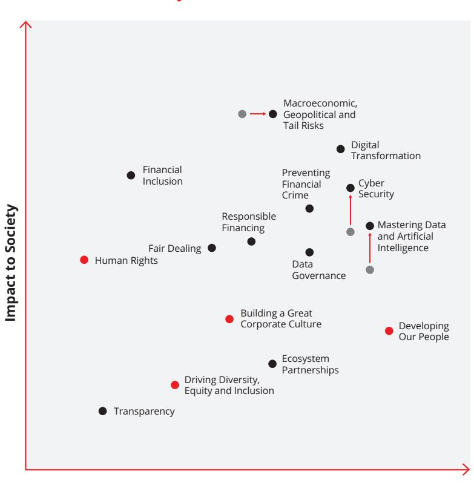

Impact to DBS

76 **A Di erent Kind of Bank** DBS Annual Report 2022 **Material matters** 77

| Material matters                                   | What are the risks?                                                                                                                                                                                                                                                                                                                                                                                                                                                                                                         | Where do we see the opportunities?                                                                                                                                                                                                                                                                                                                                                                                                                                           | What are we doing about it?                                                                                                                                                                                                                                                                                                                                                                                                                                                                                                                                                                                                                                                                                                                            |
|----------------------------------------------------|-----------------------------------------------------------------------------------------------------------------------------------------------------------------------------------------------------------------------------------------------------------------------------------------------------------------------------------------------------------------------------------------------------------------------------------------------------------------------------------------------------------------------------|------------------------------------------------------------------------------------------------------------------------------------------------------------------------------------------------------------------------------------------------------------------------------------------------------------------------------------------------------------------------------------------------------------------------------------------------------------------------------|--------------------------------------------------------------------------------------------------------------------------------------------------------------------------------------------------------------------------------------------------------------------------------------------------------------------------------------------------------------------------------------------------------------------------------------------------------------------------------------------------------------------------------------------------------------------------------------------------------------------------------------------------------------------------------------------------------------------------------------------------------|
| Macroeconomic, geopolitical and tail risks      | High inȵ ationary environment driven by energy and food prices, and supply chain disruptions have driven central banks to hike interest rates at an unprecedented pace, creating headwinds to economic growth. In addition, we continued to face a diɝ cult geopolitical situation, with tensions remaining elevated between the superpowers.                                                                                                                                                                   | Higher interest rates will beneȴ t banks at an early stage of the economic cycle, especially as long as credit costs and losses remain under control. Investments and consumption have picked up in Asia after two years of economic uncertainty due to the pandemic, especially due to the reopening of China via trade and tourism.                                                                                                                            | Our broad-based franchise and nimble execution enabled us to capture regional opportunities despite the macroeconomic uncertainty and ȴ nancial market volatility. Our income was also boosted by a higher net interest margin. We took another step in scaling up our presence in growth markets with our acquisition of the Citi consumer banking business in Taiwan. Read more in the "Letter from Chairman and CEO" on page 8 and in the "CFO statement" on page 20                                                                                                                                                                                                                                                     |
| Digital transformation                             | A new wave of operational and systemic risks may be created as digital banking transformation programmes become more deeply embedded in the banking industry, all the while as customers and industry players become increasingly digitally savvy. The challenges are compounded against a backdrop of higher workforce attrition and labour shortages in the tech space.                                                                                                                                       | Banks that are able to consistently deliver di΍ erentiated technological innovations with robust, reliable and resilient systems will provide a more seamless and secure user experience and gain customer conȴ dence and a competitive advantage. Attracting, developing and retaining tech talents will ensure the vitality of the driving force behind our transformation to be a leader in digital banking.                                               | We are developing and scaling robust systems through Site Reliability Engineering (SRE). We also strengthened our cybersecurity capabilities to address a larger attack surface and potential gaps in work processes as companies scale their remote working arrangements and support hybrid working. We also made e΍ orts to diversify and upskill our tech workforce while maintaining continuity within technology teams. As we balance resilience and innovation, we will keep experimenting with emerging technologies that could revolutionise banking and give us a ȴ rst-mover's advantage as use cases become clear. Read more in the "CIO statement" on page 34, and "Our 2022 priorities" on page 26 |
| Mastering data and artiȴ cial intelligence (AI) | As banks rise to the challenge of meeting consumer demand for banking experiences that are intuitive, they will need to re-architect legacy technology and their data stack. The ethics of using AI algorithms is also coming under strict scrutiny, especially in the areas of accountability, transparency, and data bias. Inability to manage both the transition and ethical issues, as well as leverage beneȴ ts from AI technologies will result in a loss of trust, competitiveness and market share. | Unlocking the value of data in our business operating model will help drive greater economic value through: (i) delivering tailored customer experiences and employee journeys; (ii) developing greater operational eɝ ciencies and lowering costs through higher automation; (iii) accelerating deployments by improving operations and decision-making; and (iv) adopting emerging technologies to create new products/ services through rapid innovations. | As an AI-fuelled bank, we have made AI central to our core strategy, and incorporated AI technologies into our management and operation processes. To build trust through fair, ethical and responsible use of data and AI, we continually enhance our DBS PURE (Purposeful, Unsurprising, Respectful, Explainable) framework and AI governance processes and controls. Industrialising AI throughout the bank has enabled us to power di΍ erentiated customer experiences and achieve hyper-personalised services for customers. Read more in "CIO statement" on pages 34.                                                                                                                                              |
| Data governance                                    | Rapid digitisation has intensiȴ ed data collection and analytics, which are used to drive new business initiatives. This has led to greater demands for enhanced standards of data protection and privacy. A weak data governance framework for data capturing, data quality, and data use will increase the risk of non-compliance, ȴ nancial losses, regulatory ȴ nes, and reputational damage.                                                                                                                  | Strong data governance programmes will deliver faster and sharper insights for decision-making, and enhance risk and fraud management to deliver positive business outcomes as we scale the use of data and analytics across the bank. As we place privacy at the heart of our products and services design, we uphold the trust of our customers and deepen our relationship with them.                                                                         | Read more in the "CRO statement" on page 32 and "Data Governance" in the Sustainability Report.                                                                                                                                                                                                                                                                                                                                                                                                                                                                                                                                                                                                                                                     |
| Human rights                                       | Insuɝ cient integration of human rights principles and human rights due diligence in our business operations may expose us to unintended and unforeseen legal, ȴ nancial, and reputational risks.                                                                                                                                                                                                                                                                                                                        | Respecting human rights in everything we do reaɝ rms the critical role we play to positively contribute to society as a bank and as an employer. By integrating human rights related policies and procedures in our lending and business operations, we promote economic inclusion and empower marginalised communities, allowing us to tap into new markets and create new business opportunities.                                                           | We established a Human Rights policy to formalise our consistent e΍ orts to respect human rights, which among others stipulates a strong commitment to the United Nations' Guiding Principles on Business and Human Rights Read more in "Human Rights" in the Sustainability Report.                                                                                                                                                                                                                                                                                                                                                                                                                                                       |
| Building a great corporate culture                 | The pandemic has permanently changed the way we live, learn and work and raised awareness of the importance of mental well-being for our people. Companies that are unable to adapt their work practices and pay greater attention to employee well-being will face challenges in engaging and retaining their talent.                                                                                                                                                                                             | Redesigning the workplace and building the right behaviours empower employees to thrive and drive more impactful customer outcomes. A strong corporate culture which is open, collaborative, and with a focus on employees' holistic wellbeing will help organisations attract and retain the best talent and drive business performance.                                                                                                                        | Read more in "Building a Great Corporate Culture" in the Sustainability Report.                                                                                                                                                                                                                                                                                                                                                                                                                                                                                                                                                                                                                                                                     |
| Driving diversity, equity & inclusion (DEI)     | Being an organisation that operates in 19 di΍ erent markets, failure to embrace diversity, equity and inclusion will run us the risk of not being e΍ ective in the communities that we operate in. It also a΍ ects our global brand and ability to retain diverse talent to drive our businesses.                                                                                                                                                                                                                     | Fostering an inclusive culture attracts and retains the best talent for our workforce. Strong, diverse teams are critical in enabling innovation, objective decision-making and robust problem-solving.                                                                                                                                                                                                                                                                | Read more in "Driving Diversity, Equity and Inclusion" in the Sustainability Report.                                                                                                                                                                                                                                                                                                                                                                                                                                                                                                                                                                                                                                                                |

| Material matters           | What are the risks?                                                                                                                                                                                                                                                                                                                                                                                                                                                        | Where do we see the opportunities?                                                                                                                                                                                                                                                                                                                                                                                                                              | What are we doing about it?                                                                                                                                                                                                                                                                                                                                                                                                                                                                                                                                                                                                                                                          |
|----------------------------|----------------------------------------------------------------------------------------------------------------------------------------------------------------------------------------------------------------------------------------------------------------------------------------------------------------------------------------------------------------------------------------------------------------------------------------------------------------------------|-----------------------------------------------------------------------------------------------------------------------------------------------------------------------------------------------------------------------------------------------------------------------------------------------------------------------------------------------------------------------------------------------------------------------------------------------------------------|--------------------------------------------------------------------------------------------------------------------------------------------------------------------------------------------------------------------------------------------------------------------------------------------------------------------------------------------------------------------------------------------------------------------------------------------------------------------------------------------------------------------------------------------------------------------------------------------------------------------------------------------------------------------------------------|
| Developing our people      | We will continue to see jobs being disrupted in the post pandemic world. Companies need to invest in upskilling and reskilling of their employees so as to be well-equipped in capturing and realising new growth areas for the business.                                                                                                                                                                                                                            | Companies that actively equip their employees with the right education, skills and opportunities will beneȴ t from a future-ready workforce that can embrace and thrive with new ways of working.                                                                                                                                                                                                                                                         | Read more in "Developing Our People" in the Sustainability Report.                                                                                                                                                                                                                                                                                                                                                                                                                                                                                                                                                                                                                   |
| Ecosystem partnerships     | The acceleration of digital adoption is changing the way consumers and corporates behave, with increasing consumer engagement on digital platforms and businesses moving into direct-to consumer models. The role of ȴ nancial institutions as intermediaries is evolving as emerging technologies change the ways market participants interact. As a result, ȴ nancial services revenue pools are being disrupted and redistributed to new challengers. | Our data insights, digital capabilities and strength in innovation enable us to disrupt the existing ȴ nancial markets and orchestrate ecosystems, which allow our partners and customers to engage and transact seamlessly on our platforms. Additionally, with an extensive suite of application programming interfaces (APIs), DBS is well positioned to embed our services on our partners' platforms to acquire and distribute at scale. | We are scaling existing and building new ecosystem partnerships to extend our reach, create a di΍ erentiated customer experience and avail our services to customers in the right context. We are investing in blockchain and AI technologies to develop commercial applications for our banking businesses and to reimagine ȴ nancial market infrastructure ecosystems. Read more in "Our 2022 Priorities" on page 26.                                                                                                                                                                                                                                         |
| Responsible ȴ nancing      | Insuɝ cient integration of environmental, social and governance (ESG) considerations into our business operations would expose the bank to various emerging risks such as climate-related physical and transition risks. It would also increase the probability of missing new business opportunities, such as those related to the investment and ȴ nancing needs of our clients arising from their transition to lower carbon lifestyles or business models. | The investment needs to transition our economies to a net-zero future are very signiȴ cant. As estimated by the Intergovernmental Panel on Climate Change in 2021, this investment would amount to an additional USD 3.5 trillion annually. This provides an opportunity to support clients with advisory services and ȴ nancing solutions.                                                                                                         | We committed to aligning our lending and ȴ nancing activities with net-zero by 2050. Additionally, we established science-informed decarbonisation strategies and set 2030 decarbonisation targets for a large number of sectors. To date, this is among the most comprehensive and ambitious sets of decarbonisation targets among banks globally. We seek to leverage this work in our client interactions in order to support them in their transition. We also incorporated environmental risks into our Risk Appetite statement and our overall risk governance and processes. Read more in "Responsible Financing" in the Sustainability Report. |
| Financial inclusion        | Global macroeconomic headwinds such as high inȵ ation and interest rates as well as high food and energy costs have widened the income and social inequity gap, further marginalising parts of society, which makes it harder for them to access formal banking services. A widening income gap can further weaken societal cohesion and undermine prospects for an inclusive and just transition.                                                             | Technology is making banking more inclusive and levelling the playing ȴ eld for small businesses, while scaling up essential ȴ nancial services and digital literacy to help communities achieve ȴ nancial health and well-being.                                                                                                                                                                                                                         | We continue democratising wealth by creating an enabling environment for the underbanked and addressing the ȴ nancing gap for small local businesses. Read more about "Consumer Banking/ Wealth Management" on page 38 and "Financial Inclusion" in the Sustainability Report.                                                                                                                                                                                                                                                                                                                                                                                           |
| Preventing ȴ nancial crime | Geopolitical developments have complicated issues of compliance and integrity in ȴ nancial practices, such as sanctions and sanction evasion. The rapid emergence of digital assets also increases the risks of money laundering and sanction evasion.                                                                                                                                                                                                            | A strong governance framework and comprehensive data analytics and systems capability prevents ȴ nancial crimes and protects our customers.                                                                                                                                                                                                                                                                                                                  | Read more in the "CRO statement" on page 32 and "Preventing Financial Crime" in the Sustainability Report.                                                                                                                                                                                                                                                                                                                                                                                                                                                                                                                                                                        |
| Cyber security             | The cyber risk landscape has worsened as cyber criminals and threat actors exploit a fractious environment instigated by heightened geopolitical tensions, to target our customers and sta΍ with increasingly sophisticated attacks.                                                                                                                                                                                                                                 | A robust cyber security strategy and governance builds conȴ dence and di΍ erentiates us in an increasingly digital space.                                                                                                                                                                                                                                                                                                                                    | Read more in "CRO statement" on page 32 and "Cyber Security" in the Sustainability Report.                                                                                                                                                                                                                                                                                                                                                                                                                                                                                                                                                                                        |
| Fair dealing               | Customers expect us to put their interests ȴ rst by providing relevant and accurate information, and appropriate recommendations in conducting our business.                                                                                                                                                                                                                                                                                                            | Fair dealing is foundational to our business, and we believe customers are more likely to bank with us when they trust that we are fair and transparent.                                                                                                                                                                                                                                                                                                     | Read more about "Fair Dealing" in the Sustainability Report.                                                                                                                                                                                                                                                                                                                                                                                                                                                                                                                                                                                                                         |
| Transparency               | Transparency in disclosure promotes good governance, builds trust and drives better decision making. Failure to adequately disclose may give rise to regulatory and reputational risks, and cause us to not meet external expectations.                                                                                                                                                                                                                           | Greater transparency builds trust with customers, which helps grow our wallet share. It will also improve the speed of dispute resolution with customers and protect the reputation of the bank.                                                                                                                                                                                                                                                          | Read more about "Corporate governance" on page 42.                                                                                                                                                                                                                                                                                                                                                                                                                                                                                                                                                                                                                                   |

80 **A Di erent Kind of Bank** DBS Annual Report 2022 **What our stakeholders are telling us** 81

# What our stakeholders are telling us

# **An ongoing dialogue and collaboration with our key stakeholders provide us with insights into matters of relevance to them.**

Our key stakeholders are those who impact our strategy the most or are directly impacted by it. They comprise our investors, customers, employees, society, regulators and policy-makers.

Regular stakeholder engagements provide us with an understanding of the material matters they are most concerned with. These matters help us deȴ ne our strategic priorities and guide our initiatives.

### **Investors**

**How did we engage?**

**What are the key topics raised and feedback received?** We provide timely and detailed disclosures to enable investors to make informed investment decisions with DBS. We also seek their perspectives on our ȴ nancial performance and strategy.

- Quarterly results brieȴ ngs.
- One-on-one and group meetings with over 550 investors, conducted either online or in-person, including conferences and roadshows in London and New York.

### **Customers**

We interact with customers to better understand their requirements so that we can propose the right ȴ nancial solutions for them.

- call centres and branches.
- Regular engagements via relationship appropriate.
- Active interaction and prompt follow-up to queries/ feedback received via social media platforms such as Facebook, LinkedIn, and Twitter, as well as online communities on our
- surveys and immersions to continuously iterate journey roadmaps.
- Multiple channels, including digital banking,
- managers and subject matter specialists, where
- corporate websites.
- Regular customer interactions via satisfaction
- **•** Many small and medium enterprise (SME) customers requested for working capital
- **•** Many retail customers experienced better more investment guidance amidst volatile

### over 540 employee questions and feedback items were conveyed to the CEO, an increase of almost 40% compared to last year.

**•** "Tell Piyush" – an online forum where

We communicate with our employees using multiple channels to ensure they are aligned with our strategic priorities. This also allows us to remain up to date

**Employees**

with their concerns.

- "DBS Open" quarterly group-wide townhall hosted by the CEO.
- Regular department townhalls and events held by senior management.
- DBS Cares Community Forums employees learn and share more about taking care of their personal well-being.
- Regular surveys such as our annual "MyVoice" employee engagement survey.
- **•** Questions and feedback raised via "Tell Piyush" covered topics across corporate strategy, culture, technology and workplace management, employee compensation, beneȴ ts and welfare as
- survey, our best-performing indicators were reȵ ected in the areas of Diversity and Inclusion, Learning and Development, and Managerial E ectiveness even as DBS transitions to a permanent hybrid work model.
- **•** Piyush personally addressed all questions and comments raised. Employees were also engaged regularly through quarterly pulse surveys to identify areas of concerns and/ or pain points. Where applicable, all issues and suggestions raised, and insights received, were directed to relevant departments and COO oɝ ces for follow-up.
- **•** After an extensive study by our Future of Work taskforce, DBS embraced a permanent hybrid work model to maximise the beneȴ ts of both Work-In-Oɝ ce and Work-From-Home arrangements. We have also dramatically transformed the way we work through the implementation of an Horizontal Organisation to drive greater collaboration.

*Read more in "Building a Great Corporate Culture" in the Sustainability Report.*

## **Society**

We engage the community to better understand the role we can play to address societal needs and gaps.

**•** Engagement with social enterprises (SEs) to understand speciȴ c challenges arising from the pandemic, and facilitating regional industry knowledge

**•** Speaking engagements with community partners and social service agencies. **•** Connection with government bodies and associations, including Singapore Centre for Social Enterprise and

**•** Strong partnerships with academia to jointly tackle real-world sustainability

**•** Community engagement within the public housing estates (heartlands) and our neighbours through POSB.

**•** Challenges in adapting to new forms of digital interactions continued as physical,

sharing and dialogues.

Community Chest.

challenges.

### **Regulators and policy-makers**

We strive to be a good corporate citizen and advocate by providing input to and supporting the implementation of public policies. Additionally, we seek to be a strong representative voice for Asia in global industry forums.

- Regular engagement sessions with regulators, governments/ government bodies, and public agencies in one-on-one or group meetings.
- Sharing insights with and advising public agencies as an industry leader, including via the participation in relevant committees.
- Providing insights and thought leadership in support of regulators' e orts towards ensuring ȴ nancial stability.
- Active participation in local, regional, and international industry forums on ȴ nancial regulation.

### quality from rising interest rates, geopolitical uncertainty, and pressures from China's real estate sector. **•** High Common Equity Tier 1 (CET-1) level and the prospect for higher dividends. **•** Environment, social and governance (ESG) commitments and our progress

**•** Impact on business outlook and credit

towards targets. Speciȴ cally, interest in our commitment to aligning lending and ȴ nancing activities with net-zero by 2050 and how we engage with customers on their decarbonisation

strategies.

- solutions to support them during the pandemic.
- digital stability, speed, and user experience. They continued to seek greater product variety and eɝ cient service experiences as well as market conditions.
- **•** On sustainability: Growing interest in sustainable ȴ nancing solutions among corporate and SME customers, and ESG investing solutions among private banking clients.

- well as customer experience.
- **•** In our annual employee engagement
- in-person volunteering remained a challenge with pandemic restrictions in place across more markets. The needs of the communities had also grown to include social and emotional aspects, in addition to the immediate economic and medical challenges, particularly among the elderly. **•** More support for both SMEs and
- SEs was needed, as both were keen to adopt more sustainable business models but are often held back by operational matters and may lack the bandwidth or resources to kickstart their transition journey. They sought catalytic capital and strong partners to enable them to scale up their businesses and deepen their positive social and environment impact.
- **•** We scale our volunteerism footprint by encouraging our employees to embrace new creative ways of volunteering through a hybrid of in-person and virtual volunteering. In transcending limitations and geographical

- **•** Challenges in ensuring business resilience and continue providing innovative ȴ nancial services to maintain stability of the ȴ nancial system.
- **•** Key regulatory and reporting issues surrounding the banking industry included:
- **•** Cyber security
- **•** Preventing ȴ nancial crime
- **•** Data governance
- **•** Fair dealing and conduct
- **•** Sustainability
- **•** Regulatory risks, and new regulatory requirements because of new growth opportunities such as ȴntech/ tech platforms, carbon markets, and climate-related disclosures.
- **•** Approach to our commitment to aligning lending and ȴ nancing activities with net-zero by 2050, including sector- and marketspeciȴc targets and decarbonisation plans.

### **•** We provided detailed disclosures and commentary on business outlook, ȴ nancial performance and credit quality.

- **•** We reiterated our policy to pay sustainable dividends that grow progressively with earnings and indicated that we would reviewing our payout at year-end. We also aɝ rmed our CET-1 target range.
- **•** We responded to investor queries through various engagements – both online and in-person meetings – and highlighted our sustainability strategy centred around our three-pillars: Responsible Banking, Responsible Business Practices, and Impact Beyond Banking. We also provided details on how we aim to operationalise our net-zero commitment, and how we manage climate risks.

*Read more in "CFO statement" on page 20 and "Stakeholder engagement" and "Selected ESG-related awards, indices and ratings" in the Sustainability Report.*

- **•** We approved over 5,000 loans totalling SGD 900 million to SMEs, with over 98% of the loans going to micro and small businesses.
- **•** We expanded our product o erings through ecosystem partnerships and reinforced Respectful, Easy to Deal With, Dependable (RED) service standards to harmonise customer experience across DBS. We harnessed our data capabilities to drive deeper engagement through personalised content and continued to enhance customers' digital experience. Strong momentum in adoption of customer obsession cultures helped to ensure we continuously improve our banking journeys.
- **•** We provided corporate customers with guidance on new ȴ nancial products and services in support of their decarbonisation journey. Some examples include sustainable debt instruments (green- and sustainability-linked loans, sustainable bonds), and a suite of ESG-investment funds. We also empowered clients to integrate a sustainability lens to their investments while we continually curate and avail more impact-focused sustainable portfolios.

*Read more in "Institutional Banking" on page 36, "Consumer Banking/ Wealth Management" on page 38, "Responsible Financing", "Sustainable Living", and "Financial Inclusion" in the Sustainability Report.*

- constraints, we redeȴ ned volunteering.
  - **•** We committed SGD 3 million in grant funding to 23 awardees (15 SEs and 8 SMEs) through the 2022 DBS Foundation Grant Programme, via which we introduced a new category to support SMEs looking to kickstart their transformation journey, while continuing to deepen our support for SEs.

*Read more about "POSB" on page 40, "DBS Foundation" and "Employee Volunteerism" in the Sustainability Report.*

- **•** We accelerated the implementation of key controls and experimentation of innovative solutions to address the incremental risk of remote working and enhanced our data usage surveillance to provide a high-ȴ delity detection of the removal information from our critical data stores. We deployed digital solutions to facilitate physical, contact free banking for our customers.
- **•** We continued to invest in our cyber defence capabilities, and leverage o technology, data analytics and the use of AI/ ML to combat money-laundering risks to protect our customers from scams. We also made further strides in our data governance capabilities and our ȴ nancial advisory processes to ensure that the interests of our customers remain protected.
- **•** Riding on the successes of blockchain-based businesses, DDEx, and Partior, we continued to drive technology-enabled business solutions, partnering with relevant regulators and industry players as necessary to innovate with new ȴ nancial engagement models and distributed ledger technologies, such as the Open Government Products.
- **•** We engaged proactively with regulators and policy-makers across our core markets following the publication of 'Our Path to Net Zero', where we described in great detail how we selected science-informed decarbonisation pathways and set interim 2030 decarbonisation targets for a large number of sectors. The aim of this was to share insights and lessons learned to expedite knowledge exchange and support a system-wide net-zero transition.

*Read more about "Risk management" on page 82, "Cyber Security", "Preventing Financial Crime", "Data Governance" and "Fair Dealing" in the Sustainability Report.*

# **How did we respond?**

82 **A Di erent Kind of Bank** DBS Annual Report 2022 **Risk management** 83

# Risk management

**The sections marked by a grey line in the left margin form part of the Group's audited ȴ nancial statements. Please refer to Pillar 3 and Other Regulatory Disclosures for other risk disclosures.**

# **1 Risk overview**

### **Business and strategic risk**

Overarching risk arising from adverse business and economic changes materially a ect DBS' long-term objectives. This risk is managed separately under other governance processes.

*Read more about this on page 75.*

### **Credit risk**

Risk arising from borrowers or counterparties failing to meet their debt or contractual obligations.

*Read more about this on page 84.*

### **Market risk**

Risk arising from adverse changes in interest rates, foreign exchange rates, equity prices, credit spreads and commodity prices, as well as related factors.

*Read more about this on page 91.*

### **Liquidity risk**

Risk that arises if DBS is unable to meet ȴ nancial obligations when they are due.

*Read more about this on page 93.*

### **Operational risk**

Risk arising from inadequate or failed internal processes, people or systems, or from external events. It includes legal risk, but excludes strategic and reputational risk.

*Read more about this on page 96.*

# **Reputational risk**

Risk that arises if our shareholder value (including earnings and capital) is adversely a ected by any negative stakeholder perception of DBS' image. This inȵ uences our ability to establish new relationships or services, service existing relationships and have continued access to sources of funding. Reputational risk usually occurs when the other risks are poorly managed.

*Read more about this on page 98.*

# **2 Risk-taking and our business segments**

Our risks are diversiȴ ed across di erent business segments. The chart below provides an overview of the risks arising from our business segments. The asset size of each business segment reȵ ects its contribution to the balance sheet, and the risk-weighted assets (RWA) o er a risk-adjusted perspective.

*Refer to Note 46.1 to the ȴ nancial statements on page 180 for more information about DBS' business segments*

| SGD million             | Consumer Banking/ Wealth Management | Institutional Banking | Treasury Markets | Others(a) | Group   |
|-------------------------|-------------------------------------------|--------------------------|------------------|-----------|---------|
| Assets(b)               | 126,394                                   | 326,469                  | 204,972          | 80,193    | 738,028 |
| Risk-weighted assets | 42,117                                    | 224,637                  | 41,566           | 38,575    | 346,895 |
| % of RWA                | Consumer Banking/ Wealth Management | Institutional Banking | Treasury Markets | Others(a) | Group   |
| Credit risk             | 79                                        | 95                       | 52               | 56        | 84      |
| Market risk             | 0                                         | 0                        | 42               | 13        | 6       |
| Operational risk        |                                           |                          |                  |           |         |

*(a) Encompasses assets/ RWA from capital and balance sheet management, funding and liquidity activities, DBS Vickers Group and The Islamic Bank of Asia Limited (b) Before goodwill and intangibles*

### **3 Risk governance**

The Board oversees DBS' a airs and provides sound leadership for the CEO and management. Authorised by the Board, various Board committees oversee speciȴ c responsibilities based on clearly deȴ ned terms of reference.

Under our risk management approach, the Board, through the Board Risk Management Committee (BRMC), sets our Risk Appetite, oversees the establishment of enterprise-wide risk management policies and processes, and establishes risk appetite limits to guide DBS' risk-taking.

The BRMC also oversees the identiȴ cation, monitoring, management and reporting of credit, market, liquidity, operational and reputational risks. To facilitate the BRMC's risk oversight, the following risk management committees have been established.

| Risk management committees                                                                                                                                                                                                              |                                                                                                                                                                                                                                                                                                                                                                                                                                                                                                                                                                                                                                                                                                                                                                                                                                                                          |
|-----------------------------------------------------------------------------------------------------------------------------------------------------------------------------------------------------------------------------------------|--------------------------------------------------------------------------------------------------------------------------------------------------------------------------------------------------------------------------------------------------------------------------------------------------------------------------------------------------------------------------------------------------------------------------------------------------------------------------------------------------------------------------------------------------------------------------------------------------------------------------------------------------------------------------------------------------------------------------------------------------------------------------------------------------------------------------------------------------------------------------|
| Risk Executive Committee (Risk EXCO)                                                                                                                                                                                                    | As the overall executive body regarding risk matters, the Risk EXCO oversees DBS' risk management.                                                                                                                                                                                                                                                                                                                                                                                                                                                                                                                                                                                                                                                                                                                                                                    |
| Group Credit Risk Committee (GCRC) Group Credit Risk Models Committee (GCRMC) Group Market and Liquidity Risk Committee (GMLRC) Group Operational Risk Committee (GORC) Group Scenario and Stress Testing Committee (GSSTC) | Each of the committees reports to the Risk EXCO, and serves as an executive forum to discuss and implement DBS' risk management. Key responsibilities: • Assess and approve risk-taking activities • Oversee DBS' risk management infrastructure, which includes frameworks, decision criteria, authorities, people, policies, standards, processes, information and systems • Approve risk policies such as model governance standards, stress testing scenarios, and the evaluation and endorsement of risk models • Assess and monitor speciȴ c credit concentration • Recommend stress-testing scenarios (including macroeconomic variable projections) and review the results The members in these committees comprise representatives from the Risk Management Group (RMG) as well as key business and support units. |
| Product Approval Committee (PAC)                                                                                                                                                                                                        | The PAC provides group-wide oversight and direction for the approval of new product and outsourcing initiatives. It evaluates new product and outsourcing initiatives to ensure that they are in line with the DBS' strategy and risk appetite.                                                                                                                                                                                                                                                                                                                                                                                                                                                                                                                                                                                                                 |

Most of the above committees are supported by local risk committees in all major locations, where appropriate. These local risk committees oversee the local risk positions for all businesses and support units, ensuring that they keep within limits set by the Group risk committees. They also approve location-speciȴ c risk policies.

The Chief Risk Oɝ cer (CRO), who is a member of the Group Executive Committee and reports to the Chairman of the BRMC and the CEO, oversees the risk management function. The CRO is independent of business lines and is actively involved in key decision-making processes. He often engages with regulators to discuss risk matters, enabling a more holistic risk management perspective.

Working closely with the risk and business committees, the CRO is responsible for the following:

- Management of DBS' risks, including systems and processes to identify, approve, measure, monitor, control and report risks
- Engagement with senior management about material matters regarding all risk types
- Development of risk controls and mitigation processes
- Ensuring DBS' risk management is e ective, and the Risk Appetite established by the Board is adhered to

## **4 Risk Appetite**

DBS' Risk Appetite is set by the Board and governed by the Risk Appetite Policy, which articulates the risks that we are willing to accept. It also serves to reinforce our risk culture by setting a clear message from the 'tone from the top'. A strong organisational risk culture, complemented with a balanced incentive framework (refer to "Remuneration Report" section on page 63), helps to further embed our Risk Appetite.

### **4.1 Risk thresholds and economic capital usage**

Our Risk Appetite takes into account a spectrum of risk types and is implemented using thresholds, policies, processes and controls.

Setting thresholds is essential in making DBS' Risk Appetite an intrinsic part of our businesses as they help to keep all our risks within acceptable levels. Portfolio risk limits for the quantiȴ able risk types are established top down, and these are implemented using frameworks. As for the nonquantiȴ able risk types, these are managed using qualitative principles.

To ensure that the thresholds pertaining to our Risk Appetite are completely risk sensitive, we adopted both economic capital (EC) and regulatory capital (RC) as our risk metrics. Additionally, both EC and RC are assessed as part of our Internal Capital Adequacy Assessment Process (ICAAP).

Our capital allocation structure monitors credit, market and operational risks by assessing regulatory capital utilisation at the business unit level. The diagram below shows how they are managed along the various dimensions. A bu er is also maintained for other risks, such as country, reputational, model risks, etc.

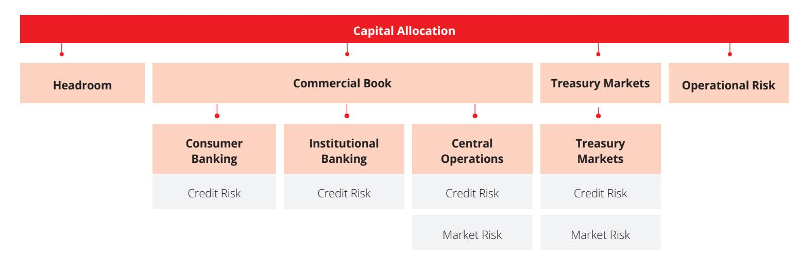

Other quantitative or qualitative controls are used to manage the other risks at granular levels. The following chart provides a broad overview of how our Risk Appetite permeates throughout DBS. Refer to Sections 5 through 9 for more information about each risk type.

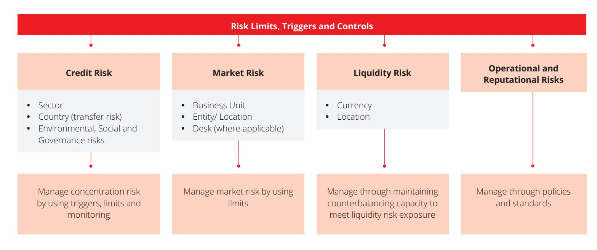

### **4.2 Stress testing**

Stress testing is an integral part of our risk management process. It includes both sensitivity and scenario analyses, and is conducted regularly. In particular, the ICAAP (a group-wide exercise spanning di erent risk types) is performed annually. In addition, stress tests are carried out in response to microeconomic and macroeconomic conditions, or portfolio developments. Every stress test is documented and the results are reviewed by senior management and/or the BRMC.

Stress testing alerts senior management to our potential vulnerability to exceptional but plausible adverse events. As such, stress testing enables us to assess capital adequacy and identify potentially risky portfolio segments as well as inherent systematic risks. This then allows us to develop the right contingency plans, exit strategies and mitigating actions beforehand.

The ICAAP ensures our business plans are consistent with our Risk Appetite. This is done by comparing the projected demand for capital to the projected supply of capital under various scenarios, including severe macroeconomic stress.

### **5 Credit risk**

The most signiȴ cant measurable risk DBS faces - credit risk - arises from our daily activities in our various businesses. These activities include lending to retail, corporate and institutional customers. It includes the risk of lending, pre-settlement and settlement risk of foreign exchange, derivatives and securities.

*Refer to Note 43.1 to the ȴ nancial statements on page 172 for details on DBS' maximum exposure to credit risk.*

### **5.1 Credit risk management at DBS**

DBS' approach to credit risk management comprises the following building blocks:

### **Policies**

**Risk methodologies**

**Processes, systems and reports**

### **Policies**

The dimensions of credit risk and the scope of its application are deȴ ned in the Group Credit Risk Management Policy. Senior management sets the overall direction and policy for managing credit risk at the enterprise level.

The Group Core Credit Risk Policies (CCRPs) established for Consumer Banking/ Wealth Management and Institutional Banking set forth the principles by which DBS conducts its credit risk management and control activities. These policies, supplemented by a number of operational standards and guides, ensure consistency in identifying, assessing, underwriting, measuring, reporting and controlling credit risk across DBS, and provide guidance in the formulation of businessspeciȴ c and/ or location-speciȴ c credit risk policies and standards.

The operational standards and guides are established to provide greater details on the implementation of the credit principles within the Group CCRPs and are adapted to reȵ ect di erent credit environments and portfolio risk proȴ les. The CCRPs are approved by the Group Chief Credit Oɝ cer.

### **Risk methodologies**

Credit risk is managed by thoroughly understanding our wholesale customers - the businesses they are in, as well as the economies in which they operate. It is also managed through statistical models and data analytics for retail customers.

The assignment of credit risk ratings and setting of lending limits are integral parts of DBS' credit risk management process, and we use an array of rating models for our wholesale and retail portfolios. Most of these models are built internally using DBS' loss data, and the limits are driven by DBS' Risk Appetite Statement and the Target Market and Risk Acceptance Criteria (TM-RAC).

Wholesale borrowers are assessed individually, and further reviewed and evaluated by experienced credit risk managers who consider relevant credit risk factors in the ȴ nal determination of the borrower's risk. For some portfolios within the SME segment, DBS also uses a programme-based approach to achieve a balanced management of risks and rewards. Retail exposures are assessed using credit score models, credit bureau records as well as internally and externally available customer behaviour records supplemented by our Risk Acceptance Criteria (RAC). Credit applications are proposed by the business units, and applications outside the RAC are independently assessed by the credit risk managers.

#### *Refer to Section 5.3 on page 88 to read more about our internal credit risk models.*

Pre-settlement credit risk for traded products arising from a counterparty potentially defaulting on its obligations is quantiȴ ed by evaluation of the mark-to-market value, plus potential future exposure. This is included within DBS' overall credit limits to counterparties for internal risk management.

We actively monitor and manage our exposure to counterparties for over-the-counter (OTC) derivative trades to protect our balance sheet in the event of a counterparty default. Counterparty risk exposures that may be adversely a ected by market risk events are identiȴ ed, reviewed and acted upon by management, and highlighted to the appropriate risk committees. Speciȴ c wrongway risk arises when the credit exposure of a counterparty (from the traded product transaction) directly correlates with the probability of default of the counterparty. DBS has processes in place to guide the handling of speciȴ c wrong-way risk transactions, and its risk measurement metric takes into account the higher risks associated with such transactions.

Issuer default risk that may also arise from derivatives, notes and securities are generally measured based on jump-to-default computations.

### **Concentration risk management**

For credit risk concentration, we use EC as our measurement tool as it combines the individual risk factors such as the probability of default (PD), loss given default (LGD) and exposure at default (EAD), in addition to industry correlation and portfolio concentration. EC thresholds are set to ensure that the allocated EC stays within our Risk Appetite. Concentration risk for retail is managed at two levels – product level where exposure limits are set up, and segment level to manage the growth of high-risk segments. Governance processes are in place to ensure that these thresholds are monitored regularly, and appropriate actions are taken when the thresholds are breached.

DBS continually examines and reviews how we can enhance the scope of our thresholds and approaches to manage concentration risk.

### **Environmental, social and governance risks**

Responsible ȴ nancing, covering environmental, social and governance (ESG) issues, is a topic of increasing importance that a ects investing and ȴ nancing decisions across the bank. DBS recognises that our ȴ nancing practices have a substantial impact on society and failure of our customers to appropriately manage ESG issues can directly impact their operations and long-term economic viability, as well as the communities and environment in which they operate.

DBS considers ESG risks as critical in our pursuit of business strategies. The Board approves DBS' overall and speciȴ c risk governance frameworks and oversees an independent Group-wide risk management system. In 2022, the Board approved the incorporation of environmental risk considerations into our Risk Appetite Statement. Our Group Responsible Financing Standard documents our overarching approach to responsible ȴ nancing and additional assessment required when entering into transactions with elevated ESG risks. The requirements of this Standard represent the minimum standards for DBS and we have also sought alignment, where possible, with international standards and best practices. Where signiȴ cant ESG issues are identiȴ ed, escalation is required to the relevant Global Industry Specialist and IBG Sustainability for further guidance prior to approval by the Credit Approving Authority.

*Refer more about "Responsible ȴ nancing" in the Sustainability Report.*

### **Country risk**

Country risk refers to the risk of loss due to events in a speciȴ c country (or a group of countries). This includes political, exchange rate, economic, sovereign and transfer risks.

DBS manages country risk through the requirements of the Group CCRP and the said risk is part of our concentration risk management. The way we manage transfer risk at DBS is set out in our Country Risk Management Standard. This includes an internal transfer risk and sovereign risk rating system, where assessments are made independently of business decisions. Our transfer risk limits are set in accordance with the Group Risk Appetite Policy.

Transfer risk limits for priority countries are set based on country-speciȴ c strategic business considerations as well as the acceptable potential loss according to our Risk Appetite. Management actively evaluates and determines the appropriate level of transfer risk exposures for these countries taking into account the risks and rewards and whether they are in line with our strategic intent. Limits for all other non-priority countries are set using a model-based approach.

Risk appetite for each country is approved by the BRMC, while transfer risk limits are approved by the Board EXCO and senior management.

### **Credit stress testing**

DBS engages in various types of credit stress testing, and these are driven either by regulators or internal requirements and management. Our credit stress tests are performed at the total portfolio or sub-portfolio level, and are generally

conducted to assess the impact of changing economic conditions on asset quality, earnings performance, capital adequacy and liquidity. DBS' stress testing programme is comprehensive and covers a range of risks and business areas.

DBS typically performs the following types of credit stress testing at a minimum and others as necessary:

| DBS conducts Pillar 1 credit stress testing regularly as required by regulators. Under Pillar 1 credit stress testing, DBS assesses the impact of a mild stress scenario (at least two consecutive quarters of zero growth) on Internal Ratings-Based (IRB) estimates (i.e. PD, LGD and EAD) and the impact on regulatory capital. The purpose of the Pillar 1 credit stress test is to assess the robustness of internal credit risk models and the cushion above minimum regulatory capital.                                                                                                                                      |
|-------------------------------------------------------------------------------------------------------------------------------------------------------------------------------------------------------------------------------------------------------------------------------------------------------------------------------------------------------------------------------------------------------------------------------------------------------------------------------------------------------------------------------------------------------------------------------------------------------------------------------------------------|
| DBS conducts Pillar 2 credit stress testing once a year as part of the ICAAP. Under Pillar 2 credit stress testing, DBS assesses the impact of stress scenarios, with di΍ erent levels of severity, on asset quality, earnings performance as well as internal and regulatory capital. The results of the credit stress test form inputs to the capital planning process under ICAAP. The purpose of the Pillar 2 credit stress testing is to examine, in a rigorous and forward-looking manner, the possible events or changes in market conditions that could adversely impact DBS and to develop the appropriate action plan. |
| DBS participates in the annual industry-wide stress test (IWST) conducted by the Monetary Authority of Singapore (MAS) to facilitate the ongoing assessment of Singapore's ȴ nancial stability. Under the IWST, DBS is required to assess the impact of adverse scenarios, as deȴ ned by the regulator, on asset quality, earnings performance and capital adequacy, where applicable.                                                                                                                                                                                                                                                 |
| DBS also conducts multiple independent sensitivity analyses and credit portfolio reviews based on various scenarios. The intent of these analyses and reviews is to identify vulnerabilities for the purpose of developing and executing mitigating actions.                                                                                                                                                                                                                                                                                                                                                                              |
|                                                                                                                                                                                                                                                                                                                                                                                                                                                                                                                                                                                                                                                 |

### **Processes, systems and reports**

DBS constantly invests in systems to support risk monitoring and reporting for our Institutional Banking and Consumer Banking/ Wealth Management businesses.

The end-to-end credit process is continually being reviewed and improved through various front-to-back initiatives involving business, operations, risk management and other key stakeholders. Day-to-day monitoring of credit exposures, portfolio performance and external environmental factors potentially a ecting credit risk proȴ les is key to our philosophy of e ective credit risk management.

In addition, credit trends, which may include industry analysis, early warning alerts and signiȴ cant weak credits, are submitted to

the various risk committees, allowing key strategies and action plans to be formulated and evaluated. Credit control functions also ensure that any credit risk taken complies with the credit risk policies and standards. These functions ensure that approved limits are activated, credit excesses and policy exceptions are appropriately endorsed, compliance with credit standards is carried out, and covenants established are monitored.

Independent risk management functions that report to the CRO are jointly responsible for developing and maintaining a robust credit stress testing programme. These units oversee the implementation of credit stress tests as well as the analysis of the results, of which

management, various risk committees and regulators are informed.

### **Non-performing assets**

DBS' credit facilities are classiȴ ed as "Performing assets" or "Non-performing assets" (NPA), in accordance with the MAS Notice to Banks No. 612 "Credit Files, Grading and Provisioning" (MAS Notice 612).

Credit exposures are categorised into one of the following ȴ ve categories, according to our assessment of a borrower's ability to repay a credit facility from its normal sources of income and/ or the repayment behaviour of the borrower.

| Classiȴ cation grade | Description                                                                                                                                                                                                                                       |
|----------------------|---------------------------------------------------------------------------------------------------------------------------------------------------------------------------------------------------------------------------------------------------|
| Performing assets    |                                                                                                                                                                                                                                                   |
| Pass                 | Indicates that the timely repayment of the outstanding credit facilities is not in doubt.                                                                                                                                                         |
| Special mention      | Indicates that the borrower exhibits potential weaknesses that, if not corrected in a timely manner, may adversely a΍ ect future repayments and warrant close attention by DBS.                                                                |
| Classiȴ ed or NPA    |                                                                                                                                                                                                                                                   |
| Substandard          | Indicates that the borrower exhibits deȴ nable weaknesses in its business, cash ȵ ow or ȴ nancial position that may jeopardise repayment on existing terms.                                                                                    |
| Doubtful             | Indicates that the borrower exhibits severe weaknesses such that the prospect of full recovery of the outstanding credit facilities is questionable and the prospect of a loss is high, but the exact amount remains undeterminable as yet. |
| Loss                 | Indicates that the outstanding credit facility is not collectable, and little or nothing can be done to recover the outstanding amount from any collateral or from the assets of the borrower generally.                                       |

A default is considered to have occurred with regard to a particular borrower when either or both of the following events have taken place:

- Subjective default: Borrower is considered to be unlikely to pay its credit obligations in full, without DBS taking action such as realising security (if held)
- Technical default: Borrower is more than 90 days past due on any credit obligation to DBS

For retail borrowers, the categorisation into the respective MAS loan grades is at the facility level and consistent with MAS Notice 612.

Credit facilities are classiȴ ed as restructured assets when we grant non-commercial concessions to a borrower because its ȴ nancial position has deteriorated or is unable to meet the original repayment schedule. A restructured credit facility is classiȴ ed into the appropriate non- performing grade based on the assessment of the borrower's ȴ nancial condition and its ability to repay according to the restructured terms.

Such credit facilities are not returned to the performing status until there are reasonable grounds to conclude that the borrower will be able to service all future principal and interest payments on the credit facility in accordance with the restructured terms and MAS Notice 612. Apart from what has been described, we do not grant concessions to borrowers in the normal course of business.

In addition, it is not within DBS' business model to acquire debts that have been restructured at inception (e.g. distressed debts).

*Refer to Note 2.11 to the ȴ nancial statements on page 131 for our accounting policies regarding speciȴ c and general allowances for credit losses.*

In general, speciȴ c allowances are recognised for defaulting credit exposures rated substandard and below.

*The breakdown of our NPA by loan grading and industry and the related amounts of speciȴ c allowances can be found in Note 43.2 to the ȴ nancial statements on page 173. A breakdown of past due loans can also be found in the same note.* 

When required, we will take possession of all collateral and dispose them as soon as practicable. Realised proceeds are used to reduce outstanding indebtedness.

*A breakdown of collateral held for NPA is shown in Note 43.2 to the ȴ nancial statements on page 175.* 

Repossessed collateral is classiȴ ed in the balance sheet as other assets. The amounts of such other assets for 2021 and 2022 were not material.

### **5.2 Credit risk mitigants**

### **Collateral received**

Where possible, DBS takes collateral as a secondary source of repayment. This includes, but is not limited to, cash, marketable securities, real estate, trade receivables, inventory, equipment, and other physical and/ or ȴ nancial collateral. We may also take ȴ xed and ȵ oating charges on the assets of borrowers.

Policies are in place to determine the eligibility of collateral for credit risk mitigation. Collateral is generally diversiȴ ed and periodic valuations of collateral are required. Real estate constitutes the bulk of our collateral, with a signiȴ cantly lower proportion in marketable securities and cash.

For derivatives, repurchase agreements (repo) and other repo-style transactions with ȴ nancial market counterparties, collateral arrangements are typically covered under market-standard documentation, such as International Swaps & Derivatives Association (ISDA) Agreements and Master Repurchase Agreements.

The collateral received is marked-tomarket on a frequency that DBS and the counterparties have mutually agreed upon. This is governed by internal guidelines with respect to collateral eligibility. In the event of a default, the credit risk exposure is reduced by master-netting arrangements where DBS is allowed to o set what we owe a counterparty against what is due from that counterparty in a netting-eligible jurisdiction.

*Refer to Note 15 to the ȴ nancial statements on page 143 for further information on ȴ nancial assets and liabilities subject to netting agreement but not o set on the balance sheet.* 

Collateral held against derivatives generally consists of cash in major currencies and highly rated government or quasi- government bonds. Exceptions may arise in certain countries, where due to domestic capital markets and business conditions, the bank may be required to accept less highly rated or liquid government bonds and currencies. Reverse repo-transactions are generally traded with large institutions with reasonably good credit standing. DBS takes haircuts against the underlying collateral of these transactions that commensurate with collateral quality to ensure credit risks are adequately mitigated.

In times of diɝ culty, we will review the customers' speciȴ c situation and circumstances to assist them in restructuring their ȴ nancial obligations.

However, should the need arise, disposal and recovery processes are in place to dispose the collateral held. DBS maintains a panel of agents and solicitors to assist in the disposal of non-liquid assets and specialised equipment quickly.

### **Collateral posted**

DBS is required to post additional collateral in the event of a rating downgrade. As at 31 December 2022, for a three-notch downgrade of its Standard & Poor's Ratings Services and Moody's Investors Services ratings, DBS will have to post additional collateral amounting to SGD 11 million (2021: SGD 2 million).

### **Other credit risk mitigants**

DBS accepts guarantees as credit risk mitigants. Internal requirements for considering the eligibility of guarantors for credit risk mitigation are in place.

### **5.3 Internal credit risk models**

DBS adopts rating systems for the di erent asset classes under the Internal Ratings - Based Approach (IRBA).

There is a robust governance process for the development, independent validation and approval of any credit risk model. The models go through a rigorous review process before they are endorsed by the GCRMC and Risk EXCO. They must also be approved by the BRMC before submission for regulatory approval. The key risk measures generated by the internal credit risk rating models to quantify regulatory capital include PD, LGD and EAD. For portfolios under the Foundation IRBA, internal estimates of PD are used while the supervisory LGD and EAD estimates are applied. For portfolios under the Advanced IRBA, internal estimates of PD, LGD and EAD are used. In addition, the ratings from the credit models act as the basis for underwriting credit risk, monitoring portfolio performance and determining business strategies. The performance of the rating systems is monitored regularly and reported to the GCRMC, Risk EXCO and BRMC to ensure their ongoing e ectiveness.

An independent risk unit conducts formal validations for the respective rating systems annually. The validation processes are also independently reviewed by Group Audit. These serve to highlight material deterioration in the rating systems for management attention.

### **5.3.1 Retail exposure models**

Retail exposures are categorised into the following asset classes under the Advanced IRBA: residential mortgages, qualifying revolving retail exposures, and other retail exposures.

Within each asset class, exposures are managed on a portfolio basis. Each customer or account is assigned to a risk pool, considering factors such as borrower characteristics and collateral type. PD, EAD and LGD estimates are based on internal historical default, utilisation and realised losses within a deȴ ned period.

Product-speciȴ c credit risk elements such as underwriting criteria, scoring models, approving authorities, asset quality, and business strategy reviews, as well as systems, processes and techniques to monitor portfolio performance, are in place. Credit risk models for secured and unsecured portfolios are also used to update the risk level of each loan on a monthly basis, reȵ ecting the broad usage of risk models in portfolio quality reviews.

### **5.3.2 Wholesale exposure models**

Wholesale exposures are largely under the Foundation IRBA for capital computation. They include sovereign, bank and corporate. Specialised lending exposures are under IRBA using supervisory slotting criteria.

Sovereign exposures are risk-rated using internal risk-rating models. Factors related to country-speciȴ c macroeconomic risk, political risk, social risk and liquidity risk are included in the sovereign rating models to assess the sovereign credit risk in an objective and systematic manner.

Bank exposures are assessed using the bank-rating model. The model considers both quantitative and qualitative factors such as capital levels and liquidity, asset quality and management strength.

Large corporate exposures are assessed using internal rating model. Factors considered in the risk assessment process include the counterparty's ȴ nancial strength and qualitative factors such as industry risk, access to funding, market standing and management strength.

SME credit rating models consider risk factors such as those relating to the counterparty's ȴ nancial strength, qualitative factors, as well as account performance.

Credit risk ratings under the IRBA portfolios are, at a minimum, reviewed by designated approvers on an annual basis unless credit conditions require more frequent assessment.

### **5.3.3 Specialised lending exposures**

Specialised lending IRBA portfolios include income-producing real estate, project ȴ nance, object ȴ nance, and commodities ȴ nance. These adopt the supervisory slotting criteria speciȴ ed under Annex 7v of MAS Notice 637, which are used to determine the risk weights to calculate credit risk-weighted exposures.

## **5.3.4 Securitisation exposures**

We arrange securitisation transactions for our clients for fees. These transactions do not involve special-purpose entities that we control. For transactions that are not underwritten, no securitisation exposures are assumed as a direct consequence of arranging the transactions. Any decision to invest in any of such arranged transactions is subject to independent risk assessment.

Where DBS provides an underwriting commitment, any securitisation exposure that arises will be held in the trading book to be traded or sold down in accordance with our internal policy and risk limits. In addition, DBS does not provide implicit support for any transactions we structure or have invested in.

We invest in our clients' securitisation transactions from time to time. These may include securitisation transactions arranged by us or with other parties.

We may also act as a liquidity facility provider, working capital facility provider or swap counterparty. Such securitisation exposures require the approval of the independent risk function and are subject to regular risk reviews. We also have processes in place to monitor the credit risk of our securitisation exposures.

### **5.3.5 Credit exposures falling outside internal credit risk models**

DBS applies the Standardised Approach (SA) for portfolios that are expected to transit to IRBA or for portfolios that are immaterial in terms of size and risk proȴ le. These portfolios include:

- IRBA-transitioning retail and wholesale exposures
- IRBA-exempt retail exposures
- IRBA-exempt wholesale exposures

Any identiȴ ed transitioning retail and/ or wholesale exposures are expected to adopt Advanced or Foundation IRBA, subject to approval by regulators. Prior to regulatory approval, these portfolios are under SA.

The portfolios under the SA are subject to our overall governance framework and credit risk management practices. DBS continues to monitor the size and risk proȴ le of these portfolios and will enhance the relevant risk measurement processes if these risk exposures become material.

DBS uses external ratings for credit exposures under the SA where relevant, and we only accept ratings from Standard & Poor's, Moody's and Fitch in such cases. DBS follows the process prescribed in MAS Notice 637 to map the ratings to the relevant risk weights.

### **5.4. Credit risk in 2022**

### **Concentration risk**

DBS' concentration risk remained well managed across geographies and industry/ business segments.

Our geographic distribution of customer loans remained stable. Growth was seen mainly in Singapore, Hong Kong and Rest of the World.

Singapore, our home market, continued to account for the largest share of our gross loans and advances to customers which contributed to 47% of our total portfolio.

Our portfolio was well diversiȴ ed across industry and business segments. Building and Construction, General Commerce and Manufacturing remained the largest contributors in the wholesale portfolio, accounting for 48% of the total portfolio.

### **Non-performing assets**

New non-performing asset (NPA) formation was o set by recoveries and write-o s. In absolute terms, our total NPA decreased by 12% from the previous year to SGD 5.13 billion and non-performing loans (NPL) ratio dropped to 1.1% in 2022.

*Refer to "CFO Statement" on page 20.*

### **Geographical Concentration (SGD billion) Industry Concentration (SGD billion)**

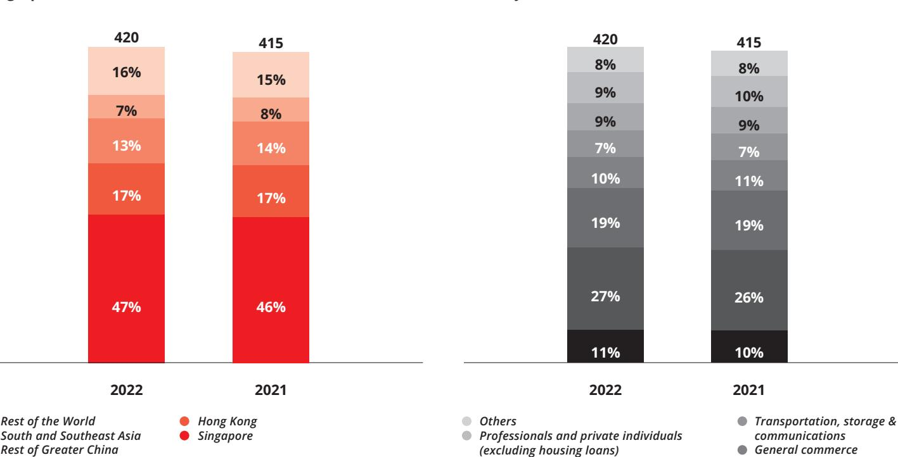

*Above refers to gross loans and advances to customers based on country of incorporation* *Above refers to gross loans and advances to customers based on MAS Industry Code*

*holding companies*

*Financial institutions, investments and* 

*Refer to Note 43.4 to the ȴ nancial statements on page 176 for DBS' breakdown of credit risk concentration.*

### **Collateral received**

The tables below provide breakdowns by loan-to-value (LTV) bands for the borrowings secured by real estate and other collateral from the various market segments.

### **Residential mortgage loans**

The LTV ratio is calculated using mortgage loans including undrawn commitments divided by the collateral value. Property

valuations are determined using a combination of professional appraisals and housing price indices.

For Singapore mortgage loans, the increases in property price index for HDB and private residential properties drove a shift of 14.8% from the LTV > 50% band to up to 50% LTV band.

For Hong Kong mortgage loans, there was an approximate 25.1% increase in the proportion of mortgage exposure in the 51% to 80% LTV band, as property price index decreased by 15.2% and 12.7% for Urban and New Territory region respectively in 2022.

*Housing loans*

*Building and construction Manufacturing*

For Rest of Greater China, the shift in the proportion of mortgage exposure to the up to 50% LTV band was mainly driven by the increase in property price index for Taiwan mortgage by 15.6% in 2022.

### **Percentage of residential mortgage loans (breakdown by LTV band and geography)**

### **As at 31 December 2022**

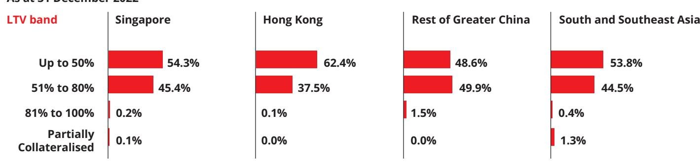

### **As at 31 December 2021**

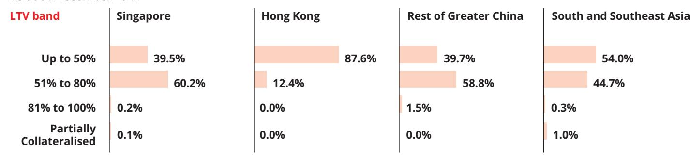

### **Loans and advances to corporates secured by real estate**

These secured loans were extended for the purpose of acquisition and/ or development of real estate, as well as for general working capital. More than 90% of such loans were fully collateralised and majority of these loans had LTV < 80%. Our property loans were mainly concentrated in Singapore and Hong Kong, which together accounted for about 80% of the total property loans.

The LTV ratio is calculated as loans and advances divided by the value of collaterals that secure the same facility. Real estate forms a substantial portion of the collaterals; other collaterals such as cash, marketable securities, and bank guarantees are also included.

### **Percentage of loans and advances to corporates secured by real estate (breakdown by LTV band and geography)**

### **As at 31 December 2022**

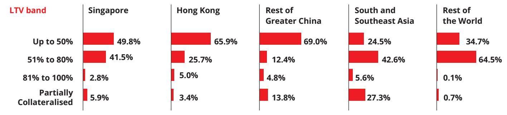

### **As at 31 December 2021**

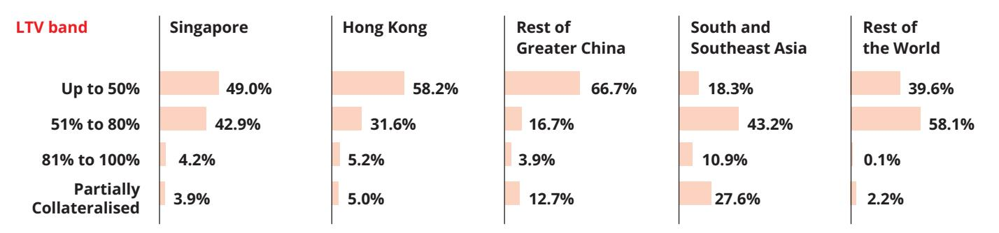

### **Loans and advances to banks**

In line with market convention, loans and advances to banks are typically unsecured. DBS manages the risk of such exposures by keeping tight control of the exposure tenor and monitoring of their credit quality.

### **Derivatives counterparty credit risk by markets and settlement methods**

We continue to manage our derivatives counterparty risk exposures with netting and collateral arrangements, thereby protecting our balance sheet in the event of a counterparty default.

A breakdown of our derivatives counterparty credit risk by markets (OTC versus exchangetraded) and settlement methods (cleared through a central counterparty versus settled bilaterally) can be found below.

### **Notional OTC and exchange-traded products**

| In notional terms, SGD million                            | As at 31 Dec 2022 |
|--------------------------------------------------------------|----------------------|
| OTC derivatives cleared through a central counterparty | 1,457,334            |
| OTC derivatives settled bilaterally                       | 1,114,144            |
| Total OTC derivatives                                     | 2,571,478            |
| Exchange-traded derivatives                               | 28,860               |
| Total derivatives                                            | 2,600,338            |

*Please refer to Note 37 to the ȴ nancial statements on page 160 for the netting arrangements impact and a breakdown of the derivatives positions held by DBS.*

# **6 Market risk**

Our exposure to market risk is categorised into:

**Trading portfolios:** Arising from positions taken for (i) market-making, (ii) client facilitation and (iii) beneȴ ting from market opportunities.

**Non-trading portfolios:** Arising from (i) our Institutional Banking and Consumer Banking/ Wealth Management assets and liabilities, (ii) debt securities and equities comprising investments held for yield and/ or long-term capital gains, (iii) strategic stakes in entities and (iv) structural foreign exchange risk arising mainly from our strategic investments, which are denominated in currencies other than the Singapore Dollar.

We use a variety of ȴ nancial derivatives such as swaps, forwards and futures, and options for trading and hedging against market movements.

### **6.1 Market risk management at DBS**

DBS' approach to market risk management comprises the following building blocks:

### **Policies**

**Risk methodologies**

### **Processes, systems and reports**

### **Policies**

The Group Market Risk Management Policy sets our overall approach towards market risk management. This policy is supplemented with standards and guides, which facilitate the identification, measurement, control, monitoring and reporting of market risk in a consistent manner. They also set out the overall approach, requirements and controls governing market risk stress testing across DBS.

The criteria for determining the positions to be included in the trading book are stipulated in the Trading Book Policy Statement.

### **Risk methodologies**

DBS utilises Value-at-Risk (VaR), a statistical risk measure, to estimate the potential loss from market movements. This measure uses historical simulation based on data for the previous 12 months. It assumes that historical changes in market values reȵ ect the distribution of potential outcomes in the immediate future.

DBS limits and monitors market risk exposures using Expected Shortfall (ES) that is VaR calculated with a one-day holding period and an expected tail-loss methodology which approximates a 97.5% conȴ dence interval.

ES is supplemented with other risk control metrics such as sensitivities to risk factors and loss triggers for management action.

DBS conducts backtesting to verify the predictiveness of the VaR model. Backtesting compares VaR calculated for positions at the close of each business day with the proȴ t and loss (P&L) that arises from those positions on the following business day. The backtesting P&L excludes fees and commissions, revenues from intra-day trading, non-daily valuation adjustments and time e ects.

For backtesting, VaR at the 99% conȴ dence interval and over a one-day holding period is used. We adopt the standardised approach to compute market risk regulatory capital under MAS Notice 637 and MAS Notice FHC-N637 for the trading book positions. As such, VaR backtesting does not impact our regulatory capital for market risk.

There are limitations to VaR models; for example, past changes in market risk factors may not provide accurate predictions of future market movements, and the risk arising from adverse market events may not be considered.

To monitor DBS' vulnerability to unexpected but plausible extreme market risk-related events, we conduct multiple market risk stress tests regularly. These cover trading and nontrading portfolios and follow a combination of historical and hypothetical scenarios depicting risk-factor movement.

Economic Value of Equity (EVE) and Net Interest Income (NII) variability are the speciȴ c key risk metrics used to assess our interest rate risk in the banking book (IRRBB). EVE and NII variability measure how the economic value and earnings of the bank change under both regulatory and/ or internal scenarios. Credit risk arising from loans and receivables is managed under the credit risk management framework.

IRRBB arises from mismatches in the interest rate proȴ les of assets, liabilities and capital instruments. Estimating IRRBB requires the use of behavioural models and assumptions on certain parameters such as loan prepayment, ȴ xed deposits early redemption and the duration of non-maturity deposits. DBS measures IRRBB on a monthly basis.

### **Processes, systems and reports**

Robust internal control processes and systems have been designed and implemented to support our market risk management approach. DBS reviews these control processes and systems regularly, and these reviews allow senior management to assess their e ectiveness.

The RMG Market and Liquidity Risk unit an independent market risk management function reporting to the CRO - monitors, controls and analyses DBS' market risk daily. The unit comprises risk control, risk analytics, production and reporting teams.

**Risk management** 93

### **6.2 Market risk in 2022**

The main risk factors driving DBS' trading portfolios in 2022 were interest rates and credit spreads. The following table shows the period-end, average, high and low diversiȴ ed ES, and ES by risk class for our trading portfolios. Higher ES in 2022 was due to volatile markets caused by various events such as Russia-Ukraine conȵ ict and multiple rate hikes by major central banks.

|                  |                   | 1 Jan 2022 to 31 Dec 2022 |      |     |  |  |
|------------------|-------------------|---------------------------|------|-----|--|--|
| SGD million      | As at 31 Dec 2022 | Average                   | High | Low |  |  |
| Diversiȴ ed      | 15                | 11                        | 20   | 7   |  |  |
| Interest rates   | 18                | 14                        | 27   | 6   |  |  |
| Foreign exchange | 6                 | 4                         | 8    | 1   |  |  |
| Equity           | 2                 | 4                         | 8    | 2   |  |  |
| Credit spread    | 11                | 9                         | 11   | 5   |  |  |
| Commodity        | #                 | 1                         | 3    | #   |  |  |

|                  |                   | 1 Jan 2021 to 31 Dec 2021 |      |     |  |
|------------------|-------------------|---------------------------|------|-----|--|
| SGD million      | As at 31 Dec 2021 | Average                   | High | Low |  |
| Diversiȴ ed      | 8                 | 9                         | 21   | 5   |  |
| Interest rates   | 6                 | 9                         | 18   | 5   |  |
| Foreign exchange | 1                 | 4                         | 9    | 1   |  |
| Equity           | 2                 | 4                         | 9    | 1   |  |
| Credit spread    | 5                 | 7                         | 21   | 3   |  |
| Commodity        | #                 | #                         | 1    | #   |  |

*# Amount under SGD 500,000*

DBS' trading portfolios experienced fourteen backtesting exceptions in 2022, which were mainly driven by a rapid increase in global interest rates that had not been observed for several decades.

### **SGD million**

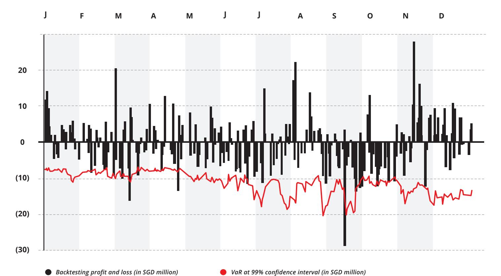

 In 2022, the key market risk drivers of our non-trading portfolios were interest rates (Singapore Dollar and US Dollar) and foreign exchange. The Net Interest Income (NII) of the non-trading book was assessed under various rate scenarios to determine the impact of interest rate movements on future earnings. With simulations using a 100 basis points parallel upward or downward shift in yield curves on DBS' banking book exposures, NII was estimated to increase by SGD 958 million and decrease by SGD 1,331 million respectively.

Foreign exchange risk in our non-trading portfolios was primarily from structural foreign exchange positions(a), arising mainly from our strategic investments and retained earnings in overseas branches and subsidiaries.

*(a) Refer to Note 39.3 to the ȴ nancial statements on page 166 for details on DBS' structural foreign exchange positions.*

# **7 Liquidity risk**

DBS' liquidity risk arises from our obligations to honour withdrawals of deposits, repayments of borrowed funds at maturity and our commitments to extend loans to our customers. We seek to manage our liquidity to ensure that our liquidity obligations will continue to be honoured under normal as well as adverse circumstances.

### **7.1 Liquidity risk management at DBS**

### **Approach to liquidity risk management**

DBS' approach to liquidity risk management comprises the following building blocks:

### **Policies**

**Risk methodologies**

**Processes, systems and reports**

### **Policies**

The Group Liquidity Risk Management Policy sets our overall approach towards liquidity risk management and describes the range of strategies we employ to manage our liquidity.

These strategies include maintaining an adequate counterbalancing capacity to address potential cash ȵ ow shortfalls and having diversiȴ ed sources of liquidity.

DBS' counterbalancing capacity includes liquid assets, the capacity to borrow from the money markets (including the issuance of commercial papers and covered bonds), and forms of managerial interventions that improve liquidity. In the event of a potential or actual crisis, we have in place a set of liquidity contingency and recovery plans to ensure that we maintain adequate liquidity.

The Group Liquidity Risk Management Policy is supported by standards that establish the detailed requirements for liquidity risk identiȴ cation, measurement, reporting and control within DBS. The set of policies, standards and supporting guides communicate these baseline requirements to ensure a consistent application throughout DBS.

Risk methodologies

The primary measure used to manage liquidity within the tolerance defined by the Board is cash flow maturity mismatch analysis.

This form of analysis is performed on a regular basis under normal and adverse scenarios. It assesses the adequacy of our counterbalancing capacity to fund or mitigate any cash flow shortfalls that may occur as forecasted in the cash flow movements across successive time bands. To ensure that liquidity is managed in line with our Risk Appetite, core parameters such as the types of scenarios, the survival period and the minimum level of liquid assets, are pre-specified for monitoring and control on a group-wide basis. Any occurrences of forecasted shortfalls that cannot be covered by our counterbalancing capacity will be escalated to the relevant committees for evaluation and action

Liquidity risk stress testing is performed regularly using cash flow maturity mismatch analysis, and covers adverse scenarios including general market and idiosyncratic stress scenarios. Stress tests assess our vulnerability when liability run-offs increase, asset rollovers increase and/ or liquid asset buffers decrease. In addition, ad hoc stress tests are performed as part of our recovery planning and ICAAP exercises.

Liquidity risk control measures such as liquidity-related ratios and balance sheet analysis are complementary tools for cash flow maturity mismatch analysis, and they are performed regularly to obtain deeper insights and finer control over our liquidity profile across different locations.

The liquidity risk control measures also include concentration measures regarding top depositors, wholesale borrowing and swapped funds ratios.

### Processes, systems and reports

Robust internal control processes and systems support our overall approach in identifying, measuring, aggregating, controlling and monitoring liquidity risk across DBS. Continuous improvement in data and reporting platforms has allowed most elements of internal liquidity risk reporting to be centralised

The RMG Market and Liquidity Risk unit manages the day-to-day liquidity risk monitoring, control reporting and analysis.

# Liquidity management and funding strategy

DBS strives to develop a diversified funding base with access to funding sources across retail and wholesale channels. Our funding strategy is anchored on the strength of our core deposit franchise and is augmented by our established long-term funding capabilities.

### Funding sources (SGD billion)

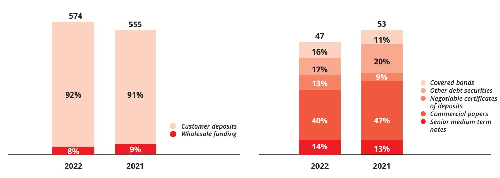

DBS aims to maintain continuous access to the investor base for capital and senior wholesale funding to support our commercial banking activities. We seek cost efficiencies over the long term and to broaden our investor base through proactive and frequent engagement. Capital instruments are primarily issued from DBS Group Holdings Ltd (DBSH) while covered bonds originate from DBS Bank Ltd. Senior notes are issued from both DBSH and the Bank as required.

The diagrams below show our funding structure as at 31 December 2022.

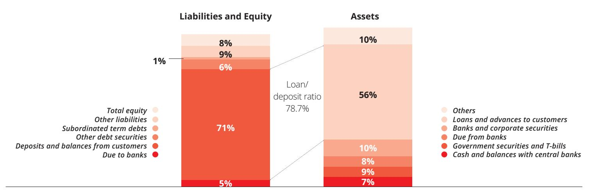

Refer to Note 31 to the financial statements on page 153 for more details of our wholesale funding sources and Note 44.1 on page 178 for the contractual maturity profile of our assets and liabilities.

Growth in the regional franchise generates price, volume, currency and tenor mismatches between our assets and liabilities. To this end, where practicable and transferable without loss in value, we make appropriate use of swap markets for relevant currencies, commensurate with the liquidity of each, in the conversion and deployment of surplus funds across locations.

As these swaps typically mature earlier than loans, we are exposed to potential cash flow mismatches arising from the risk that counterparties may not roll over maturing swaps to support our ongoing funding needs.

This risk is mitigated by triggers set on the number of swaps transacted with the market and by conservative assumptions on the cash flow behaviour of swaps under our cash flow maturity gap analysis (refer to Section 7.2 on page 95).

In general, the term borrowing needs are managed centrally by the head office in consultation with our overseas locations, subject to relevant regulatory restrictions and to an appropriate level of presence and participation required by the respective local funding markets.

The Group Asset and Liability Committee and respective Location Asset and Liability Committees regularly review the composition and growth trajectories of the relevant balance sheets and refine our funding strategy according to business momentum, competitive factors and prevailing market conditions.

### 7.2 Liquidity risk in 2022

DBS actively monitors and manages our liquidity profile through cash flow maturity mismatch analysis.

In forecasting cash flow under the analysis, behavioural profiling is necessary in cases

where a product has indeterminate maturity or the contractual maturity does not realistically reflect the expected cash flow.

95

Risk management

Two examples are maturity-indeterminate savings and current account deposits, which are generally viewed as sources of stable funding for commercial banks. A conservative view is adopted in the behavioural profiling of assets, liabilities and off-balance sheet commitments that have exhibited cash flow patterns that differ significantly from the contractual maturity profile shown under Note 44.1 of our financial statements on page 178.

The table below shows our behavioural net and cumulative maturity mismatch between assets and liabilities over a one-year period, in a normal scenario without incorporating growth projections. DBS' liquidity was observed to remain adequate in the maturity mismatch analysis.

| SGD million (a)                              | Less than 1 week | 1 week to 1 month | 1 to 3 months | 3 to 6 months | 6 months to 1 year |
|---------------------------------------------------------|---------------------|----------------------|---------------|---------------|-----------------------|
| As at 31 Dec 2022 (b) Net liquidity mismatch | 27,278              | 1,126                | (15,986)      | 23,451        | 10,019                |
| Cumulative mismatch                                     | 27,278              | 28,404               | 12,418        | 35,869        | 45,888                |
| As at 31 Dec 2021 (b) Net liquidity mismatch | 37,477              | 20,619               | (6,556)       | 13,624        | 7,136                 |
| Cumulative mismatch                                     | 37,477              | 58,096               | 51,540        | 65,164        | 72,300                |

(a) Positive indicates a position of liquidity surplus. Negative indicates a liquidity shortfall that has to be funded

(b) As the behavioural assumptions used to determine the maturity mismatch between assets and liabilities are undated from time.

(b) As the behavioural assumptions used to determine the maturity mismatch between assets and liabilities are updated from time to time, the liquidity mismatches may not be directly comparable across past balance sheet dates

96 **A Di erent Kind of Bank** DBS Annual Report 2022 **Risk management** 97

### **7.3 Liquid assets**

Liquid assets are assets that are readily available and can be easily monetised to meet obligations and expenses under times of stress.

Such assets are internally deȴ ned under the governance of the relevant oversight committees, taking into account the asset class, issuer type and credit rating, among other criteria, before they are reȵ ected as available funds through cash ȵ ow maturity mismatch analysis. DBS' Treasury function expects to be able to operationally monetise our pool of liquid assets to meet liquidity shortfalls when the need arises. These liquid assets must be unencumbered and free of any legal, regulatory, contractual or other restrictions.

In practice, liquid assets are maintained in key locations and currencies to ensure that operating entities in such locations possess a degree of selfsuɝ ciency to support business needs and guard against contingencies. The main portion of our liquid assets is centrally maintained in Singapore to support liquidity needs in smaller overseas subsidiaries and branches. Internally, DBS sets a requirement to maintain its pool of liquid assets above a minimum level as a source of contingent funds, taking into account regulatory recommended liquid asset levels as well as internally projected stress shortfalls under the cash ȵ ow maturity mismatch analysis.

The table below shows DBS' encumbered and unencumbered liquid assets by instrument and counterparty against other assets in the same category under the balance sheet. The ȴ gures are based on the carrying amount at the balance sheet date.

|                                                                 | Liquid assets |              |          |            | Others(d) | Total     |
|-----------------------------------------------------------------|---------------|--------------|----------|------------|-----------|-----------|
| SGD million                                                     | Encumbered    | Unencumbered | Total[1] | Average(c) | [2]       | [1] + [2] |
| As at 31 Dec 2022 Cash and balances with central banks(a) | 9,690         | 11,761       | 21,451   | 20,519     | 32,719    | 54,170    |
| Due from banks(b)                                               | -             | 10,927       | 10,927   | 10,940     | 49,204    | 60,131    |
| Government securities and treasury bills                     | 10,112        | 54,133       | 64,245   | 64,338     | 750       | 64,995    |
| Banks and corporate securities                                  | 3,873         | 58,169       | 62,042   | 59,332     | 13,415    | 75,457    |
| Total                                                           | 23,675        | 134,990      | 158,665  | 155,129    | 96,088    | 254,753   |

- *(a) Unencumbered balances with central banks comprise holdings that are unrestricted and available overnight. The encumbered portion represents the mandatory balances held with central banks, which includes a minimum cash balance (MCB) amount that may be available for use under a liquidity stress situation. The "Others" portion includes term placements with central banks*
- *(b) Liquid assets comprise nostro accounts and eligible certiȴ cates of deposits*
- *(c) Total liquid assets reȵ ected on an average basis over the four quarters in 2022*
- *(d) "Others" refer to assets that are not recognised as part of the available pool of liquid assets for liquidity management under stress due to (but not limited to) inadequate or non-rated credit quality, operational challenges in monetisation (e.g. holdings in physical scrips), and other considerations*

### **7.4 Liquidity Coverage Ratio (LCR)**

Under MAS Notice to Banks No. 649 "Minimum Liquid Assets (MLA) and Liquidity Coverage Ratio (LCR)" (MAS Notice 649), DBS, as a Domestic Systemically Important Bank (D-SIB) incorporated and headquartered in Singapore, is required to comply with the LCR standards. Group LCR has been maintained well above the minimum LCR requirements of 100% for both all-currency and SGD.

DBS' LCR is sensitive to balance sheet movements resulting from commercial loan/ deposit activities, wholesale inter-bank lending/ borrowing, and to the maturity tenor changes of these positions as they fall into or out of the LCR 30-day tenor. In order to meet the LCR requirements, DBS holds a pool of unencumbered High Quality Liquid Assets (HQLA) comprising predominantly cash, balances with central banks and highly rated bonds issued by governments or supranational entities.

### **7.5 Net Stable Funding Ratio (NSFR)**

DBS is subject to the Net Stable Funding Ratio (NSFR) under MAS Notice to Banks No. 652 "Net Stable Funding Ratio (NSFR)" (MAS Notice 652). Group NSFR has been maintained consistently above the minimum regulatory requirement of 100%.

NSFR aims to improve the resiliency of banks by promoting long term funding stability. We manage our NSFR by maintaining a stable balance sheet supported by a diversiȴ ed funding base with access to funding sources across retail and wholesale channels.

# **8 Operational risk**

Operational risk is inherent in our business activities and may arise from inadequate or failed internal processes, people, systems, or from external events. DBS' objective is to keep operational risk at appropriate levels, taking into account the markets we operate in, the characteristics of the businesses as well as our economic and regulatory environment.

### **8.1 Operational risk management at DBS**

DBS' approach to operational risk management comprises the following building blocks:

### **Policies**

**Risk methodologies**

**Processes, systems and reports**

### **Policies**

The Group Operational Risk Management (ORM) Policy sets our overall approach for managing operational risk in a structured, systematic and consistent manner.

There are policies, standards, tools and programmes in place to govern ORM practices across DBS. These include corporate operational risk policies and standards that are owned by the respective corporate oversight and control functions. The key policies address risk areas relating to technology, compliance, fraud, money laundering, ȴ nancing of terrorism and sanctions, new product, outsourcing and ecosystem partnership.

### **Risk methodologies**

DBS adopts the standardised approach to compute operational risk regulatory capital.

To manage and control operational risk, we use various tools, including risk and control self-assessment (RCSA), operational risk event management and key risk indicator monitoring.

DBS' Three Lines Model adopts one common risk taxonomy, and a consistent risk assessment approach to managing operational risk. RCSA is conducted by each business or support unit to identify key operational risk and assess the e ectiveness of internal controls. When control issues are identiȴ ed, the units develop action plans and track the resolution of the issues.

Operational risk events are classiȴ ed in accordance with Basel standards. Such events, including any signiȴ cant incidents that may impact DBS' reputation, must be reported based on certain established thresholds. Key risk indicators with predeȴ ned escalation triggers are employed to facilitate risk monitoring in a forward-looking manner.

Additional methodologies are in place to address subject-speciȴ c risks, including, but not limited to, the following:

### **Technology risk**

Information Technology (IT) risk is managed through an enterprise technology risk management approach. This covers risk identiȴ cation, assessment, mitigation, monitoring and reporting. In addition, the appropriate governance, IT policies and standards, control processes and risk mitigation programmes are in place to support the risk management approach.

### **Cyber security risk**

Cyber security risk is a continuous focus of the bank. The Chief Information Security Oɝ cer (CISO) oversees the cyber security function and the one-stop competency centre for all cyber security related matters, such as operational risks, data protection risks and compliance with cyber security related regulations. DBS places signiȴ cant emphasis to secure our people, information, network, equipment and applications in accordance with the Bank's risk appetite. The Bank continues to devote signiȴ cant resources to improve our cyber hygiene and control environment to stay ahead of the cyber threat curve. The CISO oɝ ce, as

the second line, conducts regular assessments to validate the eɝ cacy of our controls and obtain assurance that our control framework remains e ective against emerging and evolving threats. DBS also provides relevant training to drive security awareness amongst our sta and promote a strong security culture.

### **Compliance risk**

Compliance risk refers to the risk of DBS not being able to successfully conduct our business because of any failure to comply with laws, regulatory requirements, industry codes or standards of business and professional conduct applicable to the ȴ nancial sector.

This includes, in particular, laws and regulations applicable to the licensing and conducting of banking or other ȴ nancial businesses, ȴ nancial crime such as anti-money laundering and countering the ȴ nancing of terrorism, fraud and bribery/ corruption. We maintain a compliance programme designed to identify, assess, measure, mitigate and report on such risks through a combination of policy and relevant systems and controls.

To counter ȴ nancial crime and sanctions risks, DBS established minimum standards for our business and support units to manage our actual and/ or potential risk exposures. In addition, standards aimed to provide the end-to-end management for fraud and related issues at the unit and geographical levels, are implemented through the Fraud Management Programme. We implement surveillance and compliance testing controls where necessary to obtain assurance that the control framework is operating e ectively.

DBS also provides relevant training and implements assurance processes. We strongly believe in the need to promote a strong compliance culture as well, and this is developed through the leadership of our Board and senior management.

### **New product, outsourcing and ecosystem partnership risks**

Each new product, service, outsourcing arrangement or ecosystem partnership is subject to a risk review and sign-o process, where relevant risks are identiȴ ed and assessed. Variations of existing products or services and existing outsourcing arrangements and ecosystem partnerships are also subject to a similar process.

### **Other mitigation programmes**

A robust business continuity management programme is in place to ensure that essential banking services can continue in the event of unforeseen events or business disruptions. This includes a crisis management plan to enable quick response to manage incidents. Exercises are conducted annually, simulating di erent scenarios to test business continuity plans and crisis management protocol. The e ectiveness of these exercises as well as DBS' business continuity readiness

and our alignment to regulatory guidelines are communicated and attested by senior management to the BRMC annually.

DBS' management of the Covid-19 pandemic has demonstrated the eɝcacy of our business continuity plans, keeping the bank in good stead. We were able to quickly adapt and adjust to the pandemic to ensure minimal impact on our customers and assure the health and safety of our employees. We dialled up our work-from home capabilities by leveraging technology and data, and proactively managed the operational risks which arose from new or revised processes as we moved towards a hybrid work arrangement.

To mitigate losses from speciȴ c risk events which are unexpected and signiȴ cant, DBS e ects group-wide insurance coverage under the Group Insurance Programme. These insurance policies relate to crime and professional indemnity, directors and oɝ cers liability, cyber security risk, property damage and business interruption, general liability and terrorism.

### **Processes, systems and reports**

 Robust internal control processes and systems are integral to identifying, assessing, monitoring, managing and reporting operational risk.

All units are responsible for the day-to-day management of operational risk in their products, processes, systems and activities, in accordance with the various frameworks and policies. The RMG Operational Risk unit and other corporate oversight and control functions:

- Oversee and monitor the e ectiveness of operational risk management
- Assess key operational risk issues with the units
- Report and/ or escalate key operational risks to risk committees with recommendations on appropriate risk mitigation strategies

DBS has in place an integrated governance, risk and compliance system with aligned risk assessment methodology, common taxonomy, and uniȴ ed processes for the three lines model. We have in place an operational risk landscape proȴ le which provides the Board and senior management with an integrated view of DBS' operational risk proȴ le periodically, across key operational risk areas and business lines.

98 **A Di erent Kind of Bank** DBS Annual Report 2022 **Capital management and planning** 99

### **8.2 Operational risk in 2022**

The total operational risk losses in 2022 were SGD 12 million (0.07% of DBS' total operating income), compared with SGD 11 million (0.08%) in 2021. The losses may be categorised into the following seven Basel risk event categories:

| Basel risk event types                            | 2022        |      | 2021        |      |
|---------------------------------------------------|-------------|------|-------------|------|
|                                                   | SGD million | %    | SGD million | %    |
| Execution, delivery and process management (EDPM) | 10.22       | 83%  | 9.56        | 87%  |
| External fraud                                    | 0.83        | 7%   | 0.49        | 5%   |
| Business disruptions and system failures          | 0.81        | 7%   | 0.70        | 6%   |
| Clients, products and business practices          | 0.39        | 3%   | 0.19        | 2%   |
| Damage to physical assets                         | 0.07        | 0%   | 0.04        | 0%   |
| Internal fraud                                    | 0.04        | 0%   | 0           | 0%   |
| Employment practices and workplace safety         | 0.01        | 0%   | 0.01        | 0%   |
| Total(a)                                          | 12.37       | 100% | 10.99       | 100% |

*Notes*

*(a) Reportable operational risk events are those with net loss greater than SGD 10,000 and are reported based on the date of detection*

EDPM, which comprised mainly processing errors, accounted for the highest share of our total losses in 2022 and the increase was largely attributable to one risk incident.

# **9 Reputational Risk**

DBS views reputational risk typically as an outcome of any failure to manage risks in our day-to-day activities/ decisions, and from changes in the operating environment. These risks include:

- Financial risk (credit, market and liquidity risks)
- Inherent risk (operational and business/ strategic risks)

### **9.1 Reputational risk management at DBS**

DBS' approach to reputational risk management comprises the following building blocks:

**Policies**

**Risk methodologies**

**Processes, systems and reports**

### **Policies**

DBS adopts a four-step approach for reputational risk management, which is to prevent, detect, escalate and respond to reputational risk events.

As reputational risk is typically a consequence of the failure to manage other risk types, the deȴ nitions and principles for managing

such risks are articulated in the respective risk policies. These are reinforced by sound corporate values that reȵ ect ethical behaviours and practices throughout DBS.

At DBS, we have policies in place to protect the consistency of our brand and to safeguard our corporate identity and reputation.

### **Risk methodologies**

Under the various risk policies, we have established a number of mechanisms for ongoing risk monitoring.

These mechanisms take the form of risk limits, key risk indicators, conduct/ culture and other operating metrics, and include the periodic risk and control self-assessment process. Apart from observations from internal sources, alerts from external parties/ stakeholders also serve as an important source to detect potential reputational risk events. In addition, there are policies relating to media communications, social media and corporate social responsibility to protect DBS' reputation. There are also escalation and response mechanisms in place for managing reputational risk.

While the respective risk policies address the individual risk types, the Reputational Risk Policy focuses speciȴ cally on our stakeholders' perception of how well DBS manages its reputational risks. Stakeholders include customers, government agencies and regulators, investors, rating agencies, business alliances, vendors, trade unions, the media, the general public, the Board and senior management, and DBS' employees.

We recognise that creating a sense of shared value through engagement with key stakeholder groups is imperative for our brand and reputation.

*Read more about our stakeholder engagement on page 80.* 

### **Processes, systems and reports**

Our units are responsible for the day-to-day management of reputational risk, and ensure that processes and procedures are in place to identify, assess and respond to this risk. This includes social media monitoring to pick up adverse comments on DBS. Events a ecting DBS' reputational risk are also included in our reporting of risk proȴ les to senior management and Board-level committees.

### **9.2 Reputational risk in 2022**

DBS' priority is to prevent the occurrence of a reputational risk event by adopting good risk attitudes and behaviours, instead of taking mitigating action when it occurs. There were no signiȴ cant reputational risk incidents endangering the DBS franchise in 2022.

# Capital management and planning

# **Objective**

The Board of Directors (Board) is responsible for setting our capital management objective, which is to maintain a strong capital position consistent with regulatory requirements under the Monetary Authority of Singapore (MAS) Notice to Banks No. 637 "Notice on Risk Based Capital Adequacy Requirements for Banks Incorporated in Singapore" (MAS Notice 637) and Notice to Designated Financial Holding Companies FHC-N637 on "Risk Based Capital Adequacy Requirements" (MAS Notice FHC-N637), and the expectations of various stakeholders including customers, investors and rating agencies. The Board articulates this objective in the form of capital targets. This objective is pursued while delivering returns to shareholders and ensuring that adequate capital resources are available for business growth and investment opportunities as well as adverse situations, taking into consideration our strategic plans and risk appetite.

Our dividend policy is to pay sustainable dividends that grow progressively with earnings. In line with this, the Board proposed a ȴ nal dividend of 42 cents per share, an increase of six cents from the previous payout, and a special dividend of 50 cents per share. The combined payout of 92 cents per share reȵ ects our robust earnings proȴ le and strong capital position. Together with the ordinary dividends of 36 cents per share for each of the ȴ rst three quarters, the total dividend payout for the ȴ nancial year rose to SGD 2.00 per share, a 67% increase from the SGD 1.20

per share for ȴ nancial year 2021. Barring unforeseen circumstances, the annualised dividend will rise to SGD 1.68 per share. The Scrip Dividend Scheme will not be applied to the ȴ nal and special dividends, having been suspended since June 2021.

### **Process**

Our capital management objective is implemented via a capital management and planning process that is overseen by the Capital Committee. The Chief Financial Oɝ cer chairs the Capital Committee. The Capital Committee receives regular updates on our current and projected capital position. A key tool for capital planning is the annual Internal Capital Adequacy Assessment Process (ICAAP) through which we assess our projected capital supply and demand relative to regulatory requirements and our capital targets. The ICAAP generally has a three-year horizon and covers various scenarios, including stress scenarios of di ering scope and severity.

Capital capacity is allocated on two dimensions: by business line and by entity. Capital allocations by business line are set as part of the budget process and monitored during the year. Return on regulatory capital is one of several metrics used to measure business performance. Capital allocations by entity seek to optimise the distribution of capital resources across entities, taking into account the capital adequacy requirements imposed on each subsidiary in its respective jurisdiction. Capital is allocated to ensure

that each subsidiary is able to comply with regulatory requirements as it executes its business strategy in line with our strategy.

During the course of the year, these subsidiaries did not experience any impediments to the distribution of dividends.

# **Capital structure**

We manage our capital structure in line with our capital management objective and seek to optimise the cost and ȵ exibility o ered by various capital resources. In order to achieve this, we assess the need and the opportunity to raise or retire capital. There were no Additional Tier 1 nor Tier 2 transactions during the year.

*Refer to Note 33 of the ȴ nancial statements for details on the movement of share capital during the year.*

*Refer to Notes 32 and 34 to the ȴ nancial statements as well as the Main Features of Capital Instruments document (https://www.dbs.com/investors/ȴ xedincome/capital-instruments) for the terms of the capital instruments that are included in Eligible Total Capital.*

100 **A Di erent Kind of Bank** DBS Annual Report 2022 **Capital management and planning** 101

**The table below analyses the movement in Common Equity Tier 1, Additional Tier 1 and Tier 2 capital during the year.**

# **Statement of changes in regulatory capital for the year ended 31 December 2022**

|                                                            | SGD million |
|------------------------------------------------------------|-------------|
| Common Equity Tier 1 capital                               |             |
| Opening amount                                             | 49,248      |
| Proȴ t for the year (attributable to shareholders)         | 8,193       |
| Dividends paid to shareholders(1)                          | (3,789)     |
| Cost of share-based payments                               | 134         |
| Purchase of treasury shares                                | (11)        |
| Other CET1 movements, including other comprehensive income | (3,288)     |
| Closing amount                                             | 50,487      |
| Common Equity Tier 1 capital                               | 50,487      |
| Additional Tier 1 capital                                  |             |
| Opening amount                                             | 2,392       |
| Other AT1 movements                                        | 1           |
| Closing amount                                             | 2,393       |
| Tier 1 capital                                             | 52,880      |
| Tier 2 capital                                             |             |
| Opening amount                                             | 6,567       |
| Movements in Tier 2 capital instruments                    | (244)       |
| Movement in allowances eligible as Tier 2 capital          | (158)       |
| Closing amount                                             | 6,165       |
| Total capital                                              | 59,045      |

### *Note:*

*(1) Includes distributions paid on capital securities classiȴ ed as equity*

# **Capital adequacy ratios**

 As at 31 December 2022, our Common Equity Tier 1 (CET1) capital adequacy ratio (CAR) was 14.6% which was above our target ratio of around 13.0% ± 0.5%. Our CET1 CAR, as well as Tier 1 and Total CARs, comfortably exceeded the minimum CAR requirements under MAS Notice 637, e ective from 1 January 2019, of 9.0%, 10.5% and 12.5% respectively (this includes the capital conservation bu er but excludes the countercyclical capital bu er).

As at 31 December 2022, our consolidated leverage ratio stood at 6.4%, well above the 3.0% minimum ratio set by the MAS e ective 1 January 2018.

Refer to "Five-Year Summary" on page 189 for the historical trend of Tier 1 and Total CAR. Refer to DBS Group's Pillar 3 disclosures published on DBS website (https://www.dbs.com/investors/default.page) for details on our RWA.

| SGD million                                      | 2022    | 2021    |
|--------------------------------------------------|---------|---------|
| Common Equity Tier 1 capital                     | 50,487  | 49,248  |
| Tier 1 capital                                   | 52,880  | 51,640  |
| Total capital                                    | 59,045  | 58,207  |
| Risk-weighted assets (RWA)                       |         |         |
| Credit RWA                                       | 288,640 | 294,665 |
| Market RWA                                       | 22,505  | 23,448  |
| Operational RWA                                  | 35,750  | 24,578  |
| Total RWA                                        | 346,895 | 342,691 |
| Capital Adequacy Ratio (CAR) (%)                 |         |         |
| Common Equity Tier 1                             | 14.6    | 14.4    |
| Tier 1                                           | 15.2    | 15.1    |
| Total                                            | 17.0    | 17.0    |
| Minimum CAR including Bu΍ er Requirements (%)(1) |         |         |
| Common Equity Tier 1                             | 9.2     | 9.1     |
| E΍ ective Tier 1                                 | 10.7    | 10.6    |
| E΍ ective Total                                  | 12.7    | 12.6    |
| Of which: Bu΍ er Requirements (%)                |         |         |
| Capital Conservation Bu΍ er                      | 2.5     | 2.5     |
| Countercyclical Bu΍ er                           | 0.2     | 0.1     |

### *Note:*

*(1) Includes minimum Common Equity Tier 1, Tier 1 and Total CAR of 6.5%, 8.0% and 10.0% respectively*

102 **A Di erent Kind of Bank** DBS Annual Report 2022 **Capital management and planning** 103

**The chart below analyses the drivers of the movement in Common Equity Tier 1 (CET1) CAR during the year.**

# **Group Common Equity Tier 1 (CET1) CAR**

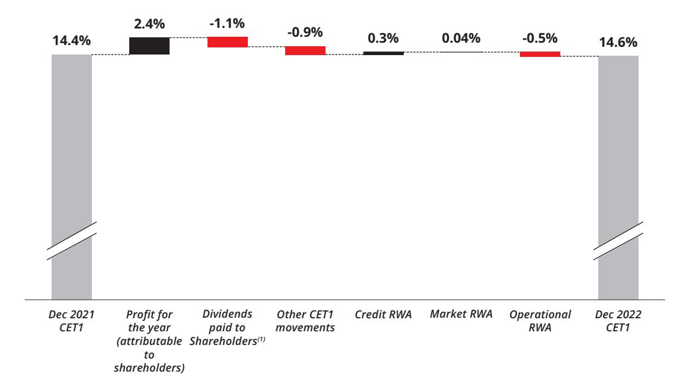

### *Note:*

*(1) Includes distributions paid on capital securities classiȴ ed as equity*

# **Regulatory change**

The minimum CAR requirements based on MAS Notice 637 have been fully phased in from 1 January 2019 and are summarised in the table below.

| From 1 January                               | 2019 and beyond |
|----------------------------------------------|--------------------|
| Minimum CAR %                                |                    |
| Common Equity Tier 1 (a)                     | 6.5                |
| Capital Conservation Bu΍ er (CCB) (b)        | 2.5                |
| Common Equity Tier 1 including CCB (a) + (b) | 9.0                |
| Tier 1 including CCB                         | 10.5               |
| Total including CCB                          | 12.5               |
| Maximum Countercyclical Bu΍ er (1)           | 2.5                |

#### *Note:*

*(1) The countercyclical bu er is not an ongoing requirement and is only applied as and when speciȴ ed by the relevant banking supervisors. The applicable magnitude will be a weighted average of the jurisdiction-speciȴ c countercyclical bu er requirements that are required by national authorities in jurisdictions to which a bank has private sector credit exposures. The Basel Committee on Banking Supervision (Basel Committee) expects jurisdictions to implement the countercyclical bu er during periods of excessive credit growth. Of the jurisdictions where we have material private sector credit exposures, Hong Kong has applied a countercyclical bu er of 2.5% from 1 January 2019, reducing to 2.0% from 14 October 2019 and 1.0% from 16 March 2020 and remained unchanged thereafter.*

The MAS has designated DBS Bank as a domestic systemically important bank (D-SIB). Under the MAS' framework for identifying and supervising D-SIBs, the higher loss absorbency requirement for locally incorporated D-SIBs is met by the foregoing minimum ratios being two percentage points higher than those established by the Basel Committee. The Basel Committee has developed an indicator-based methodology for identifying global systemically important banks (G-SIBs) on which higher loss absorbency requirements will be imposed. While we are not a G-SIB, we are required to disclose the set of indicators which are included in the Group's Pillar 3 disclosures published on DBS website (https://www.dbs.com/investors/default.page).

On 19 December 2022, the MAS announced that the implementation of the ȴ nal Basel III reforms in Singapore will be deferred to between 1 January 2024 and 1 January 2025. This move is to allow the industry suɝ cient time for proper implementation of systems needed to adopt the revised framework, and is aligned with the implementation timelines of other major jurisdictions. The MAS will ȴ nalise the implementation timeline for the ȴ nal Basel III reforms (including the transitional arrangement for the output ȵ oor) by 1 July 2023.

On 7 February 2022, the MAS imposed on DBS Bank an additional capital requirement arising from the widespread unavailability of DBS Bank's digital banking services during 23 to 25 November 2021. Notwithstanding the multiplier of 1.5 times applied on DBS Bank's risk-weighted assets for operational risk, the Group's capital ratios remained robust. The additional capital requirement will be reviewed when MAS is satisȴ ed that DBS Bank has addressed the shortcomings identiȴ ed through an independent review of the incident.

With e ect from 1 January 2023, MAS Notice 637 was amended to: (a) implement the revised Pillar 3 disclosure requirements for IRRBB published by the Basel Committee; (b) implement a -100bps interest rate ȵ oor on the post-shock interest rates under the standardised interest rate shock scenarios set out in Annex 10C of MAS Notice 637; (c) provide additional clarity on the application of interest rate ȵ oors, interest rate caps, and passthrough rates when computing IRRBB under the standardised interest rate shock scenarios; and (d) implement various other technical revisions.

# Sustainability

Our 2022 Sustainability Report is prepared in accordance with, and taking reference to, the Global Reporting Initiative (GRI), the Sustainability Accounting Standards Board (SASB), and recommendations of the Task Force on Climate-related Financial Disclosures (TCFD).

### Governance

### **Board statement on sustainability**

"The Board has overall responsibility for the formulation of DBS' sustainability strategy and is guided by the overarching objective to create long-term value by managing our business in a balanced and responsible way. Our aim is to increase our focus on climate-related matters and weave environmental and social factors more deeply into the fabric of our business. As a commitment to creating a sustainable future, we established a new Board Sustainability Committee in February 2022 and appointed an international sustainable finance expert, Dr Ben Caldecott, to the BSC in June 2022."

DBS Group Board of Directors

### Sustainability governance structure at DBS

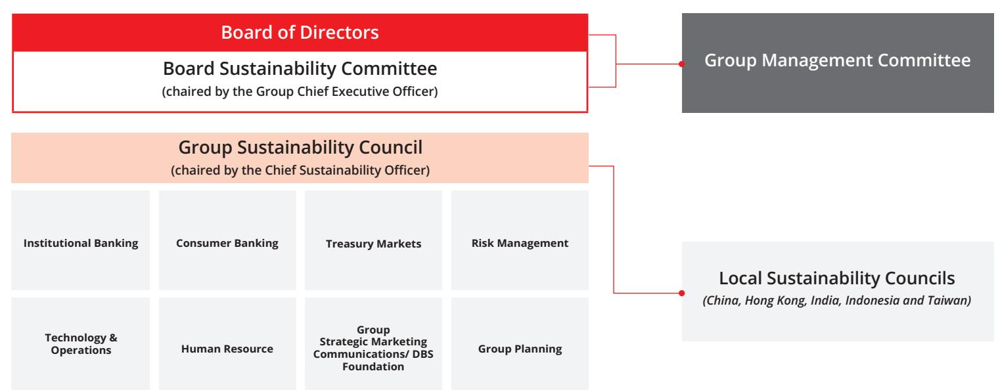

# Key sustainability awards

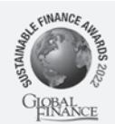

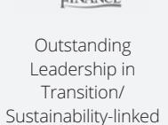

Bonds (Global)

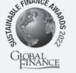

Financial Leadership in Sustaining Communities (Global)

Best Green Initiative (Global)

Steward Leadership 25 (Regional)

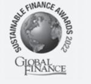

Outstanding Leadership in Green Bonds (Asia-Pacific)

ASIAMONEY

Best Private Bank for ESG Investing (Singapore)

### **External ESG Ratings**

| MSCI                                            | 2022 ESG rating               | 2021: AA 2020: AA Scale: AAA to CCC                                                            |
|-------------------------------------------------|-------------------------------|------------------------------------------------------------------------------------------------------|
| Sustainalytics                                  | 2022 Score 20.2 (medium risk) | 2021:19.9 (Low risk) 2020: 20.7 (Medium risk) Scale: 0 to 100, with 100 being the highest risk |
| CDP (formerly Climate Disclosure Project) | 2022 Grade                    | 2021: B 2020: B- Scale: A+ to F, with A+ being the best possible score                         |

105

# Highlights across our three sustainability pillars

# O1 Responsible banking

Our responsible banking practices support our customers' transition towards lower-carbon business models, enhance their access to ESG investments, and deliver customised retail solutions to meet their specific needs.

# **02**Responsible business practices

We believe in doing the right thing by our people and embedding environmental and societal factors in our business operations.

# Impact beyond banking

We seek to be a force for good by championing social enterprises – businesses with a triple bottom line – and supporting community causes such as those that are driving positive environmental and social impact.

# SGD 61 billion

committed in sustainable financing loans from 2018 to 2022, in addition to SGD 24 billion in ESG bonds raised in 2022 where DBS was involved as an active bookrunner

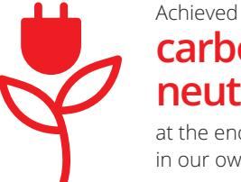

carbon neutrality at the end of 2022 in our own operations

# New SME grant award

launched to help SMEs take their first step towards transforming into businesses for impact

# SGD 900 million

in unsecured loans approved to SMEs across the region to address their unmet working capital needs, with over 98% of the loans going to micro and small businesses

# Updated our

# Carbon Offset guide

to further strengthen the governance and processes around the selection, purchase and use of offsets as the final lever to our operational decarbonisation strategy

# New Community Impact Chapter

established under DBS Foundation, with SGD 5.6 million funding committed to equip communities with future ready skills such as financial and digital literacy

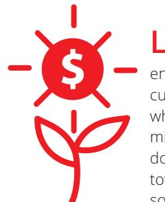

# LiveBetter

engaged 1 million customers in Singapore, who invested SGD 8 million in green funds and donated over SGD 700,000 towards environmental and social causes

### Established

# Human Rights and Diversity, Equity & Inclusion (DEI) policies

to formalise our consistent efforts to respect human rights and build an equitable and inclusive workforce

> 140,000

employee volunteering hours serving the community

# NAV Planner

our Al-powered digital financing planning tool to democratise wealth and improve the financial health of our customers

# Launched **iGrow**

a digital career coach that uses AI/ ML to help employees identify career aspirations and recommend relevant training for upskilling and reskilling

> 1,300 tonnes

in food impact (such as food waste reduced and recycled, or food redistributed) Sustainability 10 Sustainability 10

# Accelerating our climate agenda

Addressing climate change is one of the greatest challenges today

# Our case for net-zero by 2050

"We have chosen to prioritise climate change as the most immediate issue today given its urgency and how it is interrelated with other environmental and socio-economic concerns."

# We see the case for setting net-zero targets as multi-faceted, where decarbonisation is a:

1

Societal responsibility

2

Risk management imperative

3

Business opportunity

# Our approach to setting targets

# **Grounded in science**

To avoid the worst climate impact, we have chosen to align with science-informed decarbonisation glidepaths

# Inclusive growth and prosperity

To enhance prosperity and be a driver of stronger and more inclusive growth as we aspire towards net-zero

# 2030 interim targets

To tackle net-zero now and to focus on financing our clients' transition today, instead of a distant point in the future

# **Building partnerships**

To ensure collective action and support our clients on their decarbonisation journeys

In 2022, we announced one of the most comprehensive and ambitious sets of decarbonisation targets in the global banking industry.

Taken together, our

priority sectors represent carbon-intensive industries, contributing to the majority of global greenhouse gases (GHG)

# **Our net-zero progress**

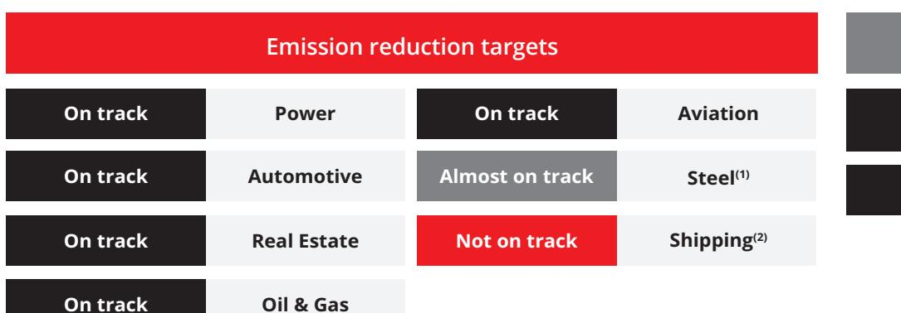

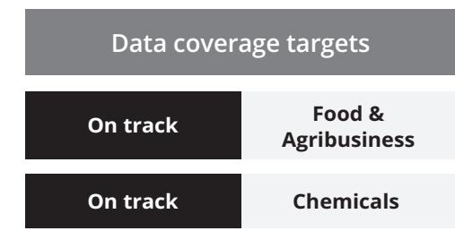

# Our climate risk management

In 2022, we **developed quantitative models** for 9 sectors to identify, assess, and quantify **transition risks** under different scenarios and their potential financial impact to our customers.

In 2022, we also **expanded our climate physical risk assessment** 

to cover major residential mortgage portfolios across three of our core markets, namely Singapore, Hong Kong, and Taiwan, building on the assessment of propertylending in Hong Kong in the previous year.

# Our transition financing approach

Supports our clients' transition journeys, including the strategic GHG emission reductions of high-emitting assets

### To achieve a net-zero future, we support transition activities by:

- Promote a science-informed approach through adoption of industry best practices
- Address potential trade-offs between various environmental, social, and economic/ financial matters
- Highlight potential differences in how an economic activity intended as a transitional solution in Asia may differ from more developed markets
- Strengthen credibility through internal capacity building

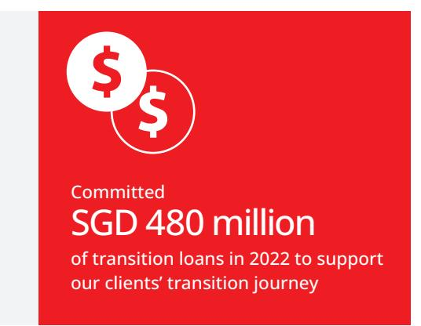

- (1) Our Steel portfolio was slightly above the target set, which we took reference from the Mission Possible Partnership's Tech Moratorium scenario.
- (2) Our Shipping portfolio Alignment Delta was not aligned with Poseidon Principles trajectories, due to the addition of a small group of financed vessels that belong to a business segment with shorter trade routes.

For more details about our net-zero commitment and our progress against targets, read more about "Responsible Financing" in the Sustainability Report.

108 **A Di erent Kind of Bank** DBS Annual Report 2022 **Summary of disclosures - Corporate governance** 109

# Summary of disclosures Corporate governance

**This summary of disclosures describes our corporate governance practices with speciȴ c reference to the express disclosure requirements in the principles and provisions of the 2018 Code\* pursuant to Rule 710 of the SGX Listing Manual and the Additional Guidelines\*.** 

# **Express disclosure requirements in the 2018 Code and the Additional Guidelines**

| Principles and provisions of the 2018 Code - Express disclosure requirements                                                                                                                                                                                                                                                | Page reference in DBS Annual Report 2022 |
|-----------------------------------------------------------------------------------------------------------------------------------------------------------------------------------------------------------------------------------------------------------------------------------------------------------------------------|---------------------------------------------|
| Provision 1.2 The induction, training and development provided to new and existing Directors.                                                                                                                                                                                                                            | Pages 51 and 52                             |
| Provision 1.3 Matters that require Board approval.                                                                                                                                                                                                                                                                       | Page 58                                     |
| Provision 1.4 Names of the members of the Board committees, the terms of reference of the Board committees, any delegation of the Board's authority to make decisions, and a summary of each Board committee's activities.                                                                                            | Pages 46 to 58                              |
| Provision 1.5 The number of meetings of the Board and Board committees held in the year, as well as the attendance of every Board member at these meetings.                                                                                                                                                           | Pages 43 to 44                              |
| Provision 2.4 The board diversity policy and progress made towards implementing the board diversity policy, including objectives.                                                                                                                                                                                     | Pages 52 to 53                              |
| Provision 4.3 Process for the selection, appointment and re-appointment of Directors to the Board, including the criteria used to identify and evaluate potential new directors and channels used in searching for appropriate candidates.                                                                         | Page 51                                     |
| Provision 4.4 Where the Board considers a Director to be independent in spite of the existence of a relationship which may a΍ ect his or her independence, the nature of the Director's relationship and the reasons for considering him or her as independent should be disclosed.                                | Page 51                                     |
| Provision 4.5 The listed company directorships and principal commitments of each Director, and where a Director holds a signiȴ cant number of such directorships and commitments, the NC's and Board's reasoned assessment of the ability of the director to diligently discharge his or her duties are disclosed. | Pages 52, 190 to 194                        |
| Provision 5.2 How the assessments of the Board, its Board committees and each Director have been conducted, including the identity of any external facilitator and its connection, if any, with the Company or any of its Directors.                                                                                  | Page 51                                     |

| Principles and provisions of the 2018 Code - Express disclosure requirements                                                                                                                                                                                                                                                                                                                                                                   | Page reference in DBS Annual Report 2022                                                                                                                              |
|------------------------------------------------------------------------------------------------------------------------------------------------------------------------------------------------------------------------------------------------------------------------------------------------------------------------------------------------------------------------------------------------------------------------------------------------|--------------------------------------------------------------------------------------------------------------------------------------------------------------------------|
| Provision 6.4 The engagement of any remuneration consultants and their independence.                                                                                                                                                                                                                                                                                                                                                        | Page 65                                                                                                                                                                  |
| Principle 8 Clear disclosure of remuneration policies, level and mix of remuneration, and procedure for setting remuneration, and the relationship between remuneration, performance and value creation.                                                                                                                                                                                                                                 | Pages 63 to 67                                                                                                                                                           |
| Provision 8.1 The policy and criteria for setting remuneration, as well as names, amounts and breakdown of remuneration of (a) each individual Director and the CEO; and (b) at least the top ȴ ve key management personnel (who are not Directors or the CEO) in bands no wider than SGD 250,000 and in aggregate the total remuneration paid to these key management personnel.                                                  | For the CEO and management: pages 65 to 67 For non-executive Directors: pages 43 to 44                                                                       |
| Provision 8.2 Names and remuneration of employees who are substantial shareholders of the Company, or are immediate family members of a Director, the CEO or a substantial shareholder of the Company, and whose remuneration exceeds SGD 100,000 during the year, in bands no wider than SGD 100,000. The disclosure states clearly the employee's relationship with the relevant Director or the CEO or substantial shareholder. | Page 57                                                                                                                                                                  |
| Provision 8.3 All forms of remuneration and other payments and beneȴ ts, paid by the Company and its subsidiaries to Directors and key management personnel of the Company, and also details of employee share schemes.                                                                                                                                                                                                                  | For non-executive Directors: pages 43, 44, 56 and 57 For key management personnel: pages 65 to 67 For employee share schemes: pages 65, 113 and 114 |
| Provision 9.2 Whether the Board has received assurance from (a) the CEO and the CFO that the ȴ nancial records have been properly maintained and the ȴ nancial statements give a true and fair view of the Company's operations and ȴ nances; and (b) the CEO and the other key management personnel who are responsible, regarding the adequacy and e΍ ectiveness of the Company's risk management and internal control systems.  | Pages 60 and 61                                                                                                                                                          |
| Provision 11.3 Directors' attendance at general meetings of shareholders held during the ȴ nancial year.                                                                                                                                                                                                                                                                                                                                    | Pages 43 to 44                                                                                                                                                           |
| Provision 12.1 The steps taken to solicit and understand the views of shareholders.                                                                                                                                                                                                                                                                                                                                                         | Page 62                                                                                                                                                                  |
| Provision 13.2 The strategy and key areas of focus in relation to the management of stakeholder relationships during the reporting period.                                                                                                                                                                                                                                                                                               | Pages 80 to 81                                                                                                                                                           |

**\* deȴ ned on page 42**

# **Principles and provisions of the 2018 Code - Express disclosure requirements Page reference in DBS Annual Report 2022 Guideline 1.17** An assessment of how the induction, orientation and training provided to new and existing Directors meet the requirements set out by the NC to equip the Board and the respective Board committees with relevant knowledge and skills in order to perform their roles e ectively. Pages 51 and 52 **Guideline 4.7** The names of the Directors submitted for appointment or re-appointment are accompanied by details and information to enable shareholders and the Board to make informed decisions. Such information, which accompanies the relevant resolution, includes: (a) date of last re-appointment; (b) professional qualiȴ cations; (c) any relationships including immediate family relationships between the candidate and the Directors, the Company or its substantial shareholders; (d) a separate list of all current directorships in other listed companies; (e) details of other principal commitments; and (f) any prior experience as a director of a listed issuer or as a director of a ȴ nancial institution. Pages 214 to 217 **Guideline 4.11** The resignation or dismissal of the key appointment holders. Not applicable **Guideline 4.12** The identiȴ cation of all Directors, including their designations (i.e. independent, non-executive, executive, etc.) and roles (as members or chairmen of the Board or Board committees). Pages 45 to 49, 190 to 194 **Guideline 9.9** The remuneration of any non-director with relevant expertise who has been appointed to the board risk committee. Not applicable **Guideline 9.11** The Board's comments on the adequacy and e ectiveness of the internal controls (including ȴ nancial, operational, compliance and information technology controls, and risk management systems) are disclosed. A statement on whether the AC concurs with the Board's comment is disclosed. Where material weaknesses are identiȴ ed by the Board or AC, the disclosure of the steps taken to address them. Page 61 **Guideline 10.19** The AC comments on whether the internal audit function is independent, e ective and adequately resourced. Page 54 **Guideline 14.5** Material related party transactions. Page 60

# Financial statements

|                            | DBS Group Holdings Ltd and its Subsidiaries                                                                                                                                                                                                                                                                                                                                                                                                                 |                                                                           |
|----------------------------|-------------------------------------------------------------------------------------------------------------------------------------------------------------------------------------------------------------------------------------------------------------------------------------------------------------------------------------------------------------------------------------------------------------------------------------------------------------|---------------------------------------------------------------------------|
|                            | Directors' statement                                                                                                                                                                                                                                                                                                                                                                                                                                        | 112                                                                       |
|                            | Independent auditor's report                                                                                                                                                                                                                                                                                                                                                                                                                                | 116                                                                       |
|                            | Financial statements                                                                                                                                                                                                                                                                                                                                                                                                                                        |                                                                           |
|                            | Consolidated income statement Consolidated statement of comprehensive income Balance sheets Consolidated statement of changes in equity Consolidated cash ȵ ow statement                                                                                                                                                                                                                                                                        |                                                                           |
|                            | Notes to the ȴ nancial statements                                                                                                                                                                                                                                                                                                                                                                                                                           |                                                                           |
| 1 2 3                | Domicile and Activities Summary of Signiȴ cant Accounting Policies Critical Accounting Estimates                                                                                                                                                                                                                                                                                                                                                      | 128 128 136                                                         |
|                            | Income statement                                                                                                                                                                                                                                                                                                                                                                                                                                            |                                                                           |
| 4 5 6 7 8 9 | Net Interest Income Net Fee and Commission Income Net Trading Income Net Income from Investment Securities Other Income Employee Beneȴ ts 10 Other Expenses 11 Allowances for Credit and Other Losses 12 Share of Proȴ ts or Losses of Associates and Joint Ventures 141 13 Income Tax Expense 14 Earnings Per Ordinary Share                                                                                                 | 137 137 137 137 137 137 138 138 142 142        |
|                            | Balance sheet: assets                                                                                                                                                                                                                                                                                                                                                                                                                                       |                                                                           |
|                            | 15 Classiȴ cation of Financial Instruments 16 Cash and Balances with Central Banks 17 Government Securities and Treasury Bills 18 Bank and Corporate Securities 19 Loans and Advances to Customers 20 Financial Assets Pledged or Transferred 21 Other Assets 22 Deferred Tax Assets/ Liabilities 23 Subsidiaries and Consolidated Structured Entities 24 Associates and Joint Ventures 25 Unconsolidated Structured Entities | 143 145 145 145 146 147 148 148 149 150 151 |

26 Acquisitions 151 27 Properties and Other Fixed Assets 152 28 Goodwill and Intangibles 152

| Balance sheet: liabilities |  |
|----------------------------|--|
|----------------------------|--|

|                                   | 29 Deposits and Balances from Customers                  | 153        |
|-----------------------------------|----------------------------------------------------------|------------|
|                                   | 30 Other Liabilities 31 Other Debt Securities         | 153 153 |
|                                   | 32 Subordinated Term Debts                               | 155        |
|                                   | Balance sheet: share capital and reserves                |            |
|                                   | 33 Share Capital                                         | 156        |
|                                   | 34 Other Equity Instruments                              | 157        |
|                                   | 35 Other Reserves and Revenue Reserves                   | 158        |
|                                   | O΍ -balance sheet information                            |            |
|                                   | 36 Contingent Liabilities and Commitments                | 160        |
|                                   | 37 Financial Derivatives                                 | 160        |
|                                   | Additional information                                   |            |
|                                   | 38 Interest Rate Benchmark Reform                        | 162        |
|                                   | 39 Hedge Accounting                                      | 163        |
|                                   | 40 Share-based Compensation Plans                        | 167        |
|                                   | 41 Related Party Transactions                            | 168        |
|                                   | 42 Fair Value of Financial Instruments 43 Credit Risk | 169 172 |
|                                   | 44 Liquidity Risk                                        | 178        |
|                                   | 45 Capital Management                                    | 179        |
|                                   | 46 Segment Reporting                                     | 180        |
|                                   | DBS Bank Ltd                                             |            |
|                                   | Income statement                                         | 183        |
| Statement of comprehensive income |                                                          | 184        |
| Balance sheet                     |                                                          | 185        |

**Notes to the supplementary ȴ nancial statements 186** 

112 **A Di erent Kind of Bank** DBS Annual Report 2022 **Directors' statement** 113

# **DBS Group Holdings Ltd and its Subsidiaries**

# Directors' statement

# **for the ȴ nancial year ended 31 December 2022**

The Directors are pleased to present their statement to the Members, together with the audited consolidated ȴ nancial statements of DBS Group Holdings Ltd (the Company or DBSH) and its subsidiaries (the Group) for the ȴ nancial year ended 31 December 2022 and the balance sheet of the Company as at 31 December 2022. These have been prepared in accordance with the provisions of the Companies Act 1967 (the Companies Act) and the Singapore Financial Reporting Standards (International).

In the opinion of the Directors:

- (a) the consolidated ȴ nancial statements of the Group and the balance sheet of the Company, together with the notes thereon, as set out on pages 122 to 182, are drawn up so as to give a true and fair view of the ȴ nancial position of the Group and the Company as at 31 December 2022, and of the consolidated ȴ nancial performance, changes in equity and cash ȵ ows of the Group for the ȴ nancial year ended on that date; and
- (b) as at the date of this statement, there are reasonable grounds to believe that the Company and the Group will be able to pay their debts as and when they fall due.

# **Board of Directors**

The Directors in oɝ ce at the date of this statement are:

Mr Peter Seah *(Chairman)*

Mr Olivier Lim *(Lead Independent Director)*

Mr Piyush Gupta *(Chief Executive Oί cer)*

Dr Bonghan Cho

Mr Chng Kai Fong

Mr Ho Tian Yee

Ms Punita Lal

Ms Judy Lee Mr Anthony Lim

Mr Tham Sai Choy

Mr Peter Seah, Ms Punita Lal and Mr Anthony Lim will retire by rotation in accordance with Article 99 of the Company's Constitution at the forthcoming annual general meeting (AGM) and, being eligible, will o er themselves for re-election at the AGM.

Mr Ho Tian Yee will retire by rotation in accordance with article 99 of the Company's Constitution at the forthcoming AGM and will not o er himself for re-election at the AGM.

# **Directors' interests in shares or debentures**

Each of the following Directors who held oɝ ce at the end of the ȴ nancial year had, according to the register of directors' shareholdings required to be kept under Section 164 of the Companies Act, an interest in shares of the Company and related corporations as stated below:

|                                                           | Holdings in which Directors have a direct interest |                     | Holdings in which Directors are deemed to have an interest |                     |
|-----------------------------------------------------------|-------------------------------------------------------|---------------------|---------------------------------------------------------------|---------------------|
|                                                           | As at 31 Dec 2022                                  | As at 1 Jan 2022 | As at 31 Dec 2022                                          | As at 1 Jan 2022 |
| DBSH ordinary shares                                      |                                                       |                     |                                                               |                     |
| Mr Peter Seah                                             | 312,033                                               | 296,008             | –                                                             | –                   |
| Mr Olivier Lim                                            | 146,672                                               | 143,122             | –                                                             | –                   |
| Mr Piyush Gupta                                           | 26,400                                                | –                   | 1,989,046                                                     | 2,023,773           |
| Dr Bonghan Cho                                            | 10,684                                                | 8,575               | –                                                             | –                   |
| Mr Ho Tian Yee                                            | 60,824                                                | 59,109              | –                                                             | –                   |
| Ms Punita Lal                                             | 3,829                                                 | 1,542               | –                                                             | –                   |
| Ms Judy Lee                                               | 1,148                                                 | –                   | –                                                             | –                   |
| Mr Anthony Lim                                            | 4,872                                                 | 2,048               | –                                                             | –                   |
| Mr Tham Sai Choy                                          | 102,478                                               | 99,464              | –                                                             | –                   |
| Share awards (unvested) granted under the DBSH Share Plan |                                                       |                     |                                                               |                     |
| Mr Piyush Gupta(1)                                        | 830,431                                               | 889,442             | –                                                             | –                   |

*(1) Mr Piyush Gupta's share awards form part of his remuneration. Details of the DBSH Share Plan are set out in Note 40 of the Notes to the 2022 Company's ȴ nancial statements*

There was no change in any of the above-mentioned interests between the end of the ȴ nancial year and 21 January 2023.

# **DBSH Share Plan**

At the Annual General Meeting held on 25 April 2019, the DBSH Share Plan (which was ȴ rst adopted on 18 September 1999) was extended for another ten years, from 18 September 2019 to 17 September 2029 (both dates inclusive). The DBSH Share Plan is administered by the Compensation and Management Development Committee (CMDC). As at the date of this statement, the members of the CMDC are Mr Anthony Lim (Chairman), Mr Peter Seah, Dr Bonghan Cho, Ms Punita Lal and Ms Judy Lee.

Under the terms of the DBSH Share Plan:

- (a) Awards over DBSH's ordinary shares may be granted to Group executives who hold such rank as may be determined by the CMDC from time to time. Awards may also be granted to (amongst others) executives of associated companies of DBSH who hold such rank as may be determined by the CMDC from time to time, and non-executive Directors of DBSH;
- (b) Where time-based awards are granted, participants are awarded ordinary shares of DBSH or, at the CMDC's discretion, their equivalent cash value or a combination of both as part of their deferred bonus, at the end of the prescribed vesting periods. Awards are granted under the DBSH Share Plan at the absolute discretion of the CMDC. Dividends on unvested shares do not accrue to employees;

- (c) Awards under the DBSH Share Plan may be granted at any time in the course of a ȴ nancial year, and may lapse by reason of cessation of employment or misconduct of the participant, except in cases such as retirement, redundancy, ill health, injury, disability, death, bankruptcy of the participant, or by reason of the participant, being a non-executive Director, ceasing to be a Director, or in the event of a take-over, winding up or reconstruction of DBSH;
- (d) Subject to the prevailing legislation and the rules of the Singapore Exchange, DBSH will have the ȵ exibility to deliver ordinary shares of DBSH to participants upon vesting of their awards by way of an issue of new ordinary shares and/ or the transfer of existing ordinary shares (which may include ordinary shares held by the Company in treasury); and
- (e) The class and/ or number of ordinary shares of DBSH comprised in an award to the extent not yet vested, and/ or which may be granted to participants, are subject to adjustment by reason of any variation in the ordinary share capital of DBSH (whether by way of a capitalisation of proȴ ts or reserves or rights issue, reduction, subdivision, consolidation, or distribution) or if DBSH makes a capital distribution or a declaration of a special dividend (whether in cash or *in specie*), upon the written conȴ rmation of the auditor of DBSH that such adjustment (other than in the case of a capitalisation issue) is fair and reasonable.

During the ȴ nancial year, time-based awards in respect of an aggregate of 5,036,154 ordinary shares were granted pursuant to the DBSH Share Plan to selected employees of the Group. In addition, during the ȴ nancial year, certain non-executive Directors received an aggregate of 32,672 share awards which vested immediately upon grant. These share awards formed part of their directors' fees for 2021, which had been approved by the shareholders at DBSH's annual general meeting held on 31 March 2022.

Details of the share awards granted under the DBSH Share Plan to Directors of DBSH are as follows:

| Directors of the Company | Share awards granted during the ȴ nancial year under review | Share awards vested during the ȴ nancial year under review |
|--------------------------|----------------------------------------------------------------|---------------------------------------------------------------|
| Mr Peter Seah            | 16,025                                                         | 16,025                                                        |
| Mr Olivier Lim           | 3,550                                                          | 3,550                                                         |
| Mr Piyush Gupta          | 232,662(1)                                                     | 291,673                                                       |
| Dr Bonghan Cho           | 2,109                                                          | 2,109                                                         |
| Mr Ho Tian Yee           | 1,715                                                          | 1,715                                                         |
| Ms Punita Lal            | 2,287                                                          | 2,287                                                         |
| Ms Judy Lee              | 1,148                                                          | 1,148                                                         |
| Mr Anthony Lim           | 2,824                                                          | 2,824                                                         |
| Mr Tham Sai Choy         | 3,014                                                          | 3,014                                                         |

*(1) The share awards granted to Mr Piyush Gupta are time-based awards which will vest over a 4-year period. The 232,662 share awards were granted in February 2022 and formed part of his remuneration for 2021.* 

## **Arrangements to enable Directors to acquire shares or debentures**

Neither at the end of, nor at any time during the ȴ nancial year, was the Company a party to any arrangement, the object of which is to enable the Directors to acquire beneȴ ts through the acquisition of shares in, or debentures of, the Company or any other body corporate, save as disclosed in this statement.

# **Audit Committee**

The Audit Committee comprises non-executive Directors Mr Tham Sai Choy (Chairman), Mr Peter Seah, Dr Bonghan Cho, Ms Punita Lal, Mr Chng Kai Fong and Ms Judy Lee.

The Audit Committee performed its functions in accordance with the Companies Act, the SGX-ST Listing Manual, the Financial Holding Companies (Corporate Governance of Designated Financial Holding Companies with Bank Subsidiary) Regulations 2022, the Banking (Corporate Governance) Regulations 2005, the MAS Guidelines for Corporate Governance issued on 9 November 2021 and the Code of Corporate Governance 2018, which include, *inter alia*, the following:

- (i) Review, with the external auditor, its audit plan, audit report, evaluation of the internal accounting controls of the Group and assistance given by the management to the external auditor;
- (ii) Review the internal auditor's plans and the scope and results of audits;
- (iii) Review the Group's consolidated ȴ nancial statements and ȴ nancial announcements prior to submission to the Board;
- (iv) Review the adequacy, independence and e ectiveness of the internal audit function;
- (v) Review the adequacy, e ectiveness, independence and objectivity of the external auditor; and
- (vi) Review the assurance given by CEO and other key management personnel regarding the adequacy and e ectiveness of the Group's internal controls.

Please refer to the Corporate Governance Report for further details on the activities of the Audit Committee during the ȴ nancial year ended 31 December 2022.

The Audit Committee has considered the ȴ nancial, business and professional relationships between PricewaterhouseCoopers (PwC) and the Group. It is of the view that these relationships would not a ect the independence of PwC.

The Audit Committee has recommended, to the Board of Directors, the re-appointment of PwC as independent external auditor at the forthcoming AGM of the Company on 31 March 2023.

# **Independent Auditor**

PricewaterhouseCoopers LLP has expressed its willingness to accept re-appointment as independent external auditor.

On behalf of the Directors

**Mr Peter Seah** 

**Mr Piyush Gupta**

10 February 2023 Singapore

116 **A Di erent Kind of Bank** DBS Annual Report 2022 **Independent auditor's report** 117

# **DBS Group Holdings Ltd and its Subsidiaries** Independent auditor's report

# **To the members of DBS Group Holdings Ltd**

# **Report on the Audit of the Financial Statements**

### **Our opinion**

In our opinion, the accompanying consolidated ȴ nancial statements of DBS Group Holdings Ltd (the "Company") and its subsidiaries (the "Group") and the balance sheet of the Company are properly drawn up in accordance with the provisions of the Companies Act 1967 (the "Act") and Singapore Financial Reporting Standards (International) ("SFRS(I)s") so as to give a true and fair view of the ȴ nancial position of the Company and the consolidated ȴ nancial position of the Group as at 31 December 2022 and of the consolidated ȴ nancial performance, the consolidated changes in equity and the consolidated cash ȵ ows of the Group for the ȴ nancial year ended on that date.

### **What we have audited**

The ȴ nancial statements of the Company and the Group comprise:

- the consolidated income statement of the Group for the year ended 31 December 2022;
- the consolidated statement of comprehensive income of the Group for the year ended 31 December 2022;
- the balance sheets of the Group and of the Company as at 31 December 2022;
- the consolidated statement of changes in equity of the Group for the year then ended;
- the consolidated cash ȵ ow statement of the Group for the year then ended; and
- the notes to the ȴ nancial statements, including a summary of signiȴ cant accounting policies.

### **Basis for opinion**

We conducted our audit in accordance with Singapore Standards on Auditing ("SSAs"). Our responsibilities under those standards are further described in the *Auditor's Responsibilities for the Audit of the Financial Statements* section of our report.

We believe that the audit evidence we have obtained is suɝ cient and appropriate to provide a basis for our opinion.

### **Independence**

We are independent of the Group in accordance with the Accounting and Corporate Regulatory Authority Code of Professional Conduct and Ethics for Public Accountants and Accounting Entities ("ACRA Code") together with the ethical requirements that are relevant to our audit of the ȴ nancial statements in Singapore, and we have fulȴ lled our other ethical responsibilities in accordance with these requirements and the ACRA Code.

### **Our audit approach**

### **Overview**

### **Materiality**

**•** We determined the overall Group materiality based on 5% of the Group's proȴ t before tax.

### **Group scoping**

- Full scope audit procedures were performed over the Singapore Operations of DBS Bank Ltd. and DBS Bank (Hong Kong) Limited ("signiȴ cant components").
- We identiȴ ed as component entities ("other components") the branches of DBS Bank Ltd. Hong Kong, Taipei, Seoul, Tokyo and London, as well as the subsidiaries DBS Bank (China) Limited, PT Bank DBS Indonesia, DBS Bank (Taiwan) Ltd and DBS Bank India Limited. This is where certain account balances were considered to be signiȴ cant in size in relation to the Group. Consequently, audit speciȴ ed procedures for the signiȴ cant account balances of these components were performed to obtain suɝ cient and appropriate audit evidence.

### **Key audit matters**

- Speciȴ c allowances for loans and advances to customers
- General allowances for credit losses (Stage 1 and 2 Expected Credit Loss)
- Goodwill
- Valuation of ȴ nancial instruments held at fair value

As part of designing our audit, we determined materiality and assessed the risks of material misstatement in the accompanying ȴ nancial statements. In particular, we considered where management made subjective judgements; for example, in respect of signiȴ cant accounting estimates that involved making assumptions and considering future events that are inherently uncertain. As in all of our audits, we also addressed the risk of management override of internal controls, including, among other matters, consideration of whether there was evidence of bias that represented a risk of material misstatement due to fraud.

### **Materiality**

The scope of our audit was inȵ uenced by our application of materiality. An audit is designed to obtain reasonable assurance as to whether the consolidated ȴ nancial statements are free from material misstatement. Misstatements may arise due to fraud or error. They are considered material if, individually or in aggregate, they could reasonably be expected to inȵ uence the economic decisions of users taken on the basis of the consolidated ȴ nancial statements.

Based on our professional judgement, we determined certain quantitative thresholds for materiality, including the overall group materiality for the consolidated ȴ nancial statements as a whole, as set out in the table below. These, together with qualitative considerations, helped us to determine the scope of our audit and the nature, timing and extent of our audit procedures and to evaluate the e ect of misstatements, both individually and on the ȴ nancial statements as a whole.

# **How we determined overall Group materiality** 5% of the Group's proȴ t before tax **Rationale for benchmark applied •** We chose 'proȴ t before tax' as, in our view, it is the benchmark against which performance of the Group is most commonly measured. **•** We selected 5% based on our professional judgement, noting that it is also within the range of commonly accepted proȴ t-related thresholds.

In performing our audit, we allocated materiality levels to the signiȴ cant components and other components of the Group. These are less than the overall Group materiality.

### **How we developed the audit scope**

We tailored the scope of our audit in order to perform suɝ cient work to enable us to provide an opinion on the ȴ nancial statements as a whole, taking into account the structure of the Group, the accounting processes and controls, and the industry in which the Group operates. The Group's ȴ nancial reporting process is dependent on its Information Technology ("IT") systems. Our audit scope included testing the operating e ectiveness of the controls over the integrity of key ȴ nancial data processed through the IT systems that are relevant to ȴ nancial reporting.

In establishing the overall Group audit approach, we determined the extent of audit procedures that were needed to be performed across the Group by us or by other PwC network ȴ rms, operating under our instruction, who are familiar with the local laws and regulations in each respective territory, (the "component auditors"). Where the work was performed by component auditors, we determined the level of involvement we needed to have in the procedures to be able to conclude whether suɝ cient and appropriate audit evidence had been obtained as a basis for our opinion on the ȴ nancial statements as a whole.

### **Key audit matters**

Key audit matters are those matters that, in our professional judgement, were of most signiȴ cance in our audit of the ȴ nancial statements for the ȴ nancial year ended 31 December 2022. These matters were addressed in the context of our audit of the ȴ nancial statements as a whole, and in forming our opinion thereon, and we do not provide a separate opinion on these matters.

### **Speciȴ c allowances for loans and advances to customers**

As at 31 December 2022, the speciȴ c allowances for loans and advances to customers of the Group was \$2,299 million, the majority of which related to Institutional Banking Group ("IBG") customers. Speciȴ c allowances refer to loss allowances for credit-impaired exposures (i.e. Stage 3, per SFRS (I) 9). Expected Credit Losses ("ECL") on non-impaired exposures (i.e. Stage 1 and Stage 2) are set out under the 'General allowances for credit losses' key audit matter.

We focused on this area because management assessment of impairment can be inherently subjective and involves signiȴ cant judgement over both the timing and estimation of the size of such impairment. This includes:

- the principal assumptions underlying the calculation of speciȴ c allowances for loans and advances to IBG customers where there is evidence of impairment losses (including the future proȴ tability of the borrowers and the expected realisable value of collateral held); and
- the classiȴ cation of loans and advances in line with MAS Notice 612 ("MAS 612").

(Refer also to Notes 3 and 19 to the ȴ nancial statements.)

### **Key audit matter How our audit addressed the key audit matter**

We assessed the design and evaluated the operating e ectiveness of the controls over the speciȴ c allowances for loans and advances. These controls included:

- oversight of credit risk by the Group Credit Risk Committee;
- timely management review of credit risk;
- the watchlist identiȴ cation and monitoring process;
- timely identiȴ cation of impairment events;
- classiȴ cation of loans and advances in line with MAS 612; and
- the collateral monitoring and valuation processes.

We determined that we could rely on these controls for the purposes of our audit.

We inspected a sample of loans and advances to IBG customers to assess whether the classiȴ cation of the loans and advances was in line with MAS 612 and, where there was evidence of an impairment loss, whether it had been identiȴ ed in a timely manner. This included, where relevant, how forbearance had been considered.

Where impairment had been identiȴ ed, for a sample of loans and advances, our work included:

- considering the latest developments in relation to the borrower;
- examining the forecasts of future cash ȵ ows prepared by management, including key assumptions in relation to the amount and timing of recoveries;
- comparing the collateral valuation and other sources of repayment to check the calculation of the impairment against external evidence, where available, including independent valuation reports;
- challenging management's assumptions; and
- testing the calculations.

For a sample of performing loans and advances to IBG customers which had not been identiȴ ed by management as potentially impaired, we evaluated management's assumptions on their classiȴ cation, using external evidence where available in respect of the relevant borrower.

Based on procedures performed, we have assessed that the aggregate speciȴ c allowance for loans and advances is appropriate.

### **Key audit matter How our audit addressed the key audit matter**

### **General allowances for credit losses (Stage 1 and 2 Expected Credit Loss)**

SFRS(I) 9 *Financial Instruments* ("SFRS(I) 9") requires an ECL impairment model which takes into account forward-looking information to reȵ ect potential future economic events. In estimating ECL over future time periods, signiȴ cant judgement is required.

We focused on the Group's measurement of general allowances on nonimpaired exposures (\$3,736 million). This covers both 'Stage 1' exposures (where there has not been a signiȴ cant increase in credit risk), and 'Stage 2' exposures (where a signiȴ cant increase in credit risk has been observed). The ECL framework implemented by the Group involves signiȴ cant judgement and assumptions that relate to, amongst others:

- adjustments to the Group's Basel credit models and parameters;
- use of forward-looking and macro-economic information;
- estimates for the expected lifetime of revolving credit facilities;
- assessment of signiȴ cant increase in credit risk; and
- post model adjustments to account for limitations in the ECL models.

(Refer also to Notes 3 and 11 to the ȴ nancial statements.)

We critically assessed management's assumptions and estimates relating to Stage 1 and Stage 2 ECL for retail and non-retail portfolios as at 31 December 2022. This included assessing reȴ nements in methodologies made during the year, as well as to account for changes in risk outlook.

We tested the design and operating e ectiveness of key controls focusing on:

- involvement of governance committees, in reviewing and approving certain forward-looking macroeconomic assumptions, including post model adjustments;
- completeness and accuracy of external and internal data inputs into the ECL calculations; and
- accuracy and timeliness of allocation of exposures into Stage 1 and Stage 2 based on quantitative and qualitative triggers.

The Group's internal experts continue to perform independent model validation of selected aspects of the Group's ECL methodologies and assumptions each year. We checked their results as part of our work.

We also involved specialists to review the ECL of selected credit portfolios to assess if the methodologies and estimates are appropriate.

Through the course of our work, we assessed the rationale and calculation basis of post model adjustments. We also assessed the reasonableness of certain forward-looking economic inputs, as well as the overall ECL output.

Overall, we concluded that the Group's ECL on non-impaired exposures is appropriate.

### **Goodwill**

As at 31 December 2022, the Group had \$5,340 million of goodwill as a result of acquisitions.

We focused on this area as management makes signiȴ cant judgements in estimating future cash ȵ ows when undertaking its annual goodwill impairment assessment.

The key assumptions used in the discounted cash ȵ ow analyses relate to:

- cash ȵ ow forecasts;
- discount rate; and
- long-term growth rate.

(Refer also to Notes 3 and 28 to the ȴ nancial statements.)

We assessed the appropriateness of management's identiȴ cation of the Group's cash generating units and the process by which indicators of impairment were identiȴ ed.

For DBS Bank (Hong Kong) Limited's franchise (goodwill of \$4,631 million as at 31 December 2022), we evaluated management's cash ȵ ow forecasts and the process by which they were developed. Together with valuation specialists in our team, we assessed discount rate and growth rate assumptions against the Group's own historical performance and available external industry and economic indicators.

We checked management's sensitivity analysis over the key assumptions to determine whether any reasonably possible change in these assumptions would result in an impairment, and also performed our own stress analysis.

We concur with management's assessment that goodwill balances are not impaired as at 31 December 2022.

120 **A Di erent Kind of Bank** DBS Annual Report 2022 **Independent auditor's report** 121

### **Valuation of ȴ nancial instruments held at fair value**

Financial instruments held by the Group at fair value include derivative assets and liabilities, trading securities, certain debt instruments and other assets and liabilities designated at fair value.

The Group's ȴ nancial instruments are predominantly valued using quoted market prices ('Level 1') or market observable prices ('Level 2'). The valuations of 'Level 3' instruments rely on signiȴ cant unobservable inputs.

We considered the overall valuation of ȴ nancial instruments (Level 1, 2 and 3) to be a key audit matter given the ȴ nancial signiȴ cance to the Group, the nature of the underlying products and the estimation involved to determine fair value.

In determining fair value, management also make adjustments to recognise credit risk, funding costs, bid-o er spreads and, in some cases, parameter and model risk limitations. This is broadly consistent with the banking industry, albeit the methodology to calculate some of these adjustments is continuing to evolve.

(Refer also to Notes 3 and 42 to the ȴ nancial statements.)

#### **Key audit matter How our audit addressed the key audit matter**

We assessed the design and tested the operating e ectiveness of the controls over the Group's ȴ nancial instruments valuation processes. These included the controls over:

- management's testing and approval of new models and revalidation of existing models;
- the completeness and accuracy of pricing data inputs into valuation models;
- monitoring of collateral disputes; and
- governance mechanisms and monitoring over the valuation processes (including derivative valuation adjustments) by the Group Market and Liquidity Risk Committee and the Group Valuation Committee.

We determined that we could rely on the controls for the purposes of our audit. In addition, we:

- engaged our own specialists to use their own models and input sources to determine an independent estimate of fair value for a sample of the Group's Level 1 and Level 2 ȴ nancial instruments. We compared these to the Group's calculations of fair value to assess individual material valuation di erences or systemic bias;
- assessed the reasonableness of the methodologies used and the assumptions made for a sample of ȴ nancial instrument valuations with signiȴ cant unobservable valuation inputs (Level 3 instruments);
- performed procedures on collateral disputes to identify possible indicators of inappropriate valuations;
- performed tests of inputs and assessed the methodology over fair value adjustments, in light of available market data and industry trends; and
- considered the implications of global reforms to Interest Reference Rates ("IBOR Reform") in our assessment of fair value.

Overall, we considered that the valuation of ȴ nancial instruments held at fair value was within a reasonable range of outcomes.

### **Other Information**

Management is responsible for the other information. The other information comprises the Directors' Statement (but does not include the ȴ nancial statements and our auditor's report thereon), which we obtained prior to the date of this auditor's report, and the other sections of the Annual Report ("the Other Sections") which are expected to be made available to us after that date.

Our opinion on the ȴ nancial statements does not cover the other information and we do not and will not express any form of assurance conclusion thereon.

In connection with our audit of the ȴ nancial statements, our responsibility is to read the other information identiȴ ed above and, in doing so, consider whether the other information is materially inconsistent with the ȴ nancial statements or our knowledge obtained in the audit, or otherwise appears to be materially misstated.

If, based on the work we have performed on the other information that we obtained prior to the date of this auditor's report, we conclude that there is a material misstatement of this other information, we are required to report that fact. We have nothing to report in this regard.

When we read the Other Sections, if we conclude that there is a material misstatement therein, we are required to communicate the matter to those charged with governance and take appropriate actions in accordance with SSAs.

### **Responsibilities of Management and Directors for the Financial Statements**

Management is responsible for the preparation of ȴ nancial statements that give a true and fair view in accordance with the provisions of the Act and SFRS(I)s, and for devising and maintaining a system of internal accounting controls suɝ cient to provide a reasonable assurance that assets are safeguarded against loss from unauthorised use or disposition; and transactions are properly authorised and that they are recorded as necessary to permit the preparation of true and fair ȴ nancial statements and to maintain accountability of assets.

In preparing the ȴ nancial statements, management is responsible for assessing the Group's ability to continue as a going concern, disclosing, as applicable, matters related to going concern and using the going concern basis of accounting unless management either intends to liquidate the Group or to cease operations, or has no realistic alternative but to do so.

The directors' responsibilities include overseeing the Group's ȴ nancial reporting process.

### **Auditor's Responsibilities for the Audit of the Financial Statements**

Our objectives are to obtain reasonable assurance about whether the ȴ nancial statements as a whole are free from material misstatement, whether due to fraud or error, and to issue an auditor's report that includes our opinion. Reasonable assurance is a high level of assurance, but is not a guarantee that an audit conducted in accordance with SSAs will always detect a material misstatement when it exists. Misstatements can arise from fraud or error and are considered material if, individually or in the aggregate, they could reasonably be expected to inȵ uence the economic decisions of users taken on the basis of these ȴ nancial statements.

As part of an audit in accordance with SSAs, we exercise professional judgement and maintain professional scepticism throughout the audit. We also:

- Identify and assess the risks of material misstatement of the ȴ nancial statements, whether due to fraud or error, design and perform audit procedures responsive to those risks, and obtain audit evidence that is suɝ cient and appropriate to provide a basis for our opinion. The risk of not detecting a material misstatement resulting from fraud is higher than for one resulting from error, as fraud may involve collusion, forgery, intentional omissions, misrepresentations, or the override of internal control.
- Obtain an understanding of internal control relevant to the audit in order to design audit procedures that are appropriate in the circumstances, but not for the purpose of expressing an opinion on the e ectiveness of the Group's internal control.
- Evaluate the appropriateness of accounting policies used and the reasonableness of accounting estimates and related disclosures made by management.
- Conclude on the appropriateness of management's use of the going concern basis of accounting and, based on the audit evidence obtained, whether a material uncertainty exists related to events or conditions that may cast signiȴ cant doubt on the Group's ability to continue as a going concern. If we conclude that a material uncertainty exists, we are required to draw attention in our auditor's report to the related disclosures in the ȴ nancial statements or, if such disclosures are inadequate, to modify our opinion. Our conclusions are based on the audit evidence obtained up to the date of our auditor's report. However, future events or conditions may cause the Group to cease to continue as a going concern.
- Evaluate the overall presentation, structure and content of the ȴ nancial statements, including the disclosures, and whether the ȴ nancial statements represent the underlying transactions and events in a manner that achieves fair presentation.
- Obtain suɝ cient appropriate audit evidence regarding the ȴ nancial information of the entities or business activities within the Group to express an opinion on the consolidated ȴ nancial statements. We are responsible for the direction, supervision and performance of the group audit. We remain solely responsible for our audit opinion.

We communicate with the directors regarding, among other matters, the planned scope and timing of the audit and signiȴ cant audit ȴ ndings, including any signiȴ cant deȴ ciencies in internal control that we identify during our audit.

We also provide the directors with a statement that we have complied with relevant ethical requirements regarding independence, and to communicate with them all relationships and other matters that may reasonably be thought to bear on our independence, and where applicable, related safeguards.

From the matters communicated with the directors, we determine those matters that were of most signiȴ cance in the audit of the ȴ nancial statements of the current period and are therefore the key audit matters. We describe these matters in our auditor's report unless law or regulation precludes public disclosure about the matter or when, in extremely rare circumstances, we determine that a matter should not be communicated in our report because the adverse consequences of doing so would reasonably be expected to outweigh the public interest beneȴ ts of such communication.

### **Report on Other Legal and Regulatory Requirements**

In our opinion, the accounting and other records required by the Act to be kept by the Company and by those subsidiary corporations incorporated in Singapore of which we are the auditors, have been properly kept in accordance with the provisions of the Act.

The engagement partner on the audit resulting in this independent auditor's report is Yura Mahindroo.

**PricewaterhouseCoopers LLP**

Public Accountants and Chartered Accountants

Singapore, 10 February 2023

# **DBS Group Holdings Ltd and its Subsidiaries**

# Consolidated income statement

**for the year ended 31 December 2022**

| In \$ millions                                              | Note | 2022   | 2021   |
|-------------------------------------------------------------|------|--------|--------|
| Interest income                                             |      | 15,927 | 10,185 |
| Interest expense                                            |      | 4,986  | 1,745  |
| Net interest income                                         | 4    | 10,941 | 8,440  |
| Net fee and commission income                               | 5    | 3,091  | 3,524  |
| Net trading income                                          | 6    | 2,313  | 1,791  |
| Net income from investment securities                       | 7    | 115    | 387    |
| Other income                                                | 8    | 42     | 46     |
| Non-interest income                                         |      | 5,561  | 5,748  |
| Total income                                                |      | 16,502 | 14,188 |
| Employee beneȴ ts                                           | 9    | 4,376  | 3,875  |
| Other expenses                                              | 10   | 2,714  | 2,694  |
| Total expenses                                              |      | 7,090  | 6,569  |
| Proȴ t before allowances                                    |      | 9,412  | 7,619  |
| Allowances for credit and other losses                      | 11   | 237    | 52     |
| Proȴ t after allowances                                     |      | 9,175  | 7,567  |
| Share of proȴ ts or losses of associates and joint ventures | 12   | 207    | 213    |
| Proȴ t before tax                                           |      | 9,382  | 7,780  |
| Income tax expense                                          | 13   | 1,188  | 973    |
| Net proȴ t                                                  |      | 8,194  | 6,807  |
| Attributable to:                                            |      |        |        |
| Shareholders                                                |      | 8,193  | 6,805  |
| Non-controlling interests                                   |      | 1      | 2      |
|                                                             |      | 8,194  | 6,807  |
| Basic and diluted earnings per ordinary share (\$)          | 14   | 3.15   | 2.61   |

*(see notes on pages 128 to 182 as well as the Risk Management section on pages 82 to 98 which form part of these ȴ nancial statements)*

# **DBS Group Holdings Ltd and its Subsidiaries**

# Consolidated statement of comprehensive income

**for the year ended 31 December 2022**

| In \$ millions                                                                                                    | 2022    | 2021  |
|-------------------------------------------------------------------------------------------------------------------|---------|-------|
| Net proȴ t                                                                                                        | 8,194   | 6,807 |
| Other comprehensive income:                                                                                       |         |       |
| Items that may be reclassiȴ ed subsequently to income statement:                                                  |         |       |
| Translation di΍ erences for foreign operations                                                                    | (954)   | 361   |
| Other comprehensive income of associates                                                                          | 8       | 12    |
| (Losses)/ gains on debt instruments classiȴ ed at fair value through other comprehensive income                |         |       |
| Net valuation taken to equity                                                                                     | (1,860) | (313) |
| Transferred to income statement                                                                                   | 117     | (163) |
| Taxation relating to components of other comprehensive income                                                     | 125     | 23    |
| Cash ȵ ow hedge movements                                                                                         |         |       |
| Net valuation taken to equity                                                                                     | (2,355) | (444) |
| Transferred to income statement                                                                                   | (140)   | (227) |
| Taxation relating to components of other comprehensive income                                                     | 193     | 65    |
| Items that will not be reclassiȴ ed to income statement:                                                          |         |       |
| (Losses)/ gains on equity instruments classiȴ ed at fair value through other comprehensive income (net of tax) | (417)   | 122   |
| Fair value change from own credit risk on ȴ nancial liabilities designated at fair value (net of tax)             | 115     | (32)  |
| Deȴ ned beneȴ t plans remeasurements (net of tax)                                                                 | (1)     | (11)  |
| Other comprehensive income, net of tax                                                                            | (5,169) | (607) |
| Total comprehensive income                                                                                        | 3,025   | 6,200 |
| Attributable to:                                                                                                  |         |       |
| Shareholders                                                                                                      | 3,039   | 6,194 |
| Non-controlling interests                                                                                         | (14)    | 6     |
|                                                                                                                   | 3,025   | 6,200 |

*(see notes on pages 128 to 182 as well as the Risk Management section on pages 82 to 98 which form part of these ȴ nancial statements)*

# **DBS Group Holdings Ltd and its Subsidiaries**

# Balance sheets

**as at 31 December 2022**

| In \$ millions Note 2022 2021 2022 2021 Assets Cash and balances with central banks 16 54,170 56,377 – – Government securities and treasury bills 17 64,995 53,262 – – Due from banks 60,131 51,377 69 85 Derivatives 37 44,935 19,681 25 98 Bank and corporate securities 18 75,457 69,692 – – Loans and advances to customers 19 414,519 408,993 – – Other assets 21 18,303 15,895 16 1 Associates and joint ventures 24 2,280 2,172 – – Subsidiaries 23 – – 29,540 31,344 Properties and other ȴ xed assets 27 3,238 3,262 – – Goodwill and intangibles 28 5,340 5,362 – – Total assets 743,368 686,073 29,650 31,528 Liabilities Due to banks 39,684 30,209 – – Deposits and balances from customers 29 527,000 501,959 – – Derivatives 37 45,265 20,318 129 29 Other liabilities 30 22,747 18,667 64 75 Due to subsidiaries – – 1,120 719 Other debt securities 31 47,188 52,570 3,472 5,670 Subordinated term debts 32 4,412 4,636 4,412 4,636 Total liabilities 686,296 628,359 9,197 11,129 Net assets 57,072 57,714 20,453 20,399 Equity Share capital 33 11,495 11,383 11,535 11,425 Other equity instruments 34 2,392 2,392 2,392 2,392 Other reserves 35 (1,347) 3,810 37 131 Revenue reserves 35 44,347 39,941 6,489 6,451 Shareholders' funds 56,887 57,526 20,453 20,399 Non-controlling interests 185 188 – – Total equity 57,072 57,714 20,453 20,399 |  | The Group |  | The Company |  |
|---------------------------------------------------------------------------------------------------------------------------------------------------------------------------------------------------------------------------------------------------------------------------------------------------------------------------------------------------------------------------------------------------------------------------------------------------------------------------------------------------------------------------------------------------------------------------------------------------------------------------------------------------------------------------------------------------------------------------------------------------------------------------------------------------------------------------------------------------------------------------------------------------------------------------------------------------------------------------------------------------------------------------------------------------------------------------------------------------------------------------------------------------------------------------------------------------------------------------------------------------------------------------------------------------------------------------------------------------------------------------------------------------------------------------------------------------------------------------------------------------------------------------------------------------------------------------------------------------------------------------------------------------------------------------------------------------------------------------------------------------------------------------------------------------------------------------------------------------------------------------------------------|--|-----------|--|-------------|--|
|                                                                                                                                                                                                                                                                                                                                                                                                                                                                                                                                                                                                                                                                                                                                                                                                                                                                                                                                                                                                                                                                                                                                                                                                                                                                                                                                                                                                                                                                                                                                                                                                                                                                                                                                                                                                                                                                                             |  |           |  |             |  |
|                                                                                                                                                                                                                                                                                                                                                                                                                                                                                                                                                                                                                                                                                                                                                                                                                                                                                                                                                                                                                                                                                                                                                                                                                                                                                                                                                                                                                                                                                                                                                                                                                                                                                                                                                                                                                                                                                             |  |           |  |             |  |
|                                                                                                                                                                                                                                                                                                                                                                                                                                                                                                                                                                                                                                                                                                                                                                                                                                                                                                                                                                                                                                                                                                                                                                                                                                                                                                                                                                                                                                                                                                                                                                                                                                                                                                                                                                                                                                                                                             |  |           |  |             |  |
|                                                                                                                                                                                                                                                                                                                                                                                                                                                                                                                                                                                                                                                                                                                                                                                                                                                                                                                                                                                                                                                                                                                                                                                                                                                                                                                                                                                                                                                                                                                                                                                                                                                                                                                                                                                                                                                                                             |  |           |  |             |  |
|                                                                                                                                                                                                                                                                                                                                                                                                                                                                                                                                                                                                                                                                                                                                                                                                                                                                                                                                                                                                                                                                                                                                                                                                                                                                                                                                                                                                                                                                                                                                                                                                                                                                                                                                                                                                                                                                                             |  |           |  |             |  |
|                                                                                                                                                                                                                                                                                                                                                                                                                                                                                                                                                                                                                                                                                                                                                                                                                                                                                                                                                                                                                                                                                                                                                                                                                                                                                                                                                                                                                                                                                                                                                                                                                                                                                                                                                                                                                                                                                             |  |           |  |             |  |
|                                                                                                                                                                                                                                                                                                                                                                                                                                                                                                                                                                                                                                                                                                                                                                                                                                                                                                                                                                                                                                                                                                                                                                                                                                                                                                                                                                                                                                                                                                                                                                                                                                                                                                                                                                                                                                                                                             |  |           |  |             |  |
|                                                                                                                                                                                                                                                                                                                                                                                                                                                                                                                                                                                                                                                                                                                                                                                                                                                                                                                                                                                                                                                                                                                                                                                                                                                                                                                                                                                                                                                                                                                                                                                                                                                                                                                                                                                                                                                                                             |  |           |  |             |  |
|                                                                                                                                                                                                                                                                                                                                                                                                                                                                                                                                                                                                                                                                                                                                                                                                                                                                                                                                                                                                                                                                                                                                                                                                                                                                                                                                                                                                                                                                                                                                                                                                                                                                                                                                                                                                                                                                                             |  |           |  |             |  |
|                                                                                                                                                                                                                                                                                                                                                                                                                                                                                                                                                                                                                                                                                                                                                                                                                                                                                                                                                                                                                                                                                                                                                                                                                                                                                                                                                                                                                                                                                                                                                                                                                                                                                                                                                                                                                                                                                             |  |           |  |             |  |
|                                                                                                                                                                                                                                                                                                                                                                                                                                                                                                                                                                                                                                                                                                                                                                                                                                                                                                                                                                                                                                                                                                                                                                                                                                                                                                                                                                                                                                                                                                                                                                                                                                                                                                                                                                                                                                                                                             |  |           |  |             |  |
|                                                                                                                                                                                                                                                                                                                                                                                                                                                                                                                                                                                                                                                                                                                                                                                                                                                                                                                                                                                                                                                                                                                                                                                                                                                                                                                                                                                                                                                                                                                                                                                                                                                                                                                                                                                                                                                                                             |  |           |  |             |  |
|                                                                                                                                                                                                                                                                                                                                                                                                                                                                                                                                                                                                                                                                                                                                                                                                                                                                                                                                                                                                                                                                                                                                                                                                                                                                                                                                                                                                                                                                                                                                                                                                                                                                                                                                                                                                                                                                                             |  |           |  |             |  |
|                                                                                                                                                                                                                                                                                                                                                                                                                                                                                                                                                                                                                                                                                                                                                                                                                                                                                                                                                                                                                                                                                                                                                                                                                                                                                                                                                                                                                                                                                                                                                                                                                                                                                                                                                                                                                                                                                             |  |           |  |             |  |
|                                                                                                                                                                                                                                                                                                                                                                                                                                                                                                                                                                                                                                                                                                                                                                                                                                                                                                                                                                                                                                                                                                                                                                                                                                                                                                                                                                                                                                                                                                                                                                                                                                                                                                                                                                                                                                                                                             |  |           |  |             |  |
|                                                                                                                                                                                                                                                                                                                                                                                                                                                                                                                                                                                                                                                                                                                                                                                                                                                                                                                                                                                                                                                                                                                                                                                                                                                                                                                                                                                                                                                                                                                                                                                                                                                                                                                                                                                                                                                                                             |  |           |  |             |  |
|                                                                                                                                                                                                                                                                                                                                                                                                                                                                                                                                                                                                                                                                                                                                                                                                                                                                                                                                                                                                                                                                                                                                                                                                                                                                                                                                                                                                                                                                                                                                                                                                                                                                                                                                                                                                                                                                                             |  |           |  |             |  |
|                                                                                                                                                                                                                                                                                                                                                                                                                                                                                                                                                                                                                                                                                                                                                                                                                                                                                                                                                                                                                                                                                                                                                                                                                                                                                                                                                                                                                                                                                                                                                                                                                                                                                                                                                                                                                                                                                             |  |           |  |             |  |
|                                                                                                                                                                                                                                                                                                                                                                                                                                                                                                                                                                                                                                                                                                                                                                                                                                                                                                                                                                                                                                                                                                                                                                                                                                                                                                                                                                                                                                                                                                                                                                                                                                                                                                                                                                                                                                                                                             |  |           |  |             |  |
|                                                                                                                                                                                                                                                                                                                                                                                                                                                                                                                                                                                                                                                                                                                                                                                                                                                                                                                                                                                                                                                                                                                                                                                                                                                                                                                                                                                                                                                                                                                                                                                                                                                                                                                                                                                                                                                                                             |  |           |  |             |  |
|                                                                                                                                                                                                                                                                                                                                                                                                                                                                                                                                                                                                                                                                                                                                                                                                                                                                                                                                                                                                                                                                                                                                                                                                                                                                                                                                                                                                                                                                                                                                                                                                                                                                                                                                                                                                                                                                                             |  |           |  |             |  |
|                                                                                                                                                                                                                                                                                                                                                                                                                                                                                                                                                                                                                                                                                                                                                                                                                                                                                                                                                                                                                                                                                                                                                                                                                                                                                                                                                                                                                                                                                                                                                                                                                                                                                                                                                                                                                                                                                             |  |           |  |             |  |
|                                                                                                                                                                                                                                                                                                                                                                                                                                                                                                                                                                                                                                                                                                                                                                                                                                                                                                                                                                                                                                                                                                                                                                                                                                                                                                                                                                                                                                                                                                                                                                                                                                                                                                                                                                                                                                                                                             |  |           |  |             |  |
|                                                                                                                                                                                                                                                                                                                                                                                                                                                                                                                                                                                                                                                                                                                                                                                                                                                                                                                                                                                                                                                                                                                                                                                                                                                                                                                                                                                                                                                                                                                                                                                                                                                                                                                                                                                                                                                                                             |  |           |  |             |  |
|                                                                                                                                                                                                                                                                                                                                                                                                                                                                                                                                                                                                                                                                                                                                                                                                                                                                                                                                                                                                                                                                                                                                                                                                                                                                                                                                                                                                                                                                                                                                                                                                                                                                                                                                                                                                                                                                                             |  |           |  |             |  |
|                                                                                                                                                                                                                                                                                                                                                                                                                                                                                                                                                                                                                                                                                                                                                                                                                                                                                                                                                                                                                                                                                                                                                                                                                                                                                                                                                                                                                                                                                                                                                                                                                                                                                                                                                                                                                                                                                             |  |           |  |             |  |
|                                                                                                                                                                                                                                                                                                                                                                                                                                                                                                                                                                                                                                                                                                                                                                                                                                                                                                                                                                                                                                                                                                                                                                                                                                                                                                                                                                                                                                                                                                                                                                                                                                                                                                                                                                                                                                                                                             |  |           |  |             |  |
|                                                                                                                                                                                                                                                                                                                                                                                                                                                                                                                                                                                                                                                                                                                                                                                                                                                                                                                                                                                                                                                                                                                                                                                                                                                                                                                                                                                                                                                                                                                                                                                                                                                                                                                                                                                                                                                                                             |  |           |  |             |  |
|                                                                                                                                                                                                                                                                                                                                                                                                                                                                                                                                                                                                                                                                                                                                                                                                                                                                                                                                                                                                                                                                                                                                                                                                                                                                                                                                                                                                                                                                                                                                                                                                                                                                                                                                                                                                                                                                                             |  |           |  |             |  |
|                                                                                                                                                                                                                                                                                                                                                                                                                                                                                                                                                                                                                                                                                                                                                                                                                                                                                                                                                                                                                                                                                                                                                                                                                                                                                                                                                                                                                                                                                                                                                                                                                                                                                                                                                                                                                                                                                             |  |           |  |             |  |
|                                                                                                                                                                                                                                                                                                                                                                                                                                                                                                                                                                                                                                                                                                                                                                                                                                                                                                                                                                                                                                                                                                                                                                                                                                                                                                                                                                                                                                                                                                                                                                                                                                                                                                                                                                                                                                                                                             |  |           |  |             |  |
|                                                                                                                                                                                                                                                                                                                                                                                                                                                                                                                                                                                                                                                                                                                                                                                                                                                                                                                                                                                                                                                                                                                                                                                                                                                                                                                                                                                                                                                                                                                                                                                                                                                                                                                                                                                                                                                                                             |  |           |  |             |  |
|                                                                                                                                                                                                                                                                                                                                                                                                                                                                                                                                                                                                                                                                                                                                                                                                                                                                                                                                                                                                                                                                                                                                                                                                                                                                                                                                                                                                                                                                                                                                                                                                                                                                                                                                                                                                                                                                                             |  |           |  |             |  |

*(see notes on pages 128 to 182 as well as the Risk Management section on pages 82 to 98 which form part of these ȴ nancial statements)*

# **DBS Group Holdings Ltd and its Subsidiaries**

# Consolidated statement of changes in equity

**for the year ended 31 December 2022**

|                                                             | Attributable to shareholders of the Company |                                |                   |                     |                        |                                 |                 |
|-------------------------------------------------------------|---------------------------------------------|--------------------------------|-------------------|---------------------|------------------------|---------------------------------|-----------------|
| In \$ millions                                              | Share capital                            | Other equity instruments | Other reserves | Revenue reserves | Shareholders' funds | Non controlling interests | Total equity |
| 2022                                                        |                                             |                                |                   |                     |                        |                                 |                 |
| Balance at 1 January                                        | 11,383                                      | 2,392                          | 3,810             | 39,941              | 57,526                 | 188                             | 57,714          |
| Purchase of treasury shares                                 | (11)                                        | –                              | –                 | –                   | (11)                   | –                               | (11)            |
| Draw-down of reserves upon vesting of performance shares | 123                                         | –                              | (124)             | –                   | (1)                    | –                               | (1)             |
| Cost of share-based payments                                | –                                           | –                              | 134               | –                   | 134                    | –                               | 134             |
| Dividends paid to shareholders(a)                           | –                                           | –                              | –                 | (3,789)             | (3,789)                | –                               | (3,789)         |
| Other movements                                             | –                                           | –                              | (36)              | 25                  | (11)                   | 11                              | –               |
| Net proȴ t                                                  | –                                           | –                              | –                 | 8,193               | 8,193                  | 1                               | 8,194           |
| Other comprehensive income                                  | –                                           | –                              | (5,131)           | (23)                | (5,154)                | (15)                            | (5,169)         |
| Balance at 31 December                                      | 11,495                                      | 2,392                          | (1,347)           | 44,347              | 56,887                 | 185                             | 57,072          |
| 2021                                                        |                                             |                                |                   |                     |                        |                                 |                 |
| Balance at 1 January                                        | 10,942                                      | 3,401                          | 4,397             | 35,886              | 54,626                 | 17                              | 54,643          |
| Purchase of treasury shares                                 | (16)                                        | –                              | –                 | –                   | (16)                   | –                               | (16)            |
| Draw-down of reserves upon vesting of performance shares | 115                                         | –                              | (117)             | –                   | (2)                    | –                               | (2)             |
| Redemption of perpetual capital securities                  | –                                           | (1,009)                        | –                 | 1                   | (1,008)                | –                               | (1,008)         |
| Cost of share-based payments                                | –                                           | –                              | 134               | –                   | 134                    | –                               | 134             |
| Issue of shares pursuant to Scrip Dividend Scheme           | 342                                         | –                              | –                 | (342)               | –                      | –                               | –               |
| Dividends paid to shareholders(a)                           | –                                           | –                              | –                 | (2,392)             | (2,392)                | –                               | (2,392)         |
| Capital contribution from non-controlling interests         | –                                           | –                              | 3                 | –                   | 3                      | 152                             | 155             |
| Other movements                                             | –                                           | –                              | –                 | (13)                | (13)                   | 13                              | –               |
| Net proȴ t                                                  | –                                           | –                              | –                 | 6,805               | 6,805                  | 2                               | 6,807           |
| Other comprehensive income                                  | –                                           | –                              | (607)             | (4)                 | (611)                  | 4                               | (607)           |
| Balance at 31 December                                      | 11,383                                      | 2,392                          | 3,810             | 39,941              | 57,526                 | 188                             | 57,714          |

*(a) Includes distributions paid on capital securities classiȴ ed as equity (2022: \$85 million; 2021: \$121 million)*

*(see notes on pages 128 to 182 as well as the Risk Management section on pages 82 to 98 which form part of these ȴ nancial statements)*

# **DBS Group Holdings Ltd and its Subsidiaries**

# Consolidated cash ȵ ow statement

**for the year ended 31 December 2022**

| In \$ millions                                                             | 2022     | 2021     |
|----------------------------------------------------------------------------|----------|----------|
| Cash ȵ ows from operating activities                                       |          |          |
| Proȴ t before tax                                                          | 9,382    | 7,780    |
| Adjustments for non-cash and other items:                                  |          |          |
| Allowances for credit and other losses                                     | 237      | 52       |
| Depreciation of properties and other ȴ xed assets                          | 701      | 669      |
| Share of proȴ ts or losses of associates and joint ventures                | (207)    | (213)    |
| Net gain on disposal, net of write-o΍ of properties and other ȴ xed assets | 50       | 13       |
| Net income from investment securities                                      | (115)    | (387)    |
| Cost of share-based payments                                               | 134      | 134      |
| Interest expense on subordinated term debts                                | 93       | 76       |
| Interest expense on lease liabilities                                      | 21       | 30       |
| Proȴ t before changes in operating assets and liabilities                  | 10,296   | 8,154    |
| Increase/ (Decrease) in:                                                   |          |          |
| Due to banks                                                               | 10,845   | 598      |
| Deposits and balances from customers                                       | 31,010   | 33,162   |
| Derivatives and other liabilities                                          | 28,616   | (16,913) |
| Other debt securities and borrowings                                       | (4,727)  | 9,149    |
| (Increase)/ Decrease in:                                                   |          |          |
| Restricted balances with central banks                                     | (705)    | (1,189)  |
| Government securities and treasury bills                                   | (13,801) | (1,168)  |
| Due from banks                                                             | (9,328)  | 232      |
| Bank and corporate securities                                              | (7,878)  | (3,277)  |
| Loans and advances to customers                                            | (12,410) | (35,518) |
| Derivatives and other assets                                               | (28,108) | 15,199   |
| Tax paid                                                                   | (1,041)  | (698)    |
| Net cash generated from operating activities (1)                           | 2,769    | 7,731    |
|                                                                            |          |          |
| Cash ȵ ows from investing activities                                       |          |          |
| Dividends from associates                                                  | 86       | 42       |
| Capital distribution from an associate                                     | –        | 10       |
| Acquisition of interests in associates and joint ventures                  | (114)    | (1,108)  |
| Proceeds from disposal of properties and other ȴ xed assets                | 3        | 22       |
| Purchase of properties and other ȴ xed assets                              | (669)    | (567)    |
| Net cash used in investing activities (2)                                  | (694)    | (1,601)  |

# **DBS Group Holdings Ltd and its Subsidiaries**

# Consolidated cash ȵ ow statement

**for the year ended 31 December 2022**

| In \$ millions                                                           | 2022    | 2021    |
|--------------------------------------------------------------------------|---------|---------|
| Cash ȵ ows from ȴ nancing activities                                     |         |         |
| Redemption of perpetual capital securities                               | –       | (1,008) |
| Issue of subordinated term debts                                         | –       | 1,000   |
| Redemption of subordinated term debts                                    | –       | (257)   |
| Interest paid on subordinated term debts                                 | (86)    | (64)    |
| Purchase of treasury shares                                              | (11)    | (16)    |
| Dividends paid to shareholders of the Company, net of scrip dividends(a) | (3,789) | (2,392) |
| Capital contribution by non-controlling interests                        | –       | 155     |
| Net cash used in ȴ nancing activities (3)                                | (3,886) | (2,582) |
| Exchange translation adjustments (4)                                     | (903)   | 940     |
| Net change in cash and cash equivalents (1)+(2)+(3)+(4)                  | (2,714) | 4,488   |
| Cash and cash equivalents at 1 January                                   | 46,690  | 42,202  |
| Cash and cash equivalents at 31 December (Note 16)                       | 43,976  | 46,690  |

*(a) Includes distributions paid on capital securities classiȴ ed as equity*

*(see notes on pages 128 to 182 as well as the Risk Management section on pages 82 to 98 which form part of these ȴ nancial statements)*

# **DBS Group Holdings Ltd and its Subsidiaries**

# Notes to the ȴ nancial statements

**for the year ended 31 December 2022** 

These Notes are integral to the ȴ nancial statements.

The consolidated ȴ nancial statements for the year ended 31 December 2022 were authorised for issue by the Directors on 10 February 2023.

## **1. Domicile and Activities**

The Company, DBS Group Holdings Ltd, is incorporated and domiciled in the Republic of Singapore and has its registered oɝ ce at 12 Marina Boulevard, Marina Bay Financial Centre Tower Three, Singapore 018982.

The Company is listed on the Singapore Exchange.

The Company is an investment holding, treasury and funding vehicle for the group. Its main subsidiary is DBS Bank Ltd. (the Bank), which is wholly owned and engaged in a range of commercial banking and ȴ nancial services, principally in Asia.

The ȴ nancial statements relate to the Company and its subsidiaries (the Group) and the Group's interests in associates and joint ventures.

# **2. Summary of Signiȴ cant Accounting Policies**

### **2.1 Basis of preparation**

### **Compliance with Singapore Financial Reporting Standards (International) (SFRS(I))**

The ȴ nancial statements of the Company and the consolidated ȴ nancial statements of the Group are prepared in accordance with Singapore Financial Reporting Standards (International) (SFRS(I)). As permitted by Section 201(10)(b) of the Companies Act 1967 (the Act), the Company's income statement has not been included in these ȴ nancial statements.

The ȴ nancial statements are presented in Singapore dollars and rounded to the nearest million, unless otherwise stated.

### **2.2 Signiȴ cant estimates and judgement**

The preparation of ȴ nancial statements requires management to exercise judgement, use estimates and make assumptions in the application of policies and in reporting the amounts in the ȴ nancial statements. Although these estimates are based on management's best knowledge of current events and actions, actual results may di er from these estimates. Critical accounting estimates and assumptions used that are signiȴ cant to the ȴ nancial statements, and areas involving a higher degree of judgement and complexity, are disclosed in Note 3.

### **2.3 New or amended SFRS(I) e ective for 2022 year-end**

The amendments e ective from 1 January 2022 did not have signiȴ cant impact on the Group's ȴ nancial statements.

### **2.4 New SFRS(I) and Interpretations e ective for future periods**

The amendments and interpretations e ective for future periods do not have a signiȴ cant impact on the Group's ȴ nancial statements.

# **A) General Accounting Policies**

A summary of the signiȴ cant group accounting policies is described further below starting with those relating to the entire ȴ nancial statements, followed by those relating to the income statement, the balance sheet and other speciȴ c topics. This does not reȵ ect the relative importance of these policies to the Group.

### **2.5 Group Accounting**

### **Subsidiaries**

Subsidiaries are entities (including structured entities) over which the Group has control. The Group controls an entity when it is exposed to, or has rights to, variable returns from its involvement with the entity and has the ability to a ect those returns through its power over the entity.

Subsidiaries are consolidated from the date control is transferred to the Group to the date control ceases.

The acquisition method is used to account for business combinations. Please refer to Note 2.13 for the Group's accounting policy on goodwill.

All intra-group transactions and balances are eliminated on consolidation.

### **Associates and Joint Ventures**

Associates are entities over which the Group has signiȴ cant inȵ uence but no control, where the Group generally holds a shareholding of between and including 20% and 50% of the voting rights.

Joint ventures are entities which the Group has joint control and rights to the net assets of the entity.

Investments in associates and joint ventures are initially recognised at cost. In addition, when the Group's share of the fair value of the identiȴ able net assets of the investment exceeds the cost of acquisition paid by the Group, the excess is recognised in proȴ t and loss as part of the share of proȴ t from associates and joint ventures.

Investments in associates and joint ventures are accounted for using the equity method. Under the equity method of accounting, these investments are initially recognised at cost and adjusted thereafter to recognise the Group's share of post-acquisition proȴ ts or losses and the Group's share of other comprehensive income. Dividends received or receivable from the associates and joint ventures are recognised as a reduction of the carrying amount of the investments.

### **2.6 Foreign currency treatment**

### **Functional and presentation currency**

Items in the ȴ nancial statements are measured using the functional currency of each entity in the Group, this being the currency of the primary economic environment in which the entity operates. The Group's ȴ nancial statements are presented in Singapore dollars, which is the functional currency of the Company.

#### **Foreign currency transactions and balances**

Transactions in foreign currencies are measured using the exchange rate at the date of the transaction.

Monetary assets and liabilities denominated in foreign currencies are translated into the functional currency of the entity undertaking the transaction at the exchange rates at the balance sheet date. Foreign exchange di erences arising from this translation are recognised in the income statement within "Net trading income".

Non-monetary assets and liabilities measured at cost in a foreign currency are translated using the exchange rates at the date of the transaction.

Non-monetary assets and liabilities measured at fair values in foreign currencies are translated using the exchange rates at the date when the fair values are determined, which is generally the balance sheet date.

Unrealised foreign exchange di erences arising from non-monetary ȴ nancial assets and liabilities classiȴ ed as fair value through proȴ t or loss (FVPL) are recognised in the income statement as trading income.

Non-monetary ȴ nancial assets that are classiȴ ed at fair value through other comprehensive income (FVOCI) relates mainly to FVOCI equities. Please refer to Note 2.9 for the accounting treatment of FVOCI equities.

### **Foreign operations**

The results and ȴ nancial position of subsidiaries, associates, joint ventures and branches or units whose functional currency is not Singapore dollars ("foreign operations") are translated into Singapore dollars in the following manner:

- Assets and liabilities are translated at the exchange rates at the balance sheet date;
- Income and expenses in the income statement are translated at exchange rates prevailing at each month-end, approximating the exchange rates at the dates of the transactions; and
- All resulting exchange di erences are recognised in other comprehensive income and accumulated under foreign currency translation reserves in equity. When a foreign operation is partially or fully disposed of, or when it is liquidated, such exchange di erences are recognised in the income statement as part of the gain or loss.

For acquisitions prior to 1 January 2005, the foreign exchange rates at the respective dates of acquisition were used. Goodwill and fair value adjustments arising on the acquisition of a foreign operation on or after 1 January 2005 are treated as assets and liabilities of the foreign operation and translated at the closing rate. Please refer to Note 28 for an overview of goodwill recorded.

### **2.7 Segment reporting**

Operating segments are reported in a manner consistent with the internal reporting provided to management.

In preparing the segment information, amounts for each business segment are shown after the allocation of certain centralised costs, funding income and the application of transfer pricing, where appropriate. Transactions between segments are recorded within the segment as if they are third party transactions and are eliminated on consolidation.

Please refer to Note 46 for further details on business and geographical segment reporting.

# **B) Income Statement**

### **2.8 Income recognition**

### **Interest income and interest expense**

Interest is accrued on all interest-bearing ȴ nancial assets and ȴ nancial liabilities, regardless of their classiȴ cation and measurement, except for limited transactions measured at FVPL where the economics are better reȵ ected in "Net trading income".

Interest income and interest expense are recognised on a timeproportionate basis using the e ective interest method. The calculation includes signiȴ cant fees and transaction costs that are integral to the e ective interest rate, as well as premiums or discounts.

### **Fee and commission income**

The Group earns fee and commission income from a diverse range of products and services provided to its customers. Fee and commission income are recognised when the Group has satisȴ ed its performance obligation in providing the promised products and services to the customer, and are recognised based on contractual rates agreed with customers, net of expected waivers based on historical experience, and net of expenses directly related to it. The Group generally satisȴ es its performance obligation and recognises the fee and commission income on the following basis:

- Transaction-based fee and commission income is recognised on the completion of the transaction. Such fees include underwriting fees, brokerage fees, bancassurance sales commission and variable service fees, and fees related to the completion of corporate ȴ nance transactions.
- For a service that is provided over a period of time, fee and commission income is generally recognised on equal proportion basis over the period during which the related service is provided or credit risk is undertaken. This basis of recognition most appropriately reȵ ects the nature and pattern of provision of these services to the customers over time. Fees for these services can be billed to customers in advance or periodically over time. Such fees include the income from issuance of ȴ nancial guarantees and bancassurance ȴ xed service fees.

The Group does not provide any signiȴ cant credit terms to customers for the above products and services.

Directly related expenses typically include brokerage fees paid, card-related expenses and sales commissions, but do not include expenses for services delivered over a period (such as service contracts) and other expenses that are not speciȴ cally related to fee and commission income transactions.

### **Dividend income**

Dividend income is recognised when the right to receive payment is established. This is generally the ex-dividend date for listed equity securities, and the date when shareholders approve the dividend for unlisted equity securities. Dividend income arising from ȴ nancial assets classiȴ ed as FVPL is recognised in "Net trading income", while those arising from FVOCI ȴ nancial assets is recognised in "Net income from investment securities".

### **Allowances for credit and other losses**

Please refer to Note 2.11 for the accounting policy on impairment of ȴ nancial assets.

### **C) Balance Sheet**

### **2.9 Financial assets**

### **Initial recognition**

Purchases and sales of all ȴ nancial assets are recognised on the date that the Group enters into the contractual arrangements with counterparties. When the Group acts as a trustee or in a ȴ duciary capacity for assets it does not directly control or beneȴ t from, the assets and the corresponding income belonging to a customer are excluded from the ȴ nancial statements.

Financial assets are initially recognised at fair value, which is generally the transaction price.

### **Classiȴ cation and subsequent measurement**

SFRS(I) 9 categorises debt-like ȴ nancial assets based on the business model within which the assets are managed, and whether the assets constitute a "basic lending arrangement" where their contractual cash ȵ ows represent solely payments of principal and interest (SPPI). Interest is deȴ ned as consideration for the time value of money, credit risk, other basic lending risks and may include a proȴ t margin.

The classiȴ cation of the ȴ nancial assets and the associated accounting treatment are as follows:

- Debt instruments are measured at **amortised cost** when they are in a "hold to collect" (HTC) business model and have contractual cash ȵ ows that are SPPI in nature. The objective of a HTC business model is to collect contractual principal and interest cash ȵ ows. Sales are incidental to the objective and expected to be either insigniȴ cant or infrequent. These assets consist primarily of loans in the "Consumer Banking/ Wealth Management" and "Institutional Banking" segments as well as debt securities from the "Others" segment.
- Debt instruments are measured at **fair value through other comprehensive income** (FVOCI) when they are in a "hold to collect & sell" (HTC & S) business model and have cash ȵ ows that are SPPI in nature. Both the collection of contractual cash ȵ ows and sales are integral to achieving the objective of the HTC & S business model. Assets measured at FVOCI comprise mainly of debt securities from "Treasury Markets" and the "Others" segment.

Unrealised gains or losses on FVOCI debt instruments are recorded in other comprehensive income and accumulated in FVOCI revaluation reserves. When they are sold, the accumulated fair value adjustments in FVOCI revaluation reserves are reclassiȴ ed to the income statement as "Net income from investment securities".

- Debt instruments are measured at **fair value through proȴ t or loss** (FVPL) when:
- i) the assets are not SPPI in nature;
- ii) the assets are not part of a "HTC" or "HTC & S" business model; or
- iii) the assets are designated at FVPL to eliminate or signiȴ cantly reduce the measurement or recognition inconsistencies that would otherwise arise from measuring assets or liabilities on di erent bases.

Assets measured at FVPL are mainly recorded in the "Treasury Markets" segment. Realised and unrealised gains or losses on FVPL ȴ nancial assets are taken to the income statement in the period they arise.

**•** Subsequent changes in fair value of non-trading equity can be taken through proȴ t or loss or comprehensive income, as elected. The Group generally elects its non-trading equity instruments to be classiȴ ed as FVOCI. Other than dividend income, gains and losses on FVOCI equity instruments are recorded in other comprehensive income and accumulated in FVOCI revaluation reserves, and not reclassiȴ ed to proȴ t or loss upon derecognition.

**•** Derivatives (including derivatives embedded in ȴ nancial liabilities but separated for accounting purposes) are also classiȴ ed as held for trading unless they are designated as hedging instruments. Derivatives are classiȴ ed as assets when the fair value is positive and as liabilities when the fair value is negative. Changes in the fair value of derivatives other than those designated as hedging instruments in cash ȵ ow or net investment hedges are included in "Net trading income".

### **Reclassiȴ cation**

Reclassiȴ cation of ȴ nancial assets are prohibited unless the Group changes its business model for managing ȴ nancial assets. In practice, this is expected to be infrequent.

### **Determination of fair value**

The fair value of ȴ nancial assets is the price that would be received if the asset is sold in an orderly transaction between market participants at the measurement date. Fair value is generally estimated by discounting the future contractual cash ȵ ows at the current market interest rate that is available to the Group for similar ȴ nancial instruments. Where applicable, a valuation reserve or pricing adjustment is applied to arrive at the fair value. The determination of fair value is considered a signiȴ cant accounting policy for the Group and further details are disclosed in Note 42.

### **O setting**

Financial assets and liabilities are presented net when there is a legally enforceable right to o set the recognised amounts and there is an intention to settle them on a net basis, or realise the asset and settle the liability simultaneously.

### **Derecognition**

Financial assets are derecognised when the rights to receive cash ȵ ows from the ȴ nancial assets have expired or when they have been transferred together with substantially all the risks and rewards of ownership.

The Group enters into certain transactions where it transfers ȴ nancial assets recognised on its balance sheet but retains either all or a portion of the risks and rewards of the transferred ȴ nancial assets. In such cases, the transferred ȴ nancial assets are not derecognised from the balance sheet. Such transactions include repurchase agreements described in Note 2.12. They also include transactions where control over the ȴ nancial asset is retained, for example, by a simultaneous transaction (such as options) with the same counterparty to which the asset is transferred. These are mainly transacted in the "Treasury Markets" segment. In such cases, the Group continues to recognise the asset to the extent of its continuing involvement which is the extent to which it is exposed to changes in the value of the transferred asset.

Please refer to Note 20 for disclosures on transferred ȴ nancial assets.

### **2.10 Cash and cash equivalents**

For the purposes of the cash ȵ ow statement, cash and cash equivalents comprise cash on hand and non-restricted balances with central banks which are readily convertible into cash.

### **2.11 Impairment of ȴ nancial assets at amortised cost and FVOCI**

#### **Expected Credit Losses (ECL)**

ECL are recognised for all ȴ nancial assets held at amortised cost, debt instruments measured at FVOCI, guarantees and undrawn credit commitments. It represents the present value of expected cash shortfalls over the residual term of a ȴ nancial asset, guarantee or undrawn commitment.

At initial recognition, allowance is required for ECL resulting from possible default events that may occur within the next 12 months ('12-month ECL'). In the event of a signiȴ cant increase in credit risk, allowance is required for ECL resulting from possible default events over the expected life of the instrument ('lifetime ECL').

The ECL recognised follows the three-stage model: ȴ nancial instruments where 12-month ECL is recognised are considered Stage 1; ȴ nancial instruments which experience a signiȴ cant increase in credit risk are in Stage 2; and ȴ nancial instruments with objective evidence of default or credit-impaired are in Stage 3.

- **Stage 1**  Financial instruments are classiȴ ed as Stage 1 at initial recognition and will remain under Stage 1 unless they experience a signiȴ cant increase in credit risk or become credit-impaired. 12-month ECL is recognised for these instruments.
- **Stage 2**  Financial instruments which experience a signiȴ cant increase in credit risk (SICR) subsequent to initial recognition, but are not yet credit-impaired, will migrate from Stage 1 to Stage 2. Lifetime ECL is recognised for these instruments.

**Signiȴ cant increase in credit risk (SICR):** SICR is assessed by comparing the risk of default at reporting date to the risk of default at origination using a range of qualitative and quantitative factors.

For wholesale exposures, a ȴ nancial instrument is deemed to have experienced a signiȴ cant increase in credit risk when:

- **•** the observed change in its probability of default (PD), as observed by downgrades in the Group's internal credit risk rating for this instrument between origination and reporting dates, is more than pre-speciȴ ed thresholds; or
- **•** it is placed on certain internal credit watchlists categories for closer scrutiny of developing credit issues.

For retail exposures, days past due is the main driver, supplemented with a PD-based criterion. In any event, all retail and wholesale exposures that are more than 30 days past due are presumed to have experienced a signiȴ cant increase in credit risk, unless assessed otherwise, and are classiȴ ed as Stage 2.

Instruments in Stage 2 that no longer exhibit a signiȴ cant increase in credit risk will be transferred back to Stage 1.

**• Stage 3** – Financial instruments that become credit-impaired with evidence of default, i.e. non-performing assets, are transferred to Stage 3. Please refer to Risk Management section for the deȴ nition of non-performing assets.

Lifetime ECL is recognised for these assets. ECL for Stage 3 assets are also known as speciȴ c allowances.

A Stage 3 exposure that is restructured can be upgraded to Stage 2 if there are reasonable grounds to conclude that the obligor is able to service future principal and interest payments in accordance with the restructured terms. Stage 3 ȴ nancial assets are written-o , in whole or in part, when the Group has exhausted all practical recovery e orts and has concluded that there is no reasonable expectation of future recoveries.

### **Measurement of ECL**

ECL are unbiased and probability-weighted estimates of credit losses determined by evaluating a range of possible outcomes, considering past events, current conditions and assessments of future economic conditions at the reporting date. The ECL associated with a ȴ nancial instrument is typically a product of its probability of default (PD), loss given default (LGD) and exposure at default (EAD) discounted using the original e ective interest rate to the reporting date.

| Component | Description                                                                                                                                                                                                                                |
|-----------|--------------------------------------------------------------------------------------------------------------------------------------------------------------------------------------------------------------------------------------------|
| PD        | Point-in-time (based on current conditions, adjusted to take into account estimates of future conditions that will impact PD) estimate of the likelihood of default.                                                                 |
| LGD       | Estimate of the loss arising on default. It is based on the di΍ erence between the contractual cash ȵ ows due and those that the Group would expect to receive, including recoveries from collaterals.                            |
| EAD       | Estimate of the expected credit exposure at time of default, taking into account repayments of principal and interest as well as expected drawdowns on undrawn credit commitments and potential pay-outs on guarantees issued. |

The 12-month ECL is calculated by multiplying the 12-month PD, LGD and EAD. Lifetime ECL is calculated using the lifetime PD. The 12-month and lifetime PDs represent the probability of default occurring over the next 12 months and the remaining maturity of the instrument respectively.

In most instances, expected remaining maturity is the same as the remaining contractual life which represents the maximum contractual period over which the Group is exposed to the credit risk of the borrower. However, for some revolving products (e.g. credit cards), the expected remaining maturity may exceed the contractual maturity. In such instances, behavioural expected remaining life will be used.

### **ECL Modelling - Point-in-Time and Forward-Looking Adjustments**

The Group leverages the models and parameters implemented under the Basel II Internal Ratings-Based (IRB) framework where possible, with appropriate modiȴ cations to meet SFRS(I) 9 requirements.

Other relevant historical information, loss experience or proxies will be utilised for portfolios without appropriate Basel models and parameters, with a view to maximise the use of available information that is reliable and supportable.

For the wholesale portfolios, credit cycle indices (CCIs) have been developed for the key industries and geographies. CCIs are summary measures that depict broad-based, sector-wide changes in credit risk, which are constructed by comparing the median expected default frequency of ȴ rms within each segment against a long-run average. Expected default frequency is in turn a market-based point-in-time default risk measure driven by the market value of ȴ rms' assets, asset volatility and leverage. CCIs are then used as inputs to convert the generally more through-the-cycle PDs derived from Basel models/ parameters into the point-in-time equivalents by adding the unaccounted portion of cyclical variations, as well as to incorporate forward-looking information. LGDs are determined using historical loss data, which are adjusted for both the latest and forecasted recovery experience.

The Group relies on a Monte Carlo simulation approach to consider over 100 probability-weighted forward-looking scenarios in estimating ECL. This involves simulations of many alternative CCI scenarios to arrive at an unbiased ECL estimate that are meant to cover all possible good and bad scenarios based on known estimates.

For retail portfolios, historical loss experience is used in conjunction with the forecast loss rates which take into account relevant macroeconomic variables, such as property prices and unemployment rates.

### **Expert credit judgement and post model adjustments**

The measurement of ECL requires the application of expert credit judgement and post model adjustments. These include:

- assignment of credit risk ratings and determination of whether exposures should be placed on credit watchlists;
- assessment of whether a signiȴ cant increase in credit risk has occurred;
- selecting and calibrating the ECL models such as CCIs;
- determining the expected remaining maturity of revolving products (e.g. overdrafts and credit cards);
- determination of the forecast loss rates; and
- application of thematic overlays based on emerging risk themes where potential risks may not be fully captured in the underlying modelled ECL. Such top-down additional modelled ECL was quantiȴ ed by means of applying conditional probabilities on more severe scenarios materialising from emerging risk themes.

The Group has two thematic overlays as at 31 December 2022.

In addition to the base scenarios generated by the model, the Group has incorporated a stress scenario and assigned probabilities to the scenarios, in line with management's judgement of the likelihood of each scenario. The stress scenario envisages persistence of the Russia-Ukraine conȵ ict, as well as a sharp, broad-based global recession with a spike in risk aversion in ȴ nancial markets and large capital outȵ ows from emerging economies.

The other thematic overlay is to address pricing pressures and risks of asset stranding that the conventional energy sector could face as a result of a transition to a low-carbon economy. Probabilities were assigned to the scenarios in-line with management's judgement of the likelihood of each scenario.

### **Governance framework**

The measurement of ECL is subject to a robust governance framework as described below.

- The Group ECL Review Committee (Review Committee) is the overarching committee for ECL related matters and comprises senior management and representatives from functions across the Group. Signiȴ cant changes to ECL models and methodologies and the application of thematic overlays are subject to the oversight and approval of the Review Committee.
- The Review Committee is supported by the Group ECL Operating Committee (Operating Committee) which comprises cross functional representatives and subject matter experts. The Operating Committee recommends changes to ECL models, methodologies and thematic overlays to the Review Committee; provides oversight over system design, infrastructure and development; and establishes principles and signiȴ cant policies pertaining to ECL. Group Credit Risk Models Committee oversees ECL models and credit risk models used by the Group.
- Location ECL committees are established for key overseas subsidiaries to govern and manage location-speciȴ c ECL reporting.
- ECL models are subject to independent validation by the Risk Management Group (RMG) Model Validation team, as well as independent reviews by internal and external auditors. The validation and assurance processes cover the review of the underlying ECL methodology including its logic and conceptual soundness.

### **Minimum Regulatory Loss Allowance**

Singapore banks are required to maintain the Minimum Regulatory Loss Allowances (MRLA) of at least 1% of the gross carrying amount of selected credit exposures net of collaterals per MAS Notice 612. For periods when Stage 1 and 2 ECL fall below MRLA, the shortfall is appropriated from retained earnings in the shareholders' funds into a non-distributable Regulatory Loss Allowance Reserve (RLAR) account.

### **2.12 Repurchase agreements**

**Repurchase agreements (Repos)** are arrangements where the Group sold the securities but are subject to a commitment to repurchase or redeem the securities at a pre-determined price. The securities are retained on the balance sheet as Group retains substantially all the risk and rewards of ownership and these securities are disclosed within "Financial assets pledged or transferred" (Note 20). The consideration received is recorded as ȴ nancial liabilities in either "Due to banks" or "Deposits and balances from customers". Short-dated repos transacted as part of Treasury Markets activities are measured at FVPL.

### **Reverse repurchase agreements (Reverse repos)** are

arrangements where the Group purchased the securities but are subject to a commitment to resell or return the securities at a predetermined price. The risk and rewards of ownership of the collateral are not acquired by the Group and are reȵ ected as collateral received and recorded o -balance sheet. The consideration paid is recorded as ȴ nancial assets as "Cash and balances with central banks", "Due from banks" or "Loans and advances to customers". Short-dated reverse repos transacted as part of Treasury Markets activities are measured at FVPL.

### **2.13 Goodwill**

Goodwill arising from business combinations generally represents the excess of the acquisition cost over the fair value of identiȴ able assets acquired and liabilities and contingent liabilities assumed on the acquisition date. Goodwill is stated at cost less impairment losses and is tested at least annually for impairment.

At the acquisition date, any goodwill acquired is allocated to each of the cash-generating units (CGU) or group of CGUs expected to beneȴ t from the combination's synergies.

An impairment loss is recognised when the carrying amount of a CGU, or group of CGUs, including the goodwill, exceeds the applicable recoverable amount. The recoverable amount of a CGU or CGU group is the higher of the CGU's or CGU group's fair value less cost to sell and its value-in-use. An impairment loss on goodwill is recognised in the income statement and cannot be reversed in subsequent periods.

### **2.14 Properties and other ȴ xed assets**

### **Owned properties and other ȴ xed assets**

Properties (including investment properties) and other ȴ xed assets are stated at cost less accumulated depreciation and impairment losses.

Depreciation is calculated using the straight-line method to write down the costs of the assets to their estimated residual values over the estimated useful lives of the assets. No depreciation is recognised when the residual value is higher than the carrying amount.

Generally, the useful lives are as follows:

Leasehold land 100 years or over the remaining lease period, whichever is shorter. Leasehold land where the unexpired lease period is more than 100 years is not depreciated.

Buildings 30 to 50 years or over the remaining lease

period, whichever is shorter.

Computer software 3 to 5 years Oɝ ce equipment, 5 to 10 years

furniture and ȴ ttings

Leasehold improvements Up to 20 years

### **Leased properties and other ȴ xed assets**

Lease liabilities are initially measured at the present value of lease payments to be made over the lease term at the lease commencement date. The measurement of the associated right-of-use assets generally approximates the lease liability.

Lease liabilities are subsequently measured at amortised cost using the e ective interest method. The right-of-use assets are depreciated over the lease term on a straight-line basis.

Extension options and termination options are included in the assessment of the lease term if the options are reasonably certain to be exercised or not exercised accordingly. If the Group changes its initial assessment, adjustments are made to the carrying amounts of the lease liabilities and right-of-use assets prospectively.

The recognition exceptions for short-term leases and leases of lowvalue assets are applied.

Please refer to Note 27 for the details of owned and leased properties and other ȴ xed assets.

### **2.15 Financial liabilities**

### **Initial recognition, classiȴ cation and subsequent measurement**

Financial liabilities are initially recognised at fair value. The Group generally classiȴ es and measures its ȴ nancial liabilities in accordance with the purpose for which the ȴ nancial liabilities are incurred and managed. Accordingly:

**•** Financial liabilities are classiȴ ed as **ȴ nancial liabilities at fair value through proȴ t or loss** if they are incurred for the purpose

of repurchasing in the near term (**"held for trading"**), and this may include debt securities issued and short positions in securities for the purpose of ongoing market-making or trading. Financial liabilities at fair value through proȴ t or loss can also be designated by management on initial recognition (**"designated at fair value through proȴ t or loss"**) if doing so eliminates or signiȴ cantly reduces measurement or recognition inconsistencies that would otherwise arise, or if the ȴ nancial liability contains an embedded derivative that would otherwise need to be separately recorded, or if a group of ȴ nancial liabilities or ȴ nancial assets and ȴ nancial liabilities is managed and its performance is evaluated on a fair value basis. Financial liabilities in this classiȴ cation are usually within the "Treasury Markets" segment.

Realised or unrealised gains or losses on ȴ nancial liabilities held for trading and ȴ nancial liabilities designated under the fair value option, except interest expense, are taken to "Net trading income" in the income statement in the period they arise.

The changes to the fair value of ȴ nancial liabilities designated under the fair value option that are attributable to a reporting entity's own credit risk are taken to revenue reserves through other comprehensive income. These amounts are not transferred to the income statement even when realised.

- Derivative liabilities are treated consistently with derivative assets. Please refer to Note 2.9 for the accounting policy on derivatives.
- Other ȴ nancial liabilities are carried at **amortised cost** using the e ective interest method. These comprise predominantly the Group's "Deposits and balances from customers", "Due to banks" and "Other debt securities".

Where the classiȴ cation and measurement of ȴ nancial liabilities do not reȵ ect the management of the ȴ nancial liabilities, the Group may apply hedge accounting where permissible and relevant to better reȵ ect the management of the ȴ nancial liabilities. Please refer to Note 2.19 for details on hedging and hedge accounting.

Please refer to Note 15 for further details on the types of ȴ nancial liabilities classiȴ ed and measured as above.

### **Determination of fair value**

The fair value of ȴ nancial liabilities is the price that would be paid to transfer the liability in an orderly transaction between market participants at the measurement date.

Please refer to Note 42 for further fair value disclosures.

### **Derecognition**

A ȴ nancial liability is derecognised from the balance sheet when the obligation speciȴ ed in the contract is discharged, cancelled or expired.

### **2.16 Loan commitments, letters of credit and ȴ nancial guarantees**

### **Loan commitments**

Loan commitments are not recognised on the balance sheet and are disclosed in Note 36. Upon a loan draw-down, the amount of the loan is generally recognised as "Loans and advances to customers" on the Group's balance sheet.

### **Letters of credit**

Letters of credit are recorded o -balance sheet as contingent liabilities upon issuance, and the corresponding payables to the beneȴ ciaries and receivables from the applicants are recognised on the balance sheet upon acceptance of the underlying documents.

### **Financial guarantees**

Financial guarantees are initially recognised in the ȴ nancial statements at fair value on the date the guarantees are given.

Financial guarantees are subsequently measured at the higher of:

- the amount of the ECL (Note 2.11); and
- the unamortised portion of the fees that were received on initial recognition.

Please refer to Note 2.8 for the principles for recognising the fees.

O -balance sheet credit exposures are managed for credit risk in the same manner as ȴ nancial assets.

Please refer to Note 2.11 on the Group's accounting policies on allowances for credit losses.

### **2.17 Provisions and other liabilities**

Provisions for other liabilities of uncertain timing and amounts are recognised when:

- the Group has a present legal or constructive obligation as a result of past events;
- it is probable that an outȵ ow of resources embodying economic beneȴ ts will be required to settle the obligation; and
- a reliable estimate of the amount of the obligation can be made.

The amount recognised as a provision is the best estimate of the expenditure required to settle the present obligation at the balance sheet date.

### **2.18 Share capital and other instruments classiȴ ed as equity**

Ordinary shares, preference shares and other instruments which do not result in the Group having a contractual obligation to deliver cash or another ȴ nancial asset, or to exchange ȴ nancial assets or ȴ nancial liabilities with the holder under conditions that are potentially unfavourable to the Group, are classiȴ ed as equity. Distributions arising from such instruments are recognised in equity as there is no contractual obligation to pay distributions on these instruments. Incremental external costs directly attributable to the issuance of such instruments are accounted for as a deduction from equity.

When any entity within the Group purchases the Company's ordinary shares ("treasury shares"), the consideration paid, including any directly attributable incremental cost is presented as a component within equity, until they are cancelled, sold or reissued.

When treasury shares are subsequently cancelled, the cost of the treasury shares is deducted against either the share capital account or retained earnings. When treasury shares are subsequently sold or reissued, any realised gain or loss on sale or reissue, net of any directly attributable incremental transaction costs and related income tax, is recognised in other reserves.

For ordinary and preference shares, interim dividends are recorded during the ȴ nancial year in which they are declared payable. Final dividends are recorded during the ȴ nancial year in which the dividends are approved by the shareholders at the Annual General Meeting.

# **D) Other Speciȴ c Topics**

### **2.19 Hedging and hedge accounting**

As part of the overall risk management of the Group, derivatives and other instruments are used to manage exposures to interest rate and foreign currency risks, including exposures arising from forecast transactions.

Where hedge accounting is not applied, the derivatives are treated in the same way as derivatives held for trading purposes, i.e. realised and unrealised gains and losses are recognised in "Net trading income". The Group applies hedge accounting for economic hedge relationships that meet the hedge accounting criteria. To qualify for hedge accounting, at the inception of each hedging relationship, the Group designates and documents the relationship between the hedging instrument and the hedged item; the risk management objective for undertaking the hedge transaction; and the methods used to assess the e ectiveness of the hedge. At inception and on an on-going basis, the Group also assesses and measures the e ectiveness of the hedging relationship between the hedging instrument and the hedged item.

Where all relevant criteria are met, hedge accounting is applied to remove the accounting mismatch between hedging instrument and the hedged item. The Group designates certain derivatives as hedging instruments in respect of foreign currency risk and interest rate risk in fair value hedges, cash ȵ ow hedges, or hedges of net investments in foreign operations as described below.

### **• Fair value hedge**

For a qualifying fair value hedge, the changes in the fair value of the hedging instruments are recorded in the income statement, together with any changes in the fair value of the hedged item attributable to the hedged risk. If the hedge no longer meets the criteria for hedge accounting, the adjustment on the hedged item is amortised using the e ective interest method to the income statement over its remaining maturity.

However, where the hedged item is an equity instrument classiȴ ed as FVOCI, changes in the fair value of the hedging instrument and the hedged item are both recorded in other comprehensive income and accumulated in FVOCI revaluation reserves. The amounts recorded in FVOCI revaluation reserves are not subsequently reclassiȴ ed to the income statement.

### **• Cash ȵ ow hedge**

The e ective portion of changes in the fair value of a derivative designated and qualifying as a cash ȵ ow hedge is recognised in other comprehensive income and accumulated under the cash ȵ ow hedge reserves in equity. This amount is reclassiȴ ed to the income statement in the periods when the hedged forecast cash ȵ ows a ect the income statement. The ine ective portion of the gain or loss is recognised immediately in the income statement under "Net trading income".

When a hedging instrument expires or is sold, or when a hedge no longer meets the criteria for hedge accounting, any cumulative gain or loss existing in the cash ȵ ow hedge reserves remains until the forecast transaction is recognised in the income statement. When a forecast transaction is no longer expected to occur, the cumulative gain or loss in the cash ȵ ow hedge reserves is reclassiȴ ed from equity to the income statement.

### **• Net investment hedge**

Hedges of net investments in the Group's foreign operations are accounted for in a manner similar to cash ȵ ow hedges. On disposal of the foreign operations, the cumulative gain or loss in the foreign currency translation reserves is reclassiȴ ed to the income statement as part of the gain or loss on disposal.

When designating the hedging instrument, the Group may elect to exclude the valuation components of currency basis spreads and forward points from the hedge relationship on a hedge-by-hedge basis.

The forward points and currency basis spreads which are excluded and recorded in other comprehensive income are:

- reclassiȴ ed to the income statement when the forecast transaction occurs; or
- amortised to the income statement over the hedging tenor for time-period hedges. The amounts recorded in other comprehensive income are not subsequently reclassiȴ ed to the income statement for hedges of FVOCI equities.

The Group has elected to apply the SFRS(I) 9 hedge accounting rules in full.

Please refer to Note 39 for further details relating to hedge accounting, including fair value, cash ȵ ow and net investment hedges.

### **2.20 Employee beneȴ ts**

Employee beneȴ ts, which include base pay, cash bonuses, sharebased compensation, contribution to deȴ ned contribution plans such as the Central Provident Fund and other sta -related allowances, are recognised in the income statement when incurred.

For deȴ ned contribution plans, contributions are made to publicly or privately administered funds on a mandatory, contractual or voluntary basis. Once the contributions have been paid, the Group has no further payment obligations.

Employee entitlement to annual leave is recognised when they accrue to employees. A provision is made for the estimated liability for annual unutilised leave as a result of services rendered by employees up to the balance sheet date.

### **2.21 Share-based compensation**

Employee beneȴ ts also include share-based compensation, namely the DBSH Share Plan, the DBSH Employee Share Plan and the DBSH Employee Share Purchase Plan (the Plans). The details of the Plans are described in Note 40.

Equity instruments granted and ultimately vested under the Plans are recognised in the income statement based on the fair value of the equity instrument at the date of grant. The expense is amortised over the vesting period of each award, with a corresponding adjustment to the share plan reserves.

A trust has been set up for the DBSH Employee Share Purchase Plan. The employer's share of the trust fund is consolidated. The unvested DBSH shares held by the trust funds are accounted for as treasury shares, which is presented as a deduction within equity.

### **2.22 Current and deferred taxes**

Current income tax for current and prior periods is recognised as the amount expected to be paid or recovered from the tax authorities, using the tax rates and tax laws that have been enacted or substantively enacted by the balance sheet date. The Group considers uncertain tax positions generally at the level of the total tax liability to each tax authority for each period. The liability is determined based on the total amount of current tax expected to be paid, taking into account all tax uncertainties, using either an expected value approach or a single best estimate of the most likely outcome.

Tax assets and liabilities of the same type (current or deferred) are o set when a legal right of o set exists and settlement in this manner is intended. This applies generally when they arise from the same tax reporting group and relate to the same tax authority.

Deferred income tax is provided on temporary di erences arising between the tax bases of assets and liabilities and their carrying amounts in the ȴ nancial statements. The amount of deferred tax provided is based on the expected manner of realisation or settlement of the carrying amount of assets and liabilities, using tax rates enacted or substantively enacted by the balance sheet date.

The amount of deferred tax assets recognised takes into account the likelihood the amount that can be used to o set payable taxes on future proȴ ts.

Deferred tax related to fair value re-measurement of FVOCI investments, which are recognised outside proȴ t or loss, is also recognised outside proȴ t or loss, i.e. in other comprehensive income and accumulated in the FVOCI revaluation reserves.

# **3. Critical Accounting Estimates**

The Group's accounting policies and use of estimates are integral to the reported amounts in the ȴ nancial statements. Certain accounting estimates require management's judgement in determining the appropriate methodology for valuation of assets and liabilities. Procedures are in place to ensure that methodologies are reviewed and revised as appropriate. The Group believes its estimates for determining the valuation of its assets and liabilities are appropriate.

The following is a brief description of the Group's critical accounting estimates that involve management's valuation judgement.

### **3.1 Impairment of ȴ nancial assets**

It is the Group's policy to recognise, through charges against proȴ t, allowances in respect of estimated and inherent credit losses in its portfolio as described in Note 2.11.

ECLs are unbiased and probability-weighted estimates of credit losses determined by evaluating a range of possible outcomes, considering past events, current conditions and assessments of future economic conditions at the reporting date. This will necessarily involve the use of judgement.

Please refer to Risk Management section for a further description of the Group's credit risk management framework, policies and procedures.

### **3.2 Fair value of ȴ nancial instruments**

The majority of the Group's ȴ nancial instruments reported at fair value are based on quoted and observable market prices or on internally developed models that are based on independently sourced or veriȴ ed market parameters.

The fair value of ȴ nancial instruments without an observable market price in an active market may be determined using valuation models. The choice of model requires signiȴ cant judgement for complex products especially those in the "Treasury Markets" segment.

Policies and procedures have been established to facilitate the exercise of judgement in determining the risk characteristics of various ȴ nancial instruments, discount rates, estimates of future cash ȵ ows and other factors used in the valuation process.

Please refer to Note 42 for further details on fair valuation and fair value hierarchy of the Group's ȴ nancial instruments measured at fair value.

## **3.3 Goodwill impairment**

The Group performs an impairment review to ensure that the carrying amount of a CGU to which goodwill is allocated does not exceed the recoverable amount of the CGU. Note 28 provides details of goodwill at the reporting date.

The recoverable amount represents the present value of the estimated future cash ȵ ows expected to arise from continuing operations. Therefore, in arriving at the recoverable amount, management exercises judgement in estimating the future cash ȵ ows, growth rate and discount rate.

### **3.4 Income taxes**

The Group has exposure to income taxes in several jurisdictions. The Group recognises liabilities for expected tax issues based on reasonable estimate of whether additional tax will be due. Where uncertainty exists around the Group's tax position, appropriate provisions are provided based on the technical assessment of the cases. Where the ȴ nal tax outcome of these positions is di erent from the provision provided, the di erences will impact the income tax and deferred tax balances in the period in which the ȴ nal tax is determined. Note 22 provides details of the Group's deferred tax assets/ liabilities.

# **4. Net Interest Income**

|                                                               | The Group |         |
|---------------------------------------------------------------|-----------|---------|
| In \$ millions                                                | 2022      | 2021    |
| Cash and balances with central banks and Due from banks    | 1,255     | 419     |
| Customer non-trade loans                                      | 10,268    | 6,947   |
| Trade assets                                                  | 1,317     | 640     |
| Securities and others                                         | 3,087     | 2,179   |
| Total interest income                                         | 15,927    | 10,185  |
| Deposits and balances from customers                          | 3,541     | 1,184   |
| Other borrowings                                              | 1,445     | 561     |
| Total interest expense                                        | 4,986     | 1,745   |
| Net interest income                                           | 10,941    | 8,440   |
| Comprising:                                                   |           |         |
| Interest income from ȴ nancial assets at FVPL              | 629       | 547     |
| Interest income from ȴ nancial assets at FVOCI             | 888       | 457     |
| Interest income from ȴ nancial assets at amortised cost    | 14,410    | 9,181   |
| Interest expense from ȴ nancial liabilities at FVPL        | (206)     | (194)   |
| Interest expense from ȴ nancial liabilities not at FVPL(a) | (4,780)   | (1,551) |
| Total                                                         | 10,941    | 8,440   |

*(a) Includes interest expense of \$21 million (2021: \$30 million) on lease liabilities*

# **5. Net Fee and Commission Income**

|                                  |       | The Group |  |
|----------------------------------|-------|-----------|--|
| In \$ millions                   | 2022  | 2021      |  |
| Investment banking               | 121   | 218       |  |
| Transaction services(a)          | 929   | 925       |  |
| Loan-related                     | 459   | 413       |  |
| Cards(b)                         | 858   | 715       |  |
| Wealth management                | 1,330 | 1,786     |  |
| Fee and commission income        | 3,697 | 4,057     |  |
| Less: fee and commission expense | 606   | 533       |  |
| Net fee and commission income(c) | 3,091 | 3,524     |  |
|                                  |       |           |  |

- *(a) Includes trade & remittances, guarantees and deposit-related fees*
- *(b) Card fees are net of interchange fees paid*
- *(c) Includes net fee and commission income of \$152 million (2021: \$139 million), which was derived from the provision of trust and other ȴ duciary services during the year. Net fee and commission income earned from ȴ nancial assets or liabilities not at fair value through proȴ t or loss was \$975 million (2021: \$895 million) during the year*

# **6. Net Trading Income**

|                                                                 | The Group |       |
|-----------------------------------------------------------------|-----------|-------|
| In \$ millions                                                  | 2022      | 2021  |
| Net trading income(a) (b)                                       | 1,852     | 1,393 |
| Net loss from ȴ nancial assets designated at fair value      | (17)      | (7)   |
| Net gain from ȴ nancial liabilities designated at fair value | 478       | 405   |
| Total                                                           | 2,313     | 1,791 |

*(a) Includes income from assets that are mandatorily classiȴ ed at FVPL (b) Includes dividend income of \$366 million (2021: \$300 million)*

# **7. Net Income from Investment Securities**

|                                                                           | The Group |      |
|---------------------------------------------------------------------------|-----------|------|
| In \$ millions                                                            | 2022      | 2021 |
| Debt securities                                                           |           |      |
| – FVOCI                                                                   | (46)      | 140  |
| – Amortised cost                                                          | #         | 98   |
| Equity securities at FVOCI(a)                                             | 161       | 149  |
| Total(b)                                                                  | 115       | 387  |
| Of which: net (loss)/ gain transferred from FVOCI revaluation reserves | (117)     | 163  |

- *# Amount under \$500,000*
- *(a) Dividend income*
- *(b) Includes fair value impact of hedges for investment securities*

### **8. Other Income**

|                                                              | The Group |      |
|--------------------------------------------------------------|-----------|------|
| In \$ millions                                               | 2022      | 2021 |
| Net gain on disposal of properties and other ȴ xed assets | 3         | 17   |
| Others(a)                                                    | 39        | 29   |
| Total(b)                                                     | 42        | 46   |

- *(a) Includes net gains and losses from sale of loans carried at amortised cost and rental income from operating leases*
- *(b) Share of proȴ ts or losses of associates and joint ventures has been reclassiȴ ed from 'Other income' to a separate line on the face of Income statement. Comparatives have been restated*

## **9. Employee Beneȴ ts**

|                                             | The Group |       |
|---------------------------------------------|-----------|-------|
| In \$ millions                              | 2022      | 2021  |
| Salaries and bonuses(a)                     | 3,661     | 3,251 |
| Contributions to deȴ ned contribution plans | 208       | 192   |
| Share-based expenses(b)                     | 126       | 130   |
| Others                                      | 381       | 302   |
| Total                                       | 4,376     | 3,875 |
|                                             |           |       |

- *(a) 2022 includes \$1 million (2021: \$25 million) of government grants recognised (deducted against salaries and bonuses)*
- *(b) Excludes share-based expenses of \$8 million (2021: \$4 million) relating to sales incentive plan and non-executive Directors' remuneration which are reȵ ected under other expenses*

# **10. Other Expenses**

|                             |       | The Group |  |  |
|-----------------------------|-------|-----------|--|--|
| In \$ millions              | 2022  | 2021      |  |  |
| Computerisation expenses(a) | 1,200 | 1,080     |  |  |
| Occupancy expenses(b)       | 396   | 416       |  |  |
| Revenue-related expenses    | 352   | 376       |  |  |
| Others(c)(d)                | 766   | 822       |  |  |
| Total                       | 2,714 | 2,694     |  |  |

- *(a) Includes hire, depreciation and maintenance costs of computer hardware and software*
- *(b) Includes depreciation of leased oɝ ce and branch premises of \$204 million (2021: \$205 million) and amounts incurred in the maintenance of buildings (c) Includes oɝ ce administration expenses (e.g. printing, stationery,*
- *telecommunications, etc.), and legal and professional fees*
- *(d) 2021 includes a \$100 million Corporate Social Responsibility commitment to DBS Foundation and other charitable causes*

|                                                                                    | The Group |      |  |
|------------------------------------------------------------------------------------|-----------|------|--|
| In \$ millions                                                                     | 2022      | 2021 |  |
| Depreciation expenses                                                              |           |      |  |
| – owned properties and other ȴ xed assets                                          | 477       | 431  |  |
| – leased properties and other ȴ xed assets                                         | 224       | 238  |  |
| Hire and maintenance costs of ȴ xed assets, including building-related expenses | 379       | 379  |  |
| Audit fees(a) payable to external auditors(b):                                     |           |      |  |
| – Auditors of the Company                                                          | 5         | 5    |  |
| – Associated ȴ rms of auditors of the Company                                   | 5         | 5    |  |
| Non-audit related fees payable to external auditors(b):                         |           |      |  |
| – Auditors of the Company                                                          | #         | #    |  |
| – Associated ȴ rms of auditors of the Company                                   | 1         | 1    |  |

- *# Amount under \$500,000*
- *(a) Includes audit related assurance fees*
- *(b) PricewaterhouseCoopers network ȴ rms*

# **11. Allowances for Credit and Other Losses**

|                                        |      | The Group |  |  |
|----------------------------------------|------|-----------|--|--|
| In \$ millions                         | 2022 | 2021      |  |  |
| Speciȴ c allowances(a) (b)             |      |           |  |  |
| Loans and advances to customers        | 323  | 471       |  |  |
| Investment securities (amortised cost) | 5    | #         |  |  |
| O΍ -balance sheet credit exposures     | (2)  | 8         |  |  |
| Others                                 | 9    | 20        |  |  |
| General allowances(c)                  | (98) | (447)     |  |  |
| Total                                  | 237  | 52        |  |  |

- *# Amount under \$500,000*
- *(a) Includes Stage 3 ECL*
- *(b) Includes charge for non-credit exposures (2022: \$3 million; 2021: \$1 million)*
- *(c) Refers to Stage 1 and 2 ECL*

The following tables outline the changes in ECL under SFRS(I) 9 in 2022 and 2021 which are attributable to the following factors:

- Transfers between stages.
- Net portfolio changes, which are determined on an obligor basis i.e. originations with new obligors net of derecognitions of former obligors.
- Remeasurements, which include the impact of changes in model inputs or assumptions, partial repayments, additional drawdowns on existing facilities and changes in ECL following a transfer between stages.

**Financial statements** 139

|                                                                                         | allowances (Non-impaired) | General | Speciȴ c allowances (Impaired) |       |
|-----------------------------------------------------------------------------------------|------------------------------|---------|--------------------------------------|-------|
| In \$ millions                                                                          | Stage 1                      | Stage 2 | Stage 3                              | Total |
| 2022                                                                                    |                              |         |                                      |       |
| Balance at 1 January                                                                    | 2,231                        | 1,645   | 2,926                                | 6,802 |
| Changes in allowances recognised in opening balance that were transferred to/ (from) | 186                          | (272)   | 86                                   | –     |
| – Stage 1                                                                               | (17)                         | 17      | –                                    | –     |
| – Stage 2                                                                               | 236                          | (236)   | –                                    | –     |
| – Stage 3                                                                               | (33)                         | (53)    | 86                                   | –     |
| Net portfolio changes                                                                   | 99                           | (54)    | –                                    | 45    |
| Remeasurements                                                                          | 80                           | (137)   | 246                                  | 189   |
| Net write-o΍ s(a)                                                                       | –                            | –       | (709)                                | (709) |
| Exchange and other movements                                                            | (22)                         | (20)    | (43)                                 | (85)  |
| Balance at 31 December                                                                  | 2,574                        | 1,162   | 2,506                                | 6,242 |
| Charge in the income statement                                                          | 365                          | (463)   | 332                                  | 234   |
|                                                                                         |                              |         |                                      |       |
| 2021                                                                                    |                              |         |                                      |       |
| Balance at 1 January                                                                    | 2,507                        | 1,805   | 3,014                                | 7,326 |
| Changes in allowances recognised in opening balance that were transferred to/ (from) | 34                           | (191)   | 157                                  | –     |
| – Stage 1                                                                               | (40)                         | 40      | –                                    | –     |
| – Stage 2                                                                               | 144                          | (144)   | –                                    | –     |
| – Stage 3                                                                               | (70)                         | (87)    | 157                                  | –     |
| Net portfolio changes                                                                   | 88                           | (63)    | –                                    | 25    |
| Remeasurements                                                                          | (403)                        | 88      | 341                                  | 26    |
| Net write-o΍ s(a)                                                                       | –                            | –       | (655)                                | (655) |
| Exchange and other movements                                                            | 5                            | 6       | 69                                   | 80    |
| Balance at 31 December                                                                  | 2,231                        | 1,645   | 2,926                                | 6,802 |
| Charge in the income statement                                                          | (281)                        | (166)   | 498                                  | 51    |

### *(a) Write-o s net of recoveries*

The following table provides additional information on the ȴ nancial instruments that are subject to ECL as at 31 December 2022 and 2021. FVPL assets and FVOCI equity instruments are not subject to ECL and therefore not reȵ ected in the tables.

|                                                            |         |                         |         |         | The Group |              |         |       |
|------------------------------------------------------------|---------|-------------------------|---------|---------|-----------|--------------|---------|-------|
|                                                            |         | Gross carrying value(d) |         |         |           | ECL balances |         |       |
| In \$ millions                                             | Stage 1 | Stage 2                 | Stage 3 | Total   | Stage 1   | Stage 2      | Stage 3 | Total |
| 2022                                                       |         |                         |         |         |           |              |         |       |
| Assets                                                     |         |                         |         |         |           |              |         |       |
| Loans and advances to customers(a)                         |         |                         |         |         |           |              |         |       |
| – Retail                                                   | 121,948 | 780                     | 539     | 123,267 | 612       | 110          | 142     | 864   |
| – Wholesale and others                                     | 273,826 | 18,943                  | 4,220   | 296,989 | 1,753     | 991          | 2,157   | 4,901 |
| Investment securities                                      |         |                         |         |         |           |              |         |       |
| – Government securities and treasury bills(b)              | 51,753  | –                       | –       | 51,753  | 8         | –            | –       | 8     |
| – Bank and corporate debt securities(b)                    | 51,345  | 461                     | 92      | 51,898  | 28        | 3            | 79      | 110   |
| Others(c)                                                  | 104,441 | 18                      | 69      | 104,528 | 33        | #            | 69      | 102   |
|                                                            |         |                         |         |         |           |              |         |       |
| Liabilities                                                |         |                         |         |         |           |              |         |       |
| ECL on guarantees and other o΍ -balance                    | –       | –                       | –       | –       | 140       | 58           | 59      | 257   |
| sheet exposures                                            |         |                         |         |         |           |              |         |       |
|                                                            |         |                         |         |         |           |              |         |       |
| Total ECL                                                  |         |                         |         |         | 2,574     | 1,162        | 2,506   | 6,242 |
| 2021                                                       |         |                         |         |         |           |              |         |       |
| Assets                                                     |         |                         |         |         |           |              |         |       |
| Loans and advances to customers(a)                         |         |                         |         |         |           |              |         |       |
| – Retail                                                   | 122,964 | 724                     | 651     | 124,339 | 528       | 125          | 144     | 797   |
| – Wholesale and others                                     | 260,763 | 23,814                  | 4,639   | 289,216 | 1,508     | 1,373        | 2,401   | 5,282 |
| Investment securities                                      |         |                         |         |         |           |              |         |       |
| – Government securities and treasury bills(b)              | 40,582  | –                       | –       | 40,582  | 7         | –            | –       | 7     |
| – Bank and corporate debt securities(b)                    | 42,811  | 1,131                   | 97      | 44,039  | 29        | 11           | 77      | 117   |
| Others(c)                                                  | 105,406 | 55                      | 229     | 105,690 | 29        | 2            | 224     | 255   |
|                                                            |         |                         |         |         |           |              |         |       |
| Liabilities                                                |         |                         |         |         |           |              |         |       |
| ECL on guarantees and other o΍ -balance sheet exposures | –       | –                       | –       | –       | 130       | 134          | 80      | 344   |
| Total ECL                                                  |         |                         |         |         | 2,231     | 1,645        | 2,926   | 6,802 |

*# Amount under \$500,000*

The table below shows the portfolio mix of the Loans and advances to customers – Wholesale and others presented in the gross carrying value table above by internal counterparty risk rating (CRR) and probability of default (PD) range:

**Financial statements** 141

|                                 |                                              | The Group            |                      |
|---------------------------------|----------------------------------------------|----------------------|----------------------|
| In \$ millions                  | PD range (based on Basel 12-month PDs)(a) | Stage 1 exposures | Stage 2 exposures |
| 2022                            |                                              |                      |                      |
| Loans and advances to customers |                                              |                      |                      |
| – Wholesale and others          |                                              | 273,826              | 18,943               |
| Of which (in percentage terms): |                                              |                      |                      |
| CRR 1 – 6B                      | 0.01% - 0.99%                                | 90%                  | 43%                  |
| CRR 7A – 7B                     | 1.26% - 2.30%                                | 6%                   | 21%                  |
| CRR 8A – 9                      | 2.57% - 28.83%                               | 2%                   | 36%                  |
| Others (not rated)              | NA                                           | 2%                   | 0%                   |
| Total                           |                                              | 100%                 | 100%                 |
| 2021                            |                                              |                      |                      |
| Loans and advances to customers |                                              |                      |                      |
| – Wholesale and others          |                                              | 260,763              | 23,814               |
| Of which (in percentage terms): |                                              |                      |                      |
| CRR 1 – 6B                      | 0.01% - 0.99%                                | 88%                  | 38%                  |
| CRR 7A – 7B                     | 1.26% - 2.30%                                | 8%                   | 22%                  |
| CRR 8A – 9                      | 2.57% - 28.83%                               | 2%                   | 39%                  |
| Others (not rated)              | NA                                           | 2%                   | 1%                   |
| Total                           |                                              | 100%                 | 100%                 |

#### *(a) Basel 12-month PDs are transformed to Point-in-Time and forward-looking PDs. Stage 2 exposures are also measured on lifetime basis*

### **Sensitivity of ECL**

The Group assessed ECL sensitivity for the wholesale and retail portfolios to changes in the allocation of exposures between Stages 1 and 2. ECL is estimated to reduce by \$804 million (2021: \$1,187 million) should all the exposures in Stage 2 return to Stage 1 and were assigned a lower 12-month ECL instead of lifetime ECL. The impact also reȵ ects the higher PDs ascribed to Stage 2 exposures in addition to the recognition of lifetime instead of 12-month ECL.

As ECL estimation relies on multiple variables, no single analysis can fully demonstrate the sensitivity of the ECL to changes in macroeconomic variables.

# **12. Share of Proȴ ts or Losses of Associates and Joint Ventures**

2021 includes a gain of \$104 million recognised on completion of the acquisition of an associate, Shenzhen Rural Commercial Bank Corporation Limited (Note 26.1).

*(a) Stage 2 Loans and advances to customers includes special mention loans of \$3,952 million (2021: \$4,415 million) (See Note 43.2)*

*(b) Includes loss allowances of \$16 million (2021: \$25 million) for debt securities that are classiȴ ed as FVOCI: \$4 million (2021: \$3 million) for Government Securities and Treasury Bills and \$12 million (2021: \$22 million) for Bank and Corporate Debt securities. (See Notes 17 and 18)* 

*(c) Comprise of amounts in "Cash and balances with central banks", "Due from Banks" and "Other assets" that are subject to ECL* 

*(d) Balances exclude o -balance sheet exposures*

|                                        |       | The Group |  |
|----------------------------------------|-------|-----------|--|
| In \$ millions                         | 2022  | 2021      |  |
| Current tax expense                    |       |           |  |
| – Current year                         | 1,284 | 1,009     |  |
| – Prior years' provision               | (75)  | (96)      |  |
| Deferred tax expense                   |       |           |  |
| – Origination of temporary di΍ erences | 8     | 52        |  |
| – Prior years' provision               | (29)  | 8         |  |
| Total                                  | 1,188 | 973       |  |

The deferred tax expense/ (credit) in the income statement comprises the following temporary di erences:

|                                                            |      | The Group |  |
|------------------------------------------------------------|------|-----------|--|
| In \$ millions                                             | 2022 | 2021      |  |
| Tax depreciation                                           | (46) | 19        |  |
| Allowances for credit and other losses                     | 52   | 66        |  |
| Other temporary di΍ erences                                | (27) | (25)      |  |
| Deferred tax (credit)/ expense charged to income statement | (21) | 60        |  |

The tax on the Group's proȴ t before tax di ers from the theoretical amount computed using the Singapore basic tax rate due to:

| In \$ millions                                              | 2022  |       |
|-------------------------------------------------------------|-------|-------|
|                                                             |       | 2021  |
| Proȴ t before tax                                           | 9,382 | 7,780 |
| Prima facie tax calculated at a tax rate of 17% (2021: 17%) | 1,595 | 1,322 |
| E΍ ect of di΍ erent tax rates in other countries            | 21    | 48    |
| Net income not subject to tax                               | (28)  | (43)  |
| Net income taxed at concessionary rate                      | (403) | (293) |
| Expenses not deductible for tax                             | 26    | 26    |
| Others                                                      | (23)  | (87)  |
| Income tax expense charged to income statement              | 1,188 | 973   |

Deferred income tax relating to FVOCI ȴ nancial assets and cash ȵ ow hedges of \$333 million was credited (2021: \$82 million) and own credit risk of \$6 million was debited (2021: \$2 million credited) directly to equity.

Please refer to Note 22 for further information on deferred tax assets/ liabilities.

### **14. Earnings Per Ordinary Share**

|                                                                         |          |           | The Group |
|-------------------------------------------------------------------------|----------|-----------|-----------|
| Number of shares ('000)                                                 |          | 2022      | 2021      |
| Weighted average number of ordinary shares in issue (basic and diluted) | (a)      | 2,572,833 | 2,562,334 |
|                                                                         |          |           | The Group |
| In \$ millions                                                          |          | 2022      | 2021      |
| Proȴ t attributable to shareholders                                     |          | 8,193     | 6,805     |
| Less: Dividends on other equity instruments                             |          | (85)      | (109)     |
| Adjusted proȴ t                                                         | (b)      | 8,108     | 6,696     |
| Earnings per ordinary share (\$)                                        |          |           |           |
| Basic and diluted                                                       | (b)/ (a) | 3.15      | 2.61      |

# **15. Classiȴ cation of Financial Instruments**

|                                                                                                                                                                       |                           |                    |                   | The Group     |                 |                        |                                                                                                                                   |
|-----------------------------------------------------------------------------------------------------------------------------------------------------------------------|---------------------------|--------------------|-------------------|---------------|-----------------|------------------------|-----------------------------------------------------------------------------------------------------------------------------------|
| In \$ millions                                                                                                                                                        | Mandatorily at FVPL(c) | FVPL designated | Amortised cost | FVOCI Debt | FVOCI Equity | Hedging derivatives | Total                                                                                                                             |
| 2022                                                                                                                                                                  |                           |                    |                   |               |                 |                        |                                                                                                                                   |
| Assets                                                                                                                                                                |                           |                    |                   |               |                 |                        |                                                                                                                                   |
| Cash and balances with central banks                                                                                                                                  | –                         | –                  | 50,320            | 3,850         | –               | –                      | 54,170                                                                                                                            |
| Government securities and treasury bills                                                                                                                              | 13,143                    | 103                | 23,591            | 28,158        | –               | –                      | 64,995                                                                                                                            |
| Due from banks                                                                                                                                                        | 24,674                    | –                  | 33,684            | 1,773         | –               | –                      | 60,131                                                                                                                            |
| Derivatives                                                                                                                                                           | 42,715                    | –                  | –                 | –             | –               | 2,220                  | 44,935                                                                                                                            |
| Bank and corporate securities                                                                                                                                         | 21,529                    | –                  | 31,581            | 20,219        | 2,128           | –                      | 75,457                                                                                                                            |
| Loans and advances to customers                                                                                                                                       | 28                        | –                  | 414,491           | –             | –               | –                      | 414,519                                                                                                                           |
| Other ȴ nancial assets                                                                                                                                                | 98                        | –                  | 17,318            | –             | –               | –                      | 17,416                                                                                                                            |
| Total ȴ nancial assets                                                                                                                                                | 102,187                   | 103                | 570,985           | 54,000        | 2,128           | 2,220                  | 731,623                                                                                                                           |
| Other asset items outside the scope of SFRS(I) 9(a)                                                                                                                   |                           |                    |                   |               |                 |                        | 11,745                                                                                                                            |
| Total assets                                                                                                                                                          |                           |                    |                   |               |                 |                        | 743,368                                                                                                                           |
| Liabilities                                                                                                                                                           |                           |                    |                   |               |                 |                        |                                                                                                                                   |
| Due to banks                                                                                                                                                          | 12,229                    | –                  | 27,455            | –             | –               | –                      | 39,684                                                                                                                            |
| Deposits and balances from customers                                                                                                                                  | 1,030                     | 4,422              | 521,548           | –             | –               | –                      | 527,000                                                                                                                           |
| Derivatives                                                                                                                                                           | 42,154                    | –                  | –                 | –             | –               | 3,111                  | 45,265                                                                                                                            |
| Other ȴ nancial liabilities                                                                                                                                           | 2,301                     | –                  | 19,329            | –             | –               | –                      | 21,630                                                                                                                            |
| Other debt securities                                                                                                                                                 | 86                        | 8,057              | 39,045            | –             | –               | –                      | 47,188                                                                                                                            |
| Subordinated term debts                                                                                                                                               | –                         | –                  | 4,412             | –             | –               | –                      | 4,412                                                                                                                             |
|                                                                                                                                                                       |                           |                    |                   |               |                 |                        |                                                                                                                                   |
|                                                                                                                                                                       |                           |                    |                   |               |                 |                        |                                                                                                                                   |
| Total ȴ nancial liabilities Other liability items outside the scope of SFRS(I) 9(b)                                                                                | 57,800                    | 12,479             | 611,789           | –             | –               | 3,111                  |                                                                                                                                   |
|                                                                                                                                                                       |                           |                    |                   |               |                 |                        | 685,179 1,117                                                                                                                  |
| Total liabilities                                                                                                                                                     |                           |                    |                   |               |                 |                        | 686,296                                                                                                                           |
| 2021                                                                                                                                                                  |                           |                    |                   |               |                 |                        |                                                                                                                                   |
| Assets                                                                                                                                                                |                           |                    |                   |               |                 |                        |                                                                                                                                   |
|                                                                                                                                                                       |                           |                    |                   |               |                 |                        |                                                                                                                                   |
| Cash and balances with central banks                                                                                                                                  | –                         | –                  | 52,475            | 3,902         | –               | –                      |                                                                                                                                   |
| Government securities and treasury bills                                                                                                                              | 12,587                    | 97                 | 22,653            | 17,925        | –               | –                      | 56,377 53,262                                                                                                                  |
| Due from banks                                                                                                                                                        | 15,447                    | –                  | 34,633            | 1,297         | –               | –                      | 51,377                                                                                                                            |
| Derivatives                                                                                                                                                           | 18,821                    | –                  | –                 | –             | –               | 860                    |                                                                                                                                   |
| Bank and corporate securities                                                                                                                                         | 22,813                    | –                  | 26,963            | 16,981        | 2,935           | –                      |                                                                                                                                   |
| Loans and advances to customers                                                                                                                                       | 1,492                     | 25                 | 407,476           | –             | –               | –                      |                                                                                                                                   |
| Other ȴ nancial assets                                                                                                                                                | –                         | –                  | 15,268            | –             | –               | –                      |                                                                                                                                   |
| Total ȴ nancial assets                                                                                                                                                | 71,160                    | 122                | 559,468           | 40,105        | 2,935           | 860                    |                                                                                                                                   |
| Other asset items outside the scope of SFRS(I) 9(a) Total assets                                                                                                   |                           |                    |                   |               |                 |                        |                                                                                                                                   |
|                                                                                                                                                                       |                           |                    |                   |               |                 |                        |                                                                                                                                   |
|                                                                                                                                                                       |                           |                    |                   |               |                 |                        |                                                                                                                                   |
|                                                                                                                                                                       | 5,429                     | –                  | 24,780            | –             | –               | –                      |                                                                                                                                   |
|                                                                                                                                                                       | 743                       | 229                | 500,987           | –             | –               | –                      |                                                                                                                                   |
|                                                                                                                                                                       | 19,079                    | –                  | –                 | –             | –               | 1,239                  |                                                                                                                                   |
|                                                                                                                                                                       | 2,695                     | –                  | 14,927            | –             | –               | –                      |                                                                                                                                   |
|                                                                                                                                                                       | 126                       | 10,600             | 41,844            | –             | –               | –                      |                                                                                                                                   |
| Liabilities Due to banks Deposits and balances from customers Derivatives Other ȴ nancial liabilities Other debt securities Subordinated term debts | –                         | –                  | 4,636             | –             | –               | –                      | 19,681 69,692 408,993 15,268 674,650 11,423 686,073 30,209 501,959 20,318 17,622 52,570 4,636 |
| Total ȴ nancial liabilities Other liability items outside the scope of SFRS(I) 9(b)                                                                                | 28,072                    | 10,829             | 587,174           | –             | –               | 1,239                  | 627,314 1,045                                                                                                                  |

*(a) Includes associates and joint ventures, goodwill and intangibles, properties and other ȴ xed assets, and deferred tax assets*

*(b) Includes current tax liabilities and deferred tax liabilities* 

*(c) Includes assets and liabilities that are held for trading and debt-type ȴ nancial assets that are not SPPI in nature* 

Financial assets and liabilities are presented net when there is a legally enforceable right to o set the recognised amounts, and there is intention to settle them on a net basis or to realise the asset and settle the liability simultaneously.

### **Financial assets and liabilities o set on the balance sheet**

As at 31 December 2022, "Loans and advances to customers" of \$10 million (2021: \$18 million) were set o against "Deposits and balances from customers" of \$10 million (2021: \$18 million) because contractually the Group has a legally enforceable right to set o these amounts, and intends to settle the loans and the deposits simultaneously at maturity or termination dates.

### **Financial assets and liabilities subject to netting agreements but not o set on the balance sheet**

The Group enters into master netting arrangements with counterparties where it is appropriate and feasible to do so to mitigate counterparty risk. The credit risk associated with favourable contracts is reduced by a master netting arrangement to the extent that if an event of default occurs, all amounts with the counterparty are settled on a net basis. Master netting arrangements do not result in an o set of ȴ nancial assets and liabilities on the balance sheet, as the legal right to o set the transactions is conditional upon default.

These agreements include derivative master agreements (including the International Swaps and Derivatives Association (ISDA) Master Agreement), global master repurchase agreements and global securities lending agreements. The collaterals received and pledged under these agreements are generally conducted under terms that are in accordance with normal market practice. The agreements may allow rehypothecation of collateral received and there may be ongoing margin requirements to mitigate counterparty risk.

The disclosures set out in the tables below pertain to ȴ nancial assets and liabilities that are not o set in the Group's balance sheet but are subject to master netting arrangements or similar agreements that cover similar ȴ nancial instruments. The disclosures enable the understanding of both the gross and net amounts, as well as provide additional information on how such credit risk is mitigated.

### **The Group**

|                               | Carrying                       | Not subject to enforceable netting agreement | Net amounts | Related amounts not o΍ set on balance sheet |                                           |                |
|-------------------------------|--------------------------------|-------------------------------------------------------|----------------|------------------------------------------------|-------------------------------------------|----------------|
| In \$ millions                | amounts on balance sheet |                                                       |                | Financial instruments                       | Financial collateral received/ pledged | Net amounts |
| 2022                          |                                |                                                       |                |                                                |                                           |                |
| Financial Assets              |                                |                                                       |                |                                                |                                           |                |
| Derivatives                   | 44,935                         | 6,751(a)                                              | 38,184         | 32,084(a)                                      | 2,744                                     | 3,356          |
| Reverse repurchase agreements | 36,289(b)                      | –                                                     | 36,289         | –                                              | 36,273                                    | 16             |
| Securities borrowings         | 1,359(c)                       | –                                                     | 1,359          | –                                              | 1,290                                     | 69             |
| Total                         | 82,583                         | 6,751                                                 | 75,832         | 32,084                                         | 40,307                                    | 3,441          |
| Financial Liabilities         |                                |                                                       |                |                                                |                                           |                |
| Derivatives                   | 45,265                         | 8,907(a)                                              | 36,358         | 32,084(a)                                      | 1,867                                     | 2,407          |
| Repurchase agreements         | 14,653(d)                      | –                                                     | 14,653         | –                                              | 14,648                                    | 5              |
| Short sale of securities      | 2,301(f)                       | 1,950                                                 | 351            | –                                              | 351                                       | –              |
| Total                         | 62,219                         | 10,857                                                | 51,362         | 32,084                                         | 16,866                                    | 2,412          |
| 2021                          |                                |                                                       |                |                                                |                                           |                |
| Financial Assets              |                                |                                                       |                |                                                |                                           |                |
| Derivatives                   | 19,681                         | 4,656(a)                                              | 15,025         | 12,932(a)                                      | 1,035                                     | 1,058          |
| Reverse repurchase agreements | 29,466(b)                      | –                                                     | 29,466         | –                                              | 29,444                                    | 22             |
| Securities borrowings         | 64(c)                          | –                                                     | 64             | –                                              | 61                                        | 3              |
| Total                         | 49,211                         | 4,656                                                 | 44,555         | 12,932                                         | 30,540                                    | 1,083          |
| Financial Liabilities         |                                |                                                       |                |                                                |                                           |                |
| Derivatives                   | 20,318                         | 5,601(a)                                              | 14,717         | 12,932(a)                                      | 1,038                                     | 747            |
| Repurchase agreements         | 5,666(d)                       | –                                                     | 5,666          | –                                              | 5,665                                     | 1              |
| Securities lendings           | 41(e)                          | –                                                     | 41             | –                                              | 41                                        | –              |
| Short sale of securities      | 2,695(f)                       | 2,176                                                 | 519            | –                                              | 519                                       | –              |
| Total                         | 28,720                         | 7,777                                                 | 20,943         | 12,932                                         | 7,263                                     | 748            |

*(a) Related amounts under "Financial instruments" are prepared on the same basis as netting arrangements recognised for computation of Capital Adequacy Ratio (CAR) (unaudited). Accordingly, the amounts shown under "Not subject to enforceable netting agreement" are those where either no netting agreements exist or where the netting agreements have not been recognised for computation of CAR* 

#### **Financial statements** 145

# **16. Cash and Balances with Central Banks**

|                                            | The Group |        |
|--------------------------------------------|-----------|--------|
| In \$ millions                             | 2022      | 2021   |
| Cash on hand                               | 2,520     | 2,140  |
| Non-restricted balances with central banks | 41,456    | 44,550 |
| Cash and cash equivalents                  | 43,976    | 46,690 |
| Restricted balances with central banks(a)  | 10,194    | 9,687  |
| Total(b)                                   | 54,170    | 56,377 |

*(a) Mandatory balances with central banks*

# **17. Government Securities and Treasury Bills**

|                                                            | The Group |        |
|------------------------------------------------------------|-----------|--------|
| In \$ millions                                             | 2022      | 2021   |
| Singapore government securities and treasury bills (Gross) | 16,744    | 11,364 |
| Other government securities and treasury bills (Gross)     | 48,255    | 41,902 |
| Less: ECL(a)                                               | 4         | 4      |
| Total                                                      | 64,995    | 53,262 |

*(a) ECL for FVOCI securities amounting to \$4 million (2021: \$3 million) are not shown in the table, as these securities are recorded at fair value*

# **18. Bank and Corporate Securities**

|                                            | The Group |        |
|--------------------------------------------|-----------|--------|
| In \$ millions                             | 2022      | 2021   |
| Bank and corporate debt securities (Gross) | 62,765    | 53,883 |
| Less: ECL(a)                               | 98        | 95     |
| Bank and corporate debt securities         | 62,667    | 53,788 |
| Equity securities                          | 12,790    | 15,904 |
| Total                                      | 75,457    | 69,692 |

*(a) ECL for FVOCI securities amounting to \$12 million (2021: \$22 million) are not shown in the table, as these securities are recorded at fair value*

*(b) Reverse repurchase agreements are presented under separate line items on the balance sheet, namely "Due from banks" and "Loans and advances to customers"*

*(c) Cash collateral pledged under securities borrowings are presented under "Other assets" on the balance sheet*

*(d) Repurchase agreements are presented under separate line items on the balance sheet, namely "Due to banks" and "Deposits and balances from customers"*

*(e) Cash collateral received under securities lendings are presented under "Other liabilities" on the balance sheet* 

*(f) Short sale of securities are presented under "Other liabilities" on the balance sheet*

*(b) Balances are net of ECL*

# **19. Loans and Advances to Customers**

|                              |         | The Group |  |
|------------------------------|---------|-----------|--|
| In \$ millions               | 2022    | 2021      |  |
| Gross                        | 420,284 | 415,072   |  |
| Less: Speciȴ c allowances(a) | 2,299   | 2,545     |  |
| General allowances(a)        | 3,466   | 3,534     |  |
| Net total                    | 414,519 | 408,993   |  |
| Analysed by product          |         |           |  |
| Long-term loans              | 198,892 | 188,483   |  |
| Short-term facilities        | 97,259  | 105,593   |  |
| Housing loans                | 80,625  | 78,516    |  |
| Trade loans                  | 43,508  | 42,480    |  |
| Gross loans                  | 420,284 | 415,072   |  |
| Analysed by currency         |         |           |  |
| Singapore dollar             | 164,110 | 159,305   |  |
| Hong Kong dollar             | 51,043  | 49,685    |  |
| US dollar                    | 115,803 | 121,691   |  |
| Chinese yuan                 | 19,282  | 19,203    |  |
| Others                       | 70,046  | 65,188    |  |
| Gross loans                  | 420,284 | 415,072   |  |

#### *(a) Balances refer to ECL under SFRS(I) 9 (Speciȴ c allowances: Stage 3 ECL; General allowances: Stage 1 and Stage 2 ECL)*

Please refer to Note 43.4 for a breakdown of loans and advances to customers by geography and by industry.

# **20. Financial Assets Pledged or Transferred**

The Group pledges or transfers ȴ nancial assets to third parties in the ordinary course of business. Transferred assets continue to be recognised in the Group's ȴ nancial statements when the Group retains substantially all their risks and rewards. Among these, as set out below, are securities pledged or transferred pursuant to repurchase or securities lending or collateral swap agreements and for derivative transactions under credit support agreements.

There were no derecognised assets that were subject to the Group's partial continuing involvement as at 31 December 2022 and 31 December 2021.

### **Securities and Certiȴ cates of deposit**

Securities transferred under repurchase, securities lending and collateral swap arrangements are generally conducted under terms in line with normal market practice. The counterparty is typically allowed to sell or re-pledge the securities but has an obligation to return them at maturity. If the securities decrease in value, the Group may, in certain circumstances, be required to place additional collateral.

For repurchase agreements, the securities pledged or transferred continue to be recorded on the balance sheet while cash received in exchange is recorded as a ȴ nancial liability. The Group also pledges assets to secure its short position in securities and to facilitate settlement operations. The fair value of the associated liabilities approximates their carrying amount of \$9,020 million (2021: \$4,488 million), which are recorded under "Due to banks", "Deposits and balances from customers" and "Other liabilities" on the balance sheet.

For securities lending and collateral swap transactions, the securities lent continue to be recorded on the balance sheet. As the Group mainly receives other ȴ nancial assets in exchange, the associated liabilities are not recorded on the balance sheet.

In addition, the Group also pledges securities for derivative transactions under credit support agreements. These assets continue to be recorded on the balance sheet. As the related derivative assets and liabilities are managed on a portfolio basis, there is no direct relationship between the securities pledged and the associated liabilities. As such, the associated liabilities are not disclosed.

|                                                    |        | The Group |  |
|----------------------------------------------------|--------|-----------|--|
| In \$ millions                                     | 2022   | 2021      |  |
| Financial assets pledged or transferred            |        |           |  |
| Singapore government securities and treasury bills | 2,773  | 2,092     |  |
| Other government securities and treasury bills     | 7,339  | 4,327     |  |
| Bank and corporate debt securities                 | 2,641  | 1,407     |  |
| Equity securities                                  | 1,232  | 42        |  |
| Certiȴ cates of deposit                            | 504    | 563       |  |
| Total                                              | 14,489 | 8,431     |  |

### **Covered bonds**

Pursuant to the Bank's Global Covered Bond Programme, selected pools of residential mortgages originated by the Bank have been assigned to a bankruptcy-remote structured entity, Bayfront Covered Bonds Pte Ltd (see Notes 23.2 and 31.4). These residential mortgages continue to be recognised on the Bank's balance sheet as the Bank remains exposed to the risks and rewards associated with them.

As at 31 December 2022, the carrying value of the covered bonds in issue was \$7,575 million (2021: \$5,689 million), while the carrying value of assets assigned was \$16,740 million (2021: \$9,237 million). The di erence in values is attributable to an intended over-collateralisation required to maintain the credit ratings of the covered bonds in issue, and additional assets assigned to facilitate future issuances.

# **21. Other Assets**

|                                      | The Group |        |
|--------------------------------------|-----------|--------|
| In \$ millions                       | 2022      | 2021   |
| Accrued interest receivable          | 2,346     | 1,274  |
| Deposits and prepayments             | 711       | 584    |
| Receivables from securities business | 358       | 480    |
| Sundry debtors and others            | 7,800     | 9,748  |
| Cash collateral pledged(a)           | 6,201     | 3,182  |
| Deferred tax assets (Note 22)        | 887       | 627    |
| Total(b)                             | 18,303    | 15,895 |

*(a) Mainly relates to cash collateral pledged in respect of derivative portfolios*

*(b) Balances are net of speciȴ c and general allowances*

# **22. Deferred Tax Assets/ Liabilities**

Deferred tax assets and liabilities are o set when there is a legally enforceable right to set o current tax assets against current tax liabilities and when the deferred income taxes relate to the same tax authority. The deferred tax assets and liabilities are determined after appropriate o setting, as shown in "Other assets" (Note 21) and "Other liabilities" (Note 30) respectively.

Deferred tax assets and liabilities comprise the following temporary di erences:

| In \$ millions                                  |       | The Group |  |
|-------------------------------------------------|-------|-----------|--|
|                                                 | 2022  | 2021      |  |
| Deferred income tax assets                      |       |           |  |
| Allowances for credit and other losses          | 368   | 449       |  |
| FVOCI ȴ nancial assets                          | 143   | 12        |  |
| Cash ȵ ow hedges                                | 197   | 14        |  |
| Own credit risk                                 | –     | 3         |  |
| Other temporary di΍ erences                     | 436   | 382       |  |
| Sub-total                                       | 1,144 | 860       |  |
| Amounts o΍ set against deferred tax liabilities | (257) | (233)     |  |
| Total                                           | 887   | 627       |  |
| Deferred income tax liabilities                 |       |           |  |
| Allowances for credit and other losses          | 61    | 62        |  |
| Tax depreciation                                | 112   | 158       |  |
| FVOCI ȴ nancial assets                          | –     | 6         |  |
| Cash ȵ ow hedges                                | –     | 7         |  |
| Own credit risk                                 | 3     | –         |  |
| Other temporary di΍ erences                     | 137   | 81        |  |
| Sub-total                                       | 313   | 314       |  |
| Amounts o΍ set against deferred tax assets      | (257) | (233)     |  |
| Total                                           | 56    | 81        |  |
| Net deferred tax assets                         | 831   | 546       |  |

# **23. Subsidiaries and Consolidated Structured Entities**

|                               | The Company |        |
|-------------------------------|-------------|--------|
| In \$ millions                | 2022        | 2021   |
| Investment in subsidiaries(a) |             |        |
| Ordinary shares               | 17,682      | 17,682 |
| Additional Tier 1 instruments | 2,982       | 3,025  |
| Other equity instruments      | 344         | 344    |
|                               | 21,008      | 21,051 |
| Due from subsidiaries         |             |        |
| Subordinated term debts       | 5,859       | 6,398  |
| Other debt securities         | 684         | 735    |
| Other receivables             | 1,989       | 3,160  |
|                               | 8,532       | 10,293 |
| Total                         | 29,540      | 31,344 |

*(a) The carrying amounts of certain investments which are designated as hedged items in a fair value hedge are adjusted for fair value changes attributable to the hedged risks*

### **23.1 Main operating subsidiaries**

The main operating subsidiaries within the Group are listed below.

| Name of subsidiary                      |                 | The Group                |      |
|-----------------------------------------|-----------------|--------------------------|------|
|                                         |                 | E΍ ective shareholding % |      |
|                                         | Incorporated in | 2022                     | 2021 |
| Commercial Banking                      |                 |                          |      |
| DBS Bank Ltd.                           | Singapore       | 100                      | 100  |
| DBS Bank (Hong Kong) Limited*           | Hong Kong       | 100                      | 100  |
| DBS Bank (China) Limited*               | China           | 100                      | 100  |
| DBS Bank (Taiwan) Limited*              | Taiwan          | 100                      | 100  |
| PT Bank DBS Indonesia*                  | Indonesia       | 99                       | 99   |
| DBS Bank India Limited*                 | India           | 100                      | 100  |
| Other Financial Services                |                 |                          |      |
| DBS Vickers Securities Holdings Pte Ltd | Singapore       | 100                      | 100  |
| DBS Digital Exchange Pte. Ltd.(a)       | Singapore       | 90                       | 90   |
| DBS Securities (China) Co. Ltd*         | China           | 51                       | 51   |

*\* Audited by PricewaterhouseCoopers network ȴ rms outside Singapore*

*(a) Subsidiary held by DBS Finnovation Pte. Ltd., an investment holding company under DBS Bank Ltd.*

The Group's main subsidiaries are regulated banks and non-bank ȴ nancial institutions. Statutory, contractual or regulatory requirements as well as protective rights of non-controlling interests may restrict the ability of the Company to access and transfer assets freely to or from other entities within the Group and to settle liabilities of the Group. Since the Group did not have any material non-controlling interests as at the balance sheet dates, any protective rights associated with these did not give rise to signiȴ cant restrictions in 2021 and 2022.

### **23.2 Consolidated structured entity**

The structured entity consolidated by the Group is listed below.

| Name of entity Purpose of consolidated structured entity |                        | Incorporated in |  |
|-------------------------------------------------------------|------------------------|-----------------|--|
| Bayfront Covered Bonds Pte Ltd                              | Covered bond guarantor | Singapore       |  |

Bayfront Covered Bonds Pte Ltd is a bankruptcy-remote structured entity established in conjunction with the Bank's USD 10 billion Global Covered Bond Programme (see Note 31.4). As part of the contractual structures that are integral to this programme, the Bank provides funding and hedging facilities to it.

# **24. Associates and Joint Ventures**

|                                    | The Group |       |
|------------------------------------|-----------|-------|
| In \$ millions                     | 2022      | 2021  |
| Unquoted equity securities         | 2,055     | 1,932 |
| Share of post-acquisition reserves | 225       | 240   |
| Total                              | 2,280     | 2,172 |

The Group's share of income and expenses, assets and liabilities and o -balance sheet items of the associates and joint ventures at 31 December are as follows:

| In \$ millions                                  |       | The Group |  |
|-------------------------------------------------|-------|-----------|--|
|                                                 | 2022  | 2021      |  |
| Income statement                                |       |           |  |
| Share of income                                 | 605   | 502       |  |
| Share of expenses                               | (398) | (289)     |  |
| Balance sheet                                   |       |           |  |
| Share of total assets                           | 4,437 | 4,233     |  |
| Share of total liabilities                      | 2,157 | 2,061     |  |
| O΍ -balance sheet                               |       |           |  |
| Share of contingent liabilities and commitments | 3,737 | 2,435     |  |

### **24.1 Main associates**

The main associates of the Group are listed below.

|                                                                     |                 | The Group                |      |
|---------------------------------------------------------------------|-----------------|--------------------------|------|
|                                                                     |                 | E΍ ective shareholding % |      |
| Name of associate                                                   | Incorporated in | 2022                     | 2021 |
| Unquoted                                                            |                 |                          |      |
| Central Boulevard Development Pte Ltd*                              | Singapore       | 33.3                     | 33.3 |
| Shenzhen Rural Commercial Bank Corporation Limited* (a) (Note 26.1) | China           | 13.0                     | 13.0 |

*\* Audited by other auditors*

*(a) The Group is able to exercise signiȴ cant inȵ uence over the ȴ nancial and operating policy decision through board representation*

As of 31 December 2022 and 31 December 2021, no associate and joint venture was individually material to the Group. As a non-controlling shareholder, the Group's ability to receive dividends is subject to agreement with other shareholders. The associates and joint ventures may also be subject to statutory, contractual or regulatory requirements restricting dividend payments or to repay loans or advances made.

# **25. Unconsolidated Structured Entities**

"Unconsolidated structured entities" are structured entities, as deȴ ned by SFRS(I) 12, that are not controlled by the Group. In the normal course of business, the Group enters into transactions with these structured entities to facilitate customer transactions and for speciȴ c investment opportunities.

While the economic exposures may be the same as those to other types of entities, SFRS(I) 12 speciȴ cally requires companies to disclose such exposures arising from transactions with unconsolidated structured entities. The table below reȵ ects exposures to third party securitisation structures where the Group holds an interest in the normal course of business.

As is the case with other types of counterparties, the carrying amount from transactions with unconsolidated structured entities have been included in the Group's ȴ nancial statements.

The risks arising from such transactions are subject to the Group's risk management practices.

The table below represents the Group's maximum exposure to loss which for on-balance sheet assets and liabilities is represented by the carrying amount, and does not reȵ ect mitigating e ects from the availability of netting arrangements and ȴ nancial instruments that the Group may utilise to economically hedge the risks inherent in third party structured entities, or risk-reducing e ects of collateral or other credit enhancements.

|                                 | The Group |       |
|---------------------------------|-----------|-------|
| In \$ millions                  | 2022      | 2021  |
| Derivatives                     | 25        | 6     |
| Corporate securities            | 4,017     | 3,704 |
| Loans and advances to customers | –         | 9     |
| Other assets                    | 3         | 2     |
| Total assets                    | 4,045     | 3,721 |
| Commitments                     | 799       | 549   |
| Maximum exposure to loss        | 4,844     | 4,270 |
|                                 |           |       |
| Derivatives                     | 244       | 108   |
| Total liabilities               | 244       | 108   |

SFRS(I) 12 also requires additional disclosures where the Group acts as a sponsor to unconsolidated structured entities. The Group is deemed a sponsor of a structured entity if it plays a key role in establishing the entity, and has an on-going involvement with the structured entity or if the Group's name appears in the structured entity's name.

There are certain investment funds where the Group is the fund manager and the investors have no or limited removal rights over the fund manager. These funds are primarily subscribed by the investors. As of 31 December 2022, the Group did not hold any investment in these investment funds. The table below summarises the Group's involvement in the funds.

|                                                          |      | The Group |  |
|----------------------------------------------------------|------|-----------|--|
| In \$ millions                                           | 2022 | 2021      |  |
| Total assets of the sponsored structured entities        | 476  | 452       |  |
| Fee income earned from the sponsored structured entities | 8    | 4         |  |

### **26. Acquisitions**

### **26.1 Shenzhen Rural Commercial Bank Corporation Limited**

The Group announced on 20 April 2021 that it had entered into an agreement and have obtained approvals from Monetary Authority of Singapore and China Banking and Insurance Regulatory Commission, Shenzhen Oɝ ce to subscribe for a 13% stake in Shenzhen Rural Commercial Bank Corporation Limited ("SZRCB") for CNY 5.3 billion (\$1.1 billion) ("the Investment").The purchase consideration was adjusted to CNY 5.2 billion (\$1.1 billion) following the dividend distribution of CNY 10 cents per share by SZRCB in May 2021.

The Investment is classiȴ ed as an associate and applies the equity method of accounting. The Group is able to exercise signiȴ cant inȵ uence over the ȴ nancial and operating policy decision through board representation.

The transaction was completed in October 2021 and a gain of \$104 million was recognised, being the excess of the Group's share of the net fair value of the identiȴ able assets and liabilities over the cost of investment. The gain is included in share of proȴ ts or losses of associates during the year. The Investment is in line with the Group's strategy of investing in its core markets and accelerates its expansion in the rapidly growing Greater Bay Area.

### **26.2 Consumer banking business of Citigroup Inc ("Citi") in Taiwan**

The Group announced on 28 January 2022 that it had agreed to acquire the consumer banking business of Citi in Taiwan ("Citi Consumer Taiwan") via a transfer of assets and liabilities, and will pay Citi cash for the net assets of Citi Consumer Taiwan plus a premium capped at \$966 million (TWD 22.1 billion). The acquisition is in line with the Group's strategy to scale up its investment and accelerates its expansion in Taiwan.

Completion of the proposed acquisition is subject to customary regulatory and migration conditions. Subject to the timing of satisfying these conditions, completion and migration is tentatively set to be around third quarter of 2023.

# **27. Properties and Other Fixed Assets**

| In \$ millions                          |       | The Group |  |
|-----------------------------------------|-------|-----------|--|
|                                         | 2022  | 2021      |  |
| Owned properties and other ȴ xed assets |       |           |  |
| Investment properties                   | 39    | 40        |  |
| Owner-occupied properties               | 398   | 423       |  |
| Software(a)                             | 1,181 | 1,042     |  |
| Other ȴ xed assets                      | 367   | 380       |  |
| Sub-total                               | 1,985 | 1,885     |  |
| Right-of-use assets                     |       |           |  |
| Properties                              | 1,155 | 1,261     |  |
| Other ȴ xed assets                      | 98    | 116       |  |
| Sub-total                               | 1,253 | 1,377     |  |
| Total                                   | 3,238 | 3,262     |  |

*(a) During the year, the additions to software were \$491 million (2021: \$399 million), disposals/ write-o s were \$51 million (2021: \$21 million) and depreciation expenses were \$300 million (2021: \$261 million)*

# **28. Goodwill and Intangibles**

The carrying amounts of the Group's goodwill and intangibles arising from business acquisitions are as follows:

|                              |       | The Group |  |
|------------------------------|-------|-----------|--|
| In \$ millions               | 2022  | 2021      |  |
| DBS Bank (Hong Kong) Limited | 4,631 | 4,631     |  |
| Others                       | 709   | 731       |  |
| Total                        | 5,340 | 5,362     |  |

Goodwill is reviewed on an annual basis or when indicators of impairment exist.

The more material goodwill at the Group relates to DBS Bank (Hong Kong) Limited's franchise. The recoverable value of the franchise is determined based on a value-in-use calculation. The CGU's ȴ ve-year projected free cash ȵ ows, after taking into account the maintenance of capital adequacy requirements at target levels, are discounted by its cost of capital to derive its present value. To derive the value beyond the ȴ fth year, a long-term growth rate is imputed to the ȴ fth-year cash ȵ ow and then discounted by the cost of capital to derive the terminal value. The long-term growth rate used does not exceed the historical long-term growth rate of the market the CGU operates in. The recoverable value is the sum of the present value of the ȴ ve-year cash ȵ ows and the terminal value.

A growth rate of 3.5% (2021: 3.5%) and discount rate of 9.0% (2021: 9.0%) were assumed in the value-in-use calculation for DBS Bank (Hong Kong) Limited's franchise.

The process of evaluating goodwill impairment involves management judgement and prudent estimates of various factors including future cash ȵ ows as well as the cost of capital and long-term growth rates. The results can be highly sensitive to the assumptions used. Key assumptions used to determine the recoverable amounts of the CGU, including growth rate and discount rate, are tested for sensitivity by applying a reasonably possible change to those assumptions. The reasonably possible changes in key assumptions did not result in an impairment of goodwill as at 31 December 2022.

# **29. Deposits and Balances from Customers**

| In \$ millions       |         | The Group |  |
|----------------------|---------|-----------|--|
|                      | 2022    | 2021      |  |
| Analysed by currency |         |           |  |
| Singapore dollar     | 213,259 | 219,838   |  |
| US dollar            | 198,124 | 174,338   |  |
| Hong Kong dollar     | 36,211  | 31,067    |  |
| Chinese yuan         | 21,795  | 20,995    |  |
| Others               | 57,611  | 55,721    |  |
| Total                | 527,000 | 501,959   |  |
| Analysed by product  |         |           |  |
| Savings accounts     | 186,727 | 221,908   |  |
| Current accounts     | 130,855 | 159,453   |  |
| Fixed deposits       | 203,545 | 113,731   |  |
| Other deposits       | 5,873   | 6,867     |  |
| Total                | 527,000 | 501,959   |  |

### **30. Other Liabilities**

|                                                                     |        | The Group |  |  |
|---------------------------------------------------------------------|--------|-----------|--|--|
| In \$ millions                                                      | 2022   | 2021      |  |  |
| Cash collateral received(a)                                         | 4,205  | 1,951     |  |  |
| Accrued interest payable                                            | 1,213  | 286       |  |  |
| Provision for loss in respect of o΍ -balance sheet credit exposures | 257    | 344       |  |  |
| Payable in respect of securities business                           | 351    | 365       |  |  |
| Sundry creditors and others(b)                                      | 11,914 | 10,459    |  |  |
| Lease liabilities(c)                                                | 1,389  | 1,522     |  |  |
| Current tax liabilities                                             | 1,061  | 964       |  |  |
| Short sale of securities                                            | 2,301  | 2,695     |  |  |
| Deferred tax liabilities (Note 22)                                  | 56     | 81        |  |  |
| Total                                                               | 22,747 | 18,667    |  |  |

*(a) Mainly relates to cash collateral received in respect of derivative portfolios*

### **31. Other Debt Securities**

|                                    |      | The Group |        | The Company |       |
|------------------------------------|------|-----------|--------|-------------|-------|
| In \$ millions                     | Note | 2022      | 2021   | 2022        | 2021  |
| Negotiable certiȴ cates of deposit | 31.1 | 5,910     | 4,865  | –           | –     |
| Senior medium term notes           | 31.2 | 6,592     | 6,540  | 3,472       | 5,400 |
| Commercial papers                  | 31.3 | 19,053    | 24,865 | –           | 270   |
| Covered bonds                      | 31.4 | 7,575     | 5,689  | –           | –     |
| Other debt securities              | 31.5 | 8,058     | 10,611 | –           | –     |
| Total                              |      | 47,188    | 52,570 | 3,472       | 5,670 |
| Due within 1 year                  |      | 30,745    | 38,056 | 684         | 2,119 |
| Due after 1 year(a)                |      | 16,443    | 14,514 | 2,788       | 3,551 |
| Total                              |      | 47,188    | 52,570 | 3,472       | 5,670 |

### *(a) Includes instruments in perpetuity*

*(b) Includes income received in advance of \$864 million (2021: \$960 million) arising from a 15-year regional distribution agreement entered with Manulife Financial Asia Limited, to be amortised on a straight-line basis. The regional distribution agreement was extended for one more year to 2031 via a contract addendum in 2021. The revised amortisation amounting to \$96 million per annum arising from the change took e ect from 2022. \$96 million (2021: \$107 million) of the Manulife income received in advance was recognised as fee income during the year* 

*(c) Total lease payments made during the year amounted to \$242 million (2021: \$261 million)* 

**31.1** Negotiable certiȴ cates of deposit issued and outstanding are as follows:

| In \$ millions |                                           |       | The Group |
|----------------|-------------------------------------------|-------|-----------|
| Currency       | Interest Rate and Interest Frequency      | 2022  | 2021      |
|                | Issued by the Bank and other subsidiaries |       |           |
| AUD            | Zero-coupon, payable on maturity          | 3,207 | 3,119     |
| CNY            | Zero-coupon, payable on maturity          | 2,136 | 1,648     |
| HKD            | 1.07%, payable on maturity                | 35    | –         |
| HKD            | Zero-coupon, payable on maturity          | 500   | –         |
| INR            | Zero-coupon, payable on maturity          | 32    | –         |
| TWD            | 0.42%, payable on maturity                | –     | 98        |
| Total          |                                           | 5,910 | 4,865     |

The outstanding negotiable certiȴ cates of deposit as at 31 December 2022 were issued between 11 January 2022 and 29 December 2022 (2021: 5 July 2021 and 30 December 2021) and mature between 4 January 2023 and 21 November 2023 (2021: 4 January 2022 and 20 October 2022).

**31.2** Senior medium term notes issued and outstanding as at 31 December are as follows:

| In \$ millions        |                                           | The Group |       | The Company |       |
|-----------------------|-------------------------------------------|-----------|-------|-------------|-------|
| Currency              | Interest Rate and Interest Frequency      | 2022      | 2021  | 2022        | 2021  |
| Issued by the Company |                                           |           |       |             |       |
| AUD                   | 0.85%, payable semi-annually              | 268       | 292   | 273         | 294   |
| AUD                   | Floating rate note, payable quarterly     | 410       | 441   | 410         | 441   |
| HKD                   | 2.78% to 2.8%, payable annually           | –         | 156   | –           | 156   |
| HKD                   | 1.074%, payable semi-annually             | 241       | 243   | 241         | 243   |
| USD                   | 1.169% to 3.422%, payable semi-annually   | 2,085     | 3,184 | 2,145       | 3,185 |
| USD                   | Floating rate note, payable quarterly     | 403       | 1,081 | 403         | 1,081 |
|                       | Issued by the Bank and other subsidiaries |           |       |             |       |
| AUD                   | Floating rate note, payable quarterly     | 1,460     | 686   | –           | –     |
| CNY                   | 4.7%, payable annually                    | 158       | 174   | –           | –     |
| HKD                   | 5.4%, payable quarterly                   | 214       | –     | –           | –     |
| HKD                   | Floating rate note, payable quarterly     | 232       | –     | –           | –     |
| HKD                   | 1.125% to 5.41%, payable semi-annually    | 736       | –     | –           | –     |
| USD                   | 1.492% to 2.3%, payable semi-annually     | 385       | 283   | –           | –     |
| Total                 |                                           | 6,592     | 6,540 | 3,472       | 5,400 |

The outstanding senior medium term notes as at 31 December 2022 were issued between 24 January 2019 and 22 November 2022 (2021: 13 January 2017 and 22 November 2021) and mature between 3 March 2023 and 15 March 2027 (2021: 13 January 2022 and 15 March 2027).

- **31.3** The commercial papers were issued by the Bank under its USD 5 billion Euro Commercial Paper Programme and USD 20 billion US Commercial Paper Programme and by the Company under its USD 5 billion US Commercial Paper Programme. These are mainly zero-coupon papers. The outstanding notes as at 31 December 2022 were issued between 7 July 2022 and 31 December 2022 (2021: 6 July 2021 and 31 December 2021) and mature between 3 January 2023 and 30 June 2023 (2021: 5 January 2022 and 9 September 2022).
- **31.4** The covered bonds were issued by the Bank under its USD 10 billion Global Covered Bond Programme. A covered bond is a senior obligation of the Bank backed by a cover pool comprising assets that have been ring-fenced via contractual structures in a bankruptcy-remote structured entity, Bayfront Covered Bonds Pte Ltd. Bayfront Covered Bonds Pte Ltd provides an unconditional and irrevocable guarantee, which is secured by the cover pool, to the covered bond holders. Please refer to Note 20 for further details on the covered bonds.

The outstanding covered bonds as at 31 December 2022 were issued between 23 January 2017 and 12 December 2022 (2021: 23 January 2017 and 17 November 2021) and mature between 23 January 2024 and 17 March 2027 (2021: 25 October 2022 and 26 October 2026).

**Financial statements** 155

**31.5** Other debt securities issued and outstanding as at 31 December are as follows:

|                                           |       | The Group |
|-------------------------------------------|-------|-----------|
| In \$ millions                            | 2022  | 2021      |
| Issued by the Bank and other subsidiaries |       |           |
| Equity linked notes                       | 1,740 | 4,929     |
| Credit linked notes                       | 3,832 | 2,826     |
| Interest linked notes                     | 2,364 | 2,809     |
| Others                                    | 122   | 47        |
| Total                                     | 8,058 | 10,611    |

The outstanding securities (excluding perpetual securities) as at 31 December 2022 were issued between 12 March 2013 and 31 December 2022 (2021: 1 March 2013 and 31 December 2021) and mature between 3 January 2023 and 22 February 2062 (2021: 3 January 2022 and 31 March 2061).

# **32. Subordinated Term Debts**

The following subordinated term debts issued by the Company are classiȴ ed as liabilities. These term debt instruments have a junior or lower priority claim on the issuing entity's assets in the event of a default or liquidation.

The subordinated term debts issued by the Company include provisions for them to be written-o if and when the Monetary Authority of Singapore notiȴ es the Company that a write-o of the instruments, or a public sector injection of capital (or equivalent support), is necessary, without which the Company or the Group would become non-viable. These instruments qualify as Tier 2 capital under the Monetary Authority of Singapore Notice to Designated Financial Holding Companies on Risk Based Capital Adequacy Requirements (MAS Notice FHC-N637).

|                                                                             |       |             |                  |                       | The Group and The Company |       |
|-----------------------------------------------------------------------------|-------|-------------|------------------|-----------------------|------------------------------|-------|
| In \$ millions                                                              | Note  | Issue Date  | Maturity Date | Interest Payment   | 2022                         | 2021  |
| Issued by the Company                                                       |       |             |                  |                       |                              |       |
| SGD 250m 3.80% Subordinated Notes due 2028 Callable in 2023              | 32.1  | 20 Jan 2016 | 20 Jan 2028      | Jan/ Jul              | 251                          | 256   |
| JPY 10,000m 0.918% Subordinated Notes due 2026                              | 32.2  | 8 Mar 2016  | 8 Mar 2026       | Mar/ Sep              | 101                          | 118   |
| AUD 750m 3-month BBSW+1.58% Subordinated Notes due 2028 Callable in 2023 | 32.3  | 16 Mar 2018 | 16 Mar 2028      | Mar/ Jun/ Sep/ Dec | 684                          | 735   |
| EUR 600m 1.50% Subordinated Notes due 2028 Callable in 2023              | 32.4  | 11 Apr 2018 | 11 Apr 2028      | Apr                   | 859                          | 917   |
| CNY 950m 5.25% Subordinated Notes due 2028 Callable in 2023              | 32.5  | 15 May 2018 | 15 May 2028      | May/ Nov              | 183                          | 201   |
| USD 750m 4.52% Subordinated Notes due 2028 Callable in 2023              | 32.6  | 11 Jun 2018 | 11 Dec 2028      | Jun/ Dec              | 1,007                        | 1,014 |
| JPY 7,300m 0.85% Subordinated Notes due 2028 Callable in 2023            | 32.7  | 25 Jun 2018 | 25 Jun 2028      | Jun/ Dec              | 74                           | 86    |
| AUD 300m 3-month BBSW+1.90% Subordinated Notes due 2031 Callable in 2026 | 32.8  | 8 Oct 2020  | 8 Apr 2031       | Jan/ Apr/ Jul/ Oct | 274                          | 294   |
| CNY 1,600m 3.70% Subordinated Notes due 2031 Callable in 2026            | 32.9  | 3 Mar 2021  | 3 Mar 2031       | Mar/ Sep              | 308                          | 339   |
| USD 500m 1.822% Subordinated Notes due 2031 Callable in 2026             | 32.10 | 10 Mar 2021 | 10 Mar 2031      | Mar/ Sep              | 671                          | 676   |
| Total                                                                       |       |             |                  |                       | 4,412                        | 4,636 |
| Due within 1 year                                                           |       |             |                  |                       | 251                          | –     |
| Due after 1 year                                                            |       |             |                  |                       | 4,161                        | 4,636 |
| Total                                                                       |       |             |                  |                       | 4,412                        | 4,636 |

- **32.1** Interest on the notes is payable at 3.80% per annum up to 20 January 2023. Thereafter, the interest rate resets to the then-prevailing ȴ ve-year Singapore Dollar Swap O er Rate plus 1.10% per annum. Interest is paid semi-annually on 20 January and 20 July each year. The notes are redeemable on 20 January 2023 or on any interest payment date thereafter. Swaps have been entered into to exchange the ȴ xed rate payments on the notes to ȵ oating rate payments. The notes were fully redeemed on 20 January 2023.
- **32.2** Interest on the notes is payable semi-annually at 0.918% per annum on 8 March and 8 September each year. Swaps have been entered into to exchange the ȴ xed rate payments on the notes to ȵ oating rate payments.

**32.3** Interest on the notes is payable quarterly at 3-month Bank Bill Swap Rate (BBSW) plus 1.58% per annum on 16 March, 16 June, 16 September and 16 December each year. The notes are redeemable on 16 March 2023 or on any interest payment date thereafter.

- **32.4** Interest on the notes is payable at 1.50% per annum up to 11 April 2023. Thereafter, the interest rate resets to the then-prevailing ȴ ve-year Euro Mid-Swap Rate plus 1.20% per annum. Interest is paid annually on 11 April each year. The notes are redeemable on 11 April 2023 or on any interest payment date thereafter.
- **32.5** Interest on the notes is payable semi-annually at 5.25% per annum on 15 May and 15 November each year. The notes are redeemable on 15 May 2023 or on any interest payment date thereafter.
- **32.6** Interest on the notes is payable at 4.52% per annum up to 11 December 2023. Thereafter, the interest rate resets to the then-prevailing ȴ ve-year US Dollar Mid-Swap Rate plus 1.59% per annum. Interest is paid semi-annually on 11 June and 11 December each year. The notes are redeemable on 11 December 2023 or on any interest payment date thereafter.
- **32.7** Interest on the notes is payable at 0.85% per annum up to 25 June 2023. Thereafter, the interest rate resets to the then-prevailing six-month JPY London Interbank O ered Rate plus 0.74375% per annum. Interest is paid semi-annually on 25 June and 25 December each year. The notes are redeemable on 25 June 2023 or on any interest payment date thereafter. Swaps have been entered into to exchange the ȴ xed rate payments on the notes to ȵ oating rate payments.
- **32.8** Interest on the notes is payable quarterly at 3-month Bank Bill Swap Rate (BBSW) plus 1.90% per annum on 8 January, 8 April, 8 July and 8 October each year. The notes are redeemable on 8 April 2026 or on any interest payment date thereafter.
- **32.9** Interest on the notes is payable semi-annually at 3.70% per annum on 3 March and 3 September each year. The notes are redeemable on 3 March 2026 or on any interest payment date thereafter.
- **32.10** Interest on the notes is payable at 1.822% per annum up to 10 March 2026. Thereafter, the interest rate resets to the then-prevailing ȴ ve-year US Dollar Treasury Rate plus 1.10% per annum. Interest is paid semi-annually on 10 March and 10 September each year. The notes are redeemable on 10 March 2026 or on any interest payment date thereafter.

For more information on each instrument, please refer to the "Capital Instruments" section (unaudited) published on DBS website (https://www.dbs.com/investors/ȴ xed-income/capital-instruments).

# **33. Share Capital**

The Scrip Dividend Scheme ("Scheme") was re-introduced from the second-quarter interim dividend of ȴ nancial year 2020. With the MAS lifting of regulatory restrictions on 28 July 2021, the Scheme was only applied to the 2021 ȴ rst quarter interim dividend and ceased thereafter.

As at 31 December 2022, the number of treasury shares held by the Group is 15,454,520 (2021: 20,872,531), which is 0.60% (2021: 0.81%) of the total number of issued shares net of treasury shares.

Movements in the number of shares and carrying amount of share capital are as follows:

|                                                             | The Group           |          |                | The Company |                            |          |                |        |
|-------------------------------------------------------------|---------------------|----------|----------------|-------------|----------------------------|----------|----------------|--------|
|                                                             | Shares ('000)       |          | In \$ millions |             | Shares ('000)              |          | In \$ millions |        |
|                                                             | 2022                | 2021     | 2022           | 2021        | 2022                       | 2021     | 2022           | 2021   |
| Ordinary shares                                             |                     |          |                |             |                            |          |                |        |
| Balance at 1 January                                        | 2,587,618 2,575,864 |          | 11,826         |             | 11,484 2,587,618 2,575,864 |          | 11,826         | 11,484 |
| Shares issued pursuant to Scrip Dividend Scheme             | –                   | 11,754   | –              | 342         | –                          | 11,754   | –              | 342    |
| Balance at 31 December                                      | 2,587,618 2,587,618 |          | 11,826         |             | 11,826 2,587,618 2,587,618 |          | 11,826         | 11,826 |
| Treasury shares                                             |                     |          |                |             |                            |          |                |        |
| Balance at 1 January                                        | (20,873)            | (25,874) | (443)          | (542)       | (19,276)                   | (24,796) | (401)          | (516)  |
| Purchase of treasury shares                                 | (315)               | (534)    | (11)           | (16)        | –                          | –        | –              | –      |
| Draw-down of reserves upon vesting of performance shares | 5,733               | 5,535    | 123            | 115         | –                          | –        | –              | –      |
| Transfer of treasury shares                                 | –                   | –        | –              | –           | 5,287                      | 5,520    | 110            | 115    |
| Balance at 31 December                                      | (15,455)            | (20,873) | (331)          | (443)       | (13,989)                   | (19,276) | (291)          | (401)  |
| Issued share capital at 31 December                         |                     |          | 11,495         | 11,383      |                            |          | 11,535         | 11,425 |

# **34. Other Equity Instruments**

The following perpetual capital securities issued by the Company are classiȴ ed as other equity instruments. These instruments are subordinated to all liabilities of the Company and senior only to ordinary shareholders of the Company. Their terms require them to be written-o if and when the Monetary Authority of Singapore notiȴ es the Company that a write-o of the instruments, or a public sector injection of capital (or equivalent support), is necessary, without which the Company or the Group would become non-viable. These instruments qualify as Additional Tier 1 capital under MAS Notice FHC-N637.

**Financial statements** 157

|                                                                                                         |      |                  |                         | The Group and The Company |       |
|---------------------------------------------------------------------------------------------------------|------|------------------|-------------------------|------------------------------|-------|
| In \$ millions                                                                                          | Note | Issue Date       | Distribution Payment | 2022                         | 2021  |
| Issued by the Group and the Company                                                                     |      |                  |                         |                              |       |
| SGD 1,000m 3.98% Non-Cumulative, Non-Convertible Perpetual Capital Securities First Callable in 2025 |      | 34.1 12 Sep 2018 | Mar/ Sep                | 1,000                        | 1,000 |
| USD 1,000m 3.30% Non-Cumulative, Non-Convertible Perpetual Capital Securities First Callable in 2025 |      | 34.2 27 Feb 2020 | Feb/ Aug                | 1,392                        | 1,392 |
| Total                                                                                                   |      |                  |                         | 2,392                        | 2,392 |

**34.1** Distributions are payable at 3.98% per annum up to 12 September 2025. Thereafter, the distribution rate resets every 7 years to the then-prevailing seven-year Singapore Dollar Swap O er Rate plus 1.65% per annum. Distributions are paid semi-annually on 12 March and 12 September each year, unless cancelled by the Company. The capital securities are redeemable on 12 September 2025 or on any distribution payment date thereafter.

**34.2** Distributions are payable at 3.30% per annum up to 27 February 2025. Thereafter, the distribution rate resets every 5 years to the thenprevailing ȴ ve-year US Dollar Treasury Rate plus 1.915% per annum. Distributions are paid semi-annually on 27 February and 27 August each year, unless cancelled by the Company. The capital securities are redeemable on 27 February 2025 or on any distribution payment date thereafter.

For more information on each instrument, please refer to the "Capital Instruments" section (unaudited) published on DBS website (https://www.dbs.com/investors/ȴ xed-income/capital-instruments).

# **35. Other Reserves and Revenue Reserves**

### **35.1 Other reserves**

|                                       |         | The Group |      | The Company |  |
|---------------------------------------|---------|-----------|------|-------------|--|
| In \$ millions                        | 2022    | 2021      | 2022 | 2021        |  |
| FVOCI revaluation reserves (debt)     | (1,686) | (68)      | –    | –           |  |
| FVOCI revaluation reserves (equity)   | (346)   | (56)      | –    | –           |  |
| Cash ȵ ow hedge reserves              | (2,495) | (210)     | (79) | 25          |  |
| Foreign currency translation reserves | (1,270) | (331)     | –    | –           |  |
| Share plan reserves                   | 116     | 106       | 116  | 106         |  |
| Others                                | 4,334   | 4,369     | –    | –           |  |
| Total                                 | (1,347) | 3,810     | 37   | 131         |  |

Movements in other reserves during the year are as follows:

|                                                                    | The Group                                  |                                              |                                |                                                |                           |                      |         |
|--------------------------------------------------------------------|--------------------------------------------|----------------------------------------------|--------------------------------|------------------------------------------------|---------------------------|----------------------|---------|
| In \$ millions                                                     | FVOCI revaluation reserves (debt) | FVOCI revaluation reserves (equity) | Cash ȵ ow hedge reserves | Foreign currency translation reserves | Share plan reserves | Other reserves(a) | Total   |
| 2022                                                               |                                            |                                              |                                |                                                |                           |                      |         |
| Balance at 1 January                                               | (68)                                       | (56)                                         | (210)                          | (331)                                          | 106                       | 4,369                | 3,810   |
| Net exchange translation adjustments                               | –                                          | –                                            | –                              | (939)                                          | –                         | –                    | (939)   |
| Share of associates' reserves                                      | –                                          | (10)                                         | 17                             | –                                              | –                         | 1                    | 8       |
| Cost of share-based payments                                       | –                                          | –                                            | –                              | –                                              | 134                       | –                    | 134     |
| Draw-down of reserves upon vesting of performance shares        | –                                          | –                                            | –                              | –                                              | (124)                     | –                    | (124)   |
| FVOCI ȴ nancial assets and cash ȵ ow hedge movements:           |                                            |                                              |                                |                                                |                           |                      |         |
| – net valuation taken to equity                                    | (1,860)                                    | (432)                                        | (2,355)                        | –                                              | –                         | –                    | (4,647) |
| – transferred to income statement                                  | 117                                        | –                                            | (140)                          | –                                              | –                         | –                    | (23)    |
| – taxation relating to components of other comprehensive income | 125                                        | 15                                           | 193                            | –                                              | –                         | –                    | 333     |
| Transfer to revenue reserves upon disposal of FVOCI equities    | –                                          | 137                                          | –                              | –                                              | –                         | –                    | 137     |
| Other movements                                                    | –                                          | –                                            | –                              | –                                              | –                         | (36)                 | (36)    |
| Balance at 31 December                                             | (1,686)                                    | (346)                                        | (2,495)                        | (1,270)                                        | 116                       | 4,334                | (1,347) |
|                                                                    |                                            |                                              |                                |                                                |                           |                      |         |
| 2021                                                               |                                            |                                              |                                |                                                |                           |                      |         |
| Balance at 1 January                                               | 385                                        | (141)                                        | 386                            | (688)                                          | 89                        | 4,366                | 4,397   |
| Net exchange translation adjustments                               | –                                          | –                                            | –                              | 357                                            | –                         | –                    | 357     |
| Share of associates' reserves                                      | –                                          | 2                                            | 10                             | –                                              | –                         | –                    | 12      |
| Cost of share-based payments                                       | –                                          | –                                            | –                              | –                                              | 134                       | –                    | 134     |
| Draw-down of reserves upon vesting of performance shares        | –                                          | –                                            | –                              | –                                              | (117)                     | –                    | (117)   |
| FVOCI ȴ nancial assets and cash ȵ ow hedge movements:           |                                            |                                              |                                |                                                |                           |                      |         |
| – net valuation taken to equity                                    | (313)                                      | 128                                          | (444)                          | –                                              | –                         | –                    | (629)   |
| – transferred to income statement                                  | (163)                                      | –                                            | (227)                          | –                                              | –                         | –                    | (390)   |
| – taxation relating to components of other comprehensive income | 23                                         | (6)                                          | 65                             | –                                              | –                         | –                    | 82      |
| Transfer to revenue reserves upon disposal of FVOCI equities    | –                                          | (39)                                         | –                              | –                                              | –                         | –                    | (39)    |
| Capital contribution from non-controlling interests             | –                                          | –                                            | –                              | –                                              | –                         | 3                    | 3       |
| Balance at 31 December                                             | (68)                                       | (56)                                         | (210)                          | (331)                                          | 106                       | 4,369                | 3,810   |

*(a) Other reserves mainly relate to share premium of the Bank prior to the restructuring of the Bank under the Company pursuant to a scheme of arrangement under Section 210 of the Singapore Companies Act on 26 June 1999*

|                                                                 |                                | The Company               |       |
|-----------------------------------------------------------------|--------------------------------|---------------------------|-------|
| In \$ millions                                                  | Cash ȵ ow hedge reserves | Share plan reserves | Total |
| 2022                                                            |                                |                           |       |
| Balance at 1 January                                            | 25                             | 106                       | 131   |
| Cost of share-based payments                                    | –                              | 134                       | 134   |
| Draw-down of reserves upon vesting of performance shares        | –                              | (124)                     | (124) |
| Cash ȵ ow hedge movements:                                      |                                |                           |       |
| – net valuation taken to equity                                 | (113)                          | –                         | (113) |
| – transferred to income statement                               | (12)                           | –                         | (12)  |
| – taxation relating to components of other comprehensive income | 21                             | –                         | 21    |
| Balance at 31 December                                          | (79)                           | 116                       | 37    |
| 2021                                                            |                                |                           |       |
| Balance at 1 January                                            | 68                             | 89                        | 157   |
| Cost of share-based payments                                    | –                              | 134                       | 134   |
| Draw-down of reserves upon vesting of performance shares        | –                              | (117)                     | (117) |
| Cash ȵ ow hedge movements:                                      |                                |                           |       |
| – net valuation taken to equity                                 | (22)                           | –                         | (22)  |
| – transferred to income statement                               | (43)                           | –                         | (43)  |
| – taxation relating to components of other comprehensive income | 22                             | –                         | 22    |
| Balance at 31 December                                          | 25                             | 106                       | 131   |

**Financial statements** 159

### **35.2 Revenue reserves**

|                                                                                                                               |        | The Group |
|-------------------------------------------------------------------------------------------------------------------------------|--------|-----------|
| In \$ millions                                                                                                                | 2022   | 2021      |
| Balance at 1 January                                                                                                          | 39,941 | 35,886    |
| Net proȴ t attributable to shareholders                                                                                       | 8,193  | 6,805     |
| Other comprehensive income attributable to shareholders                                                                       |        |           |
| – Fair value change from own credit risk on ȴ nancial liabilities designated at fair value (net of tax)                       | 115    | (32)      |
| – Deȴ ned beneȴ t plans remeasurements (net of tax)                                                                           | (1)    | (11)      |
| – Transfer from FVOCI revaluation reserves upon disposal of FVOCI equities                                                    | (137)  | 39        |
| Other movements                                                                                                               | 25     | (13)      |
| Sub-total                                                                                                                     | 48,136 | 42,674    |
| Less: Redemption of perpetual capital securities                                                                              | –      | (1)       |
| Less: Final dividends on ordinary shares of \$0.36 paid for the previous ȴ nancial year (2021: \$0.18 one-tier tax-exempt) | 926    | 459       |
| Interim dividends on ordinary shares of \$1.08 paid for the current ȴ nancial year (2021: \$0.84 one-tier tax-exempt)      | 2,778  | 2,154     |
| Dividends on other equity instruments                                                                                         | 85     | 121       |
| Balance at 31 December                                                                                                        | 44,347 | 39,941    |

# **35.3 Proposed dividends**

Proposed ȴ nal one-tier tax-exempt dividends on ordinary shares of \$0.42 per share and one-tier tax-exempt special dividend of \$0.50 per share have not been accounted for in the ȴ nancial statements for the year ended 31 December 2022. This is to be approved at the Annual General Meeting on 31 March 2023.

# **36. Contingent Liabilities and Commitments**

The Group issues guarantees, performance bonds and indemnities in the ordinary course of business. The majority of these facilities are o set by corresponding obligations of third parties.

*Guarantees and performance bonds* are generally written by the Group to support the performance of a customer to third parties. As the Group will only be required to meet these obligations in the event of the customer's default, the cash requirements of these instruments are expected to be considerably below their nominal amount.

|                                                                 |         | The Group |
|-----------------------------------------------------------------|---------|-----------|
| In \$ millions                                                  | 2022    | 2021      |
| Guarantees on account of customers                              | 21,006  | 22,855    |
| Letters of credit and other obligations on account of customers | 16,663  | 11,224    |
| Undrawn credit commitments(a)                                   | 364,998 | 330,914   |
| Forward starting transactions                                   | 852     | 501       |
| Undisbursed and underwriting commitments in securities          | 418     | 537       |
| Sub-total                                                       | 403,937 | 366,031   |
| Capital commitments                                             | 134     | 72        |
| Total                                                           | 404,071 | 366,103   |
|                                                                 |         |           |
| Analysed by industry (excluding capital commitments)            |         |           |
| Manufacturing                                                   | 60,064  | 56,053    |
| Building and construction                                       | 33,045  | 30,096    |
| Housing loans                                                   | 7,902   | 8,541     |
| General commerce                                                | 66,883  | 55,336    |
| Transportation, storage and communications                      | 20,511  | 19,892    |
| Financial institutions, investment and holding companies        | 49,638  | 40,027    |
| Professionals and private individuals (excluding housing loans) | 131,631 | 123,249   |
| Others                                                          | 34,263  | 32,837    |
| Total                                                           | 403,937 | 366,031   |
|                                                                 |         |           |
| Analysed by geography(b) (excluding capital commitments)        |         |           |
| Singapore                                                       | 159,784 | 145,379   |
| Hong Kong                                                       | 65,677  | 62,373    |
| Rest of Greater China                                           | 50,479  | 47,738    |
| South and Southeast Asia                                        | 36,016  | 29,963    |
| Rest of the World                                               | 91,981  | 80,578    |
| Total                                                           | 403,937 | 366,031   |

*(a) Includes commitments that are unconditionally cancellable at any time by the Group (2022: \$294,168 million; 2021: \$264,953 million)*

### **37. Financial Derivatives**

### **37.1 Trading derivatives**

Most of the Group's derivatives relate to sales and trading activities. Sales activities include the structuring and marketing of derivatives to customers to enable them to take, transfer, modify or reduce current or expected risks. Trading activities are entered into principally for dealer's margin or for the purpose of generating a proȴ t from short-term ȵ uctuations in price.

Trading includes mainly market-making and warehousing to facilitate customer orders. Market-making involves quoting bid and o er prices to other market participants with the intention of generating revenues based on spread and volume. Warehousing involves holding on to positions in order to liquidate in an orderly fashion with timing of unwinding determined by market conditions and traders' views of markets as they evolve.

# **Financial statements** 161

### **37.2 Hedging derivatives**

The accounting treatment of hedging derivatives varies according to the nature of the hedge and whether the hedge meets the speciȴ ed criteria to qualify for hedge accounting. Derivatives transacted for economic hedges but do not qualify for hedge accounting are treated in the same way as derivative instruments held for trading purposes. Please refer to Note 39 for more details on derivatives used for hedging.

The following table summarises the contractual or underlying principal amounts of derivative ȴ nancial instruments held or issued for trading and hedging purposes outstanding at balance sheet date. They do not represent amounts at risk.

In the ȴ nancial statements, trading derivative ȴ nancial instruments are revalued on a gross position basis and the unrealised gains or losses are reȵ ected as derivative assets or derivative liabilities. Derivative assets and liabilities arising from di erent transactions are only o set if the transactions are done with the same counterparty, a legal right of o set exists, and the parties intend to settle the cash ȵ ows on a net basis. There were no o set of derivative assets and liabilities in 2022 and 2021.

| assets and liabilities in 2022 and 2021.                                                                 |                        |          |             |                        |          |             |  |
|----------------------------------------------------------------------------------------------------------|------------------------|----------|-------------|------------------------|----------|-------------|--|
|                                                                                                          |                        |          | The Group   |                        |          |             |  |
|                                                                                                          |                        | 2022     |             |                        | 2021     |             |  |
| In \$ millions                                                                                           | Underlying notional | Assets   | Liabilities | Underlying notional | Assets   | Liabilities |  |
| Interest rate derivatives                                                                                |                        |          |             |                        |          |             |  |
| Forward rate agreements                                                                                  | 2,718                  | 261      | 18          | 11,938                 | 63       | 69          |  |
| Interest rate swaps                                                                                      | 1,536,738              | 24,968   | 27,961      | 1,328,830              | 9,175    | 9,456       |  |
| Interest rate futures                                                                                    | 22,285                 | 57       | 6           | 20,306                 | 15       | 3           |  |
| Interest rate options                                                                                    | 44,881                 | 1,282    | 1,146       | 48,014                 | 990      | 1,319       |  |
| Sub-total                                                                                                | 1,606,622              | 26,568   | 29,131      | 1,409,088              | 10,243   | 10,847      |  |
| Foreign exchange (FX) derivatives                                                                        |                        |          |             |                        |          |             |  |
| FX contracts                                                                                             | 611,474                | 6,756    | 7,192       | 522,921                | 3,515    | 3,609       |  |
| Currency swaps                                                                                           | 238,615                | 9,070    | 7,324       | 248,224                | 4,485    | 4,063       |  |
| Currency options                                                                                         | 90,707                 | 499      | 672         | 72,669                 | 237      | 288         |  |
| Sub-total                                                                                                | 940,796                | 16,325   | 15,188      | 843,814                | 8,237    | 7,960       |  |
| Equity derivative contracts                                                                              | 18,094                 | 1,356    | 605         | 22,227                 | 795      | 1,243       |  |
| Credit derivative contracts                                                                              | 27,024                 | 594      | 162         | 24,265                 | 351      | 222         |  |
| Commodity derivative contracts                                                                           | 7,802                  | 92       | 179         | 3,830                  | 55       | 46          |  |
| Gross total derivatives                                                                                  | 2,600,338              | 44,935   | 45,265      | 2,303,224              | 19,681   | 20,318      |  |
| Impact of netting arrangements recognised for computation of Capital Adequacy Ratio (CAR) (unaudited) |                        | (32,084) | (32,084)    |                        | (12,932) | (12,932)    |  |
|                                                                                                          |                        | 12,851   | 13,181      |                        | 6,749    | 7,386       |  |
|                                                                                                          |                        |          |             |                        |          |             |  |
| Included in the above are derivatives held for: Fair value hedges                                     |                        |          |             |                        |          |             |  |
| Interest rate swaps                                                                                      | 16,483                 | 546      | 508         | 13,156                 | 94       | 255         |  |
| Currency swaps                                                                                           | 530                    | 38       | –           | 425                    | 1        | 17          |  |
| Sub-total                                                                                                | 17,013                 | 584      | 508         | 13,581                 | 95       | 272         |  |
| Cash ȵ ow hedges                                                                                         |                        |          |             |                        |          |             |  |
| Forward rate agreements                                                                                  | 42                     | 3        | –           | –                      | –        | –           |  |
| Interest rate swaps                                                                                      | 33,398                 | 21       | 1,831       | 17,329                 | 9        | 223         |  |
| FX contracts                                                                                             | 17,468                 | 230      | 77          | 6,743                  | 69       | 44          |  |
| Currency swaps                                                                                           | 20,917                 | 1,242    | 647         | 23,151                 | 635      | 689         |  |
| Sub-total                                                                                                | 71,825                 | 1,496    | 2,555       | 47,223                 | 713      | 956         |  |
| Net investment hedges                                                                                    |                        |          |             |                        |          |             |  |
| FX contracts                                                                                             | 12,027                 | 140      | 48          | 7,217                  | 43       | 11          |  |
| Currency swaps                                                                                           | –                      | –        | –           | 2,055                  | 9        | –           |  |
| Sub-total                                                                                                | 12,027                 | 140      | 48          | 9,272                  | 52       | 11          |  |
|                                                                                                          |                        |          |             |                        |          |             |  |
| Total derivatives held for hedging                                                                       | 100,865                | 2,220    | 3,111       | 70,076                 | 860      | 1,239       |  |

*(b) Based on the location of incorporation of the counterparty or borrower*

# **38. Interest Rate Benchmark Reform**

In March 2021, the UK Financial Conduct Authority (FCA) announced the dates on which LIBOR would be discontinued. All GBP, CHF, EUR, JPY London Interbank O ered Rate (LIBOR) settings and the one-week and two-month USD LIBOR settings would lose representativeness or discontinue after 31 December 2021. The remaining USD LIBOR settings would lose representativeness or discontinue after 30 June 2023. In Singapore, as announced by the Steering Committee for SOR & SIBOR Transition to SORA (SC-STS) on 31 March 2021, Singapore Swap O er Rate (SOR), which relies on USD LIBOR in its computation, would similarly be discontinued immediately after 30 June 2023 across all settings. The Singapore Interbank O ered Rate (SIBOR) would discontinue by end-2024, with 6-month SIBOR being discontinued immediately after 31 March 2022.

The Group's main interest rate benchmark exposures are USD LIBOR, SOR and SIBOR. USD LIBOR will be replaced by USD Secured Overnight Financing Rate (SOFR) while the replacement benchmark rate for SOR and SIBOR is Singapore Overnight Rate Average (SORA).

### **Changes in contractual cash ȵ ows of ȴ nancial instruments**

During the year, the Group continued to apply the practical expedients provided in SFRS(I) 9. These expedients require changes in the contractual cash ȵ ows of ȴ nancial instruments that result solely from IBOR reform and are economically equivalent to be accounted for by updating the e ective interest rate, rather than recognising an immediate gain or loss in the income statement.

### **Hedge accounting**

During the year, the Group continued to apply SFRS (I) 9's hedge accounting reliefs relating to Interest Rate Benchmark Reform.

The key assumption made when performing hedge accounting is that both the hedged item and hedging instrument will be amended from existing IBORs to new Alternative Reference Rates (ARRs) at the same time. Where actual di erences between those dates arise, hedge ine ectiveness will be recorded in the income statement.

### **How the Group is managing the transition to ARRs**

A Group steering committee was established in 2019 to manage the impact of IBOR reform on the Group. The committee comprises senior representatives from Institutional Banking Group, Consumer Banking Group, Treasury Markets, Finance, Risk Management Group, Technology & Operations, Legal and Compliance and Group Strategic Marketing and Communications and is chaired by the Corporate Treasurer. The Terms of Reference of the committee are to review transition plans related to LIBOR and SOR discontinuation, SIBOR reform and other interest rate benchmark reform, to assess the Group's key risks across di erent scenarios, and to develop strategies to manage existing and new business in the context of these risks. Oversight of IBOR reform is provided by the Group Executive Committee and the Board Risk Management Committee.

As at 31 December 2022, changes required to systems, processes and models have been identiȴ ed and have been substantially implemented. All contracts with interest rates that are pegged to GBP, CHF, EUR, JPY LIBOR or one-week and two-month tenors for USD LIBOR have been remediated. For contracts referencing SOR, SIBOR or the remaining USD LIBOR settings, the Group has begun its communication with relevant counterparties and contract remediation is ongoing.

The Group has identiȴ ed that the risks arising from IBOR reform are:

- Risk of contractual disputes arising from the lack of legal clauses catering for the discontinuation of an interest rate benchmark, and its replacement with an ARR, or such clauses failing to operate as expected; and
- Risk of reputational harm due to poor customer management related to interest rate benchmark discontinuation, leading to loss of customer business.

These risks are mitigated through robust oversight by the Group steering committee. The Group will continue to identify and assess risks associated with IBOR reform.

### **Exposures impacted by IBOR reform**

The table below provides an overview of signiȴ cant IBOR-related exposure by interest rate benchmarks.

- The exposures disclosed are for positions with contractual maturities after the announced IBOR cessation dates(a).
- Non-derivative ȴ nancial instruments are presented on the basis of their gross carrying amounts.
- Derivative ȴ nancial instruments are presented by using their notional contract amounts and where derivatives have both pay and receive legs with exposure to IBOR reform, such as cross currency swaps, the notional contract amount is disclosed for both legs. As at 31 December 2022, there was \$13,001 million (2021: \$13,513 million) of cross currency swaps where both the pay and receive legs are impacted by IBOR reform.

|                                         | The Group  |              |              |         |
|-----------------------------------------|------------|--------------|--------------|---------|
| In \$ millions                          | SGD SOR | SGD SIBOR | USD LIBOR | Total   |
| 2022                                    |            |              |              |         |
| Non-derivative ȴ nancial assets(b)      | 10,316     | 5,723        | 21,677       | 37,716  |
| Non-derivative ȴ nancial liabilities(c) | 254        | –            | 1,010        | 1,264   |
| Derivatives (notional)                  | 49,907     | –            | 388,718      | 438,625 |
| Of which: hedging derivatives(d)        | 125        | –            | 2,903        | 3,028   |
| 2021                                    |            |              |              |         |
| Non-derivative ȴ nancial assets(b)      | 20,606     | 8,234        | 25,272       | 54,112  |
| Non-derivative ȴ nancial liabilities(c) | 256        | –            | 1,018        | 1,274   |
| Derivatives (notional)                  | 51,312     | –            | 376,816      | 428,128 |
| Of which: hedging derivatives(d)        | 125        | –            | 3,791        | 3,916   |

- *(a) The expected cessation date for USD LIBOR and SOR is 30 June 2023. 1-month and 3-month SIBOR will be discontinued by end of 2024*
- *(b) Relates mainly to "Bank and corporates securities" and "Loans and advances to customers"*
- *(c) Relates mainly to "Other debt securities" and "Subordinated term debts"*
- *(d) Relates to derivatives that are designated for hedge accounting. The extent of the hedged risk exposure is reȵ ected in the notional amounts of the derivatives*

# **39. Hedge Accounting**

The Group enters into hedging transactions to manage exposures to interest rate and foreign currency risks. Hedge accounting is applied to minimise volatility in earnings arising from changes in interest rate and foreign exchange rates.

Please refer to Risk Management section for more information on market risk and the Group's risk management practices and Note 2.19 for the Group's accounting policy for hedge accounting.

### **39.1 Fair value hedge**

In accordance with the risk management strategy in place, the Group enters into interest rate swaps to mitigate the risk of changes in interest rates on the fair value of the following:

- issued ȴ xed rate debt;
- ȴ xed rate bonds; and
- exposures to corporate loans.

In such instances, the Group hedges the benchmark interest rate risk component which is an observable and reliably measurable component of interest rate risk. Speciȴ cally, the Group has designated fair value hedge relationships, on a hedge-by-hedge basis, to hedge against movements in the benchmark interest rate. This e ectively results in the recognition of interest expense (for ȴ xed rate liabilities), or interest income (for ȴ xed rate assets) at ȵ oating rates. The Group also uses cross currency swaps when there is a need to hedge both interest rate and foreign exchange risks.

For risks not covered by hedge accounting, the Group manages these in accordance with its risk management strategy.

The Group assesses prospective hedge e ectiveness by comparing the changes in fair value of the hedged item resulting from movements in the benchmark interest rate with the changes in fair value of the interest rate swaps used to hedge the exposure. The Group determines the hedge ratio by comparing the notional of the derivative with the principal of the debt issued or the bond asset purchased, or the loan granted.

The Group has identiȴ ed the following possible sources of ine ectiveness:

- the use of derivatives as a protection against interest rate risk creates an exposure to the derivative counterparty's credit risk which is not o set by the hedged item. This risk is minimised by entering into derivatives with high credit quality counterparties;
- the use of di erent discounting curves when measuring the fair value of the hedged items and hedging instruments. For derivatives, the discounting curve used depends on collateralisation and the type of collateral used; and
- di erence in the timing of settlement of hedging instruments and hedged items.

The Group typically uses foreign currency denominated borrowings/ deposits to fund its investments in non-SGD denominated FVOCI equity instruments. To reduce the accounting mismatch on the borrowings/ deposits and FVOCI equity instruments because of foreign exchange rate movements, the Group designates the borrowings/ deposits as the hedging instruments in fair value hedges of the FVOCI equity instruments. The hedge ratio is determined by comparing the principal of the borrowings/ deposits with the investment costs of the FVOCI equity instruments. A potential source of ine ectiveness is a decrease in the fair value of the equity instruments below their investment costs.

The following table sets out the maturity proȴ le of the hedging instruments used in fair value hedges. The amounts shown in the table reȵ ect the notional amounts of derivatives and the carrying amounts of borrowings and deposits. Please refer to Note 37 for the carrying values of the derivatives.

|                                                           |                                  | The Group           |                 |                      |        |
|-----------------------------------------------------------|----------------------------------|---------------------|-----------------|----------------------|--------|
| In \$ millions                                            | Type of risk hedged              | Less than 1 year | 1 to 5 years | More than 5 years | Total  |
| 2022                                                      |                                  |                     |                 |                      |        |
| Derivatives (notional)                                    |                                  |                     |                 |                      |        |
| Interest rate swaps                                       | Interest rate                    | 1,987               | 11,438          | 3,058                | 16,483 |
| Currency swaps                                            | Interest rate & Foreign exchange | 104                 | 426             | –                    | 530    |
| Total derivatives                                         |                                  | 2,091               | 11,864          | 3,058                | 17,013 |
| Non-derivative instruments (e.g. borrowings, deposits) | Foreign exchange                 | 1,463               | –               | –                    | 1,463  |
| Total non-derivative instruments                          |                                  | 1,463               | –               | –                    | 1,463  |
| 2021                                                      |                                  |                     |                 |                      |        |
| Derivatives (notional)                                    |                                  |                     |                 |                      |        |
| Interest rate swaps                                       | Interest rate                    | 1,815               | 10,957          | 384                  | 13,156 |
| Currency swaps                                            | Interest rate & Foreign exchange | 94                  | 331             | –                    | 425    |
| Total derivatives                                         |                                  | 1,909               | 11,288          | 384                  | 13,581 |
| Non-derivative instruments (e.g. borrowings, deposits) | Foreign exchange                 | 1,875               | –               | –                    | 1,875  |
| Total non-derivative instruments                          |                                  | 1,875               | –               | –                    | 1,875  |

The table below provides information on hedged items relating to fair value hedges.

|                                             |                                                            | The Group                                                                |                                                            |                                                                          |  |  |
|---------------------------------------------|------------------------------------------------------------|--------------------------------------------------------------------------|------------------------------------------------------------|--------------------------------------------------------------------------|--|--|
|                                             |                                                            | 2022                                                                     |                                                            |                                                                          |  |  |
| In \$ millions                              | Carrying amounts (including hedge adjustments) | Fair value hedge adjustments included in carrying amounts | Carrying amounts (including hedge adjustments) | Fair value hedge adjustments included in carrying amounts |  |  |
| Assets                                      |                                                            |                                                                          |                                                            |                                                                          |  |  |
| Loans and advances to customers             | 786                                                        | (21)                                                                     | 1,066                                                      | (1)                                                                      |  |  |
| Government securities and treasury bills(a) | 1,204                                                      | (17)                                                                     | 892                                                        | 4                                                                        |  |  |
| Bank and corporate securities(a)            | 6,500                                                      | (13)                                                                     | 7,531                                                      | (4)                                                                      |  |  |
| Liabilities                                 |                                                            |                                                                          |                                                            |                                                                          |  |  |
| Subordinated term debts                     | 426                                                        | #                                                                        | 460                                                        | 7                                                                        |  |  |
| Other debt securities                       | 8,451                                                      | (500)                                                                    | 5,815                                                      | 28                                                                       |  |  |

### *# Amount under \$500,000*

*(a) The carrying amounts of debt and equity instruments at fair value through other comprehensive income do not include fair value hedge adjustments as the hedged assets are measured at fair value. The accounting for the hedge relationship results in a transfer from other comprehensive income to the income statement for debt instruments*

For the year ended 31 December 2022, the net gains on hedging instruments used to calculate hedge e ectiveness was \$121 million (2021: net gains of \$167 million). The net losses on hedged items attributable to the hedged risk amounted to \$118 million (2021: net losses of \$166 million). **Financial statements** 165

### **39.2 Cash ȵ ow hedge**

The Group is predominantly exposed to variability in future cash ȵ ows due to interest rate movements and foreign currency ȵ uctuations from the following:

- assets subject to repricing, reinvestment or reȴ nancing risk;
- forecasted interest earnings denominated in foreign currency;
- issued ȵ oating or ȴ xed rate foreign currency debt; and
- ȵ oating or ȴ xed rate foreign currency bonds.

In accordance with the Group risk management strategy, the Group enters into interest rate swaps, foreign currency forwards and swaps, as well as cross currency swaps to protect against the variability of cash ȵ ows due to changes in interest rates and/ or foreign currency exchange rates.

In such instances, cash ȵ ow hedge relationships are designated. These are applied on a hedge-by-hedge basis or portfolio basis, for example:

- For cash ȵ ows from assets subject to repricing or reinvestment risk, a portfolio cash ȵ ow hedge relationship is designated using interest rate swaps. A dynamic process is applied for this hedge as the portfolio composition can change e.g. due to maturities and new originations. The portfolio cash ȵ ow hedge relationship e ectively extends the duration of the assets, such that the interest cash ȵ ows are transformed from a ȵ oating rate basis to a ȴ xed rate basis.
- Foreign currency forwards and swaps are used to hedge against variability in future cash ȵ ows arising from USD-denominated interest income, and to hedge against foreign exchange movements arising from a portfolio of foreign currency denominated assets and liabilities.
- Cross currency swaps are used to mitigate the risk of ȵ uctuation of coupon and principal cash ȵ ows due to changes in foreign currency exchange rates of issued foreign currency debt and foreign currency bonds.
- Bond forwards are used to reduce exposures to foreign currency bonds.

For risks not covered by hedge accounting, the Group manages these in accordance with its risk management strategy.

The Group assesses hedge e ectiveness by comparing the changes in fair value of a hypothetical derivative reȵ ecting the terms of the hedged item due to movements in the hedged risk with the changes in fair value of the derivatives used to hedge the exposure.

The Group determines the hedge ratio by comparing the notional of the derivatives with the assets subject to repricing/ reinvestment/ reȴ nancing risk or amount of forecast earnings denominated in foreign currency or the principal of the debt securities issued or purchased foreign currency bonds.

The Group has identiȴ ed the following possible sources of ine ectiveness in its cash ȵ ow hedge relationships:

- the use of derivatives as a protection against currency and interest rate risk creates an exposure to the derivative counterparty's credit risk which is not o set by the hedged item. This risk is minimised by entering into derivatives with high credit quality counterparties;
- di erence in tenor of hedged items and hedging instruments;
- di erence in timing of settlement of the hedging instrument and hedged item; and
- designation of o -market hedging instruments.

The following table sets out the maturity proȴle of the hedging instruments used in cash ȵow hedges. The amounts shown in the table reȵ ect the notional amounts of derivatives. Please refer to Note 37 for the carrying values of the derivatives.

| In \$ millions          |                                  |                     | The Group       |                      |        |  |
|-------------------------|----------------------------------|---------------------|-----------------|----------------------|--------|--|
|                         | Type of risk hedged              | Less than 1 year | 1 to 5 years | More than 5 years | Total  |  |
| 2022                    |                                  |                     |                 |                      |        |  |
| Derivatives (notional)  |                                  |                     |                 |                      |        |  |
| Forward rate agreements | Foreign exchange                 | –                   | –               | 42                   | 42     |  |
| Interest rate swaps     | Interest rate                    | 86                  | 33,312          | –                    | 33,398 |  |
| FX contracts            | Foreign exchange                 | 17,343              | 125             | –                    | 17,468 |  |
| Currency swaps          | Interest rate & Foreign exchange | 8,842               | 6,830           | 5,245                | 20,917 |  |
| Total                   |                                  | 26,271              | 40,267          | 5,287                | 71,825 |  |
| 2021                    |                                  |                     |                 |                      |        |  |
| Derivatives (notional)  |                                  |                     |                 |                      |        |  |
| Interest rate swaps     | Interest rate                    | –                   | 16,314          | 1,015                | 17,329 |  |
| FX contracts            | Foreign exchange                 | 6,423               | 320             | –                    | 6,743  |  |
| Currency swaps          | Interest rate & Foreign exchange | 4,005               | 18,056          | 1,090                | 23,151 |  |
| Total                   |                                  | 10,428              | 34,690          | 2,105                | 47,223 |  |

The hedge ine ectiveness arising from these hedges was insigniȴ cant.

Please refer to Note 35 for information on the cash ȵ ow hedge reserves.

### **39.3 Net investment hedges**

The Group manages currency risk of its net investment in foreign operations (or structural foreign exchange risk) using foreign currency borrowings, foreign currency forwards and swaps, as well as cross currency swaps.

Structural foreign exchange exposures are managed with the primary aim of ensuring that consolidated capital ratios are largely protected from the e ect of ȵ uctuations in foreign exchange rates against SGD.

Under the Group's hedging strategy, the carrying amount of these investments could be fully hedged, partially hedged or not hedged at all. The Group regularly reviews its hedging strategy, taking into account the long-term outlook of currency fundamentals and the impact of ȵ uctuations in foreign exchange rates on capital adequacy ratios.

The table below analyses the currency exposure of the Group by functional currency.

|                  |                                                   | The Group                                                         |                                                |  |  |
|------------------|---------------------------------------------------|-------------------------------------------------------------------|------------------------------------------------|--|--|
| In \$ millions   | Net investments in foreign operations(a) | Financial instruments which hedge the net investments | Remaining unhedged currency exposures |  |  |
| 2022             |                                                   |                                                                   |                                                |  |  |
| Hong Kong dollar | 10,262                                            | 4,451                                                             | 5,811                                          |  |  |
| US dollar(b)     | 9,331                                             | 5,706                                                             | 3,625                                          |  |  |
| Chinese yuan     | 4,277                                             | 269                                                               | 4,008                                          |  |  |
| Taiwan dollar    | 1,954                                             | 1,842                                                             | 112                                            |  |  |
| Others           | 5,618                                             | –                                                                 | 5,618                                          |  |  |
| Total            | 31,442                                            | 12,268                                                            | 19,174                                         |  |  |
| 2021             |                                                   |                                                                   |                                                |  |  |
| Hong Kong dollar | 9,934                                             | 2,298                                                             | 7,636                                          |  |  |
| US dollar(b)     | 9,829                                             | 6,150                                                             | 3,679                                          |  |  |
| Chinese yuan     | 4,424                                             | 296                                                               | 4,128                                          |  |  |
| Taiwan dollar    | 2,190                                             | 684                                                               | 1,506                                          |  |  |
| Others           | 4,276                                             | –                                                                 | 4,276                                          |  |  |
| Total            | 30,653                                            | 9,428                                                             | 21,225                                         |  |  |

*(a) Refers to net tangible assets of entities (e.g. subsidiaries, associates, joint ventures and overseas branches) or units with non-SGD functional currency (b) Includes the Treasury Markets trading business in Singapore ("TM Singapore"). With e ect from 1 January 2021, the functional currency of TM Singapore changed from SGD to US dollars (USD) to better reȵ ect the increasing dominance of the USD in the business activities of TM Singapore*

Please refer to Note 35 for information on the foreign currency translation reserves. Foreign currency translation reserves include the e ect of translation di erences on net investments in foreign entities (e.g. subsidiaries, associates, joint ventures and branches) or units with non-SGD functional currency and the related foreign currency ȴ nancial instruments designated for hedge accounting.

# **40. Share-based Compensation Plans**

disability, redundancy, retirement or death.

As part of the Group's remuneration policy, the Group provides various share-based compensation plans to foster a culture that aligns employees' interests with shareholders', enable employees to share in the Group's performance and enhance talent retention.

**Financial statements** 167

| Main Scheme/ Plan                                                                                                                                                                                                                                                                                                                                                                                    | Note |
|------------------------------------------------------------------------------------------------------------------------------------------------------------------------------------------------------------------------------------------------------------------------------------------------------------------------------------------------------------------------------------------------------|------|
| DBSH Share Plan (Share Plan)                                                                                                                                                                                                                                                                                                                                                                         |      |
| • The Share Plan is granted to Group executives as determined by the committee appointed to administer the Share Plan ("Committee") from time to time.                                                                                                                                                                                                                                            | 40.1 |
| • Participants are awarded shares of the Company or, at the Committee's discretion, their equivalent cash value or a combination.                                                                                                                                                                                                                                                                    |      |
| • Awards consist of main award and retention award (20%/ 15% of main award) for employees on bonus/ sales incentive plans respectively. Dividends on unvested shares do not accrue to employees.                                                                                                                                                                                                  |      |
| • For employees on bonus plan, the main award vests from 2 to 4 years after grant i.e. 33% will vest 2 years after grant; another 33% will vest on the third year and the remaining 34% plus the retention award will vest 4 years after grant.                                                                                                                                                   |      |
| • For employees on sales incentive plan, the main award vests from 1 to 3 years after grant; i.e. 33% will vest 1 year after grant, another 33% will vest on the second year and the remaining 34% plus the retention award will vest 3 years after grant.                                                                                                                                        |      |
| • Top performers and key employees are also awarded shares as part of talent retention. There are no additional retention awards for such shares granted. The shares are subject to the usual four-year vesting schedule.                                                                                                                                                                         |      |
| • The awards will lapse immediately upon termination of employment, except in the event of ill health, injury, disability, redundancy, retirement or death.                                                                                                                                                                                                                                       |      |
| • The market price of shares on the grant date is used to estimate the fair value of the shares awarded. The fair value of the shares granted includes an adjustment to exclude the present value of future expected dividends to be paid during the vesting period.                                                                                                                              |      |
| • Vested and unvested shares are subject to clawback/ malus. Conditions that trigger such clawback/ malus are in the Remuneration Report section of the Annual Report.                                                                                                                                                                                                                            |      |
| • Shares are awarded to non-executive Directors as part of director's remuneration. Details of these awards are disclosed in the Corporate Governance section of the Annual Report.                                                                                                                                                                                                               |      |
| The Directors reviewed the changes to the vesting schedule and retention award percentage on 5 December 2022. This includes a revision to the share and cash deferral proportions for Senior Management and Material Risk Personnel to be in line with regulatory and market practices. The changes will apply to the shares grant in 2023 and do not impact the 2022 ȴ nancial statements. |      |
| DBSH Employee Share Plan (ESP)                                                                                                                                                                                                                                                                                                                                                                       |      |
| • The Committee has ceased granting shares under the ESP e΍ ective from ȴ nancial year 2018 remuneration. All outstanding ESP share grants have fully vested in 2022.                                                                                                                                                                                                                             | 40.1 |
| DBSH Employee Share Purchase Plan (ESPP)                                                                                                                                                                                                                                                                                                                                                             |      |
| • The ESPP was implemented in 2019 in selective markets across the Group. All permanent employees who hold the rank of Vice President and below are eligible to participate in the scheme.                                                                                                                                                                                                        | 40.2 |
| • The ESPP is a share ownership plan for eligible employees to own DBSH shares through monthly contributions via deductions from payroll or designated bank accounts.                                                                                                                                                                                                                             |      |
| • Participants contribute up to 10% of month salary (minimum S\$50, capped at S\$1,000) and the Group will match 25% of the participant's contributions to buy DBSH ordinary shares for a period of 12 months during each plan year.                                                                                                                                                              |      |
| • The matching shares bought from the Group's contribution will vest 24 months after the last contribution month for each plan year.                                                                                                                                                                                                                                                              |      |
| • The matching shares will lapse immediately upon termination of employment, except in the event of ill health, injury,                                                                                                                                                                                                                                                                              |      |

### **40.1 DBSH Share Plan and DBSH Employee Share Plan**

The following table sets out the movements of the awards during the year.

|                                                                   | The Group   |           |             |           |
|-------------------------------------------------------------------|-------------|-----------|-------------|-----------|
| Number of shares                                                  | 2022        |           | 2021        |           |
|                                                                   | Share Plan  | ESP       | Share Plan  | ESP       |
| Balance at 1 January                                              | 17,105,292  | 145,804   | 17,248,786  | 526,003   |
| Granted                                                           | 5,068,826   | –         | 5,378,132   | –         |
| Vested                                                            | (5,205,424) | (145,138) | (5,209,973) | (362,363) |
| Forfeited/ others                                                 | (830,274)   | (666)     | (311,653)   | (17,836)  |
| Balance at 31 December                                            | 16,138,420  | –         | 17,105,292  | 145,804   |
| Weighted average fair value of the shares granted during the year | \$32.35     |           | \$22.07     | –         |

### **40.2 DBSH Employee Share Purchase Plan**

The following table sets out the movements of the shares during the year.

|                                                                   | The Group |           |  |
|-------------------------------------------------------------------|-----------|-----------|--|
| Number of shares                                                  | 2022      | 2021      |  |
| Balance at 1 January                                              | 1,403,440 | 1,015,478 |  |
| Granted                                                           | 503,737   | 534,378   |  |
| Vested(a)                                                         | (446,839) | (15,238)  |  |
| Forfeited                                                         | (140,207) | (131,178) |  |
| Balance at 31 December                                            | 1,320,131 | 1,403,440 |  |
| Weighted average fair value of the shares granted during the year | \$29.39   | \$26.05   |  |

*(a) Excludes shares vested but temporarily withheld under the regulatory requirement as of the reporting date. Such shares will be reported as vested in the period the shares are released to the employees*

# **41. Related Party Transactions**

**41.1** Transactions between the Company and its subsidiaries, including consolidated structured entities, which are related parties of the Company, have been eliminated on consolidation and are not disclosed in this Note.

**41.2** During the ȴ nancial year, the Group had banking transactions with related parties, consisting of associates and joint ventures and key management personnel of the Group. These included the taking of deposits and extension of credit card and other loan facilities. These transactions were made in the ordinary course of business and carried out at arms-length commercial terms, and were not material.

In addition, key management personnel received remuneration for services rendered during the ȴ nancial year. Non-cash beneȴ ts including performance shares were also granted.

**41.3** Total compensation and fees to key management personnel(a) are as follows:

|                                                    |      | The Group |  |  |
|----------------------------------------------------|------|-----------|--|--|
| In \$ millions                                     | 2022 | 2021      |  |  |
| Short-term beneȴ ts(b)                             | 57   | 51        |  |  |
| Share-based payments(c)                            | 32   | 28        |  |  |
| Total                                              | 89   | 79        |  |  |
| Of which: Company Directors' remuneration and fees | 19   | 17        |  |  |

- *(a) Includes Company Directors and members of the Management Committee who have authority and responsibility in planning the activities and direction of the Group. The composition and number of Directors and Management Committee members may di er from year to year*
- *(b) Includes cash bonus based on amount accrued during the year, to be paid in the following year*
- *(c) Share-based payments are expensed over the vesting period in accordance with SFRS(I) 2*

# **42. Fair Value of Financial Instruments**

### **42.1 Valuation Process**

The valuation processes within the Group are governed by the Valuation Policy, which is approved by the Board Audit Committee.

The Valuation Policy applies to all ȴ nancial assets and liabilities that are measured at fair value, covering both market prices as well as model inputs. Financial assets and liabilities are marked directly using reliable and independent quoted market prices where available or by using reliable and independent market parameters (as model inputs) in conjunction with a valuation model.

Valuation models go through an assurance process carried out by the Risk Management Group (RMG), independent of the model developers. This assurance process covers the review of the underlying methodology including its logic and conceptual soundness together with the model inputs and outputs. Model assurances are conducted prior to implementation and subject to regular review or when there are signiȴ cant changes arising from market or portfolio changes. Where necessary, the Group also imposes model reserves and other adjustments in determining fair value. Models are approved by the Group Market and Liquidity Risk Committee (GMLRC).

A process of independent price veriȴ cation (IPV) is in place to establish the accuracy of the market parameters used when the marking is performed by the Front Oɝ ce. The IPV process entails independent checks to compare traders' marks to independent sources such as broker/ dealer quotes or market consensus providers.

Where market parameters are sourced independently for the marking of ȴ nancial assets and liabilities, or used as inputs into a valuation model, these are checked for reliability and accuracy, for example by reviewing large daily movements or by referencing other similar sources, or transactions.

Valuation adjustments and reserves are taken to account for closeout costs, model and market parameter uncertainty, and any other factor that may a ect valuations. Valuation adjustment and reserve methodologies are approved by the GMLRC and governed by the Valuation Policy.

The valuation adjustments and reserves include but are not limited to:

### **Model and Parameter Uncertainty Adjustments**

Valuation uncertainties may occur during fair value measurement either due to uncertainties in the required input parameters or uncertainties in the modelling methods used in the valuation process. In such situations, adjustments may be necessary to take these factors into account.

For example, where market data such as prices or rates for an instrument are no longer observable after an extended period of time, these inputs used to value the ȴ nancial instruments may no longer be relevant in the current market conditions. In such situations, adjustments may be necessary to address the pricing uncertainty arising from the use of stale market data inputs.

### **Credit Valuation Adjustments**

Credit valuation adjustments are taken to reȵ ect the impact on fair value of counterparty credit risk. Credit valuation adjustments are based upon the creditworthiness of the counterparties, magnitude of the current or potential exposure on the underlying transactions, netting and collateral arrangements, and the maturity of the underlying transactions.

### **Funding Valuation Adjustments**

Funding valuation adjustments represent an estimate of the adjustment to fair value that a market participant would make in incorporating funding costs and beneȴ ts that arise in relation to uncollateralised derivatives positions.

### **Day 1 Proȴ t or Loss (P&L) Reserve**

In situations where the market for an instrument is not active and its fair value is established using a valuation model based on signiȴ cant unobservable market parameters, the Day 1 P&L arising from the di erence in transacted price and end-of-day model valuation is set aside as reserves. A market parameter is deȴ ned as being signiȴ cant when its impact on the Day 1 P&L is greater than an internally determined threshold. The Day 1 P&L reserve is released to the income statement when the parameters become observable or when the transaction is closed out or amortised over the duration of the transaction. At year end, the unamortised Day 1 P&L was not material.

### **Bid-O er Adjustments**

The Group often holds, at varying points in time, both long or short positions in ȴ nancial instruments which are valued using midmarket levels. Bid-o er adjustments are then made to account for close-out costs.

### **42.2 Fair Value Hierarchy**

The fair value hierarchy accords the highest level to observable inputs such as unadjusted quoted prices in active markets for identical assets or liabilities and the lowest level to unobservable inputs. The fair value measurement of each ȴ nancial instrument is categorised in accordance with the same level of the fair value hierarchy as the input with the lowest level that is signiȴ cant to the entire measurement. If unobservable inputs are deemed signiȴ cant, the ȴ nancial instrument will be categorised as Level 3.

Financial instruments that are valued using quoted prices in active markets are classiȴ ed as Level 1 within the fair value hierarchy. These would include government and sovereign securities, listed equities and corporate debt securities which are actively traded. Derivatives contracts which are traded in an active exchange market are also classiȴ ed as Level 1 of the valuation hierarchy.

Where fair value is determined using quoted market prices in less active markets or quoted prices for similar assets and liabilities, such instruments are generally classiȴ ed as Level 2. In cases where quoted prices are generally not available, the Group will determine the fair value based on valuation techniques that use market parameters as inputs including but not limited to yield curves, volatilities and foreign exchange rates. The majority of valuation techniques employ only observable market data so that reliability of the fair value measurement is high. These would include corporate debt securities, repurchase, reverse repurchase agreements and most of the Group's over-thecounter (OTC) derivatives.

The Group classiȴ es ȴ nancial instruments as Level 3 when there is reliance on unobservable market parameters whether used directly to value a ȴ nancial asset or liability, or used as inputs to a valuation model, attributing to a signiȴ cant contribution to the instrument value. These would include all input parameters which are derived from historical data, for example, asset correlations or certain volatilities. Level 3 instruments also include unquoted equity securities which are measured based on the net asset value of the investments. In addition, Level 3 inputs include all stale quoted security prices and other approximations (e.g. bonds valued using credit default swap spreads).

The following tables present assets and liabilities measured at fair value, classiȴ ed by level within the fair value hierarchy.

| In \$ millions                             | The Group |         |         |        |
|--------------------------------------------|-----------|---------|---------|--------|
|                                            | Level 1   | Level 2 | Level 3 | Total  |
| 2022                                       |           |         |         |        |
| Assets                                     |           |         |         |        |
| Financial assets at FVPL                   |           |         |         |        |
| – Government securities and treasury bills | 9,936     | 3,309   | 1       | 13,246 |
| – Bank and corporate securities            | 16,843    | 4,516   | 170(a)  | 21,529 |
| – Other ȴ nancial assets                   | 98        | 24,702  | –       | 24,800 |
| FVOCI ȴ nancial assets                     |           |         |         |        |
| – Government securities and treasury bills | 25,781    | 2,377   | –       | 28,158 |
| – Bank and corporate securities            | 18,202    | 3,538   | 607(b)  | 22,347 |
| – Other ȴ nancial assets                   | –         | 5,623   | –       | 5,623  |
| Derivatives                                | 70        | 44,714  | 151(c)  | 44,935 |
| Liabilities                                |           |         |         |        |
| Financial liabilities at FVPL              |           |         |         |        |
| – Other debt securities                    | –         | 8,143   | –       | 8,143  |
| – Other ȴ nancial liabilities              | 2,300     | 17,681  | 1       | 19,982 |
| Derivatives                                | 19        | 45,245  | 1       | 45,265 |

- *(a) Decrease in Level 3 balance was mainly due to sale of a bond which was priced using proxy valuation*
- *(b) Increase in Level 3 balance was due to a new bond which was priced using proxy valuation*
- *(c) Increase in Level 3 balance was due to an increase in market value of a total return swap whose underlying is illiquid*

|                                            |         | The Group |         |        |  |  |
|--------------------------------------------|---------|-----------|---------|--------|--|--|
| In \$ millions                             | Level 1 | Level 2   | Level 3 | Total  |  |  |
| 2021                                       |         |           |         |        |  |  |
| Assets                                     |         |           |         |        |  |  |
| Financial assets at FVPL                   |         |           |         |        |  |  |
| – Government securities and treasury bills | 8,425   | 4,259     | –       | 12,684 |  |  |
| – Bank and corporate securities            | 18,816  | 3,636     | 361     | 22,813 |  |  |
| – Other ȴ nancial assets                   | –       | 16,964    | –       | 16,964 |  |  |
| FVOCI ȴ nancial assets                     |         |           |         |        |  |  |
| – Government securities and treasury bills | 15,811  | 2,114     | –       | 17,925 |  |  |
| – Bank and corporate securities            | 17,251  | 2,235     | 430     | 19,916 |  |  |
| – Other ȴ nancial assets                   | 2       | 5,197     | –       | 5,199  |  |  |
| Derivatives                                | 39      | 19,509    | 133     | 19,681 |  |  |
| Liabilities                                |         |           |         |        |  |  |
| Financial liabilities at FVPL              |         |           |         |        |  |  |
| – Other debt securities                    | –       | 10,726    | –       | 10,726 |  |  |
| – Other ȴ nancial liabilities              | 2,626   | 6,469     | 1       | 9,096  |  |  |
| Derivatives                                | 21      | 20,296    | 1       | 20,318 |  |  |

The bank and corporate securities classiȴ ed as Level 3 at 31 December 2022 comprised mainly securities which were marked using approximations, less liquid bonds and unquoted equity securities valued based on net asset value of the investments.

### **42.3 Own credit adjustments on ȴ nancial liabilities designated at fair value through proȴ t or loss**

Changes in the fair value of ȴ nancial liabilities designated at fair value through proȴ t or loss related to the Group's own credit risk are recognised in other comprehensive income. As the Group does not hedge changes in own credit risk arising from ȴ nancial liabilities, presenting the own credit movements within other comprehensive income does not create or increase an accounting mismatch in the income statement.

**Financial statements** 171

The change in fair value attributable to changes in own credit risk has been determined as the amount of change in fair value that is attributable to changes in funding spreads above benchmark interest rates. Fair value changes arising from factors other than the Group's own credit risk are insigniȴ cant.

The cumulative amounts attributable to changes in own credit risk for these ȴ nancial liabilities as at 31 December 2022 was a gain of \$66 million (2021: loss of \$49 million).

Realised losses attributable to changes in own credit risk as at 31 December 2022 was a loss of \$22 million (2021: loss of \$22 million).

### **42.4 Financial assets & liabilities not carried at fair value**

For ȴ nancial assets and liabilities not carried at fair value in the ȴ nancial statements, the Group has ascertained that their fair values were not materially di erent from their carrying amounts at year-end.

For cash and balances with central banks, due from banks, loans and advances to customers, as well as due to banks and deposits and balances from customers, the basis of arriving at fair values is by discounting cash ȵ ows using the relevant market interest rates for the respective currencies.

For investment debt securities, subordinated term debts and other debts issued, fair values are determined based on independent market quotes, where available. Where market prices are not available, fair values are estimated using discounted cash ȵ ow method.

The fair value of variable interest-bearing as well as short-term ȴ nancial instruments accounted for at amortised cost is assumed to be approximated by their carrying amounts.

# **43. Credit Risk**

### **43.1 Maximum exposure to credit risk**

The following table shows the exposure to credit risk of on-balance sheet and o -balance sheet ȴ nancial instruments, before taking into account any collateral held, other credit enhancements and netting arrangements. For on-balance sheet ȴ nancial assets, the maximum credit exposure is the carrying amounts. For contingent liabilities, the maximum exposure to credit risk is the amount the Group would have to pay if the instrument is called upon. For undrawn facilities, the maximum exposure to credit risk is the full amount of the undrawn credit facilities granted to customers.

|                                                                        |           | The Group |
|------------------------------------------------------------------------|-----------|-----------|
| In \$ millions                                                         | 2022      | 2021      |
| On-balance sheet                                                       |           |           |
| Cash and balances with central banks (excluding cash on hand)          | 51,650    | 54,237    |
| Government securities and treasury bills                               | 64,995    | 53,262    |
| Due from banks                                                         | 60,131    | 51,377    |
| Derivatives                                                            | 44,935    | 19,681    |
| Bank and corporate debt securities                                     | 62,667    | 53,788    |
| Loans and advances to customers                                        | 414,519   | 408,993   |
| Other assets (excluding deferred tax assets)                           | 17,416    | 15,268    |
|                                                                        | 716,313   | 656,606   |
| O΍ -balance sheet                                                      |           |           |
| Contingent liabilities and commitments (excluding capital commitments) | 403,937   | 366,031   |
| Total                                                                  | 1,120,250 | 1,022,637 |

The Group's exposures to credit risk, measured using the expected gross credit exposures that will arise upon a default of the end obligor are as shown in the Group's Pillar 3 Disclosures (unaudited). These exposures, which include both on-balance sheet and o -balance sheet ȴ nancial instruments, are shown without taking into account any collateral held or netting arrangements.

### **Analysis of Collateral**

Whilst the Group's maximum exposure to credit risk is the carrying amount of the assets or, in the case of o -balance sheet instruments, the amount guaranteed, committed, accepted or endorsed, the likely exposure may be lower due to o setting collateral, credit guarantees and other actions taken to mitigate the Group's exposure.

The description of collateral for each class of ȴ nancial asset is set out below.

*Balances with central banks, Government securities and treasury bills, Due from banks and Bank and corporate debt securities* Collateral is generally not sought for these assets.

### *Derivatives*

The Group maintains collateral agreements and enters into master netting agreements with most of the counterparties for derivative transactions. Please refer to Note 37 for the impact of netting arrangements recognised for the computation of Capital Adequacy Ratio (CAR).

### *Loans and advances to customers, Contingent liabilities and commitments*

Certain loans and advances to customers, contingent liabilities and commitments are typically collateralised to a substantial extent. In particular, residential mortgage exposures are generally fully secured by residential properties. Income-producing real estate, which is a sub-set of the Specialised Lending exposure, is fully secured by the underlying assets ȴ nanced.

The extent to which credit exposures are covered by Basel eligible collateral, besides real estate, after the application of the requisite regulatory haircuts, is shown in the Group's Pillar 3 Disclosures (unaudited). The amounts are a sub-set of the actual collateral arrangements entered by the Group as Basel imposes strict legal and operational standards before collateral can be admitted as credit risk mitigants. As a result, certain collateral arrangements which do not meet its criteria will not be included. Certain collateral types which are not permitted as credit risk mitigants for credit exposures under the Standardised Approach are also excluded.

### **43.2 Loans and advances to customers**

|                                 |         | The Group |
|---------------------------------|---------|-----------|
| In \$ millions                  | 2022    | 2021      |
| Performing Loans                |         |           |
| – Neither past due nor impaired | 412,989 | 408,018   |
| – Past due but not impaired     | 2,536   | 1,764     |
| Non-Performing Loans (impaired) | 4,759   | 5,290     |
| Total gross loans               | 420,284 | 415,072   |
| Pass                            | 411,573 | 405,367   |
| Special Mention                 | 3,952   | 4,415     |
| Substandard                     | 2,415   | 2,848     |
| Doubtful                        | 1,243   | 1,192     |
| Loss                            | 1,101   | 1,250     |
| Total gross loans               | 420,284 | 415,072   |
| Non-performing assets (NPAs)    |         |           |
|                                 |         | The Group |
| In \$ millions                  | 2022    | 2021      |
| Balance at 1 January            | 5,849   | 6,686     |
| Institutional Banking & Others  |         |           |
| – New NPAs                      | 1,157   | 1,006     |
| – Upgrades                      | (155)   | (7)       |

 – Net repayments **(847)** (1,338) – Write-o s **(619)** (533)

Consumer Banking/ Wealth Management (net movement) **(112)** (47)

Exchange di erences **(148)** 82

Balance at 31 December **5,125** 5,849

### **Non-performing assets by grading and industry**

|                                                                   |          | The Group |       |       |          |                     |       |       |
|-------------------------------------------------------------------|----------|-----------|-------|-------|----------|---------------------|-------|-------|
|                                                                   |          | NPAs      |       |       |          | Speciȴ c allowances |       |       |
|                                                                   | Sub      |           |       |       | Sub      |                     |       |       |
| In \$ millions 2022                                            | standard | Doubtful  | Loss  | Total | standard | Doubtful            | Loss  | Total |
| Manufacturing                                                     | 268      | 444       | 113   | 825   | 63       | 183                 | 113   | 359   |
|                                                                   |          |           |       |       |          |                     |       |       |
| Building and construction                                         | 320      | 111       | 91    | 522   | 29       | 67                  | 91    | 187   |
| Housing loans                                                     | 160      | 4         | 4     | 168   | 7        | 1                   | 4     | 12    |
| General commerce                                                  | 254      | 232       | 372   | 858   | 25       | 219                 | 372   | 616   |
| Transportation, storage and communications                        | 808      | 208       | 425   | 1,441 | 211      | 177                 | 425   | 813   |
| Financial institutions, investment and holding companies       | 26       | –         | 40    | 66    | 10       | –                   | 40    | 50    |
| Professional and private individuals (excluding housing loans) | 321      | 31        | 10    | 362   | 82       | 30                  | 10    | 122   |
| Others                                                            | 258      | 213       | 46    | 517   | 33       | 61                  | 46    | 140   |
| Total non-performing loans                                        | 2,415    | 1,243     | 1,101 | 4,759 | 460      | 738                 | 1,101 | 2,299 |
| Debt securities, contingent liabilities and others                | 166      | 128       | 72    | 366   | 29       | 106                 | 72    | 207   |
| Total                                                             | 2,581    | 1,371     | 1,173 | 5,125 | 489      | 844                 | 1,173 | 2,506 |
| Of which: restructured assets                                     | 765      | 578       | 129   | 1,472 | 225      | 303                 | 129   | 657   |
| 2021                                                              |          |           |       |       |          |                     |       |       |
| Manufacturing                                                     | 326      | 364       | 115   | 805   | 61       | 196                 | 115   | 372   |
| Building and construction                                         | 309      | 50        | 86    | 445   | 40       | 23                  | 86    | 149   |
| Housing loans                                                     | 192      | 3         | 13    | 208   | 1        | 1                   | 13    | 15    |
| General commerce                                                  | 268      | 269       | 374   | 911   | 45       | 243                 | 374   | 662   |
| Transportation, storage and communications                        | 1,006    | 217       | 569   | 1,792 | 225      | 177                 | 569   | 971   |
| Financial institutions, investment and holding companies       | 32       | 37        | 24    | 93    | 6        | 20                  | 24    | 50    |
| Professional and private individuals (excluding housing loans) | 376      | 29        | 14    | 419   | 80       | 27                  | 14    | 121   |
| Others                                                            | 339      | 223       | 55    | 617   | 27       | 123                 | 55    | 205   |
| Total non-performing loans                                        | 2,848    | 1,192     | 1,250 | 5,290 | 485      | 810                 | 1,250 | 2,545 |
| Debt securities, contingent liabilities and others                | 198      | 119       | 242   | 559   | 37       | 102                 | 242   | 381   |
| Total                                                             | 3,046    | 1,311     | 1,492 | 5,849 | 522      | 912                 | 1,492 | 2,926 |
| Of which: restructured assets                                     | 953      | 473       | 146   | 1,572 | 245      | 265                 | 146   | 656   |

### **Non-performing assets by geography(a) Past due non-performing assets by industry**

|                                                    | The Group |                        |  |  |
|----------------------------------------------------|-----------|------------------------|--|--|
| In \$ millions                                     | NPAs      | Speciȴ c allowances |  |  |
| 2022                                               |           |                        |  |  |
| Singapore                                          | 2,289     | 1,222                  |  |  |
| Hong Kong                                          | 794       | 374                    |  |  |
| Rest of Greater China                              | 538       | 175                    |  |  |
| South and Southeast Asia                           | 716       | 468                    |  |  |
| Rest of the World                                  | 422       | 60                     |  |  |
| Total non-performing loans                         | 4,759     | 2,299                  |  |  |
| Debt securities, contingent liabilities and others | 366       | 207                    |  |  |
| Total                                              | 5,125     | 2,506                  |  |  |
|                                                    |           |                        |  |  |
| 2021                                               |           |                        |  |  |
| Singapore                                          | 2,873     | 1,434                  |  |  |
| Hong Kong                                          | 686       | 421                    |  |  |
| Rest of Greater China                              | 343       | 78                     |  |  |
| South and Southeast Asia                           | 1,151     | 555                    |  |  |
| Rest of the World                                  | 237       | 57                     |  |  |
| Total non-performing loans                         | 5,290     | 2,545                  |  |  |
| Debt securities, contingent liabilities and others | 559       | 381                    |  |  |
| Total                                              | 5,849     | 2,926                  |  |  |

### *(a) Based on the location of incorporation of the borrower*

### **Non-performing assets by past due period**

|                       | The Group |       |  |
|-----------------------|-----------|-------|--|
| In \$ millions        | 2022      | 2021  |  |
| Not overdue           | 1,516     | 1,415 |  |
| Within 90 days        | 324       | 390   |  |
| Over 90 to 180 days   | 564       | 209   |  |
| Over 180 days         | 2,721     | 3,835 |  |
| Total past due assets | 3,609     | 4,434 |  |
| Total                 | 5,125     | 5,849 |  |

### **Secured non-performing assets by collateral type**

|                       |       | The Group |  |  |
|-----------------------|-------|-----------|--|--|
| In \$ millions        | 2022  | 2021      |  |  |
| Properties            | 990   | 1,112     |  |  |
| Shares and debentures | 42    | 42        |  |  |
| Cash deposits         | 18    | 9         |  |  |
| Others                | 1,175 | 1,507     |  |  |
| Total                 | 2,225 | 2,670     |  |  |

|                                                                   | The Group |       |
|-------------------------------------------------------------------|-----------|-------|
| In \$ millions                                                    | 2022      | 2021  |
| Manufacturing                                                     | 470       | 646   |
| Building and construction                                         | 505       | 378   |
| Housing loans                                                     | 146       | 169   |
| General commerce                                                  | 820       | 873   |
| Transportation, storage and communications                        | 1,037     | 1,323 |
| Financial institutions, investment and holding companies       | 61        | 90    |
| Professional and private individuals (excluding housing loans) | 138       | 162   |
| Others                                                            | 276       | 472   |
| Total non-performing loans                                        | 3,453     | 4,113 |
| Debt securities, contingent liabilities and others                | 156       | 321   |
| Total                                                             | 3,609     | 4,434 |

#### **Past due non-performing assets by geography(a)**

|                                                    | The Group |       |  |
|----------------------------------------------------|-----------|-------|--|
| In \$ millions                                     | 2022      | 2021  |  |
| Singapore                                          | 1,751     | 2,182 |  |
| Hong Kong                                          | 717       | 589   |  |
| Rest of Greater China                              | 263       | 229   |  |
| South and Southeast Asia                           | 563       | 1,041 |  |
| Rest of the World                                  | 159       | 72    |  |
| Total non-performing loans                         | 3,453     | 4,113 |  |
| Debt securities, contingent liabilities and others | 156       | 321   |  |
| Total                                              | 3,609     | 4,434 |  |
|                                                    |           |       |  |

*(a) Based on the location of incorporation of the borrower*

### **43.3 Credit quality of Government securities and treasury bills and Bank and corporate debt securities**

The table below presents an analysis of Government securities and treasury bills and Bank and corporate debt securities for the Group by external rating bands.

|                                                |                                                                           | The Group                                                             |                                                        |  |  |  |
|------------------------------------------------|---------------------------------------------------------------------------|-----------------------------------------------------------------------|--------------------------------------------------------|--|--|--|
| Analysed by external ratings In \$ millions | Singapore government securities and treasury bills (Gross) | Other government securities and treasury bills (Gross) | Bank and corporate debt securities (Gross) |  |  |  |
| 2022                                           |                                                                           |                                                                       |                                                        |  |  |  |
| AAA                                            | 16,744                                                                    | 16,526                                                                | 16,336                                                 |  |  |  |
| AA- to AA+                                     | –                                                                         | 11,051                                                                | 8,482                                                  |  |  |  |
| A- to A+                                       | –                                                                         | 13,374                                                                | 11,946                                                 |  |  |  |
| Lower than A-                                  | –                                                                         | 7,304                                                                 | 9,446                                                  |  |  |  |
| Unrated                                        | –                                                                         | –                                                                     | 16,555                                                 |  |  |  |
| Total                                          | 16,744                                                                    | 48,255                                                                | 62,765                                                 |  |  |  |
| 2021                                           |                                                                           |                                                                       |                                                        |  |  |  |
| AAA                                            | 11,364                                                                    | 8,580                                                                 | 16,893                                                 |  |  |  |
| AA- to AA+                                     | –                                                                         | 11,631                                                                | 4,859                                                  |  |  |  |
| A- to A+                                       | –                                                                         | 15,466                                                                | 11,356                                                 |  |  |  |
| Lower than A-                                  | –                                                                         | 6,225                                                                 | 8,363                                                  |  |  |  |
| Unrated                                        | –                                                                         | –                                                                     | 12,412                                                 |  |  |  |
| Total                                          | 11,364                                                                    | 41,902                                                                | 53,883                                                 |  |  |  |

### **43.4 Credit risk by geography and industry**

|                                            |                                                              | The Group         |                     |                                                        |                                                  |         |  |
|--------------------------------------------|--------------------------------------------------------------|-------------------|---------------------|--------------------------------------------------------|--------------------------------------------------|---------|--|
| Analysed by geography(a) In \$ millions | Government securities and treasury bills (Gross) | Due from banks | (Gross) Derivatives | Bank and corporate debt securities (Gross) | Loans and advances to customers (Gross) | Total   |  |
| 2022                                       |                                                              |                   |                     |                                                        |                                                  |         |  |
| Singapore                                  | 16,744                                                       | 3,207             | 1,993               | 14,388                                                 | 195,836                                          | 232,168 |  |
| Hong Kong                                  | 4,486                                                        | 6,402             | 1,700               | 1,569                                                  | 71,845                                           | 86,002  |  |
| Rest of Greater China                      | 3,562                                                        | 8,213             | 2,791               | 8,938                                                  | 53,835                                           | 77,339  |  |
| South and Southeast Asia                   | 7,173                                                        | 6,153             | 2,159               | 4,664                                                  | 30,374                                           | 50,523  |  |
| Rest of the World                          | 33,034                                                       | 36,168            | 36,292              | 33,206                                                 | 68,394                                           | 207,094 |  |
| Total                                      | 64,999                                                       | 60,143            | 44,935              | 62,765                                                 | 420,284                                          | 653,126 |  |
| 2021                                       |                                                              |                   |                     |                                                        |                                                  |         |  |
| Singapore                                  | 11,364                                                       | 5,221             | 1,370               | 15,470                                                 | 191,831                                          | 225,256 |  |
| Hong Kong                                  | 4,586                                                        | 7,889             | 1,168               | 1,222                                                  | 70,216                                           | 85,081  |  |
| Rest of Greater China                      | 4,734                                                        | 9,633             | 1,740               | 7,210                                                  | 59,150                                           | 82,467  |  |
| South and Southeast Asia                   | 6,225                                                        | 3,648             | 950                 | 4,023                                                  | 30,784                                           | 45,630  |  |
| Rest of the World                          | 26,357                                                       | 24,993            | 14,453              | 25,958                                                 | 63,091                                           | 154,852 |  |
| Total                                      | 53,266                                                       | 51,384            | 19,681              | 53,883                                                 | 415,072                                          | 593,286 |  |

*(a) Based on the location of incorporation of the issuer (for debt securities), counterparty (for derivatives), borrower (for loans) or the issuing bank in the case of bank backed export ȴ nancing*

|                                                                 | The Group                                                    |                   |                     |                                                        |                                                  |         |
|-----------------------------------------------------------------|--------------------------------------------------------------|-------------------|---------------------|--------------------------------------------------------|--------------------------------------------------|---------|
| Analysed by industry In \$ millions                          | Government securities and treasury bills (Gross) | Due from banks | (Gross) Derivatives | Bank and corporate debt securities (Gross) | Loans and advances to customers (Gross) | Total   |
| 2022                                                            |                                                              |                   |                     |                                                        |                                                  |         |
| Manufacturing                                                   | –                                                            | –                 | 462                 | 4,065                                                  | 45,758                                           | 50,285  |
| Building and construction                                       | –                                                            | –                 | 624                 | 5,114                                                  | 111,605                                          | 117,343 |
| Housing loans                                                   | –                                                            | –                 | –                   | –                                                      | 80,625                                           | 80,625  |
| General commerce                                                | –                                                            | –                 | 93                  | 1,871                                                  | 41,537                                           | 43,501  |
| Transportation, storage and communications                      | –                                                            | –                 | 480                 | 4,901                                                  | 31,466                                           | 36,847  |
| Financial institutions, investment and holding companies        | –                                                            | 60,143            | 41,683              | 28,323                                                 | 39,485                                           | 169,634 |
| Government                                                      | 64,999                                                       | –                 | –                   | –                                                      | –                                                | 64,999  |
| Professionals and private individuals (excluding housing loans) | –                                                            | –                 | 425                 | –                                                      | 36,869                                           | 37,294  |
| Others                                                          | –                                                            | –                 | 1,168               | 18,491                                                 | 32,939                                           | 52,598  |
| Total                                                           | 64,999                                                       | 60,143            | 44,935              | 62,765                                                 | 420,284                                          | 653,126 |
| 2021                                                            |                                                              |                   |                     |                                                        |                                                  |         |
| Manufacturing                                                   | –                                                            | –                 | 341                 | 3,604                                                  | 41,831                                           | 45,776  |
| Building and construction                                       | –                                                            | –                 | 645                 | 5,366                                                  | 107,633                                          | 113,644 |
| Housing loans                                                   | –                                                            | –                 | –                   | –                                                      | 78,516                                           | 78,516  |
| General commerce                                                | –                                                            | –                 | 112                 | 2,066                                                  | 44,642                                           | 46,820  |
| Transportation, storage and communications                      | –                                                            | –                 | 310                 | 4,379                                                  | 30,963                                           | 35,652  |
| Financial institutions, investment and holding companies        | –                                                            | 51,384            | 16,608              | 23,860                                                 | 37,289                                           | 129,141 |
| Government                                                      | 53,266                                                       | –                 | –                   | –                                                      | –                                                | 53,266  |
| Professionals and private individuals (excluding housing loans) | –                                                            | –                 | 350                 | –                                                      | 40,114                                           | 40,464  |
| Others                                                          | –                                                            | –                 | 1,315               | 14,608                                                 | 34,084                                           | 50,007  |
| Total                                                           | 53,266                                                       | 51,384            | 19,681              | 53,883                                                 | 415,072                                          | 593,286 |

**Financial statements** 177

# **44. Liquidity Risk**

### **44.1 Contractual maturity proȴ le of assets and liabilities**

The table below analyses assets and liabilities of the Group as at 31 December based on the remaining period as at balance sheet date to the contractual maturity date.

|                                          |                     |                      |                  |                   | The Group       |                 |                      |                         |         |
|------------------------------------------|---------------------|----------------------|------------------|-------------------|-----------------|-----------------|----------------------|-------------------------|---------|
| In \$ millions                           | Less than 7 days | 1 week to 1 month | 1 to 3 months | 3 to 12 months | 1 to 3 years | 3 to 5 years | More than 5 years | No speciȴ c maturity | Total   |
| 2022                                     |                     |                      |                  |                   |                 |                 |                      |                         |         |
| Cash and balances with central banks     | 18,714              | 12,149               | 21,106           | 1,690             | 511             | –               | –                    | –                       | 54,170  |
| Government securities and treasury bills | 1,987               | 1,971                | 9,500            | 10,952            | 15,231          | 8,587           | 16,767               | –                       | 64,995  |
| Due from banks                           | 21,769              | 13,356               | 10,902           | 13,701            | 155             | 248             | –                    | –                       | 60,131  |
| Derivatives(a)                           | 44,935              | –                    | –                | –                 | –               | –               | –                    | –                       | 44,935  |
| Bank and corporate securities            | –                   | 851                  | 2,447            | 7,757             | 20,012          | 14,181          | 17,419               | 12,790                  | 75,457  |
| Loans and advances to customers          | 30,735              | 65,913               | 53,316           | 56,630            | 82,641          | 46,335          | 78,949               | –                       | 414,519 |
| Other assets                             | 11,843              | 978                  | 1,834            | 1,839             | 118             | 47              | 40                   | 1,604                   | 18,303  |
| Associates and joint ventures            | –                   | –                    | –                | –                 | –               | –               | –                    | 2,280                   | 2,280   |
| Properties and other ȴ xed assets        | –                   | –                    | –                | –                 | –               | –               | –                    | 3,238                   | 3,238   |
| Goodwill and intangibles                 | –                   | –                    | –                | –                 | –               | –               | –                    | 5,340                   | 5,340   |
| Total assets                             | 129,983             | 95,218               | 99,105           | 92,569            | 118,668         | 69,398          | 113,175              | 25,252                  | 743,368 |
| Due to banks                             | 18,079              | 9,085                | 5,426            | 5,191             | 1,903           | –               | –                    | –                       | 39,684  |
| Deposits and balances from customers     | 353,495             | 58,839               | 69,904           | 40,647            | 2,819           | 552             | 744                  | –                       | 527,000 |
| Derivatives(a)                           | 45,265              | –                    | –                | –                 | –               | –               | –                    | –                       | 45,265  |
| Other liabilities                        | 12,589              | 995                  | 2,795            | 2,253             | 746             | 145             | 322                  | 2,902                   | 22,747  |
| Other debt securities                    | 1,689               | 5,493                | 14,742           | 8,821             | 8,532           | 4,666           | 1,868                | 1,377                   | 47,188  |
| Subordinated term debts                  | –                   | 251                  | –                | –                 | –               | 101             | 4,060                | –                       | 4,412   |
| Total liabilities                        | 431,117             | 74,663               | 92,867           | 56,912            | 14,000          | 5,464           | 6,994                | 4,279                   | 686,296 |
| Non-controlling interests                | –                   | –                    | –                | –                 | –               | –               | –                    | 185                     | 185     |
| Shareholders' funds                      | –                   | –                    | –                | –                 | –               | –               | –                    | 56,887                  | 56,887  |
|                                          |                     |                      |                  |                   |                 |                 |                      |                         |         |
| Total equity                             | –                   | –                    | –                | –                 | –               | –               | –                    | 57,072                  | 57,072  |
| 2021                                     |                     |                      |                  |                   |                 |                 |                      |                         |         |
| Cash and balances with central banks     | 18,190              | 17,173               | 17,904           | 1,973             | 1,137           | –               | –                    | –                       | 56,377  |
| Government securities and treasury bills | 823                 | 2,416                | 5,252            | 6,575             | 12,445          | 8,259           | 17,492               | –                       | 53,262  |
| Due from banks                           | 23,025              | 9,950                | 8,200            | 9,613             | 589             | –               | –                    | –                       | 51,377  |
| Derivatives(a)                           | 19,681              | –                    | –                | –                 | –               | –               | –                    | –                       | 19,681  |
| Bank and corporate securities            | –                   | 885                  | 2,161            | 7,989             | 17,097          | 11,247          | 14,409               | 15,904                  | 69,692  |
| Loans and advances to customers          | 39,873              | 66,763               | 38,870           | 62,213            | 80,655          | 49,279          | 71,340               | –                       | 408,993 |
|                                          |                     |                      |                  |                   |                 |                 |                      |                         |         |
| Other assets                             | 10,206              | 718                  | 1,371            | 2,082             | 135             | 22              | 23                   | 1,338                   | 15,895  |
| Associates and joint ventures            | –                   | –                    | –                | –                 | –               | –               | –                    | 2,172                   | 2,172   |
| Properties and other ȴ xed assets        | –                   | –                    | –                | –                 | –               | –               | –                    | 3,262                   | 3,262   |
| Goodwill and intangibles                 | –                   | –                    | –                | –                 | –               | –               | –                    | 5,362                   | 5,362   |
| Total assets                             | 111,798             | 97,905               | 73,758           | 90,445            | 112,058         | 68,807          | 103,264              | 28,038                  | 686,073 |
| Due to banks                             | 12,093              | 7,523                | 3,670            | 2,155             | 4,767           | 1               | –                    | –                       | 30,209  |
| Deposits and balances from customers     | 407,760             | 33,002               | 35,031           | 22,995            | 1,616           | 769             | 786                  | –                       | 501,959 |
| Derivatives(a)                           | 20,318              | –                    | –                | –                 | –               | –               | –                    | –                       | 20,318  |
| Other liabilities                        | 8,137               | 1,136                | 2,443            | 2,831             | 379             | 143             | 312                  | 3,286                   | 18,667  |
| Other debt securities                    | 1,277               | 6,648                | 15,840           | 14,291            | 5,090           | 3,795           | 3,406                | 2,223                   | 52,570  |
| Subordinated term debts                  | –                   | –                    | –                | –                 | –               | 118             | 4,518                | –                       | 4,636   |
| Total liabilities                        | 449,585             | 48,309               | 56,984           | 42,272            | 11,852          | 4,826           | 9,022                | 5,509                   | 628,359 |
| Non-controlling interests                | –                   | –                    | –                | –                 | –               | –               | –                    | 188                     | 188     |
| Shareholders' funds                      | –                   | –                    | –                | –                 | –               | –               | –                    | 57,526                  | 57,526  |
| Total equity                             | –                   | –                    | –                | –                 | –               | –               | –                    | 57,714                  | 57,714  |

### *(a) Derivative ȴ nancial assets and liabilities are included in the "Less than 7 days" bucket as they are mainly held for trading. Please refer to the tables in Note 39 for the maturity proȴ le of hedging derivatives*

The above table includes disclosure of the contractual maturity of ȴ nancial liabilities, which approximates the same analysis on an undiscounted basis, as total future interest payments are not material relative to the principal amounts. Assets and liabilities (including non-maturing savings/ current deposits) are represented on a contractual basis or in a period when it can legally be withdrawn. The cash ȵ ows of assets and liabilities may behave di erently from their contractual terms.

### **44.2 Contingent liabilities and commitments**

The table below shows the Group's contingent liabilities and commitments based on the remaining period as at the balance sheet date to contractual expiry date.

|                                                                |                     |                 | The Group       |                 |         |
|----------------------------------------------------------------|---------------------|-----------------|-----------------|-----------------|---------|
| In \$ millions                                                 | Less than 1 year | 1 to 3 years | 3 to 5 years | Over 5 years | Total   |
| 2022                                                           |                     |                 |                 |                 |         |
| Guarantees, letters of credit and other contingent liabilities | 37,669              | –               | –               | –               | 37,669  |
| Undrawn credit commitments(a) and other facilities             | 318,487             | 23,247          | 21,288          | 3,246           | 366,268 |
| Capital commitments                                            | 61                  | 32              | 41              | –               | 134     |
| Total                                                          | 356,217             | 23,279          | 21,329          | 3,246           | 404,071 |
| 2021                                                           |                     |                 |                 |                 |         |
| Guarantees, letters of credit and other contingent liabilities | 34,079              | –               | –               | –               | 34,079  |
| Undrawn credit commitments(a) and other facilities             | 288,383             | 21,699          | 18,224          | 3,646           | 331,952 |
| Capital commitments                                            | 16                  | 37              | 19              | –               | 72      |
| Total                                                          | 322,478             | 21,736          | 18,243          | 3,646           | 366,103 |

#### *(a) Includes commitments that are unconditionally cancellable at any time by the Group*

The Group expects that not all of the contingent liabilities will be called upon and not all of the undrawn credit commitments will be drawn before expiry.

# **45. Capital Management**

The Board is responsible for setting the Group's capital management objective, which is to maintain a strong capital position consistent with regulatory requirements under the MAS Notice to Banks No. 637 "Notice on Risk Based Capital Adequacy Requirements for Banks Incorporated in Singapore" (MAS Notice 637) and MAS Notice FHC-N637, and the expectations of various stakeholders, including customers, investors and rating agencies. The Board articulates this objective in the form of capital targets. This objective is pursued while delivering returns to shareholders and ensuring that adequate capital resources are available for business growth and investment opportunities as well as adverse situations, taking into consideration the Group's strategic plans and risk appetite.

The Group's capital management objective is implemented via a capital management and planning process that is overseen by the Capital Committee. The Chief Financial Oɝ cer chairs the Capital Committee. The Capital Committee receives regular updates on the Group's current and projected capital positions. A key tool for capital planning is the annual Internal Capital Adequacy Assessment Process (ICAAP) through which the Group assesses its forecast capital supply and demand relative to regulatory requirements and internal capital targets. The ICAAP generally has a three-year horizon and covers various scenarios, including stress scenarios of di ering scope and severity.

The Group is subject to and has complied with the capital adequacy requirements set out in the MAS Notice FHC-N637, which e ects the Basel Committee on Banking Supervision's capital adequacy framework in Singapore, throughout the year. The Group's capital adequacy ratios as at 31 December 2022 and 2021 have been subject to an external limited assurance review, pursuant to the MAS Notice FHC-N609 "Auditor's Report and Additional Information to be submitted with Annual Accounts".

For more information, please refer to the Group's Pillar 3 disclosures (unaudited) published on DBS website (https://www.dbs.com/investors/default.page).

# **46. Segment Reporting**

### **46.1 Business segment reporting**

The business segment results are prepared based on the Group's internal management reporting which reȵ ects the organisation's management structure. As the activities of the Group are highly integrated, internal allocation has been made in preparing the segment information. Amounts for each business segment are shown after the allocation of certain centralised costs, funding income and the application of transfer pricing, where appropriate. Transactions between segments are recorded within the segment as if they are third party transactions and are eliminated on consolidation.

The Group's various business segments are described below.

### **Consumer Banking/ Wealth Management**

Consumer Banking/ Wealth Management provides individual customers with a diverse range of banking and related ȴ nancial services. The products and services available to customers include current and savings accounts, ȴ xed deposits, loans and home ȴ nance, cards, payments, investment and insurance products.

### **Institutional Banking**

Institutional Banking provides ȴ nancial services and products to institutional clients including bank and non-bank ȴ nancial institutions, governmentlinked companies, large corporates and small and medium-sized businesses. The business focuses on broadening and deepening customer relationships. Products and services comprise the full range of credit facilities from short-term working capital ȴ nancing to specialised lending. It also provides global transactional services such as cash management, trade ȴ nance and securities and ȴ duciary services, treasury and markets products, corporate ȴ nance and advisory banking as well as capital markets solutions.

### **Treasury Markets**

Treasury Markets' activities primarily include structuring, market-making and trading across a broad range of treasury products.

Income from sale of treasury products o ered to customers of Consumer Banking/ Wealth Management and Institutional Banking is not reȵ ected in the Treasury Markets segment, but in the respective customer segments.

### **Others**

The Others segment encompasses the results of corporate decisions that are not attributed to business segments. It includes earnings on capital deployed into high quality assets, earnings from non-core asset sales and certain other head oɝ ce items such as centrally-managed credit allowances. DBS Vickers Securities is also included in this segment.

**Financial statements** 181

The following table analyses the results, total assets and total liabilities of the Group by business segment.

| Consumer Banking/ Wealth Institutional Treasury In \$ millions Management Banking Markets Others Total 2022 Net interest income 4,270 5,569 222 880 10,941 Net fee and commission income 1,783 1,293 – 15 3,091 Other non-interest income 601 826 952 91 2,470 Total income 6,654 7,688 1,174 986 16,502 Total expenses 3,803 2,254 619 414 7,090 Allowances for credit and other losses 158 (204) (10) 293 237 Share of proȴ ts or losses of associates and joint ventures – – 4 203 207 Proȴ t before tax 2,693 5,638 569 482 9,382 Income tax expense and non-controlling interest 1,189 Net proȴ t attributable to shareholders 8,193 Total assets before goodwill and intangibles 126,394 326,469 204,972 80,193 738,028 Goodwill and intangibles 5,340 Total assets 743,368 Total liabilities 282,578 228,827 118,800 56,091 686,296 Capital expenditure 151 37 26 455 669 Depreciation 33 4 3 661 701 2021 Net interest income 2,548 3,999 783 1,110 8,440 Net fee and commission income 2,186 1,282 – 56 3,524 Other non-interest income 588 703 726 207 2,224 Total income 5,322 5,984 1,509 1,373 14,188 Total expenses 3,353 2,086 647 483 6,569 Allowances for credit and other losses 46 141 (5) (130) 52 Share of proȴ ts or losses of associates and joint ventures – – – 213 213 Proȴ t before tax 1,923 3,757 867 1,233 7,780 Income tax expense and non-controlling interest 975 Net proȴ t attributable to shareholders 6,805 Total assets before goodwill and intangibles 127,268 313,180 163,554 76,709 680,711 Goodwill and intangibles 5,362 Total assets 686,073 Total liabilities 267,870 211,613 88,840 60,036 628,359 Capital expenditure 125 23 19 400 567 |              |    |   | The Group |     |     |
|----------------------------------------------------------------------------------------------------------------------------------------------------------------------------------------------------------------------------------------------------------------------------------------------------------------------------------------------------------------------------------------------------------------------------------------------------------------------------------------------------------------------------------------------------------------------------------------------------------------------------------------------------------------------------------------------------------------------------------------------------------------------------------------------------------------------------------------------------------------------------------------------------------------------------------------------------------------------------------------------------------------------------------------------------------------------------------------------------------------------------------------------------------------------------------------------------------------------------------------------------------------------------------------------------------------------------------------------------------------------------------------------------------------------------------------------------------------------------------------------------------------------------------------------------------------------------------------------------------------------------------------------------------------------------------------------------------------------------------------------------------------------------------------------------------------------------------------------------------------------------------------------------------------------------------------------------------------------------------------------------------------------------------------------------------------------------------------------------------------------------------------------------------------------------------------------------------|--------------|----|---|-----------|-----|-----|
|                                                                                                                                                                                                                                                                                                                                                                                                                                                                                                                                                                                                                                                                                                                                                                                                                                                                                                                                                                                                                                                                                                                                                                                                                                                                                                                                                                                                                                                                                                                                                                                                                                                                                                                                                                                                                                                                                                                                                                                                                                                                                                                                                                                                          |              |    |   |           |     |     |
|                                                                                                                                                                                                                                                                                                                                                                                                                                                                                                                                                                                                                                                                                                                                                                                                                                                                                                                                                                                                                                                                                                                                                                                                                                                                                                                                                                                                                                                                                                                                                                                                                                                                                                                                                                                                                                                                                                                                                                                                                                                                                                                                                                                                          |              |    |   |           |     |     |
|                                                                                                                                                                                                                                                                                                                                                                                                                                                                                                                                                                                                                                                                                                                                                                                                                                                                                                                                                                                                                                                                                                                                                                                                                                                                                                                                                                                                                                                                                                                                                                                                                                                                                                                                                                                                                                                                                                                                                                                                                                                                                                                                                                                                          |              |    |   |           |     |     |
|                                                                                                                                                                                                                                                                                                                                                                                                                                                                                                                                                                                                                                                                                                                                                                                                                                                                                                                                                                                                                                                                                                                                                                                                                                                                                                                                                                                                                                                                                                                                                                                                                                                                                                                                                                                                                                                                                                                                                                                                                                                                                                                                                                                                          |              |    |   |           |     |     |
|                                                                                                                                                                                                                                                                                                                                                                                                                                                                                                                                                                                                                                                                                                                                                                                                                                                                                                                                                                                                                                                                                                                                                                                                                                                                                                                                                                                                                                                                                                                                                                                                                                                                                                                                                                                                                                                                                                                                                                                                                                                                                                                                                                                                          |              |    |   |           |     |     |
|                                                                                                                                                                                                                                                                                                                                                                                                                                                                                                                                                                                                                                                                                                                                                                                                                                                                                                                                                                                                                                                                                                                                                                                                                                                                                                                                                                                                                                                                                                                                                                                                                                                                                                                                                                                                                                                                                                                                                                                                                                                                                                                                                                                                          |              |    |   |           |     |     |
|                                                                                                                                                                                                                                                                                                                                                                                                                                                                                                                                                                                                                                                                                                                                                                                                                                                                                                                                                                                                                                                                                                                                                                                                                                                                                                                                                                                                                                                                                                                                                                                                                                                                                                                                                                                                                                                                                                                                                                                                                                                                                                                                                                                                          |              |    |   |           |     |     |
|                                                                                                                                                                                                                                                                                                                                                                                                                                                                                                                                                                                                                                                                                                                                                                                                                                                                                                                                                                                                                                                                                                                                                                                                                                                                                                                                                                                                                                                                                                                                                                                                                                                                                                                                                                                                                                                                                                                                                                                                                                                                                                                                                                                                          |              |    |   |           |     |     |
|                                                                                                                                                                                                                                                                                                                                                                                                                                                                                                                                                                                                                                                                                                                                                                                                                                                                                                                                                                                                                                                                                                                                                                                                                                                                                                                                                                                                                                                                                                                                                                                                                                                                                                                                                                                                                                                                                                                                                                                                                                                                                                                                                                                                          |              |    |   |           |     |     |
|                                                                                                                                                                                                                                                                                                                                                                                                                                                                                                                                                                                                                                                                                                                                                                                                                                                                                                                                                                                                                                                                                                                                                                                                                                                                                                                                                                                                                                                                                                                                                                                                                                                                                                                                                                                                                                                                                                                                                                                                                                                                                                                                                                                                          |              |    |   |           |     |     |
|                                                                                                                                                                                                                                                                                                                                                                                                                                                                                                                                                                                                                                                                                                                                                                                                                                                                                                                                                                                                                                                                                                                                                                                                                                                                                                                                                                                                                                                                                                                                                                                                                                                                                                                                                                                                                                                                                                                                                                                                                                                                                                                                                                                                          |              |    |   |           |     |     |
|                                                                                                                                                                                                                                                                                                                                                                                                                                                                                                                                                                                                                                                                                                                                                                                                                                                                                                                                                                                                                                                                                                                                                                                                                                                                                                                                                                                                                                                                                                                                                                                                                                                                                                                                                                                                                                                                                                                                                                                                                                                                                                                                                                                                          |              |    |   |           |     |     |
|                                                                                                                                                                                                                                                                                                                                                                                                                                                                                                                                                                                                                                                                                                                                                                                                                                                                                                                                                                                                                                                                                                                                                                                                                                                                                                                                                                                                                                                                                                                                                                                                                                                                                                                                                                                                                                                                                                                                                                                                                                                                                                                                                                                                          |              |    |   |           |     |     |
|                                                                                                                                                                                                                                                                                                                                                                                                                                                                                                                                                                                                                                                                                                                                                                                                                                                                                                                                                                                                                                                                                                                                                                                                                                                                                                                                                                                                                                                                                                                                                                                                                                                                                                                                                                                                                                                                                                                                                                                                                                                                                                                                                                                                          |              |    |   |           |     |     |
|                                                                                                                                                                                                                                                                                                                                                                                                                                                                                                                                                                                                                                                                                                                                                                                                                                                                                                                                                                                                                                                                                                                                                                                                                                                                                                                                                                                                                                                                                                                                                                                                                                                                                                                                                                                                                                                                                                                                                                                                                                                                                                                                                                                                          |              |    |   |           |     |     |
|                                                                                                                                                                                                                                                                                                                                                                                                                                                                                                                                                                                                                                                                                                                                                                                                                                                                                                                                                                                                                                                                                                                                                                                                                                                                                                                                                                                                                                                                                                                                                                                                                                                                                                                                                                                                                                                                                                                                                                                                                                                                                                                                                                                                          |              |    |   |           |     |     |
|                                                                                                                                                                                                                                                                                                                                                                                                                                                                                                                                                                                                                                                                                                                                                                                                                                                                                                                                                                                                                                                                                                                                                                                                                                                                                                                                                                                                                                                                                                                                                                                                                                                                                                                                                                                                                                                                                                                                                                                                                                                                                                                                                                                                          |              |    |   |           |     |     |
|                                                                                                                                                                                                                                                                                                                                                                                                                                                                                                                                                                                                                                                                                                                                                                                                                                                                                                                                                                                                                                                                                                                                                                                                                                                                                                                                                                                                                                                                                                                                                                                                                                                                                                                                                                                                                                                                                                                                                                                                                                                                                                                                                                                                          |              |    |   |           |     |     |
|                                                                                                                                                                                                                                                                                                                                                                                                                                                                                                                                                                                                                                                                                                                                                                                                                                                                                                                                                                                                                                                                                                                                                                                                                                                                                                                                                                                                                                                                                                                                                                                                                                                                                                                                                                                                                                                                                                                                                                                                                                                                                                                                                                                                          |              |    |   |           |     |     |
|                                                                                                                                                                                                                                                                                                                                                                                                                                                                                                                                                                                                                                                                                                                                                                                                                                                                                                                                                                                                                                                                                                                                                                                                                                                                                                                                                                                                                                                                                                                                                                                                                                                                                                                                                                                                                                                                                                                                                                                                                                                                                                                                                                                                          |              |    |   |           |     |     |
|                                                                                                                                                                                                                                                                                                                                                                                                                                                                                                                                                                                                                                                                                                                                                                                                                                                                                                                                                                                                                                                                                                                                                                                                                                                                                                                                                                                                                                                                                                                                                                                                                                                                                                                                                                                                                                                                                                                                                                                                                                                                                                                                                                                                          |              |    |   |           |     |     |
|                                                                                                                                                                                                                                                                                                                                                                                                                                                                                                                                                                                                                                                                                                                                                                                                                                                                                                                                                                                                                                                                                                                                                                                                                                                                                                                                                                                                                                                                                                                                                                                                                                                                                                                                                                                                                                                                                                                                                                                                                                                                                                                                                                                                          |              |    |   |           |     |     |
|                                                                                                                                                                                                                                                                                                                                                                                                                                                                                                                                                                                                                                                                                                                                                                                                                                                                                                                                                                                                                                                                                                                                                                                                                                                                                                                                                                                                                                                                                                                                                                                                                                                                                                                                                                                                                                                                                                                                                                                                                                                                                                                                                                                                          |              |    |   |           |     |     |
|                                                                                                                                                                                                                                                                                                                                                                                                                                                                                                                                                                                                                                                                                                                                                                                                                                                                                                                                                                                                                                                                                                                                                                                                                                                                                                                                                                                                                                                                                                                                                                                                                                                                                                                                                                                                                                                                                                                                                                                                                                                                                                                                                                                                          |              |    |   |           |     |     |
|                                                                                                                                                                                                                                                                                                                                                                                                                                                                                                                                                                                                                                                                                                                                                                                                                                                                                                                                                                                                                                                                                                                                                                                                                                                                                                                                                                                                                                                                                                                                                                                                                                                                                                                                                                                                                                                                                                                                                                                                                                                                                                                                                                                                          |              |    |   |           |     |     |
|                                                                                                                                                                                                                                                                                                                                                                                                                                                                                                                                                                                                                                                                                                                                                                                                                                                                                                                                                                                                                                                                                                                                                                                                                                                                                                                                                                                                                                                                                                                                                                                                                                                                                                                                                                                                                                                                                                                                                                                                                                                                                                                                                                                                          |              |    |   |           |     |     |
|                                                                                                                                                                                                                                                                                                                                                                                                                                                                                                                                                                                                                                                                                                                                                                                                                                                                                                                                                                                                                                                                                                                                                                                                                                                                                                                                                                                                                                                                                                                                                                                                                                                                                                                                                                                                                                                                                                                                                                                                                                                                                                                                                                                                          |              |    |   |           |     |     |
|                                                                                                                                                                                                                                                                                                                                                                                                                                                                                                                                                                                                                                                                                                                                                                                                                                                                                                                                                                                                                                                                                                                                                                                                                                                                                                                                                                                                                                                                                                                                                                                                                                                                                                                                                                                                                                                                                                                                                                                                                                                                                                                                                                                                          |              |    |   |           |     |     |
|                                                                                                                                                                                                                                                                                                                                                                                                                                                                                                                                                                                                                                                                                                                                                                                                                                                                                                                                                                                                                                                                                                                                                                                                                                                                                                                                                                                                                                                                                                                                                                                                                                                                                                                                                                                                                                                                                                                                                                                                                                                                                                                                                                                                          |              |    |   |           |     |     |
|                                                                                                                                                                                                                                                                                                                                                                                                                                                                                                                                                                                                                                                                                                                                                                                                                                                                                                                                                                                                                                                                                                                                                                                                                                                                                                                                                                                                                                                                                                                                                                                                                                                                                                                                                                                                                                                                                                                                                                                                                                                                                                                                                                                                          |              |    |   |           |     |     |
|                                                                                                                                                                                                                                                                                                                                                                                                                                                                                                                                                                                                                                                                                                                                                                                                                                                                                                                                                                                                                                                                                                                                                                                                                                                                                                                                                                                                                                                                                                                                                                                                                                                                                                                                                                                                                                                                                                                                                                                                                                                                                                                                                                                                          |              |    |   |           |     |     |
|                                                                                                                                                                                                                                                                                                                                                                                                                                                                                                                                                                                                                                                                                                                                                                                                                                                                                                                                                                                                                                                                                                                                                                                                                                                                                                                                                                                                                                                                                                                                                                                                                                                                                                                                                                                                                                                                                                                                                                                                                                                                                                                                                                                                          |              |    |   |           |     |     |
|                                                                                                                                                                                                                                                                                                                                                                                                                                                                                                                                                                                                                                                                                                                                                                                                                                                                                                                                                                                                                                                                                                                                                                                                                                                                                                                                                                                                                                                                                                                                                                                                                                                                                                                                                                                                                                                                                                                                                                                                                                                                                                                                                                                                          |              |    |   |           |     |     |
|                                                                                                                                                                                                                                                                                                                                                                                                                                                                                                                                                                                                                                                                                                                                                                                                                                                                                                                                                                                                                                                                                                                                                                                                                                                                                                                                                                                                                                                                                                                                                                                                                                                                                                                                                                                                                                                                                                                                                                                                                                                                                                                                                                                                          |              |    |   |           |     |     |
|                                                                                                                                                                                                                                                                                                                                                                                                                                                                                                                                                                                                                                                                                                                                                                                                                                                                                                                                                                                                                                                                                                                                                                                                                                                                                                                                                                                                                                                                                                                                                                                                                                                                                                                                                                                                                                                                                                                                                                                                                                                                                                                                                                                                          | Depreciation | 42 | 7 | 3         | 617 | 669 |

*(a) The contribution of Lakshmi Vilas Bank (LVB), which was reȵ ected under Others segment has been aligned with the Group's business segment deȴ nition with e ect from 1 January 2022. The customer loans and deposits of \$1.5 billion and \$3.4 billion from LVB as at 1 January 2022 have been reclassiȴ ed from the Others segment to the Consumer Banking/ Wealth Management (loans: \$0.9 billion; deposits: \$2.7 billion) and Institutional Banking (loans: \$0.6 billion; deposits: \$0.7 billion) segments. The contribution of LVB to the proȴ t or loss of the respective segments was not material in 2021*

### **46.2 Geographical segment reporting(a)**

The Group's performance by geography includes net revenues and expenses from internal and external counterparties. The performance by geography is classiȴ ed based on the location in which income and assets are recorded, while some items such as centrally-managed credit allowances and technology-related services are reȵ ected in Singapore. Hong Kong comprises mainly DBS Bank (HK) Limited and DBS HK branch. Rest of Greater China comprises mainly DBS Bank (China) Ltd, DBS Bank (Taiwan) Ltd and DBS Taipei branch. South and Southeast Asia comprises mainly PT Bank DBS Indonesia, DBS Bank India Limited and DBS Labuan branch. All results are prepared in accordance with SFRS(I).

|                                                             | The Group |           |                    |                        |           |         |  |
|-------------------------------------------------------------|-----------|-----------|--------------------|------------------------|-----------|---------|--|
|                                                             |           |           | Rest of Greater | South and Southeast | Rest of   |         |  |
| In \$ millions                                              | Singapore | Hong Kong | China              | Asia                   | the World | Total   |  |
| 2022                                                        |           |           |                    |                        |           |         |  |
| Net interest income                                         | 6,985     | 1,844     | 768                | 893                    | 451       | 10,941  |  |
| Net fee and commission income                               | 1,943     | 672       | 176                | 230                    | 70        | 3,091   |  |
| Other non-interest income                                   | 1,716     | 407       | 219                | 55                     | 73        | 2,470   |  |
| Total income                                                | 10,644    | 2,923     | 1,163              | 1,178                  | 594       | 16,502  |  |
| Total expenses                                              | 4,089     | 1,137     | 851                | 894                    | 119       | 7,090   |  |
| Allowances for credit and other losses                      | (33)      | 56        | 106                | 3                      | 105       | 237     |  |
| Share of proȴ ts or losses of associates and joint ventures | 25        | –         | 179                | –                      | 3         | 207     |  |
| Proȴ t before tax                                           | 6,613     | 1,730     | 385                | 281                    | 373       | 9,382   |  |
| Income tax expense and non-controlling interest             | 713       | 285       | 45                 | 72                     | 74        | 1,189   |  |
| Net proȴ t attributable to shareholders                     | 5,900     | 1,445     | 340                | 209                    | 299       | 8,193   |  |
| Total assets before goodwill and intangibles                | 491,852   | 107,879   | 60,303             | 28,900                 | 49,094    | 738,028 |  |
| Goodwill and intangibles                                    | 5,133     | 29        | –                  | 178                    | –         | 5,340   |  |
| Total assets                                                | 496,985   | 107,908   | 60,303             | 29,078                 | 49,094    | 743,368 |  |
| Non-current assets(b)                                       | 3,957     | 648       | 579                | 314                    | 20        | 5,518   |  |
| 2021                                                        |           |           |                    |                        |           |         |  |
| Net interest income                                         | 5,156     | 1,392     | 755                | 707                    | 430       | 8,440   |  |
| Net fee and commission income                               | 2,228     | 776       | 202                | 241                    | 77        | 3,524   |  |
| Other non-interest income                                   | 1,520     | 312       | 207                | 177                    | 8         | 2,224   |  |
| Total income                                                | 8,904     | 2,480     | 1,164              | 1,125                  | 515       | 14,188  |  |
| Total expenses                                              | 3,789     | 1,057     | 822                | 781                    | 120       | 6,569   |  |
| Allowances for credit and other losses                      | (14)      | 7         | 59                 | 80                     | (80)      | 52      |  |
| Share of proȴ ts or losses of associates and joint ventures | 39        | –         | 174                | –                      | –         | 213     |  |
| Proȴ t before tax                                           | 5,168     | 1,416     | 457                | 264                    | 475       | 7,780   |  |
| Income tax expense and non-controlling interest             | 507       | 226       | 47                 | 60                     | 135       | 975     |  |
| Net proȴ t attributable to shareholders                     | 4,661     | 1,190     | 410                | 204                    | 340       | 6,805   |  |
| Total assets before goodwill and intangibles                | 449,612   | 106,187   | 58,926             | 26,580                 | 39,406    | 680,711 |  |
| Goodwill and intangibles                                    | 5,133     | 29        | –                  | 200                    | –         | 5,362   |  |
|                                                             |           |           |                    |                        |           |         |  |
| Total assets                                                | 454,745   | 106,216   | 58,926             | 26,780                 | 39,406    | 686,073 |  |
| Non-current assets(b)                                       | 3,856     | 688       | 498                | 365                    | 27        | 5,434   |  |

*(a) With e ect from 2022, technology development centres will be presented under 'Singapore'. Comparatives have been restated* 

# **DBS Bank Ltd** Income statement

**for the year ended 31 December 2022**

|                                         |      |        | Bank   |
|-----------------------------------------|------|--------|--------|
| In \$ millions                          | Note | 2022   | 2021   |
| Income                                  |      |        |        |
| Interest income                         |      | 11,984 | 7,117  |
| Interest expense                        |      | 4,092  | 1,109  |
| Net interest income                     |      | 7,892  | 6,008  |
| Net fee and commission income           |      | 2,166  | 2,441  |
| Net trading income                      |      | 1,964  | 1,286  |
| Net income from investment securities   |      | 96     | 320    |
| Other income                            | 2    | 331    | 530    |
| Non-interest income                     |      | 4,557  | 4,577  |
| Total income                            |      | 12,449 | 10,585 |
| Employee beneȴ ts                       |      | 2,675  | 2,366  |
| Other expenses                          |      | 1,764  | 1,749  |
| Total expenses                          |      | 4,439  | 4,115  |
| Proȴ t before allowances                |      | 8,010  | 6,470  |
| Allowances for credit and other losses  |      | 92     | (118)  |
| Proȴ t before tax                       |      | 7,918  | 6,588  |
| Income tax expense                      |      | 878    | 713    |
| Net proȴ t attributable to shareholders |      | 7,040  | 5,875  |

*(see notes on pages 186 to 188 which form part of these ȴ nancial statements)*

*(b) Investments in associates and joint ventures, properties and other ȴ xed assets*

# **DBS Bank Ltd** Statement of comprehensive income

**for the year ended 31 December 2022**

|                                                                                                                   |         | Bank  |
|-------------------------------------------------------------------------------------------------------------------|---------|-------|
| In \$ millions                                                                                                    | 2022    | 2021  |
| Net proȴ t                                                                                                        | 7,040   | 5,875 |
| Other comprehensive income:                                                                                       |         |       |
| Items that may be reclassiȴ ed subsequently to income statement:                                                  |         |       |
| Translation di΍ erences for foreign operations                                                                    | (216)   | 27    |
| (Losses)/ gains on debt instruments classiȴ ed at fair value through other comprehensive income:               |         |       |
| Net valuation taken to equity                                                                                     | (1,530) | (280) |
| Transferred to income statement                                                                                   | 117     | (97)  |
| Taxation relating to components of other comprehensive income                                                     | 77      | 17    |
| Cash ȵ ow hedge movements                                                                                         |         |       |
| Net valuation taken to equity                                                                                     | (1,703) | (298) |
| Transferred to income statement                                                                                   | (100)   | (152) |
| Taxation relating to components of other comprehensive income                                                     | 80      | 18    |
| Items that will not be reclassiȴ ed to income statement:                                                          |         |       |
| (Losses)/ gains on equity instruments classiȴ ed at fair value through other comprehensive income (net of tax) | (422)   | 111   |
| Fair value change from own credit risk on ȴ nancial liabilities designated at fair value (net of tax)          | 115     | (32)  |
| Other comprehensive income, net of tax                                                                            | (3,582) | (686) |
| Total comprehensive income attributable to shareholders                                                           | 3,458   | 5,189 |

*(see notes on pages 186 to 188 which form part of these ȴ nancial statements)*

# **DBS Bank Ltd** Balance sheet

**as at 31 December 2022**

|                                          |              | Bank    |
|------------------------------------------|--------------|---------|
| In \$ millions                           | Note 2022 | 2021    |
| Assets                                   |              |         |
| Cash and balances with central banks     | 45,751       | 48,688  |
| Government securities and treasury bills | 44,946       | 37,816  |
| Due from banks                           | 53,653       | 43,857  |
| Derivatives                              | 43,517       | 18,364  |
| Bank and corporate securities            | 66,063       | 63,380  |
| Loans and advances to customers          | 326,983      | 325,734 |
| Other assets                             | 13,917       | 11,532  |
| Associates and joint ventures            | 1,386        | 1,272   |
| Subsidiaries                             | 3 35,823  | 28,545  |
| Due from holding company                 | 1,119        | 718     |
| Properties and other ȴ xed assets        | 1,897        | 1,806   |
| Goodwill and intangibles                 | 334          | 334     |
| Total assets                             | 635,389      | 582,046 |
|                                          |              |         |
| Liabilities                              |              |         |
| Due to banks                             | 32,812       | 24,087  |
| Deposits and balances from customers     | 408,290      | 387,824 |
| Derivatives                              | 43,286       | 18,880  |
| Other liabilities                        | 16,668       | 12,858  |
| Other debt securities                    | 40,918       | 45,066  |
| Due to holding company                   | 7,276        | 8,776   |
| Due to subsidiaries                      | 36,354       | 34,439  |
| Total liabilities                        | 585,604      | 531,930 |
|                                          |              |         |
| Net assets                               | 49,785       | 50,116  |
| Equity                                   |              |         |
| Share capital                            | 4 24,452  | 24,452  |
| Other equity instruments                 | 5 2,396   | 2,396   |
| Other reserves                           | 6 (3,980) | (425)   |
| Revenue reserves                         | 6 26,917  | 23,693  |
| Shareholders' funds                      | 49,785       | 50,116  |
|                                          |              |         |
| Total equity                             | 49,785       | 50,116  |
|                                          |              |         |

*(see notes on pages 186 to 188 which form part of these ȴ nancial statements)*

# **DBS Bank Ltd**

# Notes to the supplementary ȴ nancial statements

# **for the year ended 31 December 2022**

The supplementary ȴ nancial statements of DBS Bank Ltd (the Bank) are extracted from the Audited Statutory Financial Statements of DBS Bank Ltd and its subsidiaries (the Bank Group) for the ȴ nancial year ended 31 December 2022. The statutory ȴ nancial statements of the Bank and the Bank Group which contained an unqualiȴ ed audit report, will be delivered to the Accounting & Corporate Regulatory Authority in accordance with the Singapore Companies Act.

# **1. Summary of Signiȴ cant Accounting Policies**

The accounting policies applied by the Bank and the Bank Group are consistent with those applied by the Group as disclosed in Note 2 of the "Notes to the ȴ nancial statements" (Notes) in the Group's Consolidated Financial Statements.

# **2. Other Income**

Other income includes the following:

| In \$ millions              | 2022 | 2021 |
|-----------------------------|------|------|
| Dividends from subsidiaries | 225  | 475  |
| Dividends from associates   | 65   | 16   |
| Total                       | 290  | 491  |

# **3. Subsidiaries**

| In \$ millions                | 2022   | 2021   |
|-------------------------------|--------|--------|
| Investment in subsidiaries(a) |        |        |
| Ordinary shares               | 13,065 | 12,958 |
|                               |        |        |
| Due from subsidiaries         |        |        |
| Other receivables             | 22,758 | 15,587 |
| Total                         | 35,823 | 28,545 |

*(a) The carrying amounts of certain investments which are designated as hedged items in a fair value hedge are adjusted for fair value changes attributable to the hedged risks*

# **4. Share Capital**

|                                     |           | Shares ('000) |        | In \$ millions |  |
|-------------------------------------|-----------|---------------|--------|----------------|--|
|                                     | 2022      | 2021          | 2022   | 2021           |  |
|                                     |           |               |        |                |  |
| Ordinary shares                     | 2,626,196 | 2,626,196     | 24,452 | 24,452         |  |
| Issued share capital at 31 December |           |               | 24,452 | 24,452         |  |

# **5. Other Equity Instruments**

The following perpetual capital securities issued by the Bank are classiȴ ed as other equity instruments. These instruments are subordinated to all liabilities of the Bank and senior only to ordinary shareholders of the Bank. Their terms require them to be written-o if and when the Monetary Authority of Singapore notiȴ es the Bank that a write-o of the instruments, or a public sector injection of capital (or equivalent support), is necessary, without which the Bank Group or the DBSH Group (DBSH and its subsidiaries) would become non-viable. These instruments qualify as Additional Tier 1 capital under MAS Notice 637.

|                                                                                                         |             | Distribution |       |       |
|---------------------------------------------------------------------------------------------------------|-------------|--------------|-------|-------|
| In \$ millions                                                                                          | Issue Date  | Payment      | 2022  | 2021  |
| Issued by the Bank                                                                                      |             |              |       |       |
| SGD 1,000m 3.98% Non-Cumulative, Non-Convertible Perpetual Capital Securities First Callable in 2025 | 12 Sep 2018 | Mar/ Sep     | 1,000 | 1,000 |
| USD 1,000m 3.30% Non-Cumulative, Non-Convertible Perpetual Capital Securities First Callable in 2025 | 27 Feb 2020 | Feb/ Aug     | 1,396 | 1,396 |
| Total                                                                                                   |             |              | 2,396 | 2,396 |

# **6. Other Reserves and Revenue Reserves**

## **6.1 Other reserves**

| In \$ millions                        | 2022    | 2021  |
|---------------------------------------|---------|-------|
| FVOCI revaluation reserves (debt)     | (1,415) | (79)  |
| FVOCI revaluation reserves (equity)   | (394)   | (114) |
| Cash ȵ ow hedge reserves              | (1,910) | (187) |
| Foreign currency translation reserves | (261)   | (45)  |
| Total                                 | (3,980) | (425) |

Movements in other reserves during the year are as follows:

|                                                                 | FVOCI revaluation reserves | FVOCI revaluation reserves | Cash ȵ ow hedge | Foreign currency translation |         |
|-----------------------------------------------------------------|----------------------------------|----------------------------------|--------------------|------------------------------------|---------|
| In \$ millions                                                  | (debt)                           | (equity)                         | reserves           | reserves                           | Total   |
| 2022                                                            |                                  |                                  |                    |                                    |         |
| Balance at 1 January                                            | (79)                             | (114)                            | (187)              | (45)                               | (425)   |
| Net exchange translation adjustments                            | –                                | –                                | –                  | (216)                              | (216)   |
| FVOCI ȴ nancial assets and cash ȵ ow hedge movements:           |                                  |                                  |                    |                                    |         |
| – net valuation taken to equity                                 | (1,530)                          | (437)                            | (1,703)            | –                                  | (3,670) |
| – transferred to income statement                               | 117                              | –                                | (100)              | –                                  | 17      |
| – taxation relating to components of other comprehensive income | 77                               | 15                               | 80                 | –                                  | 172     |
| Transfer to revenue reserves upon disposal of FVOCI equities    | –                                | 142                              | –                  | –                                  | 142     |
| Balance at 31 December                                          | (1,415)                          | (394)                            | (1,910)            | (261)                              | (3,980) |
| 2021                                                            |                                  |                                  |                    |                                    |         |
| Balance at 1 January                                            | 281                              | (190)                            | 245                | (72)                               | 264     |
| Net exchange translation adjustments                            | –                                | –                                | –                  | 27                                 | 27      |
| FVOCI ȴ nancial assets and cash ȵ ow hedge movements:           |                                  |                                  |                    |                                    |         |
| – net valuation taken to equity                                 | (280)                            | 117                              | (298)              | –                                  | (461)   |
| – transferred to income statement                               | (97)                             | –                                | (152)              | –                                  | (249)   |
| – taxation relating to components of other comprehensive income | 17                               | (6)                              | 18                 | –                                  | 29      |
| Transfer to revenue reserves upon disposal of FVOCI equities    | –                                | (35)                             | –                  | –                                  | (35)    |
| Balance at 31 December                                          | (79)                             | (114)                            | (187)              | (45)                               | (425)   |

### **6.2 Revenue reserves**

| In \$ millions                                                                                             | 2022   | 2021   |
|------------------------------------------------------------------------------------------------------------|--------|--------|
| Balance at 1 January                                                                                       | 23,693 | 19,952 |
| Redemption of perpetual capital securities                                                                 | –      | 6      |
| Net proȴ t attributable to shareholders                                                                    | 7,040  | 5,875  |
| Other comprehensive income attributable to shareholders                                                    |        |        |
| – Transfer from FVOCI revaluation reserves upon disposal of FVOCI equities                                 | (142)  | 35     |
| – Fair value change from own credit risk on ȴ nancial liabilities designated at fair value (net of tax) | 115    | (32)   |
| Sub-total                                                                                                  | 30,706 | 25,836 |
| Less: Dividends paid to holding company                                                                    | 3,789  | 2,143  |
| Balance at 31 December                                                                                     | 26,917 | 23,693 |

**Financial statements** 189

# **DBS Group Holdings and its Subsidiaries**

# Five-year summary

| Group                                                   | 2022    | 2021    | 2020    | 2019    | 2018    |
|---------------------------------------------------------|---------|---------|---------|---------|---------|
| Selected income statement items(1) (\$ millions)        |         |         |         |         |         |
| Total income                                            | 16,502  | 14,188  | 14,592  | 14,544  | 13,183  |
| Proȴ t before allowances                                | 9,412   | 7,719   | 8,434   | 8,286   | 7,385   |
| Allowances                                              | 237     | 52      | 3,066   | 703     | 710     |
| Proȴ t before tax                                       | 9,382   | 7,776   | 5,368   | 7,583   | 6,675   |
| Net proȴ t excluding one-time items                     | 8,193   | 6,801   | 4,721   | 6,391   | 5,625   |
| One-time items(2)                                       | –       | 4       | –       | –       | (48)    |
| Net proȴ t                                              | 8,193   | 6,805   | 4,721   | 6,391   | 5,577   |
| Selected balance sheet items (\$ millions)              |         |         |         |         |         |
| Total assets                                            | 743,368 | 686,073 | 649,938 | 578,946 | 550,751 |
| Customer loans                                          | 414,519 | 408,993 | 371,171 | 357,884 | 345,003 |
| Total liabilities                                       | 686,296 | 628,359 | 595,295 | 527,147 | 500,876 |
| Customer deposits                                       | 527,000 | 501,959 | 464,850 | 404,289 | 393,785 |
| Total shareholders' funds                               | 56,887  | 57,526  | 54,626  | 50,981  | 49,045  |
| Per ordinary share (\$)                                 |         |         |         |         |         |
| Earnings excluding one-time items                       | 3.15    | 2.61    | 1.81    | 2.46    | 2.16    |
| Earnings                                                | 3.15    | 2.61    | 1.81    | 2.46    | 2.15    |
| Net asset value                                         | 21.17   | 21.47   | 20.08   | 19.17   | 18.12   |
| Dividends(3)                                            | 2.00    | 1.20    | 0.87    | 1.23    | 1.20    |
| Selected ȴ nancial ratios (%)                           |         |         |         |         |         |
| Dividend cover for ordinary shares (number of times)(3) | 1.58    | 2.17    | 2.08    | 2.00    | 1.79    |
| Net interest margin                                     | 1.75    | 1.45    | 1.62    | 1.89    | 1.85    |
| Cost-to-income(1) (4)                                   | 43.0    | 45.6    | 42.2    | 43.0    | 44.0    |
| Return on assets(4)                                     | 1.12    | 1.02    | 0.75    | 1.13    | 1.05    |
| Return on equity(4) (5)                                 | 15.0    | 12.5    | 9.1     | 13.2    | 12.1    |
| Loan/ deposit ratio                                     | 78.7    | 81.5    | 79.8    | 88.5    | 87.6    |
| Non-performing loan rate                                | 1.1     | 1.3     | 1.6     | 1.5     | 1.5     |
| Loss allowance coverage(6)                              | 122     | 116     | 110     | 94      | 98      |
| Capital adequacy                                        |         |         |         |         |         |
| Common Equity Tier 1                                    | 14.6    | 14.4    | 13.9    | 14.1    | 13.9    |
| Tier 1                                                  | 15.2    | 15.1    | 15.0    | 15.0    | 15.1    |
| Total                                                   | 17.0    | 17.0    | 16.8    | 16.7    | 16.9    |

*(1) The share of proȴ ts or losses of associates and joint ventures has been reclassiȴ ed from 'Other income' to a separate line on the face of income statement. 2021 comparatives have been restated. Pre-2021 comparatives were not restated as the impact was not material*

*(2) 2021 includes gain recognised on completion of Shenzhen Rural Commerical Bank acquisition and Corporate Social Responsibility commitment to DBS Foundation and other charitable causes. 2018 includes impact from remeasurement of deferred taxes due to a change in the applicable tax rate arising from the conversion of India Branch to a wholly-owned subsidiary and ANZ integration costs*

*(3) 2022 includes special dividend of \$0.50* 

*(4) Excludes one-time items*

*(5) Calculated based on net proȴ t attributable to the shareholders net of dividends on other equity instruments. Non-controlling interests, and other equity instruments are not included as equity in the computation of return of equity*

*(6) Computation for 2019 and 2018 includes regulatory loss allowance reserves*

# Board of Directors

**as at 10 February 2023**

**Peter Seah Lim Huat, 76**

**Chairman**

**Non-Executive and Non-Independent Director**

### **Bachelor of Business Administration (Honours)**

National University of Singapore

Date of ȴ rst appointment as Director: 16 November 2009 Date of appointment as Chairman: 1 May 2010 Date of last re-election as Director: 30 April 2020 Length of service as Director: 13 years 3 months

**Present directorships:** 

### **Other listed companies**

**•** Singapore Airlines Limited Chairman

### **Other principal commitments**

- **•** DBS Bank Ltd. Chairman
- **•** DBS Bank (Hong Kong) Limited Chairman
- **•** GIC Private Limited Director
- **•** STT Communications Ltd Deputy Chairman
- **•** Fullerton Financial Holdings Pte. Ltd. Deputy Chairman
- **•** LaSalle College of the Arts Limited Chairman
- **•** National Wages Council Chairman
- **•** Council of Presidential Advisers Member
- **•** University of the Arts Singapore Ltd. Director

**Past directorships in listed companies held over the preceding ȴ ve years:** Nil

**Piyush Gupta, 63**

**Chief Executive Oɝ cer Executive Director**

### **Post Graduate Diploma in Management**

Indian Institute of Management, Ahmedabad, India

### **Bachelor of Arts, Economics**

University of Delhi, India

Date of ȴ rst appointment as Director: 9 November 2009 Date of last re-election as Director: 30 March 2021 Length of service as Director: 13 years 3 months

### **Present directorships: Other listed companies**

Nil

### **Other principal commitments**

- **•** DBS Bank (Hong Kong) Limited Vice Chairman
- **•** Veriȴ ed Impact Exchange Holdings Pte. Ltd. Director
- **•** Institute of International Finance, Washington Vice Chairman
- **•** National Research Foundation, Singapore Board Member
- **•** The Association of Banks in Singapore Vice Chairman
- **•** The Institute of Banking & Finance, Singapore Council Member
- **•** Singapore Indian Development Term Trustee Association (SINDA)
- **•** Singapore Management University Chairman,
- **•** MasterCard Asia Paciȴ c Advisory Board Board Member
- **•** BirdLife International, UK Co-Chairman,
- **•** Indian Business-leaders Roundtable Member, under Singapore Indian Development Managing Association (SINDA) Council
- **•** Advisory Council on the Ethical Use of Council Member Artiȴ cial Intelligence (AI) and Data, Singapore
- **•** Council for Board Diversity, Singapore Council Member
- **•** Bretton Woods Committee, USA Member,
- **•** World Business Council for Sustainable Vice Chairman, Development, Switzerland Executive Committee
- **•** CNBC ESG Council, USA Member
- **•** International Business Leaders' Advisory Council Member Council for the Mayor of Shanghai (IBLAC)
- **•** SG Her Empowerment Limited Special Adviser

**Past directorships in listed companies held over the preceding ȴ ve years:** Nil

**•** DBS Bank Ltd. Chief Executive Oɝ cer & Director **•** Dr Goh Keng Swee Scholarship Fund Director

 Board of Trustees Global Advisory Group

Advisory Council

# **Olivier Lim Tse Ghow, 58**

**Non-Executive and Lead Independent Director**

# **Bachelor of Engineering (First Class Honours), Civil Engineering**

Imperial College, London, UK

Date of ȴ rst appointment as Director: 7 November 2017 Date of appointment as Lead Independent Director: 29 April 2020 Date of last re-election as Director: 31 March 2022 Length of service as Director: 5 years 3 months

### **Present directorships:**

# **Other listed companies**

- **•** PropertyGuru Group Limited Chairman
- **•** Raɞ es Medical Group Ltd Director

### **Other principal commitments**

- **•** DBS Bank Ltd. Director
- **•** Certis CISCO Security Pte. Ltd. Chairman
- **•** Singapore Tourism Board Deputy Chairman

### **Past directorships in listed companies held over the preceding ȴ ve years:**

**•** Banyan Tree Holdings Limited Director

**•** StarHub Ltd. Chairman

# **Chng Kai Fong, 44**

**Non-Executive and Non-Independent Director**

### **Sloan Masters Programme with a Master of Science in Management**

Stanford University, USA

### **Master of Engineering and Bachelor of Arts (First Class Honours)**

University of Cambridge, UK

Date of ȴ rst appointment as Director: 31 March 2021 Date of last re-election as Director: 31 March 2022

Length of service as Director: 1 year 11 months

# **Present directorships:**

**Other listed companies**

Nil

### **Other principal commitments**

- **•** DBS Bank Ltd. Director
- **•** The Smart Nation and Digital Second Permanent Government Group Secretary
- **•** Ministry of Communications Second Permanent and Information, Singapore Secretary
- **•** Cybersecurity, Prime Minister's Oɝ ce, Second Permanent Singapore Secretary
- Authority (IMDA) **•** Singapore Symphonia Company Limited Director
- **•** Shell Gas & Power Development B.V. Advisory Board
- **•** Singapore University of Technology Member,
- **•** The Government Technology Agency Board Member of Singapore

**Past directorships in listed companies held over the preceding ȴ ve years:**

Nil

 Member, New Energies Advisory Board and Design Board of Trustees

192 **A Di erent Kind of Bank** DBS Annual Report 2022 **Board of Directors** 193

# **Bonghan Cho, 58**

**Non-Executive and Independent Director**

# **Ph.D and MS in Computer Science, specialising in Artiȴ cial Intelligence**

University of Southern California, USA

### **Bachelor of Science in Computer Science and Statistics**

Seoul National University, South Korea

Date of ȴ rst appointment as Director: 26 April 2018 Date of last re-election as Director: 31 March 2022 Length of service as Director: 4 years 10 months

**Present directorships:**

**Other listed companies**

Nil

#### **Other principal commitments**

**•** DBS Bank Ltd. Director

**•** Equalkey Corporation Founder & Chief

Executive Oɝ cer

**Past directorships in listed companies held over the preceding ȴ ve years:**

Nil

# **Ho Tian Yee,70**

**Non-Executive and Non-Independent Director**

### **Master of Business Administration**

University of Chicago, USA

### **Bachelor of Arts (Honours), Economics (CNAA)**

Portsmouth University, UK

Date of ȴ rst appointment as Director: 29 April 2011 Date of last re-election as Director: 30 April 2020

Length of service as Director: 11 years 10 months

### **Present directorships:**

### **Other listed companies**

Nil

### **Other principal commitments**

**•** DBS Bank Ltd. Director **•** Fullerton Fund Management Company Ltd Chairman **•** FFMC Holdings Pte. Ltd. Chairman **•** Mount Alvernia Hospital Chairman **•** Pavilion Capital Holdings Pte. Ltd. Director **•** Seviora Holdings Pte. Ltd. Director **•** Weilee Investments Pte. Ltd. Director **•** Blue Edge Advisors Pte. Ltd. Investment Advisor **•** Urban Redevelopment Authority Member,

Finance Investment

Committee

### **Past directorships in listed companies held over the preceding ȴ ve years:**

**•** AusNet Services Ltd Director

# **Punita Lal, 60**

**Non-Executive and Independent Director**

# **Master of Business Administration**

Indian Institute of Management, Calcutta, India

### **Bachelor of Arts, Economics (Honours)**

St. Stephen's College, Delhi, India

Date of ȴ rst appointment as Director: 1 April 2020 Date of last re-election as Director: 30 March 2021 Length of service as Director: 2 years 10 months

### **Present directorships:**

### **Other listed companies**

**•** Cipla Limited. Director **•** Carlsberg A/S Member, Supervisory Board

### **Other principal commitments**

**•** DBS Bank Ltd. Director **•** Capillary Technologies International Pte. Ltd. Advisor

### **Past directorships in listed companies held over the preceding ȴ ve years:**

**•** CEAT Limited Director

# **Judy Lee, 55**

**Non-Executive and Independent Director**

### **Master of Business Administration**

The Wharton School of the University of Pennsylvania, USA

### **Bachelor of Science, Finance & International Business**

Stern Business School, New York University, USA

### **Advanced Management Program Women on Boards – Corporate Director Program**

Harvard Business School, USA

Date of ȴ rst appointment as Director: 4 August 2021 Date of last re-election as Director: 31 March 2022 Length of service as Director: 1 year 6 months

### **Present directorships:**

### **Other listed companies**

**•** Commercial Bank of Ceylon PLC Director **•** Mapletree Logistics Trust Management Ltd. Director (the Manager of Mapletree Logistics Trust) **•** Alvarium Tiedemann Holdings, Inc. Director

### **Other principal commitments**

**•** DBS Bank Ltd. Director **•** Dragonȵ y LLC Managing Director & Co-Founder **•** Dragonȵ y Advisors Pte. Ltd. Managing Director **•** Dragonȵ y Capital Ventures LLC Chief Executive Oɝ cer

**•** SMRT Corporation Ltd Director

**•** Strides DST Pte. Ltd. Chairperson

**•** Stern School of Business, Member,

**•** JTC Corporation Board Member

**•** Temasek Lifesciences Accelerator Pte. Ltd. Director **•** SG Her Empowerment Limited Director

 New York University Executive Board **•** Break Some Glass Inc., Co-President & Director WomenExecs on Boards (volunteer, non-proȴ t Harvard Business School Alumni network)

# **Past directorships in listed companies held over the preceding ȴ ve years:**

Nil

194 **A Di erent Kind of Bank** DBS Annual Report 2022 **Group Management Committee** 195

# **Anthony Lim Weng Kin, 64**

**Non-Executive and Independent Director**

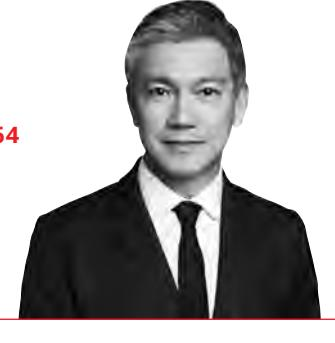

# **Tham Sai Choy,63**

**Non-Executive and Independent Director**

### **Bachelor of Science**

National University of Singapore

### **Advanced Management Program**

Harvard Business School, USA

Date of ȴ rst appointment as Director: 1 April 2020 Date of last re-election as Director: 30 March 2021 Length of service as Director: 2 years 10 months

**Present directorships:**

### **Other listed companies**

**•** CapitaLand Investment Limited Director

**Other principal commitments**

**•** DBS Bank Ltd. Director

- **•** CapitaLand Hope Foundation Director
- **•** Institute of International Education (IIE) Member, Scholar Rescue Fund Selection Committee
- **•** Ministry of Foreign A airs, Singapore Non-Resident
- to Colombia

School Advisory

### **Past directorships in listed companies held over the preceding ȴ ve years:**

*Securities Trading Limited on 21 September 2021*

*(1) CapitaLand Limited was delisted from the oί cial list of the Singapore Exchange* 

**•** CapitaLand Limited(1) Director

**•** Vista Oil & Gas S.A.B. de C.V. Director

Ambassador

**•** Queensway Secondary School Member,

Committee

Nil

### **Bachelor of Arts (Honours) in Economics** University of Leeds, UK

# **Fellow**

Institute of Chartered Accountants in England and Wales Institute of Singapore Chartered Accountants Singapore Institute of Directors

Date of ȴ rst appointment as Director: 3 September 2018 Date of last re-election as Director: 31 March 2022

Length of service as Director: 4 years 5 months

### **Present directorships: Other listed companies**

**•** Keppel Corporation Limited Director

# **Other principal commitments**

**•** DBS Bank Ltd. Director **•** DBS Bank (China) Limited Director **•** DBS Foundation Ltd. Director

**•** Nanyang Polytechnic Board Member

**•** Mount Alvernia Hospital Board Member **•** Singapore International Arbitration Centre Director

**•** E M Services Private Limited Chairman **•** Keppel O shore & Marine Ltd Director

# **Past directorships in listed companies held over the preceding ȴ ve years:**

# Group Management Committee

**The Group Management Committee comprises 21 members, including members of the Group Executive Committee.**

# **Piyush Gupta\***

### **Chief Executive Oɝ cer**

Piyush has been the Chief Executive Oɝ cer and Director of DBS Group since 2009. Prior to joining DBS, Piyush had a 27-year career at Citigroup, where his last position was Chief Executive Oɝ cer for Southeast Asia, Australia and New Zealand. Piyush is Chairman of the Board of Trustees of Singapore Management University, Vice-Chairman of the Institute of International Finance, Washington and Vice-Chairman of the World Business Council for Sustainable Development (WBCSD) Executive Committee. In addition, he is a member of Singapore's Advisory Council on the Ethical Use of AI and Data, and Bretton Woods Committee's Advisory Council.

Piyush sits on the boards of Singapore's National Research Foundation and the Council for Board Diversity established by Singapore's Ministry of Social and Family Development. He is a term trustee of the Singapore Indian Development Association. Previously, he was a member of the Singapore Emerging Stronger Taskforce, aimed at deȴ ning Singapore's future in a post-Covid world, the UN Secretary General's Task Force on Digital Financing of the Sustainable Development Goals, and the McKinsey Advisory Council.

Piyush was awarded the Public Service Star by the President of Singapore for his meritorious services to the nation in 2020. He is a recipient of the 2023 Pravasi Bharatiya Samman Award, the highest honour conferred by the Indian Government on the country's diaspora.

Piyush was named one of the world's top 100 best-performing chief executives in Harvard Business Review – 2019 edition of "The CEO 100". He was named Global Indian of the Year by the Economic Times in 2021, Singapore Business Awards' Outstanding Chief Executive of the Year in 2016, and Singapore Business Leader of the Year by CNBC in 2014.

## **Chng Sok Hui\***

### **Chief Financial Oɝ cer**

Sok Hui is the Chief Financial Oɝ cer of DBS Group. Prior to this appointment in October 2008, she was Group Head of Risk Management for six years. She is currently a Board member of DBS Bank India. She serves on the board of the Singapore Exchange (Chair of Risk Committee) as well as the Changi Airport Group (Chair of Audit Committee). Additionally, she is a member of the CareShield Life Council.

Sok Hui previously served, for six years each, on the boards of Inland Revenue Authority of Singapore, Housing & Development Board, and Accounting Standards Council. She was also the Supervisor of DBS China Board for 10 years and a past board member of the Bank of the Philippine Islands.

Sok Hui is a Chartered Financial Analyst, a Certiȴ ed Financial Risk Manager, an IBF Distinguished Fellow and a Fellow Chartered Accountant of Singapore. She was the recipient of several awards including AsiaRisk's "Risk Manager of the Year" (2002), Asian Banker's inaugural "Risk Manager of the Year" (2012), "Best CFO" at the Singapore Corporate Awards (2013) and "Accountant of the Year" at the inaugural Singapore Accountancy Awards (2014). She is a member of the International Women's Forum (Singapore).

# **Ginger Cheng**

### **China**

Ginger is Chief Executive Oɝ cer of DBS Bank (China) Limited and a member of the DBS Group Management Committee. China is a key market for DBS, and Ginger is responsible for bringing the franchise to the next level, as the bank executes its strategy to become a leading bank in Asia.

Ginger joined DBS in 2001. Prior to this CEO appointment, she was Deputy CEO of DBS China and the Head of Institutional Banking Group, China. Ginger has nearly 30 years of experience in syndicated lending and corporate banking across China, notably in the Greater Bay Area.

Ginger was born in Beijing and received her primary and secondary education there. She holds a Bachelor's degree in Business Administration from the Chinese University of Hong Kong.

### **Eng-Kwok Seat Moey**

### **Capital Markets**

Seat Moey is Group Head of Capital Markets. With more than 30 years of experience in investment banking, she oversees and supervises several teams on advisory and corporate ȴ nance, as well as structuring and execution of all equity transactions including corporate equity fund raising, REITs/ Business Trusts and IPOs. Seat Moey's extensive experience also includes structuring and originating debt and equity-linked debt issues and structured ȴ nance. She is the Chair of the DBS Digital Exchange which o ers trading services for various digital assets, including security tokens and cryptocurrencies. She is also a board member of the bank's award-winning securities business, DBS Vickers Securities.

Seat Moey was instrumental in the development of the REITs industry in Singapore and the region, having advised on numerous industry-ȴ rst structures. She also played an integral role in growing DBS' capital markets franchise beyond Singapore through a number of regional landmark transactions. Under her leadership, DBS continues to lead the market in Singapore and Asia ex-Japan, ranking top in regional and Singapore league tables.

196 **A Di erent Kind of Bank** DBS Annual Report 2022 **Group Management Committee** 197

### **Philip Fernandez**

### **Corporate Treasurer**

Philip is Group Corporate Treasurer, responsible for DBS' balance sheet, capital, wholesale funding, duration management and structural FX globally. He leads DBS Group's IBOR transition programme and chairs the corresponding ABS industry workgroup for corporate loans. He became Corporate Treasurer 14 years ago and in total has more than 30 years of experience in ȴ nancial services in Singapore and London. Philip was awarded the Institute of Banking and Finance's Distinguished Fellow award for Financial Markets in 2021 and was previously named "Bank Treasurer of the Year" by The Asset. Prior to heading Corporate Treasury, he was DBS' co-head of market risk for ȴ ve years.

Philip is a Singaporean who holds an M.A. from Cambridge University where he studied Engineering and Management under a DBS scholarship. Previously, he was also an adjunct associate professor at the Singapore Management University for six years, where he specialised in quantitative ȴ nance.

# **Derrick Goh**

# **Audit**

Derrick is the Group Head of Audit, responsible for providing independent assurance of the bank's controls, risk and governance structures and processes. Prior to this, Derrick led the Treasures and Treasures Private Client Wealth Management business across the group. Before that, he was Head of POSB where he helped to deepen its community outreach. Derrick was also Regional Chief Operating Oɝ cer and Chief Financial Oɝ cer of the Institutional Banking Group and Head of Finance, Group Planning and Analytics.

Before DBS, Derrick spent 11 years at American Express in senior ȴ nance roles in Paris, London, New York and Singapore. He has over 30 years of experience in ȴ nance and banking. He currently chairs the Board Audit and Risk Committee for GovTech Singapore and serves the community as a Member of Parliament (Nee Soon Group Representative Constituency) and is also a member of the Parliament of Singapore's Public Accounts Committee.

# **Han Kwee Juan\***

### **Strategy & Planning**

Kwee Juan is Group Head of Strategy and Planning. In this role, he works with the Group CEO and Group Management Committee to develop strategies to drive growth and

valuation for shareholders. He also oversees strategic reviews and execution of these strategies across the Group.

Kwee Juan leads the bank's transformation agenda. He develops change management programmes to deliver transformation outcomes across the Group in data and artiȴ cial intelligence, managing through journeys, customer experience, innovation and future of work.

His portfolio also encompasses responsibility for developing and driving new business models through ecosystems partnerships for corporate and retail customers; identifying and creating new joint ventures to develop new revenue streams through banking solutions; and ultimately to grow value in the Group's joint venture investments.

# **Lam Chee Kin**

### **Legal & Compliance**

Chee Kin oversees the legal and regulatory risk of DBS across legal entities, segments and geographies. A lawyer by profession, he has particular expertise in ȴ nancial services regulation, and ȴ nancial markets product and business structuring. Chee Kin has held legal and compliance portfolios in Standard Chartered, J.P. Morgan, Rajah & Tann and Allen & Gledhill. He also had a stint as Chief Operating Oɝ cer for Southeast Asia at J.P. Morgan.

Chee Kin currently serves on the Advisory Board to the Singapore Management University School of Law and the Advisory Panel to the NUS Centre for Banking and Finance Law.

### **Lee Yan Hong**

# **Human Resources**

Yan Hong is Managing Director and Head of Group Human Resources. Her human capital management experience spans over 30 years, across a spectrum of industries, specialisations, coverage and geographies.

At DBS, Yan Hong drives the overall strategic people agenda of the Group by setting the direction and spearheading various functions and initiatives in the organisational growth of the Bank. Critical to the success of DBS' digital transformation journey are both the people and culture agendas of which HR plays an important role by driving change from the top through transformational leadership, to nurturing a start-up culture, upskilling and equipping employees with futureready skills, as well as delivering employee value propositions through joyful employee experiences, products and programmes.

Under her leadership, DBS has won a number of global and regional accolades, including being certiȴ ed by Kincentric as Regional Best Employer in Asia-Paciȴ c, as well as Country Best Employer in Singapore and other markets for several years. For the sixth year running, DBS has been named to the Bloomberg Gender Equality Index. In addition, DBS has also been awarded by the Singapore Tripartite Alliance for Fair and Progressive Employment Practices for fair and progressive employment practices as well as empowering employees to achieve work-life excellence.

Yan Hong currently serves on the board of the Inland Revenue of Singapore and the Institute of Systems Science, National University of Singapore.

# **Lim Chu Chong**

### **Indonesia**

Chu Chong has been President Director of PT Bank DBS Indonesia since August 2022.

Prior to that, he was Chief Operating Oɝ cer, Institutional Banking Group (IBG), at DBS. In this role, he was responsible for facilitating business growth, particularly in strengthening policies, governance and controls, data capabilities as well as customer and employee experience.

A career DBS banker, Chu Chong has over 25 years of experience in institutional, SME and consumer banking. He began his career as a credit and marketing oɝ cer in Corporate Banking, before progressively moving up the ranks to become Regional Head of SME Banking. Between 2016 and 2019, he was Head of DBS IBG China.

He was Non-Independent Commissioner of DBS Indonesia from 2011 to 2016, and a Board member of DBS Foundation from December 2013 to November 2022.

He has a Bachelor of Arts majoring in Economics and Statistics from the National University of Singapore

### **Lim Him Chuan**

### **Taiwan**

Him Chuan is Chief Executive Oɝ cer of DBS Bank Taiwan. Prior to this, he was the Group Head of Product Management for DBS' Global Transaction Services, responsible for the bank's cash management and trade ȴ nance businesses. Under his leadership, the business registered robust growth with a strong focus on product digitalisation and signiȴ cant improvements in the Greenwich Customer Satisfaction survey.

Prior to that, he was Chief Operating Oɝ cer for DBS' Institutional Banking Group and International Markets, leading various strategic business, customer and employee journey change programmes. He was also Head of Group Audit where he successfully transformed Group Audit into a multidisciplinary professional services team, which won the Singapore Internal Audit Excellence Award in 2012. In recognition of his contributions to the Singapore ȴ nancial services industry as well as his industry thought leadership, Him Chuan was conferred the title of Singapore Institute of Banking and Finance Fellow in 2014.

# **Sim S Lim\***

### **Consumer Banking/ Wealth Management**

Sim is group head responsible for leading DBS' consumer banking and wealth management business, following his appointment to the role on 1 January 2019. Prior to this, he spent eight years as DBS' ȴ rst country head with dedicated oversight for Singapore, during which he focused on delivering greater synergy and value across the bank's Singapore franchise.

Sim has been in the industry for over 40 years and has assumed career responsibilities in Asia, North America and the Middle East. Before DBS, Sim was President and CEO of Nikko Citigroup Limited. During this time, he was also a board member of Nikko Citi Holdings Inc, and oversaw corporate and investment banking, institutional brokerage, as well as ȴ xed income and equity trading for Citigroup in Japan. In his time abroad, Sim also served as chairman of Citibank Berhad Malaysia.

Presently, Sim is Chairman of DBS Vickers Securities Holdings & sits on the Board of DBS Securities (Japan). He chairs the Building and Construction Authority, and sits on the Board of Directors of ST Engineering. He also serves as Singapore's High Commissioner (Non-Resident) to the Federal Republic of Nigeria.

# **Andrew Ng\***

### **Treasury & Markets**

Andrew is Head of Treasury and Markets. He is also the Chairman and Director of DBS Bank Taiwan, and Director of DBS Securities (Japan) Company Limited. Andrew's experience in the treasury business spans over 35 years, comprising senior positions in Asia and Western markets. Since 2006, Andrew has been instrumental in leading DBS Treasury and Market's expansion in the region.

In addition, he helped build a pan-Asia trading platform on di erent asset classes and established a region-wide local currencies derivative capability for the bank. He has also expanded DBS' capabilities in generic and exotic derivatives. Prior to joining DBS, he was Executive Director at Canadian Imperial Bank of Commerce (CIBC) from 1995 to 1999, where he set up CIBC's trading platform and derivative capabilities on Asian currencies. He was also previously North Asia Head of Trading at Chase Manhattan Bank N.A. and Treasurer of Chase Manhattan Bank Taipei.

# **Jimmy Ng\***

### **Chief Information Oɝ cer/ Technology & Operations**

Jimmy is Group Chief Information Oɝ cer and Head of Group Technology & Operations. Managing more than 18,000 technology and operations professionals globally, he plays a leading role in the development and execution of the bank's technology strategy, which elevated DBS' standing to being recognised on a global stage.

Prior to this, Jimmy was Deputy Head of Group Technology & Operations, where he oversaw the bank's ȴ rst technology development centre outside Singapore – DBS Tech India in Hyderabad. He also oversaw DBS' Middle Oɝ ce Technology and Enterprise Architecture/ Site Reliability Engineering. Jimmy was also previously DBS' Group Head of Audit, and before that, Head of Singapore Consumer Banking Operations where he harnessed state of-the-art data analytics and machine-learning techniques to develop and implement new auditing approaches, and overhauled DBS' ATM/ Self-service Banking management.

# **Karen Ngui**

### **Strategic Marketing & Communications**

Karen is Head of Group Strategic Marketing and Communications, and Board member of the DBS Foundation. She is responsible for corporate communications, brand management, strategic marketing, internal communications and sponsorships. She also oversees the DBS Foundation and all of the bank's 'Impact beyond banking' initiatives. She leads media and issues management e orts across the DBS Group. In addition, she is responsible for managing and enhancing the bank's brand positioning across all businesses and markets where DBS is present.

She has over 30 years of experience in corporate branding, marketing and communications for ȴ nancial institutions, and joined DBS in 2005 from Standard Chartered Bank where she was Global Head, Brand Management and Strategic Marketing.

### **Sebastian Paredes\***

### **Hong Kong**

Sebastian is Chief Executive Oɝ cer of DBS Bank (Hong Kong) and Non-Executive Director of DBS Bank (China) Limited. With over 30 years of experience in the industry, Sebastian has found much success in building franchises across various markets. His experience in laying the groundwork across regions has led him to manage complex situations during times of economic volatility. Formerly President Director of PT Bank Danamon, Indonesia, Sebastian solidiȴ ed the bank's position in retail, SME and commercial banking and created opportunities for new businesses in consumer ȴ nance and micro lending. Sebastian also spent 20 years at Citigroup as Country Head of Ecuador, Honduras, Turkey and Israel, and was also the Chief Executive Oɝ cer of Sub-Saharan Africa.

# **Sanjoy Sen**

#### **Consumer Banking**

Sanjoy is Group Head of Consumer Banking and plays a lead role in growing and deepening DBS' regional consumer banking footprint in Asia. His responsibilities include driving digital transformation, developing new ecosystem partnerships, and leveraging DBS' banking and technology capabilities to scale the consumer business regionally.

Sanjoy has over 30 years of extensive international consumer banking experience. He spent the ȴ rst 22 years of his career in Citibank, before he joined ANZ Banking Group in 2012 to head its Retail, Private Banking and Wealth business in Asia. He then joined DBS in 2018, following the successful integration of ANZ's Retail & Wealth business. Sanjoy currently serves on the board of DBS Bank Taiwan and DBS Foundation. He also sits on Visa's Senior Client Council for Asia Paciȴ c. In 2019, Sanjoy was conferred the IBF Fellow award for Consumer Banking by the Institute of Banking and Finance in Singapore.

Sanjoy is a Singaporean who holds a B.Tech degree in Electronics Engineering from Indian Institute of Technology and a Post Graduate Diploma in Business Management from Indian Institute of Management. He has also completed an executive management programme from Harvard Business School.

# **Shee Tse Koon\***

### **Singapore**

Tse Koon is Country Head of DBS Singapore. Prior to this, he was Group Head of Strategy and Planning.

Tse Koon has close to 30 years of banking experience and started his career at Standard Chartered Bank where he held senior positions across various markets in Asia, Middle East, and the United Kingdom. He was CEO of Indonesia prior to joining DBS, and his other roles included Head of Governance (Europe, Middle East, Africa & Americas), Chief Information O ɝ cer (Singapore), Head of Technology & Operations (Singapore) and Regional Head of Trade.

Tse Koon is currently a Board of Director of NETS Pte Ltd and the Chairman of the Association of Banks in Singapore's (ABS) Culture and Conduct Steering Group. He also sits on the Board of Governors for the Singapore International Foundation and Nanyang Polytechnic.

Tse Koon was conferred the Institute of Banking and Finance Distinguished Fellow Award (Corporate Banking) in 2021. In 2022, he was awarded the Medal of Commendation (Star) by the National Trade Union Congress for his leadership in creating a future-ready workforce at DBS.

# **Surojit Shome**

# **India**

Surojit has been Chief Executive O ɝ cer of DBS Bank in India since 2015. Surojit has over 35 years of banking experience across corporate and investment banking, capital markets and consumer banking. Before he joined DBS, he was CEO of Rabobank in India. Prior to that, he worked for 19 years at Citibank in various roles across consumer and wholesale banking. He subsequently headed the investment banking division at Lehman Brothers in India.

Surojit holds a post-graduate management degree in marketing and ȴ nance from Xavier School of Management, Jamshedpur, and a Bachelor of Science degree in Economics, Mathematics and Statistics from Presidency University, Kolkata. Surojit has also attended the Executive Development Program at The Wharton School in 2004 and the Rabobank Senior Leadership Program at Harvard Business School in 2011.

## **Soh Kian Tiong\***

#### **Chief Risk O ɝ cer**

Kian Tiong is the Chief Risk O ɝ cer of DBS Group and has more than 25 years of experience in the banking and ȴ nance industry. He was previously DBS' Chief Credit O ɝ cer for the bank's Greater China operations where he oversaw credit and risk functions in Hong Kong, Mainland China and Taiwan. Prior to this, he was Group Head of DBS' Financial Institutions Group, responsible for relationships with banks and non-bank ȴ nancial institutions, comprising insurance companies, funds, securities companies, supranationals and central banks, spanning US, Europe and most parts of Asia.

He also oversaw the relationship coverage of Singapore government-related entities such as GIC, Temasek and Singapore universities, among others. In recognition of his leadership and commitment in developing the ȴ nancial industry, Kian Tiong was conferred the IBF Fellow award in 2017 by the Institute of Banking and Finance Singapore.

# **Tan Su Shan\***

### **Institutional Banking**

Su Shan is Group Head of Institutional Banking at DBS and President Commissioner for PT Bank DBS Indonesia. She was previously Group Head of Consumer Banking and Wealth Management at DBS for almost a decade.

In 2019, The Asset named Su Shan as one of six women in Asia likely to in ȵ uence and feature prominently in shaping the banking and associated ȴ nancial services industry in Asia. In 2018, she was nominated by Forbes Magazine as a "Top 25 Emergent Asian Woman Business Leader". In 2014, she became the ȴ rst Singaporean to be recognised as the world's "Best Leader in Private Banking" by The Banker/ Private Wealth Management, a wealth publication by the Financial Times Group. She has also served as a Nominated Member of Parliament in Singapore.

Su Shan is an independent board director of CPF (The Central Provident Fund Board) and Mapletree Pan Asia Commercial Trust. On the education front, she is an advisor to Lincoln College at Oxford University. She is also the Founder President of the Financial Women's Association in Singapore, a non-pro ȴ t organisation she founded and pioneered in 2001, to help develop and mentor women in the ȴ nancial industry.

# International presence

### **Singapore**

### **DBS Bank Ltd ("DBS Bank")**

12 Marina Boulevard Marina Bay Financial Centre Tower 3 Singapore 018982 Tel: (65) 6878 8888

### **AXS Pte. Ltd.**

61 Mohamed Sultan Road #01-11 Sultan Link Singapore 239001 Tel: (65) 6560 2727 Fax: (65) 6636 4550

*27.65% owned by DBS Bank and 60.07% owned by Primeέ eld Company Pte Ltd, a wholly-owned subsidiary of DBS Bank*

## **DBS Nominees (Private) Limited**

10 Toh Guan Road, #04-11 DBS Asia Gateway Singapore 608838 Tel: (65) 6878 8888 Fax: (65) 6338 8936

### **DBS Trustee Limited**

12 Marina Boulevard Marina Bay Financial Centre Tower 3 Singapore 018982 Tel: (65) 6878 8888

### **DBS Vickers Securities (Singapore) Pte Ltd**

12 Marina Boulevard #10-01 Marina Bay Financial Centre Tower 3 Singapore 018982 Tel: (65) 6327 2288

### **DBSN Services Pte. Ltd.**

10 Toh Guan Road, #04-11 DBS Asia Gateway Singapore 608838 Tel: (65) 6878 8888 Fax: (65) 6338 8936

### **DBS Digital Exchange Pte. Ltd.**

12 Marina Boulevard Marina Bay Financial Centre Tower 3 Singapore 018982 Tel: (65) 6878 8888

*90% owned by DBS Finnovation Pte. Ltd., a wholly-owned subsidiary of DBS Bank*

### **Australia**

### **DBS Bank Australia Branch**

Suite 1901, Level 19, Chi ȵ ey Tower 2 Chi ȵ ey Square, Sydney NSW 2000 Australia Tel: (61 2) 8823 9300 Fax: (61 2) 8823 9301

# **Bangladesh**

#### **DBS Bank Dhaka Representative O ɝ ce**

Laila Tower, 8 Bir Uttam Mir Shawkat Sarak, Gulshan 1, Dhaka 1212 Bangladesh Tel: (880 2) 2266 00810

## **China**

### **DBS Bank (China) Limited**

Units 1301, 1306, 1701 & 1801, DBS Bank Tower No. 1318 Lujiazui Ring Road Pudong New Area, Shanghai 200120 People's Republic of China Tel: (86 21) 3896 8888 Fax: (86 21) 3896 8989

### **DBS Securities (China) Co., Ltd.**

Unit 01 – 07, 29F, BFC Block S1 600 Zhongshan No.2 Road (E) Huangpu, Shanghai People's Republic of China Tel: (86 21) 3856 2888 Fax: (86 21) 6315 0977

*51% owned by DBS Bank*

### **Hong Kong**

### **DBS Bank (Hong Kong) Limited**

11th Floor, The Center 99 Queen's Road Central Hong Kong Tel: (852) 2290 8888

### **DBS Bank Hong Kong Branch**

18th Floor, The Center 99 Queen's Road Central Hong Kong Tel: (852) 3668 1900 Fax: (852) 2596 0577

### **DBS Asia Capital Limited**

73rd Floor, The Center 99 Queen's Road Central Hong Kong Tel: (852) 3668 1148

Fax: (852) 2868 0250

### **DBS Vickers (Hong Kong) Limited**

16/F One Island East 18 Westlands Road Island East Hong Kong

Tel: (852) 3668 3288 Fax: (852) 2523 6055

### **India**

### **DBS Bank India Limited**

Ground Floor Nos. 11 & 12 Capitol Point, Baba Kharak Singh Marg Connaught Place, Delhi 110 001 India

Tel: (91 11) 6653 8888 Fax: (91 11) 6653 8899

### **DBS Technology Services India Private Limited**

17th Floor, Skyview 20 Building, M/s. Divija Commercial Properties Private Limited Survey No. 83/1, Raidurg Village, Serilingampally Mandal, Ranga Reddy District, Hyderabad

India Tel: (91 40) 6752 2222

# **Japan**

### **DBS Bank Tokyo Branch**

Otemachi First Square East Tower 15F 5-1, Otemachi 1-chome Chiyoda-ku, Tokyo 100-0004 Japan

Tel: (81 3) 3213 4411 Fax: (81 3) 3213 4415

### **DBS Securities (Japan) Co., Ltd.**

Otemachi First Square East Tower 15F 5-1, Otemachi 1-chome Chiyoda-ku, Tokyo 100-0004 Japan

Tel: (81 3) 3213 4660 Fax: (81 3) 3213 4415

### **Malaysia**

### **DBS Bank Kuala Lumpur Representative Oɝ ce**

#08-01, Menara Keck Seng 203 Jalan Bukit Bintang 55100 Kuala Lumpur Malaysia

Tel: (60 3) 2116 3888 Fax: (60 3) 2116 3901

### **DBS Bank Labuan Branch**

Level 10 (A) Main Oɝ ce Tower Financial Park Labuan Jalan Merdeka 87000 F.T. Labuan Malaysia Tel: (60 87) 595 500 Fax: (60 87) 423 376

### **Taiwan**

### **DBS Bank (Taiwan) Ltd**

15F & 17F Nos. 32 & 36 Songren Road Xinyi District, Taipei City 110

Taiwan R.O.C Tel: (886 2) 6612 9889 Fax: (886 2) 6612 9285

### **DBS Bank Taipei Branch**

15F Nos. 32 & 17F No. 36 Songren Road Xinyi District, Taipei City 110 Taiwan R.O.C Tel: (886 2) 2722 8988 Fax: (886 2) 6638 3707

### **United Arab Emirates**

### **DBS Bank Ltd (DIFC Branch)**

Units 608-610, Level 6, Gate Precinct Building 5, Dubai International Financial Centre P.O. Box 506538 Dubai, UAE Tel: (971) 4364 1800 Fax: (971) 4364 1801

### **United States of America**

### **DBS Bank Los Angeles Representative Oɝ ce**

300 South Grand Ave Suite 3075 Los Angeles CA 90071 USA

Tel: (1 213) 627 0222 Fax: (1 213) 627 0228

### **DBS Vickers Securities (USA), Inc.**

777 Third Ave, Suite 1701 New York, NY 10017 USA

Tel: (1 212) 826 1888

### **Indonesia**

Telangana

### **PT Bank DBS Indonesia**

DBS Bank Tower 32nd – 37th Floor, Ciputra World 1 Jalan Prof. Dr. Satrio Kav. 3-5 Jakarta 12940 Indonesia Tel: (62 21) 2988 5000

Fax: (62 21) 2988 5005 *99% owned by DBS Bank*

### **PT DBS Vickers Sekuritas Indonesia**

DBS Bank Tower 32nd Floor, Ciputra World 1 Jalan Prof. Dr. Satrio Kav. 3-5 Jakarta 12940 Indonesia Tel: (62 21) 3003 4900

*85% owned by DBS Vickers Securities Holdings Pte Ltd ("DBSV"), a wholly-owned subsidiary of DBS Bank and 14% owned by DBS Vickers Securities (Singapore) Pte Ltd, a wholly-owned subsidiary of DBSV*

### **Korea**

### **DBS Bank Seoul Branch**

18th Floor, Seoul Finance Center 136 Sejong-daero Jung-Gu, Seoul Republic of Korea 04520 Tel: (822) 6322 2660 Fax: (822) 732 7953

### **Macau**

### **DBS Bank (Hong Kong) Limited Macau Branch**

Nos. 5 a 7E da Rua de Santa Clara Edif, Ribeiro Loja C e D., Macau Tel: (853) 2832 9338

Fax: (853) 2832 3711

### **Myanmar**

### **DBS Bank Yangon Representative Oɝ ce**

No. 3/A Bogyoke Aung San Road Level 14, Suite 52, Junction City Tower Pabedan Township, Yangon Myanmar Tel: (95 1) 925 3325

### **The Philippines**

Fax: (632) 7750 2144

### **DBS Bank Manila Representative Oɝ ce**

22F, The Enterprise Center, Tower 1 Ayala Avenue corner Paseo De Roxas Makati City The Philippines Tel: (632) 8869 3876

### **Thailand**

### **DBS Bank Bangkok Representative Oɝ ce**

989 Siam Piwat Tower Building 15th Floor Rama 1 Road, Pathumwan Bangkok 10330 Thailand Tel: (66 2) 658 1400-1

### **DBS Vickers Securities (Thailand) Co., Ltd.**

Fax: (66 2) 658 1402

989 Siam Piwat Tower Building 9th 14th – 15th Floor Rama 1 Road, Pathumwan Bangkok 10330 Thailand Tel: (66 2) 857 7000

# **United Kingdom**

# **DBS Bank London Branch**

One London Wall London EC2Y 5EA UK Tel: (44 20) 7489 6591

Fax: (44 20) 7489 5850

# **Vietnam**

### **DBS Bank Hanoi Representative Oɝ ce**

Room 1404 14th Floor, Paciȴ c Place 83B Ly Thuong Kiet Street Hanoi Vietnam Tel: (84 24) 3946 1688

Fax: (84 24) 3946 1689

### **DBS Bank Ho Chi Minh City Branch**

11th Floor, Saigon Centre 65 Le Loi Boulevard District 1 Ho Chi Minh City Vietnam

Tel: (84 28) 3914 7888 Fax: (84 28) 3914 4488

# Awards and accolades won

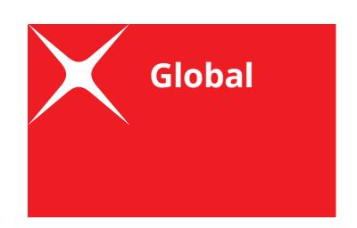

**World's Best Bank**

Global Finance

**100 Best Workplaces for Innovators**

Fast Company

**Digital Workplace of the Year: Cutting Edge Award**

Digital Workplace Group

**Global Innovator (Gold)**

Qorus-Accenture

**World's Most Innovative Financial Institutions**

Global Finance

**Most Innovative in Digital Banking: AI and Machine Learning**

The Banker

**Financial Innovation of the Year (FIX Marketplace)**

Euromoney

**World's Best Bank for Real Estate**

Euromoney

**World's Best Bank for SMEs**

Euromoney

**Cash Management Survey: Global Best Service**

Euromoney

**#1 Digital Portal for Wealth Clients**

Cutter Associates

**CIO100 Honoree**

CIO

**Model Risk Manager of the Year**

Celent

**Financial Leadership in Sustaining Communities**

Global Finance

**FTSE4Good Developed Index**

FTSE Russell

**Sustainability Yearbook Member**

S&P Global

**Bloomberg Gender Equality Index**

Bloomberg

**Sustainability, Environment & Climate (Campaign – Brand): Bronze (SPARKS S2)**

Webby Anthem

**Impact Awards – Best Branded Series (Bronze)**

Shorty

**Intranet Design Annual Award**

Nielsen Norman

**Regional**

**Asia's Safest Bank**

Global Finance

**SME Financier of the Year, Asia**

SME Finance Forum

**Best Treasury and Cash Management Bank, Southeast Asia**

The Asset

**Project Finance Advisory House of the Year, Asia-Paciȴ c**

The Asset

**Asia's Best Bank for Wealth Management**

Euromoney

**Best Asian Private Bank**

Asiamoney

**ESG Excellence Award, Asia-Paciȴ c**

IJGlobal

**Steward Leadership 25**

Stewardship Asia

**In-house Legal Teams: Innovation in ESG Leadership (Asia-Paciȴ c)**

Financial Times

**FTSE4Good ASEAN 5 Index**

FTSE Russell

**Asia-Paciȴ c Best Employer**

Kincentric

**In-House Team of the Year (Communications)**

PRCA Gold Standard

**Singapore**

**Bank of the Year**

The Banker

**Best Bank, Singapore** 

Global Finance

**Best Bank, Singapore** 

FinanceAsia

**Digital Bank of the Year, Singapore**

The Asset

**Best Corporate and Consumer Digital Bank, Singapore**

Global Finance

**Most Valuable Brand in Singapore**

Brand Finance

**Best Transaction Bank, Singapore**

The Asset

**Best Loan Adviser, Singapore**

The Asset

**Project Finance House, Singapore**

The Asset

**Best Investment Bank, Singapore**

Global Finance

**Best Domestic Private Bank, Singapore**

Asiamoney

**Best Securities House, Singapore**

Asiamoney

**Best Managed Board (Gold)**

Singapore Corporate Awards

**Best Risk Management (Gold)**

Singapore Corporate Awards

**Best Annual Report (Silver)**

Singapore Corporate Awards

**Best Bank for Sustainable Finance, Singapore**

Global Finance

**Best Bank for CSR, Singapore**

Asiamoney

**Organisation of Good (Large Enterprise)**

National Volunteer and Philanthropy Centre

**Champion of Good**

National Volunteer and Philanthropy Centre

**Charity Platinum Award**

Community Chest Singapore

**Best Employer, Singapore**

Kincentric

# Share

# price

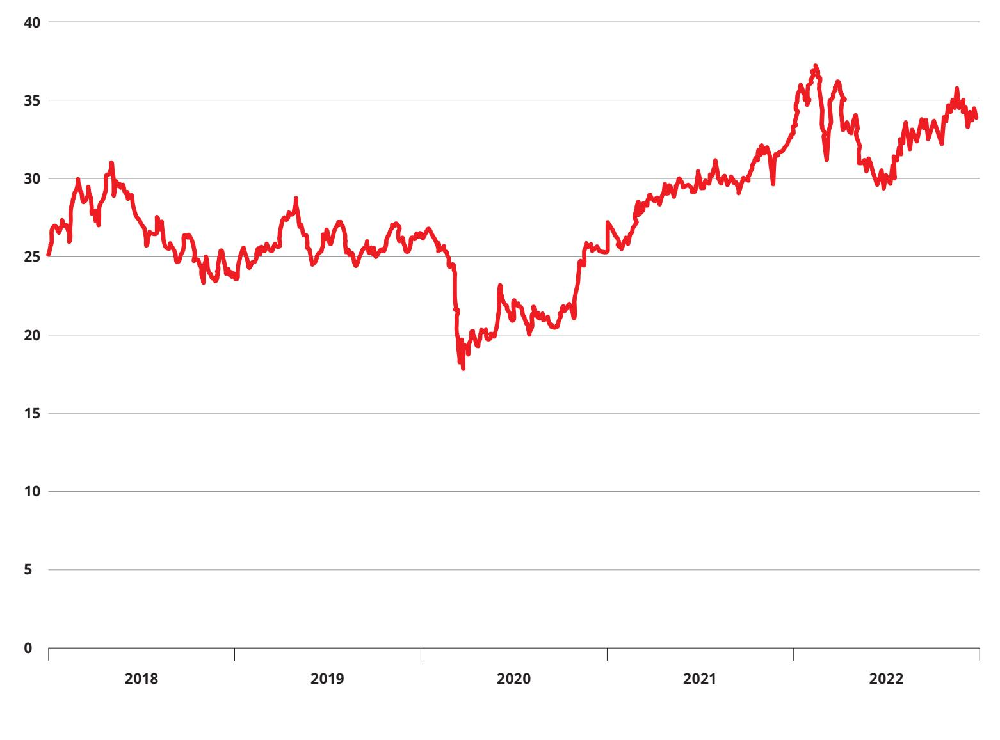

| Share Price (SGD)                            | 2018  | 2019  | 2020  | 2021  | 2022  |
|----------------------------------------------|-------|-------|-------|-------|-------|
| High                                         | 30.84 | 28.40 | 26.40 | 32.78 | 37.25 |
| Low                                          | 22.80 | 23.09 | 16.88 | 25.04 | 29.49 |
| Close                                        | 23.69 | 25.88 | 25.04 | 32.66 | 33.92 |
| Average                                      | 26.36 | 25.42 | 21.96 | 29.56 | 33.28 |
| Financial Ratios*                            |       |       |       |       |       |
| Gross dividend yield (%)(1)                  | 4.6   | 4.8   | 4.0   | 4.1   | 4.3   |
| Price-to-earnings ratio (number of times)(2) | 12.2  | 10.3  | 12.1  | 11.3  | 10.6  |
| Price-to-book ratio (number of times)(3)     | 1.5   | 1.3   | 1.1   | 1.4   | 1.6   |

- *(1) Based on ordinary dividends declared/ recommended for the έ nancial year*
- *(2) Earnings exclude one-time items*
- *(3) Based on year-end book value*
- *\* Calculated based on average share price for the calendar year*

# Financial calendar

2023 **13 February**

2022 Full Year Results

**31 March**

24th Annual General Meeting

**On or about 21 April**

Payment date of Final Dividend and Special Dividend on Ordinary Shares for the Financial Year ended 31 December 2022\*

**2 May**

2023 First Quarter trading update

**3 August**

2023 Second Quarter/ First Half Results

**6 November**

2023 Third Quarter trading update

2024 **February**

2023 Full Year Results

*\* Subject to shareholders' approval at the 24th Annual General Meeting*

206 **A Di erent Kind of Bank** DBS Annual Report 2022 **Shareholding statistics** 207

# Shareholding statistics

# **as at 10 February 2023**

Class of Shares – Ordinary shares

Voting Rights – One vote per share

Total number of issued ordinary shares – 2,573,628,816 (excluding treasury shares)

Treasury Shares – 13,988,809 (representing 0.54% of the total number of issued ordinary shares, excluding treasury shares)

| Size of Shareholdings    | No. of Shareholders | %      | No. of Shares | %*     |
|--------------------------|------------------------|--------|------------------|--------|
| 1 – 99                   | 10,814                 | 12.27  | 308,685          | 0.01   |
| 100 – 1,000              | 40,219                 | 45.63  | 18,899,435       | 0.73   |
| 1,001 – 10,000           | 32,405                 | 36.77  | 100,335,876      | 3.90   |
| 10,001 – 1,000,000       | 4,671                  | 5.30   | 155,651,994      | 6.05   |
| 1,000,001 & above        | 28                     | 0.03   | 2,298,432,826    | 89.31  |
| Total                    | 88,137                 | 100.00 | 2,573,628,816    | 100.00 |
| Location of Shareholders |                        |        |                  |        |
| Singapore                | 84,655                 | 96.05  | 2,556,281,514    | 99.33  |
| Malaysia                 | 2,262                  | 2.57   | 11,585,785       | 0.45   |
| Overseas                 | 1,220                  | 1.38   | 5,761,517        | 0.22   |
| Total                    | 88,137                 | 100.00 | 2,573,628,816    | 100.00 |

# **Twenty largest shareholders (as shown in the register of members and depository register)**

|    | Name of Shareholders                       | No. of Shares | %*    |
|----|--------------------------------------------|------------------|-------|
| 1  | CITIBANK NOMINEES SINGAPORE PTE LTD        | 506,573,088      | 19.68 |
| 2  | MAJU HOLDINGS PTE. LTD.                    | 458,899,869      | 17.83 |
| 3  | DBSN SERVICES PTE LTD                      | 304,505,697      | 11.83 |
| 4  | TEMASEK HOLDINGS (PRIVATE) LIMITED         | 284,145,301      | 11.04 |
| 5  | RAFFLES NOMINEES (PTE) LIMITED             | 229,954,978      | 8.94  |
| 6  | HSBC (SINGAPORE) NOMINEES PTE LTD          | 224,771,577      | 8.73  |
| 7  | DBS NOMINEES PTE LTD                       | 174,360,762      | 6.77  |
| 8  | BPSS NOMINEES SINGAPORE (PTE.) LTD.        | 26,200,171       | 1.02  |
| 9  | LEE FOUNDATION                             | 11,512,813       | 0.45  |
| 10 | DBS VICKERS SECURITIES (SINGAPORE) PTE LTD | 11,380,066       | 0.44  |
| 11 | UNITED OVERSEAS BANK NOMINEES PTE LTD      | 10,018,526       | 0.39  |
| 12 | BNP PARIBAS NOMINEES SINGAPORE PTE LTD     | 6,861,049        | 0.27  |
| 13 | OCBC NOMINEES SINGAPORE PTE LTD            | 5,915,877        | 0.23  |
| 14 | PHILLIP SECURITIES PTE LTD                 | 5,496,248        | 0.21  |
| 15 | OCBC SECURITIES PRIVATE LTD                | 5,374,123        | 0.21  |
| 16 | DB NOMINEES (SINGAPORE) PTE LTD            | 4,844,994        | 0.19  |
| 17 | MRS LEE LI MING NEE ONG                    | 4,280,398        | 0.17  |
| 18 | MERRILL LYNCH (SINGAPORE) PTE LTD          | 3,637,236        | 0.14  |
| 19 | IFAST FINANCIAL PTE LTD                    | 3,156,022        | 0.12  |
| 20 | LOO CHOON YONG                             | 3,056,674        | 0.12  |
|    | Total                                      | 2,284,945,469    | 88.78 |

### *\* Percentage is calculated based on the total number of issued ordinary shares, excluding treasury shares*

### **Substantial shareholders**

|                                    |             | No. of Shares |             |       |
|------------------------------------|-------------|---------------|-------------|-------|
|                                    | Direct      | Deemed        | Total       |       |
| Maju Holdings Pte. Ltd.            | 458,899,869 | –             | 458,899,869 | 17.83 |
| Temasek Holdings (Private) Limited | 284,145,301 | 465,846,940   | 749,992,241 | 29.14 |

*\* Percentage is calculated based on the total number of issued ordinary shares, excluding treasury shares*

- 1. Maju Holdings Pte. Ltd. ("Maju") is a wholly-owned subsidiary of Temasek Holdings (Private) Limited ("Temasek").
- 2. Temasek, a company wholly-owned by the Minister for Finance, is deemed to be interested in all the ordinary shares held by Maju.
- 3. In addition, Temasek is deemed to be interested in 6,947,071 ordinary shares in which its other subsidiaries have or are deemed to have an interest pursuant to Section 4 of the Securities and Futures Act 2001.

As at 10 February 2023, approximately 70.70% of the issued ordinary shares of DBS Group Holdings Ltd are held by the public and, therefore, Rule 723 of the SGX Listing Manual is complied with.

208 **A Di erent Kind of Bank** DBS Annual Report 2022 **Notice of Annual General Meeting** 209

# Notice of Annual General Meeting

### **DBS GROUP HOLDINGS LTD**

(Incorporated in the Republic of Singapore) Company Registration No.: 199901152M

### **To: All shareholders of DBS Group Holdings Ltd**

NOTICE IS HEREBY GIVEN that the 24th Annual General Meeting of the shareholders of DBS Group Holdings Ltd (the "Company" or "DBSH") will be held at Marina Bay Sands Expo and Convention Centre, Level 4, Roselle and Simpor Ballrooms, 10 Bayfront Avenue, Singapore 018956 on Friday, 31 March 2023 at 2.00 p.m. (Singapore time) to transact the following business:

| Routine Business                                                                                                                                                                                                                                                                                                                                                                                                                                                                                                                                                                                                                   | Ordinary Resolution No.      |
|------------------------------------------------------------------------------------------------------------------------------------------------------------------------------------------------------------------------------------------------------------------------------------------------------------------------------------------------------------------------------------------------------------------------------------------------------------------------------------------------------------------------------------------------------------------------------------------------------------------------------------|------------------------------|
| To receive and adopt the Directors' Statement and Audited Financial Statements for the year ended 31 December 2022 and the Auditor's Report thereon.                                                                                                                                                                                                                                                                                                                                                                                                                                                                            | Resolution 1                 |
| To declare a one-tier tax exempt Final Dividend of 42 cents per ordinary share and a one-tier tax exempt Special Dividend of 50 cents per ordinary share for the year ended 31 December 2022. (2021: Final Dividend of 36 cents per ordinary share, one-tier tax exempt)                                                                                                                                                                                                                                                                                                                                                     | Resolution 2                 |
| To approve the amount of SGD 4,617,248 proposed as non-executive Directors' remuneration for the year ended 31 December 2022. (2021: SGD 4,266,264)                                                                                                                                                                                                                                                                                                                                                                                                                                                                             | Resolution 3                 |
| To re-appoint Messrs PricewaterhouseCoopers LLP as Auditor of the Company and to authorise the Directors to ȴ x its remuneration.                                                                                                                                                                                                                                                                                                                                                                                                                                                                                               | Resolution 4                 |
| To re-elect the following Directors, who are retiring under article 99 of the Company's Constitution and who, being eligible, o΍ er themselves for re-election: (a) Mr Peter Seah Lim Huat (b) Ms Punita Lal                                                                                                                                                                                                                                                                                                                                                                                                              | Resolution 5 Resolution 6 |
| (c) Mr Anthony Lim Weng Kin Key information on Mr Seah, Ms Lal and Mr Lim can be found on pages 190, 193, 194 and 214 to 217 respectively of the 2022 Annual Report. Mr Ho Tian Yee will also be retiring as a Director under article 99 of the Company's Constitution at the forthcoming Annual General Meeting but will not be oά ering himself for re-election.                                                                                                                                                                                                                                                        | Resolution 7                 |
| Special Business                                                                                                                                                                                                                                                                                                                                                                                                                                                                                                                                                                                                                   | Ordinary Resolution No.      |
| To consider and, if thought ȴ t, to pass the following Resolutions which will be proposed as ORDINARY RESOLUTIONS:                                                                                                                                                                                                                                                                                                                                                                                                                                                                                                              |                              |
| That authority be and is hereby given to the Directors of the Company to o΍ er and grant awards in accordance with the provisions of the DBSH Share Plan and to allot and issue from time to time such number of ordinary shares of the Company ("Ordinary Shares") as may be required to be issued pursuant to the vesting of awards under the DBSH Share Plan, PROVIDED ALWAYS THAT:                                                                                                                                                                                                                                    |                              |
| (a) the aggregate number of new Ordinary Shares issued and/ or to be issued pursuant to the DBSH Share Plan (including the California sub-plan to the DBSH Share Plan) shall not exceed 5% of the total number of issued shares (excluding treasury shares and subsidiary holdings) of the Company from time to time; and                                                                                                                                                                                                                                                                                                    |                              |
| (b) the aggregate number of new Ordinary Shares under awards to be granted pursuant to the DBSH Share Plan (including the California sub-plan to the DBSH Share Plan) during the period commencing from the date of this Annual General Meeting of the Company and ending on the date of the next Annual General Meeting of the Company or the date by which the next Annual General Meeting of the Company is required by law to be held, whichever is the earlier, shall not exceed 1% of the total number of issued shares (excluding treasury shares and subsidiary holdings) of the Company from time to time, | Resolution 8                 |

| Special Business                                                                                                                                                                                                                                                                                                                                                                                                                                                                                                                                                                                                                                                                                                                                                                                             | Ordinary Resolution No. |
|--------------------------------------------------------------------------------------------------------------------------------------------------------------------------------------------------------------------------------------------------------------------------------------------------------------------------------------------------------------------------------------------------------------------------------------------------------------------------------------------------------------------------------------------------------------------------------------------------------------------------------------------------------------------------------------------------------------------------------------------------------------------------------------------------------------|-------------------------|
| That authority be and is hereby given to the Directors of the Company to o΍ er and grant awards and to allot and issue from time to time such number of ordinary shares of the Company as may be required to be issued pursuant to the vesting of such awards, to participants who are residents of the state of California in the United States of America, in accordance with the provisions of the DBSH Share Plan and the California sub-plan to the DBSH Share Plan.                                                                                                                                                                                                                                                                                                                        | Resolution 9            |
| That authority be and is hereby given to the Directors of the Company to:                                                                                                                                                                                                                                                                                                                                                                                                                                                                                                                                                                                                                                                                                                                                    |                         |
| (a) (i) issue shares of the Company ("shares") whether by way of rights, bonus or otherwise; and/ or                                                                                                                                                                                                                                                                                                                                                                                                                                                                                                                                                                                                                                                                                                         |                         |
| (ii) make or grant o΍ ers, agreements or options (collectively, "Instruments") that might or would require shares to be issued, including but not limited to the creation and issue of (as well as adjustments to) warrants, debentures or other instruments convertible into shares,                                                                                                                                                                                                                                                                                                                                                                                                                                                                                                                  |                         |
| at any time and upon such terms and conditions and for such purposes and to such persons as the Directors may in their absolute discretion deem ȴ t; and                                                                                                                                                                                                                                                                                                                                                                                                                                                                                                                                                                                                                                                  |                         |
| (b) (notwithstanding the authority conferred by this Resolution may have ceased to be in force) issue shares in pursuance of any Instrument made or granted by the Directors while this Resolution was in force,                                                                                                                                                                                                                                                                                                                                                                                                                                                                                                                                                                                          |                         |
| provided that:                                                                                                                                                                                                                                                                                                                                                                                                                                                                                                                                                                                                                                                                                                                                                                                               |                         |
| (1) the aggregate number of shares to be issued pursuant to this Resolution (including shares to be issued in pursuance of Instruments made or granted pursuant to this Resolution) does not exceed 50% of the total number of issued shares (excluding treasury shares and subsidiary holdings) of the Company (as calculated in accordance with paragraph (2) below), of which the aggregate number of shares to be issued other than on a pro rata basis to shareholders of the Company (including shares to be issued in pursuance of Instruments made or granted pursuant to this Resolution) shall not exceed 10% of the total number of issued shares (excluding treasury shares and subsidiary holdings) of the Company (as calculated in accordance with paragraph (2) below); |                         |
| (2) (subject to such manner of calculation and adjustments as may be prescribed by the Singapore Exchange Securities Trading Limited ("SGX-ST")) for the purpose of determining the aggregate number of shares that may be issued under paragraph (1) above, the percentage of issued shares shall be based on the total number of issued shares (excluding treasury shares and subsidiary holdings) of the Company at the time this Resolution is passed, after adjusting for:                                                                                                                                                                                                                                                                                                                  | Resolution 10           |
| (i) new shares arising from the conversion or exercise of any convertible securities or share options or vesting of share awards which were issued and are outstanding or subsisting at the time this Resolution is passed; and                                                                                                                                                                                                                                                                                                                                                                                                                                                                                                                                                                        |                         |
| (ii) any subsequent bonus issue, consolidation or subdivision of shares,                                                                                                                                                                                                                                                                                                                                                                                                                                                                                                                                                                                                                                                                                                                                     |                         |
| and, in paragraph (1) above and this paragraph (2), "subsidiary holdings" has the meaning given to it in the Listing Manual of the SGX-ST;                                                                                                                                                                                                                                                                                                                                                                                                                                                                                                                                                                                                                                                                |                         |
| (3) in exercising the authority conferred by this Resolution, the Company shall comply with the provisions of the Listing Manual of the SGX-ST for the time being in force (unless such compliance has been waived by the SGX-ST) and the Constitution for the time being of the Company; and                                                                                                                                                                                                                                                                                                                                                                                                                                                                                                          |                         |
| (4) (unless revoked or varied by the Company in general meeting) the authority conferred by this Resolution shall continue in force until the conclusion of the next Annual General Meeting of the Company or the date by which the next Annual General Meeting of the Company is required by law to be held, whichever is the earlier.                                                                                                                                                                                                                                                                                                                                                                                                                                                             |                         |
|                                                                                                                                                                                                                                                                                                                                                                                                                                                                                                                                                                                                                                                                                                                                                                                                              |                         |

210 **A Di erent Kind of Bank** DBS Annual Report 2022 **Notice of Annual General Meeting** 211

| That authority be and is hereby given to the Directors of the Company to allot and issue from time to time such number of new ordinary shares of the Company as may be required to be allotted and issued pursuant Resolution 11 to the DBSH Scrip Dividend Scheme. That: (a) for the purposes of Sections 76C and 76E of the Companies Act 1967 (the "Companies Act"), the exercise by the Directors of the Company of all the powers of the Company to purchase or otherwise acquire issued ordinary shares of the Company ("Ordinary Shares") not exceeding in aggregate the Maximum Percentage (as hereafter deȴ ned), at such price or prices as may be determined by the Directors from time to time up to the Maximum Price (as hereafter deȴ ned), whether by way of: (i) market purchase(s) on the Singapore Exchange Securities Trading Limited ("SGX-ST") and/ or any other securities exchange on which the Ordinary Shares may for the time being be listed and quoted ("Other Exchange"); and/ or (ii) o΍ -market purchase(s) (if e΍ ected otherwise than on the SGX-ST or, as the case may be, Other Exchange) in accordance with any equal access scheme(s) as may be determined or formulated by the Directors as they consider ȴ t, which scheme(s) shall satisfy all the conditions prescribed by the Companies Act, and otherwise in accordance with all other laws and regulations and rules of the SGX-ST or, as the case may be, Other Exchange as may for the time being be applicable, be and is hereby authorised and approved generally and unconditionally (the "Share Purchase Mandate"); (b) unless varied or revoked by the Company in general meeting, the authority conferred on the Directors of the Company pursuant to the Share Purchase Mandate may be exercised by the Directors at any time and from time to time during the period commencing from the date of the passing of this Resolution and expiring on the earliest of: (i) the date on which the next Annual General Meeting of the Company is held; (ii) the date by which the next Annual General Meeting of the Company is required by law to be held; and (iii) the date on which purchases and acquisitions of Ordinary Shares pursuant to the Share Purchase Resolution 12 Mandate are carried out to the full extent mandated; (c) in this Resolution: "Average Closing Price" means the average of the closing market prices of an Ordinary Share over the last ȴ ve market days on which transactions in the Ordinary Shares on the SGX-ST or, as the case may be, Other Exchange were recorded, immediately preceding the date of the market purchase by the Company or, as the case may be, the date of the making of the o΍ er pursuant to the o΍ -market purchase, and deemed to be adjusted, in accordance with the listing rules of the SGX-ST, for any corporate action that occurs during the relevant ȴ ve-day period and the date of the market purchase by the Company or, as the case may be, the date of the making of the o΍ er pursuant to the o΍ -market purchase; "date of the making of the o΍ er" means the date on which the Company announces its intention to make an o΍ er for the purchase or acquisition of Ordinary Shares from Shareholders, stating therein the purchase price (which shall not be more than the Maximum Price calculated on the basis set out below) for each Ordinary Share and the relevant terms of the equal access scheme for e΍ ecting the o΍ -market purchase; "Maximum Percentage" means that number of issued Ordinary Shares representing 2% of the issued Ordinary Shares as at the date of the passing of this Resolution (excluding treasury shares and subsidiary holdings (as deȴ ned in the Listing Manual of the SGX-ST)); and "Maximum Price" in relation to an Ordinary Share to be purchased or acquired, means the purchase price (excluding related brokerage, commission, applicable goods and services tax, stamp duties, clearance fees and other related expenses) which shall not exceed: (i) in the case of a market purchase of an Ordinary Share, 105% of the Average Closing Price of the Ordinary Shares; and (ii) in the case of an o΍ -market purchase of an Ordinary Share, 105% of the Average Closing Price of the Ordinary Shares; and | Special Business | Ordinary Resolution No. |
|-------------------------------------------------------------------------------------------------------------------------------------------------------------------------------------------------------------------------------------------------------------------------------------------------------------------------------------------------------------------------------------------------------------------------------------------------------------------------------------------------------------------------------------------------------------------------------------------------------------------------------------------------------------------------------------------------------------------------------------------------------------------------------------------------------------------------------------------------------------------------------------------------------------------------------------------------------------------------------------------------------------------------------------------------------------------------------------------------------------------------------------------------------------------------------------------------------------------------------------------------------------------------------------------------------------------------------------------------------------------------------------------------------------------------------------------------------------------------------------------------------------------------------------------------------------------------------------------------------------------------------------------------------------------------------------------------------------------------------------------------------------------------------------------------------------------------------------------------------------------------------------------------------------------------------------------------------------------------------------------------------------------------------------------------------------------------------------------------------------------------------------------------------------------------------------------------------------------------------------------------------------------------------------------------------------------------------------------------------------------------------------------------------------------------------------------------------------------------------------------------------------------------------------------------------------------------------------------------------------------------------------------------------------------------------------------------------------------------------------------------------------------------------------------------------------------------------------------------------------------------------------------------------------------------------------------------------------------------------------------------------------------------------------------------------------------------------------------------------------------------------------------------------------------------------------------------------------------------------------------------------------------------------------------------------------------------------------------------------------------------------------------------------------------------------------------------------------------------------------------------------------------------------------------------------------------------------------------------------------------------------------------------------------------------------------------------------------------------------------------------------------------------------------------------------------------------------------------------------------------------------------------------------------------------------------------------------------------------------------------------------------------------------------------------------------------------------------------------------------------------------------------------------------------------------------------------------------------------------------------------------------------------------------------------------------------------------------------------------------------------------------------------------------------------------------------------------------------------------------------|------------------|-------------------------|
|                                                                                                                                                                                                                                                                                                                                                                                                                                                                                                                                                                                                                                                                                                                                                                                                                                                                                                                                                                                                                                                                                                                                                                                                                                                                                                                                                                                                                                                                                                                                                                                                                                                                                                                                                                                                                                                                                                                                                                                                                                                                                                                                                                                                                                                                                                                                                                                                                                                                                                                                                                                                                                                                                                                                                                                                                                                                                                                                                                                                                                                                                                                                                                                                                                                                                                                                                                                                                                                                                                                                                                                                                                                                                                                                                                                                                                                                                                                                                                                                                                                                                                                                                                                                                                                                                                                                                                                                                                                                                           |                  |                         |
|                                                                                                                                                                                                                                                                                                                                                                                                                                                                                                                                                                                                                                                                                                                                                                                                                                                                                                                                                                                                                                                                                                                                                                                                                                                                                                                                                                                                                                                                                                                                                                                                                                                                                                                                                                                                                                                                                                                                                                                                                                                                                                                                                                                                                                                                                                                                                                                                                                                                                                                                                                                                                                                                                                                                                                                                                                                                                                                                                                                                                                                                                                                                                                                                                                                                                                                                                                                                                                                                                                                                                                                                                                                                                                                                                                                                                                                                                                                                                                                                                                                                                                                                                                                                                                                                                                                                                                                                                                                                                           |                  |                         |
|                                                                                                                                                                                                                                                                                                                                                                                                                                                                                                                                                                                                                                                                                                                                                                                                                                                                                                                                                                                                                                                                                                                                                                                                                                                                                                                                                                                                                                                                                                                                                                                                                                                                                                                                                                                                                                                                                                                                                                                                                                                                                                                                                                                                                                                                                                                                                                                                                                                                                                                                                                                                                                                                                                                                                                                                                                                                                                                                                                                                                                                                                                                                                                                                                                                                                                                                                                                                                                                                                                                                                                                                                                                                                                                                                                                                                                                                                                                                                                                                                                                                                                                                                                                                                                                                                                                                                                                                                                                                                           |                  |                         |
|                                                                                                                                                                                                                                                                                                                                                                                                                                                                                                                                                                                                                                                                                                                                                                                                                                                                                                                                                                                                                                                                                                                                                                                                                                                                                                                                                                                                                                                                                                                                                                                                                                                                                                                                                                                                                                                                                                                                                                                                                                                                                                                                                                                                                                                                                                                                                                                                                                                                                                                                                                                                                                                                                                                                                                                                                                                                                                                                                                                                                                                                                                                                                                                                                                                                                                                                                                                                                                                                                                                                                                                                                                                                                                                                                                                                                                                                                                                                                                                                                                                                                                                                                                                                                                                                                                                                                                                                                                                                                           |                  |                         |
|                                                                                                                                                                                                                                                                                                                                                                                                                                                                                                                                                                                                                                                                                                                                                                                                                                                                                                                                                                                                                                                                                                                                                                                                                                                                                                                                                                                                                                                                                                                                                                                                                                                                                                                                                                                                                                                                                                                                                                                                                                                                                                                                                                                                                                                                                                                                                                                                                                                                                                                                                                                                                                                                                                                                                                                                                                                                                                                                                                                                                                                                                                                                                                                                                                                                                                                                                                                                                                                                                                                                                                                                                                                                                                                                                                                                                                                                                                                                                                                                                                                                                                                                                                                                                                                                                                                                                                                                                                                                                           |                  |                         |
|                                                                                                                                                                                                                                                                                                                                                                                                                                                                                                                                                                                                                                                                                                                                                                                                                                                                                                                                                                                                                                                                                                                                                                                                                                                                                                                                                                                                                                                                                                                                                                                                                                                                                                                                                                                                                                                                                                                                                                                                                                                                                                                                                                                                                                                                                                                                                                                                                                                                                                                                                                                                                                                                                                                                                                                                                                                                                                                                                                                                                                                                                                                                                                                                                                                                                                                                                                                                                                                                                                                                                                                                                                                                                                                                                                                                                                                                                                                                                                                                                                                                                                                                                                                                                                                                                                                                                                                                                                                                                           |                  |                         |
|                                                                                                                                                                                                                                                                                                                                                                                                                                                                                                                                                                                                                                                                                                                                                                                                                                                                                                                                                                                                                                                                                                                                                                                                                                                                                                                                                                                                                                                                                                                                                                                                                                                                                                                                                                                                                                                                                                                                                                                                                                                                                                                                                                                                                                                                                                                                                                                                                                                                                                                                                                                                                                                                                                                                                                                                                                                                                                                                                                                                                                                                                                                                                                                                                                                                                                                                                                                                                                                                                                                                                                                                                                                                                                                                                                                                                                                                                                                                                                                                                                                                                                                                                                                                                                                                                                                                                                                                                                                                                           |                  |                         |
|                                                                                                                                                                                                                                                                                                                                                                                                                                                                                                                                                                                                                                                                                                                                                                                                                                                                                                                                                                                                                                                                                                                                                                                                                                                                                                                                                                                                                                                                                                                                                                                                                                                                                                                                                                                                                                                                                                                                                                                                                                                                                                                                                                                                                                                                                                                                                                                                                                                                                                                                                                                                                                                                                                                                                                                                                                                                                                                                                                                                                                                                                                                                                                                                                                                                                                                                                                                                                                                                                                                                                                                                                                                                                                                                                                                                                                                                                                                                                                                                                                                                                                                                                                                                                                                                                                                                                                                                                                                                                           |                  |                         |
|                                                                                                                                                                                                                                                                                                                                                                                                                                                                                                                                                                                                                                                                                                                                                                                                                                                                                                                                                                                                                                                                                                                                                                                                                                                                                                                                                                                                                                                                                                                                                                                                                                                                                                                                                                                                                                                                                                                                                                                                                                                                                                                                                                                                                                                                                                                                                                                                                                                                                                                                                                                                                                                                                                                                                                                                                                                                                                                                                                                                                                                                                                                                                                                                                                                                                                                                                                                                                                                                                                                                                                                                                                                                                                                                                                                                                                                                                                                                                                                                                                                                                                                                                                                                                                                                                                                                                                                                                                                                                           |                  |                         |
|                                                                                                                                                                                                                                                                                                                                                                                                                                                                                                                                                                                                                                                                                                                                                                                                                                                                                                                                                                                                                                                                                                                                                                                                                                                                                                                                                                                                                                                                                                                                                                                                                                                                                                                                                                                                                                                                                                                                                                                                                                                                                                                                                                                                                                                                                                                                                                                                                                                                                                                                                                                                                                                                                                                                                                                                                                                                                                                                                                                                                                                                                                                                                                                                                                                                                                                                                                                                                                                                                                                                                                                                                                                                                                                                                                                                                                                                                                                                                                                                                                                                                                                                                                                                                                                                                                                                                                                                                                                                                           |                  |                         |
|                                                                                                                                                                                                                                                                                                                                                                                                                                                                                                                                                                                                                                                                                                                                                                                                                                                                                                                                                                                                                                                                                                                                                                                                                                                                                                                                                                                                                                                                                                                                                                                                                                                                                                                                                                                                                                                                                                                                                                                                                                                                                                                                                                                                                                                                                                                                                                                                                                                                                                                                                                                                                                                                                                                                                                                                                                                                                                                                                                                                                                                                                                                                                                                                                                                                                                                                                                                                                                                                                                                                                                                                                                                                                                                                                                                                                                                                                                                                                                                                                                                                                                                                                                                                                                                                                                                                                                                                                                                                                           |                  |                         |
|                                                                                                                                                                                                                                                                                                                                                                                                                                                                                                                                                                                                                                                                                                                                                                                                                                                                                                                                                                                                                                                                                                                                                                                                                                                                                                                                                                                                                                                                                                                                                                                                                                                                                                                                                                                                                                                                                                                                                                                                                                                                                                                                                                                                                                                                                                                                                                                                                                                                                                                                                                                                                                                                                                                                                                                                                                                                                                                                                                                                                                                                                                                                                                                                                                                                                                                                                                                                                                                                                                                                                                                                                                                                                                                                                                                                                                                                                                                                                                                                                                                                                                                                                                                                                                                                                                                                                                                                                                                                                           |                  |                         |
|                                                                                                                                                                                                                                                                                                                                                                                                                                                                                                                                                                                                                                                                                                                                                                                                                                                                                                                                                                                                                                                                                                                                                                                                                                                                                                                                                                                                                                                                                                                                                                                                                                                                                                                                                                                                                                                                                                                                                                                                                                                                                                                                                                                                                                                                                                                                                                                                                                                                                                                                                                                                                                                                                                                                                                                                                                                                                                                                                                                                                                                                                                                                                                                                                                                                                                                                                                                                                                                                                                                                                                                                                                                                                                                                                                                                                                                                                                                                                                                                                                                                                                                                                                                                                                                                                                                                                                                                                                                                                           |                  |                         |
|                                                                                                                                                                                                                                                                                                                                                                                                                                                                                                                                                                                                                                                                                                                                                                                                                                                                                                                                                                                                                                                                                                                                                                                                                                                                                                                                                                                                                                                                                                                                                                                                                                                                                                                                                                                                                                                                                                                                                                                                                                                                                                                                                                                                                                                                                                                                                                                                                                                                                                                                                                                                                                                                                                                                                                                                                                                                                                                                                                                                                                                                                                                                                                                                                                                                                                                                                                                                                                                                                                                                                                                                                                                                                                                                                                                                                                                                                                                                                                                                                                                                                                                                                                                                                                                                                                                                                                                                                                                                                           |                  |                         |
|                                                                                                                                                                                                                                                                                                                                                                                                                                                                                                                                                                                                                                                                                                                                                                                                                                                                                                                                                                                                                                                                                                                                                                                                                                                                                                                                                                                                                                                                                                                                                                                                                                                                                                                                                                                                                                                                                                                                                                                                                                                                                                                                                                                                                                                                                                                                                                                                                                                                                                                                                                                                                                                                                                                                                                                                                                                                                                                                                                                                                                                                                                                                                                                                                                                                                                                                                                                                                                                                                                                                                                                                                                                                                                                                                                                                                                                                                                                                                                                                                                                                                                                                                                                                                                                                                                                                                                                                                                                                                           |                  |                         |
|                                                                                                                                                                                                                                                                                                                                                                                                                                                                                                                                                                                                                                                                                                                                                                                                                                                                                                                                                                                                                                                                                                                                                                                                                                                                                                                                                                                                                                                                                                                                                                                                                                                                                                                                                                                                                                                                                                                                                                                                                                                                                                                                                                                                                                                                                                                                                                                                                                                                                                                                                                                                                                                                                                                                                                                                                                                                                                                                                                                                                                                                                                                                                                                                                                                                                                                                                                                                                                                                                                                                                                                                                                                                                                                                                                                                                                                                                                                                                                                                                                                                                                                                                                                                                                                                                                                                                                                                                                                                                           |                  |                         |
|                                                                                                                                                                                                                                                                                                                                                                                                                                                                                                                                                                                                                                                                                                                                                                                                                                                                                                                                                                                                                                                                                                                                                                                                                                                                                                                                                                                                                                                                                                                                                                                                                                                                                                                                                                                                                                                                                                                                                                                                                                                                                                                                                                                                                                                                                                                                                                                                                                                                                                                                                                                                                                                                                                                                                                                                                                                                                                                                                                                                                                                                                                                                                                                                                                                                                                                                                                                                                                                                                                                                                                                                                                                                                                                                                                                                                                                                                                                                                                                                                                                                                                                                                                                                                                                                                                                                                                                                                                                                                           |                  |                         |

| Special Business                                                                                                                                                                                                                                                                                                                                  | Ordinary Resolution No. |
|---------------------------------------------------------------------------------------------------------------------------------------------------------------------------------------------------------------------------------------------------------------------------------------------------------------------------------------------------|-------------------------|
| (d) the Directors of the Company and/ or any of them be and are hereby authorised to complete and do all such acts and things (including executing such documents as may be required) as they, he and/ or she may consider expedient or necessary to give e΍ ect to the transactions contemplated and/ or authorised by this Resolution. | Resolution 12           |

By Order of the Board

### **Marc Tan**

Group Secretary DBS Group Holdings Ltd

9 March 2023 Singapore

#### *Notes:*

- *(1) The Annual General Meeting will be held, in a wholly physical format, at Marina Bay Sands Expo and Convention Centre, Level 4, Roselle and Simpor Ballrooms, 10 Bayfront Avenue, Singapore 018956 on Friday, 31 March 2023 at 2.00 p.m. (Singapore time), pursuant to the Covid-19 (Temporary Measures) (Alternative Arrangements for Meetings for Companies, Variable Capital Companies, Business Trusts, Unit Trusts and Debenture Holders) Order 2020. There will be no option for shareholders to participate virtually. This Notice of Annual General Meeting and the accompanying proxy form will be sent to members by electronic means via publication on the Company's website at the URL https://www.dbs.com/investors/agm-and-egm/default.page and the SGX website at the URL https://www.sgx.com/securities/company-announcements. Printed copies of this Notice of Annual General Meeting and the accompanying proxy form will not be sent to members.*
- *(2) Arrangements relating to attendance at the Annual General Meeting by shareholders, including CPF and SRS investors, submission of questions to the Chairman of the Meeting by shareholders, including CPF and SRS investors, in advance of, or at, the Annual General Meeting, addressing of substantial and relevant questions in advance of, or at, the Annual General Meeting, and voting at the Annual General Meeting by shareholders, including CPF and SRS investors, or (where applicable) duly appointed proxy(ies), are set out in the accompanying Company's announcement dated 9 March 2023. This announcement may be accessed at the Company's website at the URL https://www.dbs.com/investors/agm-and-egm/default.page and the SGX website at the URL https://www.sgx.com/securities/company-announcements.*
- *(3) (a) A member who is not a relevant intermediary is entitled to appoint not more than two proxies. Where such member's instrument appointing a proxy(ies) appoints more than one proxy, the proportion of the shareholding concerned to be represented by each proxy shall be speciέ ed in the instrument.*
- *(b) A member who is a relevant intermediary is entitled to appoint more than two proxies, but each proxy must be appointed to exercise the rights attached to a diά erent share or shares held by such member. Where such member's instrument appointing a proxy(ies) appoints more than two proxies, the number and class of shares in relation to which each proxy has been appointed shall be speciέ ed in the instrument.*
- *"Relevant intermediary" has the meaning ascribed to it in Section 181 of the Companies Act 1967.*

 *A member can appoint the Chairman of the Meeting as his/ her/ its proxy, but this is not mandatory.*

 *CPF and SRS investors who wish to appoint the Chairman of the Meeting as proxy to vote on their behalf at the Annual General Meeting, should approach their respective CPF Agent Banks or SRS Operators to submit their votes by 5.00 p.m. on 21 March 2023.*

- *(4) A proxy need not be a member of the Company.*
- *(5) The instrument appointing a proxy(ies) must be submitted to the Company in the following manner:*
- *(a) if submitted by post, be lodged with the Company's Polling Agent, Boardroom Corporate & Advisory Services Pte. Ltd., at 1 Harbourfront Avenue, #14-07 Keppel Bay Tower, Singapore 098632; or*
- *(b) if submitted electronically, be submitted via email to the Company's Polling Agent at DBSAGM2023@boardroomlimited.com,*

 *in each case, at least 72 hours before the time appointed for holding the Annual General Meeting.*

- *(6) The 2022 Annual Report and the Letter to Shareholders dated 9 March 2023 (in relation to the proposed renewal of the share purchase mandate) have been published and may be accessed at the Company's website as follows:*
- *(a) the 2022 Annual Report may be accessed at the URL https://www.dbs.com/investors/έ nancials/group-annual-reports by clicking on the hyperlinks "A Diά erent Kind of Bank" or "PDF" under the "2022" section of "Group Annual Reports"; and*
- *(b) the Letter to Shareholders dated 9 March 2023 may be accessed at the URL https://www.dbs.com/investors/agm-and-egm/default.page by clicking on the hyperlink "Letter to Shareholders dated 9 March 2023" under "9 March 2023".*

 *The above documents may also be accessed at the SGX website at the URL https://www.sgx.com/securities/company-announcements. Shareholders may request for printed copies of these documents by submitting the request via email to the Company's Share Registrar, Tricor Barbinder Share Registration Services (a division of Tricor Singapore Pte. Ltd.), at dbs-arrequest@sg.tricorglobal.com by 17 March 2023. To be valid, the request must:*

- *(i) specify "Request for Printed Copies of 2022 Annual Report and Letter to Shareholders dated 9 March 2023" as the subject of the email; and*
- *(ii) state the following:*
- *(1) the full name of the shareholder (as per CDP, CPF, SRS and/ or scrip-based records);*
- *(2) the mailing address of the shareholder;*
- *(3) the telephone or mobile number of the shareholder; and*
- *(4) the manner in which the shareholder holds shares in the Company (e.g., via CDP, CPF, SRS and/ or scrip).*

 *By submitting such request, a shareholder agrees and acknowledges that the Company and/ or its service providers may collect, use and disclose his/ her personal data, as contained in the submitted request or which is otherwise collected from him/ her (or his/ her authorised representative(s)), for the purpose of processing and eά ecting his/ her request.*

212 **A Di erent Kind of Bank** DBS Annual Report 2022 **Notice of Annual General Meeting** 213

### **Personal data privacy:**

By submitting an instrument appointing a proxy(ies) and/ or representative(s) to attend, speak and vote at the Annual General Meeting and/ or any adjournment thereof, a member of the Company (i) consents to the collection, use and disclosure of the member's personal data by the Company (or its agents or service providers) for the purpose of the processing, administration and analysis by the Company (or its agents or service providers) of proxies and representatives appointed for the Annual General Meeting (including any adjournment thereof) and the preparation and compilation of the attendance lists, minutes and other documents relating to the Annual General Meeting (including any adjournment thereof), and in order for the Company (or its agents or service providers) to comply with any applicable laws, listing rules, take-over rules, regulations and/ or guidelines (collectively, the "Purposes"); (ii) warrants that where the member discloses the personal data of the member's proxy(ies) and/ or representative(s) to the Company (or its agents or service providers), the member has obtained the prior consent of such proxy(ies) and/ or representative(s) for the collection, use and disclosure by the Company (or its agents or service providers) of the personal data of such proxy(ies) and/ or representative(s) for the Purposes; and (iii) agrees to provide the Company with written evidence of such prior consent upon reasonable request.

# **Explanatory notes**

# **Routine Business**

### **Ordinary Resolution 2: Declaration of ȴ nal dividend and special dividend on ordinary shares**

Resolution 2 is to approve the declaration of a ȴ nal dividend of 42 cents per ordinary share and a special dividend of 50 cents per ordinary share. Please refer to page 99 of the Capital Management and Planning section in the 2022 Annual Report for an explanation of DBSH's dividend policy.

### **Ordinary Resolution 3: Non-executive Directors' remuneration for 2022**

Resolution 3 is to approve the payment of an aggregate amount of SGD 4,617,248 as remuneration for the non-executive Directors of the Company for the year ended 31 December 2022 ("FY2022"). If approved, each of the non-executive Directors (with the exception of Mr Chng Kai Fong) will receive 70% of his or her Directors' fees in cash and 30% of his or her Directors' fees in the form of share awards granted pursuant to the DBSH Share Plan. The share awards will not be subject to a vesting period, but will be subject to a selling moratorium whereby each non-executive Director will be required to hold the equivalent of one year's basic retainer for the duration of his or her tenure as a Director, and for one year after the date he or she steps down as a Director. The actual number of shares to be awarded will be determined by reference to the volume-weighted average price of a share on the SGX-ST over the 10 trading days immediately prior to (and excluding) the date of the forthcoming Annual General Meeting, rounded down to the nearest share, and any residual balance will be paid in cash. The Director's fees for Mr Chng Kai Fong will be paid in cash to a government agency, the Directorship & Consultancy Appointments Council.

Please refer to pages 43, 44, 56 and 57 of the Corporate Governance Report in the 2022 Annual Report for more details on the non-executive Directors' remuneration for FY2022.

### **Ordinary Resolutions 5, 6 and 7: Re-election of Directors retiring under article 99**

- (a) Mr Peter Seah Lim Huat, upon re-election as a Director of the Company, will remain as Chairman of the Board and Chairman of the Board Executive Committee and as a member of each of the Audit Committee, Board Risk Management Committee, Compensation and Management Development Committee and Nominating Committee. Mr Seah is considered non-independent as he has served as a Director of the Company for more than 9 years as at 16 November 2018.
- (b) Ms Punita Lal, upon re-election as a Director of the Company, will remain as a member of each of the Audit Committee, Compensation and Management Development Committee and Nominating Committee, and will be considered independent.
- (c) Mr Anthony Lim Weng Kin, upon re-election as a Director of the Company, will remain as Chairman of the Compensation and Management Development Committee and as a member of each of the Board Executive Committee and Board Risk Management Committee, and will be considered independent.

# **Special Business**

### **Ordinary Resolution 8: DBSH Share Plan**

Resolution 8 is to empower the Directors to o er and grant awards and to allot and issue ordinary shares of the Company pursuant to the DBSH Share Plan, provided that (a) the maximum number of ordinary shares which may be issued under the DBSH Share Plan (including the California sub-plan to the DBSH Share Plan) is limited to 5% of the total number of issued shares of the Company (excluding treasury shares and subsidiary holdings) from time to time; and (b) the aggregate number of new ordinary shares under awards which may be granted pursuant to the DBSH Share Plan (including the California sub-plan to the DBSH Share Plan) from this Annual General Meeting to the next Annual General Meeting shall not exceed 1% of the total number of issued shares of the Company (excluding treasury shares and subsidiary holdings) from time to time.

### **Ordinary Resolution 9: California Sub-Plan to DBSH Share Plan**

Resolution 9 is to empower the Directors to o er and grant awards and to allot and issue ordinary shares of the Company pursuant to the DBSH Share Plan to participants who are residents of the state of California in the United States of America, subject to the terms of the California sub-plan (the "California Sub-Plan") to the DBSH Share Plan, provided that (a) the maximum aggregate number of ordinary shares which may be issued under the California Sub-Plan is limited to 1,000,000 ordinary shares, subject to any lower limitations required under the DBSH Share Plan; (b) the California Sub-Plan will terminate on, and no further awards will be granted under the California Sub-Plan after, the tenth anniversary of its approval by the Board of Directors of the Company on 15 February 2019; and (c) the awards granted under the California Sub-Plan will be subject to adjustment upon certain changes in the capitalisation of the Company. In addition, the California Sub-Plan imposes additional restrictions on participants residing in California other than those contemplated under the DBSH Share Plan.

### **Ordinary Resolution 10: Share Issue Mandate**

Resolution 10 is to empower the Directors to issue shares of the Company and to make or grant instruments (such as warrants

or debentures) convertible into shares, and to issue shares in pursuance of such instruments, up to a number not exceeding in total 50% of the total number of issued shares (excluding treasury shares and subsidiary holdings) of the Company, of which the number of shares that may be issued other than on a *pro rata* basis to shareholders must not exceed 10% of the total number of issued shares (excluding treasury shares and subsidiary holdings).

For the purpose of determining the aggregate number of shares that may be issued, the percentage of issued shares shall be based on the total number of issued shares (excluding treasury shares and subsidiary holdings) of the Company at the time that Resolution 10 is passed, after adjusting for (a) new shares arising from the conversion or exercise of any convertible securities or share options or vesting of share awards which were issued and are outstanding or subsisting at the time that Resolution 10 is passed; and (b) any subsequent bonus issue, consolidation or subdivision of shares. As at 10 February 2023 (the "Latest Practicable Date"), the Company had 13,988,809 treasury shares and no subsidiary holdings.

### **Ordinary Resolution 11: DBSH Scrip Dividend Scheme**

Resolution 11 is to empower the Directors, should they choose to apply the DBSH Scrip Dividend Scheme (the "Scheme") to a qualifying dividend, to issue such number of new ordinary shares of the Company as may be required to be issued pursuant to the Scheme to members who, in respect of a qualifying dividend, have elected to receive scrip in lieu of the cash amount of that qualifying dividend. If the Directors should decide to apply the Scheme to a qualifying dividend, the current intention is that no discount will be given for the scrip shares.

### **Ordinary Resolution 12: Renewal of the Share Purchase Mandate**

Resolution 12 is to renew the mandate to allow the Company to purchase or otherwise acquire its issued ordinary shares, on the terms and subject to the conditions set out in the Resolution.

The Company may use its internal or external sources of funds or a combination of both to ȴ nance its purchase or acquisition of the ordinary shares of the Company ("Ordinary Shares"). The amount of ȴ nancing required for the Company to purchase or acquire

its Ordinary Shares, and the impact on the Company's ȴ nancial position, cannot be ascertained as at the date of this Notice as these will depend on whether the Ordinary Shares are purchased or acquired out of capital or proȴ ts, the number of Ordinary Shares purchased or acquired and the price at which such Ordinary Shares were purchased or acquired.

Based on the existing issued and paid-up Ordinary Shares as at the Latest Practicable Date and excluding any Ordinary Shares held in treasury, the purchase by the Company of 2% of its issued Ordinary Shares will result in the purchase or acquisition of 51,472,576 Ordinary Shares.

Assuming that the Company purchases or acquires 51,472,576 Ordinary Shares at the Maximum Price, in the case of both market and o -market purchases, of SGD 37.68 for one Ordinary Share (being the price equivalent to 5% above the average closing prices of the Ordinary Shares traded on the SGX-ST over the last ȴ ve market days on which transactions were recorded immediately preceding the Latest Practicable Date), the maximum amount of funds required is approximately SGD 1.9 billion.

The ȴ nancial e ects of the purchase or acquisition of such Ordinary Shares by the Company pursuant to the proposed Share Purchase Mandate on the ȴ nancial statements of the Group and the Company for the ȴ nancial year ended 31 December 2022 based on these and other assumptions are set out in paragraph 2.7 of the Letter to Shareholders dated 9 March 2023 (the "Letter").

Please refer to the Letter for further details.

214 **A Di erent Kind of Bank** DBS Annual Report 2022 **Additional information on Directors seeking re-election** 215

# Additional information on Directors seeking re-election

**as at 10 February 2023**

| Name of Director                                                                                                                                                | Peter Seah Lim Huat                                                                                                                                                                                                                                                                                                                                                                                                                                                                                                                                                                                                                                                                                                                                                                                                                                                                                                                                                                                                                                                                                      | Punita Lal                                                                                                                                                                                                                                                                                                                                                                                                      | Anthony Lim Weng Kin                                                                                                                                                                                                                                                                                                                                                                                            |
|-----------------------------------------------------------------------------------------------------------------------------------------------------------------|----------------------------------------------------------------------------------------------------------------------------------------------------------------------------------------------------------------------------------------------------------------------------------------------------------------------------------------------------------------------------------------------------------------------------------------------------------------------------------------------------------------------------------------------------------------------------------------------------------------------------------------------------------------------------------------------------------------------------------------------------------------------------------------------------------------------------------------------------------------------------------------------------------------------------------------------------------------------------------------------------------------------------------------------------------------------------------------------------------|-----------------------------------------------------------------------------------------------------------------------------------------------------------------------------------------------------------------------------------------------------------------------------------------------------------------------------------------------------------------------------------------------------------------|-----------------------------------------------------------------------------------------------------------------------------------------------------------------------------------------------------------------------------------------------------------------------------------------------------------------------------------------------------------------------------------------------------------------|
| Date of appointment                                                                                                                                             | 16 November 2009                                                                                                                                                                                                                                                                                                                                                                                                                                                                                                                                                                                                                                                                                                                                                                                                                                                                                                                                                                                                                                                                                         | 1 April 2020                                                                                                                                                                                                                                                                                                                                                                                                    | 1 April 2020                                                                                                                                                                                                                                                                                                                                                                                                    |
| Date of last re-appointment (if applicable)                                                                                                                     | 30 April 2020                                                                                                                                                                                                                                                                                                                                                                                                                                                                                                                                                                                                                                                                                                                                                                                                                                                                                                                                                                                                                                                                                            | 30 March 2021                                                                                                                                                                                                                                                                                                                                                                                                   | 30 March 2021                                                                                                                                                                                                                                                                                                                                                                                                   |
| Age                                                                                                                                                             | 76                                                                                                                                                                                                                                                                                                                                                                                                                                                                                                                                                                                                                                                                                                                                                                                                                                                                                                                                                                                                                                                                                                       | 60                                                                                                                                                                                                                                                                                                                                                                                                              | 64                                                                                                                                                                                                                                                                                                                                                                                                              |
| Country of principal residence                                                                                                                                  | Singapore                                                                                                                                                                                                                                                                                                                                                                                                                                                                                                                                                                                                                                                                                                                                                                                                                                                                                                                                                                                                                                                                                                | Singapore                                                                                                                                                                                                                                                                                                                                                                                                       | Singapore                                                                                                                                                                                                                                                                                                                                                                                                       |
| The Board's comments on this appointment (including rationale, selection criteria, board diversity considerations, and the search and nomination process) | Mr Seah is considered non-independent as he has served as a Director for more than nine years as at 16 November 2018. From a strategic perspective, the next few years are critical as DBS continues to execute on its digital transformation, growth and sustainability strategies (especially with the prevailing macro-economic and geo-political headwinds) and enhance its franchise in the Greater Bay Area, China, Taiwan, India and Indonesia. The Board had considered the Nominating Committee's recommendation and assessment on (i) Mr Seah's experience, skillsets, contributions and commitment in the discharge of his duties as a Director of DBS Group Holdings Ltd, as well as (ii) the size, composition and diversity of skillsets on the Board, and agreed that Mr Seah, who is a veteran former banker with wide industry experience and has been instrumental in the growth and transformation of DBS over the past 13 years, should remain as a Non-Executive Director and Chairman of the Board to provide leadership and continuity. | The Board had considered the Nominating Committee's recommendation and assessment on (i) Ms Lal's experience, skillsets, contributions and commitment in the discharge of her duties as a Director of DBS Group Holdings Ltd, as well as (ii) the size, composition and diversity of skillsets on the Board, and is satisȴ ed that Ms Lal will continue to contribute meaningfully to the Board. | The Board had considered the Nominating Committee's recommendation and assessment on (i) Mr Lim's experience, skillsets, contributions and commitment in the discharge of his duties as a Director of DBS Group Holdings Ltd, as well as (ii) the size, composition and diversity of skillsets on the Board, and is satisȴ ed that Mr Lim will continue to contribute meaningfully to the Board. |
| Whether appointment is executive, and if so, the area of responsibility                                                                                         | Non-Executive                                                                                                                                                                                                                                                                                                                                                                                                                                                                                                                                                                                                                                                                                                                                                                                                                                                                                                                                                                                                                                                                                            | Non-Executive                                                                                                                                                                                                                                                                                                                                                                                                   | Non-Executive                                                                                                                                                                                                                                                                                                                                                                                                   |
| Job Title (e.g. Lead ID, AC Chairman, AC Member etc.)                                                                                                           | Non-Executive and Non-Independent Chairman Chairman of the Board Executive Committee Member of the Audit Committee Member of the Board Risk Management Committee Member of the Compensation and Management Development Committee Member of the Nominating Committee                                                                                                                                                                                                                                                                                                                                                                                                                                                                                                                                                                                                                                                                                                                                                                                                                       | Non-Executive and Independent Director Member of the Audit Committee Member of the Compensation and Management Development Committee Member of the Nominating Committee                                                                                                                                                                                                                                | Non-Executive and Independent Director Chairman of the Compensation and Management Development Committee Member of the Board Executive Committee Member of the Board Risk Management Committee                                                                                                                                                                                                      |
| Professional qualiȴ cations                                                                                                                                     | Bachelor of Business Administration (Honours), National University of Singapore                                                                                                                                                                                                                                                                                                                                                                                                                                                                                                                                                                                                                                                                                                                                                                                                                                                                                                                                                                                                                       | Master of Business Administration, Indian Institute of Management, Calcutta, India Bachelor of Arts, Economics (Honours), St. Stephen's College, Delhi, India                                                                                                                                                                                                                                             | Bachelor of Science, National University of Singapore Advanced Management Program, Harvard Business School, USA                                                                                                                                                                                                                                                                                              |
| Working experience and occupation(s) during the past 10 years                                                                                                   | Mr Seah was a banker for 33 years before retiring as Vice Chairman and CEO of the former Overseas Union Bank in 2001. Mr Seah currently serves as a Director/ Chairman of various companies. Please refer to his present directorships provided below for further information.                                                                                                                                                                                                                                                                                                                                                                                                                                                                                                                                                                                                                                                                                                                                                                                                                  | Co-Founder / Independent Strategy and Marketing Consultant, 8ty8 Solutions – 2013 to 2018 Ms Lal currently serves as a Director of various companies. Please refer to her present directorships provided below for further information.                                                                                                                                                                | President (Americas), GIC Private Limited – September 2009 to December 2017 Mr Lim currently serves as a Director of various companies. Please refer to his present directorships provided below for further information.                                                                                                                                                                              |
| Shareholding interest in the listed issuer and its subsidiaries                                                                                                 | Yes 312,033 ordinary shares in DBS Group Holdings Ltd                                                                                                                                                                                                                                                                                                                                                                                                                                                                                                                                                                                                                                                                                                                                                                                                                                                                                                                                                                                                                                                 | Yes 3,829 ordinary shares in DBS Group Holdings Ltd                                                                                                                                                                                                                                                                                                                                                          | Yes 4,872 ordinary shares in DBS Group Holdings Ltd                                                                                                                                                                                                                                                                                                                                                          |

Additional information on Directors seeking re-election

217

| Name of Director                                                                                                                                                                                                           | Peter Seah Lim Huat                                                                                                                                                                                                                                                                                                                                                                                                                                                                                                                                                                                                                                                                                                                                                                                                                                                                                                                                                      | Punita Lal                                                                                                                                                                                                                                                                                                                                                                                                                                                                                                                                                                                                                                                                                                                                                                                                                                                                                                                                                      | Anthony Lim Weng Kin                                                                                                                                                                                                                                                                                                                                                                                                                                                                                                                                                                                                                                                                                                                                                                                                                                                                                                                                            |
|----------------------------------------------------------------------------------------------------------------------------------------------------------------------------------------------------------------------------|--------------------------------------------------------------------------------------------------------------------------------------------------------------------------------------------------------------------------------------------------------------------------------------------------------------------------------------------------------------------------------------------------------------------------------------------------------------------------------------------------------------------------------------------------------------------------------------------------------------------------------------------------------------------------------------------------------------------------------------------------------------------------------------------------------------------------------------------------------------------------------------------------------------------------------------------------------------------------|-----------------------------------------------------------------------------------------------------------------------------------------------------------------------------------------------------------------------------------------------------------------------------------------------------------------------------------------------------------------------------------------------------------------------------------------------------------------------------------------------------------------------------------------------------------------------------------------------------------------------------------------------------------------------------------------------------------------------------------------------------------------------------------------------------------------------------------------------------------------------------------------------------------------------------------------------------------------|-----------------------------------------------------------------------------------------------------------------------------------------------------------------------------------------------------------------------------------------------------------------------------------------------------------------------------------------------------------------------------------------------------------------------------------------------------------------------------------------------------------------------------------------------------------------------------------------------------------------------------------------------------------------------------------------------------------------------------------------------------------------------------------------------------------------------------------------------------------------------------------------------------------------------------------------------------------------|
| Any relationship (including immediate family relationships) with any existing director, existing executive officer, the issuer and/or substantial shareholder of the listed issuer or of any of its principal subsidiaries | Nil                                                                                                                                                                                                                                                                                                                                                                                                                                                                                                                                                                                                                                                                                                                                                                                                                                                                                                                                                                      | Nil                                                                                                                                                                                                                                                                                                                                                                                                                                                                                                                                                                                                                                                                                                                                                                                                                                                                                                                                                             | Nil                                                                                                                                                                                                                                                                                                                                                                                                                                                                                                                                                                                                                                                                                                                                                                                                                                                                                                                                                             |
| Conflict of interest (including any competing business)                                                                                                                                                                    | Nil                                                                                                                                                                                                                                                                                                                                                                                                                                                                                                                                                                                                                                                                                                                                                                                                                                                                                                                                                                      | Nil                                                                                                                                                                                                                                                                                                                                                                                                                                                                                                                                                                                                                                                                                                                                                                                                                                                                                                                                                             | Nil                                                                                                                                                                                                                                                                                                                                                                                                                                                                                                                                                                                                                                                                                                                                                                                                                                                                                                                                                             |
| Undertaking (in the format set out in Appendix 7.7) under Rule 720(1) has been submitted to the listed issuer                                                                                                              | Yes                                                                                                                                                                                                                                                                                                                                                                                                                                                                                                                                                                                                                                                                                                                                                                                                                                                                                                                                                                      | Yes                                                                                                                                                                                                                                                                                                                                                                                                                                                                                                                                                                                                                                                                                                                                                                                                                                                                                                                                                             | Yes                                                                                                                                                                                                                                                                                                                                                                                                                                                                                                                                                                                                                                                                                                                                                                                                                                                                                                                                                             |
| Other Principal Commitments* Including Directorships  * "Principal Commitments" has the same meaning as defined in the Code of Corp                                                                                        | orate Governance 2018.                                                                                                                                                                                                                                                                                                                                                                                                                                                                                                                                                                                                                                                                                                                                                                                                                                                                                                                                                   |                                                                                                                                                                                                                                                                                                                                                                                                                                                                                                                                                                                                                                                                                                                                                                                                                                                                                                                                                                 |                                                                                                                                                                                                                                                                                                                                                                                                                                                                                                                                                                                                                                                                                                                                                                                                                                                                                                                                                                 |
| Past (for the last 5 years)                                                                                                                                                                                                | Singapore Health Services Pte Ltd, Chairman                                                                                                                                                                                                                                                                                                                                                                                                                                                                                                                                                                                                                                                                                                                                                                                                                                                                                                                              | <ol> <li>Airtel Payments Bank Limited, Director</li> <li>CEAT Limited, Director</li> <li>Life Style International Private Limited, Director</li> </ol>                                                                                                                                                                                                                                                                                                                                                                                                                                                                                                                                                                                                                                                                                                                                                                                                          | <ol> <li>CapitaLand Limited, Director</li> <li>Vista Oil &amp; Gas S.A.B. de C.V., Director</li> <li>Hedge Funds Standards Board, Trustee</li> <li>Ripple Labs, Inc., Strategic Advisor</li> <li>Teach For All, Member, Global Advisory Council</li> </ol>                                                                                                                                                                                                                                                                                                                                                                                                                                                                                                                                                                                                                                                                                                      |
| Present                                                                                                                                                                                                                    | Other listed companies:  1. Singapore Airlines Limited, Chairman Other principal commitments:  2. DBS Bank Ltd., Chairman 3. DBS Bank (Hong Kong) Limited, Chairman 4. GIC Private Limited, Director 5. STT Communications Ltd, Deputy Chairman 6. Fullerton Financial Holdings Pte. Ltd., Deputy Chairman 7. LaSalle College of the Arts Limited, Chairman 8. National Wages Council, Chairman 9. Council of Presidential Advisers, Member 10. University of the Arts Singapore Ltd., Director                                                                                                                                                                                                                                                                                                                                                                                                                                                                          | Other listed companies:  1. Cipla Limited, Director  2. Carlsberg A/S, Member, Supervisory Board  Other principal commitments:  3. DBS Bank Ltd., Director  4. Capillary Technologies International Pte. Ltd., Advisor                                                                                                                                                                                                                                                                                                                                                                                                                                                                                                                                                                                                                                                                                                                                          | <ol> <li>Other listed companies:</li> <li>CapitaLand Investment Limited, Director</li> <li>Other principal commitments:</li> <li>DBS Bank Ltd., Director</li> <li>CapitaLand Hope Foundation, Director</li> <li>Institute of International Education (IIE) Scholar Rescue Fund, Member, Selection Committee</li> <li>Ministry of Foreign Affairs, Singapore, Non-Resident Ambassador to Colombia</li> <li>Queensway Secondary School, Member, School Advisory Committee</li> </ol>                                                                                                                                                                                                                                                                                                                                                                                                                                                                              |
| Information required under items (a) to (k) of Appendix 7.4.1 of the SGX-ST Listing Manual                                                                                                                                 | There is no change to the responses previously disclosed by Mr Peter Seah under items (a) to (k) of Appendix 7.4.1 of the SGX-ST Listing Manual which were all "No". The Appendix 7.4.1 information in respect of Mr Seah's appointment as Director was announced on 16 November 2009.  Mr Seah was appointed as an independent Director of DBS Group Holdings Ltd and DBS Bank Ltd on 16 November 2009 ("DBS Director"). DBS is a financial institution regulated in multiple jurisdictions, and may from time to time be subject to various public or non-public regulatory actions which have different degrees of materiality. These can vary from regulatory requests for information as part of normal supervisory activity, to production orders by law enforcement, to formal regulatory investigations or penalties. To the best of Mr Seah's knowledge and belief, none of these actions which occurred since he was appointed as a DBS Director are material. | There is no change to the responses previously disclosed by Ms Punita Lal under items (a) to (k) of Appendix 7.4.1 of the SGX-ST Listing Manual which were all "No". The Appendix 7.4.1 information in respect of Ms Lal's appointment as Director was announced on 23 March 2020.  Ms Lal was appointed as an independent Director of DBS Group Holdings Ltd and DBS Bank Ltd on 1 April 2020 ("DBS Director"). DBS is a financial institution regulated in multiple jurisdictions, and may from time to time be subject to various public or non-public regulatory actions which have different degrees of materiality. These can vary from regulatory requests for information as part of normal supervisory activity, to production orders by law enforcement, to formal regulatory investigations or penalties. To the best of Ms Lal's knowledge and belief, none of these actions which occurred since she was appointed as a DBS Director are material. | There is no change to the responses previously disclosed by Mr Anthony Lim under items (a) to (k) of Appendix 7.4.1 of the SGX-ST Listing Manual which were all "No". The Appendix 7.4.1 information in respect of Mr Lim's appointment as Director was announced on 23 March 2020.  Mr Lim was appointed as an independent Director of DBS Group Holdings Ltd and DBS Bank Ltd on 1 April 2020 ("DBS Director"). DBS is a financial institution regulated in multiple jurisdictions, and may from time to time be subject to various public or non-public regulatory actions which have different degrees of materiality. These can vary from regulatory requests for information as part of normal supervisory activity, to production orders by law enforcement, to formal regulatory investigations or penalties. To the best of Mr Lim's knowledge and belief, none of these actions which occurred since he was appointed as a DBS Director are material. |

This page is intentionally left blank

### **DBS GROUP HOLDINGS LTD**

**Annual**

(Incorporated in the Republic of Singapore) Company Registration No.: 199901152M

**General Meeting**

**any other matter arising at the Annual General Meeting.** 

### **IMPORTANT:**

- *1. The Annual General Meeting will be held, in a wholly physical format, at Marina Bay Sands Expo and Convention Centre, Level 4, Roselle and Simpor Ballrooms, 10 Bayfront Avenue, Singapore 018956 on Friday, 31 March 2023 at 2.00 p.m. (Singapore time), pursuant to the Covid-19 (Temporary Measures) (Alternative Arrangements for Meetings for Companies, Variable Capital Companies, Business Trusts, Unit Trusts and Debenture Holders) Order 2020. There will be no option for shareholders to participate virtually. The Notice of Annual General Meeting and this accompanying proxy form will be sent to members by electronic means via publication on the Company's website at the URL https://www.dbs.com/investors/agm-and-egm/default.page and the SGX website at the URL https://www.sgx.com/securities/company-announcements. Printed copies of the Notice of Annual General Meeting and this accompanying proxy form will not be sent to members.*
- *2. Arrangements relating to attendance at the Annual General Meeting by shareholders, including CPF and SRS investors, submission of questions to the Chairman of the Meeting by shareholders, including CPF and SRS investors, in advance of, or at, the Annual General Meeting, addressing of substantial and relevant questions in advance of, or at, the Annual General Meeting, and voting at the Annual General Meeting by shareholders, including CPF and SRS investors, or (where applicable) duly appointed proxy(ies), are set out in the accompanying Company's announcement dated 9 March 2023. This announcement may be accessed at the Company's website at the URL https://www.dbs.com/investors/agm-and-egm/default.page and the SGX website at the URL https://www.sgx.com/securities/company-announcements*
- *3. Please read the notes overleaf which contain instructions on, inter alia, the appointment of a proxy(ies).*
- *4. This proxy form is not valid for use and shall be ineά ective for all intents and purposes if used or purported to be used by CPF and SRS investors. CPF and SRS investors who wish to appoint the Chairman of the Meeting as proxy to vote on their behalf at the Annual General Meeting, should approach their respective CPF Agent Banks or SRS Operators to submit their votes by 5.00 p.m. on 21 March 2023.*
- *5. By submitting an instrument appointing a proxy(ies) and/ or representative(s), the member accepts and agrees to the personal data privacy terms set out in the Notice of Annual General Meeting dated 9 March 2023.*

| *I/ We (*NRIC/ Passport/ Co. Reg. No )                                            |         |                    |                                |  |  |
|-----------------------------------------------------------------------------------|---------|--------------------|--------------------------------|--|--|
| of                                                                                |         |                    |                                |  |  |
| being a *Member/ Members of DBS Group Holdings Ltd (the "Company") hereby appoint |         |                    |                                |  |  |
| Name                                                                              | Address | NRIC/ Passport No. | Proportion of Shareholding (%) |  |  |
|                                                                                   |         |                    |                                |  |  |
| *and/ or                                                                          |         |                    |                                |  |  |
|                                                                                   |         |                    |                                |  |  |

as \*my/ our proxy/ proxies to attend, speak and vote for \*me/ us and on \*my/ our behalf at the 24th Annual General Meeting of the Company to be held at Marina Bay Sands Expo and Convention Centre, Level 4, Roselle and Simpor Ballrooms, 10 Bayfront Avenue, Singapore 018956 on Friday, 31 March 2023 at 2.00 p.m. (Singapore time) and at any adjournment thereof in the following manner:

| No. | Ordinary Resolutions                                                                                            | For | Against | Abstain |
|-----|-----------------------------------------------------------------------------------------------------------------|-----|---------|---------|
|     | Routine Business                                                                                                |     |         |         |
| 1   | Adoption of Directors' Statement, Audited Financial Statements and Auditor's Report                             |     |         |         |
| 2   | Declaration of Final Dividend and Special Dividend on Ordinary Shares                                           |     |         |         |
| 3   | Approval of proposed non-executive Directors' remuneration of SGD 4,617,248 for FY2022                          |     |         |         |
| 4   | Re-appointment of PricewaterhouseCoopers LLP as Auditor and authorisation for Directors to ȴ x its remuneration |     |         |         |
| 5   | Re-election of Mr Peter Seah Lim Huat as a Director retiring under article 99                                   |     |         |         |
| 6   | Re-election of Ms Punita Lal as a Director retiring under article 99                                            |     |         |         |
| 7   | Re-election of Mr Anthony Lim Weng Kin as a Director retiring under article 99                                  |     |         |         |
|     | Special Business                                                                                                |     |         |         |
| 8   | Authority to grant awards and issue shares under the DBSH Share Plan                                            |     |         |         |
| 9   | Authority to grant awards and issue shares under the California Sub-Plan to the DBSH Share Plan                 |     |         |         |
| 10  | General authority to issue shares and to make or grant convertible instruments subject to limits                |     |         |         |
| 11  | Authority to issue shares pursuant to the DBSH Scrip Dividend Scheme                                            |     |         |         |
| 12  | Approval of the proposed renewal of the Share Purchase Mandate                                                  |     |         |         |

If you wish your proxy/ proxies to cast all your votes **For** or **Against** a resolution, please tick with "Ȭ" in the **For** or **Against** box provided in respect of that resolution. Alternatively, please indicate the number of votes **For** or **Against** in the **For** or **Against** box provided in respect of that resolution. If you wish your proxy/ proxies to **Abstain** from voting on a resolution, please tick with "Ȭ" in the **Abstain** box provided in respect of that resolution. Alternatively, please indicate the number of shares that your proxy/ proxies is/ are directed to **Abstain** from voting in the **Abstain** box provided in respect of that resolution. **In any other case, the proxy/ proxies may vote or abstain as the proxy/ proxies deem(s) ȴ t on any of the above resolutions if no voting instruction is speciȴ ed, and on** 

| Voting will be conducted by poll.     |                                            |                                                                   |  |
|---------------------------------------|--------------------------------------------|-------------------------------------------------------------------|--|
| Dated this day of 2023.         |                                            | No. of Ordinary Shares held                                       |  |
| Signature or Common Seal of Member(s) | Contact number/ email address of Member(s) | IMPORTANT: PLEASE READ NOTES OVERLEAF. * delete as appropriate |  |

### *Notes:*

- *(1) Please insert the total number of ordinary shares ("Ordinary Shares") held by you. If you have Ordinary Shares entered against your name in the Depository Register (maintained by The Central Depository (Pte) Limited), you should insert that number of Ordinary Shares. If you have Ordinary Shares registered in your name in the Register of Members (maintained by or on behalf of the Company), you should insert that number of Ordinary Shares. If you have Ordinary Shares entered against your name in the Depository Register and Ordinary Shares registered in your name in the Register of Members, you should insert the aggregate number of Ordinary Shares.*
- *(2) (a) A member who is not a relevant intermediary is entitled to appoint not more than two proxies. Where such member's instrument appointing a proxy(ies) appoints more than one proxy, the proportion of the shareholding concerned to be represented by each proxy shall be speciέ ed in the instrument.*
- *(b) A member who is a relevant intermediary is entitled to appoint more than two proxies, but each proxy must be appointed to exercise the rights attached to a diά erent share or shares held by such member. Where such member's instrument appointing a proxy(ies) appoints more than two proxies, the number and class of shares in relation to which each proxy has been appointed shall be speciέ ed in the instrument.*

 *"Relevant intermediary" has the meaning ascribed to it in Section 181 of the Companies Act 1967.*

 *A member can appoint the Chairman of the Meeting as his/ her/ its proxy, but this is not mandatory.*

- *(3) A proxy need not be a member of the Company.*
- *(4) The instrument appointing a proxy(ies) must be submitted to the Company in the following manner:*
  - *(a) if submitted by post, be lodged with the Company's Polling Agent, Boardroom Corporate & Advisory Services Pte. Ltd., at 1 Harbourfront Avenue, #14-07 Keppel Bay Tower, Singapore 098632; or*
  - *(b) if submitted electronically, be submitted via email to the Company's Polling Agent at DBSAGM2023@boardroomlimited.com,*
- *in each case, at least 72 hours before the time appointed for holding the Annual General Meeting.*
- *(5) Completion and submission of the instrument appointing a proxy(ies) by a member will not prevent him/ her from attending, speaking and voting at the Annual General Meeting if he/ she so wishes. The appointment of the proxy(ies) for the Annual General Meeting will be deemed to be revoked if the member attends the Annual General Meeting in person, and in such event, the Company reserves the right to refuse to admit any person or persons appointed under the relevant instrument appointing a proxy(ies) to the Annual General Meeting.*
- *(6) The instrument appointing a proxy(ies) must be under the hand of the appointer or of his/ her attorney duly authorised in writing. Where the instrument appointing a proxy(ies) is executed by a corporation, it must be executed either under its seal or under the hand of an oί cer or attorney duly authorised.*
- *(7) A corporation which is a member may, in accordance with Section 179 of the Companies Act 1967, authorise by resolution of its directors or other governing body such person as it thinks έ t to act as its representative at the Annual General Meeting.*
- *(8) The Company shall be entitled to reject the instrument appointing a proxy(ies) if it is incomplete, improperly completed or illegible or where the true intentions of the appointer are not ascertainable from the instructions of the appointer speciέ ed in the instrument appointing a proxy(ies) (including any related attachment). In addition, in the case of members whose Ordinary Shares are entered against their names in the Depository Register, the Company may reject any instrument appointing a proxy(ies) if such members are not shown to have Ordinary Shares entered against their names in the Depository Register as at 72 hours before the time appointed for holding the Annual General Meeting, as certiέ ed by The Central Depository (Pte) Limited to the Company.*
- *(9) For purposes of the appointment of a proxy(ies) and/ or representative(s), the member(s)' and the proxy(ies)' or representative(s)' full name and full NRIC/ passport number will be required for veriέ cation purposes, and the proxy(ies)' or representative(s)' NRIC/ passport will need to be produced for sighting upon registration at the Annual General Meeting. This is so as to ensure that only duly appointed proxy(ies)/ representative(s) attend, speak and vote at the Annual General Meeting. The Company reserves the right to refuse admittance to the Annual General Meeting if the proxy(ies)' or representative(s)' identity cannot be veriέ ed accurately.*

2ND FOLD HERE

**Postage will be paid by addressee. For posting in Singapore only.**

**BUSINESS REPLY SERVICE PERMIT NO. 09452**

(09452U)

DBS GROUP HOLDINGS LTD **C/O BOARDROOM CORPORATE & ADVISORY SERVICES PTE. LTD.** 1 HARBOURFRONT AVENUE, #14-07 KEPPEL BAY TOWER SINGAPORE 098632

# **Corporate information**

# **Board of Directors**

**Peter Seah**

Chairman

**Piyush Gupta**

Chief Executive Oɝ cer

**Olivier Lim**

Lead Independent Director

**Chng Kai Fong**

**Bonghan Cho** 

**Ho Tian Yee** 

**Punita Lal** 

**Judy Lee** 

**Anthony Lim** 

**Tham Sai Choy**

### **Audit Committee**

**Tham Sai Choy**

(Chairman)

**Chng Kai Fong**

**Bonghan Cho**

**Punita Lal**

**Judy Lee**

**Peter Seah**

### **Nominating Committee**

**Tham Sai Choy**

(Chairman)

**Olivier Lim**

Lead Independent Director

**Chng Kai Fong**

**Bonghan Cho**

**Punita Lal**

**Peter Seah**

# **Board Risk Management Committee**

**Olivier Lim**

(Chairman)

**Ho Tian Yee**

**Judy Lee**

**Anthony Lim**

**Peter Seah**

**Tham Sai Choy**

## **Board Executive Committee**

**Peter Seah**

(Chairman)

**Anthony Lim**

**Olivier Lim**

# **Compensation and Management Development Committee**

**Anthony Lim**

(Chairman)

**Bonghan Cho**

**Punita Lal**

**Judy Lee**

**Peter Seah**

# **Board Sustainability Committee**

(Established on 11 February 2022)

**Piyush Gupta**

(Chairman)

**Chng Kai Fong**

**Judy Lee**

**Tham Sai Choy**

**Ben Caldecott**

(appointed as Non-Director member on 1 June 2022)

# **Group Secretary**

**Marc Tan**

# **Group Executive Committee**

**Piyush Gupta** Chief Executive Oɝ cer

**Chng Sok Hui**

Chief Financial Oɝ cer

**Han Kwee Juan**

Strategy & Planning

**Sim S Lim** Consumer Banking/ Wealth Management

**Andrew Ng** Treasury & Markets

**Jimmy Ng**

Chief Information Oɝ cer

**Sebastian Paredes** Hong Kong

**Shee Tse Koon**

Singapore **Soh Kian Tiong**

Chief Risk Oɝ cer

**Tan Su Shan**

Institutional Banking

# **Group Management Committee**

**Includes the Group Executive Committee and the following:**

**Ginger Cheng**

China

**Eng-Kwok Seat Moey**

Capital Markets

**Philip Fernandez**

Corporate Treasury

**Derrick Goh** Audit

**Lam Chee Kin**

Legal & Compliance

**Lee Yan Hong**

Human Resources

**Lim Chu Chong**

Indonesia

**Lim Him Chuan**

Taiwan

**Karen Ngui**

Strategic Marketing & Communications

**Sanjoy Sen**

Consumer Banking

**Surojit Shome**

India

# **Registrar**

### **Tricor Barbinder Share Registration Services**

(a division of Tricor Singapore Pte. Ltd.)

80 Robinson Road, #02-00 Singapore 068898

Tel: (65) 6236 3333

Fax: (65) 6236 3405

# **Auditor**

### **PricewaterhouseCoopers LLP**

7 Straits View, Marina One East Tower, Level 12 Singapore 018936

# **Partner in charge of the Audit**

**Yura Mahindroo** Appointed on 1 April 2022 (DBS Group Holdings Ltd and DBS Bank Ltd.)

# **Registered Oɝ ce**

12 Marina Boulevard Marina Bay Financial Centre Tower 3, Singapore 018982 Tel: (65) 6878 8888

# **Investor Relations**

Email: investor@dbs.com

Website: www.dbs.com

**World's Best Bank Global Finance**

**100 Best Workplaces for Innovators Fast Company**

**Global Innovator Qorus-Accenture**

**Digital Workplace of the Year: Cutting Edge Award Digital Workplace Group**

**World's Best Bank for Real Estate Euromoney**

**World's Best Bank for SMEs Euromoney**

**Cash Management Survey: Global Best Service Euromoney**

**Model Risk Manager of the Year Celent**

**#1 Digital Portal for Wealth Clients Cutter Associates**

**Bloomberg Gender Equality Index Bloomberg**

**FTSE4Good Developed Index FTSE Russell**

**Sustainability Yearbook Member S&P Global**

**12 Marina Boulevard , Marina Bay Financial Centre Tower 3, Singapore 018982 Tel: (65) 6878 8888 www.dbs.com Co. Reg. No. 199901152M**

