## **Building a Advantage**

#### **About us**

DBS is a leading financial services group in Asia with a presence in 19 markets. Headquartered and listed in Singapore, DBS is in the three key Asian axes of growth: Greater China, Southeast Asia and South Asia. The bank's "AA-" and "Aa1" credit ratings are among the highest in the world.

Recognised for its global leadership, DBS has been named "World's Best Bank" by Global Finance, "World's Best Bank" by Euromoney and "Global Bank of the Year" by The Banker. The bank is at the forefront of leveraging digital technology to shape the future of banking, having been named "World's Best Digital Bank" by Euromoney and the world's "Most Innovative in Digital Banking" by The Banker. In addition, DBS has been accorded the "Safest Bank in Asia" award by Global Finance for 15 consecutive years from 2009 to 2023.

#### **About this report**

This Annual Report is prepared in accordance with the following regulations, frameworks and guidelines:

- **•** The Financial Holding Companies (Corporate Governance of Designated Financial Holding Companies with Bank Subsidiary) Regulations 2022, the Banking (Corporate Governance) Regulations 2005, and all material aspects of the Code of Corporate Governance 2018, and the Guidelines on Corporate Governance for Designated Financial Holding Companies, Banks, Direct Insurers, Reinsurers and Captive Insurers issued in November 2021 by the Monetary Authority of Singapore (MAS).
- **•** Singapore Exchange Securities Trading Limited (SGX-ST) Listing Rules.
- **•** The Task Force on Climate-related Financial Disclosures (TCFD) recommendations by the Financial Stability Board (updated October 2021).
- **•** The Global Reporting Initiative (GRI) Standards 2021 (updated July 2021).
- **•** The Financial Institutions Climate-related Disclosure Document under the Monetary Authority of Singapore (MAS)-convened Green Finance Industry Taskforce (GFIT) (published May 2021).
- **•** The Guidelines on Responsible Financing issued in October 2015 by the Association of Banks in Singapore (revised June 2018).
- **•** The International Integrated Reporting Framework by the International Integrated Reporting Council (issued December 2014).
- **•** The Sustainability Accounting Standards Board (SASB) standards based on the three SICS industries within the Financials sector most aligned with our mix of businesses: Commercial Banks (FN-CB), Consumer Finance (FN-CN), and Mortgage Finance (FN-MF).

## **Contents**

#### **Overview**

This section provides information on who we are and our leadership team. It also contains a joint message from the Chairman and CEO.

- Building a Sustainable Advantage
- Who we are
- Board of Directors
- Group Management Committee
- Letter from the Chairman and CEO
- Delivering Sustainable Growth
- Creating Sustainable Solutions
- Forging a Sustainable Future

#### **Reȵ ections from the top**

This section contains the CEO's thoughts on some pertinent matters and recaps the year's performance through the lens of our senior leaders.

- CEO reȵections
- CFO statement
- CRO statement
- CIO statement
- Institutional Banking
- Consumer Banking/ Wealth Management
- POSB Highlights

#### **Governance, Risk Management and Sustainability**

This section details our commitment to sound and effective governance, risk management and sustainability.

- Corporate governance
- Remuneration report
- How we create value our business model
- How we develop and use our resources
- How we allocate financial value created
- Material ESG factors
- What our stakeholders are telling us
- Risk management
- Capital management and planning
- Sustainability
- Summary of disclosures corporate governance

#### **Financial and other reports**

#### **Financial Reports**

- Directors' statement
- Independent auditor's report
- Financial statements
- Five-year summary

#### **Annexure**

- Further information on Board of Directors
- Further information on Group Management Committee
- International presence
- Awards and accolades won

#### **Shareholder Information**

- Share price
- Financial calendar
- Shareholding statistics
- Notice of Annual General Meeting
- Additional information on Directors seeking re-election Proxy form

Building a sustainable advantage entails operating a solid franchise in the present, while also investing for the future. In 2023, we fortified our position in Singapore and deepened our presence in key growth markets across Asia. We developed innovative solutions to help our customers achieve their goals in an effective, seamless and secure manner. As a purpose-driven bank, we also continued to advance the sustainability agenda, creating environmental and social impact.

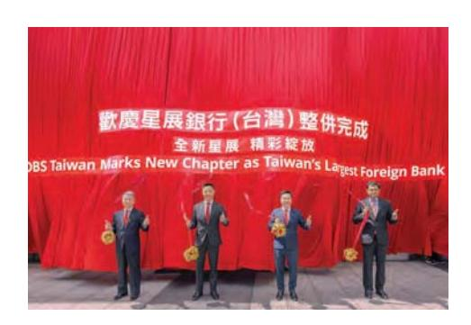

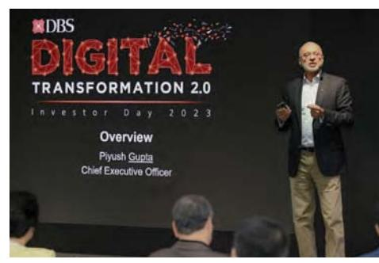

#### **Key industry citations:**

"Being a responsible corporate citizen is a core tenet of who DBS is, with the group having embedded corporate responsibility principles in its group-level sustainability strategy. This year, Euromoney recognises the efforts of DBS to elevate its own corporate responsibility framework and set regional standards for its peers, while influencing its clients and other stakeholders on good governance."

**World's Best Bank for Corporate Responsibility, Euromoney** 

"With the rise in inflation and bank runs, bank soundness remains the cornerstone of worldwide commerce during these stressful times. With a strong capital base, Singapore's DBS has ranked Safest Bank in Asia for the 15th year."

Safest Bank in Asia, Global Finance

"The Singapore bank has strengthened its proposition to serve under-represented communities and aligned its own lending operations to make an impact. Many new customers view DBS as the embodiment of local commercial banking strength and trust it with their money."

**Asia's Best Bank for** Wealth Management, Euromoney

From our inception as the Development Bank of Singapore, DBS has always been guided by a strong sense of purpose. Our commitment to managing business in a balanced and responsible manner was recognised as DBS received the global award for "World's Best Bank for Corporate Responsibility" by Euromoney. We were also recognised for our stewardship excellence by Stewardship Asia for the second time. In addition, the Securities Investors Association (Singapore) acknowledged our efforts as a purpose-driven bank with the "Singapore Corporate Sustainability" award.

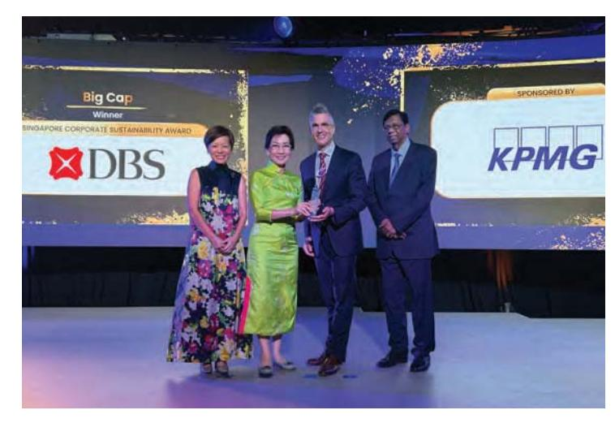

Helge Muenkel, DBS Chief Sustainability Officer (second from right), receiving the 'Singapore Corporate Sustainability' award from Minister for Sustainability and the Environment, Grace Fu.

## Who we are

DBS is one of Asia's leading banks, operating in the most dynamic region of the world. We are focused on leveraging digital technology to reimagine banking to provide our customers a full range of services in consumer banking, wealth management and institutional banking. We also see a purpose beyond banking and are committed to supporting our customers, employees and the community towards a sustainable future.

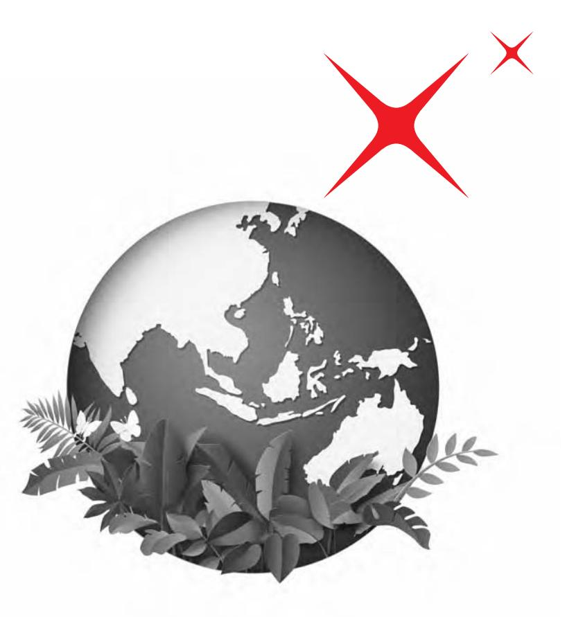

#### **Business Highlights**

SGD 20.2 billion

SGD 10.3 billion

**Total assets** 

SGD 739 billion

**Return on equity** 

280,000

Management customers

#### **Sustainability Highlights**

**Facilitated** 

in FSG hand issuances where DBS was an active bookrunner

**Approved** 

unsecured loans totalling SGD 665 million to support the unmet working capital

needs of micro and small businesses

Committed up to

over 10 years to improve lives and livelihoods of the low-income and underprivileged

Subsidised

meals to help Singaporeans and residents cope with the rising cost of living

**Awarded** 

in grant funding to 24 SMEs and social enterprises through our DBS Foundation Business for Impact grant award

>200,000 hours

4 **DBS ANNUAL REPORT 2023** BUILDING A SUSTAINABLE ADVANTAGE **Board of Directors** 5

## **Board of Directors**

### **Highly-experienced**

More than two-thirds of the Board have deep expertise in the ȴ nancial sector, while the rest have extensive experience in other related industries.

### **Independent**

Majority of our Board comprise independent and non-executive directors.

#### **Diverse**

Good mix of nationalities, gender and backgrounds.

**The Board is committed to helping the Group achieve long-term success. The Board provides direction to management by setting the Group's strategy and overseeing**

**its implementation. It ensures risks and rewards are appropriately balanced.**

### **Award-winning**

Conferred the 'Singapore Corporate Governance Award' at the Investors' Choice Awards 2023, for excellence in corporate governance.

**Tham Sai Choy** Independent Director

**Bonghan Cho** Independent Director **Punita Lal** Independent Director **Anthony Lim** Independent Director

**Peter Seah** Non-Executive Chairman **Piyush Gupta** Chief Executive Oɝ cer **David Ho** Independent Director **Olivier Lim** Lead Independent Director **Chng Kai Fong** Non-Executive Director **Judy Lee** Independent Director

## **Group Management Committee**

**The Group Management Committee executes the strategy and long-term goals of the Group. It drives business performance and organisational synergies. It is also responsible for protecting and enhancing our brand and reputation.**

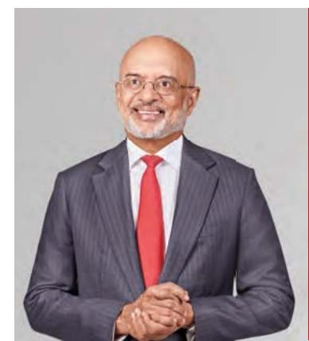

**Piyush Gupta\***  Chief Executive Oɝ cer

**Chng Sok Hui\***  Chief Financial Oɝ cer

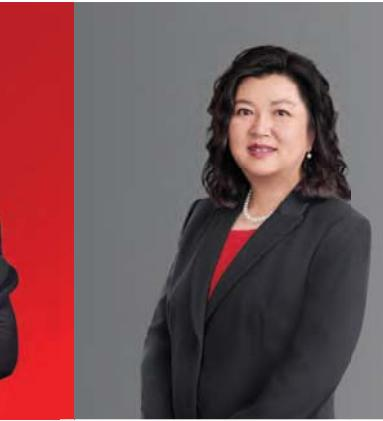

**Ginger Cheng** China

**Eng-Kwok Seat Moey**  Capital Markets

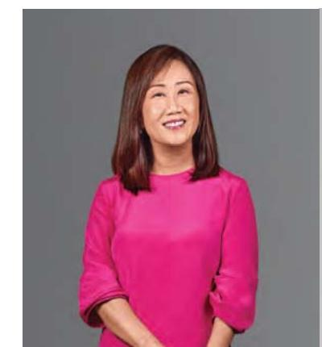

**Lee Yan Hong**  Human Resources

**Lim Chu Chong**  Indonesia

**Lim Him Chuan\*** Strategy, Transformation, Analytics & Research

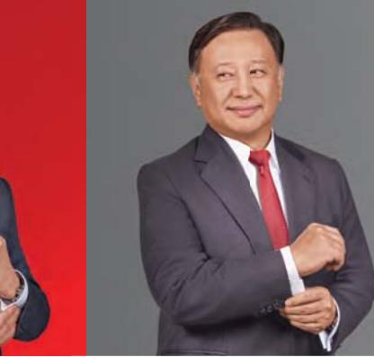

**Sim S Lim\*** Senior Advisor

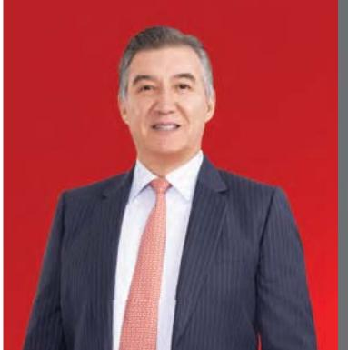

**Sebastian Paredes\***  Hong Kong & North Asia

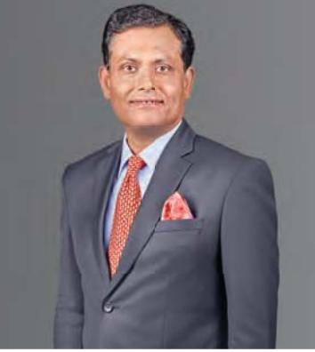

**Sanjoy Sen**  Consumer Banking

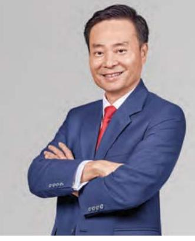

**Shee Tse Koon\*** Consumer Banking/ Wealth Management

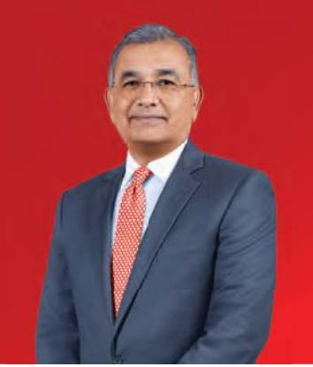

**Surojit Shome** India

**Group Management Committee members have more than 30 years of experience on average.**

**One in four of our Group Management Committee members are women.**

**Philip Fernandez**  Corporate Treasury

**Derrick Goh**  Audit

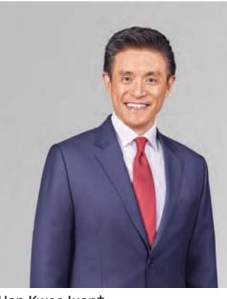

**Han Kwee Juan\*** Singapore & Acting Chief Information Oɝ cer

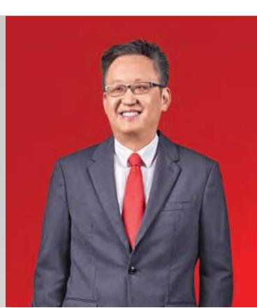

**Lam Chee Kin**  Legal & Compliance

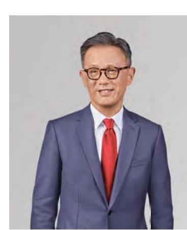

**Andrew Ng\***  Treasury Markets(1)

**Jimmy Ng\*** Operations

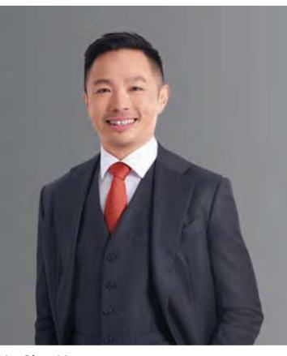

**Ng Sier Han**  Taiwan

**Karen Ngui** Strategic Marketing & Communications

**Soh Kian Tiong\*** Chief Risk Oɝ cer

**Tan Su Shan\*** Institutional Banking

*(1) Renamed Global Financial Markets with e ect from 1 March 2024 Members of the Group Executive Committee are denoted by \**

8 **DBS ANNUAL REPORT 2023** BUILDING A SUSTAINABLE ADVANTAGE **Letter from Chairman & CEO** 9

## **Letter from Chairman & CEO**

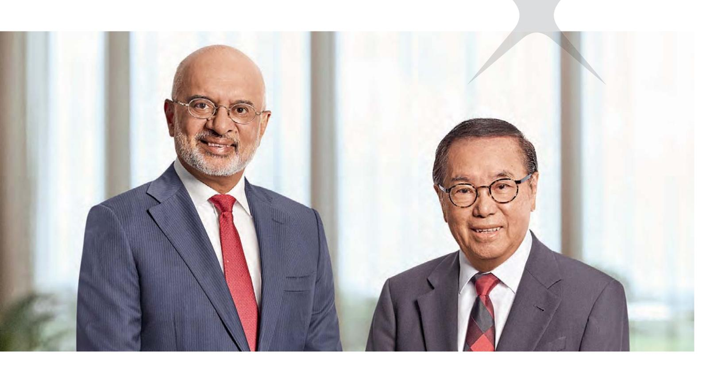

**We continued to reap beneȴ ts from our decade-long structural transformation, with net proȴ t and return on equity at record highs. We are rewarding shareholders, strengthening our technology resiliency to do better by customers, and increasing our support for vulnerable segments.** 

The global economy averted a hard landing in 2023. After hiking interest rates seven times in 2022, the Federal Reserve – in a bid to combat the highest inflation in generations – raised short-term borrowing costs by another four times to 5.25-5.5%, the highest level in 22 years. Central banks around the world followed suit.

Elevated interest rates dampened consumer and investment demand, and stymied global trade. US-China tensions, the ongoing Russia-Ukraine war, as well as the Israel-Hamas conflict, added to the uncertainty.

DBS' key markets Singapore and Hong Kong – being small, open economies – were impacted by slowing external demand. Singapore's economy grew 1.1% in 2023, down from 3.8% the year before. Hong Kong's economy did better – with advance estimates indicating that it expanded by 3.2% – though this was weaker than expected.

Against this backdrop, we delivered a solid financial performance, with net profit and return on equity at record highs. In a year marked by tumult in the US regional banking sector and the failure of Credit Suisse, we were named as Safest Bank in Asia by Global Finance for the 15th consecutive year. This is testament to DBS' resilient franchise, underpinned by a solid balance sheet and prudent risk management, which position

us well to be an important partner to our customers and the community.

#### **A record year**

For the year, DBS delivered record total income of SGD 20.2 billion, crossing the SGD 20 billion mark for the first time. Net profit rose 26% to an all-time high of SGD 10.3 billion. Return on equity (ROE), at 18.0%, broke all previous records.

Earnings were propelled by tailwinds from a rising interest rate environment, with net interest margin expanding 40 basis points to 2.15%. Non-interest income also recovered strongly, bolstered by wealth management fees, card fees and loanrelated fees. Our solid financial performance was not just a reflection of the macroeconomic environment, but also a result of the structural shifts made to our franchise in the last decade. In particular, our focus on digitalisation, cash management and wealth management broadened our lowcost deposit base, from which we benefitted in 2023. Meanwhile, we transformed DBS Private Bank to become one of the top three in Asia, compared to in 2010, when it was outside the top 20. Treasury Markets shifted from being a business which relied mostly on proprietary trading to being primarily a customer-focused business. Across the

**The challenges facing our world – from military conȵ icts to rapid technological change to the present climate crisis – are multifaceted and complex. To future-proof ourselves, we need to strengthen our existing competencies and invest in new capabilities, while being nimble enough to respond to any unexpected changes in the external environment. As we have done in the past, we will continue to build on our DNA as an innovation-led, purpose-driven bank to build a sustainable advantage.** 

franchise, asset quality remained resilient, which reflects improvements made to our credit processes and the use of data analytics and artificial intelligence.

Consumer Banking/ Wealth Management had a solid year, with total income up 35% to a record SGD 8.96 billion. In Singapore, we remained the market leader in deposits and mortgages. Compared to the previous year, an improving investment climate also encouraged more customers to convert their deposits into investments. Wealth management assets under management increased by 23% to SGD 365 billion.

Institutional Banking, which saw income rise 22% to a record SGD 9.36 billion, was buoyed by a sharp rise in cash management income. Our early investment in digital transaction capabilities continued to pay off, as we won over 1,000 cash management mandates in 2023. Income from Treasury Markets fell by 38% to SGD 725 million due to higher funding costs.

While we continue to watch macroeconomic and geopolitical events closely, our solid balance sheet with ample liquidity, prudent general allowance reserves and healthy capital ratios will provide us with strong buffers against uncertainties.

#### **Cementing our Asia franchise**

Even with a slowing China, Asia's structural growth story is very much intact. Asia's large, growing middle class; burgeoning wealth; massive infrastructure needs; as well as rising intra-Asia trade underpin its prospects. Through the inorganic transactions we did in the Covid-19 years, we have now reached inflection point in India and Taiwan in terms of scale.

In India, following the integration of Lakshmi Vilas Bank, we now have more than 520 branches in 350+ locations, and a complete suite of products for every market segment. Outside Singapore, we have the most complete platform in India. With a deep footprint in five southern Indian states, growing brand recognition, and a continued rollout of new products and partnerships, we are seeing payoff to the business. In 2023, the consumer banking business saw double-digit income growth by scaling and deepening partnerships with ecosystem players such as Bajaj Finance and Cred. We also leveraged our expanded customer franchise and footprint to increase market penetration of personal loans, gold loans, small business loans and insurance. Overall, our customer base grew 18%, while income and net profit rose 15% and 30% respectively.

In August, DBS completed the acquisition of Citigroup Inc.'s consumer banking business in Taiwan. With the transaction, DBS has become Taiwan's largest foreign bank by assets. DBS Taiwan's consumer business growth has been accelerated by at least 10 years, and annual revenue was propelled past the SGD 1.3 billion mark. Our consumer banking customers in Taiwan more than doubled to about 1.1 million. We also have clear market leadership in loans, deposits, cards and investments among foreign players in the market.

We continued to make important strides in China. Since its borders reopened in 2023, we have seen an uptick in China connectivity with Singapore and other ASEAN countries. To capture business opportunities from China, we launched a foreign direct investment desk in Singapore. Our "China plus one" strategy, supporting companies wanting to diversify their supply chains and operations, had good traction. We also continued to make headway in growing our Greater Bay Area (GBA) franchise, both in wealth management as well as in banking corporates in the electric vehicle, high-tech manufacturing and new economy industries. In early 2024, we upped our stake in Shenzhen Rural Commercial Bank (SRCB) from 13% to 16.69%. SRCB is a high-returns bank, in which we are the largest shareholder, and gives us a good footprint in the GBA.

## **SGD 20.2 billion**

#### **Total income**

Total income grew 22%, exceeding SGD 20 billion for the ȴ rst time.

## **SGD 10.3 billion Dividend**

#### **Net proȴ t**

Net proȴ t rose 26% to a record SGD 10.3 billion, as we beneȴ tted from higher interest rates and reaped the rewards of structural shifts made to our franchise in the last decade.

## **SGD 1.92**

The Board proposed a ȴ nal dividend of 54 cents per share, bringing the full-year ordinary dividend to SGD 1.92 per share, an increase of 42 cents from the previous year.

**1-for-10**

#### **Bonus issue**

The Board also proposed a bonus issue on the basis of one bonus share for every existing 10 ordinary shares held, which will increase the pace of capital returns to shareholders.

DBS ANNUAL REPORT 2023 | BUILDING A SUSTAINABLE ADVANTAGE **Letter from Chairman & CEO** 

#### Maturing new ways of working

To create a sustainable advantage, DBS continued to focus on three areas that are differentiating.

The first is the industrialisation of artificial intelligence (AI)/ machine learning (ML) and data analytics. Our use of Al/ ML became more broad-based in 2023, and delivered economic value of SGD 370 million, more than double that in 2022. The value created comprises incremental revenue from anticipating customers' needs and serving them better, losses averted from scams and fraud, and productivity gains. The bank also started experimenting with Generative AI to improve the way we work.

DBS' focus on Managing through Journeys (Mt|s) matured yet further. Mt|s bring together cross-functional squads guided by data-driven control towers, enabling us to be more agile in delivering new products, and responding to customer pain points and needs. In 2021, we had 25 customer journeys; this rose to 40+ in 2022 and increased to more than 60 in 2023. Through Mt/s, we see improved customer satisfaction, faster turnaround times and positive revenue impact.

Finally, we continued to make headway in growing our ecosystem partnerships, enabling us to scale customer acquisition especially in the large Asian markets.

#### **Enhancing our technology** resiliency and governance

Since 2014, DBS has been on a journey of digital transformation to make banking seamless and effortless so customers can "Live more, Bank less". Regrettably, we fell short in 2023 with several digital disruptions. Our review identified deficiencies and gaps in four main areas - change management,

system resiliency, incident management, and technology risk governance and oversight. To address these areas, a comprehensive technology resiliency roadmap has been known as the Technology Risk Management Uplift Programme – is chaired by the CEO.

To strengthen technology risk governance and oversight, the bank formed a new subcommittee of the Board Risk Management Committee called the BRMC Technology Risk Committee. We transferred the Technology Risk Management team to the Risk Management Group, reporting to the Chief Risk Officer, to enhance independent checks and balances. Additionally, we bolstered our Three Lines Model for better end-to-end risk management by enhancing executive level talent in the Technology Risk and Audit functions. Further details on how we have strengthened technology resiliency are outlined in the CIO Statement.

Despite the record 2023 earnings, to take accountability for the disruptions, the variable compensation for the CEO and other members of the Group Management Committee was collectively reduced by 21% from the previous year. The CEO took a deeper cut of 30%, which amounted to SGD 4.14 million.

We appreciate the patience of customers and shareholders as we progressively implement the various technology resiliency improvements. With the work we are doing, our assurance to customers is that they can expect to see concrete improvements in the near term and over time. In particular, apart from complying with regulatory requirements on system availability, we have committed to additional targets we are setting for ourselves on ensuring a high degree of service availability as well.

### Advancing the sustainability agenda laid out, which we started to action on from May 2023. Implementation of this roadmap –

In 2023, DBS continued to advance the sustainability agenda. In line with efforts to have net zero financed emissions by 2050, we actively built ecosystem partnerships to enable large-scale decarbonisation at pace. As an example, we partnered Sweden's H&M Group to launch a collaborative finance tool to accelerate the decarbonisation of supply chains in the apparel sector. In Hong Kong, DBS partnered CLP Power to support SMEs' low-carbon transition. Additionally, we signed ESG partnerships with a number of solutions providers such as Keppel Corp, Schneider Electric and Reset Carbon, among others.

As a purpose-driven bank, DBS has been active in giving back to the community. Amid increasingly challenging times for the economy, we intensified our social impact with a commitment of up to SGD 1 billion over the next 10 years to improve the lives and livelihoods of the low-income and underprivileged. In addition, the bank's workforce will commit over 1.5 million volunteer hours over the next decade to give back to society. In Singapore, we kicked off our giving with an SGD 30 million three-year partnership with the Ministry of Social and Family Development to support low-income families. Hundreds of DBS employees will be mobilised to befriend the families.

For DBS' commitment to sustainability and social impact, the bank was recognised by Euromoney as World's Best Bank for Corporate Responsibility. In 2023, we were also named to the Bloomberg Gender Equality Index for the sixth consecutive year and the FTSE4Good Developed Index for the seventh consecutive year.

#### **Board and** management changes

In April 2023, DBS appointed David Ho to the Boards of DBS Group Holdings and DBS Bank. David is no stranger to the bank, having served on the Board of DBS Bank (Hong Kong) since March 2019. He is Chairman and founder of Kiina Investment, a venture capital company that invests in technology startups. His extensive technology and China market experience complements the composition of the DBS Boards.

In January 2024, Ho Tian Yee assumed the Chairmanship of the DBS Foundation (DBSF) taking over from Euleen Goh, who stepped down after having served in the role since DBSF's inception in 2014. We would like to thank Fuleen for her invaluable contributions.

In addition, the Board proposed a bonus As part of our commitment to grooming talent from within, in April 2023, we made a

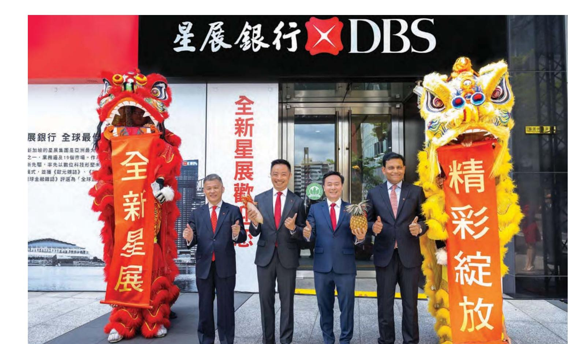

DBS completes the acquisition of Citigroup's consumer banking business in Taiwan, making it Taiwan's largest foreign bank by assets.

number of senior-level rotations following the retirement of Sim S. Lim from his role as Head of Consumer Banking/ Wealth Management. Shee Tse Koon, previously Country Head of DBS Singapore, took over Sim's role. Han Kwee Juan, previously Group Head of Strategy and Planning, assumed the role of Singapore Country Head. Lim Him Chuan, CEO of DBS Bank Taiwan, returned to Singapore to be Group Head of Strategy, Transformation, Analytics and Research, previously Strategy and Planning. Ng Sier Han, who was appointed Director of Integration (Taiwan) in April 2022, took over as DBS Bank Taiwan CEO. In addition to his role as CEO of DBS Bank (Hong Kong), Sebastian Paredes also assumed the newly-created role of Head of North Asia. The creation of this new role reflected our belief in the need for greater focus and oversight of a region that will only grow in importance in the coming years.

#### **Dividend and bonus issue**

Given the record profit and strong capital base, the Board has proposed a final dividend of 54 cents per share, bringing the full-year dividend to SGD 1.92 per share, an increase of 42 cents from the previous year.

issue on the basis of one bonus share for every existing 10 ordinary shares held.

The bonus shares will qualify for dividends starting with the first-quarter 2024 interim dividend and will increase the pace of capital returns to shareholders.

Barring unforeseen circumstances, the annualised ordinary dividend going forward will be SGD 2.16 per share over the enlarged share base, which represents a 24% increase from the SGD 1.92 per share for financial year 2023.

#### Conclusion

Macroeconomic and geopolitical uncertainties remain. The International Monetary Fund's latest projections are for the global economy to grow at 3.1% in 2024 and 3.2% in 2025. While this is an improvement from the previous forecast, it is below the historical (2000 - 2019) average of 3.8%. We also need to keep a close eye on geopolitics, particularly the impact of the Israel-Hamas conflict on oil prices.

Although we remain watchful, we take heart that our franchise continues to be resilient. Barring any unexpected shocks to the global economy, DBS' ROE in 2024 will be in the guided range of 15-17%.

As we look ahead, we will continue to invest in cementing our digital banking leadership, particularly strengthening our technology resiliency and investing in AI/ ML so we

can deliver banking that is seamless and personalised. We will also continue to step up efforts in advancing the sustainability agenda and executing on our net-zero commitments.

The challenges facing our world – from military conflicts to rapid technological change to the present climate crisis – are multifaceted and complex. To future-proof ourselves, we need to strengthen our existing competencies and invest in new capabilities, while being nimble enough to respond to any unexpected changes in the external environment. As we have done in the past, we will continue to build on our DNA as an innovation-led, purpose-driven bank to build a sustainable advantage.

**Peter Seah** Chairman **DBS Group Holdings** 

**Piyush Gupta Chief Executive Officer DBS Group Holdings** 

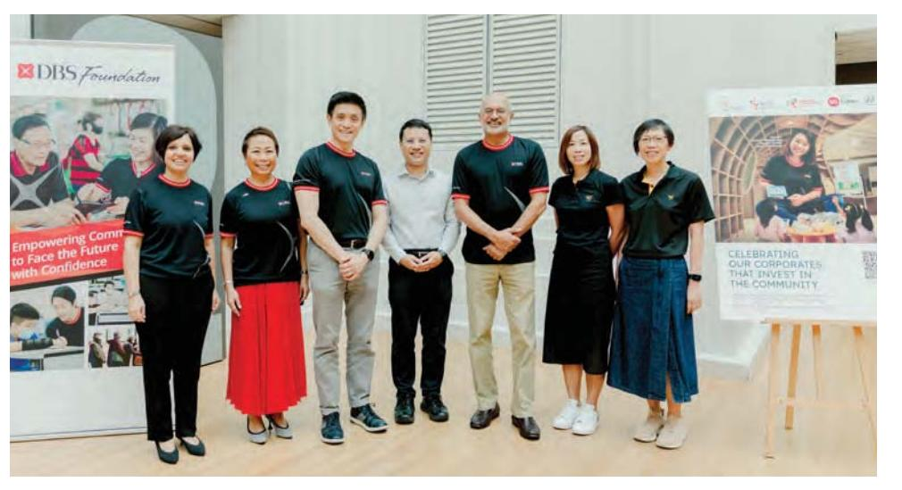

Singapore's National Development Minister Desmond Lee (centre) joins DBS executives at the launch of an SGD 30 million partnership between DBS Foundation and the Ministry of Social and Family Development to support low-income families.

## **Delivering Growth**

**DBS continued to entrench our leading position in Singapore, while being more deeply embedded in Asia's large economies. The inorganic transactions we did in China, India and Taiwan have strengthened our franchise in these markets, and will position the bank well as we look out into the next decade.**

#### **Becoming the largest foreign bank in Taiwan**

We completed the acquisition of Citigroup Inc.'s consumer banking business in Taiwan in August 2023. Following a successful integration, including the move of some 3,000 employees to DBS, we are now Taiwan's largest foreign bank by assets, accelerating our consumer business growth in the market by at least a decade. DBS Taiwan has clear market leadership in loans, deposits, cards and investments among foreign players, enabling us to provide greater value to customers.

#### **Continuing to show strong momentum in Greater Bay Area franchise**

We continued to make headway in growing our Greater Bay Area (GBA) franchise, both in wealth management as well as in banking corporates in the electric vehicle, high-tech manufacturing and new economy industries. We also upped our stake in Shenzhen Rural Commercial Bank (SRCB) from 13% to 16.69%. SRCB is a high-returns bank in which we are the largest shareholder, and gives us a good footprint in the GBA.

#### **Driving growth and development through sustainable ȴ nancing in Indonesia**

In Indonesia, we continued to support state-owned enterprises (SOEs) in line with the country's push towards sustainable development. As at end December 2023, we have disbursed around USD 1.3 billion of credit to SOEs, with about 11% of this going towards ESG-related initiatives.

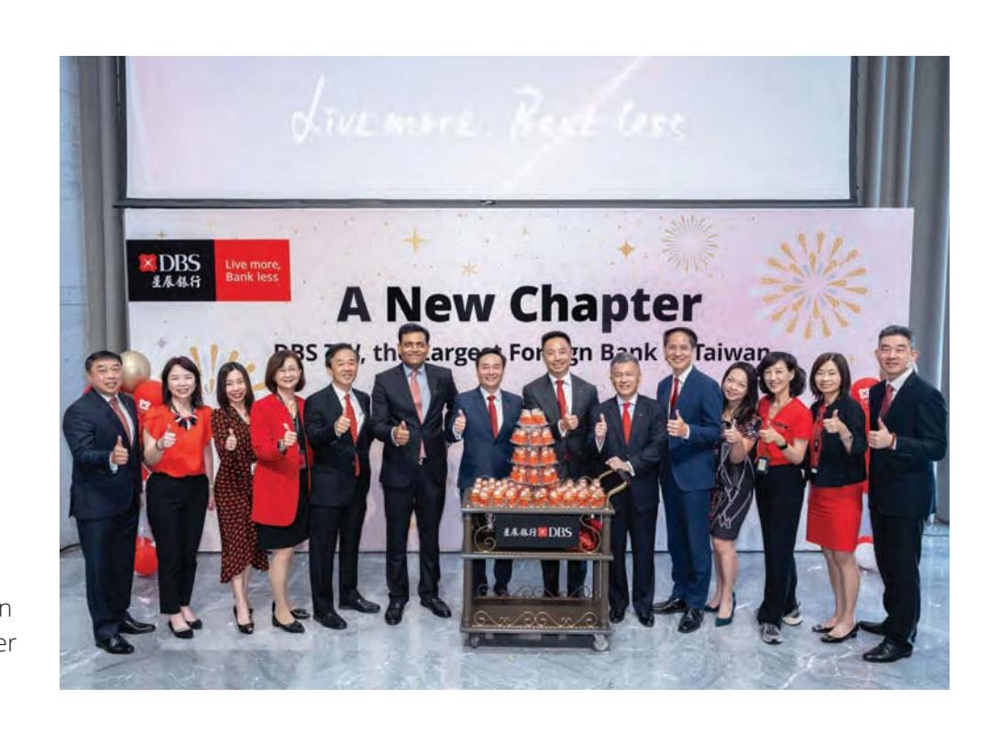

#### **Leading in digital bancassurance, deposits and mortgages in Singapore**

In Singapore, DBS continued to be the market leader across deposits and mortgages. Our customers have also improved their ȴ nancial health with our AI-powered digital ȴ nancial planning tool, which combines content with customised advisory nudges and recommended solutions that suit a customer's risk proȴ le. This has enabled us to become the market leader in digital bancassurance o erings.

#### **Developing a complete platform of services in India**

Following the integration of Lakshmi Vilas Bank, we have more than 520 branches in over 350 locations across India. In addition, we have a complete suite of products and services for every market segment. Outside of Singapore, we now have the most complete banking platform in India.

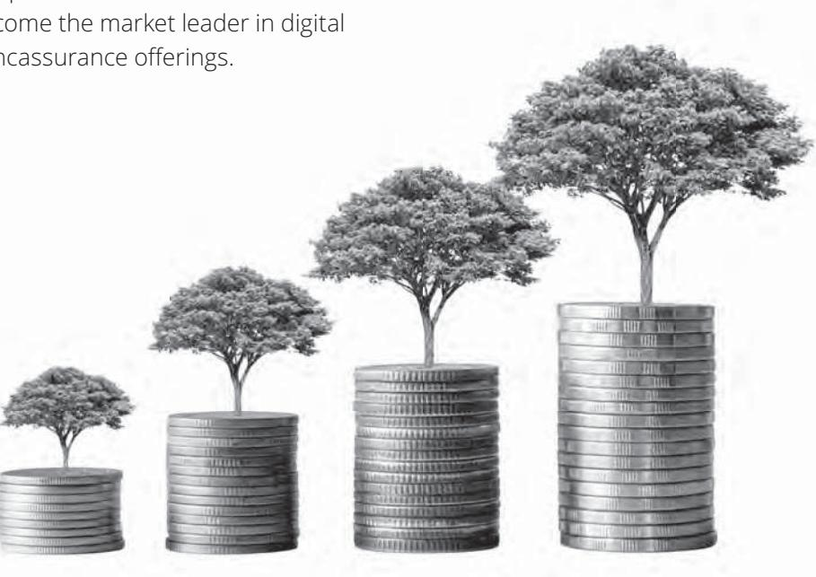

## **Creating Solutions**

**From improving the way we work to developing more innovative solutions, our aim is to help customers achieve their financial and business goals in an effective,** 

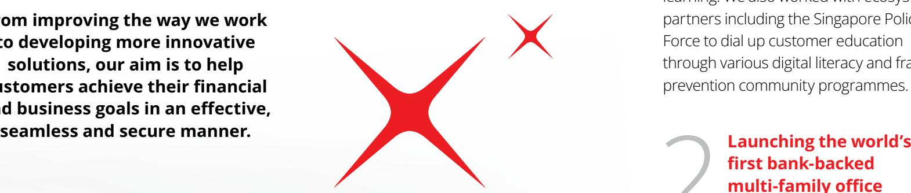

#### **Dialling up anti-scam measures and education to safeguard customers**

To protect our customers from new scam typologies, we rolled out new security measures that can thwart malware threats and enable customers to lock up their accounts. These measures add to existing safeguards, including surveillance and monitoring systems enabled by artificial intelligence and machine learning. We also worked with ecosystem partners including the Singapore Police Force to dial up customer education through various digital literacy and fraud prevention community programmes.

### **first bank-backed multi-family office VCC for wealth families**

Amid rising interest from ultra-high net worth families to set up family offices in Singapore, DBS Private Bank launched the world's first bank-backed multifamily office that leverages Singapore's Variable Capital Company structure. The programme offers clients the option of managing their wealth in Singapore without the need to establish a Single Family Office. Clients can also access a full suite of services including investment management, trade execution and custody solutions via a single integrated platform.

#### **Enabling digital trade transformation through technology and connectivity**

We continued to drive cross-border digital trade transformation across the region. In August, we successfully completed the first live interoperable electronic bills of lading transaction between Singapore and India. The transaction was implemented under the TradeTrust framework, an initiative by the Infocomm Media Development Authority and supported by Enterprise Singapore.

#### **Leveraging AI/ ML to help our clients make better investment decisions**

We continued to leverage data analytics and artificial intelligence and machine learning (AI/ ML) to deepen our engagement with customers. In 2023, we engaged 8.6 million customers across the region via personalised nudges, guiding them towards better investment and financial planning decisions.

#### **Forging ecosystem partnerships to expand our consumer finance business**

We expanded our consumer finance business by working with 11 ecosystem partners in various markets outside Singapore. They include Kredivo, JD.com and Cred. The volume of loans disbursed across these markets grew 118% to SGD 3.4 billion.

## **Driving regional payments through digitalisation**

Our digital capabilities enabled us to grow real-time payment volumes by more than 50% compared to 2022. Active commercialisation and regionalisation of new cash management products and services enabled us to capture over 1,000 new cash management mandates regionally.

## **Forging a Future**

**From our inception as the Development Bank of Singapore, DBS has always been guided by a strong sense of purpose. From combating climate change to giving back to the community, we are committed to doing our part to forge a more equitable, sustainable future.** 

#### **Enabling supply chain decarbonisation with innovative ȴ nancing models and partnerships**

We partnered apparel giant H&M Group to develop a ȴ rst-of-its-kind collaborative ȴ nance tool to accelerate supply chain decarbonisation in the apparel sector. Under the programme, suppliers gain direct access to ȴ nancing from DBS and technical support from sustainability consultant, Guidehouse, to make factory upgrades involving low-carbon technologies.

#### **Supporting SMEs in their transition to low-carbon business operations**

DBS became the ȴ rst bank in Hong Kong to o er SMEs banking service privileges and subsidies for the purchase of renewable energy certi ȴ cates from local utility provider CLP Power Hong Kong Limited, with the aim of helping to drive a lowcarbon future.

#### **Raising the bar on ESG investing – helping clients do well and do good**

We continued to help more clients do good while doing well by raising the bar on ESG investing. Currently, more than 50% of our private bank clients' investment assets are made up of "sustainable investments" (MSCI BBB-rating).

#### **Committing up to SGD 1 billion to support low-income and vulnerable segments**

We committed up to SGD 1 billion over the next 10 years to improve the lives and livelihoods of the low-income and underprivileged, fostering a more inclusive society. Our workforce will also contribute 1.5 million volunteer hours over the decade to this cause. This is a signi ȴ cant step-up in our e orts to make an enduring and meaningful di erence to those in need.

#### **Extending the popular hawker meal subsidy initiative**

To help our customers stretch their dollar, DBS subsidised 4.67 million hawker meals as at end December 2023. The bank provided a subsidy of up to SGD 3 for 100,000 hawker meals each Friday, easing cost-ofliving pressures for many low-income individuals and boosting hawker earnings. We have extended the initiative to July 2024, subsidising a total of 7.5 million meals over 18 months.

#### **Bolstering digital and ȴ nancial literacy for greater inclusion**

Through a strategic partnership between DBS Foundation and Infocomm Development Authority of Singapore, we ran about 400 digital and ȴ nancial literacy workshops, and helped more than 59,000 Singaporeans and residents to embrace digital learning.

18 **DBS ANNUAL REPORT 2023** BUILDING A SUSTAINABLE ADVANTAGE **CEO reȵ ections** 19

**Q1 In your view, what have been the key factors for DBS' ȴ nancial outperformance in recent years under various macro and geopolitical conditions, and can they be sustained?**

Two principal factors have contributed to our financial outperformance.

The first is our focus on Asia. Notwithstanding slowing China growth, Asia remains the fastest-growing region in the world. This has been fuelled by structural trends: a rising middle class, burgeoning affluent population, greater cross-border flows and massive demand for infrastructure investment. We have strategically shaped our business to capture these trends. For example, our wealth management franchise rides the wave of rising affluence while our treasury and transaction banking solutions have been scaled to capture growing trade and investment flows.

Additionally, having a footprint in Asia's three key axes of growth – Southeast Asia, South Asia and Greater China – through our focus on six key markets has been advantageous. We are able to intermediate intra-Asia trade and capital flows. Being anchored in Singapore and Hong Kong

positions us to serve the regional headquarters of western and Asian multinationals while our local franchises in China, Indonesia, India and Taiwan enable us to go deep by serving local businesses and consumers.

The diversification also enables us to navigate divergences in economic cycles. For many years, Greater China was a significant propellant of our growth as we rode on China enterprises' outbound expansion and Hong Kong's role in the mainland's development. Today, we are fortuitously placed to capture India's accelerating growth momentum.

The second factor is the digital transformation we embarked on a decade ago. Because of the long gestation period before the fruits become tangible – to our customers in terms of convenience and ease, to our staff in terms of how they work, and to our shareholders in terms of the concomitant financial impact – our head start has continued to set us apart as a bank, employer and investment.

Our digital platforms have made it easier for customers to carry out the full range of everyday transactions. As a result, customer engagement has deepened, translating into stickier relationships and greater wallet share, and ultimately faster revenue growth.

**14.0 11.5 9.9 7.5 11.4 11.5 10.6 10.1 11.7 18.0 15.0 12.5 9.1 13.2 12.1 9.7 10.1 11.2 SG peer average 4pp above peers DBS 2015 2016 2017 2018 2019 2020 2021 2022 2023 Return on equity (%)**

Digitalisation has enabled us to become market leaders in high-returns businesses such as wealth management. Meanwhile, our APIs (or pipes linking our systems with clients') have driven market share gains in cash management. We can also structure treasury products at speed and scale and with attractive pricing.

Technology has also improved the way our employees work and is central to our efforts to create a culture different from a traditional institution's. It has enabled data to be quickly sorted, packaged and shared among teams, making it instrumental in breaking down silos. Decisions can be made and implementation carried out expeditiously, giving us the agility akin to a startup's. Not constrained by organisational limitations, we are able to adopt the customer's perspective when creating products and services, resulting in a differentiated customer experience.

The institutionalisation of digitalisation into our franchise has also meant we can readily experiment with and assimilate new technologies that will ineluctably arise. We have infused artificial intelligence and machine learning (AI/ ML) into more than 350 use cases across the bank to drive productivity. We have expanded our business through ecosystem partnerships by using AI/ ML and data to identify the subset of existing customers in those platforms that we can suitably and profitably offer our products to. Ecosystem partnerships have helped double our Consumer Banking/ Wealth Management customer base over the past six years to 18 million today.

These dual characteristics of our franchise – unique geographical footprint and innate digital capabilities – are strategic advantages that are difficult to replicate. They are also the drivers of our performance. Their value has only become more apparent as interest rates rose. The record ROE we achieved in 2023 is one of the highest among developed market banks and six percentage points above the last time when interest rates and credit costs were at similar levels. We believe that the franchise we have developed will enable us to continue outperforming peers into the future.

**Q2 2023 was the year of Gen AI and the use of AI will proliferate even more greatly in the years to come. It is also a big focus area for DBS. What excites you most about the space, and what about it keeps you up at night?**

AI and Gen AI are game changers, and we will see significant developments in the next five years that will fundamentally shape the way we work. The use of AI is not new to DBS, and we have been working with AI for over a decade now.

In the past five years, we have scaled our AI capabilities to make it pervasive across all parts of the bank, delivering tangible outcomes of SGD 370 million for DBS in 2023, more than double that of the previous year. We are confident of growing the economic impact of our AI initiatives in the coming years, affording us greater flexibility to navigate through business and economic cycles.

What's different with the emergence of Gen AI is that we now have the ability to process vast amounts of unstructured data. Coupled with our existing capabilities around structured data, we are well placed to sharpen the outcomes of our current AI use cases while enabling a new class of data-driven use cases.

In our early experiments with Gen AI, we came up with over 240 ideas, 15 of which are progressing from experimentation to production. These are broadly focused on three areas of opportunity:

- **•** Driving productivity and efficiency gains by removing toil in the way we work
- **•** Creating value through better customer engagement and new customer propositions
- **•** Creating positive impact to our business model by potentially opening new segments and markets.

Our immediate focus has been on the first category. Gen AI is already augmenting the way we work by handling routine tasks, allowing employees to focus on more strategic and value-added activities, such as building deeper customer relationships.

The results are promising. In our corporate call centre, we are using Gen AI for call transcription, summarisation, service request generation and knowledge base lookup, reducing the amount of time needed to handle customer requests while improving our response quality.

In Institutional Banking, we tapped Gen AI to help reduce the time needed for relationship managers to fill in the ESG risk questionnaire by summarising company reports and prepopulating relevant fields.

Gen AI assisted software development is showing positive results. Through Gen AI code and tests generation, we expect significant time saving in software development.

The launch of "DBS-GPT", our employee-facing version of ChatGPT, is helping employees with content generation and writing tasks in a secure environment. We are also developing an enterprise knowledge base that will give our employees the ability to search and synthesise unstructured information for various tasks.

As with any new technology, the advent of Gen AI brings about a natural sense of curiosity and adjustment for our employees. But change also presents exciting opportunities

for growth and innovation. We are determined to bring our employees along by focusing on the synergy between human and AI capabilities to leverage Gen AI as a co-pilot.

While Gen AI has tremendous potential, there are emergent risks, especially in areas such as data confidentiality, Gen AI hallucination/ bias/ toxicity and cybersecurity. At DBS, we will continue to enhance our existing AI/ ML risk framework to cater for such risks.

We have also set up a Responsible AI taskforce comprising senior leaders from multiple disciplines to assess and address these risks prior to any use case being deployed in production. Our existing responsible data use framework for AI continues to provide us with guardrails as we look at new use cases. This framework, called PURE, ensures that our use of data remains Purposeful, Unsurprising, Respectful and Explainable for customers. In addition, we are building a technology infrastructure to enable the adoption of Large Language Models in a secure manner.

Concurrently we worked with the Monetary Authority of Singapore as part of the MindForge Consortium to develop a whitepaper that examines the risks and opportunities of Gen AI for the financial sector.

We are at a historic cusp in time, and we will all need to navigate how Gen AI figures in the way we live and work. On DBS' end, we have in place a governance structure that will help us balance reaping the benefits of Gen AI while managing the risks of a still-emerging field.

#### **Q3 DBS often says that being purpose-driven is part of its DNA. How does this translate into the way the bank operates its business or interacts with society?**

DBS was formed as the Development Bank of Singapore in 1968 to help finance the nation's industrialisation, so a deep sense of purpose is strongly ingrained in our ethos. This shows up in a very clear approach – we are not just here to make profits in any way possible; we are here because we have a meaningful role to play in the economy and society, and our actions must always reflect this reality.

Banking and finance have had a very significant role to play over the ages – helping individuals save for the future, buy a home or grow their wealth. Banks also help companies grow by financing trade and enabling working capital efficiencies. Even though bankers have gone off course from time to time, the most sustainable banking models have been built on doing real things for real people. In recognition of this, our purpose at DBS is to drive amazing solutions and experiences for our customers, to make banking joyful and create a more sustainable bank.

In formulating our business strategies, we always start with the question "What value are we creating? For whom?". In most cases, we can earn a fair return while creating such value. In some instances, we compromise on short-term returns for the greater good. Our dealings with migrant labour in Singapore are a case in point. From pure economics, one could easily make the case that we should pass on this unprofitable segment. However, recognising our role as the people's bank, we chose to grapple with the problem, and figure ways to drive down the cost to serve and make the business viable.

While our strategies will continue to evolve, going forward, as part of our business, we will see what we can do to address four wicked problems besetting our world. These are: (i) climate change (ii) demographic shifts, particularly ageing societies (iii) rising income inequality and the growing social divide, and (iv) issues of trust. These issues are mammoth; however, the private sector – with its resources and talent pool – has an active role to play in tackling them in concert with governments and civil society.bb

A second agenda that is informed by being purpose-driven is the need to uphold the trust our customers place in us. Various customer surveys indicate that being financially strong, as well as providing banking that is secure and reliable, are key to being trusted. DBS' robust franchise, underpinned by a solid balance sheet and prudent risk management, has enabled us to be among the safest banks globally. We also take seriously the need to protect customers from fast-evolving scam and fraud tactics. As an example, in 2023, we rolled out new security measures to thwart malware threats and enable customers to lock up their accounts.

Third, by creating impact beyond banking. DBS established the SGD 50 million DBS Foundation in support of social entrepreneurship in 2014; in 2022, the bank announced that it had set aside an additional SGD 100 million to create a new Community Impact Chapter and support other philanthropic efforts. In 2023, the bank further committed up to SGD 1 billion over the next 10 years to improve the lives and livelihoods of the low-income and underprivileged.

Fundamentally, DBS' ethos drives us to do what is right by our clients, employees, shareholders and society. We are committed to continuing to do well by doing good as we build a sustainable franchise.

**Piyush Gupta Chief Executive Officer DBS Group Holdings**

20 **DBS ANNUAL REPORT 2023** BUILDING A SUSTAINABLE ADVANTAGE **CFO statement** 21

**We achieved a record performance for the third consecutive year with total income, net proȴ t and ROE all at new highs. The results reȵ ect the fruits of our digital transformation.**

#### **Digitally-transformed franchise with structurally higher ROE**

We achieved a record performance for a third consecutive year in 2023 as net profit rose 26% to SGD 10.3 billion. Total income grew 22% to cross SGD 20 billion for the first time from a higher net interest margin, a rebound in fee income and record treasury customer sales. The underlying cost-income ratio improved to 39%. Asset quality continued to be resilient with specific allowances remaining low at 11 basis points of loans.

Notably, return on equity (ROE) reached a new high of 18%, significantly above previous years and placing us among the world's best performing banks. The ROE was six percentage points above 2006 when Fed rates were last above 5% and credit conditions similarly benign, reflecting structural improvements from the franchise and digital transformations we carried out over the past decade. At the same time, our ROE advantage over peers also widened.

At our Digital Investor Day in May 2023, we highlighted three ways that our digital transformation had boosted ROE.

First, it strengthened our current and savings account (Casa) franchise by improving our standing as the primary bank for retail and corporate customers. During the quantitative easing of 2020-21, our Casa deposits increased by 60% or SGD 143 billion to SGD 381 billion, faster than the industry. More than half of this increase was in foreign currencies, enabling us to grow foreign currency loans with greater profitability.

Despite industry-wide Casa outflows since mid-2022 due to rising interest rates, total Casa deposits at end-2023 were SGD 48 billion higher than at end-2019. Our SGD and foreign currency Casa ratios stood at 86% and 35% in 2023 compared to 69% and 21% in 2006.

Second, technology and data enabled us to gain wallet share in fee income from better customer targeting and engagement. Since 2014, our fee income has grown at a compounded annual growth rate of 6%. This was significantly faster than peers, which continued to be the case in 2023. We achieved a stronger recovery in wealth management fees following an industry-wide decline in 2022 when interest rates rose and geopolitical tensions flared. Net new money inflows, which had more than doubled in 2022 compared to the average of preceding years, were sustained in 2023 at SGD 24 billion. As risk appetite returned in 2023, the ease of using our digital platforms acted as an additional spur for customers in converting their cash assets under management (AUM) to investments, boosting fee income growth.

Third, credit costs were lowered as we used data analytics and artificial intelligence for early warning and portfolio management. Up until 2018, our credit costs had tended to be above the peer average. Since then, they have been consistently lower.

These improvements, which had been masked by low interest rates, became apparent in 2022 and more fully in 2023 as interest rates rose. The successful integration of Lakshmi Vilas Bank (LVB) in 2021 and Citigroup Inc.'s consumer banking business in Taiwan (Citi

Consumer Taiwan) in 2023, significantly expanded our footprints in India and Taiwan, providing a solid foundation for improving their profitability. our fo profitability

We believe these initiatives will enable us to sustain medium-term ROE at 15-17% after assuming more normalised interest rates and credit conditions. these sustain mediummore n conditions

#### **Record performance in 2023 perf**

The group's net interest income grew 25% to SGD 13.6 billion as full-year net interest margin expanded 40 basis points to 2.15%. Significantly, after an increase of 62 basis points in the four quarters of 2022, quarterly net interest margin continued to rise in the first three quarters of 2023, deviating from peers, before easing in the fourth quarter. The improvement was due to the repricing of floating-rate assets as well as a portion of fixed-rate assets. Deposit costs also increased, but at a slower rate as Casa outflows eased during the year. billio expande afte fou marg qu befo imp of float

Net interest income for the commercial book, which excluded Treasury Markets, rose by a faster 33% while its net interest margin increased 65 basis points to 2.76%. Higher funding costs and accounting asymmetry resulted in a bigger drag in Treasury Markets' net interest income as interest rates rose. The drag was partially offset by higher gains in Treasury Markets non-interest income.

Loans were little changed at SGD 416 billion. Excluding Citi Consumer Taiwan, which added SGD 10 billion, underlying loans fell 1% or SGD 4 billion.

Trade loans declined 8% or SGD 3 billion, accounting for most of the full-year decline in group loans, due to lower activity and unattractive pricing.

Non-trade corporate loans were stable at SGD 246 billion. Although the loan pipeline was healthy, rising interest rates resulted in higher repayments from corporates that had spare cash on hand. By geography, growth in Singapore and India was offset by a decline in Greater China, where the greatest repayments occurred due to the significantly lower interest rates in the mainland.

Housing loans were little changed as loan disbursements were offset by repayments. Disbursements were lower as new bookings declined from the previous year in line with market transactions after a new round of cooling measures in April 2023.

Other consumer loans declined 2% or SGD 1 billion as wealth management customers repaid loans in a high interest rate environment.

Deposits rose 3% to SGD 535 billion. Excluding Citi Consumer Taiwan, which added SGD 12 billion, underlying deposits were stable. Casa outflows decelerated compared to the previous year and were replaced by fixed deposits. Liquidity remained ample, with liquidity coverage ratio of 144% and net stable funding ratio of 118% well above regulatory requirements.

Net fee income grew 9% to SGD 3.38 billion. Card fees grew 22% to SGD 1.04 billion, crossing SGD 1 billion for the first time. Card spending reached a third consecutive record with travel spending surpassing prepandemic levels. The consolidation of Citi Consumer Taiwan also contributed to the growth in card fees.

Wealth management fees rose 13% to SGD 1.51 billion, reflecting strong net new money inflows, a shift from deposits to investments and bancassurance as risk appetite returned, and contributions from Citi Consumer Taiwan.

Loan-related fees grew 21% to SGD 554 million. Investment banking fees increased 3% to SGD 125 million from higher debt and equity capital market activities. Transaction service fees fell 4% from lower trade finance and brokerage volumes.

Other non-interest income rose 28% to SGD 3.15 billion. Treasury customer sales reached a record while Treasury Markets non-interest income was also higher.

By business unit, Consumer Banking/ Wealth Management income rose 35% to SGD 8.96 billion from higher interest rates and growth in wealth management product sales, cards, and loan fees. Wealth Management income increased to a record, with AUM growing 23% to a new high of SGD 365 billion, underpinned by strong net new money inflows and the consolidation of Citi Consumer Taiwan. Institutional Banking income grew 22% to SGD 9.36 billion as cash management income rose 73% from higher interest rates. Treasury Markets income declined 38% to SGD 725 million due to higher funding costs.

By region, Singapore income rose 26% to SGD 13.4 billion. Higher interest rates boosted net interest margin and more than offset a decline in loans. Non-interest income improved from higher treasury customer sales and growth in cards and wealth management fees. Hong Kong income increased 10% to SGD 3.21 billion, led by an expansion in net interest margin while non-interest income was little changed. Rest of Greater China benefited from the consolidation of Citi Consumer Taiwan as income grew 20% to SGD 1.40 billion with double-digit percentage increases in net interest income and non-interest income.

Expenses rose 14% to SGD 8.06 billion led by an increase in staff costs from salary increments and a higher headcount.

Excluding Citi Consumer Taiwan and nonrecurring technology and other costs, expenses rose 10% and the underlying costincome ratio was 39%.

Profit before allowances grew 29% to a record SGD 12.1 billion.

#### **Balance sheet remains strong**

Asset quality remained resilient throughout the year. Non-performing assets were little changed at SGD 5.06 billion and the nonperforming loans (NPL) ratio was unchanged at 1.1%. New non-performing asset formation remained low and was more than offset by repayments and write-offs. Specific allowances amounted to 11 basis points of loans or SGD 512 million, slightly above the eight basis points a year ago and remaining below the cycle average. General allowances of SGD 78 million were taken compared to a write-back of SGD 98 million in the previous year.

Total allowance reserves amounted to SGD 6.48 billion, comprising general allowance reserves of SGD 3.90 billion and specific allowance reserves of SGD 2.58 billion. Allowance coverage was at 128% and at 226% when collateral was considered.

Capital remained strong, with the Common Equity Tier 1 ratio unchanged at 14.6%. The leverage ratio of 6.6% was more than twice the regulatory requirement of 3%.

#### **Strengthened Taiwan franchise**

Citi Consumer Taiwan was consolidated on 12 August 2023, making DBS the largest foreign bank in Taiwan by assets with leading positions in deposits, cards and investments. The consolidation added SGD 10 billion to loans, SGD 12 billion to deposits and SGD 20 billion to investment assets under management. It also boosted DBS Taiwan's credit card accounts by five-fold to over 3 million.

#### **Total shareholder returns boosted by higher dividends**

Total shareholder returns for the calendar year amounted to 5%. We paid out a dividend of SGD 2.30 per share during the calendar year (consisting of fourth-quarter 2022 and first-quarter 2023 ordinary dividend of 42 cents each, second- and third-quarter 2023 ordinary dividend of 48 cents each, as well as a 2022 special dividend of 50 cents). The dividend partially offset a moderate share price decline of 2%.

#### **Bonus issue and further increase in dividend**

The Board proposed a final dividend of 54 cents per share, an increase of six cents

from the previous payout. This brings the ordinary dividend for the financial year to SGD 1.92 per share, an increase of 42 cents or 28% from the previous full year.

In addition, the Board proposed a bonus issue on the basis of one bonus share for every existing 10 ordinary shares held. The bonus shares will qualify for dividend payments starting with the first-quarter 2024 interim dividend, increasing the pace of capital returns to shareholders. Barring unforeseen circumstances, the annualised ordinary dividend going forward will be SGD 2.16 per share over the enlarged share base, which is an increase of 24% from 2023.

#### **Outlook**

At time of writing, the macroeconomic outlook has become more settled after an extended period of uncertainty. There is consensus that interest rates have peaked and the debate is on the pace of reductions. The International Monetary Fund recently raised its forecast for global growth for 2024 from 2.9% previously to 3.1%, saying it saw a higher chance for a soft landing. With the greater clarity, consumer and investor confidence have also improved.

The better outlook will support our business prospects in the coming year. We expect net interest income to be maintained around 2023 levels as loan growth offsets the effects of a slightly lower net interest margin. Fee income should grow by doubledigit percentage terms. Wealth management should benefit from stronger investor confidence and the strong net new money inflows we have had, while cards should benefit from further growth in spending and travel. All these income streams will also benefit from the full-period impact of the Citi Consumer Taiwan consolidation.

Although asset quality remains resilient, we are assuming credit costs will begin to normalise with specific allowances moving towards 17-20 basis points of loans. In the event that credit costs deteriorate beyond our assumptions, we have the capacity to release general allowance overlays that had been prudently built up in previous years.

If these forecasts hold, we expect full-year earnings for the coming year to be around the record levels in 2023, with ROE within our medium-term range of 15-17%.

**Chng Sok Hui Chief Financial Officer DBS Group Holdings**

#### (A) Digitalisation

In 2023, we continued to make significant progress in digital transformation. For the consumer and SME businesses in Singapore and Hong Kong, the proportion of digital customers exceeded the 60% target set in 2017, reaching 62%. Income per customer and ROE for the digital segment continued to outperform that of traditional customers, affirming the value of digitalisation in enhancing customer engagement and operational efficiency. Digital customers generated three times the income on average than traditional ones, reflecting more diverse product holdings and more transactions. Having achieved our digital adoption target, focus shifted to intensifying efforts to capture larger wallet shares. At the investor day in May, we outlined our approach, including the use of data and AI/ ML models to generate hyper-personalised nudges, to drive increased product adoption and revenue per customer.

Beyond the consumer and SME businesses in Singapore and Hong Kong, digital transformation became more pervasive across the organisation. At the investor day, we highlighted the expansion of digitalisation efforts in recent years to wealth management, transaction services and treasury customer sales across the region. The percentage of group income from these high-ROE segments rose from 40% in 2017 to 46% in 2022, and further increased to 52% in 2023, with income from wealth management, transaction services and treasury customer sales all achieving record levels. Our digital efforts in these areas, such as leveraging data and Al/ ML to provide relationship managers with insights to better engage their customers, and investments in API and core processing capabilities to seize opportunities in low-value real-time payments, supply chain financing and treasury customer solutions, advanced our goal of becoming the primary bank for an increasing number of wealth and business clients. This contributed to accelerated growth in foreign currency deposits and improved cross-sell into fee and treasury customer income-based activities.

#### Digital share of customers (%)

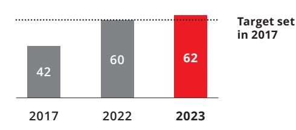

#### Income multiple of digital vs. traditional

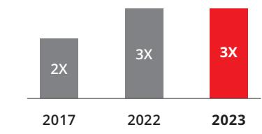

#### **Growth in high-ROE businesses**

#### Income (as % of group)

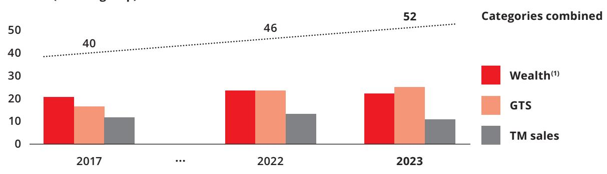

#### (1) Wealth income comprising Treasures, TPC and PB

In our growth markets of India, Indonesia, China and Taiwan, we progressed in addressing historical sub-scale challenges by leveraging digitalisation. At the investor day, we explained our phygital approach in these markets, and outlined our aim to grow a high-quality base of consumer and SME customers and improve ROEs with increased scale. We effectively extended our reach through ecosystem partnerships by leveraging our extensive API and connectivity capabilities. We also scaled our business through inorganic acquisitions. In Taiwan, we acquired Citi Consumer Taiwan which positioned us as the largest foreign bank in Taiwan by assets with leading positions in deposits, cards and investments. The acquisition of LVB in 2020 was a similar move to boost scale. LVB significantly expanded our network and customer base in India, providing a scaled platform to overlay our digital banking capabilities. Since 2017, the cumulative growth in customers in our four growth markets, including from ecosystem partnerships and acquisitions, amounted to about eight million. During the same period, total income from these markets grew 84% while net profits surged by almost five-fold.

#### (B) Business unit performance

Consumer Banking/ Wealth Management total income grew 35% to SGD 8.96 billion. Net interest income rose 45% to SGD 6.2 billion from a higher net interest margin and growth in loan and deposit volumes. Non-interest income grew 16% to SGD 2.76 billion on higher investment product, bancassurance, card, and loan fees. Expenses increased 16% to SGD 4.41 billion. Total allowances rose 71% to SGD 270 million due mainly to higher specific provisions. Profit before tax increased by 59% to SGD 4.28 billion.

Institutional Banking total income rose 22% to SGD 9.36 billion, driven by stronger cash management income, offset by lower trade finance income. Expenses increased 10% to SGD 2.49 billion. Total allowances rose to SGD 88 million from a writeback of SGD 204 million a year ago due to a lower writeback from general allowances. Profit before tax rose 20% to SGD 6.79 billion.

Treasury Markets total income decreased 38% to SGD 725 million mainly due to lower contributions from interest rate, credit and foreign exchange activities, partially offset by higher income from equity derivatives activities. Expenses increased 2% to SGD 630 million from higher business-related expenses. Profit before tax fell 85% to SGD 87 million.

The Others segment encompasses the results of corporate decisions that are not attributed to business segments. It includes earnings on capital deployed into high quality assets, earnings from non-core asset sales and certain other head office items such as centrally raised allowances. DBS Vickers is also included in this segment.

|                                                | Commercial book                        |                          |        |                     |        |
|------------------------------------------------|----------------------------------------|--------------------------|--------|---------------------|--------|
|                                                | Consumer king/ Wealth Management | Institutional Banking | Others | Treasury Markets | Total  |
| ear 2023                                       |                                        |                          |        |                     |        |
| Net interest income                            | 6,195                                  | 7,153                    | 938    | (644)               | 13,642 |
| Net fee and commission incom                   | ne 2,004                               | 1,370                    | 10     | _                   | 3,384  |
| Other non-interest income                      | 758                                    | 834                      | 193    | 1,369               | 3,154  |
| otal income                                    | 8,957                                  | 9,357                    | 1,141  | 725                 | 20,180 |
| Expenses (1)                        | 4,412                                  | 2,489                    | 525    | 630                 | 8,056  |
| Amortisation of intangible asse                | ets –                                  | -                        | 9      | -                   | 9      |
| Allowances for credit and other losses         | 270                                    | 88                       | 217    | 15                  | 590    |
| Share of profits/ losses of associates and JVs | -                                      | 7                        | 200    | 7                   | 214    |
| Profit before tax                              | 4,275                                  | 6,787                    | 590    | 87                  | 11,739 |
| rear 2022                                      |                                        |                          |        |                     |        |
| Net interest income                            | 4,270                                  | 5,569                    | 880    | 222                 | 10,941 |
| Net fee and commission incom                   | ne 1,783                               | 1,293                    | 15     | _                   | 3,091  |
| Other non-interest income                      | 601                                    | 826                      | 91     | 952                 | 2,470  |
| otal income                                    | 6,654                                  | 7,688                    | 986    | 1,174               | 16,502 |
| expenses                                       | 3,803                                  | 2,254                    | 414    | 619                 | 7,090  |
| Amortisation of intangible asse                | ets –                                  | -                        | -      | -                   | -      |
| Allowances for credit and other losses         | 158                                    | (204)                    | 293    | (10)                | 237    |
| Share of profits/ losses of associates and JVs | -                                      | -                        | 203    | 4                   | 207    |
| Profit before tax                              | 2,693                                  | 5,638                    | 482    | 569                 | 9,382  |
|                                                | 2,693                                  | 5,638                    | 482    | 569                 | )      |

(1) Excludes one-time items

#### (C) Net interest income

Commercial book net interest income, which excludes Treasury Markets, rose 33% to SGD 14.3 billion, driven by a 65-basispoint expansion in net interest margin to 2.76%. Yields on loans and other interest-bearing assets repriced higher with interest rates. Although deposit costs also rose, the pace was slower compared to asset yields.

The growth in commercial book net interest income was moderated by a decline in Treasury Markets net interest income.

Treasury Markets faced higher funding costs for its operations as interest rates rose. The drag on its net interest income was partially offset by gains in the non-interest income line.

Overall net interest income grew 25% to SGD 13.6 billion.

Gross loans increased 1% or SGD 6 billion in constant-currency terms to SGD 422 billion. The consolidation of Citi Consumer Taiwan added SGD 10 billion to loans, more than offsetting a SGD 3 billion decline in trade loans resulting from lower activity and unattractive pricing. Non-trade corporate loans were stable. Despite a healthy loan pipeline, rising interest rates led to higher repayments. Additionally, there was a shift in China corporate borrowing to cheaper options onshore in the first half. Housing loans were little changed, with a SGD 1 billion growth in the fourth quarter offsetting a decline in the first nine months. Other consumer loans fell SGD 1 billion as wealth management customers repaid loans in a high interest rate environment.

Deposits rose 3% or SGD 13 billion in constant-currency terms to SGD 535 billion. Citi Consumer Taiwan contributed SGD 12 billion, while underlying deposits were stable. Casa outflows decelerated compared to the previous year and were replaced by fixed deposits.

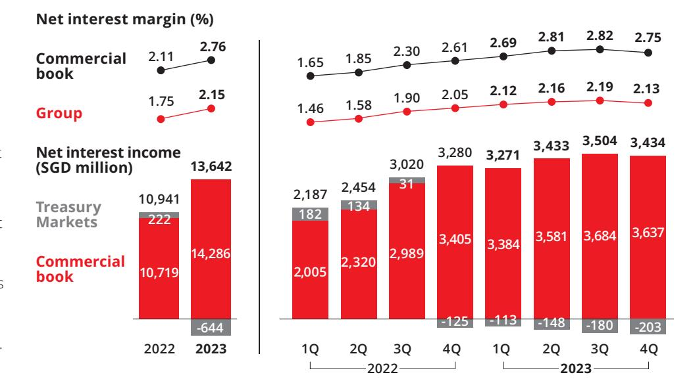

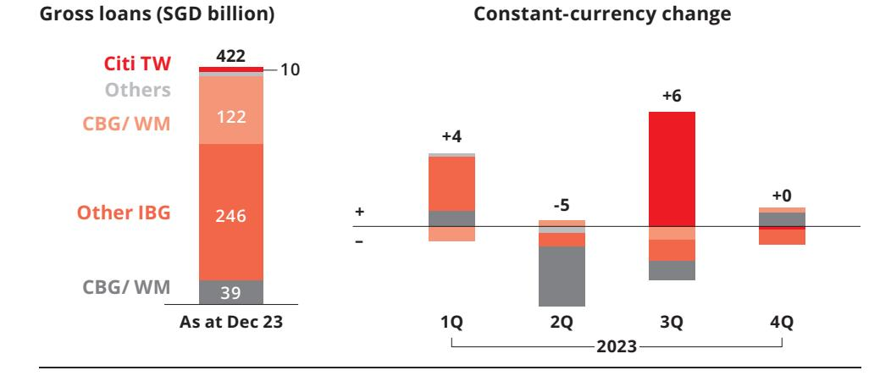

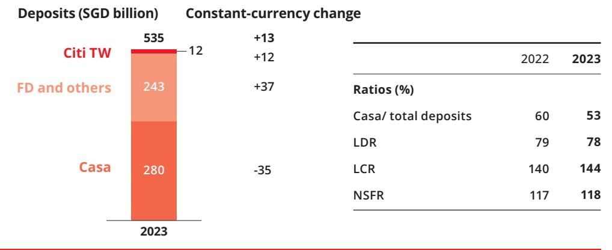

#### (D) Non-interest income

Net fee income rose 9% to SGD 3.38 billion. Card fees grew 22% to a new high of SGD 1.04 billion from higher spending and the consolidation of Citi Consumer Taiwan.

Wealth management fees rose 13% to SGD 1.51 billion, reflecting strong net new money inflows, a shift from deposits to investments and bancassurance, and contributions from Citi Consumer Taiwan.

) Includes trade & remittances, guarantees and deposit-related fees

2) Net of interchange fees paid

#### Fee income

| (SGD million)                       | 2022  | 2023  | YoY% |
|-------------------------------------|-------|-------|------|
| Investment banking                  | 121   | 125   | 3    |
| Transaction services (1) | 929   | 896   | (4)  |
| Loan-related                        | 459   | 554   | 21   |
| Cards (2)                | 858   | 1,044 | 22   |
| Wealth management                   | 1,330 | 1,505 | 13   |
| Fee and commission income           | 3,697 | 4,124 | 12   |
| Less: Fee and commission expense    | 606   | 740   | 22   |
| Total net fee and commission income | 3,091 | 3,384 | 9    |
|                                     |       |       |      |

Fee income from other activities rose 4% as higher loan-related fees were partially offset by weaker transaction service fees as trade finance slowed.

Other non-interest income rose 28% to SGD 3.15 billion. Treasury customer sales reached a record while Treasury Markets non-interest income was also higher.

#### Other non-interest income

| (SGD million)                                           | 2022  | 2023  | YoY% |
|---------------------------------------------------------|-------|-------|------|
| Net trading income                                      | 2,313 | 2,866 | 24   |
| Net income from investment securities                   | 115   | 217   | 89   |
| Others (include rental income and gain on fixed assets) | 42    | 71    | 69   |
| Total                                                   | 2,470 | 3,154 | 28   |
| Commercial book                                         | 1,518 | 1,785 | 18   |
| Treasury Markets                                        | 952   | 1,369 | 44   |
| Total                                                   | 2,470 | 3,154 | 28   |

#### (E) Expenses

Expenses rose 14% to SGD 8.06 billion led by a 15% increase in staff costs to SGD 5.04 billion. Excluding Citi Consumer Taiwan and non-recurring technology and other costs, expenses rose 10% and the underlying cost-income ratio was 39%.

#### Expenses (SGD million)(1)

Unsecured NPA

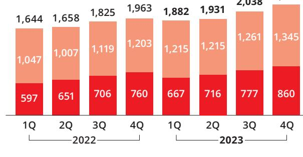

215

226

2,038

#### (F) Asset quality

Non-performing assets were little changed at SGD 5.06 billion and the NPL ratio was unchanged at 1.1%. New non-performing asset formation remained low and was more than offset by repayments and write-offs.

Specific allowances amounted to SGD 512 million or 11 basis points of loans, slightly above the eight basis points a year ago and remaining below the cycle average. General allowances of SGD 78 million were taken compared to a SGD 98 million write-back a year ago.

Total allowance reserves amounted to SGD 6.48 billion. General allowance reserves stood at SGD 3.90 billion, which included SGD 2.20 billion of general allowance overlays. Specific allowance reserves amounted to SGD 2.58 billion. Allowance coverage of non-performing assets was at 128% and at 226% after considering collateral.

| (SGD million)                                        | 2022    | 2023  |
|------------------------------------------------------|---------|-------|
| NPAs at start of period                              | 5,849   | 5,125 |
| IBG and others                                       | (464)   | (311) |
| New NPAs                                             | 1,157   | 675   |
| Upgrades, settlements and recoveries                 | (1,002) | (683) |
| Write-offs                                           | (619)   | (303) |
| CBG/ WM                                              | (112)   | (1)   |
| Translation                                          | (148)   | (83)  |
| NPAs at end of period                                | 5,125   | 4,730 |
| Citi Consumer Taiwan                                 | -       | 326   |
| NPAs at end of period including Citi Consumer Taiwan | 5,125   | 5,056 |
| NPL ratio (%)                                        | 1.1     | 1.1   |
| SP/ loans (bp)                                       | 8       | 11    |
| Cumulative general and specific allowances as % of:  |         |       |
| NPA                                                  | 122     | 128   |

26 **DBS ANNUAL REPORT 2023** BUILDING A SUSTAINABLE ADVANTAGE **Our 2023 priorities** 27

## **Our 2023 priorities**

**We use a balanced scorecard approach to measure how successfully we are serving stakeholders and executing our long-term strategy. Our scorecard, which is based on our strategy, is used to set objectives, drive behaviours, measure performance and determine the remuneration of our people, making this a living tool.**

**Despite record earnings and outperformance against many indicators, due to the digital disruptions, our overall scorecard performance in 2023 was lower compared to the previous year. This impacted the variable pay of the CEO and other members of the Group Management Committee.**

*To read more, see the Remuneration Report on pages 65 to 69.*

#### **Traditional Key Performance Indicators (40%)**

#### **Shareholders**

#### **Achieve sustainable growth**

Measure financial outcomes and risk-related KPIs to ensure that growth is balanced against risk, compliance, and control.

*Read more about this on page 27.*

#### **Customers**

#### **Position DBS as bank of choice**

Drive progress in customer satisfaction, depth of relationships, and brand strength.

*Read more about this on page 27.*

#### **Employees**

#### **Position DBS as employer of choice**

Assess advancement in being an employer of choice, including employee engagement and people development.

*Read more about this on page 28.*

#### **Transforming the Bank – Making Banking Joyful (20%)**

#### **Transforming toward managing through customer journeys**

**Improve architecture for Managing through Journeys (MtJs)**

Strengthen capabilities for MtJs.

#### **Deliver differentiated customer experiences and superior outcomes**

Broaden adoption of MtJs across the organisation, further leverage artifical intelligence/ machine learning (AI/ ML) and experimentation, and deepen focus on customer obsession in order to deliver differentiated customer experience, superior financial outcome, and joyful employee experience.

*Read more about this on page 29.*

#### **Areas of focus (40%)**

#### **Continuing our transformation journey**

Scale digitalisation and use of data across the organisation, improve employee well-being and deepen transformational leadership, and industrialise AI/ ML.

*Read more about this on page 30.*

#### **Accelerating existing business**

Scale and drive value across the Group with strategic expansions and segment strategies across markets.

*Read more about this on page 30.*

#### **Becoming a technology-driven company**

Demonstrate the value of our digital capabilities, enable differentiated employee and customer experiences, and explore new opportunities for growth.

*Read more about this on page 31.*

#### **Building a sustainable franchise**

Strengthen our risk and compliance framework, improve the resiliency of our systems, and champion efforts in responsible banking, responsible business practices and creating impact beyond banking.

*Read more about this on page 31.*

#### **Traditional KPIs KPI/ Target Outcome Shareholders** *Read more about this on pages 20-25 in "CFO statement"* Deliver consistent income growth Total income rose 22%, crossing the SGD 20 billion mark for the first time, driven by a higher net interest margin, a rebound in fee income and record treasury customer sales. **Income (SGD million)** Be cost efficient while investing for growth, with cost-income ratio improving over time The cost-income ratio improved three percentage points to 40%. Expenses rose 14% to SGD 8.06 billion led by an increase in staff costs from salary increments and a higher headcount. Excluding Citi Taiwan and nonrecurring technology and other costs, expenses rose 10% and the underlying cost-income ratio was 39%. **Cost/ Income (%)** Grow exposures prudently, aligned to risk appetite Asset quality was resilient. Non-performing assets (NPA) fell 1% as new NPA formation remained low and was more than offset by repayments and write-offs. The nonperforming loan (NPL) ratio was unchanged at 1.1%. Specific allowances were 11 basis points of average loans, slightly above the eight basis points in the previous year, and remaining below the cycle average. General allowances of SGD 78 million were taken compared to a write-back of SGD 98 million in the previous year. **Speciȴc allowances/ average loans (bp)** Deliver consistent return on equity (ROE) ROE rose to a record 18.0%, significantly above previous years, as franchise and digital transformations carried out over the past decade reaped substantial benefits in a higher interest rate environment. **Return on equity (%)** Meet expectations on risk and controls including service reliability and operational excellence We fell short in 2023 with several digital disruptions. The regulator imposed several measures including an additional operational risk capital charge as well as a six-month pause for nonessential IT changes. Given this, the scorecard rating for Technology and Operational Risk controls was significantly lower compared to the previous year. Since May 2023, we have embarked on a programme to strengthen technology resiliency. **Customers** Achieve broad-based increase in customer satisfaction across markets and segments Customer engagement scores in Wealth Management increased, driven by improvements in relationship manager satisfaction, Wealth Management solutions and insights. Consumer banking engagement scores remained high despite challenges from digital disruptions in Singapore. In response, we continue to strengthen our digital service availability and recovery processes. We increased our market penetration among large corporates and rose from second to first place on the Coalition Greenwich survey index. Our SME Regional Customer Engagement index remained at a high of 4.45. In addition, we continued to garner industry awards including "Global Finance Digital Awards for **Customer engagement score(1) 2019 2020 2021 2022 2023 20,180 14,544 14,592 14,188 16,502 11 2023 8 2022 12 2021 31 2020 20 2019 46 42 40 43 43 2019 2020 2021 2022 2023 13.2 9.1 12.5 15.0 2022 18.0 2019 2020 2021 2023 2023 2022 CES for Consumer Banking 4.22 4.31 CES for Wealth Management 4.31 4.26 CES for SME Banking 4.45 4.45 Asia-based Large Corporates Market Penetration Ranking 1st 2nd CSISG(2), Finance and Insurance Sector ratings 75.9 74.9**

Best Mobile Banking App, Asia-Pacific", "Euromoney Market Leader (domestic category)" and "Global Best Service Overall – Non-FIs for Cash Management".

*(1) Scale: 1 = worst and 5 = best. Based on Customer Satisfaction Survey (CSS) conducted by Capgemini and Qualtrics for Wealth Management; and Qualtrics for Consumer Banking. Based on Aon Hewitt for SME* 

*Singapore Management University and the Singapore Workforce Development Agency. The Banking CSISG* 

**CSISG, Finance and Insurance Sector rankings**

**1st 2nd**

*(2) Customer Satisfaction Index of Singapore, jointly developed by the Institute of Service Excellence at* 

*banking and Greenwich Associates for large corporates market penetration ranking.*

*Study is run in Quarter 4 every year (i.e. 2023 fieldwork was conducted in Q4 2022).*

28 **DBS ANNUAL REPORT 2023** BUILDING A SUSTAINABLE ADVANTAGE **Our 2023 priorities** 29

#### **Traditional KPIs**

#### **KPI/ Target Outcome**

**Customers** Deepen customer relationships

CBG non-interest income grew 16% to SGD 2.8 billion, driven by growth from investment products, bancassurance, and cards, contributed in part by the Citi Consumer Taiwan integration.

**2019 2020 2021 2022 2023**

**2.3 2.4**

IBG non-interest income increased 4% to SGD 2.2 billion on the back of higher loan and cash management fees from deepened customer relationships, which were partially offset by lower trade fees.

#### **IBG non-interest income (SGD billion)**

**CBG non-interest income (SGD billion)**

**2.8**

**2.4**

**2.8**

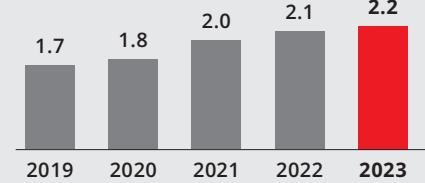

**Employees** Maintain employee engagement levels

With our sustained focus on enhancing employee experience and engagement over the years, our employee engagement score reached a record 90% (+3%), 17 percentage points above Kincentric's APAC Financial Services Industry average. As a result of our concerted efforts, we registered notable improvements in the scores for wellbeing, learning & development, and survey follow-up.

With strong employee engagement scores, we were awarded the Regional Best Employer in Asia Pacific for the 8th consecutive year by Kincentric.

#### **My Voice employee engagement score (%)**

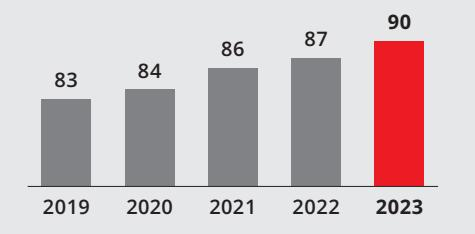

*Read more about "Enhancing Employee Engagement and Culture" in our Sustainability Report.*

Provide our people with opportunities for internal mobility to enhance professional and personal growth

We are committed to the long-term professional and personal growth of our people by providing various career opportunities within the bank. iGrow is an AI/ ML-powered tool that helps employees identify and build skills, including for internal mobility, to reach their career goals. Having successfully rolled out iGrow in Singapore and Hong Kong in 2022, we expanded it to other core markets such as China and India in 2023.

In 2023, about 30% of jobs were filled by internal candidates. Due to lower attrition rates, there were fewer open positions which resulted in a decrease in our internal mobility rate from 7.7%

#### **Internal mobility rate (%)**

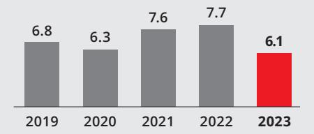

in 2022 to 6.1% in 2023.

*Read more about "Developing Our People" in our Sustainability Report.*

Maintain or reduce voluntary turnover

Our group-wide voluntary attrition rate fell from 14.7% in 2022 to 8.8% in 2023 due to external job market conditions and our initiatives to support employee well-being and foster growth and development. Our attrition rates remain lower than the market average in all our core markets.

**Voluntary attrition rate (%)**

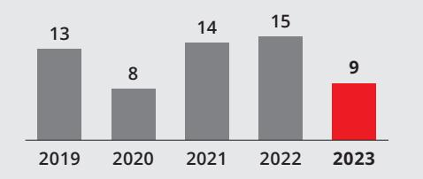

#### **Transforming the Bank – Making Banking Joyful**

#### **2023 Target Outcome**

**Transforming toward Managing through Journeys (MtJs)**

Design improvement in journey architecture for MtJs

We enhanced our MtJs framework to drive Agile at Scale and further embedded experimentation and customer discovery across customer journeys. We further enabled teams to collaborate closely through workbenches and integrated workflows and launched award-winning innovations.

By automating performance management metrics in dashboards, we enabled teams to gain realtime customer and business insights and take prompt action. Our performance compensation framework aligns journey objectives and outcomes with individual rewards and recognition, ensuring consistency and accountability across journeys.

Deliver differentiated customer experiences and superior outcomes

We continued to mature and expand our Consumer Banking journeys.

In our Cards and Consumer Finance businesses, we implemented hyper-personalised solutions for customers, engaged in continuous discovery to optimise customer journeys, and made industryleading enhancements to existing products such as Pay & Transfer and Card+ in Hong Kong. We grew our consumer finance ecosystem partnerships in Indonesia, China, and India, resulting in a 118% increase in loan volumes.

In our Treasures business, we expanded the use of AI/ ML models to personalise recommendations for customers through digital channels, enable relationship managers to better engage clients, as well as drive new customer acquisition. These contributed to a 46% growth in total Treasures income, which was also helped by higher interest rates. In addition, we extended journey thinking to our Private Banking business to optimise customer onboarding and servicing journeys.

In our Deposits and Mortgage business, we defended our market share by gating deposit outflows and managing attrition for mortgages through AI/ ML and experimentation, greater digitalisation, and optimisation of customer journeys through partnerships. In our Singapore Retail business, we improved customer experience by reducing turnaround time and enhancing the customer onboarding process. These efforts enabled us to entrench our market leadership, including in Bancassurance across digital and non-digital channels.

We enhanced our Institutional Banking journeys by adopting data-driven approaches and strengthening our digital capabilities.

In our global supply chain business, we launched several innovations including the DBS IDEAL Supplier Hub to smoothen the servicing of and deepening engagement with suppliers, as well as a data-based supplier financing solution in Hong Kong which was awarded the Global Innovation Award by Global Finance. We also streamlined the account opening journey in Hong Kong to reduce turnaround time by five-fold and leveraged partner data in India to improve leads conversion. These initiatives contributed to a doubling in the number of new supply chain financing and digital solutions and asset growth of 28%.

In our SME business, we adopted control towers and dashboards with real-time levers to drive business momentum across Singapore, Hong Kong, and India. We also leveraged data and AI/ ML to better meet customer needs through tailored solutions and servicing, as well as to gatekeep deposit outflows. Our data-driven and customer centric operating model, supported by a higher interest rate environment, resulted in a 44% income growth.

We further advanced digital solutions in our corporate transactional foreign exchange (FX) business to improve customer engagement and enhance dynamic pricing. This contributed to growth in digital FX revenues despite challenging market conditions. In recognition of our capabilities, we were awarded Most Innovative Bank for FX globally and Best FX Provider for Singapore and Asia Pacific by Global Finance. By expanding the MtJs way of working to the consumer FX business, we also achieved a 21% increase in Treasures FX revenue in Singapore.

*Read more about this in the Letter from the Chairman and CEO on page 8.*

30 **DBS ANNUAL REPORT 2023** BUILDING A SUSTAINABLE ADVANTAGE **Our 2023 priorities** 31

#### **Selected Areas of Focus**

#### **2023 Target Outcome**

#### **Continue our transformation journey**

Scale digitalisation and use of data across the organisation, improve employee well-being and deepen transformational leadership, and industrialise AI/ ML

Support units such as Risk, HR and Finance improved the efficiency and effectiveness of internal processes through greater digitalisation and use of data and AI/ ML. We digitalised risk management workflows to reduce manual handoffs across teams and improve risk controls, as well as adopted analytics to support alternative trade lending and platform partnerships. We deployed recruitment models to facilitate pre-screening of hires and retention models to successfully retain high flight-risk employees. We also democratised financial data across units to facilitate more effective decision making.

Our continued emphasis on improving employee well-being resulted in a Kincentric MyVoice Well-Being score of 89%, 10 percentage points above that of other financial services institutions. Transformational Leadership trainings also contributed to improvements in scores on wellbeing, work-related stress, and psychological safety. We gained positive feedback on the efficacy of leadership trainings in promoting team collaboration and breaking silos, with a significant proportion of managers receiving improved ratings following such trainings.

We made significant progress on the industrialisation of AI/ ML, deploying over 350 use cases and 800 models. As a result, we more than doubled the economic benefits from AI/ ML from the previous year. This was enabled by continued investments in our data platform and AI protocol platform that reduced our model deployment time by 30%. Our efforts placed us first in the Evident AI Index for AI Leadership. We also developed Generative AI capabilities and governance frameworks and piloted several use cases with promising results.

*Read more about this in the Letter from the Chairman and CEO on page 8 and CIO Statement on page 34.*

#### **Accelerate existing businesses**

Scale and drive value across the Group with strategic expansions and segment strategies across markets.

We further deepened our digital banking capabilities in Singapore across both retail and SME segments, doubling our retail AI/ ML related revenues and engaging 85% of our SME customers via contextual nudges. We also gained market share in our Family Office business in Singapore, onboarding more than a third of the 1,100 Single Family Offices set up. Our Family Office AUM sustained growth of 21%, while our overall wealth franchise surpassed the SGD 20 billion milestone in net new money. We also continued to enable digital financial planning, with the DBS NAV Planner monthly active user base increasing 57% to 1.1 million active users.

Despite the slower recovery post-border reopening in China, we grew new corporate customer acquisitions from emerging industries such as new energy vehicles, technology, media, and telecom (TMT), high-end manufacturing, as well as energy, renewables and infrastructure, by more than 44%. We also almost doubled new money inflows from our Treasures business. In Hong Kong, we more than doubled the number of new Greater Bay Area (GBA)/ Mainland China individual wealth and corporate customer accounts.

Following the successful Citi Consumer Taiwan integration, DBS Taiwan is now the largest foreign bank in Taiwan by assets. DBS' brand recognition in Taiwan has been significantly elevated and the substantially expanded Consumer customer base will enable synergies across businesses and accelerate growth.

The integration of Lakshmi Vilas Bank with DBS India has expanded our outreach in India across more than 500 branches, enabling DBS India to grow the Consumer and SME Banking segment as well as the deposit base to drive future expansion. We bolstered our SME digital lending capabilities with data-driven analytics and extended our presence across 100 key SME hubs. We also continued to strengthen our consumer offerings with the launch of the DBS Credit Card and Affordable Housing Financing, and the scaling of our partnerships with Bajaj Finance, Cred and IIFL.

We continued to deepen and expand client relationships, regional connectivity as well as ecosystems partnerships in Indonesia. We also focused on growing Casa to maintain net interest margins to drive profitability. Despite the challenge of higher interest rates to trading and wealth management revenues, we achieved 29% revenue growth. We continue to leverage AI/ ML as well as continuous experimentation to improve profitability.

*Read more about this in Letter from the Chairman and CEO on page 8, Head of Institutional Banking Statement on page 36, and Head of Consumer Banking/Wealth Management Statement on page 38.*

#### **Selected Areas of Focus**

#### **2023 Target Outcome**

#### **Become a technologydriven company**

Demonstrate the value of our digital capabilities, enable differentiated employee and customer experiences, and explore new opportunities for growth.

In May, we held a Digital Investor Day to deepen investors' understanding of how our digitalisation efforts create sustainable shareholder value. We showcased the pervasive digital transformation across the group and shared the evolution of our digital-led strategy in growth markets and pursuit of new businesses with high growth potential.

We continued to improve productivity by equipping employees with workbenches that provide onestop platforms to perform their tasks, as well as by automating and optimising workflows. This resulted in a Kincentric MyVoice score on Productivity of 88%, 19 percentage points above that of other financial services institutions. We broadened and deepened our ecosystem partnerships by onboarding 17 new partners and scaling up partner integrations through APIs and digital platforms. We launched a supplier self-service payments tool and established a real-time supplier feedback channel to deepen engagement with suppliers in our corporate supply chain ecosystems.

By enabling superior customer experience via digital journeys, we more than doubled the number of retail customers acquired via ecosystems from a year ago.

Despite adverse market conditions, our DBS Digital Asset Ecosystem's assets under custody continued to grow and crossed SGD 1 billion, against a general decline in average crypto market capitalisation. We also partnered with SBI and UBS to conduct the world's first live repurchase transaction with a natively issued digital bond on a public blockchain as part of Project Guardian. We launched DBS BetterWorld, a gamified metaverse experience that highlights social enterprises addressing the global food waste challenge.

Our joint ventures have made steady progress. Partior completed multi-cloud platform upgrade and became the first operationally ready blockchain-based market infrastructure for banks to process multi-currency wholesale transactions. Climate Impact X (CIX) crossed the 1 million tonne milestone in traded and cleared credits within its CIX Exchange offering.

*Read more about this in Letter from the Chairman and CEO on page 8, CFO statement on page 20, CIO statement on page 34, and Head of Institutional Banking Statement on page 36.* 

#### **Build a sustainable franchise**

Strengthen our risk and compliance framework, improve the resiliency of our systems, and champion efforts in responsible banking, responsible business practices and creating impact beyond banking.

Following a series of digital disruptions in 2023, we implemented the Technology Risk Management Uplift Programme (T-Up) focusing on change management, system resilience/ recovery, incident management, and technology risk and oversight. We continued to strengthen our technology governance, people/leadership, systems, and processes.

We continued to use data analytics and surveillance capabilities to combat financial crime, particularly for improved detection of high-risk payment transactions. Security tools were implemented to protect customers against malware-enabled scams. We also enabled our customers to digitally lock their funds to reduce the risk of unauthorised digital fund outflows.

Our climate agenda was accelerated through enhanced client engagement on transition planning, financing and ecosystem partnerships. We embarked on robust engagement with our top-emitting clients and developed digital tools to enable RMs to simulate clients' emission profiles against sciencebased benchmarks. We also strengthened our climate risk management and governance in credit risk underwriting, built centralised climate data infrastructure, enhanced our scenario analysis models and invested in our employees' climate knowledge. Our commitments for sustainable financing1 (for loans and trade finance), net of repayments, was around SGD 70 billion as of December 2023, up from SGD 51 billion in the previous year.

We were actively involved in government, regulatory and industry working groups such as the Glasgow Financial Alliance for Net Zero (GFANZ) and the MAS Green Finance Industry Taskforce (GFIT) to support and shape policies and guidance on emerging topics, such as transition and transition planning, managing the phase out of coal power generation in Asia, and the Singapore-Asia Taxonomy.

DBS Foundation awarded SGD 3.7 million to 24 businesses for impact, selected from close to 2,000 applicants. The DBS Foundation Community Impact chapter's 10 inaugural programmes, launched in 2022, positively impacted 3.9 million beneficiaries and created 2.2 million kg of food impact. An additional SGD 5.6 million was committed towards 11 new programmes aimed at equipping vulnerable segments of the community with future-ready skills and food security. Our employees also volunteered over 200,000 hours to reach more than 180,000 beneficiaries. Our 'Towards Zero Food Waste' efforts saw strong traction as we achieved more than 23 million kg of food impact across the region.

*Read more about this in the Sustainability Report.*

*(1) Sustainable financing consists of loans, including green, renewables (financed as Project Finance), sustainability-linked, transition, and other loans such as social and blue, as well as trade finance deals covering green Bank Guarantees and Letter of Credits.* 

32 **DBS ANNUAL REPORT 2023** BUILDING A SUSTAINABLE ADVANTAGE **CRO statement** 33

**Asset quality remained healthy. With an evolving environment due to geopolitical tensions, we stayed vigilant to the potential impact on our portfolio. We continued to focus on delivering on our Technology Risk Management Uplift Programme to strengthen technology resiliency.**

#### **Inȵ ation, rate hikes and recession risks**

In 2023, most central banks continued to keep interest rates elevated as inflationary pressures persisted, raising risks of recession, refinancing challenges, and real estate price correction. Continued rate hikes and potential impasses in the United States debt ceiling exacerbated already volatile markets.

Notwithstanding these headwinds, DBS' overall credit quality remained benign, with low non-performing loans rate at 1.1% and specific allowances at SGD 512 million. We stayed vigilant with portfolio reviews and stress tests on both the loan book and traded portfolio. Large corporates were assessed to be generally resilient due to their strong financial position and ability to pass on higher costs. While the SME corporates were assessed to be the most vulnerable, our SME portfolio had been stress-tested comprehensively in previous years and was mostly on a secured basis with acceptable financing quantum.

Unsecured consumer credit loans which comprised less than 2% of our portfolio, saw an uptick in delinquency, which we mitigated by proactively intensifying collection actions. Residential mortgages, which were primarily in Singapore and Hong Kong, were mainly for owner-occupation and well-secured with low loan-to-value ratios. Regular and ad-hoc stress tests were also conducted during the year to evaluate the potential impact of adverse market prices on our traded portfolios.

Overall, our portfolios were assessed to be resilient with the relevant risk mitigation strategies in place. DBS will continue to monitor the potential downstream effects.

#### **Financial stability risks in western banks**

With the failure of several US regional banks and Credit Suisse in early 2023, the year also saw one of the most significant system-wide banking stress periods since the 2008 global financial crisis. These stresses underscored the speed and scale of outflows through digital channels and how these could significantly contribute to liquidity stress.

Whilst our liquidity profile remained healthy and well-diversified, we took the learnings from these events to heart, and critically evaluated our access to funding during periods of stress. Various initiatives were undertaken to strengthen our liquidity channels to ensure swift access to alternative liquidity sources when warranted. We also continued to engage our customers and deployed strategies to maintain our deposit base in a high interest rate environment.

Furthermore, we reviewed our credit exposure to banks for potential similar balance sheet and liquidity issues, and our portfolio was generally assessed to be stable as our exposure was primarily to strong global systemically important banks.

#### **Macroeconomic and geopolitical risks in North Asia**

2023 saw elevated macroeconomic and geopolitical risks in the region, underscored by uncertainties over China's economic recovery, risks to its real estate sector and escalating US-China tensions.

Despite the challenges posed by China's weak consumer confidence and spending, and export weakness on the back of soft global demand, our portfolio remained resilient as our corporate exposure was mainly to top industry players, and consumer exposure was limited. While the real estate sector continued to face headwinds, our Chinese real estate exposures were mainly to larger and investment-grade names, with the remaining exposure generally well-secured. As contagion risks from the real estate market stayed elevated, we remained cautious and closely monitored our exposures.

We observed the imposition of restrictions by US and its allies which tightened China's access to advanced semiconductors and chipmaking gear. While there was no immediate impact to our portfolio, we continued to closely monitor the situation as it evolved.

As we continued to expand our presence in North Asia, our risk strategies were multipronged, including assessing our readiness in the event of tail risk scenarios such as business restrictions due to potential sanctions. Notwithstanding these, our focus continued to be on the longerterm opportunities in China, including risk strategies to support companies looking to diversify their supply chains and operations with a "China plus one" strategy.

#### **Fortifying customer trust with enhanced technology resilience**

After the digital disruption in March, the Board convened a Special Board Committee (SBC) to oversee a full review of the disruption and engaged two independent experts to support them. It also appointed an independent third party, Accenture, to carry out a root cause investigation of this incident and a subsequent one in May. The appointed party conducted a comprehensive review of the bank's digital banking services, including our control processes and technology stack. The findings of the review - completed in August - were also corroborated against subsequent disruptions.

Through the enhanced oversight, we believe that we have identified the key gaps and deficiencies, which are mainly in the areas of technology risk governance and oversight, incident management, system resilience and change management. To address these gaps and deficiencies, a comprehensive technology roadmap led by the CEO has been put in place to improve resiliency.

The Board Risk Management Committee (BRMC) established the BRMC Technology Risk Committee (BTRC) for dedicated oversight of technology risk. The BTRC oversees the implementation of the remedial measures that would be carried out to address the findings of the Accenture review and the completion of the technology roadmap.

To enhance independent checks and balances, we transferred the Technology Risk Management team to the Risk Management Group. Since then, a new Group Head of Technology Risk was onboarded and the team's bench strength expanded with specialised expertise. We strengthened our Site Reliability Engineering with new leadership and also created a new Quality Assurance function to provide an additional independent layer of verification, controls and checks over the bank's change management process. A new Group Technology Risk Committee (GTRC) was constituted to enhance the oversight and management of technology risk by senior management.

Relating to incident management, we established clearer ownership and management of incidents within the bank, as well as between the bank and its service providers and vendors. We also embarked on proactive problem management through the active review of early warning indicators, identification of other possibly affected areas, and taking preventive actions.

To this end, a six-month pause on nonessential IT activities was instituted at DBS to focus on improving technology resiliency.

*Read more about "Driving the resiliency and reliability of our technology" in the CIO statement.*

#### **Safe-guarding against evolving ȴ nancial crime**

The money laundering and sanctions threat landscape continued to evolve. Our investments in developing, deploying and operationalising new tools based on data analytics and artificial intelligence/ machine learning (AI/ ML) proved to be effective. In many cases, the tools demonstrated two to four times better detection than historical controls with greater efficiency of 10-30%. These capabilities were particularly effective at detecting and interdicting money laundering and sanctions evasion networks of shell companies. Notwithstanding this, criminals would likely alter their methods and we would need to devote efforts to preventing exploitation of citizenships in the consumer bank, as well as new techniques to increase customer protection against scams and the laundering of proceeds from scams.

We also actively participated in and contributed to many initiatives, both domestic and international.

To combat digital payment scams, we implemented new surveillance measures to detect malware and used AI to detect anomalies in customer account behaviour which could indicate a scam victim or a mule. We also introduced new self-managed security features like a Security Checkup Dashboard and DigiVault. DigiVault enables our customers to safekeep their money digitally, which was akin to a virtual safe deposit box. These measures added friction to the customer journey but were necessary to help our customers bank with us with peace of mind. We also regularly collaborated with law enforcement agencies in their operations. For example, a onemonth joint operation with the Singapore Police Force in mid-2023 mitigated over SGD 21 million in potential scam losses.

*Read more about "Preventing Financial Crime" in the Sustainability Report.*

#### **Risks from climate change**

Climate change posed long-term change to risks on our portfolio, and banks had a crucial role to play in moderating how we lend to highrisk sectors. In 2023, we focused on enhancing environment, social and governance (ESG) risk capabilities including integrating ESG risk assessments into credit risk underwriting, establishing a centralised data repository to support climate risk with business intelligence, and enhancing scenario analysis models for transition risk assessment.

Alongside such developments, we also invested widely in our people, with over 1,800 relationship and credit managers completing comprehensive climate activation training programmes in 2023.

*Read more about "Responsible Financing" in the Sustainability Report.*

#### **Transforming risk management through digitalisation and AI**

Building on our long-standing track record of leveraging digitalisation, this year's initiatives spanned various risk types, including improvements in our risk management capabilities and workflows in collateral management, credit control and liquidity risk management.

We continued maturing the use of AI/ ML for credit underwriting and early warning for the consumer and SME banking businesses. These enhancements enabled scale and speed with efficiency to drive greater business success, improve customer experiences, and strengthen risk management.

Since 2019, our efforts in this area have yielded numerous benefits, such as generating deeper risk insights into our portfolios and improving fraud detection. By leveraging non-traditional data, we were also able to expand our addressable market in the consumer and SME space, with multifold increases in new loan applications and book size in ecosystem lending.

As we expanded the use of data and analytics in DBS, we remained focused on ensuring our data governance capabilities are fit for purpose. Our data governance framework was developed along three prisms: (a) a baseline prism (data security, data quality, and legal and regulatory compliance), (b) an ethical prism – PURE (Purposeful, Unsurprising, Respectful and Explainable) – for the responsible use of data, and (c) an AI governance prism (AI/ ML based systems and models), including the new and amplified risks associated with Gen AI.

#### **Navigating new business risks**

While we have a larger footprint in India post full integration of Lakshmi Vilas Bank at the end of the last year, the portfolio, primarily consisting of lending to large corporates with a growing SME and consumer book, remained resilient and stable.

The integration of Citigroup Inc.'s consumer banking business in Taiwan was completed in August 2023. To effectively manage the risks associated with a larger franchise, we have deepened the expertise of our risk management team and strengthened processes.

**Soh Kian Tiong Chief Risk Officer DBS Group Holdings**

#### **•** Strengthen technology resilience **2024 Focus Areas**

- through governance, people/ leadership, systems and processes
- **•** Proactively monitor emerging economic challenges and geopolitical developments and implications for our portfolios
- **•** Continue to strengthen risk management capabilities and streamline end-to-end processes and controls across all markets
- **•** Enhance climate risk management and stress testing capabilities
- **•** Continue to mitigate financial crime and cyber threats through controls, systems, analytics and effective communication

34 **DBS ANNUAL REPORT 2023** BUILDING A SUSTAINABLE ADVANTAGE **CIO statement** 35

**Our commitment to making banking joyful and seamless remains unwavering. We are making good progress in delivering on our technology resiliency roadmap, which will improve our digital service availability and reliability. We continue to invest in our people and technology to ensure a di erentiated customer experience.**

#### **2023 overview**

2023 was an eventful year for Technology and Operations, with the digital disruptions underscoring the need for technological enhancements, particularly in areas such as improving digital service availability and recovery. The shift from a monolithic mainframe to a cloud-native, microservicesbased approach in our digital transformation journey enabled us to be more nimble and increased the speed of execution. However, this created a more complex infrastructure requiring additional operational rigour and oversight. The six-month pause on non-essential IT activities imposed by the regulator is an opportune period for us to redirect our resources towards improving and tightening our processes in change management, system resilience, incident management, and technology risk governance.

Despite the digital disruptions, there were significant achievements, including the successful integration of Citigroup Inc.'s consumer banking business in Taiwan (Citi Consumer Taiwan) and the launch of new products in DBS Bank India. We also adopted new ways of working in a horizontal organisation by Managing through Journeys (MtJs) and incorporating Gen AI to improve our services.

#### **Driving the resiliency and reliability of our technology**

To effectively manage the complex tapestry

of technology risks and strengthen the bank's capabilities, we are implementing a comprehensive roadmap through the Technology Risk Management Uplift programme (T-Up), which is chaired by the CEO. Through the T-Up programme, we are putting in place a more stringent process for change management. We are also establishing clear ownership and management of digital disruptions within the bank and with our service providers. We have reinforced governance by dedicating resources to technology risk oversight and monitoring the implementation of remedial measures. This roadmap will culminate in improved service availability and reliability.

#### **Change management**

DBS has a microservices architecture, which is supported via a number of thirdparty systems. While this is the preferred architecture for most modern technology companies, the one challenge it poses is that a bug in one part of the ecosystem could result in previously unknown problems elsewhere. This underscores the importance of doing more rigorous and comprehensive testing before we put any software into production. We have since tightened our change management controls and created a near-production test environment to allow for more robust testing of key services before going live with new changes or releases.

#### **System resilience**

We recognise that customers expect to have access to key services such as balance enquiry and digital payments in an uninterrupted manner. To ensure that these services have minimal downtime, for critical applications, we have now added hot standby capabilities to supplement existing active-active configurations. Additionally, today, some of our services are delivered through common/ shared systems, which can potentially result in single points of failure. To prevent this, we are decoupling these shared systems at both the front and back ends so that key services are always available on at least one channel. This will be completed by 1Q 2024. these critica stand active today throu p failur these availa comp

To complement our engagement with vendors, we have established 10 Centres of Excellence (COEs) that house expertise across different domains. The COEs will drive standardisation of architecture and reuse of assets, uphold quality service delivery, and develop competency for shared application software and services. co vendo Exc acros stand asset devel ft

Our mobile applications have been enhanced to detect and remove the presence of malware. Our cybersecurity control environment is regularly tested and attained the highest tier of preparedness for the Cyber Trust mark.

#### **Incident management**

When incidents arise, we have to recover services more quickly. Having early warning indicators, and a process to review internal alerts proactively, enable us to take preventive actions in a timely manner. In the last year, having built comprehensive diagnostic capabilities, real-time monitoring data and alerts are now being leveraged as part of our incident management process. This encompasses a comprehensive view starting with the end-to-end customer journey through the applications and infrastructure levels to detect and drill down issues in real time and identify solutions swiftly.

We have centralised our command centre to enable faster identification, triaging and initiation of recovery protocols. Playbooks for technology operations teams and Crisis Situation Managers have been updated with a sharper focus on rapid restoration of alternate systems to minimise interruption of our digital services. These capabilities are available in Singapore and will be rolled out across all our markets in 2024.

#### **Technology risk governance and oversight**

To strengthen technology risk governance and oversight, the bank formed a new subcommittee of the Board Risk Management Committee (BRMC) called the BRMC Technology Risk Committee. The bank also transferred the Technology Risk Management team to the Risk Management Group, reporting to the Chief Risk Officer, to enhance independent checks and balances. In addition, we bolstered our Site Reliability Engineering team with new leadership and established a

dedicated Quality Assurance (QA) function. The QA function serves as an independent layer of checks on change management within Group Technology. In addition, we are reinforcing a strong technology risk and control mindset among our technology teams, ensuring an equal emphasis across delivery, innovation and resilience.

#### **Executing integrations for continued business growth**

The integration of Citi Consumer Taiwan with DBS Bank Taiwan has solidified our position as the largest foreign bank in the market. This complex exercise encompassed enhancements to local systems, testing operational readiness, ensuring smooth network performance, and facilitating transactions like cheque handling. As a result of this integration, we welcomed 3,000 new employees into DBS. We will optimise the post-integration processes and deliver integrated solutions across a comprehensive range of services, from credit card onboarding to remittance.

To build a competitive position in the rapidly growing Indian market, through the integration of Lakshmi Vilas Bank, we expanded our product suite to include gold loans and retail depository accounts, and introduced new products such as proprietary credit cards and affordable housing loans. The India team also executed a data onshoring project to meet regulatory requirements. The integration expanded our network to over 520 branches and 900 ATMs, further growing our physical presence in India.

#### **Generating value from technology**

#### **Digitalising operations**

Our Operations Processes and Platform Re-engineering programme has improved employee productivity by over a million hours since 2021. The digitalisation of operations has contributed to a 54% reduction in risk incidents despite a doubling in transaction volumes.

Our workflow system, called Intelligent Business Process Management, reduces manual hand-offs and digitalises our processes. Over 1,100 processes have been standardised and digitalised, reducing risk and manual effort. For instance, Treasury Market Operations have achieved a digitalisation rate of 85%, Institutional Banking Group Operations 80%, and Consumer Banking Group Operations 67%. We will see further improvement in our digitalisation rates as we roll out these processes in different markets. We are confident that Gen AI capabilities will further streamline and automate our processes, providing smoother customer journeys and reducing employee toil.

#### **AI and Gen AI**

Our investments in building AI capabilities enable the pervasive use of AI throughout the bank. Today, we have over 800 models and 350 use cases delivering SGD 370 million in economic benefit, more than twice the value in 2022. In particular, our AI-driven real-time digital fraud prevention solution flags potentially fraudulent transactions in under 10 milliseconds.

In 2023, DBS experimented with Gen AI to drive innovation and enhance operational efficiency. An enterprise Gen AI platform equipped with robust safeguards enabled employees to develop use cases and assess the efficacy of prototypes developed. All Gen AI pilots undergo risk assessments and added human oversight.

Our experiments in areas such as summarisation, generative communications, personalised wealth advisory, contact centre, coding and development show promising outcomes. For instance, integrating Gen AI to assist our Customer Service Officers with real-time transcription and call summarisation will reduce the average call handling time by up to 20%.

In addition to our principles for responsible use of data, we continue enhancing our artificial intelligence and machine learning model governance with the implementation of the Fairness, Ethics, Accountability and Transparency principles from the Monetary Authority of Singapore.

#### **Nurturing our next generation of talents**

We are committed to cultivating a diverse, future-ready workforce by fostering a culture of innovation, growth and customer centricity in our employees. The DBS Future Tech Academy, designed to build deep technical expertise and thought leadership, has registered over 200,000 module completions. We have strengthened manpower resources by bolstering our bench strength, accelerating onboarding, and providing upskilling opportunities for future roles.

These efforts have yielded positive results, with our regional Technology and Operations engagement score increasing by three percentage points to a record 91%. This is higher than the APAC Best Employer benchmark by six percentage points, and the APAC Financial Services Institution benchmark by 18 percentage points. The uplift was driven by improved survey followups, enhanced rewards and recognition, as well as learning and growth opportunities through internal mobility.

#### **Upskilling for emerging roles**

It is essential to enable our employees to

fully leverage AI. Our Data Chapter team develops learning pathways that equip employees to be AI-ready with relevant skills and tools, and enables them to incorporate AI and Gen AI techniques into our bank-wide processes. More than 2,900 employees benefitted from upskilling across four future operations roles. Additionally, 90% of our Operations employees have completed more than 75% of their two-year role-based Structured Learning Roadmaps curriculum.

#### **Women in Tech**

As we advance our Women in Tech agenda, we are heartened that two of our technologists were recognised in the SG100WIT hall of fame last year. We also partnered with United Women Singapore to pilot a series of workshops for female students in secondary schools, covering topics like blockchain, smart contracts and cryptocurrency.

#### **Committing to joyful banking and seamless customer journeys**

Our commitment to making banking joyful and seamless remains unwavering. We are making good progress in delivering on our technology resiliency roadmap, which will improve our digital service availability and reliability. We continue to invest in our people and technology to ensure a differentiated customer experience.

**Han Kwee Juan**

**Singapore Country Head DBS Group Holdings**

**Acting Chief Information Officer &** 

- **•** Fortify technology capabilities and resiliency to better manage risks and strengthen service recovery
- **•** Continue to re-platform legacy systems
- **•** Leverage the power of AI to improve our processes and ensure a differentiated customer experience
- **•** Build and cultivate a futureready Operations workforce, equipped for redesigned roles in tomorrow's world

36 **DBS ANNUAL REPORT 2023** BUILDING A SUSTAINABLE ADVANTAGE **Institutional Banking** 37

# **Institutional Banking**

**Our extensive Asia network and connectivity, underpinned by our industry expertise and a robust suite of digital solutions, enabled us to successfully capture regional investment and trade ȵ ows. Deepening customer relationships continued to be a key priority as we sought to help clients achieve business goals and navigate sustainability challenges.** 

#### **2023 overview**

Against a backdrop of economic uncertainty and subdued trade flows, the Institutional Banking Group (IBG) business demonstrated resilience.

Record financials, boosted by higher net interest margins, reflected the strength of our diversified franchise and quality of execution to strategy. Our extensive Asia network and connectivity enabled us to capture opportunities arising from outbound investments from China and elsewhere, as companies looked towards alternative supply sources and production bases in South and Southeast Asia. Deepening client relationships continued to be a key priority underpinned by our industry expertise, digital capabilities and sustainability leadership. At the same time, demand for sustainable and transition financing accelerated in line with the urgent need for climate action.

#### **Robust ȴ nancials despite macro challenges**

IBG's total income rose 22% to a record SGD 9.36 billion in 2023. Net interest income grew 28% from net interest margin expansion, prudent and nimble deposit pricing, as well as sustained volumes.

Non-interest income grew 4% to a record SGD 2.20 billion, underpinned by healthy

growth in loan and cash management fees from deepening customer relationships. Our focus on growing real-time payments and improving client journeys also contributed to the strong cash management performance. Trade fees fell from the previous year, impacted by a subdued market.

Allowances stayed low as asset quality remained healthy. Profit before tax grew 20% to SGD 6.79 billion, driven by a higher interest rate environment, robust noninterest income and a lower cost-income ratio of 27%, compared to 29% in FY2022.

#### **Strengthening our franchise across industries and markets**

There was broad-based growth across our industry segments especially in Real Estate (RE), Energy, Renewables and Infrastructure (ERI), Telecoms, Media and Technology (TMT) and Financial Institutions (FI).

The RE industry group benefitted from growing demand across a wider cross-section of clients looking to invest in prime assets in gateway cities across the region. The ERI industry group continued to see good momentum in the financing of renewables and capital recycling, driven by Asia's accelerating energy transition. Supply chain diversification contributed to increased regional activity in the TMT sector as clients sought to expand operations beyond China.

Revenue from the FI group reached new highs, crossing the billion-dollar mark for the first time as we successfully captured private capital flows to Asia, supported by healthy non-interest income. By leveraging our digital capabilities, we strengthened our value proposition and expanded coverage in geographies including the Middle East, United Kingdom and Australia. g g a capital non-in cap proposit geographies Kingdo

Work to deepen our franchise across our core markets continued at pace. Our ongoing efforts to dial up customer centricity contributed to increased market penetration among large corporates across our six core markets – moving us from second to first place on the Coalition Greenwich survey index. deepe mark ongoing e cont am six t sur

In China, we had to be agile to leverage opportunities amid the challenges posed by a soft reopening and structural headwinds. Our extensive network and capabilities in Asia's key axes of growth put us in good stead to support companies looking to diversify their supply chains abroad. We also launched a foreign direct investment advisory desk in Singapore to capture business opportunities emanating from Asia's largest economy. ha reopenin Our extensive

Indonesia and India delivered solid performance as we expanded our client footprint amid robust growth driven by domestic demand.

#### **Scaling Global Transaction Services with digital connectivity and trade propositions**

Our Global Transaction Services business continued to be a strategic priority, delivering over 50% of institutional banking revenue.

Digital capabilities enabled us to deliver more meaningful cash management solutions to customers in Singapore and across the region. Real-time payment volume grew by more than 50%, which when combined with an increased market share for cross-border payments, led to higher fees. This was driven by active commercialisation and regionalisation of our digital products and services, as well as the implementation of over 1,000 new cash management mandates across the region. Nimble pricing strategies for deposits, underpinned by artificial intelligence/ machine learning (AI/ ML) tools, meant that we could respond more quickly to volatile market conditions.

In addition, we were able to help regional customers deposit their monies with us more seamlessly with the launch of new online fixed deposit services across all our core locations. The market response was resounding – in Singapore, we garnered SGD 6.5 billion in online fixed deposits as at end December 2023. This contributed to an increase of over 20% in the fixed deposit book.

In trade, our AI/ ML capabilities and use of data-driven tools for underwriting powered sustained growth in supply chain financing. Documentary trade loans fell due to unattractive pricing and a slowdown in trade volume.

Notwithstanding this, we continued leveraging opportunities in the creation of digital trade corridors across the region. In August, we successfully completed the first interoperable electronic bills of lading transaction between Singapore and India. The transaction was implemented under the TradeTrust framework, an initiative by the Infocomm Media Development Authority and supported by Enterprise Singapore.

#### **Leveraging digital capabilities to enhance client engagement**

Data and digitalisation continued to underpin our efforts to deliver stickier and deeper customer relationships as we integrated our solutions into customer and industry ecosystems. API calls grew 61% as more customers embedded our digital solutions into their businesses.

Our digital proposition was especially key to our SME franchise. By leveraging AI/ ML, we enhanced our digital servicing capabilities and client engagement to deliver a more tailored customer experience.

#### **Enabling the path to net zero with meaningful partnerships and innovative solutions**

As the first bank in Southeast Asia to set decarbonisation targets, our priority has been to provide practical solutions to enable our clients – from large corporates to SMEs – to execute their sustainability agendas. With increasing momentum around the need to create environmental and social impact, our sustainable financing commitments, net of repayments, was around SGD 70 billion as at end December 2023.

In 2023, we pioneered several innovative solutions to grow our ESG portfolio. For example, DBS partnered apparel giant, H&M Group, to develop a first-of-its-kind collaborative finance tool to accelerate supply chain decarbonisation in the apparel sector. We completed the first successful transaction with a textile supplier in India, to fund the installation of low-carbon technologies in their factory. This in turn contributes towards H&M Group's supply chain emissions targets. DBS also became the first bank in Hong Kong to combine energy saving loans and deposits together with subsidies to SMEs for the

| SGD million              | 2023  | 2022  | YoY% |
|--------------------------|-------|-------|------|
| Total income             | 9,357 | 7,688 | 22   |
| Expenses                 | 2,489 | 2,254 | 10   |
| Profit before allowances | 6,868 | 5,434 | 26   |
| Allowances               | 88    | (204) | NM   |
| Profit before tax        | 6,787 | 5,638 | 20   |

purchase of renewable energy certificates from local energy provider, CLP Power.

In addition to financing solutions, we also expanded our ecosystem partnerships and advisory services to SMEs. As at end 2023, we formalised collaborations with several industry-leading solution providers including Keppel Corp, Schneider Electric and Univers. We engaged over 1,000 companies through various sustainability training courses and programmes to develop their capability and capacity in the field. We also strengthened our in-house capability, by providing sustainability training to over 1,800 relationship and credit risk managers.

Additionally, DBS played an active role in various industry and policy workgroups to help advance the region's transition finance agenda. For example, as a member of the Glasgow Financial Alliance for Net Zero, we co-chaired the workgroup to develop a proposal for the managed phaseout of thermal coal in Asia Pacific. DBS is also a key participant and enabler in the China-Singapore Green Finance Taskforce that was set up in 2023.

#### **Leading in Asian bond markets**

Capital markets activity was muted in 2023. Despite this, DBS continued to maintain pole position in the SGD bond markets, while also gaining market share across regional bond markets.

#### **Scaling and maturing a new way of working**

In 2023, we continued to scale our Managing through Journeys (MtJs) approach. To deliver better customer experiences, we expanded MtJs into two new areas – corporate documentary trade, as well as domestic payments, collections, and merchant solutions.

By breaking down internal silos and redesigning our processes to be more customer-centric, we have been able to shorten processing times and facilitate a more joyful banking experience. In just six months, we embedded a horizontal framework to streamline corporate documentary trade processes across our six core markets, enabling more seamless transactions via digital solutions. Similarly, more efficient

processes reduced the turnaround time needed for corporates to implement our digital payments and collections solutions in Singapore, Hong Kong and India.

#### **Looking ahead**

We expect a softening of net interest margins as tailwinds from a high-rate environment ease in 2024. Geopolitical uncertainty, market volatility and climate risk will continue to shape the landscape.

To help clients successfully navigate these challenges, we will need to leverage our strength as an Asia-centric bank to deliver value, at scale. Our deep local knowledge and extensive regional footprint, enabled by digital capabilities, put us in a strong position to capitalise on regional investment and trade flows as supply chains continue to diversify.

At the same time, sustainability will continue to be high on national and corporate agendas, as a growing urgency for climate action raises the stakes for a just energy transition. We aim to build on our leadership in sustainability to channel capital towards green and transition activities to help create a more sustainable future.

**Tan Su Shan Institutional Banking DBS Group Holdings**

#### **2024 Focus Areas**

- **•** Strengthen technology resilience
- **•** Enhance credit vigilance, knowyour-customer and anti-money laundering and credit processes
- **•** Amplify connectivity strategy to capture foreign direct investment and trade flows
- **•** Dial up solutions and partnerships to enable a just transition

DBS ANNUAL REPORT 2023 | BUILDING A SUSTAINABLE ADVANTAGE

Consumer Banking/ Wealth Management

## **Consumer Banking/ Wealth Management**

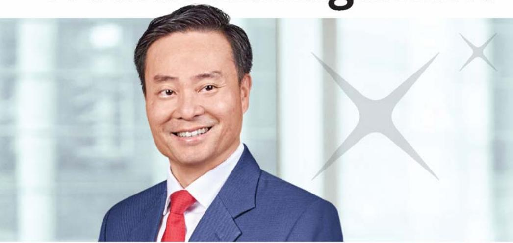

Generating meaningful and enduring impact is a key business imperative as we continue earning the privilege to be our customers' primary financial partner. The success of our franchise is tied to how best we can tap our technology, assets and people to create innovative solutions and opportunities for all, including those with the fewest resources, to help them achieve their aspirations.

#### 2023 overview

Despite the rapidly evolving macroeconomic environment, Consumer Banking/ Wealth Management delivered strong results and maintained a healthy balance sheet. We benefitted from the tailwinds that came through higher interest rates, although growth was partially offset by softening demand for loans. Business momentum was sustained by net new money flows into the region, and higher fee income generated through increased productivity and greater use of artificial intelligence and machine learning (AI/ ML). We concluded the integration of Citigroup Inc.'s consumer banking business in Taiwan (Citi Consumer Taiwan), making DBS the biggest foreign bank by assets in Taiwan. We will continue to build out our business footprint, providing more value for our customers by helping them to navigate any financial uncertainty and grow their wealth.

## Strong broad-based interest and fee income growth

We delivered record earnings, propelled by broad-based interest and fee income growth. Our total income rose 35% to SGD 8.96 billion, due to substantial net interest income margin expansion and growth in wealth management fees. All six core markets delivered high double-digit income growth. With an improved cost-income ratio, net profit before tax grew 59% to SGD 4.28 billion.

Net interest income rose 45% to SGD 6.2 billion, driven by higher Fed rates and stronger deposit earnings in most of our markets. The growth was however moderated by margin compression in our asset portfolio. Overall, we still saw resilient growth in balances.

Non-interest income grew to SGD 2.76 billion due to higher investments and bancassurance product sales, cards and unsecured loan-related fees. Card fees rose 22% to SGD 1.04 billion, as travel spending surpassed pre-pandemic levels in all markets.

Despite intensifying competition, we upheld our market share lead in savings deposits, cards and the mortgage loan space in Singapore. The bancassurance business maintained its lead in Singapore for new business market share and we also became the market leader in digital bancassurance offerings.

#### Wealth Management: Sustained growth buoyed by rising wealth fees and robust family office practice

Our wealth franchise continued to build on last year's record outperformance, with total wealth management income climbing 35% to SGD 4.43 billion.

We benefitted from an accelerated shift of asset management, family offices and capital flows towards Asia, capturing SGD 24 billion of net new money inflows from North Asia, Southeast Asia, the Middle East and Europe. Assets under management (AUM) grew 23% to SGD 365 billion.

We gained market share in our Family Office business – DBS Private Bank onboarded more than a third of the 1,100 Single Family Offices set up in Singapore. As the first private bank in the world to launch a Multi Family Office proposition leveraging Singapore's Variable Capital Company (VCC) regime, we have attracted keen interest from ultra-high-networth clients looking to consolidate their wealth in Singapore. Our Family Office AUM continued its growth trajectory and grew 21% in 2023.

Our clients have also gone beyond conventional norms of passive charitable giving towards impact investing, partnering the DBS Foundation to provide support to businesses for impact in the region. In March 2023, we announced the first close of the Asia Impact First Fund, which we launched together with Heritas Capital to help innovative and high-growth social enterprises across Asia to scale and create greater social and environmental impact. We committed 50% of the over USD 20 million that was raised.

We continued to help more clients do well by doing good, further raising the bar on ESG investing. Currently, more than 50% of our clients' investment assets are made up of "sustainable investments" (MSCI BBB-rating). We enabled this by driving client advocacy, proactively conducting portfolio reviews, and making it easier for our clients to understand the ESG ratings of their portfolios.

Testament to the strides we have made, our wealth management business continued to be recognised globally. We were named "Asia's Best Bank for Wealth Management" by Euromoney for the second year running and clinched "Best Private Bank in Asia Pacific" from Global Finance for the fifth year running. One of the first-time wins included "Best Private Bank – Asia" from The Asset.

#### Consumer Banking: Driving financial inclusivity through 'phygital' engagement and ecosystem partnerships

One of our key differentiators is our phygital approach, which combines our digital capabilities with the expertise of frontline branch staff and wealth managers to serve the needs of clients and customers worldwide.

Data analytics and AI/ML have been critical enablers to deepening customer

engagement. By leveraging our Al/ ML models, we have continually engaged 8.6 million customers across the region via personalised nudges, guiding them towards better investment and financial planning decisions.

Our customers in Singapore have improved their financial health with our Al-powered digital financial planning tool, which combines content with customised advisory nudges and recommended solutions that suit a customer's risk profile.

To date, more than three million customers have engaged with the nudges. They saved 83% more, invested 4.3 times more, and were 2.3 times more insured than nonusers. Our wealth managers, who also received the nudges, enhanced their client relationships and drove more clients to take up legacy solutions in 2023.

DBS PayLah! usage continued to grow with more than 36 million logins a month, where users book tickets and rides, pay bills, and scan and pay at more than 180,000 points in Singapore. In 2023, we nearly tripled the volume of scan-to-pay transactions to be the top digital transactions platform in hawker centres.

Beyond Singapore, we strengthened our overseas presence by scaling our ecosystem partnerships in Indonesia, China, and India. We expanded our consumer finance business by working with 11 ecosystem partners such as Kredivo, JD.com and Cred to offer lending solutions to their customers. The volume of loans disbursed across these markets grew 118% to SGD 3.4 billion. Customers acquired via ecosystems in 2023 more than doubled from a year ago.

After the amalgamation of Lakshmi Vilas Bank (LVB) into DBS Bank India, we deepened customer relationships through personal loans, gold loans, MSME business loans and insurance. Through our distribution channels and partnerships, our gold loans book grew 56%.

Solidifying our footprint in North Asia, we completed the integration of Citi's consumer banking business in Taiwan in August 2023. Since then, business momentum has been strong. Within three months after the integration, more than one million Citi customers signed up for DBS digibank and Card+ apps.

## Putting customers at the heart of everything we do

We further accelerated our transformation to a data-driven, agile organisation that puts our customers at the heart of everything we do. This new way of working, what we call Managing through Journeys (MtJs),

| SGD million                           | 2023  | 2022  | YoY%  |
|---------------------------------------|-------|-------|-------|
| 3dD IIIIIII0II                        | 2023  | 2022  | 10170 |
| Total income                          | 8,957 | 6,654 | 35    |
| Retail                                | 4,532 | 3,382 | 34    |
| <ul> <li>Wealth Management</li> </ul> | 4,425 | 3,272 | 35    |
| Expenses                              | 4,412 | 3,803 | 16    |
| Profit before allowances              | 4,545 | 2,851 | 59    |
| Allowances                            | 270   | 158   | 71    |
| Profit before tax                     | 4,275 | 2,693 | 59    |

galvanises staff to leverage our data and digital capabilities to deliver new offerings more quickly. Across our markets, we operationalised MtJs performance cells in key consumer products such as cards, consumer finance, deposits, mortgages, and customer segments.

Today, 98% of consumer banking revenue is generated by MtJs squads comprising more than 2,000 technologists, wealth managers and business teams. We scaled unsecured loans in India by leveraging preapproved credit models and drove customer engagement through bespoke wealth content in Singapore and Taiwan.

We have for many years been building and seeking to deliver best-in-class experiences to our customers. But we recognise that we can always do better to continue earning the privilege to be our customers' primary financial partner. We will continue to innovate and enhance our services to serve our customers' banking, payment, investing and financial planning needs across our digital and physical touchpoints, anytime and from anywhere.

## Standing by our customers and the community

Amid the rising cost of living and an uncertain macro-outlook, we want to do what we can to stand by our customers, especially those facing acute financial stress, and help them tide over tough times.

That is why DBS/ POSB committed SGD 40 million in 2023 to intensify efforts to help Singaporeans and residents ease cost-of-living pressures. The support measures helped to defray everyday expenses, reduce mortgage payments and bolster savings. We recently extended our weekly hawker meal subsidy initiative for another six months, subsidising a total of 7.5 million hawker meals over 18 months from February 2023 to July 2024.

These efforts have been in addition to the bank's commitment of up to SGD 1 billion over the next 10 years to step up support for vulnerable communities and catalyse social impact.

To protect our customers from falling prey to fraud, we also rolled out new security measures that can thwart malware threats and enable customers to lock up their accounts. Education also plays a big role. Our employees and ecosystem partners such as the Singapore Police Force worked together via digital literacy workshops and content to teach customers how to prevent fraud.

#### What we look forward to

Generating meaningful and enduring impact is a key business imperative. The success of our franchise is tied to how best we can tap our technology, assets and people to create innovative solutions and opportunities for all, including those with the fewest resources, to help them achieve their aspirations. We seek to better support our customers so we can confidently navigate the uncertainties ahead together and drive more inclusive growth.

Shee Tse Koon
Consumer Banking/ Wealth Management
DBS Group Holdings

- Scale wealth proposition in Singapore and the region to widen retail access to wealth planning and advisory capabilities.
- Continue wealth business growth momentum by capturing inflows and grow sustainable fee income stream from the region, including Southeast Asia.
- Maximise value from Taiwan franchise by focusing on customer acquisition and deepening wallet share.
- Further advance MtJs transformation to grow revenue and deliver better customer experiences.
- Continue driving phygital customer engagement to foster a more inclusive community.

## **POSB** Highlights in 2023

#### **Driving digital and financial literacy** in the community

- We have been bolstering digital inclusion efforts in Singapore through DBS Foundation's strategic collaboration with the Infocomm Media Development Authority (IMDA). Under the twoyear support initiative, we contributed SGD 1 million, which includes the government's dollar-for-dollar matching, to the Digital for Life movement and stepped up our volunteer participation to jointly launch community programmes and organise workshops to raise digital and financial literacy.
- Through our People of Purpose movement, our employee volunteers have been running workshops that will reach 100,000 Singaporeans and residents across various community segments, such as youths, persons with disabilities, seniors and hawkers over the next two years.
- In 2023, we reached out to **59,000** participants via some **400** digital and financial literacy workshops or initiatives.

## Neighbours first, bankers second

Since our founding in 1877, we have stayed true to our mission of being the "People's Bank". We take pride in serving generations of Singaporeans, from creating a nationwide savings movement, to playing a key role in the development of Singapore, and in recent years, driving digital literacy in the community. Till today, our aim as Singapore's oldest and most loved bank is to always be at the forefront of providing pioneering financial solutions that cater to the evolving needs of Singaporeans. They include children, young adults, families, seniors and the community at large. We remain committed to giving back to the community and standing alongside Singaporeans, as we widen our reach to more vulnerable segments through various initiatives.

#### For children and families

#### **POSB Smart Buddy Programme**

- We made good progress in extending the world's first integrated in-school savings and payments programme to more schools. The POSB Smart Buddy programme, which was launched in 2017, creates a contactless payments ecosystem within the school environment to help cultivate sensible savings and spending habits among young students in an interactive, engaging manner. These students are then better equipped to achieve financial wellness when they transition to the next stage of their lives.
- We signed a Memorandum of Understanding with the Ministry of Education (MOE) to install a digital payment infrastructure in more than 330 primary and secondary schools, junior colleges/ Millennia Institute, and special education (SPED) schools by 2025. Under the partnership, we will also provide up to 400,000 students with smartwatches and cards for payments.
- Today, some **160,000** students in **170** schools are using Smart Buddy smartwatches and/ or smart cards for digital payments, up from the **70,000** students across **100** schools in 2022. The programme also supports needy students under the MOE Financial Assistance Scheme. To date, the number of students who are receiving meal subsidies via POSB Smart Buddy has nearly tripled to **17,000** students.
- To spark children's interest in financial literacy, we partnered visual education specialist Eyeyah! to curate an exhibition using animation and life-sized ATMs to bring to life concepts of saving and thrifting. The exhibition drew more than **770,000** visitors across schools, libraries and public fairs.
- As part of the bank's support measures to help ease cost-of-living pressures, we also provided school allowance subsidies of up to SGD 2 a week to 21,000 eligible students in 2023.

#### **POSB PAssion Run for Kids**

- Singapore's longest-running race of its kind returned in full force in 2023 with over 9,000 participants. Jointly organised by POSB and the People's Association (PA), the event is the largest charity kids run in Singapore.
- The event raised a record **SGD 1.24 million** for the POSB PAssion Kids Fund this year. In all, we have raised close to SGD 13 million, with more than 869,000 children benefitting from 229 programmes.

- We stepped up our digital literacy programmes for seniors in the community. We extended these programmes to hawker centres and also created a new anti-scam and cybersecurity guiz that was codeveloped with the Cyber Security Agency of Singapore and IMDA.
- In partnership with DBS Foundation and IMDA, we pioneered a new series of edutainment roadshows which incorporated digital literacy workshops with Getai entertainment to better reach out to the seniors and enhance their learning.
- Besides deepening collaborations with agencies such as IMDA, RSVP SG, the Council for Third Age and PA, we worked with new partners such as TOUCH Community Services to empower more seniors. We were a key partner of IMDA's Digital for Life Festival, which involved more than **30,000** participants and visitors.

#### For the students, working adults and migrant workers

- We partnered community partners, SPED schools and social service agencies to organise regular financial literacy workshops for kids and those with special needs. These sessions included bank branch visits to familiarise participants with banking services.
- In line with our priority to help customers achieve financial wellness, we also partnered several organisations such as Central Provident Fund (CPF) Board, National Trades Union Congress (NTUC), the Institute of Technical Education (ITE) to organise physical and virtual workshops/ seminars where students and working adults, including gig workers, learn how to better save, invest and plan for their retirement. In 2023, more than 28,000 ITE students took part in the financial literacy classes.
- POSB remains the only bank to work with the Migrant Workers' Centre and Centre for Domestic Employees to set up banking accounts for more than 900,000 migrant workers and foreign domestic workers. To deepen our engagement with them, we also organised digital literacy workshops for more than 5,000 migrant workers. Today, **75%** of migrant workers and foreign domestic workers use the POSB digibank app to conduct their banking transactions.

## **Corporate** governance

#### **Awards**

We received several accolades in 2023:

- Winner of the 'Singapore Corporate Governance Award 2023', and the 'Singapore Corporate Sustainability Award 2023', in the Securities Investors Association (Singapore) Investors' Choice Awards.
- ii) Gold award for Best Annual Report at the Singapore Corporate Awards 2023 (For companies with SGD 1 billion and above in market capitalisation).
- ii) Ranked 2nd place for the second consecutive year in the Singapore Governance and Transparency Index.

#### Governance framework

Our governance framework is anchored on competent leadership, effective internal controls, a strong risk culture and accountability to stakeholders. Our Board plays a key role in setting our governance standards to meet our stakeholders' expectations, and our leadership model ensures an appropriate balance of power, accountability and independence in decision-making across our various functional and geographic units.

Our corporate governance practices comply with the Banking (Corporate Governance) Regulations 2005 (Banking Regulations) and the Financial Holding Companies (Corporate Governance of Designated Financial Holding Companies with Bank Subsidiary) Regulations 2022 (FHC Regulations) (together with the Banking Regulations, the Regulations). We also comply, in all material aspects, with the Guidelines on Corporate Governance for Designated Financial Holding Companies, Banks, Direct Insurers, Reinsurers and Captive Insurers issued by the Monetary Authority of Singapore (MAS) on 9 November 2021, which comprises:

- i) the Code of Corporate Governance 2018 (2018 Code); and
- ii) the additional guidelines added by the MAS to take into account the unique characteristics of the business of banking, given the diverse and complex risks undertaken by financial institutions (Additional Guidelines).

We have described our corporate governance practices for our financial year ended 31 December 2023 with specific reference to the 2018 Code and the Additional Guidelines. A summary disclosure of our compliance with the express disclosure requirements in the 2018 Code and the Additional Guidelines have been provided on pages 106 to 108.

#### Competent leadership

#### Our board

**Key Information on our Directors** 

#### Chairman

#### **Mr Peter Seah**

Our Chairman, Mr Peter Seah, sits on all Board committees (other than the Board Sustainability Committee) and also chairs the Board Executive Committee (Board EXCO). Mr Seah performs a key role as an ambassador for DBS in our dealings with various stakeholders as well as in ensuring effective communication with our shareholders. He guides the Board through its decision-making process and ensures that the Board operates effectively as a team.

#### Board

10 Members

Mr Peter Seah Mr Piyush Gupta **Mr Olivier Lim**\* Mr Chng Kai Fong Dr Bonghan Cho Mr David Ho Ms Punita Lal Ms Judy Lee Mr Anthony Lim Mr Tham Sai Choy

The Board directs DBS in the conduct of its affairs and provides sound leadership to management. We have 10 Board members (including two female directors) with a broad range of experience and deep industry expertise. The make-up of our Board reflects diversity of gender, nationality, age, skills and knowledge. Independent Directors form the majority of the Board, and there are no alternate Directors on our Board.

#### \*Lead Independent Director

The Lead Independent Director, Mr Olivier Lim, had regular private sessions with the other independent Directors in the course of the year and provided feedback to the Chairman where necessary.

#### Chairman. Board and CEO

There is a very positive and constructive working relationship between our Chairman, Mr Peter Seah and CEO, Mr Piyush Gupta. Mr Gupta oversees the execution of DBS' strategy and is responsible for managing the day-to-day operations. Other than the CEO, none of the other Directors is a former or current employee of DBS Group Holdings Ltd (DBSH) or its subsidiaries.

The table below sets out key information on our Directors, the number of meetings which our Directors attended during 2023 as well as the remuneration for each Director

for financial year ended 31 December 2023 (FY2023). The remuneration of Non-Executive Directors (including the Chairman) does not include any variable component. Please refer

to pages 58 to 59 for more details on the Non-Executive Directors' fee structure for FY2023.

|                                                                                                                                                   | Meetings attendance record (1 January to 31 December 2023) |                   |                     |                         |                              |                     | Total remuneration for FY2023 (SGD) |                         |                         |                              |                                      |                       |
|---------------------------------------------------------------------------------------------------------------------------------------------------|---------------------------------------------------------------|-------------------|---------------------|-------------------------|------------------------------|---------------------|-------------------------------------|-------------------------|-------------------------|------------------------------|--------------------------------------|-----------------------|
| Director/ Independence status                                                                                                                  | BOD (1)                                            | NC (2) | EXCO (3) | AC (4)       | BRMC/ BTRC (5) | CMDC (6) | BSC (7)                  | AGM                     | Offsite (8)  | Directors'                   | Share-based                          | Others (c) |
|                                                                                                                                                   |                                                               |                   | 1                   | i e                     | 1                            | held in             |                                     |                         | _                       | fees (a) (SGD) | remuneration (b) (SGD) | (SGD)                 |
| Mu Datau Carlo 77                                                                                                                                 | 8                                                             | 5                 | 12                  | 4                       | 5                            | 4                   | 4                                   | 1                       | 1                       |                              |                                      |                       |
| Mr Peter Seah, 77 Non-Executive and Non-Independent Chairman  Chairman since 1 May 10  Board member since 16 Nov 09  Last re-elected on 31 Mar 23 | 8                                                             | 5                 | 12                  | 4                       | 5                            | 4                   | -                                   | 1                       | 1                       | 1,335,950                    | Total: 1,956,840.8 572,550        | 48,340.83             |
| <b>Dr Bonghan Cho, 59</b> Non-Executive and                                                                                                    |                                                               |                   |                     |                         |                              |                     |                                     |                         |                         | Total: 302,500               |                                      |                       |
| <ul><li>Independent Director</li><li>Board member since 26 Apr 18</li><li>Last re-elected on 31 Mar 22</li></ul>                                  | 8                                                             | 5                 | -                   | 3 (d)        | <b>2</b> (d)      | 4                   | -                                   | 1                       | 1                       | 211,750                      | 90,750                               | -                     |
| Mr Ho Tian Yee, 71 • Stepped down as a Non-Executive and                                                                                          | <b>1</b> (e)                                       | _                 |                     |                         | <b>1</b> (e)                 |                     | _                                   | 1                       |                         |                              | Total: 51,953 (e)         |                       |
| Non-Independent Director on 31 Mar 23                                                                                                          | 1,-,                                                          |                   | Ī                   | _                       | J,                           | Ī                   | _                                   |                         |                         | 51,953                       | -                                    | -                     |
| Mr Olivier Lim, 59 Non-Executive and Lead Independent Director                                                                                    |                                                               |                   |                     |                         |                              |                     |                                     |                         |                         |                              | Total: 452,000                       |                       |
| <ul> <li>Board member since 7 Nov 17</li> <li>Last re-elected on 31 Mar 22</li> <li>Lead Independent Director since 29 Apr 20</li> </ul>      | 8                                                             | 5                 | 12                  | -                       | 5                            | -                   | -                                   | 1                       | 1                       | 316,400                      | 135,600                              | -                     |
| Mr Tham Sai Choy, 64 Non-Executive and                                                                                                         |                                                               |                   |                     |                         |                              |                     |                                     |                         |                         |                              | Total: 413,500                       |                       |
| <ul><li>Independent Director</li><li>Board member since 3 Sep 18</li><li>Last re-elected on 31 Mar 22</li></ul>                                   | 8                                                             | 5                 | -                   | 4                       | 5                            | -                   | 4                                   | 1                       | 1                       | 289,450                      | 124,050                              | -                     |
| Ms Punita Lal, 61 Non-Executive and Independent Director                                                                                    | 7                                                             | 5                 | _                   | 4                       | _                            | 4                   | _                                   | 1                       | 1                       |                              | Total: 293,500                       |                       |
| <ul><li>Board member since 1 Apr 20</li><li>Last re-elected on 31 Mar 23</li></ul>                                                                |                                                               | _                 |                     |                         |                              |                     |                                     | •                       |                         | 205,450                      | 88,050                               | -                     |
| Mr Anthony Lim, 65 Non-Executive and Independent Director                                                                                         | Ω                                                             |                   | 12                  |                         | 5                            | 4                   |                                     | 1                       | 1                       |                              | Total: 373,000                       |                       |
| <ul> <li>Board member since 1 Apr 20</li> <li>Last re-elected on 31 Mar 23</li> </ul>                                                             | 8 -                                                           | -                 | 12                  |                         | 5                            | 4                   | -                                   | 1                       | 1                       | 261,100                      | 111,900                              | -                     |
| Mr Chng Kai Fong, 45 Non-Executive and Non-Independent Director                                                                             | <b>-</b>                                                      |                   |                     |                         |                              |                     |                                     |                         |                         |                              | Total: 305,000 (f)        |                       |
| <ul> <li>Board member since 31 Mar 21</li> <li>Last re-elected on 31 Mar 22</li> </ul>                                                            | <b>8</b> (f)                                       | 5 (f)  | -                   | <b>4</b> (f) | -                            | -                   | 3 (f)                    | <b>1</b> (f) | <b>1</b> (f) | 305,000                      | -                                    | -                     |
| Ms Judy Lee, 56 Non-Executive and                                                                                                              |                                                               |                   |                     |                         |                              |                     |                                     |                         |                         |                              | Total: 421,000                       |                       |
| <ul><li>Independent Director</li><li>Board member since 4 Aug 21</li><li>Last re-elected on 31 Mar 22</li></ul>                                   | 8                                                             | -                 | -                   | 4                       | 5                            | 4                   | 4                                   | 1                       | 1                       | 294,700                      | 126,300                              | -                     |

DBS ANNUAL REPORT 2023 | BUILDING A SUSTAINABLE ADVANTAGE **Corporate governance** 

|                                                                                    |                         | Meetings attendance record (1 January to 31 December 2023) |                     |                         |                              |                         |                         | Total Directors' remuneration for FY2023 (SGD) |                        |                                                                             |             |   |
|------------------------------------------------------------------------------------|-------------------------|---------------------------------------------------------------|---------------------|-------------------------|------------------------------|-------------------------|-------------------------|---------------------------------------------------|------------------------|-----------------------------------------------------------------------------|-------------|---|
| Director Independence status                                                    | BOD (1)      | NC (2)                                             | EXCO (3) | AC (4)       | BRMC/ BTRC (5) | CMDC (6)     | BSC (7)      | AGM                                               | Offsite (8) | Directors'                                                                  | Share-based |   |
| muependence status                                                                 |                         |                                                               | No.                 | of m                    | eetings                      | held in                 | 2023                    |                                                   | <u> </u>               | fees (a) remuneration (b) Others (c) (SGD) |             |   |
|                                                                                    | 8                       | 5                                                             | 12                  | 4                       | 5                            | 4                       | 4                       | 1                                                 | 1                      | (SGD)                                                                       | (SGD)       |   |
| Mr David Ho, 64  Non-Executive and Independent Director                            | <b>7</b> (g) | _                                                             | _                   | <b>1</b> (g) | <b>2</b> (g)      | <b>3</b> (g) | <b>3</b> (g) | _                                                 | 1                      | Total: 221,328                                                              |             |   |
| Board member since 26 Apr 23                                                       |                         |                                                               |                     |                         |                              |                         |                         |                                                   |                        | 154,929.60                                                                  | 66,398.40   | - |
| <b>Mr Piyush Gupta, 64</b> Executive Director/ CEO                                 | 8                       | 5#                                                            | 12#                 | 4#                      | 5#                           | 4#                      | 4                       | 1                                                 | 1                      | Please refer to the Remuneration Report on page 69 for details on the    |             |   |
| <ul><li>Board member since 9 Nov 09</li><li>Last re-elected on 30 Mar 21</li></ul> |                         |                                                               |                     |                         |                              |                         |                         |                                                   |                        | CEO's compensation                                                          |             |   |

- # Mr Gupta attended these meetings at the invitation of the respective committees.
- Board of Directors (BOD)
- (2) Nominating Committee (NC)(3) Board Executive Committee (Board EXCO)
- (4) Audit Committee (AC)
   (5) Board Risk Management Committee (BRMC) / BRMC Technology Risk Committee (BTRC). The BTRC (a sub-committee of the BRMC) was established on 22 September 2023.
- Compensation and Management Development Committee (CMDC)
- (7) Board Sustainability Committee (BSC)
- This is our annual board strategy offsite meeting
  Fees payable in cash, in 2024, for being a Director in 2023. This is 70% of each Director's total remuneration and is subject to shareholders' approval at the (a) 2024 AGM.
- This is 30% of each Director's total remuneration and shall be granted in the form of DBSH's ordinary shares. The actual number of DBSH's ordinary shares to be awarded will be rounded down to the nearest share, and any residual balance will be paid in cash. This is subject to shareholders' approval at the 2024 AGM.

- (c) Represents non-cash component and comprises car and driver for Mr Peter Seah.
  (d) Dr Bonghan Cho stepped down as a member of the AC and was appointed as a member of the BRMC/ BTRC on 1 November 2023.
  (e) As Mr Ho Tian Yee retired at the conclusion of the 2023 AGM, his director's remuneration for the period 1 January to 31 March 2023 will be paid fully in cash.
- Director's remuneration payable to Mr Chng Kai Fong will be paid fully in cash to a government agency, the Directorship and Consultancy Appointments Council.

  Mr David Ho was appointed as non-executive and independent Director and member of each of the BRMC, CMDC and BSC on 26 April 2023. Mr Ho attended all the meetings of the Board (7), BRMC (2), CMDC (3) and BSC (3) following his appointment. He stepped down as a member of the BRMC and was appointed as a member of the AC on 1 November 2023.

(Note: Directors are also paid attendance fees for Board and Board committee meetings, as well as for attending the AGM and the annual Board offsite meeting.)

#### 2023 board composition

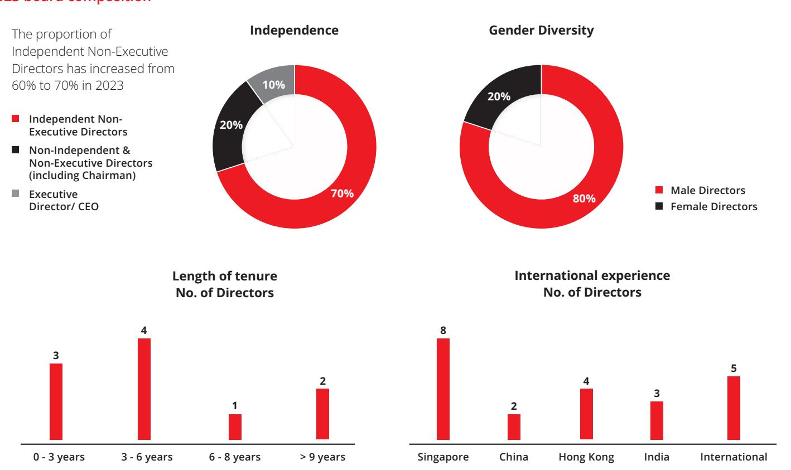

#### Board and Board Committee Composition and Key Responsibilities

| Members          | Composition requirements                                                                                                                                   | Key Responsibilities                                                                                                                                                                                                                                                                                                                                                                                                                                                                                                                                                                                                                                                                                                                                                                                                                                                                                                                                                                                                                                                                                                                                                                                                                                                                                                                                                                                                                                                                                                                                                                                                                                                                                                                                                                                                                                                                                                                                                                                                                                                                                                          |
|------------------|------------------------------------------------------------------------------------------------------------------------------------------------------------|-------------------------------------------------------------------------------------------------------------------------------------------------------------------------------------------------------------------------------------------------------------------------------------------------------------------------------------------------------------------------------------------------------------------------------------------------------------------------------------------------------------------------------------------------------------------------------------------------------------------------------------------------------------------------------------------------------------------------------------------------------------------------------------------------------------------------------------------------------------------------------------------------------------------------------------------------------------------------------------------------------------------------------------------------------------------------------------------------------------------------------------------------------------------------------------------------------------------------------------------------------------------------------------------------------------------------------------------------------------------------------------------------------------------------------------------------------------------------------------------------------------------------------------------------------------------------------------------------------------------------------------------------------------------------------------------------------------------------------------------------------------------------------------------------------------------------------------------------------------------------------------------------------------------------------------------------------------------------------------------------------------------------------------------------------------------------------------------------------------------------------|
| Members Board | In compliance with the Regulations, the Board comprises a majority of directors who are independent and who are Singapore citizens or permanent residents. | Sets the strategic direction and long-term goals of DBS, and ensures that adequate resources are available to meet these objectives.  Monitors the responsibilities delegated to the Board committees to ensure proper and effective oversight and control of DBS' activities.  Establishes a framework for risks to be assessed and managed.  Reviews management performance.  Determines DBS' values and standards (including ethical standards) and ensures that obligations to its stakeholders are understood and met.  Ensures that corporate responsibility and ethical standards underpin the conduct of DBS' business.  Develops succession plans for the Board and CEO.  Considers sustainability issues (including environmental and social factors) as part of DBS' strategy.  Board meetings and activities  Board and Board committee meetings are scheduled well in advance of each year in consultation with the Directors. There are five scheduled Board meetings each year. Ad-hoc meetings are also held when necessary. Please refer to the Board highlights - 2023 section on pages 50 to 51 for more information on the key focus areas of the Board in 2023.  Before each Board meeting, the Chairman oversees the setting of the agenda of Board meetings, in consultation with the CEO, to ensure that there is sufficient information and time to address all agenda items.  The agenda also allows for flexibility when needed. Directors are provided with complete information and time to address all agenda items.  The agenda also allows for flexibility when needed. Directors are provided with complete information and time to address all agenda items.  The agenda also allows for flexibility when needed. Directors are provided with complete information and time to address all agenda items.  The Agenda and Board committee meetings are uploaded onto a secure portal which can be accessed on tablet devices provided to the Directors and the Captor of the Agenda items.  The Chairperson of each Board committee provides an update on significant matters discussed at t |

46 **DBS ANNUAL REPORT 2023** BUILDING A SUSTAINABLE ADVANTAGE **Corporate governance** 47

| Members                                                                          | Composition requirements                                                                                                                                  | Key Responsibilities                                                                                                                                                                                                                                                                                                                                                                                                                                                                                                                                                                                |                                                                                                              |
|----------------------------------------------------------------------------------|-----------------------------------------------------------------------------------------------------------------------------------------------------------|-----------------------------------------------------------------------------------------------------------------------------------------------------------------------------------------------------------------------------------------------------------------------------------------------------------------------------------------------------------------------------------------------------------------------------------------------------------------------------------------------------------------------------------------------------------------------------------------------------|--------------------------------------------------------------------------------------------------------------|
|                                                                                  |                                                                                                                                                           | Directors have independent access to the Group Secretary. The Group Secretary attends all Board meetings and minutes are prepared to record key deliberations and decisions taken during the meetings. The Group Secretary facilitates communication between the Board, its committees and management, and generally assists Directors in the discharge of their duties. The Group Secretary helps with the induction of new Directors. The appointment and removal of the Group Secretary require the approval of the Board.                                                     | Nominating Committee (NC) • Mr Tham Sai Choy (Chairperson) • Mr Olivier Lim (Lead Independent |
|                                                                                  |                                                                                                                                                           | Annual Board strategy oΊ site Each year, the Board and our senior executives attend a strategy oΊ site held in one of our markets, which allows them to: • focus on DBS' long-term strategy apart from the regular agenda at the quarterly Board meetings; • engage in dynamic and in-depth strategic discussions to promote deeper understanding of our business environment and our operations, and re΋ ne our strategy; and                                                                                                                                                 | Director) • Dr Bonghan Cho • Ms Punita Lal • Mr Peter Seah • Mr Chng Kai Fong                    |
|                                                                                  |                                                                                                                                                           | • engage with our stakeholders in the host country (such as regulators, media, customers including CEOs and CFOs of our corporate clients and staΊ in the local franchise).                                                                                                                                                                                                                                                                                                                                                                                                                   |                                                                                                              |
|                                                                                  |                                                                                                                                                           | The 2023 Board strategy oΊ site was held in the last week of September 2023. Please refer to the Board highlights - 2023 section on page 50 for more information on the discussions during the 2023 Board strategy oΊ site.                                                                                                                                                                                                                                                                                                                                                                   | Audit Committee (AC)                                                                                         |
|                                                                                  |                                                                                                                                                           | Frequent and eΊ ective engagement Directors have ongoing interactions across various levels, functions and countries within DBS. In addition, some Directors also sit on the boards of our overseas subsidiaries; this arrangement gives the Board access to ΋ rst-hand insight on the activities of these subsidiaries. The CFO provides the Board with detailed ΋ nancial performance reports monthly.                                                                                                                                                                             | • Mr Tham Sai Choy (Chairperson) • Mr David Ho* • Ms Punita Lal • Ms Judy Lee • Mr Peter Seah |
|                                                                                  |                                                                                                                                                           | Directors also have various opportunities to interact with members of the Group Management Committee (GMC), for instance, at quarterly Board-hosted dinners and during the annual board strategy oΊ site.                                                                                                                                                                                                                                                                                                                                                                                     | • Mr Chng Kai Fong * Mr David Ho joined the AC on 1 November 2023.                                     |
|                                                                                  |                                                                                                                                                           | Delegation by the Board to the Board committees The Board has delegated authority to various Board committees to enable them to oversee certain speci΋ c responsibilities based on their terms of reference.                                                                                                                                                                                                                                                                                                                                                                                  |                                                                                                              |
|                                                                                  |                                                                                                                                                           | The terms of reference of each Board committee set out the responsibilities of the Board committee, conduct of meetings including quorum, voting requirements and quali΋ cations for Board committee membership. All our Board committees (other than the BSC) comprise Non-Executive Directors only. Any change to the terms of reference for any Board committee requires Board approval. The minutes of Board committee meetings, which records the key deliberations and decisions taken during these meetings, are circulated to all Board members for their information. |                                                                                                              |
| Board Executive Committee (Board EXCO) • Mr Peter Seah (Chairperson) | In accordance with the requirements of the Regulations, a majority (two out of three members of the Board EXCO) are Independent Non-Executive | • Approves certain matters speci΋ cally delegated by the Board such as acquisitions and divestments, credit transactions, investments, capital expenditure and expenses that exceed the limits that can be authorised by the CEO; • Reviews weak credit cases on a quarterly basis;                                                                                                                                                                                                                                                                                                     |                                                                                                              |
| • Mr Olivier Lim • Mr Anthony Lim                                             | Directors (INEDs).                                                                                                                                        | • Oversees the governance of strategic risks such as technology, arti΋ cial intelligence and data (including data privacy and appropriate use of data); and • Reviews and provides recommendations on matters that will require Board approval, including acquisitions and divestments exceeding certain material limits.                                                                                                                                                                                                                                                            |                                                                                                              |

| Members                                                                                                                                                                                                          | Composition requirements                                                                                                                                                                                                                                                                                                                                                                                                                                                                                                                                                                         | Key Responsibilities                                                                                                                                                                                                                                                                                                                                                                                                                                                                                                                                                                                                                                                                                                                                                                                                                                                                                                                                                                                                                                                                                                                                                                                                                                                                                                                                                                                                                                                                                                                                                                                                                                                                                                                                                                                                                                                                                                                                                                                                                                                                                                                                                                                                                                                                                                                                                                                                                                                                                                                                       |
|------------------------------------------------------------------------------------------------------------------------------------------------------------------------------------------------------------------|--------------------------------------------------------------------------------------------------------------------------------------------------------------------------------------------------------------------------------------------------------------------------------------------------------------------------------------------------------------------------------------------------------------------------------------------------------------------------------------------------------------------------------------------------------------------------------------------------|------------------------------------------------------------------------------------------------------------------------------------------------------------------------------------------------------------------------------------------------------------------------------------------------------------------------------------------------------------------------------------------------------------------------------------------------------------------------------------------------------------------------------------------------------------------------------------------------------------------------------------------------------------------------------------------------------------------------------------------------------------------------------------------------------------------------------------------------------------------------------------------------------------------------------------------------------------------------------------------------------------------------------------------------------------------------------------------------------------------------------------------------------------------------------------------------------------------------------------------------------------------------------------------------------------------------------------------------------------------------------------------------------------------------------------------------------------------------------------------------------------------------------------------------------------------------------------------------------------------------------------------------------------------------------------------------------------------------------------------------------------------------------------------------------------------------------------------------------------------------------------------------------------------------------------------------------------------------------------------------------------------------------------------------------------------------------------------------------------------------------------------------------------------------------------------------------------------------------------------------------------------------------------------------------------------------------------------------------------------------------------------------------------------------------------------------------------------------------------------------------------------------------------------------------------|
| Nominating Committee (NC) • Mr Tham Sai Choy (Chairperson) • Mr Olivier Lim (Lead Independent Director) • Dr Bonghan Cho • Ms Punita Lal • Mr Peter Seah • Mr Chng Kai Fong        | In accordance with the requirements of the Regulations, a majority (four out of six members of the NC including the NC Chairperson) are INEDs. The Lead Independent Director is a member of the NC. All NC members are required to be re-appointed by the Board annually. Under the Regulations, every NC member shall hold o΍ ce until the next annual general meeting following that member's appointment, and shall be eligible for re appointment. The appointment and re-appointment of NC members require the prior approval of MAS. | • Regularly reviews the composition of the Board and Board committees, and independence of Directors; • Identi΋ es, reviews and recommends Board appointments for approval by the Board, taking into account the industry knowledge, skills, background, experience, professional quali΋ cations, age and gender of the candidate and the needs of the Board; • Conducts an annual evaluation of the performance of the Board, the Board committees and the Directors; • Implements the Board Diversity Policy and reviews its eΊ ectiveness; • Exercises oversight of the induction programme and continuous development programme for Directors, and ensures that ΋ rst-time directors with no prior experience as a director of a listed company in Singapore undergo relevant training; • Reviews and recommends to the Board the re-appointment of each Director having regard to his/ her performance, commitment and ability to contribute to the Board as well as his/ her age and skillset; • Assesses annually whether each Director has su΍ cient time to discharge his/ her responsibilities; and • Reviews the Board's succession plans for Directors.                                                                                                                                                                                                                                                                                                                                                                                                                                                                                                                                                                                                                                                                                                                                                                                                                                                                                                                                                                                                                                                                                                                                                                                                                                                                                                                                  |
| Audit Committee (AC) • Mr Tham Sai Choy (Chairperson) • Mr David Ho* • Ms Punita Lal • Ms Judy Lee • Mr Peter Seah • Mr Chng Kai Fong * Mr David Ho joined the AC on 1 November 2023. | In accordance with the requirements of the Regulations, a majority (four out of the six members of the AC including the AC Chairperson) are INEDs. Mr Tham possesses an accounting quali΋ cation and was formerly the managing partner and Head of Audit of KPMG, Singapore. All members of the AC are non executive directors, and have recent and relevant accounting or related ΋ nancial management expertise or experience.                                                                                                                          | Financial reporting and disclosure matters • Monitors the ΋ nancial reporting process, signi΋ cant ΋ nancial reporting issues and judgements to ensure the integrity of the Group's consolidated ΋ nancial statements; • Reviews the Group's consolidated ΋ nancial statements, other ΋ nancial disclosures (including Basel Pillar 3 disclosures) and any announcements relating to the Group's ΋ nancial performance prior to submission to the Board; and • Provides oversight of external disclosure governance. Internal controls • Reviews (in parallel with the Board Risk Management Committee) the adequacy and eΊ ectiveness of internal controls, such as ΋ nancial, operational, compliance and information technology controls, as well as risk management systems; • Receives updates on signi΋ cant incidents of non-compliance with laws and regulations, and reviews management's investigations of such incidents; • Reviews and monitors remedial action plans to address signi΋ cant internal control de΋ ciencies identi΋ ed by management, Group Audit, the external auditor and/ or regulators; • Ensures that there are policies and arrangements in place by which DBS staΊ and any other persons may, in con΋ dence, raise concerns about possible improprieties in matters of ΋ nancial reporting or other matters and ensures that arrangements are also in place for such concerns to be independently investigated and for appropriate follow-up action to be taken; • Reviews signi΋ cant matters raised through the whistle-blowing channel; and • Reviews all material related party transactions (including interested person transactions) and keeps the Board informed of the ΋ ndings and conclusions from its review. Internal audit • Reviews at least annually, the independence, adequacy and eΊ ectiveness of the Group's internal audit function (Group Audit) and processes, and ensures that Group Audit is adequately resourced and set up to carry out its functions, including approving its budget; • Reviews Group Audit's audit plans, the proposed areas of audit focus, and results of audits; • Ensures that an internal quality assurance review (QAR) of Group Audit is conducted annually, and that an independent QAR is conducted at least once every ΋ ve years; and • Approves the hiring, removal, resignation, evaluation and compensation of the Head of Group Audit. |

*\* Names denoted in red are INEDs. \* Names denoted in red are INEDs.*

| Members                                                                                                                                                                                                                                            | Composition requirements                                                                                                                                                                                                                                                                             | Key Responsibilities                                                                                                                                                                                                                                                                                                                                                                                                                                                                                                                                                                                                                                                                                                                                                                                                                                                                                                                                                                                                                                                                                                                                                                                                                                                                                                                                                                                                                                                                                                                                                                                                                                                                                                                                                                                                                                                                                                                                                                                                                                                                                                                                                                                                                                                                                                                                                                                                                                                                                                                                  |
|----------------------------------------------------------------------------------------------------------------------------------------------------------------------------------------------------------------------------------------------------|------------------------------------------------------------------------------------------------------------------------------------------------------------------------------------------------------------------------------------------------------------------------------------------------------|-------------------------------------------------------------------------------------------------------------------------------------------------------------------------------------------------------------------------------------------------------------------------------------------------------------------------------------------------------------------------------------------------------------------------------------------------------------------------------------------------------------------------------------------------------------------------------------------------------------------------------------------------------------------------------------------------------------------------------------------------------------------------------------------------------------------------------------------------------------------------------------------------------------------------------------------------------------------------------------------------------------------------------------------------------------------------------------------------------------------------------------------------------------------------------------------------------------------------------------------------------------------------------------------------------------------------------------------------------------------------------------------------------------------------------------------------------------------------------------------------------------------------------------------------------------------------------------------------------------------------------------------------------------------------------------------------------------------------------------------------------------------------------------------------------------------------------------------------------------------------------------------------------------------------------------------------------------------------------------------------------------------------------------------------------------------------------------------------------------------------------------------------------------------------------------------------------------------------------------------------------------------------------------------------------------------------------------------------------------------------------------------------------------------------------------------------------------------------------------------------------------------------------------------------------|
|                                                                                                                                                                                                                                                    |                                                                                                                                                                                                                                                                                                      | External auditor • Determines the criteria for selecting, monitoring and assessing the external auditor, and makes recommendations to the Board on the appointment, re-appointment and removal of the external auditor; • Approves the remuneration and terms of engagement of the external auditor; • Reviews and discusses the key audit matters (identi΋ed by the external auditor pursuant to auditing standards) with the external auditor and management, and ascertains if these matters are presented appropriately; • Reviews the scope and results of the external audits and the independence, adequacy and objectivity of the external auditor; • Ensures that the external auditor promptly communicates to the AC all information regarding internal control weaknesses or de΋ ciencies, and that these are promptly recti΋ ed; and • Reviews the assistance given by management to the external auditor. The AC has the authority to investigate any matter within its terms of reference, and has full access to and cooperation from management.                                                                                                                                                                                                                                                                                                                                                                                                                                                                                                                                                                                                                                                                                                                                                                                                                                                                                                                                                                                                                                                                                                                                                                                                                                                                                                                                                                                                                                        |
| Board Risk Management Committee (BRMC) • Mr Olivier Lim (Chairperson) • Dr Bonghan Cho* • Ms Judy Lee • Mr Anthony Lim • Mr Tham Sai Choy • Mr Peter Seah * Dr Bonghan Cho joined the BRMC on 1 November 2023. | All BRMC members are non executive Directors, which exceeds the requirements of the Regulations. All BRMC members are appropriately quali΋ ed to discharge their responsibilities, and have the relevant technical ΋ nancial expertise in risk disciplines or businesses. | • Supports the Board and management in setting the tone from the top so as to embed and maintain appropriate risk culture; • Guides the development of, and recommends for the Board's approval, the risk appetite for various types of risk, and exercises oversight on how this is operationalised into individual risk appetite limits; • Approves the Group's overall and speci΋ c risk governance frameworks; • Has direct oversight of the CRO (jointly with the CEO); • Oversees the risk assessment framework established to manage the Group's ΋ nancial crime, technology risks (including cybersecurity), fair dealing and regulatory risks; • Oversees an independent risk management system, and the adequacy and appropriateness of resources to identify and evaluate risks; • Reviews the risks arising from new business activities, and the associated risk management and governance approach; • Reviews (in parallel with the Audit Committee) the adequacy and eΊ ectiveness of internal controls, such as ΋ nancial, operational, compliance and information technology controls, as well as risk management systems; • Monitors market developments, such as macro-economic and country risks, ΋ nancial and operational (including technology) risks, risk concentrations, and stress tests related to these developments; • Monitors risk exposures and pro΋ le against relevant risk thresholds, and risk strategy in accordance with approved risk appetite and/ or guidelines; • Determines risk reporting requirements, having regard to regulatory guidance, and reviews the risk dashboard to keep track of major risk positions and risk developments; • Monitors the quarterly portfolio reviews of total exposures as well as large exposures and asset quality; • Reviews large risk events and subsequent remedial action plans; • Oversees the risk models governance approach, including approving risk models used for capital computation and monitoring the performance of previously approved models; • Exercises oversight of the Internal Capital Adequacy Assessment Process (ICAAP) including approval of stress scenarios and commensurate results for capital, risk- weighted assets, pro΋ t and loss and liquidity; • Approves the Business Continuity Management attestation and Group Recovery Plan; and • Exercises oversight of regulatory requirements relating to risk management. |

| Members                                                                                                                                                                                                                                                                                                          | Composition requirements                                                                                                                                                                            | Key Responsibilities                                                                                                                                                                                                                                                                                                                                                                                                                                                                                                                                                                                                                                                                                                                                                                                                                                                                                                                                                                                                                                                                                                                                             |
|------------------------------------------------------------------------------------------------------------------------------------------------------------------------------------------------------------------------------------------------------------------------------------------------------------------|-----------------------------------------------------------------------------------------------------------------------------------------------------------------------------------------------------|------------------------------------------------------------------------------------------------------------------------------------------------------------------------------------------------------------------------------------------------------------------------------------------------------------------------------------------------------------------------------------------------------------------------------------------------------------------------------------------------------------------------------------------------------------------------------------------------------------------------------------------------------------------------------------------------------------------------------------------------------------------------------------------------------------------------------------------------------------------------------------------------------------------------------------------------------------------------------------------------------------------------------------------------------------------------------------------------------------------------------------------------------------------|
| Sub-committee of the BRMC BRMC Technology Risk Committee (BTRC) • Mr Olivier Lim (Chairperson) • Dr Bonghan Cho • Ms Judy Lee • Mr Anthony Lim • Mr Tham Sai Choy • Mr Peter Seah • Mr Ajey Gore (Non-Director member) • Mr Marc Massar (Non-Director member) | There are currently no speci΋ c composition requirements prescribed under Singapore regulations. There is the ability to co-opt additional subject matter experts on to the BTRC. | • This sub-committee was formed under the direction of the Board to enhance technology resiliency and governance. • Reviews, and where applicable, makes recommendations to the BRMC on management's approach/ proposals in relation to the technology risk management strategy, framework, risk appetite and risk tolerance that the Group is willing and able to assume; • Exercises oversight of the technology risk management function of the Group and the eΊorts to nurture a strong culture of technology risk awareness and management throughout the Group; • Reviews technology risk exposures or incidents and remedial plans taken to monitor and control such risks as well as emerging technology risk trends; and • Reviews the Group's compliance with technology-related regulations and standards.                                                                                                                                                                                                                                                                                                     |
| Compensation and Management Development Committee (CMDC) • Mr Anthony Lim (Chairperson) • Dr Bonghan Cho • Mr David Ho* • Ms Punita Lal • Ms Judy Lee • Mr Peter Seah * Mr David Ho joined the CMDC on 26 April 2023.                                                        | In accordance with the requirements of the Regulations, a majority (four out of the ΋ ve members of the CMDC including the CMDC Chairperson) are INEDs.                              | • Exercises supervisory oversight of the philosophies, principles, parameters and governance of DBS' remuneration policy and ensures that DBS' compensation approach balances risk management with long-term business growth; • Oversees the remuneration of senior executives and Directors, including making recommendations to the Board on the remuneration of executive directors; and • Exercises oversight on talent development and succession planning of the Group to ensure a robust talent bench strength and deepen the necessary competencies and strong leadership capabilities of the Group's people for its continued success.                                                                                                                                                                                                                                                                                                                                                                                                                                                                                    |
| Board Sustainability Committee (BSC) • Mr Piyush Gupta (Chairperson) • Mr David Ho* • Ms Judy Lee • Mr Tham Sai Choy • Mr Chng Kai Fong • Dr Ben Caldecott (Non-Director member) * Mr David Ho joined the BSC on 26 April 2023.                                              | There are currently no speci΋ c composition requirements prescribed under Singapore regulations. There is the ability to co-opt additional subject matter experts on to the BSC.  | • The BSC was formed under the direction of the Board to provide greater governance and oversight of our sustainability agenda. • Oversees DBS' plans and approves strategies, goals, and targets in relation to the Group's sustainability pillars: Responsible Banking, Responsible Business Practices, and Impact Beyond Banking; • Reviews and approves the Group's Sustainability Report, including approaches to meet disclosure requirements such as regulatory speci΋ cations or listing obligations; • Reviews and approves the Group's climate-related disclosures, including business and ΋ nancial implications, which may arise from climate-related stress tests, and consider viability of proposed responses; • Exercises oversight of the Group's Board and Management governance framework on sustainability matters (e.g., Group Sustainability Council), taking into account regulatory expectations, including those for material operating subsidiaries; and • Oversees emerging sustainability issues and the strategies and outreach programmes for engaging our key stakeholder groups. |

*\* Names denoted in red are INEDs. \* Names denoted in red are INEDs.*

## Highlights of Board and Board Committees – 2023

#### Board highlights - 2023 Focus on Strategy

The Board focused on how DBS could create value for all stakeholders by (i) analysing global and regional macro-economic trends; (ii) reviewing the impact of bank failures in the United States; (iii) reviewing our dividend policy, capital outlook, and distribution options; (iv) reviewing the plans and messaging for Investor Day 2023; (v) leveraging artificial learning/ machine learning (Al/ ML) to enhance productivity and efficiency bank-wide; and (vi) enhancing our capabilities to foster sustainable growth and development in certain business lines. During the annual Board strategy offsite (which was held in September 2023), the Board actively deliberated on, inter alia:

- (i) the digital wave in Al and generative Al (Gen Al);
- (ii) revalidating DBS' Asia strategy for sustained growth; and
- (iii) building our North Asia resilience.

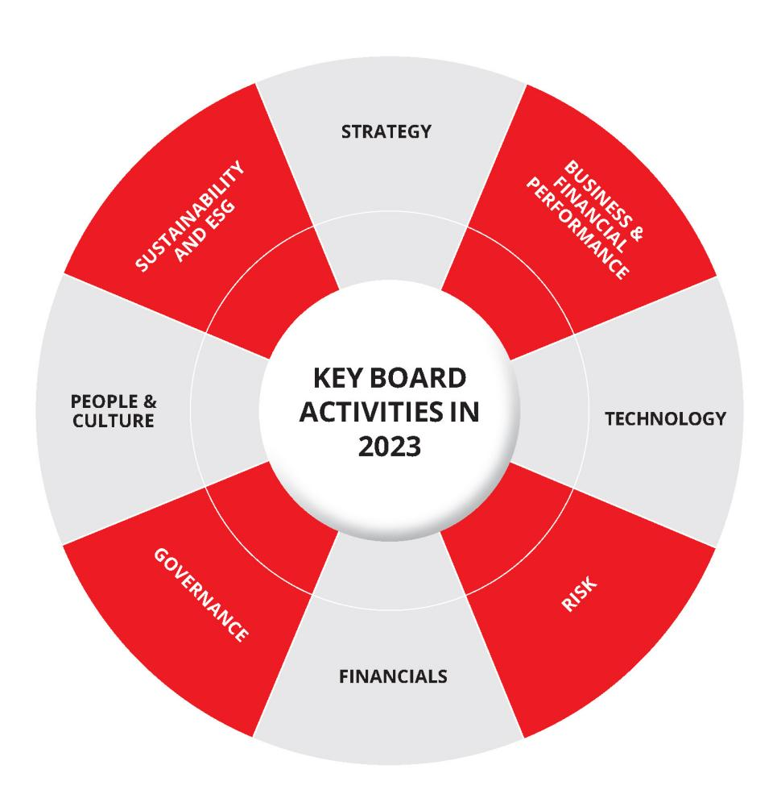

#### **Technology Matters**

The Board had in-depth discussions and reviews on the initiatives to strengthen our technology architecture and resiliency, in light of the digital disruptions during the course of 2023.

In March 2023, the Board established a Special Board Committee (SBC), chaired by the Lead Independent Director, comprising certain members of the Board and supported by external subject matter experts. This committee, with support from Accenture, oversaw the development of a comprehensive technology resiliency roadmap. The BTRC was set up in September 2023 and has assumed the responsibilities previously held by the SBC. It will continue to closely monitor the progress of our remedial activities, and ensure ongoing diligence and oversight in addressing technology-related challenges. In conjunction with these efforts, a Technology Risk Management Uplift (T-Up) Programme, chaired by the CEO was also established.

Please refer to sections "Letter from Chairman & CEO", "CRO statement" and "CIO statement" in the Annual Report for a more in-depth description on our response to the digital disruptions, the technology resiliency roadmap and the T-Up Programme.

#### Sustainability and ESG

The Board remained committed to sustainability and environmental, social and governance (ESG) issues.

DBS continued to embed ESG considerations into our business strategy, reflecting our dedication to responsible banking. responsible business practices and creating impact beyond banking. The Board reaffirmed and endorsed our overall sustainability strategy to be "Best Bank for a Better World" by creating business opportunities while solving the critical challenges facing society, such as climate change, aging population and income equality, among others. The Board also actively supported sustainable finance initiatives, funding projects and businesses that have a positive impact on society and the environment. To that end, in 2023, DBS announced a commitment of up to SGD 1 billion, over the next 10 years, to improve the lives and livelihoods of the low-income and underprivileged and foster a more inclusive society

#### **People and Culture**

People and culture were another area of focus for the Board in 2023. The CEO updated the Board on the 2023 employee survey "MyVoice", and noted that (i) overall MyVoice engagement had been on an upward trend since 2015; (ii) all key indices in MyVoice had witnessed an improvement; (iii) most core markets have increased

in engagement and outperformed the respective country financial services industry scores; and (iv) increase in MyVoice scores across most units within the Bank.

The Board discussed people and leadership matters, including the need to focus on employees and to provide clear career paths for employees and to drive gender, intergenerational and foreign talent diversity and inclusion. The Board was also updated on (i) efforts relating to culture and employee experience and integration of the workforce of Citigroup Inc.'s consumer banking business in Taiwan (Citi Consumer Taiwan), and (ii) the Group's focus on continuously refreshing leaders, and promoting internal successors with strong innovative, collaborative and growth mindsets.

#### Pursuing Inorganic Acquisitions and New Business Initiatives

The Board reviewed and deliberated on several inorganic acquisitions and new business initiatives. These transactions included the (i) completion of the acquisition of Citi Consumer Taiwan; and (ii) acquisition of an additional stake in Shenzhen Rural Commercial Bank, increasing our shareholding from 13% to 16.69%. The Board also deliberated on the risks arising from new business initiatives and ensured that appropriate risk management and governance policies and procedures were put in place to manage these.

#### **Board Renewal**

Board renewal is a key focus for the Board. The NC conducts an annual review of each Director, and the composition of the Board and Board Committees. New Directors will be introduced gradually so that the Board and Board committees have a smooth transition period.

Diversity in, *inter alia*, gender and skillsets were one of the key considerations in the board renewal process to ensure that (i) the Board is appropriately balanced to support the long-term success of DBS; (ii) the skillsets of the retiring Directors are replaced and/ or the collective skillsets of the Directors is supplemented; and (iii) different perspectives are brought to the Board. Other key considerations include (i) whether the candidate would fit in with our Board's culture and diversity; (ii) the independence status of the candidate; and (iii) whether the candidate would be able to commit sufficient time to fulfil the duties of a Director. A skills matrix is used to assess if the skills and experience of a candidate complement those of the existing Board members. Potential candidates are informed of the level of contribution and commitment expected of a DBS Director.

As part of the Board renewal process:

- (i) Mr Ho Tian Yee had stepped down from the Board at the conclusion of the 2023 Annual General Meeting (2023 AGM), having served on the Board for more than 11 years; and
- (ii) Mr David Ho had been appointed to the Board on 26 April 2023. With Mr Ho Tian Yee's retirement and Mr David Ho's appointment, (i) the Board remained at 10 members, (ii) the proportion of Independent Directors had increased from six to seven; and (iii) DBS benefited from Mr David Ho's experience in the financial and technology sectors, and in key jurisdictions such as China, one of DBS' core markets.

#### **CEO Updates to the Board**

In 2023, the CEO updated the Board on, *inter alia*, the following:

- (i) 2023 strategic priorities;
- (ii) Reviews of strategic focus areas of specific business segments and overseas franchises;
- (iii) Al and data governance;
- (iv) the integration of Citi Consumer Taiwan;
- (v) technology resiliency, the risk appetite for technology risk management and the comprehensive technology resiliency roadmap to address technology governance and oversight, incident management, system resilience and change management;

- (vi) progress on the Group scorecard and performance;
- (vii) the employee engagement survey results and focus areas;
- (viii) macro-overview of our core markets; and
- (ix) 2024 key priorities.

#### **Board Executive Committee**

"The Board EXCO's activities in 2023 included deliberations on the comprehensive technology resiliency roadmap in response to the digital disruptions. Additionally, the Board EXCO discussed and endorsed various matters including transfer risk limits for key markets, as well as acquisitions and investments, including the increase in DBS' stake in Shenzhen Rural Commercial Bank, and various strategic endeavours such as new business initiatives.

The Board EXCO also conducted reviews of large credit and country limits in selected markets, as well as weak credits cases."

Peter Seah Chairman, Board EXCO

#### Highlights of Board EXCO's activities in 2023

- The Board EXCO assists the Board to enhance the business strategies and strengthen core competencies of DBS.
   The Board EXCO meets frequently and is able to offer greater responsiveness in the decision-making process of DBS.
- In addition to its quarterly review of weak credit cases, matters discussed and/ or endorsed at the Board EXCO meetings in 2023 included (i) annual transfer risk limits for key markets; (ii) investments and acquisitions, such as the acquisition of an additional stake in Shenzhen Rural Commercial Bank and the additional equity injection for DBS Bank India; (iii) new businesses such as the emissions reduction business comprising carbon credits and renewable energy certificates; (iv) regular updates on the digital disruptions and the comprehensive roadmap to improve technology resiliency; (v) macro-economic developments; and (vi) analysis of peer banks' results.

#### **Nominating Committee**

"In 2023, the NC continued to take steps to enhance the skillsets of the Board and Board Committees.

Mr David Ho, who joined the Board in April 2023, has a wealth of experience in China, as well as in the financial and technology sectors.

The appointment of Messrs Marc Massar and Ajey Gore, both of whom are senior technology practitioners as non-director members of the BTRC, augments the BRMC's expertise in the oversight of technology risk.

The NC is encouraged that the results of the board evaluation exercise for FY2023 had shown that the DBS Board continues to be well-managed and effective, underpinned by a clear sense of alignment, along with a strong culture of trust, openness and mutual respect."

Tham Sai Choy Chairman, NC

#### Highlights of NC's activities in 2023

### Selection criteria and nomination process for Directors

Before a new Director is appointed, suitable candidates are identified from various sources. Thereafter, the NC conducts an assessment to:

- review the candidate (including qualifications, attributes, capabilities, skills, age, past experience) to determine whether the candidate is fit and proper in accordance with the fit and proper guidelines issued by the MAS; and
- ascertain whether the candidate is independent from DBSH's substantial shareholder and/ or from management and business relationships with DBS.

The NC then interviews the short-listed candidates and makes its recommendations to the Board. All Board appointments are based on merit, taking into account the contributions the candidates can bring to the Board to enhance its effectiveness. Upon the appointment of a new Director, the NC will recommend to the Board his or her appointment to the appropriate Board committee(s) after matching the Director's skillset to the needs of each Board committee.

Board renewal process

Please refer to the Board highlights - 2023 section on page 51.

52 **DBS ANNUAL REPORT 2023** BUILDING A SUSTAINABLE ADVANTAGE **Corporate governance** 53

#### **Induction and Training for Directors**

The NC oversees the onboarding of new Directors. All new Directors go through our induction programme, which covers the duties and obligations of a Director and the responsibilities of, and work carried out by the Board committees. We provide a Director's pack, which acts as an aide memoire for the information covered by the induction programme. We have brie ng sessions for Directors given by members of senior management on the various businesses of DBS and its supporting functions. The NC is also responsible for ensuring that new Directors with no prior experience as a director of a listed company in Singapore undergo training in the roles and responsibilities of a director of a listed company. As DBS is the rst Singapore listed company directorship for our new Director, Mr David Ho, he attended training sessions conducted by the Singapore Institute of Directors (SID) on the roles and responsibilities of a listed company director. As part of the SGX-mandated sustainability training, he also attended the sustainability course, "Environment, Social and Governance Essentials".

In addition, Mr David Ho attended our induction programme over four days after he was appointed as a Director. As part of the induction programme, he had one-on-one meetings with members of the GMC.

#### **Annual review of Directors' independence**

The NC reviews and determines annually whether each Director is independent in accordance with the stringent standards required of nancial institutions prescribed under the Regulations. Under the Regulations, an "independent director" is de ned to mean a Director who is:

- independent from any management and business relationship with DBS;
- independent from any substantial shareholder of DBS; and
- has not served on the Board of DBS for a continuous period of nine years or longer.

The NC assessed and concluded that (i) all Directors are considered to be independent from business relationships with DBS; (ii) with the exception of Mr Piyush Gupta, all Directors are considered to be independent from management relationships with DBS; (iii) with the exception of Mr Chng Kai Fong, all Directors are considered to be independent from DBSH's substantial shareholder, Temasek Holdings (Private) Limited (Temasek). Mr Chng, who is the Permanent Secretary (Information and Development)

for the Ministry of Communications and Information, and concurrently the Permanent Secretary (Development) (Cybersecurity) in the Prime Minister's O ce, Singapore, is considered not independent of Temasek as the Singapore government is its ultimate owner; and (iv) Mr Peter Seah is a Non-Independent Director as he has served on the Board for more than nine years. Based on the NC's assessment, the Independent Directors are Dr Bonghan Cho, Mr David Ho, Ms Punita Lal, Ms Judy Lee, Mr Olivier Lim, Mr Anthony Lim and Mr Tham Sai Choy.

Although Mr Piyush Gupta, Mr David Ho, Ms Judy Lee, Mr Olivier Lim, Mr Anthony Lim, Mr Peter Seah and Mr Tham Sai Choy are on the boards of companies that have business relationships with DBS, and/ or are also directors of companies in which Temasek has investments (Temasek portfolio companies), the NC considers these Directors (i) independent of business relationships as the revenues arising from such relationships are not material; and (ii) independent of Temasek as their appointments on the boards of Temasek portfolio companies are nonexecutive in nature and they are not involved in the day-to-day conduct of the businesses of the Temasek portfolio companies. In addition, none of these Directors sit on any of the boards of the Temasek portfolio companies as a representative of Temasek and they do not take instructions from Temasek in acting as Directors.

#### **Board performance and evaluation**

The NC makes an assessment at least once a year to determine whether the Board and Board committees are performing eΊ ectively and identi es steps for improvement. The NC believes that it is important to obtain an independent perspective on the Board's performance periodically, and to gain insights on the Board's performance against peer boards and best practices. An external evaluator was last engaged to conduct the Board performance evaluation for the nancial year ended 2021.

In 2023, the NC engaged Russell Reynolds Associates (RRA), an independent external evaluator, to conduct the Board Evaluation for FY2023. RRA is not connected with DBS or any of the Directors. As part of the evaluation process, RRA conducted one-on-one interviews with each Director and selected members of senior management to obtain more in-depth feedback and perspectives on the performance of the Board. Thereafter, the Board evaluation questionnaire (which included questions on, *inter alia*, alignment of the Board on key issues and strategy, culture, diversity, overall Board dynamics, Board performance, and Board eΊ ectiveness) was augmented and circulated to each Director for their completion. The NC and Board analysed the report prepared by RRA and engaged in discussions regarding the ndings and recommendations. The results of the Board evaluation exercise a rmed that the Board continues to be well-managed and eΊ ective in ful lling its duties and responsibilities.

In addition to the annual Board evaluation exercise, the NC also conducts an annual review of each Director to determine whether each Director remains quali ed for o ce. In making its determination, the NC will take into account (i) the Director's age, track record, experience, skills and capabilities; (ii) whether each Director is able to and has been adequately carrying out his/ her duties as a Director, including the contributions and performance of each Director; and (iii) whether each Director has committed su cient time to his/ her duties as a director of DBS. The Board is satis ed that each Director has diligently discharged his or her duties as a Director of DBS and has contributed meaningfully to DBS.

#### **Directors' time commitment**

The meeting attendance records of all Directors as well as a list of their directorships of listed companies and their principal commitments are fully disclosed in the Annual Report. The NC assesses each Director's ability to commit time to DBS' aΊ airs in accordance with internal guidelines which take into account the number of other board and committee memberships a Director holds, as well as the size and complexity of the companies in which he/ she is a board member. Additionally, each Director is required to complete an annual self-assessment of his/ her time commitments.

While the Board has not set a maximum number of listed company board representations a Director may hold, all Directors appreciate the high level of commitment required of them. All Directors have met the requirements under the NC's guidelines. Based on the recent individual Director self-assessment for FY2023, and the attendance record of Board and Board Committee meetings during the year, the NC was satis ed that where a Director had other listed company board representations, and/ or other principal commitments, the Director was able and had been adequately carrying out his/ her duties as a director of DBS.

#### **Directors' tenure**

The NC members believe that it is in the interest of DBS for the Board to comprise both Directors with long tenure who have a deep understanding of the banking industry, as well as those with shorter tenures who can bring fresh ideas and perspectives. There are currently two Directors who have served for more than 11 years, and this is balanced by the progressive refreshing of the Board where seven long-serving Directors have stepped down and eight new Directors have been appointed since November 2017 (when we commenced the refreshing process).

The NC speci cally considered the skillsets and contributions of two long-serving Directors who will be remaining on the Board (being Mr Peter Seah and Mr Piyush Gupta). The NC deliberated and agreed that it is in DBS' interests for these Directors to continue serving on the Board of DBS for the following reasons:

- (i) it is important that Mr Seah remains as the Board Chairman to provide leadership and continuity. Mr Seah is a veteran former banker with wide industry experience, and he has been instrumental in the growth and transformation of DBS over the past 14 years. His guidance will be particularly valuable as DBS navigates the current macro-economic and geopolitical challenges, executes its digital transformation, growth and sustainability strategies and strengthens its franchise in the Greater Bay Area, China, Taiwan, India and Indonesia; and
- (ii) as CEO, Mr Gupta should remain as a Director to provide the Board with insights into the business.

#### **Re-election of Directors**

Under the Constitution of DBSH, onethird of Directors who are longest-serving since their last re-election are required to retire from o ce and, if eligible, stand for re-election at each AGM. Based on this rotation process, each Director is required to submit himself or herself for re-election by shareholders at least once every three years. In addition, new Directors (who are appointed in between AGMs) are required under DBSH's Constitution to stand for re-election at the rst AGM after their appointment. The NC reviews and recommends to the Board the rotation and reelection of Directors at the AGM.

Prior to each AGM, Group Secretariat informs the NC which Directors are required to retire at that AGM. The NC will then review the composition of the Board and decide whether to recommend to the Board the

re-election of these Directors, after taking into account factors such as their attendance, participation, contribution, expertise and competing time commitments.

At the 2024 AGM, Mr Piyush Gupta, Mr Chng Kai Fong and Ms Judy Lee will be retiring by rotation, while Mr David Ho is required to stand for re-election as this is the rst AGM after his appointment. At the recommendation of the NC and as approved by the Board, all four Directors will be standing for re-election at the 2024 AGM.

#### **Review of composition of Board Committees**

The NC regularly reviewed the size and composition of the Board committees in 2023 to ensure that all independence requirements continue to be met, and that the Board committees are of an appropriate size and comprise the appropriate balance of skills, knowledge and experience, as well as diversity of nationality, age and gender.

In 2023, the NC recommended, and the Board approved the following changes to the composition of the Board committees with eΊ ect from 1 November:

- Dr Bonghan Cho, who had previously served as a member of the SBC, was appointed as a member of the BRMC. This will allow the BRMC and BTRC to tap on Dr Bonghan Cho's skills and experience in the technology area more eΊ ectively. Concurrently, he stepped down as a member of the AC.
- Mr David Ho stepped down as a member of the BRMC, and was appointed as a member of the AC, leveraging his expertise and experience with regulated nancial institutions in Hong Kong and Canada. This ensures that the AC continues to be appropriately constituted with members equipped with the relevant skill sets.

#### **Continuous development programme for all Directors**

The NC monitors the frequency and quality of the Board training sessions, which are conducted either by external professionals or by management. The NC selects topics which are relevant to the Group's activities. Board members also contribute by highlighting areas of interests and possible topics.

The topics presented to the Board in 2023 as part of the continuous development programme included a training session on the state of generative arti cial intelligence and data governance.

#### **Board diversity**

We recognise that diversity is not merely limited to gender or any other personal attributes. We adopted a Board Diversity Policy which recognises the importance of having an eΊ ective and diverse Board, and states that the NC is responsible for setting the relevant objectives that promote and achieve diversity on the Board. In discharging its duties, the NC shall give due regard to the bene ts of all aspects of diversity and strive to ensure that the Board is appropriately balanced to support the long-term success of DBS.

The main objective of the Board Diversity Policy is to continue to maintain the appropriate balance of perspectives, skills and experience on the Board to support the long-term success of DBS. The Board Diversity Policy provides that the NC shall endeavour to ensure that female candidates are included for consideration when identifying candidates to be appointed as new directors, with the aim of having not less than two female directors on the Board, and will target to achieve 30% female Board representation by 2030. Currently, two out of 10 directors on the Board (20% of the Board) are female.

The NC is responsible for developing a framework to identify the skills that the Board collectively needs in order to discharge the Board's responsibilities eΊ ectively, taking into account the complexity of DBS' existing risk pro le, business operations and future business strategy. The NC has put in place a skills matrix which classi es skills, experience and knowledge of Directors into the following broad categories (i) Industry knowledge and experience; (ii) Financial and commercial acumen; (iii) Governance; (iv) Leadership; (v) Digital Transformation; and (vi) Sustainability.

The NC believes that there is an appropriate balance of industry knowledge, skills, background, experience, professional quali cations, age and gender on the Board, and is satis ed that the objectives of the Board Diversity Policy continue to be met.

#### Corporate governance

#### **Audit Committee**

"In 2023, the AC focused on key audit issues identified by the external auditors and Group Audit, including relevant internal control findings reported at SBC. The AC also reviewed areas where management had applied judgement in the preparation of the Group's financial statements.

The AC also conducted a review of reports from Group Audit and Legal and Compliance, as part of our assessment of the adequacy and effectiveness of the Group's internal controls and risk management systems. With respect to information technology risk management and controls, a comprehensive technology resiliency roadmap had been laid out to address gaps identified following a review by an external consultant and corroborated by internal findings. Consequential changes to the audit plans and resourcing were also considered and approved by the AC as a result of Group Audit's involvement in the SBC.

Sustainability reporting will become increasingly formalised over time, as seen in the sustainability reporting standards issued by the International Sustainability Standards Boards, and the recommendations of the Sustainability Reporting Advisory Committee and the Basel Committee's consultation on a Pillar 3 disclosure framework for climate-related financial risks. I expect this to become a more significant area of focus for the AC over time."

Tham Sai Choy Chairman, AC

#### Highlights of AC's activities in 2023

## Oversight of financial reporting and disclosure matters

In response to the risk-based approach to quarterly reporting that was adopted by the Singapore Exchange Regulation (SGX RegCo) from 7 February 2020, the Group transitioned to a semi-annual reporting regime that is complemented by trading updates between the half-yearly financial reports. The trading updates, which comprise the profit and loss account, key balance sheet items, financial ratios and business commentary, are intended to provide investors with continued line of sight on the Group's ongoing performance.

The AC reviewed the Group's trading updates and half-yearly financial statements, and recommended these to the Board for approval. The AC also took into account the assurances provided by the CEO and CFO that the financial statements are properly drawn up in accordance with the provisions of the Singapore Banking Act, Singapore Companies Act and Singapore Financial Reporting Standards (International) (SFRS(I)), and that the Group's financial risk management and internal control systems are adequate and effective.

The AC members were kept updated on changes to accounting standards and significant accounting matters involving the exercise of judgement. During the course of the financial year, the AC reviewed the following areas:

- Asset quality and the adequacy of provisions in light of the prevailing economic and political conditions, giving due consideration to the application of the SFRS(I) expected credit loss (ECL) requirements as well as guidance provided by international regulators and the MAS;
- Valuation matters, including assessing the adequacy of valuation reserves and the carrying value of goodwill;
- The financial impact on the integration of Citi Consumer Taiwan, including the fair value of its assets and liabilities, assessment of its asset quality, determination of the provisional goodwill and disclosures on this transaction; and
- Management's assessment of accounting treatment for significant transactions, such as the netting of derivative transactions.

The AC reviewed the Group's audited consolidated financial statements for FY2023 and discussed with management and the external auditor the significant matters which involved management judgement.

Please refer to the table on page 55 for further information on these significant matters. These matters are also discussed in the independent auditor's report on pages 114 to 119.

The AC is of the view that the Group's consolidated financial statements for FY2023 are fairly presented in conformity with the relevant SFRS(I) in all material aspects. The Board has been notified that the Group's external auditor, PricewaterhouseCoopers LLP (PwC), has read and considered the other information (i.e. other than the financial statements and auditor's report thereon) in the annual report, whether financial or nonfinancial, in accordance with the Singapore Standard on Auditing 720. For the financial year ended 31 December 2023: (i) no material inconsistencies between the other information, the financial statements and PwC's knowledge obtained in the audit; and (ii) no material misstatements of the other information, have been reported.

#### AC commentary on key audit matters

| Significant matters                           | How the AC reviewed these matters                                                                                                                                                                                                                                                                                                                                                                                                                                                                                                                                                                                                                                                                                                                                                                                                                                                                                                                                                                                              |
|-----------------------------------------------|--------------------------------------------------------------------------------------------------------------------------------------------------------------------------------------------------------------------------------------------------------------------------------------------------------------------------------------------------------------------------------------------------------------------------------------------------------------------------------------------------------------------------------------------------------------------------------------------------------------------------------------------------------------------------------------------------------------------------------------------------------------------------------------------------------------------------------------------------------------------------------------------------------------------------------------------------------------------------------------------------------------------------------|
| Specific allowances for loans and advances | The AC reviewed the significant non-performing credit exposures periodically and considered management's judgments, assumptions and methodologies used in the determination of the level of specific allowances required. The AC noted that major weak credits are reviewed by the Board Executive Committee quarterly and presented to the AC. The AC considered the results from Group Audit's independent assessment of the Group's credit portfolios across key markets and credit risk management process. Additionally, the AC was apprised of the external auditor's work over credit, which included sampling across performing, watch-list and non-performing portfolios to assess the appropriateness of the loan ratings and classification, as well as the adequacy of specific allowances where applicable. The AC is of the view that the special allowances that have been set aside for non-performing credit exposures are appropriate.                                                                       |
| General allowances for credit losses          | The AC reviewed the governance arrangements on the determination of general allowances, including the matters considered by the ECL Review Committee, as well as the key drivers of the quarterly movements in Stage 1 and Stage 2 ECL (General Allowances). These included the changes in portfolio asset quality, prevailing economic and geopolitical conditions, as well as modelled overlays to reflect management's assessment of these factors.  The AC noted that ECL models are validated by the Model Validation Team, which also monitors the models' performance, and approved by the Group Credit Risk Models Committee. The AC took into account the external auditor's observations, which included a review of selected portfolios. The external auditor had also assessed the Group's ECL methodologies (including calibrations to account for changes in the risk outlook), processes and controls.  The AC, on the back of these reviews, considers the general allowances to be within a reasonable range. |
| Goodwill                                      | The AC reviewed the methodology and key assumptions driving the cash flow projections that are used in the determination of the value-in-use of the DBS Bank (Hong Kong) Limited franchise, including the macroeconomic outlook. It also assessed the sensitivities of the value-in-use to reasonably possible changes in the valuation parameters. The AC reviewed the fair value adjustments made to the assets and liabilities arising from the acquisition of Citi Consumer Taiwan, along with the intangible assets that were identified and the resultant provisional goodwill. The AC was apprised of the external auditor's observations from its review of management's goodwill impairment assessment, and concurs that there is no impairment as at 31 December 2023.                                                                                                                                                                                                                                               |
| Valuation matters                             | The AC reviewed the governance arrangements on valuation matters, including the deliberations of the Group Valuation Committee, as well as the fair value hierarchy of financial instruments held at fair value; the quarterly movements in valuation reserves; the appropriateness of the Group's valuation methodology in light of industry developments; and the overall adequacy of valuation reserves. The AC was apprised of the external auditor's observations from its assessment of the Group's controls over the valuation process, along with its conclusion, based on the result of its independent estimates, that the valuation of financial instruments held at fair value was within a reasonable range of outcomes. The AC considers the valuation process, policies and estimates as adopted and disclosed in the financial statements to be appropriate.                                                                                                                                                   |

#### **Oversight of Group Audit**

The AC has direct oversight of Group Audit. The AC receives reports from Group Audit at each quarterly AC meeting, which provide the AC with an update on (i) the overall control environment (based on the results of the audit reviews in the preceding quarter); (ii) the key findings from audit reviews and the remediation actions which have been, or will be, taken to address these findings; (iii) an overview of the audit issues (including re-aged and past due issues) and audit reports issued during the preceding quarter; and (iv) any changes to the audit plan for AC approval.

Please refer to page 60 for details on Group Audit's key responsibilities and processes.

In addition to the findings from the routine audits, the AC was also apprised of the findings from other reviews including the validation of technology remediation actions pursuant to MAS' Directives arising from the disruption of digital banking services in Singapore in November 2021, new fund launched via a variable capital company to retail investors as well as post implementation reviews of a system upgrade in India as well as the integration of Citi Consumer Taiwan. The AC was also updated on the audits in key focus areas such as IT cybersecurity and resiliency that includes the results of the cyber red team simulation conducted to assess DBS' cybersecurity posture across all locations, as well as antimoney laundering (AML)/ counter-financing

of terrorism (CFT) focusing on Customer Due Diligence, Activity Surveillance/ transaction monitoring and reporting.

The AC assessed the adequacy, effectiveness and independence of Group Audit, and is of the view that Group Audit is independent, effective and adequately resourced. Group Audit understands the risks that the Group faces and has aligned its work to review these accordingly.

In 2023, there is at least one scheduled private session annually for the Head of Group Audit to meet the AC. In addition, the Chair of the AC meets the Head of Group Audit regularly, at least once every quarter, to review the key audit reports, findings and other significant matters of Group Audit.

Corporate governance

## Reviewing performance, objectivity and independence of the external auditor

The AC has unfettered access to the external auditor. Separate sessions were held during each of the four quarterly AC meetings in 2023 for the AC to meet with the external auditor without the presence of management to discuss matters that might have to be raised privately.

The AC monitors the performance, objectivity and independence of the external auditor. For this purpose, the AC takes into account the Audit Quality Indicators Disclosure Framework issued by the Accounting and Corporate Regulatory Authority (ACRA); the guidance provided in Practice Guidance 10 of the 2018 Code, as well as the principles outlined by the Basel Committee on Banking Supervision in its document "The External Audits of Banks".

The total fees due to PwC for the financial year ended 31 December 2023 and the breakdown of the fees for audit and non-audit services are set out in the table below. The AC reviewed the non-audit services provided by the external auditor during the financial year and the associated fees. The AC is satisfied that the independence and objectivity of the external auditor have not been impaired by the provision of those services.

| Fees relating to PwC services for FY2023 | SGD (million) |
|---------------------------------------------|------------------|
| For audit and audit-related services        | 10.6             |
| For non-audit services                      | 1.1              |
| Total                                       | 11.7             |

The AC considered the following matters in its review of the external auditor's performance and when formulating its recommendation on the re-appointment of the external auditor:

- the performance of the external auditor against industry and regulatory standards;
- the scope of the audit plan and areas of audit focus as agreed with the external auditor;
- the quality of audit services rendered, and reports and findings presented, by the external auditor during the year;
- feedback received from various functions/ geographical locations, through an annual structured internal survey, on the adequacy and quality of the audit team's resources, the level of independence and scepticism exercised in carrying out its work, and its overall efficiency and effectiveness;
- the Audit Quality Indicators data of the external auditor; and
- the external auditor's self-assessment, including the confirmation of its independence, to the AC.

Based on these considerations, the AC has recommended, and the Board has endorsed, the re-appointment of PwC for shareholders' approval at the 2024 AGM. The Group has complied with Rule 712 and Rule 715 of the SGX Listing Manual in relation to its external auditor.

#### **Board Risk Management Committee**

"In 2023, uplift to DBS' technology resiliency was a key area of focus. As the Bank's efforts accelerated over the year, the BRMC provided close guidance, including establishing a sub-committee, the BRMC Technology Risk Committee, for dedicated oversight, and the strengthening of the Three Lines model by including dedicated technology risk management expertise in the second line under the Chief Risk Officer.

Apart from the focus on technology risk, the BRMC continued to oversee DBS' risk governance approach and monitor all key risk areas, including financial crime, cybersecurity, and stress liquidity management. Beyond our regular risk management efforts, the BRMC also assessed the risk implications of key macroeconomic developments and regional geopolitical tensions on our portfolio and funding profile.

Setting the tone from the top to embed a strong risk culture will continue to be critical to DBS' success."

Olivier Lim Chairman, BMRC

#### Highlights of BRMC's activities in 2023

The BRMC's approach continued to be underpinned by a philosophy that risk management in complex and large organisations is best served by holistically integrating governance, culture, talent, structure and processes.

The BRMC convened at least quarterly to review the bank's risk profile, risk dashboards and other reports through a structured and consistent agenda format. The BRMC monitored global political and economic events, the impact of interest rate hikes, and other factors that might have material consequences for our business.

In 2023, the BRMC discussed the findings and the impact arising from scenario analyses and portfolio reviews conducted on certain countries and specific sectors, including:

- Inflationary pressures prompting significant rate hikes by central banks resulting in slower economic growth/ recession;
- Prolonged downturn in the China real estate sector leading to increased government support measures; and
- Market volatility in the banking sector due to the crisis in the US regional banking sector and the failure of Credit Suisse.

The scenario analyses are in addition to the reviews of various regulatory and internal stress testing exercises.

The BRMC also reviewed management's assessment of the impact arising from the following events:

- US-China-Taiwan tensions, particularly in the tech sector and the impact on supply chains due to export restrictions imposed by both US and China;
- Uncertainty over China's economic recovery resulting from weak domestic consumption, the downturn in real estate and RMB depreciation; and
- Conflict between Israel and Hamas and the impact on supply chains and oil prices.

The BRMC was updated on the stress liquidity management and discussed the impact of potential stress outflows over a week. It was kept informed of the utilisation of market risk (for both banking and trading books) and liquidity risk (in all major currencies and legal entities) limits, including the various initiatives to strengthen our liquidity channels and swift access to funding levers whenever required.

The BRMC was advised on the key operational risk profiles of the Group and the continued focus on global trends on financial crime (such as AML/ CFT, and digital scams), risks arising from sanctions evasion, fair dealing and conduct risks as well as the cybersecurity environment.

The BRMC reviewed and approved the risk models governance framework, which covers the development, approval and ongoing performance monitoring. The BRMC received regular updates on risk appetite and economic capital utilisation, and was apprised of regulatory feedback and developments (such as approaches for risk models and capital computation) and Basel requirements. In addition, the BRMC was updated on the action plans following the internal group-wide risk and control culture survey conducted in 2022.

The BRMC was updated on the risk and controls of new businesses (e.g. Emissions Reduction and Crypto Derivatives Business by T&M) as well as the integration progress of Citi Consumer Taiwan.

The BRMC was advised on key findings and learnings from the digital disruptions, and ongoing progress of the initiatives and programme to strengthen technology resiliency. The BRMC also reviewed revisions to the technology risk appetite, the changes to the technology governance framework, as well as resourcing of the technology workforce. The BRMC was updated on the independent validation of remediation actions on incidents undertaken by Group Audit. These discussions included joint sessions between the BRMC and the SBC.

## Please refer to the section on 'Risk Management' on pages 80 to 96 for more information on the BRMCs activities.

#### SBC

Following the disruption to DBS' digital banking services on 29 March 2023 (March Incident), the Board convened the Special Board Committee (SBC) to oversee a full review of the disruption. This review was subsequently extended to cover the disruption to DBS' digital banking services on 5 May 2023 (May Incident).

The SBC was chaired by Mr Olivier Lim and comprised Mr Tham Sai Choy, Dr Bonghan Cho and Mr Chng Kai Fong. The SBC engaged two independent experts to support them: Mr Ajey Gore and Mr Marc Massar, who are senior technology practitioners with relevant expertise.

#### Highlights of SBC's activities in 2023

The SBC appointed an independent third party, Accenture Pte Ltd (Accenture) in April 2023, to conduct a root cause investigation of the March and May Incidents and a comprehensive review of DBS' digital banking services.

Accenture issued its reports which contained its findings and recommendations from the review to the SBC. The SBC, Board, and management accepted and endorsed the findings and recommendations. Following directions issued by the SBC, management formulated plans that took onboard Accenture's findings and observations (and in certain cases went beyond Accenture's recommendations) as well as the target timelines to complete these plans. These plans and target timelines were approved by the Board and submitted to the MAS.

In January 2024, the SBC was dissolved, and the remaining responsibilities of the SBC were transferred to the BTRC.

## Establishment of BRMC Technology Risk Committee (BTRC)

The BRMC Technology Risk Committee (BTRC), a sub-committee of the BRMC, has been set up to assist the BRMC in overseeing the management of technology risk across the Group. Following the dissolution of the Special Board Committee (SBC) in January 2024, the BTRC had assumed the remaining responsibilities of the SBC to oversee the implementation of the plans to uplift DBS Bank's technology resilience and the business continuity management.

## Compensation Management Development Committee

"The CMDC reviewed the state of talent and strength of human capital in DBS through a rigorous assessment of our succession plans for our senior leadership positions and the identification, development, compensation and progression of High Potentials (HIPOs). In 2023, our HIPO attrition was 5.9%, while 19% and 34% of our HIPOs took on a new or expanded role respectively.

To future-proof our workforce, the CMDC ensured that robust plans are in place to drive leadership development at all levels, and the continuous upskilling and reskilling of our people. More than 8,100 employees across various markets and functions have been identified to transition to evolved roles in the coming years.

In 2023, as part of our efforts to improve technology resiliency, we have undertaken both immediate and longer-term measures to strengthen technology governance, people and leadership, systems and processes.

The CMDC assured itself that the group scorecard adequately reflected the digital disruptions in 2023 and this was taken into account to determine variable compensation for the Group. The CMDC further ensured that senior management was held accountable for the digital disruptions, with a collective 21% reduction in variable compensation, and the CEO taking a deeper cut of 30%."

Anthony Lim Chairman, CMDC

#### Highlights of CMDC's activities in 2023

## Group remuneration policy and annual variable pay pool

Please refer to the Remuneration Report on pages 65 to 69 for details on the remuneration of the CEO and DBS' remuneration strategy.

#### Talent Review and Succession Planning

Our annual talent review and succession planning process, which incorporates detailed input from key leaders, was systematically and rigorously conducted. Talent reviews were conducted at the Business Unit/ Support Unit level with the Group Functional Heads and were subsequently reviewed by the respective Country CEOs. This was followed by further rounds of talent reviews with the Group CEO, GMC and CMDC. This review encompassed a detailed assessment of our organisational structure, strategic capabilities, the talent bench strength required to drive our business outcomes, and succession plans for senior leadership positions.

In reviewing our talent bench strength, the CMDC also evaluated how our High Potentials (HIPOs) were identified, developed, compensated and progressed in their careers with the Bank based on the "3P" framework of Performance, PRIDE! and Potential (which is evaluated through one's ability, aspiration and engagement). This disciplined process ensured that the Bank continues to able to build a robust succession pipeline.

To develop future leaders with diverse and broad-based critical experiences, we scaled up our Strategic Talent Assignment & Rotation (STAR) Programme, a curated 2-year development programme that broadens the experience of HIPOs through a robust training curriculum and cross-country or crossfunctional rotations.

Our commitment to talent development yielded positive results. During the year, our HIPO attrition was 5.9%, with 19% of our HIPOs transitioning to new roles, while 34% assumed expanded responsibilities.

#### **Learning and Leadership**

DBS invests heavily in the development of our people as guided by our Triple "E" Development Framework. Areas of focus for learning are determined by reviewing market trends and relevant skills needed to drive our business. Across all our business units and support units, we curated Structured Learning Roadmaps and certification programmes to ensure our workforce possessed the functional knowledge and up-to-date expertise required for their respective roles. To date, we have launched over 30 comprehensive learning roadmaps encompassing a diverse range of skills, such as risk and control, credit assessment, data and digital, product sales and sustainability. Our employees were provided access to educational courses from a library of more than 10,000 curated courses on our learning portal, Learning Hub. Collectively, our employees successfully completed 1.4 million training courses in 2023.

Corporate governance

In addition, we initiated the process of equipping our employees with Gen Al skills to enhance their productivity, and to identify and mitigate risks associated with the usage of Gen Al

To further entrench our transformational leadership culture, in 2023, we conducted over 250 Transformational Sprints, a series of structured experiential workshops that contributed to improved collaboration and greater team effectiveness. Additionally, more than 1,000 leaders participated in T-Circles, which are social learning communities where experienced senior leaders mentor next-generation leaders in leadership best practices.

#### Strengthening technology resiliency

The Bank continued its efforts to strengthen our resiliency and business continuity. In 2023, we put in place people and leadership changes, including but not limited to the appointment of two Chief Technology Officers, to strengthen technology governance and resiliency.

## Group remuneration policy and annual variable pay pool

Please refer to the Remuneration Report on pages 65 to 69 for details on the remuneration of the CEO and DBS' remuneration strategy.

The CMDC reviewed and approved DBS' remuneration policy and the annual variable compensation pool for FY2023, which were also endorsed by the Board. The CMDC provided oversight of the remuneration principles of the CEO, senior executives and control functions to ensure that they remained in line with the Financial Stability Board's guidelines. As part of the review process, the CMDC appraised DBS' performance against the balanced scorecard for the year, and also took into account market trends to ensure that the Group's remuneration remained competitive to the market.

DBS has a robust disciplinary framework linked to individual compensation. The CMDC was apprised of the impact of disciplinary actions on individuals' compensation when approving the annual variable compensation pool and noted that (i) the Group's overall risk management are adequate and effective, and (ii) the 2023 Risk & Culture score from the Kincentric MyVoice survey increased to 93%. DBS' score was 8% higher than the APAC Financial Services Industry and 2% higher than the APAC Best Employer benchmarks.

#### Non-executive directors' fee structure for FY2023 (unchanged from FY2022)

| Basic annual retainer fees                                                                          | SGD       |
|-----------------------------------------------------------------------------------------------------|-----------|
| Board                                                                                               | 100,000   |
| Lead Independent Director                                                                           | 75,000    |
| Additional Chairman fees for:                                                                       | SGD       |
| Board                                                                                               | 1,450,000 |
| Audit Committee                                                                                     | 90,000    |
| Board Risk Management Committee                                                                     | 90,000    |
| Board Sustainability Committee                                                                      | 65,000    |
| Compensation and Management Development Committee                                                   | 65,000    |
| Executive Committee                                                                                 | 75,000    |
| Nominating Committee                                                                                | 45,000    |
| Additional committee member fees for: (Note: Board committee chairpersons do not get these fees) | SGD       |
| Audit Committee                                                                                     | 60,000    |
| Board Risk Management Committee*                                                                    | 60,000    |
| Board Sustainability Committee                                                                      | 42,000    |
| Compensation and Management Development Committee                                                   | 35,000    |
| Executive Committee                                                                                 | 60,000    |
| Nominating Committee                                                                                | 30,000    |

• No additional fees are payable to directors serving on the BTRC.

#### Remuneration of Non-Executive Directors

Please refer to pages 43 to 44 for details of remuneration of each Non-Executive Director (including the Chairman) for FY2023.

The CMDC reviewed and recommended a framework to the Board for determining the remuneration of all non-executive Directors which was benchmarked against global and local financial institutions. Unless otherwise determined by the Board, non-executive Directors receive 70% of their fees in cash and the remaining 30% in share awards.

The share awards are not subject to a vesting period, but are subject to a selling moratorium whereby each non-executive Director is required to hold the equivalent of one year's basic retainer fees for his or her tenure as a Director and for one year after the date he or she steps down. The fair value of share grants to the non-executive Directors are based on the volume-weighted average price of the ordinary shares of DBSH over the 10 trading days immediately prior to (and excluding)

the date of the AGM. The actual number of ordinary shares to be awarded is rounded down to the nearest share, and any residual balance is paid in cash. Other than these share awards, the non-executive Directors do not receive any other share incentives or securities under the DBSH Share Plan.

In 2023, the CMDC appointed Willis Tower Watsons (WTW), an independent external remuneration consultant, not connected with DBS or any of the Directors, to conduct a benchmarking of the Directors' remuneration against comparable local and foreign banks and companies. The benchmarking exercise concluded that the existing remuneration structure remains competitive and that no change is necessary. The CMDC had endorsed, and the Board had approved WTW's recommendations.

The table on page 58 sets out the annual fee structure for the non-executive Directors for FY2023. There is no change to the annual fee structure from FY2022. Non-executive Directors are also paid attendance fees

for attending Board and Board committee meetings. Shareholders are entitled to vote on the remuneration of non-executive Directors at the 2024 AGM.

Although the non-executive Directors' fee structure for FY2023 remains unchanged from the previous year, the amount of non-executive Directors' remuneration for FY2023 is approximately 3.75% higher than that for FY2022. The higher remuneration for FY2023 is mainly attributable to the following: (i) increase in BSC meetings (4 meetings compared to 2 in 2022), and (ii) transition between Mr Ho Tian Yee and Mr David Ho on the board of Directors, with Mr David Ho serving on more Board committees.

In addition, Mr Peter Seah (who is also the Chairman of DBS Bank (Hong Kong) Limited) received director's fees of HKD 1,202,000 for FY2023, and Mr Tham Sai Choy (who sits on the board of DBS Bank (China) Limited) received director's fees of CNY 450,000 in FY2023.

None of the Group's employees was an immediate family member of a Director with remuneration exceeding SGD 100,000 in 2023.

#### **Remuneration of Non-Director Members**

The remuneration for Dr Ben Caldecott and Mr Marc Massar for their respective services as a Non-Director Member of the BSC and BTRC in FY2023 is SGD 56,000 and SGD 11,027 respectively. Mr Ajey Gore does not receive remuneration as a Non-Director Member of the BTRC.

#### **Board Sustainability Committee**

"The BSC continued its effort to provide additional governance and oversight of material ESG matters in respect of our three sustainability pillars, including climate-related matters and our annual sustainability disclosures. This underscores the growing importance of sustainability as a strategic imperative for us and the additional Board level oversight it warrants.

As we further integrate ESG into our business in 2023 to be the Best Bank for a Better World, the BSC will continue to oversee the complex and extensive work done in driving the transition to net zero.

In 2023, we focused on enhancing ESG risk capabilities, including integrating ESG risk assessments into credit risk underwriting, enhancing scenario analysis models for transition climate risk assessment, while driving new business opportunities through innovative financing solutions and strategic ecosystem partnerships."

Piyush Gupta, Chairman, BSC

#### Highlights of BSC's activities in 2023

#### **Oversight of Group Sustainability Council**

The BSC has direct oversight of the Group Sustainability Council, which is chaired by the

Chief Sustainability Officer and comprises senior members from key business and support units across DBS. The BSC received reports from the Chief Sustainability Officer, which provided the BSC with an update on all material sustainability efforts such as progress on the operationalisation of our net zero commitments, and enhanced sustainability disclosures, among other matters.

### Oversight of client engagement on transition planning

As part of DBS' net zero commitments, the BSC was actively involved in reviewing our Scope 3 financed emissions data in our lending portfolios, our approach to client engagement on transition planning, and innovative financing and advisory solutions to better support our clients' decarbonisation efforts, among others.

The BSC was also updated on the enhanced ESG risk capabilities, including engaging clients on environmental and social risk topics, integrating ESG risk assessments into credit risk undertakings, and promoting responsible financing.

## Oversight of sustainability reporting and climate-related disclosure matters

In response to the release of a new global reporting standard by the International Sustainability Standards Board (ISSB), the BSC reviewed and approved the workplan towards publishing an ISSB-aligned Sustainability Report that will comply with anticipated regulatory specifications and listing obligations.

In addition, to elevate our commitments and enhance our disclosures on the social agenda, the BSC reviewed and approved the publication of new disclosures relating to gender diversity, equity and inclusion (DEI), that are deemed useful to our stakeholders.

## Oversight of other emerging sustainability issues

The BSC also discussed material global themes relevant to DBS and our sustainability strategy, such as the changing sustainability regulatory landscape, global and Asian energy transition, which was addressed at the 28th Conference of the Parties of the United Nations Framework Convention on Climate Change (COP28), and the corresponding risks, opportunities, and impacts to DBS.

Please refer to the Governance chapter in the Sustainability Report 2023 for more details on the sustainability-related governance structure.

#### **Effective controls**

### **Group Approving Authority**The Group Approving Authority (GAA) is an

integral part of our corporate governance framework. The Board's responsibilities are well defined in the GAA. The Board is the decision-making body for matters with significant impact to DBS as a whole; these include matters with strategic, financial or reputational implications or consequences. The specific matters that require board approval under the GAA include:

- the Group's annual and interim financial statements;
- investments and divestments exceeding certain material limits;
- the Group's annual budget;
- capital expenditures and expenses exceeding certain material limits;
- capital-related matters including capital adequacy objectives, capital structure, capital issuance and redemption;
- dividend policy; and
- risk strategy and risk appetite statement.

#### Scope of delegation of authority in the GAA

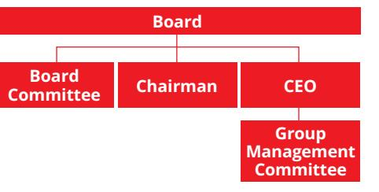

The GAA ensures that appropriate controls and decision-making are consistently applied throughout DBS. Under the GAA, the Board has delegated to the CEO the responsibility to ensure that the Group's businesses and operations are operated in accordance with Board-approved strategies and standards, which include responsibilities for the internal control framework within DBS. On matters where authority has been delegated to him, the CEO may further delegate his responsibilities and authorities to any GMC member or members and may empower them to, in turn, delegate their responsibilities and authorities to other executives and management committees of the Group.

The GAA covers internal authority only and does not override any specific provisions arising from statutory, regulatory, exchange listing requirements, or the DBSH's Constitution.

The GAA is regularly reviewed and updated to accommodate changes in the scope and activities of DBS' business and operations. The Board approves the GAA and any change to it.

#### Internal controls framework

Our internal controls framework covers financial, operational, compliance and information technology controls, as well as risk management policies and systems. The Board, supported by the AC and BRMC, oversees the Group's system of internal controls and risk management. DBS adopts the Three Lines Model for risk management, where each line has clear roles and responsibilities.

#### First line

Our business and support units are our first line. Their responsibilities include the identification and management of risks arising from and relating to their respective areas of responsibilities, and ensuring that our operations remain within approved boundaries of our risk appetite and policies.

DBS has an established incident noti cation protocol that sets out processes for the escalation of incidents according to the level of severity. In this way, appropriate levels of management are made aware of such incidents and can take action accordingly. There are also well-de ned procedures for the escalation, investigation and follow up of any reported wrong-doing by a DBS employee, customer, vendor or third party.

#### **Second line**

Our second line including Risk Management Group and Group Legal and Compliance provide independent risk oversight, monitoring and reporting. They are responsible for the development and maintenance of risk management policies and processes, and they provide objective review and challenge on the activities undertaken by business and support units.

#### **Third line**

Group Audit forms the third line. It provides an independent assessment and assurance on the reliability, adequacy and eΊ ectiveness of our system of internal controls, risk management, governance framework and processes.

In 2023, we implemented several changes to our Three Lines Model to strengthen technology risk governance:

- (i) To bolster our rst line's ability to identify and manage risk, we established a new Quality Assurance Function within Enterprise Architecture Site Reliability Engineering. This function adds an additional layer of independent veri cation, controls, and checks over the Bank's change management process;
- (ii) For more objective review and eΊ ective challenge, we moved a dedicated Technology Risk Management team, with new leadership and expanded expertise, into the second line (within the Risk Management Group); and
- (iii) In order to ensure a robust third line, we increased the resources allocated to the audit of information technology. This allows our third line to continue to provide an independent assessment and assurance on the reliability, adequacy, and eΊ ectiveness of technology risk management governance, controls and processes.

| Board, CEO and Senior Management | Provides oversight of the three lines model                   |                                                                 |                               |  |
|-------------------------------------|---------------------------------------------------------------|-----------------------------------------------------------------|-------------------------------|--|
|                                     | First line                                                    | Second line                                                     | Third line                    |  |
| Role                                | Own and manage risks in respective areas of responsibility | Provide independent risk oversight, monitoring and reporting | Provide independent assurance |  |
| Unit                                | Business and support units                                    | Risk Management Group, Group Legal and Compliance            | Group Audit                   |  |

#### **Group Audit**

#### **Key responsibilities and processes**

Group Audit is independent of the activities it audits. Its objectives, scope of authority and responsibilities are dened in the Audit Charter, which is approved by the AC. Group Audit reports functionally to the Chairperson of the AC and administratively to the CEO. Group Audit's responsibilities include:

- evaluating the reliability, adequacy and eΊ ectiveness of the Group's system of internal controls, risk management, governance framework and processes;
- providing an objective and independent assessment of the Group's credit portfolio quality, the execution of approved credit portfolio strategies and control standards relating to credit management processes;
- reviewing whether DBS complies with laws and regulations and adheres to established policies; and
- reviewing whether management is taking appropriate steps to address control de ciencies.

Group Audit adheres to the DBS Code of Conduct and is guided by the Mission Statement in the Audit Charter. It adopted the Code of Ethics and aligned its practices with the International Professional Practices Framework established by the Institute of Internal Auditors (IIA). In addition, it has embedded IIA's 10 Core Principles for the Professional Practice of Internal Auditing into its activities.

Group Audit has unfettered access to the AC, the Board and management, as well as the right to seek information and explanation. The Head of Group Audit has a seat in the GMC and attends all the business reviews and strategic planning forums. The respective heads of audit in each of the ve key locations outside Singapore are part of that location's management team.

Group Audit adopts a risk-based approach in its auditing activities. An annual audit plan is developed using a structured risk and control assessment framework through which the inherent risk and control eΊ ectiveness of each auditable entity in the Group is assessed. This risk assessment methodology and approach are aligned with that of the Group, including the risk taxonomy.

The assessment also covers risks arising from new lines of business, new products and emerging risks from DBS' operating environment. Audit projects are planned based on the results of the assessment, with priority given to auditing higher risk areas and as required by regulators.

Audit reports containing identi ed issues and corrective action plans are reported to the AC and senior management. Progress of the corrective action plans is monitored, and past due action plans are included in regular reports to the senior management and the AC. In all routine audits, Group Audit evaluates the control environment and management's control awareness which incorporates risk culture as guided by the Financial Stability Board's Guidance on Sound Risk Culture.

Group Audit apprises regulators and external auditors of all relevant audit matters. It works closely with external auditors to coordinate audit eΊ orts.

#### **Quality assurance and key developments**

In line with leading practices, Group Audit has a quality assurance and improvement programme (QAIP) that covers its audit activity and conforms to the International Standards for the Professional Practice of Internal Auditing. As part of the QAIP, internal quality assurance reviews (QAR) are conducted quarterly, and external QAR are carried out at least once every ve years by quali ed professionals from an external organisation. In 2023, Ernst and Young (EY) was appointed to conduct the external QAR. Based on EY's assessment, Group Audit leads the industry in the use of data analytics and digital tools in its audit activities such as risk assessment, eldwork and reporting. In EY's maturity model assessment, Group Audit was also rated the highest level for Purpose, People, Risk assessment and Planning; Reporting, Enablement and Innovation; and Impact, InΌ uence and Involvement.

In 2023, Group Audit advanced the digitalisation of its documentation process using its workbench. The new process was piloted regionally and with some enhancements, a full roll out will be implemented in due course. In 2023, Group Audit also took on the additional task as Secretariat to the Special Board Committee (SBC), and supported the evaluation and appointment of an independent reviewer as well as its regular meetings to oversee the implementation of recti cation measures pursuant to MAS directives on the digital disruptions.

To strengthen and uplift industry-wide auditing (internal & external) of AML/ CFT Risk, the AML Audit Peer Group (AAPG), co-chaired by DBS/ OCBC was formed and made good progress under the guidance of MAS, to gather insights from Internal and External Audit rms with the objective of setting a set of baseline standards and best practices for adoption.

#### **Rule 720(1) Undertaking**

In compliance with Rule 720(1) of the Listing Manual, we have procured undertakings from all of our Directors and executive o cers to use their best endeavours to (a) comply with the relevant provisions of the Listing Manual; and (b) procure that DBS complies with the relevant provisions of the Listing Manual.

#### **Dealings in securities**

Although the Group has transitioned to a semi-annual reporting regime, the trading updates that are provided for the rst and third quarters of each nancial year are, for the purpose of the "black-out" policies prescribed under Rule 1207(19) of the SGX Listing Rules, deemed to constitute " nancial statements". Accordingly, Directors and employees are prohibited from trading in DBS' securities (i) one month before the release of the full-year nancial statements; and (ii) two weeks before the release of its quarterly nancial statements for the rst, second and third quarters of each nancial year.

In addition, business units and subsidiaries engaging in proprietary trading are restricted from trading in DBS' securities during the black-out period. Group Secretariat informs all Directors and employees of each black-out period ahead of time. Directors and employees are prohibited at all times from trading in DBS' securities if they are in possession of material non-public information.

GMC members are only allowed to trade in DBS' securities within speci c window periods (15 market days immediately following the expiry of each black-out period) subject to pre -clearance. GMC members are also required to obtain pre-approval from the CEO before any sale of DBS' securities. Similarly, the CEO is required to seek pre-approval from the Chairman before any sale of DBS' securities. As part of our commitment to good governance and the principles of share ownership by senior management, the CEO is expected to build up and hold at least the equivalent of three times his annual base salary as DBSH shares over time.

DBS has put in place a personal investment policy which prohibits employees from trading in securities in which they possess pricesensitive information in the course of their duties. Such employees are also required to seek pre clearance before making any personal trades in securities, and may only trade through the Group's stockbroking subsidiaries and bank channels for securities listed in Singapore and Hong Kong. The personal investment policy discourages employees from engaging in short-term speculative trading.

#### **Related Party Transactions and Interested Person Transactions**

DBS has embedded procedures to comply with regulations governing related party transactions and interested party transactions.

For related party transactions, we are required to comply with regulations prescribed by the MAS which set out the denition, scope and general principles governing such transactions, along with the responsibilities of banks to maintain oversight and control so as to mitigate the risk of abuse arising from conΌ icts of interest.

We have established a Board-approved framework to give eΊ ect to these regulatory requirements. This, along with material related party transactions, is reviewed by the Board regularly.

All new Directors are briefed on relevant provisions that aΊ ect them. If necessary, existing credit facilities to related parties are adjusted prior to a Director's appointment, and all credit facilities to related parties are continually monitored.

With respect to interested party transactions, we have established processes to comply with the requirements outlined in Chapter 9 of the SGX-ST Listing Manual. The aggregate contract values of DBS' interested person transactions entered into in 2023 are set out in the table on page 62.

DBS enters into various interested person transactions with Temasek and its associates on arm's length commercial terms and for the purpose of carrying out day-to-day operations (such as leasing of premises, telecommunication/ data services, IT systems and related services, redemption of air miles by DBS/ POSB credit card holders, logistics and security services).

In FY2023, our contracts with Temasek Holdings (Private) Limited Group amounted to an aggregated SGD 27.4 million. This accounted for less than 0.05% of DBS' audited net tangible assets.

#### **Material contracts**

Save for the transactions disclosed in the table on page 62 and via SGXNET, there were no material contracts involving the interest of any Director or controlling shareholder of DBS entered into by DBS or any of its subsidiary companies, which are either still subsisting at the end of the nancial year, or if not then subsisting, entered into since the end of the previous nancial year.

#### **Assessing the eΊ ectiveness of internal controls**

DBS has a risk management process that requires all units to perform a half-yearly risk and control self-assessment (RCSA) to assess the eΊectiveness of their internal controls. In addition, all units of the Group are required to submit quarterly attestations on their controls relating to the nancial reporting process, and annual attestations on their compliance with the overall internal controls framework. Based on the RCSA and the quarterly and annual attestations, the CEO and the key management personnel responsible for risk management and internal control systems provide an annual attestation to the AC relating to the adequacy and eΊ ectiveness of DBS' risk management and internal control systems.

Group Audit performs regular independent reviews to provide assurance on the adequacy and eΊ ectiveness of DBS' internal controls on risk management, control and governance processes. The overall adequacy and eΊ ectiveness of DBS' internal controls framework is reviewed by the AC and BRMC.

62 **DBS ANNUAL REPORT 2023** BUILDING A SUSTAINABLE ADVANTAGE **Corporate governance** 63

| Name of interested person                                                                                              | Aggregate contract value of all interested person transactions in 2023 (excluding transactions less than SGD 100,000) (SGD million) |  |  |
|------------------------------------------------------------------------------------------------------------------------|-------------------------------------------------------------------------------------------------------------------------------------------|--|--|
| Transactions entered into with Temasek Holdings (Private) Limited ("Temasek") Group (including Joint Ventures) and DBS |                                                                                                                                           |  |  |
| Temasek Group                                                                                                          | 27.4(1)                                                                                                                                   |  |  |
| Transactions entered into with associates of Temasek                                                                   |                                                                                                                                           |  |  |
| CapitaLand Investment Limited Group                                                                                    | 94.5                                                                                                                                      |  |  |
| CapitaLand Development Pte Ltd Group                                                                                   | 13.4                                                                                                                                      |  |  |
| Certis CISCO Security Pte Ltd Group                                                                                    | 3.5                                                                                                                                       |  |  |
| Mediacorp Pte Ltd Group                                                                                                | 1.4                                                                                                                                       |  |  |
| SATS Ltd Group                                                                                                         | 7.9                                                                                                                                       |  |  |
| Singapore Airlines Limited Group                                                                                       | 0.4                                                                                                                                       |  |  |
| Singapore Technologies Engineering Ltd Group                                                                           | 0.3                                                                                                                                       |  |  |
| Singapore Technologies Telemedia Pte Ltd Group                                                                         | 0.1                                                                                                                                       |  |  |
| Singapore Telecommunications Limited Group                                                                             | 27.8                                                                                                                                      |  |  |
| SMRT Corporation Ltd Group                                                                                             | 2.0                                                                                                                                       |  |  |
| StarHub Ltd Group                                                                                                      | 37.4                                                                                                                                      |  |  |
| Surbana Jurong Private Limited Group                                                                                   | 31.0                                                                                                                                      |  |  |
| Temasek Management Services Pte Ltd Group                                                                              | 0.6                                                                                                                                       |  |  |
| Tower Capital PE Fund I LP Group                                                                                       | 49.3                                                                                                                                      |  |  |
| Total                                                                                                                  | 297.0                                                                                                                                     |  |  |

*(1) This category includes investments made directly by Temasek in joint ventures where DBSH is also a shareholder.*

#### **Board's commentary on adequacy and eΊ ectiveness of internal controls**

The Board has received assurance from the CEO and CFO that as at 31 December 2023, the Group's nancial records have been properly maintained, and the nancial statements give a true and fair view of DBS Group's operations and nances.

The Board has also received assurance from the CEO and the key management personnel responsible for risk management and internal control systems that, as at 31 December 2023, the Group's risk management and internal control systems were adequate and eΊective to address nancial, operational, compliance and information technology risks which the Group considers relevant and material to its operations. However, but without limiting the foregoing, management has highlighted that, arising from the review of the digital disruptions in 2023, four main areas with respect to information technology risk management and controls, namely, change management, system resiliency, incident management, and technology governance and oversight, will have to be further strengthened.

In this regard, the Board noted that management had drawn up a comprehensive technology resiliency roadmap to address the gaps that had been identi ed. In particular:

- (i) **Change management:** Change management controls are being tightened and a near-production environment will be created to allow for more robust testing before going live with new changes or release.
- (ii) **Enhancing system resiliency:** To ensure that key services have minimal downtime, potential failure scenarios and possible remediation actions are identi ed. Some of these actions, such as having a warm standby or increased redundancy, have been implemented. Other system changes, which are more structural in nature, are work-in-progress.
- (iii) **Incident management:** In the last year, having built comprehensive diagnostic capabilities, real-time monitoring data and alerts are now being leveraged as part of the incident management process.

(iv) **Technology risk governance:** To strengthen technology risk governance and oversight, a new sub-committee of the Board Risk Management Committee called the BRMC Technology Risk Committee has been established. To enhance independent checks and balances, the Technology Risk Management team was transferred to the Risk Management Group.

For further details on the various technology resiliency improvements (including those being progressively implemented), please refer to the Letter from the Chairman and CEO under "Enhancing our technology resilience" on page 10, the CIO Statement under "Driving the resiliency and reliability of our technology" on pages 34 and 35 and the CRO Statement under "Rebuilding Customer Trust with Enhanced Technology Resilience" on pages 32 to 33.

Based on the internal controls established and maintained by the Group, work performed by internal and external auditors, reviews performed by management and

various Board committees, as well as assurances received from and mitigation and remedial actions undertaken by management in relation to the identi ed gaps, the Board, with the concurrence of the AC, is of the opinion that the Group's internal controls and risk management systems were adequate and eΊ ective as at 31 December 2023 to address nancial, operational, compliance and information technology risks which the Group considers relevant and material to its operations.

The Board notes that the internal controls and risk management systems provide reasonable, but not absolute, assurance that the Group will not be aΊ ected by any event that could be reasonably foreseen as it strives to achieve its business objectives. In this regard, the Board also notes that no system can provide absolute assurance against the occurrence of material errors, poor judgement in decision-making, human error, fraud or other irregularities.

#### **Strong culture**

#### **EΊ ective safeguards**

We believe that eΊ ective safeguards against undesired business conduct have to go beyond a "tick-the-box" mentality. In DBS, other than relying on published codes of conduct, we also advocate the following organisational safeguards to maintain a strong risk and governance culture.

- **Tone from the top:** The tone set by the Board and senior management is vital; it is equivalent to the moral compass of the organisation. In addition to having in place comprehensive policies, we conduct a robust self-assessment on the Group's risk culture. Please refer to the risk culture section on this page for more information.
- **Aligning strategies and incentives via the balanced scorecard:** Please refer to the section on "Our 2023 priorities" on pages 26 to 31 for more information.
- **Respecting the voice of control functions:** We believe that respect for the voice of control functions is a key safeguard. We ensure that control functions are well integrated into our organisational structure so that they can properly discharge their responsibilities.
- **Risk ownership:** Please refer to page 59 to 60 for details on our Three Lines Model.
- **Established escalation protocols:** We established a noti cation protocol that makes it mandatory for staΊ to report signi cant incidents, demonstrating our organisational readiness to receive unfavourable information, and undertake prompt remedial actions without any adverse consequences for those reporting the incidents.

- **Encouraging constructive challenges at all levels:** Fundamentally, we inculcate a culture that encourages constructive challenges and debate, where all views are evaluated for decision-making. We also operate a culture where we actively engage the Board for their views early.
- **Reinforcing cultural alignment:** Finally, we conscientiously reinforce our cultural norms by rewarding right behaviours and censuring wrong ones.

#### **Risk Culture**

Risk culture is closely intertwined with our corporate values, and it encompasses the general awareness, attitudes and behaviour of our employees towards risks. The results of our Risk Culture and Conduct Survey conducted in 2023 indicated a satisfactory risk culture bank-wide.

In 2023, we continued to monitor our risk culture pulse with a risk culture and conduct dashboard, comprising multi-faceted indicators. Creating awareness remained a key focus as we continue to reinforce a strong culture of risk and control across all levels within the organisation. We leveraged digital communication channels to share culture related content and conducted training with case studies to aid managers in strengthening the "Tone from the Middle" and to enhance employee risk sensing and judgement. We continue to place emphasis on conduct as part of our compensation evaluation process.

#### **The DBS Code of Conduct (Code of Conduct)**

The Code of Conduct sets out the principles and standards of behaviour that are expected of employees of the Group (including part-time and temporary employees) when dealing with customers, business associates, regulators and colleagues. The principles covered in the Code of Conduct include professional integrity, con dentiality, conΌ icts of interests, fair dealings with customers and whistle-blowing. It also denes the procedures for employees of DBS to report incidents and provides protection for those staΊ for these disclosures.

All employees of DBS are required to read and acknowledge the Code of Conduct on an annual basis. Members of the public may access the Code of Conduct on DBS' website at the following URL: https:// go.dbs.com/CodeOfConduct. The Code of Conduct encourages employees of DBS to report their concerns to DBS' dedicated, independent investigation team within Group Compliance which handles whistle-blowing cases according to a well-de ned protocol. Alternatively, in case of actual or potential conΌ ict of interest or fear of retribution, employees of DBS may write in con dence to Human Resources, Group Audit, or even the

CEO or the Chairman. In addition, employees of DBS have the option of using the DBS Speak Up service.

#### **Whistle-blowing policy**

DBS Speak Up is a hotline service run by an independent external party that gives employees of the Group the opportunity to speak up on misconduct and/ or wrong-doing by a DBS employee, customer, vendor or third party.

DBS Speak Up service includes:

- a dedicated hotline number, website, email address, fax number and postal address for reporting of suspected incidents of misconduct and wrongdoing;
- specialist call centre operators with knowledge of individual organisations;
- expert forensic investigators to analyse reports;
- timely reporting of incidents to dedicated representatives within an organisation; and
- recommendations on corrective action.

#### **Accountability to our shareholders**

#### **Shareholder rights**

DBS promotes fair and equitable treatment of all shareholders. All shareholders enjoy speci c rights under the Singapore Companies Act and DBSH's Constitution. These rights include, among others, the right to participate in pro t distributions and the right to attend and vote at general meetings. Ordinary shareholders are entitled to attend and vote at general meetings in person or by proxy. Indirect investors who hold DBSH shares through a nominee company or custodian bank or through a CPF agent bank ("Relevant Intermediaries") may attend and vote at general meetings by requesting their Relevant Intermediaries to appoint them as proxies.

DBS respects the equal information rights of all shareholders and is committed to the practice of fair, transparent and timely disclosure. All price-sensitive information is publicly released prior to any sessions with individual investors or analysts.

The Board provides shareholders with regular nancial reports, which aim to give shareholders a balanced assessment of the Group's nancial performance and position. The Board also ensures timely and full disclosure of material corporate developments to shareholders.

#### **Engagement with shareholders**

Our investor relations activities promote regular, effective and fair communication with shareholders. Separate briefing sessions were conducted for the media and analysts when quarterly results were released. All press statements and guarterly financial statements have been published on our website and the SGX website. A dedicated investor relations team supports the CEO and the CFO in maintaining a close and active dialogue with investors. The DBS website provides contact details for investors to submit their feedback and raise any questions.

During the year, we held over 450 meetings with equity investors and over 120 meetings with debt investors. We participated in 21 investor conferences and road shows. These engagements were conducted through in person or virtual meetings. These meetings provide a forum for management to explain DBS' strategy and financial performance, and solicit analysts' and investors' perceptions of DBS. We also held an investor day in May 2023 to showcase our digital transformation efforts since the previous investor day in 2017. The event drew physical participation from 45 firms and was well received by analysts and fund managers that attended.

In addition, to ensure Directors are kept updated on analysts' views on DBS Group's performance, the Board is updated annually on, *inter alia*, the following, a summary of analysts' views, feedback and recommendations, share price performance and total shareholders' return

We have a disclosure policy to ensure that all disclosures of material information are timely, complete and accurate. The policy sets out how material information should be managed to prevent selective disclosure. Our Group Disclosure Committee (GDC) assists the CEO and the CFO in implementing the disclosure policy. The GDC's objectives are to: (a) periodically review DBS' disclosure policy and update it as needed, (b) ensure that all material disclosures are appropriate, complete and accurate, and (c) ensure selective or inadvertent disclosure of material information is avoided.

#### **Conduct of shareholder meetings**

DBS encourages and values shareholder participation at its general meetings.

The Chairman plays a pivotal role in fostering constructive dialogue between shareholders, Board members and management at general meetings. Resolutions requiring shareholders' approval are tabled separately for adoption at general meetings unless they are closely related and are more appropriately tabled together.

DBS puts all resolutions at general meetings to a vote by electronic poll and announces the results by showing the number of votes cast for and against each resolution and the respective percentages. DBS appoints an independent external party as scrutineer for the electronic poll voting process. Prior to the commencement of a general meeting, the scrutineer would review the proxies and the electronic poll voting system as part of the proxy verification process. At the general meeting, handsets are provided for poll voting and the results of the electronic poll voting are announced immediately after each resolution has been put to a vote. DBS maintains an audit trail of all votes cast at the general meeting.

The outcome of the general meeting (including detailed results of the poll vote for each resolution) is promptly disclosed on SGXNET within the same day after the conclusion of that meeting.

Annual General Meetings (AGMs) provide shareholders with the opportunity to share their views and to interact with the Board, including the chairpersons of the Board committees and certain members of senior management. Our external auditor is available to answer shareholders' queries. At each AGM, DBS' financial performance for the preceding year is presented to shareholders.

The Company Secretary prepares minutes of general meetings, which incorporate substantial and relevant comments or queries from shareholders relating to the agenda of the meeting and responses from the Board and management. These minutes may be assessed via our website.

#### **Conduct of 2024 AGM**

We will be holding a wholly physical AGM in

#### Where to find key information on each Director?

In this Annual Report:

- Pages 43 to 44 Directors' independence status, appointment dates, meeting attendance and remuneration details
- Pages 188 to 192 Directors' length of directorship, academic and professional qualifications and present and past directorships
- Pages 212 to 217 Additional Information on Directors seeking re-election at the Annual General Meeting to be held on 28 March 2024

At our website (www.dbs.com): Directors' biodata

## Remuneration report

We believe that our long-term success depends in large measure on the contributions of our employees. Our remuneration framework is designed to be consistent with market best practices, drive business strategy and create long-term shareholder value. Remuneration policies and practices as set out in the following report are governed by a set of sound principles which are in compliance with various regulatory requirements.

#### 1 Objectives of DBS remuneration strategy

DBS' remuneration policy, which is applicable to DBS Bank and all our subsidiaries and overseas offices, seeks to ensure that we are able to attract, motivate and retain employees to deliver long-term shareholder returns, taking into consideration risk management principles and standards set out by the Financial Stability Board (FSB) and the Code of Corporate Governance.

At DBS, remuneration is determined based on the Group's performance, which is evaluated against a balanced scorecard. The scorecard is detailed and comprises specific key performance indicators (KPIs), including how we fare against shareholder, customer and employee indicators; as well as a range of focus areas such as progress in transforming the bank, scaling growth across our markets, managing risks etc. DBS PRIDE!\* values are also taken into account in order to drive desired behaviours.

The following shows the three main thrusts of our remuneration strategy and how they are implemented within DBS:

| Main thrusts                                               | Details                                                                                                                                                                                                                                                                                                                                                                                                         |
|------------------------------------------------------------|-----------------------------------------------------------------------------------------------------------------------------------------------------------------------------------------------------------------------------------------------------------------------------------------------------------------------------------------------------------------------------------------------------------------|
| Pay for performance as measured against balanced scorecard | <ul> <li>Instill and drive a pay-for-performance culture</li> <li>Ensure close linkage between total compensation and our annual and long-term business objectives as measured by our balanced scorecard</li> <li>Calibrate mix of fixed and variable pay to drive sustainable performance that is aligned to DBS PRIDE! values, taking into account both "what" and "how" KPIs are achieved</li> </ul>         |
| Provide market competitive pay                             | <ul> <li>Benchmark our total compensation against other organisations of similar size and standing in the markets we operate in</li> <li>Drive performance differentiation by benchmarking total compensation for top performing employees against the upper quartile or higher in each market</li> </ul>                                                                                                       |
| Guard against excessive risk-taking                        | <ul> <li>Focus on achieving risk-adjusted returns that are consistent with prudent risk and capital management, as well as emphasise long-term sustainable outcomes</li> <li>Design payout structure to align incentive payments with the long-term performance of the Group through deferral and clawback arrangements</li> <li>Design sales incentive plans to encourage the right sales behaviour</li> </ul> |

Read more about the balanced scorecard in Our 2023 priorities on page 26.

\* Read more on our PRIDE! values on page 71.

66 **DBS ANNUAL REPORT 2023** BUILDING A SUSTAINABLE ADVANTAGE **Remuneration report** 67

#### **2 Summary of current total compensation elements**

The table below provides a description of total compensation elements, their purpose and implementation:

| Elements                          | Purpose                                                                                                                                                                                                                                                      | Details                                                                                                                                                                                                                                                                                                                                                                                                                                                                                                                                                                                                                                                           |
|-----------------------------------|--------------------------------------------------------------------------------------------------------------------------------------------------------------------------------------------------------------------------------------------------------------|-------------------------------------------------------------------------------------------------------------------------------------------------------------------------------------------------------------------------------------------------------------------------------------------------------------------------------------------------------------------------------------------------------------------------------------------------------------------------------------------------------------------------------------------------------------------------------------------------------------------------------------------------------------------|
| Salary                            | • Attract and retain talent by ensuring our ΋xed pay is competitive vis-à-vis comparable institutions                                                                                                                                                  | • Set at an appropriate level, taking into account market dynamics as well as skills, experience, responsibilities, competencies and performance of the employee • Typically reviewed annually                                                                                                                                                                                                                                                                                                                                                                                                                                                        |
| Cash bonus and deferred awards | • Provide a portion of total compensation that is performance-linked • Focus employees on the achievement of objectives which are aligned to value creation for our shareholders and multiple stakeholders • Align to time horizon of risk | • Based on DBS, business or support unit, and individual performance • Measured against a balanced scorecard which is agreed to at the start of the year • A Group-wide deferral approach is applicable for all employees. Awards in excess of a certain threshold are subject to a tiered deferral rate with a minimum deferred quantum • For Senior Management (SM) and Material Risk Personnel (MRP i.e. employees whose actions have a material impact on the risk exposure of the bank), awards are generally deferred by a minimum of 40% if it exceeds a certain threshold subject to local regulatory requirements |

#### **3 Determination of variable pay pool**

DBS has a robust process in place in determining the variable pay pool. The variable pay pool is derived from a combination of a bottom-up and top-down approach. Annually, Management does a self-evaluation on the Group's performance against the balanced scorecard. This is presented to the Compensation and Management Development Committee (CMDC) who assesses the performance, based on which it approves the variable pay pool, which is subsequently endorsed by the Board of Directors (Board).

| Process                             | Details                                                                                                                                                                                                                                                                                                                                                                                                                                                                                                                                                                                                                                     |
|-------------------------------------|---------------------------------------------------------------------------------------------------------------------------------------------------------------------------------------------------------------------------------------------------------------------------------------------------------------------------------------------------------------------------------------------------------------------------------------------------------------------------------------------------------------------------------------------------------------------------------------------------------------------------------------------|
| Determining total variable pay pool | • A function of our overall performance against the balanced scorecard and benchmarked against market. The scorecard includes substantial risk and control metrics designed and evaluated by the control functions such as Audit, Compliance and Risk. Control functions therefore have a direct role in determining the size of the variable pay pool. The variable pay pool is further calibrated against the following prisms: – Risk adjustment through review of Return on Risk-Adjusted Capital (RoRAC) – Appropriate distribution of surplus earnings (after cost of equity) between employees and shareholders |
| Allocating pool to business units   | • Pool allocation takes into account the relative performance of each unit against their balanced scorecard as evaluated by the CEO • Inputs from control functions are sought • Country Heads are also consulted in the allocation process                                                                                                                                                                                                                                                                                                                                                                                        |
| Determining individual award        | • Unit heads cascade their allocated pool to their teams and individuals • Individual variable pay determined based on performance against goals and DBS PRIDE! Values • Employees with disciplinary warning meted out may have their variable pay impacted                                                                                                                                                                                                                                                                                                                                                                        |

The performance of control functions are assessed independently from the business units they support to prevent any conΌ icts of interests. The remuneration of the Chief Risk Ofcer (CRO) and Group Head of Audit are endorsed by the Chairman of Board Risk Management Committee and Audit Committee respectively and subsequently approved by the Board.

Sales employees are incentivised to promote the development of mutually benecial long-term relationships with their customers, rather than a sole focus on short-term gains. Non-nancial metrics such as customer satisfaction and compliance with fair dealing principles are incorporated into their KPIs.

#### **4 Deferred remuneration**

| Plan objectives                                                                                                                                           | Details                                                                                                                                                                                                                                                                                                                                                                                                                                                                                                                                                                                                                                 |
|-----------------------------------------------------------------------------------------------------------------------------------------------------------|-----------------------------------------------------------------------------------------------------------------------------------------------------------------------------------------------------------------------------------------------------------------------------------------------------------------------------------------------------------------------------------------------------------------------------------------------------------------------------------------------------------------------------------------------------------------------------------------------------------------------------------------|
| • Foster a culture that aligns employees' interests with shareholders • Enable employees to share in DBS' performance • Help in talent retention | • Deferred remuneration is paid in restricted shares (DBSH Share Plan) except for SM and MRPs, where it is paid in restricted shares (DBSH Share Plan) and cash • Deferred remuneration comprises two elements: the main award and retention award • The retention award constitutes 15% of the main award and is designed to retain talent and compensate staΊ for the time value of deferral • Deferred awards vest over four years, and will lapse immediately upon termination of employment (including resignation) except in the event of ill health, injury, disability, redundancy, retirement or death |

| Vesting schedule                                                                                                            | Malus of unvested awards and clawback of vested awards                                                                                                                                                                                                                                                                                                                                    |
|-----------------------------------------------------------------------------------------------------------------------------|-------------------------------------------------------------------------------------------------------------------------------------------------------------------------------------------------------------------------------------------------------------------------------------------------------------------------------------------------------------------------------------------|
| Main Award • 25% vest on each anniversary after grant date Retention Award • 100% vest four years after grant date | Malus and/ or clawback will be triggered by • Material violation of risk limits • Material losses due to negligent risk-taking or inappropriate individual behaviour • Material restatement of DBS' ΋nancials due to inaccurate performance measures • Misconduct or fraud Vested and unvested awards are subject to clawback within seven years from the date of grant |

Employees on sales incentive plans whose incentives exceed a certain threshold are also subject to deferrals which vest over three years and a 15% retention award.

Special Award is awarded to selected individuals as part of talent retention, and it is subject to three-year vesting period, with 33% vesting on the rst and second anniversaries of grant and 34% on the third anniversary.

*Read more about the Share Plan on page 111.*

#### **5 Summary of 2023 remuneration outcomes**

Our remuneration is linked to how we perform against our balanced scorecard which is aligned to long-term value creation for our stakeholders in a sustainable way (see pages 70 to 71).

#### **Senior management and material risk takers**

In line with the principles set out by FSB, a substantial portion of remuneration for our Senior Management as well as Material Risk Personnel are variable. Their variable remuneration is subject to deferral, thus ensuring alignment to the time horizon of risks.

The following charts show the mix of xed and variable pay for both groups for performance year 2023:

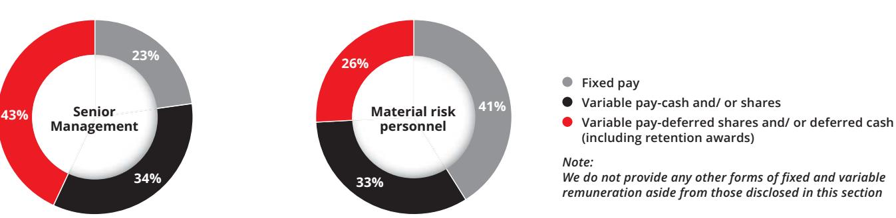

Our Senior Management's aggregate total compensation (salary, cash bonus and deferred awards), excluding that of the CEO which is separately disclosed, amounted to SGD 63.5 million in 2023, a reduction from SGD 73.8 million in 2022. The total variable pay for Senior Management including CEO was reduced by 21% reΌ ecting Senior Management's accountability for the digital disruptions.

While corporate governance guidelines recommend that at least the top ve key executives' remuneration be disclosed, the Board believes that it would be disadvantageous for us to do so because of the constant battle for talent in a highly competitive industry. This is consistent with banking industry practice in the local market. However, we do provide additional information on the total compensation of our Senior Management in the year as detailed above.

#### Breakdown of deferred remuneration awards

| Category                                                                                                                                                                              | SM (1)                 | MRPs (2) |
|---------------------------------------------------------------------------------------------------------------------------------------------------------------------------------------|-----------------------------------|---------------------|
| Total outstanding deferred remuneration (3) : Cash Shares and share-linked instruments Other forms of remuneration Total                                                   | 9.3% 90.7% - <b>100%</b> |                     |
| Outstanding deferred and retained remuneration (3)(4) : Of which exposed to ex-post adjustments Cash Shares and share-linked instruments Other forms of remuneration Total | 9.3% 90.7% - <b>100%</b> |                     |
| Total amendment during the year due to ex-post explicit adjustments (5) : Cash Shares and share-linked instruments Other forms of remuneration Total                       | - - - -                  | - - - -    |
| Total amendment during the year due to ex-post implicit adjustments (5) : Cash Shares and share-linked instruments (6) Other forms of remuneration Total        | - (6.8%) - -             | - 0.5% - - |
| Total deferred remuneration paid out in the financial year:                                                                                                                           | 35.1%                             | 30.8%               |
| Headcount                                                                                                                                                                             | 22                                | 344                 |

- (1) Senior Management (SM) is defined as the CEO and members of the Group Management Committee who have the authority and responsibility for DBS' overall direction and executing to strategy
- (2) In accordance to MAS's Individual Accountability & Conduct Guidelines, MRPs are defined as employees whose duties require them to take on material risk on our behalf in the course of their work and/ or employees who can cause harm to a significant segment of customers or other stakeholders. These can be either individual employees or a group of employees who may not pose a risk to DBS' financial soundness on an individual basis, but may present a material risk collectively
- (3) Due to data confidentiality, the total amount of deferred and retained remuneration for SM and MRPs have been aggregated for reporting. In addition to shares deferral, cash deferral has been implemented across all locations with effect from Feb 2023
- (4) Retained remuneration refers to shares or share-linked instruments that are subject to a retention period under a share retention policy
- (5) Examples of explicit ex-post adjustments include malus, clawbacks or similar reversal or downward revaluations of awards. Examples of implicit ex-post adjustments include fluctuations in the value of DBSH ordinary shares or performance units
- (6) [No. of unvested DBSH ordinary shares as at 31 Dec 2023 x share price as at 29 Dec 2023]/ [No. of unvested DBSH ordinary shares as at 31 Dec 2022 x share price as at 30 Dec 2022] -1

#### Guaranteed bonuses, sign-on bonuses and severance payments

| Category                                                                  | SM | MRPs  |
|---------------------------------------------------------------------------|----|-------|
| Number of guaranteed bonuses                                              | 0  | 0     |
| Number of sign-on bonuses                                                 | 0  | 3     |
| Number of severance payments                                              | 0  | 0     |
| Total amounts of above payments made during the Financial Year (SGD '000) | 0  | 1,570 |

#### Other provisions

We do not allow accelerated payment of deferred remuneration except in cases such as death in service or where legally required. There are no provisions for:

- Special executive retirement plans;
- Golden parachutes or special executive severance packages; and/ or
- Guaranteed bonuses beyond one year.

#### Chief Executive Officer

Since becoming CEO in November 2009, Piyush Gupta has transformed DBS into a leading Asian bank with multiple engines of growth, a strong digital focus and a culture of innovation – all underpinned by a deep sense of purpose.

In 2023, the bank had a record year, with total income crossing the SGD 20 billion mark for the first time. Net profit of SGD 10.3 billion and return on equity of 18.0% were at new highs. The bank's solid financial performance was not just a reflection of the macroeconomic environment, but also a result of the structural shifts made in the last decade to digitalise the bank and grow new lines of business.

DBS continued to cement its presence in Asia. Following the integration of Lakshmi Vilas Bank, the bank's India platform is now the most complete outside of Singapore. In Taiwan, the bank successfully integrated Citigroup Inc.'s consumer banking business in August 2023, and is now the largest foreign bank by assets.

DBS' focus on Managing through Journeys matured during the year. The use of artificial intelligence/ machine learning (Al/ ML) also continued to gain traction. The bank has deployed over 350 use cases, and more than doubled the economic value from Al/ ML to SGD 370 million.

Employee engagement as measured by Kincentric's MyVoice scores reached a record 90%.

On the sustainability front, DBS accelerated its climate agenda through enhanced client engagement on transition planning, financing and ecosystem partnerships. To improve the lives of the underprivileged, the bank pledged to give up to SGD 1 billion over the next 10 years to suitable causes.

In 2023, DBS was recognised by Global Finance as one of the top five World's Most Innovative Banks. Euromoney named DBS the World's Best Bank for Corporate Responsibility. DBS was also named as Safest Bank in Asia by Global Finance for the 15th consecutive year.

While the bank fared well against most priorities on its balanced scorecard, it fell short in technology resiliency. This, and the resultant impact on customers and the franchise, were taken into account when determining the scorecard performance of both the Group and the CEO. Despite record 2023 profits and outperformance in many areas, the gaps in technology resiliency resulted in a lower scorecard appraisal by the Board compared to the previous year.

Given the scorecard performance, as well as the Board's determination that the CEO and other Group Management Committee members' variable pay should be cut to hold them accountable for the digital disruptions, Mr Gupta's present-year remuneration is as outlined below:

#### Breakdown of remuneration for performance year 2023 (1 January – 31 December)

|                 | Salary SGD | Cash bonus (1) SGD | Deferred Award (2) SGD | Others (3) SGD | Total (4) SGD |
|-----------------|---------------|-------------------------------|--------------------------------------|------------------------------|-----------------------------|
| Mr Piyush Gupta | 1,500,000     | 4,109,000                     | 5,551,000                            | 72,992                       | 11,232,992                  |

- (1) The amount has been accrued in 2023 financial statements
- Of the deferred award, about 17.4% will be in cash, while the remaining will be in the form of shares.

  At DBS, ordinary dividends on unvested shares do not accrue to employees. For better comparability with other listed companies, this figure excludes the estimated value of retention award amounting to SGD 832,650 which serve as a retention tool and compensate staff for the time value of deferral. This is also similar in nature to practices in those companies which provide accrual of dividends/ interest equivalents for deferred awards
- Represents non-cash component and comprises club, car and driver
- ) Refers to performance remuneration for 2023 includes fixed pay in 2023, cash bonus received in 2024 and DBSH ordinary shares granted in 2024

## **How we create value – our business model**

**Our business model seeks to create value for stakeholders in a sustainable way.**

Our strategy is clear and simple. It de nes the businesses that we will do and will not do. We use our resources to build competitive advantages. We have put in place a governance framework to ensure eΊ ective execution and risk management. Further, we have a balanced scorecard to measure our performance and align compensation to desired behaviours.

*Read more about how we use our resources on pages 70 to 75.*

**Governing ourselves Measuring ourselves**

**Our resources How we create value**

**Our strategy DiΊ erentiating ourselves**

**Our stakeholders**

**Brand**

**Customer relationships**

**Intellectual capital**

**Employees**

**Financial**

**Physical infrastructure**

**Natural resources**

**Societal relationships**

#### **Our strategy**

Our strategy is predicated on megatrends such as Asia's strong growth and rising intra-regional trade, rapid technological advancements and the digitalisation of industries and economies, as well as the shift towards building a sustainable future.

We seek to intermediate trade and capital Ό ows as well as support wealth creation in Asia. Our established and growing presence in Greater China, South Asia and Southeast Asia makes us a compelling Asian bank of choice.

We are a full-service commercial bank in Singapore and Hong Kong and are scaling up these capabilities in India and Taiwan. We engage individuals and SMEs through digital and ecosystem strategies in Indonesia and China (including the Greater Bay Area).

We leverage digital technologies and data to create diΊ erentiated customer and employee experiences. We keep abreast of and invest in emerging technologies that could reshape current banking practices.

We have made wide-ranging commitments to a more sustainable future. They encompass the way we do business, sustainable practices in our operations, as well as our role in the communities we are a part of.

#### **Making Banking Joyful**

We seek to "Make Banking Joyful" by leveraging digital technologies and embedding ourselves seamlessly into our customers' lives. We deliver simple, fast and contextual banking solutions and diΊ erentiated customer experiences by managing through journeys.

We architect our most critical customer processes horizontally and leverage data-driven operating models. This helps break silo-thinking and foster joint accountability across cross-functional teams. We deploy arti cial intelligence/machine learning and experiment iteratively to achieve superior customer and business outcomes.

#### *Read more about our strategy on pages 8 to 11.*

We periodically review our strategy, taking into account emerging megatrends, the operating environment and what our stakeholders are telling us. These are material matters that can impact our ability to create value.

*Read more about our material matters and stakeholder engagement on pages 77 to 79.*

#### **Our businesses**

We have three core business segments:

- Institutional Banking
- Consumer Banking/ Wealth Management
- Treasury Markets

*Read more about our businesses on pages 36 to 41.*

### **Banking the Asian Way**

We marry the professionalism of a best-in-class bank with an understanding of Asia's cultural nuances.

#### **Asian relationships**

We recognise that relationships have swings and roundabouts and stay by our clients through down cycles.

#### **Asian service**

Our service ethos is to be Respectful, Easy to deal with and Dependable.

#### **Asian insights**

We know Asia better; we provide unique Asian insights and create bespoke Asian products.

#### **Asian innovation**

We constantly innovate new ways of banking as we strive to make banking faster and simpler, while delivering contextualised and relevant Asian products and services.

#### **Asian connectivity**

We work in a collaborative manner across geographies and businesses, supporting our customers as they expand across Asia.

#### **Technology and infrastructure**

Over the years, we have invested in our people and skills, and re-architected our technological backbone to be digital to the core (i.e. microservices, cloud-native, resilient and scalable). We continue to strengthen our focus on change management, system resilience/ recovery, incident management, as well as technology risk and oversight to ensure service reliability.

To respond to rapidly changing customer demands with agility and at scale, we have re-engineered our business and technology teams towards a platform operating model where business and technology work together in an agile manner toward shared KPIs. We have also embraced design thinking to deliver customer-centric front-end applications.

#### **Nimbleness and agility**

We are of a "goldilocks" size – big enough to have meaningful scale yet nimble enough to quickly act on opportunities. We pivoted to managing through journeys and working in horizontal organisations to drive outcomes. This allows us to embed customer centricity, drive agility and increase internal collaboration by embracing experimentation, entrepreneurship and innovation.

#### **Competent leadership**

A strong, well-informed and fully engaged board provides strategic direction to management. Management executes on strategy and drives performance and organisational synergies. A matrix reporting structure drives joint ownership between regional function heads and local country heads.

*Read more about our leaders on pages 4 to 7.*

#### **Our PRIDE! values**

Our PRIDE! values of Purpose-driven, Relationship-led, Innovative, Decisive and Everything Fun! de ne what we stand for, and anchor how we do business and work with one another.

We have translated these values into a set of 12 behaviours. These behaviours guide how we do business and how we interact with the community.

#### **EΊ ective internal controls**

Our internal controls framework covers nancial, operational, compliance and information technology controls, as well as risk management policies and systems.

Three lines of defence guard our operational excellence: identi cation and management of risks by units, independent oversight exercised by control functions, and independent assurance by Group Audit.

*Read more about our internal controls on pages 59 to 63.*

#### **Building a Sustainable Franchise**

We aim to build a company that is here for the long term, based on responsible banking, responsible business practices, and impact beyond banking. Rooted in our culture is a sense of purpose and an innovative drive to create social value and achieve meaningful impact, while balancing our risk and compliance responsibilities.

#### *Read more about our sustainability e orts on pages 72 to 75, 102 to 105, and in our Sustainability Report.*

We leveraged technology and data to strengthen and augment our risk management processes and systems. We further created our own data governance framework setting out clear regulatory, legal and ethical boundaries to ensure that we use data in a respectful and responsible manner.

*Read more about our governance e orts on pages 32 to 33.*

#### **Balanced scorecard**

We use a balanced scorecard approach to assess our performance, track the progress we have made in executing our strategy and determine remuneration.

The scorecard is divided into three parts and is balanced in the following ways:

- Between nancial and non- nancial performance indicators. Almost onequarter of the total weighting is focused on control and compliance metrics. We have key performance indicators (KPIs) to track progress made on our transformation agenda and our shift toward managing through journeys.
- Across multiple stakeholders
- Between current year targets and long-term strategic outcomes

The scorecard is updated yearly and approved by the Board before being cascaded throughout the organisation, ensuring that the goals of every business, country and support function are aligned to those of the Group.

Performance is assessed against the scorecard to determine remuneration, providing a clear line of sight between employee goals and organisational imperatives. We have achieved a well-established rhythm towards performance monitoring and our rewards are closely linked to scorecard outcomes.

*Read more about our balanced scorecard on pages 26 to 31.* 

*Read more about our remuneration policy on pages 65 to 69.*

**Shareholders**

**Customers**

**Employees**

**Society**

**Regulators and policy makers**

## **How we develop and use our resources**

**We utilise and enhance our resources to diΊ erentiate ourselves and maximise value creation for our stakeholders in the long run. Read more about how we allocate nancial value created to our stakeholders on page 76.**

| Resources                                                                                                                                                                                                                                         | Indicators                                                                                                                                                                                                                                                          | 2023                                                 | 2022                                                 | Key highlights                                                                                                                                                                                                                                                                                                                                                                                                                                                                                                                                                                                                                                                                                                                                                                                                                                                                                                                                                                                                                                                                                                                   |
|---------------------------------------------------------------------------------------------------------------------------------------------------------------------------------------------------------------------------------------------------|---------------------------------------------------------------------------------------------------------------------------------------------------------------------------------------------------------------------------------------------------------------------|------------------------------------------------------|------------------------------------------------------|----------------------------------------------------------------------------------------------------------------------------------------------------------------------------------------------------------------------------------------------------------------------------------------------------------------------------------------------------------------------------------------------------------------------------------------------------------------------------------------------------------------------------------------------------------------------------------------------------------------------------------------------------------------------------------------------------------------------------------------------------------------------------------------------------------------------------------------------------------------------------------------------------------------------------------------------------------------------------------------------------------------------------------------------------------------------------------------------------------------------------------|
| Brand A strong brand is an important business driver and allows us to compete not just locally, but also regionally.                                                                                                            | Brand value according to "Brand Finance Banking 500" report                                                                                                                                                                                                   | USD 11.0 bn as of Jan 2024                     | USD 10.5 bn as of Jan 2023                     | In 2023 and for the ΋ rst time, DBS was named "World's Best Bank for Corporate Responsibility" by Euromoney. The bank was also named in Global Finance's list of "World's Most Innovative Banks" and featured for the second consecutive year on Stewardship Asia's Steward Leadership 25 list. DBS was also named in TIME Magazine's list of World's Best Companies 2023, ranking 116th out of 750 companies globally, and 3rd out of 86 companies in Asia. For 15 consecutive years (2009 to 2023), DBS has been recognised as the "Safest Bank in Asia" by Global Finance. DBS also retained the title of ASEAN's Most Valuable Bank Brand in Brand Finance's 2024 Banking 500 report. Read more about our achievements on page 2.                                                                                                                                                                                                                                                                                                                                            |
| Customer relationships Putting customers at the heart of what we do helps diΊ erentiate ourselves in an industry as commoditised as banking, enabling us to build lasting relationships and deepen wallet share. | Customers – Institutional Banking – Consumer Banking/ Wealth Management Customer engagement measures(1) (1=worst, 5=best) – Wealth Management – Consumer Banking – SME Banking – Large Corporates Market Penetration ranking | > 280,000 > 17.9 m 4.31 4.22 4.45 1st | > 280,000 > 12.0 m 4.26 4.31 4.45 2nd | We continued to grow our Institutional Banking business, by leveraging our Asia connectivity and digital capabilities to deepen customer relationships. Our Consumer Banking customer base grew by 5.9 million, augmented by the integration of Citigroup Inc's consumer banking business in Taiwan (Citi Consumer Taiwan), and the scaling of ecosystem partnerships in our core markets such as China, India and Indonesia. Our Wealth Management engagement scores improved, driven by stronger client relationship management, wealth management solutions, and insights received from the bank. However, Consumer Banking customer satisfaction was challenged by digital disruptions in Singapore and early integration experiences with Citi Consumer Taiwan and Lakshmi Vilas Bank in India. Our SME regional customer engagement scores showed resiliency and stabilised at an all-time high of 4.45. We achieved a joint overall top rank in market penetration across core markets for Large Corporates. Read more about this on pages 36 to 41. |

| Resources                                                                                                                                                                                                                                | Indicators                                                                                                     | 2023                          | 2022                           | Key highlights                                                                                                                                                                                                                                                                                                                                                                                                                                                                                                                                                                                                                                                                                                                                                   |
|------------------------------------------------------------------------------------------------------------------------------------------------------------------------------------------------------------------------------------------|----------------------------------------------------------------------------------------------------------------|-------------------------------|--------------------------------|------------------------------------------------------------------------------------------------------------------------------------------------------------------------------------------------------------------------------------------------------------------------------------------------------------------------------------------------------------------------------------------------------------------------------------------------------------------------------------------------------------------------------------------------------------------------------------------------------------------------------------------------------------------------------------------------------------------------------------------------------------------|
| Intellectual capital A key type of intellectual capital pertains to how we digitalise our business. Our digital transformation encompasses technology, customer journey thinking and a startup culture. | Number of data and analytics experts Number of software engineers(2) Number of models developed | > 1,000 > 9,100 > 800   | > 1,000 > 9,500 > 620    | Driven by our vision to be an arti΋ cial intelligence (AI)-fuelled bank, we have been building data analytics talent aggressively over the past few years. As such, despite the higher turnover rate in the technology industry, we retained our pipeline of data talent. The number of software engineers decreased due to the conclusion of several high priority projects, such as the integration of Citi Consumer Taiwan and Lakshmi Vilas Bank in India, among others. Our investments in building AI and Gen AI capabilities have enabled the pervasive use of AI throughout the bank, encompassing over 350 use cases with more than 800 models creating greater value and improving e΍ ciency.                |
| Employees An agile and engaged workforce enables us to be nimble and react quickly to opportunities.                                                                                                                         | Employees(3) Employee engagement score Voluntary attrition rate Training hours per employee     | ~ 40,000 90% 9% 32.5 | ~ 36,000 87% 15% 35.3 | In 2023, our employee base expanded through the successful integration of Citi Consumer Taiwan. We also achieved a record 90% overall employee engagement score in the 2023 Kincentric My Voice Survey. This is testament to deliberate improvements we made to strengthen our employee experience. Our group-wide voluntary attrition rate decreased signi΋ cantly. This was attributed to external job market conditions and our eΊ orts to enhance employee engagement and retention. Our attrition rates also remained lower than the market average in all our core markets. The reduction in training hours was a result of our eΊ orts to design and deliver more concise and eΊ ective learning modules. |

74 **DBS ANNUAL REPORT 2023** BUILDING A SUSTAINABLE ADVANTAGE **How we develop and use our resources** 75

| Resources                                                                                                                                                                                                               | Indicators                                                                                                          | 2023                     | 2022                     | Key highlights                                                                                                                                                                                                                                                                                                                                                                                                                                 |
|-------------------------------------------------------------------------------------------------------------------------------------------------------------------------------------------------------------------------|---------------------------------------------------------------------------------------------------------------------|--------------------------|--------------------------|------------------------------------------------------------------------------------------------------------------------------------------------------------------------------------------------------------------------------------------------------------------------------------------------------------------------------------------------------------------------------------------------------------------------------------------------|
| Financial Our strong capital base and diversi΋ ed funding sources allow us to support our customers through good and bad times, and enable us to provide banking solutions competitively. | Common Equity Tier-1 ratio Liquidity Coverage Ratio (LCR) Net Stable Funding Ratio (NSFR)            | 14.6% 144% 118%    | 14.6% 140% 117%    | Shareholders' funds grew mainly from pro΋ t accretion partially oΊ set by dividend payments. Funding and liquidity also remained healthy as we grew customer deposits and maintained diversi΋ ed wholesale funding. Read more about the Group's ȴ nancials in the CFO Statement on page 20.                                                                                                                                  |
| Infrastructure Our best-in-class digital and physical infrastructure allow us to be nimble and resilient.                                                                                                | Digital infrastructure: Rolling four-year cumulative expenditure(4) – Of which new build spending | SGD 5.9 bn SGD 2.6 bn | SGD 5.4 bn SGD 2.4 bn | We are committed to making banking joyful for our customers and clients. We continued to invest in our people and technology to ensure a diΊ erentiated customer experience. We have made progress in strengthening our technology resiliency to improve digital service availability and reliability. Read more about this on page 34.                                                                                   |
| Natural resources We impact the natural environment directly through our operations, as well as indirectly through our customers and suppliers.                                                    | Sustainable ΋ nancing: – Loans and trade facilities(5) – Bonds(6)                                       | SGD 70 bn SGD 18 bn   | SGD 51 bn SGD 24 bn   | Our sustainable ΋ nancing commitment, net of repayments, was around SGD 70 billion as of December 2023, up from SGD 51 billion in the previous year. Capital markets activity was muted in 2023. Despite this, DBS continued to maintain pole position in the SGD bond markets, while also gaining market share across regional bond markets. Read more about "Responsible Financing" in the Sustainability Report. |

| Resources                                                                                      | Indicators                                                    | 2023      | 2022      | Key highlights                                                                                                                                                                                                                                                                                                                                             |
|------------------------------------------------------------------------------------------------|---------------------------------------------------------------|-----------|-----------|------------------------------------------------------------------------------------------------------------------------------------------------------------------------------------------------------------------------------------------------------------------------------------------------------------------------------------------------------------|
|                                                                                                | Cumulative number of social enterprises (SEs) banked(7) | > 1,100   | > 1,000   | In 2023, we awarded grants to 24 SEs and SMEs across Asia through our DBS Foundation Business for Impact grant award programme.                                                                                                                                                                                                                      |
| Societal relationships It is our belief that our responsibility to shareholders is | Value of SE/ SME grants awarded                            | SGD 3.7 m | SGD 3.0 m | In the second year since its establishment, our DBS Foundation Community Impact chapter extended support to 11 new programmes                                                                                                                                                                                                                        |
|                                                                                                | Value of Community Impact funding committed             | SGD 5.6 m | SGD 5.6 m | to enhance future-ready skills, and scale our eΊ orts to strengthen food security among vulnerable segments.                                                                                                                                                                                                                                         |
| complemented by our responsibility to society at large.                                  | Employee volunteering hours                                | > 200,000 | > 140,000 | Working with like-minded partners in our key markets, we have developed employee volunteerism programmes to reach the most                                                                                                                                                                                                                           |
|                                                                                                | Number of hawker meals redeemed                            | 4.67 m    | NA        | vulnerable groups and address some of the most pressing needs facing society. Our employee volunteering hours saw a sharp increase of 42% from 2022. We also dialled up our committment to give back by pledging to contribute 1.5 million employee volunteer hours over the next 10 years.                                              |
|                                                                                                |                                                               |           |           | To help Singaporeans and residents cope with cost of living pressures, we launched the DBS 5 Million Hawker Meals initiative in February 2023. The programme enabled Singapore residents to enjoy up to SGD 3 in cashback if they were among the ΋ rst 100,000 to use our DBS PayLah! app to scan and pay for their meals on Fridays. |
|                                                                                                |                                                               |           |           | Read more about "DBS Foundation" and "Employee Volunteerism" in the Sustainability Report.                                                                                                                                                                                                                                                              |
|                                                                                                |                                                               |           |           |                                                                                                                                                                                                                                                                                                                                                            |
|                                                                                                |                                                               |           |           |                                                                                                                                                                                                                                                                                                                                                            |
|                                                                                                |                                                               |           |           |                                                                                                                                                                                                                                                                                                                                                            |
|                                                                                                |                                                               |           |           |                                                                                                                                                                                                                                                                                                                                                            |
|                                                                                                |                                                               |           |           |                                                                                                                                                                                                                                                                                                                                                            |
|                                                                                                |                                                               |           |           |                                                                                                                                                                                                                                                                                                                                                            |
|                                                                                                |                                                               |           |           |                                                                                                                                                                                                                                                                                                                                                            |
|                                                                                                |                                                               |           |           |                                                                                                                                                                                                                                                                                                                                                            |
|                                                                                                |                                                               |           |           |                                                                                                                                                                                                                                                                                                                                                            |
|                                                                                                |                                                               |           |           |                                                                                                                                                                                                                                                                                                                                                            |

- *(1) Scale: 1 = worst and 5 = best. Source: Based on Customer Satisfaction Survey conducted by Aon Hewitt, Ipsos, and Qualtrics for Wealth Management; Ipsos and Qualtrics for Consumer Banking; Aon Solutions Singapore for SME banking, and Coalition Greenwich for Large Corporates Market Penetration ranking.*
- *(2) The total number of software engineers includes resources on DBS' payroll and external service payroll. (3) This ȴ gure refers to the total permanent, contract/ temporary employee headcount on DBS' payroll.*
- *(4) This relates to the overall digital infrastructure investment, which includes investments for new licence costs, IT initiatives and enhancements (BUILD) and investments to keep applications running (OPERATE).*
- *(5) This includes the total amount granted in sustainable ȴ nance for loans and trade ȴ nance as of the end of the reporting year.*
- *(6) This includes the total amount of green bonds, social bonds, sustainable bonds, transition bonds, and sustainability-linked bonds where DBS is involved in as an active bookrunner.*
- *(7) From 2023 onwards, this metric includes both the cumulative number of SEs banked, as well as the SMEs banked through the newly developed Business For Impact Banking Package.*

Material ESG factors

Material ESG factors

## How we allocate financial value created

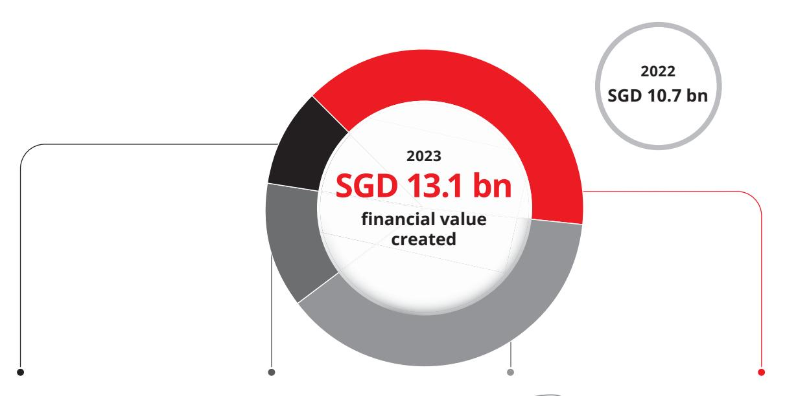

10%

#### **Employees**

Total discretionary bonus to employees through variable cash bonus and long-term incentives.

13%

Contributions to society through direct and indirect taxes, as well as stepping up our support for vulnerable communities and catalysing social impact. In 2023, SGD 100 million was set aside from our profits as part of our announcement to commit up to SGD 1 billion over the next 10 years to improve the lives and livelihoods of the underprivileged and foster a more inclusive society.

38%

#### Shareholders

Dividends for the year to ordinary shareholders.

39% 🖔

#### **Retained earnings**

Retained for business growth and future payout of dividends. To increase the pace of capital returns to shareholders, a 1-for-10 bonus share issue was announced. The bonus shares will qualify for dividends starting with the first-quarter 2024 interim dividend.

## We create value for our stakeholders in several ways: some in financial value, others in intangible benefits.

We define financial value created as net profit before discretionary bonus, taxes (direct and indirect) and community contributions. In 2023, the financial value created amounted to SGD 13.1 billion (2022: SGD 10.7 billion).

In addition, we create non-financial value for our stakeholders in the following ways

#### Customers

Supporting the transition towards lower-carbon business models, integrating sustainability into financing solutions and investment opportunities, and democratising banking services to meet our customers' specific needs.

Read more about our "Responsible Banking" in the Sustainability Report.

#### Employees

Empowering our people to build fulfilling long-term careers by enhancing their experience, investing in their growth and development, and fostering an inclusive culture with equal opportunities.

Read more about how we are "Building a Resilient Workforce" in the Sustainability Report.

#### Society

Championing businesses for impact and uplifting vulnerable communities to catalyse positive environmental and social impact.

Read more about our "Impact Beyond Banking" in the Sustainability Report.

#### **Suppliers**

Through our supplier selection and engagement, we partner with and support more restorative businesses.

Read more about our approach to "Sustainable Procurement" in our Sustainability Report.

#### Regulators

Engaging with local and global regulators and policy makers on reforms and new initiatives that help to maintain the integrity of the banking industry.

Read more about this on page 79.

## Material ESG factors

Materiality is an important principle that we use to ensure we remain focused on the ESG factors, also known as sustainability-related risks and opportunities, that support our resiliency and ability to create long-term value.

Our material ESG factors influence how the Board and management steer the bank. They inform our approach to governance, risk management, strategy, and reporting.

In the context of our reporting on sustainability, materiality helps to make sure that our disclosures are responsive and relevant to our stakeholders.

## Our materiality assessment process

We review our material ESG matters on an annual basis. Our process to assess materiality leverages the ongoing stakeholder engagement activities that are conducted across our business, which is supplemented by desk-based research into industry trends and developments and informs a robust internal discussion on what our material ESG factors are. The list of material ESG factors below is validated by our Group Sustainability Council and Board Sustainability Committee.

Read more about our materiality assessment process in our Sustainability Report 2023.

#### Our material ESG factors

In 2023, we updated our annual review of our material ESG factors. As a result, we amended two material ESG factors to provide a clearer description of their associated impacts, risks, and opportunities. Responsible financing was changed to climate change, and building a great corporate culture was changed to employee engagement and culture. We also created a new topic on the overall resilience of technology at DBS, which includes the previous topic of cyber security. For all the ESG factors listed below, we confirmed their ongoing importance. Finally, we have updated how we present our material ESG factors, which are now classified into two categories:

#### **Strategic ESG Priorities**

These form the focus of our strategy for sustainable value creation. They represent the greatest business opportunities for differentiation and our business-critical risk areas. They are also the areas where we believe we can have the greatest positive impact on sustainable development.

| Climate Change             | Tech Resilience (incl. Cyber Security) |
|----------------------------|-------------------------------------------|
| Developing Our People      | Data Governance                           |
| Financial Crime Prevention | Financial Inclusion                       |

#### **ESG Fundamentals**

These form the foundation of sustainability at DBS and underpin our ability to drive long-term value creation and ensure we operate as a responsible and sustainable business.

| Diversity, Equity and Inclusion | Employee Engagement and Culture             | Employee Volunteerism                  |
|---------------------------------|---------------------------------------------------|-------------------------------------------|
| Fair Dealing                    | Human Rights                                      | Operational Environmental Footprint |
| Responsible Tax                 | Supporting Social Enterprises and Community | Sustainable Procurement                |
|                                 |                                                   |                                           |

DBS ANNUAL REPORT 2023 | BUILDING A SUSTAINABLE ADVANTAGE What our stakeholders are telling us

## What our stakeholders are telling us

We have ongoing dialogue and closely collaborate with our key stakeholders, which helps us to continuously refine our business strategy and strengthens our ability to create long-term value.

We define our key stakeholders as those who are most impacted by our business activities, as well as those with the greatest ability to influence them. They include our investors, customers, employees, society, as well as regulators and policy makers. We proactively engage with these key stakeholders through a variety of channels to both understand and respond to their concerns and interests.

The outcomes of the stakeholder engagement inform our understanding of the ESG factors that are material to our business, which helps to define our strategic priorities and guide the development and implementation of our initiatives.

#### Investors

We provide timely and detailed disclosures to enable investors to make informed investment decisions with DBS. We also seek their perspectives on our financial performance and strategy, ncluding sustainability matters.

#### We interact with customers to better understand their requirements so that we can provide the right financial

We communicate with our employees via multiple channels to ensure that our employees feel purposeful, feel connected, feel invested in, feel valued and feel cared for.

#### Regulators and policy makers

We strive to be a good corporate citizen and advocate by providing input to and supporting the implementation of relevant/ applicable local and global laws, regulations guidelines, and public policies. Additionally, we seek to be a strong representative voice for Asia and Asian financial services at local and global industry forums

Regular engagement sessions with regulators, government bodies and public agencies in one-on-one or group meetings.

Sharing insights and expertise with, and providing feedback

to, regulators, government bodies, and public agencies as an

industry leader, including actively participating in regulator or

Actively responding to or providing feedback on Consultation

Papers, draft regulations and guidelines, policy statements,

government-led working groups, committees, or forums.

• Actively participating in local, regional, and international

industry forums on financial regulation.

#### Quarterly result briefings.

- Investor Day 2023, which drew physical participation from 45 firms and was well-received by analysts and fund managers who attended in person.
- One-on-one and group meetings with over 550 investors, conducted either online or in-person, including conferences.
- Multiple service channels, including digital banking, call centres and branches
  - Regular engagements via relationship managers and subject matter specialists, where appropriate.
  - Active interaction and prompt follow-up to gueries/ feedback received via social media platforms such as Facebook, LinkedIn, and Twitter, as well as our corporate websites.
  - Regular satisfaction surveys.

Customers

solutions for them.

• Participation in conferences, masterclasses, and events bringing together partners and industry leaders for networking and knowledge sharing.

Retail customers are seeking greater stability and

security alongside growing demand for digital

features to enable seamless user experiences.

logging into their banking accounts.

escalating inflation environment.

• Many retail customers are also expecting stronger

services. They also prefer greater product variety and

customer protection amid the fast-evolving scam and

fraud tactics, to prevent scammers from fraudulently

Many small and medium enterprise (SME) customers

continue to have working capital requirements to

There is growing interest amongst corporate and

SME customers to embrace sustainability as part

strengthen internal capabilities, collaboration and

new partnership establishments to enhance their

of their business strategy. Many are seeking to

support them as they pivot in a post pandemic,

- "Tell Piyush" an online forum where over 550 employee questions and feedback items were conveyed to the CEO.
- "DBS Open" quarterly group-wide townhall hosted by the CEO.
- Regular department townhalls and events held by senior management.
- Annual "MyVoice" Employee Engagement survey and quarterly Employee Experience surveys.
- Employee Experience Council drive iconic employee journeys to enhance employee
- Culture Builders more than 1,200 employees engage fellow employees to gather feedback.

"Tell Piyush" covered topics such as

Questions and feedback raised via

well as customer experience.

- A growing number of SMEs and social enterprises (SEs) are open to adopt corporate strategy, culture, technology more sustainable business models, but are often held back by operational and workplace management, employee compensation, benefits and welfare as matters and may lack the bandwidth or resources to kickstart their transition
- Through the annual employee engagement survey and quarterly employee experience survey, the key areas of concern raised by employees are around wellbeing (work-related stress), and rewards and recognition.

Regular events and conversations with Businesses for Impact, community partners and social service agencies to understand the social landscape and how DBS can partner to create impact.

We engage the community to better understand the role we can play to

address societal needs and gaps.

- Connection with government bodies and associations, including Singapore Centre for Social Enterprise and Community Chest.
- Strong partnerships with academia to jointly tackle real-world sustainability challenges.
- Community engagement within the public housing estates (heartlands) and our neighbours through POSB.

journey. They seek catalytic capital and

strong partners to enable them to scale

positive social and environment impact.

up their businesses and deepen their

An uneven post-pandemic economic

have exacerbated the plight of the

financially vulnerable with some

segments of society facing acute

challenges in making ends meet.

recovery and stubbornly high inflation

- Ensure business resilience and continue providing innovative financial services to maintain stability of the financial system.
- Key regulatory and reporting topics being discussed and introduced in the banking industry include:
  - Technology and cyber security
  - Money laundering and terrorism financing
  - Artificial intelligence applications
- Climate change
- New regulatory and legal requirements, as well as new global or market standards in new growth areas such as fintech/ tech platforms, carbon markets, sustainable financing, green taxonomies, and climate and nature-related reporting and

## topics raised a received? re the key feedback

did we engage?

- Impact on business outlook and credit quality from peaking interest rates, geopolitical uncertainty, slowing economic growth and pressures from China's real estate sector.
- Prospect for higher dividends given high Common Equity Tier 1 (CET-1) level and Return on Equity (ROE).
- Environmental, social and governance (ESG) commitments and our progress towards targets. Specifically, climate change, corporate governance, technology resilience, and other social issues such as human capital management and rising inequality are highlighted as priorities to manage.
- We provided detailed disclosures and commentary on business outlooks, financial performance, and credit quality.
- We held an investor day to provide further details on how digitalisation has structurally improved our franchise and provided a mediumterm ROE target range.
- We reiterated our policy to pay sustainable dividends that grow progressively with earnings and committed to raising baseline dividend per share by 24 cents per year. We also affirmed our CET-1 target range and guided to return excess capital.
- We responded to the FSG gueries and highlighted key information about our sustainability strategy through email correspondence, as well as both online and in-person meetings. We also provided details on how we are operationalising our net zero commitment, including how we engage with customers on their decarbonisation strategies.

Read more in the "CFO statement" in our Annual Report and our Investor Day on our website.

- sustainability and decarbonisation efforts. To improve service reliability, we established a comprehensive roadmap that will strengthen technology resiliency and recovery. We reinforced our Respectful, Easy to Deal With, Dependable (RED) service standards by developing an extensive empathy training programme to enhance our ability to solve the root causes of
  - We also developed new anti-malware security measures, including access restrictions to online banking apps when potential security risks are detected and a suite of self-managed security controls to empower customers to proactively safeguard themselves.

obsessed culture and improve banking journeys.

negative experiences. We continue to adopt a customer-

- We approved over 4,400 unsecured loans totalling SGD 665 million to micro and small businesses and continued to harness our data capabilities to proactively reach out to our SME customers to address their working capital requirements.
- We intensified our client engagement on their net zero and transition strategies to empower our clients on their sustainability planning and decarbonisation journey. In 2023, we established several partnerships to connect our clients with a network of solution providers and accelerated innovative financing solutions through the Business for Impact (BFI) Banking Package to SMEs with sustainable business models, among others.
- We also advocated for sustainability capability and capacity building. For example, we partnered with SkillsFuture Singapore, a Singapore government agency, to upskill SMEs and help strengthen their sustainability skills through the DBS SME Skills Booster programme.

Read more in "Institutional Banking" on page 36, "Consumer Banking/ Wealth Management" on page 38, and "Tech Resilience", "Responsible Financing", "Sustainable Living", and "Financial Inclusion" in the Sustainability Report.

- Piyush personally addressed all questions and comments raised. Employees were also engaged regularly through quarterly pulse surveys to identify areas of concerns and/ or pain points. Where applicable. all issues and suggestions raised, and insights received, were directed to relevant departments and COO offices for follow-up.
- DBS has continually improved our employee experience in response to employee feedback, resulting in more impactful outcomes such as improved employee advocacy, retention, and motivation. In 2023, we established the Employee Experience Council to prioritise four focus areas: employee well-being, workload, assimilation of new hires, and rewards and recognition.

Read more about "Enhancing Employee Engagement and Culture" in the Sustainability Report.

- We awarded SGD 3.7 million in grant funding to 24 awardees across the region through the 2023 DBS Foundation Business for Impact Grant Award. This programme is to recognise, reward and support both SMEs and SEs to scale their business model and deepen their social and/ or environmental impact.
- We continued to scale our volunteerism footprint by encouraging employees to embrace new and creative ways of volunteering, incorporating a hybrid of in-person and virtual approaches. In transcending limitations and geographical constraints, we successfully redefined the concept of volunteering.
- In August 2023, we announced a commitment of up to SGD 1 billion over the next 10 years to improve lives and livelihoods of the low-income and underprivileged, and foster a more inclusive society.

Read more about "POSB" on page 40, "DBS Foundation" and "Employee Volunteerism" in the Sustainability Report.

- Following the technology incidents in 2023, we have laid out a comprehensive roadmap to further enhance our resilience and enhance stakeholder confidence and trust. To reinforce governance and oversight of technology risk, we established the Board Technology Risk Committee.
- We partnered regulators, industry peers, and enforcement agencies to address the risk of mobile malware and respond to evolving online scams targeting our banking customers.
- We collaborated with regulators and industry peers to plan and execute an industry-wide cybersecurity exercise to test and improve the industry readiness to respond to a wide scale cybersecurity affecting the banking ecosystem.
- We contributed to various regulatory consultations and discussions, as well as industry working groups including (amongst others)
- The Singapore-Asia Taxonomy by MAS
- Project Greenprint by MAS
- The Green Skills Committee, set up by the Ministry of Trade and Industry in partnership with SkillsFuture Singapore

Read more about "Risk Management" on page 80, "Tech Resilience", "Preventing Financial Crime", "Data Governance" and "Fair Dealing" in the Sustainability Report.

# did we respond?

80 **DBS ANNUAL REPORT 2023** BUILDING A SUSTAINABLE ADVANTAGE **Risk management** 81

## **Risk management**

**The sections marked by a grey line in the left margin form part of the Group's audited ȴ nancial statements. Please refer to Pillar 3 and Other Regulatory Disclosures for other risk disclosures.**

#### **1 Risk overview**

#### **Business and strategic risk**

Overarching risk arising from adverse business and economic changes materially aΊ ect DBS' long-term objectives. This risk is managed separately under other governance processes.

*Read more about this on page 77.*

#### **Credit risk**

Risk arising from borrowers or counterparties failing to meet their debt or contractual obligations.

*Read more about this on page 82.*

#### **Market risk**

Risk arising from adverse changes in interest rates, foreign exchange rates, equity prices, credit spreads and commodity prices, as well as related factors.

*Read more about this on page 89.*

#### **Liquidity risk**

Risk that arises if DBS is unable to meet nancial obligations when they are due.

*Read more about this on page 92.*

#### **Operational risk**

Risk arising from inadequate or failed internal processes, people or systems, or from external events. It includes legal risk, but excludes strategic and reputational risk.

*Read more about this on page 94.*

#### **Technology risk**

Risk arising from potential adverse outcomes or disruptions stemming from technology-related factors, such as software vulnerabilities, hardware failures, cybersecurity threats, or technological changes. Technology risk can arise from internal factors (such as system resiliency gaps, change management, inadequate governance and inadequate IT workforce

skillsets); or from external factors (such as cyber-threats and third-party vendor).

*Read more about this on page 95.*

#### **Reputational risk**

Risk that arises if our shareholder value (including earnings and capital) is adversely aΊ ected by any negative stakeholder perception of DBS' image. This inΌ uences our ability to establish new relationships or services, service existing relationships and have continued access to sources of funding. Reputational risk usually occurs when the other risks are poorly managed.

*Read more about this on page 96.*

#### **2 Risk-taking and our business segments**

Our risks are diversi ed across diΊ erent business segments. The chart below provides an overview of the risks arising from our business segments. The asset size of each business segment reΌ ects its contribution to the balance sheet, and the risk-weighted assets (RWA) oΊ er a risk-adjusted perspective.

*Refer to Note 45.1 to the ȴ nancial statements on page 177 for more information about DBS' business segments*

| SGD million             | Consumer Banking/ Wealth Management | Institutional Banking | Treasury Markets | Others(a) | Group   |
|-------------------------|-------------------------------------------|--------------------------|------------------|-----------|---------|
| Assets(b)               | 134,693                                   | 317,552                  | 182,940          | 97,803    | 732,988 |
| Risk-weighted assets | 49,738                                    | 223,847                  | 44,236           | 50,542    | 368,363 |
| % of RWA                | Consumer Banking/ Wealth Management | Institutional Banking | Treasury Markets | Others(a) | Group   |
| Credit risk             | 78                                        | 93                       | 52               | 46        | 80      |
| Market risk             | 0                                         | 0                        | 43               | 14        | 7       |
| Operational risk        | 22                                        | 7                        | 5                | 40        | 13      |

*(a) Encompasses assets/ RWA from capital and balance sheet management, funding and liquidity activities, DBS Vickers Group and The Islamic Bank of Asia Limited* 

#### **3 Risk governance**

The Board oversees DBS' aΊ airs and provides sound leadership for the CEO and management. Authorised by the Board, various Board committees oversee speci c responsibilities based on clearly de ned terms of reference.

Under our risk management approach, the Board, through the Board Risk Management Committee (BRMC), sets our Risk Appetite, oversees the establishment of enterprise-wide risk management policies and processes, and establishes risk appetite limits to guide DBS' risk-taking.

The BRMC also oversees the identi cation, monitoring, management and reporting of credit, market, liquidity, operational, technology and reputational risks. In addition, the BRMC Technology Risk Committee (BTRC), a sub-committee to the BRMC, has been set up to assist the BRMC in overseeing the management of technology risk across the Group. This includes providing guidance on the implementation of the plans to uplift DBS Bank's technology resilience and the business continuity management.

To facilitate the BRMC's risk oversight, the following risk management committees have been established.

| Risk management committees                                                                                                                                                                                                                                                        |                                                                                                                                                                                                                                                                                                                                                                                                                                                                                                                                                                                                                                                                                                                                                                                                                                                                         |
|-----------------------------------------------------------------------------------------------------------------------------------------------------------------------------------------------------------------------------------------------------------------------------------|-------------------------------------------------------------------------------------------------------------------------------------------------------------------------------------------------------------------------------------------------------------------------------------------------------------------------------------------------------------------------------------------------------------------------------------------------------------------------------------------------------------------------------------------------------------------------------------------------------------------------------------------------------------------------------------------------------------------------------------------------------------------------------------------------------------------------------------------------------------------------|
| Risk Executive Committee (Risk EXCO)                                                                                                                                                                                                                                              | As the overall executive body regarding risk matters, the Risk EXCO oversees DBS' risk management.                                                                                                                                                                                                                                                                                                                                                                                                                                                                                                                                                                                                                                                                                                                                                                   |
| Group Credit Risk Committee (GCRC) Group Credit Risk Models Committee (GCRMC) Group Market and Liquidity Risk Committee (GMLRC) Group Operational Risk Committee (GORC) Group Technology Risk Committee (GTRC) Group Scenario and Stress Testing Committee (GSSTC) | Each of the committees reports to the Risk EXCO, and serves as an executive forum to discuss and implement DBS' risk management. Key responsibilities: • Assess and approve risk-taking activities • Oversee DBS' risk management infrastructure, which includes frameworks, decision criteria, authorities, people, policies, standards, processes, information and systems • Approve risk policies such as model governance standards, stress testing scenarios, and the evaluation and endorsement of risk models • Assess and monitor speci΋c credit concentration • Recommend stress-testing scenarios (including macroeconomic variable projections) and review the results The members in these committees comprise representatives from the Risk Management Group (RMG) as well as key business and support units. |
| Product Approval Committee (PAC)                                                                                                                                                                                                                                                  | The PAC provides group-wide oversight and direction for the approval of new product/ service and outsourcing initiatives. It evaluates new product/ service and outsourcing initiatives to ensure that they are in line with DBS' strategy and risk appetite.                                                                                                                                                                                                                                                                                                                                                                                                                                                                                                                                                                                                  |

Most of the above committees are supported by local risk committees in all major locations, where appropriate. These local risk committees oversee the local risk positions for all businesses and support units, ensuring that they keep within limits set by the Group risk committees. They also approve location-speci c risk policies.

The Chief Risk O cer (CRO), who is a member of the Group Executive Committee and reports to the Chairman of the BRMC and the CEO, oversees the risk management function. The CRO is independent of business lines and is actively involved in key decision-making processes. He often engages with regulators to discuss risk matters, enabling a more holistic risk management perspective.

Working closely with the risk and business committees, the CRO is responsible for the following:

- Management of DBS' risks, including systems and processes to identify, approve, measure, monitor, control and report risks
- Engagement with senior management about material matters regarding all risk types
- Development of risk controls and mitigation processes
- Ensuring DBS' risk management is eΊ ective, and the Risk Appetite established by the Board is adhered to

#### **4 Risk appetite**

DBS' Risk Appetite is set by the Board and governed by the Risk Appetite Policy, which articulates the risks that we are willing to accept. It also serves to reinforce our risk culture by setting a clear message from the 'tone from the top'. A strong organisational risk culture, complemented with a balanced incentive framework (refer to "Remuneration Report" section on page 65), helps to further embed our Risk Appetite.

#### **4.1 Risk thresholds and economic capital usage**

Our Risk Appetite takes into account a spectrum of risk types and is implemented using thresholds, policies, processes and controls.

Setting thresholds is essential in making DBS' Risk Appetite an intrinsic part of our businesses as they help to keep all our risks within acceptable levels. Portfolio risk limits for the quanti able risk types are established top down, and these are implemented using frameworks. As for the nonquanti able risk types, these are managed using qualitative principles.

*(b) Before goodwill and intangibles* 

To ensure that the thresholds pertaining to our Risk Appetite are completely risk sensitive, we adopted both economic capital (EC) and regulatory capital (RC) as our risk metrics. Additionally, both EC and RC are assessed as part of our Internal Capital Adequacy Assessment Process (ICAAP).

Our capital allocation structure monitors credit, market and operational risks (including technology risk), by assessing regulatory capital utilisation at the business unit level. The diagram below shows how they are managed along the various dimensions. A buΊ er is also maintained for other risks, such as country, reputational, model risks, etc.

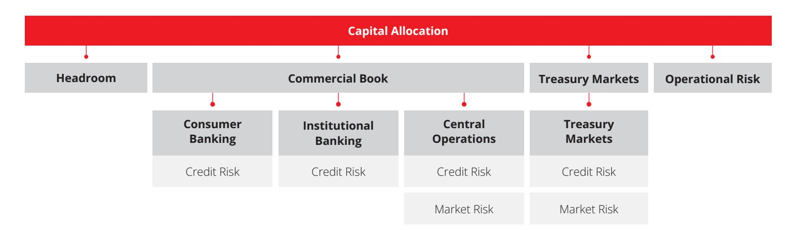

Other quantitative or qualitative controls are used to manage the other risks at granular levels. The following chart provides a broad overview of how our Risk Appetite permeates throughout DBS.

*Refer to Sections 5 through 9 for more information about each risk type.*

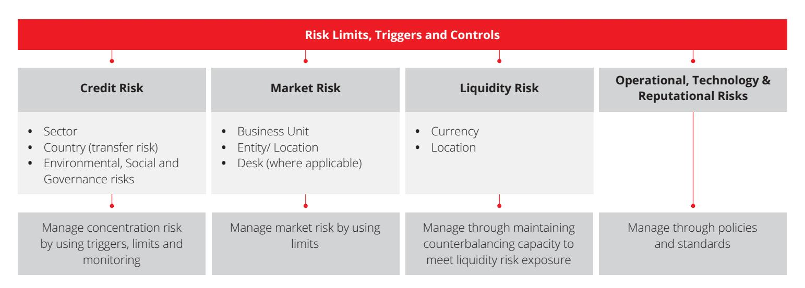

#### **4.2 Stress testing**

Stress testing is an integral part of our risk management process. It includes both sensitivity and scenario analyses, and is conducted regularly. In particular, the ICAAP (a group-wide exercise spanning diΊ erent risk types) is performed annually. In addition, stress tests are carried out in response to microeconomic and macroeconomic conditions, or portfolio developments. Every stress test is documented and the results are reviewed by senior management and/ or the BRMC.

Stress testing alerts senior management to our potential vulnerability to exceptional

but plausible adverse events. As such, stress testing enables us to assess capital adequacy and identify potentially risky portfolio segments as well as inherent systematic risks. This then allows us to develop the right contingency plans, exit strategies and mitigating actions beforehand.

The ICAAP ensures our business plans are consistent with our Risk Appetite. This is done by comparing the projected demand for capital to the projected supply of capital under various scenarios, including severe macroeconomic stress.

#### **5 Credit risk**

The most signi cant measurable risk DBS faces - credit risk - arises from our daily activities in our various businesses. These activities include lending to retail, corporate and institutional customers. It includes the risk of lending, as well as the pre-settlement and settlement risk of foreign exchange, derivatives and securities.

*Refer to Note 42.1 to the ȴ nancial statements on page 169 for details on DBS' maximum exposure to credit risk.*

#### **5.1 Credit risk management at DBS**

DBS' approach to credit risk management comprises the following building blocks:

#### **Policies**

**Risk methodologies**

**Processes, systems and reports**

#### **Policies**

The dimensions of credit risk and the scope of its application are de ned in the Group Credit Risk Management Policy. Senior management sets the overall direction and policy for managing credit risk at the enterprise level.

The Group Core Credit Risk Policies (CCRPs) established for Consumer Banking/ Wealth Management and Institutional Banking set forth the principles by which DBS conducts its credit risk management and control activities. These policies, supplemented by a number of operational standards and guides, ensure consistency in identifying, assessing, underwriting, measuring, reporting and controlling credit risk across DBS, and provide guidance in the formulation of businessspecic and/ or location-speci c credit risk policies and standards.

The operational standards and guides are established to provide greater details on the implementation of the credit principles within the Group CCRPs and are adapted to reΌ ect diΊ erent credit environments and portfolio risk pro les. The CCRPs are approved by the Group Chief Credit O cer.

#### **Risk methodologies**

Credit risk is managed by thoroughly understanding our wholesale customers – the businesses they are in, as well as the economies in which they operate. It is also managed through statistical models and data analytics for retail customers.

The assignment of credit risk ratings and setting of lending limits are integral parts of DBS' credit risk management process, and we use an array of rating models for our wholesale and retail portfolios. Most of these models are built internally using DBS' loss data, and the limits are driven by DBS' Risk Appetite Statement and the Target Market and Risk Acceptance Criteria (TM-RAC).

Wholesale borrowers are assessed individually, and further reviewed and evaluated by experienced credit risk managers who consider relevant credit risk factors in the nal determination of the borrower's risk. For some portfolios within the SME segment, DBS also

uses a programme-based approach to achieve a balanced management of risks and rewards. Retail exposures are assessed using credit score models, credit bureau records as well as internally and externally available customer behaviour records supplemented by our Risk Acceptance Criteria (RAC). Credit applications are proposed by the business units, and applications outside the RAC are independently assessed by the credit risk managers.

#### *Refer to Section 5.3 on page 86 to read more about our internal credit risk models.*

Pre-settlement credit risk for traded products arising from a counterparty potentially defaulting on its obligations is quanti ed by evaluation of the mark-to-market value, plus potential future exposure. This is included within DBS' overall credit limits to counterparties for internal risk management.

We actively monitor and manage our exposure to counterparties for over-thecounter (OTC) derivative trades to protect our balance sheet in the event of a counterparty default. Counterparty risk exposures that may be adversely aΊ ected by market risk events are identi ed, reviewed and acted upon by management, and highlighted to the appropriate risk committees. Speci c wrong-way risk arises when the credit exposure of a counterparty (from the traded product transaction) directly correlates with the probability of default of the counterparty. DBS has processes in place to guide the handling of speci c wrong-way risk transactions, and its risk measurement metric takes into account the higher risks associated with such transactions.

Issuer default risk that may also arise from derivatives, notes and securities is generally measured based on jump-to-default computations.

#### **Concentration risk management**

For credit risk concentration, we use EC as our measurement tool as it combines the individual risk factors such as the probability of default (PD), loss given default (LGD) and exposure at default (EAD), in addition to industry correlation and portfolio concentration. EC thresholds are set to ensure that the allocated EC stays within our Risk Appetite. Concentration risk for retail is managed at two levels – product level where exposure limits are set up, and segment level to manage the growth of high-risk segments. Governance processes are in place to ensure that these thresholds are monitored regularly, and appropriate actions are taken when the thresholds are breached.

DBS continually examines and reviews how we can enhance the scope of our thresholds and approaches to manage concentration risk.

#### **Environmental, social and governance risks**

DBS considers ESG risk management as critical to ensure a sustainable lending and investment portfolio. Following the establishment of the Board Sustainability Committee and incorporation of environmental risk considerations into our Risk Appetite statement in 2022, we further enhanced our Group Responsible Financing Standard which provides our overarching approach to responsible nancing and enhanced assessment required when nancing transactions with elevated ESG risks. The requirements of this document represent the minimum standards for DBS, and we have also sought alignment, where possible, with international standards and best practices. Where signi cant ESG issues are identi ed, escalation is required to IBG Sustainability and Risk Management ESG teams for further guidance prior to approval by the Credit Approving Authority.

*Read more about "Responsible Financing" in the Sustainability Report.*

#### **Country risk**

Country risk refers to the risk of loss due to events in a speci c country (or a group of countries). This includes political, exchange rate, economic, sovereign and transfer risks.

DBS manages country risk through the requirements of the Group CCRP and the said risk is part of our concentration risk management. The way we manage transfer risk at DBS is set out in our Country Risk Management Standard. This includes an internal transfer risk and sovereign risk rating system, where assessments are made independently of business decisions. Our transfer risk limits are set in accordance with the Group Risk Appetite Policy.

Transfer risk limits for individually reviewed countries are set based on country-speci c strategic business considerations as well as the acceptable potential loss according to our Risk Appetite. Management actively evaluates and determines the appropriate level of transfer risk exposures for these countries taking into account the risks and rewards and whether they are in line with our strategic intent. Limits for all other countries are set using a model-based approach.

Risk Appetite for each country is approved by the BRMC, while transfer risk limits are approved by the Board EXCO and senior management.

#### **Credit stress testing**

DBS engages in various types of credit stress testing, and these are driven either by regulators or internal requirements and management. Our credit stress tests are performed at the total portfolio or

sub-portfolio level, and are generally conducted to assess the impact of changing economic conditions on asset quality, earnings performance, capital adequacy and liquidity. DBS' stress testing programme is

comprehensive and covers a range of risks and business areas.

DBS typically performs the following types of credit stress testing at a minimum and others as necessary:

#### **Pillar 1 cyclicality stress testing**

DBS conducts Pillar 1 cyclicality stress testing regularly as required by regulators. Under Pillar 1 cyclicality stress testing, DBS assesses the impact of a mild stress scenario (at least two consecutive quarters of zero growth) on Internal Ratings-Based (IRB) estimates (i.e. PD, LGD and EAD) and the impact on regulatory capital. The purpose of the Pillar 1 cyclicality stress test is to assess the robustness of internal credit risk models and the cushion above minimum regulatory capital.

#### **Pillar 2 credit stress testing**

DBS conducts Pillar 2 credit stress testing once a year as part of the ICAAP. Under Pillar 2 credit stress testing, DBS assesses the impact of stress scenarios, with diΊerent levels of severity, on asset quality, earnings performance as well as internal and regulatory capital. The results of the credit stress test form inputs to the capital planning process under ICAAP. The purpose of the Pillar 2 credit stress testing is to examine, in a rigorous and forward-looking manner, the possible events or changes in market conditions that could adversely impact DBS and to develop the appropriate action plan.

#### **Industry-wide stress testing**

DBS participates in the annual industry-wide stress test (IWST) conducted by the Monetary Authority of Singapore (MAS) to facilitate the ongoing assessment of Singapore's nancial stability. Under the IWST, DBS is required to assess the impact of adverse scenarios, as de ned by the regulator, on asset quality, earnings performance and capital adequacy, where applicable.

#### **Sensitivity and scenario analyses**

DBS also conducts multiple independent sensitivity analyses and credit portfolio reviews based on various scenarios. The intent of these analyses and reviews is to identify vulnerabilities for the purpose of developing and executing mitigating actions. For example, climate transition and physical risk scenario analyses are conducted as part of the regulatory-driven pilot climate stress test exercises to assess the potential vulnerabilities of our portfolios to short and longterm climate transition and physical risks.

#### **Processes, systems and reports**

DBS constantly invests in systems to support risk monitoring and reporting for our Institutional Banking and Consumer Banking/ Wealth Management businesses.

The end-to-end credit process is continually being reviewed and improved through various front-to-back initiatives involving business, operations, risk management and other key stakeholders. Day-to-day monitoring of credit exposures, portfolio performance and external environmental factors potentially aΊ ecting credit risk pro les is key to our philosophy of eΊ ective credit risk management.

In addition, credit trends, which may include industry analysis, early warning alerts and signi cant weak credits, are submitted to

the various risk committees, allowing key strategies and action plans to be formulated and evaluated. Credit control functions also ensure that any credit risk taken complies with the credit risk policies and standards. These functions ensure that approved limits are activated, credit excesses and policy exceptions are appropriately endorsed, compliance with credit standards is carried out, and covenants established are monitored.

Independent risk management functions that report to the CRO are jointly responsible for developing and maintaining a robust credit stress testing programme. These units oversee the implementation of credit stress tests as well as the analysis of the results, of which management, various risk committees and regulators are informed.

#### **Non-performing assets**

DBS' credit facilities are classi ed as "Performing assets" or "Non-performing assets" (NPA), in accordance with the MAS Notice to Banks No. 612 "Credit Files, Grading and Provisioning" (MAS Notice 612).

Credit exposures are categorised into one of the following ve categories, according to our assessment of a borrower's ability to repay a credit facility from its normal sources of income and/ or the repayment behaviour of the borrower.

| Classi΋ cation grade | Description                                                                                                                                                                                                                                       |
|----------------------|---------------------------------------------------------------------------------------------------------------------------------------------------------------------------------------------------------------------------------------------------|
| Performing assets    |                                                                                                                                                                                                                                                   |
| Pass                 | Indicates that the timely repayment of the outstanding credit facilities is not in doubt.                                                                                                                                                         |
| Special mention      | Indicates that the borrower exhibits potential weaknesses that, if not corrected in a timely manner, may adversely aΊ ect future repayments and warrant close attention by DBS.                                                                |
| Classi΋ed or NPA     |                                                                                                                                                                                                                                                   |
| Substandard          | Indicates that the borrower exhibits de΋ nable weaknesses in its business, cash Ό ow or ΋ nancial position that may jeopardise repayment on existing terms.                                                                                    |
| Doubtful             | Indicates that the borrower exhibits severe weaknesses such that the prospect of full recovery of the outstanding credit facilities is questionable and the prospect of a loss is high, but the exact amount remains undeterminable as yet. |
| Loss                 | Indicates that the outstanding credit facility is not collectable, and little or nothing can be done to recover the outstanding amount from any collateral or from the assets of the borrower generally.                                       |

A default is considered to have occurred with regard to a particular borrower when either or both of the following events have taken place:

- Subjective default: Borrower is considered to be unlikely to pay its credit obligations in full, without DBS taking action such as realising security (if held)
- Technical default: Borrower is more than 90 days past due on any credit obligation to DBS

For retail borrowers, the categorisation into the respective MAS loan grades is at the facility level and consistent with MAS Notice 612.

Credit facilities are classi ed as restructured assets when we grant non-commercial concessions to a borrower because its nancial position has deteriorated or is unable to meet the original repayment schedule. A restructured credit facility is classi ed into the appropriate non- performing grade based on the assessment of the borrower's nancial condition and its ability to repay according to the restructured terms.

Such credit facilities are not returned to the performing status until there are reasonable grounds to conclude that the borrower will be able to service all future principal and interest payments on the credit facility in accordance with the restructured terms and MAS Notice 612. Apart from what has been described, we do not grant concessions to borrowers in the normal course of business.

In addition, it is not within DBS' business model to acquire debts that have been restructured at inception (e.g. distressed debts).

*Refer to Note 2.11 to the ȴ nancial statements on page 129 for our accounting policies regarding speciȴ c and general allowances for credit losses.*

In general, speci c allowances are recognised for defaulting credit exposures rated substandard and below.

*The breakdown of our NPA by loan grading and industry and the related amounts of speciȴ c allowances can be found in Note 42.2 to the ȴ nancial statements on page 170. A breakdown of past due loans can also be found in the same note.* 

When required, we will take possession of all collateral and dispose them as soon as practicable. Realised proceeds are used to reduce outstanding indebtedness.

*A breakdown of collateral held for NPA is shown in Note 42.2 to the ȴ nancial statements on page 172.* 

Repossessed collateral is classi ed in the balance sheet as Other assets. The amounts of such Other assets for 2022 and 2023 were not material.

#### **5.2 Credit risk mitigants**

#### **Collateral received**

Where possible, DBS takes collateral as a secondary source of repayment. This includes, but is not limited to, cash, marketable securities, real estate, trade receivables, inventory, equipment, and other physical and/ or nancial collateral. We may also take xed and Ό oating charges on the assets of borrowers.

Policies are in place to determine the eligibility of collateral for credit risk mitigation. Collateral is generally diversi ed and periodic valuations of collateral are required.

Real estate constitutes the bulk of our collateral, with a signi cantly lower proportion in marketable securities and cash.

For derivatives, repurchase agreements (repo) and other repo-style transactions with nancial market counterparties, collateral arrangements are typically covered under market-standard documentation, such as International Swaps & Derivatives Association (ISDA) Agreements and Master Repurchase Agreements.

The collateral exchanged mitigates markedto-market changes at a re-margining frequency that DBS and the counterparties have mutually agreed upon. This is governed by internal guidelines with respect to collateral eligibility. In the event of a default, the credit risk exposure is reduced by masternetting arrangements where DBS is allowed to oΊ set what is owed to a counterparty against what is due from that counterparty in a netting-eligible jurisdiction.

*Refer to Note 14 to the ȴ nancial statements on page 141 for further information on ȴ nancial assets and liabilities subject to netting agreement but not o set on the balance sheet.*

Collateral held against derivatives generally consists of cash in major currencies and highly rated government or quasigovernment bonds. Exceptions may arise in certain countries, where due to domestic capital markets and business conditions, the bank may be required to accept less highly rated or liquid government bonds and currencies. Reverse repo-transactions are generally traded with large institutions with reasonably good credit standing. DBS takes haircuts against the underlying collateral of these transactions that commensurate with collateral quality to ensure credit risks are adequately mitigated.

In times of di culty, we will review the customers' speci c situation and circumstances to assist them in restructuring their nancial obligations.

However, should the need arise, disposal and recovery processes are in place to dispose the collateral held. DBS maintains a panel of agents and solicitors to assist in the disposal of non-liquid assets and specialised equipment quickly.

#### Collateral posted

DBS is required to post additional collateral in the event of a rating downgrade. As at 31 December 2023, for a three-notch downgrade of its Standard & Poor's Ratings Services and Moody's Investors Services ratings, DBS will have to post additional collateral amounting to SGD 26 million (2022: SGD 11 million).

#### Other credit risk mitigants

DBS accepts guarantees as credit risk mitigants. Internal requirements for considering the eligibility of guarantors for credit risk mitigation are in place.

#### 5.3 Internal credit risk models

DBS adopts rating systems for the different asset classes under the Internal Ratings -Based Approach (IRBA).

There is a robust governance process for the development, independent validation and approval of any credit risk model. The models go through a rigorous review process before they are endorsed by the GCRMC and Risk EXCO. They must also be approved by the BRMC before submission for regulatory approval. The key risk measures generated by the internal credit risk rating models to quantify regulatory capital include PD, LGD and EAD. For portfolios under the Foundation IRBA, internal estimates of PD are used while the supervisory LGD and EAD estimates are applied. For portfolios under the Advanced IRBA, internal estimates of PD, LGD and EAD are used. In addition, the ratings from the credit models act as the basis for underwriting credit risk, monitoring portfolio performance and determining business strategies. The performance of the rating systems is monitored regularly and reported to the GCRMC, Risk EXCO and BRMC to ensure their ongoing effectiveness.

An independent risk unit conducts formal validations for the respective rating systems annually. The validation processes are also independently reviewed by Group Audit. These serve to highlight material deterioration in the rating systems for management attention.

#### 5.3.1 Retail exposure

Retail exposures are categorised into the following asset classes under the Advanced IRBA: residential mortgages, qualifying revolving retail exposures, and other retail exposures.

Within each asset class, exposures are managed on a portfolio basis. Each customer or account is assigned to a risk

pool, considering factors such as borrower characteristics and collateral type. PD, EAD and LGD estimates are based on internal historical default, utilisation and realised losses within a defined period.

Product-specific credit risk elements such as underwriting criteria, scoring models, approving authorities, asset quality, and business strategy reviews, as well as systems, processes and techniques to monitor portfolio performance, are in place. Credit risk models for secured and unsecured portfolios are also used to update the risk level of each loan on a monthly basis, reflecting the broad usage of risk models in portfolio quality reviews.

#### 5.3.2 Wholesale exposure

Wholesale exposures are largely under the Foundation IRBA for capital computation. They include sovereign, bank and corporate. Specialised lending exposures are under IRBA using supervisory slotting criteria.

Sovereign exposures are risk-rated using internal risk-rating models. Factors related to country-specific macroeconomic risk, political risk, social risk and liquidity risk are included in the sovereign rating models to assess the sovereign credit risk in an objective and systematic manner.

Bank exposures are assessed using the bank-rating model. The model considers both quantitative and qualitative factors such as capital levels and liquidity, asset quality and management strength.

Large corporate exposures are assessed using internal rating model. Factors considered in the risk assessment process include the counterparty's financial strength and qualitative factors such as industry risk, access to funding, market standing and management strength.

SME credit rating models consider risk factors such as those relating to the counterparty's financial strength, qualitative factors, as well as account performance.

Credit risk ratings under the IRBA portfolios are, at a minimum, reviewed by designated approvers on an annual basis unless credit conditions require more frequent assessment.

#### 5.3.3 Specialised lending exposures

Specialised lending IRBA portfolios include income-producing real estate, project finance, object finance, and commodities finance. These adopt the supervisory slotting criteria specified under Annex 7v of MAS Notice 637, which are used to determine the risk weights to calculate credit risk-weighted exposures.

#### 5.3.4 Securitisation exposures

We arrange securitisation transactions for our clients for fees. These transactions do not involve special-purpose entities that we control. For transactions that are not underwritten, no securitisation exposures are assumed as a direct consequence of arranging the transactions. Any decision to invest in any of such arranged transactions is subject to independent risk assessment.

Where DBS provides an underwriting commitment, any securitisation exposure that arises will be held in the trading book to be traded or sold down in accordance with our internal policy and risk limits. In addition, DBS does not provide implicit support for any transactions we structure or have invested in.

We invest in our clients' securitisation transactions from time to time. These may include securitisation transactions arranged by us or with other parties.

We may also act as a liquidity facility provider, working capital facility provider or swap counterparty. Such securitisation exposures require the approval of the independent risk function and are subject to regular risk reviews. We also have processes in place to monitor the credit risk of our securitisation exposures.

#### 5.3.5 Credit exposures falling outside internal credit risk models

DBS applies the Standardised Approach (SA) for portfolios that are expected to transit to IRBA or for portfolios that are immaterial in terms of size and risk profile. These portfolios

- IRBA-transitioning retail and wholesale
- IRBA-exempt retail exposures
- IRBA-exempt wholesale exposures

Any identified transitioning retail and/ or wholesale exposures are expected to adopt Advanced or Foundation IRBA, subject to approval by regulators. Prior to regulatory approval, these portfolios are under SA.

The portfolios under the SA are subject to our overall governance framework and credit risk management practices. DBS continues to monitor the size and risk profile of these portfolios and will enhance the relevant risk measurement processes if these risk exposures become material.

DBS uses external ratings for credit exposures under the SA where relevant, and we only accept ratings from Standard & Poor's, Moody's and Fitch in such cases. DBS follows the process prescribed in MAS Notice 637 to map the ratings to the relevant risk weights.

#### Credit risk in 2023 5.4

#### **Concentration risk**

DBS' concentration risk remained well managed across geographies and industry/ business segments.

Our geographic distribution of customer loans remained stable.

Singapore, our home market, continued to account for the largest share of our gross loans and advances to customers, contributing to 46% of our total portfolio.

Our portfolio is well diversified across industry and business segments. Building and Construction, General Commerce and Manufacturing remained the largest contributors in the wholesale portfolio, accounting for 46% of the total portfolio.

#### Non-performing assets

New non-performing asset (NPA) formation was offset by recoveries and write-offs. In absolute terms, our total NPA decreased by 1% from the previous year to SGD 5.06 billion and non-performing loans (NPL) ratio remained constant at 1.1% in 2023.

Refer to "CFO Statement" on page 20.

Industry Concentration (SGD billion)

#### **Geographical Concentration (SGD billion)**

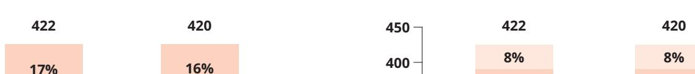

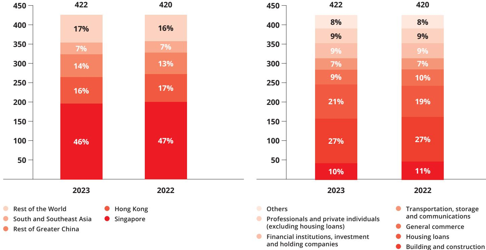

Above refers to gross loans and advances to customers based on country of incorporation

Above refers to gross loans and advances to customers based on

Refer to Note 42.4 to the financial statements on page 173 for DBS' breakdown of credit risk concentration.

#### **Collateral received**

The tables below provide breakdowns by loan-to-value (LTV) bands for the borrowings secured by real estate and other collateral from the various market segments.

#### Residential mortgage loans

The LTV ratio is calculated using mortgage loans including undrawn commitments

divided by the collateral value. Property valuations are determined using a combination of professional appraisals and housing price indices.

For Singapore mortgage loans, the increases in property price index for HDB and private residential properties resulted in a 5.4%

increase in the proportion of mortgage exposure in the Up to 50% LTV band.

For Hong Kong mortgage loans, the decrease in property price index resulted in a 6.6% increase in the proportion of mortgage exposure in the 51% to 80% LTV band.

Manufacturing

88 **DBS ANNUAL REPORT 2023** BUILDING A SUSTAINABLE ADVANTAGE **Risk management** 89

#### **Percentage of residential mortgage loans (breakdown by LTV band and geography)**

#### **As at 31 December 2023**

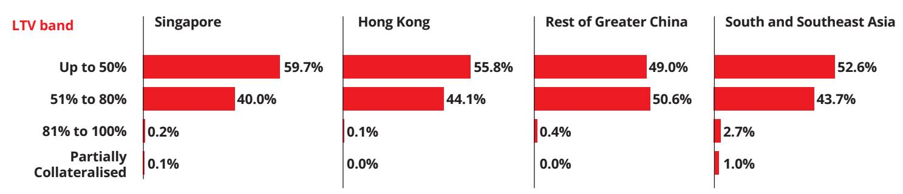

#### **As at 31 December 2022**

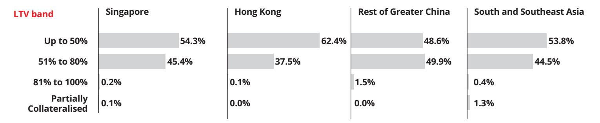

*Note: Dec 2023 position includes the Taiwan CITI migrated mortgage loans.*

#### **Loans and advances to corporates secured by real estate**

These secured loans were extended for the purpose of acquisition and/ or development of real estate, as well as for general working capital. More than 90% of such loans were fully collateralised and majority of these loans had LTV < 80%. Our property loans were mainly concentrated in Singapore and Hong Kong, which together accounted for about 80% of the total property loans.

The LTV ratio is calculated as loans and advances divided by the value of collaterals that secure the same facility. Real estate forms a substantial portion of the collaterals; other collaterals such as cash, marketable securities, and bank guarantees are also included.

#### **Percentage of loans and advances to corporates secured by real estate (breakdown by LTV band and geography)**

#### **As at 31 December 2023**

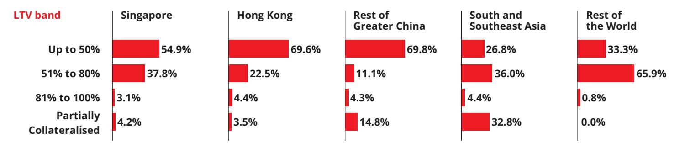

#### **As at 31 December 2022**

| LTV band                    | Singapore | Hong Kong | Rest of Greater China | South and Southeast Asia | Rest of the World |
|-----------------------------|-----------|-----------|--------------------------|-----------------------------|----------------------|
| Up to 50%                   | 49.8%     | 65.9%     | 69.0%                    | 24.5%                       | 34.7%                |
| 51% to 80%                  | 41.5%     | 25.7%     | 12.4%                    | 42.6%                       | 64.5%                |
| 81% to 100%                 | 2.8%      | 5.0%      | 4.8%                     | 5.6%                        | 0.1%                 |
| Partially Collateralised | 5.9%      | 3.4%      | 13.8%                    | 27.3%                       | 0.7%                 |

#### **Loans and advances to banks**

In line with market convention, loans and advances to banks are typically unsecured. DBS manages the risk of such exposures by keeping tight control of the exposure tenor and monitoring of their credit quality.

#### **Derivatives counterparty credit risk by markets and settlement methods**

We continue to manage our derivatives counterparty risk exposures with netting and collateral arrangements, thereby protecting our balance sheet in the event of a counterparty default.

A breakdown of our derivatives counterparty credit risk by markets (OTC versus exchangetraded) and settlement methods (cleared through a central counterparty versus settled bilaterally) can be found below.

#### **Notional OTC and exchange-traded products**

| In notional terms, SGD million                               | As at 31 Dec 2023 |
|-----------------------------------------------------------------|----------------------|
| OTC derivatives cleared through a central counterparty | 1,782,750            |
| OTC derivatives settled bilaterally                          | 1,108,672            |
| Total OTC derivatives                                        | 2,891,422            |
| Exchange-traded derivatives                                  | 17,043               |
| Total derivatives                                               | 2,908,465            |

*Please refer to Note 36 to the ȴ nancial statements on page 158 for the netting arrangements impact and a breakdown of the derivatives positions held by DBS.*

#### **6 Market risk**

Our exposure to market risk is categorised into:

**Trading portfolios:** Arising from positions taken for (i) market-making, (ii) client facilitation and (iii) bene ting from market opportunities.

**Non-trading portfolios:** Arising from (i) our Institutional Banking and Consumer Banking/ Wealth Management assets and liabilities, (ii) debt securities and equities comprising investments held for yield and/ or long- term capital gains, (iii) strategic stakes in entities and (iv) structural foreign exchange risk arising mainly from our strategic investments, which are denominated in currencies other than the Singapore Dollar.

We use a variety of nancial derivatives such as swaps, forwards and futures, and options for trading and hedging against market movements.

#### **6.1 Market risk management at DBS**

DBS' approach to market risk management comprises the following building blocks:

## **Policies Risk methodologies Processes, systems and reports**

#### **Policies**

The Group Market Risk Management Policy sets our overall approach towards market risk management. This policy is supplemented with standards and guides, which facilitate the identi cation, measurement, control, monitoring and reporting of market risk in a consistent manner. They also set out the overall approach, requirements and controls governing market risk stress testing across DBS.

The criteria for determining the positions to be included in the trading book are stipulated in the Trading Book Policy Statement.

#### **Risk methodologies**

DBS utilises Value-at-Risk (VaR), a statistical risk measure, to estimate the potential loss from market movements. This measure uses historical simulation based on data for the previous 12 months. It assumes that historical changes in market values reΌ ect the distribution of potential outcomes in the immediate future.

DBS limits and monitors market risk exposures using Expected Shortfall (ES). ES is estimated by averaging the portfolio's potential losses beyond the 97.5% con dence interval, under normal market conditions and over a one-day holding period.

ES is supplemented with other risk control metrics such as sensitivities to risk factors and loss triggers for management action.

DBS conducts backtesting to verify the predictiveness of the VaR model. Backtesting compares VaR calculated for positions at the close of each business day with the pro t and loss (P&L) that arises from those positions on the following business day. The backtesting P&L excludes fees and commissions, revenues from intra-day trading, non-daily valuation adjustments and time eΊ ects.

For backtesting, VaR at the 99% con dence interval and over a one-day holding period is used. We adopt the standardised approach to compute market risk regulatory capital under MAS Notice 637 and MAS Notice FHC-N637 for the trading book positions. As such, VaR backtesting does not impact our regulatory capital for market risk.

There are limitations to VaR models; for example, past changes in market risk factors may not provide accurate predictions of future market movements, and the risk arising from adverse market events may not be considered.

To monitor DBS' vulnerability to unexpected but plausible extreme market risk-related events, we conduct multiple market risk stress tests regularly. These cover trading and nontrading portfolios and follow a combination of historical and hypothetical scenarios depicting risk-factor movement.

Interest Rate Risk in the Banking Book (IRRBB) arises from mismatches in the interest rate pro les of assets, liabilities and capital instruments. DBS identi es, measures and manages IRRBB from both economic value and earning perspectives using Economic Value of Equity ("EVE") and Net Interest Income ("NII") variability as the respective key risk metrics. Estimating IRRBB requires the use of behavioural models and assumptions on certain parameters such as loan prepayment, xed deposits early redemption and the duration of non-maturity deposits. DBS measures IRRBB on a monthly basis.

#### **Processes, systems and reports**

Robust internal control processes and systems have been designed and implemented to support our market risk management approach. DBS reviews these control processes and systems regularly, and these reviews allow senior management to assess their eΊ ectiveness.

The RMG Market and Liquidity Risk unit an independent market risk management function reporting to the CRO - monitors, controls and analyses DBS' market risk daily. The unit comprises risk control, risk analytics, production and reporting teams.

#### Market risk in 2023 6.2

The main risk factors driving DBS' trading portfolios in 2023 were interest rates and credit spreads. The following table shows the year-end, average, high and low diversified ES, and ES by risk class for our trading portfolios. Higher ES in 2023 was due to volatile markets caused by various events such as the failure of Credit Suisse and several US regional banks, geopolitical risks and global rate hikes.

|                  |                   | 1 Jan 2023 to 31 Dec 2023 |      |     |  |  |
|------------------|-------------------|---------------------------|------|-----|--|--|
| SGD million      | As at 31 Dec 2023 | Average                   | High | Low |  |  |
| Diversified      | 11                | 17                        | 27   | 11  |  |  |
| Interest rates   | 11                | 20                        | 30   | 8   |  |  |
| Foreign exchange | 3                 | 4                         | 9    | 2   |  |  |
| Equity           | 2                 | 2                         | 5    | 1   |  |  |
| Credit spread    | 14                | 15                        | 17   | 11  |  |  |
| Commodity        | 3                 | 4                         | 7    | #   |  |  |

|                  |                   | 1 Jan 2022 to 31 Dec 2022 |      |     |  |  |
|------------------|-------------------|---------------------------|------|-----|--|--|
| SGD million      | As at 31 Dec 2022 | Average                   | High | Low |  |  |
| Diversified      | 15                | 11                        | 20   | 7   |  |  |
| Interest rates   | 18                | 14                        | 27   | 6   |  |  |
| Foreign exchange | 6                 | 4                         | 8    | 1   |  |  |
| Equity           | 2                 | 4                         | 8    | 2   |  |  |
| Credit spread    | 11                | 9                         | 11   | 5   |  |  |
| Commodity        | #                 | 1                         | 3    | #   |  |  |

# Amount under SGD 500,000

DBS' trading portfolios experienced two backtesting exceptions in 2023 and both were in March. They were mainly due to unexpected market movements caused by the fallout of several US regional banks and Credit Suisse.

#### SGD million

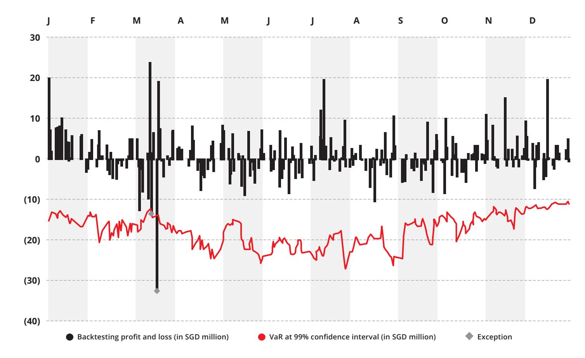

| In 2023, the key market risk drivers of our non-trading portfolios were interest rate risk in the material currencies Singapore Dollar, US Dollar and Hong Kong Dollar. Interest Rate Risk in the Banking Book (IRRBB) is measured by the change in Economic Value of Equity (EVE) and Net Interest Income (NII). The rate shock scenarios follow MAS Notice 637 Annex 10C where interest rate shocks are prescribed for each currency. For example, the parallel scenario simulations for our material currencies use a rate shock of 150 basis points for Singapore Dollar and a rate shock of 200 basis points for US Dollar and Hong Kong Dollar. Under the parallel up and down scenarios, all-currency NII is estimated to increase by SGD 1,524 million and decrease by SGD 1,747 million respectively.

| Changes in EVE and NII under standardised interest rate shock scenarios |                              |                     |  |  |  |
|-------------------------------------------------------------------------|------------------------------|---------------------|--|--|--|
| SGD million                                                             | ΔΕ <b>V</b> Ε (1) | ΔNII (1) |  |  |  |
| Period                                                                  | 31 Dec 2023                  | 31 Dec 2023         |  |  |  |
| Parallel up                                                             | 3,797                        | (1,524)             |  |  |  |
| Parallel down                                                           | (4,920)                      | 1,747               |  |  |  |
| Steepener                                                               | 1,618                        |                     |  |  |  |
| Flattener                                                               | (480)                        |                     |  |  |  |
| Short rate up                                                           | 655                          |                     |  |  |  |
| Short rate down                                                         | (796)                        |                     |  |  |  |
| Maximum                                                                 | 3,797                        | 1,747               |  |  |  |
| Tier 1 Capital                                                          |                              |                     |  |  |  |
| Period                                                                  | 31 Dec 2023                  |                     |  |  |  |
| Tier 1 Capital                                                          | 56,182                       |                     |  |  |  |

(1) Aggregated at all-currency level, where positive values of ΔΕVE and ΔΝΙΙ indicate losses under the respective scenarios, while negative values indicate gains.

| Another key risk in our non-trading portfolios is structural foreign exchange positions(a), arising mainly from our strategic investments and retained earnings in overseas branches and subsidiaries.

(a) Refer to Note 38.3 to the financial statements on page 163 for details on DBS' structural foreign exchange positions.

#### 7 Liquidity risk

DBS' liquidity risk arises from our obligations to honour withdrawals of deposits, repayments of borrowed funds at maturity and our commitments to extend loans to our customers. We seek to manage our liquidity to ensure that our liquidity obligations will continue to be honoured under normal as well as adverse circumstances.

### 7.1 Liquidity risk management at DBS

#### Approach to liquidity risk management

DBS' approach to liquidity risk management comprises the following building blocks:

#### **Policies**

Risk methodologies

**Processes, systems and reports** 

#### **Policies**

The Group Liquidity Risk Management Policy sets our overall approach towards liquidity risk management and describes the range of strategies we employ to manage our liquidity.

These strategies include maintaining an adequate counterbalancing capacity to address potential cash flow shortfalls and having diversified sources of liquidity.

DBS' counterbalancing capacity includes liquid assets, the capacity to borrow from the money markets (including the issuance of commercial papers and covered bonds), and forms of managerial interventions that improve liquidity. In the event of a potential or actual crisis, we have in place a set of liquidity contingency and recovery plans to ensure that we maintain adequate liquidity.

The Group Liquidity Risk Management Policy is supported by standards that establish the detailed requirements for liquidity risk identification, measurement, reporting and control within DBS. The set of policies, standards and supporting guides communicate these baseline requirements to ensure a consistent application throughout DBS.

#### **Risk methodologies**

The primary measure used to manage liquidity within the tolerance defined by the Board is cash flow maturity mismatch analysis.

This form of analysis is performed on a regular basis under normal and adverse scenarios. It assesses the adequacy of our counterbalancing capacity to fund or mitigate any cash flow shortfalls that may occur as forecasted in the cash flow movements across successive time bands. To ensure that liquidity is managed in line with our Risk Appetite, core parameters such as the types of scenarios, the survival period and the minimum level of liquid assets, are pre-specified for monitoring and control on a group-wide basis. Any occurrences of forecasted shortfalls that cannot be covered by our counterbalancing capacity will be escalated to the relevant committees for evaluation and action.

Liquidity risk stress testing is performed regularly using cash flow maturity mismatch analysis, and covers adverse scenarios including general market and idiosyncratic stress scenarios. Stress tests assess our vulnerability when liability run-offs increase, asset rollovers increase and/ or liquid asset buffers decrease. In addition, ad hoc stress tests are performed as part of our recovery planning and ICAAP exercises.

Liquidity risk control measures such as liquidity-related ratios and balance sheet analysis are complementary tools for cash flow maturity mismatch analysis, and they are performed regularly to obtain deeper insights and finer control over our liquidity profile across different locations.

The liquidity risk control measures also include concentration measures regarding top depositors, wholesale borrowing and swapped funds ratios.

#### Processes, systems and reports

Robust internal control processes and systems support our overall approach in identifying, measuring, aggregating, controlling and monitoring liquidity risk across DBS. Continuous improvement in data and reporting platforms has allowed most elements of internal liquidity risk reporting to be centralised.

The RMG Market and Liquidity Risk unit manages the day-to-day liquidity risk monitoring, control reporting and analysis.

## Liquidity management and funding strategy

DBS strives to develop a diversified funding base with access to funding sources across retail and wholesale channels in both Singapore dollar and foreign currencies. Our funding strategy is anchored on the strength of our core deposit franchise and is augmented by our established long-term funding capabilities.

#### Funding sources (SGD billion)

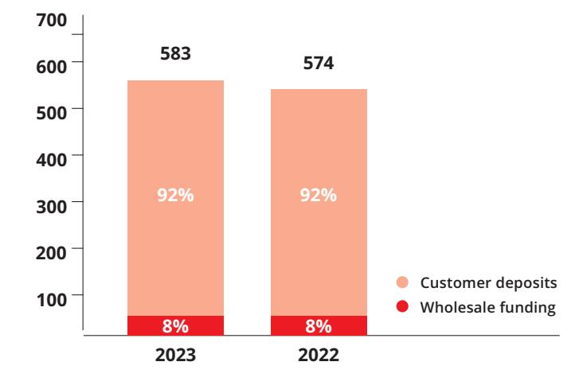

#### Wholesale Funding Breakdown (SGD billion)

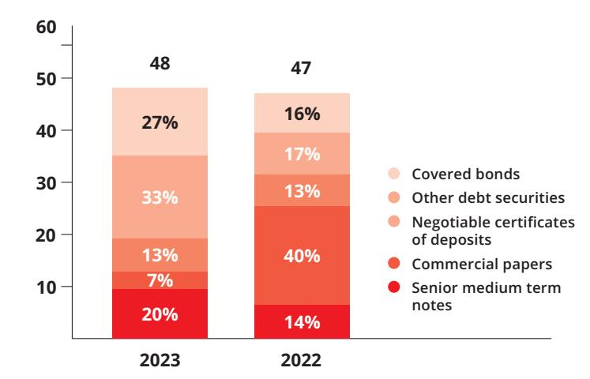

Wholesale funding was largely realigned to longer-tenor funding to meet local regulatory requirements for selected overseas markets.

DBS aims to maintain continuous access to the investor base for capital, covered bonds and senior wholesale funding to support our commercial banking activities. We seek cost efficiencies and broaden our investor base with proactive engagement via regular issuances. Capital instruments are primarily issued from DBS Group Holdings Ltd (DBSH) while covered bonds are primarily issued from DBS Bank Ltd. Senior notes are issued from both DBSH and the Bank as required.

The diagrams below show our funding structure as at 31 December 2023. Loan-deposit ratio remains healthy at 77.8%.

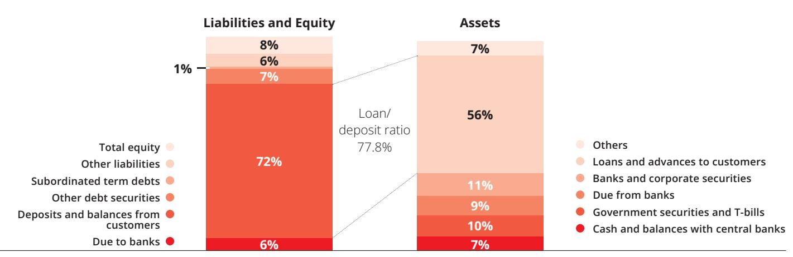

Refer to Note 30 to the financial statements on page 151 for more details of our wholesale funding sources and Note 43.1 on page 175 for the contractual maturity profile of our assets and liabilities.

Growth in the regional franchise generates price, volume, currency and tenor mismatches between our assets and liabilities. To this end, where practicable and transferable without loss in value, we make appropriate use of swap markets for relevant currencies, commensurate with the liquidity of each, in the conversion and deployment of surplus funds across locations.

As these swaps typically mature earlier than loans, we are exposed to potential cash flow mismatches arising from the risk that counterparties may not roll over maturing swaps to support our ongoing funding needs.

This risk is mitigated by triggers set on the number of swaps transacted with the market and by conservative assumptions on the cash flow behaviour of swaps under our cash flow maturity gap analysis (refer to Section 7.2 on page 93).

In general, the term borrowing needs are managed centrally by the head office in consultation with our overseas locations, subject to relevant regulatory restrictions and to an appropriate level of presence and participation required by the respective local funding markets.

The Group Asset and Liability Committee and respective Location Asset and Liability Committees regularly review the composition and growth trajectories of the relevant balance sheets and refine our funding strategy according to business momentum, competitive factors and prevailing market conditions.

#### 7.2 Liquidity risk in 2023

DBS actively monitors and manages our liquidity profile through cash flow maturity mismatch analysis.

In forecasting cash flow under the analysis, behavioural profiling is necessary in cases

where a product has indeterminate maturity or the contractual maturity does not realistically reflect the expected cash flow.

Two examples are maturity-indeterminate savings and current account deposits, which are generally viewed as sources of stable funding for commercial banks. A conservative view is adopted in the behavioural profiling of assets, liabilities and off-balance sheet commitments that have exhibited cash flow patterns that differ significantly from the contractual maturity profile shown under Note 43.1 of our financial statements on page 175.

The table below shows our behavioural net and cumulative maturity mismatch between assets and liabilities over a one-year period, in a normal scenario without incorporating growth projections. DBS' liquidity was observed to remain adequate in the maturity mismatch analysis.

| SGD million (a)                              | Less than 1 week | 1 week to 1 month | 1 to 3 months | 3 to 6 months | 6 months to 1 year |
|---------------------------------------------------------|---------------------|----------------------|---------------|---------------|-----------------------|
| As at 31 Dec 2023 (b) Net liquidity mismatch | 46,756              | 8,272                | (11,949)      | 35,124        | 18,122                |
| Cumulative mismatch                                     | 46,756              | 55,028               | 43,079        | 78,203        | 96,325                |
| As at 31 Dec 2022 (b) Net liquidity mismatch | 27,278              | 1,126                | (15,986)      | 23,451        | 10,019                |
| Cumulative mismatch                                     | 27,278              | 28,404               | 12,418        | 35,869        | 45,888                |

(a) Positive indicates a position of liquidity surplus. Negative indicates a liquidity shortfall that has to be funded

(b) As the behavioural assumptions used to determine the maturity mismatch between assets and liabilities are updated from time to time, the liquidity mismatches may not be directly comparable across past balance sheet dates

94 **DBS ANNUAL REPORT 2023** BUILDING A SUSTAINABLE ADVANTAGE **Risk management** 95

#### **7.3 Liquid assets**

Liquid assets are assets that are readily available and can be easily monetised to meet obligations and expenses under times of stress.

Such assets are internally de ned under the governance of the relevant oversight committees, taking into account the asset class, issuer type and credit rating, among other criteria, before they are reΌ ected as available funds through cash Ό ow maturity mismatch analysis. DBS' Treasury function expects to be able to operationally monetise our pool of liquid assets to meet liquidity shortfalls when the need arises. These liquid assets must be unencumbered and free of any legal, regulatory, contractual or other restrictions.

In practice, liquid assets are maintained in key locations and currencies to ensure that operating entities in such locations possess a degree of self-su ciency to support business needs and guard against contingencies. The main portion of our liquid assets is centrally maintained in Singapore to support liquidity needs in smaller overseas subsidiaries and branches. Internally, DBS sets a requirement to maintain its pool of liquid assets above a minimum level as a source of contingent funds, taking into account regulatory recommended liquid asset levels as well as internally projected stress shortfalls under the cash Ό ow maturity mismatch analysis.

The table below shows DBS' encumbered and unencumbered liquid assets by instrument and counterparty against other assets in the same category under the balance sheet. The gures are based on the carrying amount at the balance sheet date.

|                                             | Liquid assets |                 |          |            | Others(d) | Total     |
|---------------------------------------------|---------------|-----------------|----------|------------|-----------|-----------|
| SGD million                                 | Encumbered    | Unencumbered(a) | Total[1] | Average(c) | [2]       | [1] + [2] |
| As at 31 Dec 2023                           |               |                 |          |            |           |           |
| Cash and balances with central banks     | 10,338        | 39,853          | 50,191   | 48,936     | 22        | 50,213    |
| Due from banks(b)                           | -             | 19,996          | 19,996   | 17,658     | 47,465    | 67,461    |
| Government securities and treasury bills | 8,326         | 60,320          | 68,646   | 67,722     | 1,919     | 70,565    |
| Banks and corporate securities              | 4,902         | 62,265          | 67,167   | 64,663     | 14,568    | 81,735    |
| Total                                       | 23,566        | 182,434         | 206,000  | 198,979    | 63,974    | 269,974   |

- *(a) Unencumbered balances comprise liquid asset holdings that are unrestricted and available. The encumbered portion represents pledged securities and the mandatory balances held with central banks, which includes a minimum cash balance (MCB) amount that may be available for use under a liquidity stress situation.*
- *(b) Liquid assets comprise nostro accounts and eligible certiȴ cates of deposits*
- *(c) Total liquid assets reȵ ected on an average basis over the four quarters in 2023*
- *(d) "Others" refer to assets that are not recognised as part of the available pool of liquid assets for liquidity management under stress due to (but not limited to) inadequate or non-rated credit quality, operational challenges in monetisation (e.g. holdings in physical scrips), and other considerations*

#### **7.4 Liquidity Coverage Ratio (LCR)**

Under MAS Notice to Banks No. 649 "Minimum Liquid Assets (MLA) and Liquidity Coverage Ratio (LCR)" (MAS Notice 649), DBS, as a Domestic Systemically Important Bank (D-SIB) incorporated and headquartered in Singapore, is required to comply with the LCR standards. Group LCR has been maintained well above the minimum LCR requirements of 100% for both all-currency and SGD.

DBS' LCR is sensitive to balance sheet movements resulting from commercial loan/ deposit activities, wholesale inter-bank lending/ borrowing, and to the maturity tenor changes of these positions as they fall into or out of the LCR 30-day tenor. In order to meet the LCR requirements, DBS holds a pool of unencumbered High Quality Liquid Assets (HQLA) comprising predominantly cash, balances with central banks and highly rated bonds issued by governments or supranational entities.

#### **7.5 Net Stable Funding Ratio (NSFR)**

DBS is subject to the Net Stable Funding Ratio (NSFR) under MAS Notice to Banks No. 652 "Net Stable Funding Ratio (NSFR)" (MAS Notice 652). Group NSFR has been maintained consistently above the minimum regulatory requirement of 100%.

NSFR aims to improve the resiliency of banks by promoting long term funding stability. We manage our NSFR by maintaining a stable balance sheet supported by a diversi ed funding base with access to funding sources across retail and wholesale channels.

#### **8 Operational and Technology Risk**

Operational risk is inherent in our business activities and may arise from inadequate or failed internal processes, people, systems, or from external events. DBS' objective is to keep operational risk at appropriate levels, taking into account the markets we operate in, the characteristics of the businesses as well as our economic and regulatory environment.

#### **8.1 Operational risk management at DBS**

DBS' approach to operational risk management comprises the following building blocks:

**Policies Risk methodologies**

**Processes, systems and reports**

#### **Policies**

The Group Operational Risk Management (ORM) Policy sets our overall approach for managing operational risk in a structured, systematic and consistent manner.

There are policies, standards, tools and programmes in place to govern ORM practices across DBS. These include corporate operational risk policies and standards that are owned by the respective corporate oversight and control functions. The key policies address risk areas relating to technology, compliance, fraud, money laundering, nancing of terrorism and sanctions, new product, outsourcing and ecosystem partnership.

#### **Risk methodologies**

DBS adopts the standardised approach to compute operational risk regulatory capital.

To manage and control operational risk, we use various tools, including risk and control self-assessment (RCSA), operational risk event management and key risk indicator monitoring.

DBS' Three Lines Model adopts one common risk taxonomy, and a consistent risk assessment approach to managing operational risk. RCSA is conducted by each business or support unit to identify key operational risk and assess the eΊ ectiveness of internal controls. When control issues are identi ed, the units develop action plans and track the resolution of the issues.

Operational risk events are classi ed in accordance with Basel standards. Such events, including any signi cant incidents that may impact DBS' reputation, must be reported based on certain established thresholds. Key risk indicators with pre-de ned escalation triggers are employed to facilitate risk monitoring in a forward-looking manner.

Additional methodologies are in place to address subject-speci c risks, including, but not limited to, the following:

#### **Compliance risk**

Compliance risk refers to the risk of DBS not being able to successfully conduct our business because of any failure to comply with laws, regulatory requirements, industry codes or standards of business and professional conduct applicable to the nancial sector.

This includes, in particular, laws and regulations applicable to the licensing and conducting of banking or other nancial businesses, nancial crime such as antimoney laundering and countering the nancing of terrorism, fraud and bribery/ corruption. We maintain a compliance programme designed to identify, assess, measure, mitigate and report on such risks through a combination of policy and relevant systems and controls.

To counter nancial crime and sanctions risks, DBS established minimum standards for our business and support units to manage our actual and/ or potential risk exposures. In addition, standards aimed to provide the end-to-end management for fraud and related issues at the unit and geographical levels, are implemented through the Fraud Management Programme. We implement surveillance and compliance testing controls where necessary to obtain assurance that the control framework is operating eΊ ectively.

DBS also provides relevant training and implements assurance processes. We strongly believe in the need to promote a strong compliance culture as well, and this is developed through the leadership of our Board and senior management.

#### **New product, outsourcing and ecosystem partnership risks**

Each new product, service, outsourcing arrangement or ecosystem partnership is subject to a risk review and sign-oΊ process, where relevant risks are identi ed and assessed. Variations of existing products or services and existing outsourcing arrangements and ecosystem partnerships are also subject to a similar process.

#### **Other mitigation programmes**

A robust business continuity management programme is in place to ensure that essential banking services can continue in the event of unforeseen events or business disruptions. This includes a crisis management plan to enable quick response to manage incidents. Exercises are conducted annually, simulating diΊ erent scenarios to test business continuity plans and crisis management protocol. The eΊ ectiveness of these exercises as well as DBS' business continuity readiness and our alignment to regulatory guidelines are communicated and attested by senior management to the BRMC annually.

To mitigate losses from speci c risk events which are unexpected and signi cant, DBS eΊ ects group-wide insurance coverage under the Group Insurance Programme. These insurance policies relate to crime and professional indemnity, directors and o cers liability, cybersecurity risk, property damage and business interruption, general liability and terrorism.

#### **Processes, systems and reports**

Robust internal control processes and systems are integral to identifying, assessing, monitoring, managing and reporting operational risk.

All units are responsible for the day-to-day management of operational risk in their products, processes, systems and activities, in accordance with the various frameworks and policies. The RMG Operational Risk unit and other corporate oversight and control functions:

- Oversee and monitor the eΊ ectiveness of operational risk management
- Assess key operational risk issues with the units
- Report and/ or escalate key operational risks to risk committees with recommendations on appropriate risk mitigation strategies

DBS has in place an integrated governance, risk and compliance system with aligned risk assessment methodology, common taxonomy, and uni ed processes for the Three Lines Model. We have in place an operational risk landscape pro le which provides the Board and senior management with an integrated view of DBS' operational risk pro le periodically, across key operational risk areas and business lines.

#### **8.2 Technology risk management in 2023**

#### **Technology risk**

Information Technology (IT) risk is managed through an enterprise technology risk management approach. This covers risk identi cation, assessment, mitigation, monitoring and reporting. In addition, the appropriate governance, IT policies and standards, control processes and risk mitigation programmes are in place to support the risk management approach.

Arising from multiple digital disruptions in 2023, a comprehensive technology risk management

roadmap has been put in place to address gaps in technology risk governance and oversight, incident management, system resilience and change management.

The bank has established a new subcommittee of the Board Risk Management Committee (BRMC) called the BRMC Technology Risk Committee (BTRC) for dedicated oversight of technology risk.

To enhance independent checks and balances, we transferred the Technology Risk Management team to the Risk Management Group with new leadership and expanded bench strength. We strengthened our site reliability engineering with new leadership and also created a new Quality Assurance function to provide an additional independent layer of veri cation, controls and checks over the bank's change management process. A new Group Technology Risk Committee (GTRC) was constituted to enhance the oversight and management of technology risk by senior management.

Relating to incident management, we have established clearer ownership and management of incidents within the bank, as well as between the bank and its service providers and vendors. We also embarked on proactive problem management through the active review of early warning indicators, identi cation of other possibly aΊ ected areas, and taking preventive actions.

#### **Cybersecurity risk**

Cybersecurity risk remains a top priority for our bank. Our Chief Information Security O cer (CISO) is responsible for overseeing the cybersecurity function, serving as the central authority for all cybersecurity matters in relation to technology and operational cyber risks, data protection, and compliance with cybersecurity regulations. At DBS, we place a strong emphasis on safeguarding our people, information, network, equipment, and applications in alignment with the bank's risk tolerance.

To ensure we are proactive in addressing cyber threats, DBS allocates signi cant resources towards enhancing our cyber hygiene and control environment. We are committed to staying in tandem with the ever-evolving cyber threat landscape. As the second line, the CISO o ce conducts regular assessments to validate the eΊ ectiveness of our controls and to obtain assurance that our control framework remains resilient in the face of emerging and evolving threats.

Furthermore, at DBS, we are dedicated to promoting a culture of cybersecurity risk awareness. We believe that a strong security culture starts with our employees. As such, we provide relevant training and educational resources to empower our staΊ to recognise and respond to cybersecurity risks eΊ ectively. By fostering this culture of awareness, we not only enhance our defence against cyber threats but also ensure that cybersecurity is a shared responsibility across our organisation.

96 **DBS ANNUAL REPORT 2023** BUILDING A SUSTAINABLE ADVANTAGE **Capital management and planning** 97

#### **8.3 Operational risk in 2023**

The total operational risk losses in 2023 were SGD 10 million (0.05%) of DBS' total operating income), compared with SGD 13 million (0.08%) in 2022. The losses may be categorised into the following seven Basel risk event types:

| Basel risk event types                     | 2023        |      | 2022        |      |
|--------------------------------------------|-------------|------|-------------|------|
|                                            | SGD million | %    | SGD million | %    |
| Business disruption and system failures    | 2.79        | 28%  | 1.13        | 9%   |
| Clients, products and business practices   | 2.56        | 26%  | 0.82        | 7%   |
| Damage to physical asset                   | 0.02        | 0%   | 0.01        | 0%   |
| Employment practices and workplace safety  | 0           | 0%   | 0.04        | 0%   |
| Execution, delivery and process management | 2.43        | 24%  | 10.13       | 78%  |
| External fraud                             | 1.88        | 19%  | 0.8         | 6%   |
| Internal fraud                             | 0.34        | 3%   | 0.06        | 0%   |
| Total(a)                                   | 10.02       | 100% | 12.99       | 100% |

*Notes*

*(a) Reportable operational risk events are those with net loss greater than SGD 10,000 and are reported based on the date of detection*

"Business Disruption and System Failures" and "Clients, Products and Business Practices" accounted for the highest share of our total losses in 2023 and the increases were largely attributable to one risk incident under each risk event type.

#### **9 Reputational Risk**

DBS views reputational risk typically as an outcome of any failure to manage risks in our day-to-day activities/ decisions, and from changes in the operating environment. These risks include:

- Financial risk (credit, market and liquidity risks)
- Inherent risk (operational and business/ strategic risks)

#### **9.1 Reputational risk management at DBS**

DBS' approach to reputational risk management comprises the following building blocks:

**Policies**

**Risk methodologies**

**Processes, systems and reports**

#### **Policies**

DBS adopts a four-step approach for reputational risk management, which is to prevent, detect, escalate and respond to reputational risk events.

As reputational risk is typically a consequence of the failure to manage other risk types, the de nitions and principles for managing such risks are articulated in the respective risk policies. These are reinforced by sound corporate values that reΌ ect ethical behaviours and practices throughout DBS.

At DBS, we have policies in place to protect the consistency of our brand and to safeguard our corporate identity and reputation.

#### **Risk methodologies**

Under the various risk policies, we have established a number of mechanisms for ongoing risk monitoring.

These mechanisms take the form of risk limits, key risk indicators, conduct/ culture and other operating metrics, and include the periodic risk and control self-assessment process. Apart from observations from internal sources, alerts from external parties/ stakeholders also serve as an important source to detect potential reputational risk events. In addition, there are policies relating to media communications, social media and corporate social responsibility to protect DBS' reputation. There are also escalation and response mechanisms in place for managing reputational risk.

While the respective risk policies address the individual risk types, the Reputational Risk Policy focuses speci cally on our stakeholders' perception of how well DBS manages its reputational risks. Stakeholders include customers, government agencies and regulators, investors, rating agencies, business alliances, vendors, trade unions, the media, the general public, the Board and senior management, and DBS' employees.

We recognise that creating a sense of shared value through engagement with key stakeholder groups is imperative for our brand and reputation.

*Read more about our stakeholder engagement on page 78.*

#### **Processes, systems and reports**

Our units are responsible for the day-to-day management of reputational risk, and ensure that processes and procedures are in place to identify, assess and respond to this risk. This includes social media monitoring to pick up adverse comments on DBS. Events aΊ ecting DBS' reputational risk are also included in our reporting of risk pro les to senior management and Boardlevel committees.

#### **9.2 Reputational risk in 2023**

DBS' priority is to prevent the occurrence of a reputational risk event by adopting good risk attitudes and behaviours, instead of taking mitigating action when it occurs. DBS' reputation was impacted by the series of digital disruptions to DBS' banking services this year. A six-month pause on non-essential IT activities was instituted at DBS to focus on improving technology resiliency. The bank is addressing the issues at hand with utmost priority. This includes the rollout of a comprehensive roadmap to improve technology resiliency, encompassing both immediate and longer-term measures to strengthen technology governance, people/ leadership, systems and processes.

## **Capital management and planning**

#### **Objective**

The Board of Directors (Board) is responsible for setting our capital management objective, which is to maintain a strong capital position consistent with regulatory requirements under the "Notice on Risk Based Capital Adequacy Requirements for Banks Incorporated in Singapore" (MAS Notice 637) and "Notice to Designated Financial Holding Companies FHC-N637 on Risk Based Capital Adequacy Requirements" (MAS Notice FHC-N637), and the expectations of various stakeholders including customers, investors and rating agencies. The Board articulates this objective in the form of capital targets, which are reviewed annually. This objective is pursued while delivering returns to shareholders and ensuring that adequate capital resources are available for business growth and investment opportunities as well as adverse situations, taking into consideration our strategic plans and risk appetite.

Our dividend policy is to pay sustainable dividends that grow progressively with earnings. In line with this, the Board proposed a nal dividend of 54 cents per share, an increase of six cents from the previous payout. This brings the ordinary dividend for the nancial year to SGD 1.92 per share, an increase of 42 cents or 28% from the previous full year. The Scrip Dividend Scheme will not be applied to the nal dividend. In addition, the Board proposed a bonus issue on the basis of one bonus share for every existing 10 ordinary shares held. The bonus shares will qualify for dividend payments starting with the rst-quarter 2024 interim dividend, increasing the pace of capital returns to shareholders. Barring unforeseen circumstances, the annualised ordinary

dividend going forward will be SGD 2.16 per share over the enlarged share base, which is an increase of 24% from 2023.

#### **Process**

Our capital management objective is implemented via a capital management and planning process that is overseen by the Capital Committee. The Chief Financial O cer chairs the Capital Committee. The Capital Committee receives regular updates on our current and projected capital position. A key tool for capital planning is the annual Internal Capital Adequacy Assessment Process (ICAAP) through which we assess our projected capital supply and demand relative to regulatory requirements and capital targets. The ICAAP generally has a three-year horizon and covers various scenarios, including stress scenarios of diΊ ering scope and severity.

Capital capacity is allocated on two dimensions: by business line and by entity. Capital allocations by business line are set as part of the budget process and monitored during the year. Return on regulatory capital is one of several metrics used to measure business performance. Capital allocations by entity seek to optimise the distribution of capital resources across entities, taking into account the capital adequacy requirements imposed on each subsidiary in its respective jurisdiction. Capital is allocated to ensure that each subsidiary is able to comply with regulatory requirements as it executes its business strategy in line with our strategy.

During the course of the year, these subsidiaries did not experience any impediments to the distribution of dividends.

#### **Capital structure**

We manage our capital structure in line with our capital management objective and seek to optimise the cost and Ό exibility oΊ ered by various capital resources. In order to achieve this, we assess the need and the opportunity to raise or retire capital. The following capital transactions were undertaken during the year.

- DBS Group Holdings Ltd, on 20 January 2023, redeemed SGD 250 million 3.80% Subordinated Notes.
- DBS Group Holdings Ltd, on 16 March 2023, redeemed AUD 750 million Floating Rate Subordinated Notes.
- DBS Group Holdings Ltd, on 11 April 2023, redeemed EUR 600 million 1.50% Subordinated Notes.
- DBS Group Holdings Ltd, on 15 May 2023, redeemed CNY 950 million 5.25% Subordinated Notes.
- DBS Group Holdings Ltd, on 25 June 2023, redeemed JPY 7,300 million 0.85% Subordinated Notes.
- DBS Group Holdings Ltd, on 11 December 2023, redeemed USD 750 million 4.52% Subordinated Notes.

*Refer to Note 32 to the ȴ nancial statements for details on the movement of share capital during the year.*

*Refer to Notes 31 and 33 to the ȴ nancial statements as well as the Main Features of Capital Instruments document (https://www.dbs.com/investors/ȴ xedincome/capital-instruments) for the terms of the capital instruments that are included in Eligible Total Capital.*

98 **DBS ANNUAL REPORT 2023** BUILDING A SUSTAINABLE ADVANTAGE **Capital management and planning** 99

**The table below analyses the movement in Common Equity Tier 1 (CET1), Additional Tier 1 (AT1) and Tier 2 capital during the year.**

#### **Statement of changes in regulatory capital for the year ended 31 December 2023**

|                                                            | SGD million |
|------------------------------------------------------------|-------------|
| CET1 capital                                               |             |
| Opening amount                                             | 50,487      |
| Pro΋ t for the year (attributable to shareholders)         | 10,062      |
| Dividends paid to shareholders(1)                          | (6,013)     |
| Cost of share-based payments                               | 178         |
| Purchase of treasury shares                                | (20)        |
| Other CET1 movements, including other comprehensive income | (905)       |
| Closing amount                                             | 53,789      |
| CET1 capital                                               | 53,789      |
| AT1 capital(2)                                             | 2,393       |
| Tier 1 capital                                             | 56,182      |
| Tier 2 capital                                             |             |
| Opening amount                                             | 6,165       |
| Movements in Tier 2 capital instruments                    | (3,110)     |
| Movement in allowances eligible as Tier 2 capital          | 69          |
| Closing amount                                             | 3,124       |
| Total capital                                              | 59,306      |

#### *Note:*

#### **Capital adequacy ratios**

As at 31 December 2023, our CET1 capital adequacy ratio (CAR) was 14.6%, which was above our target ratio of around 13.0% ± 0.5%. Our CET1 CAR, as well as Tier 1 and Total CARs, comfortably exceeded the minimum CAR requirements under MAS Notice 637 and MAS Notice FHC-N637 of 9.0%, 10.5% and 12.5% respectively (this includes the capital conservation buΊ er but excludes the countercyclical capital buΊ er). The Group CARs had included the additional capital requirement imposed by the MAS on DBS Bank following disruptions to DBS Bank's digital banking services on 29 March 2023, and its digital banking and ATM services on 5 May 2023. The additional capital requirement on DBS Bank is now a multiplier of 1.8 times to its risk weighted assets for operational risk, an increase from the multiplier of 1.5 times that the MAS rst imposed on 7 February 2022 for disruptions which occurred during 23 to 25 November 2021. Notwithstanding the higher multiplier, the Group's capital ratios remained robust.

As at 31 December 2023, our consolidated leverage ratio stood at 6.6%, well above the 3.0% minimum ratio set by the MAS.

Refer to "Five-Year Summary" on page 187 for the historical trend of CET1, Tier 1 and Total CARs. Refer to DBS Group's Pillar 3 disclosures published on DBS website (https://www.dbs.com/investors/default.page) for details on our risk-weighted assets (RWA).

| SGD million                                      | 2023    | 2022    |
|--------------------------------------------------|---------|---------|
| CET1 capital                                     | 53,789  | 50,487  |
| Tier 1 capital                                   | 56,182  | 52,880  |
| Total capital                                    | 59,306  | 59,045  |
| RWA                                              |         |         |
| Credit RWA                                       | 293,747 | 288,640 |
| Market RWA                                       | 26,144  | 22,505  |
| Operational RWA                                  | 48,472  | 35,750  |
| Total RWA                                        | 368,363 | 346,895 |
|                                                  |         |         |
| CAR (%)                                          |         |         |
| CET1                                             | 14.6    | 14.6    |
| Tier 1                                           | 15.3    | 15.2    |
| Total                                            | 16.1    | 17.0    |
| Minimum CAR including BuΊ er Requirements (%)(1) |         |         |
| CET1                                             | 9.2     | 9.2     |
| Tier 1                                           | 10.7    | 10.7    |
| Total                                            | 12.7    | 12.7    |
| Of which: BuΊ er Requirements (%)                |         |         |
| Capital Conservation BuΊ er                      | 2.5     | 2.5     |
| Countercyclical BuΊ er                           | 0.2     | 0.2     |

*Note:*

*(1) Includes minimum CET1, Tier 1 and Total CAR of 6.5%, 8.0% and 10.0% respectively.*

*(1) Includes distributions paid on capital securities classiȴ ed as equity.*

*(2) There were no movements in AT1 capital during the year.*

100 **DBS ANNUAL REPORT 2023** BUILDING A SUSTAINABLE ADVANTAGE **Capital management and planning** 101

**The chart below analyses the drivers of the movement in the Group's CET1 CAR during the year.**

#### **Group CET1 CAR**

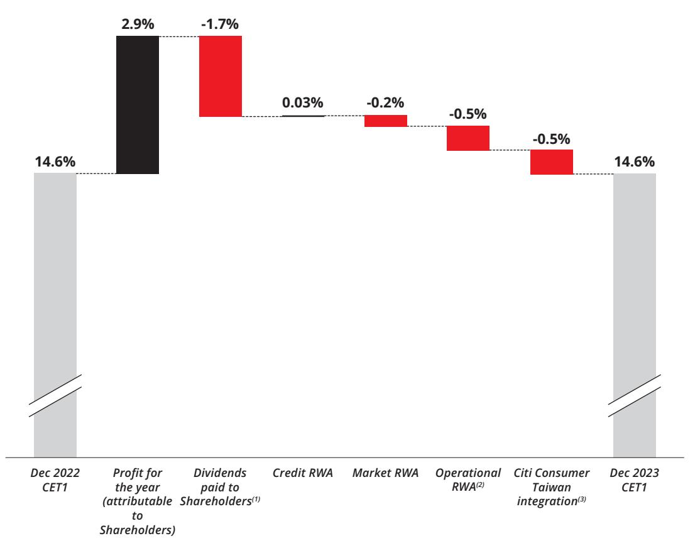

#### *Note:*

- *(1) Includes distributions paid on capital securities classiȴ ed as equity.*
- *(2) Includes the Operational Risk charges imposed by the MAS on DBS Bank for the digital disruptions.*
- *(3) Aggregate impact from the integration of Citigroup Inc.'s consumer banking business in Taiwan (Citi Consumer Taiwan).*

#### **Regulatory change**

The minimum CAR requirements based on MAS Notice 637 and MAS Notice FHC-N637 have been fully phased in from 1 January 2019 and are summarised in the table below.

|                                       | 2019 and beyond |
|---------------------------------------|--------------------|
| Minimum CAR %                         |                    |
| CET1 (a)                              | 6.5                |
| Capital Conservation BuΊ er (CCB) (b) | 2.5                |
| CET1 including CCB (a) + (b)          | 9.0                |
| Tier 1 including CCB                  | 10.5               |
| Total including CCB                   | 12.5               |
| Maximum Countercyclical BuΊ er(1)     | 2.5                |

#### *Note:*

*(1) The countercyclical bu er is not an ongoing requirement and is only applied as and when speciȴ ed by the relevant banking supervisors. The applicable magnitude will be a weighted average of the jurisdiction-speciȴ c countercyclical bu er requirements that are required by national authorities in jurisdictions to which a bank has private sector credit exposures. The Basel Committee on Banking Supervision ("Basel Committee") expects jurisdictions to implement the countercyclical bu er during periods of excessive credit growth. Of the jurisdictions where we have material private sector credit exposures, Hong Kong has applied a countercyclical bu er of 2.5% from 1 January 2019, reducing to 2.0% from 14 October 2019 and 1.0% from 16 March 2020, and remained unchanged thereafter.*

The MAS has designated DBS Bank as a domestic systemically important bank ("D-SIB"). Under the MAS' framework for identifying and supervising D-SIBs, the higher loss absorbency requirement for locally incorporated D-SIBs is met by the foregoing minimum ratios being two percentage points higher than those established by the Basel Committee. The Basel Committee has developed an indicator-based methodology for identifying global systemically important banks ("G-SIBs") on which higher loss absorbency requirements will be imposed. While we are not a G-SIB, we are required to disclose the 12 indicators which are included in the DBS Group's Pillar 3 disclosures published on DBS website (https://www.dbs.com/investors/default.page).

On 20 September 2023, the MAS published the revised MAS Notice 637 to implement the nal Basel III reforms. Most of the nal Basel III reforms in Singapore will come into eΊ ect from 1 July 2024. Speci cally, the requirements in the revised MAS Notice 637 will take eΊ ect as follows: (a) all standards other than the revised market risk and credit valuation adjustment ("CVA") standards will take eΊ ect from 1 July 2024; (b) the revised market risk and CVA standards will take eΊ ect from 1 July 2024 for compliance with supervisory reporting requirements, and with eΊ ect from 1 July 2025 for compliance with capital adequacy and disclosure requirements; and (c) the output Ό oor transitional arrangement will commence at 50% from 1 July 2024 and reach full phase-in at 72.5% from 1 January 2029.

03

**Impact** 

social impact.

**Beyond Banking** 

We seek to be a force for good by

championing businesses for impact

and uplifting vulnerable communities

to catalyse positive environmental and

Committed up to SGD 1 billion

over the next 10 years

to improve the lives and livelihoods of the

underprivileged, and foster a more

inclusive society

Awarded SGD 3.7 million

in grant funding to 24 SMEs and SEs across

the region through our DBS Foundation

Business for Impact Grant Award

**Committed another** 

SGD 5.6 million

to support 11 new programmes to build

future-ready skills and food security among

vulnerable segments

Guided by our vision to be the "Best Bank for a Better World", DBS seeks to create long-term value for stakeholders in a sustainable way. As part of our sustainability strategy, we are weaving environmental and social considerations into our business across three key pillars:

## O1 Responsible Banking

We are supporting our clients to be more sustainable and transition towards lower-carbon business models, integrating sustainability into financing solutions and investment opportunities, and democratising banking services to meet our customers' specific needs.

## Around SGD 70 billion in sustainable financing commitments,

net of repayments, as of December 2023, up from SGD 51 billion. In addition, we facilitated SGD 18 billion in ESG bond issuances, where DBS was involved as an active bookrunner

## Established several powerful partnerships

to better service our customers' sustainability needs

## Approved over 4,400 unsecured loans

totalling SGD 665 million to support micro and small businesses to address their unmet working capital requirements

## LiveBetter was launched in November 2021

Since launch, > SGD 21 million has been invested through Invest Better in green funds and ETFs, and over SGD 2 million donated through Give Better for environmental and social causes

#### Enhanced our holistic Al-Powered tool through PLAN on our digibank app

to empower customers on financial planning

## **02**Responsible Business Practices

We believe in doing the right thing by our people and embedding environmental and societal factors in our business operations.

## Established a new Employee Experience Council

to drive employee wellbeing, workload, assimilation of new hires, as well as rewards and recognition

#### Launched a new Women Leadership Programme

to build, support, and sustain a robust community and pipeline of senior women leaders

## Launched the DBS Sustainability Learning Campus

to provide a holistic approach to building awareness and capabilities on sustainability bank wide

## > 80% Green Mark Platinum certified

manned retail bank branches in Singapore

## Mark > 200,000 employee ified volunteering hours

to serve the community, reaching >150,000 beneficiaries

## > 11% increase in renewable energy production

generating over 1,500 MWh

## Subsidised 4.67 million meals

through DBS PayLah! weekly hawker meal initiative as at end December 2023

Our Sustainability Report 2023 is prepared in accordance with, and taking reference to, the Global Reporting Initiative (GRI), the Sustainability Accounting Standards Board (SASB) and recommendations of the Task Force on Climate-related Financial Disclosures (TCFD).

Sustainability

#### **Sustainability Governance Structure**

At DBS, the Board is collectively responsible for the long-term success of the bank and has ultimate responsibility for our sustainability strategy and reporting. It provides constructive challenge and strategic advice to management.

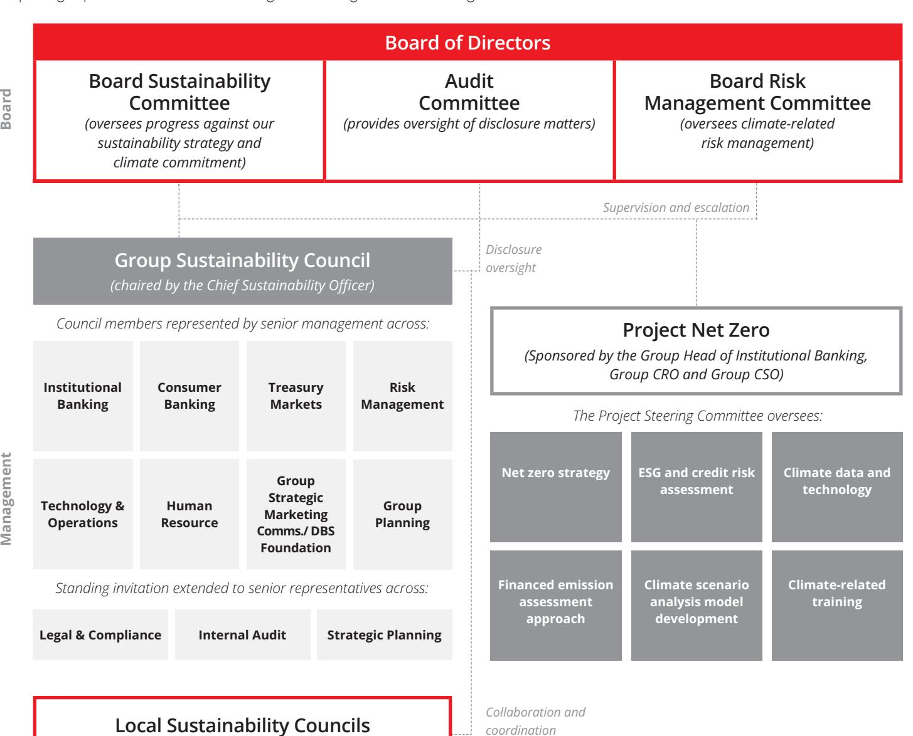

#### **Board statement on sustainability**

(China, Hong Kong, Taiwan, India and Indonesia)

"The Board has overall responsibility for the formulation of DBS' sustainability strategy. The Board provides oversight on DBS' sustainability agenda and directs its efforts in managing material ESG factors, guided by the objective to create long-term value by managing our business in a balanced and responsible way. In 2023, the Board Sustainability Committee (BSC) oversaw the update of our material ESG factors, as well as the continued progress to weave social and environmental factors into the fabric of our business, with a greater focus on climate-related matters."

**DBS Group Board of Directors** 

## Accelerating our climate agenda

Since establishing our net zero targets, we have been focused on translating our climate ambition into action to decarbonise the real economy and support a just and orderly transition.

| Our ambition   | To achieve a net-zero fu inclusive transition                                                                          | ture while recognising ou                                                                                        | ır social responsibility to f                                                                                                                     | oster a just and                                                          |
|----------------|------------------------------------------------------------------------------------------------------------------------|------------------------------------------------------------------------------------------------------------------|---------------------------------------------------------------------------------------------------------------------------------------------------|---------------------------------------------------------------------------|
|                |                                                                                                                        | Our lending and financin                                                                                         | g                                                                                                                                                 | Our analysticus                                                           |
|                | Business o                                                                                                             | pportunity                                                                                                       | Risk management                                                                                                                                   | Our operations                                                            |
| Our priorities | Providing <b>advisory and financial solutions</b> to support our clients in their decarbonisation and transition plans | Forging new partnerships to broaden our product offerings and better service our customers' sustainability needs | Integrating <b>climate considerations</b> into our risk management processes to ensure the short, medium and long-term resilience of our business | Managing our operational emissions Read more in our Sustainability Report |
| Our enablers   | Developing analytical tools and improving the climate data analytics                                                   | Engaging with industries and policymakers                                                                        | Ensuring robust governance processes                                                                                                              | Reskilling and empowering our <b>people</b>                               |

#### Summary of performance against our climate targets

| Emission reduction targets |             |                 |          |
|----------------------------|-------------|-----------------|----------|
| On track                   | Power       | On track        | Aviation |
| On track                   | Automotive  | Almost on track | Steel    |
| On track                   | Real Estate | Not on track    | Shipping |
| On track                   | Oil & Gas   |                 |          |

| Data cover | Data coverage targets  |  |  |  |
|------------|------------------------|--|--|--|
| On track   | Food & Agribusiness |  |  |  |
| On track   | Chemicals              |  |  |  |
|            |                        |  |  |  |

The summary of our decarbonisation performance tracks the annual variance against the reference scenarios we have established towards our interim 2030 targets and net zero 2050 targets for each of our priority sectors(1). We have observed good emissions reduction progress, with five out of seven sectors on track against the reference scenarios set. However, we recognise that in very hard-to-abate sectors, such as Steel (almost on track) and Shipping (not on track), there are dependencies and structural challenges that require long-term changes. Addressing these will often need broader ecosystem partnerships across the public and private sectors. We remain committed to working with our clients and fostering partnerships to enable an economy-wide transition to net zero that is orderly and just

Read more about our climate agenda in the "Responsible Financing" chapter of our Sustainability Report.

#### Selected sustainability awards

#### **Global / Regional**

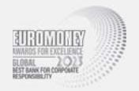

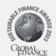

**Global Finance** - Outstanding Leadership in Transition/ Sustainability-

Sustainability Yearbook Member S&P Global Corporate Sustainab Assessment (CSA) Score 2023

S&P Global Sustainability Yearbook Member

Impact,

Awards,

of the Year,

**Financial** 

The Asset

**ASEAN Rural** Development and Poverty **Eradication** (RDPE) Leadership **Awards** 

**Bloomberg** Gender **Equality** Index

Steward Leadership 25

#### **Singapore and Domestic markets**

#### Singapore

- Best Bank, FinanceAsia
- **Best Bank** for ESG, **Best Bank** Awards. Asiamoney
- Best ESG Private Bank. Private Capital Awards,
- Singapore Corporate Award. Securities Investors Association of

#### China

- Sustainable Awards

- Green Finance Singapore (SIAS)

#### **Hong Kong**

• Best Green **Foreign Financial** Institution Award 2022 Yangcheng

linked Loans

- **Evening News**  Best Green Loan, Country Awards for Sustainable
- Finance, The Asset 2023 Best Practice, 2023 **Best cases for** Green Finance,
- Institutions forum of 60 Awards. Best ESG Bloomberg Solutions -Trade Finance, **Best ESG Private** Treasurise Bank, Private Awards, Capital Awards,

The Asset

#### Indonesia

- · Best Bank for • Best Green Sustainable Finance, **Country Awards** for Sustainable Finance, Finance, The Asset The Asset
- Best International Sustainability-Biggest ESG linked Loan, **FinanceAsia** for Sustainable Finance, FinanceAsia The Asset
- **ESG Sustainability** Indonesia **Financial Top** Warta Ekonomi
  - **CNBC Green Business Rating,** CNBC Indonesia

#### **Taiwan**

- Loan, Country **Awards for** Sustainable
- **Country Awards**
- **Best Leader for** Sustainability, Leader Awards,

- Best Blue Loan, **Country Awards** for Sustainable **Finance** The Asset
  - Gender Equity Awards, Ministry of Labour
  - Taiwan Corporate Sustainability Award, Taiwan Institute for Sustainable Energy
  - **ESG Award** for Foreign Company, Global Views Magazine

#### Social Impact, **BrandWagon Ace Awards**

India

- The Financial Express Best
- **Organisations** for Women, ET Best Brands, The Economic Times 100 Best Hall
- of fame, Best companies for Women in India, Avtar and Seramount
  - **Exceptional Employee** Experience, ET **Human Capital Experience** Awards, The Economic Times

#### **External ESG Ratings**

| MSCI                                            | 2023 ESG rating                                         | 2022: AA 2021: AA Scale: AAA to CCC                                                             |
|-------------------------------------------------|---------------------------------------------------------|-------------------------------------------------------------------------------------------------------|
| Sustainalytics                                  | 2023 Score <b>18.5</b> ( <i>Low risk</i> )           | 2022: 20.2 (Medium risk) 2021: 19.9 (Low risk) Scale: 0 to 100, with 100 being the highest risk |
| CDP (formerly Climate Disclosure Project) | 2023 Grade <b>B</b>                                  | 2022: B 2021: B Scale: A+ to F, with A+ being the best possible score                           |
| FTSE4Good                                       | 2023 Score <b>4.3</b> Included in FTSE4Good ASEAN Index | 2022: 4.3 2021: 3.6 Scale: 0 to 5 with 5 being the best possible score                          |

106 **DBS ANNUAL REPORT 2023** BUILDING A SUSTAINABLE ADVANTAGE **Summary of disclosures - Corporate governance** 107

## **Summary of disclosures Corporate governance**

**This summary of disclosures describes our corporate governance practices with speciȴ c reference to the express disclosure requirements in the principles and provisions of the 2018 Code\* pursuant to Rule 710 of the SGX Listing Manual and the Additional Guidelines\*.** 

**\*deȴ ned on page 42**

#### **Express disclosure requirements in the 2018 Code and the Additional Guidelines**

| Principles and provisions of the 2018 Code - Express disclosure requirements                                                                                                                                                                                                                                                | Page reference in DBS Annual Report 2023 |
|-----------------------------------------------------------------------------------------------------------------------------------------------------------------------------------------------------------------------------------------------------------------------------------------------------------------------------|---------------------------------------------|
| Provision 1.2 The induction, training and development provided to new and existing Directors.                                                                                                                                                                                                                            | Pages 52 and 53                             |
| Provision 1.3 Matters that require Board approval.                                                                                                                                                                                                                                                                       | Page 59                                     |
| Provision 1.4 Names of the members of the Board committees, the terms of reference of the Board committees, any delegation of the Board's authority to make decisions, and a summary of each Board committee's activities.                                                                                         | Pages 46 to 59                              |
| Provision 1.5 The number of meetings of the Board and Board committees held in the year, as well as the attendance of every Board member at these meetings.                                                                                                                                                           | Pages 43 to 44                              |
| Provision 2.4 The board diversity policy and progress made towards implementing the board diversity policy, including objectives.                                                                                                                                                                                     | Page 53                                     |
| Provision 4.3 Process for the selection, appointment and re-appointment of Directors to the Board, including the criteria used to identify and evaluate potential new directors and channels used in searching for appropriate candidates.                                                                         | Page 51                                     |
| Provision 4.4 Where the Board considers a Director to be independent in spite of the existence of a relationship which may aΊect his or her independence, the nature of the Director's relationship and the reasons for considering him or her as independent should be disclosed.                                 | Page 52                                     |
| Provision 4.5 The listed company directorships and principal commitments of each Director, and where a Director holds a signi΋ cant number of such directorships and commitments, the NC's and Board's reasoned assessment of the ability of the director to diligently discharge his or her duties are disclosed. | Pages 52, 188 to 192                        |

| Principles and provisions of the 2018 Code - Express disclosure requirements                                                                                                                                                                                                                                                                                                                                                                      | Page reference in DBS Annual Report 2023                                                                                                                      |
|---------------------------------------------------------------------------------------------------------------------------------------------------------------------------------------------------------------------------------------------------------------------------------------------------------------------------------------------------------------------------------------------------------------------------------------------------|------------------------------------------------------------------------------------------------------------------------------------------------------------------|
| Provision 5.2 How the assessments of the Board, its Board committees and each Director have been conducted, including the identity of any external facilitator and its connection, if any, with the Company or any of its Directors.                                                                                                                                                                                                     | Page 52                                                                                                                                                          |
| Provision 6.4 The engagement of any remuneration consultants and their independence.                                                                                                                                                                                                                                                                                                                                                           | Page 58                                                                                                                                                          |
| Principle 8 Clear disclosure of remuneration policies, level and mix of remuneration, and procedure for setting remuneration, and the relationship between remuneration, performance and value creation.                                                                                                                                                                                                                                    | Pages 65 to 69                                                                                                                                                   |
| Provision 8.1 The policy and criteria for setting remuneration, as well as names, amounts and breakdown of remuneration of (a) each individual Director and the CEO; and (b) at least the top ΋ve key management personnel (who are not Directors or the CEO) in bands no wider than SGD 250,000 and in aggregate the total remuneration paid to these key management personnel.                                                      | For the CEO and management: pages 67 to 69 For non-executive Directors: pages 43 to 44                                                                  |
| Provision 8.2 Names and remuneration of employees who are substantial shareholders of the Company, or are immediate family members of a Director, the CEO or a substantial shareholder of the Company, and whose remuneration exceeds SGD 100,000 during the year, in bands no wider than SGD 100,000. The disclosure states clearly the employee's relationship with the relevant Director or the CEO or substantial shareholder. | Page 59                                                                                                                                                          |
| Provision 8.3 All forms of remuneration and other payments and bene΋ ts, paid by the Company and its subsidiaries to Directors and key management personnel of the Company, and also details of employee share schemes.                                                                                                                                                                                                                     | For non-executive Directors: pages 43, 44, 58 to 59 For key management personnel: pages 67 to 69 For employee share schemes: pages 67, 111 to 112 |
| Provision 9.2 Whether the Board has received assurance from (a) the CEO and the CFO that the ΋ nancial records have been properly maintained and the ΋ nancial statements give a true and fair view of the Company's operations and ΋ nances; and (b) the CEO and the other key management personnel who are responsible, regarding the adequacy and eΊ ectiveness of the Company's risk management and internal control systems.  | Pages 61, 62 to 63                                                                                                                                               |
| Provision 11.3 Directors' attendance at general meetings of shareholders held during the ΋ nancial year.                                                                                                                                                                                                                                                                                                                                       | Pages 43 to 44                                                                                                                                                   |
| Provision 12.1 The steps taken to solicit and understand the views of shareholders.                                                                                                                                                                                                                                                                                                                                                            | Page 64                                                                                                                                                          |
| Provision 13.2 The strategy and key areas of focus in relation to the management of stakeholder relationships during the reporting period.                                                                                                                                                                                                                                                                                                  | Pages 78 to 79                                                                                                                                                   |

| Additional Guidelines - Express disclosure requirements                                                                                                                                                                                                                                                                                                                                                                                                                                                                                                                                                                                                                                                                                                           | Page reference in DBS Annual Report 2023                   |  |
|-------------------------------------------------------------------------------------------------------------------------------------------------------------------------------------------------------------------------------------------------------------------------------------------------------------------------------------------------------------------------------------------------------------------------------------------------------------------------------------------------------------------------------------------------------------------------------------------------------------------------------------------------------------------------------------------------------------------------------------------------------------------|---------------------------------------------------------------|--|
| Additional Guideline 1.17 An assessment of how the induction, orientation and training provided to new and existing Directors meet the requirements set out by the NC to equip the Board and the respective Board committees with relevant knowledge and skills in order to perform their roles eΊ ectively.                                                                                                                                                                                                                                                                                                                                                                                                                                             | Pages 52 and 53                                               |  |
| Additional Guideline 4.7 The names of the Directors submitted for appointment or re-appointment are accompanied by details and information to enable shareholders and the Board to make informed decisions. Such information, which accompanies the relevant resolution, includes: (a) date of last re-appointment; (b) professional quali΋ cations; (c) any relationships including immediate family relationships between the candidate and the Directors, the Company or its substantial shareholders; (d) a separate list of all current directorships in other listed companies; (e) details of other principal commitments; and (f) any prior experience as a director of a listed issuer or as a director of a ΋ nancial institution. | Pages 212 to 217                                              |  |
| Additional Guideline 4.11 The resignation or dismissal of the key appointment holders.                                                                                                                                                                                                                                                                                                                                                                                                                                                                                                                                                                                                                                                                         | Not applicable                                                |  |
| Additional Guideline 4.12 The identi΋ cation of all Directors, including their designations (i.e. independent, non-executive, executive, etc.) and roles (as members or chairmen of the Board or Board committees).                                                                                                                                                                                                                                                                                                                                                                                                                                                                                                                                         | Pages 45 to 49, 188 to 192                                    |  |
| Additional Guideline 9.9 The remuneration of any non-director with relevant expertise who has been appointed to the board risk committee.                                                                                                                                                                                                                                                                                                                                                                                                                                                                                                                                                                                                                   | Page 59 (in relation to appointees on the BSC and BTRC) |  |
| Additional Guideline 9.11 The Board's comments on the adequacy and eΊ ectiveness of the internal controls (including ΋ nancial, operational, compliance and information technology controls, and risk management systems) are disclosed. A statement on whether the AC concurs with the Board's comment is disclosed. Where material weaknesses are identi΋ ed by the Board or AC, the disclosure of the steps taken to address them.                                                                                                                                                                                                                                                                                                                 | Pages 62 to 63                                                |  |
| Additional Guideline 10.19 The AC comments on whether the internal audit function is independent, eΊ ective and adequately resourced.                                                                                                                                                                                                                                                                                                                                                                                                                                                                                                                                                                                                                          | Page 55                                                       |  |
| Additional Guideline 14.5 Material related party transactions.                                                                                                                                                                                                                                                                                                                                                                                                                                                                                                                                                                                                                                                                                                 | Pages 61 and 62                                               |  |

## **Financial statements**

| DBS Group Holdings Ltd and its Subsidiaries                                                |                                             | Balance sheet: liabilities |                                           |                                                                                             |                          |
|--------------------------------------------------------------------------------------------|---------------------------------------------|----------------------------|-------------------------------------------|---------------------------------------------------------------------------------------------|--------------------------|
| Directors' statement 110 Independent auditor's report 114 Financial statements |                                             |                            |                                           | 28 Deposits and Balances from Customers 29 Other Liabilities 30 Other Debt Securities | 151 151 151 153 |
|                                                                                            |                                             |                            |                                           | 31 Subordinated Term Debts                                                                  |                          |
|                                                                                            |                                             |                            | Balance sheet: share capital and reserves |                                                                                             |                          |
| Consolidated income statement                                                              |                                             | 120                        |                                           | 32 Share Capital                                                                            | 154                      |
| Consolidated statement of comprehensive income                                             |                                             | 121                        |                                           | 33 Other Equity Instruments                                                                 | 155                      |
|                                                                                            | Balance sheets                              | 122                        |                                           | 34 Other Reserves and Revenue Reserves                                                      | 156                      |
|                                                                                            |                                             |                            |                                           |                                                                                             |                          |
|                                                                                            | Consolidated statement of changes in equity | 123                        | OΊ -balance sheet information             |                                                                                             |                          |
|                                                                                            | Consolidated cash Ό ow statement            | 124                        |                                           | 35 Contingent Liabilities and Commitments                                                   | 158                      |
|                                                                                            |                                             |                            |                                           | 36 Financial Derivatives                                                                    | 158                      |
|                                                                                            | Notes to the ΋ nancial statements           |                            |                                           |                                                                                             |                          |
| 1                                                                                          | Domicile and Activities                     | 126                        |                                           | Additional information                                                                      |                          |
| 2                                                                                          | Summary of Material Accounting Policies     | 126                        |                                           | 37 Interest Rate Benchmark Reform                                                           | 160                      |
| 3                                                                                          | Critical Accounting Estimates               | 134                        |                                           | 38 Hedge Accounting                                                                         | 160                      |
|                                                                                            |                                             |                            |                                           | 39 Share-based Compensation Plans                                                           | 164                      |
|                                                                                            | Income statement                            |                            |                                           | 40 Related Party Transactions                                                               | 165                      |
| 4                                                                                          | Net Interest Income                         | 135                        |                                           | 41 Fair Value of Financial Instruments                                                      | 166                      |
| 5                                                                                          | Net Fee and Commission Income               | 135                        |                                           | 42 Credit Risk                                                                              | 169                      |
| 6                                                                                          | Net Trading Income                          | 135                        |                                           | 43 Liquidity Risk                                                                           | 175                      |
| 7                                                                                          | Net Income from Investment Securities       | 135                        |                                           | 44 Capital Management                                                                       | 176                      |
| 8                                                                                          | Other Income                                | 135                        |                                           | 45 Segment Reporting                                                                        | 177                      |
| 9                                                                                          | Employee Bene΋ ts                           | 135                        |                                           | 46 Signi΋ cant Events                                                                       | 180                      |
|                                                                                            | 10 Other Expenses                           | 136                        |                                           | 47 Subsequent Event                                                                         | 180                      |
|                                                                                            | 11 Allowances for Credit and Other Losses   | 136                        |                                           |                                                                                             |                          |
|                                                                                            | 12 Income Tax Expense                       | 140                        |                                           |                                                                                             |                          |
|                                                                                            | 13 Earnings Per Ordinary Share              | 140                        |                                           |                                                                                             |                          |
|                                                                                            |                                             |                            | DBS Bank Ltd                              |                                                                                             |                          |
| Balance sheet: assets                                                                      |                                             |                            | Income statement                          | 181                                                                                         |                          |
|                                                                                            | 14 Classi΋ cation of Financial Instruments  | 141                        |                                           | Statement of comprehensive income                                                           | 182                      |
|                                                                                            | 15 Cash and Balances with Central Banks     | 143                        |                                           |                                                                                             |                          |
|                                                                                            | 16 Government Securities and Treasury Bills | 143                        |                                           | Balance sheet                                                                               | 183                      |
|                                                                                            | 17 Bank and Corporate Securities            | 143                        |                                           | Notes to the supplementary ΋ nancial statements                                             | 184                      |
|                                                                                            | 18 Loans and Advances to Customers          | 144                        |                                           |                                                                                             |                          |
|                                                                                            | 19 Financial Assets Pledged or Transferred  | 144                        |                                           |                                                                                             |                          |
|                                                                                            | 20 Other Assets                             | 145                        |                                           |                                                                                             |                          |
|                                                                                            | 21 Deferred Tax Assets/ Liabilities         | 146                        |                                           |                                                                                             |                          |

22 Subsidiaries and Consolidated Structured Entities 147 23 Associates and Joint Ventures 148 24 Unconsolidated Structured Entities 149 25 Acquisition 149 26 Properties and Other Fixed Assets 150 27 Goodwill and Intangible Assets 150 110 **DBS ANNUAL REPORT 2023** BUILDING A SUSTAINABLE ADVANTAGE **Directors' statement** 111

#### **DBS Group Holdings Ltd and its Subsidiaries**

## **Directors' statement**

**for the ȴ nancial year ended 31 December 2023**

The Directors are pleased to present their statement to the Members, together with the audited consolidated ȴ nancial statements of DBS Group Holdings Ltd (the Company or DBSH) and its subsidiaries (the Group) for the ȴ nancial year ended 31 December 2023 and the balance sheet of the Company as at 31 December 2023. These have been prepared in accordance with the provisions of the Companies Act 1967 (the Companies Act) and the Singapore Financial Reporting Standards (International).

In the opinion of the Directors:

- (a) the consolidated ȴ nancial statements of the Group and the balance sheet of the Company, together with the notes thereon, as set out on pages 120 to 180, are drawn up so as to give a true and fair view of the ȴ nancial position of the Group and the Company as at 31 December 2023, and of the consolidated ȴ nancial performance, changes in equity and cash ȵ ows of the Group for the ȴ nancial year ended on that date; and
- (b) as at the date of this statement, there are reasonable grounds to believe that the Company and the Group will be able to pay their debts as and when they fall due.

#### **Board of Directors**

The Directors in oɝ ce at the date of this statement are:

Mr Peter Seah *(Chairman)*

Mr Olivier Lim *(Lead Independent Director)*

Mr Piyush Gupta *(Chief Executive Oί cer)*

Dr Bonghan Cho

Mr Chng Kai Fong

Mr David Ho Hing-Yuen (appointed 26 April 2023)

Ms Punita Lal

Ms Judy Lee

Mr Anthony Lim

Mr Tham Sai Choy

Mr Piyush Gupta, Mr Chng Kai Fong and Ms Judy Lee will retire by rotation in accordance with Article 99 of the Company's Constitution at the forthcoming annual general meeting (AGM) and, being eligible, will o er themselves for re-election at the AGM.

Mr David Ho Hing-Yuen will retire in accordance with Article 105 of the Company's Constitution at the forthcoming AGM and, being eligible, will o er himself for re-election at the AGM.

#### **Directors' interests in shares or debentures**

Each of the following Directors who held oɝ ce at the end of the ȴ nancial year had, according to the register of directors' shareholdings required to be kept under Section 164 of the Companies Act, an interest in shares of the Company and related corporations as stated below:

|                                                           | Holdings in which Directors have a direct interest |                     | Holdings in which Directors are deemed to have an interest |                     |  |
|-----------------------------------------------------------|-------------------------------------------------------|---------------------|---------------------------------------------------------------|---------------------|--|
|                                                           | As at 31 Dec 2023                                  | As at 1 Jan 2023 | As at 31 Dec 2023                                          | As at 1 Jan 2023 |  |
| DBSH ordinary shares                                      |                                                       |                     |                                                               |                     |  |
| Mr Peter Seah                                             | 329,218                                               | 312,033             | –                                                             | –                   |  |
| Mr Olivier Lim                                            | 150,554                                               | 146,672             | –                                                             | –                   |  |
| Mr Piyush Gupta                                           | 43,864                                                | 26,400              | 2,185,721                                                     | 1,989,046           |  |
| Dr Bonghan Cho                                            | 13,389                                                | 10,684              | –                                                             | –                   |  |
| Ms Punita Lal                                             | 6,485                                                 | 3,829               | –                                                             | –                   |  |
| Ms Judy Lee                                               | 4,453                                                 | 1,148               | –                                                             | –                   |  |
| Mr Anthony Lim                                            | 8,215                                                 | 4,872               | –                                                             | –                   |  |
| Mr Tham Sai Choy                                          | 106,168                                               | 102,478             | –                                                             | –                   |  |
| Share awards (unvested) granted under the DBSH Share Plan |                                                       |                     |                                                               |                     |  |
| Mr Piyush Gupta(1)                                        | 748,864                                               | 830,431             | –                                                             | –                   |  |

*(1) Mr Piyush Gupta's share awards form part of his remuneration. Details of the DBSH Share Plan are set out in Note 39 of the Notes to the Company's 2023 ȴ nancial statements*

There was no change in any of the above-mentioned interests between the end of the ȴ nancial year and 21 January 2024.

#### **DBSH Share Plan**

At the Annual General Meeting held on 25 April 2019, the DBSH Share Plan (which was ȴ rst adopted on 18 September 1999) was extended for another ten years, from 18 September 2019 to 17 September 2029 (both dates inclusive). The DBSH Share Plan is administered by the Compensation and Management Development Committee (CMDC). As at the date of this statement, the members of the CMDC are Mr Anthony Lim (Chairman), Mr Peter Seah, Dr Bonghan Cho, Mr David Ho Hing-Yuen, Ms Punita Lal and Ms Judy Lee.

Under the terms of the DBSH Share Plan:

- (a) Awards over DBSH's ordinary shares may be granted to Group executives who hold such rank as may be determined by the CMDC from time to time. Awards may also be granted to (amongst others) executives of associated companies of DBSH who hold such rank as may be determined by the CMDC from time to time, and non-executive Directors of DBSH;
- (b) Where time-based awards are granted, participants are awarded ordinary shares of DBSH or, at the CMDC's discretion, their equivalent cash value or a combination of both as part of their deferred bonus, at the end of the prescribed vesting periods. Awards are granted under the DBSH Share Plan at the absolute discretion of the CMDC. Dividends on unvested shares do not accrue to employees;
- (c) Awards under the DBSH Share Plan may be granted at any time in the course of a ȴ nancial year, and may lapse by reason of cessation of employment or misconduct of the participant, except in cases such as retirement, redundancy, ill health, injury, disability, death, bankruptcy of the participant, or by reason of the participant, being a non-executive Director, ceasing to be a Director, or in the event of a take-over, winding up or reconstruction of DBSH;

- (d) Subject to the prevailing legislation and the rules of the Singapore Exchange, DBSH will have the ȵ exibility to deliver ordinary shares of DBSH to participants upon vesting of their awards by way of an issue of new ordinary shares and/ or the transfer of existing ordinary shares (which may include ordinary shares held by the Company in treasury); and
- (e) The class and/ or number of ordinary shares of DBSH comprised in an award to the extent not yet vested, and/ or which may be granted to participants, are subject to adjustment by reason of any variation in the ordinary share capital of DBSH (whether by way of a capitalisation of proȴ ts or reserves or rights issue, reduction, subdivision, consolidation, or distribution) or if DBSH makes a capital distribution or a declaration of a special dividend (whether in cash or *in specie*), upon the written conȴ rmation of the auditor of DBSH that such adjustment (other than in the case of a capitalisation issue) is fair and reasonable.

During the ȴ nancial year, time-based awards in respect of an aggregate of 5,740,016 ordinary shares were granted pursuant to the DBSH Share Plan to selected employees of the Group1 . In addition, during the ȴ nancial year, certain non-executive Directors received an aggregate of 38,702 share awards which vested immediately upon grant. These share awards formed part of their directors' fees for 2022, which had been approved by the shareholders at DBSH's annual general meeting held on 31 March 2023.

Details of the share awards granted under the DBSH Share Plan to Directors of DBSH(1) are as follows:

| Directors of the Company | Share awards granted during the ȴ nancial year under review | Share awards vested during the ȴ nancial year under review(2) |
|--------------------------|----------------------------------------------------------------|------------------------------------------------------------------|
| Mr Peter Seah            | 17,185                                                         | 17,185                                                           |
| Mr Olivier Lim           | 3,882                                                          | 3,882                                                            |
| Mr Piyush Gupta          | 232,572(3)                                                     | 314,139                                                          |
| Dr Bonghan Cho           | 2,705                                                          | 2,705                                                            |
| Ms Punita Lal            | 2,656                                                          | 2,656                                                            |
| Ms Judy Lee              | 3,305                                                          | 3,305                                                            |
| Mr Anthony Lim           | 3,343                                                          | 3,343                                                            |
| Mr Tham Sai Choy         | 3,690                                                          | 3,690                                                            |

- *(1) The directors' fees for Mr Chng Kai Fong were paid in cash to a government agency, the Directorship & Consultancy Appointments Council while Mr David Ho Hing-Yuen joined during the ȴ nancial year. Accordingly, they had not been granted share awards*
- *(2) Treasury shares were transferred to Directors pursuant to the vesting of such share awards*
- *(3) The share awards granted to Mr Piyush Gupta are time-based awards which will vest over a 4-year period. This represents the aggregate of (a) 220,554 share awards which were granted in February 2023 and formed part of his remuneration for 2022; and (b) 12,018 shares arising from adjustments made to all unvested share awards granted under the DBSH Share Plan on 6 April 2023*

#### **Arrangements to enable Directors to acquire shares or debentures**

Neither at the end of, nor at any time during the ȴ nancial year, was the Company a party to any arrangement, the object of which is to enable the Directors to acquire beneȴ ts through the acquisition of shares in, or debentures of, the Company or any other body corporate, save as disclosed in this statement.

#### **Audit Committee**

The Audit Committee comprises non-executive Directors Mr Tham Sai Choy (Chairman), Mr Peter Seah, Mr David Ho Hing-Yuen, Ms Punita Lal, Mr Chng Kai Fong and Ms Judy Lee.

The Audit Committee performed its functions in accordance with the Companies Act, the SGX-ST Listing Manual, the Financial Holding Companies (Corporate Governance of Designated Financial Holding Companies with Bank Subsidiary) Regulations 2022, the Banking (Corporate Governance) Regulations 2005, the MAS Guidelines on Corporate Governance issued on 9 November 2021 and the Code of Corporate Governance 2018, which include, *inter alia*, the following:

- (i) Review, with the external auditor, its audit plan, audit report, evaluation of the internal accounting controls of the Group and assistance given by the management to the external auditor;
- (ii) Review the internal auditor's plans and the scope and results of audits;
- (iii) Review the Group's consolidated ȴ nancial statements and ȴ nancial announcements prior to submission to the Board;
- (iv) Review the adequacy, independence and e ectiveness of the internal audit function;
- (v) Review the adequacy, e ectiveness, independence and objectivity of the external auditor; and
- (vi) Review the assurance given by CEO and other key management personnel regarding the adequacy and e ectiveness of the Group's internal controls.

Please refer to the Corporate Governance Report for further details on the activities of the Audit Committee during the ȴ nancial year ended 31 December 2023.

The Audit Committee has considered the ȴ nancial, business and professional relationships between PricewaterhouseCoopers (PwC) and the Group. It is of the view that these relationships would not a ect the independence of PwC.

The Audit Committee has recommended, to the Board of Directors, the re-appointment of PwC as independent external auditor at the forthcoming AGM of the Company on 28 March 2024.

#### **Independent Auditor**

PricewaterhouseCoopers LLP has expressed its willingness to accept re-appointment as independent external auditor.

On behalf of the Directors

**Mr Peter Seah** 

**Mr Piyush Gupta**

6 February 2024 Singapore

*1 With reference to Rule 852(2) of the SGX-ST Listing Manual, none of the participants had received shares, pursuant to the release of awards granted, which in aggregate represent 5% or more of the total number of new shares available under the DBSH Share Plan.*

114 **DBS ANNUAL REPORT 2023** BUILDING A SUSTAINABLE ADVANTAGE **Independent auditor's report** 115

**DBS Group Holdings Ltd and its Subsidiaries** 

## **Independent auditor's report**

#### **To the members of DBS Group Holdings Ltd**

#### **Report on the Audit of the Financial Statements**

#### **Our opinion**

In our opinion, the accompanying consolidated ȴ nancial statements of DBS Group Holdings Ltd (the "Company") and its subsidiaries (the "Group") and the balance sheet of the Company are properly drawn up in accordance with the provisions of the Companies Act 1967 (the "Act") and Singapore Financial Reporting Standards (International) ("SFRS(I)s") so as to give a true and fair view of the ȴ nancial position of the Company and the consolidated ȴ nancial position of the Group as at 31 December 2023 and of the consolidated ȴ nancial performance, the consolidated changes in equity and the consolidated cash ȵ ows of the Group for the ȴ nancial year ended on that date.

#### **What we have audited**

The ȴ nancial statements of the Company and the Group comprise:

- the consolidated income statement of the Group for the year ended 31 December 2023;
- the consolidated statement of comprehensive income of the Group for the year ended 31 December 2023;
- the balance sheets of the Group and of the Company as at 31 December 2023;
- the consolidated statement of changes in equity of the Group for the year then ended;
- the consolidated cash ȵ ow statement of the Group for the year then ended; and
- the notes to the ȴ nancial statements, including material accounting policy information.

#### **Basis for opinion**

We conducted our audit in accordance with Singapore Standards on Auditing ("SSAs"). Our responsibilities under those standards are further described in the *Auditor's Responsibilities for the Audit of the Financial Statements* section of our report.

We believe that the audit evidence we have obtained is suɝ cient and appropriate to provide a basis for our opinion.

#### **Independence**

We are independent of the Group in accordance with the Accounting and Corporate Regulatory Authority Code of Professional Conduct and Ethics for Public Accountants and Accounting Entities ("ACRA Code") together with the ethical requirements that are relevant to our audit of the ȴ nancial statements in Singapore, and we have fulȴ lled our other ethical responsibilities in accordance with these requirements and the ACRA Code.

#### **Our audit approach**

#### **Overview**

#### **Materiality**

**•** We determined the overall Group materiality based on 5% of the Group's proȴ t before tax.

#### **Group scoping**

- Full scope audit procedures were performed over the Singapore Operations of DBS Bank Ltd. and DBS Bank (Hong Kong) Limited ("signiȴ cant components").
- We identiȴ ed as component entities ("other components") the branches of DBS Bank Ltd. Hong Kong, Taipei and London, as well as the subsidiaries DBS Bank (China) Limited, PT Bank DBS Indonesia, DBS Bank (Taiwan) Ltd and DBS Bank India Limited. This is where certain account balances were considered to be signiȴ cant in size in relation to the Group. Consequently, audit speciȴ ed procedures for the signiȴ cant account balances of these components were performed to obtain suɝ cient and appropriate audit evidence.

#### **Key audit matters**

- Speciȴ c allowances for loans and advances to customers
- General allowances for credit losses (Stage 1 and 2 Expected Credit Loss)
- Goodwill
- Valuation of ȴ nancial instruments held at fair value

As part of designing our audit, we determined materiality and assessed the risks of material misstatement in the accompanying ȴ nancial statements. In particular, we considered where management made subjective judgements; for example, in respect of signiȴ cant accounting estimates that involved making assumptions and considering future events that are inherently uncertain. As in all of our audits, we also addressed the risk of management override of internal controls, including, among other matters, consideration of whether there was evidence of bias that represented a risk of material misstatement due to fraud.

#### **Materiality**

The scope of our audit was inȵ uenced by our application of materiality. An audit is designed to obtain reasonable assurance as to whether the consolidated ȴ nancial statements are free from material misstatement. Misstatements may arise due to fraud or error. They are considered material if, individually or in aggregate, they could reasonably be expected to inȵ uence the economic decisions of users taken on the basis of the consolidated ȴ nancial statements.

Based on our professional judgement, we determined certain quantitative thresholds for materiality, including the overall group materiality for the consolidated ȴ nancial statements as a whole, as set out in the table below. These, together with qualitative considerations, helped us to determine the scope of our audit and the nature, timing and extent of our audit procedures and to evaluate the e ect of misstatements, both individually and on the ȴ nancial statements as a whole.

**How we determined overall Group materiality** 5% of the Group's proȴ t before tax **Rationale for benchmark applied •** We chose 'proȴ t before tax' as, in our view, it is the benchmark against which performance of the Group is most commonly measured. **•** We selected 5% based on our professional judgement, noting that it is also within the range of commonly accepted proȴ t-related thresholds.

In performing our audit, we allocated materiality levels to the signiȴ cant components and other components of the Group. These are less than the overall Group materiality.

#### **Independent auditor's report** 117

#### **How we developed the audit scope**

We tailored the scope of our audit in order to perform suɝ cient work to enable us to provide an opinion on the ȴ nancial statements as a whole, taking into account the structure of the Group, the accounting processes and controls, and the industry in which the Group operates. The Group's ȴ nancial reporting process is dependent on its Information Technology ("IT") systems. Our audit scope included testing the operating e ectiveness of the controls over the integrity of key ȴ nancial data processed through the IT systems that are relevant to ȴ nancial reporting.

In establishing the overall Group audit approach, we determined the extent of audit procedures that were needed to be performed across the Group by us or by other PwC network ȴ rms, operating under our instruction, who are familiar with the local laws and regulations in each respective territory, (the "component auditors"). Where the work was performed by component auditors, we determined the level of involvement we needed to have in the procedures to be able to conclude whether suɝ cient and appropriate audit evidence had been obtained as a basis for our opinion on the ȴ nancial statements as a whole.

#### **Key audit matters**

Key audit matters are those matters that, in our professional judgement, were of most signiȴ cance in our audit of the ȴ nancial statements for the ȴ nancial year ended 31 December 2023. These matters were addressed in the context of our audit of the ȴ nancial statements as a whole, and in forming our opinion thereon, and we do not provide a separate opinion on these matters.

#### **Speciȴ c allowances for loans and advances to customers**

As at 31 December 2023, the speciȴc allowances for loans and advances to customers of the Group was \$2,347 million, the majority of which related to Institutional Banking Group ("IBG") customers. Speciȴ c allowances refer to loss allowances for credit-impaired exposures (i.e. Stage 3, per SFRS (I) 9). Expected Credit Losses ("ECL") on non-impaired exposures (i.e. Stage 1 and Stage 2) are set out under the 'General allowances for credit losses' key audit matter.

We focused on this area because management assessment of impairment can be inherently subjective and involves signiȴ cant judgement over both the timing and estimation of the size of such impairment. This includes:

- principal assumptions underlying the calculation of speciȴ c allowances for loans and advances to IBG customers where there is evidence of impairment losses (including future proȴ tability of borrowers and expected realisable value of collateral held); and
- classiȴ cation of loans and advances in line with MAS Notice 612 ("MAS 612").

(Refer also to Notes 3 and 18 to the ȴ nancial statements.)

#### **Key audit matter How our audit addressed the key audit matter**

We assessed the design and evaluated the operating e ectiveness of key controls over the speciȴ c allowances for loans and advances. These controls included:

- oversight of credit risk by the Group Credit Risk Committee;
- timely management review of credit risk;
- watchlist identiȴ cation and monitoring;
- timely identiȴ cation of impairment events;
- classiȴ cation of loans and advances in line with MAS 612; and
- collateral monitoring and valuation.

We determined that we could rely on these controls for the purposes of our audit.

We inspected a sample of loans and advances to IBG customers to assess whether the classiȴ cation of the loans and advances was in line with MAS 612 and, where there was evidence of an impairment loss, whether it had been identiȴ ed in a timely manner. This included, where relevant, how forbearance had been considered.

Where impairment had been identiȴ ed, for a sample of loans and advances, our work included:

- considering the latest developments in relation to the borrower;
- examining the forecasts of future cash ȵ ows prepared by management, including key assumptions in relation to the amount and timing of recoveries;
- comparing the collateral valuation and other sources of repayment to check the calculation of the impairment against external evidence, where available, including independent valuation reports;
- challenging management's assumptions; and
- testing the calculations.

For a sample of performing loans and advances to IBG customers which had not been identiȴ ed by management as potentially impaired, we evaluated management's assumptions on their classiȴ cation, using external evidence where available in respect of the relevant borrower.

Based on procedures performed, we assessed that the aggregate speciȴ c allowance for loans and advances is appropriate.

#### **General allowances for credit losses (Stage 1 and 2 Expected Credit Loss)**

SFRS(I) 9 *Financial Instruments* ("SFRS(I) 9") requires an ECL impairment model which takes into account forward-looking information to reȵ ect potential future economic events. In estimating ECL over future time periods, signiȴ cant judgement is required.

We focused on the Group's measurement of general allowances on non-impaired exposures (\$3,896 million). This covers both 'Stage 1' exposures (where there has not been a signiȴ cant increase in credit risk), and 'Stage 2' exposures (where a signiȴ cant increase in credit risk has been observed). The ECL framework implemented by the Group involves signiȴ cant judgement and assumptions that relate to, amongst others:

- adjustments to the Group's Basel credit models and parameters;
- use of forward-looking and macro-economic information;
- estimates for the expected lifetime of revolving credit facilities;
- assessment of signiȴ cant increase in credit risk; and
- post-model adjustments to account for limitations in the ECL models.

(Refer also to Notes 3 and 11 to the ȴ nancial statements.)

#### **Key audit matter How our audit addressed the key audit matter**

We critically assessed management's assumptions and estimates relating to Stage 1 and Stage 2 ECL for retail and non-retail portfolios as at 31 December 2023. This included assessing reȴ nements in methodologies made during the year, as well as to account for changes in risk outlook.

We assessed the design and evaluated the operating e ectiveness of key controls, focusing on:

- involvement of governance committees, in reviewing and approving certain forward-looking macroeconomic assumptions, including post-model adjustments;
- completeness and accuracy of external and internal data inputs into the ECL calculations; and
- accuracy and timeliness of allocation of exposures into Stage 1 and Stage 2 based on quantitative and qualitative triggers.

We determined that we could rely on these controls for the purposes of our audit.

The Group's internal experts continue to perform independent model validation of selected aspects of the Group's ECL methodologies and assumptions each year. We checked their results as part of our work.

We also reviewed the ECL of selected credit portfolios to assess if the methodologies and estimates are appropriate.

Through the course of our work, we assessed the rationale and calculation basis of post-model adjustments. We also assessed the reasonableness of certain forward-looking economic inputs, as well as the overall ECL output.

Overall, we concluded that the Group's ECL on non-impaired exposures is appropriate.

#### **Goodwill**

As at 31 December 2023, the Group had \$6,081 million of goodwill as a result of acquisitions.

We focused on this area as management makes signiȴ cant judgements in estimating future cash ȵ ows when undertaking its annual goodwill impairment assessment.

The key assumptions used in the discounted cash ȵ ow analyses relate to:

- cash ȵ ow forecasts;
- discount rate; and
- long-term growth rate.

(Refer also to Notes 3 and 27 to the ȴ nancial statements.)

For goodwill balances, we assessed the appropriateness of management's identiȴ cation of the Group's cash generating units and the process by which indicators of impairment were identiȴ ed.

For DBS Bank (Hong Kong) Limited's franchise (goodwill of \$4,631 million as at 31 December 2023), we evaluated management's cash ȵow forecasts and the process by which they were developed. Together with valuation specialists in our team, we assessed discount rate and growth rate assumptions against the Group's own historical performance and available external industry and economic indicators. We checked management's sensitivity analysis over the key assumptions to determine whether any reasonably possible change in these assumptions would result in an impairment, and also performed our own stress analysis.

We concur with management's assessment that goodwill balances are not impaired as at 31 December 2023.

#### **Valuation of ȴ nancial instruments held at fair value**

Financial instruments held by the Group at fair value include derivative assets and liabilities, trading securities, certain debt instruments and other assets and liabilities designated at fair value.

The Group's ȴ nancial instruments are predominantly valued using quoted market prices ('Level 1') or market observable prices ('Level 2'). The valuations of 'Level 3' instruments rely on signiȴ cant unobservable inputs.

We considered the overall valuation of ȴ nancial instruments (Level 1, 2 and 3) to be a key audit matter given the ȴ nancial signiȴ cance to the Group, the nature of the underlying products and the estimation involved to determine fair value.

In determining fair value, management also make adjustments to recognise credit risk, funding costs, bid-o er spreads and, in some cases, parameter and model risk limitations. This is broadly consistent with the banking industry, albeit the methodology to calculate some of these adjustments is continuing to evolve.

(Refer also to Notes 3 and 41 to the ȴ nancial statements.)

#### **Key audit matter How our audit addressed the key audit matter**

We assessed the design and tested the operating e ectiveness of the controls over the Group's ȴ nancial instruments valuation processes. These included the controls over:

- management's testing and approval of new models and revalidation of existing models;
- the completeness and accuracy of pricing data inputs into valuation models;
- monitoring of collateral disputes; and
- governance mechanisms and monitoring over the valuation processes (including derivative valuation adjustments) by the Group Market and Liquidity Risk Committee and the Group Valuation Committee.

We determined that we could rely on the controls for the purposes of our audit.

In addition, we:

- engaged our own specialists to use their models and input sources to determine an independent estimate of fair value for a sample of the Group's Level 1 and Level 2 ȴ nancial instruments. We compared these to the Group's calculations of fair value to assess individual material valuation di erences or systemic bias;
- assessed the reasonableness of methodologies used and assumptions made for a sample of ȴ nancial instrument valuations with signiȴ cant unobservable valuation inputs (Level 3 instruments);
- performed procedures on collateral disputes to identify possible indicators of inappropriate valuations;
- performed tests of inputs and assessed the methodology over fair value adjustments, in light of available market data and industry trends; and
- considered the implications of global reforms to Interest Reference Rates in our assessment of fair value.

Overall, we considered that the valuation of ȴ nancial instruments held at fair value was within a reasonable range of outcomes.

#### **Other Information**

Management is responsible for the other information. The other information comprises the Directors' Statement (but does not include the ȴ nancial statements and our auditor's report thereon), which we obtained prior to the date of this auditor's report, and the other sections of the annual report ("the Other Sections") which are expected to be made available to us after that date.

Our opinion on the ȴ nancial statements does not cover the other information and we do not and will not express any form of assurance conclusion thereon.

In connection with our audit of the ȴ nancial statements, our responsibility is to read the other information identiȴ ed above and, in doing so, consider whether the other information is materially inconsistent with the ȴ nancial statements or our knowledge obtained in the audit, or otherwise appears to be materially misstated.

If, based on the work we have performed on the other information that we obtained prior to the date of this auditor's report, we conclude that there is a material misstatement of this other information, we are required to report that fact. We have nothing to report in this regard.

When we read the Other Sections, if we conclude that there is a material misstatement therein, we are required to communicate the matter to those charged with governance and take appropriate actions in accordance with SSAs.

#### **Responsibilities of Management and Directors for the Financial Statements**

Management is responsible for the preparation of ȴ nancial statements that give a true and fair view in accordance with the provisions of the Act and SFRS(I)s, and for devising and maintaining a system of internal accounting controls suɝ cient to provide a reasonable assurance that assets are safeguarded against loss from unauthorised use or disposition; and transactions are properly authorised and that they are recorded as necessary to permit the preparation of true and fair ȴ nancial statements and to maintain accountability of assets.

In preparing the ȴ nancial statements, management is responsible for assessing the Group's ability to continue as a going concern, disclosing, as applicable, matters related to going concern and using the going concern basis of accounting unless management either intends to liquidate the Group or to cease operations, or has no realistic alternative but to do so.

The directors' responsibilities include overseeing the Group's ȴ nancial reporting process.

#### **Auditor's Responsibilities for the Audit of the Financial Statements**

Our objectives are to obtain reasonable assurance about whether the ȴ nancial statements as a whole are free from material misstatement, whether due to fraud or error, and to issue an auditor's report that includes our opinion. Reasonable assurance is a high level of assurance, but is not a guarantee that an audit conducted in accordance with SSAs will always detect a material misstatement when it exists. Misstatements can arise from fraud or error and are considered material if, individually or in the aggregate, they could reasonably be expected to inȵ uence the economic decisions of users taken on the basis of these ȴ nancial statements.

As part of an audit in accordance with SSAs, we exercise professional judgement and maintain professional scepticism throughout the audit. We also:

- Identify and assess the risks of material misstatement of the ȴ nancial statements, whether due to fraud or error, design and perform audit procedures responsive to those risks, and obtain audit evidence that is suɝ cient and appropriate to provide a basis for our opinion. The risk of not detecting a material misstatement resulting from fraud is higher than for one resulting from error, as fraud may involve collusion, forgery, intentional omissions, misrepresentations, or the override of internal control.
- Obtain an understanding of internal control relevant to the audit in order to design audit procedures that are appropriate in the circumstances, but not for the purpose of expressing an opinion on the e ectiveness of the Group's internal control.
- Evaluate the appropriateness of accounting policies used and the reasonableness of accounting estimates and related disclosures made by management.
- Conclude on the appropriateness of management's use of the going concern basis of accounting and, based on the audit evidence obtained, whether a material uncertainty exists related to events or conditions that may cast signiȴ cant doubt on the Group's ability to continue as a going concern. If we conclude that a material uncertainty exists, we are required to draw attention in our auditor's report to the related disclosures in the ȴ nancial statements or, if such disclosures are inadequate, to modify our opinion. Our conclusions are based on the audit evidence obtained up to the date of our auditor's report. However, future events or conditions may cause the Group to cease to continue as a going concern.
- Evaluate the overall presentation, structure and content of the ȴ nancial statements, including the disclosures, and whether the ȴ nancial statements represent the underlying transactions and events in a manner that achieves fair presentation.
- Obtain suɝ cient appropriate audit evidence regarding the ȴ nancial information of the entities or business activities within the Group to express an opinion on the consolidated ȴ nancial statements. We are responsible for the direction, supervision and performance of the group audit. We remain solely responsible for our audit opinion.

We communicate with the directors regarding, among other matters, the planned scope and timing of the audit and signiȴ cant audit ȴ ndings, including any signiȴ cant deȴ ciencies in internal control that we identify during our audit.

We also provide the directors with a statement that we have complied with relevant ethical requirements regarding independence, and to communicate with them all relationships and other matters that may reasonably be thought to bear on our independence, and where applicable, related safeguards.

From the matters communicated with the directors, we determine those matters that were of most signiȴ cance in the audit of the ȴ nancial statements of the current period and are therefore the key audit matters. We describe these matters in our auditor's report unless law or regulation precludes public disclosure about the matter or when, in extremely rare circumstances, we determine that a matter should not be communicated in our report because the adverse consequences of doing so would reasonably be expected to outweigh the public interest beneȴ ts of such communication.

#### **Report on Other Legal and Regulatory Requirements**

In our opinion, the accounting and other records required by the Act to be kept by the Company and by those subsidiary corporations incorporated in Singapore of which we are the auditors have been properly kept in accordance with the provisions of the Act.

The engagement partner on the audit resulting in this independent auditor's report is Yura Mahindroo.

**PricewaterhouseCoopers LLP**

Public Accountants and Chartered Accountants

Singapore, 6 February 2024

**Financial statements** 121

#### **DBS Group Holdings Ltd and its Subsidiaries**

## **Consolidated income statement**

**for the year ended 31 December 2023**

| In \$ millions                                              | Note | 2023   | 2022   |
|-------------------------------------------------------------|------|--------|--------|
| Interest income                                             |      | 27,862 | 15,927 |
| Interest expense                                            |      | 14,220 | 4,986  |
| Net interest income                                         | 4    | 13,642 | 10,941 |
| Net fee and commission income                               | 5    | 3,366  | 3,091  |
| Net trading income                                          | 6    | 2,866  | 2,313  |
| Net income from investment securities                       | 7    | 217    | 115    |
| Other income                                                | 8    | 71     | 42     |
| Non-interest income                                         |      | 6,520  | 5,561  |
| Total income                                                |      | 20,162 | 16,502 |
| Employee beneȴ ts                                           | 9    | 5,053  | 4,376  |
| Other expenses                                              | 10   | 3,238  | 2,714  |
| Total expenses                                              |      | 8,291  | 7,090  |
|                                                             |      |        |        |
| Proȴ t before allowances and amortisation                   |      | 11,871 | 9,412  |
| Amortisation of intangible assets                           |      | 9      | –      |
| Allowances for credit and other losses                      | 11   | 590    | 237    |
| Proȴ t after allowances and amortisation                    |      | 11,272 | 9,175  |
| Share of proȴ ts or losses of associates and joint ventures |      | 214    | 207    |
| Proȴ t before tax                                           |      | 11,486 | 9,382  |
| Income tax expense                                          | 12   | 1,423  | 1,188  |
| Net proȴ t                                                  |      | 10,063 | 8,194  |
| Attributable to:                                            |      |        |        |
| Shareholders                                                |      | 10,062 | 8,193  |
| Non-controlling interests                                   |      | 1      | 1      |
|                                                             |      | 10,063 | 8,194  |
| Basic and diluted earnings per ordinary share (\$)          | 13   | 3.87   | 3.15   |

*(see notes on pages 126 to 180 as well as the Risk Management section on pages 80 to 96 which form part of these ȴ nancial statements)*

#### **DBS Group Holdings Ltd and its Subsidiaries**

## **Consolidated statement of comprehensive income**

**for the year ended 31 December 2023**

| In \$ millions                                                                                           | 2023   | 2022    |
|----------------------------------------------------------------------------------------------------------|--------|---------|
| Net proȴ t                                                                                               | 10,063 | 8,194   |
| Other comprehensive income:                                                                              |        |         |
| Items that may be reclassiȴ ed subsequently to income statement:                                         |        |         |
| Translation di΍ erences for foreign operations                                                           | (509)  | (954)   |
| Other comprehensive income of associates                                                                 | (1)    | 8       |
| Gains/ (losses) on debt instruments classiȴ ed at fair value through other comprehensive income       |        |         |
| Net valuation taken to equity                                                                            | 810    | (1,860) |
| Transferred to income statement                                                                          | (89)   | 117     |
| Taxation relating to components of other comprehensive income                                            | (55)   | 125     |
| Cash ȵ ow hedge movements                                                                                |        |         |
| Net valuation taken to equity                                                                            | 967    | (2,355) |
| Transferred to income statement                                                                          | 237    | (140)   |
| Taxation relating to components of other comprehensive income                                            | (84)   | 193     |
| Items that will not be reclassiȴ ed to income statement:                                                 |        |         |
| Losses on equity instruments classiȴ ed at fair value through other comprehensive income (net of tax) | (181)  | (417)   |
| Fair value change from own credit risk on ȴ nancial liabilities designated at fair value (net of tax)    | (108)  | 115     |
| Deȴ ned beneȴ t plans remeasurements (net of tax)                                                        | (8)    | (1)     |
| Other comprehensive income, net of tax                                                                   | 979    | (5,169) |
| Total comprehensive income                                                                               | 11,042 | 3,025   |
| Attributable to:                                                                                         |        |         |
| Shareholders                                                                                             | 11,047 | 3,039   |
| Non-controlling interests                                                                                | (5)    | (14)    |
|                                                                                                          | 11,042 | 3,025   |

*(see notes on pages 126 to 180 as well as the Risk Management section on pages 80 to 96 which form part of these ȴ nancial statements)*

#### **Financial statements** 123

#### **DBS Group Holdings Ltd and its Subsidiaries**

## **Balance sheets**

**as at 31 December 2023**

| In \$ millions                           |      | The Group |         | The Company |        |
|------------------------------------------|------|-----------|---------|-------------|--------|
|                                          | Note | 2023      | 2022    | 2023        | 2022   |
| Assets                                   |      |           |         |             |        |
| Cash and balances with central banks     | 15   | 50,213    | 54,170  | –           | –      |
| Government securities and treasury bills | 16   | 70,565    | 64,995  | –           | –      |
| Due from banks                           |      | 67,461    | 60,131  | 225         | 69     |
| Derivatives                              | 36   | 22,700    | 44,935  | 16          | 25     |
| Bank and corporate securities            | 17   | 81,735    | 75,457  | –           | –      |
| Loans and advances to customers          | 18   | 416,163   | 414,519 | –           | –      |
| Other assets                             | 20   | 17,975    | 18,303  | 8           | 16     |
| Associates and joint ventures            | 23   | 2,487     | 2,280   | –           | –      |
| Investment in subsidiaries               | 22   | –         | –       | 20,997      | 21,008 |
| Due from subsidiaries                    | 22   | –         | –       | 6,111       | 8,532  |
| Properties and other ȴ xed assets        | 26   | 3,689     | 3,238   | –           | –      |
| Goodwill and intangible assets           | 27   | 6,313     | 5,340   | –           | –      |
| Total assets                             |      | 739,301   | 743,368 | 27,357      | 29,650 |
|                                          |      |           |         |             |        |
| Liabilities                              |      |           |         |             |        |
| Due to banks                             |      | 46,704    | 39,684  | –           | –      |
| Deposits and balances from customers     | 28   | 535,103   | 527,000 | –           | –      |
| Derivatives                              | 36   | 23,457    | 45,265  | 88          | 129    |
| Other liabilities                        | 29   | 22,392    | 22,747  | 64          | 64     |
| Due to subsidiaries                      |      | –         | –       | 1,474       | 1,120  |
| Other debt securities                    | 30   | 48,079    | 47,188  | 4,716       | 3,472  |
| Subordinated term debts                  | 31   | 1,319     | 4,412   | 1,319       | 4,412  |
| Total liabilities                        |      | 677,054   | 686,296 | 7,661       | 9,197  |
| Net assets                               |      | 62,247    | 57,072  | 19,696      | 20,453 |
|                                          |      |           |         |             |        |
| Equity                                   |      |           |         |             |        |
| Share capital                            | 32   | 11,604    | 11,495  | 11,650      | 11,535 |
| Other equity instruments                 | 33   | 2,392     | 2,392   | 2,392       | 2,392  |
| Other reserves                           | 34   | (23)      | (1,347) | 123         | 37     |
| Revenue reserves                         | 34   | 48,092    | 44,347  | 5,531       | 6,489  |
| Shareholders' funds                      |      | 62,065    | 56,887  | 19,696      | 20,453 |
| Non-controlling interests                |      | 182       | 185     | –           | –      |
| Total equity                             |      | 62,247    | 57,072  | 19,696      | 20,453 |

*(see notes on pages 126 to 180 as well as the Risk Management section on pages 80 to 96 which form part of these ȴ nancial statements)*

**DBS Group Holdings Ltd and its Subsidiaries** 

## **Consolidated statement of changes in equity**

**for the year ended 31 December 2023**

|                                                             | Attributable to shareholders of the Company |                                |                   |                     |                        |                                 |                 |
|-------------------------------------------------------------|---------------------------------------------|--------------------------------|-------------------|---------------------|------------------------|---------------------------------|-----------------|
| In \$ millions                                              | Share capital                            | Other equity instruments | Other reserves | Revenue reserves | Shareholders' funds | Non controlling interests | Total equity |
| 2023                                                        |                                             |                                |                   |                     |                        |                                 |                 |
| Balance at 1 January                                        | 11,495                                      | 2,392                          | (1,347)           | 44,347              | 56,887                 | 185                             | 57,072          |
| Purchase of treasury shares                                 | (20)                                        | –                              | –                 | –                   | (20)                   | –                               | (20)            |
| Draw-down of reserves upon vesting of performance shares | 129                                         | –                              | (132)             | –                   | (3)                    | –                               | (3)             |
| Cost of share-based payments                                | –                                           | –                              | 178               | –                   | 178                    | –                               | 178             |
| Dividends paid to shareholders(a)                           | –                                           | –                              | –                 | (6,013)             | (6,013)                | –                               | (6,013)         |
| Dividends paid to non-controlling interests                 | –                                           | –                              | –                 | –                   | –                      | (7)                             | (7)             |
| Disposal of controlling interest in subsidiary              | –                                           | –                              | –                 | –                   | –                      | (2)                             | (2)             |
| Other movements                                             | –                                           | –                              | (61)              | 50                  | (11)                   | 11                              | –               |
| Net proȴ t                                                  | –                                           | –                              | –                 | 10,062              | 10,062                 | 1                               | 10,063          |
| Other comprehensive income                                  | –                                           | –                              | 1,339             | (354)               | 985                    | (6)                             | 979             |
| Balance at 31 December                                      | 11,604                                      | 2,392                          | (23)              | 48,092              | 62,065                 | 182                             | 62,247          |
| 2022                                                        |                                             |                                |                   |                     |                        |                                 |                 |
| Balance at 1 January                                        | 11,383                                      | 2,392                          | 3,810             | 39,941              | 57,526                 | 188                             | 57,714          |
| Purchase of treasury shares                                 | (11)                                        | –                              | –                 | –                   | (11)                   | –                               | (11)            |
| Draw-down of reserves upon vesting of performance shares | 123                                         | –                              | (124)             | –                   | (1)                    | –                               | (1)             |
| Cost of share-based payments                                | –                                           | –                              | 134               | –                   | 134                    | –                               | 134             |
| Dividends paid to shareholders(a)                           | –                                           | –                              | –                 | (3,789)             | (3,789)                | –                               | (3,789)         |
| Other movements                                             | –                                           | –                              | (36)              | 25                  | (11)                   | 11                              | –               |
| Net proȴ t                                                  | –                                           | –                              | –                 | 8,193               | 8,193                  | 1                               | 8,194           |
| Other comprehensive income                                  | –                                           | –                              | (5,131)           | (23)                | (5,154)                | (15)                            | (5,169)         |
| Balance at 31 December                                      | 11,495                                      | 2,392                          | (1,347)           | 44,347              | 56,887                 | 185                             | 57,072          |

*(a) Includes distributions paid on capital securities classiȴ ed as equity (2023: \$84 million; 2022: \$85 million)*

*(see notes on pages 126 to 180 as well as the Risk Management section on pages 80 to 96 which form part of these ȴ nancial statements)*

**DBS Group Holdings Ltd and its Subsidiaries** 

## **Consolidated cash ȵ ow statement**

**for the year ended 31 December 2023**

| Cash ȵ ows from operating activities Proȴ t before tax 11,486 Adjustments for non-cash and other items: Allowances for credit and other losses 590 Amortisation of intangible assets 9 Depreciation of properties and other ȴ xed assets 737 Share of proȴ ts or losses of associates and joint ventures (214) Net gain on disposal of controlling interest in a subsidiary (18) – Net gain on disposal, net of write-o΍ of properties and other ȴ xed assets 19 50 Net income from investment securities (217) Cost of share-based payments 178 134 Interest expense on subordinated term debts 82 93 Interest expense on lease liabilities 19 21 Proȴ t before changes in operating assets and liabilities 12,671 10,296 Increase/ (Decrease) in: Due to banks 8,804 10,845 Deposits and balances from customers (6) 31,010 Derivatives and other liabilities (19,362) 28,616 Other debt securities and borrowings 1,150 (Increase)/ Decrease in: Restricted balances with central banks (223) Government securities and treasury bills (6,180) Due from banks (8,152) Bank and corporate securities (6,926) Loans and advances to customers 2,156 Derivatives and other assets 22,553 Tax paid (1,319) Net cash generated from operating activities (1) 5,166 Cash ȵ ows from investing activities Dividends from associates 81 86 Acquisition of interests in associates and joint ventures (124) Proceeds from disposal of properties and other ȴ xed assets 2 3 Purchase of properties and other ȴ xed assets (718) Proceeds from divestment of subsidiary 49 Net cash proceeds from acquisition of Citi Taiwan Consumer Banking Business 1,437 | In \$ millions                                              | 2023 | 2022     |
|----------------------------------------------------------------------------------------------------------------------------------------------------------------------------------------------------------------------------------------------------------------------------------------------------------------------------------------------------------------------------------------------------------------------------------------------------------------------------------------------------------------------------------------------------------------------------------------------------------------------------------------------------------------------------------------------------------------------------------------------------------------------------------------------------------------------------------------------------------------------------------------------------------------------------------------------------------------------------------------------------------------------------------------------------------------------------------------------------------------------------------------------------------------------------------------------------------------------------------------------------------------------------------------------------------------------------------------------------------------------------------------------------------------------------------------------------------------------------------------------------------------------------------------------------------------------------------------------------------------------------------------------------------------------------------------------------------------------------------------------------------------------------------------------------------------------------------------------------------------------------------------|-------------------------------------------------------------|------|----------|
|                                                                                                                                                                                                                                                                                                                                                                                                                                                                                                                                                                                                                                                                                                                                                                                                                                                                                                                                                                                                                                                                                                                                                                                                                                                                                                                                                                                                                                                                                                                                                                                                                                                                                                                                                                                                                                                                                        |                                                             |      |          |
|                                                                                                                                                                                                                                                                                                                                                                                                                                                                                                                                                                                                                                                                                                                                                                                                                                                                                                                                                                                                                                                                                                                                                                                                                                                                                                                                                                                                                                                                                                                                                                                                                                                                                                                                                                                                                                                                                        |                                                             |      | 9,382    |
|                                                                                                                                                                                                                                                                                                                                                                                                                                                                                                                                                                                                                                                                                                                                                                                                                                                                                                                                                                                                                                                                                                                                                                                                                                                                                                                                                                                                                                                                                                                                                                                                                                                                                                                                                                                                                                                                                        |                                                             |      |          |
|                                                                                                                                                                                                                                                                                                                                                                                                                                                                                                                                                                                                                                                                                                                                                                                                                                                                                                                                                                                                                                                                                                                                                                                                                                                                                                                                                                                                                                                                                                                                                                                                                                                                                                                                                                                                                                                                                        |                                                             |      | 237      |
|                                                                                                                                                                                                                                                                                                                                                                                                                                                                                                                                                                                                                                                                                                                                                                                                                                                                                                                                                                                                                                                                                                                                                                                                                                                                                                                                                                                                                                                                                                                                                                                                                                                                                                                                                                                                                                                                                        |                                                             |      | –        |
|                                                                                                                                                                                                                                                                                                                                                                                                                                                                                                                                                                                                                                                                                                                                                                                                                                                                                                                                                                                                                                                                                                                                                                                                                                                                                                                                                                                                                                                                                                                                                                                                                                                                                                                                                                                                                                                                                        |                                                             |      | 701      |
|                                                                                                                                                                                                                                                                                                                                                                                                                                                                                                                                                                                                                                                                                                                                                                                                                                                                                                                                                                                                                                                                                                                                                                                                                                                                                                                                                                                                                                                                                                                                                                                                                                                                                                                                                                                                                                                                                        |                                                             |      | (207)    |
|                                                                                                                                                                                                                                                                                                                                                                                                                                                                                                                                                                                                                                                                                                                                                                                                                                                                                                                                                                                                                                                                                                                                                                                                                                                                                                                                                                                                                                                                                                                                                                                                                                                                                                                                                                                                                                                                                        |                                                             |      |          |
|                                                                                                                                                                                                                                                                                                                                                                                                                                                                                                                                                                                                                                                                                                                                                                                                                                                                                                                                                                                                                                                                                                                                                                                                                                                                                                                                                                                                                                                                                                                                                                                                                                                                                                                                                                                                                                                                                        |                                                             |      |          |
|                                                                                                                                                                                                                                                                                                                                                                                                                                                                                                                                                                                                                                                                                                                                                                                                                                                                                                                                                                                                                                                                                                                                                                                                                                                                                                                                                                                                                                                                                                                                                                                                                                                                                                                                                                                                                                                                                        |                                                             |      | (115)    |
|                                                                                                                                                                                                                                                                                                                                                                                                                                                                                                                                                                                                                                                                                                                                                                                                                                                                                                                                                                                                                                                                                                                                                                                                                                                                                                                                                                                                                                                                                                                                                                                                                                                                                                                                                                                                                                                                                        |                                                             |      |          |
|                                                                                                                                                                                                                                                                                                                                                                                                                                                                                                                                                                                                                                                                                                                                                                                                                                                                                                                                                                                                                                                                                                                                                                                                                                                                                                                                                                                                                                                                                                                                                                                                                                                                                                                                                                                                                                                                                        |                                                             |      |          |
|                                                                                                                                                                                                                                                                                                                                                                                                                                                                                                                                                                                                                                                                                                                                                                                                                                                                                                                                                                                                                                                                                                                                                                                                                                                                                                                                                                                                                                                                                                                                                                                                                                                                                                                                                                                                                                                                                        |                                                             |      |          |
|                                                                                                                                                                                                                                                                                                                                                                                                                                                                                                                                                                                                                                                                                                                                                                                                                                                                                                                                                                                                                                                                                                                                                                                                                                                                                                                                                                                                                                                                                                                                                                                                                                                                                                                                                                                                                                                                                        |                                                             |      |          |
|                                                                                                                                                                                                                                                                                                                                                                                                                                                                                                                                                                                                                                                                                                                                                                                                                                                                                                                                                                                                                                                                                                                                                                                                                                                                                                                                                                                                                                                                                                                                                                                                                                                                                                                                                                                                                                                                                        |                                                             |      |          |
|                                                                                                                                                                                                                                                                                                                                                                                                                                                                                                                                                                                                                                                                                                                                                                                                                                                                                                                                                                                                                                                                                                                                                                                                                                                                                                                                                                                                                                                                                                                                                                                                                                                                                                                                                                                                                                                                                        |                                                             |      |          |
|                                                                                                                                                                                                                                                                                                                                                                                                                                                                                                                                                                                                                                                                                                                                                                                                                                                                                                                                                                                                                                                                                                                                                                                                                                                                                                                                                                                                                                                                                                                                                                                                                                                                                                                                                                                                                                                                                        |                                                             |      |          |
|                                                                                                                                                                                                                                                                                                                                                                                                                                                                                                                                                                                                                                                                                                                                                                                                                                                                                                                                                                                                                                                                                                                                                                                                                                                                                                                                                                                                                                                                                                                                                                                                                                                                                                                                                                                                                                                                                        |                                                             |      |          |
|                                                                                                                                                                                                                                                                                                                                                                                                                                                                                                                                                                                                                                                                                                                                                                                                                                                                                                                                                                                                                                                                                                                                                                                                                                                                                                                                                                                                                                                                                                                                                                                                                                                                                                                                                                                                                                                                                        |                                                             |      | (4,727)  |
|                                                                                                                                                                                                                                                                                                                                                                                                                                                                                                                                                                                                                                                                                                                                                                                                                                                                                                                                                                                                                                                                                                                                                                                                                                                                                                                                                                                                                                                                                                                                                                                                                                                                                                                                                                                                                                                                                        |                                                             |      |          |
|                                                                                                                                                                                                                                                                                                                                                                                                                                                                                                                                                                                                                                                                                                                                                                                                                                                                                                                                                                                                                                                                                                                                                                                                                                                                                                                                                                                                                                                                                                                                                                                                                                                                                                                                                                                                                                                                                        |                                                             |      | (705)    |
|                                                                                                                                                                                                                                                                                                                                                                                                                                                                                                                                                                                                                                                                                                                                                                                                                                                                                                                                                                                                                                                                                                                                                                                                                                                                                                                                                                                                                                                                                                                                                                                                                                                                                                                                                                                                                                                                                        |                                                             |      | (13,801) |
|                                                                                                                                                                                                                                                                                                                                                                                                                                                                                                                                                                                                                                                                                                                                                                                                                                                                                                                                                                                                                                                                                                                                                                                                                                                                                                                                                                                                                                                                                                                                                                                                                                                                                                                                                                                                                                                                                        |                                                             |      | (9,328)  |
|                                                                                                                                                                                                                                                                                                                                                                                                                                                                                                                                                                                                                                                                                                                                                                                                                                                                                                                                                                                                                                                                                                                                                                                                                                                                                                                                                                                                                                                                                                                                                                                                                                                                                                                                                                                                                                                                                        |                                                             |      | (7,878)  |
|                                                                                                                                                                                                                                                                                                                                                                                                                                                                                                                                                                                                                                                                                                                                                                                                                                                                                                                                                                                                                                                                                                                                                                                                                                                                                                                                                                                                                                                                                                                                                                                                                                                                                                                                                                                                                                                                                        |                                                             |      | (12,410) |
|                                                                                                                                                                                                                                                                                                                                                                                                                                                                                                                                                                                                                                                                                                                                                                                                                                                                                                                                                                                                                                                                                                                                                                                                                                                                                                                                                                                                                                                                                                                                                                                                                                                                                                                                                                                                                                                                                        |                                                             |      | (28,108) |
|                                                                                                                                                                                                                                                                                                                                                                                                                                                                                                                                                                                                                                                                                                                                                                                                                                                                                                                                                                                                                                                                                                                                                                                                                                                                                                                                                                                                                                                                                                                                                                                                                                                                                                                                                                                                                                                                                        |                                                             |      | (1,041)  |
|                                                                                                                                                                                                                                                                                                                                                                                                                                                                                                                                                                                                                                                                                                                                                                                                                                                                                                                                                                                                                                                                                                                                                                                                                                                                                                                                                                                                                                                                                                                                                                                                                                                                                                                                                                                                                                                                                        |                                                             |      | 2,769    |
|                                                                                                                                                                                                                                                                                                                                                                                                                                                                                                                                                                                                                                                                                                                                                                                                                                                                                                                                                                                                                                                                                                                                                                                                                                                                                                                                                                                                                                                                                                                                                                                                                                                                                                                                                                                                                                                                                        |                                                             |      |          |
|                                                                                                                                                                                                                                                                                                                                                                                                                                                                                                                                                                                                                                                                                                                                                                                                                                                                                                                                                                                                                                                                                                                                                                                                                                                                                                                                                                                                                                                                                                                                                                                                                                                                                                                                                                                                                                                                                        |                                                             |      |          |
|                                                                                                                                                                                                                                                                                                                                                                                                                                                                                                                                                                                                                                                                                                                                                                                                                                                                                                                                                                                                                                                                                                                                                                                                                                                                                                                                                                                                                                                                                                                                                                                                                                                                                                                                                                                                                                                                                        |                                                             |      | (114)    |
|                                                                                                                                                                                                                                                                                                                                                                                                                                                                                                                                                                                                                                                                                                                                                                                                                                                                                                                                                                                                                                                                                                                                                                                                                                                                                                                                                                                                                                                                                                                                                                                                                                                                                                                                                                                                                                                                                        |                                                             |      |          |
|                                                                                                                                                                                                                                                                                                                                                                                                                                                                                                                                                                                                                                                                                                                                                                                                                                                                                                                                                                                                                                                                                                                                                                                                                                                                                                                                                                                                                                                                                                                                                                                                                                                                                                                                                                                                                                                                                        |                                                             |      | (669)    |
|                                                                                                                                                                                                                                                                                                                                                                                                                                                                                                                                                                                                                                                                                                                                                                                                                                                                                                                                                                                                                                                                                                                                                                                                                                                                                                                                                                                                                                                                                                                                                                                                                                                                                                                                                                                                                                                                                        |                                                             |      | –        |
|                                                                                                                                                                                                                                                                                                                                                                                                                                                                                                                                                                                                                                                                                                                                                                                                                                                                                                                                                                                                                                                                                                                                                                                                                                                                                                                                                                                                                                                                                                                                                                                                                                                                                                                                                                                                                                                                                        |                                                             |      | –        |
|                                                                                                                                                                                                                                                                                                                                                                                                                                                                                                                                                                                                                                                                                                                                                                                                                                                                                                                                                                                                                                                                                                                                                                                                                                                                                                                                                                                                                                                                                                                                                                                                                                                                                                                                                                                                                                                                                        | Net cash generated from/ (used in) investing activities (2) | 727  | (694)    |

**DBS Group Holdings Ltd and its Subsidiaries** 

## **Consolidated cash ȵ ow statement**

**for the year ended 31 December 2023**

| In \$ millions                                          | 2023    | 2022    |
|---------------------------------------------------------|---------|---------|
| Cash ȵ ows from ȴ nancing activities                    |         |         |
| Redemption of subordinated term debts                   | (3,057) | –       |
| Interest paid on subordinated term debts                | (92)    | (86)    |
| Purchase of treasury shares                             | (20)    | (11)    |
| Dividends paid to shareholders of the Company(a)        | (6,013) | (3,789) |
| Dividends paid to non-controlling interest              | (7)     | –       |
| Net cash used in ȴ nancing activities (3)               | (9,189) | (3,886) |
| Exchange translation adjustments (4)                    | (805)   | (903)   |
| Net change in cash and cash equivalents (1)+(2)+(3)+(4) | (4,101) | (2,714) |
| Cash and cash equivalents at 1 January                  | 43,976  | 46,690  |
| Cash and cash equivalents at 31 December (Note 15)      | 39,875  | 43,976  |

**Financial statements** 125

*(a) Includes distributions paid on capital securities classiȴ ed as equity*

*(see notes on pages 126 to 180 as well as the Risk Management section on pages 80 to 96 which form part of these ȴ nancial statements)*

126 **DBS ANNUAL REPORT 2023** BUILDING A SUSTAINABLE ADVANTAGE **Financial statements** 127

**DBS Group Holdings Ltd and its Subsidiaries** 

## **Notes to the ȴ nancial statements**

**for the year ended 31 December 2023** 

These Notes are integral to the ȴ nancial statements.

The consolidated ȴ nancial statements for the year ended 31 December 2023 were authorised for issue by the Directors on 6 February 2024.

#### **1. Domicile and Activities**

The Company, DBS Group Holdings Ltd, is incorporated and domiciled in the Republic of Singapore and has its registered oɝ ce at 12 Marina Boulevard, Marina Bay Financial Centre Tower Three, Singapore 018982.

The Company is listed on the Singapore Exchange.

The Company is an investment holding, treasury and funding vehicle for the group. Its main subsidiary is DBS Bank Ltd. (the Bank), which is wholly owned and engaged in a range of commercial banking and ȴ nancial services, principally in Asia.

The ȴ nancial statements relate to the Company and its subsidiaries (the Group) and the Group's interests in associates and joint ventures.

#### **2. Summary of Material Accounting Policies**

#### **2.1 Basis of preparation**

#### **Compliance with Singapore Financial Reporting Standards (International) (SFRS(I))**

The ȴ nancial statements of the Company and the consolidated ȴ nancial statements of the Group are prepared in accordance with Singapore Financial Reporting Standards (International) (SFRS(I)). As permitted by Section 201(10)(b) of the Companies Act 1967 (the Act), the Company's income statement has not been included in these ȴ nancial statements.

The ȴ nancial statements are presented in Singapore dollars and rounded to the nearest million, unless otherwise stated.

#### **2.2 Signiȴ cant estimates and judgement**

The preparation of ȴ nancial statements requires management to exercise judgement, use estimates and make assumptions in the application of policies and in reporting the amounts in the ȴ nancial statements. Although these estimates are based on management's best knowledge of current events and actions, actual results may di er from these estimates. Critical accounting estimates and assumptions used that are signiȴ cant to the ȴ nancial statements, and areas involving a higher degree of judgement and complexity, are disclosed in Note 3.

#### **2.3 New or amended SFRS(I) e ective for 2023 year-end**

The Group has adopted International Tax Reform – Pillar Two Model Rules (Amendments to SFRS(I) 1-12) upon its issuance in May 2023. The amendments provide a temporary mandatory exception from deferred tax accounting arising from the implementation of Pillar Two model rules which is e ective immediately, and also require new disclosures on the Pillar Two exposure.

The other amendments to SFRS(I) that were e ective from 1 January 2023 did not have a signiȴ cant impact on the Group's ȴ nancial statements.

#### **2.4 New SFRS(I) and Interpretations e ective for future periods**

The amendments and interpretations e ective for future periods do not have a signiȴ cant impact on the Group's ȴ nancial statements.

#### **A) General Accounting Policies**

A summary of the Group's material accounting policies is described further below starting with those relating to the entire ȴ nancial statements, followed by those relating to the income statement, the balance sheet and other speciȴ c topics. This does not reȵ ect the relative importance of these policies to the Group.

#### **2.5 Group Accounting**

#### **Subsidiaries**

Subsidiaries are entities (including structured entities) over which the Group has control. The Group controls an entity when it is exposed to, or has rights to, variable returns from its involvement with the entity and has the ability to a ect those returns through its power over the entity.

Subsidiaries are consolidated from the date control is transferred to the Group to the date control ceases.

The acquisition method is used to account for business combinations. Please refer to Note 2.13 for the Group's accounting policy on goodwill.

All intra-group transactions and balances are eliminated on consolidation.

#### **Associates and Joint Ventures**

Associates are entities over which the Group has signiȴ cant inȵ uence but no control, where the Group generally holds a shareholding of between and including 20% and 50% of the voting rights.

Joint ventures are entities which the Group has joint control and rights to the net assets of the entity.

Investments in associates and joint ventures are initially recognised at cost. In addition, when the Group's share of the fair value of the identiȴ able net assets of the investment exceeds the cost of acquisition paid by the Group, the excess is recognised in proȴ t and loss as part of the share of proȴ t from associates and joint ventures.

Investments in associates and joint ventures are accounted for using the equity method. Under the equity method of accounting, these investments are initially recognised at cost and adjusted thereafter to recognise the Group's share of post-acquisition proȴ ts or losses and the Group's share of other comprehensive income. Dividends received or receivable from the associates and joint ventures are recognised as a reduction of the carrying amount of the investments.

#### **2.6 Foreign currency treatment**

#### **Functional and presentation currency**

Items in the ȴ nancial statements are measured using the functional currency of each entity in the Group, this being the currency of the primary economic environment in which the entity operates. The Group's ȴ nancial statements are presented in Singapore dollars, which is the functional currency of the Company.

#### **Foreign currency transactions and balances**

Transactions in foreign currencies are measured using the exchange rate at the date of the transaction.

Monetary assets and liabilities denominated in foreign currencies are translated into the functional currency of the entity undertaking the transaction at the exchange rates at the balance sheet date. Foreign exchange di erences arising from this translation are recognised in the income statement within "Net trading income".

Non-monetary assets and liabilities measured at cost in a foreign currency are translated using the exchange rates at the date of the transaction.

Non-monetary assets and liabilities measured at fair values in foreign currencies are translated using the exchange rates at the date when the fair values are determined, which is generally the balance sheet date.

Unrealised foreign exchange di erences arising from non-monetary ȴ nancial assets and liabilities classiȴ ed as fair value through proȴ t or loss (FVPL) are recognised in the income statement as trading income.

Non-monetary ȴ nancial assets that are classiȴ ed at fair value through other comprehensive income (FVOCI) relates mainly to FVOCI equities. Please refer to Note 2.9 for the accounting treatment of FVOCI equities.

#### **Foreign operations**

The results and ȴ nancial position of subsidiaries, associates, joint ventures and branches or units whose functional currency is not Singapore dollars ("foreign operations") are translated into Singapore dollars in the following manner:

- Assets and liabilities are translated at the exchange rates at the balance sheet date;
- Income and expenses in the income statement are translated at exchange rates prevailing at each month-end, approximating the exchange rates at the dates of the transactions; and
- All resulting exchange di erences are recognised in other comprehensive income and accumulated under foreign currency translation reserves in equity. When a foreign operation is partially or fully disposed of, or when it is liquidated, such exchange di erences are recognised in the income statement as part of the gain or loss.

For acquisitions prior to 1 January 2005, the foreign exchange rates at the respective dates of acquisition were used. Goodwill and fair value adjustments arising on the acquisition of a foreign operation on or after 1 January 2005 are treated as assets and liabilities of the foreign operation and translated at the closing rate. Please refer to Note 27 for an overview of goodwill recorded.

#### **2.7 Segment reporting**

Operating segments are reported in a manner consistent with the internal reporting provided to management.

In preparing the segment information, amounts for each business segment are shown after the allocation of certain centralised costs, funding income and the application of transfer pricing, where appropriate. Transactions between segments are recorded within the segment as if they are third party transactions and are eliminated on consolidation.

Please refer to Note 45 for further details on business and geographical segment reporting.

#### **Financial statements** 129

#### **B) Income Statement**

#### **2.8 Income recognition**

#### **Interest income and interest expense**

Interest is accrued on all interest-bearing ȴ nancial assets and ȴ nancial liabilities, regardless of their classiȴ cation and measurement, except for limited transactions measured at FVPL where the economics are better reȵ ected in "Net trading income".

Interest income and interest expense are recognised on a timeproportionate basis using the e ective interest method. The calculation includes signiȴ cant fees and transaction costs that are integral to the e ective interest rate, as well as premiums or discounts.

Net interest income also includes the interest element of derivative instruments that are (i) designated in hedge accounting relationships (Note 2.19) or (ii) used in funding or other hedging arrangements where this treatment would reduce an accounting mismatch.

#### **Fee and commission income**

The Group earns fee and commission income from a diverse range of products and services provided to its customers. Fee and commission income are recognised when the Group has satisȴ ed its performance obligation in providing the promised products and services to the customer, and are recognised based on contractual rates agreed with customers, net of expected waivers based on historical experience, and net of expenses directly related to it. The Group generally satisȴ es its performance obligation and recognises the fee and commission income on the following basis:

- Transaction-based fee and commission income is recognised on the completion of the transaction. Such fees include underwriting fees, brokerage fees, bancassurance sales commission and variable service fees, and fees related to the completion of corporate ȴ nance transactions.
- For a service that is provided over a period of time, fee and commission income is generally recognised on equal proportion basis over the period during which the related service is provided or credit risk is undertaken. This basis of recognition most appropriately reȵ ects the nature and pattern of provision of these services to the customers over time. Fees for these services can be billed to customers in advance or periodically over time. Such fees include the income from issuance of ȴ nancial guarantees and bancassurance ȴ xed service fees.

The Group does not provide any signiȴ cant credit terms to customers for the above products and services. Directly related expenses typically include brokerage fees paid, card-related expenses and sales commissions, but do not include expenses for services delivered over a period (such as service contracts) and other expenses that are not speciȴ cally related to fee and commission income transactions.

#### **Dividend income**

Dividend income is recognised when the right to receive payment is established. Dividend income arising from ȴ nancial assets classiȴ ed as FVPL is recognised in "Net trading income", while those arising from FVOCI ȴ nancial assets is recognised in "Net income from investment securities".

#### **Allowances for credit and other losses**

Please refer to Note 2.11 for the accounting policy on impairment of ȴ nancial assets.

#### **C) Balance Sheet**

#### **2.9 Financial assets**

#### **Initial recognition**

Purchases and sales of all ȴ nancial assets are recognised on the date that the Group enters into the contractual arrangements with counterparties. When the Group acts as a trustee or in a ȴ duciary capacity for assets it does not directly control or beneȴ t from, the assets and the corresponding income belonging to a customer are excluded from the ȴ nancial statements.

Financial assets are initially recognised at fair value, which is generally the transaction price.

#### **Classiȴ cation and subsequent measurement**

SFRS(I) 9 categorises debt-like ȴ nancial assets based on the business model within which the assets are managed, and whether the assets constitute a "basic lending arrangement" where their contractual cash ȵ ows represent solely payments of principal and interest (SPPI). Interest is deȴ ned as consideration for the time value of money, credit risk, other basic lending risks and may include a proȴ t margin.

The classiȴ cation of the ȴ nancial assets and the associated accounting treatment are as follows:

- Debt instruments are measured at **amortised cost** when they are in a "hold to collect" (HTC) business model and have contractual cash ȵ ows that are SPPI in nature. The objective of a HTC business model is to collect contractual principal and interest cash ȵ ows. Sales are incidental to the objective and expected to be either insigniȴ cant or infrequent. These assets consist primarily of loans in the "Consumer Banking/ Wealth Management" and "Institutional Banking" segments as well as debt securities from the "Others" segment.
- Debt instruments are measured at **fair value through other comprehensive income** (FVOCI) when they are in a "hold to collect & sell" (HTC & S) business model and have cash ȵ ows that are SPPI in nature. Both the collection of contractual cash ȵ ows and sales are integral to achieving the objective of the HTC & S business model. Assets measured at FVOCI comprise mainly of debt securities from "Treasury Markets" and the "Others" segment.

Unrealised gains or losses on FVOCI debt instruments are recorded in other comprehensive income and accumulated in FVOCI revaluation reserves. When they are sold, the accumulated fair value adjustments in FVOCI revaluation reserves are reclassiȴ ed to the income statement as "Net income from investment securities".

- Debt instruments are measured at **fair value through proȴ t or loss** (FVPL) when:
- i) the assets are not SPPI in nature;
- ii) the assets are not part of a "HTC" or "HTC & S" business model; or
- iii) the assets are designated at FVPL to eliminate or signiȴ cantly reduce the measurement or recognition inconsistencies that would otherwise arise from measuring assets or liabilities on di erent bases.

Assets measured at FVPL are mainly recorded in the "Treasury Markets" segment. Realised and unrealised gains or losses on FVPL ȴ nancial assets are taken to the income statement in the period they arise.

- Subsequent changes in fair value of non-trading equity instruments can be taken through proȴ t or loss or comprehensive income, as elected. The Group generally elects its non-trading equity instruments to be classiȴ ed as FVOCI. Other than dividend income, gains and losses on FVOCI equity instruments are recorded in other comprehensive income and accumulated in FVOCI revaluation reserves, and not reclassiȴ ed to proȴ t or loss upon derecognition.
- Derivatives (including derivatives embedded in ȴ nancial liabilities but separated for accounting purposes) are classiȴ ed as held for trading unless they are designated in hedge accounting relationships (Note 2.19). Derivatives are classiȴ ed as assets when the fair value is positive and as liabilities when the fair value is negative. Changes in the fair value of derivatives other than those designated as hedging instruments in cash ȵ ow or net investment hedges are included in "Net trading income". Also refer to Note 2.8 on the accounting for the interest element of derivative instruments.

#### **Reclassiȴ cation**

Reclassiȴ cation of ȴ nancial assets are prohibited unless the Group changes its business model for managing ȴ nancial assets. In practice, this is expected to be infrequent.

#### **Determination of fair value**

The fair value of ȴ nancial assets is the price that would be received if the asset is sold in an orderly transaction between market participants at the measurement date. Fair value is generally estimated by using prices in active markets or by using valuation techniques that use observable market parameters as inputs.

Where applicable, a valuation reserve or pricing adjustment is applied to arrive at the fair value. Signiȴ cant judgement is required in estimating fair value. Refer to Note 41 for further details.

#### **O setting**

Financial assets and liabilities are presented net when there is a legally enforceable right to o set the recognised amounts and there is an intention to settle them on a net basis, or realise the asset and settle the liability simultaneously.

#### **Derecognition**

Financial assets are derecognised when the rights to receive cash ȵ ows from the ȴ nancial assets have expired or when they have been transferred together with substantially all the risks and rewards of ownership.

The Group enters into certain transactions where it transfers ȴ nancial assets recognised on its balance sheet but retains either all or a portion of the risks and rewards of the transferred ȴ nancial assets. In such cases, the transferred ȴ nancial assets are not derecognised from the balance sheet. Such transactions include repurchase agreements described in Note 2.12. They also include transactions where control over the ȴ nancial asset is retained, for example, by a simultaneous transaction (such as options) with the same counterparty to which the asset is transferred. These are mainly transacted in the "Treasury Markets" segment. In such cases, the Group continues to recognise the asset to the extent of its continuing involvement which is the extent to which it is exposed to changes in the value of the transferred asset.

Please refer to Note 19 for disclosures on transferred ȴ nancial assets.

#### **2.10 Cash and cash equivalents**

For the purposes of the cash ȵ ow statement, cash and cash equivalents comprise cash on hand and non-restricted balances with central banks which are readily convertible into cash.

#### **2.11 Impairment of ȴ nancial assets at amortised cost and FVOCI**

#### **Expected Credit Losses (ECL)**

ECL are recognised for all ȴ nancial assets held at amortised cost, debt instruments measured at FVOCI, guarantees and undrawn credit commitments. It represents the present value of expected cash shortfalls over the residual term of a ȴ nancial asset, guarantee or undrawn commitment.

At initial recognition, allowance is required for ECL resulting from possible default events that may occur within the next 12 months ('12-month ECL'). In the event of a signiȴ cant increase in credit risk, allowance is required for ECL resulting from possible default events over the expected life of the instrument ('lifetime ECL').

The ECL recognised follows the three-stage model: ȴ nancial instruments where 12-month ECL is recognised are considered Stage 1; ȴ nancial instruments which experience a signiȴ cant increase in credit risk (SICR) are in Stage 2; and ȴ nancial instruments with objective evidence of default or are credit-impaired are in Stage 3.

- **Stage 1** Financial instruments are classiȴ ed as Stage 1 at initial recognition and will remain under Stage 1 unless they experience a SICR or become credit-impaired. 12-month ECL is recognised for these instruments.
- **Stage 2** Financial instruments which experience a SICR subsequent to initial recognition, but are not yet credit-impaired, will migrate from Stage 1 to Stage 2. Lifetime ECL is recognised for these instruments.

**SICR:** SICR is assessed by comparing the risk of default at reporting date to the risk of default at origination using a range of qualitative and quantitative factors.

For wholesale exposures, a ȴ nancial instrument is deemed to have experienced a signiȴ cant increase in credit risk when:

- the observed change in its probability of default (PD), as observed by downgrades in the Group's internal credit risk rating for this instrument between origination and reporting dates, is more than pre-speciȴ ed thresholds; or
- it is placed on certain internal credit watchlists categories for closer scrutiny of developing credit issues.

For retail exposures, days past due is the main driver, supplemented with a PD-based criterion. In any event, all retail and wholesale exposures that are more than 30 days past due are presumed to have experienced a signiȴ cant increase in credit risk, unless assessed otherwise, and are classiȴ ed as Stage 2.

Instruments in Stage 2 that no longer exhibit a signiȴ cant increase in credit risk will be transferred back to Stage 1.

**• Stage 3** – Financial instruments that become credit-impaired with evidence of default, i.e. non-performing assets, are transferred to Stage 3. Please refer to Risk Management section for the deȴ nition of non-performing assets.

Lifetime ECL is recognised for these assets. ECL for Stage 3 assets are also known as speciȴ c allowances.

A Stage 3 exposure that is restructured can be upgraded to Stage 2 if there are reasonable grounds to conclude that the obligor is able to service future principal and interest payments in accordance with the restructured terms. Stage 3 ȴ nancial assets are written-o , in whole or in part, when the Group has exhausted all practical recovery e orts and has concluded that there is no reasonable expectation of future recoveries.

#### **Measurement of ECL**

ECL are unbiased and probability-weighted estimates of credit losses determined by evaluating a range of possible outcomes, considering past events, current conditions and assessments of future economic conditions at the reporting date. The ECL associated with a ȴ nancial instrument is typically a product of its probability of default (PD), loss given default (LGD) and exposure at default (EAD) discounted using the original e ective interest rate to the reporting date.

| Component | Description                                                                                                                                                                                                                                |
|-----------|--------------------------------------------------------------------------------------------------------------------------------------------------------------------------------------------------------------------------------------------|
| PD        | Point-in-time (based on current conditions, adjusted to take into account estimates of future conditions that will impact PD) estimate of the likelihood of default.                                                                 |
| LGD       | Estimate of the loss arising on default. It is based on the di΍ erence between the contractual cash ȵ ows due and those that the Group would expect to receive, including recoveries from collaterals.                            |
| EAD       | Estimate of the expected credit exposure at time of default, taking into account repayments of principal and interest as well as expected drawdowns on undrawn credit commitments and potential pay-outs on guarantees issued. |

The 12-month ECL is calculated by multiplying the 12-month PD, LGD and EAD. Lifetime ECL is calculated by multiplying the lifetime PD, LGD and EAD. The 12-month and lifetime PDs represent the probability of default occurring over the next 12 months and the remaining maturity of the instrument respectively.

In most instances, expected remaining maturity is the same as the remaining contractual life which represents the maximum contractual period over which the Group is exposed to the credit risk of the borrower. However, for some revolving products (e.g. credit cards), the expected remaining maturity may exceed the contractual maturity. In such instances, behavioural expected remaining life will be used.

#### **ECL Modelling - Point-in-Time and Forward-Looking Adjustments**

The Group leverages the models and parameters implemented under the Basel II Internal Ratings-Based (IRB) framework where possible, with appropriate modiȴ cations to meet SFRS(I) 9 requirements.

Other relevant historical information, loss experience or proxies will be utilised for portfolios without appropriate Basel models and parameters, with a view to maximise the use of available information that is reliable and supportable.

For the wholesale portfolios, credit cycle indices (CCIs) have been developed for the key industries and geographies. CCIs are summary measures that depict broad-based, sector-wide changes in credit risk, which are constructed by comparing the median expected default frequency of ȴ rms within each segment against a long-run average. Expected default frequency is in turn a market-based point-in-time default risk measure driven by the market value of ȴ rms' assets, asset volatility and leverage. CCIs are then used as inputs to convert the generally more through-the-cycle PDs derived from Basel models/ parameters into the point-in-time equivalents by adding the unaccounted portion of cyclical variations, as well as to incorporate forward-looking information. LGDs are determined using historical loss data, which are adjusted for both the latest and forecasted recovery experience.

The Group relies on a Monte Carlo simulation approach to consider over 100 probability-weighted forward-looking scenarios in estimating ECL. This involves simulations of many alternative CCI scenarios to arrive at an unbiased ECL estimate that are meant to cover all possible good and bad scenarios based on known estimates.

For material unsecured retail portfolios under the Advanced Internal Ratings-Based Approach (Advanced IRBA), the Group has rolled out a SFRS(I) 9 adjusted PD, LGD and EAD-based approach during the year. For other retail portfolios, historical loss experience is used in conjunction with the forecast loss rates which take into account relevant macroeconomic variables, such as property prices and unemployment rates.

#### **Expert credit judgement and post model adjustments**

The measurement of ECL requires the application of expert credit judgement and post model adjustments. These include:

- assignment of credit risk ratings and determination of whether exposures should be placed on credit watchlists;
- assessment of whether a signiȴ cant increase in credit risk has occurred;
- selecting and calibrating the ECL models such as CCIs;
- determining the expected remaining maturity of revolving products (e.g. overdrafts and credit cards);
- determination of the forecast loss rates; and
- application of thematic overlays based on emerging risk themes where potential risks may not be fully captured in the underlying modelled ECL. Such top-down additional modelled ECL was quantiȴ ed by means of applying conditional probabilities on more severe scenarios materialising from emerging risk themes.

The Group has the following thematic overlays as at 31 December 2023.

In addition to the base scenarios generated by the model, the Group has incorporated stress scenarios and assigned probabilities to the scenarios, in line with management's judgement of the likelihood of each scenario. The stress scenarios factor in heightened geopolitical and macro-economic risk, potential vulnerabilities in the US and EU corporates, as well as stress in the China commercial real estate sector.

There is also a thematic overlay to address pricing pressures and risks of asset stranding that the conventional energy sector could face as a result of a transition to a low-carbon economy. Probabilities were assigned to the scenarios in-line with management's judgement of the likelihood of each scenario.

#### **Governance framework**

The measurement of ECL is subject to a robust governance framework as described below.

- The Group ECL Review Committee (Review Committee) is the overarching committee for ECL related matters and comprises senior management and representatives from functions across the Group. Signiȴ cant changes to ECL models and methodologies and the application of thematic overlays are subject to the oversight and approval of the Review Committee.
- The Review Committee is supported by the Group ECL Operating Committee (Operating Committee) which comprises cross functional representatives and subject matter experts. The Operating Committee recommends changes to ECL models, methodologies and thematic overlays to the Review Committee; provides oversight over system design, infrastructure and development; and establishes principles and signiȴ cant policies pertaining to ECL. Group Credit Risk Models Committee oversees ECL models and credit risk models used by the Group.
- Location ECL committees are established for key overseas subsidiaries to govern and manage location-speciȴ c ECL reporting.
- ECL models are subject to independent validation by the Risk Management Group (RMG) Model Validation team, as well as independent reviews by internal and external auditors. The validation and assurance processes cover the review of the underlying ECL methodology including its logic and conceptual soundness.

#### **Minimum Regulatory Loss Allowance**

Singapore banks are required to maintain the Minimum Regulatory Loss Allowances (MRLA) of at least 1% of the gross carrying amount of selected credit exposures net of collaterals per MAS Notice 612. For periods when Stage 1 and 2 ECL fall below MRLA, the shortfall is appropriated from retained earnings in the shareholders' funds into a non-distributable Regulatory Loss Allowance Reserve (RLAR) account.

#### **2.12 Repurchase agreements**

**Repurchase agreements (Repos)** are arrangements where the Group sold the securities but are subject to a commitment to repurchase or redeem the securities at a pre-determined price. The securities are retained on the balance sheet as the Group retains substantially all the risk and rewards of ownership and these securities are disclosed within "Financial assets pledged or transferred" (Note 19). The consideration received is recorded as ȴ nancial liabilities in either "Due to banks" or "Deposits and balances from customers". Short-dated repos transacted as part of Treasury Markets activities are measured at FVPL.

#### **Reverse repurchase agreements (Reverse repos)** are

arrangements where the Group purchased the securities but are subject to a commitment to resell or return the securities at a predetermined price. The risk and rewards of ownership of the collateral are not acquired by the Group and are reȵ ected as collateral received and recorded o -balance sheet. The consideration paid is recorded as ȴ nancial assets as "Cash and balances with central banks", "Due from banks" or "Loans and advances to customers". Short-dated reverse repos transacted as part of Treasury Markets activities are measured at FVPL.

#### **2.13 Goodwill and intangible assets arising from business combinations**

#### **Goodwill**

Goodwill arising from business combinations generally represents the excess of the acquisition cost over the fair value of identiȴ able assets acquired and liabilities and contingent liabilities assumed on the acquisition date. Goodwill is stated at cost less impairment losses and is tested at least annually for impairment.

At the acquisition date, any goodwill acquired is allocated to each of the cash-generating units (CGU) or group of CGUs expected to beneȴ t from the combination's synergies.

An impairment loss is recognised on goodwill when the carrying amount of a CGU, or group of CGUs, including the goodwill, exceeds the applicable recoverable amount. The recoverable amount of a CGU or CGU group is the higher of the CGU's or CGU group's fair value less cost to sell and its value-in-use. An impairment loss on goodwill is recognised in the income statement and cannot be reversed in subsequent periods.

#### **Other intangible assets**

Intangible assets acquired in a business combination are recognised at fair value at the acquisition date and they relate mainly to customer relationships and core customer deposits. They have a ȴ nite useful life and are subsequently measured at cost less accumulated amortisation and impairment losses. Intangible assets are amortised using the straight-line method over their estimated useful lives of 10 years.

#### **2.14 Properties and other ȴ xed assets**

#### **Owned properties and other ȴ xed assets**

Properties (including investment properties) and other ȴ xed assets are stated at cost less accumulated depreciation and impairment losses.

Depreciation is calculated using the straight-line method to write down the costs of the assets to their residual values over the estimated useful lives of the assets. The useful life refers to the period which the Group expects to use or hold the asset.

The residual value of an asset is its estimated selling price (after deducting related costs), assuming that it is already at the age and in the condition expected at the end of its useful life. No depreciation is recognised when the residual value is higher than the carrying amount.

Freehold and leasehold land with unexpired lease terms of more than 100 years are not depreciated. The depreciation periods of the other assets are as follows:

unexpired lease terms or useful life below 100 years

Leasehold land with The shorter of the remaining lease term

Buildings The shorter of 50 years, the remaining lease term or useful life

Computer software 3 to 5 years Computer hardware, 3 to 10 years

oɝ ce equipment, furniture and ȴ ttings

Leasehold improvements Up to 20 years

#### **Leased properties and other ȴ xed assets**

Lease liabilities are initially measured at the present value of lease payments to be made over the lease term at the lease commencement date. The measurement of the associated right-ofuse assets generally approximates the lease liability.

Lease liabilities are subsequently measured at amortised cost using the e ective interest method. The right-of-use assets are depreciated over the lease term on a straight-line basis.

Extension options and termination options are included in the assessment of the lease term if the options are reasonably certain to be exercised or not exercised accordingly. If the Group changes its initial assessment, adjustments are made to the carrying amounts of the lease liabilities and right-of-use assets prospectively.

The recognition exceptions for short-term leases and leases of lowvalue assets are applied.

Please refer to Note 26 for the details of owned and leased properties and other ȴ xed assets.

#### **2.15 Financial liabilities**

**Initial recognition, classiȴ cation and subsequent measurement** Financial liabilities are initially recognised at fair value. The Group generally classiȴ es and measures its ȴ nancial liabilities in accordance with the purpose for which the ȴ nancial liabilities are incurred and managed. Accordingly:

**•** Financial liabilities are classiȴ ed as **ȴ nancial liabilities at fair value through proȴ t or loss** if they are incurred for the purpose of repurchasing in the near term (**"held for trading"**), and this may include debt securities issued and short positions in securities for the purpose of ongoing market-making or trading. Financial liabilities at fair value through proȴ t or loss can also be designated by management on initial recognition (**"designated at fair value through proȴ t or loss"**) if doing so eliminates or signiȴ cantly reduces measurement or recognition inconsistencies that would otherwise arise, or if the ȴ nancial liability contains an embedded derivative that would otherwise need to be separately recorded, or if a group of ȴ nancial liabilities or ȴ nancial assets and ȴ nancial liabilities is managed and its performance is evaluated on a fair value basis. Financial liabilities in this classiȴ cation are usually within the "Treasury Markets" segment.

Realised or unrealised gains or losses on ȴ nancial liabilities held for trading and ȴ nancial liabilities designated under the fair value option, except interest expense, are taken to "Net trading income" in the income statement in the period they arise.

The changes to the fair value of ȴ nancial liabilities designated under the fair value option that are attributable to the Group's own credit risk are taken to revenue reserves through other comprehensive income. These amounts are not transferred to the income statement even when realised.

- Derivative liabilities are treated consistently with derivative assets. Please refer to Note 2.9 for the accounting policy on derivatives.
- Other ȴ nancial liabilities are carried at **amortised cost** using the e ective interest method. These comprise predominantly the Group's "Deposits and balances from customers", "Due to banks" and "Other debt securities".

Please refer to Note 14 for further details on the types of ȴ nancial liabilities classiȴ ed and measured as above.

#### **Determination of fair value**

The fair value of ȴ nancial liabilities is the price that would be paid to transfer the liability in an orderly transaction between market participants at the measurement date.

Please refer to Note 41 for further fair value disclosures.

#### **Derecognition**

A ȴ nancial liability is derecognised from the balance sheet when the obligation speciȴ ed in the contract is discharged, cancelled or expired.

#### **2.16 Loan commitments, letters of credit and ȴ nancial guarantees**

#### **Loan commitments**

Loan commitments are not recognised on the balance sheet and are disclosed in Note 35. Upon a loan draw-down, the amount of the loan is generally recognised as "Loans and advances to customers" on the Group's balance sheet.

#### **Letters of credit**

Letters of credit are recorded o -balance sheet as contingent liabilities upon issuance, and the corresponding payables to the beneȴ ciaries and receivables from the applicants are recognised on the balance sheet upon acceptance of the underlying documents.

#### **Financial guarantees**

Financial guarantees are initially recognised in the ȴ nancial statements at fair value on the date the guarantees are given.

Financial guarantees are subsequently measured at the higher of:

- the amount of the ECL (Note 2.11); and
- the unamortised portion of the fees that were received on initial recognition.

Please refer to Note 2.8 for the principles for recognising the fees.

O -balance sheet credit exposures are managed for credit risk in the same manner as ȴ nancial assets.

Please refer to Note 2.11 on the Group's accounting policies on allowances for credit losses.

#### **2.17 Provisions**

Provisions are liabilities of uncertain timing or amounts and are recognised when:

- the Group has a present legal or constructive obligation as a result of past events;
- it is probable that an outȵ ow of resources embodying economic beneȴ ts will be required to settle the obligation; and
- a reliable estimate of the amount of the obligation can be made.

The amount recognised as a provision is the best estimate of the expenditure required to settle the present obligation at the balance sheet date.

#### **2.18 Share capital and other instruments classiȴ ed as equity**

Ordinary shares, preference shares and other instruments which do not result in the Group having a contractual obligation to deliver cash or another ȴ nancial asset, or to exchange ȴ nancial assets or ȴ nancial liabilities with the holder under conditions that are potentially unfavourable to the Group, are classiȴ ed as equity. Distributions arising from such instruments are recognised in equity as there is no contractual obligation to pay distributions on these instruments. Incremental external costs directly attributable to the issuance of such instruments are accounted for as a deduction from equity.

When any entity within the Group purchases the Company's ordinary shares ("treasury shares"), the consideration paid, including any directly attributable incremental cost is presented as a component within equity, until they are cancelled, sold or reissued.

When treasury shares are subsequently cancelled, the cost of the treasury shares is deducted against either the share capital account or retained earnings. When treasury shares are subsequently sold or reissued, any realised gain or loss on sale or reissue, net of any directly attributable incremental transaction costs and related income tax, is recognised in other reserves.

For ordinary and preference shares, interim dividends are recorded during the ȴ nancial year in which they are declared payable. Final dividends are recorded during the ȴ nancial year in which the dividends are approved by the shareholders at the Annual General Meeting.

#### **D) Other Speciȴ c Topics**

#### **2.19 Hedge accounting**

As part of the overall risk management of the Group, derivatives and other instruments are used to manage exposures to interest rate and foreign currency risks, including exposures arising from forecast transactions. Where all relevant criteria are met, the Group can elect to apply hedge accounting to reduce the accounting mismatch between hedging instrument and the hedged item.

To qualify for hedge accounting, at the inception of each hedging relationship, the Group designates and documents the relationship between the hedging instrument and the hedged item; the risk management objective for undertaking the hedge transaction; and the methods used to assess the e ectiveness of the hedge. At inception and on an on-going basis, the Group also assesses and measures the e ectiveness of the hedging relationship between the hedging instrument and the hedged item.

The Group designates certain derivatives as hedging instruments in respect of foreign currency risk and interest rate risk in fair value hedges, cash ȵ ow hedges, or hedges of net investments in foreign operations as described below.

#### **• Fair value hedge**

For a qualifying fair value hedge, the changes in the fair value of the hedging instruments are recorded in the income statement, together with any changes in the fair value of the hedged item attributable to the hedged risk. If the hedge no longer meets the criteria for hedge accounting, the adjustment on the hedged item is amortised using the e ective interest method to the income statement over its remaining maturity.

However, where the hedged item is an equity instrument classiȴ ed as FVOCI, changes in the fair value of the hedging instrument and the hedged item are both recorded in other comprehensive income and accumulated in FVOCI revaluation reserves. The amounts recorded in FVOCI revaluation reserves are not subsequently reclassiȴ ed to the income statement.

#### **• Cash ȵ ow hedge**

For qualifying cash ȵ ow hedges, the e ective portion of changes in the fair value of derivatives is recognised in other comprehensive income and accumulated under the cash ȵ ow hedge reserves in equity. This amount is reclassiȴ ed to the income statement in the periods when the hedged forecast cash ȵ ows a ect the income statement. The ine ective portion of the gain or loss is recognised immediately in the income statement under "Net trading income".

When a hedging instrument expires or is sold, or when a hedge no longer meets the criteria for hedge accounting, any cumulative gain or loss existing in the cash ȵ ow hedge reserves remains until the forecast transaction is recognised in the income statement. When a forecast transaction is no longer expected to occur, the cumulative gain or loss in the cash ȵ ow hedge reserves is immediately reclassiȴ ed from equity to the income statement.

#### **• Net investment hedge**

Hedges of net investments in the Group's foreign operations are accounted for in a manner similar to cash ȵ ow hedges.

On disposal of the foreign operations, the cumulative gain or loss in the foreign currency translation reserves is reclassiȴ ed to the income statement as part of the gain or loss on disposal.

When designating the hedging instrument, the Group may elect to exclude the valuation components of currency basis spreads and forward points from the hedge relationship on a hedge-by-hedge basis.

The forward points and currency basis spreads which are excluded and recorded in other comprehensive income are:

- reclassiȴ ed to the income statement when the forecast transaction occurs; or
- amortised to the income statement over the hedging tenor for time-period hedges. The amounts recorded in other comprehensive income are not subsequently reclassiȴ ed to the income statement for hedges of FVOCI equities.

The Group has elected to apply the SFRS(I) 9 hedge accounting rules in full.

Please refer to Note 38 for further details relating to hedge accounting, including fair value, cash ȵ ow and net investment hedges.

#### **2.20 Employee beneȴ ts**

Employee beneȴ ts, which include base pay, cash bonuses, sharebased compensation, contribution to deȴ ned contribution plans such as the Central Provident Fund and other sta -related allowances, are recognised in the income statement when incurred.

For deȴ ned contribution plans, contributions are made to publicly or privately administered funds on a mandatory, contractual or voluntary basis. Once the contributions have been paid, the Group has no further payment obligations.

Employee entitlement to annual leave is recognised when they accrue to employees. A provision is made for the estimated liability for annual unutilised leave as a result of services rendered by employees up to the balance sheet date.

#### **2.21 Share-based compensation**

Employee beneȴ ts also include share-based compensation, namely the DBSH Share Plan, the DBSH Employee Share Plan and the DBSH Employee Share Purchase Plan (the Plans). The details of the Plans are described in Note 39.

Equity instruments granted and ultimately vested under the Plans are recognised in the income statement based on the fair value of the equity instruments at the date of grant. The expense is amortised over the vesting period of each award, with a corresponding adjustment to the share plan reserves.

A trust has been set up for the DBSH Employee Share Purchase Plan. The employer's share of the trust fund is consolidated. The unvested DBSH shares held by the trust funds are accounted for as treasury shares, which is presented as a deduction within equity.

#### **2.22 Current and deferred taxes**

Current income tax for current and prior periods is recognised as the amount expected to be paid or recovered from the tax authorities, using the tax rates and tax laws that have been enacted or substantively enacted by the balance sheet date. The Group considers uncertain tax positions generally at the level of the total tax liability to each tax authority for each period. The liability is determined based on the total amount of current tax expected to be paid, taking into account all tax uncertainties, using either an expected value approach or a single best estimate of the most likely outcome.

Tax assets and liabilities of the same type (current or deferred) are o set when a legal right of o set exists and settlement in this manner is intended. This applies generally when they arise from the same tax reporting group and relate to the same tax authority.

Deferred income tax is provided on temporary di erences arising between the tax bases of assets and liabilities and their carrying amounts in the ȴ nancial statements. However, deferred tax liabilities are not recognised if they arise from the initial recognition of goodwill. Deferred income tax is also not accounted for if it arises from initial recognition of an asset or liability in a transaction other than a business combination that, at the time of the transaction, a ects neither accounting nor taxable proȴ t or loss and does not give rise to equal taxable and deductible temporary di erences. The amount of deferred tax provided is based on the expected manner of realisation or settlement of the carrying amount of assets and liabilities, using tax rates enacted or substantively enacted by the balance sheet date.

The amount of deferred tax assets recognised takes into account the likelihood the amount that can be used to o set payable taxes on future proȴ ts.

Deferred tax related to fair value re-measurement of FVOCI investments is recognised in other comprehensive income and accumulated in the FVOCI revaluation reserves.

#### **3. Critical Accounting Estimates**

The Group's accounting policies and use of estimates are integral to the reported amounts in the ȴ nancial statements. Certain accounting estimates require management's judgement in determining the appropriate methodology for valuation of assets and liabilities. Procedures are in place to ensure that methodologies are reviewed and revised as appropriate. The Group believes its estimates for determining the valuation of its assets and liabilities are appropriate.

The following is a brief description of the Group's critical accounting estimates that involve management's valuation judgement.

#### **3.1 Impairment of ȴ nancial assets**

It is the Group's policy to recognise, through charges against proȴ t, allowances in respect of estimated and inherent credit losses in its portfolio as described in Note 2.11.

ECLs are unbiased and probability-weighted estimates of credit losses determined by evaluating a range of possible outcomes, considering past events, current conditions and assessments of future economic conditions at the reporting date. This will necessarily involve the use of judgement.

Please refer to Risk Management section for a further description of the Group's credit risk management framework, policies and procedures.

#### **3.2 Fair value of ȴ nancial instruments**

The majority of the Group's ȴ nancial instruments reported at fair value are based on quoted and observable market prices or on internally developed models that are based on independently sourced or veriȴ ed market parameters.

The fair value of ȴ nancial instruments without an observable market price in an active market may be determined using valuation models. The choice of model requires signiȴ cant judgement for complex products especially those in the "Treasury Markets" segment.

Policies and procedures have been established to facilitate the exercise of judgement in determining the risk characteristics of various ȴ nancial instruments, discount rates, estimates of future cash ȵ ows and other factors used in the valuation process.

Please refer to Note 41 for further details on fair valuation and fair value hierarchy of the Group's ȴ nancial instruments measured at fair value.

#### **3.3 Goodwill impairment**

The Group performs an impairment review to ensure that the carrying amount of a CGU to which goodwill is allocated does not exceed the recoverable amount of the CGU. Note 27 provides details of goodwill at the reporting date.

The recoverable amount represents the present value of the estimated future cash ȵ ows expected to arise from continuing operations. Therefore, in arriving at the recoverable amount, management exercises judgement in estimating the future cash ȵ ows, growth rate and discount rate.

#### **3.4 Income taxes**

The Group has exposure to income taxes in several jurisdictions. The Group recognises liabilities for expected tax issues based on reasonable estimate of whether additional tax will be due. Where uncertainty exists around the Group's tax position, appropriate provisions are provided based on the technical assessment of the cases. Where the ȴ nal tax outcome of these positions is di erent from the provision provided, the di erences will impact the income tax and deferred tax balances in the period in which the ȴ nal tax is determined. Note 21 provides details of the Group's deferred tax assets/ liabilities.

#### **4. Net Interest Income**

|                                                               | The Group |         |
|---------------------------------------------------------------|-----------|---------|
| In \$ millions                                                | 2023      | 2022    |
| Cash and balances with central banks and Due from banks    | 3,019     | 1,255   |
| Customer non-trade loans                                      | 17,291    | 10,268  |
| Trade assets                                                  | 2,459     | 1,317   |
| Securities and others                                         | 5,093     | 3,087   |
| Total interest income                                         | 27,862    | 15,927  |
| Deposits and balances from customers                          | 10,833    | 3,541   |
| Other borrowings                                              | 3,387     | 1,445   |
| Total interest expense                                        | 14,220    | 4,986   |
| Net interest income                                           | 13,642    | 10,941  |
| Comprising:                                                   |           |         |
| Interest income from ȴ nancial assets at FVPL              | 1,040     | 629     |
| Interest income from ȴ nancial assets at FVOCI             | 1,794     | 888     |
| Interest income from ȴ nancial assets at amortised cost    | 25,028    | 14,410  |
| Interest expense from ȴ nancial liabilities at FVPL        | (588)     | (206)   |
| Interest expense from ȴ nancial liabilities not at FVPL(a) | (13,632)  | (4,780) |
| Total                                                         | 13,642    | 10,941  |

*(a) Includes interest expense of \$19 million (2022: \$21 million) on lease liabilities*

#### **5. Net Fee and Commission Income**

|                                     | The Group |       |
|-------------------------------------|-----------|-------|
| In \$ millions                      | 2023      | 2022  |
| Investment banking                  | 125       | 121   |
| Transaction services(a)             | 896       | 929   |
| Loan-related                        | 554       | 459   |
| Cards(b)                            | 1,052     | 858   |
| Wealth management                   | 1,504     | 1,330 |
| Fee and commission income           | 4,131     | 3,697 |
| Less: fee and commission expense    | 765       | 606   |
| Net fee and commission income(c)(d) | 3,366     | 3,091 |

- *(a) Includes trade & remittances, guarantees and deposit-related fees*
- *(b) Card fees are net of interchange fees paid*
- *(c) 2023 includes one-time accounting harmonisation impact from the integration of Citigroup Inc's consumer banking business in Taiwan (Citi Taiwan) of \$18 million*
- *(d) Includes net fee and commission income of \$170 million (2022: \$152 million), which was derived from the provision of trust and other ȴ duciary services during the year. Net fee and commission income earned from ȴ nancial assets or liabilities not at fair value through proȴ t or loss was \$1,100 million (2022: \$975 million) during the year*

#### **6. Net Trading Income**

|                                                                         | The Group |       |
|-------------------------------------------------------------------------|-----------|-------|
| In \$ millions                                                          | 2023      | 2022  |
| Net trading income(a)(b)                                                | 4,127     | 1,852 |
| Net loss from ȴ nancial assets designated at fair value              | (6)       | (17)  |
| Net (loss)/ gain from ȴ nancial liabilities designated at fair value | (1,255)   | 478   |
| Total                                                                   | 2,866     | 2,313 |

*(a) Includes income from assets that are mandatorily classiȴ ed at FVPL (b) Includes dividend income of \$328 million (2022: \$366 million)*

#### **7. Net Income from Investment Securities**

|                               | The Group |      |
|-------------------------------|-----------|------|
| In \$ millions                | 2023      | 2022 |
| Debt securities               |           |      |
| – FVOCI                       | 89        | (46) |
| – Amortised cost              | (21)      | #    |
| Equity securities at FVOCI(a) | 149       | 161  |
| Total                         | 217       | 115  |

*# Amount under \$500,000 (a) Dividend income*

#### **8. Other Income**

|                                                              | The Group |      |
|--------------------------------------------------------------|-----------|------|
| In \$ millions                                               | 2023      | 2022 |
| Net gain on disposal of properties and other ȴ xed assets | 2         | 3    |
| Others(a)                                                    | 69        | 39   |
| Total                                                        | 71        | 42   |

*(a) Includes net gains and losses from sale of loans carried at amortised cost and rental income from operating leases*

#### **9. Employee Beneȴ ts**

|                                             | The Group |       |
|---------------------------------------------|-----------|-------|
| In \$ millions                              | 2023      | 2022  |
| Salaries and bonuses                        | 4,141     | 3,661 |
| Contributions to deȴ ned contribution plans | 241       | 208   |
| Share-based expenses(a)                     | 175       | 126   |
| Others                                      | 496       | 381   |
| Total(b)                                    | 5,053     | 4,376 |

- *(a) Excludes share-based expenses of \$3 million (2022: \$8 million) relating to sales incentive plan and non-executive Directors' remuneration which are reȵ ected under other expenses. The 2023 share-based expenses included a \$28 million impact arising from the change in vesting schedule and retention awards for shares granted in February 2023 in respect of performance year 2022 (refer to Note 39 for more details). The share grant in respect of the performance year 2023, which will be granted in February 2024, will be recognised as an expense over its vesting period from 2024 to 2027*
- *(b) 2023 includes one-time Citi Taiwan integration expenses of \$17 million. It also includes sta expenses arising from the consolidation of Citi Taiwan with e ect from 12 August 2023 of \$81 million*

#### **10. Other Expenses**

|                             | The Group |       |
|-----------------------------|-----------|-------|
| In \$ millions              | 2023      | 2022  |
| Computerisation expenses(a) | 1,293     | 1,200 |
| Occupancy expenses(b)       | 432       | 396   |
| Revenue-related expenses    | 446       | 352   |
| Others(c)                   | 1,067     | 766   |
| Total(d)                    | 3,238     | 2,714 |

- *(a) Includes hire, depreciation and maintenance costs of computer hardware and software*
- *(b) Includes depreciation of leased oɝ ce and branch premises of \$205 million (2022: \$204 million) and amounts incurred in the maintenance of buildings*
- *(c) Includes oɝ ce administration expenses (e.g. printing, stationery, telecommunications, etc.), and legal and professional fees*
- *(d) 2023 includes one-time Citi Taiwan integration expenses of \$118 million and Corporate Social Responsibility commitment of \$100 million (Note 46.2). It also includes other expenses arising from the consolidation of Citi Taiwan with e ect from 12 August 2023 of \$65 million*

|                                                                                    | The Group |      |
|------------------------------------------------------------------------------------|-----------|------|
| In \$ millions                                                                     | 2023      | 2022 |
| Depreciation expenses                                                              |           |      |
| – owned properties and other ȴ xed assets                                          | 512       | 477  |
| – leased properties and other ȴ xed assets                                         | 225       | 224  |
| Hire and maintenance costs of ȴ xed assets, including building-related expenses | 476       | 379  |
| Audit fees(a) payable to external auditors(b):                                     |           |      |
| – Auditors of the Company                                                          | 5         | 5    |
| – Associated ȴ rms of auditors of the Company                                   | 6         | 5    |
| Non-audit fees payable to external auditors(b):                                    |           |      |
| – Auditors of the Company                                                          | #         | #    |
| – Associated ȴ rms of auditors of the Company                                   | 1         | 1    |

- *# Amount under \$500,000*
- *(a) Includes audit related assurance fees*
- *(b) PricewaterhouseCoopers network ȴ rms*

#### **11. Allowances for Credit and Other Losses**

|                                        | The Group |      |
|----------------------------------------|-----------|------|
| In \$ millions                         | 2023      | 2022 |
| Speciȴ c allowances(a)                 |           |      |
| Loans and advances to customers        | 466       | 323  |
| Investment securities (amortised cost) | 26        | 5    |
| O΍ -balance sheet credit exposures     | 3         | (2)  |
| Others(b)                              | 17        | 9    |
| General allowances(c)                  | 78        | (98) |
| Total                                  | 590       | 237  |

- *(a) Includes Stage 3 ECL*
- *(b) Includes allowances for non-credit exposures (2023: write-back of \$1 million; 2022: charge of \$3 million)*
- *(c) Refers to Stage 1 and 2 ECL*

The following tables outline the changes in ECL under SFRS(I) 9 in 2023 and 2022 which are attributable to the following factors:

- Transfers between stages.
- Net portfolio changes, which are determined on an obligor basis i.e. originations with new obligors net of derecognitions of former obligors.

**Financial statements** 137

**•** Remeasurements, which include the impact of changes in model inputs or assumptions, partial repayments, additional drawdowns on existing facilities and changes in ECL following a transfer between stages.

|                                                                                         | The Group |                                         |                                      |       |  |
|-----------------------------------------------------------------------------------------|-----------|-----------------------------------------|--------------------------------------|-------|--|
|                                                                                         |           | General allowances (Non-impaired) | Speciȴ c allowances (Impaired) |       |  |
| In \$ millions                                                                          | Stage 1   | Stage 2                                 | Stage 3                              | Total |  |
| 2023                                                                                    |           |                                         |                                      |       |  |
| Balance at 1 January                                                                    | 2,574     | 1,162                                   | 2,506                                | 6,242 |  |
| Changes in allowances recognised in opening balance that were transferred to/ (from) | 85        | (173)                                   | 88                                   | –     |  |
| – Stage 1                                                                               | (31)      | 31                                      | –                                    | –     |  |
| – Stage 2                                                                               | 128       | (128)                                   | –                                    | –     |  |
| – Stage 3                                                                               | (12)      | (76)                                    | 88                                   | –     |  |
| Net portfolio changes                                                                   | 85        | (29)                                    | –                                    | 56    |  |
| Remeasurements                                                                          | (83)      | 193                                     | 425                                  | 535   |  |
| Net write-o΍ s(a)                                                                       | –         | –                                       | (510)                                | (510) |  |
| Acquisition of Citi Taiwan                                                              | 93        | 1                                       | 95                                   | 189   |  |
| Exchange and other movements                                                            | (7)       | (5)                                     | (24)                                 | (36)  |  |
| Balance at 31 December                                                                  | 2,747     | 1,149                                   | 2,580                                | 6,476 |  |
| Charge in the income statement                                                          | 87        | (9)                                     | 513                                  | 591   |  |
| 2022                                                                                    |           |                                         |                                      |       |  |
| Balance at 1 January                                                                    | 2,231     | 1,645                                   | 2,926                                | 6,802 |  |
| Changes in allowances recognised in opening balance that were transferred to/ (from) | 186       | (272)                                   | 86                                   | –     |  |
| – Stage 1                                                                               | (17)      | 17                                      | –                                    | –     |  |
| – Stage 2                                                                               | 236       | (236)                                   | –                                    | –     |  |
| – Stage 3                                                                               | (33)      | (53)                                    | 86                                   | –     |  |
| Net portfolio changes                                                                   | 99        | (54)                                    | –                                    | 45    |  |
| Remeasurements                                                                          | 80        | (137)                                   | 246                                  | 189   |  |
| Net write-o΍ s(a)                                                                       | –         | –                                       | (709)                                | (709) |  |
| Exchange and other movements                                                            | (22)      | (20)                                    | (43)                                 | (85)  |  |
| Balance at 31 December                                                                  | 2,574     | 1,162                                   | 2,506                                | 6,242 |  |
| Charge in the income statement                                                          | 365       | (463)                                   | 332                                  | 234   |  |

#### *(a) Write-o s net of recoveries*

FVPL assets and FVOCI equity instruments are not subject to ECL and therefore not reȵ ected in the tables.

The following table provides additional information on the ȴ nancial instruments that are subject to ECL as at 31 December 2023 and 2022.

|                                                            | The Group               |         |         |              |         |         |         |       |
|------------------------------------------------------------|-------------------------|---------|---------|--------------|---------|---------|---------|-------|
|                                                            | Gross carrying value(d) |         |         | ECL balances |         |         |         |       |
| In \$ millions                                             | Stage 1                 | Stage 2 | Stage 3 | Total        | Stage 1 | Stage 2 | Stage 3 | Total |
| 2023                                                       |                         |         |         |              |         |         |         |       |
| Assets                                                     |                         |         |         |              |         |         |         |       |
| Loans and advances to customers(a)                         |                         |         |         |              |         |         |         |       |
| – Retail                                                   | 129,860                 | 1,047   | 865     | 131,772      | 747     | 122     | 258     | 1,127 |
| – Wholesale and others                                     | 268,820                 | 17,719  | 3,832   | 290,371      | 1,806   | 967     | 2,089   | 4,862 |
| Investment securities                                      |                         |         |         |              |         |         |         |       |
| – Government securities and treasury bills(b)              | 54,292                  | –       | –       | 54,292       | 8       | –       | –       | 8     |
| – Bank and corporate debt securities(b)                    | 57,653                  | 332     | 107     | 58,092       | 32      | 6       | 103     | 141   |
| Others(c)                                                  | 103,096                 | 69      | 68      | 103,233      | 25      | 3       | 67      | 95    |
|                                                            |                         |         |         |              |         |         |         |       |
| Liabilities                                                |                         |         |         |              |         |         |         |       |
| ECL on guarantees and other o΍ -balance                    | –                       | –       | –       | –            | 129     | 51      | 63      | 243   |
| sheet exposures                                            |                         |         |         |              |         |         |         |       |
| Total ECL                                                  |                         |         |         |              | 2,747   | 1,149   | 2,580   | 6,476 |
| 2022                                                       |                         |         |         |              |         |         |         |       |
| Assets                                                     |                         |         |         |              |         |         |         |       |
| Loans and advances to customers(a)                         |                         |         |         |              |         |         |         |       |
| – Retail                                                   | 121,948                 | 780     | 539     | 123,267      | 612     | 110     | 142     | 864   |
| – Wholesale and others                                     | 273,826                 | 18,943  | 4,220   | 296,989      | 1,753   | 991     | 2,157   | 4,901 |
| Investment securities                                      |                         |         |         |              |         |         |         |       |
| – Government securities and treasury bills(b)              | 51,753                  | –       | –       | 51,753       | 8       | –       | –       | 8     |
| – Bank and corporate debt securities(b)                    | 51,345                  | 461     | 92      | 51,898       | 28      | 3       | 79      | 110   |
| Others(c)                                                  | 104,441                 | 18      | 69      | 104,528      | 33      | #       | 69      | 102   |
|                                                            |                         |         |         |              |         |         |         |       |
| Liabilities                                                |                         |         |         |              |         |         |         |       |
| ECL on guarantees and other o΍ -balance sheet exposures | –                       | –       | –       | –            | 140     | 58      | 59      | 257   |
| Total ECL                                                  |                         |         |         |              | 2,574   | 1,162   | 2,506   | 6,242 |

*# Amount under \$500,000*

The table below shows the portfolio mix of the Loans and advances to customers – Wholesale and others presented in the gross carrying value table above by internal counterparty risk rating (CRR) and probability of default (PD) range:

**Financial statements** 139

|                                 |                                              | The Group            |                      |  |  |
|---------------------------------|----------------------------------------------|----------------------|----------------------|--|--|
| In \$ millions                  | PD range (based on Basel 12-month PDs)(a) | Stage 1 exposures | Stage 2 exposures |  |  |
| 2023                            |                                              |                      |                      |  |  |
| Loans and advances to customers |                                              |                      |                      |  |  |
| – Wholesale and others          |                                              | 268,820              | 17,719               |  |  |
| Of which (in percentage terms): |                                              |                      |                      |  |  |
| CRR 1 – 6B                      | 0.01% - 0.99%                                | 90%                  | 45%                  |  |  |
| CRR 7A – 7B                     | 1.26% - 2.30%                                | 6%                   | 20%                  |  |  |
| CRR 8A – 9                      | 2.57% - 28.83%                               | 2%                   | 34%                  |  |  |
| Others (not rated)              | NA                                           | 2%                   | 1%                   |  |  |
| Total                           |                                              | 100%                 | 100%                 |  |  |
| 2022                            |                                              |                      |                      |  |  |
| Loans and advances to customers |                                              |                      |                      |  |  |
| – Wholesale and others          |                                              | 273,826              | 18,943               |  |  |
| Of which (in percentage terms): |                                              |                      |                      |  |  |
| CRR 1 – 6B                      | 0.01% - 0.99%                                | 90%                  | 43%                  |  |  |
| CRR 7A – 7B                     | 1.26% - 2.30%                                | 6%                   | 21%                  |  |  |
| CRR 8A – 9                      | 2.57% - 28.83%                               | 2%                   | 36%                  |  |  |
| Others (not rated)              | NA                                           | 2%                   | 0%                   |  |  |
| Total                           |                                              | 100%                 | 100%                 |  |  |

*(a) Basel 12-month PDs are transformed to Point-in-Time and forward-looking PDs. Stage 2 ECLs are also measured on lifetime basis*

#### **Sensitivity of ECL**

The Group assessed ECL sensitivity for the wholesale and retail portfolios to changes in the allocation of exposures between Stages 1 and 2. ECL is estimated to reduce by \$663 million (2022: \$804 million) should all the exposures in Stage 2 return to Stage 1 and were assigned a lower 12-month ECL instead of lifetime ECL. The impact also reȵ ects the higher PDs ascribed to Stage 2 exposures in addition to the recognition of lifetime instead of 12-month ECL.

As ECL estimation relies on multiple variables, no single analysis can fully demonstrate the sensitivity of the ECL to changes in macroeconomic variables.

*(a) Stage 2 Loans and advances to customers includes special mention loans of \$2,443 million (2022: \$3,952 million) (See Note 42.2)*

*(b) Includes loss allowances of \$32 million (2022: \$16 million) for debt securities that are classiȴ ed as FVOCI: \$4 million (2022: \$4 million) for Government Securities and Treasury Bills and \$28 million (2022: \$12 million) for Bank and Corporate Debt securities. (See Notes 16 and 17)* 

*(c) Comprise of amounts in "Cash and balances with central banks", "Due from Banks" and "Other assets" that are subject to ECL* 

*(d) Balances exclude o -balance sheet exposures*

#### **12. Income Tax Expense**

| In \$ millions                         | The Group |       |  |
|----------------------------------------|-----------|-------|--|
|                                        | 2023      | 2022  |  |
| Current tax expense                    |           |       |  |
| – Current year                         | 1,524     | 1,284 |  |
| – Prior years' provision               | (136)     | (75)  |  |
| Deferred tax expense                   |           |       |  |
| – Origination of temporary di΍ erences | 24        | 8     |  |
| – Prior years' provision               | 11        | (29)  |  |
| Total                                  | 1,423     | 1,188 |  |

The deferred tax expense/ (credit) in the income statement comprises the following temporary di erences:

|                                                            | The Group |      |
|------------------------------------------------------------|-----------|------|
| In \$ millions                                             | 2023      | 2022 |
| Tax depreciation                                           | (21)      | (46) |
| Allowances for credit and other losses                     | 27        | 52   |
| Other temporary di΍ erences                                | 29        | (27) |
| Deferred tax (credit)/ expense charged to income statement | 35        | (21) |

The tax on the Group's proȴ t before tax di ers from the theoretical amount computed using the Singapore basic tax rate due to:

|                                                  | The Group |       |  |
|--------------------------------------------------|-----------|-------|--|
| In \$ millions                                   | 2023      | 2022  |  |
| Proȴ t before tax                                | 11,486    | 9,382 |  |
| Tax calculated at a tax rate of 17% (2022: 17%)  | 1,953     | 1,595 |  |
| E΍ ect of di΍ erent tax rates in other countries | 66        | 21    |  |
| Net income not subject to tax                    | (83)      | (28)  |  |
| Net income taxed at concessionary rate           | (524)     | (403) |  |
| Expenses not deductible for tax                  | 36        | 26    |  |
| Others                                           | (25)      | (23)  |  |
| Income tax expense charged to income statement   | 1,423     | 1,188 |  |

Deferred income tax relating to FVOCI ȴ nancial assets and cash ȵ ow hedges of \$143 million was debited (2022: \$333 million credited) and own credit risk of \$5 million was credited (2022: \$6 million debited) directly to equity.

Please refer to Note 21 for further information on deferred tax assets/ liabilities and International Tax Reform - Pillar Two Model Rules (GloBE).

#### **13. Earnings Per Ordinary Share**

|                                                                         |          |           | The Group |
|-------------------------------------------------------------------------|----------|-----------|-----------|
| Number of shares ('000)                                                 |          | 2023      | 2022      |
| Weighted average number of ordinary shares in issue (basic and diluted) | (a)      | 2,578,277 | 2,572,833 |
|                                                                         |          | The Group |           |
| In \$ millions                                                          |          | 2023      | 2022      |
| Proȴ t attributable to shareholders                                     |          | 10,062    | 8,193     |
| Less: Dividends on other equity instruments                             |          | (84)      | (85)      |
| Adjusted proȴ t                                                         | (b)      | 9,978     | 8,108     |
| Earnings per ordinary share (\$)                                        |          |           |           |
| Basic and diluted                                                       | (b)/ (a) | 3.87      | 3.15      |
|                                                                         |          |           |           |

#### **14. Classiȴ cation of Financial Instruments**

|                                                         |                           |                    |                   | The Group     |                 |                           |                                                                                          |
|---------------------------------------------------------|---------------------------|--------------------|-------------------|---------------|-----------------|---------------------------|------------------------------------------------------------------------------------------|
| In \$ millions                                          | Mandatorily at FVPL(c) | FVPL designated | Amortised cost | FVOCI Debt | FVOCI Equity | Hedging derivatives(d) | Total                                                                                    |
| 2023                                                    |                           |                    |                   |               |                 |                           |                                                                                          |
| Assets                                                  |                           |                    |                   |               |                 |                           |                                                                                          |
| Cash and balances with central banks                    | –                         | –                  | 47,635            | 2,578         | –               | –                         | 50,213                                                                                   |
| Government securities and treasury bills                | 16,277                    | –                  | 24,456            | 29,832        | –               | –                         | 70,565                                                                                   |
| Due from banks                                          | 28,946                    | –                  | 36,041            | 2,474         | –               | –                         | 67,461                                                                                   |
| Derivatives                                             | 21,670                    | –                  | –                 | –             | –               | 1,030                     | 22,700                                                                                   |
| Bank and corporate securities                           | 21,837                    | –                  | 36,324            | 21,655        | 1,919           | –                         | 81,735                                                                                   |
| Loans and advances to customers                         | 9                         | –                  | 416,154           | –             | –               | –                         | 416,163                                                                                  |
| Other ȴ nancial assets                                  | 368                       | –                  | 16,837            | –             | –               | –                         | 17,205                                                                                   |
| Total ȴ nancial assets                                  | 89,107                    | –                  | 577,447           | 56,539        | 1,919           | 1,030                     | 726,042                                                                                  |
| Other asset items outside the scope of SFRS(I) 9(a)     |                           |                    |                   |               |                 |                           | 13,259                                                                                   |
| Total assets                                            |                           |                    |                   |               |                 |                           | 739,301                                                                                  |
| Liabilities                                             |                           |                    |                   |               |                 |                           |                                                                                          |
| Due to banks                                            | 16,535                    | –                  | 30,169            | –             | –               | –                         | 46,704                                                                                   |
| Deposits and balances from customers                    | 1,140                     | 8,023              | 525,940           | –             | –               | –                         | 535,103                                                                                  |
| Derivatives                                             | 22,066                    | –                  | –                 | –             | –               | 1,391                     | 23,457                                                                                   |
| Other ȴ nancial liabilities                             | 3,052                     | –                  | 18,127            | –             | –               | –                         | 21,179                                                                                   |
| Other debt securities                                   | 90                        | 15,790             | 32,199            | –             | –               | –                         | 48,079                                                                                   |
| Subordinated term debts                                 | –                         | –                  | 1,319             | –             | –               | –                         | 1,319                                                                                    |
| Total ȴ nancial liabilities                             | 42,883                    | 23,813             | 607,754           | –             | –               | 1,391                     | 675,841                                                                                  |
| Other liability items outside the scope of SFRS(I) 9(b) |                           |                    |                   |               |                 |                           | 1,213                                                                                    |
|                                                         |                           |                    |                   |               |                 |                           |                                                                                          |
| Total liabilities                                       |                           |                    |                   |               |                 |                           | 677,054                                                                                  |
| 2022                                                    |                           |                    |                   |               |                 |                           |                                                                                          |
|                                                         |                           |                    |                   |               |                 |                           |                                                                                          |
| Assets                                                  |                           |                    |                   |               |                 |                           |                                                                                          |
| Cash and balances with central banks                    | –                         | –                  | 50,320            | 3,850         | –               | –                         |                                                                                          |
| Government securities and treasury bills                | 13,143                    | 103                | 23,591            | 28,158        |                 |                           |                                                                                          |
| Due from banks                                          |                           |                    |                   |               | –               | –                         |                                                                                          |
|                                                         | 24,674                    | –                  | 33,684            | 1,773         | –               | –                         |                                                                                          |
| Derivatives                                             | 42,715                    | –                  | –                 | –             | –               | 2,220                     |                                                                                          |
| Bank and corporate securities                           | 21,529                    | –                  | 31,581            | 20,219        | 2,128           | –                         |                                                                                          |
| Loans and advances to customers                         | 28                        | –                  | 414,491           | –             | –               | –                         |                                                                                          |
| Other ȴ nancial assets                                  | 98                        | –                  | 17,318            | –             | –               | –                         |                                                                                          |
| Total ȴ nancial assets                                  | 102,187                   | 103                | 570,985           | 54,000        | 2,128           | 2,220                     |                                                                                          |
| Other asset items outside the scope of SFRS(I) 9(a)     |                           |                    |                   |               |                 |                           | 54,170 64,995 60,131 44,935 75,457 414,519 17,416 731,623 11,745 |
| Total assets                                            |                           |                    |                   |               |                 |                           |                                                                                          |
| Liabilities                                             |                           |                    |                   |               |                 |                           |                                                                                          |
| Due to banks                                            | 12,229                    | –                  | 27,455            | –             | –               | –                         | 743,368 39,684                                                                        |
| Deposits and balances from customers                    | 1,030                     | 4,422              | 521,548           | –             | –               | –                         |                                                                                          |
| Derivatives                                             | 42,154                    | –                  | –                 | –             | –               | 3,111                     |                                                                                          |
| Other ȴ nancial liabilities                             | 2,301                     | –                  | 19,329            | –             | –               | –                         |                                                                                          |
| Other debt securities                                   | 86                        | 8,057              | 39,045            | –             | –               | –                         |                                                                                          |
| Subordinated term debts                                 | –                         | –                  | 4,412             | –             | –               | –                         |                                                                                          |
| Total ȴ nancial liabilities                             | 57,800                    | 12,479             | 611,789           | –             | –               | 3,111                     | 527,000 45,265 21,630 47,188 4,412 685,179                                |
| Other liability items outside the scope of SFRS(I) 9(b) |                           |                    |                   |               |                 |                           | 1,117                                                                                    |

*(a) Includes associates and joint ventures, goodwill and intangible assets, properties and other ȴ xed assets, and deferred tax assets*

*(b) Includes current tax liabilities and deferred tax liabilities* 

*(c) Includes assets and liabilities that are held for trading and debt-type ȴ nancial assets that are not SPPI in nature* 

*(d) Relates to derivatives that are designated for hedge accounting*

Financial assets and liabilities are presented net when there is a legally enforceable right to o set the recognised amounts, and there is

#### **Financial assets and liabilities o set on the balance sheet**

intention to settle them on a net basis or to realise the asset and settle the liability simultaneously.

In late 2022, the Group obtained direct clearing membership with a central counterparty clearing house. As the Group has a legally enforceable right to set o directly cleared assets and liabilities under all circumstances (including default/ insolvency of the Group and the clearing house) and intends to settle net cashȵ ows including variation margins with the clearing house, \$15,897 million (2022: Nil) of derivative assets were o set against \$15,526 million (2022: Nil) of derivative liabilities and \$371 million (2022: Nil) of cash collateral recorded in other assets/ liabilities.

#### **Financial assets and liabilities subject to netting agreements but not o set on the balance sheet**

The Group enters into master netting arrangements with counterparties where it is appropriate and feasible to do so to mitigate counterparty risk. The credit risk associated with favourable contracts is reduced by a master netting arrangement to the extent that if an event of default occurs, all amounts with the counterparty are settled on a net basis. Master netting arrangements do not result in an o set of ȴ nancial assets and liabilities on the balance sheet, as the legal right to o set the transactions is conditional upon default.

These agreements include derivative master agreements (including the International Swaps and Derivatives Association (ISDA) Master Agreement), global master repurchase agreements and global securities lending agreements. The collaterals received and pledged under these agreements are generally conducted under terms that are in accordance with normal market practice. The agreements may allow rehypothecation of collateral received and there may be ongoing margin requirements to mitigate counterparty risk.

The disclosures set out in the tables below pertain to ȴ nancial assets and liabilities that are not o set in the Group's balance sheet but are subject to master netting arrangements or similar agreements that cover similar ȴ nancial instruments. The disclosures enable the understanding of both the gross and net amounts, as well as provide additional information on how such credit risk is mitigated.

|                               | The Group           |                                                       |                |                          |                                                |                |
|-------------------------------|---------------------|-------------------------------------------------------|----------------|--------------------------|------------------------------------------------|----------------|
|                               | Carrying amounts | Not subject to enforceable netting agreement |                |                          | Related amounts not o΍ set on balance sheet | Net amounts |
| In \$ millions                | on balance sheet |                                                       | Net amounts | Financial instruments | Financial collateral received/ pledged      |                |
| 2023                          |                     |                                                       |                |                          |                                                |                |
| Financial Assets              |                     |                                                       |                |                          |                                                |                |
| Derivatives                   | 22,700              | 5,781(a)                                              | 16,919         | 12,678(a)                | 1,416                                          | 2,825          |
| Reverse repurchase agreements | 40,365(b)           | –                                                     | 40,365         | 3,602                    | 36,762                                         | 1              |
| Securities borrowings         | 1,195(c)            | –                                                     | 1,195          | –                        | 1,117                                          | 78             |
| Total                         | 64,260              | 5,781                                                 | 58,479         | 16,280                   | 39,295                                         | 2,904          |
| Financial Liabilities         |                     |                                                       |                |                          |                                                |                |
| Derivatives                   | 23,457              | 6,674(a)                                              | 16,783         | 12,678(a)                | 2,025                                          | 2,080          |
| Repurchase agreements         | 19,973(d)           | –                                                     | 19,973         | 3,602                    | 16,365                                         | 6              |
| Short sale of securities      | 3,052(e)            | 2,750                                                 | 302            | –                        | 302                                            | –              |
| Total                         | 46,482              | 9,424                                                 | 37,058         | 16,280                   | 18,692                                         | 2,086          |
| 2022                          |                     |                                                       |                |                          |                                                |                |
| Financial Assets              |                     |                                                       |                |                          |                                                |                |
| Derivatives                   | 44,935              | 6,751(a)                                              | 38,184         | 32,084(a)                | 2,744                                          | 3,356          |
| Reverse repurchase agreements | 36,289(b)           | –                                                     | 36,289         | 2,332                    | 33,941                                         | 16             |
| Securities borrowings         | 1,359(c)            | –                                                     | 1,359          | –                        | 1,290                                          | 69             |
| Total                         | 82,583              | 6,751                                                 | 75,832         | 34,416                   | 37,975                                         | 3,441          |
| Financial Liabilities         |                     |                                                       |                |                          |                                                |                |
| Derivatives                   | 45,265              | 8,907(a)                                              | 36,358         | 32,084(a)                | 1,867                                          | 2,407          |
| Repurchase agreements         | 14,653(d)           | –                                                     | 14,653         | 2,332                    | 12,316                                         | 5              |
| Short sale of securities      | 2,301(e)            | 1,950                                                 | 351            | –                        | 351                                            | –              |
| Total                         | 62,219              | 10,857                                                | 51,362         | 34,416                   | 14,534                                         | 2,412          |

- *(a) Related amounts under "Financial instruments" are prepared on the same basis as netting arrangements recognised for computation of Capital Adequacy Ratio (CAR) (unaudited). Accordingly, the amounts shown under "Not subject to enforceable netting agreement" are those where either no netting agreements exist or where the netting agreements have not been recognised for computation of CAR*
- *(b) Reverse repurchase agreements are presented under separate line items on the balance sheet, namely "Due from banks" and "Loans and advances to customers"*
- *(c) Cash collateral pledged under securities borrowings are presented under "Other assets" on the balance sheet*
- *(d) Repurchase agreements are presented under separate line items on the balance sheet, namely "Due to banks" and "Deposits and balances from customers"*
- *(e) Short sale of securities are presented under "Other liabilities" on the balance sheet*

#### **15. Cash and Balances with Central Banks**

| In \$ millions                             | The Group |        |  |
|--------------------------------------------|-----------|--------|--|
|                                            | 2023      | 2022   |  |
| Cash on hand                               | 2,427     | 2,520  |  |
| Non-restricted balances with central banks | 37,448    | 41,456 |  |
| Cash and cash equivalents                  | 39,875    | 43,976 |  |
| Restricted balances with central banks(a)  | 10,338    | 10,194 |  |
| Total(b)                                   | 50,213    | 54,170 |  |

**Financial statements** 143

*(a) Mandatory balances with central banks*

*(b) Balances are net of ECL*

#### **16. Government Securities and Treasury Bills**

|                                                            |        | The Group |
|------------------------------------------------------------|--------|-----------|
| In \$ millions                                             | 2023   | 2022      |
| Singapore government securities and treasury bills (Gross) | 15,069 | 16,744    |
| Other government securities and treasury bills (Gross)     | 55,500 | 48,255    |
| Less: ECL(a)                                               | 4      | 4         |
| Total                                                      | 70,565 | 64,995    |

*(a) ECL for FVOCI securities amounting to \$4 million (2022: \$4 million) are not shown in the table, as these securities are recorded at fair value*

#### **17. Bank and Corporate Securities**

|                                            | The Group |        |  |
|--------------------------------------------|-----------|--------|--|
| In \$ millions                             | 2023      | 2022   |  |
| Bank and corporate debt securities (Gross) | 69,448    | 62,765 |  |
| Less: ECL(a)                               | 113       | 98     |  |
| Bank and corporate debt securities         | 69,335    | 62,667 |  |
| Equity securities                          | 12,400    | 12,790 |  |
| Total                                      | 81,735    | 75,457 |  |

*(a) ECL for FVOCI securities amounting to \$28 million (2022: \$12 million) are not shown in the table, as these securities are recorded at fair value*

#### **Financial statements** 145

#### **18. Loans and Advances to Customers**

| In \$ millions               |         | The Group |  |
|------------------------------|---------|-----------|--|
|                              | 2023    | 2022      |  |
| Gross                        | 422,152 | 420,284   |  |
| Less: Speciȴ c allowances(a) | 2,347   | 2,299     |  |
| General allowances(a)        | 3,642   | 3,466     |  |
| Net total                    | 416,163 | 414,519   |  |
| Analysed by product          |         |           |  |
| Long-term loans              | 197,081 | 198,892   |  |
| Short-term facilities        | 98,893  | 97,259    |  |
| Housing loans                | 86,925  | 80,625    |  |
| Trade loans                  | 39,253  | 43,508    |  |
| Gross loans                  | 422,152 | 420,284   |  |
| Analysed by currency         |         |           |  |
| Singapore dollar             | 163,933 | 164,110   |  |
| Hong Kong dollar             | 46,923  | 51,043    |  |
| US dollar                    | 101,344 | 115,803   |  |
| Chinese yuan                 | 21,368  | 19,282    |  |
| Others                       | 88,584  | 70,046    |  |
| Gross loans                  | 422,152 | 420,284   |  |

#### *(a) Balances refer to ECL under SFRS(I) 9 (Speciȴ c allowances: Stage 3 ECL; General allowances: Stage 1 and Stage 2 ECL)*

Please refer to Note 42.4 for a breakdown of loans and advances to customers by geography and by industry.

#### **19. Financial Assets Pledged or Transferred**

The Group pledges or transfers ȴ nancial assets to third parties in the ordinary course of business. Transferred assets continue to be recognised in the Group's ȴ nancial statements when the Group retains substantially all their risks and rewards.

The ȴ nancial assets pledged as collateral are mainly for repurchase, securities lending and collateral swap agreements, derivative transactions under credit support agreements and in connection with the Group's covered bond program and secured note issuances.

#### **Repurchase, securities lending and collateral swap agreement**

Securities transferred under repurchase, securities lending and collateral swap arrangements are generally conducted under terms in line with normal market practice. The counterparty is typically allowed to sell or re-pledge the securities but has an obligation to return them at maturity. If the securities decrease in value, the Group may, in certain circumstances, be required to place additional collateral.

For repurchase agreements, the securities pledged or transferred continue to be recorded on the balance sheet while cash received in exchange is recorded as a ȴ nancial liability. The Group also pledges assets to secure its short position in securities and to facilitate settlement operations. The fair value of the associated liabilities approximates their carrying amount of \$9,321 million (2022: \$9,020 million), which are recorded under "Due to banks", "Deposits and balances from customers" and "Other liabilities" on the balance sheet.

For securities lending and collateral swap transactions, the securities lent continue to be recorded on the balance sheet. As the Group mainly receives other ȴ nancial assets in exchange, the associated liabilities are not recorded on the balance sheet.

#### **Derivatives**

In addition, the Group pledges securities for derivative transactions under credit support agreements. These assets continue to be recorded on the balance sheet. As the related derivative assets and liabilities are managed on a portfolio basis, there is no direct relationship between the securities pledged and the associated liabilities. As such, the associated liabilities are not disclosed.

#### **Covered bonds and secured notes**

Pursuant to the Bank's Global Covered Bond Programme, selected pools of residential mortgages originated by the Bank have been assigned to a bankruptcy-remote structured entity, Bayfront Covered Bonds Pte. Ltd. (see Notes 22.2 and 30.4). These residential mortgages continue to be recognised on the Bank's balance sheet as the Bank remains exposed to the risks and rewards associated with them.

Pursuant to secured notes issued by the Bank, selected loan assets have been assigned as security (see Note 30.4). The Group remains the legal and beneȴ cial owner of the loan assets and the loan assets continue to be recognised on the Group's balance sheet.

As at 31 December 2023, the carrying value of the covered bonds and secured notes in issue was \$13,166 million (2022: \$7,575 million), while the carrying value of assets assigned was \$25,560 million (2022: \$16,740 million). The di erence in values is attributable to an intended overcollateralisation required to maintain the credit ratings of the covered bonds in issue, and additional assets assigned to facilitate future issuances.

The table below presents the assets pledged as collateral under the aforementioned transactions.

|                                                    |        | The Group |  |
|----------------------------------------------------|--------|-----------|--|
| In \$ millions                                     | 2023   | 2022      |  |
| Singapore government securities and treasury bills | 2,147  | 2,773     |  |
| Other government securities and treasury bills     | 6,179  | 7,339     |  |
| Bank and corporate debt securities                 | 3,767  | 2,641     |  |
| Equity securities                                  | 1,135  | 1,232     |  |
| Certiȴ cates of deposit                            | 507    | 504       |  |
| Cash collateral pledged (Note 20)                  | 5,208  | 6,201     |  |
| Loans and advances to customers(a)                 | 25,560 | 16,740    |  |
| Total                                              | 44,503 | 37,430    |  |

#### *(a) Refers to the loans pledged under covered bond program and secured notes issuances and reȵ ect the intended over-collateralisation*

There were no derecognised assets that were subject to the Group's partial continuing involvement as at 31 December 2023 and 31 December 2022.

| 20. Other Assets                  | The Group |        |
|--------------------------------------|-----------|--------|
| In \$ millions                       | 2023      | 2022   |
| Accrued interest receivable          | 3,104     | 2,346  |
| Deposits and prepayments             | 1,203     | 711    |
| Receivables from securities business | 559       | 358    |
| Sundry debtors and others            | 7,131     | 7,800  |
| Cash collateral pledged(a)           | 5,208     | 6,201  |
| Deferred tax assets (Note 21)        | 770       | 887    |
| Total(b)                             | 17,975    | 18,303 |

*(a) Mainly relates to cash collateral pledged in respect of derivative portfolios*

*(b) Balances are net of speciȴ c and general allowances*

#### **21. Deferred Tax Assets/ Liabilities**

Deferred tax assets and liabilities are o set when there is a legally enforceable right to set o current tax assets against current tax liabilities and when the deferred income taxes relate to the same tax authority. The deferred tax assets and liabilities are determined after appropriate o setting, as shown in "Other assets" (Note 20) and "Other liabilities" (Note 29) respectively.

Deferred tax assets and liabilities comprise the following temporary di erences:

| In \$ millions                                  |       | The Group |  |
|-------------------------------------------------|-------|-----------|--|
|                                                 | 2023  | 2022      |  |
| Deferred income tax assets                      |       |           |  |
| Allowances for credit and other losses          | 347   | 368       |  |
| FVOCI ȴ nancial assets                          | 84    | 143       |  |
| Cash ȵ ow hedges                                | 111   | 197       |  |
| Own credit risk                                 | 2     | –         |  |
| Other temporary di΍ erences                     | 489   | 436       |  |
| Sub-total                                       | 1,033 | 1,144     |  |
| Amounts o΍ set against deferred tax liabilities | (263) | (257)     |  |
| Total                                           | 770   | 887       |  |
|                                                 |       |           |  |
| Deferred income tax liabilities                 |       |           |  |
| Allowances for credit and other losses          | 73    | 61        |  |
| Tax depreciation                                | 91    | 112       |  |
| FVOCI ȴ nancial assets                          | 3     | –         |  |
| Own credit risk                                 | –     | 3         |  |
| Other temporary di΍ erences                     | 204   | 137       |  |
| Sub-total                                       | 371   | 313       |  |
| Amounts o΍ set against deferred tax assets      | (263) | (257)     |  |
| Total                                           | 108   | 56        |  |
| Net deferred tax assets                         | 662   | 831       |  |

#### **21.1 International Tax Reform – Pillar Two Model Rules (GloBE)**

The Group is within the scope of the OECD/ G20 Inclusive Framework on Base Erosion and Proȴ t Shifting Pillar Two Global Anti-Base Erosion (GloBE) model rules. In the Singapore 2023 Budget Statement, the Singapore government announced plans to implement the GloBE rules as well as a domestic top-up tax (DTT) beginning on or after 1 January 2025. Since the Pillar Two legislation has not been enacted in Singapore, the jurisdiction in which DBS Group Holdings Ltd is incorporated, and is thus not e ective at the reporting date, the Group has no related current tax exposure. The Group has applied the exception to recognising and disclosing information about deferred tax assets and liabilities related to Pillar Two income taxes, as provided in the amendments to SFRS(I) 1-12 *International Tax Reform—Pillar Two Model Rules* issued in May 2023.

Under the GloBE model rules, the GloBE e ective tax rate (ETR) is assessed on a jurisdictional basis and top up tax is payable if the jurisdictional ETR is below 15%. The GloBE ETR is not exactly the same as accounting ETR. However, if the accounting ETR were to be used to assess the potential GloBE implications, DBS entities in most jurisdictions are operating with an average accounting ETR that exceeds 15%, except for Singapore, Macau, Malaysia and United Arab Emirates (UAE). Please refer to the geographical segment information in Note 45.2 for details on Singapore's accounting proȴ ts and tax expenses. As of the issuance date of these ȴ nancial statements, Singapore has not announced when and how the GloBE rules will be enacted. Consequently, it is not presently feasible to reasonably estimate the quantitative impact of this legislation. The Group is actively engaged in evaluating its potential exposure to these forthcoming regulations. The impact of Pillar Two for Macau, Malaysia and UAE is expected to be immaterial.

Japan, South Korea, United Kingdom and Vietnam have respectively either announced draft legislations or enacted legislations to implement Pillar Two in 2024. The average accounting ETRs of the DBS entities operating in these jurisdictions are above 15%, without considering the various elections available and adjustments required under the GloBE model rules. While the exact quantitative impact cannot be reasonably estimated as yet due to the complexities in applying the legislations, the impact of Pillar Two is expected to be immaterial.

#### **22. Subsidiaries and Consolidated Structured Entities**

| In \$ millions                      |        | The Company |  |
|-------------------------------------|--------|-------------|--|
|                                     | 2023   | 2022        |  |
| Investment in subsidiaries(a)       |        |             |  |
| Ordinary shares                     | 17,682 | 17,682      |  |
| Additional Tier 1 instruments (AT1) | 2,971  | 2,982       |  |
| Other equity instruments            | 344    | 344         |  |
|                                     | 20,997 | 21,008      |  |
| Due from subsidiaries               |        |             |  |
| Subordinated term debts             | 2,214  | 5,859       |  |
| Other debt securities               | –      | 684         |  |
| Other receivables                   | 3,897  | 1,989       |  |
|                                     | 6,111  | 8,532       |  |
| Total                               | 27,108 | 29,540      |  |
|                                     |        |             |  |

**Financial statements** 147

#### **22.1 Main operating subsidiaries**

The main operating subsidiaries within the Group are listed below.

|                                         |                 | The Group                |      |
|-----------------------------------------|-----------------|--------------------------|------|
| Name of subsidiary                      |                 | E΍ ective shareholding % |      |
|                                         | Incorporated in | 2023                     | 2022 |
| Commercial Banking                      |                 |                          |      |
| DBS Bank Ltd.                           | Singapore       | 100                      | 100  |
| DBS Bank (Hong Kong) Limited*           | Hong Kong       | 100                      | 100  |
| DBS Bank (China) Limited*               | China           | 100                      | 100  |
| DBS Bank (Taiwan) Limited*              | Taiwan          | 100                      | 100  |
| PT Bank DBS Indonesia*                  | Indonesia       | 99                       | 99   |
| DBS Bank India Limited*                 | India           | 100                      | 100  |
| Other Financial Services                |                 |                          |      |
| DBS Vickers Securities Holdings Pte Ltd | Singapore       | 100                      | 100  |
| DBS Digital Exchange Pte. Ltd.(a)       | Singapore       | 92                       | 90   |
| DBS Securities (China) Co. Ltd*         | China           | 51                       | 51   |

*\* Audited by PricewaterhouseCoopers network ȴ rms outside Singapore*

The Group's main subsidiaries are regulated banks and non-bank ȴ nancial institutions. Statutory, contractual or regulatory requirements as well as protective rights of non-controlling interests may restrict the ability of the Company to access and transfer assets freely to or from other entities within the Group and to settle liabilities of the Group. Since the Group did not have any material non-controlling interests as at the balance sheet dates, any protective rights associated with these did not give rise to signiȴ cant restrictions in 2022 and 2023.

#### **22.2 Consolidated Structured Entity**

The structured entity consolidated by the Group is listed below.

| Name of entity                   | Purpose of consolidated structured entity | Incorporated in |
|----------------------------------|-------------------------------------------|-----------------|
| Bayfront Covered Bonds Pte. Ltd. | Covered bond guarantor                    | Singapore       |

Bayfront Covered Bonds Pte. Ltd. is a bankruptcy-remote structured entity established in conjunction with the Bank's USD 20 billion Global Covered Bond Programme (see Note 30.4). As part of the contractual structures that are integral to this programme, the Bank provides funding and hedging facilities to it.

*(a) The carrying amounts of certain investments which are designated as hedged items in a fair value hedge are adjusted for fair value changes attributable to the hedged risks*

*(a) Subsidiary held by DBS Finnovation Pte. Ltd., an investment holding company under DBS Bank Ltd.*

#### **23. Associates and Joint Ventures**

|                                    | The Group |       |
|------------------------------------|-----------|-------|
| In \$ millions                     | 2023      | 2022  |
| Unquoted equity securities         | 2,157     | 2,055 |
| Share of post-acquisition reserves | 330       | 225   |
| Total                              | 2,487     | 2,280 |

As of 31 December 2023 and 31 December 2022, no associate and joint venture was individually material to the Group.

As a non-controlling shareholder, the Group's ability to receive dividends is subject to agreement with other shareholders. The associates and joint ventures may also be subject to statutory, contractual or regulatory requirements restricting dividend payments or to repay loans or advances made.

Aggregate information about the Group's share of investments in associates and joint ventures that were not individually material is as follows:

|                               |      | The Group |  |
|-------------------------------|------|-----------|--|
| In \$ millions                | 2023 | 2022      |  |
|                               |      |           |  |
| Proȴ t for the ȴ nancial year | 214  | 207       |  |
| Other comprehensive income    | (1)  | 8         |  |
| Total comprehensive income    | 213  | 215       |  |

The Group's share of o -balance sheet items of the associates and joint ventures at 31 December are as follows:

|                                                 | The Group |       |
|-------------------------------------------------|-----------|-------|
| In \$ millions                                  | 2023      | 2022  |
|                                                 |           |       |
| O΍ -balance sheet                               |           |       |
| Share of contingent liabilities and commitments | 4,067     | 3,737 |

#### **23.1 Main associates**

The main associates of the Group are listed below.

|                 | The Group E΍ ective shareholding % |      |
|-----------------|---------------------------------------|------|
|                 |                                       |      |
| Incorporated in | 2023                                  | 2022 |
|                 |                                       |      |
| Singapore       | 33.3                                  | 33.3 |
| China           | 13.0                                  | 13.0 |
|                 |                                       |      |

- *\* Audited by other auditors*
- *(a) The Group is able to exercise signiȴ cant inȵ uence over the ȴ nancial and operating policy decision through board representation*
- *(b) On 29 December 2023, the Group announced that it has obtained the requisite regulatory approvals to increase the Bank's existing stake in Shenzhen Rural Commercial Bank Corporation Limited (SRCB) from 13% to 16.69%. The transaction was completed in January 2024. Please refer to Note 46.3 for details*

#### **24. Unconsolidated Structured Entities**

"Unconsolidated structured entities" are structured entities, as deȴ ned by SFRS(I) 12, that are not controlled by the Group. In the normal course of business, the Group enters into transactions with these structured entities to facilitate customer transactions and for speciȴ c investment opportunities.

While the economic exposures may be the same as those to other types of entities, SFRS(I) 12 speciȴ cally requires companies to disclose such exposures arising from transactions with unconsolidated structured entities. The table below reȵ ects exposures to third party securitisation structures where the Group holds an interest in the normal course of business.

**Financial statements** 149

As is the case with other types of counterparties, the carrying amount from transactions with unconsolidated structured entities have been included in the Group's ȴ nancial statements.

The risks arising from such transactions are subject to the Group's risk management practices.

The table below represents the Group's maximum exposure to loss which for on-balance sheet assets and liabilities is represented by the carrying amount, and does not reȵ ect mitigating e ects from the availability of netting arrangements and ȴ nancial instruments that the Group may utilise to manage the risks inherent in third party structured entities, or risk-reducing e ects of collateral or other credit enhancements.

|                          | The Group |       |
|--------------------------|-----------|-------|
| In \$ millions           | 2023      | 2022  |
| Derivatives              | 84        | 25    |
| Corporate securities     | 5,204     | 4,017 |
| Other assets             | 7         | 3     |
| Total assets             | 5,295     | 4,045 |
| Commitments              | 617       | 799   |
| Maximum exposure to loss | 5,912     | 4,844 |
|                          |           |       |
| Derivatives              | 154       | 244   |
| Total liabilities        | 154       | 244   |

SFRS(I) 12 also requires additional disclosures where the Group acts as a sponsor to unconsolidated structured entities. The Group is deemed a sponsor of a structured entity if it plays a key role in establishing the entity, and has an on-going involvement with the structured entity or if the Group's name appears in the structured entity's name.

There are certain investment funds where the Group is the fund manager and the investors have no or limited removal rights over the fund manager. These funds are primarily subscribed by the investors. As of 31 December 2023, the Group did not hold any investment in these investment funds. The table below summarises the Group's involvement in the funds.

|                                                          | The Group |      |  |
|----------------------------------------------------------|-----------|------|--|
| In \$ millions                                           | 2023      | 2022 |  |
| Total assets of the sponsored structured entities        | 613       | 476  |  |
| Fee income earned from the sponsored structured entities | 6         | 8    |  |

#### **25. Acquisition**

#### **Consumer banking business of Citigroup Inc in Taiwan ("Citi Taiwan")**

In August 2023, the Group completed the acquisition of the consumer banking business of Citigroup Inc in Taiwan ("Citi Taiwan") via a transfer of assets and liabilities. With the acquisition of Citi Taiwan, DBS Taiwan has become Taiwan's largest foreign bank by assets and will have clear market leadership in loans, deposits, cards and investments among foreign players in the market. The acquisition is in line with the Group's strategy to scale up its investment and accelerates its expansion in Taiwan.

The Group has paid a cash consideration of \$936 million for the assets acquired (comprising mainly foreign currency cash accounts and loans and advances) of \$12.6 billion and the liabilities assumed (comprising mainly deposits and balances with customers and pension liabilities) of \$12.4 billion.

The provisional goodwill and intangible assets arising from the acquisition were \$763 million (TWD 17.8 billion) and \$232 million respectively as of 31 December 2023. Intangible assets mainly relate to customer relationships and core deposits.

The contribution to the Group's net proȴ t from the consolidation of the acquired Citi Taiwan from 12 August 2023 to 31 December 2023 was not material.

Integration costs of \$135 million were included in the Group's expenses for the year ended 31 December 2023 in the audited consolidated income statement.

#### **Financial statements** 151

#### **26. Properties and Other Fixed Assets**

|                                         |       | The Group |
|-----------------------------------------|-------|-----------|
| In \$ millions                          | 2023  | 2022      |
| Owned properties and other ȴ xed assets |       |           |
| Investment properties                   | 37    | 39        |
| Owner-occupied properties               | 576   | 398       |
| Software(a)                             | 1,310 | 1,181     |
| Other ȴ xed assets                      | 430   | 367       |
| Sub-total                               | 2,353 | 1,985     |
| Right-of-use assets                     |       |           |
| Properties                              | 1,249 | 1,155     |
| Other ȴ xed assets                      | 87    | 98        |
| Sub-total                               | 1,336 | 1,253     |
| Total                                   | 3,689 | 3,238     |

*(a) During the year, the additions to software were \$478 million (2022: \$491 million), disposals/ write-o s were \$19 million (2022: \$51 million) and depreciation expenses were \$330 million (2022: \$300 million)*

#### **27. Goodwill and Intangible Assets**

The carrying amounts of the Group's goodwill and intangible assets arising from business acquisitions are as follows:

|                                             |       | The Group |
|---------------------------------------------|-------|-----------|
| In \$ millions                              | 2023  | 2022      |
| Goodwill                                    |       |           |
| DBS Bank (Hong Kong) Limited                | 4,631 | 4,631     |
| DBS Taiwan consumer banking business(a)     | 763   | –         |
| Others                                      | 687   | 709       |
| Sub-total                                   | 6,081 | 5,340     |
| Intangible assets                           |       |           |
| Customer relationships and core deposits(b) | 232   | –         |
| Total Goodwill and intangible assets        | 6,313 | 5,340     |
|                                             |       |           |

- *(a) Goodwill from acquisition of Citi Taiwan has been recognised on a provisional basis. Refer to Note 25 for further details*
- *(b) Intangible assets from acquisition of Citi Taiwan*

Goodwill is reviewed on an annual basis or when indicators of impairment exist.

The more material goodwill at the Group relates to DBS Bank (Hong Kong) Limited's franchise and DBS Taiwan Consumer Banking Business. The recoverable value of the franchise is determined based on a value-in-use calculation. The CGU's ȴ ve-year projected free cash ȵ ows, after taking into account the maintenance of capital adequacy requirements at target levels, are discounted by its cost of capital to derive its present value. To derive the value beyond the ȴ fth year, a long-term growth rate is imputed to the ȴ fth-year cash ȵ ow and then discounted by the cost of capital to derive the terminal value. The long-term growth rate used does not exceed the historical long-term growth rate of the market the CGU operates in. The recoverable value is the sum of the present value of the ȴ ve-year cash ȵ ows and the terminal value.

A growth rate of 3.5% (2022: 3.5%) and discount rate of 9.0% (2022: 9.0%) were assumed in the value-in-use calculation for DBS Bank (Hong Kong) Limited's franchise.

The process of evaluating goodwill impairment involves management judgement and prudent estimates of various factors including future cash ȵ ows as well as the cost of capital and long-term growth rates. The results can be highly sensitive to the assumptions used. Key assumptions used to determine the recoverable amounts of the CGU, including growth rate and discount rate, are tested for sensitivity by applying a reasonably possible change to those assumptions. The reasonably possible changes in key assumptions did not result in an impairment of goodwill as at 31 December 2023.

#### **28. Deposits and Balances from Customers**

| In \$ millions       | The Group |         |  |
|----------------------|-----------|---------|--|
|                      | 2023      | 2022    |  |
| Analysed by currency |           |         |  |
| Singapore dollar     | 191,925   | 213,259 |  |
| US dollar            | 209,689   | 198,124 |  |
| Hong Kong dollar     | 32,852    | 36,211  |  |
| Chinese yuan         | 25,040    | 21,795  |  |
| Others               | 75,597    | 57,611  |  |
| Total                | 535,103   | 527,000 |  |
| Analysed by product  |           |         |  |
| Savings accounts     | 176,625   | 186,727 |  |
| Current accounts     | 109,367   | 130,855 |  |
| Fixed deposits       | 244,779   | 203,545 |  |
| Other deposits       | 4,332     | 5,873   |  |
| Total                | 535,103   | 527,000 |  |

#### **29. Other Liabilities**

|                                                                     |        | The Group |  |
|---------------------------------------------------------------------|--------|-----------|--|
| In \$ millions                                                      | 2023   | 2022      |  |
| Cash collateral received(a)                                         | 2,491  | 4,205     |  |
| Accrued interest payable                                            | 2,088  | 1,213     |  |
| Provision for loss in respect of o΍ -balance sheet credit exposures | 243    | 257       |  |
| Payable in respect of securities business                           | 385    | 351       |  |
| Sundry creditors and others(b)                                      | 11,452 | 11,914    |  |
| Lease liabilities(c)                                                | 1,468  | 1,389     |  |
| Current tax liabilities                                             | 1,105  | 1,061     |  |
| Short sale of securities                                            | 3,052  | 2,301     |  |
| Deferred tax liabilities (Note 21)                                  | 108    | 56        |  |
| Total                                                               | 22,392 | 22,747    |  |

*(a) Mainly relates to cash collateral received in respect of derivative portfolios*

*(b) Includes income received in advance of \$768 million (2022: \$864 million) arising from a 15-year regional distribution agreement entered with Manulife Financial Asia Limited, to be amortised on a straight-line basis. The regional distribution agreement was extended for one more year to 2031 via a contract addendum in 2021. \$96 million (2022: \$96 million) of the Manulife income received in advance was recognised as fee income during the year* 

*(c) Total lease payments made during the year amounted to \$243 million (2022: \$242 million)* 

#### **30. Other Debt Securities**

|                                          |      | The Group |        | The Company |       |
|------------------------------------------|------|-----------|--------|-------------|-------|
| In \$ millions                           | Note | 2023      | 2022   | 2023        | 2022  |
| Negotiable certiȴ cates of deposit       | 30.1 | 6,037     | 5,910  | –           | –     |
| Senior medium term notes                 | 30.2 | 9,541     | 6,592  | 4,716       | 3,472 |
| Commercial papers                        | 30.3 | 3,545     | 19,053 | –           | –     |
| Covered bonds and other secured notes(a) | 30.4 | 13,166    | 7,575  | –           | –     |
| Other debt securities                    | 30.5 | 15,790    | 8,058  | –           | –     |
| Total                                    |      | 48,079    | 47,188 | 4,716       | 3,472 |
| Due within 1 year                        |      | 26,316    | 30,745 | 1,449       | 684   |
| Due after 1 year(b)                      |      | 21,763    | 16,443 | 3,267       | 2,788 |
| Total                                    |      | 48,079    | 47,188 | 4,716       | 3,472 |
|                                          |      |           |        |             |       |

*(a) Collaterals are in the form of residential mortgages and corporate loans*

*(b) Includes instruments in perpetuity*

| In \$ millions |                                           |       | The Group |
|----------------|-------------------------------------------|-------|-----------|
| Currency       | Interest Rate and Interest Frequency      | 2023  | 2022      |
|                | Issued by the Bank and other subsidiaries |       |           |
| AUD            | Zero-coupon, payable on maturity          | 2,608 | 3,207     |
| CNY            | Zero-coupon, payable on maturity          | 1,075 | 2,136     |
| EUR            | Zero-coupon, payable on maturity          | 73    | –         |
| GBP            | Zero-coupon, payable on maturity          | 1,331 | –         |
| HKD            | 1.07%, payable on maturity                | –     | 35        |
| HKD            | Zero-coupon, payable on maturity          | –     | 500       |
| INR            | Zero-coupon, payable on maturity          | 611   | 32        |
| USD            | Zero-coupon, payable on maturity          | 339   | –         |
| Total          |                                           | 6,037 | 5,910     |

The outstanding negotiable certiȴ cates of deposit as at 31 December 2023 were issued between 13 March 2023 and 28 December 2023 (2022: 11 January 2022 and 29 December 2022) and mature between 2 January 2024 and 26 December 2024 (2022: 4 January 2023 and 21 November 2023).

**30.2** Senior medium term notes issued and outstanding as at 31 December are as follows:

| In \$ millions        |                                           | The Group |       | The Company |       |
|-----------------------|-------------------------------------------|-----------|-------|-------------|-------|
| Currency              | Interest Rate and Interest Frequency      | 2023      | 2022  | 2023        | 2022  |
| Issued by the Company |                                           |           |       |             |       |
| AUD                   | 0.85%, payable semi-annually              | –         | 268   | –           | 273   |
| AUD                   | Floating rate note, payable quarterly     | –         | 410   | –           | 410   |
| HKD                   | 1.074%, payable semi-annually             | 237       | 241   | 237         | 241   |
| USD                   | 1.169% to 5.479%, payable semi-annually   | 3,072     | 2,085 | 3,096       | 2,145 |
| USD                   | Floating rate note, payable quarterly     | 1,383     | 403   | 1,383       | 403   |
|                       | Issued by the Bank and other subsidiaries |           |       |             |       |
| AUD                   | Floating rate note, payable quarterly     | 2,520     | 1,460 | –           | –     |
| AUD                   | 4.678%, payable semi-annually             | 361       | –     | –           | –     |
| CNY                   | 3.25% to 4.7%, payable annually           | 709       | 158   | –           | –     |
| HKD                   | 5.4%, payable quarterly                   | 208       | 214   | –           | –     |
| HKD                   | Floating rate note, payable quarterly     | 228       | 232   | –           | –     |
| HKD                   | 1.125% to 5.41%, payable semi-annually    | 567       | 736   | –           | –     |
| USD                   | 1.492% to 2.3%, payable semi-annually     | 256       | 385   | –           | –     |
| Total                 |                                           | 9,541     | 6,592 | 4,716       | 3,472 |

The outstanding senior medium term notes as at 31 December 2023 were issued between 24 January 2019 and 12 September 2023 (2022: 24 January 2019 and 22 November 2022) and mature between 19 January 2024 and 15 March 2027 (2022: 3 March 2023 and 15 March 2027).

- **30.3** The commercial papers were issued by the Bank under its USD 5 billion Euro Commercial Paper Programme and USD 20 billion US Commercial Paper Programme and by the Company under its USD 5 billion US Commercial Paper Programme. These are mainly zero-coupon papers. The outstanding notes as at 31 December 2023 were issued between 28 July 2023 and 27 November 2023 (2022: 7 July 2022 and 31 December 2022) and mature between 3 January 2024 and 30 May 2024 (2022: 3 January 2023 and 30 June 2023).
- **30.4** The covered bonds were issued by the Bank under its USD 20 billion Global Covered Bond Programme. A covered bond is a senior obligation of the Bank backed by a cover pool comprising assets that have been ring-fenced via contractual structures in a bankruptcy-remote structured entity, Bayfront Covered Bonds Pte. Ltd. Bayfront Covered Bonds Pte. Ltd. provides an unconditional and irrevocable guarantee, which is secured by the cover pool, to the covered bond holders. Please refer to Note 19 for further details on the covered bonds.

The outstanding covered bonds of \$12,127 million as at 31 December 2023 (2022: \$7,575 million) were issued between 23 January 2017 and 17 November 2023 (2022: 23 January 2017 and 12 December 2022) and mature between 23 January 2024 and 16 August 2027 (2022: 23 January 2024 and 17 March 2027).

The Bank also issued secured notes. These notes are senior obligations of the Bank backed by a pool of assets. The outstanding notes of \$1,039 million as at 31 December 2023 (2022: Nil) were issued between 20 January 2023 and 28 March 2023 and mature on 17 January 2025. Please refer to Note 19 for further details on the secured notes.

**30.5** Other debt securities issued and outstanding as at 31 December are as follows:

|                                           |        | The Group |  |
|-------------------------------------------|--------|-----------|--|
| In \$ millions                            | 2023   | 2022      |  |
| Issued by the Bank and other subsidiaries |        |           |  |
| Equity linked notes                       | 3,035  | 1,740     |  |
| Credit linked notes                       | 4,342  | 3,832     |  |
| Interest linked notes                     | 7,976  | 2,364     |  |
| Others                                    | 437    | 122       |  |
| Total                                     | 15,790 | 8,058     |  |

The outstanding securities (excluding perpetual securities) as at 31 December 2023 were issued between 12 March 2013 and 31 December 2023 (2022: 12 March 2013 and 31 December 2022) and mature between 2 January 2024 and 22 February 2062 (2022: 3 January 2023 and 22 February 2062).

#### **31. Subordinated Term Debts**

The following subordinated term debts issued by the Company are classiȴ ed as liabilities. These term debt instruments have a junior or lower priority claim on the issuing entity's assets in the event of a default or liquidation.

The subordinated term debts issued by the Company include contractual provisions for them to be written-o if and when the Monetary Authority of Singapore (MAS) notiȴ es the Company that a write-o of the instruments, or a public sector injection of capital (or equivalent support), is necessary, without which the Company or the Group would become non-viable, as determined by the MAS. These instruments qualify as Tier 2 capital under the "Notice to Designated Financial Holding Companies on Risk Based Capital Adequacy Requirements" (MAS Notice FHC-N637).

|                                                                             |       |             |                  |                       |       | The Group and The Company |
|-----------------------------------------------------------------------------|-------|-------------|------------------|-----------------------|-------|------------------------------|
| In \$ millions                                                              | Note  | Issue Date  | Maturity Date | Interest Payment   | 2023  | 2022                         |
| Issued by the Company                                                       |       |             |                  |                       |       |                              |
| SGD 250m 3.80% Subordinated Notes due 2028 Callable in 2023              | 31.1  | 20 Jan 2016 | 20 Jan 2028      | Jan/ Jul              | –     | 251                          |
| JPY 10,000m 0.918% Subordinated Notes due 2026                              | 31.2  | 8 Mar 2016  | 8 Mar 2026       | Mar/ Sep              | 93    | 101                          |
| AUD 750m 3-month BBSW+1.58% Subordinated Notes due 2028 Callable in 2023 | 31.3  | 16 Mar 2018 | 16 Mar 2028      | Mar/ Jun/ Sep/ Dec | –     | 684                          |
| EUR 600m 1.50% Subordinated Notes due 2028 Callable in 2023              | 31.4  | 11 Apr 2018 | 11 Apr 2028      | Apr                   | –     | 859                          |
| CNY 950m 5.25% Subordinated Notes due 2028 Callable in 2023              | 31.5  | 15 May 2018 | 15 May 2028      | May/ Nov              | –     | 183                          |
| USD 750m 4.52% Subordinated Notes due 2028 Callable in 2023              | 31.6  | 11 Jun 2018 | 11 Dec 2028      | Jun/ Dec              | –     | 1,007                        |
| JPY 7,300m 0.85% Subordinated Notes due 2028 Callable in 2023            | 31.7  | 25 Jun 2018 | 25 Jun 2028      | Jun/ Dec              | –     | 74                           |
| AUD 300m 3-month BBSW+1.90% Subordinated Notes due 2031 Callable in 2026 | 31.8  | 8 Oct 2020  | 8 Apr 2031       | Jan/ Apr/ Jul/ Oct | 270   | 274                          |
| CNY 1,600m 3.70% Subordinated Notes due 2031 Callable in 2026            | 31.9  | 3 Mar 2021  | 3 Mar 2031       | Mar/ Sep              | 297   | 308                          |
| USD 500m 1.822% Subordinated Notes due 2031 Callable in 2026             | 31.10 | 10 Mar 2021 | 10 Mar 2031      | Mar/ Sep              | 659   | 671                          |
| Total                                                                       |       |             |                  |                       | 1,319 | 4,412                        |
| Due within 1 year                                                           |       |             |                  |                       | –     | 251                          |
| Due after 1 year                                                            |       |             |                  |                       | 1,319 | 4,161                        |
| Total                                                                       |       |             |                  |                       | 1,319 | 4,412                        |

- **31.1** Interest on the notes is payable at 3.80% per annum up to 20 January 2023. Thereafter, the interest rate resets to the then-prevailing ȴ ve-year Singapore Dollar Swap O er Rate plus 1.10% per annum. Interest is paid semi-annually on 20 January and 20 July each year. Swaps have been entered into to exchange the ȴ xed rate payments on the notes to ȵ oating rate payments. The notes were fully redeemed on 20 January 2023.
- **31.2** Interest on the notes is payable semi-annually at 0.918% per annum on 8 March and 8 September each year. Swaps have been entered into to exchange the ȴ xed rate payments on the notes to ȵ oating rate payments.

- **31.3** Interest on the notes is payable quarterly at 3-month Bank Bill Swap Rate (BBSW) plus 1.58% per annum on 16 March, 16 June, 16 September and 16 December each year. The notes were fully redeemed on 16 March 2023.
- **31.4** Interest on the notes is payable at 1.50% per annum up to 11 April 2023. Thereafter, the interest rate resets to the then-prevailing ȴ veyear Euro Mid-Swap Rate plus 1.20% per annum. Interest is paid annually on 11 April each year. The notes were fully redeemed on 11 April 2023.
- **31.5** Interest on the notes is payable semi-annually at 5.25% per annum on 15 May and 15 November each year. The notes were fully redeemed on 15 May 2023.
- **31.6** Interest on the notes is payable at 4.52% per annum up to 11 December 2023. Thereafter, the interest rate resets to the then-prevailing ȴ ve-year US Dollar Mid-Swap Rate plus 1.59% per annum. Interest is paid semi-annually on 11 June and 11 December each year. The notes were fully redeemed on 11 December 2023.
- **31.7** Interest on the notes is payable at 0.85% per annum up to 25 June 2023. Thereafter, the interest rate resets to the then-prevailing six-month JPY London Interbank O ered Rate plus 0.74375% per annum. Interest is paid semi-annually on 25 June and 25 December each year. Swaps have been entered into to exchange the ȴ xed rate payments on the notes to ȵ oating rate payments. The notes were fully redeemed on 25 June 2023.
- **31.8** Interest on the notes is payable quarterly at 3-month Bank Bill Swap Rate (BBSW) plus 1.90% per annum on 8 January, 8 April, 8 July and 8 October each year. The notes are redeemable on 8 April 2026 or on any interest payment date thereafter.
- **31.9** Interest on the notes is payable semi-annually at 3.70% per annum on 3 March and 3 September each year. The notes are redeemable on 3 March 2026 or on any interest payment date thereafter.
- **31.10** Interest on the notes is payable at 1.822% per annum up to 10 March 2026. Thereafter, the interest rate resets to the then-prevailing ȴ ve-year US Dollar Treasury Rate plus 1.10% per annum. Interest is paid semi-annually on 10 March and 10 September each year. The notes are redeemable on 10 March 2026 or on any interest payment date thereafter.

For more information on each instrument, please refer to the "Capital Instruments" section (unaudited) published on DBS website (https://www.dbs.com/investors/ȴ xed-income/capital-instruments).

#### **32. Share Capital**

The Scrip Dividend Scheme (Scheme) was not applied to the 2022 and 2023 dividends.

As at 31 December 2023, the number of treasury shares held by the Group is 10,046,874 (2022: 15,454,520), which is 0.39% (2022: 0.60%) of the total number of issued shares net of treasury shares.

Movements in the number of shares and carrying amount of share capital are as follows:

|                                                             | The Group           |          |                |        | The Company                |          |                |        |  |
|-------------------------------------------------------------|---------------------|----------|----------------|--------|----------------------------|----------|----------------|--------|--|
|                                                             | Shares ('000)       |          | In \$ millions |        | Shares ('000)              |          | In \$ millions |        |  |
|                                                             | 2023                | 2022     | 2023           | 2022   | 2023                       | 2022     | 2023           | 2022   |  |
| Ordinary shares                                             | 2,587,618 2,587,618 |          | 11,826         |        | 11,826 2,587,618 2,587,618 |          | 11,826         | 11,826 |  |
| Treasury shares                                             |                     |          |                |        |                            |          |                |        |  |
| Balance at 1 January                                        | (15,455)            | (20,873) | (331)          | (443)  | (13,989)                   | (19,276) | (291)          | (401)  |  |
| Purchase of treasury shares                                 | (629)               | (315)    | (20)           | (11)   | –                          | –        | –              | –      |  |
| Draw-down of reserves upon vesting of performance shares | 6,037               | 5,733    | 129            | 123    | –                          | –        | –              | –      |  |
| Transfer of treasury shares                                 | –                   | –        | –              | –      | 5,514                      | 5,287    | 115            | 110    |  |
| Balance at 31 December                                      | (10,047)            | (15,455) | (222)          | (331)  | (8,475)                    | (13,989) | (176)          | (291)  |  |
| Issued share capital at 31 December                         |                     |          | 11,604         | 11,495 |                            |          | 11,650         | 11,535 |  |

#### **33. Other Equity Instruments**

The following perpetual capital securities issued by the Company are classiȴ ed as other equity instruments. These instruments are subordinated to all liabilities of the Company and senior only to ordinary shareholders of the Company.

These instruments include contractual provisions for them to be written-o if and when the MAS notiȴ es the Company that a write-o of the instruments, or a public sector injection of capital (or equivalent support), is necessary, without which the Company or the Group would become non-viable, as determined by the MAS. These instruments qualify as Additional Tier 1 capital under MAS Notice FHC-N637.

|                                                                                                         |      |                  |                         | The Group and The Company |       |  |
|---------------------------------------------------------------------------------------------------------|------|------------------|-------------------------|------------------------------|-------|--|
| In \$ millions                                                                                          | Note | Issue Date       | Distribution Payment | 2023                         | 2022  |  |
| Issued by the Group and the Company                                                                     |      |                  |                         |                              |       |  |
| SGD 1,000m 3.98% Non-Cumulative, Non-Convertible Perpetual Capital Securities First Callable in 2025 |      | 33.1 12 Sep 2018 | Mar/ Sep                | 1,000                        | 1,000 |  |
| USD 1,000m 3.30% Non-Cumulative, Non-Convertible Perpetual Capital Securities First Callable in 2025 |      | 33.2 27 Feb 2020 | Feb/ Aug                | 1,392                        | 1,392 |  |
| Total                                                                                                   |      |                  |                         | 2,392                        | 2,392 |  |

- **33.1** Distributions are payable at 3.98% per annum up to 12 September 2025. Thereafter, the distribution rate resets every 7 years to the then-prevailing seven-year Singapore Dollar Swap O er Rate (or such other substitute rate generally accepted by market participants at that time) plus 1.65% per annum. Distributions are paid semi-annually on 12 March and 12 September each year, unless cancelled by the Company. The capital securities are redeemable on 12 September 2025 or on any distribution payment date thereafter.
- **33.2** Distributions are payable at 3.30% per annum up to 27 February 2025. Thereafter, the distribution rate resets every 5 years to the then-prevailing ȴ ve-year US Dollar Treasury Rate plus 1.915% per annum. Distributions are paid semi-annually on 27 February and 27 August each year, unless cancelled by the Company. The capital securities are redeemable on 27 February 2025 or on any distribution payment date thereafter.

For more information on each instrument, please refer to the "Capital Instruments" section (unaudited) published on DBS website (https://www.dbs.com/investors/ȴ xed-income/capital-instruments).

#### **Financial statements** 157

#### **34. Other Reserves and Revenue Reserves**

#### **34.1 Other reserves**

|                                       | The Group |         | The Company |      |
|---------------------------------------|-----------|---------|-------------|------|
| In \$ millions                        | 2023      | 2022    | 2023        | 2022 |
| FVOCI revaluation reserves (debt)     | (1,021)   | (1,686) | –           | –    |
| FVOCI revaluation reserves (equity)   | (283)     | (346)   | –           | –    |
| Cash ȵ ow hedge reserves              | (1,380)   | (2,495) | (39)        | (79) |
| Foreign currency translation reserves | (1,773)   | (1,270) | –           | –    |
| Share plan reserves                   | 162       | 116     | 162         | 116  |
| Others                                | 4,272     | 4,334   | –           | –    |
| Total                                 | (23)      | (1,347) | 123         | 37   |

Movements in other reserves during the year are as follows:

|                                                                                      | The Group                                  |                                              |                                |                                                |                           |                      |          |
|--------------------------------------------------------------------------------------|--------------------------------------------|----------------------------------------------|--------------------------------|------------------------------------------------|---------------------------|----------------------|----------|
| In \$ millions                                                                       | FVOCI revaluation reserves (debt) | FVOCI revaluation reserves (equity) | Cash ȵ ow hedge reserves | Foreign currency translation reserves | Share plan reserves | Other reserves(a) | Total    |
| 2023                                                                                 |                                            |                                              |                                |                                                |                           |                      |          |
| Balance at 1 January                                                                 | (1,686)                                    | (346)                                        | (2,495)                        | (1,270)                                        | 116                       | 4,334                | (1,347)  |
| Net exchange translation adjustments                                                 | –                                          | –                                            | –                              | (503)                                          | –                         | –                    | (503)    |
| Share of associates' reserves                                                        | (1)                                        | 6                                            | (5)                            | –                                              | –                         | (1)                  | (1)      |
| Share of associates' transfer to revenue reserves upon disposal of FVOCI equities | –                                          | (11)                                         | –                              | –                                              | –                         | –                    | (11)     |
| Cost of share-based payments                                                         | –                                          | –                                            | –                              | –                                              | 178                       | –                    | 178      |
| Draw-down of reserves upon vesting of performance shares                          | –                                          | –                                            | –                              | –                                              | (132)                     | –                    | (132)    |
| FVOCI ȴ nancial assets and cash ȵ ow hedge movements:                             |                                            |                                              |                                |                                                |                           |                      |          |
| – net valuation taken to equity                                                      | 810                                        | (177)                                        | 967                            | –                                              | –                         | –                    | 1,600    |
| – transferred to income statement                                                    | (89)                                       | –                                            | 237                            | –                                              | –                         | –                    | 148      |
| – taxation relating to components of other comprehensive income                   | (55)                                       | (4)                                          | (84)                           | –                                              | –                         | –                    | (143)    |
| Transfer to revenue reserves upon disposal of FVOCI equities                      | –                                          | 249                                          | –                              | –                                              | –                         | –                    | 249      |
| Other movements                                                                      | –                                          | –                                            | –                              | –                                              | –                         | (61)                 | (61)     |
| Balance at 31 December                                                               | (1,021)                                    | (283)                                        | (1,380)                        | (1,773)                                        | 162                       | 4,272                | (23)     |
|                                                                                      |                                            |                                              |                                |                                                |                           |                      |          |
| 2022                                                                                 |                                            |                                              |                                |                                                |                           |                      |          |
| Balance at 1 January                                                                 | (68)                                       | (56)                                         | (210)                          | (331)                                          | 106                       | 4,369                | 3,810    |
| Net exchange translation adjustments                                                 | –                                          | –                                            | –                              | (939)                                          | –                         | –                    | (939)    |
| Share of associates' reserves Cost of share-based payments                        | – –                                     | (10) –                                    | 17 –                        | – –                                         | – 134                  | 1 –               | 8 134 |
| Draw-down of reserves upon vesting of performance shares                          | –                                          | –                                            | –                              | –                                              | (124)                     | –                    | (124)    |
| FVOCI ȴ nancial assets and cash ȵ ow hedge movements:                             |                                            |                                              |                                |                                                |                           |                      |          |
| – net valuation taken to equity                                                      | (1,860)                                    | (432)                                        | (2,355)                        | –                                              | –                         | –                    | (4,647)  |
| – transferred to income statement                                                    | 117                                        | –                                            | (140)                          | –                                              | –                         | –                    | (23)     |
| – taxation relating to components of other comprehensive income                   | 125                                        | 15                                           | 193                            | –                                              | –                         | –                    | 333      |
| Transfer to revenue reserves upon disposal of FVOCI equities                      | –                                          | 137                                          | –                              | –                                              | –                         | –                    | 137      |
| Other movements                                                                      | –                                          | –                                            | –                              | –                                              | –                         | (36)                 | (36)     |
| Balance at 31 December                                                               | (1,686)                                    | (346)                                        | (2,495)                        | (1,270)                                        | 116                       | 4,334                | (1,347)  |

*(a) Other reserves mainly relate to share premium of the Bank prior to the restructuring of the Bank under the Company pursuant to a scheme of arrangement under Section 210 of the Singapore Companies Act on 26 June 1999*

|                                                                 |                                | The Company               |       |  |  |
|-----------------------------------------------------------------|--------------------------------|---------------------------|-------|--|--|
| In \$ millions                                                  | Cash ȵ ow hedge reserves | Share plan reserves | Total |  |  |
| 2023                                                            |                                |                           |       |  |  |
| Balance at 1 January                                            | (79)                           | 116                       | 37    |  |  |
| Cost of share-based payments                                    | –                              | 178                       | 178   |  |  |
| Draw-down of reserves upon vesting of performance shares        | –                              | (132)                     | (132) |  |  |
| Cash ȵ ow hedge movements:                                      |                                |                           |       |  |  |
| – net valuation taken to equity                                 | 42                             | –                         | 42    |  |  |
| – transferred to income statement                               | 6                              | –                         | 6     |  |  |
| – taxation relating to components of other comprehensive income | (8)                            | –                         | (8)   |  |  |
| Balance at 31 December                                          | (39)                           | 162                       | 123   |  |  |
|                                                                 |                                |                           |       |  |  |
| 2022                                                            |                                |                           |       |  |  |
| Balance at 1 January                                            | 25                             | 106                       | 131   |  |  |
| Cost of share-based payments                                    | –                              | 134                       | 134   |  |  |
| Draw-down of reserves upon vesting of performance shares        | –                              | (124)                     | (124) |  |  |
| Cash ȵ ow hedge movements:                                      |                                |                           |       |  |  |
| – net valuation taken to equity                                 | (113)                          | –                         | (113) |  |  |
| – transferred to income statement                               | (12)                           | –                         | (12)  |  |  |
| – taxation relating to components of other comprehensive income | 21                             | –                         | 21    |  |  |
| Balance at 31 December                                          | (79)                           | 116                       | 37    |  |  |

#### **34.2 Revenue reserves**

|                                                                                                                               |        | The Group |  |
|-------------------------------------------------------------------------------------------------------------------------------|--------|-----------|--|
| In \$ millions                                                                                                                | 2023   | 2022      |  |
| Balance at 1 January                                                                                                          | 44,347 | 39,941    |  |
| Net proȴ t attributable to shareholders                                                                                       | 10,062 | 8,193     |  |
| Other comprehensive income attributable to shareholders                                                                       |        |           |  |
| – Fair value change from own credit risk on ȴ nancial liabilities designated at fair value (net of tax)                       | (108)  | 115       |  |
| – Deȴ ned beneȴ t plans remeasurements (net of tax)                                                                           | (8)    | (1)       |  |
| – Transfer from FVOCI revaluation reserves upon disposal of FVOCI equities                                                    | (249)  | (137)     |  |
| Share of associates' transfer from FVOCI revaluation reserves upon disposal of FVOCI equities                                 | 11     | –         |  |
| Other movements                                                                                                               | 50     | 25        |  |
| Sub-total                                                                                                                     | 54,105 | 48,136    |  |
| Less: Final dividends on ordinary shares of \$0.42 paid for the previous ȴ nancial year (2022: \$0.36 one-tier tax-exempt) | 1,083  | 926       |  |
| Special dividend on ordinary shares of \$0.50 (2022: Nil)                                                                     | 1,289  | –         |  |
| Interim dividends on ordinary shares of \$1.38 paid for the current ȴ nancial year (2022: \$1.08 one-tier tax-exempt)      | 3,557  | 2,778     |  |
| Dividends on other equity instruments                                                                                         | 84     | 85        |  |
| Total dividends paid                                                                                                          | 6,013  | 3,789     |  |
| Balance at 31 December                                                                                                        | 48,092 | 44,347    |  |

As at 31 December 2023, revenue reserves include statutory reserves maintained in accordance with the applicable laws and regulations of \$633 million (2022: \$575 million). There was no regulatory loss allowance reserve as at 31 December 2023 and 31 December 2022.

#### **34.3 Proposed dividends**

Proposed ȴ nal one-tier tax-exempt dividends on ordinary shares of \$0.54 per share have not been accounted for in the ȴ nancial statements for the year ended 31 December 2023. This is to be approved at the Annual General Meeting on 28 March 2024.

#### **35. Contingent Liabilities and Commitments**

The Group issues guarantees, performance bonds and indemnities in the ordinary course of business. The majority of these facilities are o set by corresponding obligations of its customers.

*Guarantees and performance bonds* are generally written by the Group to support the performance of a customer to third parties. As the Group will only be required to meet these obligations in the event of the customer's default, the cash requirements of these instruments are expected to be considerably below their contractual nominal amount.

|                                                                 |         | The Group |  |  |
|-----------------------------------------------------------------|---------|-----------|--|--|
| In \$ millions                                                  | 2023    | 2022      |  |  |
| Guarantees on account of customers                              | 23,048  | 21,006    |  |  |
| Letters of credit and other obligations on account of customers | 15,571  | 16,663    |  |  |
| Undrawn credit commitments(a)                                   | 423,842 | 364,998   |  |  |
| Forward starting transactions                                   | 712     | 852       |  |  |
| Undisbursed and underwriting commitments in securities          | 373     | 418       |  |  |
| Sub-total                                                       | 463,546 | 403,937   |  |  |
| Capital commitments                                             | 56      | 134       |  |  |
| Total                                                           | 463,602 | 404,071   |  |  |
|                                                                 |         |           |  |  |
| Analysed by industry (excluding capital commitments)            |         |           |  |  |
| Manufacturing                                                   | 67,496  | 60,064    |  |  |
| Building and construction                                       | 33,145  | 33,045    |  |  |
| Housing loans                                                   | 8,790   | 7,902     |  |  |
| General commerce                                                | 77,432  | 66,883    |  |  |
| Transportation, storage and communications                      | 19,676  | 20,511    |  |  |
| Financial institutions, investment and holding companies        | 60,215  | 49,638    |  |  |
| Professionals and private individuals (excluding housing loans) | 155,959 | 131,631   |  |  |
| Others                                                          | 40,833  | 34,263    |  |  |
| Total                                                           | 463,546 | 403,937   |  |  |
|                                                                 |         |           |  |  |
| Analysed by geography(b) (excluding capital commitments)        |         |           |  |  |
| Singapore                                                       | 172,193 | 159,784   |  |  |
| Hong Kong                                                       | 66,452  | 65,677    |  |  |
| Rest of Greater China                                           | 81,040  | 50,479    |  |  |
| South and Southeast Asia                                        | 39,324  | 36,016    |  |  |
| Rest of the World                                               | 104,537 | 91,981    |  |  |
| Total                                                           | 463,546 | 403,937   |  |  |

*(a) Includes commitments that are unconditionally cancellable at any time by the Group (2023: \$348,868 million; 2022: \$294,168 million)*

#### **36. Financial Derivatives**

#### **36.1 Trading derivatives**

Most of the Group's derivatives relate to sales and trading activities. Sales activities include the structuring and marketing of derivatives to customers to enable them to take, transfer, modify or reduce current or expected risks. Trading activities are entered into principally for dealer's margin or for the purpose of generating a proȴ t from short-term ȵ uctuations in price.

Trading includes mainly market-making and warehousing to facilitate customer orders. Market-making involves quoting bid and o er prices to other market participants with the intention of generating revenues based on spread and volume. Warehousing involves holding on to positions in order to liquidate in an orderly fashion with timing of unwinding determined by market conditions and traders' views of markets as they evolve.

#### **Financial statements** 159

#### **36.2 Hedging derivatives**

Apart from derivatives which are designated in hedge accounting relationships (Note 38), all other derivatives including those used for risk management purposes are treated in the same way as trading derivatives.

The following table summarises the contractual or underlying principal amounts of derivative ȴ nancial instruments held or issued for trading and hedging purposes outstanding at balance sheet date. They do not represent amounts at risk.

Derivative ȴ nancial instruments are revalued on a gross position basis and the unrealised gains or losses are reȵ ected as derivative assets or derivative liabilities. Derivative assets and liabilities arising from di erent transactions are only o set if the transactions are done with the same counterparty, a legal right of o set exists, and the parties intend to settle the cash ȵ ows on a net basis. Refer to Note 14 for details on o setting between derivative assets and liabilities.

|                                                                                                          | The Group              |          |             |                        |          |             |
|----------------------------------------------------------------------------------------------------------|------------------------|----------|-------------|------------------------|----------|-------------|
|                                                                                                          |                        | 2023     |             |                        | 2022     |             |
| In \$ millions                                                                                           | Underlying notional | Assets   | Liabilities | Underlying notional | Assets   | Liabilities |
| Interest rate derivatives                                                                                |                        |          |             |                        |          |             |
| Forward rate agreements                                                                                  | 3,177                  | 132      | 63          | 2,718                  | 261      | 18          |
| Interest rate swaps                                                                                      | 1,823,621              | 7,554    | 9,433       | 1,536,738              | 24,968   | 27,961      |
| Interest rate futures                                                                                    | 8,234                  | 7        | 14          | 22,285                 | 57       | 6           |
| Interest rate options                                                                                    | 45,721                 | 1,144    | 1,026       | 44,881                 | 1,282    | 1,146       |
| Sub-total                                                                                                | 1,880,753              | 8,837    | 10,536      | 1,606,622              | 26,568   | 29,131      |
| Foreign exchange (FX) derivatives                                                                        |                        |          |             |                        |          |             |
| FX contracts                                                                                             | 596,969                | 4,648    | 5,427       | 611,474                | 6,756    | 7,192       |
| Currency swaps                                                                                           | 262,921                | 7,104    | 5,513       | 238,615                | 9,070    | 7,324       |
| Currency options                                                                                         | 104,910                | 454      | 561         | 90,707                 | 499      | 672         |
| Sub-total                                                                                                | 964,800                | 12,206   | 11,501      | 940,796                | 16,325   | 15,188      |
| Equity derivative contracts                                                                              | 28,321                 | 1,207    | 855         | 18,094                 | 1,356    | 605         |
| Credit derivative contracts                                                                              | 26,996                 | 338      | 417         | 27,024                 | 594      | 162         |
| Commodity derivative contracts                                                                           | 7,595                  | 112      | 148         | 7,802                  | 92       | 179         |
| Gross total derivatives                                                                                  | 2,908,465              | 22,700   | 23,457      | 2,600,338              | 44,935   | 45,265      |
| Impact of netting arrangements recognised for computation of Capital Adequacy Ratio (CAR) (unaudited) |                        | (12,678) | (12,678)    |                        | (32,084) | (32,084)    |
|                                                                                                          |                        | 10,022   | 10,779      |                        | 12,851   | 13,181      |
|                                                                                                          |                        |          |             |                        |          |             |
| Included in the above are derivatives held for: Fair value hedges                                     |                        |          |             |                        |          |             |
| Interest rate swaps                                                                                      | 18,941                 | 53       | 148         | 16,483                 | 546      | 508         |
| Currency swaps                                                                                           | 403                    | 30       | –           | 530                    | 38       | –           |
| Sub-total                                                                                                | 19,344                 | 83       | 148         | 17,013                 | 584      | 508         |
| Cash ȵ ow hedges                                                                                         |                        |          |             |                        |          |             |
| Forward rate agreements                                                                                  | 102                    | #        | 2           | 42                     | 3        | –           |
| Interest rate swaps                                                                                      | 50,797                 | 3        | 344         | 33,398                 | 21       | 1,831       |
| FX contracts                                                                                             | 25,938                 | 111      | 367         | 17,468                 | 230      | 77          |
| Currency swaps                                                                                           | 18,839                 | 755      | 368         | 20,917                 | 1,242    | 647         |
| Sub-total                                                                                                | 95,676                 | 869      | 1,081       | 71,825                 | 1,496    | 2,555       |
| Net investment hedges                                                                                    |                        |          |             |                        |          |             |
| FX contracts                                                                                             | 12,171                 | 67       | 162         | 12,027                 | 140      | 48          |
| Currency swaps                                                                                           | 789                    | 11       | –           | –                      | –        | –           |
| Sub-total                                                                                                | 12,960                 | 78       | 162         | 12,027                 | 140      | 48          |
|                                                                                                          |                        |          |             |                        |          |             |
| Total derivatives held for hedging                                                                       | 127,980                | 1,030    | 1,391       | 100,865                | 2,220    | 3,111       |

*# Amount under \$500,000*

*(b) Based on the location of incorporation of the counterparty or borrower*

#### **37. Interest Rate Benchmark Reform**

In 2023, the Group has transitioned most of its Interbank O ered Rates (IBOR) contracts that are subject to cessation.

The remaining contracts that require transition relate mainly to Fallback Rate (SOR) and SIBOR (Singapore Interbank O ered Rate). For these rates, the industry has agreed with MAS on the transition approach to SORA (Singapore Overnight Rate Average), including timing and Adjustment Spread. The Group is also engaging its customers to transition out of the contracts referencing Synthetic USD LIBOR (London Interbank O ered Rate).

#### **38. Hedge Accounting**

The Group enters into hedging transactions to manage exposures to interest rate and foreign currency risks. Hedge accounting is applied to minimise volatility in earnings arising from changes in interest rate and foreign exchange rates.

Please refer to Risk Management section for more information on market risk and the Group's risk management practices and Note 2.19 for the Group's accounting policy for hedge accounting.

#### **38.1 Fair value hedge**

In accordance with the risk management strategy in place, the Group enters into interest rate swaps to mitigate the risk of changes in interest rates on the fair value of the following:

- issued ȴ xed rate debt;
- ȴ xed rate bonds;
- ȴ xed rate loans;
- account receivable purchase;
- bond repos; and
- deposits and borrowings.

In such instances, the Group hedges the benchmark interest rate risk component which is an observable and reliably measurable component of interest rate risk. Speciȴ cally, the Group has designated fair value hedge relationships, on a hedge-by-hedge basis, to hedge against movements in the benchmark interest rate. This e ectively results in the recognition of interest expense (for ȴ xed rate liabilities), or interest income (for ȴ xed rate assets) at ȵ oating rates. The Group also uses cross currency swaps when there is a need to hedge both interest rate and foreign exchange risks.

For risks not covered by hedge accounting, the Group manages these in accordance with its risk management strategy.

The Group assesses prospective hedge e ectiveness by comparing the changes in fair value of the hedged item resulting from movements in the benchmark interest rate with the changes in fair value of the interest rate swaps used to hedge the exposure. The Group determines the hedge ratio by comparing the notional of the derivative with the principal of the debt issued or the bond asset purchased, or the loan granted.

The Group has identiȴ ed the following possible sources of ine ectiveness:

- the use of derivatives as a protection against interest rate risk creates an exposure to the derivative counterparty's credit risk which is not o set by the hedged item. This risk is minimised by entering into derivatives with high credit quality counterparties;
- the use of di erent discounting curves when measuring the fair value of the hedged items and hedging instruments. For derivatives, the discounting curve used depends on collateralisation and the type of collateral used;
- di erence in tenor of hedged items and hedging instruments;
- di erence in the timing of settlement of hedging instruments and hedged items.
- ȴ xing risk or di erence in ȴ xing rate of hedging instruments and implied forward rate on hedged items; and
- di erence in hedged rate between hedged item and hedging instrument.

The Group also uses foreign currency denominated borrowings/ deposits to fund its investments in non-SGD denominated FVOCI equity instruments. To reduce the accounting mismatch on the borrowings/ deposits and FVOCI equity instruments because of foreign exchange rate movements, the Group designates the borrowings/ deposits as the hedging instruments in fair value hedges of the FVOCI equity instruments. The hedge ratio is determined by comparing the principal of the borrowings/ deposits with the investment costs of the FVOCI equity instruments. A potential source of ine ectiveness is a decrease in the fair value of the equity instruments below their investment costs.

**Financial statements** 161

 **The Group**

The following table sets out the maturity proȴ le of the hedging instruments used in fair value hedges. The amounts shown in the table reȵ ect the notional amounts of derivatives and the carrying amounts of borrowings and deposits. Please refer to Note 36 for the carrying values of the derivatives.

| In \$ millions                                            |                                  |                     | The Group       |                      |        |  |  |
|-----------------------------------------------------------|----------------------------------|---------------------|-----------------|----------------------|--------|--|--|
|                                                           | Type of risk hedged              | Less than 1 year | 1 to 5 years | More than 5 years | Total  |  |  |
| 2023                                                      |                                  |                     |                 |                      |        |  |  |
| Derivatives (notional)                                    |                                  |                     |                 |                      |        |  |  |
| Interest rate swaps                                       | Interest rate                    | 5,785               | 10,556          | 2,600                | 18,941 |  |  |
| Currency swaps                                            | Interest rate & Foreign exchange | –                   | 403             | –                    | 403    |  |  |
| Total derivatives                                         |                                  | 5,785               | 10,959          | 2,600                | 19,344 |  |  |
| Non-derivative instruments (e.g. borrowings, deposits) | Foreign exchange                 | 1,479               | –               | –                    | 1,479  |  |  |
| Total non-derivative instruments                          |                                  | 1,479               | –               | –                    | 1,479  |  |  |
| 2022                                                      |                                  |                     |                 |                      |        |  |  |
| Derivatives (notional)                                    |                                  |                     |                 |                      |        |  |  |
| Interest rate swaps                                       | Interest rate                    | 1,987               | 11,438          | 3,058                | 16,483 |  |  |
| Currency swaps                                            | Interest rate & Foreign exchange | 104                 | 426             | –                    | 530    |  |  |
| Total derivatives                                         |                                  | 2,091               | 11,864          | 3,058                | 17,013 |  |  |
| Non-derivative instruments (e.g. borrowings, deposits) | Foreign exchange                 | 1,463               | –               | –                    | 1,463  |  |  |
| Total non-derivative instruments                          |                                  | 1,463               | –               | –                    | 1,463  |  |  |

The table below provides information on hedged items relating to fair value hedges.

|                                             |                                                            | 2023                                                                     | 2022                                                       |                                                                          |  |
|---------------------------------------------|------------------------------------------------------------|--------------------------------------------------------------------------|------------------------------------------------------------|--------------------------------------------------------------------------|--|
| In \$ millions                              | Carrying amounts (including hedge adjustments) | Fair value hedge adjustments included in carrying amounts | Carrying amounts (including hedge adjustments) | Fair value hedge adjustments included in carrying amounts |  |
| Assets                                      |                                                            |                                                                          |                                                            |                                                                          |  |
| Loans and advances to customers             | 852                                                        | (5)                                                                      | 786                                                        | (21)                                                                     |  |
| Due from banks                              | 687                                                        | #                                                                        | –                                                          | –                                                                        |  |
| Government securities and treasury bills(a) | 1,379                                                      | (13)                                                                     | 1,204                                                      | (17)                                                                     |  |
| Bank and corporate securities(a)            | 5,960                                                      | (9)                                                                      | 6,500                                                      | (13)                                                                     |  |
| Liabilities                                 |                                                            |                                                                          |                                                            |                                                                          |  |
| Due to banks                                | 727                                                        | 3                                                                        | –                                                          | –                                                                        |  |
| Deposits and balances from customers        | 55                                                         | #                                                                        | –                                                          | –                                                                        |  |
| Subordinated term debts                     | 93                                                         | #                                                                        | 426                                                        | #                                                                        |  |
| Other debt securities                       | 10,508                                                     | (285)                                                                    | 8,451                                                      | (500)                                                                    |  |

*# Amount under \$500,000* 

For the year ended 31 December 2023, the net gains on hedging instruments used to calculate hedge e ectiveness was \$100 million (2022: net gains of \$121 million). The net losses on hedged items attributable to the hedged risk amounted to \$105 million (2022: net losses of \$118 million).

*(a) The carrying amounts of debt and equity instruments at fair value through other comprehensive income do not include fair value hedge adjustments as the hedged assets are measured at fair value. The accounting for the hedge relationship results in a transfer from other comprehensive income to the income statement for debt instruments*

#### **38.2 Cash ȵ ow hedge**

The Group is predominantly exposed to variability in future cash ȵ ows due to interest rate movements and foreign currency ȵ uctuations from the following:

- assets subject to repricing, reinvestment or reȴ nancing risk;
- forecasted interest earnings denominated in foreign currency;
- issued ȵ oating or ȴ xed rate foreign currency debt; and
- ȵ oating or ȴ xed rate foreign currency bonds.

In accordance with the Group risk management strategy, the Group enters into interest rate swaps, foreign currency forwards and swaps, as well as cross currency swaps to protect against the variability of cash ȵ ows due to changes in interest rates and/ or foreign currency exchange rates.

In such instances, cash ȵ ow hedge relationships are designated. These are applied on a hedge-by-hedge basis or portfolio basis, for example:

- For cash ȵ ows from assets subject to repricing or reinvestment risk, a portfolio cash ȵ ow hedge relationship is designated using interest rate swaps. A dynamic process is applied for this hedge as the portfolio composition can change e.g. due to maturities and new originations. The portfolio cash ȵ ow hedge relationship e ectively extends the duration of the assets, such that the interest cash ȵ ows are transformed from a ȵ oating rate basis to a ȴ xed rate basis.
- Foreign currency forwards and swaps are used to hedge against variability in future cash ȵ ows arising from USD-denominated interest income, and to hedge against foreign exchange movements arising from a portfolio of foreign currency denominated assets and liabilities.
- Cross currency swaps are used to mitigate the risk of ȵ uctuation of coupon and principal cash ȵ ows due to changes in foreign currency exchange rates of issued foreign currency debt and foreign currency bonds.
- Bond forwards are used to reduce exposures to foreign currency bonds.

For risks not covered by hedge accounting, the Group manages these in accordance with its risk management strategy.

The Group assesses hedge e ectiveness by comparing the changes in fair value of a hypothetical derivative reȵ ecting the terms of the hedged item due to movements in the hedged risk with the changes in fair value of the derivatives used to hedge the exposure.

The Group determines the hedge ratio by comparing the notional of the derivatives with the assets subject to repricing/ reinvestment/ reȴ nancing risk or amount of forecast earnings denominated in foreign currency or the principal of the debt securities issued or purchased foreign currency bonds.

The Group has identiȴ ed the following possible sources of ine ectiveness in its cash ȵ ow hedge relationships:

- the use of derivatives as a protection against currency and interest rate risk creates an exposure to the derivative counterparty's credit risk which is not o set by the hedged item. This risk is minimised by entering into derivatives with high credit quality counterparties;
- di erence in tenor of hedged items and hedging instruments;
- di erence in timing of settlement of the hedging instrument and hedged item; and
- designation of o-market hedging instruments.

The following table sets out the maturity proȴ le of the hedging instruments used in cash ȵ ow hedges. The amounts shown in the table reȵ ect the notional amounts of derivatives. Please refer to Note 36 for the carrying values of the derivatives.

|                         |                                  | The Group           |                 |                      |        |  |
|-------------------------|----------------------------------|---------------------|-----------------|----------------------|--------|--|
| In \$ millions          | Type of risk hedged              | Less than 1 year | 1 to 5 years | More than 5 years | Total  |  |
| 2023                    |                                  |                     |                 |                      |        |  |
| Derivatives (notional)  |                                  |                     |                 |                      |        |  |
| Forward rate agreements | Interest rate                    | 20                  | –               | 82                   | 102    |  |
| Interest rate swaps     | Interest rate                    | 9,108               | 41,689          | –                    | 50,797 |  |
| FX contracts            | Foreign exchange                 | 25,752              | 186             | –                    | 25,938 |  |
| Currency swaps          | Interest rate & Foreign exchange | 4,605               | 9,355           | 4,879                | 18,839 |  |
| Total                   |                                  | 39,485              | 51,230          | 4,961                | 95,676 |  |
| 2022                    |                                  |                     |                 |                      |        |  |
| Derivatives (notional)  |                                  |                     |                 |                      |        |  |
| Forward rate agreements | Interest rate                    | –                   | –               | 42                   | 42     |  |
| Interest rate swaps     | Interest rate                    | 86                  | 33,312          | –                    | 33,398 |  |
| FX contracts            | Foreign exchange                 | 17,343              | 125             | –                    | 17,468 |  |
| Currency swaps          | Interest rate & Foreign exchange | 8,842               | 6,830           | 5,245                | 20,917 |  |
| Total                   |                                  | 26,271              | 40,267          | 5,287                | 71,825 |  |

The hedge ine ectiveness arising from these hedges was insigniȴ cant.

Please refer to Note 34 for information on the cash ȵ ow hedge reserves.

#### **Financial statements** 163

#### **38.3 Net investment hedges**

The Group manages currency risk of its net investment in foreign operations (or structural foreign exchange risk) using foreign currency borrowings, foreign currency forwards and swaps, as well as cross currency swaps.

Structural foreign exchange exposures are managed with the primary aim of ensuring that consolidated capital ratios are largely protected from the e ect of ȵ uctuations in foreign exchange rates against SGD.

Under the Group's hedging strategy, the carrying amount of these investments could be fully hedged, partially hedged or not hedged at all. The Group regularly reviews its hedging strategy, taking into account the long-term outlook of currency fundamentals and the impact of ȵ uctuations in foreign exchange rates on capital adequacy ratios.

The table below analyses the structural currency exposure of the Group by functional currency.

|                  | The Group                                      |                                                                   |                                                                                                   |                              |                                                              |  |
|------------------|------------------------------------------------|-------------------------------------------------------------------|---------------------------------------------------------------------------------------------------|------------------------------|--------------------------------------------------------------|--|
| In \$ millions   | Net investments in foreign operations(a) | Financial instruments which hedge the net investments | Structural currency exposures before natural o΍ set from AT1 equity instruments | AT1 equity instruments(c) | Remaining unhedged structural currency exposures |  |
| 2023             |                                                |                                                                   |                                                                                                   |                              |                                                              |  |
| Hong Kong dollar | 9,633                                          | 3,740                                                             | 5,893                                                                                             | –                            | 5,893                                                        |  |
| US dollar(b)     | 10,117                                         | –                                                                 | 10,117                                                                                            | 1,318                        | 8,799                                                        |  |
| Chinese yuan     | 4,329                                          | 3,950                                                             | 379                                                                                               | –                            | 379                                                          |  |
| Taiwan dollar    | 4,223                                          | 4,020                                                             | 203                                                                                               | –                            | 203                                                          |  |
| Others           | 6,350                                          | 1,486                                                             | 4,864                                                                                             | –                            | 4,864                                                        |  |
| Total            | 34,652                                         | 13,196                                                            | 21,456                                                                                            | 1,318                        | 20,138                                                       |  |
| 2022             |                                                |                                                                   |                                                                                                   |                              |                                                              |  |
| Hong Kong dollar | 10,262                                         | 4,451                                                             | 5,811                                                                                             | –                            | 5,811                                                        |  |
| US dollar(b)     | 9,331                                          | 5,706                                                             | 3,625                                                                                             | 1,343                        | 2,282                                                        |  |
| Chinese yuan     | 4,277                                          | 269                                                               | 4,008                                                                                             | –                            | 4,008                                                        |  |
| Taiwan dollar    | 1,954                                          | 1,842                                                             | 112                                                                                               | –                            | 112                                                          |  |
| Others           | 5,618                                          | –                                                                 | 5,618                                                                                             | –                            | 5,618                                                        |  |
| Total            | 31,442                                         | 12,268                                                            | 19,174                                                                                            | 1,343                        | 17,831                                                       |  |

*(a) Refers to net tangible assets of entities (e.g. subsidiaries, associates, joint ventures and overseas branches) or units with non-SGD functional currency*

Please refer to Note 34 for information on the foreign currency translation reserves. Foreign currency translation reserves include the e ect of translation di erences on net investments in foreign entities (e.g. subsidiaries, associates, joint ventures and branches) or units with non-SGD functional currency and the related foreign currency ȴ nancial instruments designated for hedge accounting.

*(b) Includes the Treasury Markets trading business in Singapore ("TM Singapore"). With e ect from 1 January 2021, the functional currency of TM Singapore changed from SGD to US dollars (USD) to better reȵ ect the increasing dominance of the USD in the business activities of TM Singapore*

*(c) Represents foreign currency denominated AT1 equity instruments. These are accounted for at historical cost and do not qualify for hedge accounting*

164 **DBS ANNUAL REPORT 2023** BUILDING A SUSTAINABLE ADVANTAGE **Financial statements** 165

39.1

39.2

#### **39. Share-based Compensation Plans**

As part of the Group's remuneration policy, the Group provides various share-based compensation plans to foster a culture that aligns employees' interests with shareholders', enable employees to share in the Group's performance and enhance talent retention.

| Main Scheme/ Plan                                                                                            | Note |
|--------------------------------------------------------------------------------------------------------------|------|
| DBSH Share Plan (Share Plan)                                                                                 |      |
| • The Share Plan is granted to Group executives as determined by the Compensation and Management Development | 39.1 |
| Committee ("Committee") which has been appointed to administer the Share Plan from time to time.             |      |

- Participants are awarded shares of the Company or, at the Committee's discretion, their equivalent cash value or a combination.
- The share awards consist of a main award and a retention award for employees on bonus/ sales incentive plans. Dividends on unvested shares do not accrue to employees.
- The Directors reviewed and approved the proposed changes to the vesting schedule and retention awards on 5 December 2022. These would apply to shares granted from 2023, and there are no changes to the vesting schedule and retention awards for shares that had been granted in earlier periods:

#### *Vesting schedule*

- For employees on bonus plan (including key employees who are also awarded shares as part of talent retention):
  - The main award granted prior to February 2023 will vest 2 to 4 years after grant i.e. 33% will vest 2 years after grant; another 33% will vest on the third year and the remaining 34% plus the retention award will vest 4 years after grant.
- The main award granted from February 2023 will vest 1 to 4 years after grant i.e. 25% will vest each year. The retention award will vest 4 years after grant.
- Special Awards are granted as part of talent retention for selected individuals.
- Special Awards granted prior to February 2023 will vest 2 to 4 years after grant i.e. 33% will vest 2 years after grant; another 33% will vest on the third year and the remaining 34% will vest 4 years after grant.
- Special Awards granted from February 2023 will vest 1 to 3 years after grant; i.e. 33% will vest 1 year after grant, another 33% will vest on the second year and the remaining 34% will vest 3 years after grant.

#### *Retention award*

- For share awards granted from 2023, the retention award for employees on bonus plan was reduced from 20% to 15% following the change in the vesting schedule.
- There is no retention award for Special Awards.
- For employees on sales incentive plan, the main award will vest 1 to 3 years after grant; i.e. 33% will vest 1 year after grant, another 33% will vest on the second year and the remaining 34% plus the retention award will vest 3 years after grant. The retention award remains unchanged at 15%.
- All the DBSH Share Plan awards will lapse immediately upon termination of employment, except in the event of ill health, injury, disability, redundancy, retirement or death.
- The market price of shares on the grant date is used to estimate the fair value of the shares awarded. The fair value of the shares granted includes an adjustment to exclude the present value of future expected dividends to be paid during the vesting period.
- Vested and unvested shares are subject to clawback/ malus. Conditions that trigger such clawback/ malus are in the Remuneration Report section of the Annual Report.
- Shares are awarded to non-executive Directors as part of director's remuneration. Details of these awards are disclosed in the Corporate Governance section of the Annual Report.

#### **DBSH Employee Share Plan (ESP)**

**•** The Committee has ceased granting shares under the ESP e ective from ȴ nancial year 2018 remuneration. All outstanding ESP share grants have fully vested in 2022.

#### **DBSH Employee Share Purchase Plan (ESPP)**

- The ESPP was implemented in 2019 in selective markets across the Group. All permanent employees who hold the rank of Vice President and below are eligible to participate in the scheme.
- The ESPP is a share ownership plan for eligible employees to own DBSH shares through monthly contributions via deductions from payroll or designated bank accounts.
- Participants contribute up to 10% of month salary (minimum S\$50, capped at S\$1,000) and the Group will match 25% of the participant's contributions to buy DBSH ordinary shares for a period of 12 months during each plan year.
- The matching shares bought from the Group's contribution will vest 24 months after the last contribution month for each plan year.
- The matching shares will lapse immediately upon termination of employment, except in the event of ill health, injury, disability, redundancy, retirement or death.

#### **39.1 DBSH Share Plan and DBSH Employee Share Plan**

The following table sets out the movements of the awards during the year.

|                                                                   | The Group   |     |             |           |  |
|-------------------------------------------------------------------|-------------|-----|-------------|-----------|--|
|                                                                   | 2023        |     | 2022        |           |  |
| Number of shares                                                  | Share Plan  | ESP | Share Plan  | ESP       |  |
| Balance at 1 January                                              | 16,138,420  | –   | 17,105,292  | 145,804   |  |
| Granted(a)                                                        | 5,778,718   | –   | 5,068,826   | –         |  |
| Vested                                                            | (5,584,985) | –   | (5,205,424) | (145,138) |  |
| Forfeited/ others                                                 | (357,378)   | –   | (830,274)   | (666)     |  |
| Balance at 31 December                                            | 15,974,775  | –   | 16,138,420  | –         |  |
| Weighted average fair value of the shares granted during the year | \$29.75     |     | \$32.35     |           |  |

*(a) 2023 includes adjustments (229,765 shares) made to all unvested share awards following the shareholders' approval for the special dividend of \$0.50 per ordinary share at DBSH's Annual General Meeting held on 31 March 2023 in accordance with terms of the Share Plan*

#### **39.2 DBSH Employee Share Purchase Plan**

The following table sets out the movements of the shares during the year.

|                                                                   | The Group |           |
|-------------------------------------------------------------------|-----------|-----------|
| Number of shares                                                  | 2023      | 2022      |
| Balance at 1 January                                              | 1,320,131 | 1,403,440 |
| Granted                                                           | 629,333   | 503,737   |
| Vested(b)                                                         | (523,660) | (446,839) |
| Forfeited                                                         | (73,932)  | (140,207) |
| Balance at 31 December                                            | 1,351,872 | 1,320,131 |
| Weighted average fair value of the shares granted during the year | \$28.05   | \$29.39   |

*(b) Excludes shares vested but temporarily withheld under the regulatory requirement as of the reporting date. Such shares will be reported as vested in the period the shares are released to the employees*

#### **40. Related Party Transactions**

- **40.1** Transactions between the Company and its subsidiaries, including consolidated structured entities, which are related parties of the Company, have been eliminated on consolidation and are not disclosed in this Note.
- **40.2** During the ȴ nancial year, the Group had banking transactions with related parties, consisting of associates and joint ventures and key management personnel of the Group. These included the taking of deposits and extension of credit card and other loan facilities. These transactions were made in the ordinary course of business and carried out at arms-length commercial terms, and were not material.

In addition, key management personnel received remuneration for services rendered during the ȴ nancial year. Non-cash beneȴ ts including performance shares were also granted.

**40.3** Total compensation and fees to key management personnel(a) are as follows:

|                         |      | The Group |  |  |
|-------------------------|------|-----------|--|--|
| In \$ millions          | 2023 | 2022      |  |  |
| Short-term beneȴ ts(b)  | 54   | 57        |  |  |
| Share-based payments(c) | 36   | 32        |  |  |
| Total                   | 90   | 89        |  |  |

*(a) Includes Company Directors and members of the Management Committee who have authority and responsibility in planning the activities and direction of the Group. The composition and number of Directors and Management Committee members may di er from year to year*

*(b) Includes cash bonus based on amount accrued during the year, to be paid in the following year*

*(c) Share-based payments are expensed over the vesting period in accordance with SFRS(I) 2. The 2023 share-based payments included a \$4 million impact arising from the change in vesting schedule and retention awards for shares granted in February 2023 in respect of performance year 2022 (refer to Note 39 for more details). The share grant in respect of the performance year 2023, which will be granted in February 2024, will be recognised as an expense over its vesting period from 2024 to 2027*

#### **41. Fair Value of Financial Instruments**

#### **41.1 Valuation Process**

The valuation processes within the Group are governed by the Valuation Policy, which is approved by the Board Audit Committee.

The Valuation Policy applies to all ȴ nancial assets and liabilities that are measured at fair value, covering both market prices as well as model inputs. Financial assets and liabilities are marked directly using reliable and independent quoted market prices where available or by using reliable and independent market parameters (as model inputs) in conjunction with a valuation model.

Valuation models go through an assurance process carried out by the Risk Management Group (RMG), independent of the model developers. This assurance process covers the review of the underlying methodology including its logic and conceptual soundness together with the model inputs and outputs. Model assurances are conducted prior to implementation and subject to regular review or when there are signiȴ cant changes arising from market or portfolio changes. Where necessary, the Group also imposes model reserves and other adjustments in determining fair value. Models are approved by the Group Market and Liquidity Risk Committee (GMLRC).

A process of independent price veriȴ cation (IPV) is in place to establish the accuracy of the market parameters used when the marking is performed by the Front Oɝ ce. The IPV process entails independent checks to compare traders' marks to independent sources such as broker/ dealer quotes or market consensus providers.

Where market parameters are sourced independently for the marking of ȴ nancial assets and liabilities, or used as inputs into a valuation model, these are checked for reliability and accuracy, for example by reviewing large daily movements or by referencing other similar sources, or transactions.

Valuation adjustments and reserves are taken to account for closeout costs, model and market parameter uncertainty, and any other factor that may a ect valuations. Valuation adjustment and reserve methodologies are approved by the GMLRC and governed by the Valuation Policy.

The valuation adjustments and reserves include but are not limited to:

#### **Model and Parameter Uncertainty Adjustments**

Valuation uncertainties may occur during fair value measurement either due to uncertainties in the required input parameters or uncertainties in the modelling methods used in the valuation process. In such situations, adjustments may be necessary to take these factors into account.

For example, where market data such as prices or rates for an instrument are no longer observable after an extended period of time, these inputs used to value the ȴ nancial instruments may no longer be relevant in the current market conditions. In such situations, adjustments may be necessary to address the pricing uncertainty arising from the use of stale market data inputs.

#### **Credit Valuation Adjustments**

Credit valuation adjustments are taken to reȵ ect the impact on fair value of counterparty credit risk. Credit valuation adjustments are based upon the creditworthiness of the counterparties, magnitude of the current or potential exposure on the underlying transactions, netting and collateral arrangements, and the maturity of the underlying transactions.

#### **Funding Valuation Adjustments**

Funding valuation adjustments represent an estimate of the adjustment to fair value that a market participant would make in incorporating funding costs and beneȴ ts that arise in relation to uncollateralised derivatives positions.

#### **Day 1 Proȴ t or Loss (P&L) Reserve**

In situations where the market for an instrument is not active and its fair value is established using a valuation model based on signiȴ cant unobservable market parameters, the Day 1 P&L arising from the di erence in transacted price and end-of-day model valuation is set aside as reserves. A market parameter is deȴ ned as being signiȴ cant when its impact on the Day 1 P&L is greater than an internally determined threshold. The Day 1 P&L reserve is released to the income statement when the parameters become observable or when the transaction is closed out or amortised over the duration of the transaction. At year end, the unamortised Day 1 P&L was not material.

#### **Bid-O er Adjustments**

The Group often holds, at varying points in time, both long or short positions in ȴ nancial instruments which are valued using midmarket levels. Bid-o er adjustments are then made to account for close-out costs.

#### **41.2 Fair Value Hierarchy**

The fair value hierarchy accords the highest level to observable inputs such as unadjusted quoted prices in active markets for identical assets or liabilities and the lowest level to unobservable inputs. The fair value measurement of each ȴ nancial instrument is categorised in accordance with the same level of the fair value hierarchy as the input with the lowest level that is signiȴ cant to the entire measurement. If unobservable inputs are deemed signiȴ cant, the ȴ nancial instrument will be categorised as Level 3.

Financial instruments that are valued using quoted prices in active markets are classiȴ ed as Level 1 within the fair value hierarchy. These would include government and sovereign securities, listed equities and corporate debt securities which are actively traded. Derivatives contracts which are traded in an active exchange market are also classiȴ ed as Level 1 of the valuation hierarchy.

Where fair value is determined using quoted market prices in less active markets or quoted prices for similar assets and liabilities, such instruments are generally classiȴ ed as Level 2. In cases where quoted prices are generally not available, the Group will determine the fair value based on valuation techniques that use market parameters as inputs including but not limited to yield curves, volatilities and foreign exchange rates. The majority of valuation techniques employ only observable market data so that reliability of the fair value measurement is high. These would include corporate debt securities, repurchase, reverse repurchase agreements and most of the Group's over-the-counter (OTC) derivatives.

The Group classiȴ es ȴ nancial instruments as Level 3 when there is reliance on unobservable market parameters whether used directly to value a ȴ nancial asset or liability, or used as inputs to a valuation model, attributing to a signiȴ cant contribution to the instrument value. These would include all input parameters which are derived from historical data, for example, asset correlations or certain volatilities. Level 3 instruments also include unquoted equity securities which are measured based on the net asset value of the investments. In addition, Level 3 inputs include all stale quoted security prices and other approximations (e.g. bonds valued using credit default swap spreads).

The following tables present assets and liabilities measured at fair value, classiȴ ed by level within the fair value hierarchy.

**Financial statements** 167

|                                            | The Group |         |         |        |  |  |
|--------------------------------------------|-----------|---------|---------|--------|--|--|
| In \$ millions                             | Level 1   | Level 2 | Level 3 | Total  |  |  |
| 2023                                       |           |         |         |        |  |  |
| Assets                                     |           |         |         |        |  |  |
| Financial assets at FVPL                   |           |         |         |        |  |  |
| – Government securities and treasury bills | 13,130    | 3,147   | –       | 16,277 |  |  |
| – Bank and corporate securities            | 16,947    | 4,782   | 108(a)  | 21,837 |  |  |
| – Other ȴ nancial assets                   | 368       | 28,955  | –       | 29,323 |  |  |
| FVOCI ȴ nancial assets                     |           |         |         |        |  |  |
| – Government securities and treasury bills | 27,340    | 2,492   | –       | 29,832 |  |  |
| – Bank and corporate securities            | 17,694    | 5,248   | 632     | 23,574 |  |  |
| – Other ȴ nancial assets                   | –         | 5,052   | –       | 5,052  |  |  |
| Derivatives                                | 35        | 22,543  | 122     | 22,700 |  |  |
| Liabilities                                |           |         |         |        |  |  |
| Financial liabilities at FVPL              |           |         |         |        |  |  |
| – Other debt securities                    | –         | 15,880  | –       | 15,880 |  |  |
| – Other ȴ nancial liabilities              | 3,040     | 25,710  | –       | 28,750 |  |  |
| Derivatives                                | 57        | 23,399  | 1       | 23,457 |  |  |
|                                            |           |         |         |        |  |  |
| 2022                                       |           |         |         |        |  |  |
| Assets                                     |           |         |         |        |  |  |
| Financial assets at FVPL                   |           |         |         |        |  |  |
| – Government securities and treasury bills | 9,936     | 3,309   | 1       | 13,246 |  |  |
| – Bank and corporate securities            | 16,843    | 4,516   | 170     | 21,529 |  |  |
| – Other ȴ nancial assets                   | 98        | 24,702  | –       | 24,800 |  |  |
| FVOCI ȴ nancial assets                     |           |         |         |        |  |  |
| – Government securities and treasury bills | 25,781    | 2,377   | –       | 28,158 |  |  |
| – Bank and corporate securities            | 18,202    | 3,538   | 607     | 22,347 |  |  |
| – Other ȴ nancial assets                   | –         | 5,623   | –       | 5,623  |  |  |
| Derivatives                                | 70        | 44,714  | 151     | 44,935 |  |  |
| Liabilities                                |           |         |         |        |  |  |
| Financial liabilities at FVPL              |           |         |         |        |  |  |
| – Other debt securities                    | –         | 8,143   | –       | 8,143  |  |  |
| – Other ȴ nancial liabilities              | 2,300     | 17,681  | 1       | 19,982 |  |  |
| Derivatives                                | 19        | 45,245  | 1       | 45,265 |  |  |

#### *(a) Decrease in Level 3 balance was mainly due to updated pricing of less liquid bonds*

The bank and corporate securities classiȴ ed as Level 3 at 31 December 2023 comprised mainly securities which were marked using approximations, less liquid bonds and unquoted equity securities valued based on net asset value of the investments.

168 **DBS ANNUAL REPORT 2023** BUILDING A SUSTAINABLE ADVANTAGE **Financial statements** 169

#### **41.3 Own credit adjustments on ȴ nancial liabilities designated at fair value through proȴ t or loss**

Changes in the fair value of ȴ nancial liabilities designated at fair value through proȴ t or loss related to the Group's own credit risk are recognised in other comprehensive income. As the Group does not hedge changes in own credit risk arising from ȴ nancial liabilities, presenting the own credit movements within other comprehensive income does not create or increase an accounting mismatch in the income statement.

The change in fair value attributable to changes in own credit risk has been determined as the amount of change in fair value that is attributable to changes in funding spreads above benchmark interest rates. Fair value changes arising from factors other than the Group's own credit risk are insigniȴ cant.

The cumulative amounts attributable to changes in own credit risk for these ȴ nancial liabilities as at 31 December 2023 was a loss of \$42 million (2022: gain of \$66 million).

Realised losses attributable to changes in own credit risk as at 31 December 2023 was \$22 million (2022: loss of \$22 million).

#### **41.4 Financial assets & liabilities not carried at fair value**

For ȴ nancial assets and liabilities not carried at fair value in the ȴ nancial statements, the Group has ascertained that their fair values were not materially di erent from their carrying amounts at year end.

For cash and balances with central banks, due from banks, loans and advances to customers, as well as due to banks and deposits and balances from customers, the basis of arriving at fair values is by discounting cash ȵ ows using the relevant market interest rates for the respective currencies.

For investment debt securities, subordinated term debts and other debts issued, fair values are determined based on independent market quotes, where available. Where market prices are not available, fair values are estimated using discounted cash ȵ ow method.

The fair value of variable interest-bearing as well as short-term ȴ nancial instruments accounted for at amortised cost is assumed to be approximated by their carrying amounts.

#### **42. Credit Risk**

#### **42.1 Maximum exposure to credit risk**

The following table shows the exposure to credit risk of on-balance sheet and o -balance sheet ȴ nancial instruments, before taking into account any collateral held, other credit enhancements and netting arrangements. For on-balance sheet ȴ nancial assets, the maximum credit exposure is the carrying amounts. For contingent liabilities, the maximum exposure to credit risk is the amount the Group would have to pay if the instrument is called upon. For undrawn facilities, the maximum exposure to credit risk is the full amount of the undrawn credit facilities granted to customers.

 **The Group**

| In \$ millions                                                         | 2023              | 2022                |
|------------------------------------------------------------------------|-------------------|---------------------|
| On-balance sheet                                                       |                   |                     |
| Cash and balances with central banks (excluding cash on hand)          | 47,786            | 51,650              |
| Government securities and treasury bills                               | 70,565            | 64,995              |
| Due from banks                                                         | 67,461            | 60,131              |
| Derivatives                                                            | 22,700            | 44,935              |
| Bank and corporate debt securities                                     | 69,335            | 62,667              |
| Loans and advances to customers                                        | 416,163           | 414,519             |
| Other assets (excluding deferred tax assets)                           | 17,205 711,215 | 17,416              |
|                                                                        |                   | 716,313             |
| O΍ -balance sheet                                                      |                   |                     |
| Contingent liabilities and commitments (excluding capital commitments) | 463,546           | 403,937             |
| Total                                                                  |                   | 1,174,761 1,120,250 |

The Group's exposures to credit risk, measured using the expected gross credit exposures that will arise upon a default of the end obligor are as shown in the Group's Pillar 3 Disclosures (unaudited). These exposures, which include both on-balance sheet and o -balance sheet ȴ nancial instruments, are shown without taking into account any collateral held or netting arrangements.

#### **Analysis of Collateral**

Whilst the Group's maximum exposure to credit risk is the carrying amount of the assets or, in the case of o -balance sheet instruments, the amount guaranteed, committed, accepted or endorsed, the likely exposure may be lower due to o setting collateral, credit guarantees and other actions taken to mitigate the Group's exposure.

The description of collateral for each class of ȴ nancial asset is set out below.

*Balances with central banks, Government securities and treasury bills, Due from banks and Bank and corporate debt securities* Collateral is generally not sought for these assets.

#### *Derivatives*

The Group maintains collateral agreements and enters into master netting agreements with most of the counterparties for derivative transactions. Please refer to Note 36 for the impact of netting arrangements recognised for the computation of Capital Adequacy Ratio (CAR).

#### *Loans and advances to customers, Contingent liabilities and commitments*

Certain loans and advances to customers, contingent liabilities and commitments are typically collateralised to a substantial extent. In particular, residential mortgage exposures are generally fully secured by residential properties. Income-producing real estate, which is a sub-set of the Specialised Lending exposure, is fully secured by the underlying assets ȴ nanced.

The extent to which credit exposures are covered by Basel eligible collateral, besides real estate, after the application of the requisite regulatory haircuts, is shown in the Group's Pillar 3 Disclosures (unaudited). The amounts are a sub-set of the actual collateral arrangements entered by the Group as Basel imposes strict legal and operational standards before collateral can be admitted as credit risk mitigants. As a result, certain collateral arrangements which do not meet its criteria will not be included. Certain collateral types which are not permitted as credit risk mitigants for credit exposures under the Standardised Approach are also excluded.

#### **42.2 Loans and advances to customers**

|                                                      |                  | The Group        |  |  |
|------------------------------------------------------|------------------|------------------|--|--|
| In \$ millions                                       | 2023             | 2022             |  |  |
| Performing Loans                                     |                  |                  |  |  |
| – Neither past due nor impaired                      | 414,913          | 412,989          |  |  |
|                                                      |                  |                  |  |  |
| – Past due but not impaired                          | 2,542            | 2,536            |  |  |
| Non-Performing Loans (impaired) Total gross loans | 4,697 422,152 | 4,759 420,284 |  |  |
|                                                      |                  |                  |  |  |
| Pass                                                 | 415,012          | 411,573          |  |  |
| Special Mention                                      | 2,443            | 3,952            |  |  |
| Substandard                                          | 2,850            | 2,415            |  |  |
| Doubtful                                             | 886              | 1,243            |  |  |
| Loss                                                 | 961              | 1,101            |  |  |
| Total gross loans                                    | 422,152          | 420,284          |  |  |
| Non-performing assets (NPAs)                         |                  | The Group        |  |  |
|                                                      |                  |                  |  |  |
| In \$ millions                                       | 2023             | 2022             |  |  |
| Balance at 1 January                                 | 5,125            | 5,849            |  |  |
| Institutional Banking & Others                       |                  |                  |  |  |
| – New NPAs                                           | 675              | 1,157            |  |  |
| – Upgrades                                           | (14)             | (155)            |  |  |
| – Net repayments                                     | (669)            | (847)            |  |  |
| – Write-o΍ s                                         | (303)            | (619)            |  |  |
| Consumer Banking/ Wealth Management (net movement)   | (1)              | (112)            |  |  |
| Acquisition of Citi Taiwan                           | 326              | –                |  |  |
| Exchange di΍ erences                                 | (83)             | (148)            |  |  |

#### **Non-performing assets by grading and industry**

|                                                                   |          |          |       |       | The Group           |          |       |       |
|-------------------------------------------------------------------|----------|----------|-------|-------|---------------------|----------|-------|-------|
|                                                                   |          | NPAs     |       |       | Speciȴ c allowances |          |       |       |
|                                                                   | Sub      |          |       |       | Sub                 |          |       |       |
| In \$ millions 2023                                            | standard | Doubtful | Loss  | Total | standard            | Doubtful | Loss  | Total |
| Manufacturing                                                     | 403      | 154      | 116   | 673   | 63                  | 130      | 116   | 309   |
| Building and construction                                         | 525      | 168      | 78    | 771   | 100                 | 156      | 78    | 334   |
| Housing loans                                                     | 174      | –        | 3     | 177   | 14                  | –        | 3     | 17    |
| General commerce                                                  | 329      | 172      | 360   | 861   | 37                  | 163      | 360   | 560   |
| Transportation, storage and communications                        | 612      | 200      | 309   | 1,121 | 208                 | 171      | 309   | 688   |
| Financial institutions, investment and holding companies       | 3        | 16       | 10    | 29    | –                   | 16       | 10    | 26    |
| Professional and private individuals (excluding housing loans) | 567      | 73       | 46    | 686   | 136                 | 59       | 46    | 241   |
| Others                                                            | 237      | 103      | 39    | 379   | 33                  | 100      | 39    | 172   |
| Total non-performing loans                                        | 2,850    | 886      | 961   | 4,697 | 591                 | 795      | 961   | 2,347 |
| Debt securities, contingent liabilities and others                | 181      | 103      | 75    | 359   | 56                  | 102      | 75    | 233   |
| Total                                                             | 3,031    | 989      | 1,036 | 5,056 | 647                 | 897      | 1,036 | 2,580 |
| Of which: restructured assets                                     | 1,460    | 387      | 77    | 1,924 | 327                 | 355      | 77    | 759   |
| 2022                                                              |          |          |       |       |                     |          |       |       |
| Manufacturing                                                     | 268      | 444      | 113   | 825   | 63                  | 183      | 113   | 359   |
| Building and construction                                         | 320      | 111      | 91    | 522   | 29                  | 67       | 91    | 187   |
| Housing loans                                                     | 160      | 4        | 4     | 168   | 7                   | 1        | 4     | 12    |
| General commerce                                                  | 254      | 232      | 372   | 858   | 25                  | 219      | 372   | 616   |
| Transportation, storage and communications                        | 808      | 208      | 425   | 1,441 | 211                 | 177      | 425   | 813   |
| Financial institutions, investment and holding companies       | 26       | –        | 40    | 66    | 10                  | –        | 40    | 50    |
| Professional and private individuals (excluding housing loans) | 321      | 31       | 10    | 362   | 82                  | 30       | 10    | 122   |
| Others                                                            | 258      | 213      | 46    | 517   | 33                  | 61       | 46    | 140   |
| Total non-performing loans                                        | 2,415    | 1,243    | 1,101 | 4,759 | 460                 | 738      | 1,101 | 2,299 |
| Debt securities, contingent liabilities and others                | 166      | 128      | 72    | 366   | 29                  | 106      | 72    | 207   |
| Total                                                             | 2,581    | 1,371    | 1,173 | 5,125 | 489                 | 844      | 1,173 | 2,506 |
| Of which: restructured assets                                     | 765      | 578      | 129   | 1,472 | 225                 | 303      | 129   | 657   |

 **The Group**

|                                                    | The Group |                        |
|----------------------------------------------------|-----------|------------------------|
| In \$ millions                                     | NPAs      | Speciȴ c allowances |
| 2023                                               |           |                        |
| Singapore                                          | 2,233     | 1,232                  |
| Hong Kong                                          | 695       | 283                    |
| Rest of Greater China                              | 841       | 294                    |
| South and Southeast Asia                           | 661       | 505                    |
| Rest of the World                                  | 267       | 33                     |
| Total non-performing loans                         | 4,697     | 2,347                  |
| Debt securities, contingent liabilities and others | 359       | 233                    |
| Total                                              | 5,056     | 2,580                  |
|                                                    |           |                        |
| 2022                                               |           |                        |
| Singapore                                          | 2,289     | 1,222                  |
| Hong Kong                                          | 794       | 374                    |
| Rest of Greater China                              | 538       | 175                    |
| South and Southeast Asia                           | 716       | 468                    |
| Rest of the World                                  | 422       | 60                     |
| Total non-performing loans                         | 4,759     | 2,299                  |
| Debt securities, contingent liabilities and others | 366       | 207                    |
| Total                                              | 5,125     | 2,506                  |

#### *(a) Based on the location of incorporation of the borrower*

#### **Non-performing assets by past due period**

|                       | The Group |       |
|-----------------------|-----------|-------|
| In \$ millions        | 2023      | 2022  |
| Not overdue           | 1,827     | 1,516 |
| Within 90 days        | 333       | 324   |
| Over 90 to 180 days   | 562       | 564   |
| Over 180 days         | 2,334     | 2,721 |
| Total past due assets | 3,229     | 3,609 |
| Total                 | 5,056     | 5,125 |

#### **Secured non-performing assets by collateral type**

|                       |       | The Group |  |
|-----------------------|-------|-----------|--|
| In \$ millions        | 2023  | 2022      |  |
| Properties            | 988   | 990       |  |
| Shares and debentures | 24    | 42        |  |
| Cash deposits         | 9     | 18        |  |
| Others                | 1,171 | 1,175     |  |
| Total                 | 2,192 | 2,225     |  |
|                       |       |           |  |

#### **Non-performing assets by geography(a) Past due non-performing assets by industry**

|                                                                   |       | The Group |
|-------------------------------------------------------------------|-------|-----------|
| In \$ millions                                                    | 2023  | 2022      |
| Manufacturing                                                     | 403   | 470       |
| Building and construction                                         | 579   | 505       |
| Housing loans                                                     | 143   | 146       |
| General commerce                                                  | 786   | 820       |
| Transportation, storage and communications                        | 674   | 1,037     |
| Financial institutions, investment and holding companies       | 26    | 61        |
| Professional and private individuals (excluding housing loans) | 293   | 138       |
| Others                                                            | 172   | 276       |
| Total non-performing loans                                        | 3,076 | 3,453     |
| Debt securities, contingent liabilities and others                | 153   | 156       |
| Total                                                             | 3,229 | 3,609     |
|                                                                   |       |           |

#### **Past due non-performing assets by geography(a)**

|                                                    | The Group |       |
|----------------------------------------------------|-----------|-------|
| In \$ millions                                     | 2023      | 2022  |
| Singapore                                          | 1,657     | 1,751 |
| Hong Kong                                          | 480       | 717   |
| Rest of Greater China                              | 346       | 263   |
| South and Southeast Asia                           | 529       | 563   |
| Rest of the World                                  | 64        | 159   |
| Total non-performing loans                         | 3,076     | 3,453 |
| Debt securities, contingent liabilities and others | 153       | 156   |
| Total                                              | 3,229     | 3,609 |
|                                                    |           |       |

#### *(a) Based on the location of incorporation of the borrower*

#### **42.3 Credit quality of Government securities and treasury bills and Bank and corporate debt securities**

The table below presents an analysis of Government securities and treasury bills and Bank and corporate debt securities for the Group by external rating bands.

| Analysed by external ratings In \$ millions | Singapore government securities and treasury bills (Gross) | Other government securities and treasury bills (Gross) | Bank and corporate debt securities (Gross) |  |
|------------------------------------------------|---------------------------------------------------------------------------|-----------------------------------------------------------------------|--------------------------------------------------------|--|
| 2023                                           |                                                                           |                                                                       |                                                        |  |
| AAA                                            | 15,069                                                                    | 429                                                                   | 15,351                                                 |  |
| AA- to AA+                                     | –                                                                         | 35,644                                                                | 9,252                                                  |  |
| A- to A+                                       | –                                                                         | 8,979                                                                 | 12,392                                                 |  |
| Lower than A-                                  | –                                                                         | 10,448                                                                | 10,245                                                 |  |
| Unrated                                        | –                                                                         | –                                                                     | 22,208                                                 |  |
| Total                                          | 15,069                                                                    | 55,500                                                                | 69,448                                                 |  |
| 2022                                           |                                                                           |                                                                       |                                                        |  |
| AAA                                            | 16,744                                                                    | 16,526                                                                | 16,336                                                 |  |
| AA- to AA+                                     | –                                                                         | 11,051                                                                | 8,482                                                  |  |
| A- to A+                                       | –                                                                         | 13,374                                                                | 11,946                                                 |  |
| Lower than A-                                  | –                                                                         | 7,304                                                                 | 9,446                                                  |  |
| Unrated                                        | –                                                                         | –                                                                     | 16,555                                                 |  |
| Total                                          | 16,744                                                                    | 48,255                                                                | 62,765                                                 |  |

#### **42.4 Credit risk by geography and industry**

|                                            | The Group                                                    |                   |                     |                                                        |                                                  |         |  |  |
|--------------------------------------------|--------------------------------------------------------------|-------------------|---------------------|--------------------------------------------------------|--------------------------------------------------|---------|--|--|
| Analysed by geography(a) In \$ millions | Government securities and treasury bills (Gross) | Due from banks | (Gross) Derivatives | Bank and corporate debt securities (Gross) | Loans and advances to customers (Gross) | Total   |  |  |
| 2023                                       |                                                              |                   |                     |                                                        |                                                  |         |  |  |
| Singapore                                  | 15,069                                                       | 2,125             | 2,077               | 13,645                                                 | 193,044                                          | 225,960 |  |  |
| Hong Kong                                  | 4,821                                                        | 7,540             | 1,285               | 1,852                                                  | 66,065                                           | 81,563  |  |  |
| Rest of Greater China                      | 3,987                                                        | 13,189            | 2,484               | 9,898                                                  | 59,468                                           | 89,026  |  |  |
| South and Southeast Asia                   | 10,318                                                       | 5,439             | 1,375               | 5,879                                                  | 31,267                                           | 54,278  |  |  |
| Rest of the World                          | 36,374                                                       | 39,173            | 15,479              | 38,174                                                 | 72,308                                           | 201,508 |  |  |
| Total                                      | 70,569                                                       | 67,466            | 22,700              | 69,448                                                 | 422,152                                          | 652,335 |  |  |
| 2022                                       |                                                              |                   |                     |                                                        |                                                  |         |  |  |
| Singapore                                  | 16,744                                                       | 3,207             | 1,993               | 14,388                                                 | 195,836                                          | 232,168 |  |  |
| Hong Kong                                  | 4,486                                                        | 6,402             | 1,700               | 1,569                                                  | 71,845                                           | 86,002  |  |  |
| Rest of Greater China                      | 3,562                                                        | 8,213             | 2,791               | 8,938                                                  | 53,835                                           | 77,339  |  |  |
| South and Southeast Asia                   | 7,173                                                        | 6,153             | 2,159               | 4,664                                                  | 30,374                                           | 50,523  |  |  |
| Rest of the World                          | 33,034                                                       | 36,168            | 36,292              | 33,206                                                 | 68,394                                           | 207,094 |  |  |
| Total                                      | 64,999                                                       | 60,143            | 44,935              | 62,765                                                 | 420,284                                          | 653,126 |  |  |

*(a) Based on the location of incorporation of the issuer (for debt securities), counterparty (for derivatives), borrower (for loans) or the issuing bank in the case of bank backed export ȴ nancing*

|                                                                 | The Group                                                    |                   |                     |                                                        |                                                  |         |  |  |
|-----------------------------------------------------------------|--------------------------------------------------------------|-------------------|---------------------|--------------------------------------------------------|--------------------------------------------------|---------|--|--|
| Analysed by industry In \$ millions                          | Government securities and treasury bills (Gross) | Due from banks | (Gross) Derivatives | Bank and corporate debt securities (Gross) | Loans and advances to customers (Gross) | Total   |  |  |
| 2023                                                            |                                                              |                   |                     |                                                        |                                                  |         |  |  |
| Manufacturing                                                   | –                                                            | –                 | 242                 | 4,493                                                  | 42,402                                           | 47,137  |  |  |
| Building and construction                                       | –                                                            | –                 | 805                 | 5,804                                                  | 113,246                                          | 119,855 |  |  |
| Housing loans                                                   | –                                                            | –                 | –                   | –                                                      | 86,925                                           | 86,925  |  |  |
| General commerce                                                | –                                                            | –                 | 103                 | 1,910                                                  | 38,684                                           | 40,697  |  |  |
| Transportation, storage and communications                      | –                                                            | –                 | 524                 | 4,598                                                  | 31,316                                           | 36,438  |  |  |
| Financial institutions, investment and holding companies        | –                                                            | 67,466            | 19,413              | 29,837                                                 | 35,786                                           | 152,502 |  |  |
| Government                                                      | 70,569                                                       | –                 | –                   | –                                                      | –                                                | 70,569  |  |  |
| Professionals and private individuals (excluding housing loans) | –                                                            | –                 | 515                 | –                                                      | 39,451                                           | 39,966  |  |  |
| Others                                                          | –                                                            | –                 | 1,098               | 22,806                                                 | 34,342                                           | 58,246  |  |  |
| Total                                                           | 70,569                                                       | 67,466            | 22,700              | 69,448                                                 | 422,152                                          | 652,335 |  |  |
| 2022                                                            |                                                              |                   |                     |                                                        |                                                  |         |  |  |
| Manufacturing                                                   | –                                                            | –                 | 462                 | 4,065                                                  | 45,758                                           | 50,285  |  |  |
| Building and construction                                       | –                                                            | –                 | 624                 | 5,114                                                  | 111,605                                          | 117,343 |  |  |
| Housing loans                                                   | –                                                            | –                 | –                   | –                                                      | 80,625                                           | 80,625  |  |  |
| General commerce                                                | –                                                            | –                 | 93                  | 1,871                                                  | 41,537                                           | 43,501  |  |  |
| Transportation, storage and communications                      | –                                                            | –                 | 480                 | 4,901                                                  | 31,466                                           | 36,847  |  |  |
| Financial institutions, investment and holding companies        | –                                                            | 60,143            | 41,683              | 28,323                                                 | 39,485                                           | 169,634 |  |  |
| Government                                                      | 64,999                                                       | –                 | –                   | –                                                      | –                                                | 64,999  |  |  |
| Professionals and private individuals (excluding housing loans) | –                                                            | –                 | 425                 | –                                                      | 36,869                                           | 37,294  |  |  |

Others – – 1,168 18,491 32,939 52,598 Total 64,999 60,143 44,935 62,765 420,284 653,126

#### **Financial statements** 175

#### **43. Liquidity Risk**

#### **43.1 Contractual maturity proȴ le of assets and liabilities**

The table below analyses assets and liabilities of the Group as at 31 December based on the remaining period as at balance sheet date to the contractual maturity date.

|           |                                                                                                                                                                                                                                                                                                                        |                                                                                                                                                                                                                                                                                                 |                                                                                                                                                                                                                                                                                                     | The Group                                                                                                                                                                                                                                                                                          |                                                                                                                                                                                                                                                                                        |                                                                                                                                                                                                                                                                     |                                                                                                                                                                                                                                                                           |                                                                                                                                                                                                                                                                                             |
|-----------|------------------------------------------------------------------------------------------------------------------------------------------------------------------------------------------------------------------------------------------------------------------------------------------------------------------------|-------------------------------------------------------------------------------------------------------------------------------------------------------------------------------------------------------------------------------------------------------------------------------------------------|-----------------------------------------------------------------------------------------------------------------------------------------------------------------------------------------------------------------------------------------------------------------------------------------------------|----------------------------------------------------------------------------------------------------------------------------------------------------------------------------------------------------------------------------------------------------------------------------------------------------|----------------------------------------------------------------------------------------------------------------------------------------------------------------------------------------------------------------------------------------------------------------------------------------|---------------------------------------------------------------------------------------------------------------------------------------------------------------------------------------------------------------------------------------------------------------------|---------------------------------------------------------------------------------------------------------------------------------------------------------------------------------------------------------------------------------------------------------------------------|---------------------------------------------------------------------------------------------------------------------------------------------------------------------------------------------------------------------------------------------------------------------------------------------|
| Less than | 1 week to                                                                                                                                                                                                                                                                                                              | 1 to 3                                                                                                                                                                                                                                                                                          | 3 to 12                                                                                                                                                                                                                                                                                             | 1 to 3                                                                                                                                                                                                                                                                                             | 3 to 5                                                                                                                                                                                                                                                                                 | More than                                                                                                                                                                                                                                                           | No speciȴ c                                                                                                                                                                                                                                                               | Total                                                                                                                                                                                                                                                                                       |
|           |                                                                                                                                                                                                                                                                                                                        |                                                                                                                                                                                                                                                                                                 |                                                                                                                                                                                                                                                                                                     |                                                                                                                                                                                                                                                                                                    |                                                                                                                                                                                                                                                                                        |                                                                                                                                                                                                                                                                     |                                                                                                                                                                                                                                                                           |                                                                                                                                                                                                                                                                                             |
|           |                                                                                                                                                                                                                                                                                                                        |                                                                                                                                                                                                                                                                                                 |                                                                                                                                                                                                                                                                                                     |                                                                                                                                                                                                                                                                                                    |                                                                                                                                                                                                                                                                                        |                                                                                                                                                                                                                                                                     |                                                                                                                                                                                                                                                                           | 50,213                                                                                                                                                                                                                                                                                      |
|           |                                                                                                                                                                                                                                                                                                                        |                                                                                                                                                                                                                                                                                                 |                                                                                                                                                                                                                                                                                                     |                                                                                                                                                                                                                                                                                                    |                                                                                                                                                                                                                                                                                        |                                                                                                                                                                                                                                                                     |                                                                                                                                                                                                                                                                           | 70,565                                                                                                                                                                                                                                                                                      |
|           |                                                                                                                                                                                                                                                                                                                        |                                                                                                                                                                                                                                                                                                 |                                                                                                                                                                                                                                                                                                     |                                                                                                                                                                                                                                                                                                    |                                                                                                                                                                                                                                                                                        |                                                                                                                                                                                                                                                                     |                                                                                                                                                                                                                                                                           | 67,461                                                                                                                                                                                                                                                                                      |
|           |                                                                                                                                                                                                                                                                                                                        |                                                                                                                                                                                                                                                                                                 |                                                                                                                                                                                                                                                                                                     |                                                                                                                                                                                                                                                                                                    |                                                                                                                                                                                                                                                                                        |                                                                                                                                                                                                                                                                     |                                                                                                                                                                                                                                                                           | 22,700                                                                                                                                                                                                                                                                                      |
|           |                                                                                                                                                                                                                                                                                                                        |                                                                                                                                                                                                                                                                                                 |                                                                                                                                                                                                                                                                                                     |                                                                                                                                                                                                                                                                                                    |                                                                                                                                                                                                                                                                                        |                                                                                                                                                                                                                                                                     |                                                                                                                                                                                                                                                                           | 81,735                                                                                                                                                                                                                                                                                      |
|           |                                                                                                                                                                                                                                                                                                                        |                                                                                                                                                                                                                                                                                                 |                                                                                                                                                                                                                                                                                                     |                                                                                                                                                                                                                                                                                                    |                                                                                                                                                                                                                                                                                        |                                                                                                                                                                                                                                                                     |                                                                                                                                                                                                                                                                           | 416,163                                                                                                                                                                                                                                                                                     |
|           |                                                                                                                                                                                                                                                                                                                        |                                                                                                                                                                                                                                                                                                 |                                                                                                                                                                                                                                                                                                     |                                                                                                                                                                                                                                                                                                    |                                                                                                                                                                                                                                                                                        |                                                                                                                                                                                                                                                                     |                                                                                                                                                                                                                                                                           | 17,975                                                                                                                                                                                                                                                                                      |
|           |                                                                                                                                                                                                                                                                                                                        |                                                                                                                                                                                                                                                                                                 |                                                                                                                                                                                                                                                                                                     |                                                                                                                                                                                                                                                                                                    |                                                                                                                                                                                                                                                                                        |                                                                                                                                                                                                                                                                     |                                                                                                                                                                                                                                                                           | 2,487                                                                                                                                                                                                                                                                                       |
|           |                                                                                                                                                                                                                                                                                                                        |                                                                                                                                                                                                                                                                                                 |                                                                                                                                                                                                                                                                                                     |                                                                                                                                                                                                                                                                                                    |                                                                                                                                                                                                                                                                                        |                                                                                                                                                                                                                                                                     |                                                                                                                                                                                                                                                                           | 3,689                                                                                                                                                                                                                                                                                       |
|           |                                                                                                                                                                                                                                                                                                                        |                                                                                                                                                                                                                                                                                                 |                                                                                                                                                                                                                                                                                                     |                                                                                                                                                                                                                                                                                                    |                                                                                                                                                                                                                                                                                        |                                                                                                                                                                                                                                                                     |                                                                                                                                                                                                                                                                           | 6,313                                                                                                                                                                                                                                                                                       |
|           |                                                                                                                                                                                                                                                                                                                        |                                                                                                                                                                                                                                                                                                 |                                                                                                                                                                                                                                                                                                     |                                                                                                                                                                                                                                                                                                    |                                                                                                                                                                                                                                                                                        |                                                                                                                                                                                                                                                                     |                                                                                                                                                                                                                                                                           | 739,301                                                                                                                                                                                                                                                                                     |
|           |                                                                                                                                                                                                                                                                                                                        |                                                                                                                                                                                                                                                                                                 |                                                                                                                                                                                                                                                                                                     |                                                                                                                                                                                                                                                                                                    |                                                                                                                                                                                                                                                                                        |                                                                                                                                                                                                                                                                     |                                                                                                                                                                                                                                                                           | 46,704                                                                                                                                                                                                                                                                                      |
|           |                                                                                                                                                                                                                                                                                                                        |                                                                                                                                                                                                                                                                                                 |                                                                                                                                                                                                                                                                                                     |                                                                                                                                                                                                                                                                                                    |                                                                                                                                                                                                                                                                                        |                                                                                                                                                                                                                                                                     |                                                                                                                                                                                                                                                                           | 535,103                                                                                                                                                                                                                                                                                     |
|           |                                                                                                                                                                                                                                                                                                                        |                                                                                                                                                                                                                                                                                                 |                                                                                                                                                                                                                                                                                                     |                                                                                                                                                                                                                                                                                                    |                                                                                                                                                                                                                                                                                        |                                                                                                                                                                                                                                                                     |                                                                                                                                                                                                                                                                           |                                                                                                                                                                                                                                                                                             |
|           |                                                                                                                                                                                                                                                                                                                        |                                                                                                                                                                                                                                                                                                 |                                                                                                                                                                                                                                                                                                     |                                                                                                                                                                                                                                                                                                    |                                                                                                                                                                                                                                                                                        |                                                                                                                                                                                                                                                                     |                                                                                                                                                                                                                                                                           | 23,457                                                                                                                                                                                                                                                                                      |
|           |                                                                                                                                                                                                                                                                                                                        |                                                                                                                                                                                                                                                                                                 |                                                                                                                                                                                                                                                                                                     |                                                                                                                                                                                                                                                                                                    |                                                                                                                                                                                                                                                                                        |                                                                                                                                                                                                                                                                     |                                                                                                                                                                                                                                                                           | 22,392                                                                                                                                                                                                                                                                                      |
|           |                                                                                                                                                                                                                                                                                                                        |                                                                                                                                                                                                                                                                                                 |                                                                                                                                                                                                                                                                                                     |                                                                                                                                                                                                                                                                                                    |                                                                                                                                                                                                                                                                                        |                                                                                                                                                                                                                                                                     |                                                                                                                                                                                                                                                                           | 48,079                                                                                                                                                                                                                                                                                      |
|           |                                                                                                                                                                                                                                                                                                                        |                                                                                                                                                                                                                                                                                                 |                                                                                                                                                                                                                                                                                                     |                                                                                                                                                                                                                                                                                                    |                                                                                                                                                                                                                                                                                        |                                                                                                                                                                                                                                                                     |                                                                                                                                                                                                                                                                           | 1,319                                                                                                                                                                                                                                                                                       |
|           |                                                                                                                                                                                                                                                                                                                        |                                                                                                                                                                                                                                                                                                 |                                                                                                                                                                                                                                                                                                     |                                                                                                                                                                                                                                                                                                    |                                                                                                                                                                                                                                                                                        |                                                                                                                                                                                                                                                                     |                                                                                                                                                                                                                                                                           | 677,054                                                                                                                                                                                                                                                                                     |
|           |                                                                                                                                                                                                                                                                                                                        |                                                                                                                                                                                                                                                                                                 |                                                                                                                                                                                                                                                                                                     |                                                                                                                                                                                                                                                                                                    |                                                                                                                                                                                                                                                                                        |                                                                                                                                                                                                                                                                     |                                                                                                                                                                                                                                                                           | 182                                                                                                                                                                                                                                                                                         |
|           |                                                                                                                                                                                                                                                                                                                        |                                                                                                                                                                                                                                                                                                 |                                                                                                                                                                                                                                                                                                     |                                                                                                                                                                                                                                                                                                    |                                                                                                                                                                                                                                                                                        |                                                                                                                                                                                                                                                                     |                                                                                                                                                                                                                                                                           | 62,065                                                                                                                                                                                                                                                                                      |
|           |                                                                                                                                                                                                                                                                                                                        |                                                                                                                                                                                                                                                                                                 |                                                                                                                                                                                                                                                                                                     |                                                                                                                                                                                                                                                                                                    |                                                                                                                                                                                                                                                                                        |                                                                                                                                                                                                                                                                     |                                                                                                                                                                                                                                                                           | 62,247                                                                                                                                                                                                                                                                                      |
|           |                                                                                                                                                                                                                                                                                                                        |                                                                                                                                                                                                                                                                                                 |                                                                                                                                                                                                                                                                                                     |                                                                                                                                                                                                                                                                                                    |                                                                                                                                                                                                                                                                                        |                                                                                                                                                                                                                                                                     |                                                                                                                                                                                                                                                                           |                                                                                                                                                                                                                                                                                             |
| 18,714    | 12,149                                                                                                                                                                                                                                                                                                                 | 21,106                                                                                                                                                                                                                                                                                          | 1,690                                                                                                                                                                                                                                                                                               | 511                                                                                                                                                                                                                                                                                                | –                                                                                                                                                                                                                                                                                      | –                                                                                                                                                                                                                                                                   | –                                                                                                                                                                                                                                                                         | 54,170                                                                                                                                                                                                                                                                                      |
| 1,987     | 1,971                                                                                                                                                                                                                                                                                                                  | 9,500                                                                                                                                                                                                                                                                                           | 10,952                                                                                                                                                                                                                                                                                              | 15,231                                                                                                                                                                                                                                                                                             | 8,587                                                                                                                                                                                                                                                                                  | 16,767                                                                                                                                                                                                                                                              | –                                                                                                                                                                                                                                                                         | 64,995                                                                                                                                                                                                                                                                                      |
|           |                                                                                                                                                                                                                                                                                                                        |                                                                                                                                                                                                                                                                                                 |                                                                                                                                                                                                                                                                                                     |                                                                                                                                                                                                                                                                                                    |                                                                                                                                                                                                                                                                                        |                                                                                                                                                                                                                                                                     |                                                                                                                                                                                                                                                                           | 60,131                                                                                                                                                                                                                                                                                      |
| 44,935    | –                                                                                                                                                                                                                                                                                                                      | –                                                                                                                                                                                                                                                                                               | –                                                                                                                                                                                                                                                                                                   | –                                                                                                                                                                                                                                                                                                  | –                                                                                                                                                                                                                                                                                      | –                                                                                                                                                                                                                                                                   | –                                                                                                                                                                                                                                                                         | 44,935                                                                                                                                                                                                                                                                                      |
|           |                                                                                                                                                                                                                                                                                                                        |                                                                                                                                                                                                                                                                                                 |                                                                                                                                                                                                                                                                                                     |                                                                                                                                                                                                                                                                                                    |                                                                                                                                                                                                                                                                                        |                                                                                                                                                                                                                                                                     |                                                                                                                                                                                                                                                                           | 75,457                                                                                                                                                                                                                                                                                      |
|           |                                                                                                                                                                                                                                                                                                                        |                                                                                                                                                                                                                                                                                                 |                                                                                                                                                                                                                                                                                                     |                                                                                                                                                                                                                                                                                                    |                                                                                                                                                                                                                                                                                        |                                                                                                                                                                                                                                                                     |                                                                                                                                                                                                                                                                           | 414,519                                                                                                                                                                                                                                                                                     |
|           |                                                                                                                                                                                                                                                                                                                        |                                                                                                                                                                                                                                                                                                 |                                                                                                                                                                                                                                                                                                     |                                                                                                                                                                                                                                                                                                    |                                                                                                                                                                                                                                                                                        |                                                                                                                                                                                                                                                                     |                                                                                                                                                                                                                                                                           | 18,303                                                                                                                                                                                                                                                                                      |
|           |                                                                                                                                                                                                                                                                                                                        |                                                                                                                                                                                                                                                                                                 |                                                                                                                                                                                                                                                                                                     |                                                                                                                                                                                                                                                                                                    |                                                                                                                                                                                                                                                                                        |                                                                                                                                                                                                                                                                     |                                                                                                                                                                                                                                                                           | 2,280                                                                                                                                                                                                                                                                                       |
|           |                                                                                                                                                                                                                                                                                                                        |                                                                                                                                                                                                                                                                                                 |                                                                                                                                                                                                                                                                                                     |                                                                                                                                                                                                                                                                                                    |                                                                                                                                                                                                                                                                                        |                                                                                                                                                                                                                                                                     |                                                                                                                                                                                                                                                                           | 3,238                                                                                                                                                                                                                                                                                       |
|           |                                                                                                                                                                                                                                                                                                                        |                                                                                                                                                                                                                                                                                                 |                                                                                                                                                                                                                                                                                                     |                                                                                                                                                                                                                                                                                                    |                                                                                                                                                                                                                                                                                        |                                                                                                                                                                                                                                                                     |                                                                                                                                                                                                                                                                           | 5,340                                                                                                                                                                                                                                                                                       |
|           |                                                                                                                                                                                                                                                                                                                        |                                                                                                                                                                                                                                                                                                 |                                                                                                                                                                                                                                                                                                     |                                                                                                                                                                                                                                                                                                    |                                                                                                                                                                                                                                                                                        |                                                                                                                                                                                                                                                                     |                                                                                                                                                                                                                                                                           | 743,368                                                                                                                                                                                                                                                                                     |
|           |                                                                                                                                                                                                                                                                                                                        |                                                                                                                                                                                                                                                                                                 |                                                                                                                                                                                                                                                                                                     |                                                                                                                                                                                                                                                                                                    |                                                                                                                                                                                                                                                                                        |                                                                                                                                                                                                                                                                     |                                                                                                                                                                                                                                                                           | 39,684                                                                                                                                                                                                                                                                                      |
|           |                                                                                                                                                                                                                                                                                                                        |                                                                                                                                                                                                                                                                                                 |                                                                                                                                                                                                                                                                                                     |                                                                                                                                                                                                                                                                                                    |                                                                                                                                                                                                                                                                                        |                                                                                                                                                                                                                                                                     |                                                                                                                                                                                                                                                                           | 527,000                                                                                                                                                                                                                                                                                     |
|           |                                                                                                                                                                                                                                                                                                                        |                                                                                                                                                                                                                                                                                                 |                                                                                                                                                                                                                                                                                                     |                                                                                                                                                                                                                                                                                                    |                                                                                                                                                                                                                                                                                        |                                                                                                                                                                                                                                                                     |                                                                                                                                                                                                                                                                           | 45,265                                                                                                                                                                                                                                                                                      |
|           |                                                                                                                                                                                                                                                                                                                        |                                                                                                                                                                                                                                                                                                 |                                                                                                                                                                                                                                                                                                     |                                                                                                                                                                                                                                                                                                    |                                                                                                                                                                                                                                                                                        |                                                                                                                                                                                                                                                                     |                                                                                                                                                                                                                                                                           | 22,747                                                                                                                                                                                                                                                                                      |
|           |                                                                                                                                                                                                                                                                                                                        |                                                                                                                                                                                                                                                                                                 |                                                                                                                                                                                                                                                                                                     |                                                                                                                                                                                                                                                                                                    |                                                                                                                                                                                                                                                                                        |                                                                                                                                                                                                                                                                     |                                                                                                                                                                                                                                                                           | 47,188                                                                                                                                                                                                                                                                                      |
|           |                                                                                                                                                                                                                                                                                                                        |                                                                                                                                                                                                                                                                                                 |                                                                                                                                                                                                                                                                                                     |                                                                                                                                                                                                                                                                                                    |                                                                                                                                                                                                                                                                                        |                                                                                                                                                                                                                                                                     |                                                                                                                                                                                                                                                                           | 4,412                                                                                                                                                                                                                                                                                       |
|           |                                                                                                                                                                                                                                                                                                                        |                                                                                                                                                                                                                                                                                                 |                                                                                                                                                                                                                                                                                                     |                                                                                                                                                                                                                                                                                                    |                                                                                                                                                                                                                                                                                        |                                                                                                                                                                                                                                                                     |                                                                                                                                                                                                                                                                           | 686,296                                                                                                                                                                                                                                                                                     |
|           |                                                                                                                                                                                                                                                                                                                        |                                                                                                                                                                                                                                                                                                 |                                                                                                                                                                                                                                                                                                     |                                                                                                                                                                                                                                                                                                    |                                                                                                                                                                                                                                                                                        |                                                                                                                                                                                                                                                                     |                                                                                                                                                                                                                                                                           |                                                                                                                                                                                                                                                                                             |
| –         | –                                                                                                                                                                                                                                                                                                                      | –                                                                                                                                                                                                                                                                                               | –                                                                                                                                                                                                                                                                                                   | –                                                                                                                                                                                                                                                                                                  | –                                                                                                                                                                                                                                                                                      | –                                                                                                                                                                                                                                                                   | 56,887                                                                                                                                                                                                                                                                    | 185 56,887                                                                                                                                                                                                                                                                               |
|           |                                                                                                                                                                                                                                                                                                                        |                                                                                                                                                                                                                                                                                                 |                                                                                                                                                                                                                                                                                                     |                                                                                                                                                                                                                                                                                                    |                                                                                                                                                                                                                                                                                        |                                                                                                                                                                                                                                                                     |                                                                                                                                                                                                                                                                           |                                                                                                                                                                                                                                                                                             |
|           | 7 days 17,150 1,391 22,511 22,700 25 31,000 10,740 – – – 105,517 23,788 322,622 23,457 10,971 1,243 – 382,081 – – – 21,769 – 30,735 11,843 – – – 129,983 18,079 353,495 45,265 12,589 1,689 – 431,117 – | 1 month 12,585 5,403 15,002 – 1,293 66,567 1,139 – – – 101,989 12,636 76,209 – 990 7,390 – 97,225 – – – 13,356 851 65,913 978 – – – 95,218 9,085 58,839 – 995 5,493 251 74,663 – | months 18,896 9,972 11,398 – 2,035 49,061 2,044 – – – 93,406 6,430 80,885 – 3,324 7,708 – 98,347 – – – 10,902 2,447 53,316 1,834 – – – 99,105 5,426 69,904 – 2,795 14,742 – 92,867 – | months 1,007 10,987 14,914 – 9,405 60,346 2,366 – – – 99,025 2,342 49,901 – 3,682 9,975 – 65,900 – – – 13,701 7,757 56,630 1,839 – – – 92,569 5,191 40,647 – 2,253 8,821 – 56,912 – | years 575 11,769 3,392 – 20,893 80,921 192 – – – 117,742 1,508 3,310 – 810 13,988 – 19,616 – – – 155 20,012 82,641 118 – – – 118,668 1,903 2,819 – 746 8,532 – 14,000 – | years – 8,735 244 – 15,749 42,866 69 – – – 67,663 – 1,165 – 643 4,351 93 6,252 – – – 248 14,181 46,335 47 – – – 69,398 – 552 – 145 4,666 101 5,464 – | 5 years – 22,308 – – 19,935 85,402 31 – – – 127,676 – 1,011 – 706 2,267 1,226 5,210 – – – – 17,419 78,949 40 – – – 113,175 – 744 – 322 1,868 4,060 6,994 – | maturity – – – – 12,400 – 1,394 2,487 3,689 6,313 26,283 – – – 1,266 1,157 – 2,423 182 62,065 62,247 – 12,790 – 1,604 2,280 3,238 5,340 25,252 – – – 2,902 1,377 – 4,279 185 |

*(a) Derivative ȴ nancial assets and liabilities are included in the "Less than 7 days" bucket as they are mainly held for trading. Please refer to the tables in Note 38 for the maturity proȴ le of hedging derivatives*

The above table includes disclosure of the contractual maturity of ȴ nancial liabilities, which approximates the same analysis on an undiscounted basis, as total future interest payments are not material relative to the principal amounts. Assets and liabilities (including non-maturing savings/ current deposits) are represented on a contractual basis or in a period when it can legally be withdrawn. The cash ȵ ows of assets and liabilities may behave di erently from their contractual terms.

#### **Financial statements** 177

#### **43.2 Contingent liabilities and commitments**

The table below shows the Group's contingent liabilities and commitments based on the remaining period as at the balance sheet date to contractual expiry date.

|                                                                | The Group           |                 |                 |                         |         |  |  |
|----------------------------------------------------------------|---------------------|-----------------|-----------------|-------------------------|---------|--|--|
| In \$ millions                                                 | Less than 1 year | 1 to 3 years | 3 to 5 years | More than 5 years | Total   |  |  |
| 2023                                                           |                     |                 |                 |                         |         |  |  |
| Guarantees, letters of credit and other contingent liabilities | 38,619              | –               | –               | –                       | 38,619  |  |  |
| Undrawn credit commitments(a) and other facilities             | 377,906             | 24,892          | 20,110          | 2,019                   | 424,927 |  |  |
| Capital commitments                                            | 39                  | 14              | 3               | –                       | 56      |  |  |
| Total                                                          | 416,564             | 24,906          | 20,113          | 2,019                   | 463,602 |  |  |
| 2022                                                           |                     |                 |                 |                         |         |  |  |
| Guarantees, letters of credit and other contingent liabilities | 37,669              | –               | –               | –                       | 37,669  |  |  |
| Undrawn credit commitments(a) and other facilities             | 318,487             | 23,247          | 21,288          | 3,246                   | 366,268 |  |  |
| Capital commitments                                            | 61                  | 32              | 41              | –                       | 134     |  |  |
| Total                                                          | 356,217             | 23,279          | 21,329          | 3,246                   | 404,071 |  |  |

#### *(a) Includes commitments that are unconditionally cancellable at any time by the Group*

The Group expects that not all of the contingent liabilities will be called upon and not all of the undrawn credit commitments will be drawn before expiry.

#### **44. Capital Management**

The Board is responsible for setting the Group's capital management objective, which is to maintain a strong capital position consistent with regulatory requirements under the MAS Notice 637 and MAS Notice FHC-N637, and the expectations of various stakeholders, including customers, investors and rating agencies. The Board articulates this objective in the form of capital targets. This objective is pursued while delivering returns to shareholders and ensuring that adequate capital resources are available for business growth and investment opportunities as well as adverse situations, taking into consideration the Group's strategic plans and risk appetite.

The Group's capital management objective is implemented via a capital management and planning process that is overseen by the Capital Committee. The Chief Financial Oɝ cer chairs the Capital Committee. The Capital Committee receives regular updates on the Group's current and projected capital positions. A key tool for capital planning is the annual Internal Capital Adequacy Assessment Process (ICAAP) through which the Group assesses its projected capital supply and demand relative to regulatory requirements and capital targets. The ICAAP generally has a three-year horizon and covers various scenarios, including stress scenarios of di ering scope and severity.

The Group is subject to and has complied with the capital adequacy requirements set out in the MAS Notice FHC-N637, which e ects the Basel Committee on Banking Supervision's capital adequacy framework in Singapore, throughout the year. The Group's capital adequacy ratios as at 31 December 2023 and 2022 have been subject to an external limited assurance review, pursuant to the MAS Notice FHC-N609 "Auditors' Report and Additional Information to be submitted with Annual Accounts".

For more information, please refer to the Group's Pillar 3 disclosures (unaudited) published on DBS website (https://www.dbs.com/investors/default.page).

#### **45. Segment Reporting**

#### **45.1 Business segment reporting**

The business segment results are prepared based on the Group's internal management reporting which reȵ ects the organisation's management structure. As the activities of the Group are highly integrated, internal allocation has been made in preparing the segment information. Amounts for each business segment are shown after the allocation of certain centralised costs, funding income and the application of transfer pricing, where appropriate. Transactions between segments are recorded within the segment as if they are third party transactions and are eliminated on consolidation.

The Group's various business segments are described below.

#### **Consumer Banking/ Wealth Management**

Consumer Banking/ Wealth Management provides individual customers with a diverse range of banking and related ȴ nancial services. The products and services available to customers include current and savings accounts, ȴ xed deposits, loans and home ȴ nance, cards, payments, investment and insurance products.

#### **Institutional Banking**

Institutional Banking provides ȴ nancial services and products to institutional clients including bank and non-bank ȴ nancial institutions, government-linked companies, large corporates and small and medium-sized businesses. The business focuses on broadening and deepening customer relationships. Products and services comprise the full range of credit facilities from short-term working capital ȴ nancing to specialised lending. It also provides global transactional services such as cash management, trade ȴ nance and securities and ȴ duciary services, treasury and markets products, corporate ȴ nance and advisory banking as well as capital markets solutions.

#### **Treasury Markets**

Treasury Markets' activities primarily include structuring, market-making and trading across a broad range of treasury products.

Income from sale of treasury products o ered to customers of Consumer Banking/ Wealth Management and Institutional Banking is not reȵ ected in the Treasury Markets segment, but in the respective customer segments.

#### **Others**

The Others segment encompasses the results of corporate decisions that are not attributed to business segments. It includes earnings on capital deployed into high quality assets, earnings from non-core asset sales and certain other head oɝ ce items such as centrally-managed credit allowances. DBS Vickers Securities is also included in this segment.

 **The Group In \$ millions Consumer Banking/ Wealth Management Institutional Banking Treasury Markets Others Total 2023** Net interest income **6,195 7,153 (644) 938 13,642** Net fee and commission income **1,986 1,370 – 10 3,366** Other non-interest income **758 834 1,369 193 3,154** Total income **8,939 9,357 725 1,141 20,162** Total expenses **4,412 2,489 630 760 8,291** Amortisation of intangible assets **–––99** Allowances for credit and other losses **270 88 15 217 590** Share of proȴ ts or losses of associates and joint ventures **– 7 7 200 214** Proȴ t before tax **4,257 6,787 87 355 11,486** Income tax expense and non-controlling interest **1,424 Net proȴ t attributable to shareholders 10,062** Total assets before goodwill and intangible assets **134,693 317,552 182,940 97,803 732,988** Goodwill and intangible assets **6,313** Total assets **739,301** Total liabilities **297,302 218,527 116,585 44,640 677,054** Capital expenditure **167 38 25 488 718** Depreciation **20 4 3 710 737 2022** Net interest income 4,270 5,569 222 880 10,941 Net fee and commission income 1,783 1,293 – 15 3,091 Other non-interest income 601 826 952 91 2,470 Total income 6,654 7,688 1,174 986 16,502 Total expenses 3,803 2,254 619 414 7,090 Amortisation of intangible assets – – – – – Allowances for credit and other losses 158 (204) (10) 293 237 Share of proȴ ts or losses of associates and joint ventures – – 4 203 207 Proȴ t before tax 2,693 5,638 569 482 9,382 Income tax expense and non-controlling interest 1,189 **Net proȴ t attributable to shareholders** 8,193 Total assets before goodwill and intangible assets 126,394 326,469 204,972 80,193 738,028 Goodwill and intangible assets 5,340 Total assets 743,368 Total liabilities 282,578 228,827 118,800 56,091 686,296 Capital expenditure 151 37 26 455 669 Depreciation 33 4 3 661 701

#### **45.2 Geographical segment reporting**

The Group's performance by geography includes net revenues and expenses from internal and external counterparties. The performance by geography is classiȴ ed based on the location in which income and assets are recorded, while some items such as centrally-managed credit allowances and technology-related services are reȵ ected in Singapore. Hong Kong comprises mainly DBS Bank (HK) Limited and DBS HK branch. Rest of Greater China comprises mainly DBS Bank (China) Ltd, DBS Bank (Taiwan) Ltd and DBS Taipei branch. South and Southeast Asia comprises mainly PT Bank DBS Indonesia, DBS Bank India Limited and DBS Labuan branch. All results are prepared in accordance with SFRS(I).

|                                                             | The Group |           |                  |                   |                      |         |  |
|-------------------------------------------------------------|-----------|-----------|------------------|-------------------|----------------------|---------|--|
|                                                             |           |           | Rest of          | South and         |                      |         |  |
| In \$ millions                                              | Singapore | Hong Kong | Greater China | Southeast Asia | Rest of the World | Total   |  |
| 2023                                                        |           |           |                  |                   |                      |         |  |
| Net interest income                                         | 9,008     | 2,167     | 871              | 1,089             | 507                  | 13,642  |  |
| Net fee and commission income                               | 2,123     | 664       | 210              | 266               | 103                  | 3,366   |  |
| Other non-interest income                                   | 2,273     | 383       | 302              | 68                | 128                  | 3,154   |  |
| Total income                                                | 13,404    | 3,214     | 1,383            | 1,423             | 738                  | 20,162  |  |
| Total expenses                                              | 4,925     | 1,202     | 1,113            | 914               | 137                  | 8,291   |  |
| Amortisation of intangible assets                           | –         | –         | 9                | –                 | –                    | 9       |  |
| Allowances for credit and other losses                      | 276       | 138       | 95               | 84                | (3)                  | 590     |  |
| Share of proȴ ts or losses of associates and joint ventures | 33        | –         | 173              | –                 | 8                    | 214     |  |
| Proȴ t before tax                                           | 8,236     | 1,874     | 339              | 425               | 612                  | 11,486  |  |
| Income tax expense and non-controlling interest             | 846       | 296       | 31               | 100               | 151                  | 1,424   |  |
| Net proȴ t attributable to shareholders                     | 7,390     | 1,578     | 308              | 325               | 461                  | 10,062  |  |
|                                                             |           |           |                  |                   |                      |         |  |
| Total assets before goodwill and intangible assets          | 480,704   | 98,721    | 70,415           | 33,326            | 49,822               | 732,988 |  |
| Goodwill and intangible assets                              | 5,115     | 29        | 995              | 174               | –                    | 6,313   |  |
| Total assets                                                | 485,819   | 98,750    | 71,410           | 33,500            | 49,822               | 739,301 |  |
| Non-current assets(a)                                       | 4,033     | 629       | 1,176            | 318               | 20                   | 6,176   |  |
|                                                             |           |           |                  |                   |                      |         |  |
| 2022 Net interest income                                 | 6,985     | 1,844     | 768              | 893               | 451                  | 10,941  |  |
| Net fee and commission income                               | 1,943     | 672       | 176              | 230               | 70                   | 3,091   |  |
| Other non-interest income                                   | 1,716     | 407       | 219              | 55                | 73                   | 2,470   |  |
| Total income                                                | 10,644    | 2,923     | 1,163            | 1,178             | 594                  | 16,502  |  |
| Total expenses                                              | 4,089     | 1,137     | 851              | 894               | 119                  | 7,090   |  |
| Amortisation of intangible assets                           | –         | –         | –                | –                 | –                    | –       |  |
| Allowances for credit and other losses                      | (33)      | 56        | 106              | 3                 | 105                  | 237     |  |
| Share of proȴ ts or losses of associates and joint ventures | 25        | –         | 179              | –                 | 3                    | 207     |  |
| Proȴ t before tax                                           | 6,613     | 1,730     | 385              | 281               | 373                  | 9,382   |  |
| Income tax expense and non-controlling interest             | 713       | 285       | 45               | 72                | 74                   | 1,189   |  |
| Net proȴ t attributable to shareholders                     | 5,900     | 1,445     | 340              | 209               | 299                  | 8,193   |  |
|                                                             |           |           |                  |                   |                      |         |  |
| Total assets before goodwill and intangible assets          | 491,852   | 107,879   | 60,303           | 28,900            | 49,094               | 738,028 |  |
| Goodwill and intangible assets                              | 5,133     | 29        | –                | 178               | –                    | 5,340   |  |
| Total assets                                                | 496,985   | 107,908   | 60,303           | 29,078            | 49,094               | 743,368 |  |
| Non-current assets(a)                                       | 3,957     | 648       | 579              | 314               | 20                   | 5,518   |  |

*(a) Investments in associates and joint ventures, properties and other ȴ xed assets*

180 **DBS ANNUAL REPORT 2023** BUILDING A SUSTAINABLE ADVANTAGE **Financial statements** 181

#### **46. Signiȴ cant Events**

#### **46.1 Operational Risk Penalty for Digital Disruption**

In May 2023, MAS imposed an additional capital requirement on the main subsidiary of the Company, DBS Bank Ltd. (the Bank) following the widespread unavailability of its digital banking services in March and a subsequent disruption to its digital banking and ATM services in May 2023. MAS' supervisory action requires the Bank to set aside additional capital amounting to 1.8 times of its risk-weighted assets for operational risk. In November 2023, MAS imposed a six-month pause on the Bank's non-essential IT changes.

The Bank has drawn up a comprehensive technology resiliency roadmap to strengthen its technology risk management and controls in four main areas: change management, system resiliency, incident management, and technology governance and oversight. The roadmap is being implemented in phases.

#### **46.2 Commitment Up To \$1 Billion to Support Vulnerable Communities and Catalyse Social Impact Over Ten Years**

On 11 August 2023, the Company announced that it will commit up to \$1 billion over the next ten years to improve lives and livelihoods of the low-income and underprivileged, and foster a more inclusive society. The actual contribution each year, of up to \$100 million, will be determined based on the Group's ȴ nancial performance in the preceding year. The Group will deploy up to \$100 million each year in Singapore and its other key markets with e ect from 2024. This commitment augments existing community initiatives by the Group and DBS Foundation.

The Group has made a provision of \$100 million as part of the ten-year \$1 billion Corporate and Social Responsibility commitment for the year ended 31 December 2023.

#### **46.3 Increased stake in an associate, Shenzhen Rural Commercial Bank Corporation Limited (SRCB)**

On 29 December 2023, the Company announced that its wholly owned subsidiary, DBS Bank Ltd., has obtained the requisite regulatory approvals to increase its existing stake in SRCB from 13% to 16.69% for a total consideration of \$374 million. The transaction was completed in January 2024.

#### **47. Subsequent Event**

#### **Proposed Bonus Issue**

On 6 February 2024, the Board has proposed a bonus issue on the basis of one bonus share for every existing 10 DBSH ordinary shares held. The bonus shares will qualify for dividend payments from the ȴ rst interim dividend of the ȴ nancial year ending 31 December 2024.

#### **DBS Bank Ltd**

## **Income statement**

**for the year ended 31 December 2023**

|                                         |      |        | Bank   |  |
|-----------------------------------------|------|--------|--------|--|
| In \$ millions                          | Note | 2023   | 2022   |  |
|                                         |      |        |        |  |
| Interest income                         |      | 22,231 | 11,984 |  |
| Interest expense                        |      | 12,350 | 4,092  |  |
| Net interest income                     |      | 9,881  | 7,892  |  |
| Net fee and commission income           |      | 2,365  | 2,166  |  |
| Net trading income                      |      | 2,450  | 1,964  |  |
| Net income from investment securities   |      | 174    | 96     |  |
| Other income                            | 2    | 1,068  | 331    |  |
| Non-interest income                     |      | 6,057  | 4,557  |  |
| Total income                            |      | 15,938 | 12,449 |  |
| Employee beneȴ ts                       |      | 3,153  | 2,675  |  |
| Other expenses                          |      | 2,146  | 1,764  |  |
| Total expenses                          |      | 5,299  | 4,439  |  |
| Proȴ t before allowances                |      | 10,639 | 8,010  |  |
| Allowances for credit and other losses  |      | 379    | 92     |  |
| Proȴ t before tax                       |      | 10,260 | 7,918  |  |
| Income tax expense                      |      | 1,057  | 878    |  |
| Net proȴ t attributable to shareholders |      | 9,203  | 7,040  |  |

*(see notes on pages 184 to 186 which form part of these ȴ nancial statements)*

**DBS Bank Ltd** 

## **Statement of comprehensive income**

**for the year ended 31 December 2023**

|                                                                                                          |        | Bank    |
|----------------------------------------------------------------------------------------------------------|--------|---------|
| In \$ millions                                                                                           | 2023   | 2022    |
| Net proȴ t                                                                                               | 9,203  | 7,040   |
| Other comprehensive income:                                                                              |        |         |
| Items that may be reclassiȴ ed subsequently to income statement:                                         |        |         |
| Translation di΍ erences for foreign operations                                                           | (179)  | (216)   |
| Gains/ (losses) on debt instruments classiȴ ed at fair value through other comprehensive income:      |        |         |
| Net valuation taken to equity                                                                            | 652    | (1,530) |
| Transferred to income statement                                                                          | (66)   | 117     |
| Taxation relating to components of other comprehensive income                                            | (34)   | 77      |
| Cash ȵ ow hedge movements                                                                                |        |         |
| Net valuation taken to equity                                                                            | 775    | (1,703) |
| Transferred to income statement                                                                          | 202    | (100)   |
| Taxation relating to components of other comprehensive income                                            | (46)   | 80      |
| Items that will not be reclassiȴ ed to income statement:                                                 |        |         |
| Losses on equity instruments classiȴ ed at fair value through other comprehensive income (net of tax) | (180)  | (422)   |
| Fair value change from own credit risk on ȴ nancial liabilities designated at fair value (net of tax) | (108)  | 115     |
| Deȴ ned beneȴ t plans remeasurements (net of tax)                                                        | (3)    | –       |
| Other comprehensive income, net of tax                                                                   | 1,013  | (3,582) |
|                                                                                                          |        |         |
| Total comprehensive income attributable to shareholders                                                  | 10,216 | 3,458   |

*(see notes on pages 184 to 186 which form part of these ȴ nancial statements)*

#### **DBS Bank Ltd**

## **Balance sheet**

**as at 31 December 2023**

|                                                                                                                   |                                                 | Bank                                            |
|-------------------------------------------------------------------------------------------------------------------|-------------------------------------------------|-------------------------------------------------|
| In \$ millions                                                                                                    | Note 2023                                    | 2022                                            |
| Assets                                                                                                            |                                                 |                                                 |
| Cash and balances with central banks                                                                              | 42,488                                          | 45,751                                          |
| Government securities and treasury bills                                                                          | 48,083                                          | 44,946                                          |
| Due from banks                                                                                                    | 61,237                                          | 53,653                                          |
| Derivatives                                                                                                       | 21,446                                          | 43,517                                          |
| Bank and corporate securities                                                                                     | 71,402                                          | 66,063                                          |
| Loans and advances to customers                                                                                   | 321,902                                         | 326,983                                         |
| Other assets                                                                                                      | 12,163                                          | 13,917                                          |
| Associates and joint ventures                                                                                     | 1,484                                           | 1,386                                           |
| Investment in subsidiaries                                                                                        | 3 15,594                                     | 13,065                                          |
| Due from subsidiaries                                                                                             | 3 29,309                                     | 22,758                                          |
| Due from holding company                                                                                          | 1,474                                           | 1,119                                           |
| Properties and other ȴ xed assets                                                                                 | 1,978                                           | 1,897                                           |
| Goodwill and intangible assets                                                                                    | 334                                             | 334                                             |
| Total assets                                                                                                      | 628,894                                         | 635,389                                         |
| Due to banks Deposits and balances from customers Derivatives Other liabilities Other debt securities | 41,357 401,460 21,728 15,711 40,992 | 32,812 408,290 43,286 16,668 40,918 |
| Due to holding company                                                                                            | 5,037                                           | 7,276                                           |
| Due to subsidiaries                                                                                               | 47,621                                          | 36,354                                          |
| Total liabilities                                                                                                 | 573,906                                         | 585,604                                         |
|                                                                                                                   |                                                 |                                                 |
| Net assets                                                                                                        | 54,988                                          | 49,785                                          |
| Equity                                                                                                            |                                                 |                                                 |
| Share capital                                                                                                     | 4 24,452                                     | 24,452                                          |
| Other equity instruments                                                                                          | 5 2,396                                      | 2,396                                           |
| Other reserves                                                                                                    | 6 (2,610)                                    | (3,980)                                         |
| Revenue reserves                                                                                                  | 6 30,750                                     | 26,917                                          |
| Shareholders' funds                                                                                               | 54,988                                          | 49,785                                          |
| Total equity                                                                                                      | 54,988                                          | 49,785                                          |
|                                                                                                                   |                                                 |                                                 |

**Financial statements** 183

*(see notes on pages 184 to 186 which form part of these ȴ nancial statements)*

#### **DBS Bank Ltd**

## **Notes to the supplementary ȴ nancial statements**

**for the year ended 31 December 2023**

The supplementary ȴ nancial statements of DBS Bank Ltd. (the Bank) are extracted from the Audited Statutory Financial Statements of DBS Bank Ltd and its subsidiaries (the Bank Group) for the ȴ nancial year ended 31 December 2023. The statutory ȴ nancial statements of the Bank and the Bank Group which contained an unqualiȴ ed audit report, will be delivered to the Accounting & Corporate Regulatory Authority in accordance with the Singapore Companies Act 1967.

#### **1. Summary of Material Accounting Policies**

The accounting policies applied by the Bank and the Bank Group are consistent with those applied by the Group as disclosed in Note 2 of the "Notes to the Financial Statements" (Notes) in the Group's Consolidated Financial Statements.

#### **2. Other Income**

Other income includes the following:

| In \$ millions              | 2023  | 2022 |
|-----------------------------|-------|------|
| Dividends from subsidiaries | 948   | 225  |
| Dividends from associates   | 59    | 65   |
| Total                       | 1,007 | 290  |

#### **3. Subsidiaries**

| In \$ millions                | 2023   | 2022   |
|-------------------------------|--------|--------|
| Investment in subsidiaries(a) |        |        |
| Ordinary shares               | 15,594 | 13,065 |
|                               |        |        |
| Due from subsidiaries         |        |        |
| Other receivables             | 29,309 | 22,758 |
| Total                         | 44,903 | 35,823 |

*(a) The carrying amounts of certain investments which are designated as hedged items in a fair value hedge are adjusted for fair value changes attributable to the hedged risks*

#### **4. Share Capital**

|                                     |           | Shares ('000) |        | In \$ millions |  |
|-------------------------------------|-----------|---------------|--------|----------------|--|
|                                     | 2023      | 2022          | 2023   | 2022           |  |
|                                     |           |               |        |                |  |
| Ordinary shares                     | 2,626,196 | 2,626,196     | 24,452 | 24,452         |  |
| Issued share capital at 31 December |           |               | 24,452 | 24,452         |  |

#### **Financial statements** 185

#### **5. Other Equity Instruments**

The following perpetual capital securities issued by the Bank are classiȴ ed as other equity instruments. These instruments are subordinated to all liabilities of the Bank and senior only to ordinary shareholders of the Bank.

These instruments include contractual provisions for them to be written-o if and when the MAS notiȴ es the Bank that a write-o of the instruments, or a public sector injection of capital (or equivalent support), is necessary, without which the Bank Group or the DBSH Group (DBSH and its subsidiaries) would become non-viable, as determined by the MAS. These instruments qualify as Additional Tier 1 capital under MAS Notice 637.

|                                                                                                         |             | Distribution |       |       |
|---------------------------------------------------------------------------------------------------------|-------------|--------------|-------|-------|
| In \$ millions                                                                                          | Issue Date  | Payment      | 2023  | 2022  |
| Issued by the Bank                                                                                      |             |              |       |       |
| SGD 1,000m 3.98% Non-Cumulative, Non-Convertible Perpetual Capital Securities First Callable in 2025 | 12 Sep 2018 | Mar/ Sep     | 1,000 | 1,000 |
| USD 1,000m 3.30% Non-Cumulative, Non-Convertible Perpetual Capital Securities First Callable in 2025 | 27 Feb 2020 | Feb/ Aug     | 1,396 | 1,396 |
| Total                                                                                                   |             |              | 2,396 | 2,396 |

#### **6. Other Reserves and Revenue Reserves**

#### **6.1 Other reserves**

| In \$ millions                        | 2023    | 2022    |
|---------------------------------------|---------|---------|
| FVOCI revaluation reserves (debt)     | (863)   | (1,415) |
| FVOCI revaluation reserves (equity)   | (328)   | (394)   |
| Cash ȵ ow hedge reserves              | (979)   | (1,910) |
| Foreign currency translation reserves | (440)   | (261)   |
| Total                                 | (2,610) | (3,980) |

Movements in other reserves of the Bank during the year are as follows:

| In \$ millions                                                                                             | FVOCI revaluation reserves (debt) | FVOCI revaluation reserves (equity) | Cash ȵ ow hedge reserves | Foreign currency translation reserves | Total   |
|------------------------------------------------------------------------------------------------------------|--------------------------------------------|----------------------------------------------|--------------------------------|------------------------------------------------|---------|
| 2023                                                                                                       |                                            |                                              |                                |                                                |         |
| Balance at 1 January                                                                                       | (1,415)                                    | (394)                                        | (1,910)                        | (261)                                          | (3,980) |
| Net exchange translation adjustments                                                                       | –                                          | –                                            | –                              | (179)                                          | (179)   |
| FVOCI ȴ nancial assets and cash ȵ ow hedge movements:                                                      |                                            |                                              |                                |                                                |         |
| – net valuation taken to equity                                                                            | 652                                        | (176)                                        | 775                            | –                                              | 1,251   |
| – transferred to income statement                                                                          | (66)                                       | –                                            | 202                            | –                                              | 136     |
| – taxation relating to components of other comprehensive income                                            | (34)                                       | (4)                                          | (46)                           | –                                              | (84)    |
| Transfer to revenue reserves upon disposal of FVOCI equities                                               | –                                          | 246                                          | –                              | –                                              | 246     |
| Balance at 31 December                                                                                     | (863)                                      | (328)                                        | (979)                          | (440)                                          | (2,610) |
| 2022                                                                                                       |                                            |                                              |                                |                                                |         |
| Balance at 1 January                                                                                       | (79)                                       | (114)                                        | (187)                          | (45)                                           | (425)   |
| Net exchange translation adjustments                                                                       | –                                          | –                                            | –                              | (216)                                          | (216)   |
| FVOCI ȴ nancial assets and cash ȵ ow hedge movements:                                                      |                                            |                                              |                                |                                                |         |
| – net valuation taken to equity                                                                            | (1,530)                                    | (437)                                        | (1,703)                        | –                                              | (3,670) |
| – transferred to income statement                                                                          | 117                                        | –                                            | (100)                          | –                                              | 17      |
| – taxation relating to components of other comprehensive income                                            | 77                                         | 15                                           | 80                             | –                                              | 172     |
| Transfer to revenue reserves upon disposal of FVOCI equities                                               | –                                          | 142                                          | –                              | –                                              | 142     |
| Balance at 31 December                                                                                     | (1,415)                                    | (394)                                        | (1,910)                        | (261)                                          | (3,980) |
| 6.2 Revenue reserves In \$ millions                                                                  |                                            |                                              |                                | 2023                                           | 2022    |
| Balance at 1 January                                                                                       |                                            |                                              |                                | 26,917                                         | 23,693  |
| Net proȴ t attributable to shareholders                                                                    |                                            |                                              |                                | 9,203                                          | 7,040   |
| Other comprehensive income attributable to shareholders                                                    |                                            |                                              |                                |                                                |         |
| – Fair value change from own credit risk on ȴ nancial liabilities designated at fair value (net of tax) |                                            |                                              |                                | (108)                                          | 115     |
| – Deȴ ned beneȴ t plans remeasurements (net of tax)                                                        |                                            |                                              |                                | (3)                                            | –       |
| – Transfer from FVOCI revaluation reserves upon disposal of FVOCI equities                                 |                                            |                                              |                                | (246)                                          | (142)   |
| Sub-total                                                                                                  |                                            |                                              |                                | 35,763                                         | 30,706  |
| Less: Dividends paid to holding company                                                                    |                                            |                                              |                                | 5,013                                          | 3,789   |

Balance at 31 December **30,750** 26,917

**Financial statements** 187

#### **DBS Group Holdings and its Subsidiaries**

## **Five-year summary**

| Group                                                   | 2023    | 2022    | 2021    | 2020    | 2019    |
|---------------------------------------------------------|---------|---------|---------|---------|---------|
| Selected income statement items (\$ millions)           |         |         |         |         |         |
| Total income                                            | 20,180  | 16,502  | 14,188  | 14,592  | 14,544  |
| Proȴ t before allowances and amortisation               | 12,124  | 9,412   | 7,719   | 8,434   | 8,286   |
| Allowances for credit and other losses                  | 590     | 237     | 52      | 3,066   | 703     |
| Proȴ t before tax                                       | 11,739  | 9,382   | 7,776   | 5,368   | 7,583   |
| Net proȴ t excluding one-time items                     | 10,286  | 8,193   | 6,801   | 4,721   | 6,391   |
| One-time items(1)                                       | (224)   | –       | 4       | –       | –       |
| Net proȴ t                                              | 10,062  | 8,193   | 6,805   | 4,721   | 6,391   |
| Selected balance sheet items (\$ millions)              |         |         |         |         |         |
| Total assets                                            | 739,301 | 743,368 | 686,073 | 649,938 | 578,946 |
| Customer loans                                          | 416,163 | 414,519 | 408,993 | 371,171 | 357,884 |
| Total liabilities                                       | 677,054 | 686,296 | 628,359 | 595,295 | 527,147 |
| Customer deposits                                       | 535,103 | 527,000 | 501,959 | 464,850 | 404,289 |
| Total shareholders' funds                               | 62,065  | 56,887  | 57,526  | 54,626  | 50,981  |
| Per ordinary share (\$)                                 |         |         |         |         |         |
| Earnings excluding one-time items                       | 3.96    | 3.15    | 2.61    | 1.81    | 2.46    |
| Earnings                                                | 3.87    | 3.15    | 2.61    | 1.81    | 2.46    |
| Net asset value                                         | 23.14   | 21.17   | 21.47   | 20.08   | 19.17   |
| Dividends per share(2)                                  | 1.92    | 2.00    | 1.20    | 0.87    | 1.23    |
| Selected ȴ nancial ratios (%)                           |         |         |         |         |         |
| Dividend cover for ordinary shares (number of times)(2) | 2.02    | 1.57    | 2.17    | 2.08    | 2.00    |
| Net interest margin                                     | 2.15    | 1.75    | 1.45    | 1.62    | 1.89    |
| Cost-to-income ratio(3)                                 | 39.9    | 43.0    | 45.6    | 42.2    | 43.0    |
| Return on assets(3)                                     | 1.38    | 1.12    | 1.02    | 0.75    | 1.13    |
| Return on equity(3) (4)                                 | 18.0    | 15.0    | 12.5    | 9.1     | 13.2    |
| Loan/ deposit ratio                                     | 77.8    | 78.7    | 81.5    | 79.8    | 88.5    |
| Non-performing loan rate                                | 1.1     | 1.1     | 1.3     | 1.6     | 1.5     |
| Loss allowance coverage(5)                              | 128     | 122     | 116     | 110     | 94      |
| Capital adequacy                                        |         |         |         |         |         |
| Common Equity Tier 1                                    | 14.6    | 14.6    | 14.4    | 13.9    | 14.1    |
| Tier 1                                                  | 15.3    | 15.2    | 15.1    | 15.0    | 15.0    |
| Total                                                   | 16.1    | 17.0    | 17.0    | 16.8    | 16.7    |

*(1) 2023 includes Citi Taiwan integration costs and accounting harmonisation, net of tax and Corporate Social Responsibility commitment to DBS Foundation and other charitable causes. 2021 includes gain recognised on completion of Shenzhen Rural Commerical Bank acquisition and Corporate Social Responsibility commitment to DBS Foundation and other charitable causes*

*(2) 2022 includes special dividend of \$0.50*

*(3) Exclude one-time items*

*(4) Calculated based on net proȴ t attributable to the shareholders net of dividends on other equity instruments. Non-controlling interests, and other equity instruments are not included as equity in the computation of return of equity*

*(5) Computation for 2019 includes regulatory loss allowance reserves*

188 **DBS ANNUAL REPORT 2023** BUILDING A SUSTAINABLE ADVANTAGE **Board of Directors** 189

## **Board of Directors**

**as at 7 February 2024**

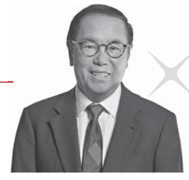

**Non-Independent Director**

#### **Bachelor of Business Administration (Honours)**

National University of Singapore

Date of first appointment as Director: 16 November 2009 Date of appointment as Chairman: 1 May 2010 Date of last re-election as Director: 31 March 2023 Length of service as Director: 14 years 3 months

#### **Present directorships:**

#### **Other listed companies**

**•** Singapore Airlines Limited Chairman

#### **Other principal commitments**

**•** DBS Bank Ltd. Chairman

Nil

- **•** DBS Bank (Hong Kong) Limited Chairman
- **•** GIC Private Limited Director
- **•** STT Communications Ltd Deputy Chairman
- **•** Fullerton Financial Holdings Pte. Ltd. Deputy Chairman
- **•** LaSalle College of the Arts Limited Chairman
- **•** National Wages Council Chairman
- **•** Council of Presidential Advisers Member **•** University of the Arts Singapore Ltd. Director

**Past directorships in listed companies held over the preceding five years:**

#### **Piyush Gupta 64, Chief Executive Officer**

**Executive Director**

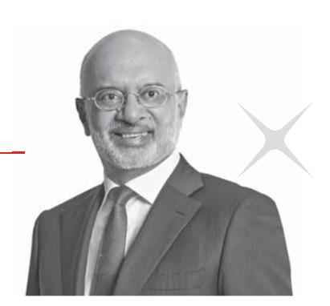

#### **Post Graduate Diploma in Management**

Indian Institute of Management, Ahmedabad, India

#### **Bachelor of Arts, Economics**

University of Delhi, India

Date of first appointment as Director: 9 November 2009 Date of last re-election as Director: 30 March 2021 Length of service as Director: 14 years 3 months

#### **Present directorships:**

#### **Other listed companies**

Nil

#### **Other principal commitments**

- **•** DBS Bank Ltd. Chief Executive Officer
- & Director **•** DBS Bank (Hong Kong) Limited Vice Chairman
- **•** Verified Impact Exchange Holdings Pte. Ltd. Director
- **•** Dr Goh Keng Swee Scholarship Fund Deputy Chairman **•** Institute of International Finance, Washington Vice Chairman
- **•** National Research Foundation, Singapore Board Member
- **•** The Association of Banks in Singapore Chairman
- **•** The Institute of Banking & Finance, Singapore Vice Chairman **•** Singapore Indian Development Term Trustee
- Association (SINDA)
- **•** Singapore Management University Chairman,
- **•** MasterCard Asia Pacific Advisory Board Board Member
- **•** BirdLife International, UK Co-Chairman,
- **•** Indian Business-leaders Roundtable Member, under Singapore Indian Development Managing Association (SINDA) Council
- **•** Advisory Council on the Ethical Use of Council Member Artificial Intelligence (AI) and Data, Singapore
- **•** Council for Board Diversity, Singapore Council Member
- **•** World Business Council for Sustainable Vice Chairman, Development, Switzerland Executive Committee
- **•** CNBC ESG Council, USA Member
- **•** International Business Leaders' Advisory Council Member Council for the Mayor of Shanghai (IBLAC)
- **•** SG Her Empowerment Limited Special Adviser

#### **Past directorships in listed companies held over the preceding five years:** Nil

 Board of Trustees Global Advisory Group

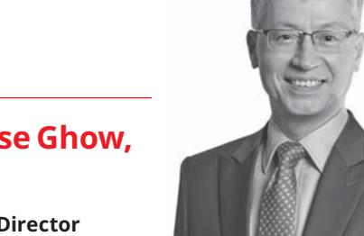

#### **Olivier Lim Tse Ghow, 59**

**Non-Executive and Lead Independent Director**

#### **Chng Kai Fong, 45**

**Non-Executive and Non-Independent Director**

#### **Bachelor of Engineering (First Class Honours), Civil Engineering**

Imperial College, London, UK

Date of first appointment as Director: 7 November 2017 Date of appointment as Lead Independent Director: 29 April 2020 Date of last re-election as Director: 31 March 2022 Length of service as Director: 6 years 3 months

#### **Present directorships:**

- **Other listed companies •** StarHub Ltd. Chairman
- **•** Raffles Medical Group Ltd Director

#### **Other principal commitments**

- **•** DBS Bank Ltd. Director
- **•** Singapore Tourism Board Chairman

#### **Past directorships in listed companies held over the preceding five years:**

- **•** Banyan Tree Holdings Limited Director
- **•** PropertyGuru Group Limited Chairman

#### **Sloan Masters Programme with a Master of Science in Management**

Stanford University, USA

#### **Master of Engineering and Bachelor of Arts (First Class Honours)**

University of Cambridge, UK

Nil

- **•** DBS Bank Ltd. Director
- **•** Prime Minister's Office, Singapore Permanent Secretary
- (Cybersecurity) **•** Info-Communications Media Development Deputy Chairman Authority (IMDA)
- **•** The Government Technology Agency Board Member of Singapore

**Past directorships in listed companies held over the preceding five years:** Nil

Date of first appointment as Director: 31 March 2021 Date of last re-election as Director: 31 March 2022 Length of service as Director: 2 years 11 months

Development)

#### **Present directorships: Other listed companies**

#### **Other principal commitments**

- **•** Ministry of Communications Permanent Secretary and Information, Singapore (Information and
- (Development)
- **•** Singapore Symphonia Company Limited Director
- **•** Shell Gas & Power Development B.V. Advisory Board
- Advisory Board

Member, New Energies

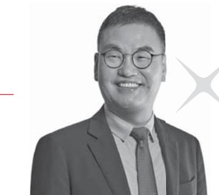

#### **Bonghan Cho, 59 Non-Executive and**

**Independent Director**

#### **Ph.D and MS in Computer Science, specialising in Artificial Intelligence**

University of Southern California, USA

#### **Bachelor of Science in Computer Science and Statistics**

Seoul National University, South Korea

Date of first appointment as Director: 26 April 2018 Date of last re-election as Director: 31 March 2022 Length of service as Director: 5 years 10 months

**Present directorships: Other listed companies**

Nil

#### **Other principal commitments**

**•** DBS Bank Ltd. Director

**•** Equalkey Corporation Founder & Chief Executive Officer

**Past directorships in listed companies held over the preceding five years:** Nil

#### **David Ho Hing-Yuen, 64 Non-Executive and Independent Director**

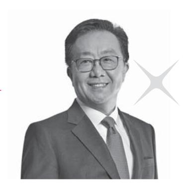

#### **Master of Applied Science (Management Sciences) Bachelor of Applied Science (Honours Systems Design Engineering)**

University of Waterloo, Canada

#### **Directors' Consortium Program**

Stanford Graduate School of Business, USA

Date of first appointment as Director: 26 April 2023 Date of last re-election as Director: Not applicable Length of service as Director: 10 months

#### **Present directorships:**

#### **Other listed companies**

**•** Sun Life Financial, Inc. Director **•** Qorvo, Inc. Director

**•** Air Products and Chemicals, Inc. Director

#### **Other principal commitments**

**•** DBS Bank Ltd. Director

**•** Kiina Investment Limited Founder & Chairman

**•** Kiina Ventures, Inc. Chairman

**•** Sun Life Assurance Company of Canada Director

**•** Noval Inception Philanthropy Chief Fundraising (non-governmental organisation) Officer

#### **Past directorships in listed companies held over the preceding five years:**

**•** nVent Electric Plc Director

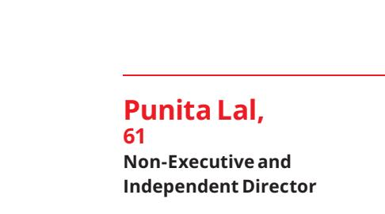

#### **Master of Business Administration**

Indian Institute of Management, Calcutta, India

#### **Bachelor of Arts, Economics (Honours)**

St. Stephen's College, Delhi, India

Date of first appointment as Director: 1 April 2020 Date of last re-election as Director: 31 March 2023 Length of service as Director: 3 years 10 months

#### **Present directorships: Other listed companies**

**•** Cipla Limited Director

**•** Carlsberg A/S Member,

Supervisory Board

#### **Other principal commitments •** DBS Bank Ltd. Director

**•** DBS Foundation Ltd. Director

**Past directorships in listed companies held over the preceding five years:**

**•** CEAT Limited Director

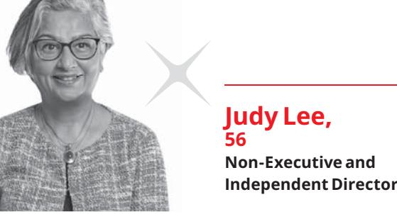

## **Non-Executive and**

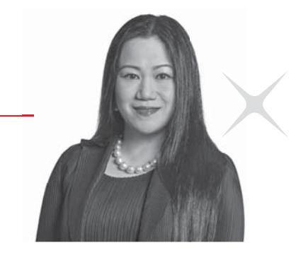

#### **Master of Business Administration**

The Wharton School of the University of Pennsylvania, USA

#### **Bachelor of Science, Finance & International Business**

Stern Business School, New York University, USA

#### **Advanced Management Program Women on Boards – Corporate Director Program**

Harvard Business School, USA

Date of first appointment as Director: 4 August 2021 Date of last re-election as Director: 31 March 2022 Length of service as Director: 2 years 6 months

#### **Present directorships:**

#### **Other listed companies**

**•** Commercial Bank of Ceylon PLC Director **•** Mapletree Logistics Trust Management Ltd. Director (the Manager of Mapletree Logistics Trust)

**•** AlTi Global, Inc.(1) Director

#### **Other principal commitments**

**•** DBS Bank Ltd. Director **•** DBS Foundation Ltd. Director **•** Dragonfly LLC Managing Director & Co-Founder **•** Dragonfly Advisors Pte. Ltd. Managing Director

**•** SG Her Empowerment Limited Director

**•** Dragonfly Capital Ventures LLC Chief Executive Officer

**•** JTC Corporation Board Member **•** SMRT Corporation Ltd Director **•** Strides DST Pte. Ltd. Chairperson **•** Temasek Lifesciences Accelerator Pte. Ltd. Director

**•** Stern School of Business, Member, New York University Executive Board **•** Break Some Glass Inc., Co-President & Director WomenExecs on Boards (volunteer, non-profit

 Harvard Business School Alumni network)

#### **Past directorships in listed companies held over the preceding five years:**

Nil

*(1) AlTi Global, Inc. was formerly known as Alvarium Tiedemann Holdings, Inc.*

192 **DBS ANNUAL REPORT 2023** BUILDING A SUSTAINABLE ADVANTAGE **Group Management Committee** 193

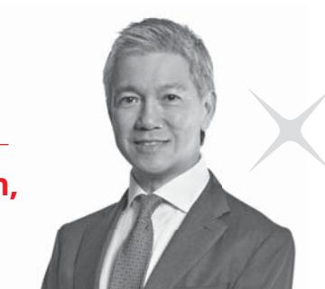

#### **Anthony Lim Weng Kin, 65**

**Non-Executive and Independent Director**

#### **Bachelor of Science**

National University of Singapore

#### **Advanced Management Program**

Harvard Business School, USA

Date of first appointment as Director: 1 April 2020 Date of last re-election as Director: 31 March 2023 Length of service as Director: 3 years 10 months

#### **Present directorships:**

#### **Other listed companies**

**•** CapitaLand Investment Limited Director

#### **Other principal commitments**

- **•** DBS Bank Ltd. Director
- **•** CapitaLand Hope Foundation Director
- **•** Institute of International Education (IIE) Member,

 Scholar Rescue Fund Selection Committee **•** Ministry of Foreign Affairs, Singapore Non-Resident Ambassador to Colombia **•** Queensway Secondary School Member, School Advisory

#### **Past directorships in listed companies held over the preceding five years:**

**•** CapitaLand Limited(1) Director

*(1) CapitaLand Limited was delisted from the official list of the Singapore Exchange Securities Trading Limited on 21 September 2021*

Committee

#### **Tham Sai Choy, 64**

**Non-Executive and Independent Director**

#### **Bachelor of Arts (Honours) in Economics**

University of Leeds, UK

#### **Fellow**

Institute of Chartered Accountants in England and Wales Institute of Singapore Chartered Accountants Singapore Institute of Directors

Date of first appointment as Director: 3 September 2018 Date of last re-election as Director: 31 March 2022 Length of service as Director: 5 years 5 months

#### **Present directorships:**

**Other listed companies**

**•** Keppel Ltd.(1) Director

#### **Other principal commitments**

**•** DBS Bank Ltd. Director **•** DBS Bank (China) Limited Director **•** DBS Foundation Ltd. Director **•** Nanyang Polytechnic Board Member **•** Mount Alvernia Hospital Board Member **•** Singapore International Arbitration Centre Director **•** E M Services Private Limited Chairman

#### **Past directorships in listed companies held over the preceding five years:**

Nil

*(1) Keppel Ltd. was formerly known as Keppel Corporation Limited*

## **Group Management Committee**

#### **The Group Management Committee comprises 22 members, including members of the Group Executive Committee.**

#### **Piyush Gupta**

#### **Chief Executive Officer**

Piyush has been the Chief Executive Officer and Director of DBS Group since 2009. Prior to joining DBS, Piyush had a 27-year career at Citigroup, where his last position was Chief Executive Officer for Southeast Asia, Australia and New Zealand. Piyush is Chairman of the Board of Trustees of Singapore Management University, Vice-Chairman of the Institute of International Finance, Washington and Vice-Chairman of the World Business Council for Sustainable Development Executive Committee. In addition, he is a member of Singapore's Advisory Council on the Ethical Use of AI and Data.

Piyush sits on the boards of Singapore's National Research Foundation and the Council for Board Diversity established by Singapore's Ministry of Social and Family Development. He is a term trustee of the Singapore Indian Development Association. Previously, he was a member of the Singapore Emerging Stronger Taskforce, aimed at defining Singapore's future in a post-Covid world, the UN Secretary General's Task Force on Digital Financing of the Sustainable Development Goals, and the McKinsey Advisory Council.

Piyush was awarded the Public Service Star by the President of Singapore for his meritorious services to the nation in 2020. He is a recipient of the 2023 Pravasi Bharatiya Samman Award, the highest honour conferred by the Indian Government on the country's diaspora.

Piyush was named one of the world's top 100 best-performing chief executives in Harvard Business Review – 2019 edition of "The CEO 100". He was named Global Indian of the Year by the Economic Times in 2021, Singapore Business Awards' Outstanding Chief Executive of the Year in 2016, and Singapore Business Leader of the Year by CNBC in 2014.

#### **Chng Sok Hui**

#### **Chief Financial Officer**

Sok Hui is the Chief Financial Officer of DBS Group. Prior to this appointment in October 2008, she was Group Head of Risk Management for six years. She is currently a Board member of DBS Bank India. She serves on the board of the Singapore Exchange (Chair of Risk Committee) as well as the Changi Airport Group (Chair of Audit Committee). Additionally, she is a member of the CareShield Life Council.

Sok Hui previously served, for six years each, on the boards of Inland Revenue Authority of Singapore, Housing & Development Board, and Accounting Standards Council. She was also the Supervisor of DBS China Board for 10 years and a past board member of the Bank of the Philippine Islands.

Sok Hui is a Chartered Financial Analyst, a Certified Financial Risk Manager, an Institute of Banking and Finance Singapore Distinguished Fellow and a Fellow Chartered Accountant of Singapore. She was the recipient of several awards including AsiaRisk's "Risk Manager of the Year" (2002), Asian Banker's inaugural "Risk Manager of the Year" (2012), "Best CFO" at the Singapore Corporate Awards (2013), "Accountant of the Year" at the inaugural Singapore Accountancy Awards (2014) and "Best CFO in Singapore" by the FinanceAsia's Best Companies Awards in 2023. She is a member of the International Women's Forum (Singapore).

#### **Ginger Cheng**

#### **China**

Ginger is Chief Executive Officer of DBS Bank (China) Limited and a member of the DBS Group Management Committee. China is a key market for DBS, and Ginger is responsible for bringing the franchise to the next level, as the bank executes its strategy to become a leading bank in Asia.

Ginger joined DBS in 2001. Prior to this CEO appointment, she was Deputy CEO of DBS China and the Head of Institutional Banking Group, China. Ginger has nearly 30 years of experience in syndicated lending and corporate banking across China, notably in the Greater Bay Area.

Ginger was born in Beijing and received her primary and secondary education there. She holds a Bachelor's degree in Business Administration from the Chinese University of Hong Kong.

#### **Eng-Kwok Seat Moey**

#### **Capital Markets**

Seat Moey is Group Head of Capital Markets. With more than 30 years of experience in investment banking, she oversees and supervises several teams on advisory and corporate finance, as well as structuring and execution of all equity transactions including corporate equity fund raising, REITs/ Business Trusts and IPOs. Seat Moey's extensive experience also includes structuring and originating debt and equity-linked debt issues and structured finance. She is the Chair of the DBS Digital Exchange which offers trading services for various digital assets, including security tokens and cryptocurrencies. She is also a board member of the bank's award-winning securities business, DBS Vickers Securities.

Seat Moey was instrumental in the development of the REITs industry in Singapore and the region, having advised on numerous industry-first structures. She also played an integral role in growing DBS' capital markets franchise beyond Singapore through a number of regional landmark transactions. Under her leadership, DBS continues to lead the market in Singapore and Asia ex-Japan, ranking top in regional and Singapore league tables. She was awarded the Institute of Banking and Finance Distinguished Fellow award for Capital Markets in 2018.

194 **DBS ANNUAL REPORT 2023** BUILDING A SUSTAINABLE ADVANTAGE **Group Management Committee** 195

#### **Philip Fernandez**

#### **Corporate Treasurer**

Philip is Group Corporate Treasurer, responsible for DBS' balance sheet, capital, wholesale funding, duration management and structural FX globally. He became Corporate Treasurer 15 years ago and in total has more than 30 years of experience in financial services in Singapore and London. Philip was conferred the Institute of Banking and Finance Singapore Distinguished Fellow award for Financial Markets in 2021 and was previously named "Bank Treasurer of the Year" by The Asset. Prior to heading Corporate Treasury, he was DBS' co-head of market risk for five years.

Philip is a Singaporean who holds an M.A. from Cambridge University where he studied Engineering and Management under a DBS scholarship. Previously, he was also an adjunct associate professor at the Singapore Management University for six years, where he specialised in quantitative finance. He is currently a member of the Private Education Appeals Board and was previously a member of the Home Team-NS board of governors.

#### **Derrick Goh**

#### **Audit**

Derrick is the Group Head of Audit, responsible for providing independent assurance of the bank's controls, risk and governance structures and processes. Prior to this, Derrick led the Treasures and Treasures Private Client Wealth Management business across the group. Before that, he was Head of POSB where he helped to deepen its community outreach. Derrick was also Regional Chief Operating Officer and Chief Financial Officer of the Institutional Banking Group and Head of Finance, Group Planning and Analytics.

Before DBS, Derrick spent 11 years at American Express in senior finance roles in Paris, London, New York and Singapore. He has over 30 years of experience in finance and banking. He currently chairs the Board Audit and Risk Committee for GovTech Singapore and serves the community as a Member of Parliament (Nee Soon Group Representation Constituency). He is also a member of the Parliament of Singapore's Public Accounts Committee.

#### **Han Kwee Juan**

#### **Singapore**

#### **& Acting Chief Information Officer**

Kwee Juan is Group Executive, Acting Chief Information Officer and Country Head of DBS Singapore, where he is responsible for leading the franchise in the Group's largest market.

Prior to this, he was DBS' Group Head of Strategy & Planning, where he played a pivotal role in driving the transformation agenda across the Group, especially in the areas of data and artificial intelligence, Managing through Journeys, customer experience and centricity, innovation and future of work. He also forged partnerships across the Group to build new business models and digital growth engines, and scaled these businesses.

Kwee Juan is currently a board member of Singapore Institute of Technology, council member of Singapore National Employers' Federation and a member of the Institute of International Finance Digital Finance steering committee.

#### **Lam Chee Kin**

#### **Legal & Compliance**

Chee Kin oversees the legal and regulatory risk of DBS across legal entities, segments and geographies. A lawyer by profession, he has particular expertise in financial services regulation, and financial markets product and business structuring. Chee Kin has held legal and compliance portfolios in Standard Chartered, J.P. Morgan, Rajah & Tann and Allen & Gledhill. He also had a stint as Chief Operating Officer for Southeast Asia at J.P. Morgan.

Chee Kin currently serves on the Advisory Board to the Singapore Management University School of Law and the Advisory Panel to the NUS Centre for Banking and Finance Law.

#### **Lee Yan Hong**

#### **Human Resources**

Yan Hong is Head of Group Human Resources at DBS.

Leveraging over 30 years of global human capital management expertise, Yan Hong spearheads DBS' strategic people agenda to deliver on the bank's employee value proposition. This includes driving transformational leadership initiatives, fostering a startup culture, talent development, upskilling employees with future-ready capabilities and ensuring holistic employee well-being.

Under her leadership, DBS has been certified by Kincentric as Regional Best Employer in Asia Pacific, as well as Country Best Employer in Singapore and other markets for several years. In recognition of the progress made on advancing gender equity at the workplace, DBS has also been named to the Bloomberg Gender Equality Index for six years running. DBS has also been awarded by the Singapore

Tripartite Alliance for Fair and Progressive Employment Practices for fair and progressive employment practices as well as empowering employees to achieve work-life excellence.

Yan Hong serves on the board of the Inland Revenue of Singapore and the Institute of Systems Science, National University of Singapore.

#### **Lim Chu Chong**

#### **Indonesia**

Chu Chong has been President Director of PT Bank DBS Indonesia since August 2022.

Prior to that, he was Chief Operating Officer, Institutional Banking Group (IBG), at DBS. In this role, he was responsible for facilitating business growth, particularly in strengthening policies, governance and controls, data capabilities as well as customer and employee experience.

A career DBS banker, Chu Chong has over 25 years of experience in institutional, SME and consumer banking. He began his career as a credit and marketing officer in Corporate Banking, before progressively moving up the ranks to become Regional Head of SME Banking. Between 2016 and 2019, he was Head of DBS IBG China.

He was Non-Independent Commissioner of DBS Indonesia from 2011 to 2016, and a Board member of DBS Foundation from December 2013 to November 2022.

He has a Bachelor of Arts majoring in Economics and Statistics from the National University of Singapore.

#### **Lim Him Chuan**

#### **Strategy, Transformation, Analytics & Research**

Him Chuan is Group Head of Strategy, Transformation, Analytics & Research. He is a member of DBS' Group Executive Committee. In this role, he works with the Group CEO and Group Management Committee to develop strategies to drive growth and valuation for shareholders. He also oversees strategic reviews and execution of these strategies across the bank globally. Additionally, he is responsible for driving the transformation programme including the use of AI and data analytics in our businesses across the bank.

Prior to this, Him Chuan was General Manager and Chief Executive Officer of DBS Bank Taiwan, a role he held from 2018 to 2023. Under his leadership, DBS Taiwan's income increased at a compounded annual growth rate of 6%, while net profit before tax grew at a CAGR of 12%. DBS Taiwan also won multiple accolades including Best International Foreign

Bank in Taiwan by Asiamoney. He also oversaw the integration of Citigroup Inc.'s consumer banking business in Taiwan, making DBS the largest foreign bank in Taiwan by assets.

Him Chuan's other senior leadership roles at DBS include being Group Head of Product Management for Global Transaction Services, Group Chief Operating Officer for Institutional Banking Group and International Markets, Risk Management Group and Head of Group Audit.

He was conferred the title of Institute of Banking and Finance Singapore Fellow in 2014 in recognition of his contributions to the Singapore financial services industry and his industry thought leadership.

#### **Sim S Lim**

#### **Senior Advisor**

Sim is Senior Advisor to the bank. Prior to this, he was Group Head of the Consumer Banking/ Wealth Management, a role he held since January 2019. He previously spent eight years as DBS' first country head with dedicated oversight for Singapore, during which he focused on delivering greater synergy and value across the bank's Singapore franchise.

Sim has been in the industry for over 40 years and has assumed career responsibilities in Asia, North America and the Middle East. Before DBS, he was President and CEO of Nikko Citigroup Limited. During this time, he was also a Board member of Nikko Citi Holdings Inc, and oversaw corporate and investment banking, institutional brokerage, as well as fixed income and equity trading for Citigroup in Japan. In his time abroad, Sim also served as chairman of Citibank Berhad Malaysia.

Presently, Sim is Chairman of DBS Vickers Securities Holdings and sits on the Board of DBS Securities (Japan). He chairs the Building and Construction Authority, and is also an independent non-executive director of ST Engineering, Raffles Medical Group & IOI Properties Group. Sim also serves as Singapore's High Commissioner (Non-Resident) to the Federal Republic of Nigeria.

#### **Andrew Ng**

#### **Treasury Markets**

Andrew is Head of Treasury Markets. In March 2024, he became Group Head of Global Financial Markets, which comprises Treasury Markets, equity capital markets, DBS Vickers and DBS Digital Exchange. He is also the Chairman and Director of DBS Bank Taiwan, and Director of DBS Securities (Japan) Company Limited. Andrew's experience in the treasury business spans over 35 years, comprising senior positions in Asia and Western markets. Since 2006, Andrew has

been instrumental in leading DBS Treasury Market's expansion in the region.

In addition, he helped build a pan-Asia trading platform on different asset classes and established a region-wide local currencies derivative capability for the bank. He has also expanded DBS' capabilities in generic and exotic derivatives. Prior to joining DBS, he was Executive Director at Canadian Imperial Bank of Commerce (CIBC) from 1995 to 1999, where he set up CIBC's trading platform and derivative capabilities on Asian currencies.

He was also previously North Asia Head of Trading at Chase Manhattan Bank N.A. and Treasurer of Chase Manhattan Bank Taipei.

#### **Jimmy Ng**

#### **Operations**

Jimmy is Group Head of Operations, and Regional Technology and Operations.

Jimmy manages operations across DBS, overseeing the Consumer and Institutional Banking groups, Customer Contact Centre, Treasury Markets, as well as Group Operations. He is the architect of the bank's multi-year Operations Processes and Platform Re-engineering programme, which enhanced employee productivity and yielded over a million hours of increased efficiency since 2021.

He previously served as Group Head of Technology & Operations, where he oversaw the launch of our third technology hub, which is located in Guangzhou, China. He also drove the successful integration of technology and operations of Citi Consumer Taiwan with DBS Taiwan in 2023, and for Lakshmi Vilas Bank in 2022. Additionally, he played an integral role in advancing the bank's AI and Gen AI strategy. During his tenure with DBS, Jimmy also took on leadership roles in Audit and Consumer Banking Operations.

#### **Ng Sier Han**

#### **Taiwan**

Sier Han is General Manager and Chief Executive Officer of DBS Bank Taiwan. Prior to his current role, he was Integration Director of DBS Taiwan where he oversaw the successful integration of Citi Consumer Taiwan, which resulted in DBS becoming the largest foreign bank in Taiwan by assets.

Before relocating to Taiwan, he was Head of DBS' Financial Institutions Group (FIG), a role he held from 2019. In this role, he was responsible for leading the development of relationships with banks, institutional investors and insurance clients across the global franchise. Under his leadership, the FIG franchise registered significant

growth in income across key capital markets, namely, Singapore, Greater China and the United Kingdom.

#### **Karen Ngui**

#### **Strategic Marketing & Communications**

Karen is Group Head, Strategic Marketing and Communications, and a founding board member of DBS Foundation. She is responsible for shaping, enhancing and protecting the bank's brand positioning and reputation across all businesses and markets where DBS is present.

She is also responsible for corporate communications, strategic marketing, internal communications, community engagement and sponsorship. In addition, she oversees DBS Foundation and the bank's overall 'Impact beyond banking' initiatives which include corporate volunteerism and philanthropy.

Karen has over 30 years of experience and joined DBS in 2005 from Standard Chartered Bank, where she was Global Head, Brand Management and Strategic Marketing.

#### **Sebastian Paredes**

#### **Hong Kong & North Asia**

Sebastian is Head of North Asia of DBS with oversight of Mainland China, Hong Kong and Taiwan, and the Chief Executive Officer of DBS Bank (Hong Kong) Limited. He is also the Chairman of DBS (China) Ltd.

A banker of over 30 years, Sebastian has a strong track record in building franchises across multiple markets. Prior to joining DBS, Sebastian was the President Director of PT Bank Danamon Indonesia, where he successfully solidified the bank's position in retail, SME and commercial banking, and made inroads into the micro lending business. Before Danamon, he spent 20 years at Citigroup in South America, Turkey and Africa.

Sebastian holds a Bachelor of Science degree from California State University, Fresno (California, USA) and an International MBA from IE Business School (Madrid, Spain). He speaks five languages (Spanish, English, German, French and Bahasa Indonesia).

196 **DBS ANNUAL REPORT 2023** BUILDING A SUSTAINABLE ADVANTAGE **International presence** 197

#### **Sanjoy Sen**

#### **Consumer Banking**

Sanjoy is Group Head of Consumer Banking and plays a lead role in growing and deepening DBS' regional consumer banking footprint in Asia. His responsibilities include driving digital transformation, developing new ecosystem partnerships, and leveraging DBS' banking and technology capabilities to scale the consumer business regionally.

Sanjoy has over 30 years of extensive international consumer banking experience. He spent the first 22 years of his career in Citibank, before he joined ANZ Banking Group in 2012 to head its retail, private banking and wealth business in Asia. He then joined DBS in 2018, following the successful integration of ANZ's retail and wealth business. Sanjoy currently serves on the board of DBS Bank Taiwan and DBS Foundation. He also sits on Visa's Senior Client Council for Asia Pacific. In 2019, Sanjoy was conferred the Institute of Banking and Finance Singapore Fellow award for Consumer Banking.

Sanjoy is a Singaporean who holds a B.Tech degree in Electronics Engineering from Indian Institute of Technology and a Post Graduate Diploma in Business Management from Indian Institute of Management. He has also completed an executive management programme from Harvard Business School.

#### **Shee Tse Koon**

#### **Consumer Banking/ Wealth Management**

Tse Koon is Group Executive and Group Head of Consumer Banking and Wealth Management.

Prior to this, he was Country Head of DBS Singapore, where he was responsible for anchoring the Singapore franchise with sustainable revenue drivers and strong mindshare. Before that, he was Group Head of Strategy and Planning at DBS.

Tse Koon has close to 30 years of banking experience and started his career at Standard Chartered Bank where he held senior positions across various markets in Asia, Middle East, and the United Kingdom. He was CEO of Indonesia prior to joining DBS, and his other roles included Head of Governance (Europe, Middle East, Africa & Americas), Chief Information Officer, Head of Technology & Operations (Singapore) and Regional Head of Trade.

Tse Koon is currently a Board Director of NETS Pte Ltd and the Chairman of the Association of Banks in Singapore's Culture and Conduct Steering Group. He also sits on the Board of Governors for the Singapore International Foundation and Nanyang Polytechnic.

Tse Koon champions gender diversity and is a mentor with BoardAgender by Singapore Council of Women's Organisation.

Tse Koon was conferred the Institute of Banking and Finance Singapore Distinguished Fellow Award (Corporate Banking) in 2021. In 2022, he was awarded the Medal of Commendation (Star) by the National Trades Union Congress for his leadership in creating a future-ready workforce at DBS.

#### **Surojit Shome**

#### **India**

Surojit has been Chief Executive Officer of DBS Bank in India since 2015. Surojit has over 35 years of banking experience across corporate and investment banking, capital markets and consumer banking. Before he joined DBS, he was CEO of Rabobank in India. Prior to that, he worked for 19 years at Citibank in various roles across consumer and wholesale banking. He subsequently headed the investment banking division at Lehman Brothers in India.

Surojit holds a post-graduate management degree in marketing and finance from Xavier School of Management, Jamshedpur, and a Bachelor of Science degree in Economics, Mathematics and Statistics from Presidency University, Kolkata. Surojit has also attended the Executive Development Program at The Wharton School in 2004 and the Rabobank Senior Leadership Program at Harvard Business School in 2011.

#### **Soh Kian Tiong**

#### **Chief Risk Officer**

Kian Tiong is the Chief Risk Officer of DBS Group and has more than 25 years of experience in the banking and finance industry. He was previously DBS' Chief Credit Officer for the bank's Greater China operations where he oversaw credit and risk functions in Mainland China, Hong Kong and Taiwan. Prior to this, he was Head of DBS' Financial Institutions Group, responsible for relationships with banks and non-bank financial institutions, comprising insurance companies, funds, securities companies, supranationals and central banks, spanning US, Europe and most parts of Asia.

He also oversaw the relationship coverage of Singapore government-related entities such as GIC, Temasek and Singapore universities, among others. In recognition of his leadership and commitment in developing the financial industry, Kian Tiong was conferred the Institute of Banking and Finance Singapore Fellow award in 2017.

#### **Tan Su Shan**

#### **Institutional Banking**

Su Shan is Group Head of Institutional Banking at DBS and President Commissioner for PT Bank DBS Indonesia. She was previously Group Head of Consumer Banking and Wealth Management at DBS for almost a decade. In 2019, The Asset named Su Shan as one of six women in Asia likely to influence and feature prominently in shaping the banking and associated financial services industry in Asia. In 2018, she was nominated by Forbes Magazine as a "Top 25 Emergent Asian Woman Business Leader". In 2014, she became the first Singaporean to be recognised as the world's "Best Leader in Private Banking" by The Banker/ Private Wealth Management, a wealth publication by the Financial Times Group. She has also served as a Nominated Member of Parliament in Singapore.

Su Shan is an independent board director of CPF (Central Provident Fund Board) and Mapletree Pan Asia Commercial Trust.

On the education front, she is an advisor to Lincoln College at Oxford University. She is also the Founder President of the Financial Women's Association in Singapore, a non-profit organisation she founded and pioneered in 2001, to help develop and mentor women in the financial industry.

## **International presence**

#### **Singapore**

#### **DBS Bank Ltd ("DBS Bank")**

12 Marina Boulevard Marina Bay Financial Centre Tower 3 Singapore 018982 Tel: (65) 6878 8888

#### **DBS Nominees (Private) Limited**

10 Toh Guan Road, #04-11 DBS Asia Gateway Singapore 608838 Tel: (65) 6878 8888 Fax: (65) 6338 8936

#### **DBS Trustee Limited**

12 Marina Boulevard, Level 44 Marina Bay Financial Centre Tower 3 Singapore 018982 Tel: (65) 6878 8888 Fax: (65) 6878 3977

#### **DBS Vickers Securities (Singapore) Pte Ltd**

12 Marina Boulevard Marina Bay Financial Centre Tower 3 Singapore 018982 Tel: (65) 6327 2288

#### **DBSN Services Pte. Ltd.**

10 Toh Guan Road, #04-11 DBS Asia Gateway Singapore 608838 Tel: (65) 6878 8888 Fax: (65) 6338 8936

#### **DBS Digital Exchange Pte. Ltd.**

12 Marina Boulevard Marina Bay Financial Centre Tower 3 Singapore 018982 Tel: (65) 6878 8888

*92% owned by DBS Finnovation Pte. Ltd., a wholly-owned subsidiary of DBS Bank*

#### **Australia**

#### **DBS Bank Australia Branch**

Suite 1901, Level 19, Chifley Tower 2 Chifley Square, Sydney NSW 2000 Australia Tel: (61 2) 8823 9300

#### **Bangladesh**

Fax: (61 2) 8823 9301

#### **DBS Bank Dhaka Representative Office**

Laila Tower, 10th Floor, 8 Bir Uttam Mir Shawkat Sarak, Gulshan 1, Dhaka 1212 Bangladesh Tel: (880 2) 2266 00810

#### **China**

#### **DBS Bank (China) Limited**

Units 1301-1308, 1501, 1602, 1701, 1801 DBS Bank Tower No. 1318 Lujiazui Ring Road Pudong New Area, Shanghai 200120 People's Republic of China Tel: (86 21) 3896 8888 Fax: (86 21) 3896 8989

#### **DBS Securities (China) Co., Ltd.**

Unit 01 – 07, 29F, BFC Block S1 600 Zhongshan No.2 Road (E) Huangpu, Shanghai People's Republic of China Tel: (86 21) 3856 2888 Fax: (86 21) 6315 0977

#### **DBS Technology (China) Ltd**

*51% owned by DBS Bank*

Room 417, 419, Block A2, No.5, China-Singapore Smart 1st Street China-Singapore Guangzhou Knowledge City Huangpu district, Guangzhou, Guangdong Province 510555 People's Republic of China Tel: (86 20) 2212 9491

#### **Hong Kong**

#### **DBS Bank (Hong Kong) Limited**

11th Floor, The Center 99 Queen's Road Central Hong Kong Tel: (852) 2290 8888

#### **DBS Bank Hong Kong Branch**

18th Floor, The Center 99 Queen's Road Central Hong Kong Tel: (852) 3668 1900 Fax: (852) 2596 0577

#### **DBS Asia Capital Limited**

73rd Floor, The Center 99 Queen's Road Central Hong Kong Tel: (852) 3668 1148 Fax: (852) 2868 0250

#### **DBS Vickers (Hong Kong) Limited**

16/F One Island East 18 Westlands Road Island East Hong Kong Tel: (852) 3668 3288 Fax: (852) 2523 6055

198 **DBS ANNUAL REPORT 2023** BUILDING A SUSTAINABLE ADVANTAGE **International presence** 199

#### **India**

#### **DBS Bank India Limited**

Ground Floor Nos. 11 & 12 Capitol Point, Baba Kharak Singh Marg Connaught Place, Delhi 110 001 India

Tel: (91 11) 6653 8888 Fax: (91 11) 6653 8899

#### **DBS Technology Services India Private Limited**

17th Floor, Skyview 20 Building, M/s. Divija Commercial Properties Private Limited Survey No. 83/1, Raidurg Village, Serilingampally Mandal, Ranga Reddy District, Hyderabad Telangana India

#### **DBS Bank Gujarat International Finance Tec-City ("Gift City") Branch**

802, 8th Floor, Hiranandani Signature Block 13B, Zone 1, GIFT SEZ, GIFT City Gandhinagar, Gujarat 382355 India

Tel: (91) 93233 93401

Tel: (91 40) 6752 2222

#### **Japan**

#### **DBS Bank Tokyo Branch**

Otemachi First Square East Tower 15F 5-1, Otemachi 1-chome Chiyoda-ku, Tokyo 100-0004 Japan Tel: (81 3) 3213 4411

#### **DBS Securities (Japan) Co., Ltd.**

Otemachi First Square East Tower 15F 5-1, Otemachi 1-chome Chiyoda-ku, Tokyo 100-0004 Japan

Tel: (81 3) 3213 4660 Fax: (81 3) 3213 4415

Fax: (81 3) 3213 4415

#### **Korea**

#### **DBS Bank Seoul Branch**

18th Floor, Seoul Finance Center 136 Sejong-daero Jung-Gu, Seoul Republic of Korea 04520 Tel: (822) 6322 2660

**DBS Bank (Hong Kong) Limited**

Nos. 5 a 7E da Rua de Santa Clara

**Macau**

**Macau Branch**

Tel: (853) 2832 9338 Fax: (853) 2832 3711

Edif, Ribeiro Loja C e D., Macau

#### **Indonesia**

DBS Bank Tower 32nd – 37th Floor, Ciputra World 1 Jalan Prof. Dr. Satrio Kav. 3-5 Jakarta 12940

**PT Bank DBS Indonesia**

Indonesia Tel: (62 21) 2988 5000 Fax: (62 21) 2988 5005

*99% owned by DBS Bank*

#### **PT DBS Vickers Sekuritas Indonesia**

DBS Bank Tower 32nd Floor, Ciputra World 1 Jalan Prof. Dr. Satrio Kav. 3-5 Jakarta 12940 Indonesia

Tel: (62 21) 3003 4900

*85% owned by DBS Vickers Securities Holdings Pte Ltd ("DBSV"), a wholly-owned subsidiary of DBS Bank and 14% owned by DBS Vickers Securities (Singapore) Pte Ltd, a wholly-owned subsidiary of DBSV*

#### **DBS Bank Kuala Lumpur**

**Representative Office** #08-01, Menara Keck Seng 203 Jalan Bukit Bintang 55100 Kuala Lumpur Malaysia

**Malaysia**

Tel: (60 3) 2116 3888 Fax: (60 3) 2116 3901

Fax: (60 87) 423 376

**Myanmar**

Myanmar

#### **DBS Bank Labuan Branch**

Level 10 (A) Main Office Tower Financial Park Labuan Jalan Merdeka 87000 F.T. Labuan Malaysia Tel: (60 87) 595 500

Fax: (822) 732 7953

#### **The Philippines**

Tel: (95 1) 925 3325

#### **DBS Bank Manila Representative Office**

**DBS Bank Yangon Representative Office**

No. 3/A Bogyoke Aung San Road Level 14, Suite 52, Junction City Tower

Pabedan Township, Yangon

22F, The Enterprise Center, Tower 1 Ayala Avenue corner Paseo De Roxas Makati City The Philippines Tel: (632) 8869 3876

#### **Taiwan**

#### **DBS Bank (Taiwan) Ltd**

15F & 17F Nos. 32 & 36 Songren Road Xinyi District, Taipei City 110 Taiwan R.O.C Tel: (886 2) 6612 9889

#### Fax: (886 2) 6612 9285 **DBS Bank Taipei Branch**

15F Nos. 32 & 17F No. 36 Songren Road Xinyi District, Taipei City 110 Taiwan R.O.C Tel: (886 2) 2722 8988

Fax: (886 2) 6638 3707

#### **United Arab Emirates**

#### **DBS Bank Ltd (DIFC Branch)**

Units 608-610, Level 6, Gate Precinct Building 5, Dubai International Financial Centre P.O. Box 506538 Dubai UAE

Tel: (971) 4364 1800 Fax: (971) 4364 1801

#### **United States of America**

#### **DBS Bank Los Angeles Representative Office**

300 South Grand Ave Suite 3075 Los Angeles CA 90071 USA

Tel: (1 213) 627 0222 Fax: (1 213) 627 0228

#### **DBS Vickers Securities (USA), Inc.**

777 Third Ave, Suite 1701 New York, NY 10017 USA Tel: (1 212) 826 1888

#### **Thailand**

#### **DBS Bank Bangkok Representative Office**

989 Siam Piwat Tower Building 15th Floor Rama 1 Road, Pathumwan Bangkok 10330 Thailand Tel: (66 2) 658 1400-1

Fax: (66 2) 658 1402

#### **DBS Vickers Securities (Thailand) Co., Ltd.**

989 Siam Piwat Tower Building 9th 14th – 15th Floor Rama 1 Road, Pathumwan Bangkok 10330 Thailand Tel: (66 2) 857 7000

#### **United Kingdom**

#### **DBS Bank London Branch**

One London Wall London EC2Y 5EA UK Tel: (44 20) 7489 6555

Tel: (84 24) 3946 1688

Fax: (84 24) 3946 1689

**Vietnam**

Vietnam

#### **DBS Bank Ho Chi Minh City Branch**

**DBS Bank Hanoi Representative Office** Room 1404 14th Floor, Pacific Place 83B Ly Thuong Kiet Street Hanoi

11th Floor, Saigon Centre 65 Le Loi Boulevard District 1 Ho Chi Minh City Vietnam

Tel: (84 28) 3914 7888 Fax: (84 28) 3914 4488

200 **DBS ANNUAL REPORT 2023** BUILDING A SUSTAINABLE ADVANTAGE **Awards and accolades won** 201

## **Awards and accolades won**

### **World's Most Innovative Banks**

Global Finance

**Digital Workplace Team of the Year**

Digital Workplace Group

**Banking Innovation Awards – Future Workforce**

Qorus-Accenture

**Evident AI Index**

Evident Insights

**Best Innovation and Transformation (Corporate/ Institutional Digital Banks)**

Global Finance

**Innovation in Digital Banking Awards – Payments**

The Banker

**Most Innovative Bank for FX**

Global Finance

**World's Best Innovation Labs**

Global Finance

**Cash Management Survey: Global Best Service (Non-FI)**

Euromoney

**World's Best Bank for Corporate Responsibility**

Euromoney

**Sustainable Leadership Award**

CoreNet Global

**Bloomberg Gender-Equality Index**

Bloomberg

**FTSE4Good Developed Index**

FTSE Russell

**The Sustainability Yearbook** 

S&P Global

**Branded Content – Series: Scripted/ Narrative (Bronze)** 

The Telly Awards

**Regional**

Euromoney **Best Bank in Asia-Paciȴ c**

Global Finance

**Asia's Safest Bank** 

Global Finance

**Asia's Best Bank for Wealth Management** 

**Best Transaction Bank, Asia-Paciȴ c** 

The Asset

**Best Sub-Custodian Bank, Asia-Paciȴ c** 

Global Finance

**Financial Adviser of the Year, Asia-Paciȴ c** 

IJGlobal

**Best Loan Adviser, Asia-Paciȴ c** 

The Asset

**Best Bank for Real Estate, Asia-Paciȴ c** 

Euromoney

**Investment Bank of the Year, Asia-Paciȴ c** 

The Banker, Global Finance

**In-House: Innovative Digital Legal Department** 

Financial Times

**In-House Team of the Year (Communications)** 

PRCA Gold Standard Awards

**Bank Integrity & Resilience (Best Use of Artiȴ cial Intelligence)** 

Regulation Asia

**Steward Leadership 25** 

Stewardship Asia

**Best ESG Bank, Asia** 

The Asset

**ASEAN Rural Development and Poverty Eradication Leadership Awards, Private Sector** 

Ministry of Social and Family Development

**Singapore**

**Best Bank, Singapore**

Global Finance

**Best Private Bank, Singapore**

Global Finance, PWM, The Asset

**Singapore**

**Best SME Bank,** 

Asiamoney

**Project Finance House**

The Asset

**Bank, Singapore**

**Best Investment** 

The Asset, FinanceAsia, Global Finance

**Singapore Bond House**

IFR Asia

**Top Companies in Singapore (#1)**

LinkedIn

**SkillsFuture Employer Awards**

SkillsFuture Singapore

**Singapore Corporate Governance Award**

Securities Investors Association (Singapore) **Best Annual Report (Gold)**

Singapore Corporate Awards

**Singapore Corporate Sustainability Award**

Securities Investors Association (Singapore) **Best Sustainable Bank, Singapore**

FinanceAsia

**Charity Platinum Award**

> Community Chest Singapore

**Friend of the Arts**

National Arts Council

**YouTube Works Awards SEA – Best in Singapore**

YouTube

202 **DBS ANNUAL REPORT 2023** BUILDING A SUSTAINABLE ADVANTAGE **Financial calendar** 203

## **Share price**

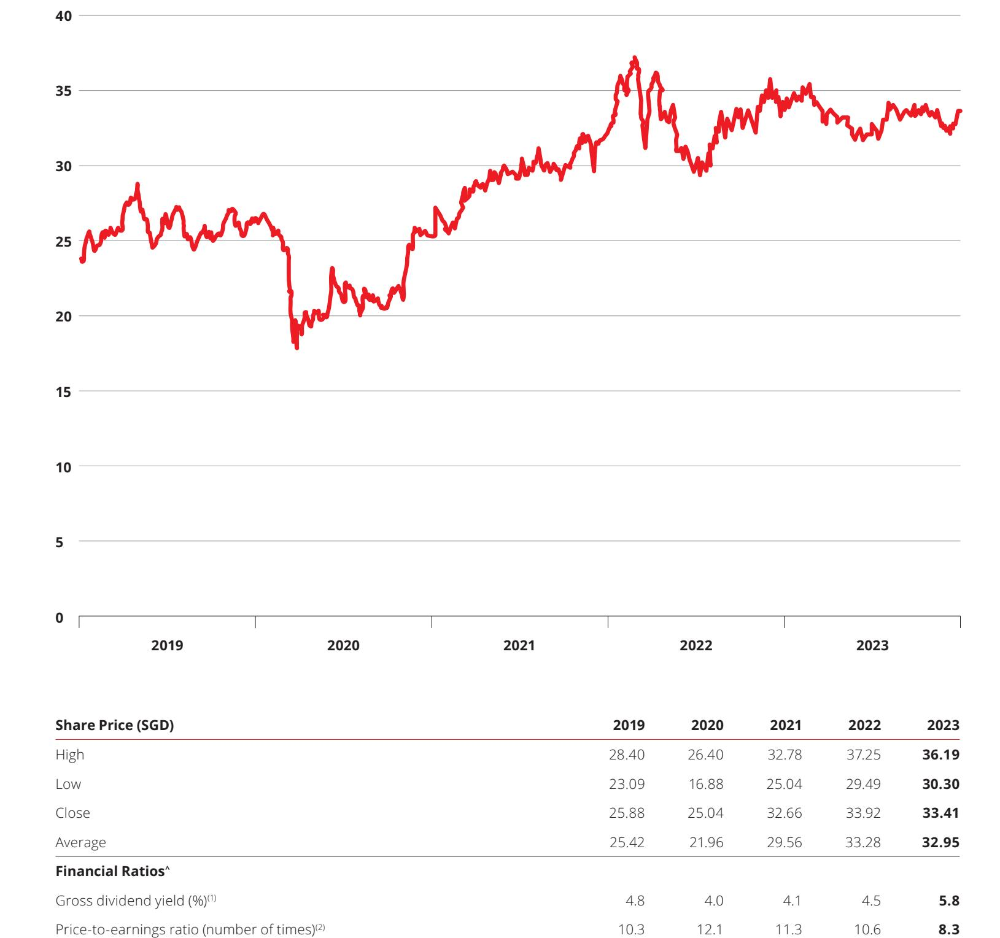

Price-to-book ratio (number of times)(3) 1.3 1.1 1.4 1.6 **1.4**

- *(1) Based on ordinary dividends for the έ nancial year*
- *(2) Earnings exclude one-time items (3) Based on year-end book value*
- *^ Calculated based on average share price for the calendar year*

## **Financial calendar**

**2024**

#### **7 February**

2023 Full Year Results

#### **28 March**

25th Annual General Meeting

#### **On or about 19 April**

Payment date of Final Dividend on Ordinary Shares for the Financial Year ended 31 December 2023(1)

#### **On or about 26 April**

Allotment and issue of Bonus Shares(2)(3)

#### **2 May**

2024 First Quarter trading update

#### **8 August**

2024 Second Quarter/ First Half Results

#### **7 November**

2024 Third Quarter trading update

## **2025**

#### **February**

2024 Full Year Results

- *(1) Subject to shareholders' approval of έ nal dividend at the 25th Annual General Meeting (25th AGM).*
- *(2) DBS announced a 1 for 10 bonus issue in an announcement dated 7 February 2024. The bonus issue will be subject to shareholders' approval of the share issue mandate at the 25th AGM.*
- *(3) Bonus Shares to be listed and quoted on or around 30 April.*

204 **DBS ANNUAL REPORT 2023** BUILDING A SUSTAINABLE ADVANTAGE **Shareholding statistics** 205

## **Shareholding statistics**

**as at 7 February 2024**

Class of Shares – Ordinary shares

Voting Rights – One vote per share

Total number of issued ordinary shares – 2,579,142,135 (excluding treasury shares)

Treasury Shares – 8,475,490 (representing 0.33% of the total number of issued ordinary shares, excluding treasury shares)

| Size of Shareholdings    | No. of Shareholders | %      | No. of Shares | %*     |
|--------------------------|------------------------|--------|------------------|--------|
| 1 – 99                   | 10,414                 | 10.62  | 299,870          | 0.01   |
| 100 – 1,000              | 45,405                 | 46.30  | 21,855,712       | 0.85   |
| 1,001 – 10,000           | 36,988                 | 37.71  | 115,994,572      | 4.50   |
| 10,001 – 1,000,000       | 5,237                  | 5.34   | 172,223,993      | 6.68   |
| 1,000,001 & above        | 33                     | 0.03   | 2,268,767,988    | 87.96  |
| Total                    | 98,077                 | 100.00 | 2,579,142,135    | 100.00 |
| Location of Shareholders |                        |        |                  |        |
| Singapore                | 94,263                 | 96.11  | 2,559,714,881    | 99.25  |
| Malaysia                 | 2,527                  | 2.58   | 12,802,116       | 0.49   |
| Overseas                 | 1,287                  | 1.31   | 6,625,138        | 0.26   |
| Total                    | 98,077                 | 100.00 | 2,579,142,135    | 100.00 |

#### **Twenty largest shareholders (as shown in the register of members and depository register)**

|    | Name of Shareholders                       | No. of Shares | %*    |
|----|--------------------------------------------|------------------|-------|
| 1  | CITIBANK NOMINEES SINGAPORE PTE LTD        | 501,048,810      | 19.43 |
| 2  | MAJU HOLDINGS PTE. LTD.                    | 458,899,869      | 17.79 |
| 3  | DBSN SERVICES PTE LTD                      | 289,103,170      | 11.21 |
| 4  | TEMASEK HOLDINGS (PRIVATE) LIMITED         | 284,145,301      | 11.02 |
| 5  | RAFFLES NOMINEES (PTE) LIMITED             | 223,235,788      | 8.66  |
| 6  | HSBC (SINGAPORE) NOMINEES PTE LTD          | 209,211,525      | 8.11  |
| 7  | DBS NOMINEES PTE LTD                       | 167,975,659      | 6.51  |
| 8  | BPSS NOMINEES SINGAPORE (PTE.) LTD.        | 20,572,253       | 0.80  |
| 9  | DBS VICKERS SECURITIES (SINGAPORE) PTE LTD | 13,319,808       | 0.52  |
| 10 | UNITED OVERSEAS BANK NOMINEES PTE LTD      | 11,947,316       | 0.46  |
| 11 | LEE FOUNDATION                             | 11,512,813       | 0.45  |
| 12 | PHILLIP SECURITIES PTE LTD                 | 8,496,211        | 0.33  |
| 13 | DB NOMINEES (SINGAPORE) PTE LTD            | 7,602,867        | 0.29  |
| 14 | OCBC NOMINEES SINGAPORE PTE LTD            | 7,253,544        | 0.28  |
| 15 | BNP PARIBAS NOMS SPORE PL                  | 6,804,290        | 0.26  |
| 16 | OCBC SECURITIES PRIVATE LTD                | 6,772,158        | 0.26  |
| 17 | MRS LEE LI MING NEE ONG                    | 4,724,255        | 0.18  |
| 18 | IFAST FINANCIAL PTE LTD                    | 4,558,357        | 0.18  |
| 19 | MERRILL LYNCH (SINGAPORE) PTE LTD          | 4,039,827        | 0.16  |
| 20 | UOB KAY HIAN PTE LTD                       | 3,842,660        | 0.15  |
|    | Total                                      | 2,245,066,481    | 87.05 |

*\* Percentage is calculated based on the total number of issued ordinary shares, excluding treasury shares*

#### **Substantial shareholders**

|                                    |             | No. of Shares |             |       |
|------------------------------------|-------------|---------------|-------------|-------|
|                                    | Direct      | Deemed        | Total       |       |
| Maju Holdings Pte. Ltd.            | 458,899,869 | –             | 458,899,869 | 17.79 |
| Temasek Holdings (Private) Limited | 284,145,301 | 464,974,240   | 749,119,541 | 29.05 |

*\* Percentage is calculated based on the total number of issued ordinary shares, excluding treasury shares*

- 1. Maju Holdings Pte. Ltd. ("Maju") is a wholly-owned subsidiary of Temasek Holdings (Private) Limited ("Temasek").
- 2. Temasek, a company wholly-owned by the Minister for Finance, is deemed to be interested in all the ordinary shares held by Maju.
- 3. In addition, Temasek is deemed to be interested in 6,074,371 ordinary shares in which its other subsidiaries have or are deemed to have an interest pursuant to Section 4 of the Securities and Futures Act 2001.

As at 7 February 2024, approximately 70.77% of the issued ordinary shares of DBS Group Holdings Ltd are held by the public and, therefore, Rule 723 of the SGX Listing Manual is complied with.

206 **DBS ANNUAL REPORT 2023** BUILDING A SUSTAINABLE ADVANTAGE **Notice of Annual General Meeting** 207

## **Notice of Annual General Meeting**

#### **DBS GROUP HOLDINGS LTD**

(Incorporated in the Republic of Singapore) Company Registration No.: 199901152M

#### **To: All shareholders of DBS Group Holdings Ltd**

NOTICE IS HEREBY GIVEN that the 25th Annual General Meeting ("AGM") of the shareholders of DBS Group Holdings Ltd (the "Company" or "DBSH") will be held at Marina Bay Sands Expo and Convention Centre, Level 4, Roselle and Simpor Ballrooms, 10 Bayfront Avenue, Singapore 018956 on Thursday, 28 March 2024 at 2.00 p.m. to transact the following business:

| Ordinary Resolution No.                      | Routine Business                                                                                                                                                                                                                                                                                                                                                                                                                                                                                                                                                                                                                                                                                                                                                                                                                                                       |
|----------------------------------------------|------------------------------------------------------------------------------------------------------------------------------------------------------------------------------------------------------------------------------------------------------------------------------------------------------------------------------------------------------------------------------------------------------------------------------------------------------------------------------------------------------------------------------------------------------------------------------------------------------------------------------------------------------------------------------------------------------------------------------------------------------------------------------------------------------------------------------------------------------------------------|
| Resolution 1                                 | To receive and adopt the Directors' Statement and Audited Financial Statements for the year ended 31 December 2023 and the Auditor's Report thereon.                                                                                                                                                                                                                                                                                                                                                                                                                                                                                                                                                                                                                                                                                                                |
| Resolution 2                                 | To declare a one-tier tax exempt Final Dividend of 54 cents per ordinary share for the year ended 31 December 2023. [2022: Final Dividend of 42 cents per ordinary share, one-tier tax exempt and Special Dividend of 50 cents per ordinary share, one-tier tax exempt]                                                                                                                                                                                                                                                                                                                                                                                                                                                                                                                                                                                          |
| Resolution 3                                 | To approve the amount of SGD 4,790,622 proposed as non-executive Directors' remuneration for the year ended 31 December 2023. [2022: SGD 4,617,248]                                                                                                                                                                                                                                                                                                                                                                                                                                                                                                                                                                                                                                                                                                                 |
| Resolution 4                                 | To re-appoint Messrs PricewaterhouseCoopers LLP as Auditor of the Company and to authorise the Directors to fix its remuneration.                                                                                                                                                                                                                                                                                                                                                                                                                                                                                                                                                                                                                                                                                                                                   |
| Resolution 5 Resolution 6 Resolution 7 | To re-elect the following Directors, who are retiring under Article 99 of the Company's Constitution and who, being eligible, offer themselves for re-election: (a) Mr Piyush Gupta (b) Mr Chng Kai Fong (c) Ms Judy Lee Key information on Mr Gupta, Mr Chng and Ms Lee can be found on pages 188, 189, 191 and 212 to 217 respectively of the 2023 Annual Report.                                                                                                                                                                                                                                                                                                                                                                                                                                                                                  |
| Resolution 8                                 | To re-elect Mr David Ho Hing-Yuen, who is retiring as a Director under Article 105 of the Company's Constitution and who, being eligible, offers himself for re-election. Key information on Mr Ho can be found on pages 190 and 212 to 217 of the 2023 Annual Report.                                                                                                                                                                                                                                                                                                                                                                                                                                                                                                                                                                                           |
| Ordinary Resolution No.                      | Special Business To consider and, if thought fit, to pass the following Resolutions which will be proposed as ORDINARY RESOLUTIONS:                                                                                                                                                                                                                                                                                                                                                                                                                                                                                                                                                                                                                                                                                                                              |
| Resolution 9                                 | That authority be and is hereby given to the Directors of the Company to: (a) (i) issue shares of the Company ("shares") whether by way of rights, bonus or otherwise; and/ or (ii) make or grant offers, agreements or options (collectively, "Instruments") that might or would require shares to be issued, including but not limited to the creation and issue of (as well as adjustments to) warrants, debentures or other instruments convertible into shares, at any time and upon such terms and conditions and for such purposes and to such persons as the Directors may in their absolute discretion deem fit; and (b) (notwithstanding the authority conferred by this Resolution may have ceased to be in force) issue shares in pursuance of any Instrument made or granted by the Directors while this Resolution was in force, |

| Ordinary Resolution No. | Special Business                                                                                                                                                                                                                                                                                                                                                                                                                                                                                                                                                                                                                                                                                                                                                                                                                                                                                                                                                                                                                                                                                                                                                                                                                                                                                                                                                                                                                                                                                                                                                                                                                                                                                                                                                                                    |
|-------------------------|-----------------------------------------------------------------------------------------------------------------------------------------------------------------------------------------------------------------------------------------------------------------------------------------------------------------------------------------------------------------------------------------------------------------------------------------------------------------------------------------------------------------------------------------------------------------------------------------------------------------------------------------------------------------------------------------------------------------------------------------------------------------------------------------------------------------------------------------------------------------------------------------------------------------------------------------------------------------------------------------------------------------------------------------------------------------------------------------------------------------------------------------------------------------------------------------------------------------------------------------------------------------------------------------------------------------------------------------------------------------------------------------------------------------------------------------------------------------------------------------------------------------------------------------------------------------------------------------------------------------------------------------------------------------------------------------------------------------------------------------------------------------------------------------------------|
| Resolution 9            | provided that: (1) the aggregate number of shares to be issued pursuant to this Resolution (including shares to be issued in pursuance of Instruments made or granted pursuant to this Resolution) does not exceed 50% of the total number of issued shares (excluding treasury shares and subsidiary holdings) of the Company (as calculated in accordance with paragraph (2) below), of which the aggregate number of shares to be issued other than on a pro rata basis to shareholders of the Company (including shares to be issued in pursuance of Instruments made or granted pursuant to this Resolution) shall not exceed 10% of the total number of issued shares (excluding treasury shares and subsidiary holdings) of the Company (as calculated in accordance with paragraph (2) below); (2) (subject to such manner of calculation and adjustments as may be prescribed by the Singapore Exchange Securities Trading Limited ("SGX-ST")) for the purpose of determining the aggregate number of shares that may be issued under paragraph (1) above, the percentage of issued shares shall be based on the total number of issued shares (excluding treasury shares and subsidiary holdings) of the Company at the time this Resolution is passed, after adjusting for: (i) new shares arising from the conversion or exercise of any convertible securities or share options or vesting of share awards which were issued and are outstanding or subsisting at the time this Resolution is passed; and (ii) any subsequent bonus issue, consolidation or subdivision of shares, and, in paragraph (1) above and this paragraph (2), "subsidiary holdings" has the meaning given to it in the Listing Manual of the SGX-ST; |
|                         | (3) in exercising the authority conferred by this Resolution, the Company shall comply with the provisions of the Listing Manual of the SGX-ST for the time being in force (unless such compliance has been waived by the SGX-ST) and the Constitution for the time being of the Company; and (4) (unless revoked or varied by the Company in general meeting) the authority conferred by this Resolution shall continue in force until the conclusion of the next Annual General Meeting of the Company or the date by which the next Annual General Meeting of the Company is required by law to be held, whichever is the earlier.                                                                                                                                                                                                                                                                                                                                                                                                                                                                                                                                                                                                                                                                                                                                                                                                                                                                                                                                                                                                                                                                                                                                             |
| Resolution 10           | That authority be and is hereby given to the Directors of the Company to allot and issue from time to time such number of new ordinary shares of the Company as may be required to be allotted and issued pursuant to the DBSH Scrip Dividend Scheme.                                                                                                                                                                                                                                                                                                                                                                                                                                                                                                                                                                                                                                                                                                                                                                                                                                                                                                                                                                                                                                                                                                                                                                                                                                                                                                                                                                                                                                                                                                                                         |
| Resolution 11           | That: (a) for the purposes of Sections 76C and 76E of the Companies Act 1967 (the "Companies Act"), the exercise by the Directors of the Company of all the powers of the Company to purchase or otherwise acquire issued ordinary shares of the Company ("Ordinary Shares") not exceeding in aggregate the Maximum Percentage (as hereafter defined), at such price or prices as may be determined by the Directors from time to time up to the Maximum Price (as hereafter defined), whether by way of: (i) market purchase(s) on the Singapore Exchange Securities Trading Limited ("SGX-ST") and/ or any other securities exchange on which the Ordinary Shares may for the time being be listed and quoted ("Other Exchange"); and/ or (ii) off-market purchase(s) (if effected otherwise than on the SGX-ST or, as the case may be, Other Exchange) in accordance with any equal access scheme(s) as may be determined or formulated by the Directors as they consider fit, which scheme(s) shall satisfy all the conditions prescribed by the Companies Act, and otherwise in accordance with all other laws and regulations and rules of the SGX-ST or, as the case may be, Other Exchange as may for the time being be applicable, be and is hereby authorised and approved generally and unconditionally (the "Share Purchase Mandate");                                                                                                                                                                                                                                                                                                                                                                                                     |

| Ordinary Resolution No. | Special Business                                                                                                                                                                                                                                                                                                                                                                                                                                                                                                                                                                                                                                                                                                                                                                                                                                                                                                                                                                                                                                                                                                                                                                                                                                                                                                                                                                                                                                                                                                                                                                                                                                                                                                                                                                                                                                                                                                                                                                                                                                                                                                                                                                                                                                                                                                                                                                                                                                                                                                                                                                                                                                          |
|-------------------------|-----------------------------------------------------------------------------------------------------------------------------------------------------------------------------------------------------------------------------------------------------------------------------------------------------------------------------------------------------------------------------------------------------------------------------------------------------------------------------------------------------------------------------------------------------------------------------------------------------------------------------------------------------------------------------------------------------------------------------------------------------------------------------------------------------------------------------------------------------------------------------------------------------------------------------------------------------------------------------------------------------------------------------------------------------------------------------------------------------------------------------------------------------------------------------------------------------------------------------------------------------------------------------------------------------------------------------------------------------------------------------------------------------------------------------------------------------------------------------------------------------------------------------------------------------------------------------------------------------------------------------------------------------------------------------------------------------------------------------------------------------------------------------------------------------------------------------------------------------------------------------------------------------------------------------------------------------------------------------------------------------------------------------------------------------------------------------------------------------------------------------------------------------------------------------------------------------------------------------------------------------------------------------------------------------------------------------------------------------------------------------------------------------------------------------------------------------------------------------------------------------------------------------------------------------------------------------------------------------------------------------------------------------------|
| Resolution 11           | (b) unless varied or revoked by the Company in general meeting, the authority conferred on the Directors of the Company pursuant to the Share Purchase Mandate may be exercised by the Directors at any time and from time to time during the period commencing from the date of the passing of this Resolution and expiring on the earliest of: (i) the date on which the next Annual General Meeting of the Company is held; (ii) the date by which the next Annual General Meeting of the Company is required by law to be held; and (iii) the date on which purchases and acquisitions of Ordinary Shares pursuant to the Share Purchase Mandate are carried out to the full extent mandated; (c) in this Resolution: "Average Closing Price" means the average of the closing market prices of an Ordinary Share over the last five market days on which transactions in the Ordinary Shares on the SGX-ST or, as the case may be, Other Exchange were recorded, immediately preceding the date of the market purchase by the Company or, as the case may be, the date of the making of the offer pursuant to the off-market purchase, and deemed to be adjusted, in accordance with the listing rules of the SGX-ST, for any corporate action that occurs during the relevant five-day period and the date of the market purchase by the Company or, as the case may be, the date of the making of the offer pursuant to the off-market purchase; "date of the making of the offer" means the date on which the Company announces its intention to make an offer for the purchase or acquisition of Ordinary Shares from Shareholders, stating therein the purchase price (which shall not be more than the Maximum Price calculated on the basis set out below) for each Ordinary Share and the relevant terms of the equal access scheme for effecting the off-market purchase; "Maximum Percentage" means that number of issued Ordinary Shares representing 2% of the issued Ordinary Shares as at the date of the passing of this Resolution (excluding treasury shares and subsidiary holdings (as defined in the Listing Manual of the SGX-ST)); and "Maximum Price" in relation to an Ordinary Share to be purchased or acquired, means the purchase price (excluding related brokerage, commission, applicable goods and services tax, stamp duties, clearance fees and other related expenses) which shall not exceed: (i) in the case of a market purchase of an Ordinary Share, 105% of the Average Closing Price of the Ordinary Shares; and |
|                         |                                                                                                                                                                                                                                                                                                                                                                                                                                                                                                                                                                                                                                                                                                                                                                                                                                                                                                                                                                                                                                                                                                                                                                                                                                                                                                                                                                                                                                                                                                                                                                                                                                                                                                                                                                                                                                                                                                                                                                                                                                                                                                                                                                                                                                                                                                                                                                                                                                                                                                                                                                                                                                                           |
|                         | (ii) in the case of an off-market purchase of an Ordinary Share, 105% of the Average Closing Price of the Ordinary Shares; and                                                                                                                                                                                                                                                                                                                                                                                                                                                                                                                                                                                                                                                                                                                                                                                                                                                                                                                                                                                                                                                                                                                                                                                                                                                                                                                                                                                                                                                                                                                                                                                                                                                                                                                                                                                                                                                                                                                                                                                                                                                                                                                                                                                                                                                                                                                                                                                                                                                                                                                         |
|                         | (d) the Directors of the Company and/ or any of them be and are hereby authorised to complete and do all such acts and things (including executing such documents as may be required) as they, he and/ or she may consider expedient or necessary to give effect to the transactions contemplated and/ or authorised by this Resolution.                                                                                                                                                                                                                                                                                                                                                                                                                                                                                                                                                                                                                                                                                                                                                                                                                                                                                                                                                                                                                                                                                                                                                                                                                                                                                                                                                                                                                                                                                                                                                                                                                                                                                                                                                                                                                                                                                                                                                                                                                                                                                                                                                                                                                                                                                                         |
|                         |                                                                                                                                                                                                                                                                                                                                                                                                                                                                                                                                                                                                                                                                                                                                                                                                                                                                                                                                                                                                                                                                                                                                                                                                                                                                                                                                                                                                                                                                                                                                                                                                                                                                                                                                                                                                                                                                                                                                                                                                                                                                                                                                                                                                                                                                                                                                                                                                                                                                                                                                                                                                                                                           |

By Order of the Board

#### **Marc Tan**

Group Secretary DBS Group Holdings Ltd

6 March 2024 Singapore

#### *Notes:*

#### *Format of Meeting*

*(1) The AGM will be held, in a wholly physical format, at Marina Bay Sands Expo and Convention Centre, Level 4, Roselle and Simpor Ballrooms, 10 Bayfront Avenue, Singapore 018956 on Thursday, 28 March 2024 at 2.00 p.m.. Shareholders, including CPF and SRS investors, and (where applicable) duly appointed proxies and representatives will be able to ask questions and vote at the AGM by attending the AGM in person. There will be no option for shareholders to participate virtually.*

 *Printed copies of this Notice of AGM and the accompanying proxy form will be sent by post to members. These documents will also be published on the Company's website at the URL https://www.dbs.com/investors/agm-and-egm/default.page and the SGX website at the URL https://www.sgx.com/securities/ company-announcements.*

#### *Appointment of Proxy(ies)*

- *(2) (a) A member who is not a relevant intermediary is entitled to appoint not more than two proxies to attend, speak and vote at the AGM. Where such member's instrument appointing a proxy(ies) appoints more than one proxy, the proportion of the shareholding concerned to be represented by each proxy shall be speciέ ed in the instrument.*
- *(b) A member who is a relevant intermediary is entitled to appoint more than two proxies to attend, speak and vote at the AGM, but each proxy must be appointed to exercise the rights attached to a diά erent share or shares held by such member. Where such member's instrument appointing a proxy(ies) appoints more than two proxies, the number and class of shares in relation to which each proxy has been appointed shall be speciέ ed in the instrument.*

 *"Relevant intermediary" has the meaning ascribed to it in Section 181 of the Companies Act 1967.*

 *A member who wishes to appoint a proxy(ies) must complete the instrument appointing a proxy(ies), before submitting it in the manner set out below.*

- *(3) A proxy need not be a member of the Company. A member may choose to appoint the Chairman of the Meeting as his/ her/ its proxy.*
- *(4) The instrument appointing a proxy(ies) must be submitted to the Company in the following manner:*
- *(a) if submitted personally or by post, be lodged with the Company's Polling Agent, Boardroom Corporate & Advisory Services Pte. Ltd., at 1 Harbourfront Avenue, #14-07 Keppel Bay Tower, Singapore 098632; or*
- *(b) if submitted electronically, be submitted via email to the Company's Polling Agent, Boardroom Corporate & Advisory Services Pte. Ltd., at DBSAGM2024@boardroomlimited.com,*

 *and in each case, must be lodged or received (as the case may be), by 2.00 p.m. on 25 March 2024, being 72 hours before the time appointed for holding the AGM.*

- *(5) CPF and SRS investors:*
- *(a) may vote at the AGM if they are appointed as proxies by their respective CPF Agent Banks or SRS Operators, and should contact their respective CPF Agent Banks or SRS Operators if they have any queries regarding their appointment as proxies; or*
- *(b) may appoint the Chairman of the Meeting as proxy to vote on their behalf at the AGM, in which case they should approach their respective CPF Agent Banks or SRS Operators to submit their votes by 5.00 p.m. on 18 March 2024.*

#### *Submission of Questions*

- *(6) Shareholders, including CPF and SRS investors, may submit substantial and relevant questions related to the resolutions to be tabled for approval at the AGM in advance of the AGM:*
- *(a) by post to the Company's Polling Agent, Boardroom Corporate & Advisory Services Pte. Ltd., at 1 Harbourfront Avenue, #14-07 Keppel Bay Tower, Singapore 098632; or*
- *(b) via email to the Company's Polling Agent, Boardroom Corporate & Advisory Services Pte. Ltd., at DBSAGM2024@ boardroomlimited.com.*

 *When submitting questions by post or via email, shareholders should also provide the following details: (i) the shareholder's full name; (ii) the shareholder's address; and (iii) the manner in which the shareholder holds shares in the Company (e.g., via CDP, CPF, SRS and/ or scrip), for veriέ cation purposes.* 

 *All questions submitted in advance must be received by 2.00 p.m. on 14 March 2024.*

- *(7) The Company will address all substantial and relevant questions received from shareholders by the 14 March 2024 deadline by publishing its responses to such questions on the Company's website at the URL https://www.dbs.com/investors/agm-andegm/default.page and the SGX website at the URL https://www. sgx.com/securities/company-announcements at least 48 hours prior to the closing date and time for the lodgement/ receipt of instruments appointing a proxy(ies). The Company will respond to questions or follow-up questions submitted after the 14 March 2024 deadline either within a reasonable timeframe before the AGM, or at the AGM itself. Where substantially similar questions are received, the Company will consolidate such questions and consequently not all questions may be individually addressed.*
- *(8) Shareholders, including CPF and SRS investors, and (where applicable) duly appointed proxies and representatives can also ask the Chairman of the Meeting substantial and relevant questions related to the resolutions to be tabled for approval at the AGM, at the AGM itself.*

#### *Access to Documents*

- *(9) The 2023 Annual Report and the Letter to Shareholders dated 6 March 2024 (in relation to the proposed renewal of the share purchase mandate) have been published and may be accessed at the Company's website as follows:*
- *(a) the 2023 Annual Report may be accessed at the URL https:// www.dbs.com/investors/έ nancials/group-annual-reports by clicking on the hyperlinks "Building a Sustainable Advantage" or "PDF" under the "2023" section of "Group Annual Reports"; and*
- *(b) the Letter to Shareholders dated 6 March 2024 may be accessed at the URL https://www.dbs.com/investors/agmand-egm/default.page by clicking on the hyperlink "Letter to Shareholders dated 6 March 2024" under "6 March 2024".*

 *The above documents may also be accessed at the SGX website at the URL https://www.sgx.com/securities/companyannouncements. Members may request for printed copies of these documents by (a) completing and submitting the Request Form sent to them by post, or (b) sending an email to the Company c/o Tricor Barbinder Share Registration Services (a division of Tricor Singapore Pte. Ltd.), at dbs-arrequest@ sg.tricorglobal.com with "Request for Printed Copies of 2023 Annual Report and Letter to Shareholders dated 6 March 2024" as the subject of the email, and state their full name (as per CDP, CPF, SRS, and/ or scrip-based records), mailing address, telephone or mobile number, and the manner in which you hold DBSH shares, in both cases, by 5.00 p.m. on 14 March 2024.* 

210 **DBS ANNUAL REPORT 2023** BUILDING A SUSTAINABLE ADVANTAGE **Notice of Annual General Meeting** 211

#### **Personal data privacy:**

By submitting an instrument appointing a proxy(ies) and/ or representative(s) to attend, speak and vote at the AGM and/ or any adjournment thereof, a member of the Company (i) consents to the collection, use and disclosure of the member's personal data by the Company (or its agents or service providers) for the purpose of the processing, administration and analysis by the Company (or its agents or service providers) of proxies and representatives appointed for the AGM (including any adjournment thereof) and the preparation and compilation of the attendance lists, minutes and other documents relating to the AGM (including any adjournment thereof), and in order for the Company (or its agents or service providers) to comply with any applicable laws, listing rules, take-over rules, regulations and/ or guidelines (collectively, the "**Purposes**"); (ii) warrants that where the member discloses the personal data of the member's proxy(ies) and/ or representative(s) to the Company (or its agents or service providers), the member has obtained the prior consent of such proxy(ies) and/ or representative(s) for the collection, use and disclosure by the Company (or its agents or service providers) of the personal data of such proxy(ies) and/ or representative(s) for the Purposes; (iii) agrees to provide the Company with written evidence of such prior consent upon reasonable request; and (iv) agrees to indemnify the Company in respect of any penalties, liabilities, claims, demands, losses and damages as a result of the member's breach of warranty.

#### **Explanatory notes**

#### **Routine Business**

#### **Ordinary Resolution 2:**

#### **Declaration of final dividend on ordinary shares**

Resolution 2 is to approve the declaration of a final dividend of 54 cents per ordinary share. Please refer to page 97 of the Capital Management and Planning section in the 2023 Annual Report for an explanation of DBSH's dividend policy.

#### **Ordinary Resolution 3:**

#### **Non-executive Directors' remuneration for 2023**

Resolution 3 is to approve the payment of an aggregate amount of SGD 4,790,622 as remuneration for the non-executive Directors of the Company for the year ended 31 December 2023 ("FY2023"). If approved, each of the non-executive Directors (with the exception of Mr Ho Tian Yee and Mr Chng Kai Fong) will receive 70% of his or her Directors' fees in cash and 30% of his or her Directors' fees in the form of share awards granted pursuant to the DBSH Share Plan. The share awards will not be subject to a vesting period, but will be subject to a selling moratorium whereby each non-executive Director will be required to hold the equivalent of one year's basic retainer for the duration of his or her tenure as a Director, and for one year after the date he or she steps down as a Director. The actual number of shares to be awarded will be determined by reference to the volumeweighted average price of a share on the SGX-ST over the 10 trading days immediately prior to (and excluding) the date of the forthcoming AGM, rounded down to the nearest share, and any residual balance will be paid in cash. The Director's fees for Mr Ho Tian Yee, who retired from office by rotation at the 24th Annual General Meeting held on 31 March 2023 and did not offer himself for re-election, will be paid to him in cash. The Director's fees for Mr Chng Kai Fong will be paid in cash to a government agency, the Directorship & Consultancy Appointments Council.

Please refer to pages 43, 44, 58 and 59 of the Corporate Governance Report in the 2023 Annual Report for more details on the nonexecutive Directors' remuneration for FY2023.

#### **Ordinary Resolutions 5, 6 and 7:**

#### **Re-election of Directors retiring under Article 99**

- (a) Mr Piyush Gupta, upon re-election as a Director of the Company, will remain as an executive Director of the Company.
- (b) Mr Chng Kai Fong, upon re-election as a Director of the Company, will remain as a member of each of the Audit Committee, Nominating Committee and Board Sustainability Committee. Mr Chng is considered non-independent of the substantial shareholder as he is a senior civil servant. Mr Chng is a non-executive Director and has no management or business relationships with the Company.
- (c) Ms Judy Lee, upon re-election as a Director of the Company, will remain as a member of each of the Audit Committee, Board Risk Management Committee/ BRMC Technology Risk Committee, Compensation and Management Development Committee and Board Sustainability Committee, and will be considered independent.

#### **Ordinary Resolution 8:**

#### **Re-election of Director retiring under Article 105**

Mr David Ho Hing-Yuen, upon re-election as a Director of the Company, will remain as a member of each of the Audit Committee, Compensation and Management Development Committee and Board Sustainability Committee, and will be considered independent.

#### **Special Business**

#### **Ordinary Resolution 9: Share Issue Mandate**

Resolution 9 is to empower the Directors to issue shares of the Company and to make or grant instruments (such as warrants or debentures) convertible into shares, and to issue shares in pursuance of such instruments, up to a number not exceeding in total 50% of the total number of issued shares (excluding treasury shares and subsidiary holdings) of the Company, of which the number of shares that may be issued other than on a *pro rata* basis to shareholders must not exceed 10% of the total number of issued shares (excluding treasury shares and subsidiary holdings).

For the purpose of determining the aggregate number of shares that may be issued, the percentage of issued shares shall be based on the total number of issued shares (excluding treasury shares and subsidiary holdings) of the Company at the time that Resolution 9 is passed, after adjusting for (a) new shares arising from the conversion or exercise of any convertible securities or share options or vesting of share awards which were issued and are outstanding or subsisting at the time that Resolution 9 is passed; and (b) any subsequent bonus issue, consolidation or subdivision of shares. As at 7 February 2024 (the "Latest Practicable Date"), the Company had 8,475,490 treasury shares and no subsidiary holdings.

#### **Ordinary Resolution 10: DBSH Scrip Dividend Scheme**

Resolution 10 is to empower the Directors, should they choose to apply the DBSH Scrip Dividend Scheme (the "Scheme") to a qualifying dividend, to issue such number of new ordinary shares of the Company as may be required to be issued pursuant to the Scheme to members who, in respect of a qualifying dividend, have elected to receive scrip in lieu of the cash amount of that qualifying dividend. If the Directors should decide to apply the Scheme to a qualifying dividend, the current intention is that no discount will be given for the scrip shares.

#### **Ordinary Resolution 11:**

#### **Renewal of the Share Purchase Mandate**

Resolution 11 is to renew the mandate to allow the Company to purchase or otherwise acquire its issued ordinary shares, on the terms and subject to the conditions set out in the Resolution.

The Company may use its internal or external sources of funds or a combination of both to finance its purchase or acquisition of the ordinary shares of the Company ("Ordinary Shares"). The amount of financing required for the Company to purchase or acquire its Ordinary Shares, and the impact on the Company's financial position, cannot be ascertained as at the date of this Notice as these will depend on, *inter alia*, the number of Ordinary Shares purchased or acquired and the price at which such Ordinary Shares were purchased or acquired.

Based on the existing issued and paid-up Ordinary Shares as at the Latest Practicable Date and excluding any Ordinary Shares held in treasury, the purchase by the Company of 2% of its issued Ordinary Shares will result in the purchase or acquisition of 51,582,842 Ordinary Shares.

Assuming that the Company purchases or acquires 51,582,842 Ordinary Shares at the Maximum Price, in the case of both market and off-market purchases, of SGD 33.48 for one Ordinary Share (being the price equivalent to 5% above the average closing prices of the Ordinary Shares traded on the SGX-ST over the last five market days on which transactions were recorded immediately preceding the Latest Practicable Date), the maximum amount of funds required is approximately SGD 1.7 billion.

The financial effects of the purchase or acquisition of such Ordinary Shares by the Company pursuant to the proposed Share Purchase Mandate on the financial statements of the Group and the Company for the financial year ended 31 December 2023 based on these and other assumptions are set out in paragraph 2.7 of the Letter to Shareholders dated 6 March 2024 (the "Letter").

Please refer to the Letter for further details.

212 **DBS ANNUAL REPORT 2023** BUILDING A SUSTAINABLE ADVANTAGE **Additional information on Directors seeking re-election** 213

## **Additional information on Directors seeking re-election as at 7 February 2024**

| Name of Director                                                                                                                                                | Piyush Gupta                                                                                                                                                                                                                                                                                                                                                                                                                                                                                      | Chng Kai Fong                                                                                                                                                                                                                                                                                                                                                                                                                                                                                                                                                                                                                                                                                                                                                                                                                                           | David Ho Hing-Yuen                                                                                                                                                                                                                                                                                                                                                                                                                                                                                                                                                                                                                                | Judy Lee                                                                                                                                                                                                                                                                                                                                                                                                                                                                |
|-----------------------------------------------------------------------------------------------------------------------------------------------------------------|---------------------------------------------------------------------------------------------------------------------------------------------------------------------------------------------------------------------------------------------------------------------------------------------------------------------------------------------------------------------------------------------------------------------------------------------------------------------------------------------------|---------------------------------------------------------------------------------------------------------------------------------------------------------------------------------------------------------------------------------------------------------------------------------------------------------------------------------------------------------------------------------------------------------------------------------------------------------------------------------------------------------------------------------------------------------------------------------------------------------------------------------------------------------------------------------------------------------------------------------------------------------------------------------------------------------------------------------------------------------|---------------------------------------------------------------------------------------------------------------------------------------------------------------------------------------------------------------------------------------------------------------------------------------------------------------------------------------------------------------------------------------------------------------------------------------------------------------------------------------------------------------------------------------------------------------------------------------------------------------------------------------------------|-------------------------------------------------------------------------------------------------------------------------------------------------------------------------------------------------------------------------------------------------------------------------------------------------------------------------------------------------------------------------------------------------------------------------------------------------------------------------|
| Date of appointment                                                                                                                                             | 9 November 2009                                                                                                                                                                                                                                                                                                                                                                                                                                                                                   | 31 March 2021                                                                                                                                                                                                                                                                                                                                                                                                                                                                                                                                                                                                                                                                                                                                                                                                                                           | 26 April 2023                                                                                                                                                                                                                                                                                                                                                                                                                                                                                                                                                                                                                                     | 4 August 2021                                                                                                                                                                                                                                                                                                                                                                                                                                                           |
| Date of last re-appointment (if applicable)                                                                                                                     | 30 March 2021                                                                                                                                                                                                                                                                                                                                                                                                                                                                                     | 31 March 2022                                                                                                                                                                                                                                                                                                                                                                                                                                                                                                                                                                                                                                                                                                                                                                                                                                           | Not applicable                                                                                                                                                                                                                                                                                                                                                                                                                                                                                                                                                                                                                                    | 31 March 2022                                                                                                                                                                                                                                                                                                                                                                                                                                                           |
| Age                                                                                                                                                             | 64                                                                                                                                                                                                                                                                                                                                                                                                                                                                                                | 45                                                                                                                                                                                                                                                                                                                                                                                                                                                                                                                                                                                                                                                                                                                                                                                                                                                      | 64                                                                                                                                                                                                                                                                                                                                                                                                                                                                                                                                                                                                                                                | 56                                                                                                                                                                                                                                                                                                                                                                                                                                                                      |
| Country of principal residence                                                                                                                                  | Singapore                                                                                                                                                                                                                                                                                                                                                                                                                                                                                         | Singapore                                                                                                                                                                                                                                                                                                                                                                                                                                                                                                                                                                                                                                                                                                                                                                                                                                               | China                                                                                                                                                                                                                                                                                                                                                                                                                                                                                                                                                                                                                                             | USA                                                                                                                                                                                                                                                                                                                                                                                                                                                                     |
| The Board's comments on this appointment (including rationale, selection criteria, board diversity considerations, and the search and nomination process) | The Board had considered the Nominating Committee's recommendation and assessment on (i) Mr Gupta's experience, skillsets, contributions and commitment in the discharge of his duties as a Director of DBS Group Holdings Ltd, as well as (ii) the size, composition and diversity of skillsets on the Board, and agreed that Mr Gupta, who is currently the Group CEO, should remain as a Director to provide the Board with insights into the Group's operating performance. | The Board had considered the Nominating Committee's recommendation and assessment on (i) Mr Chng's experience, skillsets, contributions and commitment in the discharge of his duties as a Director of DBS Group Holdings Ltd, as well as (ii) the size, composition and diversity of skillsets on the Board, and is satisȴ ed that Mr Chng will continue to contribute meaningfully to the Board.                                                                                                                                                                                                                                                                                                                                                                                                                                 | The Board had considered the Nominating Committee's recommendation and assessment on (i) Mr Ho's experience, skillsets, contributions and commitment in the discharge of his duties as a Director of DBS Group Holdings Ltd, as well as (ii) the size, composition and diversity of skillsets on the Board, and is satisȴ ed that Mr Ho will continue to contribute meaningfully to the Board.                                                                                                                                                                                                                            | The Board had considered the Nominating Committee's recommendation and assessment on (i) Ms Lee's experience, skillsets, contributions and commitment in the discharge of her duties as a Director of DBS Group Holdings Ltd, as well as (ii) the size, composition and diversity of skillsets on the Board, and is satisȴ ed that Ms Lee will continue to contribute meaningfully to the Board.                                                |
| Whether appointment is executive, and if so, the area of responsibility                                                                                         | Executive                                                                                                                                                                                                                                                                                                                                                                                                                                                                                         | Non-Executive                                                                                                                                                                                                                                                                                                                                                                                                                                                                                                                                                                                                                                                                                                                                                                                                                                           | Non-Executive                                                                                                                                                                                                                                                                                                                                                                                                                                                                                                                                                                                                                                     | Non-Executive                                                                                                                                                                                                                                                                                                                                                                                                                                                           |
| Job Title (e.g. Lead ID, AC Chairman, AC Member etc.)                                                                                                           | Group Chief Executive Oɝ cer Chairman of the Board Sustainability Committee                                                                                                                                                                                                                                                                                                                                                                                                                    | Non-Executive and Non-Independent Director Member of the Audit Committee Member of the Board Sustainability Committee Member of the Nominating Committee                                                                                                                                                                                                                                                                                                                                                                                                                                                                                                                                                                                                                                                                                       | Non-Executive and Independent Director Member of the Audit Committee Member of the Board Sustainability Committee Member of the Compensation and Management Development Committee                                                                                                                                                                                                                                                                                                                                                                                                                                                     | Non-Executive and Independent Director Member of the Audit Committee Member of the Board Risk Management Committee Member of the BRMC Technology Risk Committee Member of the Board Sustainability Committee Member of the Compensation and Management Development Committee                                                                                                                                                                       |
| Professional qualiȴ cations                                                                                                                                     | Post Graduate Diploma in Management, Indian Institute of Management, Ahmedabad, India Bachelor of Arts, Economics, University of Delhi, India                                                                                                                                                                                                                                                                                                                                               | Sloan Masters Programme with a Master of Science in Management, Stanford University, USA Master of Engineering and Bachelor of Arts (First Class Honours), University of Cambridge, UK                                                                                                                                                                                                                                                                                                                                                                                                                                                                                                                                                                                                                                                         | Master of Applied Science (Management Sciences), University of Waterloo, Canada Bachelor of Applied Science (Honours Systems Design Engineering), University of Waterloo, Canada Directors' Consortium Program, Stanford Graduate School of Business, USA                                                                                                                                                                                                                                                                                                                                                                       | Master of Business Administration, The Wharton School of the University of Pennsylvania, USA Bachelor of Science, Finance & International Business, Stern Business School, New York University, USA Advanced Management Program, Harvard Business School, USA Women on Boards – Corporate Director Program, Harvard Business School, USA                                                                                                     |
| Working experience and occupation(s) during the past 10 years                                                                                                   | Chief Executive Oɝ cer, DBS Group Holdings Ltd and DBS Bank Ltd. – 9 November 2009 to current                                                                                                                                                                                                                                                                                                                                                                                                  | May 2023 to October 2023 Permanent Secretary (Development), Ministry of Communications and Information (MCI), and The Smart Nation and Digital Government Group (SNDGG) April 2022 to April 2023 Second Permanent Secretary of MCI, and Cybersecurity in the Prime Minister's Oɝ ce (PMO) October 2021 to April 2023 Second Permanent Secretary, SNDGG October 2017 to October 2021 Managing Director, Singapore Economic Development Board June 2013 to September 2017 Principal Private Secretary to Prime Minister, PMO Mr Chng is currently the Permanent Secretary (Information and Development) for the MCI, and concurrently, the Permanent Secretary (Development) (Cybersecurity) under the PMO. Please refer to his present directorships provided below for further information. | April 2014 to December 2020 Chairman & CEO, Kiina Systems Limited January 2017 to December 2019 Founding Partner & Chairman, CRU Capital April 2007 to July 2019 Chairman & CEO, Kiina Business Services Limited November 2010 to December 2018 Senior Advisor, Permira Advisors LLP December 2004 to October 2015 Vice President/ President/ Board member, Asia America MultiTechnology Association - China Chapter (non-governmental organisation) Mr Ho currently serves as a Director of various companies. Please refer to his present directorships provided below for further information. | 2014 to 2016 Executive Vice President & Board Director, Solar Frontier K.K. 2004 to 2015 Adjunct Professor, Singapore Management University Ms Lee is currently the Managing Director & Co-Founder of Dragonȵ y LLC, as well as the Chief Executive Oɝ cer of Dragonȵ y Capital Ventures LLC. She also serves as a Director of various companies. Please refer to her present directorships provided below for further information. |

214 **DBS ANNUAL REPORT 2023** BUILDING A SUSTAINABLE ADVANTAGE **Additional information on Directors seeking re-election** 215

| Name of Director                                                                                                                                                                                                                 | Piyush Gupta                                                                                                                                                                                                                                                                                                                                                                                                   | Chng Kai Fong                                                                                                                                                                                                                                                                                                                                                                                                                                                                                                                                                                                                                                                                                                                                                                                                                                                                                                                                                           | David Ho Hing-Yuen                                                                                                                                                                                                                                                                                                                                                                                                                                                 | Judy Lee                                               |
|----------------------------------------------------------------------------------------------------------------------------------------------------------------------------------------------------------------------------------|----------------------------------------------------------------------------------------------------------------------------------------------------------------------------------------------------------------------------------------------------------------------------------------------------------------------------------------------------------------------------------------------------------------|-------------------------------------------------------------------------------------------------------------------------------------------------------------------------------------------------------------------------------------------------------------------------------------------------------------------------------------------------------------------------------------------------------------------------------------------------------------------------------------------------------------------------------------------------------------------------------------------------------------------------------------------------------------------------------------------------------------------------------------------------------------------------------------------------------------------------------------------------------------------------------------------------------------------------------------------------------------------------|--------------------------------------------------------------------------------------------------------------------------------------------------------------------------------------------------------------------------------------------------------------------------------------------------------------------------------------------------------------------------------------------------------------------------------------------------------------------|--------------------------------------------------------|
| Shareholding interest in the listed issuer and its subsidiaries                                                                                                                                                                  | Yes 2,229,585 ordinary shares in DBS Group Holdings Ltd (DBSH) (Direct and Deemed interests) 748,864 share awards (unvested) granted under the DBSH Share Plan                                                                                                                                                                                                                                        | No                                                                                                                                                                                                                                                                                                                                                                                                                                                                                                                                                                                                                                                                                                                                                                                                                                                                                                                                                                      | No                                                                                                                                                                                                                                                                                                                                                                                                                                                                 | Yes 4,453 ordinary shares in DBS Group Holdings Ltd |
| Any relationship (including immediate family relationships) with any existing director, existing executive oɝ cer, the issuer and/ or substantial shareholder of the listed issuer or of any of its principal subsidiaries | Nil                                                                                                                                                                                                                                                                                                                                                                                                            | Yes. Mr Chng, who is a senior civil servant, is employed by the Singapore government, which is the ultimate owner of Temasek Holdings (Private) Limited, the substantial shareholder of DBS Group Holdings Ltd.                                                                                                                                                                                                                                                                                                                                                                                                                                                                                                                                                                                                                                                                                                                                             | Nil                                                                                                                                                                                                                                                                                                                                                                                                                                                                | Nil                                                    |
| Conȵ ict of interest (including any competing business)                                                                                                                                                                          | Nil                                                                                                                                                                                                                                                                                                                                                                                                            | Nil                                                                                                                                                                                                                                                                                                                                                                                                                                                                                                                                                                                                                                                                                                                                                                                                                                                                                                                                                                     | Nil                                                                                                                                                                                                                                                                                                                                                                                                                                                                | Nil                                                    |
| Undertaking (in the format set out in Appendix 7.7) under Rule 720(1) has been submitted to the listed issuer                                                                                                                 | Yes                                                                                                                                                                                                                                                                                                                                                                                                            | Yes                                                                                                                                                                                                                                                                                                                                                                                                                                                                                                                                                                                                                                                                                                                                                                                                                                                                                                                                                                     | Yes                                                                                                                                                                                                                                                                                                                                                                                                                                                                | Yes                                                    |
| Other Principal Commitments* Including Directorships * "Principal Commitments" has the same meaning as deέ ned in the Code of Corporate Governance 2018.                                                                      |                                                                                                                                                                                                                                                                                                                                                                                                                |                                                                                                                                                                                                                                                                                                                                                                                                                                                                                                                                                                                                                                                                                                                                                                                                                                                                                                                                                                         |                                                                                                                                                                                                                                                                                                                                                                                                                                                                    |                                                        |
| Past (for the last 5 years)                                                                                                                                                                                                      | 1. Bretton Woods Committee, USA, Member, Advisory Council 2. Enterprise Singapore, Board Member 3. McKinsey Advisory Council, Council Member 4. Sim Kee Boon Institute for Financial Economics, Chairman, Advisory Board 5. The Islamic Bank of Asia Limited, Director 6. United Nations Secretary-General's Task Force on Digital Financing of the Sustainable Development Goals, Member | 1. Singapore Economic Development Board, Managing Director 2. EDB Investments Pte Ltd, Director 3. EDBI Pte. Ltd., Director 4. Manakin Investments Pte. Ltd., Director 5. Singapore Israel Industrial Research and Development Foundation, Director 6. Agency for Science, Technology and Research (A*STAR), Board Member 7. Singapore Management University (Lee Kong Chian School of Business), Advisory Board Member 8. Prime Minister's Oɝ ce, Principal Private Secretary to Prime Minister 9. Ministry of Communications and Information, Singapore, Second Permanent Secretary/ Permanent Secretary (Development) 10. The Smart Nation and Digital Government Group, Second Permanent Secretary/ Permanent Secretary (Development) 11. Cybersecurity, Prime Minister's Oɝ ce, Second Permanent Secretary 12. Singapore University of Technology and Design, Member, Board of Trustees | 1. DBS Bank (Hong Kong) Limited, Director 2. China COSCO Shipping Corporation Limited, External Director of the Board 3. China Mobile Communications Corporation Limited, External Director of the Board 4. COL Digital Publishing Group Co., Ltd., Director 5. nVent Electric Plc, Director 6. CRU Capital, Founding Partner & Chairman 7. Kiina Business Services Limited, Chairman & CEO 8. Kiina Systems Limited, Chairman & CEO | Nil                                                    |

| Name of Director                                                                           | Piyush Gupta                                                                                                                                                                                                                                                                                                                                                                                                                                                                                                                                                                                                                                                                                                                                                                                                                                                                                                                                                                                                                                                                                                                                                                                                                                                                                                                                                                                               | Chng Kai Fong                                                                                                                                                                                                                                                                                                                                                                                                                                                                                                                                                                                                                                                                                                                                                                                                                                                                                                                                                                                                                     | David Ho Hing-Yuen                                                                                                                                                                                                                                                                                                                                                                                                                                                                                                                                                                                                                                                                                                                                                                                                                                                                                                                                                                                 | Judy Lee                                                                                                                                                                                                                                                                                                                                                                                                                                                                                                                                                                                                                                                                                                                                                                                                                                                                                                                                                                                                                                                                       |
|--------------------------------------------------------------------------------------------|------------------------------------------------------------------------------------------------------------------------------------------------------------------------------------------------------------------------------------------------------------------------------------------------------------------------------------------------------------------------------------------------------------------------------------------------------------------------------------------------------------------------------------------------------------------------------------------------------------------------------------------------------------------------------------------------------------------------------------------------------------------------------------------------------------------------------------------------------------------------------------------------------------------------------------------------------------------------------------------------------------------------------------------------------------------------------------------------------------------------------------------------------------------------------------------------------------------------------------------------------------------------------------------------------------------------------------------------------------------------------------------------------------|-----------------------------------------------------------------------------------------------------------------------------------------------------------------------------------------------------------------------------------------------------------------------------------------------------------------------------------------------------------------------------------------------------------------------------------------------------------------------------------------------------------------------------------------------------------------------------------------------------------------------------------------------------------------------------------------------------------------------------------------------------------------------------------------------------------------------------------------------------------------------------------------------------------------------------------------------------------------------------------------------------------------------------------|----------------------------------------------------------------------------------------------------------------------------------------------------------------------------------------------------------------------------------------------------------------------------------------------------------------------------------------------------------------------------------------------------------------------------------------------------------------------------------------------------------------------------------------------------------------------------------------------------------------------------------------------------------------------------------------------------------------------------------------------------------------------------------------------------------------------------------------------------------------------------------------------------------------------------------------------------------------------------------------------------|--------------------------------------------------------------------------------------------------------------------------------------------------------------------------------------------------------------------------------------------------------------------------------------------------------------------------------------------------------------------------------------------------------------------------------------------------------------------------------------------------------------------------------------------------------------------------------------------------------------------------------------------------------------------------------------------------------------------------------------------------------------------------------------------------------------------------------------------------------------------------------------------------------------------------------------------------------------------------------------------------------------------------------------------------------------------------------|
| Present                                                                                    | Other listed companies: Nil Other principal commitments:  1. DBS Bank Ltd., Chief Executive Officer & Director  2. DBS Bank (Hong Kong) Limited, Vice Chairman  3. Verified Impact Exchange Holdings Pte. Ltd., Director  4. Dr Goh Keng Swee Scholarship Fund, Deputy Chairman  5. Institute of International Finance, Washington, Vice Chairman  6. National Research Foundation, Singapore, Board Member  7. The Association of Banks in Singapore, Chairman  8. The Institute of Banking & Finance, Singapore, Vice Chairman  9. Singapore Indian Development Association (SINDA), Term Trustee  10. Singapore Management University, Chairman, Board of Trustees  11. MasterCard Asia Pacific Advisory Board, Board Member  12. BirdLife International, UK, Co-Chairman, Global Advisory Group  13. Indian Business-leaders Roundtable under Singapore Indian Development Association (SINDA), Member, Managing Council  14. Advisory Council on the Ethical Use of Artificial Intelligence (AI) and Data, Singapore, Council Member  15. Council for Board Diversity, Singapore, Council Member  16. World Business Council for Sustainable Development, Switzerland, Vice Chairman, Executive Committee  17. CNBC ESG Council, USA, Member  18. International Business Leaders' Advisory Council for the Mayor of Shanghai (IBLAC), Council Member  19. SG Her Empowerment Limited, Special Adviser | Other listed companies: Nil  Other principal commitments:  1. DBS Bank Ltd., Director  2. Ministry of Communications and Information, Singapore, Permanent Secretary (Information and Development)  3. Prime Minister's Office, Permanent Secretary (Development) (Cybersecurity)  4. Info-Communications Media Development Authority (IMDA), Deputy Chairman  5. Singapore Symphonia Company Limited, Director  6. Shell Gas & Power Development B.V., Advisory Board Member of New Energies Advisory Board  7. The Government Technology Agency of Singapore, Board Member                                                                                                                                                                                                                                                                                                                                                                                                                                                      | Other listed companies:  1. Sun Life Financial, Inc., Director  2. Qorvo, Inc., Director  3. Air Products and Chemicals, Inc., Director  Other principal commitments:  4. DBS Bank Ltd., Director  5. Kiina Investment Limited, Founder & Chairman  6. Kiina Ventures, Inc., Chairman  7. Sun Life Assurance Company of Canada, Director  8. Noval Inception Philanthropy (nongovernmental organisation), Chief Fundraising Officer                                                                                                                                                                                                                                                                                                                                                                                                                                                                                                                                                                | <ol> <li>Other listed companies:</li> <li>Commercial Bank of Ceylon PLC, Director</li> <li>Mapletree Logistics Trust Management Ltd. (the Manager of Mapletree Logistics Trust), Director</li> <li>AlTi Global, Inc. (formerly known as Alvarium Tiedemann Holdings, Inc.), Director</li> <li>Other principal commitments:</li> <li>DBS Bank Ltd., Director</li> <li>DBS Foundation Ltd., Director</li> <li>Dragonfly LLC, Managing Director &amp; Co-Founder</li> <li>Dragonfly Advisors Pte. Ltd., Managing Director</li> <li>Dragonfly Capital Ventures LLC, Chief Executive Officer</li> <li>JTC Corporation Ltd, Board Member</li> <li>SMRT Corporation Ltd, Director</li> <li>Strides DST Pte. Ltd., Chairperson</li> <li>Temasek Lifesciences Accelerator Pte. Ltd., Director</li> <li>SG Her Empowerment Limited, Director</li> <li>Stern School of Business, New York University, Member, Executive Board</li> <li>Break Some Glass Inc., WomenExecs on Boards, Co-President &amp; Director (volunteer, non-profit Harvard Business School Alumni network)</li> </ol> |
| Information required under items (a) to (k) of Appendix 7.4.1 of the SGX-ST Listing Manual | There is no change to the responses previously disclosed by Mr Piyush Gupta under items (a) to (k) of Appendix 7.4.1 of the SGX-ST Listing Manual which were all "No". The Appendix 7.4.1 information in respect of Mr Gupta's appointment as Director was announced on 6 November 2009.  Mr Gupta was appointed as the Group CEO and an executive Director of DBS Group Holdings Ltd and DBS Bank Ltd on 9 November 2009 ("DBS Director"). DBS is a financial institution regulated in multiple jurisdictions, and may from time to time be subject to various public or non-public regulatory actions which have different degrees of materiality. These can vary from regulatory requests for information as part of normal supervisory activity, to production orders by law enforcement, to formal regulatory investigations or penalties. To the best of Mr Gupta's knowledge and belief, none of these actions which occurred since he was appointed as a DBS Director and Group CEO have any bearing on his suitability for re-election.                                                                                                                                                                                                                                                                                                                                                           | There is no change to the responses previously disclosed by Mr Chng Kai Fong under items (a) to (k) of Appendix 7.4.1 of the SGX-ST Listing Manual which were all "No". The Appendix 7.4.1 information in respect of Mr Chng's appointment as Director was announced on 26 March 2021.  Mr Chng was appointed as a non-executive and non-independent Director of DBS Group Holdings Ltd and DBS Bank Ltd on 31 March 2021 ("DBS Director"). DBS is a financial institution regulated in multiple jurisdictions, and may from time to time be subject to various public or non-public regulatory actions which have different degrees of materiality. These can vary from regulatory requests for information as part of normal supervisory activity, to production orders by law enforcement, to formal regulatory investigations or penalties. To the best of Mr Chng's knowledge and belief, none of these actions which occurred since he was appointed as a DBS Director have any bearing on his suitability for re-election. | There is no change to the responses previously disclosed by Mr David Ho under items (a) to (k) of Appendix 7.4.1 of the SGX-ST Listing Manual which were all "No". The Appendix 7.4.1 information in respect of Mr Ho's appointment as Director was announced on 25 April 2023.  Mr Ho was appointed as an independent Director of DBS Group Holdings Ltd and DBS Bank Ltd on 26 April 2023 ("DBS Director").  DBS is a financial institution regulated in multiple jurisdictions, and may from time to time be subject to various public or non-public regulatory actions which have different degrees of materiality. These can vary from regulatory requests for information as part of normal supervisory activity, to production orders by law enforcement, to formal regulatory investigations or penalties. To the best of Mr Ho's knowledge and belief, none of these actions which occurred since he was appointed as a DBS Director have any bearing on his suitability for re-election. | There is no change to the responses previously disclosed by Ms Judy Lee under items (a) to (k) of Appendix 7.4.1 of the SGX-ST Listing Manual which were all "No". The Appendix 7.4.1 information in respect of Ms Lee's appointment as Director was announced on 4 August 2021.  Ms Lee was appointed as an independent Director of DBS Group Holdings Ltd and DBS Bank Ltd on 4 August 2021 ("DBS Director"). DBS is a financial institution regulated in multiple jurisdictions, and may from time to time be subject to various public or nonpublic regulatory actions which have different degrees of materiality. These can vary from regulatory requests for information as part of normal supervisory activity, to production orders by law enforcement, to formal regulatory investigations or penalties. To the best of Ms Lee's knowledge and belief, none of these actions which occurred since she was appointed as a DBS Director have any bearing on her suitability for re-election.                                                                           |

This page is intentionally left blank

## **PROXY FORM**

#### **DBS GROUP HOLDINGS LTD**

(Incorporated in the Republic of Singapore) Company Registration No.: 199901152M

#### **IMPORTANT:**

- *1. The Annual General Meeting ("AGM") will be held, in a wholly physical format, at Marina Bay Sands Expo and Convention Centre, Level 4, Roselle and Simpor Ballrooms, 10 Bayfront Avenue, Singapore 018956 on Thursday, 28 March 2024 at 2.00 p.m.. There will be no option for shareholders to participate virtually.*
- *2. Please read the notes overleaf which contain instructions on, inter alia, the appointment of a proxy(ies).*
- *3. This proxy form is not valid for use and shall be ineά ective for all intents and purposes if used or purported to be used by CPF and SRS investors.*
- *4. CPF and SRS investors:*
- *(a) may vote at the AGM if they are appointed as proxies by their respective CPF Agent Banks or SRS Operators, and should contact their respective CPF Agent Banks or SRS Operators if they have any queries regarding their appointment as proxies; or*
- *(b) may appoint the Chairman of the Meeting as proxy to vote on their behalf at the AGM, in which case they should approach their respective CPF Agent Banks or SRS Operators to submit their votes by 5.00 p.m. on 18 March 2024.*
- *5. By submitting an instrument appointing a proxy(ies) and/ or representative(s), the member accepts and agrees to the personal data privacy terms set out in the Notice of AGM dated 6 March 2024.*

#### **Annual General Meeting**

|          | being a *member/ members of DBS Group Holdings Ltd (the "Company") hereby appoint:                                                                                                                         |     |         |         |
|----------|------------------------------------------------------------------------------------------------------------------------------------------------------------------------------------------------------------|-----|---------|---------|
|          |                                                                                                                                                                                                            |     |         |         |
| Name     | Address NRIC/ Passport Number Proportion of Shareholdings (%)                                                                                                                                           |     |         |         |
|          |                                                                                                                                                                                                            |     |         |         |
| *and/ or |                                                                                                                                                                                                            |     |         |         |
|          |                                                                                                                                                                                                            |     |         |         |
|          |                                                                                                                                                                                                            |     |         |         |
|          | as *my/ our proxy/ proxies to attend, speak and vote for *me/ us and on *my/ our behalf at the 25th AGM of the Company to be held at Marina Bay Sands                                                      |     |         |         |
|          | Expo and Convention Centre, Level 4, Roselle and Simpor Ballrooms, 10 Bayfront Avenue, Singapore 018956 on Thursday, 28 March 2024 at 2.00 p.m. and at any adjournment thereof in the following manner: |     |         |         |
|          |                                                                                                                                                                                                            |     |         |         |
| No.      | Ordinary Resolutions Routine Business                                                                                                                                                                   | For | Against | Abstain |
| 1        | Adoption of Directors' Statement, Audited Financial Statements and Auditor's Report                                                                                                                        |     |         |         |
| 2        | Declaration of Final Dividend on Ordinary Shares                                                                                                                                                           |     |         |         |
| 3        | Approval of proposed non-executive Directors' remuneration of SGD 4,790,622 for FY2023                                                                                                                     |     |         |         |
| 4        | Re-appointment of PricewaterhouseCoopers LLP as Auditor and authorisation for Directors to ȴ x its remuneration                                                                                         |     |         |         |
| 5        | Re-election of Mr Piyush Gupta as a Director retiring under Article 99                                                                                                                                     |     |         |         |
| 6        | Re-election of Mr Chng Kai Fong as a Director retiring under Article 99                                                                                                                                    |     |         |         |
|          | Re-election of Ms Judy Lee as a Director retiring under Article 99                                                                                                                                         |     |         |         |
| 7        | Re-election of Mr David Ho Hing-Yuen as a Director retiring under Article 105                                                                                                                              |     |         |         |
| 8        |                                                                                                                                                                                                            |     |         |         |
|          | Special Business                                                                                                                                                                                           |     |         |         |
| 9        | General authority to issue shares and to make or grant convertible instruments subject to limits                                                                                                           |     |         |         |
| 10       | Authority to issue shares pursuant to the DBSH Scrip Dividend Scheme                                                                                                                                       |     |         |         |

Signature or Common Seal of Member(s)

Dated this day of 2024.

Voting will be conducted by poll.

Contact number/ email address of Member(s)

**IMPORTANT: PLEASE READ NOTES OVERLEAF.**

*\* delete as appropriate*

**No. of Ordinary Shares held**

#### *Notes:*

- *(1) Please insert the total number of ordinary shares ("Ordinary Shares") held by you. If you have Ordinary Shares entered against your name in the Depository Register (maintained by The Central Depository (Pte) Limited), you should insert that number of Ordinary Shares. If you have Ordinary Shares registered in your name in the Register of Members (maintained by or on behalf of the Company), you should insert that number of Ordinary Shares. If you have Ordinary Shares entered against your name in both the Depository Register and Ordinary Shares registered in your name in the Register of Members, you should insert the aggregate number of Ordinary Shares.*
- *(2) (a) A member who is not a relevant intermediary is entitled to appoint not more than two proxies to attend, speak and vote at the AGM. Where such member's instrument appointing a proxy(ies) appoints more than one proxy, the proportion of the shareholding concerned to be represented by each proxy shall be speciέ ed in the instrument.*
- *(b) A member who is a relevant intermediary is entitled to appoint more than two proxies to attend, speak and vote at the AGM, but each proxy must be appointed to exercise the rights attached to a diά erent share or shares held by such member. Where such member's instrument appointing a proxy(ies) appoints more than two proxies, the number and class of shares in relation to which each proxy has been appointed shall be speciέ ed in the instrument.*

 *"Relevant intermediary" has the meaning ascribed to it in Section 181 of the Companies Act 1967.*

- *A member who wishes to appoint a proxy(ies) must complete the instrument appointing a proxy(ies), before submitting it in the manner set out below.*
- *(3) A proxy need not be a member of the Company. A member may choose to appoint the Chairman of the Meeting as his/ her/ its proxy.*
- *(4) The instrument appointing a proxy(ies) must be submitted to the Company in the following manner:*
- *(a) if submitted personally or by post, be lodged with the Company's Polling Agent, Boardroom Corporate & Advisory Services Pte. Ltd., at 1 Harbourfront Avenue, #14-07 Keppel Bay Tower, Singapore 098632; or*
- *(b) if submitted electronically, be submitted via email to the Company's Polling Agent, Boardroom Corporate & Advisory Services Pte. Ltd., at DBSAGM2024@boardroomlimited.com, and in each case, must be lodged or received (as the case may be), by 2.00 p.m. on 25 March 2024, being 72 hours before the time appointed for holding the AGM.*
- *(5) Completion and submission of the instrument appointing a proxy(ies) by a member will not prevent him/ her from attending, speaking and voting at the AGM if he/ she so wishes. The appointment of the proxy(ies) for the AGM will be deemed to be revoked if the member attends the AGM in person, and in such event, the Company reserves the right to refuse to admit any person or persons appointed under the relevant instrument appointing a proxy(ies) to the AGM.*
- *(6) The instrument appointing a proxy(ies) must be under the hand of the appointer or of his/ her attorney duly authorised in writing. Where the instrument appointing a proxy(ies) is executed by a corporation, it must be executed either under its seal or under the hand of an oί cer or attorney duly authorised.*
- *(7) A corporation which is a member may, in accordance with Section 179 of the Companies Act 1967, authorise by resolution of its directors or other governing body such person as it thinks έ t to act as its representative at the AGM.*
- *(8) The Company shall be entitled to reject the instrument appointing a proxy(ies) if it is incomplete, improperly completed, illegible or where the true intentions of the appointer are not ascertainable from the instructions of the appointer speciέ ed in the instrument appointing a proxy(ies) (including any related attachment). In addition, in the case of members whose Ordinary Shares are entered against their names in the Depository Register, the Company may reject any instrument appointing a proxy(ies) if such members are not shown to have Ordinary Shares entered against their names in the Depository Register as at 72 hours before the time appointed for holding the AGM, as certiέ ed by The Central Depository (Pte) Limited to the Company.*
- *(9) For purposes of the appointment of a proxy(ies) and/ or representative(s), the member(s)' full name and CDP account number (if applicable) and the proxy(ies)' or representative(s)' full name and full NRIC/ passport number will be required for veriέ cation purposes, and the proxy(ies)' or representative(s)' NRIC/ passport will need to be produced for sighting upon registration at the AGM. This is so as to ensure that only duly appointed proxy(ies)/ representative(s) attend, speak and vote at the AGM. The Company reserves the right to refuse admittance to the AGM if the proxy(ies)' or representative(s)' identity cannot be veriέ ed accurately.*

2ND FOLD HERE

**Postage will be paid by addressee. For posting in Singapore only.**

#### **BUSINESS REPLY SERVICE PERMIT NO. 09452**

(09452U)

**DBS GROUP HOLDINGS LTD C/O BOARDROOM CORPORATE & ADVISORY SERVICES PTE. LTD. 1 HARBOURFRONT AVENUE, #14-07 KEPPEL BAY TOWER SINGAPORE 098632**

## **Corporate information**

#### **Board of Directors**

**Peter Seah** Chairman

**Piyush Gupta** Chief Executive Officer

**Olivier Lim**

Lead Independent Director

**Chng Kai Fong Bonghan Cho** 

**David Ho** 

**Punita Lal Judy Lee** 

**Anthony Lim Tham Sai Choy**

#### **Nominating Committee**

**Tham Sai Choy**

(Chairman)

**Olivier Lim**

Lead Independent Director

**Chng Kai Fong Bonghan Cho Punita Lal Peter Seah**

#### **Board Executive Committee**

**Peter Seah**

(Chairman)

**Anthony Lim Olivier Lim**

#### **Audit Committee**

**Tham Sai Choy** (Chairman)

**Chng Kai Fong**

**David Ho**

**Punita Lal**

**Judy Lee**

**Peter Seah**

#### **Board Risk Management Committee (BRMC)**

**Olivier Lim**

(Chairman)

**Bonghan Cho**

**Judy Lee**

**Anthony Lim**

**Peter Seah**

**Tham Sai Choy**

#### **BRMC Technology Risk Committee**

**Olivier Lim**

(Chairman)

**Bonghan Cho**

**Judy Lee**

**Anthony Lim**

**Peter Seah**

**Tham Sai Choy**

**Ajey Gore**

(Non-Director Member)

**Marc Massar**

(Non-Director Member)

#### **Compensation and Management Development Committee**

**Anthony Lim**

(Chairman)

**Bonghan Cho**

**David Ho**

**Punita Lal**

**Judy Lee**

**Peter Seah**

#### **Board Sustainability Committee**

**Piyush Gupta**

(Chairman)

**Chng Kai Fong**

**David Ho**

**Judy Lee**

**Tham Sai Choy**

**Ben Caldecott**

(Non-Director Member)

#### **Group Secretary**

**Marc Tan**

**Piyush Gupta**

Chief Executive Officer

**Chng Sok Hui**

Chief Financial Officer

**Han Kwee Juan**

Singapore & Acting Chief Information Officer

**Lim Him Chuan**

Strategy, Transformation, Analytics & Research

**Sim S Lim**

Senior Advisor

**Andrew Ng**

Treasury Markets

**Jimmy Ng**

Operations

**Sebastian Paredes**

Hong Kong & North Asia

**Shee Tse Koon**

Consumer Banking/ Wealth Management

**Soh Kian Tiong**

Chief Risk Officer

**Tan Su Shan** Institutional Banking

#### **Group Management Committee**

**Includes the Group Executive Committee and the following:**

**Ginger Cheng** 

China

**Eng-Kwok Seat Moey**

Capital Markets

**Philip Fernandez**

Corporate Treasury

**Derrick Goh**

Audit

**Lam Chee Kin**

Legal & Compliance

**Lee Yan Hong**

Human Resources

**Lim Chu Chong** Indonesia

**Ng Sier Han**

Taiwan

**Karen Ngui** Strategic Marketing & Communications

**Sanjoy Sen**

Consumer Banking

**Surojit Shome**

India

#### **Registrar**

#### **Tricor Barbinder Share Registration Services**

(a division of Tricor Singapore Pte. Ltd.) 9 Raffles Place, #26-01 Republic Plaza Tower I Singapore 048619

Tel: (65) 6236 3333

Fax: (65) 6236 3405

#### **PricewaterhouseCoopers LLP**

7 Straits View, Marina One East Tower, Level 12 Singapore 018936

**Yura Mahindroo**

Appointed on 1 April 2022

(DBS Group Holdings Ltd and DBS Bank Ltd.)

#### **Registered Oɝ ce**

12 Marina Boulevard Marina Bay Financial Centre Tower 3 Singapore 018982

Tel: (65) 6878 8888 Website: www.dbs.com

Email: investor@dbs.com

**World's Most Innovative Banks Global Finance**

**Digital Workplace Team of the Year Digital Workplace Group** 

**Evident AI Index Evident Insights**

**Best Innovation and Transformation (Corporate/ Institutional Digital Banks) Global Finance**

**Cash Management Survey: Global Best Service (Non-FI) Euromoney** 

**World's Best Bank for Corporate Responsibility Euromoney**

**Bloomberg Gender-Equality Index Bloomberg**

**FTSE4Good Developed Index FTSE Russell**

**The Sustainability Yearbook S&P Global**

**Asia's Safest Bank (15th consecutive year) Global Finance**

