# Making Greater IMPACT

DBS Group Holdings Ltd Annual Report 2024

**1**

# **About us**

DBS is a leading financial services group in Asia with a presence in 19 markets. Headquartered and listed in Singapore, DBS is in three key Asian axes of growth: Greater China, Southeast Asia and South Asia. The bank's "AA-" and "Aa1" credit ratings are among the highest in the world.

Recognised for its global leadership, DBS has been named "World's Best Bank" by Global Finance, "World's Best Bank" by Euromoney and "Global Bank of the Year" by The Banker. The bank is at the forefront of leveraging digital technology to shape the future of banking, having been named "World's Best Digital Bank" by Euromoney and the world's "Most Innovative in Digital Banking" by The Banker. In addition, DBS has been accorded the "Safest Bank in Asia" award by Global Finance for 16 consecutive years from 2009 to 2024.

# **About this report**

This Annual Report, to be read in conjunction with our Sustainability Report 2024 and other sustainability-related disclosures on our website, is prepared in accordance with or with reference to the following regulations, standards and guidelines:

- **•** The Financial Holding Companies (Corporate Governance of Designated Financial Holding Companies with Bank Subsidiary) Regulations 2022, the Banking (Corporate Governance) Regulations 2005, and all material aspects of the Code of Corporate Governance 2018, and the Guidelines on Corporate Governance for Designated Financial Holding Companies, Banks, Direct Insurers, Reinsurers and Captive Insurers issued in November 2021 by the Monetary Authority of Singapore (MAS).
- **•** Singapore Exchange Securities Trading Limited (SGX-ST) Listing Rules.
- The Task Force on Climate-related Financial Disclosures (TCFD) recommendations by the Financial Stability Board (updated October 2021).
- **•** The Global Reporting Initiative (GRI) Standards 2021.
- **•** The Guidelines on Responsible Financing issued in October 2015 by the Association of Banks in Singapore (revised June 2018).
- **•** The International Integrated Reporting Framework by the International Integrated Reporting Council (revised January 2021).
- **•** The Sustainability Accounting Standards Board (SASB) standards based on the three SICS industries within the Financials sector most aligned with our mix of businesses: Commercial Banks (FN-CB), Consumer Finance (FN-CF), and Mortgage Finance (FN-MF).

*Scan here to view our Sustainability Report*

# **Contents**

# **Overview**

This section provides information on who we are and our leadership team. It also contains a joint message from the Chairman and CEO.

- **02** Making Greater Impact
- **03** Who we are
- **04** Delivering impactful growth for shareholders
- **06** Innovating impactful solutions for customers
- **08** Creating an impactful future for society
- **10** Board of Directors
- **12** Group Management Committee
- **14** Letter from Chairman and CEO
- **18** 15 years of leading with excellence

# **Reflections from the top**

This section contains the reflections of the CEO and Deputy CEO, and recaps the year's performance through the lens of our senior leaders.

- **22** CEO reflections
- **23** Deputy CEO reflections
- **24** CFO statement **36** CRO statement
- **38** CIO statement
- **40** Institutional Banking
- **42** Consumer Banking/ Wealth Management
- **44** POSB Highlights

# **Governance, Risk Management and Sustainability**

This section details our commitment to sound and effective governance, risk management and sustainability.

- **46** Corporate governance
- **69** Remuneration report
- **74** How we create value our business model
- **76** How we develop and use our resources
- **80** How we allocate financial value created
- **81** Sustainability as a driver of long-term value
- **82** Supporting a just transition in Asia
- **83** Sustainability governance structure
- **84** Risk management
- **101** Capital management and planning
- **106** Summary of disclosures corporate governance

# **Financial and other reports**

### **Financial Reports**

- **110** Directors' statement
- **114** Independent auditor's report
- **120** Financial statements
- **183** Five-year summary

### **Annexure**

- **184** Further information on Board of Directors
- **189** Further information on Group Management Committee
- **193** International presence
- **196** Awards and accolades

# **Shareholder Information**

- **198** Share price
- **199** Financial calendar
- **200** Shareholding statistics
- **202** Notice of Annual General Meeting
- **208** Additional information on Directors seeking election and re-election Proxy form

**2** DBS Annual Report 2024 **Making Greater Impact 3**

# **Making Greater** Impact

**2024 was a standout year for DBS. We created significant value for shareholders on the back of our multi-year structural transformation. We also continued to deliver innovative solutions for our customers and made a positive impact on the communities we are in.**

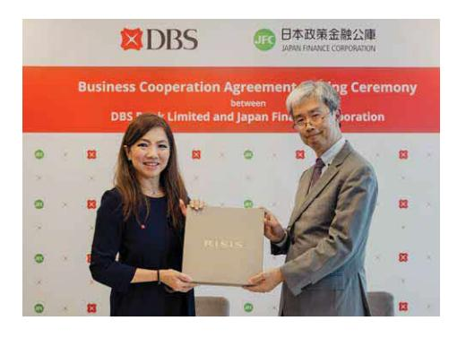

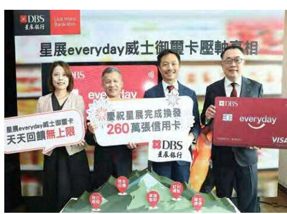

# **Key industry citations:**

*"DBS' decision to invest more heavily in digital solutions than its peers has paid off handsomely down the years. Its decision to invest big and early is key: it is a better provider of wealth-facing digital services than any other big lender in Asia."*

**World's Best for High Net Worth Euromoney**

*"DBS has demonstrated significant progress through its global connectivity strategy focusing on strategically selected gateway cities. By establishing local real estate teams in these key locations, DBS effectively supported clients as they expanded and diversified their operations. Client satisfaction and retention have been notable areas of strength for DBS."*

**World's Best Bank for Real Estate Euromoney**

*"Amid ongoing economic volatility and increasing scrutiny of digital currencies, financial institutions must contend with an ever-growing number of risks. DBS continues to be resilient in its risk management across its network and a bedrock of banking services for its clients in Asia."*

> **Asia's Safest Bank Global Finance**

**With our roots as the Development Bank of Singapore, we firmly believe in doing well by doing good. Global Finance recognised our role in driving the green transition with the "World's Best Bank for Sustainable Finance" award. In addition, it also acknowledged our efforts to integrate purpose with business by naming us "World's Best Bank for Social Bonds". Separately, the Securities Investors Association (Singapore) conferred on us the "Singapore Corporate Sustainability" award for a second consecutive year. This is a testament to our holistic sustainability strategy, which embeds environmental and social considerations into the fabric of our business.**

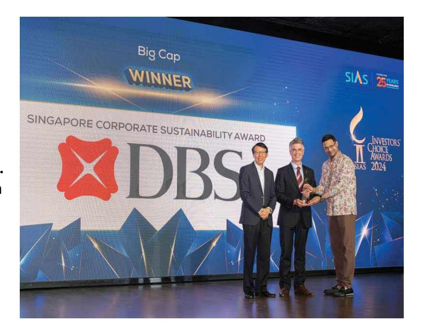

# **Who we are**

**Who we are**

**DBS is one of Asia's leading banks, operating in the most dynamic region of the world. We are focused on leveraging digital technology to reimagine banking to provide our customers a full range of services in consumer banking, wealth management and institutional banking. We also have a purpose beyond banking and are committed to supporting our customers, employees and the community towards a sustainable future.**

# **Business Highlights**

**Income** 

**SGD 22.3 billion**

**Net profit** 

**SGD 11.4 billion**

**Total assets** 

**SGD 827 billion**

**Return on equity**

**18.0%**

**Over**

**280,000**

Institutional Banking customers

**Over**

**18.4 million**

Consumer Banking/ Wealth Management customers

# **Sustainability Highlights**

**Committed**

**SGD 89 billion**

in sustainable financing, net of repayments

**Engaged over** 

**300**

policymakers, business leaders and community heroes at the DBS Foundation Impact Beyond Summit to tackle Asia's ageing challenge

**Committed over**

**SGD 100million** 

to support 16 new multi-year programmes and 22 Businesses for Impact to meet essential needs and foster inclusion across Asia

**Subsidised over** 

**SGD 14 million**

worth of everyday purchases for Singaporeans through the DBS Hawker Meals and POSB Support Our Heartlands programmes

**Equipped over**

**22,000 employees** with foundational sustainability knowledge

**Engaged in over**

**270,000hours** 

of employee volunteerism activities

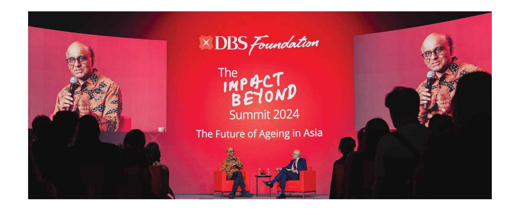

# Delivering impactful GROWTH

# for shareholders

Our multi-year structural transformation, growth in high-ROE businesses and diversified franchise across Asia have enabled us to deliver outsized returns to our shareholders.

# **Surpassing SGD 100** billion in market capitalisation

In May 2024, DBS became the first Singapore-listed company to cross SGD 100 billion in market capitalisation, which increased further to SGD 124 billion at year end. Total shareholder returns for 2024 were 51%, the highest in DBS' history outside crisis-rebound years, comprising a share price gain of 44% and a dividend return of 7%.

# **Solidifying our** wealth management

Our wealth management franchise extended its multi-year outperformance as high net worth clients increasingly diversified their investments in Asia. Total wealth management income rose 18% to SGD 5.22 billion, while wealth management non-interest income climbed 45% to SGD 2.60 billion, outpacing many regional and global peers. Testament to the strides we have made, we were named "World's Best for High Net Worth" by Euromoney.

We upped our stake in Shenzhen Rural Commercial Bank (SRCB), which gives us a good footprint in the Greater Bay Area, from 16.69% to 19.4%. We also deepened our partnership with the Postal Savings Bank of China and SRCB to enhance our Wealth Management Connect product offerings.

# **Reaping synergies** from Citi Consumer Taiwan acquisition

Following the successful integration of Citi Consumer Taiwan, we are reaping customer synergies from the acquisition. In particular, wealth management had a standout year as we successfully engaged the larger combined customer base on a broader suite of products. Income for Taiwan grew by 61% to a record SGD 1.2 billion.

# **Leveraging our** full-service platform to participate in India's growth

We leveraged our sizable footprint in India - the fastest-growing major economy in the world - to grow our business. Post the amalgamation of Lakshmi Vilas Bank, we now have a robust full-service platform spanning institutional, wealth and retail banking to more fully participate in India's growth. Income grew 25%, led by largecorporate banking, with SME and retail banking also seeing good traction.

# **New SGD 3 billion** share buyback programme

As part of the bank's continued commitment to capital management, we established a new share buyback programme of SGD 3 billion in which shares will be purchased in the open market and cancelled - a first for DBS This is among various capital management initiatives undertaken by the bank, which included a doubling of the ordinary dividend over the past five years including through a bonus issue, and occasional special dividends.

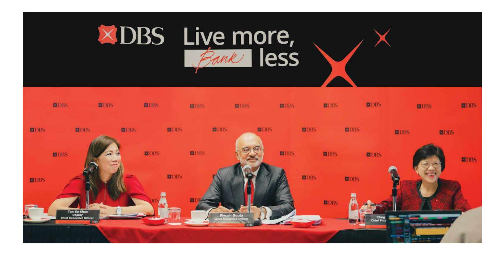

# Innovating impactful SOLUTIONS for customers

We leverage our technology capabilities, new ways of working and deep ecosystem partnerships to develop innovative solutions that create greater value for our 19 million customers.

# Dialling up our Al strategy to better serve our customers

Our data analytics and artificial intelligence (AI)/ machine learning (ML) initiatives delivered over SGD 750 million of economic value in 2024, more than double that in the previous year. We now have over 1,500 models across more than 370 use cases. They include sending more than 1.2 billion personalised nudges to more than 13 million customers across the region. In Singapore, those who engaged with the nudges and used our Al-powered financial planning tool saved two times more, invested five times more and were nearly three times more insured than non-users.

# **Doubling down on** anti-scam efforts

We continued to register strong traction for our suite of self-managed security features. Over 1.5 million customers in Singapore have leveraged these tools to protect themselves from scammers. To cater to customers' growing preference for greater control over the security of their funds, we added new features to make it even easier to lock their savings or file a card fraud dispute.

# **Extending our digital** payments leadership in Singapore

More than seven in 10 PayNow fund transfers and payments in Singapore today are performed by DBS customers. Our mobile wallet PayLah!, which marked its 10th year in service, hit a record 41.6 million logins a month, which included more than 60% of all scan-to-pay transactions in hawker centres, outpacing peers. Outside of Singapore, 2.8 million users can pay at over 77 million QR acceptance points worldwide. In the past year, cross-border QR payments made through PayLah! nearly tripled in transaction

# Supporting companies' supply chain diversification

We supported our customers' supply chain diversification by leveraging our extensive footprint in North, South and Southeast Asia. Coupled with our deep industry expertise and innovative financing solutions, we enabled our customers to capture investment opportunities and trade flows. Our ability to bridge East and West was an added advantage to Western multinationals expanding into Asia.

# Launching new blockchain solutions for institutional customers

We introduced DBS Token Services, a suite of blockchain-powered services leveraging tokenisation and smart contracts, to unlock new transaction banking capabilities and operating efficiencies for our institutional clients. Early adopters include Ant International, which has been using the service for instant multi-currency treasury and liquidity management.

# **Futureproofing** SMEs for the new economy

Our Bridging Business Horizons Programme helps SMEs in Singapore expand overseas and capture regional business opportunities. This has helped to facilitate about 1,000 regional business connections and engagements since its launch. Our Spark GenAl Programme aims to accelerate the adoption of Gen Al solutions among SMEs.

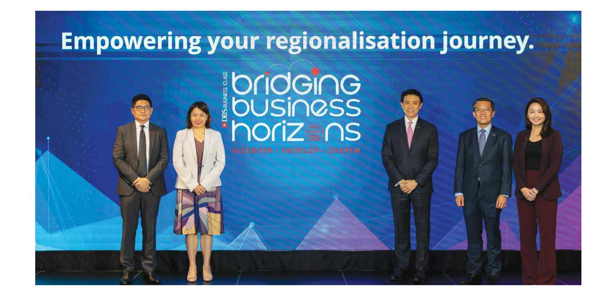

DBS Annual Report 2024 • Making Greater Impact Creating an impactful future for society

# Creating an impactful FUTURE for society

Our roots as the Development Bank of Singapore have made purpose a part of our DNA. Be it partnering our clients in transitioning to lower-carbon business models or uplifting vulnerable communities, we are committed to making an enduring and meaningful impact for a better world.

# Enal deca jour

# Enabling Asia's decarbonisation journey

We grew our sustainable financing commitments, net of repayments, to SGD 89 billion. Highlights included a green loan issued under the People's Bank of China's Carbon Emission Reduction Facility—the first such transaction by a Southeast Asian bank. We also structured Indonesia's first blended project in the water sector, which involved the development of a treatment plant which will deliver fresh water to two million people across three cities including Jakarta.

We partnered Enterprise Singapore to launch the ESG Ready Programme, an end-to-end programme to help SMEs and mid-sized corporations build capability and capacity in sustainability. To date, over 250 companies have registered for the programme. We have since replicated this programme in Taiwan. In Hong Kong, we worked with Link and CLP Power on a programme to help Link's SME tenants transition to lower-carbon operations.

# Catalysing efforts to support vulnerable communities in Asia

DBS Foundation turned 10 in 2024. Since its establishment a decade ago, the Foundation has supported 161 Businesses for Impact and forged 37 community programmes across the region. In 2024, it committed over SGD 100 million to support 16 new multi-year programmes with partners and 22 Businesses for Impact to meet essential needs and foster inclusion across Asia.

# Tackling the challenge of ageing societies in Asia

With many markets in Asia fast becoming super-aged societies, we launched a new Impact Beyond Award to scale innovative solutions which address this challenge. Our inaugural DBS Foundation Impact Beyond Summit also brought together businesses, longevity experts and the social sector to redefine the ageing narrative and unlock socio-economic opportunities for ageing populations.

# Bolstering financial, digital and anti-scam literacy efforts

Together with the DBS Foundation and ecosystem partners such as the Infocomm Media Development Authority in Singapore, our employees reached out to more than 90,000 people through interactive workshops in schools and heartland communities in Singapore. These sessions imparted practical, hands-on digital and financial knowledge including that on fraud prevention.

# Ramping up employee volunteerism regionally

From championing financial and digital inclusion for vulnerable communities to improving access to essential needs, our employees collectively contributed over 270,000 hours through our People of Purpose employee volunteerism movement. Our efforts impacted more than 220,000 lives across our markets. All in, we expect our employees to volunteer 1.5 million hours over the next decade to give back to society.

DBS Foundation commemorated 10 years of impact alongside more than 1,300 of our ecosystem partners, beneficiaries and colleagues who have been pivotal to the Foundation's journey.

# **Board of Directors**

**The Board is committed to helping the Group achieve long-term success. The Board provides direction to management by setting the Group's strategy and overseeing its implementation. It ensures risks and rewards are appropriately balanced.** 

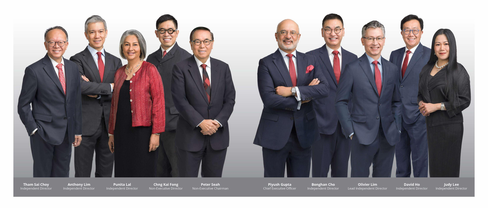

# **Highly experienced**

Highly experienced Board with deep financial sector expertise and extensive experience in related industries. Deliberations also benefit from diverse perspectives shaped by varied geographical experience.

# **Independent**

Majority of our Board comprise independent and non-executive directors.

# **Diverse**

Good mix of nationalities, gender and backgrounds.

# **Award-winning**

**11** 

Awarded the 'Most Transparent Company Award, Financials Category' by the Securities Investors Association of Singapore at the Investors' Choice Awards.

# **Group Management Committee**

**The Group Management Committee executes the strategy and long-term goals of the Group. It drives business performance and organisational synergies. It is also responsible for protecting and enhancing our brand and reputation.** 

# **One in four of our Group Management Committee members are women.**

**Group Management Committee members have more than 30 years of experience on average.** 

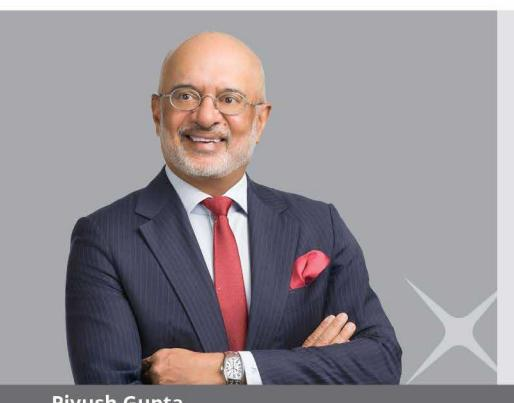

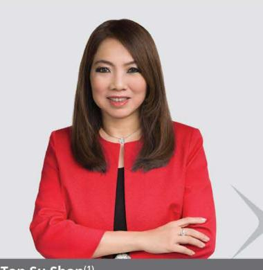

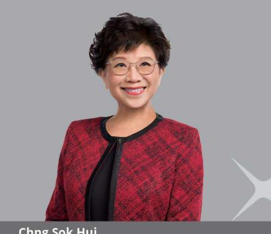

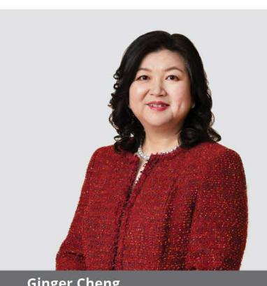

**13** 

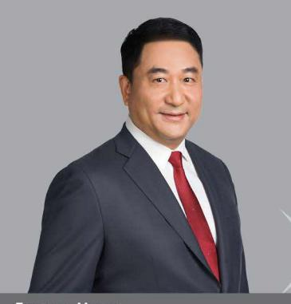

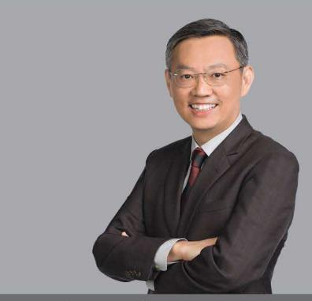

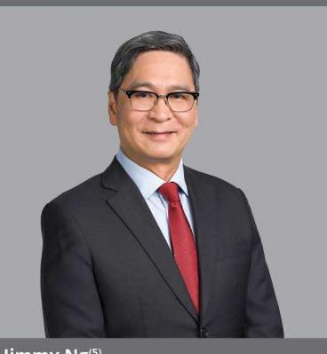

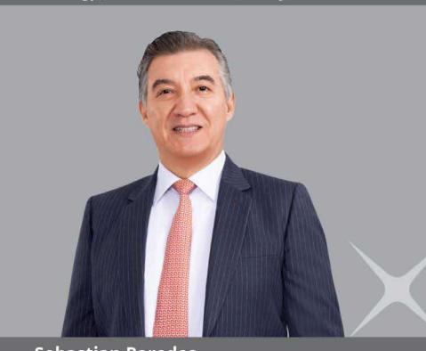

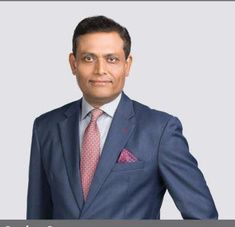

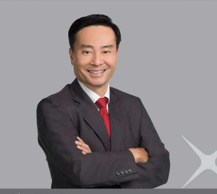

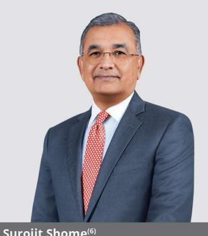

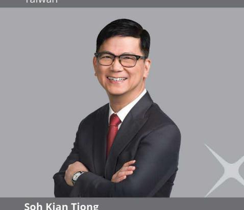

All designations are as at 31 December 2024. Those marked by the spark are also in the Group Executive Committee.

- (1) Succeeded by Han KweeJuan as Group Head of Institutional Banking on 1 January 2025.
- (2) Appointed Group Chief Operating Officer from 1 April 2025.
- (3) Appointed Group Head of Institutional Banking from 1 January 2025. (4) Appointed Country Head of DBS Singapore from 1 January 2025.
- (5) Retiring on 1 July 2025. Appointed Senior Advisor for the bank's artificial intelligence efforts until 31 December 2025.
- (6) Retired on 28 February 2025. Succeeded by Rajat Verma on 1 March 2025.

**In May 2024, DBS blazed a trail by being the first Singapore-listed company to cross SGD 100 billion in market capitalisation. Since 2009, our market capitalisation has quadrupled even while we paid out SGD 40 billion in dividends.** 

The global economy was resilient in 2024. The US economy continued to outpace expectations by growing 2.8% from strong consumer demand. Global growth also generally held up. While China and Hong Kong experienced slower growth, Singapore's economy expanded 4.4%, marking a strong rebound from just 1.8% the year before. India, a market where we now have a sizeable footprint, continued to be the fastest-growing major economy in the world.

Inflationary pressures eased during the year. With the US Consumer Price Index declining from 3.4% at end-2023 to 2.9% at end-2024, the US Fed cut interest rates for the first time in four years in September, by 50 basis points, followed by two more rate cuts of 25 basis points each. Other developed market central banks followed suit. The cuts, telegraphed well ahead of time, unleashed animal spirits and buoyed financial markets in the latter part of the year.

Macroeconomic conditions were, however, tempered by persistent geopolitical tensions and by policy unpredictability from an impending Trump presidency. At the same time, expectations for further rate cuts were moderated towards the end of the year as progress towards the Fed's inflation target of 2.0% appeared to stall.

Against this backdrop, we delivered a solid financial performance. DBS was also named Safest Bank in Asia by Global Finance for the 16th consecutive year.

# **Another record year**

For the year, DBS delivered record total income of SGD 22.3 billion. Net profit rose 11% to an all-time high of SGD 11.4 billion. Return on equity (ROE) was 18.0%, which was one of the highest among developed market banks.

The solid financial performance belied challenges we faced from muted loan growth. Weak investment sentiment in Hong Kong and China impacted loan demand, while Chinese companies

tapped lower-cost funding onshore. Despite these headwinds, we managed to grow net interest income (NII) by 6% through judicious

balance sheet management.

In 2021, before interest rates rose, DBS had an NII sensitivity of SGD 18-20 million per basis point of Fed funds rate. This meant that through the interest rate upcycle over the past two years, a 1 basis point hike in the Fed funds rate increased our NII by up to SGD 20 million. To cushion against a reversal of similar quantum should the interest rate cycle turn, we took proactive steps to increase fixed-rate assets and extend asset duration. Coupled with changes to our funding profile, our NII sensitivity fell to SGD 4 million in 2024, helping to mitigate the impact of US Fed rate cuts, allowing NII to rise through balance sheet growth.

Commercial book non-interest income rose 22% to a record SGD 6.33 billion, bolstered by buoyant investor sentiment which propelled wealth management fees and treasury customer sales to new highs. Markets trading income was 27% higher at SGD 922 million.

Asset quality remained resilient, with the non-performing loan ratio stable at 1.1%.

# **Significant shareholder value creation**

In May 2024, DBS blazed a trail by being the first Singapore-listed company to cross SGD 100 billion in market capitalisation. Total shareholder returns for 2024 were 51%, the highest in DBS' history outside crisis-rebound years, comprising a share price gain of 44% and a dividend return of 7%.

Record earnings and confidence in our continued performance drove these returns. They also reflected the market's recognition of DBS' franchise strength wrought from our 15-year structural transformation.

In 2010, our first year together as Chairman and CEO, we set out to become the "Asian

bank of choice". At the time, DBS was primarily a two-market bank, with a meaningful presence only in Singapore and Hong Kong. Our ROE stood at just 8.4% the previous year. We served five million customers, mostly in Singapore, and had the lowest customer satisfaction scores among the Singapore banks.

We have come a long way since then. The market now sees us as a best-in-class Asian bank, and also among the world's best, as testified by our multiple World's Best Bank award wins. Since 2009, our net profit has grown fivefold, and our ROE more than doubled. We re-established market share leadership in Singapore, while high-ROE regional businesses (wealth management, transaction services and treasury customer sales) now contribute 50% of group income. Our customer base has almost quadrupled to 19 million across Asia, with high customer engagement scores across customer segments. We have also digitally transformed the organisation.

Since 2009, our market capitalisation has quadrupled even while we paid out SGD 40 billion in dividends. DBS' total shareholder returns since the end of 2009 ranked in the top decile of the world's 100 largest banks.

# **Building a robust franchise**

DBS' diversified engines of growth – across geographies and businesses – have been a source of strength, enabling us to buffer against a slowdown in any single part of the franchise.

As an example, for the first half of the last decade, we rode on China's strong growth and grew our business as China opened up. In the last couple of years, with China experiencing a slowdown, we focused our growth efforts on India and Taiwan.

In 2024, income in India grew 25% as we leveraged our full-service platform spanning institutional, wealth and retail banking to more fully participate in India's growth. In particular, with our increased breadth and scale, we saw robust growth in our India assets led by large-corporate borrowing, including in our GIFT City branch. Our SME business saw improving momentum while consumer banking had good traction.

In Taiwan, DBS is now the largest foreign bank following the successful integration of Citi's consumer banking business. Despite facing higher-than-expected attrition from among the Citi employees, we continued to deliver strong customer outcomes. Income grew 61%, close to projections, driven by the full-year contribution from the Citi portfolio and customer synergies from the acquisition. In particular, wealth management had a standout year as we successfully engaged the larger combined customer base on a broader suite of products.

Notwithstanding a slowing China, we saw pockets of opportunity. They included the Greater Bay Area (GBA) Wealth Management Connect 2.0 as well as increased demand from mainland Chinese companies wanting to diversify their supply chains into Southeast Asia. We made two strategic investments which will position us well in the long term. We upped our stake in Shenzhen Rural Commercial Bank, which gives us a good footprint in GBA, from 16.69% to 19.4%. We also increased our stake in DBS Securities China from 51% to 91%.

In 2024, we also merged our equity capital markets unit, DBS Vickers and DBS Digital Exchange with the Treasury Markets business, forming Global Financial Markets. The merger has provided greater synergy and allows us to more holistically meet our customers' needs. Our new business engines also fared well, with income from our digital asset ecosystem now above SGD 30 million amid growing interest by institutional investors in the trading and custody of digital assets.

# **SGD 22.3 billion**

### **Total income**

Total income grew 10% to SGD 22.3 billion from broad-based growth.

# **SGD 11.4 billion**

### **Net profit**

Net profit rose 11% to an all-time high of SGD 11.4 billion.

**18.0%**

### **Return on equity**

Return on equity was sustained at the previous year's record. At 18.0%, our ROE is one of the highest among developed market banks.

**SGD 2.22**

# **Dividend**

The Board proposed a final dividend of 60 cents per share, bringing the full-year ordinary dividend to SGD 2.22 per share, an increase of 27% from the previous year.

**Letter from Chairman & CEO 16** DBS Annual Report 2024 **Making Greater Impact 17**

# **A word from our Chairman**

# **Leadership Transition**

The Board and I would like to extend our heartfelt thanks to Piyush for his exceptional leadership and dedication throughout his tenure as CEO. Under his stewardship, DBS has evolved into one of Singapore's most iconic institutions and a global financial powerhouse, with an ROE that places us among the top-performing banks globally.

Our strong performance reflects the structural changes Piyush has implemented over the past decade, especially the digital transformation and growth of high-ROE businesses such as wealth management, transaction services and treasury customer sales. He has built an enduring legacy through his visionary leadership, establishing the cornerstone for DBS to reach new heights in the years ahead.

As we honour Piyush's achievements, we look forward to a new chapter under Su Shan, who will succeed him in March 2025. Planning for the CEO succession has been a decadelong strategic initiative, with potential successors identified and rotated through key roles, and their performance closely assessed.

In 2021, when Piyush informed the Board of his intention to retire after turning 65, the Board expedited the succession process by engaging an independent consultant to benchmark external candidates against internal ones using six key criteria: strategic vision, leadership and culture, domain knowledge, stakeholder management and communication, familiarity with technology and the future of work, as well as business-building ability. After thorough evaluations conducted by the Board and the independent consultant, Su Shan emerged as the standout candidate to succeed Piyush as CEO.

Su Shan possesses extensive experience, having managed the bank's two customer-facing divisions, Consumer Banking Group/ Wealth Management (CBG/ WM) and Institutional Banking Group (IBG), which together contribute the lion's share of its income. She played an instrumental role in transforming the Wealth Management business, with DBS Private Bank now one of Asia's top three, and in scaling Global Transaction Services, which expanded the bank's low-cost deposit base.

She has also been pivotal in developing major digitalisation initiatives such as DBS digibank, PayLah! and iWealth, leading the IBG team in revitalising the IDEAL app and implementing an API suite for real-time digital banking. Additionally, she drove the development of a number of AI models and spearheaded efforts to apply generative AI within the bank.

She also has broad international exposure, having worked in global financial centres such as London, Tokyo and Hong Kong. She has served on various boards in government, finance, education, women's leadership and entrepreneurship.

The Board and I are confident in Su Shan's ability to lead the bank given her track record, disciplined execution and strong business acumen. We take pride that she is a homegrown talent, reflecting our commitment to developing a local talent pipeline. With a profound understanding of Singaporeans' perspectives, a passion for flying the Singapore flag high, and a resonance with DBS' core mission, she is poised to drive the bank's continued success.

# **Maturing new ways of working**

To create a sustainable advantage, DBS continued to industrialise the use of data analytics and artificial intelligence (AI)/ machine learning (ML). In 2024, data analytics and AI/ ML delivered economic value of SGD 750 million, more than double the previous year. We also started piloting several Gen AI use cases to drive productivity and efficiency gains, create value through better customer engagement and new customer propositions, and potentially open new segments and markets.

DBS' focus on Managing through Journeys, a process we started three years ago, matured further. By organising ourselves horizontally with cross-functional teams formed around customer journeys and guided by real-time data, we continued to improve customer satisfaction and turnaround times, which in turn contributed to higher income. For example, in 2024, we halved the time taken to implement SME payment and collection API mandates in Singapore. We also achieved above-target customer engagement scores across various businesses including Deposits and SME Hong Kong.

# **Enhancing technology resiliency and governance**

Strengthening the bank's technology resiliency remained a priority for much of 2024, and significant progress was made. We tightened our change management processes, simplified our systems architecture and reduced single points of failure. We also enhanced our ability to more quickly identify incidents and resolve them. While a small number of long-tail initiatives remain in progress, we believe most of our technology resiliency gaps have been closed.

In view of this, the Board Risk Management Committee Technology Risk Committee (BTRC) – which was established to strengthen technology risk governance and oversight – was dissolved in January 2025. In its place, the Board Technology Committee (BTC) was set up with a wider mandate. The BTC took over the responsibilities of the BTRC while also having oversight of the Group's technology strategy and architecture. This is important as technology becomes all-pervasive, and as the bank continues to balance innovation (such as in the areas of AI and blockchain) and resiliency.

# **Advancing the sustainability agenda**

Earlier this year, a number of large banks withdrew from the Net Zero Banking Alliance, the banking sector's largest climate-focused alliance. Notwithstanding this, DBS remains committed to enabling a just transition within the context of Asia that balances environmental, social and economic considerations. Climate change is a real issue that needs addressing; we believe that in finding solutions to tackle the "wicked" problems facing our environment, there are business opportunities too.

DBS was the first bank in Southeast Asia to set decarbonisation targets. As we partnered more businesses in their transition to lowercarbon business models, our sustainable financing commitments, net of repayments, rose 27% to SGD 89 billion in 2024. Beyond financing, we also empowered our RMs with tools and dashboards so they can better advise clients on their decarbonisation plans.

Since it was established a decade ago, DBS Foundation has supported 161 Businesses for Impact and forged 37 community programmes across the region. To further

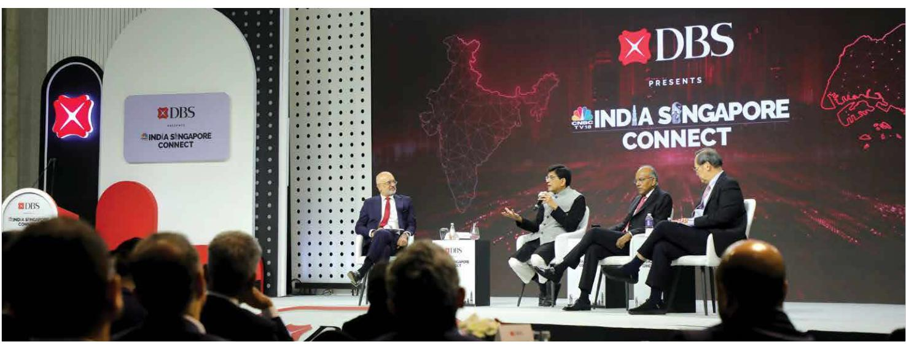

*To commemorate DBS' 30 years in India, the bank held an India-Singapore summit to foster a deeper exchange of ideas and collaboration between the two countries. In attendance as Guests of Honour were India's Minister of Commerce and Industry Piyush Goyal, Singapore's Minister of Home Affairs and Minister of Law K. Shanmugam and Singapore's Minister for Manpower and Second Minister for Trade and Industry Tan See Leng.* 

intensify our social impact, we have committed up to SGD 1 billion and 1.5 million volunteer hours over the next 10 years to improve the lives and livelihoods of the low-income and underprivileged. In 2024, we committed more than SGD 100 million to support various multi-year programmes to meet essential needs and foster inclusion across Asia.

# **Leadership changes**

Apart from the forthcoming CEO leadership change, we made several other key management changes.

In May 2024, we named technology veteran Eugene Huang as CIO. Eugene joined DBS from Ping An Group, where he led the technology unit.

Effective 1 January 2025, we appointed Han Kwee Juan and Lim Him Chuan to new roles. Kwee Juan, previously Singapore Country Head, took over as Group Head of Institutional Banking, stepping into the role Su Shan relinquished. Him Chuan, formerly Group Head of Strategy, Transformation, Analytics & Research, was named Singapore Country Head.

In India, Rajat Verma, Head of IBG, succeeded Surojit Shome as CEO when the latter retired on 28 February 2025. Since joining DBS in June 2023, Rajat has solidified our India IBG business.

Derrick Goh, presently Group Audit Head, will assume the role of Group Chief Operating Officer overseeing both Operations and Transformation Group from 1 April 2025. Koh Kar Siong, presently Group Head of Corporate and SME Banking, will take over as Group Audit Head.

The moves reflect the strength of DBS' talent management programme and the robust bench we have built over the years.

# **Rewarding shareholders and employees**

We are committed to capital management. We substantially increased the amount of ordinary dividends and paid occasional special dividends in recent years.

In 2024, we added to our capital management toolkit. In February, we announced a one-for-10 bonus issue, which effectively raised dividend payouts by 10%. In November, we launched a SGD 3 billion share buyback programme, marking the first time that shares will be repurchased and cancelled. From financial year 2025, a Capital Return dividend will be introduced.

Given the record profit and strong capital base, the Board proposed a final dividend of 60 cents per share, bringing the full-year ordinary dividend to SGD 2.22 per share, an increase of 27% over the previous year.

A special bonus of SGD 1,000 each, indexed to purchasing power parity in markets outside Singapore, was also paid to all staff except senior managers as an additional reward for their contribution to the record performance.

# **Conclusion**

Overall, the business environment for 2025 appears to be stable. However, macroeconomic and geopolitical risks remain. A slowing China, military conflicts and a potential escalation of tariff wars under a Trump administration all add to the uncertainty.

For DBS, declining interest rates will also be a source of potential headwinds. Nevertheless, our franchise is resilient. Our NII sensitivity is substantially lower than previous years. Our balance sheet is solid, and we have maintained strong general provisions and capital buffers

which will help cushion risks. Barring any unexpected global shocks, we expect pre-tax profit to be around 2024 levels.

Having been at the forefront of digital transformation, we will continue investing in technology. Our early moves in data have created a competitive differentiation. Importantly, our people have embraced AI and Gen AI which will fundamentally change the way we work. We will also continue to advance the sustainability agenda, partnering clients in their transition to lower-carbon business models, as we execute on our net-zero commitments.

DBS has created significant value for all our stakeholders – shareholders, customers, employees and society – over the years. In 2024, we made an even greater impact – the culmination of a multi-year effort to stay at the forefront of banking, be customer-focused and embody "doing well by doing good".

**Peter Seah Chairman DBS Group Holdings**

**Piyush Gupta Chief Executive Officer DBS Group Holdings**

**15 years of leading with excellence 18** DBS Annual Report 2024 **Making Greater Impact 19**

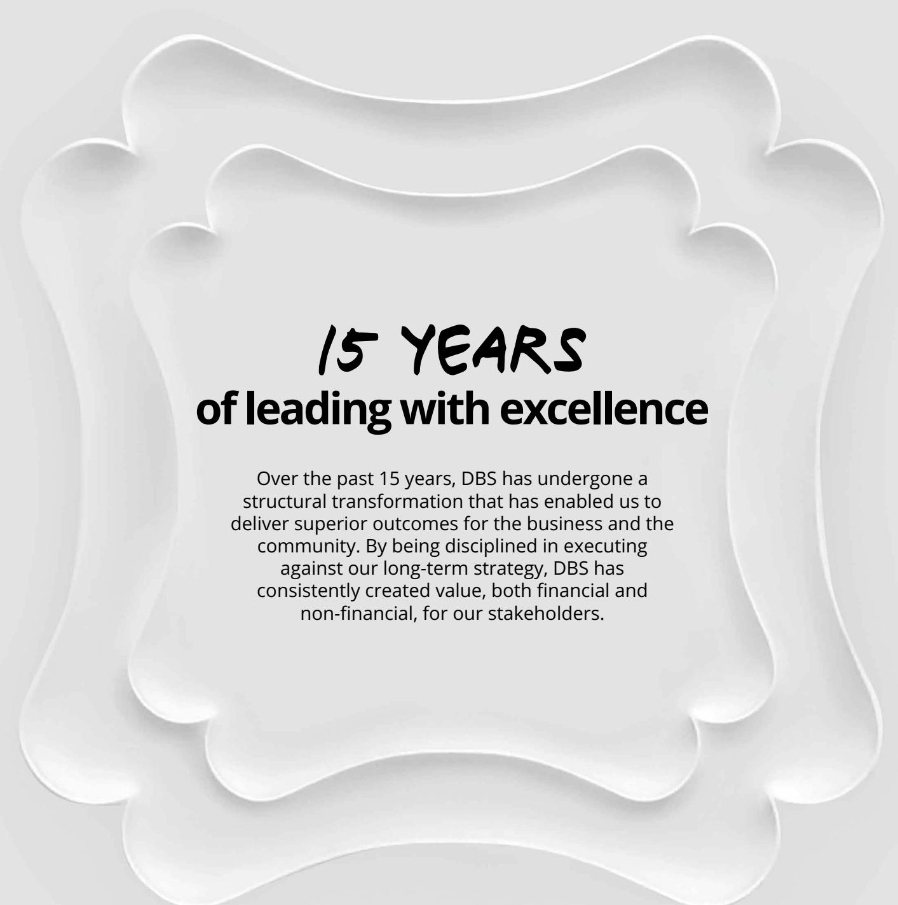

# **Delivering sustainable growth**

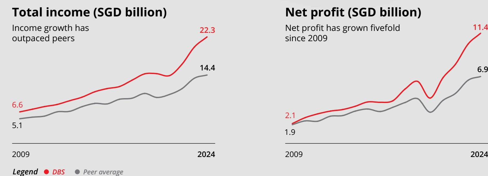

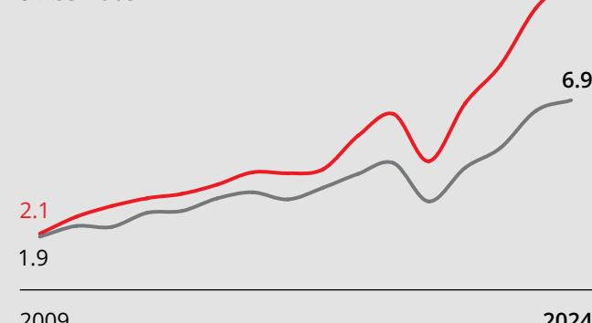

**11.4**

# **Income mix (%)**

Percentage of group income from high-ROE segment has doubled from 24% in 2009 to 50% in 2024

# **Return on equity (%)**

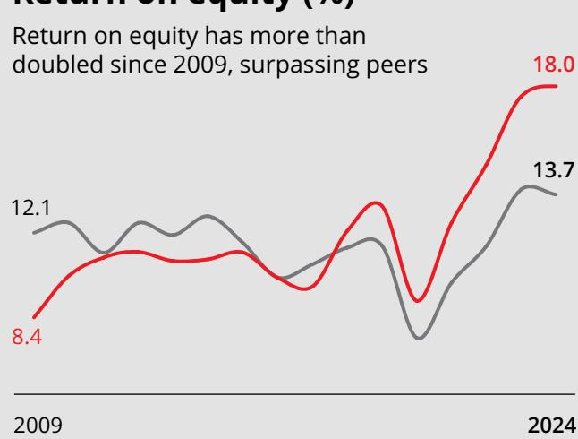

# **Total shareholder return (%)**

Annualised total shareholder return of 13% since end-2009

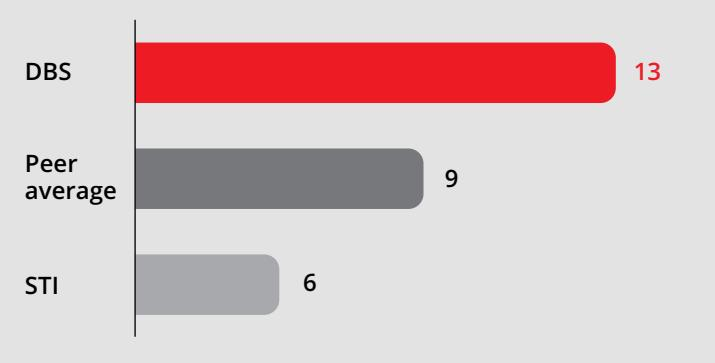

# **Market capitalisation (SGD billion)**

DBS' market capitalisation crossed SGD 100 billion in 2024 – a first for a Singapore-listed company. It has quadrupled since 2009.

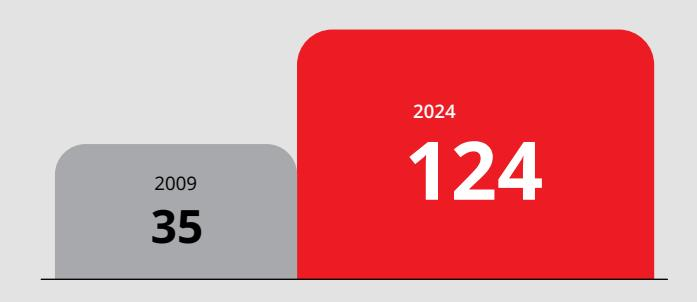

# **Global comparison**

ROE of 18.0% for latest financial period as well as annualised TSR of 13% since end-2009 in top decile of 100 largest banks by assets.

# **Return on equity (ROE)**

**DBS' 18.0% ROE places it 7th among global peers**

# **Growing with purpose**

# **Customers**

We have grown our customer base substantially on the back of organic growth, strategic acquisitions as well as the strength of our ecosystem partnerships. **Employees**

# **Consumer Banking/ Wealth Management**

2009

4.9m

**2024**

**>18.4m**

# **Institutional Banking**

2009

**2024**

>180,000

**>280,000**

While our workforce has nearly tripled, we have continued to build a positive work culture. Since 2016, we have received the Best Employer Award from Kincentric / Mercer which recognises leading employers worldwide using the most objective measure possible – employee opinion.

# **Total employees**

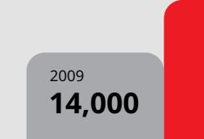

**14,000 41,000 2024**

# **Employee engagement score**

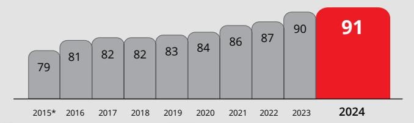

*\* Transited to a new methodology from 2015*

# **Society**

We have made a significant impact on society through the DBS Foundation and other community programmes in the markets we are in.

# **Upsizing our commitment to the community from 2024**

**SGD 1b**

committed over 10 years to foster inclusion and provide essential needs to Asia's vulnerable

**1.5m**

volunteer hours over 10 years to give back to society

# **DBS Foundation – creating impact beyond banking since 2014**

**SGD 130m**

in funding committed

**161**

Businesses for Impact supported

**37**

community programmes forged with partners in our six core markets

**>1m**

volunteer hours contributed through our People of Purpose employee volunteerism movement

# **Other community initiatives**

**SGD 25m**

donated to the National Gallery Singapore in support of the Gallery's efforts to tell the Singapore story through visual arts

**SGD 10.5m**

for the DBS Stronger Together Fund to support hard-hit communities in our key markets during Covid-19

# **Awards & accolades**

Safest Bank in Asia 16 consecutive years 2009 - 2024

World's Best Bank 2022

World's Best Bank 2021

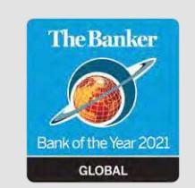

Global Bank of the Year 2021

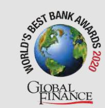

Best Bank in the World 2020

World's Best Bank 2019

Global Bank of the Year 2018

Best Bank in the World 2018

**CEO reflections**

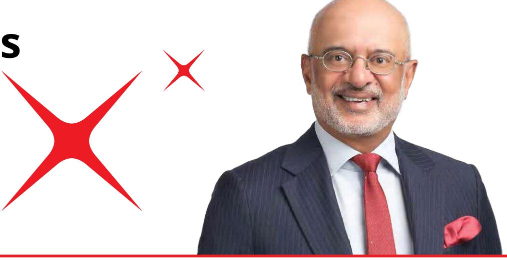

In less than a month, I will be retiring from DBS after 15 years at the helm. Looking back, this has without a doubt been the most fulfilling part of my entire career. When I joined the bank in November 2009, the industry was in the throes of the global financial crisis. DBS had an impressive pedigree and many strengths, including a solid deposit franchise in Singapore and a meaningful Asia network, but also untapped potential. At the start, we set out to build the "Asian bank of choice for the new Asia"; some years later, as fintechs threatened to encroach into our space, we further redefined banking by leveraging technology. In the process, we put DBS on the map with multiple global Best Bank accolades.

Reflecting on what made DBS' digital transformation successful, a few things come to mind. First, the transformation was pervasive – we transformed everything from the technological architecture in the backend to customer interfaces at the frontend. Second, we moved away from product siloes to thinking about customer journeys. Third, we changed the bank's culture such that the workforce increasingly embraced innovation, experimentation and some degree of risktaking. Fourth, we put in place a system to measure progress.

Of these, effecting culture change was arguably the most challenging but also the most game-changing. While conventional wisdom is that it is difficult for a legacy company to transform at scale – with some companies preferring to keep the old and new organisations separate – we were committed to taking all our employees along in the journey. More than that, instead of trying to change culture by diktat, we established a common vision and equipped our people with the frameworks and tools to embrace a new way of working – creating "culture by design". By adopting a ground-up approach, we were able to have a thousand flowers bloom. I saw clearly what Peter Drucker, the famed

management guru, meant when he said, "Culture eats strategy for breakfast." Today, DBS is more entrepreneurial, daring, agile and adaptable than before.

I am confident that Su Shan will take the bank to the next level by building on the strengths that set us apart:

- **•** Being purposeful and collaborative. With its roots as the Development Bank of Singapore, DBS has the ethos of wanting to do real things for real people deeply embedded in its DNA. Such a desire to make a difference for customers and society is quite unusual in today's world. It allows everyone to work together for a common good instead of putting individual agendas first. By creating an environment that fosters trust, it also supports a greater degree of risk-taking and, in turn, the agility we have as a company.
- **•** Leveraging technology. I believe we have largely accomplished the goal we had set for ourselves in 2014, of creating a different kind of bank and redefining our category. However, in the next three to four years, we have to take another big leap forward. While we have shifted a lot of applications to the new tech stack, there are still several more to be moved. There is also the need to simplify and standardise our architecture and processes to the next level.
- **•** Leveraging Artificial Intelligence (AI), especially Gen AI. AI is already proving to be game-changing in improving our ability to predict customer behaviours and response patterns. We have over 1,500 models running across more than 370 use cases in the bank. That is clearly a leadership position in our industry. But the big tech firms have a hundred times more models and use cases, so we have a lot of scope to improve further.

Additionally, from the various use cases we piloted in the past 12 months, it is clear that Gen AI will have a profound impact on the nature of work and jobs. We have to fully embrace the possibilities, which should lead to a fundamental rethink of our operating models and even the creation of new business models.

**•** Harnessing Managing through Journeys (MtJs). Competitive advantage in the future will come from how we work, not just what we do. With the exponential speed at which technology is evolving, it is difficult to predict what the future will hold. We implemented MtJs to foster working in horizontal organisations, be totally data-driven, and have the nimbleness to experiment and innovate at the coalface. We have made good progress in MtJs, and I am confident that if we keep it our way of life, we will continue to win.

I would like to express my immense gratitude to the Board, Group Management Committee and my 41,000 colleagues for the incredible journey – it was only together that we were able to accomplish what we did. I shall miss the camaraderie and the magic that happens when a purpose-driven company is motivated by a common goal: to enrich the lives of individual customers and transform businesses. It has truly been a privilege, and I am secure in the belief that under Su Shan's leadership, the bank will go from strength to strength.

**Piyush Gupta Chief Executive Officer** 

**DBS Group Holdings** 

**Deputy CEO reflections**

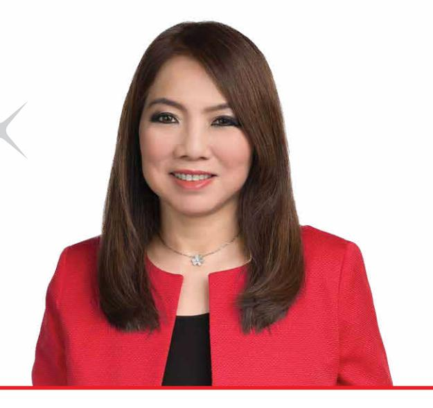

DBS' transformation over the last 15 years has been exceptional. Strategic initiatives propelled us from an underperforming domestic franchise to one of the world's best banks.

Leading the bank's two customer-facing divisions, Consumer Banking Group/ Wealth Management and Institutional Banking Group, over this period has been an invaluable experience. Operationalising our digitalisation strategy, I learnt early on about the importance of personally owning every digital journey. At the same time, understanding the intricacies of our business and culture has allowed me to build teams that perform at their full potential.

Our achievements speak for themselves. In wealth management, we established the foundations of an integrated wealth continuum and built on our proposition as a safe bank by developing a suite of smart solutions. Today, we have scaled the franchise into one of the region's largest and most profitable private banks. In institutional banking, we leapfrogged the competition by simplifying the banking journey for customers. We did this by implementing a suite of APIs and digital banking solutions that enabled real-time transactions and powered our customers' digital transformation journeys.

Looking ahead, we will continue to face uncertainty in the macroeconomic environment and geopolitical landscape, with potential policy shifts that could disrupt supply chains and cause market volatility. We are proactively addressing these challenges.

Internally, we have implemented rigorous stress tests across various risk parameters, as well as leveraged technology to automate processes and improve our agility in responding to changing conditions.

Externally, we have supported our customers by offering bespoke financial advice, innovative hedging and investment solutions, and alternative strategies for managing supply chain disruptions.

Meanwhile, technological developments, particularly generative AI, have already brought about profound changes and will continue to disrupt business models. At the same time, societal challenges continue besetting the world – (i) climate change (ii) demographic shifts (iii) rising income inequality and (iv) issues of trust. The backdrop of uncertainty presents both challenges and opportunities.

To build on what we have achieved, I will characterise the way forward through four Cs – Continuity, Culture, Customer and Connectivity:

First, Continuity. Our overarching vision has been to build the Best Bank for a Better World. Our strategy has been formulated based on the megatrends – of a rising Asian century, digitalisation and sustainability. These will not change in the foreseeable future. Continuity is preserved throughout the organisation, from the Board and senior management to the cadence of our internal rituals of scorecard setting, and the way we manage. This ensures we remain clear in our objectives, builds resilience in our operations and preserves the trust of our stakeholders.

Second, Culture. Being purpose-driven and creating an impact beyond banking is deepseated in our roots as the Development Bank of Singapore, as well as in POSB's motto of being "Neighbours first, bankers second". It is our culture that unites us and drives us to achieve greater heights. In a rapidly changing world, we will need to constantly think about new target operating models, new skills, and new ways of working to stay ahead. Our culture underpins our ability to do so, and ensures that we are ready to reinvent ourselves when needed.

Third, the Customer remains at the centre of everything we do. Our policies and processes have embedded this mindset while pivoting to a horizontal structure has enhanced it. As a result, we can quickly adopt the customer's evolving perspective and leverage data-driven experimentation to optimise our offerings. This relentless customer focus preserves our relevance. It shapes our ability to deliver future-ready solutions and a differentiated customer experience which ultimately builds trust and wins us market share.

Fourth, Connectivity, both internally and externally, remains a core driver of our business. Externally, we will continue to leverage our extensive regional network and suite of digital solutions to embed ourselves deeper in customer journeys and industry ecosystems. Internally, we will further connect the dots across business units to amplify a holistic one-bank solution. While our efforts have already borne fruit with the rapid growth of high-ROE franchises, there is still a long runway ahead.

In summary, the last 15 years have shaped us into a high-performing, high-returns institution and I am intimately aware of the factors that have made us successful. The ROE we achieved in 2024 is one of the highest among developed market banks. While there are challenges ahead, opportunities abound. The strategic moats we have built mean our successes are not easy to replicate and there is momentum in our business. Our strategic vision will preserve our relevance and ability to stay ahead. As such, we are in a strong position to continue delivering healthy shareholder returns and outperforming peers.

**Tan Su Shan Deputy Chief Executive Officer DBS Group Holdings** 

**CFO statement 24** DBS Annual Report 2024 **Making Greater Impact 25**

# **CFO statement**

**We achieved new highs for total income and net profit in 2024, while sustaining ROE at the previous year's record. The results reflect the fruits of our digital transformation and deft balance sheet management.**

# **Record performance enabled by digital transformation and balance sheet management**

We achieved another record performance in 2024. Net profit rose 11% to SGD 11.4 billion while return on equity of 18.0% was sustained at the previous year's record and was one of the highest among developed market banks globally.

Total income rose 10% to SGD 22.3 billion. Net interest income increased 6% due to balance sheet growth as we deployed funding into low-risk securities amidst tepid loan growth. Net interest margin was stable despite falling interest rates in the second half and moderately higher deposit costs.

Non-interest income was the star performer as greater market clarity on the macroeconomic outlook buoyed investor confidence and fuelled wealth management activity. As a result, fee income grew 23% to cross SGD 4 billion for the first time and treasury customer income reached a new high.

Markets trading income rebounded as FX, interest rate and equity derivative activities benefited from market volatility.

The cost-income ratio was unchanged at 40%. Asset quality was sound. Non-performing assets were little changed as new nonperforming asset formation was offset by upgrades, repayments, and write-offs. The NPL ratio of 1.1% was unchanged. Specific allowances remained low at 13 basis points of loans.

Two factors drove the record performance.

The first was deft balance sheet management. After naturally benefiting from rising interest rates in the previous two years, we acted to pre-empt the impact of falling rates by locking in asset yields for extended durations. Our fixed-rate assets were SGD 200 billion or about one-third of our commercial book at year-end and comprised fixed-rate

mortgages, interest rate swaps and fixedincome securities. The switch by customers from current and savings accounts (Casa) to higher-yielding fixed deposits when interest rates were rising had also reduced the impact of interest rate movements.

As a result, the sensitivity of net interest income to one basis point of the US Fed funds rate, which had been as high as SGD 18 million to 20 million at the start of the interest rate upcycle, fell significantly to SGD 4 million in 2024. With the impact of falling interest rates having become muted, balance sheet growth during the year enabled net interest income to continue to grow.

The second and more longstanding factor was our digital transformation. By increasing the ease and convenience of carrying out transactions – and increasingly with greater personal customisation – our digitalisation has enabled us to gain market share in Casa deposits, investment transactions and payments over the years. During the rising rate environment in the previous two years, the impact of digitalisation was reflected in net interest income through the improved deposit franchise.

In 2024, as investors' animal spirits became more animated in an environment of peaking and then declining rates, the impact of digitalisation was seen in wealth management fee income and treasury customer income as we captured market share in investment transactions. Our wealth management fee income growth of 45%, as well as our total net fee income growth of 23%, was more than twice peers'. A record 56% of our assets under management, which rose 17% to SGD 426 billion, was held as investments. Net new money inflows of SGD 21 billion were sustained around the record highs of the previous two years.

We believe our past and ongoing digitalisation efforts, together with nimble execution, put us in an advantageous competitive position to respond to volatility in macroeconomic trends. Furthermore, our industrialisation of data analytics and AI/ ML – with over 1,500 models running across more than 370 use cases – is industry leading, and will further enhance our ability to capture secular growth opportunities in the markets we operate in.

# **Accelerated capital management activities during the year**

The cumulative effects of the strong capital generation in 2024 as well as in recent years have resulted in an acceleration of capital management activities as we sought to return surplus capital to shareholders.

In February, we announced a one-for-10 bonus issue while maintaining the nominal pre-existing dividend. The bonus issue therefore effectively raised dividends by 10%.

In November, we announced an inaugural programme to buy back shares for cancellation that amounted to SGD 3 billion. (Buybacks under the programme are distinct from those we have been periodically carrying out for the purpose of vesting employee share plans.)

These initiatives were in addition to the customary increase in ordinary dividends. For financial year 2024, the Board has proposed for approval at the forthcoming annual general meeting a final dividend of 60 cents per share, an increase of 6 cents from the previous payout. It will bring the ordinary dividend for the financial year to SGD 2.22 per share or SGD 6.31 billion, an increase of 27% over the previous year. The full-year 2024 dividend is twice the amount just five years ago.

While substantial, these measures are only expected to utilise a portion of our surplus capital. Hence, in February 2025, the board To begin with, we plan to introduce a Capital Return dividend of 15 cents per share per quarter for financial year 2025. Over the subsequent two years, we expect to pay out a similar amount per annum either through this or other mechanisms, barring unforeseen circumstances. Taking together the ordinary dividend of

committed to managing down the stock of surplus capital over the coming three years.

60 cents and Capital Return dividend of 15 cents per quarter, the annualised dividend is SGD 3.00 per share. The capital management initiatives are underpinned by our healthy capital position and strong earnings generation.

# **Broad-based growth during the year**

During the year, the group's net interest income grew 6% to SGD 14.4 billion, driven by a 7% expansion in interest-bearing assets. Net interest margin of 2.13% was stable, supported by fixed-rate asset repricing and a lower interest rate sensitivity. The quarterly net interest margin was also stable through the year despite US Fed rate cuts in the second half.

Net interest income for the commercial book, which excludes markets trading, grew 5% from balance sheet growth and from a four-basis-point expansion in net interest margin to 2.80%. Markets trading net interest income remained negative due to elevated funding costs and accounting asymmetry, with the impact easing in the fourth quarter as interest rates fell. The drag was more than offset by higher gains in markets trading non-interest income.

Loans rose 3% or SGD 12 billion in constantcurrency terms to SGD 431 billion. The growth was driven by Institutional Banking customers. Non-trade corporate loans grew 3% or SGD 7 billion as loan pipelines remained healthy and were partially offset by elevated repayments. By geography, growth in Singapore and India were partially offset by sluggish loan demand and repayments in Hong Kong.

Trade loans grew 12% or SGD 5 billion due mainly to an increase in supply chain finance.

Housing loans were little changed as higher loan disbursements were offset by repayments. While new bookings were supported by a recovery in market transactions compared to 2023 which was impacted by cooling measures, mortgage competition resulted in unattractive pricing.

Deposits rose 4% or SGD 20 billion in constant-currency terms to SGD 562 billion. The increase was driven by fixed deposits in the first half of the year and by Casa in the second half. Liquidity remained ample,

with liquidity coverage ratio of 147% and net stable funding ratio of 115% well above regulatory requirements.

Net fee income grew 23% to a record SGD 4.17 billion. The increase was led by a 45% rise in wealth management fees as broad-based growth in investment products and bancassurance reflected the strong net new money inflow, record AUM and a shift from deposits to investments.

Card fees grew 19% to SGD 1.24 billion. The increase was due mainly to the full-year contribution of Citi Consumer Taiwan and an increase in card spending. Loan-related fees rose 16% to SGD 644 million. Transaction service fees were little changed with stable cash management and trade finance volumes. Investment banking fees declined 19% to SGD 101 million due to muted equity capital market activities.

Other non-interest income rose 17% to SGD 3.71 billion. Treasury customer sales reached a record while markets trading non-interest income was also higher.

By business unit, Consumer Banking/ Wealth Management income increased 13% to SGD 10.2 billion from higher net interest income, wealth management fees and card fees, partly driven by the consolidation of Citi Consumer Taiwan. Institutional Banking income declined 2% to SGD 9.16 billion as higher loan-related fees, cash management fees and treasury customer income were offset by lower net interest income. Markets Trading income rebounded to SGD 922 million.

By region, Singapore income rose 8% to SGD 14.5 billion. Balance sheet growth drove higher net interest income while double-digit growth for non-interest income was driven by wealth management fees, treasury customer sales and markets trading. Hong Kong income increased 5% to a record SGD 3.39 billion as stronger wealth management activity benefitted non-interest income and more than offset a lower net interest margin. Rest of Greater China income grew 41% to SGD 1.98 billion, boosted by the full-year contribution of an enlarged Taiwan franchise.

Expenses rose 10% to SGD 8.90 billion, led by higher staff costs. Citi Consumer Taiwan accounted for three percentage points of the increase. The cost-income ratio was unchanged at 40%.

Profit before allowances grew 11% to a record SGD 13.4 billion.

# **Balance sheet remains healthy**

Asset quality was sound. Non-performing assets were stable as new non-performing asset formation was offset by upgrades, repayments, and write-offs. The NPL ratio of 1.1% was unchanged. Specific allowances amounted to SGD 559 million or 13 basis points of loans, similar to the 11 basis points a year ago and below cycle average.

General allowances of SGD 63 million were taken, 19% lower than the previous year. Total allowance reserves amounted to SGD 6.51 billion, comprising general allowance reserves of SGD 3.97 billion and specific allowance reserves of SGD 2.55 billion. Allowance coverage was at 129% and at 226% when collateral was considered.

Capital remained healthy. With the implementation of final Basel III reforms on 1 July 2024, the reported Common Equity Tier-1 ratio was 17.0% based on transitional arrangements. The pro-forma ratio on a fully phased-in basis was 15.1%. The leverage ratio was at 6.7%, more than twice the regulatory minimum of 3%.

# **Total shareholder returns**

Total shareholder returns for the calendar year amounted to 51%, comprising share price gains of 44% and the dividend paid out during the calendar year of SGD 2.11 per share (comprising the adjusted fourthquarter 2023 dividend and the dividends for the first three quarters of 2024).

# **Outlook**

At the time of writing, the macroeconomic environment has been resilient. The International Monetary Fund has projected growth of 3.3% for 2025, little changed from 2024. With moderating inflation, interest rates have been cut although there is debate on the potential for further reductions.

These conditions support our business outlook. We expect net interest income to be slightly higher than 2024 levels as the impact of lower interest rates is more than offset by loan growth. Commercial book non-interest income should grow in the high-single digits led by wealth management fees and treasury customer sales.

We expect specific allowances to normalise to 17-20 basis points of loans. While asset quality is sound, we are mindful of potential risks arising from ongoing geopolitical tensions and policy unpredictability. We have sufficient general allowance reserves to buffer against idiosyncratic risks.

If these forecasts hold, we expect full-year pretax profits for the coming year to be around the record levels in 2024. Net profit would be lower due to the implementation of a global minimum tax of 15%.

**Chng Sok Hui** Chief Financial Officer DBS Group Holdings

**26** DBS Annual Report 2024 **Making Greater Impact 27**

# **(A) Geographic segment performance**

Singapore total income rose 8% to SGD 14.5 billion from broad-based drivers. Net interest income rose 5% from balance sheet growth while net interest margin was stable. Non-interest income increased 16%, led by wealth management as sustained net new money inflows and investor sentiment drove further deployment of deposits into investments and bancassurance. Expenses rose 7% due mainly to staff costs. Profit before allowances was 9% higher at SGD 9.36 billion.

In Hong Kong, total income rose 5% to SGD 3.39 billion. Net interest income fell 4% from a decline in net interest margin and from sluggish loan demand driven by the rate differential with mainland China. Our focus on the affluent segment enabled us to more than offset the weakness through higher wealth management fees and treasury customer sales. At the same time, trading income grew. Expenses rose 10% to SGD 1.33 billion and profit before allowances rose 2% to SGD 2.06 billion.

Rest of Greater China total income rose 41% to SGD 1.98 billion. The growth was led by Taiwan as the full-year contribution of Citi Consumer Taiwan and business synergies resulted in growth across products and a doubling of wealth management fees. Within Rest of Greater China, Taiwan accounted for about two-thirds of total income. In mainland China, total income rose from higher loan balances, wealth management fees and treasury customer sales. The region's expenses rose 30% and profit before allowances grew 69% to SGD 658 million.

South and Southeast Asia total income rose 10% to SGD 1.57 billion driven by India, our fastest growing market after Taiwan, as we continued to scale the franchise with volume growth across large cap, SME and consumer portfolios. In Indonesia, growth was subdued as strong loan and deposit growth was offset by a lower net interest margin and a decline in fees. Expenses rose 3% and profit before allowances grew 23% to SGD 628 million.

Rest of the World income grew 15% to SGD 852 million from higher net interest income and other non-interest income. Expenses rose 16% and profit before allowances was 15% higher at SGD 693 million.

## **Geographic segment performance**

| SGD million                                         | Singapore | Hong Kong           Rest of | Greater China | South and South-east Asia | Rest of the World | Total  |
|-----------------------------------------------------|-----------|-----------------------------|------------------|---------------------------------|----------------------|--------|
| Selected income statement items(1)                  |           |                             |                  |                                 |                      |        |
| Year 2024                                           |           |                             |                  |                                 |                      |        |
| Net interest income                                 | 9,428     | 2,076                       | 1,107            | 1,245                           | 568                  | 14,424 |
| Net fee and commission income                       | 2,499     | 831                         | 444              | 287                             | 107                  | 4,168  |
| Other non-interest income                           | 2,584     | 481                         | 426              | 37                              | 177                  | 3,705  |
| Total income                                        | 14,511    | 3,388                       | 1,977            | 1,569                           | 852                  | 22,297 |
| Expenses                                            | 5,150     | 1,326                       | 1,319            | 941                             | 159                  | 8,895  |
| Amortisation of intangible assets                   | -         | -                           | 23               | -                               | -                    | 23     |
| Allowances for credit and other losses              | 12        | 152                         | 216              | 174                             | 68                   | 622    |
| Share of profits/ losses of associates and JVs      | 43        | -                           | 205              | -                               | 2                    | 250    |
| Profit before tax                                   | 9,392     | 1,910                       | 624              | 454                             | 627                  | 13,007 |
| Income tax expense and non-controlling interests | 923       | 313                         | 82               | 97                              | 184                  | 1,599  |
| Net profit                                          | 8,469     | 1,597                       | 542              | 357                             | 443                  | 11,408 |
| Year 2023                                           |           |                             |                  |                                 |                      |        |
| Net interest income                                 | 9,008     | 2,167                       | 871              | 1,089                           | 507                  | 13,642 |
| Net fee and commission income                       | 2,123     | 664                         | 228              | 266                             | 103                  | 3,384  |
| Other non-interest income                           | 2,273     | 383                         | 302              | 68                              | 128                  | 3,154  |
| Total income                                        | 13,404    | 3,214                       | 1,401            | 1,423                           | 738                  | 20,180 |
| Expenses                                            | 4,792     | 1,202                       | 1,011            | 914                             | 137                  | 8,056  |
| Amortisation of intangible assets                   | -         | -                           | 9                | -                               | -                    | 9      |
| Allowances for credit and other losses              | 276       | 138                         | 95               | 84                              | (3)                  | 590    |
| Share of profits/ losses of associates and JVs      | 33        | -                           | 173              | -                               | 8                    | 214    |
| Profit before tax                                   | 8,369     | 1,874                       | 459              | 425                             | 612                  | 11,739 |
| Income tax expense and non-controlling interests | 851       | 296                         | 55               | 100                             | 151                  | 1,453  |
| Net profit                                          | 7,518     | 1,578                       | 404              | 325                             | 461                  | 10,286 |
|                                                     |           |                             |                  |                                 |                      |        |

*(1) Excludes impact arising from Citi integration and provision for CSR.*

**CFO statement**

# **(B) Business unit performance**

Consumer Banking/ Wealth Management total income grew 13% to SGD 10.2 billion augmented by the integration of Citi Consumer Taiwan. Net interest income rose 4% to SGD 6.47 billion from growth in loan and deposit volumes. Non-interest income grew 33% to SGD 3.69 billion from higher fee income from investment product sales, bancassurance and card fees. Expenses increased 14% to SGD 5.27 billion. Total allowances rose 65% to SGD 445 million from higher specific provisions. Profit before tax increased by 9% to SGD 4.44 billion.

Institutional Banking total income declined 2% to SGD 9.16 billion as higher loan-related fees, cash management fees and treasury customer income were offset by lower net interest income. Expenses increased 5% to SGD 2.82 billion. Total allowances declined by SGD 79 million to SGD 9 million due mainly to lower specific allowances. Profit before tax fell 4% to SGD 6.35 billion.

Markets trading total income increased 27% to SGD 922 million mainly due to increases in foreign exchange, interest rate and equity derivative activities. Expenses increased 10% to SGD 737 million from higher staff costs and business-related expenses. Profit before tax quadrupled to SGD 185 million.

The Others segment encompasses the results of corporate decisions that are not attributed to business segments. It includes earnings on capital deployed into high quality assets, earnings from non-core asset sales and certain other head office items such as centrally raised allowances.

### **Business unit performance**

|                                                |                                              | Commercial book          |        |                    |        |
|------------------------------------------------|----------------------------------------------|--------------------------|--------|--------------------|--------|
| SGD million                                    | Consumer Banking/ Wealth Management | Institutional Banking | Others | Markets Trading | Total  |
| Selected income statement items(1,2)           |                                              |                          |        |                    |        |
| Year 2024                                      |                                              |                          |        |                    |        |
| Net interest income                            | 6,469                                        | 6,730                    | 1,844  | (619)              | 14,424 |
| Net fee and commission income                  | 2,677                                        | 1,513                    | (22)   | -                  | 4,168  |
| Other non-interest income                      | 1,009                                        | 916                      | 239    | 1,541              | 3,705  |
| Total income                                   | 10,155                                       | 9,159                    | 2,061  | 922                | 22,297 |
| Expenses                                       | 5,273                                        | 2,820                    | 65     | 737                | 8,895  |
| Amortisation of intangible assets              | -                                            | -                        | 23     | -                  | 23     |
| Allowances for credit and other losses         | 445                                          | 9                        | 166    | 2                  | 622    |
| Share of profits/ losses of associates and JVs | -                                            | 20                       | 228    | 2                  | 250    |
| Profit before tax                              | 4,437                                        | 6,350                    | 2,035  | 185                | 13,007 |
| Year 2023                                      |                                              |                          |        |                    |        |
| Net interest income                            | 6,195                                        | 7,159                    | 932    | (644)              | 13,642 |
| Net fee and commission income                  | 2,004                                        | 1,393                    | (13)   | -                  | 3,384  |
| Other non-interest income                      | 758                                          | 836                      | 191    | 1,369              | 3,154  |
| Total income                                   | 8,957                                        | 9,388                    | 1,110  | 725                | 20,180 |
| Expenses                                       | 4,627                                        | 2,673                    | 84     | 672                | 8,056  |
| Amortisation of intangible assets              | -                                            | -                        | 9      | -                  | 9      |
| Allowances for credit and other losses         | 270                                          | 88                       | 217    | 15                 | 590    |
| Share of profits/ losses of associates and JVs | -                                            | 7                        | 200    | 7                  | 214    |
| Profit before tax                              | 4,060                                        | 6,634                    | 1,000  | 45                 | 11,739 |

*(1) Excludes impact arising from Citi Consumer Taiwan integration and provision for CSR.*

*(2) In 2024, a more refined cost allocation approach was implemented. In addition, following an internal reorganisation, DBS Vickers was reported under the "Institutional Banking" segment instead of "Others". These changes, which have been applied retrospectively to prior-period comparatives, do not affect the Group's total income, expenses or net profit.*

**CFO statement 28** DBS Annual Report 2024 **Making Greater Impact 29**

# **(C) Net interest income**

Commercial book net interest income, which excludes markets trading, rose 5% to SGD 15.0 billion driven by balance sheet growth as well as a four-basis-point expansion in net interest margin to 2.80% from the repricing of fixed-rate assets.

Markets trading net interest income remained negative due to elevated funding costs and accounting asymmetry. The drag, which was similar to the previous year, was more than offset by higher gains in markets trading non-interest income.

Combining the commercial book and markets trading, overall net interest income grew 6% to SGD 14.4 billion.

Gross loans increased 3% or SGD 12 billion in constant-currency terms to SGD 437 billion. The growth was driven by Institutional Banking customers. Non-trade corporate loans grew 3% or SGD 7 billion as loan pipelines remained healthy and were partially offset by elevated repayments. Trade loans grew 12% or SGD 5 billion due mainly to an increase in supply chain finance.

Housing and other consumer loans were little changed. New housing loan bookings were supported by a recovery in market transactions, although mortgage competition resulted in unattractive pricing.

Deposits rose 4% or SGD 20 billion to SGD 562 billion in constant-currency terms. The increase was driven by fixed deposits in the first half of the year and by Casa in the second half. The Casa ratio was little changed at 52%.

### **Net interest margin (%)**

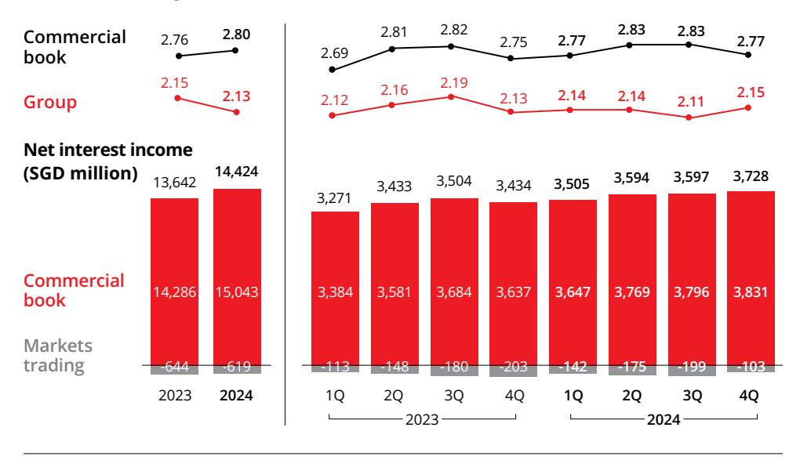

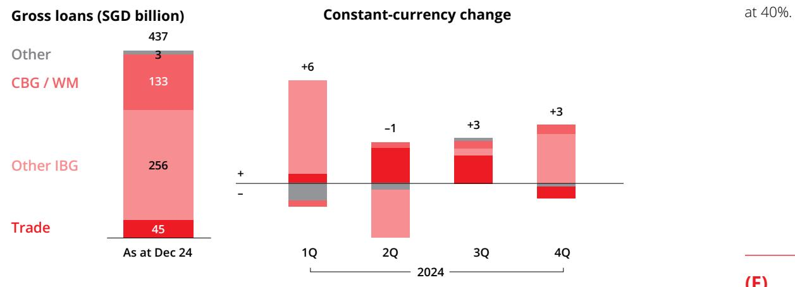

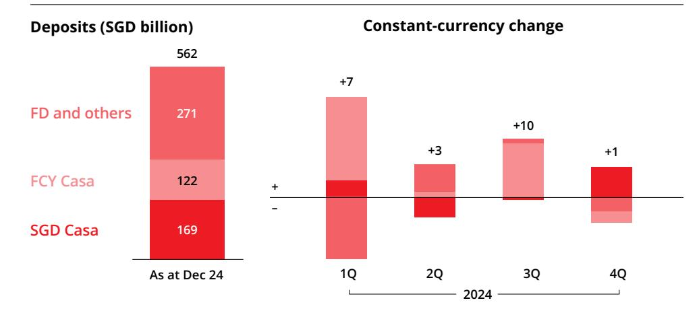

# **(D) Non-interest income**

Net fee income rose 23% to SGD 4.17 billion. The increase was led by wealth management fees, which rose 45% to a new high of SGD 2.18 billion from broad-based growth in investment products and bancassurance, as well as the consolidation of Citi Consumer Taiwan. Card fees grew 19% to SGD 1.24 billion from the consolidation of Citi Consumer Taiwan and from higher spending. Loan-related fees increased 16% to SGD 644 million. Transaction service fees were little changed. Investment banking fees declined 19% due to slower equity capital market activities.

### **Fee income**

| (SGD million)                       | 2023  | 2024  | YoY (%) |
|-------------------------------------|-------|-------|---------|
| Investment banking                  | 125   | 101   | (19)    |
| Transaction services(1)             | 896   | 918   | 2       |
| Loan-related                        | 554   | 644   | 16      |
| Cards(2)                            | 1,044 | 1,240 | 19      |
| Wealth management                   | 1,505 | 2,183 | 45      |
| Fee and commission income           | 4,124 | 5,086 | 23      |
| Less: Fee and commission expense    | 740   | 918   | 24      |
| Total net fee and commission income | 3,384 | 4,168 | 23      |

- *(1) Includes trade & remittances, guarantees and deposit-related fees.*
- *(2) Net of interchange fees paid.*

Other non-interest income increased 17% to SGD 3.71 billion from record treasury customer sales, higher markets trading and from property disposal gains.

# **Other non-interest income**

| (SGD million)                                                                         | 2023  | 2024  | YoY (%) |
|---------------------------------------------------------------------------------------|-------|-------|---------|
| Net trading income                                                                    | 2,866 | 3,381 | 18      |
| Net income from investment securities                                                 | 217   | 163   | (25)    |
| Others (include rental income and gain on disposal of properties and fixed assets) | 71    | 161   | >100    |
| Total                                                                                 | 3,154 | 3,705 | 17      |
| Commercial Book                                                                       | 1,785 | 2,164 | 21      |
| Markets trading                                                                       | 1,369 | 1,541 | 13      |
| Total                                                                                 | 3,154 | 3,705 | 17      |
|                                                                                       |       |       |         |

# **(E) Expenses**

Expenses rose 10% to SGD 8.90 billion led by higher staff costs. Excluding Citi Consumer Taiwan, expenses rose 7%. The cost-income ratio was unchanged

# **Expenses (SGD million)(1)**

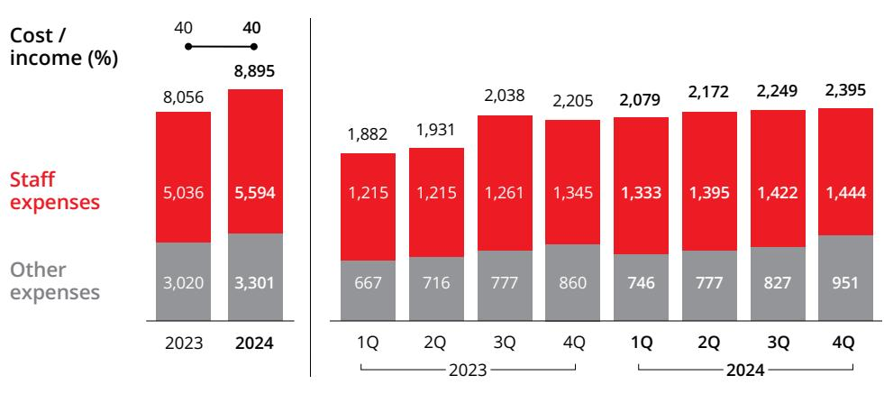

*(1) Excludes one-time items.*

# **(F) Asset quality**

Non-performing assets were stable at SGD 5.04 billion as new non-performing asset formation was offset by upgrades, repayments and write-offs. The NPL ratio was unchanged at 1.1%.

Specific allowances amounted to SGD 559 million or 13 basis points of loans, similar to the 11 basis points a year ago and remaining below cycle average. General allowances of SGD 63 million were taken.

Total allowance reserves amounted to SGD 6.51 billion. General allowance reserves stood at SGD 3.97 billion, which included SGD 2.4 billion of general allowance overlays. Specific allowance reserves amounted to SGD 2.55 billion. Allowance coverage of non-performing assets was at 129% and at 226% after considering collateral.

| (SGD million)                                        | 2023  | 2024  |
|------------------------------------------------------|-------|-------|
| NPAs at start of period                              | 5,125 | 5,056 |
| IBG and others                                       | (311) | (210) |
| New NPAs                                             | 675   | 903   |
| Upgrades, settlements and recoveries                 | (683) | (808) |
| Write-offs                                           | (303) | (305) |
| CBG / WM                                             | (1)   | 126   |
| Translation                                          | (83)  | 64    |
| NPAs at end of period                                | 4,730 | 5,036 |
| Citi Consumer Taiwan                                 | 326   | -     |
| NPAs at end of period including Citi Consumer Taiwan | 5,056 | 5,036 |
| NPL ratio (%)                                        | 1.1   | 1.1   |
| SP/loans (bp)                                        | 11    | 13    |
| Cumulative general and specific allowances as % of:  |       |       |
| NPA                                                  | 128   | 129   |
| Unsecured NPA                                        | 226   | 226   |

**Our 2024 priorities 30** DBS Annual Report 2024 **Making Greater Impact 31**

# **Our 2024 priorities**

**We use a balanced scorecard approach to measure how successfully we are serving stakeholders and executing our long-term strategy. Our scorecard, which is based on our strategy, is used to set objectives, drive behaviours, measure performance and determine the remuneration of our people, making this a living tool.**

*To read more, see the Remuneration Report on pages 69 to 73.*

### **Traditional Key Performance Indicators (40%) Traditional KPIs**

# **Shareholders**

### **Achieve sustainable growth**

Measure financial outcomes and risk-related KPIs to ensure that growth is balanced against the level of risk taken, including compliance and control.

*Read more about this on page 31.*

# **Customers**

## **Position DBS as bank of choice**

Drive progress in customer satisfaction, depth of customer relationships and strength of brand positioning.

*Read more about this on page 31.*

# **Employees**

### **Position DBS as employer of choice**

Assess advancement in being an employer of choice, including employee engagement and people development.

*Read more about this on page 32.*

**Transform the Bank – Make Banking Joyful (20%)**

# **Transforming toward managing through journeys**

### **Drive strategic value and improve journey architecture for managing through journeys (MtJs)**

Enhance strategic value from and improve capabilities for managing through customer journeys.

## **Deliver differentiated customer experiences and superior outcomes**

Broaden adoption of the new way of managing through journeys across the organisation, further leverage Artificial Intelligence (AI)/ Machine Learning (ML) and experimentation and deepen focus on customer obsession to deliver differentiated customer experience, superior financial outcome, and joyful employee experience.

*Read more about this on pages 32-33.*

### **Areas of focus (40%)**

# **Uplift technology resiliency**

Improve technology resiliency by strengthening technology governance, people/ leadership, systems and processes.

*Read more about this on page 33.*

# **Fortify trust**

Enhance our compliance framework, deliver exceptional customer experiences, and create positive community impact to foster trust.

*Read more about this on page 34.*

# **Strengthen businesses**

Scale and drive value across the Group with strategic expansions and segment strategies across markets.

*Read more about this on page 35.*

# **Drive employee experience and productivity**

Improve employee wellbeing, drive productivity and shape the future of work, and industrialise AI/ ML.

*Read more about this on page 35.*

### **KPI/ Target Outcome**

# **Shareholders**

*Read more about this on pages 24-29 in "CFO statement"*

Deliver consistent income growth

Total income rose 10% to a record SGD 22.3 billion as commercial book net interest margin expanded, fee income crossed SGD 4 billion for the first time, treasury customer sales reached a new high and markets trading income rebounded.

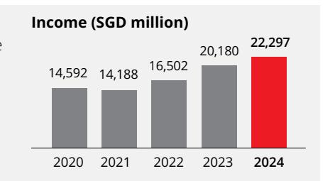

Be cost efficient while investing for growth

The cost-income ratio was unchanged at 40%. Expenses rose 10% to SGD 8.9 billion led by staff costs. Citi Consumer Taiwan accounted for three percentage points of the increase.

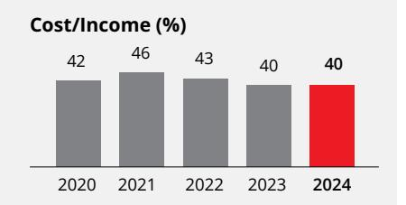

Grow exposures prudently, aligned to risk appetite

Asset quality was sound. Non-performing assets were stable as new non-performing asset formation was offset by repayments and write-offs. The non-performing loan ratio was unchanged at 1.1%.

Specific allowances were 13 basis points of loans, compared to the 11 basis points a year ago and below the cycle average. General allowances of SGD 63 million were taken, 19% lower than the previous year.

Deliver consistent return on equity (ROE) ROE of 18.0% was sustained at the previous year's record and is one of the highest among developed market banks. **(bp)**  31

**Specific allowances/average loans** 

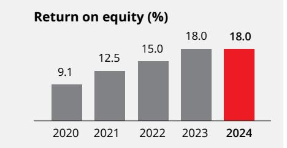

### **Customers**

Achieve broadbased increase in customer satisfaction across markets and segments

We saw an improvement in customer engagement (CE) scores across both Consumer Banking and Wealth Management, driven by increased relationship manager (RM) engagement with customers across markets, strong satisfaction with RM advisory services, and more customercentric service delivery. Additionally, our call centre garnered industry recognition, winning 27 corporate awards and 14 individual awards, including the Platinum Award for APAC Contact Centre Operations by Contact Centre Association of Singapore (CCAS).

We emerged as overall leader in market penetration and customer satisfaction & quality (GQI) across our core markets and Asia respectively in the Coalition Greenwich survey index for Large Corporates. In 2024, we rebased our Regional Mid-Cap & SME customer engagement survey with KPMG Services Pte. Ltd.. Our Mid-Cap and SME Regional Customer Engagement Index maintained a strong score of 4.43. Our strong commitment to delivering exceptional customer experiences has been globally recognised, earning us prestigious accolades such as from Global Finance (World's Best Corporate Digital Bank, Best SME Bank in Asia-Pacific, Best Bank for Transaction Banking in Asia-Pacific), and Euromoney (Best Cash Management Bank in Asia-Pacific, World's Best Bank for Real Estate). These achievements affirm our leadership in setting industry benchmarks and driving innovation across the region.

### **Customer engagement score(1)**

|                                                                             | 2024 2023 |           |
|-----------------------------------------------------------------------------|-----------|-----------|
| CES for Consumer Banking                                                 |           | 4.29 4.22 |
| CES for Wealth Management                                                |           | 4.50 4.31 |
| CES for Mid-Cap & SME Banking                                            |           | 4.43 4.45 |
| Asia-based Large Corporates Market Penetration Ranking                | 1st       | 1st       |
| Asia-based Large Corporates Customer Satisfaction (GQI) Ranking | 1st       | 2nd       |

*(1) Scale: 1 = worst and 5 = best. Based on Customer Satisfaction Survey (CSS) conducted by Capgemini and Qualtrics for Wealth Management; and Qualtrics for Consumer Banking. Based on KPMG Services Pte. Ltd for Mid-Cap & SME banking customer engagement survey and Coalition Greenwich for Large Corporates market penetration and GQI ranking.*

**Our 2024 priorities 32** DBS Annual Report 2024 **Making Greater Impact 33**

### **KPI/ Target Outcome**

### **Customers** (cont'd)

Deepen customer relationships CBG non-interest income grew 33% to reach a record SGD 3.7 billion, driven by growth in investment products, bancassurance, and cards. This growth was supported by improved RM productivity, positive market sentiment and consolidation of Citi Consumer Taiwan.

**CBG non-interest income (SGD billion)** 2020 2021 2022 2023 **2024** 2.4 2.8 2.4 2.8 **3.7**

IBG non-interest income increased 9% to SGD 2.4 billion as deepened customer relationships led to higher loan fees, treasury customer sales and cash management fees. This increase was partially offset by lower investment banking fees.

# **IBG non-interest income (SGD billion)** 2020 2021 2022 2023 **2024** 1.8 2.0 2.1 2.2 **2.4**

### **Employees** Maintain

employee engagement levels

This year, our employee engagement score reached a record 91%, 17 percentage points above the APAC Financial Services Industry benchmark and 6 percentage points above the APAC Best Employers benchmark. High scores in dimensions such as Learning & Development, Manager Effectiveness, Survey Follow-up and Wellbeing reflect our consistent efforts to enhance employee experience and our dedication to excellence in employee engagement.

*Read more about "Enhancing Employee Engagement and Culture" in our Sustainability Report.*

## **My Voice employee engagement score (%)**

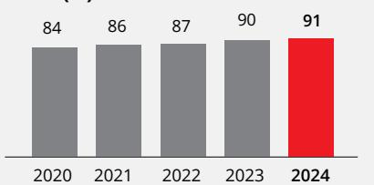

Provide our people with opportunities for internal mobility to enhance professional and personal growth

We are committed to the long-term professional and personal growth of our people by providing various career opportunities within the bank. We successfully completed the roll-out of iGrow — a personalised career companion leveraging AI/ ML to provide tailored career development recommendations — across all our core markets.

In 2024, our internal mobility rate increased to 11.9% despite lower attrition which led to fewer open positions. Furthermore, our focus on internal mobility resulted in 40% of job vacancies filled by internal candidates, up from 30% in 2023.

*Read more about "Developing Our People" in our Sustainability Report.*

## **Internal mobility rate (%)**

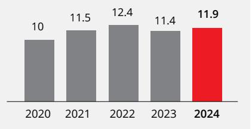

Maintain or reduce voluntary

Our group-wide voluntary attrition rate decreased from 8.8% in 2023 to 6.6% in 2024, reflecting the impact of our initiatives focused on enhancing employee engagement and retention as well as external job market conditions. Our attrition rates also remain lower than the market average in all our core markets.

## **Voluntary attrition rate (%)**

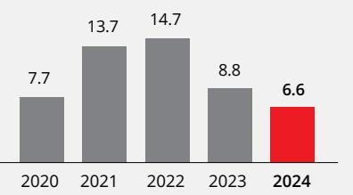

### **Transform the Bank – Make Banking Joyful**

turnover

### **2024 Target Outcome**

**Transforming toward Managing through Journeys**

Drive strategic value and improve journey architecture for managing through journeys (MtJs)

We further entrenched MtJs as a way of working and sharpened linkages among outcomes, drivers, and levers to deliver differentiated outcomes. To drive greater effectiveness and strategic value of MtJs, we enhanced senior leadership oversight of MtJs by ensuring that strategic priorities are endorsed and steered by senior management. Senior management reviews are conducted using dashboards with real-time data to enable more agile and efficient decision making. We also identified and incorporated relevant risk and control metrics into our performance management framework to ensure robust and holistic management and assessment of customer journeys.

### **Traditional KPIs Transform the Bank – Make Banking Joyful**

### **2024 Target Outcome**

**Transforming toward Managing through Journeys** (cont'd)

Deliver differentiated customer experiences and superior outcomes

We improved outcomes in our Consumer Banking journeys through the new MtJ way of working.

Our Treasures business saw strong growth driven by increased customer engagement through hyper-personalised solutions to customers and relationship managers (RMs), as well as proactive outreach by RMs to clients. Investment & Insurance fee income rose 52% YoY on the back of a 58% YoY growth in investment fee income and a 37% YoY increase in bancassurance fee income. We saw higher customer satisfaction scores across most markets, particularly in Singapore, as we transformed our customer service model. In our Private Banking business, we leveraged data insights and Gen AI to improve account opening processes. New product launches and enhanced AI/ ML models for client outreach contributed to a rise in private asset sales volumes and revenues.

In our Deposits and Mortgages business, we enhanced customer journeys and provided personalised offers while maintaining pricing discipline, as well as deployed AI/ ML models to reduce customer attrition. In our Singapore retail business, we maintained our dominant market share across a range of products including savings accounts and bancassurance. Our AI/ ML-powered campaigns delivered nudges to over 3.5 million customers and supported growth in retail investment and insurance revenues. Close to 3 million retail customers have been empowered with our financial planning services, with 8 in 10 digibank customers having access to our personal Wealth Planning Managers.

We continued to enhance the customer journey in our Cards business, such as by improving the user experience on our Card+ app. We also launched Vantage cards for the wealth segment in Singapore and India and strengthened our marquee Insignia proposition for high-net-worth clients. Our consumer finance ecosystem lending business saw strong momentum in China and Indonesia. We continued to maintain portfolio quality by closely managing and calibrating risk across markets.

We advanced our Institutional Banking journeys by sharpening the use of data and AI/ ML as well as enhancing our digital platforms.

In our SME business, we successfully defended liabilities balances and achieved broad-based fee income growth despite macroeconomic headwinds and stiff pricing competition. We also grew domestic payment fee income and volumes, expanded our merchant business across Singapore, Hong Kong, and India, and halved the time taken to implement SME payment and collection API mandates in Singapore. In our global supply chain business, we worked with key partners to assist clients in delivering their Scope 3 and greenhouse gas emission commitments.

We enhanced service quality by leveraging Gen AI to summarise call center call logs and automated trade operations processes to improve transaction turnaround times. We also reduced trade credit escalations and account opening turnaround times, as well as achieved faster API implementation, through policy and process enhancements. These contributed to strong improvements in customer satisfaction scores regionally. In addition, we maintained our top position in market penetration in corporate documentary trade.

Our corporate transactional foreign exchange (FX) business saw growth in FX revenues and volumes despite weak market conditions. Since embarking on MtJs for our FX business in 2020, we have seen a significant improvement in FX margins. Our digital strengths have also gained external recognition as we were awarded 'Most Innovative Bank for FX Globally' for the second consecutive year, and 'Best AI/ ML FX Tool' by Global Finance. In our consumer FX business, experiments on price elasticity for different currencies contributed to growth in revenues, while personalised notifications to customers resulted in greater customer engagement for their investment-related FX needs.

*Read more about this in the Letter from the Chairman and CEO on pages 14-17.*

### **Selected Areas of Focus**

**Uplift technology resiliency**

# Improve

technology resiliency by strengthening technology governance, people/ leadership, systems and processes

# **2024 Target Outcome**

We made steady progress across the various workstreams in the Technology Risk Management Uplift Programme (T-Up) covering change management, system resilience, incident management and technology risk governance and oversight. We tightened change management processes, boosted system redundancies for key services, enhanced our incident identification and resolution capabilities, and strengthened independent risk functions.

First, we reduced risks arising from change management by introducing change management measures such as applying AI/ ML risk scoring in the change reviews and approval process, implementing a near-production test environment, and setting up a Testing Centre of Excellence (COE) to further improve the quality of software development.

**Our 2024 priorities 34** DBS Annual Report 2024 **Making Greater Impact 35**

### **Selected Areas of Focus Selected Areas of Focus**

## **Uplift technology resiliency** (cont'd)

Second, to improve system resiliency, we put in place alternate pathways to ensure that customer journeys are fulfilled in the event of system disruptions. These have been implemented in Singapore and will be rolled out to other core markets. We institutionalised nine COEs and formed the Architecture Review Committee to reduce system complexity and ensure adherence to the Bank's reference architecture and COE standards. We conducted disaster recovery flips for select systems to determine operational resilience and reliability and established Technology Vendor Governance Strategy for stronger third-party oversight on risks.

Third, to enhance incident management, we implemented dashboards to provide real-time alerts on incidents impacting customers, including monitoring service performance to enable proactive identification of anomalies and swift resolution of customer service issues. We also developed several AI/ ML models to improve detection of negative customer events. These measures allowed us to improve incident detection, escalation, and recovery.

Fourth, we strengthened our technology risk governance processes, including broadening oversight from the BRMC Technology Risk Committee (BTRC) and Senior Management. The BTRC has since been superceded by the Board Technology Committee (BTC), which subsumes the BTRC's responsibilities and includes a mandate for oversight of the Group's technology strategy and architecture. We also boosted expertise across the various lines of defence with newly appointed heads of Site Reliability Engineering (SRE), Technology Risk, and IT Audit.

We have largely delivered on the T-Up programme objectives and since transitioned our effort to ensuring a sustained focus on technology resiliency in Singapore and our core markets.

*Read more about this in Letter from the Chairman and CEO on pages 14-17 and CIO statement on pages 38-39.*

### **Fortify trust**

Enhance our compliance framework, deliver exceptional customer experiences, and create positive community impact to foster trust

To better identify high-risk payment transactions and fight financial crime, we enhanced our use of AI/ ML and surveillance technologies. Customer protection was strengthened through anti-scam measures like the removal of SMS one-time passwords for digibank and an improved customer journey for digiVault, a feature that enables customers to lock their funds digitally in a designated account to prevent digital transfers out. Behavioural science has also boosted fraud detection, improving our success in intercepting unauthorised scam flows and recovering funds from scammers for our customers. Leveraging data analytics, we implemented new mule detection capabilities, allowing us to act earlier on these accounts. More security tools were also implemented to protect customers against malware-enabled scams in all core markets.

We deepened our capacity to empathise with customers through empathy training conducted for over 6,000 frontliners. Behavioural science principles were also applied to embed empathy into our service communications. We strengthened our connection with customers by solving root causes of negative customer experiences through process improvements and customer communications enhancements. For example, customers can now block suspicious transactions, request card replacements, and track the status of disputed transactions with greater ease and speed through digital channels.

We remain committed to achieving a net zero future, while recognising our social responsibility to foster a just and inclusive transition in Asia. We continued to improve our approach to sustainable and transition financing by ensuring robust governance, reskilling and empowering our people, and leveraging technology and AI to enhance our data analytics capabilities. We strengthened engagement with top emitters in our priority sectors and developed a deeper understanding of their respective journeys to better customise our solutions and support based on their unique sectorial and market circumstances. We also rolled out climate analytics tools for the aviation, steel, auto and shipping sectors and improved our stress test risk models to strengthen our climate risk management. As of December 2024, we committed SGD 89 billion in sustainable financing, net of repayments. We also facilitated SGD 38 billion in ESG bond issuances as an active bookrunner in 2024.

In addition, we engaged and partnered key ecosystem players, across Asia and globally, to foster collective action and collaboration with government, regulators and industry working groups. We were actively involved in working groups such as the Sustainability Reporting Advisory Committee, Singapore Sustainable Finance Association and World Business Council for Sustainable Development. In these, we supported and shaped policies and guidance on topics such as transition planning, as well as managing the phaseout of coal power generation in Asia.

### **2024 Target Outcome 2024 Target Outcome**

### **Fortify trust** (cont'd)

In 2024, we committed over SGD 100 million to support 16 new multi-year programmes with strategic partners and 22 Businesses for Impact (Social Enterprises and SMEs) focusing on providing essential needs and fostering inclusion across Asia. This is part of efforts to ramp up support for vulnerable communities, with a commitment of up to SGD 1 billion and 1.5 million employee volunteer hours over ten years from 2024. To support this expanded effort, DBS Foundation also strengthened its governance framework and organisational structure. Working with partners to develop volunteer programmes which support vulnerable segments of our community, our employee volunteering hours saw a sharp increase of more than 30% from 2023 to over 270,000 hours.

*Read more about this in the Sustainability Report.*

### **Strengthen businesses**

Scale and drive value across the Group with strategic expansions and segment strategies across markets

We achieved record net profit of SGD 11.4 billion and ROE of 18.0%, on the back of robust growth across both our Consumer and Institutional banking businesses. In Consumer Banking, income crossed the SGD 10 billion mark, led by higher fee income from investment product sales, bancassurance, and cards. Assets under management grew 17% to a record SGD 426 billion, while net new money flows were SGD 21 billion, reflecting the strength of our One Bank proposition and inflows from a broad set of clients from across more than 120 nationalities. Our Institutional Banking business recorded diversified growth across our industry segments. In particular, our Financial Institutions business saw strong revenue growth, with transaction services and financial market offerings as key growth drivers. Through our strategic geographical footprint in Asia and our deep industry expertise, we also captured investment and trade flows from client activities to diversify supply chains.

Across the franchise, we engaged in judicious balance sheet management by reducing the sensitivity of net interest income to one basis point of the US Fed funds rate from SGD 18 million to 20 million at the start of the interest rate upcycle to SGD 4 million in 2024. This reduced the impact of falling interest rates, enabling net interest income to continue growing as we expanded the balance sheet.

In Taiwan, DBS is now the largest foreign bank following the successful integration of Citi's consumer banking business, which has enabled us to achieve cost and product synergies. In particular, wealth management outperformed as we engaged clients across a broader suite of product solutions. Our India franchise saw strong income growth on the back of the successful implementation of our phygital strategy and increased brand awareness. We saw robust growth in our India assets led by large-corporate borrowing, including in our GIFT City branch. Notwithstanding weak macroeconomic conditions in China, we grew wealth management revenues and new corporate clients. We also increased our stakes in Shenzhen Rural Commercial Bank and DBS Securities China.

*Read more about this in Letter from the Chairman and CEO on pages 14-17, Head of Consumer Banking/Wealth Management Statement on pages 42-43, and Head of Institutional Banking Statement on pages 40-41.*

## **Drive employee experience & productivity**

Improve employee wellbeing, drive productivity and shape the future of work, and industrialise AI/ ML

We saw an improvement in the 2024 My Voice survey (DBS' annual employee engagement survey) where our Manager Effectiveness score rose from 91% to 92%, while our Wellbeing score remained high at 89%. Productivity tools, such as Gen AI chatbot DBS GPT and employee virtual assistant Onebot, have reduced workload, helping employees focus on higher value work. To improve collaboration, we conducted over 200 workshops to enhance team effectiveness. More than 1,000 leaders also participated in social learning communities to share transformational leadership best practices.

We enabled more employees to access integrated workflows and workbenches as well as improved interconnectivity among applications to enable teams to communicate and collaborate seamlessly. For example, the newly launched workbench for risk management utilised data APIs and dashboard widgets to boost data visualisation and connectivity to existing risk applications to streamline processes and enable more effective risk management. We also enhanced our workbench for operations management by automating servicing requests, improving straight through processing, and creating app widgets to reduce manual effort and turn-around time.

We made significant progress in industrialising the use of data analytics and AI/ ML across the bank, deploying over 1,500 models across more than 370 use cases, and more than doubling the economic value from data analytics and AI/ ML to SGD 750 million. In addition, we laid the foundation for sustained value creation from Gen AI by launching more than 20 Gen AI use cases, including personabased solutions for software developers and testers. We also expanded our responsible data usage framework to include Gen AI risks.

**CRO statement 36** DBS Annual Report 2024 **Making Greater Impact 37**

# **CRO statement**

**Despite some challenges in the macroeconomic environment, asset quality remained strong through proactive risk management. Significant progress was made in enhancing technology resilience, financial crime mitigation and climate risk management.**

# **Managing risks amidst macroeconomic headwinds and geopolitical tensions**

Global economic growth remained resilient in 2024, despite uncertainty in the macroeconomic environment. Inflationary pressures eased, leading to rate cuts by central banks from Q3, while unemployment remained low by historical standards. However, pockets of concern remained. Interest rates remained elevated and continued to pressure leveraged households and corporates. Real estate, including in Hong Kong and China, faced refinancing headwinds, price moderation, and reduced office demand due to shifts to work-fromhome. Sluggish recovery in the sector would continue to weigh on related industries such as construction and metals. The global automotive sector, particularly electric vehicles, were impacted by oversupply and intense price competition. In China, while the government expanded incentives to stimulate consumer spending and mitigate deflationary pressures, the impact of these measures would take time to percolate through the economy.

Geopolitical tensions between US and China and the Russia-Ukraine and Middle East conflicts also amplified macroeconomic uncertainties and heightened market volatility, with potentially negative implications for our portfolio.

Amidst these challenges, we maintained vigilance on our credit portfolio through reviews and stress tests. A risk scenario planning framework was introduced that allowed targeted early warning triggers to be established, along with action plans. While increased delinquencies in unsecured consumer loans in key markets and the Singapore micro-SME credit program were observed, these were mitigated through proactive strengthening of collection efforts and portfolio optimisation through enhanced onboarding criteria. The SME portfolio was extensively reviewed and continued to be mostly secured with acceptable financing quantum. Large corporates, benefiting from strong financial positions, were less impacted.

Overall, credit quality remained resilient, with a low non-performing loan rate at 1.1% and specific allowances at SGD 559 million. Corporate exposure was mainly to larger names and top industry players. Unsecured consumer credit loans were limited, representing less than 2% of Group exposures. Residential mortgages, primarily in Singapore and Hong Kong, consisted mainly of owner-occupied properties with strong collateral and low loan-to-value ratios. We remain prudent on client selection and credit underwriting criteria.

In response to the elevated market volatility, we conducted scenario stress tests on our portfolio of marketable assets which comprised mainly investment-grade instruments in the US, China, Singapore, India and Australia. The stress tests confirmed that the book remained welldiversified and resilient against potential adverse market rate movements.

# **Optimising liquidity amidst market volatility**

In 2024, we further strengthened our funding profile, emphasising liquidity, stability and resilience. Initiatives to diversify funding sources and maintain robust liquidity reserves (particularly in USD) included diversifying our deposit base across various customer segments and currencies. We refined our liquidity risk management framework, addressing the potential risk of digitally accelerated deposit outflows observed during the 2023 US Banking Crisis. This included validating that our liquid asset reserves were adequate to handle severe outflows.

# **Strengthening financial crime surveillance and customer protection against scams**

We remain committed to proactively mitigating financial crime risks, investing in enhanced surveillance capabilities and leveraging artificial intelligence / machine learning (AI/ ML). Our multi-layer surveillance framework continued to adapt to the evolving financial crime environment, enabling timely action on detected risks and intelligence sharing with the industry. Our efforts and commitment yielded results, including being cited as a "good example" by the UN Special Rapporteur relating to controls on Myanmar flows. Our anti-scam measures were enhanced to better protect our customers, such as moving away from SMS OTP for digibank logins to more phishing-resistant authentication approaches and improving the customer journey for our digiVault (a 'money lock' feature). We started incorporating behavioural science concepts into our fraud surveillance framework, resulting in up to 50% increase in success rate of intercepting unauthorised scam flows.

*Read more about "Preventing Financial Crime" in the Sustainability Report.*

# **Delivering on enhanced technology risk management and resilience**

We completed remediation work under the Technology Risk Management Uplift programme (T-Up), improving service availability and service recovery. These enhancements are being extended to all our core markets. We continued to focus on further strengthening risk governance and controls in the areas of resiliency, change management and incident management post T-Up.

The implementation of enhanced oversight significantly improved the resilience of DBS' digital services. Key components included

the establishment of an Architecture Review Committee and a Testing Centre of Excellence to strengthen the rigour of software development and testing. This, coupled with end-to-end service monitoring, enabled early detection of potential issues and rapid response, allowing for prompt customer notification and a substantial reduction in unscheduled downtime. The number, severity and duration of actual incidents in 2024 were significantly reduced. As part of the increased rigour implemented for system resilience, we successfully completed a technology disaster recovery drill involving the flipping of key systems from our primary to our secondary data centre and running the systems for seven days before flipping them back. We also conducted exercises for three other potential disruption scenarios to further strengthen our operational rigour in the event of an actual disruption.

We have enhanced our technology risk governance with strategic investments in specialised resources and improved capabilities across technology, risk management and audit. An enhanced technology risk and control library with more than 150 controls and an independent Thematic Risk Review programme were implemented. Third-party risk management was strengthened through the establishment of a dedicated Technology Vendor Governance and Strategy (TVGS) programme and committee, providing senior management oversight.

*Read more in the CIO statement.*

# **Fortifying defences against cyber attacks**

We remain committed to strengthening our cybersecurity defences against increasingly sophisticated threats. Our comprehensive multi-layered defence-in-depth approach, encompassing employees, customers and third parties, ensured continuous monitoring and validation of our security controls. Significant investments in Distributed Denial of Service (DDoS) mitigation and the replacement of less secure OTP logins with digital tokens had enhanced our resilience against cyberattacks and significantly reduced the risk of customers' credentials being phished. These measures contributed to safeguarding the availability of our digital channels and protecting customer access.

We continued to enhance our cyber-defence through advanced security measures including multi-factor authentication, microsegmentation and continuous monitoring. An enhanced employee awareness program led to a 30% increase in staff reporting phishing attempts and a completion rate of 100% for cybersecurity training. Our commitment to international best practices was evidenced by our ISO 27001 and Singapore Cyber Trust Mark (Advocate level) certifications.

Our active participation in industry collaborations such as the Association of Banks in Singapore (ABS) Standing Committee on Cyber Security (SCCS) and Financial Services Information Sharing and Analysis Centre (FS-ISAC) allowed us to proactively address emerging threats and share best practices. We are currently actively pursuing post-quantum readiness to mitigate future technological risks.

# **Transforming risk management with Generative AI (Gen AI) and analytics**

In 2024, DBS significantly advanced its use of AI/ ML, integrating Gen AI across various business and control functions. Our risk management approach was enhanced through Gen AI-powered co-pilot assistants which leveraged our knowledge bases (including risk management policies), boosting productivity of our risk professionals. Applications such as auto-completion of ESG risk questionnaires increased efficiency and consistency. We also continued to embed Gen AI capabilities into workflows (such as debt collections) to streamline processes and improve decision-making.

Our advanced analytics capabilities had evolved beyond Gen AI. By leveraging network graph analysis to identify potentially fraudulent credit applicants, we had significantly strengthened our defences against financial crime.

Recognising the new risk dimensions introduced by Gen AI (e.g. model bias, data privacy), a robust governance framework was established. The Data Management Office led a taskforce to develop a Gen AI playbook for responsible use cases, encompassing end-to-end risk and control assessments for applications with potentially material impacts. A cross-functional Responsible Data Use Committee, reporting directly to the Risk Executive Committee, provides oversight, ensuring responsible and secure AI implementation.

# **Sustaining enhancements to climate risk management**

In 2024, DBS significantly enhanced its climate risk management capabilities. The implementation of an enhanced corporate ESG risk score enabled proactive identification and management of borrowerlevel climate transition and physical risks, including potential reputational risks. This provided improved portfolio-level oversight and control of high-ESG-risk credit exposures. A more robust ESG database streamlined reporting, ensuring alignment with evolving disclosure standards and timely communication to investors and stakeholders. Ongoing enhancements to our climate transition and physical risk

scenario analysis allowed for more accurate assessment of potential vulnerabilities and financial impact, informing effective mitigation strategies.

*Read more about "Responsible Financing" in the Sustainability Report.*

# **Growing new business in digital assets**

DBS adopted a disciplined, risk-managed approach to digital asset growth, serving digital asset companies within defined risk parameters and employing robust controls such as on-chain surveillance (monitoring activities on the block chains) to manage digital asset-related risks. In 2024, new business included partnerships with stablecoin issuers and the launch of crypto options trading and structured notes. As digital assets permeate across the Bank's franchise, a Group Digital Asset Ecosystem Council was established to evaluate business priorities and provide risk oversight.

**Soh Kian Tiong Chief Risk Officer DBS Group Holdings**

- **•** Strengthen Non-Financial Risk Management through enhanced governance, leadership, systems and processes
- Continue to enhance Technology Risk Management, focused on incident and change management, system resilience and risk governance and oversight
- Proactively monitor macroeconomic and geopolitical risks and their potential impact on our portfolios
- Leverage digitalisation and advanced analytics to enhance risk management capabilities and controls
- Strengthen climate risk management and stress testing capabilities
- Mitigate financial crime and cyber threats through robust controls, advanced systems, analytics and effective communication
- Foster a strong risk culture, with a particular focus on strengthening technology risk awareness and practices

# **CIO statement**

**Enabling joyful and seamless banking remains at the heart of our strategy. Fuelled by our deep technology expertise, we continue to balance resiliency and cost efficiency with speed and innovation to deliver differentiated customer experiences.**

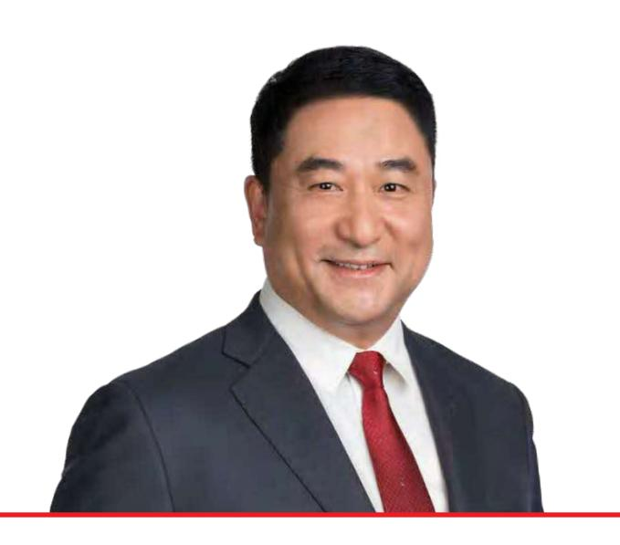

# **2024 overview**

2024 was a year of transition in many ways. Since joining in May, I've been impressed by how our digital transformation, which began over a decade ago, has put us on the front foot with a modern technology stack and advanced infrastructure. However, we could do more to bolster our technology resiliency.

Our technology teams continued to execute against the technology resiliency roadmap in the areas of change management, system resilience, incident management and technology risk governance and oversight. With added steer from the Board and our Group Management Committee, we made further progress in strengthening the bank's technology resiliency.

At the same time, we continued to invest in our microservices architecture and cloud infrastructure to enable greater scalability and cost optimisation, while leveraging artificial intelligence (AI) / machine learning (ML) to further drive hyper-personalised services and operational efficiencies.

Going forward, there is room for growth in terms of designing for modern systems, further automating our technology system development and management, as well as embedding a stronger tech risk culture. We have encapsulated our ambitions as R.I.S.E. (Resiliency, Innovation, Speed, Efficiency) and will continue to be a partner in driving the business forward. Balancing resiliency and cost efficiency with speed and innovation will be a key focus for technology this year as we continue elevating customer experience.

# **Building resilience and increasing oversight**

The four key themes of technology resiliency – change management, system resilience, incident management and technology risk governance and oversight – were embedded in our Technology Risk Management Uplift (T-Up) programme. We have largely delivered on the programme objectives and since transitioned our efforts to ensuring a sustained focus on technology resiliency in Singapore and our core markets.

### **System resilience**

Over the past year, we further rearchitected seven key systems at the front and backends. By decoupling more shared systems, key services can be accessed through alternative channels which ensure that our customers can continue to fulfil their banking needs, even in the event of system disruptions. We also designed additional reconciliation solutions with automated recovery, so that customers and merchants can be assured of transaction certainty at any point in time. Additionally, we have enabled more concurrent mobile banking logins to better handle unexpected surges in customer login volumes.

With a simplified technology architecture standard, patterns and configuration, we optimised our systems for high availability, rapid recovery and transaction certainty. We also established aligned architecture standards for critical applications in our technology stack across infrastructure, middleware and databases to allow for critical workloads in Singapore and in our core markets to recover data swiftly in the event of a disruption.

Notably, in May 2024, we successfully held a technology disaster recovery (DR) drill involving two key components. To test operational rigour in the event of an incident, we conducted a DR flip where we flipped over to our secondary data centre and back to our primary data centre over one week. The second component was the transfer of workloads or operations from one mainframe site to another, an essential component in disaster recovery and ensuring business continuity. This drill was a first in Singapore

among large local banks, and its success affirmed our efforts to bolster our system resiliency. We have since conducted similar exercises for three other scenarios involving critical apps to boost our readiness.

### **Change management**

We remain committed to intensifying testing rigour around our applications and reducing the risks arising from changes. Since establishing our near-production test environment, we have put over 100 applications through this testing regime to reduce our margin of error before production and ensure that there isn't any downstream impact. Our Architecture Review Committee complements this by strengthening governance against established architecture standards.

We also introduced a Testing Centre of Excellence (COE) to further improve our quality of software development. It outlines best practices for user stories alongside test case creation, approaches and processes across all applications and has already shown tremendous impact driving test automation. Other defined COEs established best practices for other technologies, ensuring better quality of service and vendor management.

To enhance the lifecycle management of third-party vendors, we formed a Technology Vendor Governance and Strategy forum, which meets quarterly to review key risks or issues identified from critical technology vendors and to ensure strategic alignment with our critical vendors. Through this, we have been able to achieve greater system oversight leading to more reliable services for our customers.

# **Incident management**

In managing incidents, it is important to detect anomalies early to mount an effective response and minimise impact. Over the past year, we enhanced our end-to-end

customer impact translates to a smoother customer experience. We are also benefitting from consolidated command centres and defined operational procedures to enable faster incident detection, escalation and recovery. We continue to improve our customers' experience through timely notifications and

monitoring across customer, application and infrastructure levels, covering a broad spectrum of indicators including service performance. The added visibility into key customer journeys and potential negative

### **Tech risk governance and oversight**

maintenance and incidents.

by refining error messages during system

To further improve technology risk governance and oversight, we have enriched resources across multiple lines of defence such as technology risk management, Site Reliability Engineering and IT audit. We continue to reinforce a strong technology risk mindset by rolling out initiatives to strengthen the right behaviours in our employees, including a guide that encourages questioning to ensure critical issues are addressed. By overlaying key risk indicators and better risk assessment, we have enhanced monitoring oversight and intervention capabilities for critical applications.

Our technology risk control library serves as an important part of our enhanced technology risk and control self-assessment process. We review the library periodically to ensure there is consistent and current information reflecting the bank's risk landscape and the evolving technology landscape.

# **Becoming an AI-fuelled bank**

DBS has worked with AI for over a decade, allowing us to industrialise the use of data analytics and AI/ ML across the bank. In 2024, we derived SGD 750 million in economic impact from more than 370 use cases powered by over 1,500 models. We expect this figure to exceed SGD 1 billion in 2025. We have also begun to leverage Gen AI to boost employee productivity and strengthen resiliency.

### **JIRA Assist**

We developed JIRA Assist as a Gen AI tool to help our business analysts and testers curate user stories and test cases from plain text requirements. By leveraging historical and current project experiences across the bank, JIRA Assist suggests alternative user stories and acceptance criteria that may otherwise have been overlooked. We also tap on behavioural driven development frameworks to provide clear guidance on test case design and user functionalities to our developers.

### **AI-powered change risk scoring**

We now use AI-based risk scoring to check 100% of change requests compared to 5% previously. This has improved productivity, tightened change management, and improved system resiliency, resulting in an 81% decrease in the monthly average number of incidents caused by change requests. By training our own ML model on past change requests, we have improved the accuracy in classifying change requests and reduced potential human bias.

### **Enhancing operational productivity through Gen AI**

By digitalising our operations through our Operations Processes and Platform Re-engineering programme, over 80% of addressable processes are now done through workflows. This has eliminated over 1.3 million employee hours of manual work to date and reduced risk incidents by 15% year-on-year, even with an increase in transaction volume.

Additionally, our Customer Service Officers (CSOs) in Singapore, Hong Kong, India and Taiwan now serve customers aided by a CSO Assistant, an in-house developed Gen AI tool that transcribes, summarises and recommends solutions for customer queries in real time. We expect this to reduce call handling time by up to 20%, directly benefitting our customers and freeing up CSOs to deepen customer engagement. Beyond these examples, we have identified several Gen AI use cases to further transform our operations even as we actively explore customer-facing pilots such as a Gen AIpowered chatbot for corporate and SME customers in Singapore.

# **Investing in our people**

Based on my engagement with our technology teams, I'm convinced that our people are equipped with the right skillsets and technological expertise. Nevertheless, we continue to invest in our employees' development by offering more diverse career pathways and robust development programmes.

### **Diverse career pathways**

Developed specifically for technologists, the DBS technology career pathways give our technologists a clear and structured view of how they can develop their careers with the bank. Our six technical tracks incorporate detailed skills maps and development plans, taking reference from the Infocomm Media Development Authority, as well as other leading financial institutions and technology firms.

Our technology certificate programme maps out clear role-based learning pathways to guide career progression, enable consistency in upskilling and enhance proficiency levels for identified roles. This

ensures that employees are continually trained in competencies that are fit-forrole. We partnered an external learning vendor to implement an industry-recognised certification to validate our employees' upskilling efforts.

### **Revamped Distinguished Engineer Programme**

Our Distinguished Engineer Programme (DEP) was created to deepen our technical expertise and recognise outstanding engineering talent and runs alongside other bank-wide talent programmes. The DEP offers structured career progression pathways through specialised technical tracks, allowing us to build a pool of deep technology expertise and entrench our position as a technology-driven company. We have further enhanced the DEP development plan by incorporating "Fellow" as the apex title, representing the highest level of technical expertise and leadership.

# **In closing**

As we continue our journey forward, we are committed to our vision of making banking joyful and enabling customers to Live more, Bank less. Fuelled by our deep technology expertise, we will maintain the delicate balance between resiliency and cost efficiency with speed and innovation to deliver a differentiated customer experience.

**Eugene Huang Chief Information Officer DBS Group Holdings**

- **•** Continue simplifying and strengthening our architecture.
- Design for greater standardisation in our systems and processes.
- Leverage new tools, automation and Gen AI to make existing systems faster, better and easier to build, deploy, operate and maintain.
- Continue our focus on resiliency in Singapore and our core markets.
- Continue our focus on cyber resiliency, placing priority on credentials management, public cloud and application security.
- Strengthen our technology culture by embedding a tech risk and change management mindset to balance speed and innovation with resiliency and cost efficiency.

**Institutional Banking 40** DBS Annual Report 2024 **Making Greater Impact 41**

# **Institutional Banking**

**Against a backdrop of macroeconomic and geopolitical uncertainty, IBG delivered a resilient performance with solid non-interest income growth. This was underpinned by strong client relationships, prudent risk management as well as our strength in digital solutions, Asian connectivity and sustainability.** 

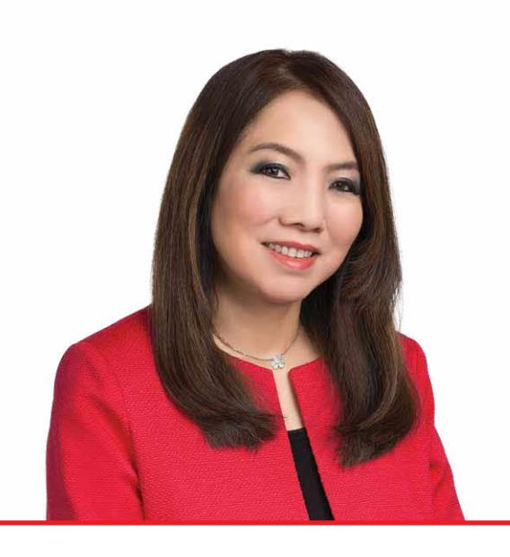

# **2024 overview**

Interest rates started going down in the second half of 2024 as central banks made progress in taming inflation. Whilst this was helpful in supporting business growth, geopolitical tensions created continued uncertainty and market volatility. In Asia, China's slowdown had a palpable impact in muting overall business activity.

By leveraging a strong and diversified franchise, we delivered a resilient performance with solid growth in noninterest income. This was underpinned by deepening client relationships, prudent risk management, digital capabilities, regional connectivity and leadership in sustainability.

# **Resilient financials amid headwinds**

Total income declined 2% to SGD 9.16 billion in 2024.

Net interest income declined 6% as sustained balance sheet growth was offset by a decrease in net interest margin. Non-interest income grew 9% to SGD 2.43 billion, driven by strong growth in fees from loan-related, cash management, as well as securities and fiduciary services. Treasury customer income also increased as we supported our clients in capturing market opportunities and managing risks. Investment banking fees declined as capital markets activities were muted.

Allowances stayed low as asset quality remained sound, with write-backs partially offsetting additional allowances taken.

Profit before tax declined 4% to SGD 6.35 billion, with the solid growth in non-interest income and resilient asset quality offset by a lower net interest margin.

# **Diversified growth across industries and markets**

There were growth opportunities across

our industry segments, including Financial Institutions (FI), Real Estate (RE), Telecoms, Media and Technology (TMT), and Food & Agribusiness (F&A).

Revenue from FI grew across all geographies especially Hong Kong, UK and India, driven by strong momentum in non-interest income as we deepened coverage in these markets to capture capital flows. Our transaction services and financial market offerings continued to be key growth drivers with institutional investors and other non-bank financial institutions.

RE captured growing investments into global gateway cities such as London and Sydney, whilst TMT rode the structural opportunities in data centre growth and telecommunication consolidation.

F&A growth was driven by increased client activity including expansion in the upstream and manufacturing segments, as well as corporate actions in the F&B manufacturing and food services segments. We also increased market penetration among global and regional players across the entire value chain.

Intra-regional trade grew about 30% as Chinese supply chains continued moving to Asean. Our extensive footprint in North, South and Southeast Asia, coupled with our deep industry expertise, put us in good stead to capture investment and trade flows from "China+1" activities. Our ability to bridge East and West was an added boon to Western multinationals expanding into Asia.

DBS India delivered a solid performance across all segments as we leveraged our full-service platform and deepened corporate relationships to capture opportunities in India's growth.

As a result of these collective efforts, clients affirmed our role as their trusted banking partner in the Coalition Greenwich Large Corporate Survey when we moved from second to first place in the regional list for

customer satisfaction and quality, while retaining the top spot for market penetration.

# **Entrenching ourselves in the mid-sized corporates & SME segments**

We continued to entrench ourselves among mid-sized corporates and SME clients. By leveraging our industry expertise, we expanded our mid-sized corporate customer base across markets. By focusing on connectivity flows, better anticipating customer needs and delivering tailored solutions, we achieved strong growth in non-interest income.

We also dialled up our financing and advisory services for SMEs. In Singapore, we were the leading financial institution in providing working capital loans to companies under the Enterprise Singapore Financing Scheme. Across the region, greater digital engagement via campaigns and personalised nudges led to a 4% increase in our borrowing customer base.

To help businesses stay competitive in the new economy, we embarked on several strategic public-private partnerships. In Singapore, we launched the Bridging Business Horizons programme to help companies expand overseas and the Spark GenAI programme to accelerate the adoption of generative AI (Gen AI) solutions.

In recognition of our market leadership, we were named Best SME Bank in Asia Pacific by Global Finance.

# **Scaling Global Transaction Services to drive growth**

Our Global Transaction Services business continued being a key growth engine, accounting for 51% of IBG income.

Our enhanced digital capabilities and strengthened technology resiliency enabled us to deliver more innovative solutions for customers to grow their business.

Real-time transaction volumes increased 34% regionally led by the scaling of domestic payment and collection mandates, as well as the implementation of more than 700 new regional cash management mandates. Nimble pricing strategies for deposits enabled us to respond quickly to volatile market conditions.

Higher volumes of international trade, investments and remittances raised the demand for secure cross-border payments. In June, we partnered Mashreq, a leading financial institution in the Middle East, to offer near-instant peer-to-peer cross-border payments to its retail customers across the Asia Pacific, Europe and the Americas. The service is powered by Globesend, a crossborder payment solution covering up to 132 currencies across 190 markets.

For many years, DBS has led various industry initiatives to explore how blockchain technology could transform the financial services landscape. In 2024, we introduced blockchain-powered DBS Token Services which combine tokenisation and smart contracts with our existing banking solutions to enhance transaction banking and improve operating efficiency for clients. Early adopters include Ant International, which uses the service for instant multi-currency treasury and liquidity management.

With cryptocurrency becoming a professionally managed alternative asset class, our assets under custody grew 20% as more professional investors tapped on bank-grade custodians and exchanges.

# **Enabling Asia's transition**

In 2024, we strengthened our sustainability leadership by partnering clients as financier and advisor in their decarbonisation journeys. Our sustainable financing commitments, net of repayments, grew to SGD 89 billion.

Notably, the team led the structuring of Indonesia's first blended finance project – comprising a mix of public-private sector funding and concessionary capital – to develop a water treatment plant. The project aims to deliver fresh water to two million residents in three cities including Jakarta.

We also provided Singapore-based City Developments Limited with an SGD 400 million loan to support nature conservation and sustainable development. The loan integrates targets aligned with Taskforce on Nature-related Financial Disclosures recommendations, a first-of-its-kind achievement.

Regulatory pressure and consumer expectations have made it more pressing for companies to manage value-chain emissions. To manage the inherent complexity of

| SGD million              | 2024  | 2023  | YoY% |
|--------------------------|-------|-------|------|
| Total income             | 9,159 | 9,388 | (2)  |
| Expenses                 | 2,820 | 2,673 | 5    |
| Profit before allowances | 6,339 | 6,715 | (6)  |
| Allowances               | 9     | 88    | (90) |
| Profit before tax        | 6,350 | 6,634 | (4)  |

supplier networks, we developed various industry solutions anchored by major corporations to provide working capital and support sustainable outcomes.

In a first for the Hong Kong construction sector, we partnered developer, Sanfield, to launch a supplier payment services programme to help develop a sustainable construction ecosystem. In Singapore, we collaborated with Enterprise Singapore to launch the ESG Ready Programme to help mid-sized corporates and SMEs identify, develop and implement decarbonisation strategies. A similar programme was launched in Taiwan in November.

Internally, we have introduced several initiatives to empower our people with the knowledge and tools to keep up with the rapidly evolving sustainability landscape and deliver more effective sustainability advisory. For example, relationship managers use a Climate Analytics Tool to better forecast and visualise a client's projected emissions performance.

We also started leveraging Gen AI to analyse data and populate fields in a risk questionnaire that forms part of our ESG risk assessment process. The outcome has led to better ESG risk analysis as well as increased employee productivity.

In recognition of our sustainability leadership, we were awarded World's Best Bank for Sustainable Finance by Global Finance for the first time.

# **Leveraging technology for a new way of working**

Delivering a seamless, intuitive and efficient customer experience has been a key feature in winning over customers. To achieve this, we have been breaking down internal siloes to create cross-functional teams that are underpinned by data and digital capabilities including Gen AI. We call this approach Managing through Journeys (MtJs), which gained further momentum during the year.

Among the results was a 30% reduction in the turnaround time for corporate account opening, a 20% improvement in risk detection, as well as enhanced employee productivity. We also launched a Gen AI-powered tool to help employees with processes and policies.

# **Looking ahead**

All eyes are on the new Trump administration and US-China trade relations in 2025. While policy swings will be hard to predict, the ramifications of these will be far-reaching and businesses will need to remain agile to adapt to these shifts. We also expect continued macroeconomic uncertainty and market volatility from geopolitical conflicts.

On the other hand, shifting trade and investment flows will be beneficial to much of Asia. We will continue leveraging our strength as an Asia-centric bank to support our clients seeking to diversify their supply chains or to pursue a "China+1" strategy.

IBG has built a formidable arsenal combining strong financials, prudent risk management, deep industry knowledge, extensive connectivity, as well as digitalisation and sustainability capabilities. These are strengths that we will continue bringing to bear to help our customers navigate the complex business landscape.

Looking forward, we will continue dialling up businesses with high return on equity, as well as scale digital acquisition and the use of Gen AI to create impact and unlock value for our stakeholders. We believe these priorities will put us in good stead to navigate the challenges ahead.

**Tan Su Shan Deputy CEO & Institutional Banking\* DBS Group Holdings**

*\* Succeeded by Han Kwee Juan as Group Head of Institutional Banking on 1 January 2025.*

- **•** Amplify network and connectivity strategy to capture investment and trade flows
- Double down in growth markets
- Grow sustainability as a business through financing and advisory
- Scale digital acquisition and use of Gen AI

**Consumer Banking/ Wealth Management**

**What set us apart from our peers have been our unmatched resources and scale to deliver solutions with innovation, as well as our unwavering dedication to serve our customers' best interests. By sustaining our business success and being a positive force in our communities, we are committed to doing well by doing good.**

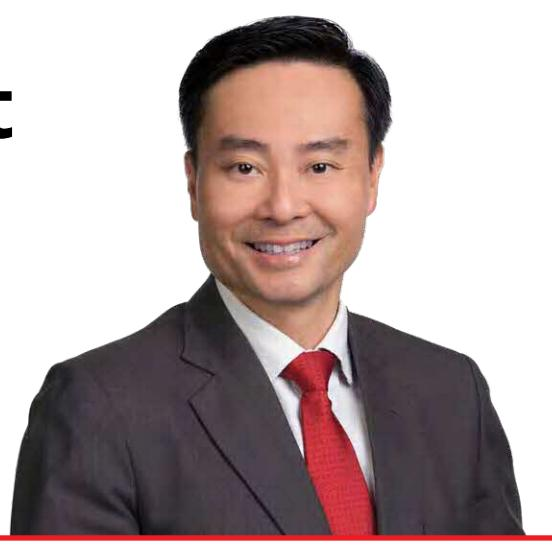

# **2024 Overview**

Consumer Banking/ Wealth Management delivered a solid set of results with broadbased income growth. In particular, the easing of interest rates in the second half of the year buoyed investor confidence, which drove wealth management non-interest income to a new high.

The full-year impact of the consolidation of Citi Consumer Taiwan was materially accretive to earnings. The franchise fuelled growth in wealth management and card fees, and bolstered our deposits and loans. Today, DBS is the biggest foreign bank by assets in Taiwan.

Efforts to deepen customer relationships and drive productivity also yielded benefits. Leveraging data, analytics and technology, we made further headway in tailoring our offerings to the needs of various customer segments as well as enhancing the customer experience across our digital and physical touchpoints.

We will continue to fortify our franchise by doubling down on high-ROE businesses, such as wealth management, while providing more customer value and bolstering their financial wellness.

# **Record high income for Consumer Banking/ Wealth Management**

We delivered a robust performance from net interest income and fee income growth. Total income rose 13% to SGD 10.2 billion, led by double-digit growth in wealth management fees globally, including our six core markets. Net profit before tax grew 9% to SGD 4.44 billion.

Net interest income rose 4% to SGD 6.47 billion, driven by stronger deposit and loan balances. The growth more than offset a net interest margin decline from lower interest rates.

Non-interest income grew 33% to SGD 3.69 billion. Excluding Citi Consumer Taiwan, it rose 25%.

The increase in non-interest income was led by wealth management as stronger investor sentiment drove investment and bancassurance product sales. Card fees also rose from higher spending despite more intense competition.

In Singapore, we maintained our leadership in Casa deposits, credit cards and mortgage loans. Our bancassurance business also held its lead for new business market share.

# **Wealth Management: Multiyear outperformance buoyed by record-high wealth fees**

With Asia becoming one of the world's fastest-growing wealth centres, high-networth and ultra-high-net-worth individuals have been increasingly diversifying their investments into the region. In 2024, clients of more than 120 nationalities entrusted us with more of their assets, with inflows from North Asia, Southeast Asia, the Middle East and Europe.

Our wealth management franchise extended its multi-year outperformance. Total wealth management income rose 18% to SGD 5.22 billion, underpinned by resilient net new money inflows and robust fee income. Wealth management non-interest income climbed 45% to SGD 2.60 billion, outpacing many of our regional and global peers.

Assets under management (AUM) grew 17% to SGD 426 billion. The percentage of AUM in investments rose to a record high of 56% as our clients put more money to work. We have also been more efficient than other private banks in the region, with a cost-income ratio of 47% in 2024.

In the past year, four in 10 of our new private bank client acquisitions were existing DBS

Treasures clients who moved up the wealth continuum. Many clients have also broadened their portfolios to include private assets. We have also been leveraging the synergy between our wealth and institutional banking teams to advise two-thirds of our clients who are business owners on the management of their personal wealth and businesses.

Our Family Office business continued to gain market share in Singapore. Of the over 2,000 Single Family Offices set up in Singapore, DBS Private Bank onboarded more than one-third of them. We gained sustained interest from regional wealthy families in our first-in-industry DBS Foundry Multi Family Office Variable Capital Company which offers a range of customisable investment strategies for wealthy families.

Our broad-based, diversified offering paired with prescient investment insights by our Chief Investment Office enabled our clients to achieve good returns in multi-asset portfolios. The DBS Barbell strategy has outperformed its peers, putting it in the top 5% of its category.

Testament to the strides we have made in our wealth strategy, our wealth management business continued to be recognised globally. We were named "World's Best for High Net Worth", "World's Best for International China Clients" and "Asia's Best for Family Office Services" at Euromoney's inaugural Private Banking Awards. We also retained Euromoney's "Asia's Best Bank for Wealth Management" award for the third year running.

# **Consumer Banking: Deepening and retaining customer relationships through 'phygital' engagement**

We recognise the need to continue earning the trust of our customers to be their primary financial partner. One of our key

differentiators is our phygital approach to engaging and servicing customers. We combine our digital capabilities with the expertise of our frontline branch staff and wealth managers across our physical network to serve the needs of our 18.4 million clients and customers worldwide.

We made it more intuitive for customers to enhance their financial well-being. In 2024, we:

- **•** Engaged more than 13 million customers across the region with more than 1.2 billion personalised AI-powered nudges to guide them towards better investment and financial decisions. In Singapore, those who engaged with nudges and used the bank's AI-powered financial planning tool saved two times more, invested five times more and were nearly three times more insured than non-users.
- **•** Gave close to three million or eight in 10 – eligible retail customers access to personal wealth planning managers – a first-of-its-kind service that a bank in Singapore is providing to retail customers. These WPMs provide personalised advice to customers – from the first dollar they invest in the markets to the decisions they make about their long-term retirement planning.

We also made it easier for customers to manage their everyday banking transactions, like setting up new accounts, making payments and protecting themselves from scammers.

We further entrenched the usage of digital transactions across key markets. More than seven in 10 PayNow funds transfers and payments in Singapore today are performed by DBS customers. Our mobile wallet PayLah!, which marked its 10th year in service, hit a record 41.6 million logins a month, in which 2.8 million users can pay at over 77 million QR acceptance points worldwide. In the past year, cross-border QR payments made through PayLah! nearly tripled in transaction volume.

With the integration of Citi's consumer banking business, we became the largest card issuer among foreign banks in Taiwan with 2.5 million cardholders. Today, more than two million of our customers use their DBS digibank and Card+ apps to fulfill their banking and lifestyle needs. As a result, 90% of transactions, such as remittances, ETFs and equity investments, are now conducted digitally.

Amid the rise in scams, we have also enabled more than 1.5 million customers in Singapore to use self-managed security features to protect themselves from scammers. Customers can lock up their funds and prevent digital transfers out, activate multiple locks on their cards, manage threshold alerts and thwart malware threats.

| SGD million              | 2024   | 2023  | YoY% |
|--------------------------|--------|-------|------|
| Total income             | 10,155 | 8,957 | 13   |
| • Retail                 | 4,939  | 4,532 | 9    |
| • Wealth Management      | 5,216  | 4,425 | 18   |
| Expenses                 | 5,273  | 4,627 | 14   |
| Profit before allowances | 4,882  | 4,330 | 13   |
| Allowances               | 445    | 270   | 65   |
| Profit before tax        | 4,437  | 4,060 | 9    |

Our ecosystems partnerships lending growth outside Singapore remained resilient – the volume of loans disbursed across China and Indonesia nearly doubled year-on-year. Expanding beyond consumer lending, we started offering wealth management solutions via our partners' platforms to customers in Indonesia in 2024.

# **Driving agility and productivity to better serve our customers**

We continued to make steady progress across the Managing Through Journeys (MtJs) squads comprising more than 2,000 technologists, wealth managers and business teams across our markets. Today, we tap on Gen AI to reduce the time taken by private bank relationship managers to research and provide tailored recommendations for their client meetings. In China, we improved customer satisfaction scores and drove unit trust investments with Gen AI-enhanced client service experience.

# **Standing by our customers, heartland businesses and the community**

With stubbornly elevated cost of living, we want to do what we can to support our customers, especially by helping those facing acute financial stress tide over the tough times.

After a hawker meal subsidy scheme ended in July 2024 in Singapore, we offered a new programme of cashback rewards and discounts for purchases in the heartlands and selected supermarkets. Since the launch, heartland merchants and wet market stallholders have seen a 40% boost in their weekend earnings via PayLah! transactions.

These efforts were in addition to the bank's commitment of up to SGD 1 billion over 10 years to step up support for vulnerable communities and catalyse social impact.

We have also bolstered outreach efforts to strengthen financial and digital literacy, and anti-scam education. Together with the DBS Foundation, our employees reached out to some 90,000 people via interactive digital and financial literacy workshops in schools and heartland communities. (See POSB Highlights)

# **What we look forward to**

Our success is measured not only by our financial results, but also by the ability to deliver value for our customers and communities. I am so proud of how the resilient growth of our business has also made a meaningful and enduring impact on all our stakeholders in good and bad times.

What set us apart from our peers have been our unmatched resources and scale to deliver solutions with innovation, as well as our unwavering dedication to serve our customers' best interests. While shifts in the macroeconomic environment and rapidly ageing populations may pose challenges, we believe they also open up opportunities.

We will tap on the full capabilities of the franchise to support our customers and empower them to attain their financial goals. Most of all, by sustaining our business success and being a positive force in our communities, we are committed to doing well by doing good.

**Shee Tse Koon Consumer Banking/ Wealth Management DBS Group Holdings**

- **•** Scale wealth continuum proposition in the region, including South and Southeast Asia, to entrench DBS as a global wealth manager
- **•** Deepen customer relationship and grow revenues by advancing MtJs transformation, maximising value from Gen AI solutions and product innovation
- **•** Drive value from integrated Taiwan franchise by focusing on the cards businesses and deepening wallet share
- **•** Continue to drive phygital customer engagement across all touchpoints to foster more inclusive societies

# **Neighbours first, bankers second**

**As a key institution in Singapore, POSB has stayed true to our mission of being the "People's Bank". We take pride in serving generations of Singaporeans, from playing a key role in the development of Singapore, to creating a nationwide savings movement for children. In recent years, we ramped up digital and financial literacy in the community. Since our founding in 1877, we have been committed to providing pioneering financial solutions that cater to the evolving needs of Singaporeans. They include children, young adults, families, seniors and the community at large.** 

**We remain committed to giving back to the community and uplifting the many individuals and families who have supported us over the years. We also hope to rally the support for heartlands businesses and enhance the vibrancy of our neighbourhoods.** 

# **Supporting the Heartlands through cashback rewards, discounts and community outreach programmes**

- **•** We offered over two million cashback rewards and discounts between July and December 2024 for purchases from heartland shops, wet markets, hawker stalls, and Sheng Siong supermarkets. In addition, the bank also offered a "Heartland Merchant Banking Package", providing comprehensive financing support for small businesses.
- **•** Called the "POSB Support Our Heartlands" initiative, we sought to drive demand for products and services offered by small businesses and revitalise the heartlands.
- **•** Since the launch, heartland merchants, wet market and hawker stall owners have seen a 40% boost in their weekend earnings via PayLah! transactions.
- **•** Through the initiative, we also ramped up our community outreach efforts through digital and financial literacy workshops, which also included anti-scam education.
- **•** Through the DBS Foundation's two-year collaboration with the Infocomm Media Development Authority (IMDA) which ended in December 2024, we contributed SGD 1 million, which includes the government's dollar-fordollar matching, to the Digital for Life movement.
- **•** Through our People of Purpose employee volunteer movement, we reached out to some 90,000 Singaporeans and residents via more than 300 workshops, including Getai edutainment roadshows and financial literacy games.

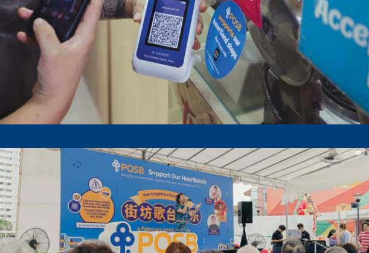

# **FOR CHILDREN**

# **POSB Smart Buddy Programme**

- **•** We expanded the world's first integrated in-school savings and payments programme to more than 70% of schools in Singapore. The POSB Smart Buddy programme, which was launched in 2017, creates a contactless payments ecosystem within the school environment to help cultivate sensible savings and spending habits among young students in an interactive, engaging manner. These students are then better equipped to achieve financial wellness when they transition to the next stage of their lives.
- **•** Under a partnership with the Ministry of Eduation, we will complete the installation of digital payment terminal in more than 330 primary, secondary schools, junior colleges/ Millennia Institute and special education (SPED) schools by this year (2025). We are also providing up to 400,000 students with smartwatches and cards for payments.
- **•** Today, some 230,000 students in 253 schools are using Smart Buddy smartwatches and/or smart cards for digital payments, up from the 170,000 students across 170 schools in 2023. The programme also supports needy students under the MOE Financial Assistance Scheme. To date, the number of students who are receiving meal

subsidies via POSB Smart Buddy has doubled to some 30,000 students.

POSB launched a national savings drive, encouraging more than one in three primary and secondary students in Singapore to collectively save an additional SGD 35 million by 2026.

- **•** The initiative has been well-received, with 24,000 children collectively boosting their savings by nearly SGD 1 million since the launch. The programme also includes ageappropriate educational content to support parents in reinforcing money management lessons at home.
- **•** To spark children's interest in financial literacy, the bank committed to running workshops in at least 100 MOE primary and pre-schools that will benefit up to 50,000 students by 2026. This is in addition to the other interactive financial literacy programmes that POSB co-developed with partners such as visual education specialist EYEYAH!.

The bank also launched the POSB PAssion LitSavers Programme, aimed at instilling regular saving habits among children, including vulnerable and youths-atrisk. This three-year initiative seeks to

equip 11,000 children, aged 5 to 16, with

**POSB PAssion Run for Kids**

- **•** Singapore's longest-running race of its kind, returned in 2024 with over 9,000 participants. Jointly organised by POSB and the People's Association (PA), the event is still the largest charity kids run in
- **•** The event raised some SGD 1 million for the POSB PAssion Kids Fund this year. To date, we have raised some SGD 13.6 million, with more than 948,000 children benefitting from 248 programmes.

### **FOR FAMILIES AND THE COMMUNITY**

- We joined forces with iconic brand, Mandai Wildlife Group, to champion lifelong financial and environmental stewardship. This multi-year partnership reflects our shared commitment to inspiring individuals and families to adopt sustainable habits in managing finances while fostering an appreciation for wildlife and nature.
- As part of this partnership, POSB's financial literacy curriculum will be seamlessly integrated into new interactive
- learning journeys and workshops held within the wildlife parks at the Mandai Wildlife Reserve. The collaboration harnesses the vibrant living classrooms of Singapore Zoo, where visitors learn essential financial concepts as well as how they can help keep the planet healthy for themselves and the wildlife that they encounter in the parks.
- Additionally, POSB cardmembers will enjoy exclusive privileges such as discounts, creating opportunities for meaningful family bonding and shared learning experiences.

- Besides deepening collaborations with agencies such as the IMDA, RSVP Singapore and PA, we also worked with the Cyber Security Agency of Singapore to advance anti-scam education among seniors. For kids with special needs, we partnered community partners, SPED schools and social service agencies to organise regular financial literacy workshops. These sessions included bank branch visits to familiarise participants with banking services.
- POSB remains the only bank to work with the Migrant Workers' Centre and Centre for Domestic Employees to set up banking accounts for more than 900,000 migrant workers and foreign domestic workers. To deepen our engagement with them, we trained some 100 migrant and foreign domestic workers to become ambassadors to run digital literacy workshops for more than 9,000 migrant workers.

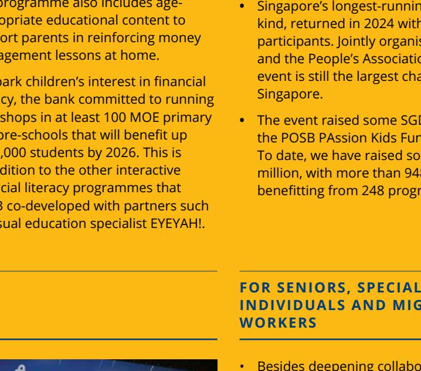

6 DBS Annual Report 2024 • Making Greater Impact

# **Corporate** governance

### **Award**

We were awarded the 'Most Transparent Company Award, Financials Category' by the Securities Investors Association of Singapore at the Investors' Choice Awards.

### **Governance framework**

Our governance framework is anchored on competent leadership, effective internal controls, a strong risk culture and accountability to stakeholders. Our Board plays a key role in setting our governance standards to meet our stakeholders' expectations and our leadership model ensures an appropriate balance of power, accountability and independence in decision-making across our various functional and geographic units.

Our corporate governance practices comply with the Banking (Corporate Governance)
Regulations 2005 (Banking Regulations) and the Financial Holding Companies (Corporate Governance of Designated Financial Holding Companies with Bank Subsidiary) Regulations 2022 (FHC Regulations) (together with the Banking Regulations, the Regulations). We also comply, in all material aspects, with the Guidelines on Corporate Governance for Designated Financial Holding Companies, Banks, Direct Insurers, Reinsurers and Captive Insurers issued by the Monetary Authority of Singapore (MAS) on 9 November 2021, which comprises:

- i) the Code of Corporate Governance 2018 (2018 Code); and
- ii) the additional guidelines added by the MAS to take into account the unique characteristics of the business of banking, given the diverse and complex risks undertaken by financial institutions (Additional Guidelines).

We have described our corporate governance practices for our financial year ended 31 December 2024 with specific reference to the 2018 Code and the Additional Guidelines. A summary disclosure of our compliance with the express disclosure requirements in the 2018 Code and the Additional Guidelines, have been provided on pages 106 to 108.

# **Competent leadership**

### **Our Board**

**Key Information on our Directors** 

### Chairman

### **Mr Peter Seah**

Our Chairman, Mr Peter Seah, sits on all Board committees (other than the Board Sustainability Committee) and also chairs the Board Executive Committee (Board EXCO). Mr Seah performs a key role as an ambassador for DBS in our dealings with various stakeholders as well as in ensuring effective communication with our shareholders. He guides the Board through its decision-making process and ensures that the Board operates effectively as a team.

### **Board**

10 Members

Mr Peter Seah Mr Piyush Gupta\* **Mr Olivier Lim\*\*** 

Mr Chng Kai Fong

Dr Bonghan Cho Mr David Ho Ms Punita Lal Ms Judy Lee Mr Anthony Lim Mr Tham Sai Choy

Proposed Director (Ms Tan Su Shan\*)

The Board directs DBS in the conduct of its affairs and provides sound leadership to management. The make-up of our Board reflects diversity of gender, nationality, age, skills and knowledge. Independent Directors form the majority of the Board and there are no alternate Directors on our Board.

### \*Retirement of Mr Gupta and Appointment of Ms Tan

Mr Gupta will be retiring from the Board and as Chief Executive Officer (CEO) following the conclusion of the DBS Annual General Meeting (AGM) scheduled for 28 March 2025. Ms Tan Su Shan's strategic orientation, track record in building businesses, familiarity with technology, leadership ability as well as strong stakeholder management and communication skills make her the ideal successor.

Subject to the approval of the shareholders at the AGM, Ms Tan will be appointed to the Board as an Executive Non-Independent Director. The number of female directors will increase to three thereafter.

# \*\*Lead Independent director

The Lead Independent director, Mr Olivier Lim, had regular private sessions with the other independent Directors in the course of the year and provided feedback to the Chairman where necessary.

### Chairman, Board and CEO

There is a very positive and constructive working relationship between our Chairman and CEO. The Board is confident that this will continue after the appointment of Ms Tan, who has been in DBS since 2010, as CEO after the conclusion of the AGM in March 2025.

Other than the CEO, none of the other Directors is a former or current employee of DBSH or its subsidiaries.

Corporate governance

47

The table below sets out key information on our Directors, the number of meetings which our Directors attended during 2024 as well as the remuneration of each Director for financial year ended 31 December 2024 (FY2024). The remuneration of Non-Executive Directors (including the Chairman) does not include any variable component. Please refer to page 62 for more details on the Non-Executive Directors' fee structure for FY2024.

|                                                                                                                                                                        | Meetings attendance record (1 January to 31 December 2024) |                   |           |            |                              |                     |      |   |                        | Total remuneration for FY2024 (SGD) |                                      |                       |
|------------------------------------------------------------------------------------------------------------------------------------------------------------------------|---------------------------------------------------------------|-------------------|-----------|------------|------------------------------|---------------------|------|---|------------------------|-------------------------------------|--------------------------------------|-----------------------|
| Director/ Independence status                                                                                                                                       | BOD (1)                                            | NC (2) | <u> </u>  | , <u> </u> | BRMC/ BTRC (5) | CMDC (6) | 1    |   | Offsite (8) | Directors'                          | Share-based                          | Others (c) |
|                                                                                                                                                                        | 6                                                             | 6                 | No. 10 | of m       | eetings 5/6               | held in             | 2024 | 1 | 1                      | fees (a) (SGD)           | remuneration (b) (SGD) | (SGD)                 |
| Mr Peter Seah, 78 Non-Executive and                                                                                                                                 | 0                                                             | 0                 | 10        | 3          | 3/0                          | -4                  | 4    | • | •                      | Total: 1,994,962.97                 |                                      |                       |
| <ul> <li>Non-Independent Chairman</li> <li>Chairman since 1 May 10</li> <li>Board member since 16 Nov 09</li> <li>Last re-elected on 31 Mar 23</li> </ul>              | 6                                                             | 6                 | 10        | 5          | 5/6                          | 4                   | _    | 1 | 1                      | 1,362,550                           | 583,950                              | 48,462.97             |
| Mr Olivier Lim, 60 Non-Executive and Lead                                                                                                                           |                                                               |                   |           |            |                              |                     |      |   |                        |                                     | Total: 453,000                       |                       |
| <ul> <li>Independent Director</li> <li>Board member since 7 Nov 17</li> <li>Last re-elected on 31 Mar 22</li> <li>Lead Independent Director since 29 Apr 20</li> </ul> | 6                                                             | 6                 | 10        | -          | 5/6                          | -                   | -    | 1 | 1                      | 317,100                             | 135,900                              | -                     |
| <b>Dr Bonghan Cho, 60</b> Non-Executive and Independent Director                                                                                                       |                                                               |                   |           |            |                              |                     |      |   |                        |                                     | Total: 334,500                       |                       |
| Board member since 26 Apr 18     Last re-elected on 31 Mar 22                                                                                                          | 6                                                             | 6                 | -         | -          | 5/6                          | 4                   | _    | 1 | 1                      | 234,150                             | 100,350                              | _                     |
| Mr Tham Sai Choy, 65 Non-Executive and Independent                                                                                                                  |                                                               |                   |           |            |                              |                     |      |   |                        |                                     | Total: 448,500                       |                       |
| <ul><li>Director</li><li>Board member since 3 Sept 18</li><li>Last re-elected on 31 Mar 22</li></ul>                                                                   | 6                                                             | 6                 | -         | 5          | 5/6                          | -                   | 4    | 1 | 1                      | 313,950                             | 134,550                              | -                     |
| Ms Punita Lal, 62 Non-Executive and Independent                                                                                                                     |                                                               |                   |           |            |                              |                     |      |   |                        |                                     | Total: 292,000                       |                       |
| <ul><li>Director</li><li>Board member since 1 Apr 20</li><li>Last re-elected on 31 Mar 23</li></ul>                                                                    | 5                                                             | 6                 | -         | 5          | -                            | 3                   | _    | 1 | 1                      | 204,400                             | 87,600                               | -                     |
| Mr Anthony Lim, 66  Non-Executive and Independent  Director                                                                                                            |                                                               |                   |           |            |                              |                     |      |   |                        |                                     | Total: 389,500                       |                       |
| <ul> <li>Board member since 1 Apr 20</li> <li>Last re-elected on 31 Mar 23</li> </ul>                                                                                  | 6                                                             | -                 | 10        | -          | 5/6                          | 4                   | -    | 1 | 1                      | 272,650                             | 116,850                              | -                     |
| Mr Chng Kai Fong, 46 Non-Executive and Non- Independent Director                                                                                                 |                                                               |                   |           |            |                              |                     |      |   |                        |                                     | Total: 303,000 (d)        |                       |
| <ul> <li>Board member since 31 Mar 21</li> <li>Last re-elected on 28 Mar 24</li> </ul>                                                                                 | 6                                                             | 6                 | -         | 5          | -                            | -                   | 3    | 1 | 1                      | 303,000                             | -                                    | -                     |
| Ms Judy Lee, 57  Non-Executive and Independent                                                                                                                         |                                                               |                   |           |            |                              |                     |      |   |                        | Total: 466,000                      |                                      |                       |
| Director  • Board member since 4 Aug 21  • Last re-elected on 28 Mar 24                                                                                                | 6                                                             | -                 | -         | 5          | 5/6                          | 4                   | 4    | 1 | 1                      | 326,200                             | 139,800                              | -                     |

DBS Annual Report 2024 • Making Greater Impact Corporate governance

|                                                                                                                     | Meetings attendance record (1 January to 31 December 2024) |                   |                     |                   |                  |                     |                    |     |                        | Total remuneration for FY2024 (SGD)                                                                   |                                                                                    |                                |
|---------------------------------------------------------------------------------------------------------------------|---------------------------------------------------------------|-------------------|---------------------|-------------------|------------------|---------------------|--------------------|-----|------------------------|-------------------------------------------------------------------------------------------------------|------------------------------------------------------------------------------------|--------------------------------|
| Director/ Independence status                                                                                    | BOD (1)                                            | NC (2) | EXCO (3) | AC (4) | BRMC/ BTRC(5) | CMDC (6) | BSC (7) | AGM | Offsite (8) |                                                                                                       | Directors' fees (a) (SGD) Share-based remuneration (b) (SGD) |                                |
| independence status                                                                                                 |                                                               |                   | No.                 | of m              | eetings          | held in             | 2024               |     |                        |                                                                                                       |                                                                                    | Others (c) (SGD) |
|                                                                                                                     | 6                                                             | 6                 | 10                  | 5                 | 5/6              | 4                   | 4                  | 1   | 1                      |                                                                                                       |                                                                                    |                                |
| Mr David Ho, 65  Non-Executive and Independent Director  Board member since 26 Apr 23  Last re-elected on 28 Mar 24 | 6                                                             | _                 | -                   | 5                 | -                | 4                   | 4                  | 1   | 1                      | Total: 334,000  233,800 100,200 -                                                                     |                                                                                    | -                              |
| Mr Piyush Gupta, 65 Executive Director/ CEO  Board member since 9 Nov 09  Last re-elected on 28 Mar 24              | 6                                                             | 6#                | 10#                 | 5#                | 5/6#             | 4#                  | 4                  | 1   | 1                      | Please refer to the Remuneration Report on pages 69 to 73 for details on the CEO's compensation |                                                                                    |                                |

- (1) Board of Directors (BOD).
- Nominating Committee (NC).
- (3) Board Executive Committee (EXCO).
- Audit Committee (AC).
- Board Risk Management Committee (BRMC) / BRMC Technology Risk Committee (BTRC). (5)
- Compensation and Management Development Committee (CMDC).
- (7) Board Sustainability Committee (BSC).
- (8) This is our annual board strategy offsite.
  (a) Fees payable in cash, in 2025, for being a Director in 2024. This is 70% of each Director's total remuneration and is subject to shareholders' approval at the 2025 AGM.
- This is 30% of each Director's total remuneration and shall be granted in the form of DBSH's ordinary shares. The actual number of DBSH's ordinary shares to be awarded will be rounded down to the nearest share, and any residual balance will be paid in cash. This is subject to shareholders' approval at the 2025 AGM.
- Represents non-cash component and comprises car and driver for Mr Peter Seah.
- Director's remuneration payable to Mr Chng Kai Fong will be paid fully in cash to a government agency, the Directorship and Consultancy Appointments Council.

(Note: Directors are also paid attendance fees for Board and Board committee meetings, as well as for attending the AGM and the annual Board offsite meeting.)

# Mr Gupta attended these meetings at the invitation of the respective committees.

# 2024 board composition

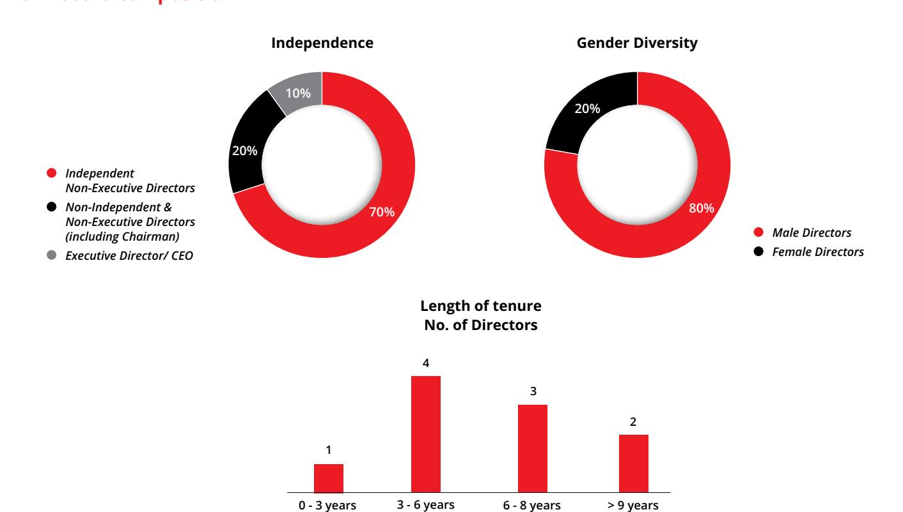

# **Board and Board Committee Composition and Key Responsibilities**

**Composition requirements** 

# Members Board

In compliance with the Regulations, the Board comprises a majority of directors who are independent and who are Singapore citizens or permanent residents.

### **Key Responsibilities**

- Sets the strategic direction and long-term goals of DBS and ensures that adequate resources are available to meet these objectives.
- Monitors the responsibilities delegated to the Board committees to ensure proper and effective oversight and control of DBS' activities.
- Establishes a framework for risks to be assessed and managed.
- Reviews management performance.
- Determines DBS' values and standards (including ethical standards) and ensures that obligations to its stakeholders are understood and met.
- Ensures that corporate responsibility and ethical standards underpin the conduct of DBS' business.
- Develops succession plans for the Board and CEO.
- Considers sustainability issues (including environmental and social factors) as part of DBS' strategy.

### **Board meetings and activities**

Board and Board committee meetings are scheduled well in advance of each year in consultation with the Directors. There are five scheduled Board meetings each year. Ad-hoc meetings are also held when necessary. Please refer to the Board highlights - 2024 section on pages 54 to 55 for more information on the key focus areas of the Board in 2024.

Before each Board meeting, the Chairman oversees the setting of the agenda, in consultation with the CEO, to ensure that there is sufficient information and time to address all agenda items.

The agenda also allows for flexibility when needed. Directors are provided with complete information related to agenda items in a timely manner. All materials for Board and Board committee meetings are uploaded onto a secure portal which can be accessed on tablet devices provided to the Directors.

During every quarterly Board meeting:

- the Chairperson of each Board committee provides an update on significant matters discussed at the Board committee meetings which are typically scheduled before the quarterly Board meeting;
- the CFO presents the financial performance for the quarter/ applicable period and significant financial highlights;
- the CEO gives an update on certain aspects of the Group's business and operations and/ or a macro perspective on industry trends and developments;
- the Board holds a private session for Directors; and
- the Lead Independent Director holds a private session with the other independent Directors.

In addition to the quarterly Board meetings, a Board meeting is typically scheduled in December each year where the CEO gives the Board an update on DBS' performance against the balanced scorecard for that financial year. In addition, the CEO and CFO will present the Group's budget for the next financial year to the Board for approval.

The Chairman promotes open and frank debates by all Directors at every Board meeting. If there is a conflict of interest, the Director in question will recuse himself or herself from the discussions and abstain from participating in any Board decision. When exigencies prevent a Director from attending a Board or Board committee meeting in person, that Director can participate by telephone or video-conference.

Directors have the discretion to engage external advisers. External professionals or in-house subject matter experts may also be invited to present updates on the latest industry and regulatory developments which may have an impact on DBS' affairs.

**Corporate governance 50** DBS Annual Report 2024 **Making Greater Impact 51**

| Members                                                                                                                  | Composition requirements                                                                                                                                                        | Key Responsibilities                                                                                                                                                                                                                                                                                                                                                                                                                                                                                                                                                                                                                                                                                                                                                                                                                                                                                                                                                                                                                                                                                                                                                                                                                                                                                                                                                                                                               | Members                                                                                                                                                                                                   | Composition requirements                                                                                                                                                                                                                                                                                                                                                                                                                                                                                                                                                                         | Key Responsibilities                                                                                           |
|--------------------------------------------------------------------------------------------------------------------------|---------------------------------------------------------------------------------------------------------------------------------------------------------------------------------|------------------------------------------------------------------------------------------------------------------------------------------------------------------------------------------------------------------------------------------------------------------------------------------------------------------------------------------------------------------------------------------------------------------------------------------------------------------------------------------------------------------------------------------------------------------------------------------------------------------------------------------------------------------------------------------------------------------------------------------------------------------------------------------------------------------------------------------------------------------------------------------------------------------------------------------------------------------------------------------------------------------------------------------------------------------------------------------------------------------------------------------------------------------------------------------------------------------------------------------------------------------------------------------------------------------------------------------------------------------------------------------------------------------------------------|-----------------------------------------------------------------------------------------------------------------------------------------------------------------------------------------------------------|--------------------------------------------------------------------------------------------------------------------------------------------------------------------------------------------------------------------------------------------------------------------------------------------------------------------------------------------------------------------------------------------------------------------------------------------------------------------------------------------------------------------------------------------------------------------------------------------------|----------------------------------------------------------------------------------------------------------------|
|                                                                                                                          |                                                                                                                                                                                 | Directors have independent access to the Group Secretary. The Group Secretary attends all Board meetings and minutes are prepared to record key deliberations and decisions taken during the meetings. The Group Secretary facilitates communication between the Board, its committees and management and generally assists Directors in the discharge of their duties. The Group Secretary helps with the induction of new Directors. The appointment and removal of the Group Secretary require the approval of the Board. Annual Board strategy offsite Each year, the Board and our senior executives attend a strategy offsite held in one of our markets, which allows them to: • focus on DBS' long-term strategy apart from the regular agenda at the quarterly Board meetings; • engage in dynamic and in-depth strategic discussions to promote deeper understanding of our business environment and our operations and refine our strategy; and • engage with our stakeholders in the host country (such as regulators, media, customers including CEOs and CFOs of our corporate clients and staff in the local franchise). The 2024 Board strategy offsite was held in the last week of September 2024. Please refer to the Board highlights - 2024 section on page 54 for more information on the discussions during the 2024 Board strategy offsite. | Nominating Committee (NC) • Mr Tham Sai Choy (Chairperson) • Mr Olivier Lim (Lead Independent Director) • Dr Bonghan Cho • Ms Punita Lal • Mr Peter Seah • Mr Chng Kai Fong | In accordance with the requirements of the Regulations, a majority (four out of six members of the NC including the NC Chairperson) are INEDs. The Lead Independent Director is a member of the NC. All NC members are required to be re-appointed by the Board annually. Under the Regulations, every NC member shall hold office until the next annual general meeting following that member's appointment and shall be eligible for re-appointment. The appointment and re appointment of NC members require the prior approval of MAS. | independence of Directors; undergo relevant training; his/ her responsibilities; management staff.    |
|                                                                                                                          |                                                                                                                                                                                 | Frequent and effective engagement Directors have ongoing interactions across various levels, functions and countries within DBS. In addition, some Directors also sit on the boards of our overseas subsidiaries; this arrangement gives the Board access to first-hand insight on the activities of these subsidiaries. The CFO provides the Board with detailed financial performance reports monthly. Directors also have various opportunities to interact with members of the Group Management Committee (GMC), for instance, at quarterly Board-hosted dinners and during the annual board strategy offsite. Delegation by the Board to the Board committees The Board has delegated authority to various Board committees to enable them to oversee certain specific responsibilities based on their terms of reference. The terms of reference of each Board committee set out the responsibilities of the Board committee, conduct of meetings including quorum, voting requirements and qualifications for Board committee membership. All our Board committees (other than the BSC) comprise Non-Executive Directors only. Any change to the terms of reference for any Board committee requires Board approval. The minutes of Board committee meetings, which records the key deliberations and decisions taken during these meetings, are circulated to     | Audit Committee (AC) • Mr Tham Sai Choy (Chairperson) • Mr David Ho • Ms Punita Lal • Ms Judy Lee • Mr Peter Seah • Mr Chng Kai Fong                                              | In accordance with the requirements of the Regulations, a majority (four out of the six members of the AC including the AC Chairperson) are INEDs. Mr Tham possesses an accounting qualification and was formerly the managing partner and Head of Audit of KPMG, Singapore. All members of the AC are non-executive directors and have recent and relevant accounting or related financial management expertise or experience.                                                                                                                        | financial statements; Board; and Internal controls management systems; auditor and/ or regulators; |
| Board Executive Committee (Board EXCO) • Mr Peter Seah (Chairperson) • Mr Olivier Lim • Mr Anthony Lim | In accordance with the requirements of the Regulations, a majority (two out of three members of the Board EXCO) are Independent Non-Executive Directors (INEDs). | all Board members for their information. • Approves certain matters specifically delegated by the Board such as acquisitions and divestments, credit transactions, investments, capital expenditure and expenses that exceed the limits that can be authorised by the CEO; • Reviews weak credit cases on a quarterly basis; • Oversees the governance of strategic risks which do not fall under the ambit of any other Board committee; and • Reviews and provides recommendations on matters that will require Board approval, including acquisitions and divestments exceeding certain material limits.                                                                                                                                                                                                                                                                                                                                                                                                                                                                                                                                                                                                                                                                                                                                                                                          |                                                                                                                                                                                                           |                                                                                                                                                                                                                                                                                                                                                                                                                                                                                                                                                                                                  | from its review.                                                                                               |

### **•** Regularly reviews the composition of the Board and Board committees and independence of Directors; **•** Identifies, reviews and recommends Board appointments for approval by the Board, taking into account the industry knowledge, skills, background, experience, professional qualifications, age and gender of the candidate and the needs of the Board; **•** Conducts an annual evaluation of the performance of the Board, the Board committees and the Directors; **•** Implements the Board Diversity Policy and reviews its effectiveness; **•** Exercises oversight of the induction programme and continuous development programme for Directors and ensures that first-time directors with no prior experience as a director of a listed company in Singapore undergo relevant training; **•** Reviews and recommends to the Board the re-appointment of each Director having regard to his/ her performance, commitment and ability to contribute to the Board as well as his/ her age and skillset; **•** Assesses annually whether each Director has sufficient time to discharge his/ her responsibilities; **•** Reviews the Board's succession plans for Directors; and **•** Reviews and recommends for Board approval, the nominations for the appointment and reasons for resignation or dismissal, of relevant senior management staff. **Financial reporting and disclosure matters •** Monitors the financial reporting process, significant financial reporting issues and judgements to ensure the integrity of the Group's consolidated financial statements; **•** Reviews the Group's consolidated financial statements, other financial disclosures (including Basel Pillar 3 disclosures) and any announcements relating to the Group's financial performance prior to submission to the Board; and **•** Provides oversight of external disclosure governance. **Nominating Committee (NC) • Mr Tham Sai Choy (Chairperson) • Mr Olivier Lim (Lead Independent Director) • Dr Bonghan Cho • Ms Punita Lal •** Mr Peter Seah **•** Mr Chng Kai Fong **Audit Committee • Mr Tham Sai Choy (Chairperson) • Mr David Ho • Ms Punita Lal • Ms Judy Lee •** Mr Peter Seah **•** Mr Chng Kai Fong In accordance with the requirements of the Regulations, a majority (four out of six members of the NC including the NC Chairperson) are INEDs. The Lead Independent Director is a member of the NC. All NC members are required to be re-appointed by the Board annually. Under the Regulations, every NC member shall hold office until the next annual general meeting following that member's appointment and shall be eligible for re-appointment. The appointment and reappointment of NC members require the prior approval of MAS. In accordance with the requirements of the Regulations, a majority (four out of the six members of the AC including the AC Chairperson) are INEDs. Mr Tham possesses an accounting qualification and was formerly the managing partner and Head of Audit of KPMG, Singapore. All members of the

# **Internal controls**

- **•** Reviews (in parallel with the Board Risk Management Committee) the adequacy and effectiveness of internal controls, such as financial, operational, compliance and information technology controls, as well as risk management systems;
- **•** Receives updates on significant incidents of non-compliance with laws and regulations and reviews management's investigations of such incidents;
- **•** Reviews and monitors remedial action plans to address significant internal control deficiencies identified by management, Group Audit, the external auditor and/ or regulators;
- **•** Ensures that there are policies and arrangements in place by which DBS staff and any other persons may, in confidence, raise concerns about possible improprieties in matters of financial reporting or other matters and ensures that arrangements are also in place for such concerns to be independently investigated and for appropriate follow-up action to be taken;
- **•** Reviews significant matters raised through the whistle-blowing channel; and
- **•** Reviews all material related party transactions (including interested person transactions) and keeps the Board informed of the findings and conclusions from its review.

**Corporate governance 52** DBS Annual Report 2024 **Making Greater Impact 53**

| Members                                                                                                                                                                             | Composition requirements                                                                                                                                                                                                                                                                            | Key Responsibilities                                                                                                                                                                                                                                                                                                                                                                                                                                                                                                                                                                                                                                                                                                                                                                                                                                                                                                                                                                                                                                                                                                                                                                                                                                                                                                                                                                                                                                                                                                                                                                                                                                                                                                               | Members                                                                                                                                                                                                                                                                                                                                                                                                                                                                                                                                                                                                                                   | Composition requirements                                                                                                                                                                              | Key Responsibilities                                         |
|-------------------------------------------------------------------------------------------------------------------------------------------------------------------------------------|-----------------------------------------------------------------------------------------------------------------------------------------------------------------------------------------------------------------------------------------------------------------------------------------------------|------------------------------------------------------------------------------------------------------------------------------------------------------------------------------------------------------------------------------------------------------------------------------------------------------------------------------------------------------------------------------------------------------------------------------------------------------------------------------------------------------------------------------------------------------------------------------------------------------------------------------------------------------------------------------------------------------------------------------------------------------------------------------------------------------------------------------------------------------------------------------------------------------------------------------------------------------------------------------------------------------------------------------------------------------------------------------------------------------------------------------------------------------------------------------------------------------------------------------------------------------------------------------------------------------------------------------------------------------------------------------------------------------------------------------------------------------------------------------------------------------------------------------------------------------------------------------------------------------------------------------------------------------------------------------------------------------------------------------------|-------------------------------------------------------------------------------------------------------------------------------------------------------------------------------------------------------------------------------------------------------------------------------------------------------------------------------------------------------------------------------------------------------------------------------------------------------------------------------------------------------------------------------------------------------------------------------------------------------------------------------------------|-------------------------------------------------------------------------------------------------------------------------------------------------------------------------------------------------------|--------------------------------------------------------------|
|                                                                                                                                                                                     |                                                                                                                                                                                                                                                                                                     | Internal audit • Reviews at least annually, the independence, adequacy and effectiveness of the Group's internal audit function (Group Audit) and processes and ensures that Group Audit is adequately resourced and set up to carry out its functions, including approving its budget; • Reviews Group Audit's audit plans, the proposed areas of audit focus and results of audits; • Ensures that an internal quality assurance review (QAR) of Group Audit is conducted annually and that an independent QAR is conducted at least once every five years; and • Approves the hiring, removal, resignation, evaluation and compensation of the Head of Group Audit. External auditor • Determines the criteria for selecting, monitoring and assessing the external auditor and makes recommendations to the Board on the appointment,                                                                                                                                                                                                                                                                                                                                                                                                                                                                                                                                                                                                                                                                                                                                                                                                                                                |                                                                                                                                                                                                                                                                                                                                                                                                                                                                                                                                                                                                                                           |                                                                                                                                                                                                       | Recovery Plan; and                                           |
| Board Risk Management Committee (BRMC) • Mr Olivier Lim (Chairperson) • Dr Bonghan Cho • Ms Judy Lee • Mr Anthony Lim • Mr Tham Sai Choy • Mr Peter Seah | All BRMC members are non executive Directors, which exceeds the requirements of the Regulations. All BRMC members are appropriately qualified to discharge their responsibilities and have the relevant technical financial expertise in risk disciplines or businesses. | re-appointment and removal of the external auditor; • Approves the remuneration and terms of engagement of the external auditor; • Reviews and discusses the key audit matters (identified by the external auditor pursuant to auditing standards) with the external auditor and management and ascertains if these matters are presented appropriately; • Reviews the scope and results of the external audits and the independence, adequacy and objectivity of the external auditor; • Ensures that the external auditor promptly communicates to the AC all information regarding internal control weaknesses or deficiencies and that these are promptly rectified; and • Reviews the assistance given by management to the external auditor. The AC has the authority to investigate any matter within its terms of reference and has full access to and cooperation from management. • Supports the Board and management in setting the tone from the top so as to embed and maintain appropriate risk culture; • Guides the development of and recommends for the Board's approval, the risk appetite for various types of risk and exercises oversight on how this is operationalised into individual risk appetite limits; • Approves the Group's overall and specific risk governance frameworks; • Endorses the appointment of and has direct oversight of the CRO (jointly with the CEO); • Oversees the risk assessment framework established to manage the Group's financial crime, technology risks (including cybersecurity), fair dealing and regulatory risks; • Oversees an independent risk management system and the adequacy and | Sub-committee of the BRMC BRMC Technology Risk Committee (BTRC)* • Mr Olivier Lim (Chairperson) • Dr Bonghan Cho • Ms Judy Lee • Mr Anthony Lim • Mr Tham Sai Choy • Mr Peter Seah • Mr Ajey Gore (Non-Director member) • Mr Marc Massar (Non-Director member) * The BTRC was dissolved on 1 January 2025, with the establishment of the Board Technology Committee ("BTC") on the same day. The BTC subsumes the key responsibilities of the BTRC, while also having a mandate for oversight of the Group's technology strategy and architecture. | There are currently no specific composition requirements prescribed under Singapore regulations. Additional subject matter experts may be co-opted on to the BTRC, where necessary. | and standards.                                            |
|                                                                                                                                                                                     |                                                                                                                                                                                                                                                                                                     | appropriateness of resources to identify and evaluate risks; • Reviews the risks arising from new business activities and the associated risk management and governance approach; • Reviews (in parallel with the Audit Committee) the adequacy and effectiveness of internal controls, such as financial, operational, compliance and information technology controls, as well as risk management systems; • Monitors market developments, such as macro-economic and country risks, financial and operational (including technology, data and artificial intelligence) risks, risk concentrations and stress tests related to these developments; • Monitors risk exposures and profile against relevant risk thresholds and risk strategy in accordance with approved risk appetite and/ or guidelines;                                                                                                                                                                                                                                                                                                                                                                                                                                                                                                                                                                                                                                                                                                                                                                                                                                                                                        | Compensation and Management Development Committee (CMDC) • Mr Anthony Lim (Chairperson) • Dr Bonghan Cho • Mr David Ho • Ms Punita Lal • Ms Judy Lee • Mr Peter Seah                                                                                                                                                                                                                                                                                                                                                                                                                                        | In accordance with the requirements of the Regulations, a majority (four out of the five members of the CMDC including the CMDC Chairperson) are INEDs.                                | business growth; directors; and its continued success. |

| Sub-committee of the                                                                                                                                                                                                                                                                                                                                                                                                                                                                                                                                                                                              | There are currently no specific                                                                                                                                        | • Determines risk reporting requirements, having regard to regulatory guidance and reviews the risk dashboard to keep track of major risk positions and risk developments; • Monitors the quarterly portfolio reviews of total exposures as well as large exposures and asset quality; • Reviews large risk events and subsequent remedial action plans; • Oversees the risk models governance approach, including approving risk models used for capital computation and monitoring the performance of previously approved models; • Exercises oversight of the Internal Capital Adequacy Assessment Process (ICAAP) including approval of stress scenarios and commensurate results for capital, risk-weighted assets, profit and loss and liquidity; • Approves the Business Continuity Management attestation and Group Recovery Plan; and • Exercises oversight of regulatory requirements relating to risk management. • This sub-committee was formed under the direction of the Board to |
|-------------------------------------------------------------------------------------------------------------------------------------------------------------------------------------------------------------------------------------------------------------------------------------------------------------------------------------------------------------------------------------------------------------------------------------------------------------------------------------------------------------------------------------------------------------------------------------------------------------------|------------------------------------------------------------------------------------------------------------------------------------------------------------------------|-----------------------------------------------------------------------------------------------------------------------------------------------------------------------------------------------------------------------------------------------------------------------------------------------------------------------------------------------------------------------------------------------------------------------------------------------------------------------------------------------------------------------------------------------------------------------------------------------------------------------------------------------------------------------------------------------------------------------------------------------------------------------------------------------------------------------------------------------------------------------------------------------------------------------------------------------------------------------------------------------------------------------------------------------|
| BRMC BRMC Technology Risk Committee (BTRC)* • Mr Olivier Lim (Chairperson) • Dr Bonghan Cho • Ms Judy Lee • Mr Anthony Lim • Mr Tham Sai Choy • Mr Peter Seah • Mr Ajey Gore (Non-Director member) • Mr Marc Massar (Non-Director member) * The BTRC was dissolved on 1 January 2025, with the establishment of the Board Technology Committee ("BTC") on the same day. The BTC subsumes the key responsibilities of the BTRC, while also having a mandate for oversight of the Group's technology strategy and architecture. | composition requirements prescribed under Singapore regulations. Additional subject matter experts may be co-opted on to the BTRC, where necessary.     | enhance technology resiliency and governance. • Reviews, and where applicable, makes recommendations to the BRMC on management's approach/ proposals in relation to the technology risk management strategy, framework, risk appetite and risk tolerance that the Group is willing and able to assume; • Exercises oversight of the technology risk management function of the Group and the efforts to nurture a strong culture of technology risk awareness and management throughout the Group; • Reviews technology risk exposures or incidents and remedial plans taken to monitor and control such risks as well as emerging technology risk trends; and • Reviews the Group's compliance with technology-related regulations and standards.                                                                                                                                                                                                                                                        |
| Compensation and Management Development Committee (CMDC) • Mr Anthony Lim (Chairperson) • Dr Bonghan Cho • Mr David Ho • Ms Punita Lal • Ms Judy Lee • Mr Peter Seah                                                                                                                                                                                                                                                                                                                                                                                                                | In accordance with the requirements of the Regulations, a majority (four out of the five members of the CMDC including the CMDC Chairperson) are INEDs. | • Exercises supervisory oversight of the philosophies, principles, parameters and governance of DBS' remuneration policy and ensures that DBS' compensation approach balances risk management with long-term business growth; • Oversees the remuneration of senior executives and Directors, including making recommendations to the Board on the remuneration of executive directors; and • Exercises oversight on talent development and succession planning of the Group to ensure a robust talent bench strength and deepen the necessary competencies and strong leadership capabilities of the Group's people for its continued success.                                                                                                                                                                                                                                                                                                                                                                 |

DBS Annual Report 2024 • Making Greater Impact Corporate governance

### **Composition requirements Key Responsibilities** Members • Oversees DBS' plans and approves strategies, goals and targets in relation **Board Sustainability** There are currently no specific Committee (BSC) to the Group's sustainability pillars: Responsible Banking, Responsible composition requirements Business Practices and Impact Beyond Banking; • Mr Piyush Gupta prescribed under Singapore (Chairperson) regulations. • Reviews and approves the Group's Sustainability Report, including Mr David Ho approaches to meet disclosure requirements such as regulatory Additional subject matter experts Ms Judy Lee specifications or listing obligations; may be co-opted on to the BSC, Mr Tham Sai Choy • Reviews and approves the Group's climate-related disclosures, including where necessary. • Mr Chng Kai Fong business and financial implications, which may arise from climate-related • Dr Ben Caldecott stress tests and consider viability of proposed responses; (Non-Director • Exercises oversight of the Group's Board and Management governance member) framework on sustainability matters (e.g., Group Sustainability Council), including those for material operating subsidiaries, taking into account regulatory expectations; and • Oversees emerging sustainability issues and the strategies and outreach programmes for engaging DBS' key stakeholder groups.

\* Names denoted in red are INEDs.

# Highlights of Board and Board Committees - 2024

### Board highlights - 2024

# Strategic Focus Areas

The Board undertook regular reviews of the Group's financial performance, giving due consideration to the impact of evolving geopolitics and macro-economic developments such as the slowdown in China's economy and interest rates volatility.

The Board focused on several strategic initiatives, including (i) the succession plans for the CEO and other members of the senior leadership team; (ii) capital management measures in light of Basel III capital reforms, including calibrations to the dividend policy and other distribution alternatives such as share buybacks; (iii) the development and oversight of a robust technology resiliency roadmap to support future growth; (iv) inorganic growth strategy, including new investments such as the acquisition of additional stakes in DBS Securities China and Shenzhen Rural Commercial Bank; and (v) the progress of integration efforts in India and Taiwan, the Group's sustainability strategy, people and culture issues as well as other priorities in the Group's 2024 scorecard.

At its annual offsite, the Board deliberated on several long-term developments that would shape the Group's strategy. Key topics included the transformative potential of artificial intelligence (AI) and generative AI (Gen AI) and the implications of the evolving digital asset landscape for banking. The Board also assessed potential new markets, and considered future strategies to address the social impact of an aging Asia.

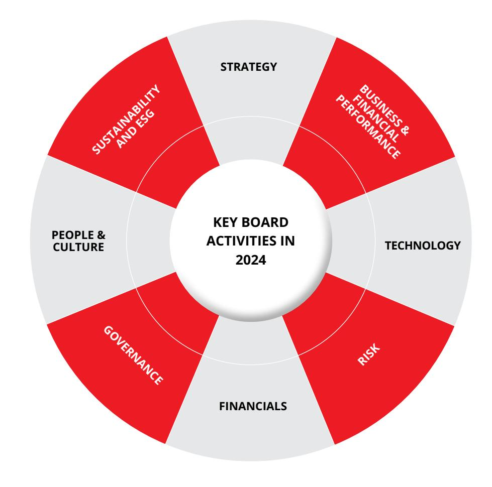

### **Key Leadership Appointments**

The Board reviewed several key leadership appointments in 2024, including the appointments of:

(i) Ms Tan Su Shan as Deputy CEO in August 2024. She will succeed Mr Piyush Gupta as CEO upon his retirement in March 2025. This decision was the result of a decade-long succession strategy, during which potential internal candidates, including Ms Tan, were subjected to extensive development, benchmarking and evaluation against external candidates;

(ii) Mr Eugene Huang as CIO in May 2024. This appointment reinforces the Board's focus on attracting top technology talent and strengthens DBS' commitment to a robust technology infrastructure that supports strategic growth and delivers a seamless banking experience for customers; and  (iii) Mr Han Kwee Juan, previously Singapore Country Head, as Group Head of Institutional Banking with effect from 1 January 2025. This reflects the Board's commitment to developing and promoting exceptional talent from within the organisation to drive continued success.

### **Unlocking Shareholder Value**

In line with the Group's policy of paying ordinary dividends that are sustainable and progressively rise with earnings, the ordinary dividend payout had doubled over the past five years, supplemented by occasional special dividends. The Board had, in early 2024, also approved a one-for-10 bonus share issue, which effectively raised dividends by 10%.

In November 2024, further affirming its commitment to capital management, the Board approved the establishment of a new SGD 3 billion share buyback programme, where shares will be purchased in the open market and cancelled. The buybacks will be carried out at management's discretion and subject to market conditions. This will further enhance shareholder returns while preserving DBS' strong capital position.

Reflecting its commitment to manage down the stock of excess capital, the Board plans to introduce a Capital Return dividend of 15 cents per share per quarter to be paid out over financial year 2025.

### **Technology Matters**

During the year, the Board monitored the progress of the Technology Risk Management Uplift (T-Up) programme which focused on four themes –change management, system resilience, incident management and technology risk governance and oversight. The T-Up programme has largely achieved its objectives and efforts have since transitioned to a sustained focus on resiliency in Singapore and other core markets.

In recognition of the increasing importance of robust technology governance and oversight, the Board decided to establish the BTC, effective 1 January 2025, following a comprehensive review and benchmarking exercise. The BTC subsumes the BTRC's responsibilities and provides strategic oversight of DBS' technology strategy, risk governance and risk approaches across the group. This complements the BRMC's overall oversight of enterprise and risk culture. The BTC's other responsibilities include ensuring alignment of technology strategy with business initiatives, reviewing major technology investments, overseeing technology risks and cybersecurity and ensuring data quality and governance.

Please refer to sections "Letter from Chairman & CEO," "CRO statement" and "CIO statement" in the

Annual Report for a more in-depth description of the establishment of the BTC and the T-Up programme.

# Pursuing Inorganic Acquisitions and New Business Initiatives

The Board reviewed several inorganic acquisitions and new business initiatives. These transactions included the acquisition of (i) an additional 40% shareholding interest in DBS Securities (China) Ltd (DBS Securities China), increasing our shareholding from 51% to 91%, and (ii) an additional 2.71% stake in Shenzhen Rural Commercial Bank, increasing our shareholding from 16.69% to 19.4%.

The Board also deliberated on several potential acquisitions and the risks arising from new business initiatives, and ensured that appropriate risk management and governance policies and procedures were put in place to manage these.

### **Sustainability and ESG**

The Board reaffirmed that DBS' sustainability strategy remains fundamentally sound, effectively integrating environment, social and governance factors into the Group's core business strategy and yielding a positive impact. This reflects DBS' ambition to be the "Best Bank for a Better World."

To drive sustainable value creation, while addressing some of society's most critical challenges, DBS had expanded financial services for vulnerable populations, developing sustainability solutions for businesses and taking action to achieve a net zero future through a just and inclusive transition. This approach balances Asia's economic growth, energy security and the needs of its growing population and industrial sector, while advancing global decarbonisation.

Beyond responsible banking, DBS' efforts are further showcased through the DBS Foundation, and DBS' commitment of up to SGD 1 billion over ten years will continue to uplift the lives and livelihoods of vulnerable communities in Asia.

For further details, please refer to the section "BSC" in the Corporate Governance Report in the Annual Report and the dedicated Sustainability Report issued by DBS.

### **People and Culture**

The Board received an update on the results of the 2024 "My Voice" employee survey, which achieved a record score, surpassing both Asian peers and Asia Pacific financial services industry benchmarks. This reflects sustained high engagement of employees in most core markets.

The Board was also updated on the efforts taken to address the low-scoring dimensions of the My Voice survey including the need to improve engagement scores in Group Technology and to reshape the technology

risk culture. Other initiatives include plans to improve cooperation between groups/ departments and to better manage workload.

55

### **Board Executive Committee**

"In 2024, the Board EXCO acted as the initial sounding board for Management's capital distribution proposals, including dividends, the bonus share issue and share buybacks, while evaluating key investment decisions, such as those in DBS Securities China and Shenzhen Rural Commercial Bank.

At the same time, the Board EXCO conducted regular reviews of weak credits and approved annual country transfer risk limit proposals for several key markets."

Peter Seah Chairman, Board EXCO

# Highlights of Board EXCO's activities in 2024

- The Board EXCO assists the Board to enhance the business strategies and strengthen core competencies of DBS.
   The Board EXCO meets frequently and is able to offer greater responsiveness in the decision-making process of DBS.
- In addition to its quarterly review of weak credit cases, matters discussed and/ or endorsed at the Board EXCO meetings in 2024 included (i) annual transfer risk limits for key markets; (ii) investments and acquisitions such as the acquisition of an additional stake in DBS Securities China, and Shenzhen Rural Commercial Bank (iii) potential acquisition and investment opportunities; (iv) the Bank's efforts in managing the impact of Base Erosion and Profit Shifting (BEPS) 2.0, including the implementation of the 15% minimum tax requirement under the Global Anti-Base Erosion (GloBE) Model rules; (v) DBS' capital management strategy and capital distribution proposals; (vi) significant and key contracts and agreements; (vii) various internal policies and guidelines; and (viii) analysis of peer banks' results.

**56** DBS Annual Report 2024 **Making Greater Impact Corporate governance 57**

### **Nominating Committee**

*"In 2024, the NC recommended the establishment of a Board Technology Committee, to oversee technology matters, including technology strategy, architecture and risk management.* 

*Additionally, the NC made key recommendations on DBS' leadership appointments, including the appointment of Su Shan first as Deputy CEO in August 2024 and subsequently CEO at the conclusion of the 2025 AGM, as well as Eugene as Chief Information Officer and Kwee Juan as Institutional Banking Group Head.*

*The NC had also reviewed the detailed Board evaluation results, which were subsequently presented to the Board. The Board continues to be well-managed and effective in fulfilling its duties and responsibilities."* 

*Tham Sai Choy Chairman, NC*

### **Highlights of NC's activities in 2024**

# **Board renewal process**

*Please refer to the Board highlights - 2024 section on page 54.*

# **Selection criteria and nomination process for Directors**

Before a new Director is appointed, suitable candidates are identified from various sources. Thereafter, the NC conducts an assessment to:

- **•** review the candidate (including qualifications, attributes, capabilities, skills, age, past experience) to determine whether the candidate is fit and proper in accordance with the fit and proper guidelines issued by the MAS; and
- **•** ascertain whether the candidate is independent from DBSH's substantial shareholder and/ or from management and business relationships with DBS.

The NC then interviews the short-listed candidates and makes its recommendations to the Board. All Board appointments are based on merit, taking into account the contributions the candidates can bring to the Board to enhance its effectiveness. Upon the appointment of a new Director, the NC will recommend to the Board his or her appointment to the appropriate Board committee(s) after matching the Director's skillset to the needs of each Board committee.

### **Board Renewal**

Board renewal is a key focus for the Board. The NC conducts an annual review of each Director and the composition of the Board and Board committees. New Directors will be introduced gradually so that the Board and Board committees have a smooth transition period.

Diversity in, *inter alia*, gender and skillsets were one of the key considerations in the board renewal process to ensure that (i) the Board is appropriately balanced to support the long-term success of DBS; (ii) the skillsets of the retiring Directors are replaced and/ or the collective skillsets of the Directors is supplemented; and (iii) different perspectives are brought to the Board. Other key considerations include (i) whether the candidate would fit in with our Board's culture and diversity; (ii) the independence status of the candidate; and (iii) whether the candidate would be able to commit sufficient time to fulfil the duties of a Director. A skills matrix is used to assess if the skills and experience of a candidate complement those of the existing Board members. Potential candidates are informed of the level of contribution and commitment expected of a DBS Director.

As part of the Board renewal process:

- (i) Mr Piyush Gupta will be stepping down from the Board at the conclusion of the 2025 Annual General Meeting (2025 AGM), having served on the Board for more than 15 years; and
- (ii) Subject to shareholders' approval, Ms Tan Su Shan will be appointed to the Board at the 2025 AGM. With Mr Gupta's retirement and Ms Tan's appointment, while the Board will remain at 10 members and the proportion of Independent Directors will remain the same at 70%, the percentage of female directors on the Board will increase from 20% to 30%.

### **Induction and Training for Directors**

The NC oversees the onboarding of new Directors. All new Directors go through our induction programme, which covers the duties and obligations of a Director and the responsibilities of, and work carried out by the Board committees. We provide a Director's pack, which acts as an aide memoire for the information covered by the induction programme. We have briefing sessions for Directors given by members of senior management on the various businesses of DBS and its supporting functions. The NC is also responsible for ensuring that new Directors with no prior experience as a director of a listed company in Singapore undergo training in the roles and responsibilities of a director of a listed

company. In this regard, Ms Tan Su Shan, having served on the Board of a listed company in Singapore previously, is familiar with the requisite responsibilities.

### **Annual review of Directors' independence**

The NC reviews and determines annually whether each Director is independent in accordance with the stringent standards required of financial institutions prescribed under the Regulations. Under the Regulations, an "independent director" is defined to mean a Director who is:

- **•** independent from any management and business relationship with DBS;
- **•** independent from any substantial shareholder of DBS; and
- **•** has not served on the Board of DBS for a continuous period of nine years or longer.

The NC assessed and concluded that (i) all Directors are considered to be independent from business relationships with DBS; (ii) with the exception of Mr Piyush Gupta, all Directors are considered to be independent from management relationships with DBS; (iii) with the exception of Mr Chng Kai Fong, all Directors are considered to be independent from DBSH's substantial shareholder, Temasek Holdings (Private) Limited (Temasek). Mr Chng, who is the Permanent Secretary (Information and Development) for the Ministry of Digital Development and Information and concurrently the Permanent Secretary (Development) (Cybersecurity) in the Prime Minister's Office, Singapore, is considered not independent of Temasek as the Singapore government is its ultimate owner; and (iv) Mr Peter Seah is a Non-Independent Director as he has served on the Board for more than nine years. Based on the NC's assessment, the Independent Directors are Dr Bonghan Cho, Mr David Ho, Ms Punita Lal, Ms Judy Lee, Mr Olivier Lim, Mr Anthony Lim and Mr Tham Sai Choy.

Although Mr Piyush Gupta, Mr David Ho, Ms Judy Lee, Mr Olivier Lim, Mr Anthony Lim, Mr Peter Seah and Mr Tham Sai Choy are on the boards of companies that have business relationships with DBS, and/ or are also directors of companies in which Temasek has investments (Temasek portfolio companies), the NC considers these Directors (i) independent of business relationships as the revenues arising from such relationships are not material; and (ii) independent of Temasek as their appointments on the boards of Temasek portfolio companies are nonexecutive in nature and they are not involved in the day-to-day conduct of the businesses of the Temasek portfolio companies. In addition, none of these Directors sit on any of the boards of the Temasek portfolio

companies as a representative of Temasek and they do not take instructions from Temasek in acting as Directors.

## **Board performance and evaluation**

The NC makes an assessment at least once a year to determine whether the Board and Board committees are performing effectively and identifies steps for improvement. The NC believes that it is important to obtain an independent perspective on the Board's performance periodically and to gain insights on the Board's performance against peer boards and best practices. An external evaluator was last engaged to conduct the Board performance evaluation for the financial year ended 2023.

In 2024, the NC decided to use the same evaluation questionnaire from 2023, incorporating additional questions for technology risks, to facilitate benchmarking. The questionnaire included questions on clarity on key issues and strategy, risk and technology risk oversight, Board culture, capability, diversity, meetings, processes, structure and support, stakeholder relations, overall Board dynamics and the effectiveness of Board and Board committees. Each Director was asked to complete the questionnaire and submit it directly to the Group Secretary who collated the responses and produced a summary report for the NC. The NC analysed the report and submitted its findings to the Board. The Board (i) reviewed the evaluation results, which showed consistently high performance across all categories, reflecting the Board's continued effectiveness and strong governance, and (ii) discussed the feedback received from several directors.

In addition to the annual Board evaluation exercise, the NC also conducts an annual review of each Director to determine whether each Director remains qualified for office. In making its determination, the NC will take into account (i) the Director's age, track record, experience, skills and capabilities; (ii) whether each Director is able to and has been adequately carrying out his/ her duties as a Director, including the contributions and performance of each Director; and (iii) whether each Director has committed sufficient time to his/ her duties as a director of DBS. The Board is satisfied that each Director has diligently discharged his or her duties as a Director of DBS and has contributed meaningfully to DBS.

### **Directors' time commitment**

The meeting attendance records of all Directors as well as a list of their directorships of listed companies and their principal commitments are fully disclosed in the Annual Report. The NC assesses each Director's ability to commit time to DBS'

affairs in accordance with internal guidelines which take into account the number of other board and committee memberships a Director holds, as well as the size and complexity of the companies in which he/ she is a board member. Additionally, each Director is required to complete an annual self-assessment of his/ her time commitments.

While the Board has not set a maximum number of listed company board representations a Director may hold, all Directors appreciate the high level of commitment required of them. All Directors have met the requirements under the NC's guidelines. Based on the recent individual Director self-assessment for FY2024 and the attendance record of Board and Board Committee meetings during the year, the NC was satisfied that where a Director had other listed company board representations, and/ or other principal commitments, the Director was able and had been adequately carrying out his/ her duties as a director of DBS.

# **Directors' tenure**

The NC believes that it is in the interest of DBS for the Board to comprise both Directors with long tenure, who bring deep institutional knowledge and an understanding of the banking industry and those with shorter tenures, who offer fresh ideas and perspectives. There are currently two Directors, Messrs Peter Seah and Piyush Gupta, who have served for more than 15 years, and this is balanced by the progressive refreshing of the Board where seven longserving Directors have stepped down and eight new Directors have been appointed since November 2017 (when we commenced the refreshing process).

As part of this ongoing refreshment, Mr Gupta, who has served on the Board for over 15 years, will step down as a Director following his retirement as CEO at the conclusion of the AGM. He will be succeeded by Ms Tan Su Shan. This transition further enhances the Board's renewal while maintaining the balance between experience and fresh perspectives.

The NC specifically considered the skillsets and contributions of Mr Seah. The NC deliberated and agreed that it is in DBS' interests for Mr Seah to continue serving on the Board of DBS as Mr Seah would be able to provide leadership, stability and continuity following the leadership transition period from Mr Gupta to Ms Tan Su Shan. Mr Seah is a veteran former banker with wide industry experience and has been instrumental in the growth and transformation of DBS over the past 15 years. Mr Seah's deep knowledge of DBS' strategic priorities, operational and institutional culture will provide invaluable

support to Ms Tan as the incoming Chief Executive Officer. His continued presence on the Board will also reassure key stakeholders of the continuity of DBS' strategic direction. This stability is vital as DBS navigates evolving global challenges and pursues its growth ambitions.

### **Re-election of Directors**

Under the Constitution of DBSH, one-third of the Directors, comprising those who are longest-serving since their last re-election, are required to retire from office and, if eligible, stand for re-election at each AGM. Based on this rotation process, each Director is required to submit himself or herself for re-election by shareholders at least once every three years. In addition, new Directors (who are appointed in between AGMs) are required under DBSH's Constitution to stand for re-election at the first AGM after their appointment. The NC reviews and recommends to the Board the rotation and re election of Directors at the AGM.

Prior to each AGM, Group Secretariat informs the NC which Directors are required to retire at that AGM. The NC will then review the composition of the Board and decide whether to recommend to the Board the re-election of these Directors, after taking into account factors such as their attendance, participation, contribution, expertise and competing time commitments.

At the 2025 AGM, Mr Olivier Lim, Dr Bonghan Cho and Mr Tham Sai Choy will be retiring by rotation. At the recommendation of the NC and as approved by the Board, all three Directors will be standing for re-election.

### **Review of composition of Board Committees and Formation of BTC**

The NC regularly reviewed the size and composition of the Board committees in 2024 to ensure that all independence requirements continue to be met, and that the Board committees are of an appropriate size and comprise the appropriate balance of skills, knowledge and experience, as well as diversity of nationality, age and gender.

In 2024, to enhance the overall effectiveness of the Board and its committees, the NC recommended the establishment of the BTC. This reflects the increasing importance of technology across all aspects of DBS' operations and its strategic direction. The expanded mandate of the BTC, encompassing both risk management and strategic technology oversight, provides the Board with a more holistic and informed perspective on technology-related matters and challenges. In relation to this, the NC also reviewed and endorsed the composition of the BTC, which includes Mr Olivier Lim as BTC Chairman, Mr Peter Seah, Mr Chng Kai Fong and Dr Bonghan Cho as members, as well as

**58** DBS Annual Report 2024 **Making Greater Impact Corporate governance 59**

two non-director members, Messrs Ajey Gore and Marc Massar. This took into account Mr Lim's existing chairmanship of the BRMC/ BTRC as well as the technology expertise of the BTC members.

## **Continuous development programme for all Directors**

The NC monitors the frequency and quality of the Board training sessions, which are conducted either by external professionals or by management. The NC selects topics which are relevant to the Group's activities. Board members also contribute by highlighting areas of interests and possible topics.

The topics presented to the Board in 2024 as part of the continuous development programme included (i) a training session on the impacts to credit risk, market risk and operational risk due to the Basel III reforms, and (ii) insights from an external expert on cybersecurity.

### **Board diversity**

We recognise that diversity is not merely limited to gender or any other personal attributes. We adopted a Board Diversity Policy which recognises the importance of having an effective and diverse Board and states that the NC is responsible for setting the relevant objectives that promote and achieve diversity on the Board. In discharging its duties, the NC gives due regard to the benefits of all aspects of diversity and strive to ensure that the Board is appropriately balanced to support the long-term success of DBS.

The main objective of the Board Diversity Policy is to continue to maintain the appropriate balance of perspectives, skills and experience on the Board to support the long-term success of DBS. The Board Diversity Policy provides that the NC shall endeavour to ensure that female candidates are included for consideration when identifying candidates to be appointed as new directors, with the aim of having not less than two female directors on the Board and targeting to achieve 30% female Board representation by 2030.

The NC is responsible for developing a framework to identify the skills that the Board collectively needs in order to discharge the Board's responsibilities effectively, taking into account the complexity of DBS' existing risk profile, business operations and future business strategy. The NC has put in place a skills matrix which classifies skills, experience and knowledge of Directors into the following broad categories (i) Industry knowledge and experience; (ii) Financial and commercial acumen; (iii) Governance; (iv) Leadership; (v) Digital and Technology; and (vi) Sustainability.

The NC believes that there is an appropriate balance of industry knowledge, skills, background, experience, professional qualifications, age and gender on the Board and is satisfied that the objectives of the Board Diversity Policy continue to be met.

### **Audit Committee**

*"In 2024, in view of the potential impact from regulatory penalties on PwC's operations in China and Hong Kong, the AC undertook a pre-emptive re-tender exercise for DBS' external auditors to ensure that there is no disruption to the external audit of the Group.* 

*After a thorough evaluation, the AC has recommended, and the Board has endorsed the retention of PwC as our external auditors. The AC has obtained adequate assurance that PwC's audit network remains resilient to support DBS' audit requirements. Additionally, PwC had fielded a strong candidate as the successor to the existing Lead Engagement Partner as part of audit partner rotation."* 

*Tham Sai Choy Chairman, AC*

### **Highlights of AC's activities in 2024**

# **External Auditor Re-tender Exercise**

In 2024, the AC undertook a re-tender for the selection of DBS' external auditor. This pre-emptive exercise was initiated in light of potential regulatory actions against PwC, stemming from the Evergrande failure and the possible impact on PwC's franchise and the audits of DBS' China and DBS Hong Kong. The objective was to ensure that the appointment of an external auditor that would meet DBS' evolving audit requirements, while maintaining high standards of quality and governance. The AC last undertook a re-tender exercise in July 2019, in compliance with regulatory requirements.

PwC, along with other leading audit firms, submitted detailed proposals showcasing their capabilities, expertise and alignment with DBS' needs. These proposals included leveraging advanced technologies to enhance audit quality, addressing critical concerns such as succession planning, resource allocation and providing insights into emerging areas such as technology risk management and artificial intelligence.

After a thorough evaluation, the AC recommended, and the Board approved, the retention of PwC as DBS' external auditor. While acknowledging that PwC faces some challenges in certain geographies, including

the regulatory actions imposed by China, the AC obtained adequate assurance that PwC's audit network remains resilient to support the Group's audit requirements. Furthermore, PwC fielded a strong candidate as the successor to the existing Lead Engagement Partner, as part of audit partner rotation.

### **Reviewing performance, objectivity and independence of the external auditor**

The AC reviews the performance, objectivity and independence of the external auditor on an ongoing basis. For this purpose, the AC takes into account the Audit Quality Indicators Disclosure Framework issued by the Accounting and Corporate Regulatory Authority (ACRA); the guidance provided in Practice Guidance 10 of the 2018 Code, as well as the principles outlined by the Basel Committee on Banking Supervision in its document ''The External Audits of Banks".

The AC's review also considered PwC's performance against industry and regulatory standards; the scope and quality of audit services; internal feedback on PwC' resources, independence and effectiveness; Audit Quality Indicators data; and PwC's selfassessment of independence.

The AC has unfettered access to the external auditor. Separate sessions were held during each of the four quarterly AC meetings in 2024 for the AC to meet with the external auditor without the presence of management to discuss matters that might have to be raised privately.

The total fees due to PwC for the financial year ended 31 December 2024 and the breakdown of the fees for audit and nonaudit services, are set out in the table below. The AC reviewed the non-audit services provided by the external auditor during the financial year and the associated fees. The AC is satisfied that the independence and objectivity of the external auditor have not been impaired by the provision of those services.

| Fees relating to PwC services for FY2024 | SGD (million) |
|---------------------------------------------|------------------|
| For audit and audit-related services     | 10.9             |
| For non-audit services                      | 1.3              |
| Total                                       | 12.2             |

Based on these considerations, the AC has recommended, and the Board has endorsed, the re-appointment of PwC for shareholders' approval at the 2025 AGM. The Group has complied with Rule 712 and Rule 715 of the SGX Listing Manual in relation to its external auditor.

# **Oversight of financial reporting and disclosure matters**

In response to the risk-based approach to quarterly reporting that was adopted by the Singapore Exchange Regulation (SGX RegCo) from 7 February 2020, the Group transitioned to a semi-annual reporting regime that is complemented by trading updates between the half-yearly financial reports. The trading updates, which comprise the profit and loss account, key balance sheet items, financial ratios and business commentary, are intended to provide investors with continued line of sight on the Group's ongoing performance.

The AC reviewed the Group's trading updates and half-yearly financial statements, and recommended these to the Board for approval. The AC also took into account the assurances provided by the CEO and CFO that the financial statements are properly drawn up in accordance with the provisions of the Singapore Banking Act, Singapore Companies Act and Singapore Financial Reporting Standards (International) (SFRS(I)), and that the Group's financial risk

management and internal control systems are adequate and effective.

The AC members were kept updated on changes to accounting standards and significant accounting matters involving the exercise of judgement. During the course of the financial year, the AC reviewed the following areas:

- **•** Asset quality and the adequacy of provisions in light of the prevailing economic and political conditions, giving due consideration to the application of the SFRS(I) expected credit loss (ECL) requirements;
- **•** Valuation matters, including assessing the adequacy of valuation reserves and the carrying value of goodwill;
- **•** The finalisation of goodwill arising from the integration of Citi Consumer Taiwan, including the key drivers accounting for the variance from the provisional estimate and
- **•** Impact of the final Basel III reforms and the Two-Pillar solution under BEPS 2.0.

The AC reviewed the Group's audited consolidated financial statements for FY2024 and discussed with management and the external auditor the significant matters which involved management judgement.

*Please refer to the table on page 59 for further information on these significant matters. These matters are also discussed in the independent auditor's report on pages 114 to 119.*

The AC is of the view that the Group's consolidated financial statements for FY2024 are fairly presented in conformity with the relevant SFRS(I) in all material aspects. The Board has been notified that the Group's external auditor, PricewaterhouseCoopers LLP (PwC), has read and considered the other information (i.e., other than the financial statements and auditor's report thereon) in the annual report, whether financial or nonfinancial, in accordance with the Singapore Standard on Auditing 720. For the financial year ended 31 December 2024: (i) no material inconsistencies between the other information, the financial statements and PwC's knowledge obtained in the audit; and (ii) no material misstatements of the other information, have been reported.

## **AC commentary on key audit matters**

# **Significant matters How the AC reviewed these matters Specific allowances for loans and advances** The AC reviewed the significant non-performing credit exposures periodically and considered management's judgments, assumptions and methodologies used in the determination of the level of specific allowances required. The AC noted that major weak credits are reviewed by the Board Executive Committee quarterly and presented to the AC. The AC considered the results from Group Audit's independent assessment of the Group's credit portfolios across key markets and credit risk management process. Additionally, the AC was apprised of the external auditor's review, which included sampling across performing, watch-list and non-performing portfolios to assess the appropriateness of the loan ratings and classification, as well as the adequacy of specific allowances where applicable. The AC is of the view that the special allowances that have been set aside for non-performing credit exposures are appropriate. **General allowances for credit losses** The AC reviewed the governance arrangements, including the matters considered by the Expected Credit Loss (ECL) Review Committee, as well as the key drivers of the quarterly movements in Stage 1 and Stage 2 ECL (General Allowances). These included the changes in portfolio asset quality, prevailing economic and geopolitical conditions, as well as modelled overlays to reflect management's assessment of these factors. The AC noted that ECL models are validated by the Model Validation Team, which also monitors the models' performance, and approved by the Group Credit Risk Models Committee. The AC took into account the external auditor's observations, which included a review of selected portfolios by credit specialists. The external auditor had also assessed the Group's ECL methodologies (including calibrations to account for changes in the risk outlook), processes and controls. The AC, on the back of these reviews, considers the General Allowances to be within a reasonable range. **Valuation matters** The AC reviewed the governance arrangements, including the deliberations of the Group Valuation Committee, as well as the fair value hierarchy of financial instruments held at fair value, the quarterly movements in valuation reserves, the appropriateness of the Group's valuation methodology in light of industry developments, and the overall adequacy of valuation reserves. The AC was apprised of the external auditor's observations from its assessment of the Group's controls over the valuation process, as well as its conclusion, based on the result of its independent estimates, that the valuation of Level 2 and Level 3 financial instruments held at fair value was within a reasonable range of outcomes. The AC considers the valuation process, policies and estimates as adopted and disclosed in the financial statements to be appropriate.

**Corporate governance 60** DBS Annual Report 2024 **Making Greater Impact 61**

### **Oversight of Group Audit**

The AC has direct oversight of Group Audit. The AC receives reports from Group Audit at each quarterly AC meeting, which provide the AC with an update on (i) the overall control environment (based on the results of the audit reviews in the preceding quarter); (ii) the key findings from audit reviews and the remediation actions which have been, or will be, taken to address these findings; (iii) an overview of the audit issues (including re-aged and past due issues) and audit reports issued during the preceding quarter; and (iv) any changes to the audit plan for AC approval.

With the appointment of Group Audit as the independent Assessor to review and provide regular reports to the Board and MAS on the progress of the Bank's Technology Uplift (T-Up) programme, the AC receives the Assessor's reports which are also presented and discussed at the Board Technology Risk Committee meetings. These progress reports are submitted to MAS upon the AC's approval.

### *Please refer to pages 64 to 65 for details on Group Audit's key responsibilities and processes.*

As Assessor of the Bank's T-Up programme, Group Audit's scope includes the tracking of the Bank's progress on the IT improvement initiatives. This includes the assessment of the adequacy and effectiveness of the measures taken to strengthen the Bank's Technology Risk Management capabilities. To provide a holistic perspective, the AC was also updated on IT areas audited which are not part of T-Up such as Cybersecurity including Application security, Functional/Privileged ID management and as well as Business Continuity Management in response to new MAS guidelines and circulars related to IT Disaster Recovery preparedness. Key non-IT audits covered includes post integration review of Citi Consumer Taiwan business, India Branch banking and new partnerships, thematic reviews of AML/CFT and fraud/ scam controls as well as the audit of India GIFT city, as required by MAS.

The AC assessed the adequacy, effectiveness and independence of Group Audit and is of the view that Group Audit is independent, effective and adequately resourced. Group Audit understands the risks that the Group faces and has aligned its work to review these accordingly.

In 2024, there was at least one scheduled private session annually for the Head of Group Audit to meet the AC. In addition, the Chair of the AC meets the Head of Group Audit regularly, at least once every quarter, to review the key audit reports, findings and other significant matters of Group Audit.

### **Board Risk Management Committee**

*"Strengthening DBS' technology resilience and business continuity remained a key area of focus in 2024. The BRMC provided close guidance and oversight through the BRMC Technology Risk Committee of the progress of the bank's strategy and initiatives for technology risk management.*

*On overall risk management, the BRMC monitored DBS' risk governance, monitoring key risk areas such as financial crime, cybersecurity and liquidity risk management. Beyond our regular risk management efforts, the BRMC also assessed the risk implications of key macroeconomic developments and geopolitical tensions on our portfolio and funding profile.*

*Setting the tone from the top to embed a strong risk culture will continue to be critical to DBS' success."*

*Olivier Lim Chairman, BRMC & BTRC*

### **Highlights of BRMC's activities in 2024**

The BRMC's approach continued to be underpinned by a philosophy that risk management in complex and large organisations is best served by holistically integrating governance, culture, talent, structure and processes.

The BRMC convened at least quarterly to review the bank's risk profile, risk dashboards and other reports through a structured and consistent agenda format. The BRMC monitored global political and economic events, the impact of interest rate hikes and other factors that might have material consequences for our business.

In 2024, the BRMC discussed the findings and the impact arising from scenario analyses and portfolio reviews conducted on certain countries and specific sectors, including:

- Delayed rate cuts, coupled with high inflation hindering economic growth and increasing financial risks for businesses and consumers; and
- Real estate downturn across various markets, particularly in China and Hong Kong.

The scenario analyses are in addition to the reviews of various regulatory and internal stress testing exercises.

The BRMC also reviewed management's assessment of the impact arising from the following events:

- **•** Economic growth challenges in China from weak domestic consumption, overcapacity and prolonged downturn in the real estate sector;
- **•** US-China tensions with potential widening of tariffs and sanctions, intensified by the outcomes of the 2024 US presidential election and the likely actions to be taken by the president-elect; and
- **•** Geopolitical conflicts, between Iran and Israel, Russia and Ukraine, leading to disruption in supply chains and impacting oil prices.

The BRMC was updated on the proactive approaches taken to manage risks of marketable securities in the banking book. It was updated on funding strategies and actions taken to mitigate liquidity risk, particularly focusing on strengthening USD funding resilience. It was kept informed of the utilisation of market risk (for both banking and trading books) and liquidity risk (in all major currencies and legal entities) limits, including the various initiatives to strengthen our liquidity channels and swift access to funding levers whenever required.

The BRMC was advised on the key operational risk profiles of the Group and the continued focus on global trends on financial crime (such as AML/ CFT and digital scams), risk arising from sanctions evasion, as well as fair dealing and conduct risks.

The BRMC reviewed and approved the risk models governance framework, which covers the development, approval and ongoing performance monitoring. The BRMC received regular updates on risk appetite and economic capital utilisation, and was apprised of regulatory feedback and developments (such as approaches for risk models and capital computation) and Basel requirements. In addition, the BRMC was updated on the action plans following the internal group-wide risk and control culture survey conducted in 2023.

*Please refer to the section on 'Risk Management' on pages 84 to 100 for more information on the BRMC's activities.*

### **BRMC Technology Risk Committee (BTRC)**

The BRMC Technology Risk Committee (BTRC), a sub-committee to the BRMC, assists the BRMC in overseeing the management of technology risk across the Group.

The BTRC convened six times in 2024 to review the Bank's key technology risk profiles and cybersecurity risks. It reviewed the management's actions taken to address the key findings and learnings from digital disruptions, and ongoing progress of the initiatives and programmes to strengthen technology resiliency and credentials management. It also provided guidance

on the operationalisation of the Group's technology risk appetite and the associated controls and monitoring. It was updated on the thematic reviews conducted by Line 2 on the bank's technology capabilities and risk governance.

The BTRC reviewed the disaster recovery (DR) strategy, including DR validation results and learnings. It was apprised of the bank's cloud services strategy and enhanced technology architecture.

The BTRC was advised on the Technology Vendor Governance and Strategy (TVGS) programme, established to enhance technology vendor oversight. It received updates on the action plans from the technology risk culture programme and the independent validation of remediation actions on incidents undertaken by the IT Assessor.

### **Establishment of the Board Technology Committee (BTC)**

In January 2025, the BTRC was dissolved with the establishment of the BTC. The BTC subsumes the key responsibilities of the BTRC, while also having a mandate for oversight of the Group's technology strategy and architecture.

# **Compensation and Management Development Committee**

*"The CMDC oversees Management's talent review process, which is aimed at strengthening the bank's talent pool and aligning its workforce with DBS' strategic priorities. A key focus is on succession planning, and the appointment of Su Shan as the next Group CEO reflects the strength of this process.* 

*A review was also undertaken on the Group's remuneration policy, with external consultants providing benchmarking data to ensure that the Group's remuneration remained competitive and in line with the Bank's performance and market conditions.*

*The CMDC noted the steady improvement in DBS' employee engagement – in the 2024 annual employee engagement survey, the engagement rate of 91% was a record high.*

*In addition, the CMDC reviewed proposals from an external consultant that will be used to determine the Directors' fee structure for FY2025, to ensure that it remains competitive and aligned with industry norms."*

*Anthony Lim Chairman, CMDC*

## **Highlights of CMDC's activities in 2024**

# **Talent Review and Succession Planning**

Each year, DBS conducts a comprehensive, bank-wide talent review to strengthen the Group's talent pool, aligning its workforce with DBS' strategic priorities. This process includes evaluating DBS' business strategy, operating model and assessing the talent bench to ensure it has the right leaders and skills to drive its goals forward. A key part of this review involves rigorous succession planning for senior roles, where inputs are obtained from Country and Group Functional Heads, followed by detailed evaluations with the CEO.

Anchored in the following six key criteria: strategic vision, leadership and culture, domain knowledge, stakeholder management and communication, familiarity with technology and the future of work, as well as business-building ability — DBS' succession planning framework ensures a comprehensive approach to leadership development, fostering internal talent growth by bridging leadership gaps with tailored development plans, enabling seamless transitions into critical roles.

DBS' announcement of Ms Tan Su Shan as the Bank's next Group CEO in March 2025, is a testament to the Bank's efforts to groom home grown talent, having benchmarked both internal and external candidates against a comprehensive set of objective criteria. The review process extends beyond top management to several layers down and over the years, many key positions were filled by the Bank's home-grown talent. In 2024, over 250 succession plans were reviewed and close to 20 talent review sessions with the Group CEO were held.

### **Learning and Leadership**

DBS invests heavily in the development of its people as guided by its Triple "E" Development Framework. Areas of focus for learning are determined by reviewing market trends and relevant skills needed to drive its business. Across all its business units and support units, DBS curated structured learning roadmaps and certification programmes to equip employees with the expertise necessary for their roles. These pathways cover a wide range of skills, from digital and data proficiency to risk management and sustainability. In 2024, over 3,200 employees who are Application Developers, Technology Risk Managers, Relationship Managers and Credit Risk Managers received training with certification. All DBS' employees were also provided access to more than 10,000 curated courses on DBS' learning portal, Learning Hub. Collectively, DBS' employees completed over 1.4 million training courses in 2024, reflecting the strong

commitment to skill development across the organisation.

To future-proof its workforce, DBS embarked on a multi-year upskilling and reskilling journey since 2021 to redesign jobs, upskill, and reskill employees to prepare them for new and enhanced roles. In 2024, over 12,700 employees were in scope for upskilling or reskilling, with more than 9,700 having commenced or successfully completed their respective learning roadmaps. Among them, over 4,600 employees have completed training and successfully stayed in their new roles for more than six months.

As technology continues to evolve, DBS takes a proactive approach to equipping our employees with the skills needed to harness the potential of Generative AI (Gen AI). DBS' training empowers employees to skilfully utilise Gen AI tools, while ensuring appropriate oversight through the identification and mitigation of associated risks. DBS also continues to equip employees with knowledge and tools to play their part in its sustainability efforts through the DBS Sustainability Learning Campus. In 2024, advancing empathy through DBS' RED (Respectful, Easy to deal with, Dependable) framework was a key priority in elevating customer experience. As part of this commitment, DBS launched its flagship training programme, Empathetic Professional, to equip its frontline staff with the skills needed to deliver empathetic and outstanding service.

To further entrench its transformational leadership culture, in 2024, DBS conducted over 200 Transformational Sprints, a series of structured experiential workshops that contributed to improved collaboration and greater team effectiveness. Additionally, more than 1,000 leaders participated in T-Circles, which are social learning communities where experienced senior leaders mentor next-generation leaders in leadership best practices.

### **Group remuneration policy and annual variable pay pool**

*Please refer to the Remuneration Report on pages 69 to 73 for details on the remuneration of the CEO and DBS' remuneration strategy.*

The CMDC reviewed and approved DBS' remuneration policy and the annual variable compensation pool for FY2024, which were also endorsed by the Board. The CMDC provided oversight of the remuneration principles of the CEO, senior executives and control functions to ensure that they remained in line with the Financial Stability Board's guidelines. As part of the review process, the CMDC appraised DBS' performance against the balanced scorecard

**Corporate governance 62** DBS Annual Report 2024 **Making Greater Impact 63**

for the year and also took into account market trends to ensure that the Group's remuneration remained competitive to the market.

DBS has a robust disciplinary framework linked to individual compensation. The CMDC was apprised of the impact of disciplinary actions on individuals' compensation when approving the annual variable compensation pool and noted that (i) the Group's overall risk management are adequate and effective, and (ii) the 2024 Risk & Control Culture score from the My Voice survey remained at 93%. DBS' score was 8% higher than the APAC Financial Services Industry and 2% higher than the APAC Best Employer benchmarks.

### **Non-executive directors' fee structure for FY2024 (unchanged from FY2023)**

| Basic annual retainer fees                                                                          | Fees SGD ('000) |
|-----------------------------------------------------------------------------------------------------|--------------------|
| Board                                                                                               | 100                |
| Lead Independent Director                                                                           | 75                 |
| Additional Chairman fees for:                                                                       |                    |
| Board                                                                                               | 1,450              |
| Audit Committee                                                                                     | 90                 |
| Board Risk Management Committee(1)                                                                  | 90                 |
| Board Sustainability Committee                                                                      | 65                 |
| Compensation and Management Development Committee                                                   | 65                 |
| Executive Committee                                                                                 | 75                 |
| Nominating Committee                                                                                | 45                 |
| Board Technology Committee                                                                          | –(2)               |
| Additional committee member fees for: (Note: Board committee chairpersons do not get these fees) |                    |
| Audit Committee                                                                                     | 60                 |
| Board Risk Management Committee(1)                                                                  | 60                 |
| Board Sustainability Committee                                                                      | 42                 |
| Compensation and Management Development Committee                                                   | 35                 |
| Executive Committee                                                                                 | 60                 |
| Nominating Committee                                                                                | 30                 |
| Board Technology Committee                                                                          | –(2)               |

- *(1) No additional fees are payable to directors serving on the BTRC.*
- *(2) BTC fees are only payable from 1 January 2025, and will be aligned with the fees for the AC and the BRMC.*

### **Remuneration of Non-Executive Directors**

*Please refer to pages 47 to 48 for details of remuneration of each Non-Executive Director (including the Chairman) for FY2024.*

The remuneration of all non-executive Directors is benchmarked regularly against global and local financial institutions. Unless otherwise determined by the Board, nonexecutive Directors receive 70% of their fees in cash and the remaining 30% in share awards.

The share awards are not subject to a vesting period, but a selling moratorium applies where each non-executive Director is required to hold the equivalent of one year's basic retainer fees for his or her tenure as a Director and for one year after the date he or she steps down. The fair value of share grants to the non-executive Directors are based on the volume-weighted average price of the ordinary shares of DBSH over the 10 trading days immediately prior to (and excluding) the date of the AGM. The actual number of ordinary shares to be awarded is rounded down to the nearest share and any residual balance is paid in cash. Other than these share awards, the non-executive Directors do not receive any other share incentives or securities under the DBSH Share Plan.

In January 2025, the CMDC appointed Willis Tower Watsons (WTW), an independent external remuneration consultant not connected with DBS or any of the Directors, to conduct a benchmarking of the Directors' remuneration against comparable local and foreign banks and companies. The CMDC reviewed WTW's recommendations, some of which will be used to determine the Directors' fee structure for FY2025. A further review will be conducted during 2025 before this is finalised.

The table on page 62 sets out the annual fee structure for the non-executive Directors for FY2024, which is unchanged from FY2023. Non-executive Directors are also paid attendance fees for attending Board and Board committee meetings. In December 2024, with respect to attendance fees, the CMDC endorsed and the Board approved the transition from a per-day to a per-meeting payment basis, aligning with industry best practice.

Shareholders are entitled to vote on the remuneration of non-executive Directors at the 2025 AGM.

The amount of nonexecutive Directors' remuneration for FY2024 is approximately 4.7% higher than that for FY2023. This increase is mainly attributable to the following: (i) the adoption of the new payment basis for attendance fees, (ii) Mr David Ho's

full-year service on the Board in FY2024, compared to approximately 8 months in FY2023, following his appointment on 26 April 2023.

In addition, Mr Peter Seah (who is also the Chairman of DBS Bank (Hong Kong) Limited) received director's fees of HKD 1,202,000 for FY2024, and Mr Tham Sai Choy (who sits on the board of DBS Bank (China) Limited) received director's fees of CNY 450,000 in FY2024.

None of the Group's employees was an immediate family member of a Director with remuneration exceeding SGD 100,000 in 2024.

### **Remuneration of Non-Director Members**

## *BSC*

For FY2024, the remuneration for Dr Ben Caldecott for his service as a Non-Director Member of the BSC is SGD 56,000.

## *BTRC and BTC*

For FY2024, Mr Marc Massar will receive remuneration of SGD 70,500 for his service as a Non-Director Member of the BTRC. Mr Ajey Gore does not receive remuneration for his service.

Effective 1 January 2025, Mr Massar will receive the same remuneration as a Non-Director Member of the BTC, while Mr Gore will continue to serve without remuneration.

### **Board Sustainability Committee**

*"The BSC continued its effort to provide additional governance, oversight and guidance of material ESG factors in respect of our three sustainability pillars, including climate-related matters and our annual sustainability disclosures.* 

*In 2024, the Bank focused on enhancing ESG risk capabilities. This included leveraging Gen AI to further enhance the integration of ESG risk assessments into credit risk underwriting, and improving physical and transition risk assessment capabilities. The BSC also made progress on developing innovative financing solutions and curated industry programmes and strategic engagements. This helps DBS' clients overcome challenges and capitalise on opportunities in Asia presented by the transition to net zero."*

*Piyush Gupta, Chairman, BSC* 

## **Highlights of BSC's activities in 2024**

# **Oversight of Group Sustainability Council**

The BSC has direct oversight of the Group Sustainability Council, which is chaired by the Chief Sustainability Officer and comprises senior members from key business and support units across DBS. The BSC received reports from the Chief Sustainability Officer, which provided the BSC with an update on all material sustainability efforts such as progress on the operationalisation of our net zero commitments and enhanced sustainability disclosures, among other matters.

The oversight by the BSC is complemented by the Board Risk Management Committee (BRMC) exercising oversight on all risk matters, including material ESG risk as well as the Audit Committee (AC), exercising oversight on all disclosure matters, including sustainability-related disclosure.

### **Oversight of client engagement on transition planning**

As part of DBS' net zero commitments, the BSC was actively involved in reviewing our Scope 3 financed emissions data in our lending, investment and capital markets portfolios, our approach to client engagement on transition planning and financing and advisory solutions to better support our clients' decarbonisation efforts, among others.

The BSC was also updated on the enhanced ESG credit risk management capabilities, including physical and transition risk assessments and an overview of selected very-high-risk transactions. A quarterly dashboard, covering risk, sustainable finance transactions and customer insights, was presented to the BSC to monitor progress.

### **Oversight of sustainability reporting and climate-related disclosure matters**

In response to the enhanced sustainability reporting regime by SGX to incorporate IFRS Sustainability Disclosure Standards into climate reporting rules, the BSC reviewed and approved the workplan towards publishing our Sustainability Report that will comply with anticipated regulatory specifications and listing obligations.

In addition, to elevate our commitments and enhance our disclosures on the climate agenda, the BSC was also updated on our approach to disclosures on nature, recognising our role as a bank in addressing nature-related risks and opportunities.

### **Oversight of other emerging sustainability issues**

The BSC also discussed material global themes, and the corresponding risk, opportunities and impact relevant to

DBS and our sustainability strategy, such as the changing sustainability regulatory landscape, global and Asian energy transition, greenwashing risks and related litigations in Asia, Net Zero targets and thematic topics such as nature and carbon markets.

*Please refer to the Governance chapter in the Sustainability Report 2024 for more details on the sustainability-related governance structure.*

# **Effective controls**

### **Group Approving Authority**

The Group Approving Authority (GAA) is an integral part of DBS' corporate governance framework. The Board's responsibilities are well defined in the GAA. The Board is the decision-making body for matters with significant impact to DBS as a whole; these include matters with strategic, financial or reputational implications or consequences. The specific matters that require board approval under the GAA include:

- **•** The Group's annual and interim financial statements;
- **•** Investments and divestments exceeding certain material limits;
- **•** The Group's annual budget;
- **•** Capital expenditures and expenses exceeding certain material limits;
- **•** Capital-related matters including capital adequacy objectives, capital structure, capital issuance and redemption;
- **•** Dividend policy; and
- **•** Risk strategy and risk appetite statement.

## **Scope of delegation of authority in the GAA**

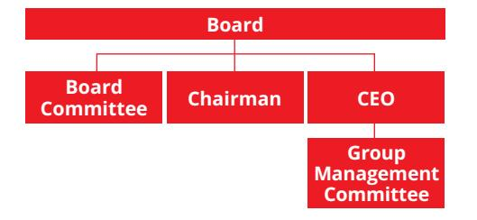

The GAA ensures that appropriate controls and decision-making are consistently applied throughout DBS. Under the GAA, the Board has delegated to the CEO the responsibility to ensure that the Group's businesses and operations are operated in accordance with Board-approved strategies and standards, which include responsibilities for the internal control framework within DBS. On matters where authority has been delegated to him, the CEO may further delegate his responsibilities and authorities to any GMC member or members and may empower them to, in turn, delegate their responsibilities and authorities to other executives and management committees of the Group.

The GAA covers internal authority only and does not override any specific provisions arising from statutory, regulatory, exchange listing requirements, or DBSH's Constitution. The GAA is regularly reviewed and updated to accommodate changes in the scope and activities of DBS' business and operations. The Board approves the GAA and any change to it.

### **Internal controls framework**

DBS' internal controls framework covers financial, operational, compliance and information technology controls, as well as risk management policies and systems. The Board, supported by the AC and BRMC, oversees the Group's system of internal controls and risk management. DBS adopts the Three Lines Model for risk management, where each line has clear roles and responsibilities.

### **First line**

DBS' business and support units are its first line. Their responsibilities include the identification and management of risks arising from and relating to their respective areas of responsibilities and ensuring that our operations remain within approved boundaries of our risk appetite and policies. DBS has an established incident notification

protocol that sets out processes for the escalation of incidents according to the level of severity. In this way, appropriate levels of management are made aware of such incidents and can take action accordingly. There are also well-defined procedures for the escalation, investigation and follow up of any reported wrong-doing by a DBS employee, customer, vendor or third party.

### **Second line**

DBS' second line, residing primarily in the Risk Management Group and Group Legal and Compliance, provide independent risk oversight, monitoring and reporting. They are responsible for the development and maintenance of risk management policies and processes and provide objective review and challenge on the activities undertaken by business and support units.

In 2024, DBS implemented several changes to its second line to strengthen non-financial risk governance:

(i) For more objective review and effective challenge, the risk oversight over thirdparty management, business continuity and cybersecurity was consolidated into the second line under Risk Management Group;

- (ii) Following the onboarding of the Group Head of Technology Risk in late 2023, DBS enhanced its overseas technology governance, strengthened its capacity to uplift technology risk culture and augmented the Risk and Control Self-Assessment (RCSA) with an expanded risk and control library; and
- (iii) Recognising the increasing complexities associated with pervasive use of data and artificial intelligence, a dedicated second line function was established within Risk Management Group for more effective oversight over data and AI risk governance. This function provides independent assurance on the effectiveness of data and AI risk management policies and approaches, including adaptation to emerging techniques.

# **Third line**

Group Audit forms the third line. It provides an independent assessment and assurance on the reliability, adequacy and effectiveness of DBS' system of internal controls, risk management, governance framework and processes.

| Board, CEO and Senior Management | Provides oversight of the three lines model                   |                                                                 |                               |  |
|-------------------------------------|---------------------------------------------------------------|-----------------------------------------------------------------|-------------------------------|--|
|                                     | First line                                                    | Second line                                                     | Third line                    |  |
| Role                                | Own and manage risks in respective areas of responsibility | Provide independent risk oversight, monitoring and reporting | Provide independent assurance |  |
| Unit                                | Business and support units                                    | Risk Management Group, Group Legal and Compliance            | Group Audit                   |  |

### **Group Audit**

## **Key responsibilities and processes**

Group Audit is independent of the activities it audits. Its objectives, scope of authority and responsibilities are defined in the Audit Charter, which is approved by the AC. Group Audit reports functionally to the Chairperson of the AC and administratively to the CEO. Group Audit's responsibilities include:

- **•** Evaluating the reliability, adequacy and effectiveness of the Group's system of internal controls, risk management, governance framework and processes;
- **•** Providing an objective and independent assessment of the Group's credit portfolio quality, the execution of approved credit portfolio strategies and control standards relating to credit management processes;
- **•** Reviewing whether DBS complies with laws and regulations and adheres to established policies; and

**•** Reviewing whether management is taking appropriate steps to address control deficiencies.

Group Audit adheres to the DBS Code of Conduct and is guided by the Mission Statement in the Audit Charter. It adopted the Code of Ethics and aligned its practices with the International Professional Practices Framework established by the Institute of Internal Auditors (IIA). In addition, it has embedded IIA's 10 Core Principles for the Professional Practice of Internal Auditing into its activities.

Group Audit has unfettered access to the AC, the Board and management, as well as the right to seek information and explanation. The Head of Group Audit has a seat in the GMC and attends all the business reviews and strategic planning forums. The respective heads of audit in each of the five key locations outside Singapore are part of that location's management team.

Group Audit adopts a risk-based approach in its auditing activities. An annual audit plan is developed using a structured risk and control assessment framework through which the inherent risk and control effectiveness of each auditable entity in the Group is assessed. This risk assessment methodology and approach are aligned with that of the Group, including the risk taxonomy.

The assessment also covers risks arising from new lines of business, new products and emerging risks from DBS' operating environment. Audit projects are planned based on the results of the assessment, with priority given to auditing higher risk areas and as required by regulators.

Audit reports containing identified issues and corrective action plans are reported to the AC and senior management. Progress of the corrective action plans is monitored, and past due action plans are included in regular reports to the senior management

and the AC. In all routine audits, Group Audit evaluates the control environment and management's control awareness which incorporates risk culture as guided by the Financial Stability Board's Guidance on Sound Risk Culture.

Group Audit apprises regulators and external auditors of all relevant audit matters. It works closely with external auditors to coordinate audit efforts.

### **Quality assurance and key developments**

In line with leading practices, Group Audit has a quality assurance and improvement programme (QAIP) that covers its audit activity and conforms to the International Standards for the Professional Practice of Internal Auditing. Effective 9 January 2025, the Institute of Internal Audit (IIA) requires compliance against a set of new Global Internal Audit Standards. Given this new requirement, Group Audit in 2024 updated its mandate/charter and guide to conform with the new standards. This was reviewed by Ernst & Young (EY) and was subsequently presented and approved at the November AC meeting.

As part of the 2024 QAIP, EY conducted a benchmarking assessment which showed that DBS leads the industry in the use of data analytics and digital tools in its audit activities such as risk assessment, fieldwork and reporting. In EY's maturity model assessment, Group Audit was also rated the highest level for Purpose, People, Risk assessment and Planning, Reporting, Enablement and Innovation, and Impact, Influence and Involvement

In 2024, Group Audit has substantially completed the digitalization of its documentation process using its digital workbench and rolled out across the region, after successful pilot in the prior year. In expanding its use of AI/Generative AI to further sharpen its effectiveness and efficiency, the audit team has also embarked on developing an Intelligent Co-worker tool.

To fulfil its role as the Assessor of the Bank's T-Up programme, Group Audit has appointed Accenture to provide technology practitioners with relevant skills/experiences to support its assessment. As IT Risk Culture is part of the T-Up initiative, Group Audit also undertook the review of this initiative and leveraged industry experts in Human Capital/ Organisational Psychologists to support its review and recommendations.

In October 2024, Group Audit as co-chair of the AML Audit Peer Group (AAPG), published the industry best practice paper through The Association of Banks in Singapore on key baseline standards and good practices in the conduct of AML/CFT reviews by internal and

external auditors. This initiative is supported by MAS with the objective of strengthening AML/CFT auditing practices across financial institutions.

## **Rule 720(1) Undertaking**

In compliance with Rule 720(1) of the Listing Manual, DBS has procured undertakings from all of its Directors and executive officers to use their best endeavours to (a) comply with the relevant provisions of the Listing Manual; and (b) procure that DBS complies with the relevant provisions of the Listing Manual.

# **Dealings in securities**

Although the Group has transitioned to a semi-annual reporting regime, the trading updates that are provided for the first and third quarters of each financial year are, for the purpose of the "black-out" policies prescribed under Rule 1207(19) of the SGX Listing Rules, deemed to constitute "financial statements". Accordingly, Directors and employees are prohibited from trading in DBS' securities (i) one month before the release of the half-year and full-year financial statements; and (ii) two weeks before the release of its quarterly financial statements for the first and third quarters of each financial year.

In addition, business units and subsidiaries engaging in proprietary trading are restricted from trading in DBS' securities during the black-out period. Group Secretariat informs all Directors and employees of each black-out period ahead of time. Directors and employees are prohibited at all times from trading in DBS' securities if they are in possession of material non-public information.

GMC members are only allowed to trade in DBS' securities within specific window periods (15 market days immediately following the expiry of each black-out period) subject to preclearance. GMC members are also required to obtain pre-approval from the CEO before any sale of DBS' securities. Similarly, the CEO is required to seek pre-approval from the Chairman before any sale of DBS' securities. As part of DBS' commitment to good governance and the principles of share ownership by senior management, the CEO is expected to build up and hold at least the equivalent of three times his annual base salary as DBSH shares over time.

DBS has put in place a personal investment policy which prohibits employees from trading in securities in which they possess price-sensitive information in the course of their duties. Such employees are also required to seek pre-clearance before making any personal trades in securities and may only trade through the Group's stockbroking subsidiaries and bank channels for securities

listed in Singapore and Hong Kong. The personal investment policy discourages employees from engaging in short-term speculative trading.

### **Related Party Transactions and Interested Person Transactions**

DBS has embedded procedures to comply with regulations governing related party transactions and interested party transactions.

For related party transactions, we are required to comply with regulations prescribed by the MAS which set out the definition, scope and general principles governing such transactions, along with the responsibilities of banks to maintain oversight and control so as to mitigate the risk of abuse arising from conflicts of interest.

We have established a Board-approved framework to give effect to these regulatory requirements. This, along with material related party transactions, is reviewed by the Board regularly.

All new Directors are briefed on relevant provisions that affect them. If necessary, existing credit facilities to related parties are adjusted prior to a Director's appointment, and all credit facilities to related parties are continually monitored.

With respect to interested party transactions, we have established processes to comply with the requirements outlined in Chapter 9 of the SGX-ST Listing Manual. The aggregate contract values of DBS' interested person transactions entered into in 2024 are set out in the table on page 66.

DBS enters into various interested person transactions with certain of Temasek's associates on arm's length commercial terms and for the purpose of carrying out day-today operations (such as leasing of premises, telecommunication/ data services, IT systems and related services, redemption of air miles by DBS/ POSB credit card holders, logistics and security services).

### **Material contracts**

Save for the transactions disclosed in the table on page 66 and via SGXNET, there were no material contracts involving the interest of any Director or controlling shareholder of DBS entered into by DBS or any of its subsidiary companies, which are either still subsisting at the end of the financial year, or if not then subsisting, entered into since the end of the previous financial year.

**66** DBS Annual Report 2024 **Making Greater Impact 67**

# **Assessing the effectiveness of internal controls**

DBS has a risk management process that requires all units to perform a half-yearly risk and control self-assessment (RCSA) to assess the effectiveness of their internal controls. In addition, all units of the Group are required to submit quarterly attestations on their controls relating to the financial reporting process and annual attestations

on their compliance with the overall internal controls framework. Based on the RCSA and the quarterly and annual attestations, the CEO and the key management personnel responsible for risk management and internal control systems provide an annual attestation to the AC relating to the adequacy and effectiveness of DBS' risk management and internal control systems.

Group Audit performs regular independent reviews to provide assurance on the adequacy and effectiveness of DBS' internal controls on risk management, control and governance processes. The overall adequacy and effectiveness of DBS' internal controls framework is reviewed by the AC and BRMC.

| Name of interested person                            | Aggregate contract value of all interested person transactions in 2024 (excluding transactions less than SGD 100,000) (SGD million) |
|------------------------------------------------------|-------------------------------------------------------------------------------------------------------------------------------------------|
| Transactions entered into with associates of Temasek |                                                                                                                                           |
| CapitaLand Investment Limited Group                  | 7.4                                                                                                                                       |
| Certis CISCO Security Pte Ltd Group                  | 7.9                                                                                                                                       |
| Mandai Park Holdings Pte Ltd Group                   | 4.7                                                                                                                                       |
| Mapletree Investments Pte Ltd Group                  | 2.8                                                                                                                                       |
| Partior Holdings Pte Ltd Group                       | 0.4                                                                                                                                       |
| Singapore Airlines Limited Group                     | 15.2                                                                                                                                      |
| Singapore Telecommunications Limited Group           | 192.8                                                                                                                                     |
| SMRT Corporation Ltd Group                           | 3.9                                                                                                                                       |
| StarHub Ltd Group                                    | 62.2                                                                                                                                      |
| Surbana Jurong Private Limited Group                 | 13.3                                                                                                                                      |
| Temasek Management Services Pte Ltd Group            | 0.2                                                                                                                                       |
| Tower Capital PE Fund I LP Group                     | 1.0                                                                                                                                       |
| Total                                                | 311.8                                                                                                                                     |

## **Board's commentary on adequacy and effectiveness of internal controls**

The Board has received assurance from the CEO and CFO that as at 31 December 2024, the Group's financial records have been properly maintained and the financial statements give a true and fair view of DBS Group's operations and finances.

The Board has also received assurance from the CEO and the key management personnel responsible for risk management and internal control systems that, as at 31 December 2024, the Group's risk management and internal control systems were adequate and effective to address financial, operational, compliance and information technology risks which the Group considers relevant and material to its operations. The Board noted that in relation to the digital disruptions in 2023, management has made significant progress in the four main areas with respect to information technology risk management and controls, namely, change management,

system resiliency, incident management, and technology risk governance and oversight. These are embedded in the Technology Risk Management Uplift (T-Up) Programme. For example, DBS has strengthened independent risk functions; simplified systems architecture, enhanced system redundancies for key services and reduced single points of failure; tightened change management processes; and enhanced its ability to identify incidents and resolve them more quickly. The T-Up programme has largely achieved its objectives and efforts have since transitioned to a sustained focus on resiliency in Singapore and other core markets.

Based on the internal controls established and maintained by the Group, work performed by internal and external auditors, reviews performed by management and various Board committees, as well as assurances received from and ongoing technology resiliency efforts undertaken by management, the Board, with the

concurrence of the AC, is of the opinion that the Group's internal controls and risk management systems were adequate and effective as at 31 December 2024 to address financial, operational, compliance and information technology risks which the Group considers relevant and material to its operations.

The Board notes that the internal controls and risk management systems provide reasonable, but not absolute, assurance that the Group will not be affected by any event that could be reasonably foreseen as it strives to achieve its business objectives. In this regard, the Board also notes that no system can provide absolute assurance against the occurrence of material errors, poor judgement in decision-making, human error, fraud or other irregularities.

**Corporate governance**

# **Strong culture**

# **Effective safeguards**

DBS believes that effective safeguards against undesired business conduct have to go beyond a "tick-the-box" mentality. In DBS, other than relying on published codes of conduct, the following organisational safeguards are advocated to maintain a strong risk and governance culture.

- **• Tone from the top:** The tone set by the Board and senior management is vital; it is equivalent to the moral compass of the organisation. In addition to having in place comprehensive policies, DBS conducts a robust self-assessment on the Group's risk culture. Please refer to the risk culture section on this page for more information.
- **• Aligning strategies and incentives via the balanced scorecard:**

*Please refer to the section on "Our 2024 priorities" on pages 30 to 31 for more information.*

# **• Respecting the voice of control**

**functions:** DBS believes that respect for the voice of control functions is a key safeguard. DBS ensures that control functions are well integrated into its organisational structure so that they can properly discharge their responsibilities.

# **• Risk ownership:**

*Please refer to page 64 for details on DBS' Three Lines Model.*

- **• Established escalation protocols:** DBS established a notification protocol that makes it mandatory for staff to report significant incidents, demonstrating its organisational readiness to receive unfavourable information and undertake prompt remedial actions without any adverse consequences for those reporting the incidents.
- **• Encouraging constructive challenges at all levels:** Fundamentally, DBS inculcates a culture that encourages constructive challenges and debate, where all views are evaluated for decisionmaking. DBS also operates a culture where we actively engage the Board for their views early.
- **• Reinforcing cultural alignment:** Finally, DBS conscientiously reinforces its cultural norms by rewarding right behaviours and censuring wrong ones.

### **Risk Culture**

Risk Culture is closely intertwined with DBS' corporate values, and it encompasses the general awareness, attitudes and behaviour of DBS' employees towards risks. The results of DBS' Risk Culture and Conduct Survey conducted in 2023 indicated a satisfactory risk culture bank-wide.

In 2024, DBS (i) embedded a stronger technology risk culture by reinforcing a technology risk and change management mindset in staff; and (ii) continued to monitor its risk culture pulse with a risk culture and conduct dashboard, comprising multi-faceted indicators. Creating awareness remained a key focus as DBS continues to reinforce a strong culture of risk and control across all levels within the organisation. DBS leveraged digital communication channels to share culture related content and conducted training with case studies to aid managers in strengthening the "Tone from the Middle" and to enhance employee risk sensing and judgement. DBS continues to place emphasis on conduct as part of its compensation evaluation process.

### **The DBS Code of Conduct (Code of Conduct)**

The Code of Conduct sets out the principles and standards of behaviour that are expected of employees of the Group (including part-time and temporary employees) when dealing with customers, business associates, regulators and colleagues. The principles covered in the Code of Conduct include professional integrity, confidentiality, conflicts of interests, fair dealings with customers and whistle-blowing. It also defines the procedures for employees of DBS to report incidents and provides protection for those staff for these disclosures.

All employees of DBS are required to read and acknowledge the Code of Conduct on an annual basis. Members of the public may access the Code of Conduct on DBS' website at the following URL: https:// go.dbs.com/CodeOfConduct. The Code of Conduct encourages employees of DBS to report their concerns to DBS' dedicated, independent investigation team within Group Compliance which handles whistle-blowing cases according to a well-defined protocol. Alternatively, in case of actual or potential conflict of interest or fear of retribution, employees of DBS may write in confidence to Human Resources, Group Audit, or even the CEO or the Chairman. In addition, employees of DBS have the option of using the DBS Speak Up service.

### **Whistle-blowing policy**

DBS is committed to ethical conduct and transparency. DBS Speak Up programme provides employees of the Group the opportunity to speak up on suspicious activity, illegal or unethical behaviour by a DBS employee, customer, vendor or third party.

DBS Speak Up programme includes:

- **• Multiple reporting channels:** including a reporting service run by an independent external party with a dedicated hotline number, website, email address, fax number and postal address. This preserves confidentiality and anonymity (where requested) and prevents detrimental or unfair treatment of the whistleblower;
- **• Expert investigation:** reports are independently investigated by specialist teams, including forensic investigators;
- **• Oversight and reporting:** significant whistleblowing cases are reported to the appropriate management forums and the BRMC and AC to ensure independence and effective oversight; and
- **• Corrective actions:** recommendations for remediation are developed and implemented to address identified thematic issues.

# **Accountability to our shareholders**

### **Shareholder rights**

DBS promotes fair and equitable treatment of all shareholders. All shareholders enjoy specific rights under the Singapore Companies Act and DBSH's Constitution. These rights include, among others, the right to participate in profit distributions and the right to attend and vote at general meetings. Ordinary shareholders are entitled to attend and vote at general meetings in person or by proxy. Indirect investors who hold DBSH shares through a nominee company or custodian bank or through a CPF agent bank (Relevant Intermediaries) may attend and vote at general meetings by requesting their Relevant Intermediaries to appoint them as proxies.

DBS respects the equal information rights of all shareholders and is committed to the practice of fair, transparent and timely disclosure. All price-sensitive information is publicly released prior to any sessions with individual investors or analysts.

The Board provides shareholders with regular financial reports, which aim to give shareholders a balanced assessment of the Group's financial performance and position. The Board also ensures timely and full disclosure of material corporate developments to shareholders.

# **Engagement with shareholders and other stakeholders**

DBS' investor relations activities promote regular, effective and fair communication with shareholders. Separate briefing sessions were conducted for the media and analysts when quarterly results were released. All press statements and quarterly financial statements have been published on our website and the SGX website. A dedicated investor relations team supports the CEO and the CFO in maintaining a close and active dialogue with investors. The DBS website provides contact details for investors to submit their feedback and raise any questions.

During the year, DBS held over 450 meetings with equity investors and over 110 meetings with debt investors. DBS participated in 21 investor conferences and road shows. These engagements were conducted through in person or virtual meetings. These meetings provide a forum for management to explain DBS' strategy and financial performance and solicit analysts' and investors' perceptions of DBS.

In addition, to ensure Directors are kept updated on analysts' views on DBS Group's performance, the Board is updated annually on, inter alia, the following, a summary of analysts' views, feedback and recommendations, share price performance and total shareholders' return.

DBS has a disclosure policy to ensure that all disclosures of material information are timely, complete and accurate. The policy sets out how material information should be managed to prevent selective disclosure. The Group Disclosure Committee (GDC) assists the CEO and the CFO in implementing the disclosure policy. The GDC's objectives are to: (a) periodically review DBS' disclosure policy and update it as needed, (b) ensure that all material disclosures are appropriate, complete and accurate and (c) ensure selective or inadvertent disclosure of material information is avoided.

More details on our sustainability strategies, and engagement with our material stakeholders, including key areas of focus, can be found in our Sustainability Report, available on our website.

## **Conduct of shareholder meetings**

DBS encourages and values shareholder participation at its general meetings.

The Chairman plays a pivotal role in fostering constructive dialogue between shareholders, Board members and management at general meetings. Resolutions requiring shareholders' approval are tabled separately for adoption at general meetings unless they are closely related and are more appropriately tabled together.

DBS puts all resolutions at general meetings to a vote by electronic poll and announces the results by showing the number of votes cast for and against each resolution and the respective percentages. DBS appoints an independent external party as scrutineer for the electronic poll voting process. Prior to the commencement of a general meeting, the scrutineer would review the proxies and the electronic poll voting system as part of the proxy verification process. At the general meeting, handsets are provided for poll

voting and the results of the electronic poll voting are announced immediately after each resolution has been put to a vote. DBS maintains an audit trail of all votes cast at the general meeting.

The outcome of the general meeting (including detailed results of the poll vote for each resolution) is promptly disclosed on SGXNET within the same day after the conclusion of that meeting.

Annual General Meetings (AGMs) provide shareholders with the opportunity to share their views and to interact with the Board, including the chairpersons of the Board committees and certain members of senior management. DBS' external auditor is available to answer shareholders' queries. At each AGM, DBS' financial performance for the preceding year is presented to shareholders.

The Company Secretary prepares minutes of general meetings, which incorporate substantial and relevant comments or queries from shareholders relating to the agenda of the meeting and responses from the Board and management. These minutes may be assessed via DBS' website.

### **Conduct of 2025 AGM**

DBS will be holding a wholly physical AGM in 2025.

### **Where to find key information on each Director?**

In this Annual Report:

- *• Pages 47 to 48 Directors' independence status, appointment dates, meeting attendance and remuneration details*
- *• Pages 184 to 188 Directors' length of directorship, academic and professional qualifications and present and past directorships*
- *• Pages 208 to 213 Additional Information on Directors seeking re-election at the Annual General Meeting to be held on 28 March 2025*

At our website (www.dbs.com): Directors' biodata

**Remuneration report 68** DBS Annual Report 2024 **Making Greater Impact 69**

# **Remuneration report**

**We believe that our long-term success depends in large measure on our employees. Our remuneration framework is designed to reflect market best practices, drive business strategy and create long-term shareholder value. Our remuneration policies and practices are governed by a set of principles which are aligned with various regulatory requirements.**

# **1 Objectives of DBS remuneration strategy**

DBS' remuneration policy, which is applicable to DBS Bank and all subsidiaries and overseas offices, seeks to ensure that we are able to attract, motivate and retain employees to deliver long-term shareholder returns, taking into consideration risk management principles and standards set out by the Financial Stability Board (FSB) and the Code of Corporate Governance.

Remuneration is determined by the Group's performance evaluated against a balanced scorecard. The scorecard is detailed and comprises specific key performance indicators (KPIs), including how we fare against shareholder, customer and employee indicators; as well as a range of focus areas such as progress in transforming the bank, strengthening our businesses, managing risks etc. DBS PRIDE!\* values are also taken into account in order to drive desired behaviours.

The following shows the three main thrusts of our remuneration strategy and how they are implemented:

| Main thrusts                                                  | Details                                                                                                                                                                                                                                                                                                                                                                                     |
|---------------------------------------------------------------|---------------------------------------------------------------------------------------------------------------------------------------------------------------------------------------------------------------------------------------------------------------------------------------------------------------------------------------------------------------------------------------------|
| Pay for performance as measured against balanced scorecard | • Instill and drive a pay-for-performance culture • Ensure close linkage between total compensation and our annual and long-term business objectives as measured by our balanced scorecard • Calibrate mix of fixed and variable pay to drive sustainable performance that is aligned to DBS PRIDE! values, taking into account both "what" and "how" KPIs are achieved         |
| Provide market competitive pay                                | • Benchmark our total compensation against other organisations of similar size and standing in the markets we operate in • Drive performance differentiation by benchmarking total compensation for top performing employees against the upper quartile or higher in each market                                                                                                   |
| Guard against excessive risk-taking                           | • Focus on achieving risk-adjusted returns that are consistent with prudent risk and capital management, as well as emphasise long-term sustainable outcomes • Design payout structure to align incentive payments with the long-term performance of the Group through deferral and clawback arrangements • Design sales incentive plans to encourage the right sales behaviour |

*Read more about the balanced scorecard in Our 2024 priorities on page 30.*

*\* Read more on our PRIDE! values on page 75.*

**Remuneration report 70** DBS Annual Report 2024 **Making Greater Impact 71**

# **2 Summary of current total compensation elements**

The table below provides a description of total compensation elements, their purpose and implementation:

| Elements                          | Purpose                                                                                                                                                                                                                                                      | Details                                                                                                                                                                                                                                                                                                                                                                                                                                                                                                                                                                                                                                                           |
|-----------------------------------|--------------------------------------------------------------------------------------------------------------------------------------------------------------------------------------------------------------------------------------------------------------|-------------------------------------------------------------------------------------------------------------------------------------------------------------------------------------------------------------------------------------------------------------------------------------------------------------------------------------------------------------------------------------------------------------------------------------------------------------------------------------------------------------------------------------------------------------------------------------------------------------------------------------------------------------------|
| Salary                            | • Attract and retain talent by ensuring our fixed pay is competitive vis-à-vis comparable institutions                                                                                                                                                 | • Set at an appropriate level, taking into account market dynamics as well as skills, experience, responsibilities, competencies and performance of the employee • Typically reviewed annually                                                                                                                                                                                                                                                                                                                                                                                                                                                        |
| Cash bonus and deferred awards | • Provide a portion of total compensation that is performance-linked • Focus employees on the achievement of objectives which are aligned to value creation for our shareholders and multiple stakeholders • Align to time horizon of risk | • Based on DBS, business or support unit, and individual performance • Measured against a balanced scorecard which is agreed to at the start of the year • A Group-wide deferral approach is applicable for all employees. Awards in excess of a certain threshold are subject to a tiered deferral rate with a minimum deferred quantum • For Senior Management (SM) and Material Risk Personnel (MRP i.e. employees whose actions have a material impact on the risk exposure of the bank), awards are generally deferred by a minimum of 40% if it exceeds a certain threshold subject to local regulatory requirements |

# **3 Determination of variable pay pool**

DBS has a robust process in place in determining the variable pay pool. The variable pay pool is derived from a combination of a bottom-up and top-down approach. Annually, Management does a self-evaluation on the Group's performance against the balanced scorecard. This is presented to the Compensation and Management Development Committee (CMDC) who assesses the performance, based on which it approves the variable pay pool, which is subsequently endorsed by the Board of Directors (Board).

| Process                             | Details                                                                                                                                                                                                                                                                                                                                                                                                                                                                                                                                                                                                                                        |
|-------------------------------------|------------------------------------------------------------------------------------------------------------------------------------------------------------------------------------------------------------------------------------------------------------------------------------------------------------------------------------------------------------------------------------------------------------------------------------------------------------------------------------------------------------------------------------------------------------------------------------------------------------------------------------------------|
| Determining total variable pay pool | • A function of our overall performance against the balanced scorecard and benchmarked against market. The scorecard includes substantial risk and control metrics designed and evaluated by the control functions such as Audit, Compliance and Risk. Control functions therefore have a direct role in determining the size of the variable pay pool. The variable pay pool is further calibrated against the following prisms: – Risk adjustment through review of Return on Risk-Adjusted Capital (RoRAC) – Appropriate distribution of surplus earnings (after cost of equity) between employees and shareholders |
| Allocating pool to business units   | • Pool allocation takes into account the relative performance of each unit against their balanced scorecard as evaluated by the CEO • Inputs from control functions are sought • Country Heads are also consulted in the allocation process                                                                                                                                                                                                                                                                                                                                                                                           |
| Determining individual award        | • Unit heads cascade their allocated pool to their teams and individuals • Individual variable pay determined based on performance against goals and DBS PRIDE! Values • Employees with disciplinary warning meted out may have their variable pay impacted                                                                                                                                                                                                                                                                                                                                                                           |

The performance of control functions are assessed independently from the business units they support to prevent any conflicts of interests. The remuneration of the Chief Risk Officer (CRO) and Group Head of Audit are endorsed by the Chairman of Board Risk Management Committee and Audit Committee respectively and subsequently approved by the Board.

Sales employees are incentivised to promote the development of mutually beneficial long-term relationships with their customers, rather than a sole focus on short-term gains. Non-financial metrics such as customer satisfaction and compliance with fair dealing principles are incorporated into their KPIs.

# **4 Deferred remuneration**

| Plan objectives                                                                                                                                              | Details                                                                                                                                                                                                                                                                                                                                                                                                                                                                                                                                                                                                                               |
|--------------------------------------------------------------------------------------------------------------------------------------------------------------|---------------------------------------------------------------------------------------------------------------------------------------------------------------------------------------------------------------------------------------------------------------------------------------------------------------------------------------------------------------------------------------------------------------------------------------------------------------------------------------------------------------------------------------------------------------------------------------------------------------------------------------|
| • Foster a culture that aligns employees' interests with shareholders • Enable employees to share in DBS' performance • Help in talent retention | • Deferred remuneration is paid in restricted shares (DBSH Share Plan) except for SM and MRPs, where it is paid in restricted shares (DBSH Share Plan) and cash • Deferred remuneration comprises two elements: the main award and retention award • The retention award constitutes 15% of the main award and is designed to retain talent and compensate staff for the time value of deferral • Deferred awards vest over four years, and will lapse immediately upon termination of employment (including resignation) except in the event of ill health, injury, disability, redundancy, retirement or death |
|                                                                                                                                                              |                                                                                                                                                                                                                                                                                                                                                                                                                                                                                                                                                                                                                                       |
| Vesting schedule                                                                                                                                             | Malus of unvested awards and clawback of vested award                                                                                                                                                                                                                                                                                                                                                                                                                                                                                                                                                                                 |

Employees on sales incentive plans whose incentives exceed a certain threshold are also subject to deferrals which vest over three years and a 15% retention award.

Special Award is awarded to selected individuals as part of talent retention, and it is subject to three-year vesting period, with 33% vesting on the first and second anniversaries of grant and 34% on the third anniversary.

*Read more about the Share Plan on page 111.*

# **5 Summary of 2024 remuneration outcomes**

Our remuneration is linked to how we perform against our balanced scorecard (see pages 30 to 35) which is aligned to long-term value creation for our stakeholders in a sustainable way (see pages 74 to 75).

In 2024, an external compensation consultant, McLagan, was engaged to provide an independent review of the Group's compensation system and processes to ensure compliance with the FSB Principles for Sound Compensation Practices. McLagan and its consultants are independent and not related to us or any of our Directors. The results of the review showed that we are in compliance with the FSB Principles for Sound Compensation Practices.

# **Senior management and material risk personnel**

In line with the principles set out by FSB, a substantial portion of remuneration for our Senior Management as well as Material Risk Personnel are variable. Their variable remuneration is subject to deferral, thus ensuring alignment to the time horizon of risks.

The following charts show the mix of fixed and variable pay for both groups for performance year 2024:

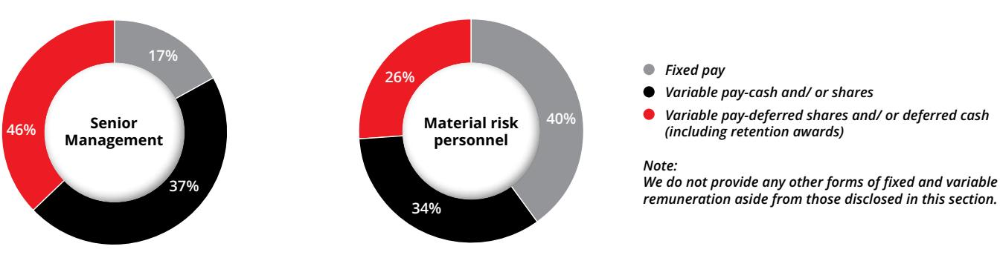

Our Senior Management's aggregate total compensation (salary, cash bonus and deferred awards) in 2024 amounted to SGD 93.8 million, including the CEO's total compensation of SGD 17.5 million. Excluding the CEO's total compensation which is separately disclosed, the median increase in the total compensation of the Senior Management who were members of the Group Management Committee in 2022 – 2024 was 5.2% from 2022 and 10.9% from 2023. The increase from 2023 reflects the Group's strong performance in 2024 as well as a normalisation in compensation from 2023 when Senior Management took accountability for the digital disruptions.

While corporate governance guidelines recommend that at least the top five key executives' remuneration be disclosed, the Board believes that it would be disadvantageous to do so because of the constant battle for talent in a highly competitive industry. This is consistent with banking industry practice in the local market. However, we do provide information on the total compensation of our Senior Management in the year as detailed above.

# **Breakdown of deferred remuneration awards**

| Category                                                                                                                                                                                | SM(1)                       | MRPs(2)              |  |
|-----------------------------------------------------------------------------------------------------------------------------------------------------------------------------------------|-----------------------------|----------------------|--|
| Total outstanding deferred remuneration(3): Cash Shares and share-linked instruments Other forms of remuneration Total                                                      | 11.4% 88.6% – 100% |                      |  |
| Outstanding deferred and retained remuneration(3)(4): Of which exposed to ex-post adjustments Cash Shares and share-linked instruments Other forms of remuneration Total | 11.4% 88.6% – 100% |                      |  |
| Total amendment during the year due to ex-post explicit adjustments(5): Cash Shares and share-linked instruments Other forms of remuneration Total                          | – – – –            | – – – –     |  |
| Total amendment during the year due to ex-post implicit adjustments(5): Cash Shares and share-linked instruments(6) Other forms of remuneration Total                       | – 15.6% – –        | – 47.8% – – |  |
| Total deferred remuneration paid out in the financial year:                                                                                                                             | 37.1%                       | 37.7%                |  |
| Headcount                                                                                                                                                                               | 22                          | 383                  |  |

- *(1) Senior Management (SM) is defined as the CEO and members of the Group Management Committee who have the authority and responsibility for DBS' overall direction and executing to strategy.*
- *(2) In accordance to MAS's Individual Accountability & Conduct Guidelines, MRPs are defined as employees whose duties require them to take on material risk on our behalf in the course of their work and/ or employees who can cause harm to a significant segment of customers or other stakeholders. These can be either individual employees or a group of employees who may not pose a risk to DBS' financial soundness on an individual basis, but may present a material risk collectively.*
- *(3) Due to data confidentiality, the total amount of deferred and retained remuneration for SM and MRPs have been aggregated for reporting. In addition to shares deferral, cash deferral has been implemented across all locations with effect from Feb 2023.*
- *(4) Retained remuneration refers to shares or share-linked instruments that are subject to a retention period under a share retention policy.*
- *(5) Examples of explicit ex-post adjustments include malus, clawbacks or similar reversal or downward revaluations of awards. Examples of implicit ex-post adjustments include fluctuations in the value of DBSH ordinary shares or performance units.*
- *(6) [No. of unvested DBSH ordinary shares as at 31 Dec 24 x share price as at 31 Dec 24] / [No. of unvested DBSH ordinary shares as at 31 Dec 23 x share price as at 29 Dec 23] -1.*

**Remuneration report 72** DBS Annual Report 2024 **Making Greater Impact 73**

# **Guaranteed bonuses, sign-on bonuses and severance payments**

| Category                                                                  | SM    | MRPs |
|---------------------------------------------------------------------------|-------|------|
| Number of guaranteed bonuses                                              | 0     | 0    |
| Number of sign-on bonuses                                                 | 1     | 12   |
| Number of severance payments                                              | 0     | 0    |
| Total amounts of above payments made during the Financial Year (SGD '000) | 5,042 |      |

### **Other provisions**

We do not allow accelerated payment of deferred remuneration except in cases such as death in service or where legally required. There are no provisions for:

- **•** Special executive retirement plans;
- **•** Golden parachutes or special executive severance packages; and/or
- **•** Guaranteed bonuses beyond one year.

# **Chief Executive Officer**

Since Piyush Gupta joined the bank 15 years ago as CEO, DBS has been transformed into a high-performing Asian bank marked by a culture of innovation and purpose.

In 2024, the bank had another banner year. Total income rose to SGD 22.3 billion while net profit reached SGD 11.4 billion, both at new highs. Return on equity of 18.0% was one of the highest among developed market banks.

The structural franchise improvements drove significant shareholder value creation during the year. DBS' market capitalisation crossed SGD100 billion – the first time a Singapore-listed company had done so. Total shareholder returns for 2024 were 51%, the highest in DBS' history outside crisis-rebound years, comprising a share price gain of 44% and a dividend return of 7%.

The wealth business had a standout year. DBS' business in India and Taiwan, where the bank had expanded its franchise through acquisitions, also registered solid results. DBS also made significant progress in strengthening technology resiliency, maturing the use of data analytics and AI/ ML, and translating the Managing-through-Journeys way of working into strong customer and financial outcomes.

Employee engagement as measured by the 2024 My Voice survey reached a record 91%, 17 percentage points above the APAC Financial Services Industry benchmark.

On sustainability, DBS partnered more businesses in their transition to lower-carbon business models. The bank's sustainable financing commitments, net of repayments, rose 27% to SGD 89 billion. Additionally, it committed more than SGD 100 million towards creating social impact, such as providing essential needs and fostering inclusion across Asia.

DBS continued to be recognised for the strength of its franchise. It was lauded as "World's Best Corporate/ Institutional Digital Bank" by Global Finance, "World's Best for High Net Worth" by Euromoney and "World's Best Bank for Sustainable Finance" by Global Finance. All three global awards were firsts for the bank. DBS was also named "Safest Bank in Asia" by Global Finance for the 16th consecutive year. In recognition of Piyush's outstanding contributions over the last 15 years, the Board granted him a special recognition award of SGD 2.5 million.

In addition, the bank's stellar all-round performance, as well as its improved technology resiliency, resulted in a higher scorecard appraisal by the Board compared to the previous year. Given the scorecard performance and a normalisation in compensation following a reduction taken in 2023 in response to Senior Management accountability for the digital disruptions, Mr Gupta's present-year remuneration is as outlined below:

# **Breakdown of remuneration for performance year 2024 (1 January – 31 December)**

|                 | Salary    | Cash bonus(1) | Deferred Award(2) | Others(3) | Total(4)   |
|-----------------|-----------|---------------|-------------------|-----------|------------|
|                 | SGD       | SGD           | SGD               | SGD       | SGD        |
| Mr Piyush Gupta | 1,500,000 | 6,645,000     | 9,355,000         | 80,533    | 17,580,533 |

- *(1) The amount has been accrued in 2024 financial statements.*
- *(2) Of the deferred award, about 17.1% will be in cash, while the remaining will be in the form of shares. At DBS, ordinary dividends on unvested shares do not accrue to employees. For better comparability with other listed companies, this figure excludes the estimated value of retention award amounting to SGD 1,403,250 which serve as a retention tool and compensate staff for the time value of deferral. This is also similar in nature to practices in those companies which provide accrual of dividends/ interest equivalents for deferred awards.*
- *(3) Represents non-cash component and comprises club, car and driver.*
- *(4) Refers to performance remuneration for 2024 includes fixed pay in 2024, cash bonus received in 2025 and DBSH ordinary shares granted in 2025.*

# **How we create value – our business model**

**Our business model seeks to create value for stakeholders in a sustainable way.**

Our strategy is clear and simple. It defines the businesses that we will do and will not do. We use our resources to build competitive advantages. We have put in place a governance framework to ensure effective execution and risk management. Further, we have a balanced scorecard to measure our performance and align compensation to desired behaviours.

*Read more about how we use our resources on pages 76-79.*

Brand

Customer relationships

Intellectual capital

Employees

Financial

Physical infrastructure

Natural resources

Societal relationships

# **Our resources How we create value**

**Our stakeholders**

# Our strategy

# **Our strategy**

Our strategy is predicated on megatrends such as Asia's strong growth and rising intra-regional trade, rapid technological advancements and the digitalisation of industries and economies, as well as the shift towards building a sustainable future.

We seek to intermediate trade and capital flows as well as support wealth creation in Asia. Our established and growing presence in Greater China, South Asia and Southeast Asia makes us a compelling Asian bank of choice.

We are a full-service commercial bank in Singapore and Hong Kong and are scaling up these capabilities in India and Taiwan. We engage individuals and SMEs through digital and ecosystem strategies in Indonesia and China (including the Greater Bay Area).

We leverage digital technologies and data to create differentiated customer and employee experiences. We keep abreast of and invest in emerging technologies that could reshape current banking practices.

We have made wide-ranging commitments to a more sustainable future. They encompass the way we do business, sustainable practices in our operations, as well as our role in the communities we are a part of.

## **Making Banking Joyful**

We seek to "Make Banking Joyful" by leveraging digital technologies and embedding ourselves seamlessly into our customers' lives. We deliver simple, fast and contextual banking solutions and differentiated customer experiences by managing through journeys.

We architect our most critical customer processes horizontally and leverage data-driven operating models. This helps break silo-thinking and foster joint accountability across cross-functional teams. We deploy artificial intelligence/machine learning and experiment iteratively to achieve superior customer and business outcomes.

### *Read more about our strategy on pages 14-17.*

account emerging megatrends, the operating environment and what our stakeholders are telling us. These are material matters that can impact our

*Read more about our material ESG factors and stakeholder engagement in the Sustainability Report.*

### **Our businesses**

- **•** Institutional Banking
- **•** Consumer Banking / Wealth Management

# Differentiating ourselves **Banking the Asian Way**

We marry the professionalism of a best-in-class bank with an understanding of Asia's cultural nuances.

# **Asian relationships**

We recognise that relationships have swings and roundabouts and stay by our clients through down cycles.

### **Asian service**

Our service ethos is to be Respectful, Easy to deal with and Dependable.

### **Asian insights**

We know Asia better; we provide unique Asian insights and create bespoke Asian products.

### **Asian innovation**

We constantly innovate new ways of banking as we strive to make banking faster and simpler, while delivering contextualised and relevant Asian products and services.

### **Asian connectivity**

We work in a collaborative manner across geographies and businesses, supporting our customers as they expand across Asia.

## **Technology and infrastructure**

Over the years, we have invested in our people and skills, and re-architected our technological backbone to be digital to the core (i.e. microservices, cloud-native, resilient and scalable). We continue to strengthen our focus on change management, system resilience/ recovery, incident management, as well as technology risk and oversight to ensure service reliability.

To respond to rapidly changing customer demands with agility and at scale, we have re-engineered our business and technology teams towards a platform operating model where business and technology work together in an agile manner toward shared KPIs. We have also embraced design thinking to deliver customer-centric front-end applications.

# **Nimbleness and agility**

We are of a "goldilocks" size – big enough to have meaningful scale yet nimble enough to quickly act on opportunities. We pivoted to manage through journeys and working in horizontal organisations to drive outcomes. This allows us to embed customer centricity, drive agility and increase internal collaboration by embracing experimentation, entrepreneurship and innovation.

# **Competent leadership**

A strong, well-informed and fully engaged board provides strategic direction to management. Management executes on strategy and drives performance and organisational synergies. A matrix reporting structure drives joint ownership between regional function heads and local country heads.

Governing ourselves Measuring ourselves

*Read more about our leaders on pages 10-13.*

### **Our PRIDE! values**

Our PRIDE! values of Purpose-driven, Relationshipled, Innovative, Decisive and Everything Fun! define what we stand for, and anchor how we do business and work with one another.

We have translated these values into a set of 12 behaviours. These behaviours guide how we do business and how we interact with the community.

### **Effective internal controls**

Our internal controls framework covers financial, operational, compliance and information technology controls, as well as risk management policies and systems.

Three lines of defence guard our operational excellence: identification and management of risks by units, independent oversight exercised by control functions, and independent assurance by Group Audit.

*Read more about our internal controls on pages 63-66.*

### **Building a sustainable franchise**

We aim to build a company that is here for the long term, based on responsible banking, responsible business practices, and impact beyond banking. Rooted in our culture is a sense of purpose and an innovative drive to create social value and achieve meaningful impact, while balancing our risk and compliance responsibilities.

### *Read more about our sustainability efforts on pages 76-79, 81-83, and in our Sustainability Report*

We leveraged technology and data to strengthen and augment our risk management processes and systems. We further created our own data governance framework setting out clear regulatory, legal and ethical boundaries to ensure that we use data in a respectful and responsible manner.

*Read more about our governance efforts on pages 36-37.* 

# **Balanced scorecard**

We use a balanced scorecard approach to assess our performance, track the progress we have made in executing our strategy and determine remuneration.

The scorecard is divided into three parts and is balanced in the following ways:

- **•** Between financial and non-financial performance indicators. Almost one-quarter of the total weighting is focused on control and compliance metrics. We have key performance indicators (KPIs) to track progress made on our transformation agenda and our shift toward managing through journeys.
- **•** Across multiple stakeholders
- **•** Between current year targets and long-term strategic outcomes

The scorecard is updated yearly and approved by the Board before being cascaded throughout the organisation, ensuring that the goals of every business, country and support function are aligned to those of the Group. Performance is assessed against the scorecard to determine remuneration, providing a clear line of sight between employee goals and organisational imperatives. We have achieved a well-established rhythm towards performance monitoring and our rewards are closely linked to scorecard outcomes.

*Read more about our balanced scorecard on pages 30-35. Read more about our remuneration policy on pages 69-73.*

Shareholders

Customers

Employees

Society

Regulators and policy makers

We periodically review our strategy, taking into ability to create value.

We have three core business segments:

- **•** Global Financial Markets

*Read more about our businesses from pages 40-45.*

**How we develop and use our resources 76** DBS Annual Report 2024 **Making Greater Impact 77**

# **How we develop and use our resources**

**We utilise and enhance our resources to differentiate ourselves and maximise value creation for our stakeholders in the long run. Read more about how we allocate financial value created on page 80.**

| Resources                                                                                                                             | Indicators                                                       | 2024                          | 2023                          | Key highlights                                                                                                                                                                                                                                                                                                                                                                                                                                                                                                                                                                                                                                                                                                                                                                                      |
|---------------------------------------------------------------------------------------------------------------------------------------|------------------------------------------------------------------|-------------------------------|-------------------------------|-----------------------------------------------------------------------------------------------------------------------------------------------------------------------------------------------------------------------------------------------------------------------------------------------------------------------------------------------------------------------------------------------------------------------------------------------------------------------------------------------------------------------------------------------------------------------------------------------------------------------------------------------------------------------------------------------------------------------------------------------------------------------------------------------------|
| Brand A strong brand is an important business driver and allows us to compete not just locally but also regionally. | Brand value according to "Brand Finance Global 500" report | USD 17.2 bn as of Jan 2025 | USD 11.0 bn as of Jan 2024 | In 2024, DBS received extensive global recognition, including "Model Bank for AI Industrialisation" from Celent. Harvard Business School (HBS) published a case study on the bank's strategy towards AI, the first relating to AI that HBS has done on an Asian bank and the first for a Singaporean company. DBS was also named in TIME Magazine's list of World's Best Companies 2024, ranking 43rd out of 1,000 companies globally and 1st out of 164 companies in Asia. For 16 consecutive years (2009 to 2024), DBS has been recognised as the "Safest Bank in Asia" by Global Finance. DBS also retained the title of ASEAN's Most Valuable Bank Brand in Brand Finance's 2025 Global 500 report. Read more about our achievements on page 2. |
|                                                                                                                                       | Customers                                                        |                               |                               | We continued to grow our Institutional                                                                                                                                                                                                                                                                                                                                                                                                                                                                                                                                                                                                                                                                                                                                                              |
|                                                                                                                                       | – Institutional Banking                                          | >280,000                      | >280,000                      | Banking business, by leveraging our Asia connectivity and digital capabilities to deepen                                                                                                                                                                                                                                                                                                                                                                                                                                                                                                                                                                                                                                                                                                         |
|                                                                                                                                       | – Consumer Banking/ Wealth Management                         | >18.4 m                       | >17.9 m                       | customer relationships. Our Consumer Banking customer base grew by half a million,                                                                                                                                                                                                                                                                                                                                                                                                                                                                                                                                                                                                                                                                                                               |
| Customer relationships                                                                                                             |                                                                  |                               |                               | as we continued to build our franchise                                                                                                                                                                                                                                                                                                                                                                                                                                                                                                                                                                                                                                                                                                                                                              |
| Putting customers at the heart of what we                                                                                          | Customer engagement                                           |                               |                               | footprint and scale ecosystem partnerships. We improved engagement scores across                                                                                                                                                                                                                                                                                                                                                                                                                                                                                                                                                                                                                                                                                                                 |
| do helps differentiate                                                                                                                | measures(1) (1=worst, 5=best)                                 |                               |                               | segments by listening to customer feedback                                                                                                                                                                                                                                                                                                                                                                                                                                                                                                                                                                                                                                                                                                                                                          |
| ourselves in an industry as                                                                                                        | – Wealth Management                                              | 4.50                          | 4.31                          | and enhancing key journeys. Our Wealth Management engagement scores saw a                                                                                                                                                                                                                                                                                                                                                                                                                                                                                                                                                                                                                                                                                                                        |
| commoditised as banking, enabling                                                                                                  | – Consumer Banking                                               | 4.29                          | 4.22                          | notable boost from more proactive client relationship management and greater                                                                                                                                                                                                                                                                                                                                                                                                                                                                                                                                                                                                                                                                                                                     |
| us to build lasting relationships and                                                                                              | – Mid-Cap & SME                                                  | 4.43                          | 4.45                          | satisfaction with advisory services. In Consumer Banking, engagement was also                                                                                                                                                                                                                                                                                                                                                                                                                                                                                                                                                                                                                                                                                                                    |
| deepen wallet share.                                                                                                                  | Banking                                                          |                               |                               | strengthened through stabilised digital                                                                                                                                                                                                                                                                                                                                                                                                                                                                                                                                                                                                                                                                                                                                                             |
|                                                                                                                                       | Customer engagement                                           |                               |                               | experiences and more empathetic interactions across markets.                                                                                                                                                                                                                                                                                                                                                                                                                                                                                                                                                                                                                                                                                                                                     |
|                                                                                                                                       | ranking(2)                                                       |                               |                               | In 2024, we rebased our Regional Mid-Cap &                                                                                                                                                                                                                                                                                                                                                                                                                                                                                                                                                                                                                                                                                                                                                          |
|                                                                                                                                       | – Asia-based Large Corporates Market                          | 1st                           | 1st                           | SME customer engagement survey with KPMG Services Pte. Ltd. Our Mid-Cap & SME Regional                                                                                                                                                                                                                                                                                                                                                                                                                                                                                                                                                                                                                                                                                                           |
|                                                                                                                                       | Penetration ranking                                              |                               |                               | Customer Engagement Index maintained a strong score of 4.43. We emerged as the                                                                                                                                                                                                                                                                                                                                                                                                                                                                                                                                                                                                                                                                                                                   |
|                                                                                                                                       | – Asia-based Large Corporates                                 | 1st                           | 2nd                           | overall leader in market penetration and customer satisfaction & quality (GQI) across                                                                                                                                                                                                                                                                                                                                                                                                                                                                                                                                                                                                                                                                                                            |
|                                                                                                                                       | Customer Satisfaction ranking                                 |                               |                               | our core markets and Asia respectively in the Coalition Greenwich survey index for                                                                                                                                                                                                                                                                                                                                                                                                                                                                                                                                                                                                                                                                                                               |
|                                                                                                                                       | (GQI)                                                            |                               |                               | Large Corporates. Our strong commitment to                                                                                                                                                                                                                                                                                                                                                                                                                                                                                                                                                                                                                                                                                                                                                          |
|                                                                                                                                       |                                                                  |                               |                               | delivering exceptional customer experiences has been globally recognised, earning us prestigious accolades from Global Finance and                                                                                                                                                                                                                                                                                                                                                                                                                                                                                                                                                                                                                                                            |
|                                                                                                                                       |                                                                  |                               |                               | Euromoney.                                                                                                                                                                                                                                                                                                                                                                                                                                                                                                                                                                                                                                                                                                                                                                                          |
|                                                                                                                                       |                                                                  |                               |                               | Read more about this on pages 40 to 44.                                                                                                                                                                                                                                                                                                                                                                                                                                                                                                                                                                                                                                                                                                                                                             |
|                                                                                                                                       |                                                                  |                               |                               |                                                                                                                                                                                                                                                                                                                                                                                                                                                                                                                                                                                                                                                                                                                                                                                                     |

| Resources                                                                                                                                                                                                                             | Indicators                                                                                                     | 2024                                       | 2023                           | Key highlights                                                                                                                                                                                                                                                                                                                                                                                                                                                                                                                                                                                                                                                                                                                                 |
|---------------------------------------------------------------------------------------------------------------------------------------------------------------------------------------------------------------------------------------|----------------------------------------------------------------------------------------------------------------|--------------------------------------------|--------------------------------|------------------------------------------------------------------------------------------------------------------------------------------------------------------------------------------------------------------------------------------------------------------------------------------------------------------------------------------------------------------------------------------------------------------------------------------------------------------------------------------------------------------------------------------------------------------------------------------------------------------------------------------------------------------------------------------------------------------------------------------------|
| Intellectual capital A key type of intellectual capital pertains to how we digitalise our business. Our digital transformation encompasses technology, customer journey thinking and a startup culture. | Number of data and analytics experts Number of software engineers(3) Number of models developed | >1,000 >8,500 >1,500                 | >1,000 >8,700 >800       | We continue to focus on upskilling our data and analytics talent while building new capabilities, especially in the generative AI domain. The number of software engineers has remained relatively flat as we focus our efforts on driving operational efficiency. We remain committed to enhancing our operational standards and technological capabilities to ensure sustained performance, innovation and efficiency. Our investments in building data analytics and artificial intelligence (AI)/ machine learning (ML) capabilities have continued to create greater value and improve efficiency, delivering economic value of SGD 750 million, more than double that in the previous year. |
| Employees An agile and engaged workforce enables us to be nimble and react quickly to opportunities.                                                                                                                   | Employees(4) Employee engagement score Voluntary attrition rate Training hours per employee     | ~41,000 91% 6.6% 33.4             | ~40,000 90% 8.8% 32.5 | We continued to see steady improvement in our employee engagement score, reaching a record 91% in our 2024 My Voice survey – DBS' annual employee engagement survey. This result is 17 percentage points above the APAC Financial Services Industry benchmark and six percentage points above the APAC Best Employers benchmark. Our group-wide voluntary attrition rate decreased from 8.8% in 2023 to 6.6% in 2024. Our focus on enhancing employee engagement and retention, combined with external job market conditions, has contributed to this decline. Our attrition rates also remain lower than the market average in all our core markets.                                             |
| Financial Our strong capital base and diversified funding sources allow us to support our customers through good and bad times, and enable us to provide banking solutions competitively.                     | Common Equity Tier-1 ratio Liquidity Coverage Ratio (LCR) Net Stable Funding Ratio (NSFR)       | 15.1% (fully phased-in) 147% 115% | 14.6% 144% 118%          | Shareholders' funds grew mainly from profit accretion partially offset by dividend payments. Funding and liquidity also remained healthy as we grew customer deposits and maintained diversified wholesale funding. Read more about the Group's financials in the CFO Statement on page 24.                                                                                                                                                                                                                                                                                                                                                                                                                                  |

**78** DBS Annual Report 2024 **Making Greater Impact 79**

| Resources                                                                                                                                                            | Indicators                                                                                                                                                     | 2024                     | 2023                     | Key highlights                                                                                                                                                                                                                                                                                                                                                                                                                                                                                                                                                 |
|----------------------------------------------------------------------------------------------------------------------------------------------------------------------|----------------------------------------------------------------------------------------------------------------------------------------------------------------|--------------------------|--------------------------|----------------------------------------------------------------------------------------------------------------------------------------------------------------------------------------------------------------------------------------------------------------------------------------------------------------------------------------------------------------------------------------------------------------------------------------------------------------------------------------------------------------------------------------------------------------|
| Infrastructure Our best-in-class digital and physical infrastructure allow us to be nimble and resilient.                                             | Digital infrastructure: Rolling four-year cumulative expenditure(5) – Of which new build spending                                               | SGD 6.5 bn SGD 2.8 bn | SGD 5.9 bn SGD 2.6 bn | We continued to execute against our technology resiliency roadmap. In 2024, we made significant investments in our microservices architecture and cloud infrastructure to enable greater scalability and cost optimisation, while leveraging AI/ ML to further drive hyper-personalised services and operational efficiencies. We are committed to making banking joyful and enabling customers to Live more, Bank less, balancing speed and innovation with resiliency and cost efficiency. Read more about this on page 38. |
|                                                                                                                                                                      | Sustainable financings: – Loans, trade facilities and corporate                                                                                       | SGD 89 bn                | SGD 70 bn                | Our sustainable financing commitment, net of repayments, was SGD 89 billion as of December 2024, up from SGD 70 billion in the previous year.                                                                                                                                                                                                                                                                                                                                                                                                         |
| Natural resources We impact the natural environment directly through our operations, as well as indirectly through our customers and suppliers. | securities(6) – Bonds(7)                                                                                                                                    | SGD 38 bn                | SGD 18 bn                | In line with the recovery of debt capital markets activity in Asia, DBS facilitated more than double the amount of sustainable bond issuances for our corporate clients in 2024, raising SGD 38 billion to finance a variety of green and social projects across the region. Read more about "Responsible financing" in the Sustainability Report.                                                                                                                                                                                        |
| Societal relationships                                                                                                                                            | Value of funding committed to support multi-year programmes focusing on providing essential needs and fostering inclusion                       | SGD 98.1 m               | SGD 5.6 m                | In 2024, we marked the first year of our upsized commitment of up to SGD 1 billion and 1.5 million volunteering hours from DBS employees over 10 years to uplift the lives and livelihoods of vulnerable communities. We committed over SGD 100 million in funding to support 16 new multi-year programmes with                                                                                                                                                                                                                              |
| It is our belief that our responsibility to shareholders is complemented by our responsibility to society at large.                                   | Value of grants awarded to Businesses for Impact (social enterprises and SMEs) focusing on providing essential needs and fostering inclusion | SGD 4.5 m                | SGD 3.7 m                | strategic community partners (SGD 98.1 million) and 22 Businesses for Impact (SGD 4.5 million), focusing on providing essential needs and fostering inclusion. Working with like-minded partners in our key markets, we developed employee volunteerism                                                                                                                                                                                                                                                                                         |
|                                                                                                                                                                      | Cumulative number of social enterprises banked(8)                                                                                                        | >1,150                   | >1,140                   | programmes to reach vulnerable groups and address the pressing needs facing society. Our employee volunteering hours saw a significant increase of more than 30% from 2023.                                                                                                                                                                                                                                                                                                                                                                           |
|                                                                                                                                                                      | Employee volunteering hours                                                                                                                                 | >270,000                 | >200,000                 | In 2024, SGD 8.8 million was redeemed by customers through a cashback of up to SGD 3 when they paid for their hawker centre meals                                                                                                                                                                                                                                                                                                                                                                                                                        |
|                                                                                                                                                                      | Subsidised everyday purchases                                                                                                                               | SGD 14.7 m               | SGD 13.7 m               | with the DBS PayLah! app.                                                                                                                                                                                                                                                                                                                                                                                                                                                                                                                                      |
|                                                                                                                                                                      |                                                                                                                                                                |                          |                          |                                                                                                                                                                                                                                                                                                                                                                                                                                                                                                                                                                |

**How we develop and use our resources**

| Resources                             | Indicators | 2024 | 2023 | Key highlights                                                                                                                                                                                                                                                                                                                                                                                                                                                                                                                                                                                                                                                                                              |
|---------------------------------------|------------|------|------|-------------------------------------------------------------------------------------------------------------------------------------------------------------------------------------------------------------------------------------------------------------------------------------------------------------------------------------------------------------------------------------------------------------------------------------------------------------------------------------------------------------------------------------------------------------------------------------------------------------------------------------------------------------------------------------------------------------|
| Societal relationships (Cont'd) |            |      |      | Building on the success of the hawker meals subsidy scheme, the POSB Support Our Heartlands initiative was introduced to boost consumer savings and drive demand for products and services offered by heartland small businesses. From August to December 2024, residents received SGD 4.9 million cashback from PayLah! scan-to-pay purchases made at more than 22,000 heartland shops, wet markets and hawker stalls. POSB Cardmembers also enjoyed SGD 970,000 in discounts on selected brands of eggs and rice at Sheng Siong Supermarkets. Read more about "DBS Foundation", "Employee volunteerism" and "Financial inclusion" in the Sustainability Report. |

- *(1) Scale: 1 = worst and 5 = best. Source: Based on Customer Satisfaction Survey conducted by Capgemini and Qualtrics for Wealth Management; Qualtrics for Consumer Banking; KPMG Services Pte. Ltd for Mid-Cap & SME banking customer engagement survey.*
- *(2) Coalition Greenwich for Large Corporates market penetration and GQI ranking.*
- *(3) The total number of software engineers includes resources on DBS' payroll and external service payroll.*
- *(4) This figure refers to the total permanent and contract/ temporary employee headcount on DBS' payroll.*
- *(5) This relates to the overall digital infrastructure investment, which includes investments for new licence costs, IT initiatives and enhancements (BUILD) and investments to keep applications running (OPERATE).*
- *(6) This includes the total amount granted in sustainable finance for loans, trade finance and corporate securities as of the end of the reporting year.*
- *(7) This includes the total amount of green bonds, social bonds, sustainable bonds, transition bonds, and sustainability-linked bonds where DBS is involved in as an active bookrunner.*
- *(8) This metric includes both the cumulative number of social enterprises banked, as well as the SMEs banked through the Business for Impact Banking Package.*

# How we allocate financial value created

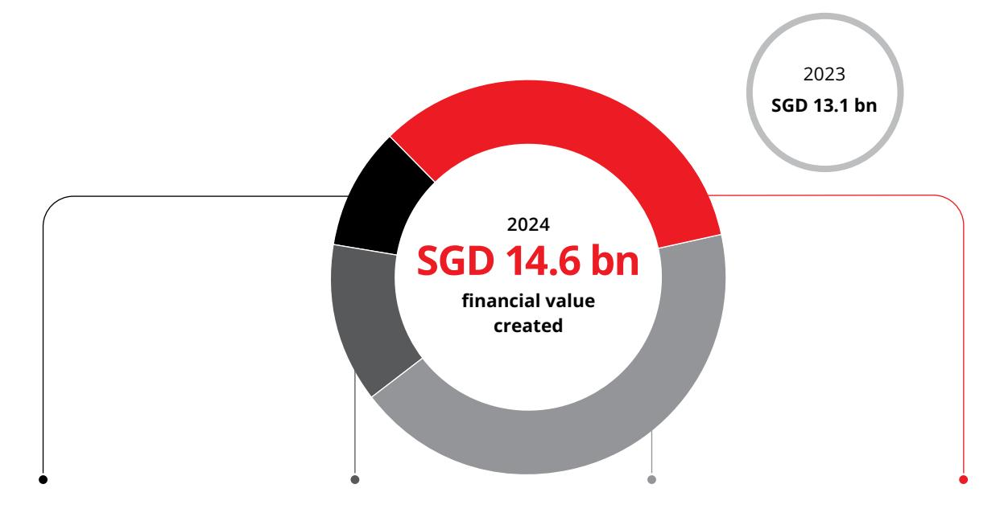

Total discretionary bonus to employees through variable cash bonus and long-term incentives. In 2024, a special one-time bonus of SGD 1,000(1) each was paid to all staff except senior managers as an additional reward for their contribution to the record performance.

Contributions to society through direct and indirect taxes, as well as stepping up our support for vulnerable communities and catalysing social impact. Similar to 2023, SGD 100 million was set aside in 2024 for Impact Beyond

Dividends for the year to ordinary shareholders. Dividends increased 27% year-on-year to SGD 2.22 per share or SGD 6.31 billion from a step-up in dividends per share as well as a one-for-10 bonus issue that effectively raised dividends

Retained for business growth and future payout of dividends. Capital Return dividend of 15 cents per share per quarter planned for financial year 2025, along with share buybacks announced previously.

# We create value for our stakeholders in several ways:

We define financial value created as net profit before discretionary bonus, taxes (direct and indirect) and community contributions. In 2024, the financial value created amounted to SGD 14.6 billion (2023: SGD 13.1 billion).

Beyond financials, we create value for our stakeholders in the following ways.

## **Customers**

Supporting our customers' sustainability ambitions through innovative financial solutions and democratising banking services for all.

Read more about our "Responsible Banking" in the Sustainability Report.

### Society

Championing Businesses for Impact and uplifting vulnerable communities to catalyse positive environmental and social impact.

Read more about our "Impact Beyond Banking" in the Sustainability Report.

# **Employees**

Empowering our people to build fulfilling long-term careers by enhancing their experience, investing in their growth and development and fostering an inclusive culture with equal opportunities.

Read more about our "Enhancing employee engagement and culture", "Developing our people" and "Driving diversity, equity and inclusion" in the Sustainability Report.

### Suppliers

Through our supplier selection and engagement, we partner with and support more restorative businesses

Read more about our approach to "Sustainable procurement" in the Sustainability Report.

# Regulators

Engaging with local and global regulators and policymakers on reforms and new initiatives that help to maintain the integrity of the banking industry.

Read more about our "Stakeholder engagement" in the Sustainability Report.

# Sustainability as a driver of long-term value

Guided by our vision to be the "Best Bank for a Better World", we weave environmental and social factors into the fabric of our business across three pillars to drive long-term value creation for our stakeholders.

Responsible

We are partnering with our clients

to support Asia's just transition to

a low-carbon economy, integrating

and investment opportunities, and

democratising banking services to meet

02 Responsible Business Practices We believe in doing the right thing by our people, building a great culture and embedding environmental and social sustainability into financing solutions factors in our business operations.

**Beyond Banking** We create impact beyond banking by uplifting the lives and livelihoods of

vulnerable communities through the DBS Foundation, the DBS People of Purpose employee volunteer movement and philanthropic initiatives.

### Sustainability highlights 2024

customers' specific needs.

### Enhanced

# Transition Finance Framework

including a refined list of eligible activities and strengthened governance to accelerate the just transition in Asia

### Committed

### SGD 89 billion

in sustainable financing, net of repayments, as of December 2024. DBS also facilitated SGD 38 billion in sustainable bond issuances as an active bookrunner in 2024

# Mid-Caps and SMEs on their sustainability journeys

through strategic ecosystem partnerships across markets and new initiatives, such as the ESG Ready Programme in Singapore, almost doubling sustainable finance volumes

### Engaged

### > 2.2 million customers

through LiveBetter platform, our one-stop digital platform for sustainable lifestyle and financial solutions, since November 2021

### Disbursed

# > SGD 1 billion

in loans to low-income individuals in Indonesia, as part of our efforts to democratise banking services in Asia

# ~ 4.000 unsecured loans

totalling SGD 500 million to MSMEs in Singapore to support their working capital needs

### ~ SGD 3.4 billion in loans

through Priority Sector Lending, supporting economic and social development in India

# **Engaged**

# > 33,000 employees

through Live Fulfilled Carnival to cultivate a growth mindset and advance their careers

### **Achieved**

# 91% employee engagement

in My Voice survey, 17 percentage points above the APAC Financial Services Industry benchmark

### **Equipped**

### > 22.000 employees

with foundational sustainability knowledge, including climate-related topics, and conducted full-day trainings for more than 200 senior country management leaders

### **Enhanced**

# **Operational decarbonisation** roadmap

to drive greater energy efficiency measures across our leased and owned assets

# Launched

## **Inaugural regenerative** festival

engaging employees, including procurement managers, and suppliers to inspire new ways of sourcing and consuming

### Enhanced

### Al governance

through expanded Responsible Data Use Framework and the creation of a Responsible AI playbook for Gen AI

# Committed

# > SGD 100 million

comprising SGD 98.1 million in funding to support multi-year programmes focused on two key themes, providing essential needs and fostering inclusion, while additionally granting SGD 4.5 million to Businesses for Impact

### Launched

# **DBS Foundation Impact Beyond series**

bringing together actors from the public, private and social sectors to tackle Asia's ageing challenge

## Subsidised

# > SGD 14 million

worth of everyday purchases for our customers through DBS Hawker Meals and POSB Support Our Heartlands programmes

# Delivered

# > 270,000 volunteering hours

driving employee engagement to embed the culture of giving

**Sustainability governance structure 82** DBS Annual Report 2024 **Making Greater Impact 83**

# **Supporting a just transition in Asia**

We recognise that the largest impact we create is through our lending and financing activities. We are committed to responsible banking practices by integrating sustainability into our risk management as well as the lending and banking solutions we offer our clients.

Tackling climate change is a critical priority due to its urgency and given how connected it is with other sustainability challenges. We see the case for accelerating climate action as a societal responsibility, risk management imperative and business opportunity. In 2022, we established our very first set of science-informed decarbonisation targets for our Scope 3 financed emissions. Since then, we have been focused on translating our climate ambition into action to accomplish real world decarbonisation. We believe that Asia's transition must be people-centric, aimed at balancing social, economic and environmental considerations.

As a leading Asian bank, we have an important role to play to ensure a just and inclusive transition that improves the living standards of Asia's growing population. We have enhanced our Transition Finance Framework to guide our approach to capture transition-related business opportunities

and manage potential risks, whilst strongly supporting the business transformation of our clients.

Our ambition and commitments to support the just transition in Asia depend on changes in the real economy, from policy and regulatory developments to the adoption of new technologies. In addition to providing innovative financing solutions for our clients, we are focused on engaging and partnering with key ecosystem players, in Asia and globally, to foster collective action and collaboration across value chains and national borders.

# **Our climate strategy**

**Our ambition is to achieve a net zero future while recognising our social responsibility to foster a just and inclusive transition**

To position DBS as the Transition Bank for Asia, our priorities are:

| Our financing and advisory                                                                                                                    |                                                                                                                                                                         |                                                                                                                                              |  |
|-----------------------------------------------------------------------------------------------------------------------------------------------|-------------------------------------------------------------------------------------------------------------------------------------------------------------------------|----------------------------------------------------------------------------------------------------------------------------------------------|--|
| Business opportunity                                                                                                                          | Risk management                                                                                                                                                         | Our operations                                                                                                                               |  |
| Providing innovative financial solutions and advisory services to support our clients in their sustainability and transition efforts | Integrating climate and sustainability considerations into risk management processes to enhance client engagement and ensure the resilience of our business | Achieving net zero in our own operations Read more on how we are managing our operational emissions in the Sustainability Report |  |

Our strategy is enabled through:

Forging partnerships and engaging with key ecosystem players to drive collective action

Leveraging technology and AI to enhance data analytics capabilities

Reskilling and empowering our people

Ensuring robust governance and processes

# **Read more in our Sustainability Report**

Our Sustainability Report 2024 is prepared in accordance with, and taking reference to, the Global Reporting Initiative (GRI), the Sustainability Accounting Standards Board (SASB) and recommendations of the Task Force on Climate-related Financial Disclosures (TCFD).

# **Sustainability governance structure**

At DBS, the Board is collectively responsible for the long-term success of the bank and has ultimate responsibility of our sustainability strategy and reporting. It provides constructive challenge and strategic advice to management.

To ensure robust governance to oversee the execution of our climate strategy and embed our net zero commitment into our business, we have institutionalised a new Group Climate Council (GCC). The GCC reports as a sub-committee to the Group Sustainability Council. Its members comprise representatives from key units, who possess the requisite knowledge and capabilities to set strategic direction for our climate-related initiatives.

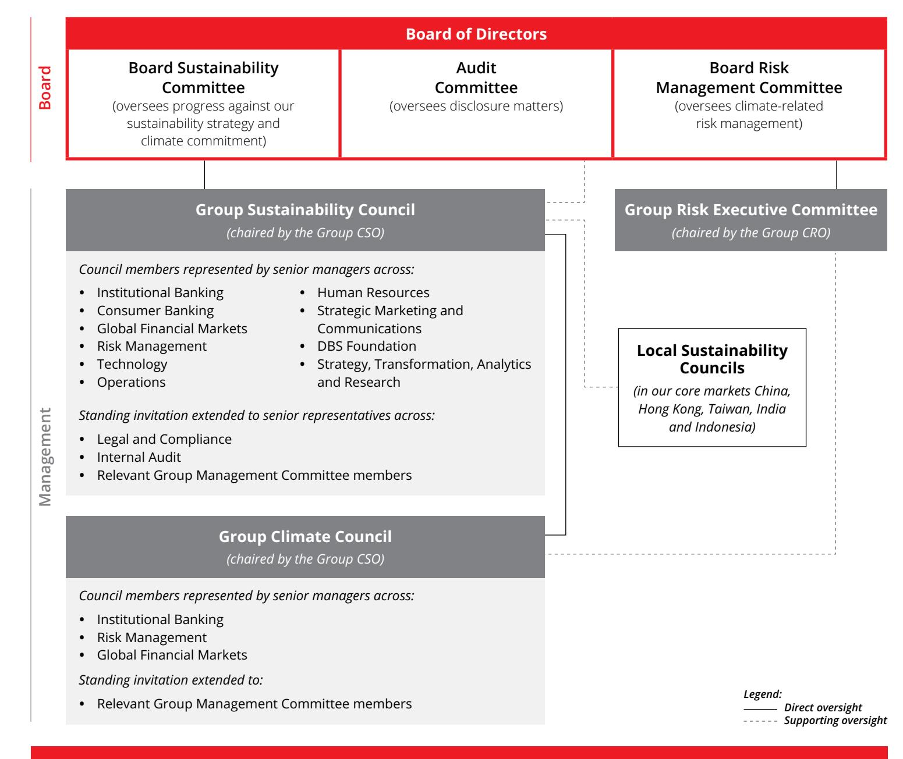

# **Board statement on sustainability**

"The Board has overall responsibility for the consideration of sustainability issues in the formulation of DBS' strategy. In 2024, the Board continued to provide oversight on DBS' sustainability agenda, including determining, monitoring and managing material ESG factors, guided by the objective to create long-term value by managing our business in a balanced and responsible way. During the year, the Board Sustainability Committee (BSC) also oversaw the enhancement of DBS' approach to transition financing and the work to align future climate-related disclosures with International Financial Reporting Standards (IFRS) Sustainability Disclosure Standards."

*DBS Group Board of Directors*

**Risk management 84** DBS Annual Report 2024 **Making Greater Impact 85**

# **Risk management**

**The sections marked by a grey line in the left margin form part of the Group's audited financial statements. Please refer to Pillar 3 and Other Regulatory Disclosures for other risk disclosures.** 

# **1 Risk overview**

# **Business and strategic risk**

Overarching risk arising from adverse business and economic changes materially affect DBS' long-term objectives. This risk is managed separately under other governance processes.

*Read more about this on page 85.*

# **Credit risk**

Risk arising from borrowers or counterparties failing to meet their debt or contractual obligations.

*Read more about this on page 86.*

# **Market risk**

Risk arising from adverse changes in interest rates, foreign exchange rates, equity prices, credit spreads and commodity prices, as well as related factors.

*Read more about this on page 93.*

### **Liquidity risk**

Risk that arises if DBS is unable to meet financial obligations when they are due.

*Read more about this on page 95.*

# **Operational risk**

Risk arising from inadequate or failed internal processes, people or systems, or from external events. It includes legal risk, but excludes strategic and reputational risk.

*Read more about this on page 98.*

### **Technology risk**

Risk arising from potential adverse outcomes or disruptions stemming from technology-related factors, such as software vulnerabilities, hardware failures, cybersecurity threats, or technological changes. Technology risk can arise from internal factors (such as system resiliency gaps, change management, inadequate governance and inadequate IT workforce

skillsets); or from external factors (such as cyber-threats and third party vendors).

*Read more about this on page 99.*

# **Reputational risk**

Risk that arises if our shareholder value (including earnings and capital) is adversely affected by any negative stakeholder perception of DBS' image. This influences our ability to establish new relationships or services, service existing relationships and have continued access to sources of funding. Reputational risk usually occurs when the other risks are poorly managed.

*Read more about this on page 100.*

# **2 Risk-taking and our business segments**

Our risks are diversified across different business segments. The chart below provides an overview of the risks arising from our business segments. The asset size of each business segment reflects its contribution to the balance sheet, and the risk-weighted assets (RWA) offer a riskadjusted perspective.

*Refer to Note 44.1 to the financial statements on page 175 for more information about DBS' business segments.*

| SGD million             | Consumer Banking/ Wealth Management | Institutional Banking(a) | Markets Trading | Others(b) | Group   |
|-------------------------|-------------------------------------------|-----------------------------|-----------------|-----------|---------|
| Assets(c)               | 133,626                                   | 337,392                     | 234,398         | 115,431   | 820,847 |
| Risk-weighted assets | 52,954                                    | 197,455                     | 57,357          | 44,236    | 352,002 |
| % of RWA                | Consumer Banking/ Wealth Management | Institutional Banking(a) | Markets Trading | Others(b) | Group   |
| Credit risk             | 78                                        | 93                          | 45              | 56        | 78      |
| Market risk             | 2                                         | 2                           | 53              | 8         | 11      |
| Operational risk        | 20                                        | 5                           | 2               | 36        | 11      |

*(a) Encompasses assets/ RWA from DBS Vickers Group.* 

*(b) Encompasses assets/ RWA from capital and balance sheet management, funding and liquidity activities and The Islamic Bank of Asia Limited.* 

*(c) Before goodwill and intangibles.*

# **3 Risk Governance**

The Board oversees DBS' affairs and provides sound leadership for the CEO and management. Authorised by the Board, various Board committees oversee specific responsibilities based on clearly defined terms of reference.

Under our risk management approach, the Board, through the Board Risk Management Committee (BRMC), sets our Risk Appetite, oversees the establishment of enterprise-wide risk management policies and processes, and establishes risk appetite limits to guide DBS' risk-taking.

The BRMC also oversees the identification, monitoring, management and reporting of credit, market, liquidity, operational, technology and reputational risks. The BRMC Technology Risk Committee (BTRC), a sub-committee to the BRMC, was established in November 2023 to assist the BRMC in overseeing the management of technology risk across the Group. It has been dissolved with the set-up of the Board Technology Committee (BTC) in 2025. In addition to the BTC subsuming the responsibilities of the BTRC, it also has a mandate for oversight of the Group's technology strategy and architecture.

To facilitate the BRMC and management's risk oversight, the following risk management committees have been established.

| Risk management committees                                                                                                                                                                                                                                                        |                                                                                                                                                                                                                                                                                                                                                                                                                                                                                                                                                                                                                                                                                                                                                                                                                                                                          |
|-----------------------------------------------------------------------------------------------------------------------------------------------------------------------------------------------------------------------------------------------------------------------------------|--------------------------------------------------------------------------------------------------------------------------------------------------------------------------------------------------------------------------------------------------------------------------------------------------------------------------------------------------------------------------------------------------------------------------------------------------------------------------------------------------------------------------------------------------------------------------------------------------------------------------------------------------------------------------------------------------------------------------------------------------------------------------------------------------------------------------------------------------------------------------|
| Risk Executive Committee (Risk EXCO)                                                                                                                                                                                                                                              | As the overall executive body regarding risk matters, the Risk EXCO oversees DBS' risk management.                                                                                                                                                                                                                                                                                                                                                                                                                                                                                                                                                                                                                                                                                                                                                                    |
| Group Credit Risk Committee (GCRC) Group Credit Risk Models Committee (GCRMC) Group Market and Liquidity Risk Committee (GMLRC) Group Operational Risk Committee (GORC) Group Technology Risk Committee (GTRC) Group Scenario and Stress Testing Committee (GSSTC) | Each of the committees reports to the Risk EXCO, and serves as an executive forum to discuss and implement DBS' risk management. Key responsibilities: • Assess and approve risk-taking activities • Oversee DBS' risk management infrastructure, which includes frameworks, decision criteria, authorities, people, policies, standards, processes, information and systems • Approve risk policies such as model governance standards, stress testing scenarios, and the evaluation and endorsement of risk models • Assess and monitor specific credit concentration • Recommend stress-testing scenarios (including macroeconomic variable projections) and review the results The members in these committees comprise representatives from the Risk Management Group (RMG) as well as key business and support units. |
| Product Approval Committee (PAC)                                                                                                                                                                                                                                                  | The PAC provides group-wide oversight and direction for the approval of new product/service and outsourcing initiatives. It evaluates new product/ service and outsourcing initiatives to ensure that they are in line with DBS' strategy and risk appetite.                                                                                                                                                                                                                                                                                                                                                                                                                                                                                                                                                                                                    |

Most of the above committees are supported by local risk committees in all major locations, where appropriate. These local risk committees oversee the local risk positions for all businesses and support units, ensuring that they keep within limits set by the Group risk committees. They also approve location-specific risk policies.

The Chief Risk Officer (CRO), who is a member of the Group Executive Committee and reports to the Chairman of the BRMC and the CEO, oversees the risk management function. The CRO is independent of business lines and is actively involved in key decision-making processes. He often engages with regulators to discuss risk matters, enabling a more holistic risk management perspective.

Working closely with the risk and business committees, the CRO is responsible for the following:

- **•** Management of DBS' risks, including systems and processes to identify, approve, measure, monitor, control and report risks
- **•** Engagement with senior management about material matters regarding all risk types
- **•** Development of risk controls and mitigation processes
- **•** Ensuring DBS' risk management is effective, and the Risk Appetite established by the Board is adhered to

# **4 Risk Appetite**

DBS' Risk Appetite is set by the Board and governed by the Risk Appetite Policy, which articulates the risks that we are willing to accept. It also serves to reinforce our risk culture by setting a clear message from the 'tone from the top'. A strong organisational risk culture, complemented with a balanced incentive framework (refer to "Remuneration Report" section on page 69), helps to further embed our Risk Appetite.

**Risk management 86** DBS Annual Report 2024 **Making Greater Impact 87**

### **4.1 Risk thresholds and economic capital usage**

Our Risk Appetite takes into account a spectrum of risk types and is implemented using thresholds, policies, processes and controls.

Setting thresholds is essential in making DBS' Risk Appetite an intrinsic part of our businesses as they help to keep all our risks within acceptable levels. Portfolio risk limits for the quantifiable risk types are established top down, and these are implemented using frameworks. As for the nonquantifiable risk types, these are managed using qualitative principles.

To ensure that the thresholds pertaining to our Risk Appetite are completely risk sensitive, we adopted both economic capital (EC) and regulatory capital (RC) as our risk metrics. Additionally, both EC and RC are assessed as part of our Internal Capital Adequacy Assessment Process (ICAAP).

Our capital allocation structure monitors credit, market and operational risks (including technology risk), by assessing regulatory capital utilisation at the business unit level. The diagram below shows how they are managed along the various dimensions. A buffer is also maintained for other risks, such as country, reputational, model risks, etc.

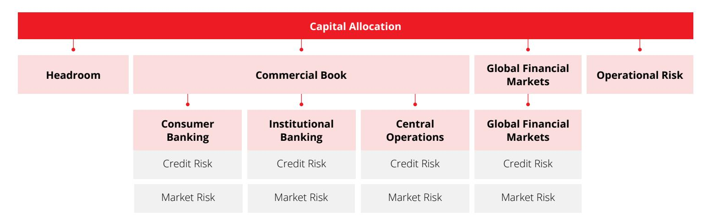

Other quantitative or qualitative controls are used to manage the other risks at granular levels. The following chart provides a broad overview of how our Risk Appetite permeates throughout DBS. Refer to Sections 5 through 10 for more information about each risk type.

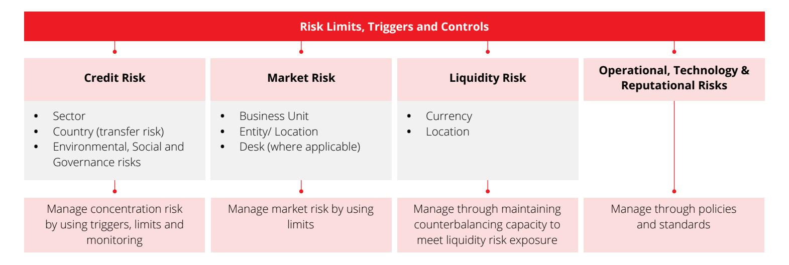

### **4.2 Stress testing**

Stress testing is an integral part of our risk management process. It includes both sensitivity and scenario analyses, and is conducted regularly. In particular, the ICAAP (a group-wide exercise spanning different risk types) is performed annually. In addition, stress tests are carried out in response to microeconomic and macroeconomic conditions, or portfolio developments. Every stress test is documented and the results are reviewed by senior management and/or the BRMC.

Stress testing alerts senior management to our potential vulnerability to exceptional but plausible adverse events. As such, stress testing enables us to assess capital adequacy and identify potentially risky portfolio segments as well as inherent systematic risks. This then allows us to develop the right contingency plans, exit strategies and mitigating actions beforehand.

The ICAAP ensures our business plans are consistent with our Risk Appetite. This is done by comparing the projected demand for capital to the projected supply of capital under various scenarios, including severe macroeconomic stress.

# **5 Credit Risk**

The most significant measurable risk DBS faces - credit risk - arises from our daily activities in our various businesses. These activities include lending to retail, corporate and institutional customers. It includes the risk of lending, as well as the pre-settlement and settlement risk of foreign exchange, derivatives and securities.

*Refer to Note 41.1 to the financial statements on page 167 for details on DBS' maximum exposure to credit risk.*

# **5.1 Credit risk management at DBS**

DBS' approach to credit risk management comprises the following building blocks:

**Policies**

**Risk methodologies**

**Processes, systems and reports**

### **Policies**

The dimensions of credit risk and the scope of its application are defined in the Group Credit Risk Management Policy. Senior management sets the overall direction and policy for managing credit risk at the enterprise level.

The Group Core Credit Risk Policies (CCRPs) established for Consumer Banking/ Wealth Management and Institutional Banking set forth the principles by which DBS conducts its credit risk management and control activities. These policies, supplemented by a number of operational standards and guides, ensure consistency in identifying, assessing, underwriting, measuring, reporting and controlling credit risk across DBS, and provide guidance in the formulation of business-specific and/ or location-specific credit risk policies and standards.

The operational standards and guides are established to provide greater details on the implementation of the credit principles within the Group CCRPs and are adapted to reflect different credit environments and portfolio risk profiles. The CCRPs are approved by the Group Chief Credit Officer.

## **Risk methodologies**

Credit risk is managed by thoroughly understanding our wholesale customers – the businesses they are in, as well as the economies in which they operate. It is also managed through statistical models and data analytics for retail customers.

The assignment of credit risk ratings and setting of lending limits are integral parts of DBS' credit risk management process, and we use an array of rating models for our wholesale and retail portfolios. Most of these models are built internally using DBS' loss data, and the limits are driven by DBS' Risk Appetite Statement and the Target Market and Risk Acceptance Criteria (TM-RAC).

Wholesale borrowers are assessed individually, and further reviewed and evaluated by experienced credit risk managers (CRMs) who consider relevant credit risk factors in the final determination of the borrower's risk. For some portfolios within the SME segment, DBS also uses a programme-based approach to achieve a balanced management of risks and rewards. Retail exposures are assessed using credit score models, credit bureau records as well as internally and externally available customer behaviour records supplemented by our Risk Acceptance Criteria (RAC). Credit applications are proposed by the business units, and applications outside the RAC are independently assessed by the CRMs.

*Refer to Section 5.3 on page 90 to read more about our internal credit risk models.* 

Pre-settlement credit risk for traded products arising from a counterparty potentially defaulting on its obligations is quantified by evaluation of the mark-to-market value, plus potential future exposure. This is included within DBS' overall credit limits to counterparties for internal risk management.

We actively monitor and manage our exposure to counterparties for over-thecounter (OTC) derivative trades to protect our balance sheet in the event of a counterparty default. Counterparty risk exposures that may be adversely affected by market risk events are identified, reviewed and acted upon by management, and highlighted to the appropriate risk committees. Specific wrong-way risk arises when the credit exposure of a counterparty (from the traded product transaction) directly correlates with the probability of default of the counterparty. DBS has processes in place to guide the handling of specific wrong-way risk transactions, and its risk measurement metric takes into account the higher risks associated with such transactions.

Issuer default risk that may also arise from derivatives, notes and securities is generally measured based on jump-to-default computations.

# **Concentration risk management**

For credit risk concentration, we use EC as our measurement tool as it combines the individual risk factors such as the probability of default (PD), loss given default (LGD) and exposure at default (EAD), in addition to industry correlation and portfolio concentration. EC thresholds are set to ensure that the allocated EC stays within our Risk Appetite. Concentration risk for retail is managed at two levels – product level where exposure limits are set up, and segment level to manage the growth of high-risk segments. Governance processes are in place to ensure that these thresholds are monitored regularly, and appropriate actions are taken when the thresholds are breached.

DBS continually examines and reviews how we can enhance the scope of our thresholds and approaches to manage concentration risk.

## **Environmental, social and governance risks**

DBS considers ESG risk management as

critical to ensure a sustainable lending and investment portfolio.

Following our strengthening of ESG governance through establishment of Board Sustainability Committee in 2022 and introduction of our new ESG Risk assessment process in 2023, we continued to invest in building our ESG risk management capabilities to manage the rapidly evolving ESG landscape. The Group Responsible Finance standard updated in 2023 continues to provide minimum requirements for responsible financing, incorporating enhanced due diligence for higher risk transactions and alignment with international practices where applicable.

We further enhanced our ESG risk assessment process through sector benchmark guidance supporting Relationship Managers and CRMs to better assess clients against industry standards. We also leveraged Generative Artificial Intelligence (Gen AI) for our ESG Risk assessment questionnaire to enable summarisation of key ESG information and screening of negative ESG news of the client. In 2024, we also strengthened our capabilities to assess physical risk vulnerabilities and further enhanced our in-house Climate Scenario Analysis (CSA) models to translate transition risk on key financial drivers.

*Read more about "Responsible financing" in the Sustainability Report.* 

### **Country risk**

Country risk refers to the risk of loss due to events in a specific country (or a group of countries). This includes political, exchange rate, economic, sovereign and transfer risks.

DBS manages country risk through the requirements of the Group CCRP and the said risk is part of our concentration risk management. The way we manage transfer risk at DBS is set out in our Country Risk Management Standard. This includes an internal transfer risk and sovereign risk rating system, where assessments are made independently of business decisions. Our transfer risk limits are set in accordance with the Group Risk Appetite Policy.

Transfer risk limits for individually reviewed countries are set based on country-specific strategic business considerations as well as the acceptable potential loss according to our Risk Appetite. Management actively evaluates and determines the appropriate level of transfer risk exposures for these countries taking into account the risks and rewards and whether they are in line with our strategic intent. Limits for all other countries are set using a model-based approach.

Risk Appetite for each country is approved by the BRMC, while transfer risk limits are approved by the Board EXCO and senior management.

**88** DBS Annual Report 2024 **Making Greater Impact 89**

### **Credit stress testing**

DBS engages in various types of credit stress testing, and these are driven either by regulators or internal requirements and management. Our credit stress tests are performed at the total portfolio or sub-portfolio level and are generally conducted to assess the impact of changing economic conditions on asset quality, earnings performance, capital adequacy and liquidity. DBS' stress testing programme is comprehensive and covers a range of risks and business areas.

DBS typically performs the following types of credit stress testing at a minimum and others as necessary:

| Pillar 1 cyclicality stress testing | DBS conducts Pillar 1 cyclicality stress testing regularly as required by regulators. Under Pillar 1 cyclicality stress testing, DBS assesses the impact of a mild stress scenario (at least two consecutive quarters of zero growth) on Internal Ratings-Based (IRB) estimates (i.e. PD, LGD and EAD) and the impact on regulatory capital. The purpose of the Pillar 1 cyclicality stress test is to assess the robustness of internal credit risk models and the cushion above minimum regulatory capital.                                                                                                                       |
|-------------------------------------|----------------------------------------------------------------------------------------------------------------------------------------------------------------------------------------------------------------------------------------------------------------------------------------------------------------------------------------------------------------------------------------------------------------------------------------------------------------------------------------------------------------------------------------------------------------------------------------------------------------------------------------------------|
| Pillar 2 credit stress testing      | DBS conducts Pillar 2 credit stress testing once a year as part of the ICAAP. Under Pillar 2 credit stress testing, DBS assesses the impact of stress scenarios, with different levels of severity, on asset quality, earnings performance as well as internal and regulatory capital. The results of the credit stress test form inputs to the capital planning process under ICAAP. The purpose of the Pillar 2 credit stress testing is to examine, in a rigorous and forward-looking manner, the possible events or changes in market conditions that could adversely impact DBS and to develop the appropriate action plan. |
| Industry-wide stress testing        | DBS participates in the annual industry-wide stress test (IWST) conducted by the Monetary Authority of Singapore (MAS) to facilitate the ongoing assessment of Singapore's financial stability. Under the IWST, DBS is required to assess the impact of adverse scenarios, as defined by the regulator, on asset quality, earnings performance and capital adequacy, where applicable.                                                                                                                                                                                                                                                    |
| Sensitivity and scenario analyses   | DBS also conducts multiple independent sensitivity analyses and credit portfolio reviews based on various scenarios. The intent of these analyses and reviews is to identify vulnerabilities for the purpose of developing and executing mitigating actions. For example, climate transition and physical risk scenario analyses are conducted as part of the regulatory-driven pilot climate stress test exercises to assess the potential vulnerabilities of our portfolios to short and long term climate transition and physical risks.                                                                                         |

### **Processes, systems and reports**

DBS constantly invests in systems to support risk monitoring and reporting for our Institutional Banking and Consumer Banking/ Wealth Management businesses.

The end-to-end credit process is continually being reviewed and improved through various front-to-back initiatives involving business, operations, risk management and other key stakeholders. Day-to-day monitoring of credit exposures, portfolio performance and external environmental factors potentially affecting credit risk profiles is key to our philosophy of effective credit risk management.

In addition, credit trends, which may include industry analysis, early warning alerts and significant weak credits, are submitted to

the various risk committees, allowing key strategies and action plans to be formulated and evaluated. Credit control functions also ensure that any credit risk taken complies with the credit risk policies and standards. These functions ensure that approved limits are activated, credit excesses and policy exceptions are appropriately endorsed, compliance with credit standards is carried out, and covenants established are monitored.

Independent risk management functions that report to the CRO are jointly responsible for developing and maintaining a robust credit stress testing programme. These units oversee the implementation of credit stress tests as well as the analysis of the results, of which management, various risk committees and regulators are informed.

# **Non-performing assets**

DBS' credit facilities are classified as "Performing assets" or "Non-performing assets" (NPA), in accordance with the MAS Notice to Banks No. 612 "Credit Files, Grading and Provisioning" (MAS Notice 612).

Credit exposures are categorised into one of the following five categories, according to our assessment of a borrower's ability to repay a credit facility from its normal sources of income and/ or the repayment behaviour of the borrower.

**Risk management**

| Classification grade | Description                                                                                                                                                                                                                                       |  |
|----------------------|---------------------------------------------------------------------------------------------------------------------------------------------------------------------------------------------------------------------------------------------------|--|
| Performing assets    |                                                                                                                                                                                                                                                   |  |
| Pass                 | Indicates that the timely repayment of the outstanding credit facilities is not in doubt.                                                                                                                                                         |  |
| Special mention      | Indicates that the borrower exhibits potential weaknesses that, if not corrected in a timely manner, may adversely affect future repayments and warrant close attention by DBS.                                                                |  |
| Classified or NPA    |                                                                                                                                                                                                                                                   |  |
| Substandard          | Indicates that the borrower exhibits definable weaknesses in its business, cash flow or financial position that may jeopardise repayment on existing terms.                                                                                    |  |
| Doubtful             | Indicates that the borrower exhibits severe weaknesses such that the prospect of full recovery of the outstanding credit facilities is questionable and the prospect of a loss is high, but the exact amount remains undeterminable as yet. |  |
| Loss                 | Indicates that the outstanding credit facility is not collectable, and little or nothing can be done to recover the outstanding amount from any collateral or from the assets of the borrower generally.                                       |  |

A default is considered to have occurred with regard to a particular borrower when either or both of the following events have taken place:

- Subjective default: Borrower is considered to be unlikely to pay its credit obligations in full, without DBS taking action such as realising security (if held)
- Technical default: Borrower is more than 90 days past due on any credit obligation to DBS

For retail borrowers, the categorisation into the respective MAS loan grades is at the facility level and consistent with MAS Notice 612.

Credit facilities are classified as restructured assets when we grant non-commercial concessions to a borrower because its financial position has deteriorated or is unable to meet the original repayment schedule. A restructured credit facility is classified into the appropriate nonperforming grade based on the assessment of the borrower's financial condition and its ability to repay according to the restructured terms.

Such credit facilities are not returned to the performing status until there are reasonable grounds to conclude that the borrower will be able to service all future principal and interest payments on the credit facility in accordance with the restructured terms and MAS Notice 612. Apart from what has been described, we do not grant concessions to borrowers in the normal course of business.

In addition, it is not within DBS' business model to acquire debts that have been restructured at inception (e.g. distressed debts).

*Refer to Note 2.11 to the financial statements on page 129 for our accounting policies regarding specific and general allowances for credit losses.*

In general, specific allowances are recognised for defaulting credit exposures rated substandard and below.

*The breakdown of our NPA by loan grading and industry and the related amounts of specific allowances can be found in Note 41.2 to the financial statements on page 168. A breakdown of past due loans can also be found in the same note.* 

When required, we will take possession of all collateral and dispose them as soon as practicable. Realised proceeds are used to reduce outstanding indebtedness.

*A breakdown of collateral held for NPA is shown in Note 41.2 to the financial statements on page 170.* 

Repossessed collateral is classified in the balance sheet as Other assets. The amounts of such Other assets for 2023 and 2024 were not material.

## **5.2 Credit risk mitigants**

# **Collateral received**

Where possible, DBS takes collateral as a secondary source of repayment. This includes, but is not limited to, cash, marketable securities, real estate, trade receivables, inventory, equipment, and other physical and/ or financial collateral. We may also take fixed and floating charges on the assets of borrowers.

Policies are in place to determine the eligibility of collateral for credit risk mitigation. Collateral is generally diversified and periodic valuations of collateral are required.

Real estate constitutes the bulk of our collateral, with a significantly lower proportion in marketable securities and cash.

For derivatives, repurchase agreements (repo) and other repo-style transactions with financial market counterparties, collateral arrangements are typically covered under market-standard documentation, such as International Swaps & Derivatives Association (ISDA) Agreements and Master Repurchase Agreements.

The collateral exchanged mitigates markedto-market changes at a re-margining frequency that DBS and the counterparties have mutually agreed upon. This is governed by internal guidelines with respect to collateral eligibility. In the event of a default, the credit risk exposure is reduced by master-netting arrangements where DBS is allowed to offset what is owed to a counterparty against what is due from that counterparty in a netting-eligible jurisdiction.

*Refer to Note 14 to the financial statements on page 141 for further information on financial assets and liabilities subject to netting agreement but not offset on the balance sheet.* 

Collateral held against derivatives generally consists of cash in major currencies and highly rated government or quasi-government bonds. Exceptions may arise in certain countries, where due to domestic capital markets and business conditions, the bank may be required to accept less highly rated or liquid government bonds and currencies. Reverse repo-transactions are generally traded with large institutions with reasonably good credit standing. DBS takes haircuts against the underlying collateral of these transactions that are commensurate with collateral quality to ensure credit risks are adequately mitigated.

In times of difficulty, we will review the customers' specific situation and circumstances to assist them in restructuring their financial obligations.

However, should the need arise, disposal and recovery processes are in place to dispose of the collateral held. DBS maintains a panel of agents and solicitors to assist in the disposal of non-liquid assets and specialised equipment quickly.

### **Collateral posted**

DBS is required to post additional collateral in the event of a rating downgrade. As at 31 December 2024, for a three-notch downgrade of its Standard & Poor's Ratings Services and Moody's Investors Services ratings, DBS will have to post additional collateral amounting to SGD 9 million (2023: SGD 26 million).

### **Other credit risk mitigants**

DBS accepts guarantees as credit risk mitigants. Internal requirements for considering the eligibility of guarantors for credit risk mitigation are in place.

# **5.3 Internal credit risk models**

DBS adopts rating systems for the different asset classes under the Internal Ratings - Based Approach (IRBA).

There is a robust governance process for the development, independent validation and approval of any credit risk model. The models go through a rigorous review process before they are endorsed by the GCRMC and Risk EXCO. They must also be approved by the BRMC before submission for regulatory approval. The key risk measures generated by the internal credit risk rating models to quantify regulatory capital include PD, LGD and EAD. For portfolios under the Foundation IRBA, internal estimates of PD are used while the supervisory LGD and EAD estimates are applied. For portfolios under the Advanced IRBA, internal estimates of PD, LGD and EAD are used. In addition, the ratings from the credit models act as the basis for underwriting credit risk, monitoring portfolio performance and determining business strategies. The performance of the rating systems is monitored regularly and reported to the GCRMC, Risk EXCO and BRMC to ensure their ongoing effectiveness.

An independent risk unit conducts formal validations for the respective rating systems annually. The validation processes are also independently reviewed by Group Audit. These serve to highlight material deterioration in the rating systems for management attention.

### **5.3.1 Retail exposure**

Retail exposures are categorised into the following asset classes under the Advanced IRBA: residential mortgages, qualifying revolving retail exposures, and other retail exposures.

Within each asset class, exposures are managed on a portfolio basis. Each customer or account is assigned to a risk pool, considering factors such as borrower characteristics and collateral type. PD, EAD and LGD estimates are based on internal historical default, utilisation and realised losses within a defined period.

Product-specific credit risk elements such as underwriting criteria, scoring models, approving authorities, asset quality, and business strategy reviews, as well as systems, processes and techniques to monitor portfolio performance, are in place. Credit risk models for secured and unsecured portfolios are also used to update the risk level of each loan on a monthly basis, reflecting the broad usage of risk models in portfolio quality reviews.

### **5.3.2 Wholesale exposure**

Wholesale exposures are largely under the Foundation IRBA for capital computation. They include sovereign, bank and corporate. Specialised lending exposures are under IRBA using supervisory slotting criteria.

Sovereign exposures are risk-rated using internal risk-rating models. Factors related to country-specific macroeconomic risk, political risk, social risk and liquidity risk are included in the sovereign rating models to assess the sovereign credit risk in an objective and systematic manner.

Bank exposures are assessed using the bank-rating model. The model considers both quantitative and qualitative factors such as capital levels and liquidity, asset quality and management strength.

Large corporate exposures are assessed using internal rating models. Factors considered in the risk assessment process include the counterparty's financial strength and qualitative factors such as industry risk, access to funding, market standing and management strength.

SME credit rating models consider risk factors such as those relating to the counterparty's financial strength, qualitative factors, as well as account performance.

Credit risk ratings under the IRBA portfolios are, at a minimum, reviewed by designated approvers on an annual basis unless credit conditions require more frequent assessment.

### **5.3.3 Specialised lending exposures**

Specialised lending IRBA portfolios include income-producing real estate, project finance, object finance, and commodities finance. These adopt the supervisory slotting criteria specified under MAS Notice 637, which are used to determine the risk weights to calculate credit risk-weighted exposures.

# **5.3.4 Securitisation exposures**

We arrange securitisation transactions for our clients for fees. These transactions do not involve special-purpose entities that we control. For transactions that are not underwritten, no securitisation exposures are assumed as a direct consequence of arranging the transactions. Any decision to invest in any of such arranged transactions is subject to independent risk assessment.

Where DBS provides an underwriting commitment, any securitisation exposure that arises will be held in the trading book to be traded or sold down in accordance with our internal policy and risk limits. In addition, DBS does not provide implicit support for any transactions we structure or have invested in.

We invest in our clients' securitisation transactions from time to time. These may include securitisation transactions arranged by us or with other parties.

We may also act as a liquidity facility provider, working capital facility provider or swap counterparty. Such securitisation exposures require the approval of the independent risk function and are subject to regular risk reviews. We also have processes in place to monitor the credit risk of our securitisation exposures.

### **5.3.5 Credit exposures falling outside internal credit risk models**

DBS applies the Standardised Approach (SA) for portfolios that are expected to transit to IRBA or for portfolios that are immaterial in terms of size and risk profile. These portfolios include:

- IRBA-transitioning retail and wholesale exposures
- **•** IRBA-exempt retail exposures
- **•** IRBA-exempt wholesale exposures

Any identified transitioning retail and/ or wholesale exposures are expected to adopt Advanced or Foundation IRBA, subject to approval by regulators. Prior to regulatory approval, these portfolios are under SA.

The portfolios under the SA are subject to our overall governance framework and credit risk management practices. DBS continues to monitor the size and risk profile of these portfolios and will enhance the relevant risk measurement processes if these risk exposures become material.

DBS uses external ratings for credit exposures under the SA where relevant, and we only accept ratings from Standard & Poor's, Moody's and Fitch in such cases. DBS follows the process prescribed in MAS Notice 637 to map the ratings to the relevant risk weights.

**Risk management 90** DBS Annual Report 2024 **Making Greater Impact 91**

# **5.4 Credit risk in 2024**

### **Concentration risk**

DBS' concentration risk remained well managed across geographies and industry/ business segments.

Our geographic distribution of customer loans remained stable.

Singapore, our home market, continued to account for the largest share of our

gross loans and advances to customers, contributing to 45% of our total portfolio.

Our portfolio is well diversified across industry and business segments. Building and Construction, General Commerce and Manufacturing remained the largest contributors in the wholesale portfolio, accounting for 46% of the total portfolio.

### **Non-performing assets**

New non-performing asset (NPA) formation was offset by recoveries and write-offs. In absolute terms, our total NPA decreased slightly from the previous year to SGD 5.04 billion and non-performing loans (NPL) ratio remained constant at 1.1% in 2024.

*Refer to "CFO Statement" on page 24.*

### **Geographical Concentration (SGD billion) Industry Concentration (SGD billion)**

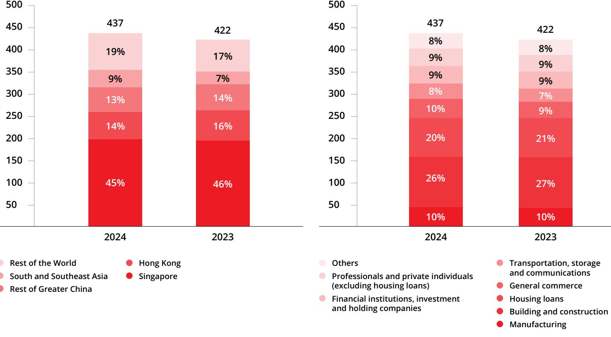

*Above refers to gross loans and advances to customers based on country of incorporation.*

*Above refers to gross loans and advances to customers based on MAS Industry Code.*

*Refer to Note 41.4 to the financial statements on page 171 for DBS' breakdown of credit risk concentration.*

### **Collateral received**

The tables below provide breakdowns by loan-to-value (LTV) bands for the borrowings secured by real estate and other collateral from the various market segments.

## **Residential mortgage loans**

The LTV ratio is calculated using mortgage loans including undrawn commitments

divided by the collateral value. Property valuations are determined using a combination of professional appraisals and housing price indices.

For Singapore mortgage loans, year on year increases in property price index for HDB and private residential properties resulted in a

3.6% increase in the proportion of mortgage exposure in the Up to 50% LTV band.

For Hong Kong mortgage loans, year-on-year decrease in the property price index resulted in a 5.1% increase in the proportion of mortgage exposure in the 51% to 80% LTV band.

DBS Annual Report 2024 • Making Greater Impact Risk management

### Percentage of residential mortgage loans (breakdown by LTV band and geography)

### As at 31 December 2024

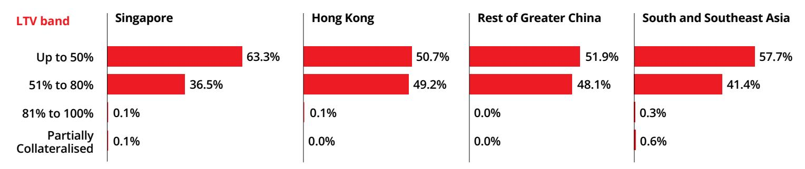

### As at 31 December 2023

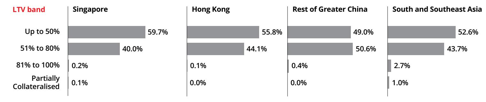

Note: Dec 2023 and Dec 2024 position includes the Taiwan CITI migrated mortgage loans.

### Loans and advances to corporates secured by real estate

These secured loans were extended for the purpose of acquisition and/ or development of real estate, as well as for general working capital. More than 90% of such loans were fully collateralised and majority of these loans had LTV < 80%. Our property loans were mainly concentrated in Singapore and Hong Kong, which together accounted for about 79% of the total property loans.

The LTV ratio is calculated as loans and advances divided by the value of collaterals that secure the same facility. Real estate forms a substantial portion of the collaterals; other collaterals such as cash, marketable securities, and bank guarantees are also included.

### Loans and advances to corporates secured by property by level of collateral

## As at 31 December 2024

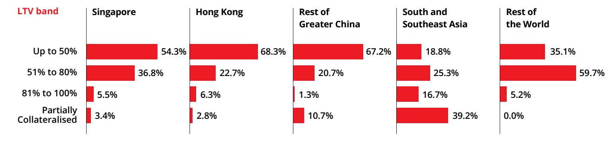

### As at 31 December 2023

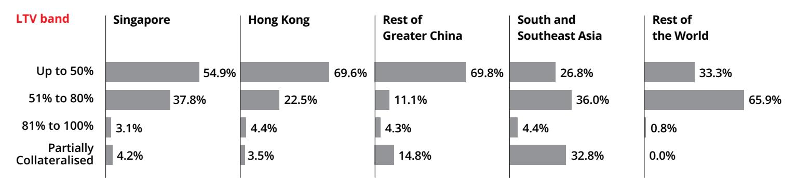

### Loans and advances to banks

In line with market convention, loans and advances to banks are typically unsecured. DBS manages the risk of such exposures by keeping tight control of the exposure tenor and monitoring of their credit quality.

# Derivatives counterparty credit risk by markets and settlement methods

We continue to manage our derivatives counterparty risk exposures with netting and collateral arrangements, thereby protecting our balance sheet in the event of a counterparty default.

A breakdown of our derivatives counterparty credit risk by markets (OTC versus exchange-traded) and settlement methods (cleared through a central counterparty versus settled bilaterally) can be found below.

# Notional OTC and exchange-traded products

| In notional terms, SGD million                      | As at 31 Dec 2024 |
|--------------------------------------------------------|----------------------|
| OTC derivatives cleared through a central counterparty | 2,152,687            |
| OTC derivatives settled bilaterally                    | 1,256,704            |
| Total OTC derivatives                                  | 3,409,391            |
| Exchange-traded derivatives                            | 27,583               |
| Total derivatives                                      | 3,436,974            |

Please refer to Note 36 to the financial statements on page 156 for the netting arrangements impact and a breakdown of the derivatives positions held by DBS.

### 6 Market risk

Our exposure to market risk is categorised into:

**Trading portfolios:** Arising from positions taken for (i) market-making, (ii) client facilitation and (iii) benefiting from market opportunities.

Non-trading portfolios: Arising from (i) our Institutional Banking and Consumer Banking/ Wealth Management assets and liabilities, (ii) debt securities and equities comprising investments held for yield and/ or long-term capital gains, (iii) strategic stakes in entities and (iv) structural foreign exchange risk arising mainly from our strategic investments, which are denominated in currencies other than the Singapore Dollar.

We use a variety of financial derivatives such as swaps, forwards and futures, and options for trading and hedging against market movements

# 5.1 Market risk management at DBS

DBS' approach to market risk management comprises the following building blocks:

Policies

Risk methodologies

Processes, systems and reports

### Policies

The Group Market Risk Management Policy sets our overall approach towards market risk management. This policy is supplemented with standards and guides, which facilitate the identification, measurement, control, monitoring and reporting of market risk in a consistent manner. They also set out the overall approach, requirements and controls governing market risk stress testing across DBS.

The criteria for determining the positions to be included in the trading book are stipulated in the Trading Book Policy Statement.

### **Risk methodologies**

DBS utilises Value-at-Risk (VaR), a statistical risk measure, to estimate the potential loss from market movements. This measure uses historical simulation based on data for the previous 12 months. It assumes that historical changes in market values reflect the distribution of potential outcomes in the immediate future.

DBS limits and monitors market risk exposures using Expected Shortfall (ES). ES is estimated by averaging the portfolio's potential losses beyond the 97.5% confidence interval, under normal market conditions and over a one-day holding period.

ES is supplemented with other risk control metrics such as sensitivities to risk factors and loss triggers for management action.

DBS conducts backtesting to verify the predictiveness of the VaR model. Backtesting compares VaR calculated for positions at the close of each business day with the profit and loss (P&L) that arises from those positions on the following business day. The backtesting P&L excludes fees and commissions, revenues from intra-day trading, non-daily valuation adjustments and time effects.

For backtesting, VaR at the 99% confidence interval and over a one-day holding period is used. We adopt the standardised approach to compute market risk regulatory capital under MAS Notice 637 and MAS Notice FHC-N637 for the trading book positions. As such, VaR backtesting does not impact our regulatory capital for market risk.

93

There are limitations to VaR models; for example, past changes in market risk factors may not provide accurate predictions of future market movements, and the risk arising from adverse market events may not be considered.

To monitor DBS' vulnerability to unexpected but plausible extreme market risk-related events, we conduct multiple market risk stress tests regularly. These cover trading and non-trading portfolios and follow a combination of historical and hypothetical scenarios depicting risk-factor movement.

Interest Rate Risk in the Banking Book (IRRBB) arises from mismatches in the interest rate profiles of assets, liabilities and capital instruments. DBS identifies, measures and manages IRRBB from both economic value and earning perspectives using changes in Economic Value of Equity (EVE) and Net Interest Income (NII) variability as the respective key risk metrics. Estimating IRRBB requires the use of behavioural models and assumptions on certain parameters such as loan prepayment, fixed deposits early redemption and the duration of non-maturity deposits. DBS measures IRRBB on a monthly basis.

### Processes, systems and reports

Robust internal control processes and systems have been designed and implemented to support our market risk management approach. DBS reviews these control processes and systems regularly, allowing senior management to assess their effectiveness.

The RMG Market and Liquidity Risk unit - an independent market risk management function reporting to the CRO - monitors, controls and analyses DBS' market risk daily. The unit comprises risk control, risk analytics, production and reporting teams.

**Risk management 94** DBS Annual Report 2024 **Making Greater Impact 95**

# **6.2 Market risk in 2024**

The main risk factor driving DBS' trading portfolios in 2024 was interest rates. The following table shows the year-end, average, high and low diversified ES, and ES by risk class for our trading portfolios. ES in 2024 was lower given the more benign financial market conditions as compared to the market volatilities witnessed in 2023.

|                  |                   | 1 Jan 2024 to 31 Dec 2024 |      |     |
|------------------|-------------------|---------------------------|------|-----|
| SGD million      | As at 31 Dec 2024 | Average                   | High | Low |
| Diversified      | 9                 | 13                        | 23   | 7   |
| Interest rates   | 17                | 17                        | 28   | 8   |
| Foreign exchange | 7                 | 6                         | 14   | 3   |
| Equity           | 2                 | 3                         | 7    | 1   |
| Credit spread    | 9                 | 9                         | 16   | 6   |
| Commodity        | 1                 | 3                         | 10   | 1   |

|                  |                   | 1 Jan 2023 to 31 Dec 2023 |      |     |
|------------------|-------------------|---------------------------|------|-----|
| SGD million      | As at 31 Dec 2023 | Average                   | High | Low |
| Diversified      | 11                | 17                        | 27   | 11  |
| Interest rates   | 11                | 20                        | 30   | 8   |
| Foreign exchange | 3                 | 4                         | 9    | 2   |
| Equity           | 2                 | 2                         | 5    | 1   |
| Credit spread    | 14                | 15                        | 17   | 11  |
| Commodity        | 3                 | 4                         | 7    | #   |

### *# Amount under \$500,000*

DBS' trading portfolios registered two backtesting exceptions during August and September 2024. These exceptions were attributed to the increased market volatility experienced during this period, a consequence of the Bank of Japan's decision to raise interest rates and the subsequent unwinding of yen carry trades.

# **SGD million (30) (20) (10) 0 10 20 30 J F M A M J J A S O N D Backtesting profit and loss (in SGD million) VaR at 99% confidence interval (in SGD million) Exception**

In 2024, the key market risk drivers of our non-trading portfolios were interest rate risk in the material currencies that is Singapore Dollar, US Dollar and Hong Kong Dollar. Interest Rate Risk in the Banking Book (IRRBB) is measured by the change in Economic Value of Equity (EVE) and Net Interest Income (NII). The rate shock scenarios follow MAS Notice 637 Annex 10C where interest rate shocks are prescribed for each currency. For example, the parallel scenario simulations for our material currencies use a rate shock of 150 basis points for Singapore Dollar and a rate shock of 200 basis points for US Dollar and Hong Kong Dollar. Under the parallel up and down scenarios, all-currency NII is estimated to increase by SGD 857 million and decrease by SGD 1,145 million respectively. Growth in term deposits and issuances reduced NII loss in 2024 as funding cost reduced when interest rates are lower.

|                 | Changes in EVE and NII under standardised interest rate shock scenarios |             |             |             |  |
|-----------------|-------------------------------------------------------------------------|-------------|-------------|-------------|--|
| SGD million     | ΔEVE(1)                                                                 |             | ΔNII(1)     |             |  |
| Period          | 31 Dec 2024                                                             | 31 Dec 2023 | 31 Dec 2024 | 31 Dec 2023 |  |
| Parallel up     | 4,262                                                                   | 3,797       | (857)       | (1,524)     |  |
| Parallel down   | (5,164)                                                                 | (4,920)     | 1,145       | 1,747       |  |
| Steepener       | 1,737                                                                   | 1,618       |             |             |  |
| Flattener       | (515)                                                                   | (480)       |             |             |  |
| Short rate up   | 999                                                                     | 655         |             |             |  |
| Short rate down | (1,225)                                                                 | (796)       |             |             |  |
| Maximum         | 4,262                                                                   | 3,797       | 1,145       | 1,747       |  |
| Tier 1 Capital  |                                                                         |             |             |             |  |
| Period          | 31 Dec 2024                                                             | 31 Dec 2023 |             |             |  |
| Tier 1 Capital  | 62,386                                                                  | 56,182      |             |             |  |

*(1) Aggregated at all-currency level, where positive values of ΔEVE and ΔNII indicate losses under the respective scenarios, while negative values indicate gains.*

Another key risk in our non-trading portfolios is structural foreign exchange positions(a) arising mainly from our strategic investments and retained earnings in overseas branches and subsidiaries.

*(a) Refer to Note 37.3 to the financial statements on page 161 for details on DBS' structural foreign exchange positions.*

# **7 Liquidity Risk**

DBS' liquidity risk arises from our obligations to honour withdrawals of deposits, repayments of borrowed funds at maturity and our commitments to extend loans to our customers. We seek to manage our liquidity to ensure that our liquidity obligations will continue to be honoured under normal as well as adverse circumstances.

# **7.1 Liquidity risk management at DBS**

# **Approach to liquidity risk management** DBS' approach to liquidity risk management

comprises the following building blocks:

# **Policies Risk methodologies**

**Processes, systems and reports**

# **Policies**

The Group Liquidity Risk Management Policy sets our overall approach towards liquidity risk management and describes the range of strategies we employ to manage our liquidity. These strategies include maintaining an adequate counterbalancing capacity to address potential cash flow shortfalls and having diversified sources of liquidity.

DBS' counterbalancing capacity includes liquid assets, the capacity to borrow from the money markets (including the issuance of commercial papers and covered bonds), and forms of managerial interventions that improve liquidity. In the event of a potential or actual crisis, we have in place a set of liquidity contingency and recovery plans to ensure that we maintain adequate liquidity.

The Group Liquidity Risk Management Policy is supported by standards that establish the detailed requirements for liquidity risk identification, measurement, reporting and control within DBS. The set of policies, standards and supporting guides communicate these baseline requirements to ensure a consistent application throughout DBS.

### **Risk methodologies**

The primary measure used to manage liquidity within the tolerance defined by the Board is cash flow maturity mismatch analysis.

This form of analysis is performed on a regular basis under normal and adverse scenarios. It assesses the adequacy of our counterbalancing capacity to fund or mitigate any cash flow shortfalls that may occur as forecasted in the cash flow movements across successive time bands. To ensure that liquidity is managed in line with our Risk Appetite, core parameters such as the types of scenarios, the survival period and the minimum level of liquid assets, are pre-specified for monitoring and control on a group-wide basis. Any occurrences of forecasted shortfalls that cannot be covered by our counterbalancing capacity will be escalated to the relevant committees for evaluation and action.

Liquidity risk stress testing is performed regularly using cash flow maturity mismatch analysis, and covers adverse scenarios including general market and idiosyncratic stress scenarios. Stress tests assess our vulnerability when liability run-offs increase, asset rollovers increase and/ or liquid asset buffers decrease. In addition, ad hoc stress tests are performed as part of our recovery planning and ICAAP exercises.

**96** DBS Annual Report 2024 **Making Greater Impact 97**

Liquidity risk control measures such as liquidity-related ratios and balance sheet analysis are complementary tools for cash flow maturity mismatch analysis, and they are performed regularly to obtain deeper insights and finer control over our liquidity profile across different locations.

The liquidity risk control measures also include concentration measures regarding top depositors, wholesale borrowing and swapped funds ratios.

## **Processes, systems and reports**

Robust internal control processes and systems support our overall approach in identifying, measuring, aggregating, controlling and monitoring liquidity risk across DBS. Continuous improvement in data and reporting platforms has allowed most elements of internal liquidity risk reporting to be centralised.

The RMG Market and Liquidity Risk unit manages the day-to-day liquidity risk monitoring, control reporting and analysis.

# **Liquidity management and funding strategy**

DBS strives to develop a diversified funding base with access to funding sources across retail and wholesale channels in both Singapore dollar and foreign currencies. Our funding strategy is anchored on the strength of our core deposit franchise and is augmented by our established long-term funding capabilities.

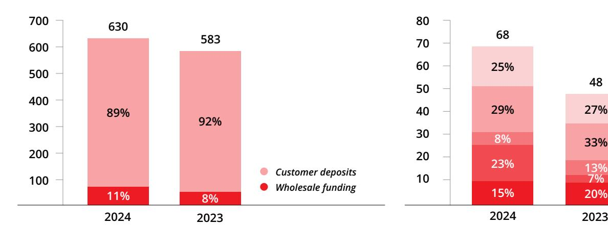

# **Funding sources (SGD billion) Wholesale Funding Breakdown (SGD billion)**

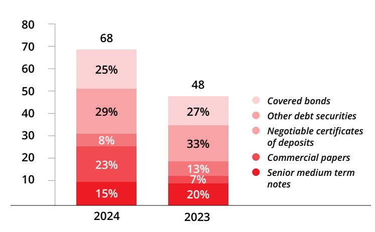

Wholesale funding was largely used to manage currency and tenor mismatches between our assets and liabilities, and to meet local regulatory requirements as needed.

DBS aims to maintain continuous access to the investor base for capital, covered bonds and senior wholesale funding to support our commercial banking activities. The bank proactively seeks to broaden the investor base via regular issuances and engagement. Capital instruments are primarily issued from DBS Group Holdings Ltd (DBSH) while covered bonds are primarily issued from DBS Bank Ltd. Senior notes are issued from both DBSH and the Bank as required.

The diagrams below show our funding structure as at 31 December 2024. Loan-deposit ratio remains healthy at 76.7%.

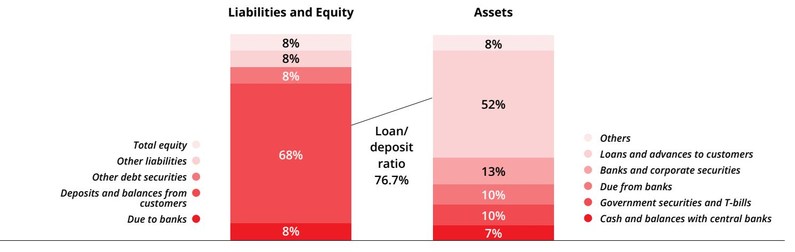

*Refer to Note 30 to the financial statements on page 150 for more details of our wholesale funding sources and Note 42.1 on page 173 for the contractual maturity profile of our assets and liabilities.*

**Risk management**

Growth in the regional franchise generates price, volume, currency and tenor mismatches between our assets and liabilities. To this end, where practicable and transferable without loss in value, we make appropriate use of swap markets for relevant currencies, commensurate with the liquidity of each, in the conversion and deployment of surplus funds across locations.

As these swaps typically mature earlier than loans, we are exposed to potential cash flow mismatches arising from the risk that counterparties may not roll over maturing swaps to support our ongoing funding needs.

This risk is mitigated by triggers set on the amount of swaps transacted with the market and by conservative assumptions on the cash flow behaviour of swaps under our cash flow maturity gap analysis (refer to Section 7.2 on this page).

In general, the term borrowing needs are managed centrally by the head office in consultation with our overseas locations, subject to relevant regulatory restrictions and to an appropriate level of presence and participation required by the respective local funding markets.

The Group Asset and Liability Committee and respective Location Asset and Liability Committees regularly review the composition and growth trajectories of the relevant balance sheets and refine our funding strategy according to business momentum, competitive factors and prevailing market conditions.

DBS also has a comprehensive Liquidity Contingency Plan, detailing the various channels available to the bank to raise funds under various liquidity stress scenarios. This includes monitoring mechanisms to provide early warning of digitally accelerated deposit outflows, as observed during the 2023 US Banking Crisis, and mitigants to stem these outflows. Bank-wide liquidity drills are carried out regularly to ensure the bank's preparedness to deal with any liquidity stress.

# **7.2 Liquidity risk in 2024**

DBS actively monitors and manages our liquidity profile through cash flow maturity mismatch analysis.

In forecasting cash flow under the analysis, behavioural profiling is necessary in cases where a product has indeterminate maturity or the contractual maturity does not realistically reflect the expected cash flow.

Two examples are maturity-indeterminate savings and current account deposits, which are generally viewed as sources of stable funding for commercial banks. A conservative view is adopted in the behavioural profiling of assets, liabilities and off-balance sheet commitments that have exhibited cash flow patterns that differ significantly from the contractual maturity profile shown under Note 42.1 of our financial statements on page 173.

The table below shows our behavioural net and cumulative maturity mismatch between assets and liabilities over a one-year period, in a normal scenario without incorporating growth projections. DBS' liquidity was observed to remain adequate in the maturity mismatch analysis.

| SGD million(a)                                 | Up to 1 week | Over 1 week to 1 month | Over 1 to 3 months | Over 3 to 6 months | Over 6 months to 1 year |
|------------------------------------------------|--------------|---------------------------|-----------------------|-----------------------|----------------------------|
| As at 31 Dec 2024(b) Net liquidity mismatch | 22,578       | 16,211                    | (17,035)              | 18,123                | 6,036                      |
| Cumulative mismatch                            | 22,578       | 38,789                    | 21,754                | 39,877                | 45,913                     |
| As at 31 Dec 2023(b) Net liquidity mismatch | 46,756       | 8,272                     | (11,949)              | 35,124                | 18,122                     |
| Cumulative mismatch                            | 46,756       | 55,028                    | 43,079                | 78,203                | 96,325                     |

*(a) Positive indicates a position of liquidity surplus. Negative indicates a liquidity shortfall that has to be funded.* 

*(b) As the behavioural assumptions used to determine the maturity mismatch between assets and liabilities are updated from time to time, the liquidity mismatches may not be directly comparable across past balance sheet dates.* 

# **7.3 Liquid assets**

Liquid assets are assets that are readily available and can be easily monetised to meet obligations and expenses under times of stress.

Such assets are internally defined under the governance of the relevant oversight committees, taking into account the asset class, issuer type and credit rating, among other criteria, before they are reflected as available funds through cash flow maturity mismatch analysis. DBS' Treasury function expects to be able to operationally monetise our pool of liquid assets to meet liquidity shortfalls when the need arises. These liquid assets must be unencumbered and free of any legal, regulatory, contractual or other restrictions.

In practice, liquid assets are maintained in key locations and currencies to ensure that operating entities in such locations possess a degree of self-sufficiency to support business needs and guard against contingencies. The main portion of our liquid assets is centrally maintained in Singapore to support liquidity needs in smaller overseas subsidiaries and

branches. Internally, DBS sets a requirement to maintain its pool of liquid assets above a minimum level as a source of contingent funds, taking into account regulatory recommended liquid asset levels as well as internally projected stress shortfalls under the cash flow maturity mismatch analysis.

The table below shows DBS' encumbered and unencumbered liquid assets by instrument and counterparty against other assets in the same category under the balance sheet. The figures are based on the carrying amount as at the balance sheet date.

**Risk management 98** DBS Annual Report 2024 **Making Greater Impact 99**

|                                             |            | Liquid assets   |           | Others(c) | Total     |
|---------------------------------------------|------------|-----------------|-----------|-----------|-----------|
| SGD million                                 | Encumbered | Unencumbered(a) | Total [1] | [2]       | [1] + [2] |
| As at 31 Dec 2024                           |            |                 |           |           |           |
| Cash and balances with central banks     | 11,294     | 47,325          | 58,619    | 27        | 58,646    |
| Due from banks(b)                           | 227        | 24,874          | 25,101    | 55,314    | 80,415    |
| Government securities and treasury bills | 9,876      | 67,088          | 76,964    | 4,575     | 81,539    |
| Banks and corporate securities              | 7,328      | 81,577          | 88,905    | 16,148    | 105,053   |
| Total                                       | 28,725     | 220,864         | 249,589   | 76,064    | 325,653   |

- *(a) Unencumbered balances comprise liquid asset holdings that are unrestricted and available. The encumbered portion represents pledged securities and the mandatory balances held with central banks, which includes a minimum cash balance (MCB) amount that may be available for use under a liquidity stress situation.*
- *(b) Liquid assets comprise nostro accounts and eligible certificates of deposits.*
- *(c) "Others" refer to assets that are not recognised as part of the available pool of liquid assets for liquidity management under stress due to (but not limited to) inadequate or non-rated credit quality, operational challenges in monetisation (e.g. holdings in physical scrips), and other considerations.*

## **7.4 Liquidity Coverage Ratio (LCR)**

Under MAS Notice to Banks No. 649 "Minimum Liquid Assets (MLA) and Liquidity Coverage Ratio (LCR)" (MAS Notice 649), DBS, as a Domestic Systemically Important Bank (D-SIB) incorporated and headquartered in Singapore, is required to comply with the LCR standards. Group LCR has been maintained well above the minimum LCR requirements of 100% for both all-currency and SGD.

DBS' LCR is sensitive to balance sheet movements resulting from commercial loan/ deposit activities, wholesale inter-bank lending/ borrowing, and to the maturity tenor changes of these positions as they fall into or out of the LCR 30-day tenor. In order to meet the LCR requirements, DBS holds a pool of unencumbered High Quality Liquid Assets (HQLA) comprising predominantly cash, balances with central banks and highly rated bonds issued by governments or supranational entities.

## **7.5 Net Stable Funding Ratio (NSFR)**

DBS is subject to the Net Stable Funding Ratio (NSFR) under MAS Notice to Banks No. 652 "Net Stable Funding Ratio (NSFR)" (MAS Notice 652). Group NSFR has been maintained consistently above the minimum regulatory requirement of 100%.

NSFR aims to improve the resiliency of banks by promoting long term funding stability. We manage our NSFR by maintaining a stable balance sheet supported by a diversified funding base with access to funding sources across retail and wholesale channels.

# **8 Operational Risk**

Operational risk is inherent in our business activities and may arise from inadequate or failed internal processes, people, systems,

or from external events. DBS' objective is to keep operational risk at appropriate levels, taking into account the markets we operate in, the characteristics of the businesses as well as our economic and regulatory environment.

# **8.1 Operational risk management at DBS**

DBS' approach to operational risk management comprises the following building blocks:

# **Policies**

**Risk methodologies**

**Processes, systems and reports**

### **Policies**

The Group Operational Risk Management (ORM) Policy sets our overall approach for managing operational risk in a structured, systematic and consistent manner.

There are policies, standards, tools and programmes in place to govern ORM practices across DBS. These include corporate operational risk policies and standards that are owned by the respective corporate oversight and control functions. The key policies address risk areas relating to technology, compliance, fraud, money laundering, financing of terrorism and sanctions, new product, and third party arrangements.

### **Risk methodologies**

DBS adopts the standardised approach to compute operational risk regulatory capital.

To manage and control operational risk, we use various tools, including risk and control self-assessment (RCSA), operational risk event management and key risk indicator monitoring.

DBS' Three Lines Model adopts one common risk taxonomy, and a consistent risk assessment approach to managing operational risk. RCSA is conducted by each business or support unit to identify key operational risk and assess the effectiveness of internal controls. When control issues are identified, the units develop action plans and track the resolution of the issues.

Operational risk events are classified in accordance with Basel standards. Such events, including any significant incidents that may impact DBS' reputation, must be reported based on certain established thresholds. Key risk indicators with pre-defined escalation triggers are employed to facilitate risk monitoring in a forward-looking manner.

Additional methodologies are in place to address subject-specific risks, including, but not limited to, the following:

# **Compliance risk**

Compliance risk refers to the risk of DBS not being able to successfully conduct our business because of any failure to comply with laws, regulatory requirements, industry codes or standards of business and professional conduct applicable to the financial sector.

This includes, in particular, laws and regulations applicable to the licensing and conducting of banking or other financial businesses, financial crime such as antimoney laundering and countering the financing of terrorism, fraud (including digital payment scams) and bribery/ corruption. We maintain a compliance programme designed to identify, assess, measure, mitigate and report on such risks through a combination of policy and relevant systems and controls.

To counter financial crime and sanctions risks, DBS established minimum standards for our business and support units to manage our actual and/ or potential risk exposures. In addition, standards aimed to provide the end-to-end management for fraud and related issues at the unit and geographical levels, are implemented through a fraud management programme. Lastly, we had implemented surveillance and compliance testing controls where necessary to obtain assurance that the control framework is operating effectively.

DBS also provides relevant training and implements assurance processes. We strongly believe in the need to promote a strong compliance culture as well, and this is developed through the leadership of our Board and senior management.

### **New product, and third party risks**

Each new product, or third party arrangement is subject to a due diligence review and sign-off process, where relevant risks are identified and assessed. Variations of existing products or services and existing third party arrangements are also subject to a similar process.

### **Other mitigation programmes**

A robust business continuity management programme is in place to ensure that critical business services can continue in the event

of unforeseen events or business disruptions. This includes a crisis management plan to enable quick response to manage incidents. Exercises are conducted annually, simulating different scenarios to test business continuity plans and crisis management protocol. The effectiveness of these exercises as well as DBS' business continuity readiness and our alignment to regulatory guidelines are communicated and attested by senior management to the BRMC annually.

To mitigate losses from specific risk events which are unexpected and significant, DBS effects group-wide insurance coverage under the Group Insurance Programme. These insurance policies relate to crime and professional indemnity, directors and officers liability, cyber security risk, property damage and business interruption, general liability and terrorism.

### **Processes, systems and reports**

Robust internal control processes and systems are integral to identifying, assessing, monitoring, managing and reporting operational risk.

All units are responsible for the day-to-day management of operational risk in their products, processes, systems and activities, in accordance with the various frameworks

and policies. The RMG Operational Risk unit and other corporate oversight and control functions:

- Oversee and monitor the effectiveness of operational risk management
- Assess key operational risk issues with the units
- Report and/ or escalate key operational risks to risk committees with recommendations on appropriate risk mitigation strategies

DBS has in place an integrated governance, risk and compliance system with aligned risk assessment methodology, common taxonomy, and unified processes for the Three Lines Model. We have in place an operational risk landscape profile which provides the Board and senior management with an integrated view of DBS' operational risk profile periodically, across key operational risk areas and business lines.

### **8.2 Operational risk in 2024**

The total operational risk losses in 2024 were SGD 11.6 million (0.05%) of DBS' total operating income), compared with SGD 10.2 million (0.05%) in 2023. The losses may be categorised into the following seven Basel risk event types:

| Basel risk event types                     | 2024        |      | 2023        |      |
|--------------------------------------------|-------------|------|-------------|------|
|                                            | SGD million | %    | SGD million | %    |
| Business disruption and system failures    | 0.54        | 5%   | 2.89        | 28%  |
| Clients, products and business practices   | 2.69        | 23%  | 2.82        | 28%  |
| Damage to physical asset                   | 0           | 0%   | 0           | 0%   |
| Employment practices and workplace safety  | 0           | 0%   | 0           | 0%   |
| Execution, delivery and process management | 3.77        | 32%  | 2.51        | 25%  |
| External fraud                             | 2.96        | 26%  | 1.29        | 13%  |
| Internal fraud                             | 1.64        | 14%  | 0.65        | 6%   |
| Total(a)                                   | 11.60       | 100% | 10.16       | 100% |

### *Notes*

*(a) Reportable operational risk events are those with net loss greater than SGD 10,000 and are reported based on the date of detection.* 

2023-2024 changes in operating losses are not indicative of any systemic concerns, and are either attributable to one-off incidents, or in the case of external fraud, a result of changing typologies by scam syndicates which our fraud programme is able to identify and subsequently interdict.

# **9 Technology Risk**

Technology risk refers to the potential for financial losses, operational disruptions, and reputational damage arising from system failures or security breaches. These include cyber attacks, software or hardware failures and data leakage, which can affect business operations and tarnish DBS brand.

### **9.1 Technology risk management at DBS**

DBS' approach to technology risk management comprises the following building blocks:

### **Policies**

**Risk methodologies**

**Processes, systems and reports**

# **Policies**

The Group Technology Risk Management (TRM) Policy sets out DBS' overall approach for managing risks associated with the use of technology in a structured, and consistent manner.

**Capital management and planning 100** DBS Annual Report 2024 **Making Greater Impact 101**

Technology risk is managed through policies, standards, tools and control processes primarily owned by Group Technology and Risk Management Group. Areas covered by such policies, standards and processes include cybersecurity, technology resiliency, service and change management, incident response and crisis management, as well as third party technology vendor management.

### **Risk Methodologies**

With technology risk being a subset of operational risks, regulatory capital is computed based on the standardised approach for operational risk.

At DBS, we adopt a structured approach to managing technology risks, from risk identification (threats and vulnerabilities of our technology assets), risk assessment (employing qualitative and quantitative methods), risk mitigation strategies and continuous monitoring and review.

Various tools and control processes employed include risk and control selfassessment (RCSA) with an enriched library for technology risks, and technology key risk indicators with various levels of escalation thresholds. We also have in place robust change management controls overseen by an Architecture Review Committee. Incidents are proactively managed via continuous monitoring of early warning customer and system metrics, together with escalation protocols.

Cybersecurity risk remains a top priority for our bank. To ensure we are proactive in addressing cyber threats, DBS allocates significant resources towards enhancing our cyber hygiene and control environment to protect against the ever-evolving cyber threat landscape. We conduct regular assessments to validate the effectiveness of our controls and to obtain assurance that our control framework remains resilient.

Furthermore, at DBS, we are dedicated to promoting a culture of technology and cybersecurity risk awareness. We believe that a strong security and resilience culture starts with our employees. As such, we provide relevant training and educational resources to empower our staff to recognise and respond to technology and cybersecurity risks effectively.

## **Processes, systems and reports**

Robust internal control processes and systems are integral to identifying, assessing, monitoring, managing and reporting technology risk.

In line with DBS' Three Lines Model, risk and control processes are owned and executed by units within Group Technology and other relevant first line business and support

functions, with oversight and effective challenge by the Technology Risk unit within Risk Management Group.

DBS has in place an integrated governance, risk and compliance system with aligned risk assessment methodology, common taxonomy and unified processes for the Three Lines Model. We have in place a technology risk landscape profile which provides the Board and senior management with an integrated view of DBS' technology risk profile periodically. This includes regular reports on adherence to our technology risk appetite as well as key incident highlights and mitigation strategies.

# **9.2 Technology risk in 2024**

Losses related to technology in 2024 are included under operational risk losses in 2024.

*Refer to Section 8.2 on page 99 to read more about Operational Risk Losses in 2024*

# **10 Reputational Risk**

DBS views reputational risk typically as an outcome of any failure to manage risks in our day-to-day activities/ decisions, and from changes in the operating environment. These risks include:

- **•** Financial risk (credit, market and liquidity risks)
- Inherent risk (operational and business/ strategic risks)

# **10.1 Reputational risk management at DBS**

DBS' approach to reputational risk management comprises the following building blocks:

# **Policies**

**Risk methodologies**

**Processes, systems and reports**

### **Policies**

DBS adopts a four-step approach for reputational risk management, which is to prevent, detect, escalate and respond to reputational risk events.

As reputational risk is typically a consequence of the failure to manage other risk types, the definitions and principles for managing such risks are articulated in the respective risk policies. These are reinforced by sound corporate values that reflect ethical behaviours and practices throughout DBS.

At DBS, we have policies in place to protect the consistency of our brand and to safeguard our corporate identity and reputation.

### **Risk methodologies**

Under the various risk policies, we have established a number of mechanisms for ongoing risk monitoring.

These mechanisms take the form of risk limits, key risk indicators, conduct/ culture and other operating metrics, and include the periodic risk and control self-assessment process. Apart from observations from internal sources, alerts from external parties/ stakeholders also serve as an important source to detect potential reputational risk events. In addition, there are policies relating to media communications, social media and corporate social responsibility to protect DBS' reputation. There are also escalation and response mechanisms in place for managing reputational risk.

While the respective risk policies address the individual risk types, the Reputational Risk Policy focuses specifically on our stakeholders' perception of how well DBS manages its reputational risks. Stakeholders include customers, government agencies and regulators, investors, rating agencies, business alliances, vendors, trade unions, the media, the general public, the Board and senior management, and DBS' employees.

We recognise that creating a sense of shared value through engagement with key stakeholder groups is imperative for our brand and reputation.

*Read more about our "Stakeholder engagement" in the Sustainability Report*

### **Processes, systems and reports**

Our units are responsible for the day-to-day management of reputational risk, and ensure that processes and procedures are in place to identify, assess and respond to this risk. This includes social media monitoring to pick up adverse comments on DBS. Events affecting DBS' reputational risk are also included in our reporting of risk profiles to senior management and Board-level committees.

### **10.2 Reputational risk in 2024**

There were no significant reputational risk incidents endangering the DBS franchise in 2024.

# **Capital management and planning**

# **Objective**

The Board of Directors (Board) is responsible for setting our capital management objective, which is to maintain a strong capital position consistent with regulatory requirements under the "Notice on Risk Based Capital Adequacy Requirements for Banks Incorporated in Singapore" (MAS Notice 637) and "Notice to Designated Financial Holding Companies FHC-N637 on Risk Based Capital Adequacy Requirements" (MAS Notice FHC-N637), and the expectations of various stakeholders including customers, investors and rating agencies. The Board articulates this objective in the form of capital targets, which are reviewed annually. This objective is pursued while delivering returns to shareholders and ensuring that adequate capital resources are available for business growth and investment opportunities as well as adverse situations, taking into consideration our strategic plans and risk appetite.

Our dividend policy is to pay sustainable dividends that grow progressively with earnings. In line with this, the Board proposed a final dividend of 60 cents per share, an increase of six cents from the previous payout. This brings the ordinary dividend for the financial year to SGD 2.22 per share or SGD 6.31 billion, an increase of 27% over the previous year. The Scrip Dividend Scheme will not be applied to the final dividend.

In addition, the Board committed to managing down the stock of excess capital over the coming three years. To begin with, it plans to introduce a Capital Return dividend of 15 cents per share per quarter to be paid out over financial year 2025. In the subsequent two years, it expects to pay out a similar amount of capital either through this or other mechanisms, barring unforeseen circumstances.

The Board also established a new share buyback programme of SGD 3 billion, announced on 7 November 2024. Under the programme, shares will be purchased in the open market and cancelled. The buybacks will be carried out at management's discretion and subject to market conditions. The programme is in addition to periodic buybacks carried out for the purposes of vesting employee share plans.

# **Process**

Our capital management objective is implemented via a capital management and planning process that is overseen by the Capital Committee. The Chief Financial Officer chairs the Capital Committee. The Capital Committee receives regular updates on our current and projected capital position. A key tool for capital planning is the annual Internal Capital Adequacy Assessment Process (ICAAP) through which we assess our projected capital supply and demand relative to regulatory requirements and capital targets. The ICAAP generally has a threeyear horizon and covers various scenarios, including stress scenarios of differing scope and severity.

Capital capacity is allocated on two dimensions: by business line and by entity. Capital allocations by business line are set as part of the budget process and monitored during the year. Return on regulatory capital is one of several metrics used to measure business performance. Capital allocations by entity seek to optimise the distribution of capital resources across entities, taking into account the capital adequacy requirements imposed on each subsidiary in its respective jurisdiction. Capital is allocated to ensure that each subsidiary is able to comply with regulatory requirements as it executes its business strategy in line with our strategy.

During the course of the year, these subsidiaries did not experience any impediments to the distribution of dividends.

# **Capital structure**

We manage our capital structure in line with our capital management objective and seek to optimise the cost and flexibility offered by various capital resources. In order to achieve this, we assess the need and the opportunity to raise or retire capital. The following capital transactions were undertaken during the year.

### **Common Equity Tier 1 capital**

**•** On 26 April 2024, the Group issued 258 million bonus shares on the basis of one bonus share for every existing 10 ordinary shares held, at nil consideration and without capitalisation of reserves. The bonus shares qualify for dividend payments from the first interim dividend of the financial year ended 31 December 2024.

There were no Additional Tier 1 nor Tier 2 transactions during the year.

*Refer to Note 32 to the financial statements for details on the movement of share capital during the year.*

*Refer to Notes 31 and 33 to the financial statements as well as the Main Features of Capital Instruments document (https://www.dbs.com/investors/fixedincome/capital-instruments) for the terms of the capital instruments that are included in Eligible Total Capital.*

**Capital management and planning 102** DBS Annual Report 2024 **Making Greater Impact 103**

**The table below analyses the movement in Common Equity Tier 1 (CET1), Additional Tier 1 (AT1) and Tier 2 capital during the year.** 

# **Statement of changes in regulatory capital for the year ended 31 December 2024**

|                                                            | SGD million |
|------------------------------------------------------------|-------------|
| CET1 capital                                               |             |
| Opening amount                                             | 53,789      |
| Profit for the year (attributable to shareholders)         | 11,289      |
| Dividends paid to shareholders(1)                          | (6,083)     |
| Cost of share-based payments                               | 177         |
| Purchase of treasury shares                                | (213)       |
| Other CET1 movements, including other comprehensive income | 1,034       |
| Closing amount                                             | 59,993      |
| CET1 capital                                               | 59,993      |
| AT1 capital(2)                                             | 2,393       |
| Tier 1 capital                                             | 62,386      |
| Tier 2 capital                                             |             |
| Opening amount                                             | 3,124       |
| Movements in Tier 2 capital instruments                    | (16)        |
| Movement in allowances eligible as Tier 2 capital          | 107         |
| Closing amount                                             | 3,215       |
| Total capital                                              | 65,601      |

## *Note:*

# **Capital adequacy ratios**

The revised MAS Notice 637 which implements the final Basel III reforms in Singapore came into effect from 1 July 2024. As at 31 December 2024, our reported CET1 capital adequacy ratio (CAR) was 17.0% based on transitional arrangements, while the pro-forma CET1 CAR on a fully phased-in basis was 15.1%, which were above our target ratio of around 13.0% ± 0.5%. Our CET1 CAR, as well as Tier 1 and Total CARs, comfortably exceeded the minimum CAR requirements under MAS Notice 637 and MAS Notice FHC-N637 of 9.0%, 10.5% and 12.5% respectively (this includes the capital conservation buffer but excludes the countercyclical capital buffer).

As at 31 December 2024, our consolidated leverage ratio stood at 6.7%, well above the 3.0% minimum ratio set by the MAS.

Refer to "Five-Year Summary" on page 183 for the historical trend of CET1, Tier 1 and Total CARs. Refer to DBS Group's Pillar 3 disclosures published on DBS website (https://www.dbs.com/investors/default.page) for details on our risk-weighted assets (RWA).

| SGD million                                      | 2024    | 2023    |
|--------------------------------------------------|---------|---------|
| CET1 capital                                     | 59,993  | 53,789  |
| Tier 1 capital                                   | 62,386  | 56,182  |
| Total capital                                    | 65,601  | 59,306  |
| RWA                                              |         |         |
| Credit RWA                                       | 274,670 | 293,747 |
| Market RWA                                       | 39,512  | 26,144  |
| Operational RWA(1)                               | 37,820  | 48,472  |
| Total RWA                                        | 352,002 | 368,363 |
| CAR (%)                                          |         |         |
| CET1                                             | 17.0    | 14.6    |
| Tier 1                                           | 17.7    | 15.3    |
| Total                                            | 18.6    | 16.1    |
| Fully phased-in CET1(2)                          | 15.1    | n.a.    |
| Minimum CAR including Buffer Requirements (%)(3) |         |         |
| CET1                                             | 9.2     | 9.2     |
| Tier 1                                           | 10.7    | 10.7    |
| Total                                            | 12.7    | 12.7    |
| Of which: Buffer Requirements (%)                |         |         |
| Capital Conservation Buffer                      | 2.5     | 2.5     |
| Countercyclical Buffer                           | 0.2     | 0.2     |

### *Notes:*

- *(1) Includes the Operational Risk charges imposed by the MAS on DBS Bank for the digital disruptions in 2023.*
- *(2) Calculated based on the Basel III reforms output floor at 72.5% when fully phased-in on 1 January 2029.*
- *(3) Includes minimum CET1, Tier 1 and Total CAR of 6.5%, 8.0% and 10.0% respectively.*

*(1) Includes distributions paid on capital securities classified as equity.*

*(2) There were no movements in AT1 capital during the year.*

**Capital management and planning 104** DBS Annual Report 2024 **Making Greater Impact 105**

**The chart below analyses the drivers of the movement in the Group's CET1 CAR during the year.**

# **Group CET1 CAR**

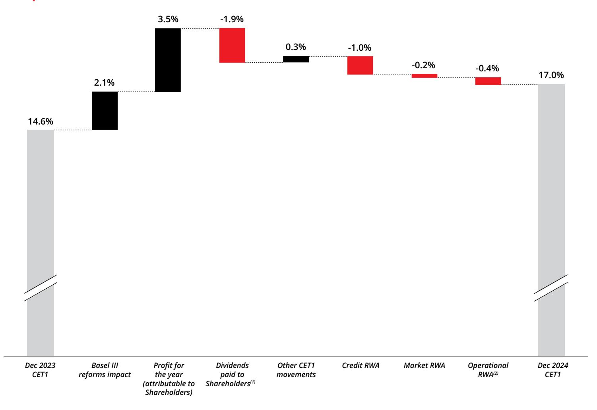

### *Notes:*

*(1) Includes distributions paid on capital securities classified as equity.*

# **Regulatory change**

The minimum CAR requirements based on MAS Notice 637 and MAS Notice FHC-N637 have been fully phased in from 1 January 2019 and are summarised in the table below.

|                                       | 2019 and beyond |
|---------------------------------------|--------------------|
| Minimum CAR %                         |                    |
| CET1 (a)                              | 6.5                |
| Capital Conservation Buffer (CCB) (b) | 2.5                |
| CET1 including CCB (a) + (b)          | 9.0                |
| Tier 1 including CCB                  | 10.5               |
| Total including CCB                   | 12.5               |
| Maximum Countercyclical Buffer(1)     | 2.5                |

### *Note:*

*(1) The countercyclical buffer is not an ongoing requirement and is only applied as and when specified by the relevant banking supervisors. The applicable magnitude is a weighted average of the jurisdiction-specific countercyclical buffer requirements that are required by national authorities in jurisdictions to which a bank has private sector credit exposures. The Basel Committee on Banking Supervision ("Basel Committee") expects jurisdictions to implement the countercyclical buffer during periods of excessive credit growth. Of the jurisdictions where we have material private sector credit exposures, Hong Kong has reduced its countercyclical buffer from 1.0% to 0.5% from 18 October 2024.*

The MAS has designated DBS Bank as a domestic systemically important bank ("D-SIB"). Under the MAS' framework for identifying and supervising D-SIBs, the higher loss absorbency requirement for locally incorporated D-SIBs is met by the foregoing minimum ratios being two percentage points higher than those established by the Basel Committee. The Basel Committee has developed an indicator-based methodology for identifying global systemically important banks ("G-SIBs") on which higher loss absorbency requirements will be imposed. While we are not a G-SIB, we are required to disclose the 12 indicators which are included in the DBS Group's Pillar 3 disclosures published on DBS website (https://www.dbs.com/investors/default.page).

With effect from 1 July 2024, MAS Notice 637 was revised to implement the final Basel III reforms in Singapore. The revised MAS Notice 637 sets out revised standards on (a) operational risk capital and leverage ratio requirements; (b) credit risk capital and output floor requirements; (c) market risk capital and capital reporting requirements; and (d) public disclosure requirements. Under the revised MAS Notice 637, all standards other than the revised market risk and credit valuation adjustment ("CVA") standards took effect from 1 July 2024. The revised market risk and CVA standards (a) for compliance with supervisory reporting requirements took effect from 1 July 2024, and (b) for compliance with capital adequacy and disclosure requirements took effect from 1 January 2025. The output floor transitional arrangement has commenced at 50% from 1 July 2024 and will reach full phase-in at 72.5% from 1 January 2029.

*(2) Includes the Operational Risk charges imposed by the MAS on DBS Bank for the digital disruptions in 2023.*

# **Summary of disclosures - Corporate governance**

**This summary of disclosures describes our corporate governance practices with specific reference to the express disclosure requirements in the principles and provisions of the 2018 Code\* pursuant to Rule 710 of the SGX Listing Manual and the Additional Guidelines\*.** 

## **Express disclosure requirements in the 2018 Code and the Additional Guidelines**

| Principles and provisions of the 2018 Code - Express disclosure requirements                                                                                                                                                                                                                                                | Page reference in DBS Annual Report 2024 |
|-----------------------------------------------------------------------------------------------------------------------------------------------------------------------------------------------------------------------------------------------------------------------------------------------------------------------------|---------------------------------------------|
| Provision 1.2 The induction, training and development provided to new and existing Directors.                                                                                                                                                                                                                            | Pages 56 and 58                             |
| Provision 1.3 Matters that require Board approval.                                                                                                                                                                                                                                                                       | Pages 63 to 64                              |
| Provision 1.4 Names of the members of the Board committees, the terms of reference of the Board committees, any delegation of the Board's authority to make decisions, and a summary of each Board committee's activities.                                                                                         | Pages 50 to 63                              |
| Provision 1.5 The number of meetings of the Board and Board committees held in the year, as well as the attendance of every Board member at these meetings.                                                                                                                                                           | Pages 47 to 48                              |
| Provision 2.4 The board diversity policy and progress made towards implementing the board diversity policy, including objectives.                                                                                                                                                                                     | Page 58                                     |
| Provision 4.3 Process for the selection, appointment and re-appointment of Directors to the Board, including the criteria used to identify and evaluate potential new directors and channels used in searching for appropriate candidates.                                                                         | Page 56                                     |
| Provision 4.4 Where the Board considers a Director to be independent in spite of the existence of a relationship which may affect his or her independence, the nature of the Director's relationship and the reasons for considering him or her as independent should be disclosed.                                | Pages 56 to 57                              |
| Provision 4.5 The listed company directorships and principal commitments of each Director, and where a Director holds a significant number of such directorships and commitments, the NC's and Board's reasoned assessment of the ability of the director to diligently discharge his or her duties are disclosed. | Pages 57, 184 to 188                        |

| 106 | DBS Annual Report 2024 Making Greater Impact | Summary of disclosures - Corporate governance | 107 |  |
|-----|----------------------------------------------|-----------------------------------------------|-----|--|
|-----|----------------------------------------------|-----------------------------------------------|-----|--|

| Principles and provisions of the 2018 Code - Express disclosure requirements                                                                                                                                                                                                                                                                                                                                                                      | Page reference in DBS Annual Report 2024                                                                                                                      |
|---------------------------------------------------------------------------------------------------------------------------------------------------------------------------------------------------------------------------------------------------------------------------------------------------------------------------------------------------------------------------------------------------------------------------------------------------|------------------------------------------------------------------------------------------------------------------------------------------------------------------|
| Provision 5.2 How the assessments of the Board, its Board committees and each Director have been conducted, including the identity of any external facilitator and its connection, if any, with the Company or any of its Directors.                                                                                                                                                                                                     | Page 57                                                                                                                                                          |
| Provision 6.4 The engagement of any remuneration consultants and their independence.                                                                                                                                                                                                                                                                                                                                                           | Page 62                                                                                                                                                          |
| Principle 8 Clear disclosure of remuneration policies, level and mix of remuneration, and procedure for setting remuneration, and the relationship between remuneration, performance and value creation.                                                                                                                                                                                                                                    | Pages 69 to 73                                                                                                                                                   |
| Provision 8.1 The policy and criteria for setting remuneration, as well as names, amounts and breakdown of remuneration of (a) each individual Director and the CEO; and (b) at least the top five key management personnel (who are not Directors or the CEO) in bands no wider than SGD 250,000 and in aggregate the total remuneration paid to these key management personnel.                                                     | For the CEO and management: pages 71 to 73 For non-executive Directors: pages 47 to 48                                                                  |
| Provision 8.2 Names and remuneration of employees who are substantial shareholders of the Company, or are immediate family members of a Director, the CEO or a substantial shareholder of the Company, and whose remuneration exceeds SGD 100,000 during the year, in bands no wider than SGD 100,000. The disclosure states clearly the employee's relationship with the relevant Director or the CEO or substantial shareholder. | Page 63                                                                                                                                                          |
| Provision 8.3 All forms of remuneration and other payments and benefits, paid by the Company and its subsidiaries to Directors and key management personnel of the Company, and also details of employee share schemes.                                                                                                                                                                                                                     | For non-executive Directors: pages 47, 48, 62 to 63 For key management personnel: pages 71 to 73 For employee share schemes: pages 71, 111 to 112 |
| Provision 9.2 Whether the Board has received assurance from (a) the CEO and the CFO that the financial records have been properly maintained and the financial statements give a true and fair view of the Company's operations and finances; and (b) the CEO and the other key management personnel who are responsible, regarding the adequacy and effectiveness of the Company's risk management and internal control systems.  | Page 66                                                                                                                                                          |
| Provision 11.3 Directors' attendance at general meetings of shareholders held during the financial year.                                                                                                                                                                                                                                                                                                                                       | Pages 47 to 48                                                                                                                                                   |
| Provision 12.1 The steps taken to solicit and understand the views of shareholders.                                                                                                                                                                                                                                                                                                                                                            | Page 68                                                                                                                                                          |
| Provision 13.2 The strategy and key areas of focus in relation to the management of stakeholder relationships during the reporting period.                                                                                                                                                                                                                                                                                                  | Page 68, and section entitled "Stakeholder engagement" in the DBS Sustainability Report 2024                                                               |

*\* defined on page 46*

**108** DBS Annual Report 2024 **Making Greater Impact Financial statements 109**

| Additional Guidelines – Express disclosure requirements                                                                                                                                                                                                                                                                                                                                                                                                                                                                                                                                                                                                                                                                                                | Page reference in DBS Annual Report 2024                        |
|--------------------------------------------------------------------------------------------------------------------------------------------------------------------------------------------------------------------------------------------------------------------------------------------------------------------------------------------------------------------------------------------------------------------------------------------------------------------------------------------------------------------------------------------------------------------------------------------------------------------------------------------------------------------------------------------------------------------------------------------------------|--------------------------------------------------------------------|
| Guideline 1.17 An assessment of how the induction, orientation and training provided to new and existing Directors meet the requirements set out by the NC to equip the Board and the respective Board committees with relevant knowledge and skills in order to perform their roles effectively.                                                                                                                                                                                                                                                                                                                                                                                                                                             | Pages 56 and 58                                                    |
| Guideline 4.7 The names of the Directors submitted for appointment or re-appointment are accompanied by details and information to enable shareholders and the Board to make informed decisions. Such information, which accompanies the relevant resolution, includes: (a) date of last re-appointment; (b) professional qualifications; (c) any relationships including immediate family relationships between the candidate and the Directors, the Company or its substantial shareholders; (d) a separate list of all current directorships in other listed companies; (e) details of other principal commitments; and (f) any prior experience as a director of a listed issuer or as a director of a financial institution. | Pages 208 to 213                                                   |
| Guideline 4.11 The resignation or dismissal of the key appointment holders.                                                                                                                                                                                                                                                                                                                                                                                                                                                                                                                                                                                                                                                                         | Not applicable                                                     |
| Guideline 4.12 The identification of all Directors, including their designations (i.e. independent, non-executive, executive, etc.) and roles (as members or chairmen of the Board or Board committees).                                                                                                                                                                                                                                                                                                                                                                                                                                                                                                                                         | Pages 49 to 54, 184 to 188                                         |
| Guideline 9.9 The remuneration of any non-director with relevant expertise who has been appointed to the board risk committee.                                                                                                                                                                                                                                                                                                                                                                                                                                                                                                                                                                                                                   | Page 63 (in relation to appointees on the BSC, BTRC and BTC) |
| Guideline 9.11 The Board's comments on the adequacy and effectiveness of the internal controls (including financial, operational, compliance and information technology controls, and risk management systems) are disclosed. A statement on whether the AC concurs with the Board's comment is disclosed. Where material weaknesses are identified by the Board or AC, the disclosure of the steps taken to address them.                                                                                                                                                                                                                                                                                                                 | Page 66                                                            |
| Guideline 10.19 The AC comments on whether the internal audit function is independent, effective and adequately resourced.                                                                                                                                                                                                                                                                                                                                                                                                                                                                                                                                                                                                                       | Page 60                                                            |
| Guideline 14.5 Material related party transactions.                                                                                                                                                                                                                                                                                                                                                                                                                                                                                                                                                                                                                                                                                                 | Pages 65 and 66                                                    |

# **Financial statements**

 Deferred Tax Assets/ Liabilities 145 Subsidiaries and Consolidated Structured Entities 146 Associates and Joint Ventures 147 Unconsolidated Structured Entities 148 Acquisitions 148 Properties and Other Fixed Assets 149 Goodwill and Intangible Assets 149

| DBS Group Holdings Ltd and its Subsidiaries |                                                |     |                                           | Balance sheet: liabilities                                      |            |  |
|---------------------------------------------|------------------------------------------------|-----|-------------------------------------------|-----------------------------------------------------------------|------------|--|
|                                             | Directors' statement                           | 110 | 28                                        | Deposits and Balances from Customers                            | 150        |  |
|                                             |                                                |     | 29                                        | Other Liabilities                                               | 150        |  |
|                                             | Independent auditor's report                   | 114 | 30                                        | Other Debt Securities                                           | 150        |  |
|                                             | Financial statements                           |     | 31                                        | Subordinated Term Debts                                         | 152        |  |
|                                             | Consolidated income statement                  | 120 | Balance sheet: share capital and reserves |                                                                 |            |  |
|                                             | Consolidated statement of comprehensive income | 121 | 32                                        | Share Capital                                                   | 153        |  |
|                                             | Balance sheets                                 | 122 | 33 34                                  | Other Equity Instruments Other Reserves and Revenue Reserves | 153 154 |  |
|                                             | Consolidated statement of changes in equity    | 123 |                                           |                                                                 |            |  |
|                                             |                                                |     | Off-balance sheet information             |                                                                 |            |  |
| Consolidated cash flow statement            |                                                | 124 | 35                                        | Contingent Liabilities and Commitments                          | 156        |  |
|                                             |                                                |     | 36                                        | Financial Derivatives                                           | 156        |  |
|                                             | Notes to the financial statements              |     |                                           |                                                                 |            |  |
| 1                                           | Domicile and Activities                        | 126 |                                           | Additional information                                          |            |  |
| 2                                           | Summary of Material Accounting Policies        | 126 | 37                                        | Hedge Accounting                                                | 158        |  |
| 3                                           | Critical Accounting Estimates                  | 134 | 38                                        | Share-based Compensation Plans                                  | 162        |  |
|                                             |                                                |     | 39                                        | Related Party Transactions                                      | 163        |  |
|                                             | Income statement                               |     | 40                                        | Fair Value of Financial Instruments                             | 164        |  |
| 4                                           | Net Interest Income                            | 135 | 41                                        | Credit Risk                                                     | 167        |  |
| 5                                           | Net Fee and Commission Income                  | 135 | 42                                        | Liquidity Risk                                                  | 173        |  |
| 6                                           | Net Trading Income                             | 135 | 43                                        | Capital Management                                              | 174        |  |
| 7                                           | Net Income from Investment Securities          | 135 | 44                                        | Segment Reporting                                               | 175        |  |
| 8                                           | Other Income                                   | 135 |                                           |                                                                 |            |  |
| 9                                           | Employee Benefits                              | 135 |                                           |                                                                 |            |  |
| 10                                          | Other Expenses                                 | 136 |                                           |                                                                 |            |  |
| 11                                          | Allowances for Credit and Other Losses         | 136 |                                           | DBS Bank Ltd                                                    |            |  |
| 12                                          | Income Tax Expense                             | 140 |                                           | Income statement                                                | 178        |  |
| 13                                          | Earnings Per Ordinary Share                    | 140 | Statement of comprehensive income         |                                                                 | 179        |  |
|                                             | Balance sheet: assets                          |     |                                           | Balance sheet                                                   | 180        |  |
| 14                                          | Classification of Financial Instruments        | 141 |                                           |                                                                 |            |  |
| 15                                          | Cash and Balances with Central Banks           | 143 |                                           | Notes to the supplementary financial statements                 | 181        |  |
| 16                                          | Government Securities and Treasury Bills       | 143 |                                           |                                                                 |            |  |
| 17                                          | Bank and Corporate Securities                  | 143 |                                           |                                                                 |            |  |
| 18                                          | Loans and Advances to Customers                | 143 |                                           |                                                                 |            |  |
| 19                                          | Financial Assets Pledged or Transferred        | 144 |                                           |                                                                 |            |  |
| 20                                          | Other Assets                                   | 145 |                                           |                                                                 |            |  |

**DBS Group Holdings Ltd and its Subsidiaries** 

# **Directors' statement**

**for the financial year ended 31 December 2024**

The Directors are pleased to present their statement to the Members, together with the audited consolidated financial statements of DBS Group Holdings Ltd (the Company or DBSH) and its subsidiaries (the Group) for the financial year ended 31 December 2024 and the balance sheet of the Company as at 31 December 2024. These have been prepared in accordance with the provisions of the Companies Act 1967 (the Companies Act) and the Singapore Financial Reporting Standards (International).

In the opinion of the Directors:

- (a) the consolidated financial statements of the Group and the balance sheet of the Company, together with the notes thereon, as set out on pages 120 to 177, are drawn up so as to give a true and fair view of the financial position of the Group and the Company as at 31 December 2024, and of the consolidated financial performance, changes in equity and cash flows of the Group for the financial year ended on that date; and
- (b) as at the date of this statement, there are reasonable grounds to believe that the Company and the Group will be able to pay their debts as and when they fall due.

# **Board of Directors**

The Directors in office at the date of this statement are:

Mr Peter Seah *(Chairman)* Mr Olivier Lim *(Lead Independent Director)* Mr Piyush Gupta *(Chief Executive Officer)* Dr Bonghan Cho Mr Chng Kai Fong

Mr David Ho Hing-Yuen

Ms Punita Lal

Ms Judy Lee

Mr Anthony Lim

Mr Tham Sai Choy

Mr Piyush Gupta will retire at the forthcoming annual general meeting (AGM).

Mr Olivier Lim, Dr Bonghan Cho and Mr Tham Sai Choy will retire by rotation in accordance with Article 99 of the Company's Constitution at the forthcoming AGM and, being eligible, will offer themselves for re-election at the AGM.

**110** DBS Annual Report 2024 **Making Greater Impact Directors' statement 111**

# **Directors' interests in shares or debentures**

Each of the following Directors who held office at the end of the financial year had, according to the register of directors' shareholdings required to be kept under Section 164 of the Companies Act, an interest in shares of the Company and related corporations as stated below:

| Number of shares                                          |                      | Holdings in which Directors have a direct interest | Holdings in which Directors are deemed to have an interest |                     |
|-----------------------------------------------------------|----------------------|-------------------------------------------------------|---------------------------------------------------------------|---------------------|
|                                                           | As at 31 Dec 2024 | As at 1 Jan 2024                                   | As at 31 Dec 2024                                          | As at 1 Jan 2024 |
| DBSH ordinary shares                                      |                      |                                                       |                                                               |                     |
| Mr Peter Seah                                             | 379,894              | 329,218                                               | –                                                             | –                   |
| Mr Olivier Lim                                            | 169,812              | 150,554                                               | –                                                             | –                   |
| Mr Piyush Gupta                                           | –                    | 43,864                                                | 1,990,053                                                     | 2,185,721           |
| Dr Bonghan Cho                                            | 17,541               | 13,389                                                | –                                                             | –                   |
| Mr David Ho Hing-Yuen                                     | 2,058                | –                                                     | –                                                             | –                   |
| Ms Punita Lal                                             | 9,863                | 6,485                                                 | –                                                             | –                   |
| Ms Judy Lee                                               | 8,814                | 4,453                                                 | –                                                             | –                   |
| Mr Anthony Lim                                            | 12,505               | 8,215                                                 | –                                                             | –                   |
| Mr Tham Sai Choy                                          | 120,631              | 106,168                                               | –                                                             | –                   |
| Share awards (unvested) granted under the DBSH Share Plan |                      |                                                       |                                                               |                     |
| Mr Piyush Gupta(1)                                        | 664,480              | 748,864                                               | –                                                             | –                   |
|                                                           |                      |                                                       |                                                               |                     |

*(1)  Mr Piyush Gupta's share awards form part of his remuneration. Details of the DBSH Share Plan are set out in Note 38 of the Notes to the Company's 2024 financial statements*

There was no change in any of the above-mentioned interests between the end of the financial year and 21 January 2025.

# **DBSH Share Plan**

At the Annual General Meeting held on 25 April 2019, the DBSH Share Plan (which was first adopted on 18 September 1999) was extended for another ten years, from 18 September 2019 to 17 September 2029 (both dates inclusive). The DBSH Share Plan is administered by the Compensation and Management Development Committee (CMDC). As at the date of this statement, the members of the CMDC are Mr Anthony Lim (Chairman), Mr Peter Seah, Dr Bonghan Cho, Mr David Ho Hing-Yuen, Ms Punita Lal and Ms Judy Lee.

Under the terms of the DBSH Share Plan:

- (a) Awards over DBSH's ordinary shares may be granted to Group employees who hold such rank as may be determined by the CMDC from time to time. Awards may also be granted to (amongst others) employees of associated companies of DBSH who hold such rank as may be determined by the CMDC from time to time, and non-executive Directors of DBSH;
- (b) Where time-based awards are granted, participants are awarded ordinary shares of DBSH or, at the CMDC's discretion, their equivalent cash value or a combination of both as part of their deferred bonus, at the end of the prescribed vesting periods. Awards are granted under the DBSH Share Plan at the absolute discretion of the CMDC. Dividends on unvested shares do not accrue to employees;
- (c) Awards under the DBSH Share Plan may be granted at any time in the course of a financial year, and may lapse by reason of cessation of employment or misconduct of the participant, except in cases such as retirement, redundancy, ill health, injury, disability, death, bankruptcy of the participant, or by reason of the participant, being a non-executive Director, ceasing to be a Director, or in the event of a take-over, winding up or reconstruction of DBSH;

- (d) Subject to the prevailing legislation and the rules of the Singapore Exchange, DBSH will have the flexibility to deliver ordinary shares of DBSH to participants upon vesting of their awards by way of an issue of new ordinary shares and/ or the transfer of existing ordinary shares (which may include ordinary shares held by the Company in treasury); and
- (e) The class and/ or number of ordinary shares of DBSH comprised in an award to the extent not yet vested, and/ or which may be granted to participants, are subject to adjustment by reason of any variation in the ordinary share capital of DBSH (whether by way of a capitalisation of profits or reserves or rights issue, reduction, subdivision, consolidation, or distribution) or if DBSH makes a capital distribution or a declaration of a special dividend (whether in cash or *in specie*), upon the written confirmation of the auditor of DBSH that such adjustment (other than in the case of a capitalisation issue) is fair and reasonable.

During the financial year, time-based awards in respect of an aggregate of 7,335,6121 ordinary shares were granted pursuant to the DBSH Share Plan to selected employees of the Group2 . In addition, during the financial year, certain non-executive Directors received an aggregate of 37,085 share awards which vested immediately upon grant. These share awards formed part of their directors' fees for 2023, which had been approved by the shareholders at DBSH's annual general meeting held on 28 March 2024.

Details of the share awards granted under the DBSH Share Plan to Directors of DBSH(1) are as follows:

| Directors of the Company | Share awards granted during the financial year under review | Share awards vested during the financial year under review(2) |  |  |
|--------------------------|----------------------------------------------------------------|------------------------------------------------------------------|--|--|
| Mr Peter Seah            | 16,141                                                         | 16,141                                                           |  |  |
| Mr Olivier Lim           | 3,822                                                          | 3,822                                                            |  |  |
| Mr Piyush Gupta          | 222,443(3)                                                     | 306,827                                                          |  |  |
| Dr Bonghan Cho           | 2,558                                                          | 2,558                                                            |  |  |
| Mr David Ho Hing-Yuen    | 1,871                                                          | 1,871                                                            |  |  |
| Ms Punita Lal            | 2,482                                                          | 2,482                                                            |  |  |
| Ms Judy Lee              | 3,560                                                          | 3,560                                                            |  |  |
| Mr Anthony Lim           | 3,154                                                          | 3,154                                                            |  |  |
| Mr Tham Sai Choy         | 3,497                                                          | 3,497                                                            |  |  |

- *(1) The directors' fees for Mr Chng Kai Fong were paid in cash to a government agency, the Directorship & Consultancy Appointments Council. Accordingly, he had not been granted share awards*
- *(2) Treasury shares were transferred to Directors pursuant to the vesting of such share awards*
- *(3) The share awards granted to Mr Piyush Gupta are time-based awards which will vest over a 4-year period. This represents the aggregate of (a) 162,038 share awards which were granted in February 2024 and formed part of his remuneration for 2023; and (b) 60,405 shares arising from adjustments made to all unvested share awards granted under the DBSH Share Plan as of 26 April 2024 for the bonus issue on the basis of one bonus share for every existing 10 ordinary shares grant held*

# **Arrangements to enable Directors to acquire shares or debentures**

Neither at the end of, nor at any time during the financial year, was the Company a party to any arrangement, the object of which is to enable the Directors to acquire benefits through the acquisition of shares in, or debentures of, the Company or any other body corporate, save as disclosed in this statement.

# **Audit Committee**

The Audit Committee at the end of the financial year comprises non-executive Directors Mr Tham Sai Choy (Chairman), Mr Peter Seah, Mr David Ho Hing-Yuen, Ms Punita Lal, Mr Chng Kai Fong and Ms Judy Lee.

The Audit Committee performed its functions in accordance with the Companies Act, the SGX-ST Listing Manual, the Financial Holding Companies (Corporate Governance of Designated Financial Holding Companies with Bank Subsidiary) Regulations 2022, the Banking (Corporate Governance) Regulations 2005, the MAS Guidelines on Corporate Governance issued on 9 November 2021 and the Code of Corporate Governance 2018, which include, *inter alia*, the following:

- (i) Review, with the external auditor, its audit plan, audit report, evaluation of the internal accounting controls of the Group and assistance given by the management to the external auditor;
- (ii) Review the internal auditor's plans and the scope and results of audits;
- (iii) Review the Group's consolidated financial statements and financial announcements prior to submission to the Board;
- (iv) Review the adequacy, independence and effectiveness of the internal audit function;
- (v) Review the adequacy, effectiveness, independence and objectivity of the external auditor; and
- (vi) Review the assurance given by CEO and other key management personnel regarding the adequacy and effectiveness of the Group's internal controls.

Please refer to the Corporate Governance Report for further details on the activities of the Audit Committee during the financial year ended 31 December 2024.

The Audit Committee has considered the financial, business and professional relationships between PricewaterhouseCoopers (PwC) and the Group. It is of the view that these relationships would not affect the independence of PwC.

The Audit Committee has recommended, to the Board of Directors, the re-appointment of PwC as independent external auditor at the forthcoming AGM of the Company on 28 March 2025.

# **Independent Auditor**

PricewaterhouseCoopers LLP has expressed its willingness to accept re-appointment as independent external auditor.

On behalf of the Directors

**Mr Peter Seah** 

**Mr Piyush Gupta**

7 February 2025 Singapore

*1  These include adjustments made to all unvested share awards granted under the DBSH Share Plan as of 26 April 2024 for the bonus issue on the basis of one bonus share for every existing 10 ordinary shares grant held.*

*2  With reference to Rule 852(2) of the SGX-ST Listing Manual, none of the participants had received shares, pursuant to the release of awards granted, which in aggregate represent 5% or more of the total number of new shares available under the DBSH Share Plan.*

**114** DBS Annual Report 2024 **Making Greater Impact Independent auditor's report 115**

**DBS Group Holdings Ltd and its Subsidiaries** 

# **Independent auditor's report**

# **To the members of DBS Group Holdings Ltd**

# **Report on the Audit of the Financial Statements**

# **Our Opinion**

In our opinion, the accompanying consolidated financial statements of DBS Group Holdings Ltd (the "Company") and its subsidiaries (the "Group") and the balance sheet of the Company are properly drawn up in accordance with the provisions of the Companies Act 1967 (the "Act") and Singapore Financial Reporting Standards (International) ("SFRS(I)s") so as to give a true and fair view of the financial position of the Company and the consolidated financial position of the Group as at 31 December 2024 and of the consolidated financial performance, the consolidated changes in equity and the consolidated cash flows of the Group for the financial year ended on that date.

### **What we have audited**

The financial statements of the Company and the Group comprise:

- **•** the consolidated income statement of the Group for the year ended 31 December 2024;
- **•** the consolidated statement of comprehensive income of the Group for the year ended 31 December 2024;
- **•** the balance sheets of the Group and of the Company as at 31 December 2024;
- **•** the consolidated statement of changes in equity of the Group for the year then ended;
- **•** the consolidated cash flow statement of the Group for the year then ended; and
- **•** the notes to the financial statements, including material accounting policy information.

# **Basis for Opinion**

We conducted our audit in accordance with Singapore Standards on Auditing ("SSAs"). Our responsibilities under those standards are further described in the *Auditor's Responsibilities for the Audit of the Financial Statements* section of our report.

We believe that the audit evidence we have obtained is sufficient and appropriate to provide a basis for our opinion.

### **Independence**

We are independent of the Group in accordance with the Accounting and Corporate Regulatory Authority Code of Professional Conduct and Ethics for Public Accountants and Accounting Entities ("ACRA Code") together with the ethical requirements that are relevant to our audit of the financial statements in Singapore, and we have fulfilled our other ethical responsibilities in accordance with these requirements and the ACRA Code.

# **Our audit approach**

# **Overview**

# **Materiality**

**•** We determined the overall Group materiality based on 5% of the Group's profit before tax.

## **Group scoping**

- **•** Full scope audit procedures were performed over the Singapore Operations of DBS Bank Ltd. and DBS Bank (Hong Kong) Limited ("significant
- ("other components") the branches of DBS Bank Ltd. Hong Kong, Taipei and DBS Bank (China) Limited, PT Bank DBS Indonesia, DBS Bank (Taiwan) Ltd and DBS Bank India Limited. This is considered to be significant in size in significant account balances of these obtain sufficient and appropriate audit

### **Key audit matters**

- **•** Specific allowances for loans and advances to customers
- **•** General allowances for credit losses (Stage 1 and 2 Expected Credit Loss)
- **•** Valuation of financial instruments held at fair value

As part of designing our audit, we determined materiality and assessed the risks of material misstatement in the accompanying financial statements. In particular, we considered where management made subjective judgements; for example, in respect of significant accounting estimates that involved making assumptions and considering future events that are inherently uncertain. As in all of our audits, we also addressed the risk of management override of internal controls, including, among other matters, consideration of whether there was evidence of bias that represented a risk of material misstatement due to fraud.

## **Materiality**

The scope of our audit was influenced by our application of materiality. An audit is designed to obtain reasonable assurance as to whether the consolidated financial statements are free from material misstatement. Misstatements may arise due to fraud or error. They are considered material if, individually or in aggregate, they could reasonably be expected to influence the economic decisions of users taken on the basis of the consolidated financial statements.

Based on our professional judgement, we determined certain quantitative thresholds for materiality, including the overall group materiality for the consolidated financial statements as a whole, as set out in the table below. These, together with qualitative considerations, helped us to determine the scope of our audit and the nature, timing and extent of our audit procedures and to evaluate the effect of misstatements, both individually and on the financial statements as a whole.

| How we determined overall Group materiality | 5% of the Group's profit before tax                                                                                                              |  |  |
|---------------------------------------------|--------------------------------------------------------------------------------------------------------------------------------------------------|--|--|
| Rationale for benchmark applied             | • We chose 'profit before tax' as, in our view, it is the benchmark against which performance of the Group is most commonly measured.         |  |  |
|                                             | • We selected 5% based on our professional judgement, noting that it is also within the range of commonly accepted profit-related thresholds. |  |  |

In performing our audit, we allocated materiality levels to the significant components and other components of the Group. These are less than the overall Group materiality.

# **How we developed the audit scope**

We tailored the scope of our audit in order to perform sufficient work to enable us to provide an opinion on the financial statements as a whole, taking into account the structure of the Group, the accounting processes and controls, and the industry in which the Group operates. The Group's financial reporting process is dependent on its Information Technology ("IT") systems. Our audit scope included testing the operating effectiveness of the controls over the integrity of key financial data processed through the IT systems that are relevant to financial reporting.

In establishing the overall Group audit approach, we determined the extent of audit procedures that were needed to be performed across the Group by us or by other PwC network firms, operating under our instruction, who are familiar with the local laws and regulations in each respective territory, (the "component auditors"). Where the work was performed by component auditors, we determined the level of involvement we needed to have in the procedures to be able to conclude whether sufficient and appropriate audit evidence had been obtained as a basis for our opinion on the financial statements as a whole.

### **Key audit matters**

Key audit matters are those matters that, in our professional judgement, were of most significance in our audit of the financial statements for the financial year ended 31 December 2024. These matters were addressed in the context of our audit of the financial statements as a whole, and in forming our opinion thereon, and we do not provide a separate opinion on these matters.

### **Specific allowances for loans and advances to customers**

As at 31 December 2024, the specific allowances for loans and advances to customers of the Group was \$2,393 million, the majority of which related to Institutional Banking Group ("IBG") customers. Specific allowances refer to loss allowances for credit-impaired exposures (i.e. Stage 3, per SFRS (I) 9). Expected Credit Losses ("ECL") on non-impaired exposures (i.e. Stage 1 and Stage 2) are set out under the 'General allowances for credit losses' key audit matter.

We focused on this area because management assessment of impairment can be inherently subjective and involves significant judgement over both the timing and estimation of the size of such impairment. This includes:

- **•** principal assumptions underlying the calculation of specific allowances for loans and advances to IBG customers where there is evidence of impairment losses (including future profitability of borrowers and expected realisable value of collateral held); and
- **•** classification of loans and advances in line with MAS Notice 612 ("MAS 612").

(Refer also to Notes 3 and 18 to the financial statements.)

### **Key audit matter How our audit addressed the key audit matter**

We assessed the design and evaluated the operating effectiveness of key controls over the specific allowances for loans and advances. These controls included:

- **•** oversight of credit risk by the Group Credit Risk Committee;
- **•** timely management review of credit risk;
- **•** watchlist identification and monitoring;
- **•** timely identification of impairment events;
- **•** classification of loans and advances in line with MAS 612; and
- **•** collateral monitoring and valuation.

We determined that we could rely on these controls for the purposes of our audit.

We selected samples of loans and advances to IBG customers to assess whether the classification of the loans and advances was in line with MAS 612. Where there was evidence of an impairment loss, we evaluated whether it had been identified in a timely manner. This included, where relevant, how forbearance had been considered.

For selected samples of loans and advances where impairment had been identified, our work included:

- **•** considering the latest developments in relation to the borrower;
- **•** examining the forecasts of future cash flows prepared by management, including key assumptions in relation to the amount and timing of recoveries;
- **•** comparing the collateral valuation and other sources of repayment to check the calculation of the impairment against external evidence, where available, including independent valuation reports;
- **•** challenging management's assumptions; and
- **•** testing the calculations.

For selected samples of performing loans and advances to IBG customers which had not been identified by management as potentially impaired, we evaluated management's assumptions on their classification, using external evidence where available in respect of the relevant borrower.

Based on procedures performed, we assessed that the aggregate specific allowance for loans and advances is appropriate.

**116** DBS Annual Report 2024 **Making Greater Impact Independent auditor's report 117**

### **General allowances for credit losses (Stage 1 and 2 Expected Credit Loss)**

SFRS(I) 9 *Financial Instruments* ("SFRS(I) 9") requires an ECL impairment model which takes into account forward-looking information to reflect potential future economic events. In estimating ECL over future time periods, significant judgement is required.

We focused on the Group's measurement of general allowances on non-impaired exposures (\$3,969 million). This covers both 'Stage 1' exposures (where there has not been a significant increase in credit risk), and 'Stage 2' exposures (where a significant increase in credit risk has been observed). The ECL framework implemented by the Group involves significant judgement and assumptions that relate to, amongst others:

- **•** adjustments to the Group's Basel credit models and parameters;
- **•** use of forward-looking and macro-economic information;
- **•** estimates for the expected lifetime of revolving credit facilities;
- **•** assessment of significant increase in credit risk; and
- **•** post-model adjustments to account for limitations in the ECL models.

(Refer also to Notes 3 and 11 to the financial statements.)

### **Key audit matter How our audit addressed the key audit matter**

We critically assessed management's assumptions and estimates relating to Stage 1 and Stage 2 ECL for retail and non-retail portfolios as at 31 December 2024. This included assessing refinements in methodologies made during the year, as well as to account for changes in risk outlook.

We assessed the design and evaluated the operating effectiveness of key controls, focusing on:

- **•** involvement of governance committees, in reviewing and approving certain forward-looking macroeconomic assumptions, including post-model adjustments;
- **•** completeness and accuracy of external and internal data inputs into the ECL calculations; and
- **•** accuracy and timeliness of allocation of exposures into Stage 1 and Stage 2 based on quantitative and qualitative triggers.

We determined that we could rely on these controls for the purposes of our audit.

The Group's internal experts continue to perform independent model validation of selected aspects of the Group's ECL methodologies and assumptions each year. We checked their results as part of our work.

We also reviewed the ECL of selected credit portfolios to assess if the methodologies and estimates are appropriate.

Through the course of our work, we assessed the rationale and calculation basis of post-model adjustments. We also assessed the reasonableness of certain forward-looking economic inputs, as well as the overall ECL output.

Overall, we concluded that the Group's ECL on non-impaired exposures is appropriate.

# **Valuation of financial instruments held at fair value**

Financial instruments held by the Group at fair value include derivative assets and liabilities, trading securities, certain debt instruments and other assets and liabilities designated at fair value.

We considered the valuation of Level 2 and Level 3 financial instruments to be a key audit matter given the financial significance to the Group, the nature of the underlying products and the estimation involved to determine fair value.

In determining fair value, management also make adjustments to recognise credit risk, funding costs, bid-offer spreads and, in some cases, parameter and model risk limitations. This is broadly consistent with the banking industry, albeit the methodology to calculate some of these adjustments is continuing to evolve.

(Refer also to Notes 3 and 40 to the financial statements.)

We assessed the design and tested the operating effectiveness of the controls over the Group's financial instruments valuation processes. These included the controls over:

- **•** management's testing and approval of new models and revalidation of existing models;
- **•** the completeness and accuracy of pricing data inputs into valuation models;
- **•** monitoring of collateral disputes; and
- **•** governance mechanisms and monitoring over the valuation processes (including derivative valuation adjustments) by the Group Market and Liquidity Risk Committee and the Group Valuation Committee.

We determined that we could rely on the controls for the purposes of our audit.

In addition, we:

- **•** engaged our own specialists to use their models and input sources to determine an independent estimate of fair value for a sample of the Group's Level 2 financial instruments. We compared these to the Group's calculations of fair value to assess individual material valuation differences or systemic bias;
- **•** assessed the reasonableness of methodologies used and assumptions made for a sample of financial instrument valuations with significant unobservable valuation inputs (Level 3 instruments);
- **•** performed procedures on collateral disputes to identify possible indicators of inappropriate valuations;
- **•** performed tests of inputs and assessed the methodology over fair value adjustments, in light of available market data and industry trends; and

Overall, we considered that the valuation of Level 2 and Level 3 financial instruments was within a reasonable range of outcomes.

**118** DBS Annual Report 2024 **Making Greater Impact Independent auditor's report 119**

# **Other Information**

Management is responsible for the other information. The other information comprises the Directors' Statement (but does not include the financial statements and our auditor's report thereon), which we obtained prior to the date of this auditor's report, and the other sections of the annual report ("the Other Sections") which are expected to be made available to us after that date.

Our opinion on the financial statements does not cover the other information and we do not and will not express any form of assurance conclusion thereon.

In connection with our audit of the financial statements, our responsibility is to read the other information identified above and, in doing so, consider whether the other information is materially inconsistent with the financial statements or our knowledge obtained in the audit, or otherwise appears to be materially misstated.

If, based on the work we have performed on the other information that we obtained prior to the date of this auditor's report, we conclude that there is a material misstatement of this other information, we are required to report that fact. We have nothing to report in this regard.

When we read the Other Sections, if we conclude that there is a material misstatement therein, we are required to communicate the matter to those charged with governance and take appropriate actions in accordance with SSAs.

## **Responsibilities of Management and Directors for the Financial Statements**

Management is responsible for the preparation of financial statements that give a true and fair view in accordance with the provisions of the Act and SFRS(I)s, and for devising and maintaining a system of internal accounting controls sufficient to provide a reasonable assurance that assets are safeguarded against loss from unauthorised use or disposition; and transactions are properly authorised and that they are recorded as necessary to permit the preparation of true and fair financial statements and to maintain accountability of assets.

In preparing the financial statements, management is responsible for assessing the Group's ability to continue as a going concern, disclosing, as applicable, matters related to going concern and using the going concern basis of accounting unless management either intends to liquidate the Group or to cease operations, or has no realistic alternative but to do so.

The directors' responsibilities include overseeing the Group's financial reporting process.

# **Auditor's Responsibilities for the Audit of the Financial Statements**

Our objectives are to obtain reasonable assurance about whether the financial statements as a whole are free from material misstatement, whether due to fraud or error, and to issue an auditor's report that includes our opinion. Reasonable assurance is a high level of assurance, but is not a guarantee that an audit conducted in accordance with SSAs will always detect a material misstatement when it exists. Misstatements can arise from fraud or error and are considered material if, individually or in the aggregate, they could reasonably be expected to influence the economic decisions of users taken on the basis of these financial statements.

As part of an audit in accordance with SSAs, we exercise professional judgement and maintain professional scepticism throughout the audit. We also:

- **•** Identify and assess the risks of material misstatement of the financial statements, whether due to fraud or error, design and perform audit procedures responsive to those risks, and obtain audit evidence that is sufficient and appropriate to provide a basis for our opinion. The risk of not detecting a material misstatement resulting from fraud is higher than for one resulting from error, as fraud may involve collusion, forgery, intentional omissions, misrepresentations, or the override of internal control.
- **•** Obtain an understanding of internal control relevant to the audit in order to design audit procedures that are appropriate in the circumstances, but not for the purpose of expressing an opinion on the effectiveness of the Group's internal control.
- **•** Evaluate the appropriateness of accounting policies used and the reasonableness of accounting estimates and related disclosures made by management.
- **•** Conclude on the appropriateness of management's use of the going concern basis of accounting and, based on the audit evidence obtained, whether a material uncertainty exists related to events or conditions that may cast significant doubt on the Group's ability to continue as a going concern. If we conclude that a material uncertainty exists, we are required to draw attention in our auditor's report to the related disclosures in the financial statements or, if such disclosures are inadequate, to modify our opinion. Our conclusions are based on the audit evidence obtained up to the date of our auditor's report. However, future events or conditions may cause the Group to cease to continue as a going concern.
- **•** Evaluate the overall presentation, structure and content of the financial statements, including the disclosures, and whether the financial statements represent the underlying transactions and events in a manner that achieves fair presentation.
- **•** Plan and perform the group audit to obtain sufficient appropriate audit evidence regarding the financial information of the entities or business units within the group as a basis for forming an opinion on the group financial statements. We are responsible for the direction, supervision and performance of the group audit. We remain solely responsible for our audit opinion.

We communicate with the directors regarding, among other matters, the planned scope and timing of the audit and significant audit findings, including any significant deficiencies in internal control that we identify during our audit.

We also provide the directors with a statement that we have complied with relevant ethical requirements regarding independence, and to communicate with them all relationships and other matters that may reasonably be thought to bear on our independence, and where applicable, actions taken to eliminate threats or safeguards applied.

From the matters communicated with the directors, we determine those matters that were of most significance in the audit of the financial statements of the current period and are therefore the key audit matters. We describe these matters in our auditor's report unless law or regulation precludes public disclosure about the matter or when, in extremely rare circumstances, we determine that a matter should not be communicated in our report because the adverse consequences of doing so would reasonably be expected to outweigh the public interest benefits of such communication.

# **Report on Other Legal and Regulatory Requirements**

In our opinion, the accounting and other records required by the Act to be kept by the Company and by those subsidiary corporations incorporated in Singapore of which we are the auditors have been properly kept in accordance with the provisions of the Act.

The engagement partner on the audit resulting in this independent auditor's report is Yura Mahindroo.

**PricewaterhouseCoopers LLP**

Public Accountants and Chartered Accountants

Singapore, 7 February 2025

**DBS Group Holdings Ltd and its Subsidiaries** 

# **Consolidated income statement**

**for the year ended 31 December 2024**

| In \$ millions                                              | Note | 2024   | 2023   |
|-------------------------------------------------------------|------|--------|--------|
| Interest and similar income                                 |      | 30,927 | 27,862 |
| Interest expense                                            |      | 16,503 | 14,220 |
| Net interest income                                         | 4    | 14,424 | 13,642 |
|                                                             |      |        |        |
| Net fee and commission income                               | 5    | 4,168  | 3,366  |
| Net trading income                                          | 6    | 3,381  | 2,866  |
| Net income from investment securities                       | 7    | 163    | 217    |
| Other income                                                | 8    | 161    | 71     |
| Non-interest income                                         |      | 7,873  | 6,520  |
| Total income                                                |      | 22,297 | 20,162 |
|                                                             |      |        |        |
| Employee benefits                                           | 9    | 5,594  | 5,053  |
| Other expenses                                              | 10   | 3,424  | 3,238  |
| Total expenses                                              |      | 9,018  | 8,291  |
| Profit before allowances and amortisation                   |      | 13,279 | 11,871 |
| Amortisation of intangible assets                           |      | 23     | 9      |
| Allowances for credit and other losses                      | 11   | 622    | 590    |
| Profit after allowances and amortisation                    |      | 12,634 | 11,272 |
| Share of profits or losses of associates and joint ventures |      | 250    | 214    |
| Profit before tax                                           |      | 12,884 | 11,486 |
| Income tax expense                                          | 12   | 1,594  | 1,423  |
| Net profit                                                  |      | 11,290 | 10,063 |
|                                                             |      |        |        |
| Attributable to: Shareholders of the parent              |      | 11,289 | 10,062 |
| Non-controlling interests                                   |      | 1      | 1      |
|                                                             |      | 11,290 | 10,063 |
|                                                             |      |        |        |
| Basic and diluted earnings per ordinary share (\$)          | 13   | 3.94   | 3.52   |

**DBS Group Holdings Ltd and its Subsidiaries** 

# **Consolidated statement of comprehensive income**

**for the year ended 31 December 2024**

| In \$ millions                                                                                                 | 2024   | 2023   |
|----------------------------------------------------------------------------------------------------------------|--------|--------|
| Net profit                                                                                                     | 11,290 | 10,063 |
| Other comprehensive income:                                                                                    |        |        |
| Items that may be reclassified subsequently to income statement:                                               |        |        |
| Translation differences for foreign operations                                                                 | 518    | (509)  |
| Share of other comprehensive income of associates                                                              | (7)    | (1)    |
| Gains/ (losses) on debt instruments classified at fair value through other comprehensive income                |        |        |
| Net valuation gains taken to equity                                                                            | 388    | 810    |
| Gains transferred to income statement                                                                          | (76)   | (89)   |
| Taxation relating to components of other comprehensive income                                                  | 25     | (55)   |
| Cash flow hedge movements                                                                                      |        |        |
| Net valuation gains taken to equity                                                                            | 913    | 967    |
| (Gains)/ losses transferred to income statement                                                                | (285)  | 237    |
| Taxation relating to components of other comprehensive income                                                  | (3)    | (84)   |
| Items that will not be reclassified to income statement:                                                       |        |        |
| Gains/ (losses) on equity instruments classified at fair value through other comprehensive income (net of tax) | 110    | (181)  |
| Fair value change from own credit risk on financial liabilities designated at fair value (net of tax)          | (12)   | (108)  |
| Defined benefit plans remeasurement losses (net of tax)                                                        | (1)    | (8)    |
| Other comprehensive income, net of tax                                                                         | 1,570  | 979    |
| Total comprehensive income                                                                                     | 12,860 | 11,042 |
| Attributable to:                                                                                               |        |        |
| Shareholders of the parent                                                                                     | 12,860 | 11,047 |
| Non-controlling interests                                                                                      | –      | (5)    |
|                                                                                                                | 12,860 | 11,042 |

### **DBS Group Holdings Ltd and its Subsidiaries**

# **Balance sheets**

**as at 31 December 2024**

| In \$ millions                           | Note | The Group |         | The Company |        |
|------------------------------------------|------|-----------|---------|-------------|--------|
|                                          |      | 2024      | 2023    | 2024        | 2023   |
| Assets                                   |      |           |         |             |        |
| Cash and balances with central banks     | 15   | 58,646    | 50,213  | –           | –      |
| Government securities and treasury bills | 16   | 81,539    | 70,565  | –           | –      |
| Due from banks                           |      | 80,415    | 67,461  | 27          | 225    |
| Derivative assets                        | 36   | 27,897    | 22,700  | 19          | 16     |
| Bank and corporate securities            | 17   | 105,053   | 81,735  | –           | –      |
| Loans and advances to customers          | 18   | 430,594   | 416,163 | –           | –      |
| Other assets                             | 20   | 29,757    | 17,975  | 3           | 8      |
| Investment in subsidiaries               | 22   | –         | –       | 21,090      | 20,997 |
| Due from subsidiaries                    | 22   | –         | –       | 4,860       | 6,111  |
| Associates and joint ventures            | 23   | 3,073     | 2,487   | –           | –      |
| Properties and other fixed assets        | 26   | 3,873     | 3,689   | –           | –      |
| Goodwill and intangible assets           | 27   | 6,372     | 6,313   | –           | –      |
| Total assets                             |      | 827,219   | 739,301 | 25,999      | 27,357 |
|                                          |      |           |         |             |        |
| Liabilities                              |      |           |         |             |        |
| Due to banks                             |      | 64,175    | 46,704  | –           | –      |
| Deposits and balances from customers     | 28   | 561,730   | 535,103 | –           | –      |
| Derivative liabilities                   | 36   | 26,670    | 23,457  | 70          | 88     |
| Other liabilities                        | 29   | 36,643    | 22,392  | 55          | 64     |
| Due to subsidiaries                      |      | –         | –       | 1,488       | 1,474  |
| Other debt securities                    | 30   | 67,850    | 48,079  | 3,374       | 4,716  |
| Subordinated term debts                  | 31   | 1,318     | 1,319   | 1,318       | 1,319  |
| Total liabilities                        |      | 758,386   | 677,054 | 6,305       | 7,661  |
| Net assets                               |      | 68,833    | 62,247  | 19,694      | 19,696 |
| Equity                                   |      |           |         |             |        |
| Share capital                            | 32   | 11,537    | 11,604  | 11,586      | 11,650 |
| Other equity instruments                 | 33   | 2,392     | 2,392   | 2,392       | 2,392  |
| Other reserves                           | 34   | 1,694     | (23)    | 170         | 123    |
| Revenue reserves                         | 34   | 53,163    | 48,092  | 5,546       | 5,531  |
| Shareholders' funds                      |      | 68,786    | 62,065  | 19,694      | 19,696 |
| Non-controlling interests                |      | 47        | 182     | –           | –      |
| Total equity                             |      | 68,833    | 62,247  | 19,694      | 19,696 |

**DBS Group Holdings Ltd and its Subsidiaries** 

# **Consolidated statement of changes in equity**

**for the year ended 31 December 2024**

|                                                                        | Attributable to shareholders of the Company |             |          |          |               |             |         |
|------------------------------------------------------------------------|---------------------------------------------|-------------|----------|----------|---------------|-------------|---------|
|                                                                        |                                             | Other       |          |          |               | Non         |         |
|                                                                        | Share                                       | equity      | Other    | Revenue  | Shareholders' | controlling | Total   |
| In \$ millions 2024                                                 | capital                                     | instruments | reserves | reserves | funds         | interests   | equity  |
| Balance at 1 January                                                   | 11,604                                      | 2,392       | (23)     | 48,092   | 62,065        | 182         | 62,247  |
| Purchase of treasury shares                                            | (213)                                       | –           | –        | –        | (213)         | –           | (213)   |
| Draw-down of share plan reserves upon                                  | 146                                         | –           | (149)    | –        | (3)           | –           | (3)     |
| vesting of performance shares                                          |                                             |             |          |          |               |             |         |
| Cost of share-based payments                                           | –                                           | –           | 177      | –        | 177           | –           | 177     |
| Dividends paid to shareholders(a)                                      | –                                           | –           | –        | (6,083)  | (6,083)       | –           | (6,083) |
| Change in non-controlling interests                                    | –                                           | –           | –        | –        | –             | (152)       | (152)   |
| Other movements                                                        | –                                           | –           | –        | (17)     | (17)          | 17          | –       |
| Net profit                                                             | –                                           | –           | –        | 11,289   | 11,289        | 1           | 11,290  |
| Other comprehensive income                                             | –                                           | –           | 1,689    | (118)    | 1,571         | (1)         | 1,570   |
| Balance at 31 December                                                 | 11,537                                      | 2,392       | 1,694    | 53,163   | 68,786        | 47          | 68,833  |
|                                                                        |                                             |             |          |          |               |             |         |
| 2023                                                                   |                                             |             |          |          |               |             |         |
| Balance at 1 January                                                   | 11,495                                      | 2,392       | (1,347)  | 44,347   | 56,887        | 185         | 57,072  |
| Purchase of treasury shares                                            | (20)                                        | –           | –        | –        | (20)          | –           | (20)    |
| Draw-down of share plan reserves upon vesting of performance shares | 129                                         | –           | (132)    | –        | (3)           | –           | (3)     |
| Cost of share-based payments                                           | –                                           | –           | 178      | –        | 178           | –           | 178     |
| Dividends paid to shareholders(a)                                      | –                                           | –           | –        | (6,013)  | (6,013)       | –           | (6,013) |
| Dividends paid to non-controlling interests                            | –                                           | –           | –        | –        | –             | (7)         | (7)     |
| Disposal of controlling interest in subsidiary                         | –                                           | –           | –        | –        | –             | (2)         | (2)     |
| Other movements                                                        | –                                           | –           | (61)     | 50       | (11)          | 11          | –       |
| Net profit                                                             | –                                           | –           | –        | 10,062   | 10,062        | 1           | 10,063  |
| Other comprehensive income                                             | –                                           | –           | 1,339    | (354)    | 985           | (6)         | 979     |
| Balance at 31 December                                                 | 11,604                                      | 2,392       | (23)     | 48,092   | 62,065        | 182         | 62,247  |

*(a) Includes distributions paid on capital securities classified as equity (2024: \$84 million; 2023: \$84 million)*

# **Consolidated cash flow statement**

**DBS Group Holdings Ltd and its Subsidiaries** 

**for the year ended 31 December 2024**

| In \$ millions                                                              | 2024     | 2023     |
|-----------------------------------------------------------------------------|----------|----------|
| Cash flows from operating activities                                        |          |          |
| Profit before tax                                                           | 12,884   | 11,486   |
| Adjustments for non-cash and other items:                                   |          |          |
| Allowances for credit and other losses                                      | 622      | 590      |
| Amortisation of intangible assets                                           | 23       | 9        |
| Depreciation of properties and other fixed assets                           | 806      | 737      |
| Share of profits or losses of associates and joint ventures                 | (250)    | (214)    |
| Net gain on disposal of controlling interest in a subsidiary                | –        | (18)     |
| Net gain on disposal, net of write-off of properties and other fixed assets | (85)     | 19       |
| Net income from investment securities                                       | (163)    | (217)    |
| Cost of share-based payments                                                | 177      | 178      |
| Interest expense on subordinated term debts                                 | 43       | 82       |
| Interest expense on lease liabilities                                       | 23       | 19       |
| Profit before changes in operating assets and liabilities                   | 14,080   | 12,671   |
| Increase/ (Decrease) in:                                                    |          |          |
| Due to banks                                                                | 15,898   | 8,804    |
| Deposits and balances from customers                                        | 23,075   | (6)      |
| Derivative and other liabilities                                            | 19,026   | (19,119) |
| Other debt securities and borrowings                                        | 19,485   | 1,150    |
| (Increase)/ Decrease in:                                                    |          |          |
| Restricted balances with central banks                                      | (997)    | (223)    |
| Government securities and treasury bills                                    | (10,000) | (6,180)  |
| Due from banks                                                              | (11,830) | (8,152)  |
| Bank and corporate securities                                               | (22,016) | (6,926)  |
| Loans and advances to customers                                             | (13,582) | 2,156    |
| Derivative and other assets                                                 | (16,360) | 22,553   |
| Income taxes paid                                                           | (1,438)  | (1,319)  |
| Net cash generated from operating activities (1)                            | 15,341   | 5,409    |
| Cash flows from investing activities                                        |          |          |
| Dividends from associates and joint ventures                                | 122      | 81       |
| Capital contribution to associates and joint ventures                       | (517)    | (124)    |
| Return of capital from associates and joint ventures                        | 86       | –        |
| Proceeds from disposal of properties and other fixed assets                 | 134      | 2        |
| Purchase of properties and other fixed assets                               | (916)    | (718)    |
| Proceeds from divestment of subsidiary                                      | –        | 49       |
| Net cash proceeds from acquisition of Citi Taiwan Consumer Banking Business |          | 1,437    |
|                                                                             | –        |          |
| Purchase of additional stake in a subsidiary from non-controlling interest  | (152)    | –        |
| Net cash (used in)/ generated from investing activities (2)                 | (1,243)  | 727      |

**124** DBS Annual Report 2024 **Making Greater Impact Financial statements 125**

**DBS Group Holdings Ltd and its Subsidiaries** 

# **Consolidated cash flow statement**

**for the year ended 31 December 2024**

| In \$ millions                                          | 2024    | 2023    |
|---------------------------------------------------------|---------|---------|
| Cash flows from financing activities                    |         |         |
| Redemption of subordinated term debts                   | –       | (3,057) |
| Interest paid on subordinated term debts                | (43)    | (92)    |
| Purchase of treasury shares                             | (213)   | (20)    |
| Dividends paid to shareholders of the Company(a)        | (6,083) | (6,013) |
| Dividends paid to non-controlling interest              | –       | (7)     |
| Repayment of lease liabilities                          | (265)   | (243)   |
| Net cash used in financing activities (3)               | (6,604) | (9,432) |
| Exchange translation adjustments (4)                    | (17)    | (805)   |
| Net change in cash and cash equivalents (1)+(2)+(3)+(4) | 7,477   | (4,101) |
| Cash and cash equivalents at 1 January                  | 39,875  | 43,976  |
| Cash and cash equivalents at 31 December (Note 15)      | 47,352  | 39,875  |

*(a) Includes distributions paid on capital securities classified as equity*

*(see notes on pages 126 to 177 as well as the Risk Management section on pages 84 to 100 which form part of these financial statements)*

**126** DBS Annual Report 2024 **Making Greater Impact Financial statements 127**

**DBS Group Holdings Ltd and its Subsidiaries** 

# **Notes to the financial statements**

**for the year ended 31 December 2024** 

These Notes are integral to the financial statements.

The consolidated financial statements for the year ended 31 December 2024 were authorised for issue by the Directors on 7 February 2025.

# **1. Domicile and Activities**

The Company, DBS Group Holdings Ltd, is incorporated and domiciled in the Republic of Singapore and has its registered office at 12 Marina Boulevard, Marina Bay Financial Centre Tower Three, Singapore 018982.

The Company is listed on the Singapore Exchange.

The Company is an investment holding, treasury and funding vehicle for the group. Its main subsidiary is DBS Bank Ltd. (the Bank), which is wholly owned and engaged in a range of commercial banking and financial services, principally in Asia.

The financial statements relate to the Company and its subsidiaries (the Group) and the Group's interests in associates and joint ventures.

# **2. Summary of Material Accounting Policies**

### **2.1 Basis of preparation**

# **Compliance with Singapore Financial Reporting Standards (International) (SFRS(I))**

The financial statements of the Company and the consolidated financial statements of the Group are prepared in accordance with Singapore Financial Reporting Standards (International) (SFRS(I)). As permitted by Section 201(10)(b) of the Companies Act 1967 (the Act), the Company's income statement, statement of other comprehensive income, statement of changes in equity and cash flow statement have not been included in these financial statements.

The financial statements are presented in Singapore dollars and rounded to the nearest million, unless otherwise stated.

### **2.2 Significant estimates and judgement**

The preparation of financial statements requires management to exercise judgement, use estimates and make assumptions in the application of policies and in reporting the amounts in the financial statements. Although these estimates are based on management's best knowledge of current events and actions, actual results may differ from these estimates. Critical accounting estimates and assumptions used that are significant to the financial statements, and areas involving a higher degree of judgement and complexity, are disclosed in Note 3.

# **2.3 New or amended SFRS(I) effective for 2024 year-end**

The amendments to SFRS(I) that were effective from 1 January 2024 did not have a significant impact on the Group's financial statements.

# **2.4 New SFRS(I) and Interpretations effective for future periods**

The new accounting standards and amendments to accounting standards effective for future periods do not have a significant impact on the Group's financial statements, except for SFRS(I) 18 *Presentation and Disclosure in Financial Statements* and Amendments to SFRS(I) 9 and SFRS(I) 7: *Amendments to the Classification and Measurement of Financial Instruments*, where impact of adoption is being assessed.

# **SFRS(I) 18 Presentation and Disclosure in Financial Statements**

In October 2024, the Accounting Standards Committee (ASC) issued SFRS(I) 18, which replaces SFRS(I) 1-1 *Presentation of Financial Statements* and applies for the financial year beginning on 1 January 2027*.* SFRS(I) 18 carries forward many requirements from SFRS(I) 1-1 unchanged but introduces newly defined subtotals to be presented in the Consolidated Income Statement, disclosure of managementdefined performance measures and requirements for grouping of information.

## **Amendments to SFRS(I) 9 and SFRS(I) 7: Amendments to the Classification and Measurement of Financial Instruments**

In October 2024, the ASC issued Amendments to SFRS(I) 9 and SFRS(I) 7 which is effective for the financial year beginning on 1 January 2026. The amendments mainly include guidance on derecognition of financial liabilities using an electronic payment system and assessing contractual cash flow characteristics of financial assets with environmental, social and corporate governance and similar features.

# **A) General Accounting Policies**

A summary of the Group's material accounting policies is described further below starting with those relating to the entire financial statements, followed by those relating to the income statement, the balance sheet and other specific topics. This does not reflect the relative importance of these policies to the Group.

### **2.5 Group Accounting**

### **Subsidiaries**

Subsidiaries are entities (including structured entities) over which the Group has control. The Group controls an entity when it is exposed to, or has rights to, variable returns from its involvement with the entity and has the ability to affect those returns through its power over the entity.

Subsidiaries are consolidated from the date control is transferred to the Group to the date control ceases.

The acquisition method is used to account for business combinations. Please refer to Note 2.13 for the Group's accounting policy on goodwill.

All intra-group transactions and balances are eliminated on consolidation.

### **Associates and Joint Ventures**

Associates are entities over which the Group has significant influence but no control, where the Group generally holds a shareholding of between and including 20% and 50% of the voting rights.

Joint ventures are entities which the Group has joint control and rights to the net assets of the entity.

Investments in associates and joint ventures are initially recognised at cost. In addition, when the Group's share of the fair value of the identifiable net assets of the investment exceeds the cost of acquisition paid by the Group, the excess is recognised in profit and loss as part of the share of profit from associates and joint ventures.

Investments in associates and joint ventures are accounted for using the equity method. Under the equity method of accounting, these investments are initially recognised at cost and adjusted thereafter to recognise the Group's share of post-acquisition profits or losses and the Group's share of other comprehensive income. Dividends received or receivable from the associates and joint ventures are recognised as a reduction of the carrying amount of the investments.

## **2.6 Foreign currency treatment**

### **Functional and presentation currency**

Items in the financial statements are measured using the functional currency of each entity in the Group, this being the currency of the primary economic environment in which the entity operates. The Group's financial statements are presented in Singapore dollars, which is the functional currency of the Company.

### **Foreign currency transactions and balances**

Transactions in foreign currencies are measured using the exchange rates at the date of the transaction.

Monetary assets and liabilities denominated in foreign currencies are translated into the functional currency of the entity undertaking the transaction at the exchange rates at the balance sheet date. Foreign exchange differences arising from this translation are generally recognised in the income statement within "Net trading income". However, they are recognised in Other Comprehensive Income (OCI) if the monetary liabilities are designated as hedging instruments in fair value hedges of equity instruments classified at fair value through OCI or net investment hedges.

Non-monetary assets and liabilities measured at cost in a foreign currency are translated using the exchange rates at the date of the transaction.

Non-monetary assets and liabilities measured at fair values in foreign currencies are translated using the exchange rates at the date when the fair values are determined, which is generally the balance sheet date.

Unrealised foreign exchange differences arising from non-monetary financial assets and liabilities classified as fair value through profit or loss (FVPL) are recognised in the income statement as trading income.

Non-monetary financial assets that are classified at fair value through other comprehensive income (FVOCI) relates mainly to FVOCI equities. Foreign exchange differences on FVOCI equities are recognised in other comprehensive income. Please refer to Note 2.9 for more information on the accounting treatment of FVOCI equities.

### **Foreign operations**

The results and financial position of subsidiaries, associates, joint ventures and branches or units whose functional currency is not Singapore dollars ("foreign operations") are translated into Singapore dollars in the following manner:

- **•** Assets and liabilities are translated at the exchange rates at the balance sheet date;
- **•** Income and expenses in the income statement are translated at exchange rates prevailing at each month-end, approximating the exchange rates at the dates of the transactions; and
- **•** All resulting exchange differences are recognised in other comprehensive income and accumulated under foreign currency translation reserves in equity. When a foreign operation is fully disposed of or when it is liquidated, such exchange differences are recognised in the income statement as part of the gain or loss.

For acquisitions prior to 1 January 2005, the foreign exchange rates at the respective dates of acquisition were used. Goodwill and fair value adjustments arising on the acquisition of a foreign operation on or after 1 January 2005 are treated as assets and liabilities of the foreign operation and translated at the closing rate. Please refer to Note 27 for an overview of goodwill recorded.

### **2.7 Segment reporting**

Operating segments are reported in a manner consistent with the internal reporting provided to management.

In preparing the segment information, amounts for each business segment are shown after the allocation of certain centralised costs, funding income and the application of transfer pricing, where appropriate. Transactions between segments are recorded within the segment as if they are third party transactions and are eliminated on consolidation.

Please refer to Note 44 for further details on business and geographical segment reporting.

**128** DBS Annual Report 2024 **Making Greater Impact Financial statements 129**

# **B) Income Statement**

# **2.8 Income recognition**

### **Interest and similar income and interest expense**

Interest is accrued on all interest-bearing financial assets and financial liabilities, regardless of their classification and measurement, except for limited transactions measured at FVPL where the economics are better reflected in "Net trading income".

Interest income and interest expense are recognised on a timeproportionate basis using the effective interest method. The calculation includes significant fees and transaction costs that are integral to the effective interest rate, as well as premiums or discounts.

Net interest income also includes the interest element of derivative instruments that are (i) designated in hedge accounting relationships (Note 2.19) or (ii) used in funding or other hedging arrangements where this treatment would reduce an accounting mismatch.

Income from perpetual securities which have stated coupon rates is also presented in interest income for better alignment with its associated funding cost, which is captured in interest expense.

### **Fee and commission income**

The Group earns fee and commission income from a diverse range of products and services provided to its customers. Fee and commission income are recognised when the Group has satisfied its performance obligation in providing the promised products and services to the customer, and are recognised based on contractual rates agreed with customers, net of expected waivers based on historical experience, and net of expenses directly related to it. The Group generally satisfies its performance obligation and recognises the fee and commission income on the following basis:

- **•** Transaction-based fee and commission income is recognised on the completion of the transaction. Such fees include underwriting fees, brokerage fees, bancassurance sales commission and variable service fees, and fees related to the completion of corporate finance transactions.
- **•** For a service that is provided over a period of time, fee and commission income is generally recognised on equal proportion basis over the period during which the related service is provided or credit risk is undertaken. This basis of recognition most appropriately reflects the nature and pattern of provision of these services to the customers over time. Fees for these services can be billed to customers in advance or periodically over time. Such fees include the income from issuance of financial guarantees and bancassurance fixed service fees.

The Group does not provide any significant credit terms to customers for the above products and services. Directly related expenses typically include brokerage fees paid, card-related expenses and sales commissions, but do not include expenses for services delivered over a period (such as service contracts) and other expenses that are not specifically related to fee and commission income transactions.

# **Dividend income**

Dividend income is recognised when the right to receive payment is established. Dividend income arising from financial assets classified as FVPL is recognised in "Net trading income", while those arising from FVOCI financial assets is recognised in "Net income from investment securities".

# **Allowances for credit and other losses**

Please refer to Note 2.11 for the accounting policy on impairment of financial assets.

# **C) Balance Sheet**

### **2.9 Financial assets**

## **Initial recognition**

Purchases and sales of all financial assets are recognised on the date that the Group enters into the contractual arrangements with counterparties. When the Group acts as a trustee or in a fiduciary capacity for assets it does not directly control or benefit from, the assets and the corresponding income belonging to a customer are excluded from the financial statements.

Financial assets are initially recognised at fair value, which is generally the transaction price.

### **Classification and subsequent measurement**

SFRS(I) 9 categorises debt-like financial assets based on the business model within which the assets are managed, and whether the assets constitute a "basic lending arrangement" where their contractual cash flows represent solely payments of principal and interest (SPPI). Interest is defined as consideration for the time value of money, credit risk, other basic lending risks and may include a profit margin.

The classification of the financial assets and the associated accounting treatment are as follows:

- **•** Debt instruments are measured at **amortised cost** when they are in a "hold to collect" (HTC) business model and have contractual cash flows that are SPPI in nature. The objective of a HTC business model is to collect contractual principal and interest cash flows. Sales are incidental to the objective and expected to be either insignificant or infrequent. These assets consist primarily of loans in the "Consumer Banking/ Wealth Management" and "Institutional Banking" segments as well as debt securities from the "Others" segment.
- **•** Debt instruments are measured at **fair value through other comprehensive income** (FVOCI) when they are in a "hold to collect & sell" (HTC & S) business model and have cash flows that are SPPI in nature. Both the collection of contractual cash flows and sales are integral to achieving the objective of the HTC & S business model. Assets measured at FVOCI comprise mainly of debt securities from "Markets Trading" and the "Others" segment.

Unrealised gains or losses on FVOCI debt instruments are recorded in other comprehensive income and accumulated in FVOCI revaluation reserves. When they are sold, the accumulated fair value adjustments in FVOCI revaluation reserves are reclassified to the income statement as "Net income from investment securities".

- **•** Debt instruments are measured at **fair value through profit or loss** (FVPL) when:
  - i) the assets are not SPPI in nature;
- ii) the assets are not part of a "HTC" or "HTC & S" business model; or
- iii) the assets are designated at FVPL to eliminate or significantly reduce the measurement or recognition inconsistencies that would otherwise arise from measuring assets or liabilities on different bases.

Assets measured at FVPL are mainly recorded in the "Markets Trading" segment. Realised and unrealised gains or losses on FVPL financial assets are taken to the income statement in the period they arise.

- **•** Subsequent changes in fair value of non-trading equity instruments can be taken through profit or loss or comprehensive income, as elected. The Group generally elects its non-trading equity instruments to be classified as FVOCI. Other than dividend income, gains and losses on FVOCI equity instruments are recorded in other comprehensive income and accumulated in FVOCI revaluation reserves, and not reclassified to profit or loss upon derecognition.
- **•** Derivatives (including derivatives embedded in financial liabilities but separated for accounting purposes) are classified as held for trading unless they are designated in hedge accounting relationships (Note 2.19). Derivatives are classified as assets when the fair value is positive and as liabilities when the fair value is negative. Changes in the fair value of derivatives other than those designated as hedging instruments in cash flow hedges or net investment hedges are included in "Net trading income". Also refer to Note 2.8 on the accounting for the interest element of certain derivative instruments.

### **Reclassification**

Reclassification of financial assets are prohibited unless the Group changes its business model for managing financial assets. In practice, this is expected to be infrequent.

## **Determination of fair value**

The fair value of financial assets is the price that would be received if the asset is sold in an orderly transaction between market participants at the measurement date. Fair value is generally estimated by using prices in active markets or by using valuation techniques that use observable market parameters as inputs.

Where applicable, a valuation reserve or pricing adjustment is applied to arrive at the fair value. Significant judgement is required in estimating fair value. Refer to Note 40 for further details.

### **Offsetting**

Financial assets and liabilities are presented net when there is a legally enforceable right to offset the recognised amounts and there is an intention to settle them on a net basis, or realise the asset and settle the liability simultaneously.

### **Derecognition**

Financial assets are derecognised when the rights to receive cash flows from the financial assets have expired or when they have been transferred together with substantially all the risks and rewards of ownership.

The Group enters into certain transactions where it transfers financial assets recognised on its balance sheet but retains either all or a portion of the risks and rewards of the transferred financial assets. In such cases, the transferred financial assets are not derecognised from the balance sheet. Such transactions include repurchase agreements described in Note 2.12. They also include transactions where control over the financial asset is retained, for example, by a simultaneous transaction (such as options) with the same counterparty to which the asset is transferred. These are mainly transacted in the "Markets Trading" segment. In such cases, the Group continues to recognise the asset to the extent of its continuing involvement which is the extent to which it is exposed to changes in the value of the transferred asset.

Please refer to Note 19 for disclosures on transferred financial assets.

## **2.10 Cash and cash equivalents**

For the purposes of the cash flow statement, cash and cash equivalents comprise cash on hand and non-restricted balances with central banks which are readily convertible into cash.

# **2.11 Impairment of financial assets at amortised cost and FVOCI**

### **Expected Credit Losses (ECL)**

ECL are recognised for all financial assets held at amortised cost, debt instruments measured at FVOCI, guarantees and undrawn credit commitments. It represents the present value of expected cash shortfalls over the residual term of a financial asset, guarantee or undrawn commitment.

At initial recognition, allowance is required for ECL resulting from possible default events that may occur within the next 12 months ("12-month ECL"). In the event of a significant increase in credit risk, allowance is required for ECL resulting from possible default events over the expected life of the instrument ("lifetime ECL").

The ECL recognised follows the three-stage model: financial instruments where 12-month ECL is recognised are considered Stage 1; financial instruments which experience a significant increase in credit risk (SICR) are in Stage 2; and financial instruments with objective evidence of default or are credit-impaired are in Stage 3.

- **• Stage 1** Financial instruments are classified as Stage 1 at initial recognition and will remain under Stage 1 unless they experience a SICR or become credit-impaired. 12-month ECL is recognised for these instruments.
- **• Stage 2** Financial instruments which experience a SICR subsequent to initial recognition, but are not yet credit-impaired, will migrate from Stage 1 to Stage 2. Lifetime ECL is recognised for these instruments.

**SICR:** SICR is assessed by comparing the risk of default at reporting date to the risk of default at origination using a range of qualitative and quantitative factors.

For wholesale exposures, a financial instrument is deemed to have experienced a significant increase in credit risk when:

- **•** the observed change in its probability of default (PD), as observed by downgrades in the Group's internal credit risk rating for this instrument between origination and reporting dates, is more than pre-specified thresholds; or
- **•** it is placed on certain internal credit watchlists categories for closer scrutiny of developing credit issues.

For retail exposures, days past due is used, supplemented with a PD-based criterion. In any event, all retail and wholesale exposures that are more than 30 days past due are presumed to have experienced a significant increase in credit risk, unless assessed otherwise, and are classified as Stage 2.

Instruments in Stage 2 that no longer exhibit a significant increase in credit risk will be transferred back to Stage 1.

**• Stage 3** – Financial instruments that become credit-impaired with evidence of default, i.e. non-performing assets, are transferred to Stage 3. Please refer to Risk Management section for the definition of non-performing assets.

Lifetime ECL is recognised for these assets. ECL for Stage 3 assets are also known as specific allowances.

### **Measurement of ECL**

ECL are unbiased and probability-weighted estimates of credit losses determined by evaluating a range of possible outcomes, considering past events, current conditions and assessments of future economic conditions at the reporting date. The ECL associated with a financial instrument is typically a product of its probability of default (PD), loss given default (LGD) and exposure at default (EAD) discounted using the original effective interest rate to the reporting date.

| Component | Description                                                                                                                                                                                                                                |
|-----------|--------------------------------------------------------------------------------------------------------------------------------------------------------------------------------------------------------------------------------------------|
| PD        | Point-in-time (based on current conditions, adjusted to take into account estimates of future conditions that will impact PD) estimate of the likelihood of default.                                                                 |
| LGD       | Estimate of the loss arising on default. It is based on the difference between the contractual cash flows due and those that the Group would expect to receive, including recoveries from collaterals.                            |
| EAD       | Estimate of the expected credit exposure at time of default, taking into account repayments of principal and interest as well as expected drawdowns on undrawn credit commitments and potential pay-outs on guarantees issued. |

The 12-month ECL is calculated by multiplying the 12-month PD, LGD and EAD. Lifetime ECL is calculated by multiplying the lifetime PD, LGD and EAD. The 12-month and lifetime PDs represent the probability of default occurring over the next 12 months and the remaining maturity of the instrument respectively.

In most instances, expected remaining maturity is the same as the remaining contractual life which represents the maximum contractual period over which the Group is exposed to the credit risk of the borrower. However, for some revolving products (e.g. credit cards), the expected remaining maturity may exceed the contractual maturity. In such instances, behavioural expected remaining life will be used.

### **ECL Modelling – Point-in-Time and Forward-Looking Adjustments**

The Group leverages the models and parameters implemented under the Basel II Internal Ratings-Based (IRB) framework where possible, with appropriate modifications to meet SFRS(I) 9 requirements.

Other relevant historical information, loss experience or proxies will be utilised for portfolios without appropriate Basel models and parameters, with a view to maximise the use of available information that is reliable and supportable.

For the wholesale portfolios, credit cycle indices (CCIs) have been developed for the key industries and geographies. CCIs are summary measures that depict broad-based, sector-wide changes in credit risk, which are constructed by comparing the median expected default frequency of firms within each segment against a long-run average. Expected default frequency is in turn a market-based pointin-time default risk measure driven by the market value of firms' assets, asset volatility and leverage. CCIs are then used as inputs to convert the generally more through-the-cycle PDs derived from Basel models/ parameters into the point-in-time equivalents by adding the unaccounted portion of cyclical variations, as well as to incorporate

forward-looking information. LGDs are determined using historical loss data, which are adjusted for both the latest and forecasted recovery experience.

The Group relies on a Monte Carlo simulation approach to consider over 100 probability-weighted forward-looking scenarios in estimating ECL. This involves simulations of many alternative CCI scenarios to arrive at an unbiased ECL estimate that are meant to cover all possible good and bad scenarios based on known estimates.

For material unsecured retail and Wealth Management portfolios under the Advanced Internal Ratings-Based Approach (Advanced IRBA), the Group has rolled out SFRS(I) 9 adjusted PD, LGD and EADbased approaches starting from 2023. For other retail portfolios, historical loss experience is used in conjunction with the forecast loss rates which take into account relevant macroeconomic variables, such as property prices and unemployment rates.

# **Expert credit judgement and post model adjustments**

The measurement of ECL requires the application of expert credit judgement and post model adjustments. These include:

- **•** assignment of credit risk ratings and determination of whether exposures should be placed on credit watchlists;
- **•** assessment of whether a significant increase in credit risk has occurred;
- **•** selecting and calibrating the ECL models such as CCIs;
- **•** determining the expected remaining maturity of revolving products (e.g. overdrafts and credit cards);
- **•** determination of the forecast loss rates; and
- **•** application of thematic overlays based on emerging risk themes where potential risks may not be fully captured in the underlying modelled ECL. Such top-down additional modelled ECL was quantified by means of applying conditional probabilities on more severe scenarios materialising from emerging risk themes.

The Group has the following thematic overlays as at 31 December 2024.

In addition to the base scenarios generated by the model, the Group has incorporated stress scenarios and assigned probabilities to the scenarios, in line with management's judgement of the likelihood of each scenario. The stress scenarios factor in heightened geopolitical and macro-economic risk, stress in the Mainland China and Hong Kong commercial real estate sector as well as potential vulnerabilities in the US and EU corporates.

There is also a thematic overlay to address pricing pressures and risks of asset stranding that the conventional energy sector could face as a result of a transition to a low-carbon economy. Probabilities were assigned to the scenarios in-line with management's judgement of the likelihood of each scenario.

### **Governance framework**

The measurement of ECL is subject to a robust governance framework as described below.

**•** The Group ECL Review Committee (Review Committee) is the overarching committee for ECL related matters and comprises senior management and representatives from functions across the Group. Significant changes to ECL models and methodologies and the application of thematic overlays are subject to the oversight and approval of the Review Committee.

- **•** The Review Committee is supported by the Group ECL Operating Committee (Operating Committee) which comprises cross functional representatives and subject matter experts. The Operating Committee recommends changes to ECL models, methodologies and thematic overlays to the Review Committee; provides oversight over system design, infrastructure and development; and establishes principles and significant policies pertaining to ECL. Group Credit Risk Models Committee oversees ECL models and credit risk models used by the Group.
- **•** Location ECL committees are established for key overseas subsidiaries to govern and manage location-specific ECL reporting.
- **•** ECL models are subject to independent validation by the Risk Management Group (RMG) Model Validation team, as well as independent reviews by internal and external auditors. The validation and assurance processes cover the review of the underlying ECL methodology including its logic and conceptual soundness.

### **Minimum Regulatory Loss Allowance**

Singapore banks are required to maintain the Minimum Regulatory Loss Allowances (MRLA) of at least 1% of the gross carrying amount of selected credit exposures net of collaterals per MAS Notice 612. For periods when Stage 1 and 2 ECL fall below MRLA, the shortfall is appropriated from retained earnings in the shareholders' funds into a non-distributable Regulatory Loss Allowance Reserve (RLAR) account.

# **2.12 Repurchase agreements**

**Repurchase agreements (Repos)** are arrangements where the Group sold the securities but are subject to a commitment to repurchase or redeem the securities at a pre-determined price. The securities are retained on the balance sheet as the Group retains substantially all the risk and rewards of ownership and these securities are disclosed within "Financial assets pledged or transferred" (Note 19). The consideration received is recorded as financial liabilities in either "Due to banks" or "Deposits and balances from customers". Short-dated repos transacted as part of "Markets Trading" activities are measured at FVPL.

### **Reverse repurchase agreements (Reverse repos)** are

arrangements where the Group purchased the securities but are subject to a commitment to resell or return the securities at a predetermined price. The risk and rewards of ownership of the securities are not acquired by the Group and are reflected as collateral received and recorded off-balance sheet. The consideration paid is recorded as financial assets as "Cash and balances with central banks", "Due from banks" or "Loans and advances to customers". Short-dated reverse repos transacted as part of "Markets Trading" activities are measured at FVPL.

# **2.13 Goodwill and intangible assets arising from business combinations**

### **Goodwill**

Goodwill arising from business combinations generally represents the excess of the acquisition cost over the fair value of identifiable assets acquired and liabilities and contingent liabilities assumed on the acquisition date. Goodwill is stated at cost less impairment losses and is tested at least annually for impairment.

At the acquisition date, any goodwill acquired is allocated to each of the cash-generating units (CGU) or group of CGUs expected to benefit from the combination's synergies.

An impairment loss is recognised on goodwill when the carrying amount of a CGU, or group of CGUs, including the goodwill, exceeds the applicable recoverable amount. The recoverable amount of a CGU or CGU group is the higher of the CGU's or CGU group's fair value less cost to sell and its value-in-use. An impairment loss on goodwill is recognised in the income statement and cannot be reversed in subsequent periods.

### **Other intangible assets**

Intangible assets acquired in a business combination are recognised at fair value at the acquisition date and they relate mainly to customer relationships and core customer deposits. They have a finite useful life and are subsequently measured at cost less accumulated amortisation and impairment losses. Intangible assets are amortised using the straight-line method over their estimated useful lives of 10 years.

# **2.14 Properties and other fixed assets**

### **Owned properties and other fixed assets**

Properties (including investment properties) and other fixed assets are stated at cost less accumulated depreciation and impairment losses.

Depreciation is calculated using the straight-line method to write down the costs of the assets to their residual values over the estimated useful lives of the assets. The useful life refers to the period which the Group expects to use or hold the asset.

The residual value of an asset is its estimated selling price (after deducting related costs), assuming that it is already at the age and in the condition expected at the end of its useful life. No depreciation is recognised when the residual value is higher than the carrying amount.

Freehold and leasehold land with unexpired lease terms of more than 100 years are not depreciated. The depreciation periods of the other assets are as follows:

Leasehold land with unexpired lease terms below 100 years

The shorter of the remaining lease term or useful life

Buildings The shorter of 50 years, the remaining lease term or useful

life

Computer software 3 to 5 years

Computer hardware, office equipment, furniture and fittings

3 to 10 years

An asset is derecognised upon disposal or when no future economic benefits are expected to arise from the continued use of the asset. The gain or loss arising on the disposal or retirement of an asset is determined as the difference between the sales proceeds and the carrying amount of the asset and is recognised in profit or loss.

### **Leased properties and other fixed assets**

Leasehold improvements Up to 20 years

Lease liabilities are initially measured at the present value of lease payments to be made over the lease term at the lease commencement date. The measurement of the associated right-ofuse assets generally approximates the lease liability.

Lease liabilities are subsequently measured at amortised cost using the effective interest method. The right-of-use assets are depreciated over the lease term on a straight-line basis.

**132** DBS Annual Report 2024 **Making Greater Impact Financial statements 133**

Extension options and termination options are included in the assessment of the lease term if the options are reasonably certain to be exercised or not exercised accordingly. If the Group changes its initial assessment, adjustments are made to the carrying amounts of the lease liabilities and right-of-use assets prospectively.

The recognition exceptions for short-term leases and leases of lowvalue assets are applied.

Please refer to Note 26 for the details of owned and leased properties and other fixed assets.

# **2.15 Financial liabilities**

## **Initial recognition, classification and subsequent measurement**

Financial liabilities are initially recognised at fair value. The Group generally classifies and measures its financial liabilities in accordance with the purpose for which the financial liabilities are incurred and managed. Accordingly:

**•** Financial liabilities are classified as **financial liabilities at fair value through profit or loss** if they are incurred for the purpose of repurchasing in the near term (**"held for trading"**) or on initial recognition part of a portfolio where there is a recent pattern of short-term profit taking. Held for trading liabilities include short positions in securities for the purpose of ongoing market-making or trading. Financial liabilities at fair value through profit or loss can also be designated by management on initial recognition (**"designated at fair value through profit or loss"**) if doing so eliminates or significantly reduces measurement or recognition inconsistencies that would otherwise arise, or if the financial liability contains an embedded derivative that would otherwise need to be separately recorded, or if a group of financial liabilities or financial assets and financial liabilities is managed and its performance is evaluated on a fair value basis. Financial liabilities in this classification are usually within the "Markets Trading" segment.

Realised or unrealised gains or losses on financial liabilities held for trading and financial liabilities designated under the fair value option, except interest expense, are taken to "Net trading income" in the income statement in the period they arise.

The changes to the fair value of financial liabilities designated at fair value through profit or loss that are attributable to the Group's own credit risk are taken to revenue reserves through other comprehensive income. These amounts are not transferred to the income statement even when realised.

- **•** Derivative liabilities are treated consistently with derivative assets. Please refer to Note 2.9 for the accounting policy on derivatives.
- **•** Other financial liabilities are carried at **amortised cost** using the effective interest method. These comprise predominantly the Group's "Deposits and balances from customers", "Due to banks" and "Other debt securities".

Please refer to Note 14 for further details on the types of financial liabilities classified and measured as above.

### **Determination of fair value**

The fair value of financial liabilities is the price that would be paid to transfer the liability in an orderly transaction between market participants at the measurement date.

Please refer to Note 40 for further fair value disclosures.

### **Derecognition**

A financial liability is derecognised from the balance sheet when the obligation specified in the contract is discharged, cancelled or expired.

# **2.16 Loan commitments, letters of credit and financial guarantees**

### **Loan commitments**

Loan commitments are not recognised on the balance sheet and are disclosed in Note 35. Upon a loan draw-down, the amount of the loan is generally recognised as "Loans and advances to customers" on the Group's balance sheet.

### **Letters of credit**

Letters of credit are recorded off-balance sheet as contingent liabilities upon issuance, and the corresponding payables to the beneficiaries and receivables from the applicants are recognised on the balance sheet upon acceptance of the underlying documents.

### **Financial guarantees**

Financial guarantees are initially recognised in the financial statements at fair value on the date the guarantees are given.

Financial guarantees are subsequently measured at the higher of:

- **•** the amount of the ECL (Note 2.11); and
- **•** the unamortised portion of the fees that were received on initial recognition.

Please refer to Note 2.8 for the principles for recognising the fees.

Off-balance sheet credit exposures are managed for credit risk in the same manner as financial assets.

Please refer to Note 2.11 on the Group's accounting policies on allowances for credit losses.

# **2.17 Provisions**

Provisions are liabilities of uncertain timing or amounts and are recognised when:

- **•** the Group has a present legal or constructive obligation as a result of past events;
- **•** it is probable that an outflow of resources embodying economic benefits will be required to settle the obligation; and
- **•** a reliable estimate of the amount of the obligation can be made.

The amount recognised as a provision is the best estimate of the expenditure required to settle the present obligation at the balance sheet date.

# **2.18 Share capital and other instruments classified as equity**

Ordinary shares, preference shares and other instruments which do not result in the Group having a contractual obligation to deliver cash or another financial asset, or to exchange financial assets or financial liabilities with the holder under conditions that are potentially unfavourable to the Group, are classified as equity. Distributions arising from such instruments are recognised in equity as there is no contractual obligation to pay distributions on these instruments. Incremental external costs directly attributable to the issuance of such instruments are accounted for as a deduction from equity.

When any entity within the Group purchases the Company's ordinary shares ("treasury shares"), the consideration paid, including any directly attributable incremental cost is presented as a component within equity, until they are cancelled, sold or reissued.

When treasury shares are subsequently cancelled, the cost of the treasury shares is deducted against either the share capital account or retained earnings. When treasury shares are subsequently sold or reissued, any realised gain or loss on sale or reissue, net of any directly attributable incremental transaction costs and related income tax, is recognised in other reserves.

For ordinary and preference shares, interim dividends are recorded during the financial year in which they are declared payable. Final dividends are recorded during the financial year in which the dividends are approved by the shareholders at the Annual General Meeting.

# **D) Other Specific Topics**

### **2.19 Hedge accounting**

As part of the overall risk management of the Group, derivatives and other instruments are used to manage exposures to interest rate and foreign currency risks, including exposures arising from forecast transactions. Where all relevant criteria are met, the Group can elect to apply hedge accounting to reduce the accounting mismatch between hedging instrument and the hedged item.

To qualify for hedge accounting, at the inception of each hedging relationship, the Group designates and documents the relationship between the hedging instrument and the hedged item; the risk management objective for undertaking the hedge transaction; and the methods used to assess the effectiveness of the hedge. At inception and on an on-going basis, the Group also assesses and measures the effectiveness of the hedging relationship.

The Group designates certain derivatives as hedging instruments in respect of foreign currency risk and interest rate risk in fair value hedges, cash flow hedges, or hedges of net investments in foreign operations as described below.

### **• Fair value hedge**

For a qualifying fair value hedge, the changes in the fair value of the hedging instruments are recorded in the income statement, together with any changes in the fair value of the hedged item attributable to the hedged risk. If the hedge no longer meets the criteria for hedge accounting, the adjustment on the hedged item is amortised using the effective interest method to the income statement over its remaining maturity.

However, where the hedged item is an equity instrument classified as FVOCI, changes in the fair value of the hedging instrument and the hedged item are both recorded in other comprehensive income and accumulated in FVOCI revaluation reserves. The amounts recorded in FVOCI revaluation reserves are not subsequently reclassified to the income statement.

### **• Cash flow hedge**

For qualifying cash flow hedges, the effective portion of changes in the fair value of hedging instruments is recognised in other comprehensive income and accumulated under the cash flow hedge reserves in equity. This amount is reclassified to the income statement in the periods when the hedged forecast cash flows affect the income statement. The ineffective portion of the gain or loss is recognised immediately in the income statement under "Net trading income".

When a hedging instrument expires or is sold, or when a hedge no longer meets the criteria for hedge accounting, any cumulative gain or loss existing in the cash flow hedge reserves remains until the forecast transaction is recognised in the income statement. When a forecast transaction is no longer expected to occur, the cumulative gain or loss in the cash flow hedge reserves is immediately reclassified from equity to the income statement.

### **• Net investment hedge**

Hedges of net investments in the Group's foreign operations are accounted for in a manner similar to cash flow hedges, except that the effective portion of changes in fair value of hedging instruments is recognised in other comprehensive income and accumulated under the foreign currency translation reserves in equity. On disposal of the foreign operations, the cumulative gain or loss in the foreign currency translation reserves is reclassified to the income statement as part of the gain or loss on disposal.

When designating the hedging instrument, the Group may elect to exclude the valuation components of currency basis spreads and forward points from the hedge relationship on a hedge-by-hedge basis.

The forward points and currency basis spreads which are excluded and recorded in other comprehensive income are:

- **•** reclassified to the income statement when the forecast transaction occurs; or
- **•** amortised to the income statement over the hedging tenor for time-period hedges.

The Group has elected to apply the SFRS(I) 9 hedge accounting rules in full.

Please refer to Note 37 for further details relating to hedge accounting, including fair value, cash flow and net investment hedges.

## **2.20 Employee benefits**

Employee benefits, which include base pay, cash bonuses, sharebased compensation, contribution to defined contribution plans such as the Central Provident Fund and other staff-related allowances, are recognised in the income statement when incurred.

For defined contribution plans, contributions are made to publicly or privately administered funds on a mandatory, contractual or voluntary basis. Once the contributions have been paid, the Group has no further payment obligations.

Employee entitlement to annual leave is recognised when they accrue to employees. A provision is made for the estimated liability for annual unutilised leave as a result of services rendered by employees up to the balance sheet date.

### **2.21 Share-based compensation**

Employee benefits also include share-based compensation, namely the DBSH Share Plan and the DBSH Employee Share Purchase Plan (the Plans). The details of the Plans are described in Note 38.

Equity instruments granted and ultimately vested under the Plans are recognised in the income statement based on the fair value of the equity instrument at the date of grant. The expense is amortised over the vesting period of each award, with a corresponding adjustment to the share plan reserves.

A trust has been set up for the DBSH Employee Share Purchase Plan. The employer's share of the trust fund is consolidated. The unvested DBSH shares held by the trust funds are accounted for as treasury shares, which is presented as a deduction within equity.

# **2.22 Current and deferred taxes**

Current income tax for current and prior periods is recognised as the amount expected to be paid or recovered from the tax authorities, using the tax rates and tax laws that have been enacted or substantively enacted by the balance sheet date. The Group considers uncertain tax positions generally at the level of the total tax liability to each tax authority for each period. The liability is determined based on the total amount of current tax expected to be paid, taking into account all tax uncertainties, using either an expected value approach or a single best estimate of the most likely outcome.

Tax assets and liabilities of the same type (current or deferred) are offset when a legal right of offset exists and settlement in this manner is intended. This applies generally when they arise from the same tax reporting group and relate to the same tax authority.

Deferred income tax is provided on temporary differences arising between the tax bases of assets and liabilities and their carrying amounts in the financial statements. However, deferred tax liabilities are not recognised if they arise from the initial recognition of goodwill. Deferred income tax is also not accounted for if it arises from initial recognition of an asset or liability in a transaction other than a business combination that, at the time of the transaction, affects neither accounting nor taxable profit or loss and does not give rise to equal taxable and deductible temporary differences. The amount of deferred tax provided is based on the expected manner of realisation or settlement of the carrying amount of assets and liabilities, using tax rates enacted or substantively enacted by the balance sheet date.

The amount of deferred tax assets recognised takes into account the likelihood the amount that can be used to offset payable taxes on future profits.

Deferred tax related to fair value re-measurement of FVOCI investments is recognised in other comprehensive income and accumulated in the FVOCI revaluation reserves.

# **3. Critical Accounting Estimates**

The Group's accounting policies and use of estimates are integral to the reported amounts in the financial statements. Certain accounting estimates require management's judgement in determining the appropriate methodology for valuation of assets and liabilities. Procedures are in place to ensure that methodologies are reviewed and revised as appropriate. The Group believes its estimates for determining the valuation of its assets and liabilities are appropriate.

The following is a brief description of the Group's critical accounting estimates that involve management's valuation judgement.

# **3.1 Impairment of financial assets**

It is the Group's policy to recognise, through charges against profit, allowances in respect of estimated and inherent credit losses in its portfolio as described in Note 2.11.

ECLs are unbiased and probability-weighted estimates of credit losses determined by evaluating a range of possible outcomes, considering past events, current conditions and assessments of future economic conditions at the reporting date. This will necessarily involve the use of judgement.

Please refer to Risk Management section for a further description of the Group's credit risk management framework, policies and procedures.

# **3.2 Fair value of financial instruments**

The majority of the Group's financial instruments reported at fair value are based on quoted and observable market prices or on internally developed models that are based on independently sourced or verified market parameters.

The fair value of financial instruments without an observable market price in an active market may be determined using valuation models. The choice of model requires significant judgement for complex products especially those in the "Markets Trading" segment.

Policies and procedures have been established to facilitate the exercise of judgement in determining the risk characteristics of various financial instruments, discount rates, estimates of future cash flows and other factors used in the valuation process.

Please refer to Note 40 for further details on fair valuation and fair value hierarchy of the Group's financial instruments measured at fair value.

### **3.3 Goodwill impairment**

The Group performs an impairment review to ensure that the carrying amount of a CGU to which goodwill is allocated does not exceed the recoverable amount of the CGU. Note 27 provides details of goodwill at the reporting date.

The recoverable amount represents the present value of the estimated future cash flows expected to arise from continuing operations. Therefore, in arriving at the recoverable amount, management exercises judgement in estimating the future cash flows, growth rate and discount rate.

# **3.4 Income taxes**

The Group has exposure to income taxes in several jurisdictions. The Group recognises liabilities for expected tax issues based on reasonable estimate of whether additional tax will be due. Where uncertainty exists around the Group's tax position, appropriate provisions are provided based on the technical assessment of the cases. Where the final tax outcome of these positions is different from the provision provided, the differences will impact the income tax and deferred tax balances in the period in which the final tax is determined. Note 21 provides details of the Group's deferred tax assets/ liabilities.

**134** DBS Annual Report 2024 **Making Greater Impact Financial statements 135**

# **4. Net Interest Income**

|                                          | The Group |          |
|------------------------------------------|-----------|----------|
| In \$ millions                           | 2024      | 2023     |
| Cash and balances with central banks     |           |          |
| and Due from banks                       | 3,583     | 3,019    |
| Customer non-trade loans                 | 18,112    | 17,291   |
| Trade assets                             | 2,473     | 2,459    |
| Securities and others(a)                 | 6,759     | 5,093    |
| Total interest and similar income        | 30,927    | 27,862   |
| Deposits and balances from customers     | 12,362    | 10,833   |
| Other borrowings                         | 4,141     | 3,387    |
| Total interest expense                   | 16,503    | 14,220   |
| Net interest income                      | 14,424    | 13,642   |
| Comprising:                              |           |          |
| Interest and similar income from         |           |          |
| financial assets at FVPL(a)              | 1,561     | 1,040    |
| Interest and similar income from         |           |          |
| financial assets at FVOCI(a)             | 2,373     | 1,794    |
| Interest income from financial assets at |           |          |
| amortised cost                           | 26,993    | 25,028   |
| Interest expense from financial          |           |          |
| liabilities at FVPL                      | (971)     | (588)    |
| Interest expense from financial          |           |          |
| liabilities not at FVPL(b)               | (15,532)  | (13,632) |
| Total                                    | 14,424    | 13,642   |

- *(a) With effect from 2024, income from perpetual securities were reclassified from non-interest income to net interest income to better align the income from these securities with its associated funding costs. The reclassification was applied prospectively. For 2024, \$213 million was reclassified. The comparative amounts for 2023 were presented in net trading income (\$204 million) and net income from investment securities (\$33 million)*
- *(b) Includes interest expense of \$23 million (2023: \$19 million) on lease liabilities*

# **5. Net Fee and Commission Income**

|                                     | The Group |       |
|-------------------------------------|-----------|-------|
| In \$ millions                      | 2024      | 2023  |
| Investment banking                  | 101       | 125   |
| Transaction services(a)             | 918       | 896   |
| Loan-related                        | 644       | 554   |
| Cards(b)                            | 1,240     | 1,052 |
| Wealth management                   | 2,183     | 1,504 |
| Fee and commission income           | 5,086     | 4,131 |
| Less: fee and commission expense    | 918       | 765   |
| Net fee and commission income(c)(d) | 4,168     | 3,366 |
|                                     |           |       |

- *(a) Includes trade & remittances, guarantees and deposit-related fees*
- *(b) Card fees are net of interchange fees paid*
- *(c) 2023 includes one-time accounting harmonisation impact from the integration of Citigroup Inc's consumer banking business in Taiwan (Citi Taiwan) of \$18 million*
- *(d) Includes net fee and commission income of \$190 million (2023: \$170 million), which was derived from the provision of trust and other fiduciary services during the year. Net fee and commission income earned from financial assets or liabilities not at fair value through profit or loss was \$1,280 million (2023: \$1,100 million) during the year*

# **6. Net Trading Income**

|                                                                 | The Group |         |
|-----------------------------------------------------------------|-----------|---------|
| In \$ millions                                                  | 2024      | 2023    |
| Net trading income(a)(b)                                        | 3,605     | 4,127   |
| Net loss from financial assets designated at fair value      | (6)       | (6)     |
| Net loss from financial liabilities designated at fair value | (218)     | (1,255) |
| Total                                                           | 3,381     | 2,866   |
|                                                                 |           |         |

*(a) Includes income from assets that are mandatorily classified at FVPL (b) Includes dividend income of \$131 million (2023: \$328 million). With effect from 2024, income from perpetual securities were presented in net interest income*

# **7. Net Income from Investment Securities**

|                               | The Group |      |
|-------------------------------|-----------|------|
| In \$ millions                | 2024      | 2023 |
| Debt securities               |           |      |
| – FVOCI                       | 76        | 89   |
| – Amortised cost              | (14)      | (21) |
| Equity securities at FVOCI(a) | 101       | 149  |
| Total                         | 163       | 217  |
|                               |           |      |

*(a) Refers to dividend income. With effect from 2024, income from perpetual securities were presented in net interest income*

# **8. Other Income**

|                                        | The Group |      |
|----------------------------------------|-----------|------|
| In \$ millions                         | 2024      | 2023 |
| Net gain on disposal of properties and |           |      |
| other fixed assets                     | 116       | 2    |
| Others(a)                              | 45        | 69   |
| Total                                  | 161       | 71   |
|                                        |           |      |

*(a) Includes net gains and losses from sale of loans carried at amortised cost and rental income from operating leases*

# **9. Employee Benefits**

|                                             | The Group |       |
|---------------------------------------------|-----------|-------|
| In \$ millions                              | 2024      | 2023  |
| Salaries and bonuses                        | 4,589     | 4,141 |
| Contributions to defined contribution plans | 271       | 241   |
| Share-based expenses(a)                     | 172       | 175   |
| Others                                      | 562       | 496   |
| Total(b)                                    | 5,594     | 5,053 |

- *(a) Excludes share-based expenses of \$5 million (2023: \$3 million) relating to sales incentive plan and non-executive Directors' remuneration which are reflected under other expenses*
- *(b) 2023 includes the consolidation of Citi Taiwan with effect from 12 August 2023 as well as one-time Citi Taiwan integration expenses. Adjusting for these items in both periods, expenses grew 9%*

# **10. Other Expenses**

|                             | The Group |       |
|-----------------------------|-----------|-------|
| In \$ millions              | 2024      | 2023  |
| Computerisation expenses(a) | 1,335     | 1,293 |
| Occupancy expenses(b)       | 453       | 432   |
| Revenue-related expenses    | 536       | 446   |
| Others(c)                   | 1,100     | 1,067 |
| Total(d)                    | 3,424     | 3,238 |

- *(a) Includes hire, depreciation and maintenance costs of computer hardware and software*
- *(b) Includes depreciation of leased office and branch premises of \$219 million (2023: \$205 million) and amounts incurred in the maintenance of buildings*
- *(c) Includes office administration expenses (e.g. printing, stationery, telecommunications, etc.), and legal and professional fees*
- *(d) 2023 includes the consolidation of Citi Taiwan with effect from 12 August 2023, one-time Citi Taiwan integration expenses as well as the Corporate Social Responsibility (CSR) commitment of \$100 million. Adjusting for these items in both periods, expenses grew 5%*

|                                                                                    | The Group |      |
|------------------------------------------------------------------------------------|-----------|------|
| In \$ millions                                                                     | 2024      | 2023 |
| Depreciation expenses                                                              |           |      |
| – owned properties and other fixed assets                                       | 562       | 512  |
| – leased properties and other fixed assets                                      | 244       | 225  |
| Hire and maintenance costs of fixed assets, including building-related expenses | 466       | 476  |
| Audit fees(a) payable to external auditors(b):                                     |           |      |
| – Auditors of the Company                                                          | 5         | 5    |
| – Associated firms of auditors of the Company                                   | 6         | 6    |
| Non-audit fees payable to external auditors(b):                                 |           |      |
| – Auditors of the Company                                                          | #         | #    |
| – Associated firms of auditors of the Company                                   | 1         | 1    |

- *# Amount under \$500,000*
- *(a) Includes audit related assurance fees*
- *(b) PricewaterhouseCoopers network firms*

# **11. Allowances for Credit and Other Losses**

|                                        | The Group |      |  |
|----------------------------------------|-----------|------|--|
| In \$ millions                         | 2024      | 2023 |  |
| Specific allowances(a)                 |           |      |  |
| Loans and advances to customers        | 562       | 466  |  |
| Investment securities (amortised cost) | (36)      | 26   |  |
| Off-balance sheet credit exposures     | 3         | 3    |  |
| Others(b)                              | 30        | 17   |  |
|                                        |           |      |  |
| General allowances(c)                  | 63        | 78   |  |
| Total                                  | 622       | 590  |  |

- *(a) Includes Stage 3 ECL*
- *(b) Includes allowances for non-credit exposures (2024: write-back of \$1 million; 2023: write-back of \$1 million)*
- *(c) Refers to Stage 1 and 2 ECL*

**136** DBS Annual Report 2024 **Making Greater Impact Financial statements 137**

The following tables outline the changes in ECL under SFRS(I) 9 in 2024 and 2023 which are attributable to the following factors:

- **•** Transfers between stages.
- **•** Net portfolio changes, which are determined on an obligor basis i.e. originations with new obligors net of derecognitions of former obligors.
- **•** Remeasurements, which include the impact of changes in model inputs or assumptions, partial repayments, additional drawdowns on existing facilities and changes in ECL following a transfer between stages.

|                                                                                         | The Group |                                         |                                      |       |  |
|-----------------------------------------------------------------------------------------|-----------|-----------------------------------------|--------------------------------------|-------|--|
|                                                                                         |           | General allowances (Non-impaired) | Specific allowances (Impaired) |       |  |
| In \$ millions                                                                          | Stage 1   | Stage 2                                 | Stage 3                              | Total |  |
| 2024                                                                                    |           |                                         |                                      |       |  |
| Balance at 1 January                                                                    | 2,747     | 1,149                                   | 2,580                                | 6,476 |  |
| Changes in allowances recognised in opening balance that were transferred to/ (from) | 19        | (110)                                   | 91                                   | –     |  |
| -Stage 1                                                                                | (27)      | 27                                      | –                                    | –     |  |
| -Stage 2                                                                                | 65        | (65)                                    | –                                    | –     |  |
| -Stage 3                                                                                | (19)      | (72)                                    | 91                                   | –     |  |
| Net portfolio changes                                                                   | 111       | (25)                                    | –                                    | 86    |  |
| Remeasurements                                                                          | (28)      | 96                                      | 469                                  | 537   |  |
| Net write-offs(a)                                                                       | –         | –                                       | (639)                                | (639) |  |
| Exchange and other movements                                                            | 4         | 6                                       | 44                                   | 54    |  |
| Balance at 31 December                                                                  | 2,853     | 1,116                                   | 2,545                                | 6,514 |  |
| Charge in the income statement                                                          | 102       | (39)                                    | 560                                  | 623   |  |
| 2023                                                                                    |           |                                         |                                      |       |  |
| Balance at 1 January                                                                    | 2,574     | 1,162                                   | 2,506                                | 6,242 |  |
| Changes in allowances recognised in opening balance                                     | 85        | (173)                                   | 88                                   | –     |  |
| that were transferred to/ (from)                                                        |           |                                         |                                      |       |  |
| -Stage 1                                                                                | (31)      | 31                                      | –                                    | –     |  |
| -Stage 2                                                                                | 128       | (128)                                   | –                                    | –     |  |
| -Stage 3                                                                                | (12)      | (76)                                    | 88                                   | –     |  |
| Net portfolio changes                                                                   | 85        | (29)                                    | –                                    | 56    |  |
| Remeasurements                                                                          | (83)      | 193                                     | 425                                  | 535   |  |
| Net write-offs(a)                                                                       | –         | –                                       | (510)                                | (510) |  |
| Acquisition of Citi Taiwan                                                              | 93        | 1                                       | 95                                   | 189   |  |
| Exchange and other movements                                                            | (7)       | (5)                                     | (24)                                 | (36)  |  |
| Balance at 31 December                                                                  | 2,747     | 1,149                                   | 2,580                                | 6,476 |  |
| Charge in the income statement                                                          | 87        | (9)                                     | 513                                  | 591   |  |

*(a) Write-offs net of recoveries*

The following table provides additional information on the financial instruments that are subject to ECL as at 31 December 2024 and 2023. FVPL assets and FVOCI equity instruments are not subject to ECL and therefore not reflected in the tables.

|                                               |         |                         |         |         | The Group |              |         |       |  |  |
|-----------------------------------------------|---------|-------------------------|---------|---------|-----------|--------------|---------|-------|--|--|
|                                               |         | Gross carrying value(d) |         |         |           | ECL balances |         |       |  |  |
| In \$ millions                                | Stage 1 | Stage 2                 | Stage 3 | Total   | Stage 1   | Stage 2      | Stage 3 | Total |  |  |
| 2024                                          |         |                         |         |         |           |              |         |       |  |  |
| Assets                                        |         |                         |         |         |           |              |         |       |  |  |
| Loans and advances to customers(a)            |         |                         |         |         |           |              |         |       |  |  |
| – Retail                                      | 130,054 | 1,786                   | 991     | 132,831 | 819       | 136          | 304     | 1,259 |  |  |
| – Wholesale and others                        | 285,915 | 14,123                  | 3,789   | 303,827 | 1,806     | 936          | 2,089   | 4,831 |  |  |
| Investment securities                         |         |                         |         |         |           |              |         |       |  |  |
| – Government securities and treasury bills(b) | 63,691  | –                       | –       | 63,691  | 10        | –            | –       | 10    |  |  |
| – Bank and corporate debt securities(b)       | 68,860  | 425                     | 29      | 69,314  | 35        | 6            | 28      | 69    |  |  |
| Others(c)                                     | 121,823 | 25                      | 67      | 121,915 | 20        | #            | 65      | 85    |  |  |
|                                               |         |                         |         |         |           |              |         |       |  |  |
| Liabilities                                   |         |                         |         |         |           |              |         |       |  |  |
| ECL on guarantees and other off-balance sheet | –       | –                       | –       | –       | 163       | 38           | 59      | 260   |  |  |
| exposures                                     |         |                         |         |         |           |              |         |       |  |  |
|                                               |         |                         |         |         |           |              |         |       |  |  |
| Total ECL                                     |         |                         |         |         | 2,853     | 1,116        | 2,545   | 6,514 |  |  |
| 2023                                          |         |                         |         |         |           |              |         |       |  |  |
| Assets                                        |         |                         |         |         |           |              |         |       |  |  |
| Loans and advances to customers(a)            |         |                         |         |         |           |              |         |       |  |  |
| – Retail                                      | 129,860 | 1,047                   | 865     | 131,772 | 747       | 122          | 258     | 1,127 |  |  |
| – Wholesale and others                        | 268,820 | 17,719                  | 3,832   | 290,371 | 1,806     | 967          | 2,089   | 4,862 |  |  |
| Investment securities                         |         |                         |         |         |           |              |         |       |  |  |
| – Government securities and treasury bills(b) | 54,292  | –                       | –       | 54,292  | 8         | –            | –       | 8     |  |  |
| – Bank and corporate debt securities(b)       | 57,653  | 332                     | 107     | 58,092  | 32        | 6            | 103     | 141   |  |  |
| Others(c)                                     | 103,096 | 69                      | 68      | 103,233 | 25        | 3            | 67      | 95    |  |  |
|                                               |         |                         |         |         |           |              |         |       |  |  |
| Liabilities                                   |         |                         |         |         |           |              |         |       |  |  |
| ECL on guarantees and other off-balance sheet | –       | –                       | –       | –       | 129       | 51           | 63      | 243   |  |  |
| exposures                                     |         |                         |         |         |           |              |         |       |  |  |
|                                               |         |                         |         |         |           |              |         |       |  |  |
| Total ECL                                     |         |                         |         |         | 2,747     | 1,149        | 2,580   | 6,476 |  |  |

- *# Amount under \$500,000*
- *(a) Stage 2 Loans and advances to customers includes special mention loans of \$3,692 million (2023: \$2,443 million) (See Note 41.2)*
- *(b) Includes loss allowances of \$34 million (2023: \$32 million) for debt securities that are classified as FVOCI: \$6 million (2023: \$4 million) for Government securities and treasury bills and \$28 million (2023: \$28 million) for Bank and corporate debt securities. (See Notes 16 and 17)*
- *(c) Comprise of amounts in "Cash and balances with central banks", "Due from banks" and "Other assets" that are subject to ECL*
- *(d) Balances exclude off-balance sheet exposures*

**138** DBS Annual Report 2024 **Making Greater Impact Financial statements 139**

The table below shows the portfolio mix of the Loans and advances to customers – Wholesale and others presented in the gross carrying value table above by internal counterparty risk rating (CRR) and probability of default (PD) range:

|                                                           | The Group                                    |                      |                      |  |
|-----------------------------------------------------------|----------------------------------------------|----------------------|----------------------|--|
| In \$ millions                                            | PD range (based on Basel 12-month PDs)(a) | Stage 1 exposures | Stage 2 exposures |  |
| 2024                                                      |                                              |                      |                      |  |
| Loans and advances to customers – Wholesale and others |                                              | 285,915              | 14,123               |  |
| Of which (in percentage terms):                           |                                              |                      |                      |  |
| CRR 1 – 6B                                                | 0.01% – 0.99%                                | 91%                  | 40%                  |  |
| CRR 7A – 7B                                               | 1.26% – 2.30%                                | 6%                   | 17%                  |  |
| CRR 8A – 9                                                | 2.57% – 28.83%                               | 2%                   | 43%                  |  |
| Others (not rated)                                        | NA                                           | 1%                   | #                    |  |
| Total                                                     |                                              | 100%                 | 100%                 |  |
| 2023                                                      |                                              |                      |                      |  |
| Loans and advances to customers                           |                                              |                      |                      |  |
| – Wholesale and others                                    |                                              | 268,820              | 17,719               |  |
| Of which (in percentage terms):                           |                                              |                      |                      |  |
| CRR 1 – 6B                                                | 0.01% – 0.99%                                | 90%                  | 45%                  |  |
| CRR 7A – 7B                                               | 1.26% – 2.30%                                | 6%                   | 20%                  |  |
| CRR 8A – 9                                                | 2.57% – 28.83%                               | 2%                   | 34%                  |  |
| Others (not rated)                                        | NA                                           | 2%                   | 1%                   |  |
| Total                                                     |                                              | 100%                 | 100%                 |  |

### *# Represents < 1%*

*(a) Basel 12-month PDs are transformed to Point-in-Time and forward-looking PDs. Stage 2 ECLs are also measured on lifetime basis*

### **Sensitivity of ECL**

The Group assessed ECL sensitivity for the wholesale and retail portfolios to changes in the allocation of exposures between Stages 1 and 2. ECL is estimated to reduce by \$628 million (2023: \$663 million) should all the exposures in Stage 2 return to Stage 1 and were assigned a lower 12-month ECL instead of lifetime ECL. The impact also reflects the higher PDs ascribed to Stage 2 exposures in addition to the recognition of lifetime instead of 12-month ECL.

As ECL estimation relies on multiple variables, no single analysis can fully demonstrate the sensitivity of the ECL to changes in macroeconomic variables.

# **12. Income Tax Expense**

|                                        |       | The Group |  |
|----------------------------------------|-------|-----------|--|
| In \$ millions                         | 2024  | 2023      |  |
| Current tax expense                    |       |           |  |
| – Current year                         | 1,642 | 1,524     |  |
| – Prior years' provision               | (51)  | (136)     |  |
| Deferred tax expense                   |       |           |  |
| – Origination of temporary differences | 1     | 24        |  |
| – Prior years' provision               | 2     | 11        |  |
| Total                                  | 1,594 | 1,423     |  |

The deferred tax expense/ (credit) in the income statement comprises the following temporary differences:

|                                                  |      | The Group |  |
|--------------------------------------------------|------|-----------|--|
| In \$ millions                                   | 2024 | 2023      |  |
| Allowances for credit and other losses           | (18) | 27        |  |
| Tax depreciation                                 | (1)  | (21)      |  |
| Goodwill                                         | 35   | 12        |  |
| Other temporary differences                      | (13) | 17        |  |
| Deferred tax expense charged to income statement | 3    | 35        |  |
|                                                  |      |           |  |

The tax on the Group's profit before tax differs from the theoretical amount computed using the Singapore basic tax rate due to:

|                                                  | The Group |        |
|--------------------------------------------------|-----------|--------|
| In \$ millions                                   | 2024      | 2023   |
| Profit before tax                                | 12,884    | 11,486 |
| Tax calculated at a tax rate of 17% (2023: 17%)  | 2,190     | 1,953  |
| Effect of different tax rates in other countries | 62        | 66     |
| Net income not subject to tax                    | (128)     | (83)   |
| Net income taxed at concessionary rate           | (579)     | (524)  |
| Expenses not deductible for tax                  | 18        | 36     |
| Others                                           | 31        | (25)   |
| Income tax expense charged to income statement   | 1,594     | 1,423  |

Deferred income tax relating to FVOCI financial assets and cash flow hedges of \$31 million was credited (2023: \$143 million debited) and own credit risk of \$7 million was credited (2023: \$5 million credited) directly to equity.

Please refer to Note 21 for further information on deferred tax assets/ liabilities and International Tax Reform – Pillar Two Model Rules (GloBE).

# **13. Earnings Per Ordinary Share**

|                                                                         |         | The Group |           |
|-------------------------------------------------------------------------|---------|-----------|-----------|
| Number of shares (millions)                                             |         | 2024      | 2023      |
| Weighted average number of ordinary shares in issue (basic and diluted) | (a)     | 2,843     | 2,836     |
|                                                                         |         |           | The Group |
| In \$ millions                                                          |         | 2024      | 2023      |
| Profit attributable to shareholders                                     |         | 11,289    | 10,062    |
| Less: Dividends on other equity instruments                             |         | (84)      | (84)      |
| Adjusted profit                                                         | (b)     | 11,205    | 9,978     |
| Earnings per ordinary share (\$)                                        |         |           |           |
| Basic and diluted                                                       | (b)/(a) | 3.94      | 3.52      |
|                                                                         |         |           |           |

The weighted average number of ordinary shares used for per share data computation have been adjusted retrospectively for the 258 million bonus shares issued on 26 April 2024 as if the bonus issue had occurred on 1 January 2023. The weighted average number of ordinary shares in issue and basic and diluted earnings per ordinary share for year 2023 have been revised accordingly.

**140** DBS Annual Report 2024 **Making Greater Impact Financial statements 141**

# **14. Classification of Financial Instruments**

|                                                         |                           |                    |           | The Group |                              |                           |         |
|---------------------------------------------------------|---------------------------|--------------------|-----------|-----------|------------------------------|---------------------------|---------|
| In \$ millions                                          | Mandatorily at FVPL(c) | FVPL designated | Amortised |           | cost FVOCI-Debt FVOCI-Equity | Hedging derivatives(d) | Total   |
| 2024                                                    |                           |                    |           |           |                              |                           |         |
| Assets                                                  |                           |                    |           |           |                              |                           |         |
| Cash and balances with central banks                    | 1,450                     | –                  | 55,039    | 2,157     | –                            | –                         | 58,646  |
| Government securities and treasury bills                | 17,852                    | –                  | 24,392    | 39,295    | –                            | –                         | 81,539  |
| Due from banks                                          | 39,849                    | –                  | 34,903    | 5,663     | –                            | –                         | 80,415  |
| Derivative assets                                       | 25,509                    | –                  | –         | –         | –                            | 2,388                     | 27,897  |
| Bank and corporate securities                           | 34,048                    | –                  | 47,525    | 21,748    | 1,732                        | –                         | 105,053 |
| Loans and advances to customers                         | 26                        | –                  | 430,568   | –         | –                            | –                         | 430,594 |
| Other financial assets                                  | 2,605                     | –                  | 26,308    | –         | –                            | –                         | 28,913  |
| Total financial assets                                  | 121,339                   | –                  | 618,735   | 68,863    | 1,732                        | 2,388                     | 813,057 |
| Other asset items outside the scope of SFRS(I) 9(a)     |                           |                    |           |           |                              |                           | 14,162  |
| Total assets                                            |                           |                    |           |           |                              |                           | 827,219 |
|                                                         |                           |                    |           |           |                              |                           |         |
| Liabilities                                             |                           |                    |           |           |                              |                           |         |
| Due to banks                                            | 30,399                    | 4,082              | 29,694    | –         | –                            | –                         | 64,175  |
| Deposits and balances from customers                    | 1,270                     | 9,477              | 550,983   | –         | –                            | –                         | 561,730 |
| Derivative liabilities                                  | 25,903                    | –                  | –         | –         | –                            | 767                       | 26,670  |
| Other financial liabilities                             | 3,575                     | –                  | 31,658    | –         | –                            | –                         | 35,233  |
| Other debt securities                                   | –                         | 19,911             | 47,939    | –         | –                            | –                         | 67,850  |
| Subordinated term debts                                 | –                         | –                  | 1,318     | –         | –                            | –                         | 1,318   |
| Total financial liabilities                             | 61,147                    | 33,470             | 661,592   | –         | –                            | 767                       | 756,976 |
| Other liability items outside the scope of SFRS(I) 9(b) |                           |                    |           |           |                              |                           | 1,410   |
| Total liabilities                                       |                           |                    |           |           |                              |                           | 758,386 |
|                                                         |                           |                    |           |           |                              |                           |         |
| 2023                                                    |                           |                    |           |           |                              |                           |         |
| Assets                                                  |                           |                    |           |           |                              |                           |         |
| Cash and balances with central banks                    | –                         | –                  | 47,635    | 2,578     | –                            | –                         | 50,213  |
| Government securities and treasury bills                | 16,277                    | –                  | 24,456    | 29,832    | –                            | –                         | 70,565  |
| Due from banks                                          | 28,946                    | –                  | 36,041    | 2,474     | –                            | –                         | 67,461  |
| Derivative assets                                       | 21,670                    | –                  | –         | –         | –                            | 1,030                     | 22,700  |
| Bank and corporate securities                           | 21,837                    | –                  | 36,324    | 21,655    | 1,919                        | –                         | 81,735  |
| Loans and advances to customers                         | 9                         | –                  | 416,154   | –         | –                            | –                         | 416,163 |
| Other financial assets                                  | 368                       | –                  | 16,837    | –         | –                            | –                         | 17,205  |
| Total financial assets                                  | 89,107                    | –                  | 577,447   | 56,539    | 1,919                        | 1,030                     | 726,042 |
| Other asset items outside the scope of SFRS(I) 9(a)     |                           |                    |           |           |                              |                           | 13,259  |
| Total assets                                            |                           |                    |           |           |                              |                           | 739,301 |
|                                                         |                           |                    |           |           |                              |                           |         |
| Liabilities                                             |                           |                    |           |           |                              |                           |         |
| Due to banks                                            | 16,535                    | –                  | 30,169    | –         | –                            | –                         | 46,704  |
| Deposits and balances from customers                    | 1,140                     | 8,023              | 525,940   | –         | –                            | –                         | 535,103 |
| Derivative liabilities                                  | 22,066                    | –                  | –         | –         | –                            | 1,391                     | 23,457  |
| Other financial liabilities                             | 3,052                     | –                  | 18,127    | –         | –                            | –                         | 21,179  |
| Other debt securities                                   | 90                        | 15,790             | 32,199    | –         | –                            | –                         | 48,079  |
| Subordinated term debts                                 | –                         | –                  | 1,319     | –         | –                            | –                         | 1,319   |
| Total financial liabilities                             | 42,883                    | 23,813             | 607,754   | –         | –                            | 1,391                     | 675,841 |
| Other liability items outside the scope of SFRS(I) 9(b) |                           |                    |           |           |                              |                           | 1,213   |

*(a) Includes associates and joint ventures, goodwill and intangible assets, properties and other fixed assets, and deferred tax assets*

Total liabilities 677,054

*(b) Includes current tax liabilities and deferred tax liabilities*

*(c) Includes assets and liabilities that are held for trading and debt-type financial assets that are not SPPI in nature*

*(d) Relates to derivatives that are designated for hedge accounting*

**142** DBS Annual Report 2024 **Making Greater Impact Financial statements 143**

Financial assets and liabilities are presented net when there is a legally enforceable right to offset the recognised amounts, and there is intention to settle them on a net basis or to realise the asset and settle the liability simultaneously.

# **Financial assets and liabilities offset on the balance sheet**

In late 2023, the Group obtained direct clearing membership with a central counterparty clearing house. As the Group has a legally enforceable right to set off directly cleared assets and liabilities under all circumstances (including default/ insolvency of the Group and the clearing house) and intends to settle net cashflows including variation margins with the clearing house, \$17,668 million (2023: \$15,897 million) of derivative assets were offset against \$16,734 million (2023: \$15,526 million) of derivative liabilities and \$934 million (2023: \$371 million) of cash collateral recorded in other assets/ liabilities.

## **Financial assets and liabilities subject to netting agreements but not offset on the balance sheet**

The Group enters into master netting arrangements with counterparties where it is appropriate and feasible to do so to mitigate counterparty risk. The credit risk associated with favourable contracts is reduced by a master netting arrangement to the extent that if an event of default occurs, all amounts with the counterparty are settled on a net basis. Master netting arrangements do not result in an offset of financial assets and liabilities on the balance sheet, as the legal right to offset the transactions is conditional upon default.

These agreements include derivative master agreements (including the International Swaps and Derivatives Association (ISDA) Master Agreement), global master repurchase agreements and global securities lending agreements. The collaterals received and pledged under these agreements are generally conducted under terms that are in accordance with normal market practice. The agreements may allow rehypothecation of collateral received and there may be ongoing margin requirements to mitigate counterparty risk.

The disclosures set out in the tables below pertain to financial assets and liabilities that are not offset in the Group's balance sheet but are subject to master netting arrangements or similar agreements that cover similar financial instruments. The disclosures enable the understanding of both the gross and net amounts, as well as provide additional information on how such credit risk is mitigated.

|                               |                                         |                                                       |             | Related amounts not offset on balance sheet |                                                 |             |
|-------------------------------|-----------------------------------------|-------------------------------------------------------|-------------|------------------------------------------------|-------------------------------------------------|-------------|
| In \$ millions                | Carrying amounts on balance sheet | Not subject to enforceable netting agreement | Net amounts | Financial instruments                       | Financial collateral received/ pledged | Net amounts |
| 2024                          |                                         |                                                       |             |                                                |                                                 |             |
| Financial Assets              |                                         |                                                       |             |                                                |                                                 |             |
| Derivative assets             | 27,897                                  | 7,541                                                 | 20,356      | 13,612(a)                                      | 3,828                                           | 2,916       |
| Reverse repurchase agreements | 46,953(b)                               | –                                                     | 46,953      | 5,463                                          | 41,440                                          | 50          |
| Securities borrowings         | 149(c)                                  | –                                                     | 149         | –                                              | 140                                             | 9           |
| Total                         | 74,999                                  | 7,541                                                 | 67,458      | 19,075                                         | 45,408                                          | 2,975       |
| Financial Liabilities         |                                         |                                                       |             |                                                |                                                 |             |
| Derivative liabilities        | 26,670                                  | 9,072                                                 | 17,598      | 13,612(a)                                      | 2,617                                           | 1,369       |
| Repurchase agreements         | 32,855(d)                               | –                                                     | 32,855      | 5,463                                          | 27,364                                          | 28          |
| Securities lendings           | 6(e)                                    | –                                                     | 6           | –                                              | 6                                               | –           |
| Short sale of securities      | 3,575(f)                                | 3,244                                                 | 331         | –                                              | 331                                             | –           |
| Total                         | 63,106                                  | 12,316                                                | 50,790      | 19,075                                         | 30,318                                          | 1,397       |
| 2023                          |                                         |                                                       |             |                                                |                                                 |             |
| Financial Assets              |                                         |                                                       |             |                                                |                                                 |             |
| Derivative assets             | 22,700                                  | 5,781(a)                                              | 16,919      | 12,678(a)                                      | 1,416                                           | 2,825       |
| Reverse repurchase agreements | 40,365(b)                               | –                                                     | 40,365      | 3,602                                          | 36,762                                          | 1           |
| Securities borrowings         | 1,195(c)                                | –                                                     | 1,195       | –                                              | 1,117                                           | 78          |
| Total                         | 64,260                                  | 5,781                                                 | 58,479      | 16,280                                         | 39,295                                          | 2,904       |
| Financial Liabilities         |                                         |                                                       |             |                                                |                                                 |             |
| Derivative liabilities        | 23,457                                  | 6,674(a)                                              | 16,783      | 12,678(a)                                      | 2,025                                           | 2,080       |
| Repurchase agreements         | 19,973(d)                               | –                                                     | 19,973      | 3,602                                          | 16,365                                          | 6           |
| Short sale of securities      | 3,052(f)                                | 2,750                                                 | 302         | –                                              | 302                                             | –           |
| Total                         | 46,482                                  | 9,424                                                 | 37,058      | 16,280                                         | 18,692                                          | 2,086       |
|                               |                                         |                                                       |             |                                                |                                                 |             |

- *(a) Related amounts under "Financial instruments" are prepared on the same basis as netting arrangements recognised for computation of Capital Adequacy Ratio (CAR) (unaudited). Accordingly, the amounts shown under "Not subject to enforceable netting agreement" are those where either no netting agreements exist or where the netting agreements have not been recognised for computation of CAR*
- *(b) Reverse repurchase agreements are presented under separate line items on the balance sheet, namely "Cash and balances with central banks", "Due from banks" and "Loans and advances to customers"*
- *(c) Cash collateral pledged under securities borrowings are presented under "Other assets" on the balance sheet*
- *(d) Repurchase agreements are presented under separate line items on the balance sheet, namely "Due to banks" and "Deposits and balances from customers"*
- *(e) Cash collateral received under securities lendings are presented under "Other liabilities" on the balance sheet*
- *(f) Short sale of securities are presented under "Other liabilities" on the balance sheet*

# **15. Cash and Balances with Central Banks**

|                                               |        | The Group |  |  |
|-----------------------------------------------|--------|-----------|--|--|
| In \$ millions                                | 2024   | 2023      |  |  |
| Cash on hand                                  | 2,240  | 2,427     |  |  |
| Non-restricted balances with central banks(a) | 45,112 | 37,448    |  |  |
| Cash and cash equivalents                     | 47,352 | 39,875    |  |  |
| Restricted balances with central banks(b)     | 11,294 | 10,338    |  |  |
| Total(c)                                      | 58,646 | 50,213    |  |  |

- *(a) 2024 includes collateralised lendings to central banks*
- *(b) Mandatory balances with central banks*
- *(c) Balances are net of ECL*

# **16. Government Securities and Treasury Bills**

|                                                            | The Group |        |
|------------------------------------------------------------|-----------|--------|
| In \$ millions                                             | 2024      | 2023   |
| Singapore government securities and treasury bills (Gross) | 10,691    | 15,069 |
| Other government securities and treasury bills (Gross)     | 70,852    | 55,500 |
| Less: ECL(a)                                               | 4         | 4      |
| Total                                                      | 81,539    | 70,565 |

*(a) ECL for FVOCI securities amounting to \$6 million (2023: \$4 million) are not shown in the table, as these securities are recorded at fair value*

# **17. Bank and Corporate Securities**

|                                            |         | The Group |  |
|--------------------------------------------|---------|-----------|--|
| In \$ millions                             | 2024    | 2023      |  |
| Bank and corporate debt securities (Gross) | 84,908  | 69,448    |  |
| Less: ECL(a)                               | 41      | 113       |  |
| Bank and corporate debt securities         | 84,867  | 69,335    |  |
| Equity securities                          | 20,186  | 12,400    |  |
| Total                                      | 105,053 | 81,735    |  |

*(a) ECL for FVOCI securities amounting to \$28 million (2023: \$28 million) are not shown in the table, as these securities are recorded at fair value*

# **18. Loans and Advances to Customers**

|                              |         | The Group |  |
|------------------------------|---------|-----------|--|
| In \$ millions               | 2024    | 2023      |  |
| Gross                        | 436,684 | 422,152   |  |
| Less: Specific allowances(a) | 2,393   | 2,347     |  |
| General allowances(a)        | 3,697   | 3,642     |  |
| Net total                    | 430,594 | 416,163   |  |
| Analysed by product          |         |           |  |
| Long-term loans              | 203,446 | 197,081   |  |
| Short-term facilities        | 102,651 | 98,893    |  |
| Housing loans                | 85,746  | 86,925    |  |
| Trade loans                  | 44,841  | 39,253    |  |
| Gross loans                  | 436,684 | 422,152   |  |
| Analysed by currency         |         |           |  |
| Singapore dollar             | 166,474 | 163,933   |  |
| Hong Kong dollar             | 45,403  | 46,923    |  |
| US dollar                    | 109,112 | 101,344   |  |
| Chinese yuan                 | 21,696  | 21,368    |  |
| Others                       | 93,999  | 88,584    |  |
| Gross loans                  | 436,684 | 422,152   |  |

*(a) Balances refer to ECL under SFRS(I) 9 (Specific allowances: Stage 3 ECL; General allowances: Stage 1 and Stage 2 ECL)*

Please refer to Note 41.4 for a breakdown of loans and advances to customers by geography and by industry.

**144** DBS Annual Report 2024 **Making Greater Impact Financial statements 145**

# **19. Financial Assets Pledged or Transferred**

The Group pledges or transfers financial assets to third parties in the ordinary course of business. Transferred assets continue to be recognised in the Group's financial statements when the Group retains substantially all their risks and rewards.

The financial assets pledged as collateral are mainly for repurchase, securities lending and collateral swap agreements, derivative transactions under credit support agreements and in connection with the Group's covered bond programme and secured note issuances.

# **Repurchase, securities lending and collateral swap agreement**

Securities transferred under repurchase, securities lending and collateral swap arrangements are generally conducted under terms in line with normal market practice. The counterparty is typically allowed to sell or re-pledge the securities but has an obligation to return them at maturity. If the securities decrease in value, the Group may, in certain circumstances, be required to place additional collateral.

For repurchase agreements, the securities pledged or transferred continue to be recorded on the balance sheet while cash received in exchange is recorded as a financial liability. The Group also pledges assets to secure its short position in securities and to facilitate settlement operations. The fair value of the associated liabilities approximates their carrying amount of \$14,348 million (2023: \$9,321 million), which are recorded under "Due to banks", "Deposits and balances from customers" and "Other liabilities" on the balance sheet.

For securities lending and collateral swap transactions, the securities lent continue to be recorded on the balance sheet. As the Group mainly receives other financial assets in exchange, the associated liabilities are not recorded on the balance sheet.

# **Derivatives**

In addition, the Group pledges securities for derivative transactions under credit support agreements. These assets continue to be recorded on the balance sheet. As the related derivative assets and liabilities are managed on a portfolio basis, there is no direct relationship between the securities pledged and the associated liabilities. As such, the associated liabilities are not disclosed.

# **Covered bonds and secured notes**

Pursuant to the Bank's Global Covered Bond Programme, selected pools of residential mortgages originated by the Bank have been assigned to a bankruptcy-remote structured entity, Bayfront Covered Bonds Pte. Ltd. (see Notes 22.2 and 30.4). These residential mortgages continue to be recognised on the Bank's balance sheet as the Bank remains exposed to the risks and rewards associated with them.

Pursuant to secured notes issued by the Bank, selected loan assets have been assigned as security (see Note 30.4). The Group remains the legal and beneficial owner of the loan assets and the loan assets continue to be recognised on the Group's balance sheet.

As at 31 December 2024, the carrying value of the covered bonds and secured notes in issue was \$16,773 million (2023: \$13,166 million), while the carrying value of assets assigned was \$25,734 million (2023: \$25,560 million). The difference in values is attributable to an intended overcollateralisation required to maintain the credit ratings of the covered bonds in issue, and additional assets assigned to facilitate future issuances.

The table below presents the assets pledged as collateral under the aforementioned transactions.

| In \$ millions 2024 Singapore government securities and treasury bills 1,480 Other government securities and treasury bills 8,396 Bank and corporate debt securities 3,400 Equity securities 3,928 Certificates of deposit 654 Cash collateral pledged (Note 20) 4,272 Loans and advances to customers(a) 25,734 |       |        | The Group |  |
|---------------------------------------------------------------------------------------------------------------------------------------------------------------------------------------------------------------------------------------------------------------------------------------------------------------------------------------------------------------|-------|--------|-----------|--|
|                                                                                                                                                                                                                                                                                                                                                               |       |        | 2023      |  |
|                                                                                                                                                                                                                                                                                                                                                               |       |        | 2,147     |  |
|                                                                                                                                                                                                                                                                                                                                                               |       |        | 6,179     |  |
|                                                                                                                                                                                                                                                                                                                                                               |       |        | 3,767     |  |
|                                                                                                                                                                                                                                                                                                                                                               |       |        | 1,135     |  |
|                                                                                                                                                                                                                                                                                                                                                               |       |        | 507       |  |
|                                                                                                                                                                                                                                                                                                                                                               |       |        | 5,208     |  |
|                                                                                                                                                                                                                                                                                                                                                               |       |        | 25,560    |  |
|                                                                                                                                                                                                                                                                                                                                                               | Total | 47,864 | 44,503    |  |

*(a) Refers to the loans pledged under covered bond programme and secured notes issuances and reflect the intended over-collateralisation*

There were no derecognised assets that were subject to the Group's partial continuing involvement as at 31 December 2024 and 31 December 2023.

# **20. Other Assets**

|                                      |        | The Group |  |
|--------------------------------------|--------|-----------|--|
| In \$ millions                       | 2024   | 2023      |  |
| Accrued interest receivable          | 3,187  | 3,104     |  |
| Deposits and prepayments             | 1,105  | 1,203     |  |
| Receivables from securities business | 303    | 559       |  |
| Sundry debtors and others(a)         | 20,046 | 7,131     |  |
| Cash collateral pledged(b)           | 4,272  | 5,208     |  |
| Deferred tax assets (Note 21)        | 844    | 770       |  |
| Total(c)                             | 29,757 | 17,975    |  |

- *(a) Includes receivables arising from unsettled trades*
- *(b) Mainly relates to cash collateral pledged in respect of derivative portfolios*
- *(c) Balances are net of ECL*

# **21. Deferred Tax Assets/ Liabilities**

Deferred tax assets and liabilities are offset when there is a legally enforceable right to set off current tax assets against current tax liabilities and when the deferred income taxes relate to the same tax authority. The deferred tax assets and liabilities are determined after appropriate offsetting, as shown in "Other assets" (Note 20) and "Other liabilities" (Note 29) respectively.

Deferred tax assets and liabilities comprise the following temporary differences:

| In \$ millions                                  |       | The Group |  |
|-------------------------------------------------|-------|-----------|--|
|                                                 | 2024  | 2023      |  |
| Deferred income tax assets                      |       |           |  |
| Allowances for credit and other losses          | 318   | 347       |  |
| FVOCI financial assets                          | 123   | 84        |  |
| Cash flow hedges                                | 109   | 111       |  |
| Own credit risk                                 | 9     | 2         |  |
| Other temporary differences                     | 396   | 489       |  |
| Sub-total                                       | 955   | 1,033     |  |
| Amounts offset against deferred tax liabilities | (111) | (263)     |  |
| Total                                           | 844   | 770       |  |
|                                                 |       |           |  |
| Deferred income tax liabilities                 |       |           |  |
| Allowances for credit and other losses          | 24    | 73        |  |
| Tax depreciation                                | 90    | 91        |  |
| Goodwill                                        | 47    | 12        |  |
| FVOCI financial assets                          | 8     | 3         |  |
| Other temporary differences                     | 97    | 192       |  |
| Sub-total                                       | 266   | 371       |  |
| Amounts offset against deferred tax assets      | (111) | (263)     |  |
| Total                                           | 155   | 108       |  |
| Net deferred tax assets                         | 689   | 662       |  |

The Group has not recognised deferred tax assets on tax losses and other temporary differences of approximately \$157 million as at 31 December 2024 (2023: \$104 million) as the accounting recognition criteria (i.e. future taxable profits) is not met. However, such items can be offset against future taxable income, subject to meeting the relevant tax conditions. These arise from a few subsidiaries of the Group. The tax losses have no expiry date except for an amount of \$54 million (2023: \$18 million) which will expire between the years 2026 and 2037 (2023: years 2026 and 2037).

In addition, no deferred tax asset is recognised on depreciation of commercial buildings in Singapore as there is no capital allowance availed on commercial buildings in Singapore. The accumulated accounting depreciation on commercial buildings was \$81 million.

# **21.1 International Tax Reform – BEPS 2.0 Pillar Two GloBE Rules**

The Group is within the scope of the OECD Pillar Two model rules. Pillar Two legislation was enacted in Singapore, the jurisdiction in which DBS Group Holdings Ltd is incorporated, and will come into effect from 1 January 2025. The Group applies the exception to recognising and disclosing information about deferred tax assets and liabilities related to Pillar Two income taxes.

Under the legislation, the Group is liable to pay a top-up tax for the difference between the GloBE effective tax rate (ETR) for each jurisdiction and the 15% minimum rate. The Group has ETRs that exceed 15% in all jurisdictions in which it operates except for Singapore, Macau, Malaysia and United Arab Emirates (UAE).

Based on the management's assessment, the application of Pillar Two legislation is expected to increase the Singapore jurisdiction's ETR by approximately 4.5 to 5 percentage points, once effective in 2025. Although the jurisdiction ETR is below 15%, the Group's exposure to paying Pillar Two income taxes might not be for the full difference in tax rates. This is due to the impact of specific adjustments in the Pillar Two legislation which give rise to different tax rates compared to those calculated in accordance with SFRS(I) 1-12. For example, the reported tax expenses do not include deferred tax in respect of accumulated tax depreciation on properties in Singapore as there is no capital allowance availed on commercial buildings in Singapore. However, under the GloBE model rules, accounting depreciation is treated as GloBE expenses.

The impact of Pillar Two for Macau, Malaysia and UAE is expected to be immaterial.

Australia, Japan, South Korea, United Kingdom and Vietnam have implemented Pillar Two in 2024. As the ETRs of the DBS entities operating in these jurisdictions are above 15%, there is no Pillar Two impact.

In addition, based on the current assessment, there is no material impact from exposure to Pillar Two legislation on the going concern of the Group, or on any asset impairment.

# **22. Subsidiaries and Consolidated Structured Entities**

| In \$ millions                      | The Company |        |
|-------------------------------------|-------------|--------|
|                                     | 2024        | 2023   |
| Investment in subsidiaries(a)       |             |        |
| Ordinary shares                     | 17,682      | 17,682 |
| Additional Tier 1 instruments (AT1) | 3,064       | 2,971  |
| Other equity instruments            | 344         | 344    |
|                                     | 21,090      | 20,997 |
| Due from subsidiaries               |             |        |
| Subordinated term debts             | 2,251       | 2,214  |
| Other receivables                   | 2,609       | 3,897  |
|                                     | 4,860       | 6,111  |
| Total                               | 25,950      | 27,108 |

*(a) The carrying amounts of certain investments which are designated as hedged items in a fair value hedge are adjusted for fair value changes attributable to the hedged risks*

### **22.1 Main operating subsidiaries**

The main operating subsidiaries within the Group are listed below.

| Name of subsidiary                      |                 | The Group Effective shareholding % |      |
|-----------------------------------------|-----------------|---------------------------------------|------|
|                                         |                 |                                       |      |
|                                         | Incorporated in | 2024                                  | 2023 |
| Commercial Banking                      |                 |                                       |      |
| DBS Bank Ltd.                           | Singapore       | 100                                   | 100  |
| DBS Bank (Hong Kong) Limited*           | Hong Kong       | 100                                   | 100  |
| DBS Bank (China) Limited*               | China           | 100                                   | 100  |
| DBS Bank (Taiwan) Limited*              | Taiwan          | 100                                   | 100  |
| PT Bank DBS Indonesia*                  | Indonesia       | 99                                    | 99   |
| DBS Bank India Limited**                | India           | 100                                   | 100  |
| Other Financial Services                |                 |                                       |      |
| DBS Vickers Securities Holdings Pte Ltd | Singapore       | 100                                   | 100  |
| DBS Digital Exchange Pte. Ltd.(a)       | Singapore       | 92                                    | 92   |
| DBS Securities (China) Co., Ltd.*(b)    | China           | 91                                    | 51   |

- *\* Audited by PricewaterhouseCoopers network firms outside Singapore*
- *\*\* Audited by other auditor*
- *(a) Subsidiary held by DBS Finnovation Pte. Ltd., an investment holding company under DBS Bank Ltd.*
- *(b) Please refer to Note 25.2 for the acquisition of additional 40% stake in DBS Securities (China) Co., Ltd. in December 2024*

The Group's main subsidiaries are regulated banks and non-bank financial institutions. Statutory, contractual or regulatory requirements as well as protective rights of non-controlling interests may restrict the ability of the Company to access and transfer assets freely to or from other entities within the Group and to settle liabilities of the Group. Since the Group did not have any material non-controlling interests as at the balance sheet dates, any protective rights associated with these did not give rise to significant restrictions in 2023 and 2024.

**146** DBS Annual Report 2024 **Making Greater Impact Financial statements 147**

# **22.2 Consolidated Structured Entity**

The structured entity consolidated by the Group is listed below.

| Name of entity                   | Purpose of consolidated structured entity | Incorporated in |
|----------------------------------|-------------------------------------------|-----------------|
| Bayfront Covered Bonds Pte. Ltd. | Covered bond guarantor                    | Singapore       |

Bayfront Covered Bonds Pte. Ltd. is a bankruptcy-remote structured entity established in conjunction with the Bank's USD 20 billion Global Covered Bond Programme (see Note 30.4). As part of the contractual structures that are integral to this programme, the Bank provides funding and hedging facilities to it.

# **23. Associates and Joint Ventures**

|                                    |       | The Group |  |
|------------------------------------|-------|-----------|--|
| In \$ millions                     | 2024  | 2023      |  |
| Unquoted equity securities         | 2,610 | 2,157     |  |
| Share of post-acquisition reserves | 463   | 330       |  |
| Total                              | 3,073 | 2,487     |  |

As of 31 December 2024 and 2023, no associate and joint venture was individually material to the Group.

As a non-controlling shareholder, the Group's ability to receive dividends is subject to agreement with other shareholders. The associates and joint ventures may also be subject to statutory, contractual or regulatory requirements restricting dividend payments or to repay loans or advances made.

Aggregate information about the Group's share of investments in associates and joint ventures that were not individually material is as follows:

|                               | The Group |      |
|-------------------------------|-----------|------|
| In \$ millions                | 2024      | 2023 |
| Profit for the financial year | 250       | 214  |
| Other comprehensive income    | (7)       | (1)  |
| Total comprehensive income    | 243       | 213  |

The Group's share of off-balance sheet items of the associates and joint ventures at 31 December are as follows:

|                                                 | The Group |       |
|-------------------------------------------------|-----------|-------|
| In \$ millions                                  | 2024      | 2023  |
| Off-balance sheet                               |           |       |
| Share of contingent liabilities and commitments | 6,185     | 4,067 |

# **23.1 Main associates**

The main associates of the Group are listed below.

|                                                             |                 | The Group                |      |
|-------------------------------------------------------------|-----------------|--------------------------|------|
|                                                             |                 | Effective shareholding % |      |
| Name of associate                                           | Incorporated in | 2024                     | 2023 |
| Unquoted                                                    |                 |                          |      |
| Central Boulevard Development Pte Ltd*                      | Singapore       | 33.3                     | 33.3 |
| Shenzhen Rural Commercial Bank Corporation Limited* (a) (b) | China           | 16.7                     | 13.0 |

- *\* Audited by other auditors*
- *(a) The Group is able to exercise significant influence over the financial and operating policy decision through board representation*
- *(b) The Group has increased its stake in Shenzhen Rural Commercial Bank Corporation Limited from 13% to 16.69% in January 2024. Please refer to Note 25.3 for more details*

**148** DBS Annual Report 2024 **Making Greater Impact Financial statements 149**

# **24. Unconsolidated Structured Entities**

"Unconsolidated structured entities" are structured entities, as defined by SFRS(I) 12, that are not controlled by the Group. In the normal course of business, the Group enters into transactions with these structured entities to facilitate customer transactions and for specific investment opportunities. As is the case with other types of counterparties, the carrying amount from transactions with unconsolidated structured entities have been included in the Group's financial statements and are subject to the Group's risk management practices.

The table below represents the Group's maximum exposure to loss arising from third party securitisation structures. On-balance sheet assets and liabilities are represented by the carrying amount, and do not reflect risk mitigating measures such as netting arrangements, collateral or other credit enhancements.

|                                 | The Group |       |
|---------------------------------|-----------|-------|
| In \$ millions                  | 2024      | 2023  |
| Derivative assets               | –         | 84    |
| Corporate securities            | 5,656     | 5,204 |
| Loans and advances to customers | 2         | –     |
| Other assets                    | 8         | 7     |
| Total assets                    | 5,666     | 5,295 |
| Commitments                     | 793       | 617   |
| Maximum exposure to loss        | 6,459     | 5,912 |
|                                 |           |       |
| Derivative liabilities          | 377       | 154   |
| Total liabilities               | 377       | 154   |

SFRS(I) 12 also requires additional disclosures where the Group acts as a sponsor to unconsolidated structured entities. The Group is deemed a sponsor of a structured entity if the Group is the primary party involved in the design and establishment of the structured entity and

- **•** has an on-going involvement with the structured entity (provided that the involvement is not solely administrative in nature) or
- **•** the Group's name appears in the structured entity's name.

There are some investment vehicles sponsored by the Group. These vehicles are funded by external investors. Further information on such vehicles are in the table below.

|                                                                       | The Group |      |
|-----------------------------------------------------------------------|-----------|------|
| In \$ millions                                                        | 2024      | 2023 |
| Total assets of the sponsored structured entities                     | 1,114     | 613  |
| Fee income earned by the Group from the sponsored structured entities | 9         | 6    |

# **25. Acquisitions**

### **25.1 Consumer banking business of Citigroup Inc in Taiwan ("Citi Taiwan")**

In August 2023, the Group completed the acquisition of the consumer banking business of Citigroup Inc in Taiwan ("Citi Taiwan") via a transfer of assets and liabilities. With the acquisition of Citi Taiwan, DBS Taiwan has become Taiwan's largest foreign bank by assets and will have clear market leadership in loans, deposits, cards and investments among foreign players in the market. The acquisition is in line with the Group's strategy to scale up its investment and accelerates its expansion in Taiwan.

The goodwill arising from the acquisition was finalised in August 2024. The recognised goodwill was \$852 million as at 31 December 2024 (2023: \$763 million), being the difference between the cash consideration of \$916 million and fair value of assets of \$12.4 billion acquired and liabilities assumed of \$12.3 billion. The increase in goodwill reflects the updates to the fair values of the liabilities assumed as of the acquisition date and foreign exchange translation difference.

# **25.2 DBS Securities (China) Co., Ltd.**

In July 2024, the Bank entered into an Intent Agreement with two selling shareholders and secured an additional 40% stake. The total consideration was \$152 million (CNY 823 million). The transaction was completed in December 2024, bringing the Group's total shareholding to 91%.

# **25.3 Shenzhen Rural Commercial Bank Corporation Limited ("SRCB")**

The Group increased its stake in SRCB from 13% to 16.69% for a total consideration of \$376 million in January 2024.

In December 2024, the Group obtained the requisite regulatory approvals to further increase its stake in SRCB from 16.69% to 19.4% for a total consideration of \$296 million (CNY 1.6 billion). The transaction was completed in January 2025.

# **26. Properties and Other Fixed Assets**

| In \$ millions                          |       | The Group |  |
|-----------------------------------------|-------|-----------|--|
|                                         | 2024  | 2023      |  |
| Owned properties and other fixed assets |       |           |  |
| Investment properties                   | 277   | 37        |  |
| Owner-occupied properties               | 557   | 576       |  |
| Software(a)                             | 1,359 | 1,310     |  |
| Other fixed assets                      | 455   | 430       |  |
| Sub-total                               | 2,648 | 2,353     |  |
| Right-of-use assets                     |       |           |  |
| Properties                              | 1,140 | 1,249     |  |
| Other fixed assets                      | 85    | 87        |  |
| Sub-total                               | 1,225 | 1,336     |  |
| Total                                   | 3,873 | 3,689     |  |
|                                         |       |           |  |

*(a) During the year, the additions to software were \$444 million (2023: \$478 million), disposals/ write-offs were \$33 million (2023: \$19 million) and depreciation expenses were \$364 million (2023: \$330 million)*

# **27. Goodwill and Intangible Assets**

The carrying amounts of the Group's goodwill and intangible assets arising from business acquisitions are as follows:

| In \$ millions                                              |       | The Group |  |
|-------------------------------------------------------------|-------|-----------|--|
|                                                             | 2024  | 2023      |  |
| Goodwill                                                    |       |           |  |
| DBS Bank (Hong Kong) Limited                                | 4,631 | 4,631     |  |
| DBS Taiwan consumer banking business(a)                     | 852   | 763       |  |
| Others                                                      | 688   | 687       |  |
| Total goodwill                                              | 6,171 | 6,081     |  |
| Intangible assets                                           |       |           |  |
| Customer relationships and core deposits at costs(b)        | 233   | 241       |  |
| Accumulated amortisation                                    | (32)  | (9)       |  |
| Customer relationships and core deposits, at net book value | 201   | 232       |  |
|                                                             |       |           |  |
| Total goodwill and intangible assets                        | 6,372 | 6,313     |  |

*(a) The goodwill arising from acquisition of Citi Taiwan was finalised in August 2024. The recognised goodwill was \$852 million (TWD 20.5 billion) as at 31 December 2024 (31 December 2023: \$763 million (TWD 17.8 billion)). Refer to Note 25.1 for further details*

Goodwill is reviewed on an annual basis or when indicators of impairment exist.

The more material goodwill at the Group relates to DBS Bank (Hong Kong) Limited's franchise and DBS Taiwan Consumer Banking Business. The recoverable value of the franchise is determined based on a value-in-use calculation. The CGU's five-year projected free cash flows, after taking into account the maintenance of capital adequacy requirements at target levels, are discounted by its cost of capital to derive its present value. To derive the value beyond the fifth year, a long-term growth rate is imputed to the fifth-year cash flow and then discounted by the cost of capital to derive the terminal value. The long-term growth rate used does not exceed the historical long-term growth rate of the market the CGU operates in. The recoverable value is the sum of the present value of the five-year cash flows and the terminal value.

A terminal growth rate of 3.5% (2023: 3.5%) and discount rate of 9.0% (2023: 9.0%) were assumed in the value-in-use calculation for DBS Bank (Hong Kong) Limited's franchise.

A terminal growth rate of 2.3% and discount rate of 9.7% were assumed in the value-in-use calculation for DBS Taiwan consumer banking business.

*(b) Intangible assets from acquisition of Citi Taiwan*

The process of evaluating goodwill impairment involves management judgement and prudent estimates of various factors including future cash flows as well as the cost of capital and long-term growth rates. The results can be highly sensitive to the assumptions used. Key assumptions used to determine the recoverable amounts of the CGU, including growth rate and discount rate, are tested for sensitivity by applying a reasonably possible change to those assumptions. The reasonably possible changes in key assumptions did not result in an impairment of goodwill as at 31 December 2024.

# **28. Deposits and Balances from Customers**

| In \$ millions       |         | The Group |  |
|----------------------|---------|-----------|--|
|                      | 2024    | 2023      |  |
| Analysed by currency |         |           |  |
| Singapore dollar     | 204,704 | 191,925   |  |
| US dollar            | 223,732 | 209,689   |  |
| Hong Kong dollar     | 33,464  | 32,852    |  |
| Chinese yuan         | 19,840  | 25,040    |  |
| Others               | 79,990  | 75,597    |  |
| Total                | 561,730 | 535,103   |  |
| Analysed by product  |         |           |  |
| Savings accounts     | 183,165 | 176,625   |  |
| Current accounts     | 107,901 | 109,367   |  |
| Fixed deposits       | 266,303 | 244,779   |  |
| Other deposits       | 4,361   | 4,332     |  |
| Total                | 561,730 | 535,103   |  |

# **29. Other Liabilities**

| In \$ millions                                                      |        | The Group |  |
|---------------------------------------------------------------------|--------|-----------|--|
|                                                                     | 2024   | 2023      |  |
| Cash collateral received(a)                                         | 4,421  | 2,491     |  |
| Accrued interest payable                                            | 2,086  | 2,088     |  |
| Provision for loss in respect of off-balance sheet credit exposures | 260    | 243       |  |
| Payable in respect of securities business                           | 234    | 385       |  |
| Sundry creditors and others(b)(c)                                   | 23,307 | 11,452    |  |
| Lease liabilities(d)                                                | 1,350  | 1,468     |  |
| Current tax liabilities                                             | 1,255  | 1,105     |  |
| Short sale of securities                                            | 3,575  | 3,052     |  |
| Deferred tax liabilities (Note 21)                                  | 155    | 108       |  |
| Total                                                               | 36,643 | 22,392    |  |

- *(a) Mainly relates to cash collateral received in respect of derivative portfolios*
- *(b) Includes income received in advance of \$672 million (2023: \$768 million) arising from a 15-year regional distribution agreement entered with Manulife Financial Asia Limited, to be amortised on a straight-line basis. The regional distribution agreement was extended for one more year to 2031 via a contract addendum in 2021. \$96 million (2023: \$96 million) of the Manulife income received in advance was recognised as fee income during the year*
- *(c) Includes payables arising from unsettled trades*
- *(d) Total lease payments made during the year amounted to \$265 million (2023: \$243 million)*

# **30. Other Debt Securities**

|                                          |      |        | The Group | The Company |       |
|------------------------------------------|------|--------|-----------|-------------|-------|
| In \$ millions                           | Note | 2024   | 2023      | 2024        | 2023  |
| Negotiable certificates of deposit       | 30.1 | 5,616  | 6,037     | –           | –     |
| Senior medium term notes                 | 30.2 | 9,864  | 9,541     | 3,374       | 4,716 |
| Commercial papers                        | 30.3 | 15,686 | 3,545     | –           | –     |
| Covered bonds and other secured notes(a) | 30.4 | 16,773 | 13,166    | –           | –     |
| Other debt securities                    | 30.5 | 19,911 | 15,790    | –           | –     |
| Total                                    |      | 67,850 | 48,079    | 3,374       | 4,716 |
| Due within 1 year                        |      | 44,486 | 26,316    | 2,040       | 1,449 |
| Due after 1 year(b)                      |      | 23,364 | 21,763    | 1,334       | 3,267 |
| Total                                    |      | 67,850 | 48,079    | 3,374       | 4,716 |

- *(a) Collaterals are in the form of residential mortgages and corporate loans*
- *(b) Includes instruments in perpetuity*

**150** DBS Annual Report 2024 **Making Greater Impact Financial statements 151**

**30.1** Negotiable certificates of deposit issued and outstanding are as follows:

| In \$ millions |                                           |       | The Group |
|----------------|-------------------------------------------|-------|-----------|
| Currency       | Interest Rate and Interest Frequency      | 2024  | 2023      |
|                | Issued by the Bank and other subsidiaries |       |           |
| AUD            | Zero-coupon, payable on maturity          | 2,381 | 2,608     |
| CNY            | Zero-coupon, payable on maturity          | 626   | 1,075     |
| EUR            | Zero-coupon, payable on maturity          | 739   | 73        |
| GBP            | Zero-coupon, payable on maturity          | 1,102 | 1,331     |
| INR            | Zero-coupon, payable on maturity          | 353   | 611       |
| TWD            | 1.858%, payable on maturity               | 415   | –         |
| USD            | Zero-coupon, payable on maturity          | –     | 339       |
| Total          |                                           | 5,616 | 6,037     |

The outstanding negotiable certificates of deposit as at 31 December 2024 were issued between 2 February 2024 and 31 December 2024 (2023: 13 March 2023 and 28 December 2023) and mature between 7 January 2025 and 1 August 2025 (2023: 2 January 2024 and 26 December 2024).

**30.2** Senior medium term notes issued and outstanding as at 31 December are as follows:

| In \$ millions |                                           |       | The Group |       | The Company |
|----------------|-------------------------------------------|-------|-----------|-------|-------------|
| Currency       | Interest Rate and Interest Frequency      | 2024  | 2023      | 2024  | 2023        |
|                | Issued by the Company                     |       |           |       |             |
| HKD            | 1.074%, payable semi-annually             | 245   | 237       | 245   | 237         |
| USD            | 1.169% to 5.479%, payable semi-annually   | 2,113 | 3,072     | 2,109 | 3,096       |
| USD            | Floating rate note, payable quarterly     | 1,020 | 1,383     | 1,020 | 1,383       |
|                | Issued by the Bank and other subsidiaries |       |           |       |             |
| AUD            | Floating rate note, payable quarterly     | 2,950 | 2,520     | –     | –           |
| AUD            | 4.678% to 4.7%, payable semi-annually     | 634   | 361       | –     | –           |
| CNY            | 3.25% to 4.7%, payable annually           | 711   | 709       | –     | –           |
| EUR            | Floating rate note, payable quarterly     | 708   | –         | –     | –           |
| GBP            | Floating rate note, payable quarterly     | 709   | –         | –     | –           |
| HKD            | 5.4%, payable quarterly                   | –     | 208       | –     | –           |
| HKD            | Floating rate note, payable quarterly     | –     | 228       | –     | –           |
| HKD            | 1.125% to 5.41%, payable semi-annually    | 92    | 567       | –     | –           |
| USD            | 1.492%, payable semi-annually             | 271   | 256       | –     | –           |
| USD            | 4.65%, payable annually                   | 411   | –         | –     | –           |
| Total          |                                           | 9,864 | 9,541     | 3,374 | 4,716       |

The outstanding senior medium term notes as at 31 December 2024 were issued between 24 March 2021 and 5 December 2024 (2023: 24 January 2019 and 12 September 2023) and mature between 17 March 2025 and 26 July 2029 (2023: 19 January 2024 and 15 March 2027).

- **30.3** The commercial papers were issued by the Bank under its USD 5 billion Euro Commercial Paper Programme and USD 20 billion US Commercial Paper Programme and by the Company under its USD 5 billion US Commercial Paper Programme. These are mainly zero-coupon papers. The outstanding notes as at 31 December 2024 were issued between 8 August 2024 and 31 December 2024 (2023: 28 July 2023 and 27 November 2023) and mature between 2 January 2025 and 27 May 2025 (2023: 3 January 2024 and 30 May 2024).
- **30.4** The covered bonds were issued by the Bank under its USD 20 billion Global Covered Bond Programme. A covered bond is a senior obligation of the Bank backed by a cover pool comprising assets that have been ring-fenced via contractual structures in a bankruptcy-remote structured entity, Bayfront Covered Bonds Pte. Ltd. Bayfront Covered Bonds Pte. Ltd. provides an unconditional and irrevocable guarantee, which is secured by the cover pool, to the covered bond holders. Please refer to Note 19 for further details on the covered bonds.

The outstanding covered bonds of \$15,221 million as at 31 December 2024 (2023: \$12,127 million) were issued between 26 October 2021 and 1 October 2024 (2023: 23 January 2017 and 17 November 2023) and mature between 13 October 2025 and 31 March 2028 (2023: 23 January 2024 and 16 August 2027).

The Bank also issued secured notes. These notes are senior obligations of the Bank backed by a pool of assets. The outstanding notes of \$1,552 million as at 31 December 2024 (2023: \$1,039 million) were issued between 20 January 2023 and 30 September 2024 (2023: 20 January 2023 and 28 March 2023) and mature between 17 January 2025 and 30 September 2026 (2023: 17 January 2025). Please refer to Note 19 for further details on the secured notes.

**30.5** Other debt securities issued and outstanding as at 31 December are as follows:

|                                           | The Group |        |  |
|-------------------------------------------|-----------|--------|--|
| In \$ millions                            | 2024      | 2023   |  |
| Issued by the Bank and other subsidiaries |           |        |  |
| Equity linked notes                       | 4,578     | 3,035  |  |
| Credit linked notes                       | 4,685     | 4,342  |  |
| Interest rate linked notes                | 7,798     | 7,976  |  |
| Others                                    | 2,850     | 437    |  |
| Total                                     | 19,911    | 15,790 |  |

The outstanding securities (excluding perpetual securities) as at 31 December 2024 were issued between 12 March 2013 and 31 December 2024 (2023: 12 March 2013 and 31 December 2023) and mature between 2 January 2025 and 22 February 2062 (2023: 2 January 2024 and 22 February 2062).

# **31. Subordinated Term Debts**

The following subordinated term debts issued by the Company are classified as liabilities. These term debt instruments have a junior or lower priority claim on the issuing entity's assets in the event of a default or liquidation.

The subordinated term debts issued by the Company include contractual provisions for them to be written-off if and when the Monetary Authority of Singapore (MAS) notifies the Company that a write-off of the instruments, or a public sector injection of capital (or equivalent support), is necessary, without which the Company or the Group would become non-viable, as determined by the MAS. These instruments qualify as Tier 2 capital under the "Notice to Designated Financial Holding Companies on Risk Based Capital Adequacy Requirements" (MAS Notice FHC-N637).

|                                                                             |      |                              |            |                       | The Group and The Company |       |
|-----------------------------------------------------------------------------|------|------------------------------|------------|-----------------------|------------------------------|-------|
|                                                                             |      | Issue                        | Maturity   | Interest              |                              |       |
| In \$ millions                                                              | Note | Date                         | Date       | Payment               | 2024                         | 2023  |
| Issued by the Company                                                       |      |                              |            |                       |                              |       |
| JPY 10,000m 0.918% Subordinated Notes due 2026                              | 31.1 | 8 Mar 2016                   | 8 Mar 2026 | Mar/ Sep              | 87                           | 93    |
| AUD 300m 3-month BBSW+1.90% Subordinated Notes due 2031 Callable in 2026 | 31.2 | 8 Oct 2020                   | 8 Apr 2031 | Jan/ Apr/ Jul/ Oct | 254                          | 270   |
| CNY 1,600m 3.70% Subordinated Notes due 2031 Callable in 2026            | 31.3 | 3 Mar 2021                   | 3 Mar 2031 | Mar/ Sep              | 297                          | 297   |
| USD 500m 1.822% Subordinated Notes due 2031 Callable in 2026             |      | 31.4 10 Mar 2021 10 Mar 2031 |            | Mar/ Sep              | 680                          | 659   |
| Total                                                                       |      |                              |            |                       | 1,318                        | 1,319 |
|                                                                             |      |                              |            |                       |                              |       |
| Due after 1 year                                                            |      |                              |            |                       | 1,318                        | 1,319 |
| Total                                                                       |      |                              |            |                       | 1,318                        | 1,319 |

- **31.1** Interest on the notes is payable semi-annually at 0.918% per annum on 8 March and 8 September each year. Swaps have been entered into to exchange the fixed rate payments on the notes to floating rate payments.
- **31.2** Interest on the notes is payable quarterly at 3-month Bank Bill Swap Rate (BBSW) plus 1.90% per annum on 8 January, 8 April, 8 July and 8 October each year. The notes are redeemable on 8 April 2026 or on any interest payment date thereafter.
- **31.3** Interest on the notes is payable semi-annually at 3.70% per annum on 3 March and 3 September each year. The notes are redeemable on 3 March 2026 or on any interest payment date thereafter.
- **31.4** Interest on the notes is payable at 1.822% per annum up to 10 March 2026. Thereafter, the interest rate resets to the then-prevailing five-year US Dollar Treasury Rate plus 1.10% per annum. Interest is paid semi-annually on 10 March and 10 September each year. The notes are redeemable on 10 March 2026 or on any interest payment date thereafter.

For more information on each instrument, please refer to the "Capital Instruments" section (unaudited) published on DBS website (<https://www.dbs.com/investors/fixed-income/capital-instruments>).

**152** DBS Annual Report 2024 **Making Greater Impact Financial statements 153**

# **32. Share Capital**

The Scrip Dividend Scheme (Scheme) was not applied to the 2023 and 2024 dividends.

On 26 April 2024, the Group issued 258 million bonus shares on the basis of one bonus share for every existing 10 ordinary shares held, at nil consideration and without capitalisation of reserves. The bonus shares qualify for dividend payments from the first interim dividend of the financial year ended 31 December 2024.

On 7 November 2024, the Group announced the establishment of a new share buyback programme of \$3 billion. Under the programme, shares will be purchased in the open market and cancelled. The buybacks will be carried out at management discretion and subject to market conditions. The programme marks the first time that repurchased DBSH shares are cancelled. The programme is over and above share buybacks periodically carried out for the purpose of vesting employee share plans. There is no share buyback under the programme as at 31 December 2024.

Movements in the number of shares and carrying amount of share capital are as follows:

|                                       | The Group         |       |        |                | The Company |                   |        |                |  |
|---------------------------------------|-------------------|-------|--------|----------------|-------------|-------------------|--------|----------------|--|
|                                       | Shares (millions) |       |        | In \$ millions |             | Shares (millions) |        | In \$ millions |  |
|                                       | 2024              | 2023  | 2024   | 2023           | 2024        | 2023              | 2024   | 2023           |  |
| Ordinary shares                       |                   |       |        |                |             |                   |        |                |  |
| Balance at 1 January                  | 2,588             | 2,588 | 11,826 | 11,826         | 2,588       | 2,588             | 11,826 | 11,826         |  |
| Issue of bonus shares                 | 258               | –     | –      | –              | 258         | –                 | –      | –              |  |
| Balance at 31 December                | 2,846             | 2,588 | 11,826 | 11,826         | 2,846       | 2,588             | 11,826 | 11,826         |  |
|                                       |                   |       |        |                |             |                   |        |                |  |
| Treasury shares                       |                   |       |        |                |             |                   |        |                |  |
| Balance at 1 January                  | (10)              | (15)  | (222)  | (331)          | (8)         | (14)              | (176)  | (291)          |  |
| Purchase of treasury shares           | (5)               | (1)   | (213)  | (20)           | (5)         | –                 | (198)  | –              |  |
| Draw-down of share plan reserves upon |                   |       |        |                |             |                   |        |                |  |
| vesting of performance shares         | 7                 | 6     | 146    | 129            | –           | –                 | –      | –              |  |
| Issue of bonus shares                 | #                 | –     | –      | –              | #           | –                 | –      | –              |  |
| Transfer of treasury shares           | –                 | –     | –      | –              | 7           | 6                 | 134    | 115            |  |
| Balance at 31 December                | (8)               | (10)  | 289    | (222)          | (6)         | (8)               | (240)  | (176)          |  |
|                                       |                   |       |        |                |             |                   |        |                |  |
| Issued share capital at 31 December   | 2,838             | 2,578 | 11,537 | 11,604         | 2,840       | 2,580             | 11,586 | 11,650         |  |

*# represents less than 500,000 shares*

# **33. Other Equity Instruments**

The following perpetual capital securities issued by the Company are classified as other equity instruments. These instruments are subordinated to all liabilities of the Company and senior only to ordinary shareholders of the Company.

These instruments include contractual provisions for them to be written-off if and when the MAS notifies the Company that a write-off of the instruments, or a public sector injection of capital (or equivalent support), is necessary, without which the Company or the Group would become non-viable, as determined by the MAS. These instruments qualify as Additional Tier 1 capital under MAS Notice FHC-N637.

|                                                                                                         |      |                  | Distribution |       | The Company |
|---------------------------------------------------------------------------------------------------------|------|------------------|--------------|-------|-------------|
| In \$ millions                                                                                          | Note | Issue Date       | Payment      | 2024  | 2023        |
| Issued by the Group and the Company                                                                     |      |                  |              |       |             |
| SGD 1,000m 3.98% Non-Cumulative, Non-Convertible Perpetual Capital Securities First Callable in 2025 |      | 33.1 12 Sep 2018 | Mar/ Sep     | 1,000 | 1,000       |
| USD 1,000m 3.30% Non-Cumulative, Non-Convertible Perpetual Capital Securities First Callable in 2025 |      | 33.2 27 Feb 2020 | Feb/ Aug     | 1,392 | 1,392       |
| Total                                                                                                   |      |                  |              | 2,392 | 2,392       |

**The Group and** 

- **33.1** Distributions are payable at 3.98% per annum up to 12 September 2025. Thereafter, the distribution rate resets every 7 years to the then-prevailing seven-year Singapore Dollar Swap Offer Rate (or such other substitute rate generally accepted by market participants at that time) plus 1.65% per annum. Distributions are paid semi-annually on 12 March and 12 September each year, unless cancelled by the Company. The capital securities are redeemable on 12 September 2025 or on any distribution payment date thereafter.
- **33.2** Distributions are payable at 3.30% per annum up to 27 February 2025. Thereafter, the distribution rate resets every 5 years to the thenprevailing five-year US Dollar Treasury Rate plus 1.915% per annum. Distributions are paid semi-annually on 27 February and 27 August each year, unless cancelled by the Company. The capital securities will be redeemed on 27 February 2025.

For more information on each instrument, please refer to the "Capital Instruments" section (unaudited) published on DBS website (<https://www.dbs.com/investors/fixed-income/capital-instruments>).

**154** DBS Annual Report 2024 **Making Greater Impact Financial statements 155**

# **34. Other Reserves and Revenue Reserves**

# **34.1 Other reserves**

| In \$ millions                        | The Group |         | The Company |      |
|---------------------------------------|-----------|---------|-------------|------|
|                                       | 2024      | 2023    | 2024        | 2023 |
| FVOCI revaluation reserves (debt)     | (684)     | (1,021) | –           | –    |
| FVOCI revaluation reserves (equity)   | (66)      | (283)   | –           | –    |
| Cash flow hedge reserves              | (764)     | (1,380) | (21)        | (39) |
| Foreign currency translation reserves | (1,254)   | (1,773) | –           | –    |
| Share plan reserves                   | 190       | 162     | 191         | 162  |
| Others                                | 4,272     | 4,272   | –           | –    |
| Total                                 | 1,694     | (23)    | 170         | 123  |

Movements in other reserves during the year are as follows:

| In \$ millions                                                                       | FVOCI revaluation reserves (debt) | FVOCI revaluation reserves (equity) | Cash flow hedge reserves | The Group Foreign currency translation reserves | Share plan reserves | Other reserves(a) | Total   |
|--------------------------------------------------------------------------------------|--------------------------------------------|----------------------------------------------|--------------------------------|-------------------------------------------------------------|------------------------|----------------------|---------|
| 2024                                                                                 |                                            |                                              |                                |                                                             |                        |                      |         |
| Balance at 1 January                                                                 | (1,021)                                    | (283)                                        | (1,380)                        | (1,773)                                                     | 162                    | 4,272                | (23)    |
| Net exchange translation adjustments                                                 | –                                          | –                                            | –                              | 519                                                         | –                      | –                    | 519     |
| Share of associates' reserves                                                        | –                                          | 2                                            | (9)                            | –                                                           | –                      | –                    | (7)     |
| Share of associates' transfer to revenue reserves upon disposal of FVOCI equities | –                                          | (2)                                          | –                              | –                                                           | –                      | –                    | (2)     |
| Cost of share-based payments                                                         | –                                          | –                                            | –                              | –                                                           | 177                    | –                    | 177     |
| Draw-down of share plan reserves upon vesting of performance shares               | –                                          | –                                            | –                              | –                                                           | (149)                  | –                    | (149)   |
| FVOCI financial assets and cash flow hedge movements:                             |                                            |                                              |                                |                                                             |                        |                      |         |
| – net valuation gains taken to equity                                                | 388                                        | 101                                          | 913                            | –                                                           | –                      | –                    | 1,402   |
| – gains transferred to income statement                                              | (76)                                       | –                                            | (285)                          | –                                                           | –                      | –                    | (361)   |
| – taxation relating to components of other comprehensive income                   | 25                                         | 9                                            | (3)                            | –                                                           | –                      | –                    | 31      |
| Losses transferred to revenue reserves upon disposal of FVOCI equities            | –                                          | 107                                          | –                              | –                                                           | –                      | –                    | 107     |
| Balance at 31 December                                                               | (684)                                      | (66)                                         | (764)                          | (1,254)                                                     | 190                    | 4,272                | 1,694   |
| 2023                                                                                 |                                            |                                              |                                |                                                             |                        |                      |         |
| Balance at 1 January                                                                 | (1,686)                                    | (346)                                        | (2,495)                        | (1,270)                                                     | 116                    | 4,334                | (1,347) |
| Net exchange translation adjustments                                                 | –                                          | –                                            | –                              | (503)                                                       | –                      | –                    | (503)   |
| Share of associates' reserves                                                        | (1)                                        | 6                                            | (5)                            | –                                                           | –                      | (1)                  | (1)     |
| Share of associates' transfer to revenue reserves upon disposal of FVOCI equities | –                                          | (11)                                         | –                              | –                                                           | –                      | –                    | (11)    |
| Cost of share-based payments                                                         | –                                          | –                                            | –                              | –                                                           | 178                    | –                    | 178     |
| Draw-down of share plan reserves upon vesting of performance shares               | –                                          | –                                            | –                              | –                                                           | (132)                  | –                    | (132)   |
| FVOCI financial assets and cash flow hedge movements:                             |                                            |                                              |                                |                                                             |                        |                      |         |
| – net valuation gains/ (losses) taken to equity                                   | 810                                        | (177)                                        | 967                            | –                                                           | –                      | –                    | 1,600   |
| – (gains)/ losses transferred to income statement                                 | (89)                                       | –                                            | 237                            | –                                                           | –                      | –                    | 148     |
| – taxation relating to components of other comprehensive income                   | (55)                                       | (4)                                          | (84)                           | –                                                           | –                      | –                    | (143)   |
| Losses transferred to revenue reserves upon disposal of FVOCI equities            | –                                          | 249                                          | –                              | –                                                           | –                      | –                    | 249     |
| Other movements                                                                      | –                                          | –                                            | –                              | –                                                           | –                      | (61)                 | (61)    |
| Balance at 31 December                                                               | (1,021)                                    | (283)                                        | (1,380)                        | (1,773)                                                     | 162                    | 4,272                | (23)    |

*(a) Other reserves mainly relate to share premium of the Bank prior to the restructuring of the Bank under the Company pursuant to a scheme of arrangement under Section 210 of the Singapore Companies Act on 26 June 1999*

|                                                                     |                                | The Company               |       |
|---------------------------------------------------------------------|--------------------------------|---------------------------|-------|
| In \$ millions                                                      | Cash flow hedge reserves | Share plan reserves | Total |
| 2024                                                                |                                |                           |       |
| Balance at 1 January                                                | (39)                           | 162                       | 123   |
| Cost of share-based payments                                        | –                              | 177                       | 177   |
| Draw-down of share plan reserves upon vesting of performance shares | –                              | (148)                     | (148) |
| Cash flow hedge movements:                                          |                                |                           |       |
| – net valuation losses taken to equity                              | (8)                            | –                         | (8)   |
| – losses transferred to income statement                            | 30                             | –                         | 30    |
| – taxation relating to components of other comprehensive income     | (4)                            | –                         | (4)   |
| Balance at 31 December                                              | (21)                           | 191                       | 170   |
| 2023                                                                |                                |                           |       |
| Balance at 1 January                                                | (79)                           | 116                       | 37    |
| Cost of share-based payments                                        | –                              | 178                       | 178   |
| Draw-down of share plan reserves upon vesting of performance shares | –                              | (132)                     | (132) |
| Cash flow hedge movements:                                          |                                |                           |       |
| – net valuation gains taken to equity                               | 42                             | –                         | 42    |
| – losses transferred to income statement                            | 6                              | –                         | 6     |
| – taxation relating to components of other comprehensive income     | (8)                            | –                         | (8)   |
| Balance at 31 December                                              | (39)                           | 162                       | 123   |

# **34.2 Revenue reserves**

|                                                                                                                              |        | The Group |
|------------------------------------------------------------------------------------------------------------------------------|--------|-----------|
| In \$ millions                                                                                                               | 2024   | 2023      |
| Balance at 1 January                                                                                                         | 48,092 | 44,347    |
| Net profit attributable to shareholders                                                                                      | 11,289 | 10,062    |
| Other comprehensive income attributable to shareholders                                                                      |        |           |
| – Fair value change from own credit risk on financial liabilities designated at fair value (net of tax)                      | (12)   | (108)     |
| – Defined benefit plans remeasurements (net of tax)                                                                          | (1)    | (8)       |
| – Losses transferred from FVOCI revaluation reserves upon disposal of FVOCI equities                                         | (107)  | (249)     |
| Share of associates' transfer from FVOCI revaluation reserves upon disposal of FVOCI equities                                | 2      | 11        |
| Other movements                                                                                                              | (17)   | 50        |
| Sub-total                                                                                                                    | 59,246 | 54,105    |
| Less: Final one-tier tax exempt dividend on ordinary shares of \$0.49 paid for the previous financial year (2023: \$0.38) | 1,395  | 1,083     |
| Special dividend on ordinary shares of nil (2023: \$0.45)                                                                    | –      | 1,289     |
| Interim one-tier tax exempt dividends on ordinary shares of \$1.62 paid for the current financial year (2023: \$1.26)     | 4,604  | 3,557     |
| Dividends on other equity instruments                                                                                        | 84     | 84        |
| Total dividends paid                                                                                                         | 6,083  | 6,013     |
| Balance at 31 December                                                                                                       | 53,163 | 48,092    |

*The dividend per ordinary share for 2023 have been adjusted retrospectively for the impact of the bonus shares issued on 26 April 2024 as if the bonus issue had occurred on 1 January 2023*

As at 31 December 2024, revenue reserves include statutory reserves maintained in accordance with the applicable laws and regulations of \$672 million (2023: \$633 million). There was no regulatory loss allowance reserve as at 31 December 2024 and 2023.

### **34.3 Proposed dividends**

Proposed final one-tier tax exempt dividends on ordinary shares of \$0.60 per share have not been accounted for in the financial statements for the year ended 31 December 2024. This is to be approved at the Annual General Meeting on 28 March 2025.

# **35. Contingent Liabilities and Commitments**

The Group issues guarantees, performance bonds and indemnities in the ordinary course of business. The majority of these facilities are offset by corresponding obligations of its customers.

*Guarantees and performance bonds* are generally written by the Group to support the performance of a customer to third parties. As the Group will only be required to meet these obligations in the event of the customer's default, the cash requirements of these instruments are expected to be considerably below their contractual nominal amount.

|                                                                 | The Group         |                   |  |
|-----------------------------------------------------------------|-------------------|-------------------|--|
| In \$ millions                                                  | 2024              | 2023              |  |
| Guarantees on account of customers                              | 25,621            | 23,048            |  |
| Letters of credit and other obligations on account of customers | 12,310            | 15,571            |  |
| Undrawn credit commitments(a)                                   | 437,797           | 423,842           |  |
| Forward starting transactions                                   | 1,598             | 712               |  |
| Undisbursed and underwriting commitments in securities          | 320               | 373               |  |
| Sub-total                                                       | 477,646           | 463,546           |  |
| Capital commitments                                             | 73                | 56                |  |
| Total                                                           | 477,719           | 463,602           |  |
| Analysed by industry (excluding capital commitments)            |                   |                   |  |
| Manufacturing                                                   | 73,360            | 67,496            |  |
| Building and construction                                       | 30,266            | 33,145            |  |
| Housing loans                                                   | 8,365             | 8,790             |  |
| General commerce                                                | 73,424            | 77,432            |  |
| Transportation, storage and communications                      | 22,514            | 19,676            |  |
| Financial institutions, investment and holding companies        | 62,805            | 60,215            |  |
| Professionals and private individuals (excluding housing loans) | 164,680           | 160,148           |  |
| Others                                                          | 42,232            | 36,644            |  |
| Total                                                           | 477,646           | 463,546           |  |
|                                                                 |                   |                   |  |
| Analysed by geography(b) (excluding capital commitments)        |                   |                   |  |
| Singapore Hong Kong                                          | 176,365 71,254 | 172,193 66,452 |  |
| Rest of Greater China                                           | 78,118            | 81,040            |  |
| South and Southeast Asia                                        | 40,861            | 39,324            |  |
| Rest of the World                                               | 111,048           | 104,537           |  |
| Total                                                           | 477,646           | 463,546           |  |

*(a) Includes commitments that are unconditionally cancellable at any time by the Group of \$362,303 million (2023: \$348,868 million)*

# **36. Financial Derivatives**

### **36.1 Trading derivatives**

Most of the Group's derivatives relate to sales and trading activities. Sales activities include the structuring and marketing of derivatives to customers to enable them to take, transfer, modify or reduce current or expected risks. Trading activities are entered into principally for dealer's margin or for the purpose of generating a profit from short-term fluctuations in price.

Trading includes mainly market-making and warehousing to facilitate customer orders. Market-making involves quoting bid and offer prices to other market participants with the intention of generating revenues based on spread and volume. Warehousing involves holding on to positions in order to liquidate in an orderly fashion with timing of unwinding determined by market conditions and traders' views of markets as they evolve.

**156** DBS Annual Report 2024 **Making Greater Impact Financial statements 157**

# **36.2 Hedging derivatives**

Apart from derivatives which are designated in hedge accounting relationships (Note 37), all other derivatives including those used for risk management purposes are treated in the same way as trading derivatives.

The following table summarises the contractual or underlying principal amounts of derivative financial instruments held or issued for trading and hedging purposes outstanding at balance sheet date. They do not represent amounts at risk.

Derivative financial instruments are revalued on a gross position basis and the unrealised gains or losses are reflected as derivative assets or derivative liabilities. Derivative assets and liabilities arising from different transactions are only offset if the transactions are done with the same counterparty, a legal right of offset exists, and the parties intend to settle the cash flows on a net basis. Refer to Note 14 for details on offsetting between derivative assets and liabilities.

|                                                                                                          |                   |                | The Group   |                  |            |                                                                       |  |
|----------------------------------------------------------------------------------------------------------|-------------------|----------------|-------------|------------------|------------|-----------------------------------------------------------------------|--|
|                                                                                                          |                   | 2023           |             |                  |            |                                                                       |  |
|                                                                                                          | Underlying        |                |             | Underlying       |            |                                                                       |  |
| In \$ millions                                                                                           | notional          | Assets         | Liabilities | notional         | Assets     | Liabilities                                                           |  |
| Interest rate derivatives                                                                                |                   |                |             |                  |            |                                                                       |  |
| Forward rate agreements                                                                                  | 6,407             | 197            | 148         | 3,177            | 132        | 63                                                                    |  |
| Interest rate swaps                                                                                      | 2,149,529         | 5,255          | 7,340       | 1,823,621        | 7,554      | 9,433                                                                 |  |
| Interest rate futures                                                                                    | 11,414            | 8              | 8           | 8,234            | 7          | 14                                                                    |  |
| Interest rate options                                                                                    | 48,826            | 1,247          | 1,041       | 45,721           | 1,144      | 1,026                                                                 |  |
| Sub-total                                                                                                | 2,216,176         | 6,707          | 8,537       | 1,880,753        | 8,837      | 10,536                                                                |  |
| Foreign exchange (FX) derivatives                                                                        |                   |                |             |                  |            |                                                                       |  |
| FX contracts                                                                                             | 684,950           | 8,590          | 7,095       | 596,969          | 4,648      | 5,427                                                                 |  |
| Currency swaps                                                                                           | 305,416           | 9,667          | 8,126       | 262,921          | 7,104      | 5,513                                                                 |  |
| Currency options                                                                                         | 135,126           | 813            | 964         | 104,910          | 454        | 561                                                                   |  |
| Sub-total                                                                                                | 1,125,492         | 19,070         | 16,185      | 964,800          | 12,206     | 11,501                                                                |  |
| Equity derivative contracts                                                                              | 50,665            | 1,461          | 1,385       | 28,321           | 1,207      | 855                                                                   |  |
| Credit derivative contracts                                                                              | 34,673            | 511            | 296         | 26,996           | 338        | 417                                                                   |  |
| Commodity derivative contracts                                                                           | 9,968             | 148            | 267         | 7,595            | 112        | 148                                                                   |  |
| Gross total derivatives                                                                                  | 3,436,974         | 27,897         | 26,670      | 2,908,465        | 22,700     | 23,457                                                                |  |
| Impact of netting arrangements recognised for computation of Capital Adequacy Ratio (CAR) (unaudited) |                   | (13,612)       | (13,612)    |                  | (12,678)   | (12,678)                                                              |  |
|                                                                                                          |                   | 14,285         | 13,058      |                  | 10,022     | 10,779                                                                |  |
|                                                                                                          |                   |                |             |                  |            |                                                                       |  |
| Included in the above are derivatives held for: Fair value hedges                                     |                   |                |             |                  |            |                                                                       |  |
| Interest rate swaps                                                                                      | 28,650            | 48             | 31          | 18,941           |            |                                                                       |  |
|                                                                                                          |                   |                |             |                  |            |                                                                       |  |
|                                                                                                          |                   |                |             |                  | 53         |                                                                       |  |
| Currency swaps Sub-total                                                                              | 1,146 29,796   | 80 128      | – 31     | 403 19,344    | 30 83   |                                                                       |  |
|                                                                                                          |                   |                |             |                  |            |                                                                       |  |
| Cash flow hedges                                                                                         |                   |                |             |                  |            |                                                                       |  |
| Forward rate agreements                                                                                  | 65                | #              | 5           | 102              | #          |                                                                       |  |
| Interest rate swaps                                                                                      | 59,159            | 2              | 231         | 50,797           | 3          |                                                                       |  |
| FX contracts                                                                                             | 42,090            | 773            | 61          | 25,938           | 111        |                                                                       |  |
| Currency swaps Sub-total                                                                              | 19,716 121,030 | 1,374 2,149 | 347 644  | 18,839 95,676 | 755 869 |                                                                       |  |
|                                                                                                          |                   |                |             |                  |            |                                                                       |  |
| Net investment hedges                                                                                    |                   |                |             |                  |            |                                                                       |  |
| FX contracts                                                                                             | 12,306            | 109            | 92          | 12,171           | 67         |                                                                       |  |
| Currency swaps                                                                                           | 140               | 2              | –           | 789              | 11         |                                                                       |  |
| Sub-total                                                                                                | 12,446            | 111            | 92          | 12,960           | 78         | 148 – 148 2 344 367 368 1,081 162 – 162 |  |

*#  Amount under \$500,000*

*(b) Based on the location of incorporation of the counterparty or borrower*

# **37. Hedge Accounting**

The Group enters into hedging transactions to manage exposures to interest rate and foreign currency risks. Hedge accounting is applied to minimise volatility in earnings arising from changes in interest rate and foreign exchange rates.

Please refer to Risk Management section for more information on market risk and the Group's risk management practices and Note 2.19 for the Group's accounting policy for hedge accounting.

# **37.1 Fair value hedge**

In accordance with the risk management strategy in place, the Group enters into interest rate swaps to mitigate the risk of changes in interest rates on the fair value of the following:

- **•** issued fixed rate debt;
- **•** fixed rate bonds;
- **•** fixed rate loans;
- **•** account receivable purchase;
- **•** bond repos; and
- **•** deposits and borrowings.

In such instances, the Group hedges the benchmark interest rate risk component which is an observable and reliably measurable component of interest rate risk. Specifically, the Group has designated fair value hedge relationships, for specified hedged items, to hedge against movements in the benchmark interest rate. This effectively results in the recognition of interest expense (for fixed rate liabilities), or interest income (for fixed rate assets) at floating rates. The Group also uses cross currency swaps when there is a need to hedge both interest rate and foreign exchange risks.

For risks not covered by hedge accounting, the Group manages these in accordance with its risk management strategy.

The Group assesses prospective hedge effectiveness by comparing the changes in fair value of the hedged item resulting from movements in the benchmark interest rate with the changes in fair value of the interest rate swaps used to hedge the exposure. The Group determines the hedge ratio by comparing the notional of the derivative with the principal of the debt issued or the bond asset purchased, or the loan granted.

The Group has identified the following possible sources of ineffectiveness:

- **•** the use of derivatives as a protection against interest rate and currency risks creates an exposure to the derivative counterparty's credit risk which is not offset by the hedged item. This risk is minimised by entering into derivatives with high credit quality counterparties;
- **•** the use of different discounting curves when measuring the fair value of the hedged items and hedging instruments. For derivatives, the discounting curve used depends on the extent of collateralisation and the type of collateral used;
- **•** difference in tenor of hedged items and hedging instruments;
- **•** difference in the timing of settlement of hedging instruments and hedged items;
- **•** fixing risk or difference in fixing rate of hedging instruments and implied forward rate on hedged items; and
- **•** difference in hedged rate between hedged item and hedging instrument.

The Group also uses foreign currency denominated borrowings/ deposits to fund its investments in non-SGD denominated FVOCI equity instruments. To reduce the accounting mismatch on the borrowings/ deposits and FVOCI equity instruments because of foreign exchange rate movements, the Group designates the borrowings/ deposits as the hedging instruments in fair value hedges of the FVOCI equity instruments. The hedge ratio is determined by comparing the principal of the borrowings/ deposits with the investment costs of the FVOCI equity instruments. A potential source of ineffectiveness is a decrease in the fair value of the equity instruments below their investment costs.

**158** DBS Annual Report 2024 **Making Greater Impact Financial statements 159**

The following table sets out the maturity profile of the hedging instruments used in fair value hedges. The amounts shown in the table reflect the notional amounts of derivatives and the carrying amounts of borrowings and deposits. Please refer to Note 36 for the carrying values of the derivatives.

|                                                           |                                  | The Group           |                 |                      |        |  |
|-----------------------------------------------------------|----------------------------------|---------------------|-----------------|----------------------|--------|--|
| In \$ millions                                            | Type of risk hedged              | Less than 1 year | 1 to 5 years | More than 5 years | Total  |  |
| 2024                                                      |                                  |                     |                 |                      |        |  |
| Derivatives (notional)                                    |                                  |                     |                 |                      |        |  |
| Interest rate swaps                                       | Interest rate                    | 13,052              | 13,216          | 2,382                | 28,650 |  |
| Currency swaps                                            | Interest rate & Foreign exchange | 248                 | 898             | –                    | 1,146  |  |
| Total derivatives                                         |                                  | 13,300              | 14,114          | 2,382                | 29,796 |  |
| Non-derivative instruments (e.g. borrowings, deposits) | Foreign exchange                 | 867                 | –               | –                    | 867    |  |
| Total non-derivative instruments                          |                                  | 867                 | –               | –                    | 867    |  |
| 2023                                                      |                                  |                     |                 |                      |        |  |
| Derivatives (notional)                                    |                                  |                     |                 |                      |        |  |
| Interest rate swaps                                       | Interest rate                    | 5,785               | 10,556          | 2,600                | 18,941 |  |
| Currency swaps                                            | Interest rate & Foreign exchange | –                   | 403             | –                    | 403    |  |
| Total derivatives                                         |                                  | 5,785               | 10,959          | 2,600                | 19,344 |  |
| Non-derivative instruments (e.g. borrowings, deposits) | Foreign exchange                 | 1,479               | –               | –                    | 1,479  |  |
| Total non-derivative instruments                          |                                  | 1,479               | –               | –                    | 1,479  |  |

The table below provides information on hedged items relating to fair value hedges.

|                                             | The Group                                                  |                                                                          |                                                            |                                                                          |  |
|---------------------------------------------|------------------------------------------------------------|--------------------------------------------------------------------------|------------------------------------------------------------|--------------------------------------------------------------------------|--|
|                                             | 2024                                                       | 2023                                                                     |                                                            |                                                                          |  |
| In \$ millions                              | Carrying amounts (including hedge adjustments) | Fair value hedge adjustments included in carrying amounts | Carrying amounts (including hedge adjustments) | Fair value hedge adjustments included in carrying amounts |  |
| Assets                                      |                                                            |                                                                          |                                                            |                                                                          |  |
| Loans and advances to customers             | 1,506                                                      | 9                                                                        | 852                                                        | (5)                                                                      |  |
| Due from banks                              | 236                                                        | #                                                                        | 687                                                        | #                                                                        |  |
| Government securities and treasury bills(a) | 1,910                                                      | (10)                                                                     | 1,379                                                      | (13)                                                                     |  |
| Bank and corporate securities(a)            | 6,686                                                      | (7)                                                                      | 5,960                                                      | (9)                                                                      |  |
| Liabilities                                 |                                                            |                                                                          |                                                            |                                                                          |  |
| Due to banks                                | 1,365                                                      | (2)                                                                      | 727                                                        | 3                                                                        |  |
| Deposits and balances from customers        | 6,569                                                      | 2                                                                        | 55                                                         | #                                                                        |  |
| Subordinated term debts                     | 86                                                         | #                                                                        | 93                                                         | #                                                                        |  |
| Other debt securities                       | 11,839                                                     | (143)                                                                    | 10,508                                                     | (285)                                                                    |  |

### *# Amount under \$500,000*

For the year ended 31 December 2024, the net gains on hedging instruments used to calculate hedge effectiveness was \$262 million (2023: net gains of \$100 million). The net losses on hedged items attributable to the hedged risk amounted to \$263 million (2023: net losses of \$105 million).

*(a) The carrying amounts of debt and equity instruments at fair value through other comprehensive income do not include fair value hedge adjustments as the hedged assets are measured at fair value. The accounting for the hedge relationship results in a transfer from other comprehensive income to the income statement for debt instruments*

# **37.2 Cash flow hedge**

The Group is predominantly exposed to variability in future cash flows due to interest rate movements and foreign currency fluctuations from the following:

- **•** assets subject to repricing, reinvestment or refinancing risk;
- **•** forecasted interest earnings denominated in foreign currency;
- **•** issued floating or fixed rate foreign currency debts; and
- **•** floating or fixed rate foreign currency bonds.

In accordance with the Group risk management strategy, the Group enters into interest rate swaps, foreign currency forwards and swaps, as well as cross currency swaps to protect against the variability of cash flows due to changes in interest rates and/ or foreign currency exchange rates.

In such instances, cash flow hedge relationships are designated. These are applied to specified hedged items or on portfolio basis, for example:

- **•** For cash flows from assets subject to repricing or reinvestment risk, a portfolio cash flow hedge relationship is designated using interest rate swaps. A dynamic process is applied for this hedge as the portfolio composition can change e.g. due to maturities and new originations. The portfolio cash flow hedge relationship effectively extends the duration of the assets, such that the interest cash flows are transformed from a floating rate basis to a fixed rate basis.
- **•** Foreign currency forwards and swaps are used to hedge against variability in future cash flows arising from USD-denominated interest income, and to hedge against foreign exchange movements arising from a portfolio of foreign currency denominated assets and liabilities.
- **•** Cross currency swaps are used to mitigate the risk of fluctuation of coupon and principal cash flows due to changes in foreign currency exchange rates of issued foreign currency debt and foreign currency bonds.
- **•** Bond forwards are used to reduce exposures to foreign currency bonds.

For risks not covered by hedge accounting, the Group manages these in accordance with its risk management strategy.

The Group assesses hedge effectiveness by comparing the changes in fair value of a hypothetical derivative reflecting the terms of the hedged item due to movements in the hedged risk with the changes in fair value of the derivatives used to hedge the exposure.

The Group determines the hedge ratio by comparing the notional of the derivatives with the assets subject to repricing/ reinvestment/ refinancing risk or amount of forecast earnings denominated in foreign currency or the principal of the debt securities issued or purchased foreign currency bonds.

The Group has identified the following possible sources of ineffectiveness in its cash flow hedge relationships:

- **•** the use of derivatives as a protection against currency and interest rate risks creates an exposure to the derivative counterparty's credit risk which is not offset by the hedged item. This risk is minimised by entering into derivatives with high credit quality counterparties;
- **•** difference in tenor of hedged items and hedging instruments;
- **•** difference in timing of settlement of the hedging instruments and hedged items; and
- **•** designation of off-market hedging instruments.

The following table sets out the maturity profile of the hedging instruments used in cash flow hedges. The amounts shown in the table reflect the notional amounts of derivatives. Please refer to Note 36 for the carrying values of the derivatives.

|                         |                                  | The Group |        |           |         |  |
|-------------------------|----------------------------------|-----------|--------|-----------|---------|--|
|                         | Type of risk hedged              | Less than | 1 to 5 | More than | Total   |  |
| In \$ millions          |                                  | 1 year    | years  | 5 years   |         |  |
| 2024                    |                                  |           |        |           |         |  |
| Derivatives (notional)  |                                  |           |        |           |         |  |
| Forward rate agreements | Interest rate                    | –         | –      | 65        | 65      |  |
| Interest rate swaps     | Interest rate                    | 13,268    | 45,891 | –         | 59,159  |  |
| FX contracts            | Foreign exchange                 | 41,156    | 934    | –         | 42,090  |  |
| Currency swaps          | Interest rate & Foreign exchange | 7,295     | 7,903  | 4,518     | 19,716  |  |
| Total                   |                                  | 61,719    | 54,728 | 4,583     | 121,030 |  |
| 2023                    |                                  |           |        |           |         |  |
| Derivatives (notional)  |                                  |           |        |           |         |  |
| Forward rate agreements | Interest rate                    | 20        | –      | 82        | 102     |  |
| Interest rate swaps     | Interest rate                    | 9,108     | 41,689 | –         | 50,797  |  |
| FX contracts            | Foreign exchange                 | 25,752    | 186    | –         | 25,938  |  |
| Currency swaps          | Interest rate & Foreign exchange | 4,605     | 9,355  | 4,879     | 18,839  |  |
| Total                   |                                  | 39,485    | 51,230 | 4,961     | 95,676  |  |

The hedge ineffectiveness arising from these hedges was insignificant.

Please refer to Note 34 for information on the cash flow hedge reserves.

**160** DBS Annual Report 2024 **Making Greater Impact Financial statements 161**

# **37.3 Net investment hedges**

The Group manages currency risk of its net investment in foreign operations (or structural foreign exchange risk) using foreign currency borrowings, foreign currency forwards and swaps, as well as cross currency swaps.

Structural foreign exchange exposures are managed with the primary aim of ensuring that consolidated capital ratios are largely protected from the effect of fluctuations in foreign exchange rates against SGD.

Under the Group's hedging strategy, the carrying amount of these investments could be fully hedged, partially hedged or not hedged at all. The Group regularly reviews its hedging strategy, taking into account the long-term outlook of currency fundamentals and the impact of fluctuations in foreign exchange rates on capital adequacy ratios.

The table below analyses the structural currency exposure of the Group by functional currency.

|                  |                                                   |                                                                   | The Group                                                                                         |                              |                                                              |
|------------------|---------------------------------------------------|-------------------------------------------------------------------|---------------------------------------------------------------------------------------------------|------------------------------|--------------------------------------------------------------|
| In \$ millions   | Net investments in foreign operations(a) | Financial instruments which hedge the net investments | Structural currency exposures before natural offset from AT1 equity instruments | AT1 equity instruments(c) | Remaining unhedged structural currency exposures |
| 2024             |                                                   |                                                                   |                                                                                                   |                              |                                                              |
| Hong Kong dollar | 9,456                                             | 2,744                                                             | 6,712                                                                                             | –                            | 6,712                                                        |
| US dollar(b)     | 11,570                                            | –                                                                 | 11,570                                                                                            | 1,360                        | 10,210                                                       |
| Chinese yuan     | 5,048                                             | 4,524                                                             | 524                                                                                               | –                            | 524                                                          |
| Taiwan dollar    | 4,167                                             | 3,958                                                             | 209                                                                                               | –                            | 209                                                          |
| Others           | 6,679                                             | 1,465                                                             | 5,214                                                                                             | –                            | 5,214                                                        |
| Total            | 36,920                                            | 12,691                                                            | 24,229                                                                                            | 1,360                        | 22,869                                                       |
| 2023             |                                                   |                                                                   |                                                                                                   |                              |                                                              |
| Hong Kong dollar | 9,633                                             | 3,740                                                             | 5,893                                                                                             | –                            | 5,893                                                        |
| US dollar(b)     | 10,117                                            | –                                                                 | 10,117                                                                                            | 1,318                        | 8,799                                                        |
| Chinese yuan     | 4,329                                             | 3,950                                                             | 379                                                                                               | –                            | 379                                                          |
| Taiwan dollar    | 4,223                                             | 4,020                                                             | 203                                                                                               | –                            | 203                                                          |
| Others           | 6,350                                             | 1,486                                                             | 4,864                                                                                             | –                            | 4,864                                                        |
| Total            | 34,652                                            | 13,196                                                            | 21,456                                                                                            | 1,318                        | 20,138                                                       |

- *(a) Refers to net tangible assets of entities (e.g. subsidiaries, associates, joint ventures and overseas branches) or units with non-SGD functional currency*
- *(b) Includes the Global Financial Markets trading business in Singapore ("Markets Trading Singapore")*
- *(c) Represents foreign currency denominated AT1 equity instruments. These are accounted for at historical cost and do not qualify for hedge accounting*

Please refer to Note 34 for information on the foreign currency translation reserves. Foreign currency translation reserves include the effect of translation differences on net investments in foreign entities (e.g. subsidiaries, associates, joint ventures and branches) or units with non-SGD functional currency and the related impact of foreign currency financial instruments designated for net investment hedges.

# **38. Share-based Compensation Plans**

As part of the Group's remuneration policy, the Group provides various share-based compensation plans to foster a culture that aligns employees' interests with shareholders', enable employees to share in the Group's performance and enhance talent retention.

**Main Scheme/ Plan Note DBSH Share Plan (Share Plan) •** The Share Plan is granted to Group employees as determined by the Compensation and Management Development Committee ("Committee") which has been appointed to administer the Share Plan from time to time. 38.1

- **•** Participants are awarded shares of the Company or, at the Committee's discretion, their equivalent cash value or a combination.
- **•** The share awards consist of a main award and a retention award for employees on bonus/sales incentive plans. Dividends on unvested shares do not accrue to employees.
- **•** The Directors reviewed and approved the proposed changes to the vesting schedule and retention awards on 5 December 2022. These would apply to shares granted from 2023, and there are no changes to the vesting schedule and retention awards for shares that had been granted in earlier periods:

## *Vesting schedule*

- **•** For employees on bonus plan (including key employees who are also awarded shares as part of talent retention):
  - The main award granted prior to February 2023 will vest 2 to 4 years after grant i.e. 33% will vest 2 years after grant; another 33% will vest on the third year and the remaining 34% plus the retention award will vest 4 years after grant.
  - The main award granted from February 2023 will vest 1 to 4 years after grant i.e. 25% will vest each year. The retention award will vest 4 years after grant.
- **•** Special Awards are granted as part of talent retention for selected individuals.
  - Special Awards granted prior to February 2023 will vest 2 to 4 years after grant i.e. 33% will vest 2 years after grant; another 33% will vest on the third year and the remaining 34% will vest 4 years after grant.
  - Special Awards granted from February 2023 will vest 1 to 3 years after grant i.e. 33% will vest 1 year after grant, another 33% will vest on the second year and the remaining 34% will vest 3 years after grant.

### *Retention award*

- **•** For share awards granted from 2023, the retention award for employees on bonus plan was reduced from 20% to 15% following the change in the vesting schedule.
- **•** There is no retention award for Special Awards.
- **•** For employees on sales incentive plan, the main award will vest 1 to 3 years after grant i.e. 33% will vest 1 year after grant, another 33% will vest on the second year and the remaining 34% plus the retention award will vest 3 years after grant. The retention award remains unchanged at 15%.
- **•** All the DBSH Share Plan awards will lapse immediately upon termination of employment, except in the event of ill health, injury, disability, redundancy, retirement or death.
- **•** The market price of shares on the grant date is used to estimate the fair value of the shares awarded. The fair value of the shares granted includes an adjustment to exclude the present value of future expected dividends to be paid during the vesting period.
- **•** Vested and unvested shares are subject to clawback/ malus. Conditions that trigger such clawback/ malus are in the Remuneration Report section of the Annual Report.
- **•** Shares are awarded to non-executive Directors as part of director's remuneration. Details of these awards are disclosed in the Corporate Governance section of the Annual Report.

### **DBSH Employee Share Purchase Plan (ESPP)**

- **•** The ESPP was implemented in 2019 in selective markets across the Group. All permanent employees who hold the rank of Vice President and below are eligible to participate in the scheme. 38.2
- **•** The ESPP is a share ownership plan for eligible employees to own DBSH shares through monthly contributions via deductions from payroll or designated bank accounts.
- **•** Participants contribute up to 10% of monthly salary (minimum S\$50, capped at S\$1,000) and the Group will match 25% of the participant's contributions to buy DBSH ordinary shares for a period of 12 months during each plan year.
- **•** The matching shares bought from the Group's contribution will vest 24 months after the last contribution month for each plan year.
- **•** The matching shares will lapse immediately upon termination of employment, except in the event of ill health, injury, disability, redundancy, retirement or death.

**162** DBS Annual Report 2024 **Making Greater Impact Financial statements 163**

# **38.1 DBSH Share Plan**

The following table sets out the movements of the awards during the year.

|                                                                   |             | The Group   |
|-------------------------------------------------------------------|-------------|-------------|
| Number of shares                                                  | 2024        | 2023        |
| Balance at 1 January                                              | 15,974,775  | 16,138,420  |
| Granted                                                           | 5,874,162   | 5,548,953   |
| Adjustments(a)                                                    | 1,498,535   | 229,765     |
| Vested                                                            | (6,564,223) | (5,584,985) |
| Forfeited                                                         | (347,765)   | (357,378)   |
| Balance at 31 December                                            | 16,435,484  | 15,974,775  |
| Weighted average fair value of the shares granted during the year | \$24.74     | \$29.75     |

*(a) 2024 includes adjustments made to the unvested share awards as of 26 April 2024 for the bonus issue on the basis of one bonus share for every existing 10 ordinary shares grant held. 2023 includes adjustments (229,765 shares) made to all unvested share awards following the shareholders' approval for the special dividend of \$0.45 (adjusted) per ordinary share at DBSH's Annual General Meeting held on 31 March 2023 in accordance with terms of the Share Plan*

# **38.2 DBSH Employee Share Purchase Plan**

The following table sets out the movements of the matching shares during the year.

|                                                                   | The Group |           |
|-------------------------------------------------------------------|-----------|-----------|
| Number of shares                                                  | 2024      | 2023      |
| Balance at 1 January                                              | 1,351,872 | 1,320,131 |
| Granted                                                           | 667,117   | 629,333   |
| Adjustments for bonus issue in April 2024                         | 115,299   | –         |
| Vested(b)                                                         | (409,813) | (523,660) |
| Forfeited                                                         | (83,586)  | (73,932)  |
| Balance at 31 December                                            | 1,640,889 | 1,351,872 |
| Weighted average fair value of the shares granted during the year | \$30.57   | \$28.05   |

*(b) Excludes shares vested but temporarily withheld under the regulatory requirement as of the reporting date. Such shares will be reported as vested in the period the shares are released to the employees*

# **39. Related Party Transactions**

- **39.1** Transactions between the Company and its subsidiaries, including consolidated structured entities, which are related parties of the Company, have been eliminated on consolidation and are not disclosed in this Note.
- **39.2** During the financial year, the Group had banking transactions with related parties, consisting of associates and joint ventures and key management personnel of the Group. These included the taking of deposits and extension of credit card and other loan facilities. These transactions were made in the ordinary course of business and carried out at arms-length commercial terms, and were not material.

In addition, key management personnel received remuneration for services rendered during the financial year. Non-cash benefits including performance shares were also granted.

**39.3** Total compensation and fees to key management personnel(a) are as follows:

|                         |      | The Group |  |
|-------------------------|------|-----------|--|
| In \$ millions          | 2024 | 2023      |  |
| Short term benefits(b)  | 62   | 52        |  |
| Long term benefits      | 3    | 2         |  |
| Share-based payments(c) | 33   | 36        |  |
| Total                   | 98   | 90        |  |

- *(a) Includes the Company's Directors and members of the Management Committee who have authority and responsibility in planning the activities and direction of the Group. The composition and number of Directors and Management Committee members may differ from year to year*
- *(b) Includes cash bonus based on amount accrued during the year, to be paid in the following year*
- *(c) Share-based payments are expensed over the vesting period in accordance with SFRS(I) 2*

**164** DBS Annual Report 2024 **Making Greater Impact Financial statements 165**

# **40. Fair Value of Financial Instruments**

# **40.1 Valuation Process**

The valuation processes within the Group are governed by the Valuation Policy, which is approved by the Board Audit Committee.

The Valuation Policy applies to all financial assets and liabilities that are measured at fair value, covering both market prices as well as model inputs. Financial assets and liabilities are marked directly using reliable and independent quoted market prices where available or by using reliable and independent market parameters (as model inputs) in conjunction with a valuation model.

Valuation models go through an assurance process carried out by the Risk Management Group (RMG), independent of the model developers. This assurance process covers the review of the underlying methodology including its logic and conceptual soundness together with the model inputs and outputs. Model assurances are conducted prior to implementation and subject to regular review or when there are significant changes arising from market or portfolio changes. Where necessary, the Group also imposes model reserves and other adjustments in determining fair value. Models are approved by the Group Market and Liquidity Risk Committee (GMLRC).

A process of independent price verification (IPV) is in place to establish the accuracy of the market parameters used when the marking is performed by the Front Office. The IPV process entails independent checks to compare traders' marks to independent sources such as broker/ dealer quotes or market consensus providers.

Where market parameters are sourced independently for the marking of financial assets and liabilities, or used as inputs into a valuation model, these are checked for reliability and accuracy, for example by reviewing large daily movements or by referencing other similar sources, or transactions.

Valuation adjustments and reserves are taken to account for closeout costs, model and market parameter uncertainty, and any other factor that may affect valuations. Valuation adjustment and reserve methodologies are approved by the GMLRC and governed by the Valuation Policy.

The valuation adjustments and reserves include but are not limited to:

### **Model and Parameter Uncertainty Adjustments**

Valuation uncertainties may occur during fair value measurement either due to uncertainties in the required input parameters or uncertainties in the modelling methods used in the valuation process. In such situations, adjustments may be necessary to take these factors into account.

For example, where market data such as prices or rates for an instrument are no longer observable after an extended period of time, these inputs used to value the financial instruments may no longer be relevant in the current market conditions. In such situations, adjustments may be necessary to address the pricing uncertainty arising from the use of stale market data inputs.

### **Credit Valuation Adjustments**

Credit valuation adjustments are taken to reflect the impact on fair value of counterparty credit risk. Credit valuation adjustments are based upon the creditworthiness of the counterparties, magnitude of the current or potential exposure on the underlying transactions, netting and collateral arrangements, and the maturity of the underlying transactions.

### **Funding Valuation Adjustments**

Funding valuation adjustments represent an estimate of the adjustment to fair value that a market participant would make in incorporating funding costs and benefits that arise in relation to uncollateralised derivatives positions.

### **Day 1 Profit or Loss (P&L) Reserve**

In situations where the market for an instrument is not active and its fair value is established using a valuation model based on significant unobservable market parameters, the Day 1 P&L arising from the difference in transacted price and end-of-day model valuation is set aside as reserves. A market parameter is defined as being significant when its impact on the Day 1 P&L is greater than an internally determined threshold. The Day 1 P&L reserve is released to the income statement when the parameters become observable or when the transaction is closed out or amortised over the duration of the transaction. At year end, the unamortised Day 1 P&L was not material.

# **Bid-Offer Adjustments**

The Group often holds, at varying points in time, both long or short positions in financial instruments which are valued using mid-market levels. Bid-offer adjustments are then made to account for close-out costs.

### **40.2 Fair Value Hierarchy**

The fair value hierarchy accords the highest level to observable inputs such as unadjusted quoted prices in active markets for identical assets or liabilities and the lowest level to unobservable inputs. The fair value measurement of each financial instrument is categorised in accordance with the same level of the fair value hierarchy as the input with the lowest level that is significant to the entire measurement. If unobservable inputs are deemed significant, the financial instrument will be categorised as Level 3.

Financial instruments that are valued using quoted prices in active markets are classified as Level 1 within the fair value hierarchy. These would include government and sovereign securities, listed equities and corporate debt securities which are actively traded. Derivatives contracts which are traded in an active exchange market are also classified as Level 1 of the valuation hierarchy.

Where fair value is determined using quoted market prices in less active markets or quoted prices for similar assets and liabilities, such instruments are generally classified as Level 2. In cases where quoted prices are generally not available, the Group will determine the fair value based on valuation techniques that use market parameters as inputs including but not limited to yield curves, volatilities and foreign exchange rates. The majority of valuation techniques employ only observable market data so that reliability of the fair value measurement is high. These would include corporate debt securities, repurchase, reverse repurchase agreements and most of the Group's over-the-counter (OTC) derivatives.

The Group classifies financial instruments as Level 3 when there is reliance on unobservable market parameters whether used directly to value a financial asset or liability, or used as inputs to a valuation model, attributing to a significant contribution to the instrument value. These would include all input parameters which are derived from historical data, for example, asset correlations or certain volatilities. Level 3 instruments also include unquoted equity securities which are measured based on the net asset value of the investments. In addition, Level 3 inputs include all stale quoted security prices and other approximations (e.g. bonds valued using credit default swap spreads).

The following tables present assets and liabilities measured at fair value, classified by level within the fair value hierarchy.

|                                            | The Group |         |         |        |
|--------------------------------------------|-----------|---------|---------|--------|
| In \$ millions                             | Level 1   | Level 2 | Level 3 | Total  |
| 2024                                       |           |         |         |        |
| Assets                                     |           |         |         |        |
| Financial assets at FVPL                   |           |         |         |        |
| – Government securities and treasury bills | 12,931    | 4,921   | –       | 17,852 |
| – Bank and corporate securities            | 25,476    | 8,490   | 82      | 34,048 |
| – Other financial assets                   | 2,605     | 41,325  | –       | 43,930 |
| FVOCI financial assets                     |           |         |         |        |
| – Government securities and treasury bills | 35,376    | 3,919   | –       | 39,295 |
| – Bank and corporate securities            | 17,952    | 4,697   | 831(a)  | 23,480 |
| – Other financial assets                   | 19        | 7,801   | –       | 7,820  |
| Derivative assets                          | 56        | 27,840  | 1(b)    | 27,897 |
| Liabilities                                |           |         |         |        |
| Financial liabilities at FVPL              |           |         |         |        |
| – Other debt securities                    | –         | 19,911  | –       | 19,911 |
| – Other financial liabilities              | 3,451     | 45,352  | –       | 48,803 |
| Derivative liabilities                     | 156       | 26,513  | 1       | 26,670 |
| 2023                                       |           |         |         |        |
| Assets                                     |           |         |         |        |
| Financial assets at FVPL                   |           |         |         |        |
| – Government securities and treasury bills | 13,130    | 3,147   | –       | 16,277 |
| – Bank and corporate securities            | 16,947    | 4,782   | 108     | 21,837 |
| – Other financial assets                   | 368       | 28,955  | –       | 29,323 |
| FVOCI financial assets                     |           |         |         |        |
| – Government securities and treasury bills | 27,340    | 2,492   | –       | 29,832 |
|                                            |           |         |         |        |
| – Bank and corporate securities            | 17,694    | 5,248   | 632     | 23,574 |
| – Other financial assets                   | –         | 5,052   | –       | 5,052  |
| Derivative assets                          | 35        | 22,543  | 122     | 22,700 |
| Liabilities                                |           |         |         |        |
| Financial liabilities at FVPL              |           |         |         |        |
| – Other debt securities                    | –         | 15,880  | –       | 15,880 |
| – Other financial liabilities              | 3,040     | 25,710  | –       | 28,750 |
| Derivative liabilities                     | 57        | 23,399  | 1       | 23,457 |

*(a) Increase in Level 3 balance was mainly due to securities marked using approximations*

The bank and corporate securities classified as Level 3 at 31 December 2024 comprised mainly securities which were marked using approximations, less liquid bonds and unquoted equity securities valued based on net asset value of the investments.

*(b) Decrease in Level 3 balance was due to full redemption of total return swap on an illiquid fund*

# **40.3 Own credit adjustments on financial liabilities designated at fair value through profit or loss**

Changes in the fair value of financial liabilities designated at fair value through profit or loss related to the Group's own credit risk are recognised in other comprehensive income. As the Group does not hedge changes in own credit risk arising from financial liabilities, presenting the own credit movements within other comprehensive income does not create or increase an accounting mismatch in the income statement.

The change in fair value attributable to changes in own credit risk has been determined as the amount of change in fair value that is attributable to changes in funding spreads above benchmark interest rates. Fair value changes arising from factors other than the Group's own credit risk are insignificant.

The cumulative amounts attributable to changes in own credit risk for these financial liabilities as at 31 December 2024 was a loss of \$54 million (2023: loss of \$42 million).

Realised losses attributable to changes in own credit risk as at 31 December 2024 was \$22 million (2023: \$22 million).

### **40.4 Financial assets & liabilities not carried at fair value**

For financial assets and liabilities not carried at fair value in the financial statements, the Group has ascertained that their fair values were not materially different from their carrying amounts at year end.

For cash and balances with central banks, due from banks, loans and advances to customers, as well as due to banks and deposits and balances from customers, the basis of arriving at fair values is by discounting cash flows using the relevant market interest rates for the respective currencies.

For investment debt securities, subordinated term debts and other debts issued, fair values are determined based on independent market quotes, where available. Where market prices are not available, fair values are estimated using discounted cash flow method.

The fair value of variable interest-bearing as well as short-term financial instruments accounted for at amortised cost is assumed to be approximated by their carrying amounts.

**166** DBS Annual Report 2024 **Making Greater Impact Financial statements 167**

# **41. Credit Risk**

# **41.1 Maximum exposure to credit risk**

The following table shows the exposure to credit risk of on-balance sheet and off-balance sheet financial instruments, before taking into account any collateral held, other credit enhancements and netting arrangements. For on-balance sheet financial assets, the maximum credit exposure is the carrying amounts. For contingent liabilities, the maximum exposure to credit risk is the amount the Group would have to pay if the instrument is called upon. For undrawn facilities, the maximum exposure to credit risk is the full amount of the undrawn credit facilities granted to customers.

|                                                                        | The Group |           |
|------------------------------------------------------------------------|-----------|-----------|
| In \$ millions                                                         | 2024      | 2023      |
| On-balance sheet                                                       |           |           |
| Cash and balances with central banks (excluding cash on hand)          | 56,406    | 47,786    |
| Government securities and treasury bills                               | 81,539    | 70,565    |
| Due from banks                                                         | 80,415    | 67,461    |
| Derivative assets                                                      | 27,897    | 22,700    |
| Bank and corporate debt securities                                     | 84,867    | 69,335    |
| Loans and advances to customers                                        | 430,594   | 416,163   |
| Other assets (excluding deferred tax assets)                           | 28,913    | 17,205    |
|                                                                        | 790,631   | 711,215   |
| Off-balance sheet                                                      |           |           |
| Contingent liabilities and commitments (excluding capital commitments) | 477,646   | 463,546   |
| Total                                                                  | 1,268,277 | 1,174,761 |

The Group's exposures to credit risk, measured using the expected gross credit exposures that will arise upon a default of the end obligor are as shown in the Group's Pillar 3 Disclosures (unaudited). These exposures, which include both on-balance sheet and off-balance sheet financial instruments, are shown without taking into account any collateral held or netting arrangements.

### **Analysis of Collateral**

Whilst the Group's maximum exposure to credit risk is the carrying amount of the assets or, in the case of off-balance sheet instruments, the amount guaranteed, committed, accepted or endorsed, the likely exposure may be lower due to offsetting collateral, credit guarantees and other actions taken to mitigate the Group's exposure.

The description of collateral for each class of financial asset is set out below.

*Balances with central banks, Government securities and treasury bills, Due from banks and Bank and corporate debt securities* Collateral is generally not sought for these assets.

### *Derivatives*

The Group maintains collateral agreements and enters into master netting agreements with most of the counterparties for derivative transactions. Please refer to Note 36 for the impact of netting arrangements recognised for the computation of Capital Adequacy Ratio (CAR).

### *Loans and advances to customers, Contingent liabilities and commitments*

Certain loans and advances to customers, contingent liabilities and commitments are typically collateralised to a substantial extent. In particular, residential mortgage exposures are generally fully secured by residential properties. Income-producing real estate, which is a sub-set of the Specialised Lending exposure, is fully secured by the underlying assets financed.

The extent to which credit exposures are covered by Basel eligible collateral, besides real estate, after the application of the requisite regulatory haircuts, is shown in the Group's Pillar 3 Disclosures (unaudited). The amounts are a sub-set of the actual collateral arrangements entered by the Group as Basel imposes strict legal and operational standards before collateral can be admitted as credit risk mitigants. As a result, certain collateral arrangements which do not meet its criteria will not be included. Certain collateral types which are not permitted as credit risk mitigants for credit exposures under the Standardised Approach are also excluded.

**168** DBS Annual Report 2024 **Making Greater Impact Financial statements 169**

# **41.2 Loans and advances to customers**

|                                 |         | The Group |  |
|---------------------------------|---------|-----------|--|
| In \$ millions                  | 2024    | 2023      |  |
| Performing Loans                |         |           |  |
| – Neither past due nor impaired | 429,631 | 414,913   |  |
| – Past due but not impaired     | 2,273   | 2,542     |  |
| Non-Performing Loans (impaired) | 4,780   | 4,697     |  |
| Total gross loans               | 436,684 | 422,152   |  |
|                                 |         |           |  |
| Pass                            | 428,212 | 415,012   |  |
| Special Mention                 | 3,692   | 2,443     |  |
| Substandard                     | 2,591   | 2,850     |  |
| Doubtful                        | 1,196   | 886       |  |
| Loss                            | 993     | 961       |  |
| Total gross loans               | 436,684 | 422,152   |  |

# **Non-performing assets (NPAs)**

| In \$ millions                                     |       | The Group |  |
|----------------------------------------------------|-------|-----------|--|
|                                                    | 2024  | 2023      |  |
| Balance at 1 January                               | 5,056 | 5,125     |  |
| Institutional Banking & Others                     |       |           |  |
| – New NPAs                                         | 903   | 675       |  |
| – Upgrades                                         | (35)  | (14)      |  |
| – Net repayments                                   | (773) | (669)     |  |
| – Write-offs                                       | (305) | (303)     |  |
| Consumer Banking/ Wealth Management (net movement) | 126   | (1)       |  |
| Acquisition of Citi Taiwan                         | –     | 326       |  |
| Exchange differences                               | 64    | (83)      |  |
| Balance at 31 December                             | 5,036 | 5,056     |  |

# **Non-performing assets by grading and industry**

|                                                                   |          |          |       | The Group           |          |          |       |       |
|-------------------------------------------------------------------|----------|----------|-------|---------------------|----------|----------|-------|-------|
|                                                                   | NPAs     |          |       | Specific allowances |          |          |       |       |
|                                                                   | Sub      |          |       |                     | Sub      |          |       |       |
| In \$ millions                                                    | standard | Doubtful | Loss  | Total               | standard | Doubtful | Loss  | Total |
| 2024                                                              |          |          |       |                     |          |          |       |       |
| Manufacturing                                                     | 212      | 311      | 114   | 637                 | 61       | 188      | 114   | 363   |
| Building and construction                                         | 592      | 257      | 123   | 972                 | 47       | 143      | 123   | 313   |
| Housing loans                                                     | 186      | #        | 2     | 188                 | 3        | #        | 2     | 5     |
| General commerce                                                  | 345      | 210      | 366   | 921                 | 28       | 187      | 366   | 581   |
| Transportation, storage and communications                     | 402      | 195      | 301   | 898                 | 189      | 190      | 301   | 680   |
| Financial institutions, investment and holding companies       | 62       | –        | –     | 62                  | #        | –        | –     | #     |
| Professional and private individuals (excluding housing loans) | 595      | 135      | 38    | 768                 | 164      | 99       | 38    | 301   |
| Others                                                            | 197      | 88       | 49    | 334                 | 16       | 85       | 49    | 150   |
| Total non-performing loans                                        | 2,591    | 1,196    | 993   | 4,780               | 508      | 892      | 993   | 2,393 |
| Debt securities, contingent liabilities and others             | 141      | 38       | 77    | 256                 | 39       | 36       | 77    | 152   |
| Total                                                             | 2,732    | 1,234    | 1,070 | 5,036               | 547      | 928      | 1,070 | 2,545 |
| Of which: restructured assets                                     | 1,118    | 237      | 43    | 1,398               | 301      | 232      | 43    | 576   |
| 2023                                                              |          |          |       |                     |          |          |       |       |
| Manufacturing                                                     | 403      | 154      | 116   | 673                 | 63       | 130      | 116   | 309   |
| Building and construction                                         | 525      | 168      | 78    | 771                 | 100      | 156      | 78    | 334   |
| Housing loans                                                     | 174      | –        | 3     | 177                 | 14       | –        | 3     | 17    |
| General commerce                                                  | 329      | 172      | 360   | 861                 | 37       | 163      | 360   | 560   |
| Transportation, storage and communications                     | 612      | 200      | 309   | 1,121               | 208      | 171      | 309   | 688   |
| Financial institutions, investment and holding companies       | 3        | 16       | 10    | 29                  | –        | 16       | 10    | 26    |
| Professional and private individuals (excluding housing loans) | 567      | 73       | 46    | 686                 | 136      | 59       | 46    | 241   |
| Others                                                            | 237      | 103      | 39    | 379                 | 33       | 100      | 39    | 172   |
| Total non-performing loans                                        | 2,850    | 886      | 961   | 4,697               | 591      | 795      | 961   | 2,347 |
| Debt securities, contingent liabilities and others             | 181      | 103      | 75    | 359                 | 56       | 102      | 75    | 233   |
| Total                                                             | 3,031    | 989      | 1,036 | 5,056               | 647      | 897      | 1,036 | 2,580 |
|                                                                   |          |          |       |                     |          |          |       |       |

*# Amounts under \$500,000*

## **Non-performing assets by geography(a)**

|                                                    | The Group |                        |  |  |
|----------------------------------------------------|-----------|------------------------|--|--|
| In \$ millions                                     | NPAs      | Specific allowances |  |  |
| 2024                                               |           |                        |  |  |
| Singapore                                          | 1,958     | 1,190                  |  |  |
| Hong Kong                                          | 1,048     | 322                    |  |  |
| Rest of Greater China                              | 853       | 289                    |  |  |
| South and Southeast Asia                           | 594       | 492                    |  |  |
| Rest of the World                                  | 327       | 100                    |  |  |
| Total non-performing loans                         | 4,780     | 2,393                  |  |  |
| Debt securities, contingent liabilities and others | 256       | 152                    |  |  |
| Total                                              | 5,036     | 2,545                  |  |  |

### *(a) Based on the location of incorporation of the borrower*

|                                                    | The Group |                        |  |  |
|----------------------------------------------------|-----------|------------------------|--|--|
| In \$ millions                                     | NPAs      | Specific allowances |  |  |
| 2023                                               |           |                        |  |  |
| Singapore                                          | 2,233     | 1,232                  |  |  |
| Hong Kong                                          | 695       | 283                    |  |  |
| Rest of Greater China                              | 841       | 294                    |  |  |
| South and Southeast Asia                           | 661       | 505                    |  |  |
| Rest of the World                                  | 267       | 33                     |  |  |
| Total non-performing loans                         | 4,697     | 2,347                  |  |  |
| Debt securities, contingent liabilities and others | 359       | 233                    |  |  |
| Total                                              | 5,056     | 2,580                  |  |  |
|                                                    |           |                        |  |  |

### **Non-performing assets by past due period**

|                       | The Group |       |  |
|-----------------------|-----------|-------|--|
| In \$ millions        | 2024      | 2023  |  |
| Not overdue           | 1,585     | 1,827 |  |
| Within 90 days        | 564       | 333   |  |
| Over 90 to 180 days   | 485       | 562   |  |
| Over 180 days         | 2,402     | 2,334 |  |
| Total past due assets | 3,451     | 3,229 |  |
| Total                 | 5,036     | 5,056 |  |
|                       |           |       |  |

### **Secured non-performing assets by collateral type**

| The Group |       |  |
|-----------|-------|--|
| 2024      | 2023  |  |
| 1,211     | 988   |  |
| 1         | 24    |  |
| 4         | 9     |  |
| 940       | 1,171 |  |
| 2,156     | 2,192 |  |
|           |       |  |

# **Past due non-performing assets by industry**

|                                                                   | The Group |       |  |
|-------------------------------------------------------------------|-----------|-------|--|
| In \$ millions                                                    | 2024      | 2023  |  |
| Manufacturing                                                     | 555       | 403   |  |
| Building and construction                                         | 581       | 579   |  |
| Housing loans                                                     | 158       | 143   |  |
| General commerce                                                  | 871       | 786   |  |
| Transportation, storage and communications                        | 594       | 674   |  |
| Financial institutions, investment and holding companies       | 38        | 26    |  |
| Professional and private individuals (excluding housing loans) | 380       | 293   |  |
| Others                                                            | 133       | 172   |  |
| Total non-performing loans                                        | 3,310     | 3,076 |  |
| Debt securities, contingent liabilities and others                | 141       | 153   |  |
| Total                                                             | 3,451     | 3,229 |  |

### **Past due non-performing assets by geography(a)**

|                                                    | The Group |       |  |
|----------------------------------------------------|-----------|-------|--|
| In \$ millions                                     | 2024      | 2023  |  |
| Singapore                                          | 1,509     | 1,657 |  |
| Hong Kong                                          | 659       | 480   |  |
| Rest of Greater China                              | 312       | 346   |  |
| South and Southeast Asia                           | 531       | 529   |  |
| Rest of the World                                  | 299       | 64    |  |
| Total non-performing loans                         | 3,310     | 3,076 |  |
| Debt securities, contingent liabilities and others | 141       | 153   |  |
| Total                                              | 3,451     | 3,229 |  |
|                                                    |           |       |  |

### *(a) Based on the location of incorporation of the borrower*

**170** DBS Annual Report 2024 **Making Greater Impact Financial statements 171**

# **41.3 Credit quality of Government securities and treasury bills and Bank and corporate debt securities**

The table below presents an analysis of Government securities and treasury bills and Bank and corporate debt securities for the Group by external rating bands.

|                              | The Group    |              |            |  |  |  |
|------------------------------|--------------|--------------|------------|--|--|--|
| Analysed by external ratings | Singapore    | Other        |            |  |  |  |
|                              | government   | government   | Bank and   |  |  |  |
|                              | securities   | securities   | corporate  |  |  |  |
|                              | and treasury | and treasury | debt       |  |  |  |
|                              | bills        | bills        | securities |  |  |  |
| In \$ millions 2024       | (Gross)      | (Gross)      | (Gross)    |  |  |  |
|                              |              |              |            |  |  |  |
| AAA                          | 10,691       | 383          | 14,423     |  |  |  |
| AA- to AA+                   | –            | 46,833       | 8,943      |  |  |  |
| A- to A+                     | –            | 9,445        | 13,478     |  |  |  |
| Lower than A-                | –            | 14,191       | 12,483     |  |  |  |
| Unrated                      | –            | –            | 35,581     |  |  |  |
| Total                        | 10,691       | 70,852       | 84,908     |  |  |  |
| 2023                         |              |              |            |  |  |  |
| AAA                          | 15,069       | 429          | 15,351     |  |  |  |
| AA- to AA+                   | –            | 35,644       | 9,252      |  |  |  |
| A- to A+                     | –            | 8,979        | 12,392     |  |  |  |
| Lower than A-                | –            | 10,448       | 10,245     |  |  |  |
| Unrated                      | –            | –            | 22,208     |  |  |  |
| Total                        | 15,069       | 55,500       | 69,448     |  |  |  |

# **41.4 Credit risk by geography and industry**

|                                            | The Group                                                    |                              |                      |                                                        |                                                  |         |  |  |  |  |
|--------------------------------------------|--------------------------------------------------------------|------------------------------|----------------------|--------------------------------------------------------|--------------------------------------------------|---------|--|--|--|--|
| Analysed by geography(a) In \$ millions | Government securities and treasury bills (Gross) | Due from banks (Gross) | Derivative assets | Bank and corporate debt securities (Gross) | Loans and advances to customers (Gross) | Total   |  |  |  |  |
| 2024                                       |                                                              |                              |                      |                                                        |                                                  |         |  |  |  |  |
| Singapore                                  | 10,691                                                       | 1,066                        | 2,045                | 13,976                                                 | 196,076                                          | 223,854 |  |  |  |  |
| Hong Kong                                  | 5,433                                                        | 7,788                        | 1,454                | 2,033                                                  | 63,003                                           | 79,711  |  |  |  |  |
| Rest of Greater China                      | 4,966                                                        | 19,134                       | 5,268                | 11,182                                                 | 57,530                                           | 98,080  |  |  |  |  |
| South and Southeast Asia                   | 14,061                                                       | 8,045                        | 1,681                | 8,387                                                  | 36,731                                           | 68,905  |  |  |  |  |
| Rest of the World                          | 46,392                                                       | 44,386                       | 17,449               | 49,330                                                 | 83,344                                           | 240,901 |  |  |  |  |
| Total                                      | 81,543                                                       | 80,419                       | 27,897               | 84,908                                                 | 436,684                                          | 711,451 |  |  |  |  |
| 2023                                       |                                                              |                              |                      |                                                        |                                                  |         |  |  |  |  |
| Singapore                                  | 15,069                                                       | 2,125                        | 2,077                | 13,645                                                 | 193,044                                          | 225,960 |  |  |  |  |
| Hong Kong                                  | 4,821                                                        | 7,540                        | 1,285                | 1,852                                                  | 66,065                                           | 81,563  |  |  |  |  |
| Rest of Greater China                      | 3,987                                                        | 13,189                       | 2,484                | 9,898                                                  | 59,468                                           | 89,026  |  |  |  |  |
| South and Southeast Asia                   | 10,318                                                       | 5,439                        | 1,375                | 5,879                                                  | 31,267                                           | 54,278  |  |  |  |  |
| Rest of the World                          | 36,374                                                       | 39,173                       | 15,479               | 38,174                                                 | 72,308                                           | 201,508 |  |  |  |  |
| Total                                      | 70,569                                                       | 67,466                       | 22,700               | 69,448                                                 | 422,152                                          | 652,335 |  |  |  |  |

*(a) Based on the location of incorporation of the issuer (for debt securities), counterparty (for derivative assets), borrower (for loans) or the issuing bank in the case of bank backed export financing*

|                                                          | The Group             |                   |            |                    |                          |         |
|----------------------------------------------------------|-----------------------|-------------------|------------|--------------------|--------------------------|---------|
| Analysed by industry                                     | Government            |                   |            | Bank and           |                          |         |
|                                                          | securities            |                   |            | corporate          | Loans and                |         |
|                                                          | and treasury bills | Due from banks | Derivative | debt securities | advances to customers |         |
| In \$ millions                                           | (Gross)               | (Gross)           | assets     | (Gross)            | (Gross)                  | Total   |
| 2024                                                     |                       |                   |            |                    |                          |         |
| Manufacturing                                            | –                     | –                 | 299        | 5,459              | 42,934                   | 48,692  |
| Building and construction                                | –                     | –                 | 697        | 7,258              | 113,451                  | 121,406 |
| Housing loans                                            | –                     | –                 | –          | –                  | 85,746                   | 85,746  |
| General commerce                                         | –                     | –                 | 150        | 2,639              | 43,709                   | 46,498  |
| Transportation, storage and communications               | –                     | –                 | 500        | 4,681              | 33,599                   | 38,780  |
| Financial institutions, investment and holding companies | –                     | 80,419            | 24,704     | 34,576             | 39,641                   | 179,340 |
| Government                                               | 81,543                | –                 | –          | –                  | –                        | 81,543  |
| Professionals and private individuals                    | –                     | –                 | 646        | –                  | 41,579                   | 42,225  |
| (excluding housing loans)                                |                       |                   |            |                    |                          |         |
| Others                                                   | –                     | –                 | 901        | 30,295             | 36,025                   | 67,221  |
| Total                                                    | 81,543                | 80,419            | 27,897     | 84,908             | 436,684                  | 711,451 |
|                                                          |                       |                   |            |                    |                          |         |
| 2023                                                     |                       |                   |            |                    |                          |         |
| Manufacturing                                            | –                     | –                 | 242        | 4,493              | 42,402                   | 47,137  |
| Building and construction                                | –                     | –                 | 805        | 5,804              | 113,246                  | 119,855 |
| Housing loans                                            | –                     | –                 | –          | –                  | 86,925                   | 86,925  |
| General commerce                                         | –                     | –                 | 103        | 1,910              | 38,684                   | 40,697  |
| Transportation, storage and communications               | –                     | –                 | 524        | 4,598              | 31,316                   | 36,438  |
| Financial institutions, investment and holding companies | –                     | 67,466            | 19,413     | 29,837             | 35,786                   | 152,502 |
| Government                                               | 70,569                | –                 | –          | –                  | –                        | 70,569  |
| Professionals and private individuals                    | –                     | –                 | 515        | –                  | 39,451                   | 39,966  |
| (excluding housing loans)                                |                       |                   |            |                    |                          |         |
| Others                                                   | –                     | –                 | 1,098      | 22,806             | 34,342                   | 58,246  |
| Total                                                    | 70,569                | 67,466            | 22,700     | 69,448             | 422,152                  | 652,335 |

**172** DBS Annual Report 2024 **Making Greater Impact Financial statements 173**

# **42. Liquidity Risk**

# **42.1 Contractual maturity profile of assets and liabilities**

The table below analyses assets and liabilities of the Group as at 31 December based on the remaining period as at balance sheet date to the contractual maturity date.

|                                          |           |           |         | The Group |         |        |           |             |         |
|------------------------------------------|-----------|-----------|---------|-----------|---------|--------|-----------|-------------|---------|
|                                          | Less than | 1 week to | 1 to 3  | 3 to 12   | 1 to 3  | 3 to 5 | More than | No specific |         |
| In \$ millions                           | 7 days    | 1 month   | months  | months    | years   | years  | 5 years   | maturity    | Total   |
| 2024                                     |           |           |         |           |         |        |           |             |         |
| Cash and balances with central banks     | 19,277    | 17,267    | 20,405  | 1,364     | 333     | –      | –         | –           | 58,646  |
| Government securities and treasury bills | 1,432     | 6,108     | 10,324  | 14,000    | 17,315  | 9,535  | 22,825    | –           | 81,539  |
| Due from banks                           | 23,125    | 15,350    | 15,432  | 19,007    | 7,015   | 486    | –         | –           | 80,415  |
| Derivative assets(a)                     | 27,897    | –         | –       | –         | –       | –      | –         | –           | 27,897  |
| Bank and corporate securities            | 139       | 1,209     | 2,541   | 12,401    | 25,721  | 14,780 | 28,076    | 20,186      | 105,053 |
| Loans and advances to customers          | 28,761    | 69,750    | 57,900  | 59,844    | 81,272  | 50,535 | 82,532    | –           | 430,594 |
| Other assets                             | 19,981    | 694       | 1,640   | 4,163     | 43      | –      | –         | 3,236       | 29,757  |
| Associates and joint ventures            | –         | –         | –       | –         | –       | –      | –         | 3,073       | 3,073   |
| Properties and other fixed assets        | –         | –         | –       | –         | –       | –      | –         | 3,873       | 3,873   |
| Goodwill and intangible assets           | –         | –         | –       | –         | –       | –      | –         | 6,372       | 6,372   |
| Total assets                             | 120,612   | 110,378   | 108,242 | 110,779   | 131,699 | 75,336 | 133,433   | 36,740      | 827,219 |
| Due to banks                             | 31,691    | 21,728    | 6,357   | 4,021     | 339     | –      | 39        | –           | 64,175  |
| Deposits and balances from customers     | 347,645   | 81,543    | 86,513  | 42,398    | 3,268   | 255    | 108       | –           | 561,730 |
| Derivative liabilities(a)                | 26,670    | –         | –       | –         | –       | –      | –         | –           | 26,670  |
| Other liabilities                        | 24,993    | 627       | 4,055   | 4,330     | 640     | 697    | 413       | 888         | 36,643  |
| Other debt securities                    | 2,340     | 10,141    | 14,296  | 17,709    | 17,174  | 2,102  | 3,175     | 913         | 67,850  |
| Subordinated term debts                  | –         | –         | –       | –         | 87      | –      | 1,231     | –           | 1,318   |
| Total liabilities                        | 433,339   | 114,039   | 111,221 | 68,458    | 21,508  | 3,054  | 4,966     | 1,801       | 758,386 |
| Non-controlling interests                | –         | –         | –       | –         | –       | –      | –         | 47          | 47      |
| Shareholders' funds                      | –         | –         | –       | –         | –       | –      | –         | 68,786      | 68,786  |
| Total equity                             | –         | –         | –       | –         | –       | –      | –         | 68,833      | 68,833  |
|                                          |           |           |         |           |         |        |           |             |         |
| 2023                                     |           |           |         |           |         |        |           |             |         |
| Cash and balances with central banks     | 17,150    | 12,585    | 18,896  | 1,007     | 575     | –      | –         | –           | 50,213  |
| Government securities and treasury bills | 1,391     | 5,403     | 9,972   | 10,987    | 11,769  | 8,735  | 22,308    | –           | 70,565  |
| Due from banks                           | 22,511    | 15,002    | 11,398  | 14,914    | 3,392   | 244    | –         | –           | 67,461  |
| Derivative assets(a)                     | 22,700    | –         | –       | –         | –       | –      | –         | –           | 22,700  |
| Bank and corporate securities            | 25        | 1,293     | 2,035   | 9,405     | 20,893  | 15,749 | 19,935    | 12,400      | 81,735  |
| Loans and advances to customers          | 31,000    | 66,567    | 49,061  | 60,346    | 80,921  | 42,866 | 85,402    | –           | 416,163 |
| Other assets                             | 10,740    | 1,139     | 2,044   | 2,366     | 192     | 69     | 31        | 1,394       | 17,975  |
| Associates and joint ventures            | –         | –         | –       | –         | –       | –      | –         | 2,487       | 2,487   |
| Properties and other fixed assets        | –         | –         | –       | –         | –       | –      | –         | 3,689       | 3,689   |
| Goodwill and intangible assets           | –         | –         | –       | –         | –       | –      | –         | 6,313       | 6,313   |
| Total assets                             | 105,517   | 101,989   | 93,406  | 99,025    | 117,742 | 67,663 | 127,676   | 26,283      | 739,301 |
| Due to banks                             | 23,788    | 12,636    | 6,430   | 2,342     | 1,508   | –      | –         | –           | 46,704  |
| Deposits and balances from customers     | 322,622   | 76,209    | 80,885  | 49,901    | 3,310   | 1,165  | 1,011     | –           | 535,103 |
| Derivative liabilities(a)                | 23,457    | –         | –       | –         | –       | –      | –         | –           | 23,457  |
| Other liabilities                        | 10,971    | 990       | 3,324   | 3,682     | 810     | 643    | 706       | 1,266       | 22,392  |
| Other debt securities                    | 1,243     | 7,390     | 7,708   | 9,975     | 13,988  | 4,351  | 2,267     | 1,157       | 48,079  |
| Subordinated term debts                  | –         | –         | –       | –         | –       | 93     | 1,226     | –           | 1,319   |
| Total liabilities                        | 382,081   | 97,225    | 98,347  | 65,900    | 19,616  | 6,252  | 5,210     | 2,423       | 677,054 |
|                                          |           |           |         |           |         |        |           |             |         |
| Non-controlling interests                | –         | –         | –       | –         | –       | –      | –         | 182         | 182     |
| Shareholders' funds                      | –         | –         | –       | –         | –       | –      | –         | 62,065      | 62,065  |
| Total equity                             | –         | –         | –       | –         | –       | –      | –         | 62,247      | 62,247  |

*(a) Derivative assets and liabilities are included in the "Less than 7 days" bucket as they are mainly held for trading. Please refer to the tables in Note 37 for the maturity profile of hedging derivatives*

The above table includes disclosure of the contractual maturity of financial liabilities, which approximates the same analysis on an undiscounted basis, as total future interest payments are not material relative to the principal amounts. Assets and liabilities (including non-maturing savings/ current deposits) are represented on a contractual basis or in a period when it can legally be withdrawn. The cash flows of assets and liabilities may behave differently from their contractual terms.

# **42.2 Contingent liabilities and commitments**

The table below shows the Group's contingent liabilities and commitments based on the remaining period as at the balance sheet date to contractual expiry date.

| The Group           |                 |                 |                      |         |  |
|---------------------|-----------------|-----------------|----------------------|---------|--|
| Less than 1 year | 1 to 3 years | 3 to 5 years | More than 5 years | Total   |  |
|                     |                 |                 |                      |         |  |
| 37,931              | –               | –               | –                    | 37,931  |  |
| 388,877             | 25,922          | 22,356          | 2,560                | 439,715 |  |
| 54                  | 13              | 6               | –                    | 73      |  |
| 426,862             | 25,935          | 22,362          | 2,560                | 477,719 |  |
|                     |                 |                 |                      |         |  |
| 38,619              | –               | –               | –                    | 38,619  |  |
| 377,906             | 24,892          | 20,110          | 2,019                | 424,927 |  |
| 39                  | 14              | 3               | –                    | 56      |  |
| 416,564             | 24,906          | 20,113          | 2,019                | 463,602 |  |
|                     |                 |                 |                      |         |  |

### *(a) Includes commitments that are unconditionally cancellable at any time by the Group*

The Group expects that not all of the contingent liabilities will be called upon and not all of the undrawn credit commitments will be drawn before expiry.

# **43. Capital Management**

The Board is responsible for setting the Group's capital management objective, which is to maintain a strong capital position consistent with regulatory requirements under the MAS Notice 637 and MAS Notice FHC-N637, and the expectations of various stakeholders, including customers, investors and rating agencies. The Board articulates this objective in the form of capital targets. This objective is pursued while delivering returns to shareholders and ensuring that adequate capital resources are available for business growth and investment opportunities as well as adverse situations, taking into consideration the Group's strategic plans and risk appetite.

The Group's capital management objective is implemented via a capital management and planning process that is overseen by the Capital Committee. The Chief Financial Officer chairs the Capital Committee. The Capital Committee receives regular updates on the Group's current and projected capital positions. A key tool for capital planning is the annual Internal Capital Adequacy Assessment Process (ICAAP) through which the Group assesses its projected capital supply and demand relative to regulatory requirements and capital targets. The ICAAP generally has a threeyear horizon and covers various scenarios, including stress scenarios of differing scope and severity.

The Group is subject to and has complied with the capital adequacy requirements set out in the MAS Notice FHC-N637, which effects the Basel Committee on Banking Supervision's capital adequacy framework in Singapore, throughout the year. The Group's capital adequacy ratios as at 31 December 2024 and 2023 have been subject to an external limited assurance review, pursuant to the MAS Notice FHC-N609 "Auditors' Report and Additional Information to be submitted with Annual Accounts".

For more information, please refer to the Group's Pillar 3 disclosures (unaudited) published on DBS website [\(https://www.dbs.com/investors/](https://www.dbs.com/investors/default.page) [default.page](https://www.dbs.com/investors/default.page)).

**174** DBS Annual Report 2024 **Making Greater Impact Financial statements 175**

# **44. Segment Reporting**

# **44.1 Business segment reporting**

The business segment results are prepared based on the Group's internal management reporting which reflects the organisation's management structure. As the activities of the Group are highly integrated, internal allocation has been made in preparing the segment information. Amounts for each business segment are shown after the allocation of certain centralised costs, funding income and the application of transfer pricing, where appropriate. Transactions between segments are recorded within the segment as if they are third party transactions and are eliminated on consolidation.

The Group's various business segments are described below.

### **Consumer Banking/ Wealth Management**

Consumer Banking/ Wealth Management provides individual customers with a diverse range of banking and related financial services. The products and services available to customers include current and savings accounts, fixed deposits, loans and home finance, cards, payments, investment and insurance products.

### **Institutional Banking**

Institutional Banking provides financial services and products to institutional clients including bank and non-bank financial institutions, government-linked companies, large corporates and small and medium-sized businesses. The business focuses on broadening and deepening customer relationships. Products and services comprise the full range of credit facilities from short-term working capital financing to specialised lending. It also provides global transactional services such as cash management, trade finance and securities and fiduciary services, treasury and markets products, corporate finance and advisory banking as well as capital markets solutions.

## **Markets Trading**

"Treasury Markets" was renamed "Global Financial Markets" (GFM) as part of a business reorganisation in first-quarter 2024. Following the reorganisation, income from equity capital markets, DBS Vickers and DBS Digital Exchange have been incorporated into customer sales income which is reflected in the Consumer Banking/ Wealth Management and Institutional Banking business segments under Commercial book. "Markets Trading" comprise the structuring, market-making and trading activities of GFM and excludes customer sales income.

### **Others**

The Others segment encompasses the results of corporate decisions that are not attributed to business segments. It includes earnings on capital deployed into high quality assets, earnings from non-core asset sales and certain other head office items such as centrally-managed credit allowances.

The following table analyses the results, total assets and total liabilities of the Group by business segment.

|                                                             | Consumer             |                          | The Group          |         |         |
|-------------------------------------------------------------|----------------------|--------------------------|--------------------|---------|---------|
|                                                             | Banking/             |                          |                    |         |         |
| In \$ millions                                              | Wealth Management | Institutional Banking | Markets Trading | Others  | Total   |
| 2024                                                        |                      |                          |                    |         |         |
| Net interest income                                         | 6,469                | 6,730                    | (619)              | 1,844   | 14,424  |
| Net fee and commission income                               | 2,677                | 1,513                    | –                  | (22)    | 4,168   |
| Other non-interest income                                   | 1,009                | 916                      | 1,541              | 239     | 3,705   |
| Total income                                                | 10,155               | 9,159                    | 922                | 2,061   | 22,297  |
| Total expenses                                              | 5,273                | 2,820                    | 737                | 188     | 9,018   |
| Amortisation of intangible assets                           | –                    | –                        | –                  | 23      | 23      |
| Allowances for credit and other losses                      | 445                  | 9                        | 2                  | 166     | 622     |
| Share of profits or losses of associates and joint ventures | –                    | 20                       | 2                  | 228     | 250     |
| Profit before tax                                           | 4,437                | 6,350                    | 185                | 1,912   | 12,884  |
| Income tax expense and non-controlling interest             |                      |                          |                    |         | 1,595   |
| Net profit attributable to shareholders                     |                      |                          |                    |         | 11,289  |
|                                                             |                      |                          |                    |         |         |
| Total assets before goodwill and intangible assets          | 133,626              | 337,392                  | 234,398            | 115,431 | 820,847 |
| Goodwill and intangible assets                              |                      |                          |                    |         | 6,372   |
| Total assets                                                |                      |                          |                    |         | 827,219 |
| Total liabilities                                           | 324,634              | 223,665                  | 150,756            | 59,331  | 758,386 |
| Capital expenditure                                         | 163                  | 41                       | 23                 | 689     | 916     |
| Depreciation                                                | 34                   | 8                        | 3                  | 761     | 806     |
|                                                             |                      |                          |                    |         |         |
| 2023(a)                                                     |                      |                          |                    |         |         |
| Net interest income                                         | 6,195                | 7,159                    | (644)              | 932     | 13,642  |
| Net fee and commission income                               | 1,986                | 1,393                    | –                  | (13)    | 3,366   |
| Other non-interest income                                   | 758                  | 836                      | 1,369              | 191     | 3,154   |
| Total income                                                | 8,939                | 9,388                    | 725                | 1,110   | 20,162  |
| Total expenses                                              | 4,627                | 2,673                    | 672                | 319     | 8,291   |
| Amortisation of intangible assets                           | –                    | –                        | –                  | 9       | 9       |
| Allowances for credit and other losses                      | 270                  | 88                       | 15                 | 217     | 590     |
| Share of profits or losses of associates and joint ventures | –                    | 7                        | 7                  | 200     | 214     |
| Profit before tax                                           | 4,042                | 6,634                    | 45                 | 765     | 11,486  |
| Income tax expense and non-controlling interest             |                      |                          |                    |         | 1,424   |
| Net profit attributable to shareholders                     |                      |                          |                    |         | 10,062  |
|                                                             |                      |                          |                    |         |         |
| Total assets before goodwill and intangible assets          | 134,693              | 317,552                  | 182,940            | 97,803  | 732,988 |
| Goodwill and intangible assets                              |                      |                          |                    |         | 6,313   |
| Total assets                                                |                      |                          |                    |         | 739,301 |
| Total liabilities                                           | 297,302              | 218,527                  | 116,585            | 44,640  | 677,054 |
|                                                             |                      |                          |                    |         |         |
| Capital expenditure                                         | 167                  | 38                       | 25                 | 488     | 718     |
| Depreciation                                                | 20                   | 4                        | 3                  | 710     | 737     |

*(a) In 2024, a more refined cost allocation approach was implemented. In addition, following an internal reorganisation, DBS Vickers was reported under the "Institutional Banking" segment instead of "Others". These changes, which have been applied retrospectively to the 2023 comparatives, do not affect the Group's total income, expenses or net profit*

**176** DBS Annual Report 2024 **Making Greater Impact Financial statements 177**

# **44.2 Geographical segment reporting**

The Group's performance by geography includes net revenues and expenses from internal and external counterparties. The performance by geography is classified based on the location in which income and assets are recorded, while some items such as centrally-managed credit allowances and technology-related services are reflected in Singapore. Hong Kong comprises mainly DBS Bank (Hong Kong) Limited and DBS Hong Kong branch. Rest of Greater China comprises mainly DBS Bank (China) Ltd, DBS Bank (Taiwan) Ltd, DBS Taipei branch and DBS Securities (China) Co., Ltd. South and Southeast Asia comprises mainly PT Bank DBS Indonesia, DBS Bank India Limited, DBS Gift City branch, DBS Labuan branch and DBS Ho Chi Minh branch. All results are prepared in accordance with SFRS(I).

|                                                             | The Group |           |                  |                   |                      |         |
|-------------------------------------------------------------|-----------|-----------|------------------|-------------------|----------------------|---------|
|                                                             |           |           | Rest of          | South and         |                      |         |
| In \$ millions                                              | Singapore | Hong Kong | Greater China | Southeast Asia | Rest of the World | Total   |
| 2024                                                        |           |           |                  |                   |                      |         |
| Net interest income                                         | 9,428     | 2,076     | 1,107            | 1,245             | 568                  | 14,424  |
| Net fee and commission income                               | 2,499     | 831       | 444              | 287               | 107                  | 4,168   |
| Other non-interest income                                   | 2,584     | 481       | 426              | 37                | 177                  | 3,705   |
| Total income                                                | 14,511    | 3,388     | 1,977            | 1,569             | 852                  | 22,297  |
| Total expenses                                              | 5,250     | 1,326     | 1,342            | 941               | 159                  | 9,018   |
| Amortisation of intangible assets                           | –         | –         | 23               | –                 | –                    | 23      |
| Allowances for credit and other losses                      | 12        | 152       | 216              | 174               | 68                   | 622     |
| Share of profits or losses of associates and joint ventures | 43        | –         | 205              | –                 | 2                    | 250     |
| Profit before tax                                           | 9,292     | 1,910     | 601              | 454               | 627                  | 12,884  |
| Income tax expense and non-controlling interest             | 923       | 313       | 78               | 97                | 184                  | 1,595   |
| Net profit attributable to shareholders                     | 8,369     | 1,597     | 523              | 357               | 443                  | 11,289  |
| Total assets before goodwill and intangible assets          | 538,730   | 105,804   | 72,219           | 43,906            | 60,188               | 820,847 |
| Goodwill and intangible assets                              | 5,115     | 30        | 1,053            | 174               | –                    | 6,372   |
| Total assets                                                | 543,845   | 105,834   | 73,272           | 44,080            | 60,188               | 827,219 |
| Non-current assets(a)                                       | 4,511     | 847       | 1,292            | 286               | 10                   | 6,946   |
|                                                             |           |           |                  |                   |                      |         |
| 2023                                                        |           |           |                  |                   |                      |         |
| Net interest income                                         | 9,008     | 2,167     | 871              | 1,089             | 507                  | 13,642  |
| Net fee and commission income                               | 2,123     | 664       | 210              | 266               | 103                  | 3,366   |
| Other non-interest income                                   | 2,273     | 383       | 302              | 68                | 128                  | 3,154   |
| Total income                                                | 13,404    | 3,214     | 1,383            | 1,423             | 738                  | 20,162  |
| Total expenses                                              | 4,925     | 1,202     | 1,113            | 914               | 137                  | 8,291   |
| Amortisation of intangible assets                           | –         | –         | 9                | –                 | –                    | 9       |
| Allowances for credit and other losses                      | 276       | 138       | 95               | 84                | (3)                  | 590     |
| Share of profits or losses of associates and joint ventures | 33        | –         | 173              | –                 | 8                    | 214     |
| Profit before tax                                           | 8,236     | 1,874     | 339              | 425               | 612                  | 11,486  |
| Income tax expense and non-controlling interest             | 846       | 296       | 31               | 100               | 151                  | 1,424   |
| Net profit attributable to shareholders                     | 7,390     | 1,578     | 308              | 325               | 461                  | 10,062  |
| Total assets before goodwill and intangible assets          | 480,704   | 98,721    | 70,415           | 33,326            | 49,822               | 732,988 |
| Goodwill and intangible assets                              | 5,115     | 29        | 995              | 174               | –                    | 6,313   |
| Total assets                                                | 485,819   | 98,750    | 71,410           | 33,500            | 49,822               | 739,301 |
| Non-current assets(a)                                       | 4,033     | 629       | 1,176            | 318               | 20                   | 6,176   |

*(a) Investments in associates and joint ventures, properties and other fixed assets*

**DBS Bank Ltd** 

# **Income statement**

**for the year ended 31 December 2024**

|      | Bank   |                 |
|------|--------|-----------------|
| Note | 2024   | 2023            |
|      | 24,548 | 22,231          |
|      | 14,219 | 12,350          |
|      | 10,329 | 9,881           |
|      | 2,769  | 2,365           |
|      | 2,662  | 2,450           |
|      | 123    | 174             |
| 2    | 1,377  | 1,068           |
|      | 6,931  | 6,057           |
|      | 17,260 | 15,938          |
|      |        |                 |
|      |        | 3,153           |
|      | 2,154  | 2,146           |
|      | 5,638  | 5,299           |
|      |        |                 |
|      | 11,622 | 10,639          |
|      | 76     | 379             |
|      | 11,546 | 10,260          |
|      | 1,179  | 1,057           |
|      |        | 9,203           |
|      |        | 3,484 10,367 |

**DBS Bank Ltd** 

# **Statement of comprehensive income**

**for the year ended 31 December 2024**

|                                                                                                                | Bank   |        |  |
|----------------------------------------------------------------------------------------------------------------|--------|--------|--|
| In \$ millions                                                                                                 | 2024   | 2023   |  |
| Net profit                                                                                                     | 10,367 | 9,203  |  |
| Other comprehensive income:                                                                                    |        |        |  |
| Items that may be reclassified subsequently to income statement:                                               |        |        |  |
| Translation differences for foreign operations                                                                 | 270    | (179)  |  |
| Gains/ (losses) on debt instruments classified at fair value through other comprehensive income:               |        |        |  |
| Net valuation gains taken to equity                                                                            | 286    | 652    |  |
| Gains transferred to income statement                                                                          | (43)   | (66)   |  |
| Taxation relating to components of other comprehensive income                                                  | 37     | (34)   |  |
| Cash flow hedge movements                                                                                      |        |        |  |
| Net valuation gains taken to equity                                                                            | 706    | 775    |  |
| (Gains)/ losses transferred to income statement                                                                | (229)  | 202    |  |
| Taxation relating to components of other comprehensive income                                                  | 26     | (46)   |  |
| Items that will not be reclassified to income statement:                                                       |        |        |  |
| Gains/ (losses) on equity instruments classified at fair value through other comprehensive income (net of tax) | 66     | (180)  |  |
| Fair value change from own credit risk on financial liabilities designated at fair value (net of tax)          | (13)   | (108)  |  |
| Defined benefit plans remeasurement losses (net of tax)                                                        | (1)    | (3)    |  |
| Other comprehensive income, net of tax                                                                         | 1,105  | 1,013  |  |
| Total comprehensive income attributable to shareholder                                                         | 11,472 | 10,216 |  |

### **DBS Bank Ltd**

# **Balance sheet**

**as at 31 December 2024**

|                                          |      |         | Bank    |
|------------------------------------------|------|---------|---------|
| In \$ millions                           | Note | 2024    | 2023    |
| Assets                                   |      |         |         |
| Cash and balances with central banks     |      | 50,804  | 42,488  |
| Government securities and treasury bills |      | 53,381  | 48,083  |
| Due from banks                           |      | 72,557  | 61,237  |
| Derivative assets                        |      | 24,316  | 21,446  |
| Bank and corporate securities            |      | 93,091  | 71,402  |
| Loans and advances to customers          |      | 329,205 | 321,902 |
| Other assets                             |      | 24,707  | 12,163  |
| Investment in subsidiaries               | 3    | 15,898  | 15,594  |
| Due from subsidiaries                    | 3    | 30,768  | 29,309  |
| Due from holding company                 |      | 1,486   | 1,474   |
| Associates and joint ventures            |      | 1,930   | 1,484   |
| Properties and other fixed assets        |      | 1,982   | 1,978   |
| Goodwill and intangible assets           |      | 334     | 334     |
| Total assets                             |      | 700,459 | 628,894 |
|                                          |      |         |         |
| Liabilities                              |      |         |         |
| Due to banks                             |      | 57,411  | 41,357  |
| Deposits and balances from customers     |      | 420,613 | 401,460 |
| Derivative liabilities                   |      | 23,487  | 21,728  |
| Other liabilities                        |      | 29,181  | 15,711  |
| Other debt securities                    |      | 62,367  | 40,992  |
| Due to holding company                   |      | 3,766   | 5,037   |
| Due to subsidiaries                      |      | 43,257  | 47,621  |
| Total liabilities                        |      | 640,082 | 573,906 |
| Net assets                               |      | 60,377  | 54,988  |
|                                          |      |         |         |
| Equity                                   |      |         |         |
| Share capital                            | 4    | 24,452  | 24,452  |
| Other equity instruments                 | 5    | 2,396   | 2,396   |
| Other reserves                           | 6    | (1,393) | (2,610) |
| Revenue reserves                         | 6    | 34,922  | 30,750  |
| Shareholders' funds                      |      | 60,377  | 54,988  |
| Total equity                             |      | 60,377  | 54,988  |

**DBS Bank Ltd** 

# **Notes to the supplementary financial statements**

**for the year ended 31 December 2024**

The supplementary financial statements of DBS Bank Ltd. (the Bank) are extracted from the Audited Statutory Financial Statements of DBS Bank Ltd and its subsidiaries (the Bank Group) for the financial year ended 31 December 2024. The statutory financial statements of the Bank and the Bank Group which contained an unqualified audit report, will be delivered to the Accounting & Corporate Regulatory Authority in accordance with the Companies Act 1967.

# **1 Summary of Material Accounting Policies**

The accounting policies applied by the Bank and the Bank Group are consistent with those applied by the Group as disclosed in Note 2 of the "Notes to the Financial Statements" (Notes) in the Group's Consolidated Financial Statements.

# **2 Other Income**

Other income includes the following:

| In \$ millions                               | 2024  | 2023  |
|----------------------------------------------|-------|-------|
| Dividends from subsidiaries                  | 934   | 948   |
| Dividends from associates and joint ventures | 101   | 59    |
| Total                                        | 1,035 | 1,007 |

# **3 Subsidiaries**

| In \$ millions                | 2024   | 2023   |
|-------------------------------|--------|--------|
| Investment in subsidiaries(a) |        |        |
| Ordinary shares               | 15,898 | 15,594 |
|                               |        |        |
| Due from subsidiaries         |        |        |
| Other receivables             | 30,768 | 29,309 |
| Total                         | 46,666 | 44,903 |

*(a) The carrying amounts of certain investments which are designated as hedged items in a fair value hedge are adjusted for fair value changes attributable to the hedged risks*

# **4 Share Capital**

|                                     |       | Shares (millions) |        | In \$ millions |  |
|-------------------------------------|-------|-------------------|--------|----------------|--|
|                                     | 2024  | 2023              | 2024   | 2023           |  |
| Ordinary shares                     | 2,626 | 2,626             | 24,452 | 24,452         |  |
|                                     |       |                   |        |                |  |
| Issued share capital at 31 December | 2,626 | 2,626             | 24,452 | 24,452         |  |

# **5 Other Equity Instruments**

The following perpetual capital securities issued by the Bank are classified as other equity instruments. These instruments are subordinated to all liabilities of the Bank and senior only to ordinary shareholders of the Bank.

These instruments include contractual provisions for them to be written–off if and when the MAS notifies the Bank that a write–off of the instruments, or a public sector injection of capital (or equivalent support), is necessary, without which the Bank Group or the DBSH Group (DBSH and its subsidiaries) would become non–viable, as determined by the MAS. These instruments qualify as Additional Tier 1 capital under MAS Notice 637.

|                                                                                                         | Distribution |          |       |       |
|---------------------------------------------------------------------------------------------------------|--------------|----------|-------|-------|
| In \$ millions                                                                                          | Issue Date   | Payment  | 2024  | 2023  |
| Issued by the Bank                                                                                      |              |          |       |       |
| SGD 1,000m 3.98% Non–Cumulative, Non–Convertible Perpetual Capital Securities First Callable in 2025 | 12 Sep 2018  | Mar/ Sep | 1,000 | 1,000 |
| USD 1,000m 3.30% Non–Cumulative, Non–Convertible Perpetual Capital Securities First Callable in 2025 | 27 Feb 2020  | Feb/ Aug | 1,396 | 1,396 |
| Total                                                                                                   |              |          | 2,396 | 2,396 |

**182** DBS Annual Report 2024 **Making Greater Impact Financial statements 183**

# **6 Other Reserves and Revenue Reserves**

# **6.1 Other reserves**

| In \$ millions                        | 2024    | 2023    |
|---------------------------------------|---------|---------|
| FVOCI revaluation reserves (debt)     | (583)   | (863)   |
| FVOCI revaluation reserves (equity)   | (164)   | (328)   |
| Cash flow hedge reserves              | (476)   | (979)   |
| Foreign currency translation reserves | (170)   | (440)   |
| Total                                 | (1,393) | (2,610) |

Movements in other reserves of the Bank during the year are as follows:

|                                                                        | FVOCI revaluation | FVOCI revaluation | Cash flow         | Foreign currency     |         |
|------------------------------------------------------------------------|----------------------|----------------------|-------------------|-------------------------|---------|
| In \$ millions                                                         | reserves (debt)   | reserves (equity) | hedge reserves | translation reserves | Total   |
| 2024                                                                   |                      |                      |                   |                         |         |
| Balance at 1 January                                                   | (863)                | (328)                | (979)             | (440)                   | (2,610) |
| Net exchange translation adjustments                                   | –                    | –                    | –                 | 270                     | 270     |
| FVOCI financial assets and cash flow hedge movements:                  |                      |                      |                   |                         |         |
| – net valuation gains taken to equity                                  | 286                  | 58                   | 706               | –                       | 1,050   |
| – gains transferred to income statement                                | (43)                 | –                    | (229)             | –                       | (272)   |
| – taxation relating to components of other comprehensive income        | 37                   | 8                    | 26                | –                       | 71      |
| Losses transferred to revenue reserves upon disposal of FVOCI equities | –                    | 98                   | –                 | –                       | 98      |
| Balance at 31 December                                                 | (583)                | (164)                | (476)             | (170)                   | (1,393) |
|                                                                        |                      |                      |                   |                         |         |
| 2023                                                                   |                      |                      |                   |                         |         |
| Balance at 1 January                                                   | (1,415)              | (394)                | (1,910)           | (261)                   | (3,980) |
| Net exchange translation adjustments                                   | –                    | –                    | –                 | (179)                   | (179)   |
| FVOCI financial assets and cash flow hedge movements:                  |                      |                      |                   |                         |         |
| – net valuation gains/ (losses) taken to equity                        | 652                  | (176)                | 775               | –                       | 1,251   |
| – (gains)/ losses transferred to income statement                      | (66)                 | –                    | 202               | –                       | 136     |
| – taxation relating to components of other comprehensive income        | (34)                 | (4)                  | (46)              | –                       | (84)    |
| Losses transferred to revenue reserves upon disposal of FVOCI equities | –                    | 246                  | –                 | –                       | 246     |
| Balance at 31 December                                                 | (863)                | (328)                | (979)             | (440)                   | (2,610) |

# **6.2 Revenue reserves**

| In \$ millions                                                                                          | 2024   | 2023   |
|---------------------------------------------------------------------------------------------------------|--------|--------|
| Balance at 1 January                                                                                    | 30,750 | 26,917 |
| Net profit attributable to shareholders                                                                 | 10,367 | 9,203  |
| Other comprehensive income attributable to shareholders                                                 |        |        |
| – Fair value change from own credit risk on financial liabilities designated at fair value (net of tax) | (13)   | (108)  |
| – Defined benefit plans remeasurement losses (net of tax)                                               | (1)    | (3)    |
| – Losses transferred from FVOCI revaluation reserves upon disposal of FVOCI equities                    | (98)   | (246)  |
| Sub–total                                                                                               | 41,005 | 35,763 |
| Less: Dividends paid to holding company                                                                 | 6,083  | 5,013  |
| Balance at 31 December                                                                                  | 34,922 | 30,750 |

As at 31 December 2024, revenue reserves of the Bank include statutory reserves maintained in accordance with the applicable laws and regulations of \$10 million (2023: \$7 million). There were no regulatory loss allowance reserves as at 31 December 2024 and 2023.

**DBS Group Holdings and its Subsidiaries** 

# **Five-year summary**

| Group                                                   | 2024    | 2023    | 2022    | 2021    | 2020    |
|---------------------------------------------------------|---------|---------|---------|---------|---------|
| Selected income statement items (\$ millions)           |         |         |         |         |         |
| Total income                                            | 22,297  | 20,180  | 16,502  | 14,188  | 14,592  |
| Profit before allowances and amortisation               | 13,402  | 12,124  | 9,412   | 7,719   | 8,434   |
| Allowances for credit and other losses                  | 622     | 590     | 237     | 52      | 3,066   |
| Profit before tax                                       | 13,007  | 11,739  | 9,382   | 7,776   | 5,368   |
| Net profit                                              | 11,408  | 10,286  | 8,193   | 6,801   | 4,721   |
| One-time items(1)                                       | (19)    | (124)   | –       | 104     | –       |
| Provision for CSR(2)                                    | (100)   | (100)   | –       | (100)   | –       |
| Reported net profit                                     | 11,289  | 10,062  | 8,193   | 6,805   | 4,721   |
| Selected balance sheet items (\$ millions)              |         |         |         |         |         |
| Total assets                                            | 827,219 | 739,301 | 743,368 | 686,073 | 649,938 |
| Customer loans                                          | 430,594 | 416,163 | 414,519 | 408,993 | 371,171 |
| Total liabilities                                       | 758,386 | 677,054 | 686,296 | 628,359 | 595,295 |
| Customer deposits                                       | 561,730 | 535,103 | 527,000 | 501,959 | 464,850 |
| Total shareholders' funds                               | 68,786  | 62,065  | 56,887  | 57,526  | 54,626  |
| Per ordinary share data (\$)(3)                         |         |         |         |         |         |
| Earnings(4)                                             | 3.98    | 3.60    | 2.86    | 2.37    | 1.65    |
| Reported earnings                                       | 3.94    | 3.52    | 2.86    | 2.38    | 1.65    |
| Net asset value                                         | 23.38   | 21.03   | 19.25   | 19.52   | 18.25   |
| Dividends per share(5)                                  | 2.22    | 1.75    | 1.82    | 1.09    | 0.79    |
| Selected financial ratios (%)                           |         |         |         |         |         |
| Dividend cover for ordinary shares (number of times)(5) | 1.78    | 2.01    | 1.57    | 2.17    | 2.08    |
| Net interest margin                                     | 2.13    | 2.15    | 1.75    | 1.45    | 1.62    |
| Cost-to-income ratio(4)                                 | 39.9    | 39.9    | 43.0    | 45.6    | 42.2    |
| Return on assets(4)                                     | 1.45    | 1.38    | 1.12    | 1.02    | 0.75    |
| Return on equity(4) (6)                                 | 18.0    | 18.0    | 15.0    | 12.5    | 9.1     |
| Loan/ deposit ratio                                     | 76.7    | 77.8    | 78.7    | 81.5    | 79.8    |
| Non-performing loan rate                                | 1.1     | 1.1     | 1.1     | 1.3     | 1.6     |
| Loss allowance coverage                                 | 129     | 128     | 122     | 116     | 110     |
| Capital adequacy                                        |         |         |         |         |         |
| Common Equity Tier 1 (CET-1)(7)                         | 17.0    | 14.6    | 14.6    | 14.4    | 13.9    |
| Tier 1                                                  | 17.7    | 15.3    | 15.2    | 15.1    | 15.0    |
| Total                                                   | 18.6    | 16.1    | 17.0    | 17.0    | 16.8    |
| Fully phased-in CET-1(8)                                | 15.1    | NA      | NA      | NA      | NA      |

*(1) 2024 refers to Citi Taiwan integration costs*

*NA Not applicable*

*2023 includes Citi Taiwan integration costs and accounting harmonisation*

 *2021 includes gain recognised on completion of Shenzhen Rural Commerical Bank acquisition*

*(2) Refers to Corporate Social Responsibility (CSR) commitment to DBS Foundation and other charitable causes*

*(3) The weighted average number of ordinary shares used for per share data computation have been adjusted retrospectively for the 258 million bonus shares issued on 26 April 2024 as if the bonus issue had occurred at 1 January 2020*

*(4) Exclude impact arising from one-time items and Provision for CSR*

*(5) Amounts have been adjusted retrospectively for the bonus shares issued as if it had occurred on 1 January 2020. 2022 includes special dividend of \$0.45*

*(6) Calculated based on net profit attributable to the shareholders net of dividends on other equity instruments. Non-controlling interests, and other equity instruments are not included as equity in the computation of return of equity*

*(7) CET-1 ratio as at 31 December 2024 was computed based on the Basel III reforms implementation from 1 July 2024 under transitional arrangements*

*(8) Calculated based on the Basel III reforms output floor at 72.5% when fully phased-in on 1 January 2029*

# **Board of Directors**

as at 7 February 2025

**Non-Executive and Non-Independent Director**

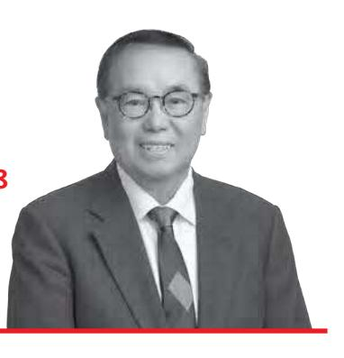

### **Bachelor of Business Administration (Honours)**

National University of Singapore

Date of first appointment as Director: 16 November 2009 Date of appointment as Chairman: 1 May 2010 Date of last re-election as Director: 31 March 2023 Length of service as Director: 15 years 3 months

**Present directorships:**

### **Other listed companies**

**•** Singapore Airlines Limited Chairman

### **Other principal commitments**

- **•** DBS Bank Ltd. Chairman
- **•** DBS Bank (Hong Kong) Limited Chairman
- **•** GIC Private Limited Director
- **•** STT Communications Ltd Deputy Chairman
- **•** LaSalle College of the Arts Limited Chairman
- **•** National Wages Council Chairman
- **•** Council of Presidential Advisers Member
- **•** University of the Arts Singapore Ltd. Director

**Past directorships in listed companies held over the preceding five years:** Nil

**Piyush Gupta, 65 Chief Executive Officer**

**Executive Director**

# **Post Graduate Diploma in Management**

Indian Institute of Management, Ahmedabad, India

### **Bachelor of Arts, Economics**

University of Delhi, India

Date of first appointment as Director: 9 November 2009

& Director

Trustees

Global Advisory Group

### **Present directorships:**

- **•** DBS Bank Ltd. Chief Executive Officer
- **•** Verified Impact Exchange Holdings Pte. Ltd. Director

  - **•** The Institute of Banking & Finance, Singapore Vice Chairman
  - Association (SINDA)
  - **•** Singapore Management University Chairman, Board of
  - **•** Indian Business-leaders Roundtable under Member, Managing
  - **•** Advisory Council on the Ethical Use of Council Member Artificial Intelligence (AI) and Data, Singapore

- **•** The Future Economy Advisory Panel, Member Ministry of Trade and Industry, Singapore
- **•** SGH Future Health Roundtable Member Advisory Council, Singapore

**Past directorships in listed companies held over the preceding five years:** Nil

Date of last re-election as Director: 28 March 2024 Length of service as Director: 15 years 3 months

### **Other listed companies**

Nil

### **Other principal commitments**

- **•** DBS Bank (Hong Kong) Limited Vice Chairman
- **•** Dr Goh Keng Swee Scholarship Fund Deputy Chairman
- **•** Lee Kuan Yew Exchange Fellowship Board Member
- **•** Mandai Park Holdings Pte. Ltd. Chairman
- **•** National Research Foundation, Singapore Board Member
- **•** The Association of Banks in Singapore Chairman
- **•** Singapore Indian Development Term Trustee
- **•** MasterCard Asia Pacific Advisory Board Board Member
- **•** BirdLife International, UK Co-Chairman,
- Singapore Indian Development Council Association (SINDA)
- **•** CNBC ESG Network, USA Member
- **•** International Business Leaders' Advisory Council Member Council for the Mayor of Shanghai (IBLAC)
- **•** SG Her Empowerment Limited Special Adviser

**Olivier Lim Tse Ghow, 60**

**Non-Executive and Lead Independent Director**

# **Bachelor of Engineering (First Class Honours), Civil Engineering**

Imperial College, London, UK

Date of first appointment as Director: 7 November 2017 Date of appointment as Lead Independent Director: 29 April 2020 Date of last re-election as Director: 31 March 2022 Length of service as Director: 7 years 3 months

# **Present directorships:**

## **Other listed companies**

**•** StarHub Ltd. Chairman **•** Raffles Medical Group Ltd Director

# **Other principal commitments**

**•** DBS Bank Ltd. Director **•** Singapore Tourism Board Chairman **•** MoneyOwl Private Limited Director

# **Past directorships in listed companies held over the preceding five years:**

**•** Banyan Tree Holdings Limited Director **•** PropertyGuru Group Limited Chairman

# **Chng Kai Fong, 46**

**Non-Executive and Non-Independent Director**

### **Sloan Masters Programme with a Master of Science in Management**

Stanford University, USA

### **Master of Engineering and Bachelor of Arts (First Class Honours)** University of Cambridge, UK

Date of first appointment as Director: 31 March 2021 Date of last re-election as Director: 28 March 2024 Length of service as Director: 3 years 11 months

# **Present directorships:**

# **Other listed companies**

Nil

### **Other principal commitments**

**•** DBS Bank Ltd. Director

**•** Ministry of Digital Development and Permanent Secretary Information, Singapore(1) (Information and

**•** Prime Minister's Office, Singapore Permanent Secretary

(Development) (Cybersecurity)

Development)

**•** Info-Communications Media Development Deputy Chairman Authority (IMDA)

**•** Singapore Symphonia Company Limited Director **•** The Government Technology Agency Board Member

of Singapore

**Past directorships in listed companies held over the preceding five years:** Nil

*(1) Ministry of Digital Development and Information, Singapore was formerly known as Ministry of Communications and Information, Singapore.*

**Ph.D and MS in Computer Science, specialising in Artificial Intelligence**

University of Southern California, USA

**Bachelor of Science in Computer Science and Statistics**

Seoul National University, South Korea

Date of first appointment as Director: 26 April 2018 Date of last re-election as Director: 31 March 2022 Length of service as Director: 6 years 10 months

**Present directorships:**

**Independent Director**

**Other listed companies**

Nil

Nil

**Other principal commitments**

**•** Equalkey Corporation Founder & Chief

**•** Tmoney Co., Ltd. Director

**Past directorships in listed companies held over the preceding five years:**

**•** DBS Bank Ltd. Director Executive Officer **David Ho Hing-Yuen, 65**

**Non-Executive and Independent Director**

University of Waterloo, Canada

**Directors' Consortium Program**

Stanford Graduate School of Business, USA

Date of first appointment as Director: 26 April 2023 Date of last re-election as Director: 28 March 2024 Length of service as Director: 1 year 10 months

**Present directorships:**

**Other listed companies •** Sun Life Financial, Inc. Director **•** Qorvo, Inc. Director

**Other principal commitments**

**•** DBS Bank Ltd. Director **•** Kiina Investment Limited Founder & Chairman

**•** Kiina Ventures, Inc. Chairman **•** Sun Life Assurance Company of Canada Director

**•** Noval Inception Philanthropy Chief Fundraising (non-governmental organisation) Officer

**Past directorships in listed companies held over the preceding five years:**

**•** Air Products and Chemicals, Inc. Director

**•** nVent Electric Plc Director

**Punita Lal, 62**

**Non-Executive and Independent Director**

**Master of Business Administration**  Indian Institute of Management, Calcutta, India

**Bachelor of Arts, Economics (Honours)**

St. Stephen's College, Delhi, India

Date of first appointment as Director: 1 April 2020 Date of last re-election as Director: 31 March 2023

**Present directorships:**

**Other listed companies**

**Other principal commitments**

**•** DBS Bank Ltd. Director

**•** DBS Foundation Ltd. Director

**Past directorships in listed companies held over the preceding five years:**

**•** CEAT Limited Director

**•** Cipla Limited Director

Length of service as Director: 4 years 10 months

**•** Carlsberg A/S Member, Supervisory Board

**•** Aesara Partners Ltd Executive Coach & Consultant

**Judy Lee, 57**

**Non-Executive and Independent Director**

**Master of Business Administration** 

The Wharton School of the University of Pennsylvania, USA

**Bachelor of Science, Finance & International Business**

Stern Business School, New York University, USA

**Advanced Management Program Women on Boards – Corporate Director Program**

Harvard Business School, USA

Date of first appointment as Director: 4 August 2021 Date of last re-election as Director: 28 March 2024 Length of service as Director: 3 years 6 months

**Present directorships:**

**Other listed companies**

**•** Commercial Bank of Ceylon PLC Director

**•** Mapletree Logistics Trust Management Ltd. Director

(the Manager of Mapletree Logistics Trust)

**Other principal commitments**

**•** DBS Bank Ltd. Director

**•** DBS Foundation Ltd. Director

**•** Dragonfly LLC Managing Director &

**•** Dragonfly Advisors Pte. Ltd. Managing Director

**•** SMRT Corporation Ltd Director

**•** SG Her Empowerment Limited Director

**•** Stern School of Business, Member, Executive

New York University Board

Co-Founder

**•** Dragonfly Capital Ventures LLC Chief Executive Officer **•** JTC Corporation Board Member

**•** WomenExecs on Boards Co-Chair (volunteer, non-profit Harvard

Business School Alumni network)

**Past directorships in listed companies held over the preceding five years:**

**•** AlTi Global, Inc. Director

**188** DBS Annual Report 2024 **Making Greater Impact Group Management Committee 189**

# **Anthony Lim Weng Kin, 66**

**Non-Executive and Independent Director**

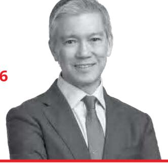

# **Bachelor of Science**

National University of Singapore

# **Advanced Management Program**

Harvard Business School, USA

Date of first appointment as Director: 1 April 2020 Date of last re-election as Director: 31 March 2023 Length of service as Director: 4 years 10 months

Ambassador to the Republic of Colombia

Advisory Committee

### **Present directorships:**

### **Other listed companies**

**•** CapitaLand Investment Limited Director

### **Other principal commitments**

- **•** DBS Bank Ltd. Director
- **•** CapitaLand Hope Foundation Director **•** Ministry of Foreign Affairs, Singapore Non-Resident
- **•** Queensway Secondary School Member, School
- **•** The Central Provident Fund (CPF) Board Board Member
- **•** Temasek International Advisors Pte. Ltd. Senior International

# **Past directorships in listed companies held over the preceding five years:**

**•** CapitaLand Limited(1) Director

Advisor

*(1) CapitaLand Limited was delisted from the official list of the Singapore Exchange Securities Trading Limited on 21 September 2021.*

# **Tham Sai Choy, 65**

**Non-Executive and Independent Director**

### **Bachelor of Arts (Honours) in Economics**

University of Leeds, UK

## **Fellow**

Institute of Chartered Accountants in England and Wales Institute of Singapore Chartered Accountants Singapore Institute of Directors

Date of first appointment as Director: 3 September 2018 Date of last re-election as Director: 31 March 2022 Length of service as Director: 6 years 5 months

## **Present directorships:**

### **Other listed companies**

**•** Keppel Ltd. Director

# **Other principal commitments**

| • DBS Bank Ltd.                              | Director     |
|----------------------------------------------|--------------|
| • DBS Bank (China) Limited                   | Director     |
| • DBS Foundation Ltd.                        | Director     |
| • Nanyang Polytechnic                        | Board Member |
| • Mount Alvernia Hospital                    | Board Member |
| • Singapore International Arbitration Centre | Director     |
|                                              |              |

**•** E M Services Private Limited Chairman

**Past directorships in listed companies held over the preceding five years:**

Nil

# **Group Management Committee**

# **The Group Management Committee comprises 22 members, including members of the Group Executive Committee.**

# **Piyush Gupta**

# **Chief Executive Officer**

Piyush has been the Chief Executive Officer and a Director of DBS Group since 2009. Prior to joining DBS, Piyush had a 27-year career at Citigroup, where his last position was Chief Executive Officer for Southeast Asia, Australia and New Zealand. Piyush is Chairman of the Board of Trustees of Singapore Management University and Chairman of the Mandai Park Holdings Board. In addition, he is a member of Singapore's Advisory Council on the Ethical Use of AI and Data and sits on the board of Singapore's National Research Foundation.

Piyush is a term trustee of the Singapore Indian Development Association. Previously, he was a member of the Singapore Emerging Stronger Taskforce, aimed at defining Singapore's future in a post-Covid world, the UN Secretary General's Task Force on Digital Financing of the Sustainable Development Goals, the Board of Institute of International Finance, and the McKinsey Advisory Council.

Piyush was awarded the Public Service Star by the President of Singapore for his meritorious services to the nation in 2020. He is a recipient of the 2023 Pravasi Bharatiya Samman Award, the highest honour conferred by the Indian Government on the country's diaspora.

Piyush was named one of the world's top 100 best-performing chief executives in Harvard Business Review – 2019 edition of "The CEO 100". He was named Global Indian of the Year by the Economic Times in 2021, Singapore Business Awards' Outstanding Chief Executive of the Year in 2016, and Singapore Business Leader of the Year by CNBC in 2014.

# **Tan Su Shan**

### **Deputy CEO & Institutional Banking**

Su Shan is Deputy CEO and Group Head of Institutional Banking at DBS. Su Shan was previously the Group Head of Consumer Banking and Wealth Management for close to a decade, and was also the President Commissioner for PT Bank DBS Indonesia from 2014 to 2024.

In 2019, The Asset named Su Shan as one of six women in Asia likely to influence and feature prominently in shaping the banking and associated financial services industry in Asia. In 2018, she was nominated by Forbes Magazine as a "Top 25 Emergent Asian Woman Business Leader". In 2014, she became the first Singaporean to be recognised as the world's "Best Leader in Private Banking" by The Banker/ Private Wealth Management, a wealth publication by the Financial Times Group. She has also served as a Nominated Member of Parliament in Singapore.

Su Shan sits on the advisory board of Dyson's family office, Weybourne Holdings. She was previously on the board of EvolutionX Debt Capital Pte Ltd (a fund focused on growth debt, founded jointly by Temasek and DBS), Mapletree Pan Asia Commercial Trust, Singapore's Central Provident Fund and Singhealth Fund Limited, which provides financial support to needy patients. She is a member of the International Women's Foundation and the Young Presidents Organisation, as well as an advisor to Lincoln College at Oxford University. She is also the Founder President of the Financial Women's Association in Singapore, a non-profit organisation she founded and pioneered in 2001, to help develop and mentor women in the financial industry.

*Su Shan was succeeded as Group Head of Institutional Banking by Han Kwee Juan on 1 January 2025.*

# **Chng Sok Hui**

# **Chief Financial Officer**

Sok Hui is the Chief Financial Officer of DBS Group. Prior to this appointment in October 2008, she was Group Head of Risk Management for six years. She is currently a board member of DBS Bank India. She serves on the board of the Singapore Exchange (Chair of Risk Committee) as well as the Changi Airport Group (Chair of Audit Committee). Additionally, she is a member of the CareShield Life Council.

Sok Hui previously served, for six years each, on the boards of the Inland Revenue Authority of Singapore, the Housing & Development Board, and the Accounting Standards Council. She was also the Supervisor of the DBS China board for 10 years and a past board member of the Bank of the Philippine Islands.

Sok Hui is a Chartered Financial Analyst, a Certified Financial Risk Manager, an Institute of Banking and Finance Singapore Distinguished Fellow, and a Fellow Chartered Accountant of Singapore. She was the recipient of several awards, including AsiaRisk's "Risk Manager of the Year" (2002), Asian Banker's inaugural "Risk Manager of the Year" (2012), "Best CFO" at the Singapore Corporate Awards (2013), "Accountant of the Year" at the inaugural Singapore Accountancy Awards (2014), and "Best CFO in Singapore" by FinanceAsia's Best Companies Awards (2023). She is a member of the International Women's Forum (Singapore).

# **Ginger Cheng**

### **China**

Ginger is Chief Executive Officer of DBS Bank (China) Limited and a member of the DBS Group Management Committee. Ginger has spearheaded execution of the group's China strategy since taking the helm in 2022, driving significant growth for the franchise in this key market.

*Information in this section is as at 31 December 2024.*

A veteran banker with over 30 years of experience in Hong Kong and Shanghai, Ginger has deep expertise in corporate finance, syndicated loans and investment banking, as well as extensive knowledge of cross-border financial services. Before becoming CEO, she served as Deputy CEO of DBS Bank China, fostering expansion of the Institutional Banking Group in support of Chinese companies' outbound investment into ASEAN countries. Throughout her career with DBS spanning various senior roles, she has consistently driven significant business growth with vision and foresight.

Ginger is also Chairman of DBS Technology (China) Limited and holds non-executive director positions at Shenzhen Rural Commercial Bank and Changsheng Fund Management. Furthermore, she serves on the International Expert Committee for Project Development at Shanghai Jiao Tong University's Shanghai Advanced Institute of Finance, mentoring the next generation of financial leaders. Prior to joining DBS in 2001, she held senior management positions at Bank of America specialising in regional loan syndication.

Ginger holds a Bachelor of Business Administration degree from the Chinese University of Hong Kong. A Beijing native, Ginger is fluent in Mandarin, English, Cantonese and Shanghainese.

# **Philip Fernandez**

# **Corporate Treasurer**

Philip is Group Corporate Treasurer, responsible for DBS' balance sheet, capital, wholesale funding, duration management and structural FX globally. He became Corporate Treasurer 16 years ago and in total has more than 30 years of experience in financial services in Singapore and London. Philip was conferred the Institute of Banking and Finance Singapore Distinguished Fellow award for Financial Markets in 2021 and was previously named "Bank Treasurer of the Year" by The Asset. Prior to heading Corporate Treasury, he was DBS' co-head of market risk for five years. Within the financial industry, he led the transition of Singapore dollar interest rates for corporate loans under the auspices of the Association of Banks in Singapore.

Philip is a Singaporean who holds an M.A. from Cambridge University where he studied Engineering and Management under a DBS scholarship. Previously, he was also an adjunct associate professor at the Singapore Management University for six years, where he specialised in quantitative finance. He was previously on the Private Education Appeals Board and a member of the Home Team-NS board of governors.

# **Derrick Goh**

# **Audit**

Derrick is the Group Head of Audit, responsible for providing independent assurance of the bank's controls, risk and governance structures and processes.

Prior to this, Derrick led the Treasures and Treasures Private Client Wealth Management business across the group. Before that, he was Head of POSB where he helped to deepen its community outreach. Derrick was also Regional Chief Operating Officer and Chief Financial Officer of the Institutional Banking Group and Head of Finance, Group Planning and Analytics.

Before DBS, Derrick spent 11 years at American Express in senior finance roles in Paris, London, New York and Singapore. He has over 30 years of experience in finance and banking. He currently chairs the Board Audit and Risk Committee for GovTech Singapore and serves the community as a Member of Parliament (Nee Soon Group Representation Constituency). He is also a member of the Parliament of Singapore's Public Accounts Committee.

*Derrick was appointed Group Chief Operating Officer from 1 April 2025.*

# **Han Kwee Juan**

### **Singapore**

Kwee Juan is Group Executive and Country Head of DBS Singapore, where he is responsible for leading the franchise in the Group's largest market.

Prior to this, he was DBS' Group Head of Strategy & Planning, where he played a pivotal role in driving the transformation agenda across the Group, especially in the areas of data and artificial intelligence, Managing through Journeys, customer experience and centricity, innovation and future of work. He also forged partnerships across the Group to build new business models and digital growth engines, and scaled these businesses.

Kwee Juan is currently a board member of Singapore Institute of Technology, council member of Singapore National Employers' Federation and a member of the Institute of International Finance Digital Finance steering committee.

*Kwee Juan was appointed Group Head of Institutional Banking from 1 January 2025.*

# **Eugene Huang**

### **Chief Information Officer**

Eugene is Chief Information Officer at DBS, where he oversees the bank's tech applications and infrastructure; central tech functions such as Enterprise Architecture Site Reliability Engineering, Information Security

Services, Data, Technology COO; regional technology teams as well as technology hubs in India and China.

Eugene is a veteran technologist with over 36 years of technology and banking experience. Before joining DBS, he led a team of 22,000 employees at Ping An Group providing a full suite of IT offerings – including infrastructure, cybersecurity, middleware and customer-facing applications – to all of Ping An's businesses. He was concurrently Chairman and CEO of Ping An Technology, the technology arm of Ping An Group, with P&L responsibilities.

Prior to that, he was Deputy General Manager, Chief Technology Officer and Chief Operating Officer at OneConnect Financial Technology, a technology services platform for financial institutions around the world. Eugene played an integral role in the company's listing on the New York Stock Exchange in 2019, just four years after its establishment.

In the early part of his career, he spent nearly 10 years in New York with Salomon Smith Barney and Credit Suisse First Boston. He was subsequently with Citigroup and HSBC.

# **Lam Chee Kin**

# **Legal & Compliance**

Chee Kin oversees the legal and regulatory risk of DBS across legal entities, segments and geographies. A lawyer by profession, he has particular expertise in financial services regulation, and financial markets product and business structuring. Chee Kin has held legal and compliance portfolios in Standard Chartered, J.P. Morgan, Rajah & Tann and Allen & Gledhill. He also had a stint as Chief Operating Officer for Southeast Asia at J.P. Morgan.

Chee Kin currently serves on the Advisory Board to the Singapore Management University School of Law and the Advisory Panel to the NUS Centre for Banking and Finance Law.

# **Lee Yan Hong**

### **Human Resources**

Yan Hong is Head of Group Human Resources at DBS.

Leveraging over 30 years of global human capital management expertise, Yan Hong spearheads DBS' strategic people agenda to deliver on the bank's employee value proposition. This includes driving transformational leadership initiatives, fostering a startup culture, talent development, upskilling employees with future-ready capabilities and ensuring holistic employee well-being.

Under her leadership, DBS received numerous global and national employer awards including Mercer's Best Employer Award in Singapore and other markets for several years as well as the Bloomberg Gender Equality Index for six years running in recognition of the progress made on advancing gender equity at the workplace. This year, DBS was ranked first in TIME's 500 Best Companies in Asia Pacific. DBS has also been recognised by the Singapore Tripartite Alliance for Fair and Progressive Employment Practices for fair and progressive employment practices as well as empowering employees to achieve work-life excellence.

Yan Hong serves on the boards of the Inland Revenue Authority of Singapore and the Institute of Systems Science, National University of Singapore. She is also a member of the Alliance for Action on workplace integration, an industry-led coalition with the Singapore Government.

# **Lim Chu Chong**

## **Indonesia**

Chu Chong has been President Director of PT Bank DBS Indonesia since August 2022. Prior to that, he was Chief Operating Officer, Institutional Banking Group (IBG), at DBS. In this role, he was responsible for facilitating business growth, particularly in strengthening policies, governance and controls, data capabilities as well as customer and employee experience.

A career DBS banker, Chu Chong has over 25 years of experience in institutional, SME and consumer banking. He began his career as a credit and marketing officer in corporate banking, before progressively moving up the ranks to become Regional Head of SME Banking. Between 2016 and 2019, he was Head of DBS IBG China. He was Non-Independent Commissioner of DBS Indonesia from 2011 to 2016, and a board member of DBS Foundation from December 2013 to November 2022.

He has a Bachelor of Arts majoring in Economics and Statistics from the National University of Singapore.

# **Lim Him Chuan**

### **Strategy, Transformation, Analytics & Research**

Him Chuan is Group Head of Strategy, Transformation, Analytics & Research. He is a member of DBS' Group Executive Committee.

In this role, he works with the Group CEO and Group Management Committee to develop strategies to drive growth and valuation for shareholders. He also oversees strategic reviews and execution of these strategies across the bank globally. Additionally, he is

responsible for driving the transformation programme including the use of AI and data analytics in our businesses across the bank.

Prior to this, Him Chuan was General Manager and Chief Executive Officer of DBS Taiwan, a role he held from 2018 to 2023. Under his leadership, DBS Taiwan's income increased at a compounded annual growth rate of 6%, while net profit before tax grew at a CAGR of 12%. DBS Taiwan also won multiple accolades including Best International Foreign Bank in Taiwan by Asiamoney. He also oversaw the integration of Citi Consumer Taiwan, making DBS the largest foreign bank in Taiwan by assets.

Him Chuan's other senior leadership roles at DBS include being Group Head of Product Management for Global Transaction Services, Group Chief Operating Officer for Institutional Banking Group and International Markets, Risk Management Group and Head of Group Audit. He was conferred the title of Institute of Banking and Finance Singapore Fellow in 2014 in recognition of his contributions to the Singapore financial services industry and his industry thought leadership.

*Him Chuan was appointed Country Head of DBS Singapore from 1 January 2025.*

# **Lim Soon Chong**

### **Global Transaction Services**

Soon Chong is Group Head of Global Transaction Services (GTS) at DBS Bank, a role he has held since 2021. He is responsible for the bank's payments and cash management, trade finance, as well as securities and fiduciary services businesses.

Under his leadership, GTS has deepened its market penetration in our key markets and grown its market share, cementing DBS as a leading pan-Asian transaction banking leader. The business has also received significant customer validation – in 2024, DBS was named by Coalition Greenwich as the Quality Leader for both Cash Management and Trade Finance in its core markets. In 2023, corporates polled by Euromoney in its Cash Management Survey ranked DBS first in the "Global Best Service – Overall (Non-Financial Institutions)" category.

Since joining DBS in 2006, Soon Chong has held several leadership roles, including Regional Head of Product Management (GTS), Regional Head of Investment Products & Advisory (Consumer Banking & Wealth), and Head of Balance Sheet & Strategic Portfolio Management (Corporate Treasury).

Soon Chong is a board member of Singapore Land Authority, Partior Holdings, Singapore Trade Data Exchange Services, DBS Finnovation Ltd and DBS Taiwan, and was previously a board member of Nikko Asset Management (Asia).

# **Andrew Ng**

### **Global Financial Markets**

Andrew is Group Head of Global Financial Markets, a member of the DBS Group Executive Committee, the Chairman and Director of DBS Bank Taiwan, and Director of DBS Securities (Japan) Company Limited.

Andrew's experience in the treasury business spans over 36 years, comprising senior positions in Asia and Western markets. Since 2006, Andrew has been instrumental in leading DBS Treasury Market's expansion in the region.

In addition, he helped build a pan-Asia trading platform on different asset classes and established a region-wide local currencies derivative capability for the bank. He has also expanded DBS' capabilities in generic and exotic derivatives. Prior to joining DBS, he was Executive Director at Canadian Imperial Bank of Commerce (CIBC) from 1995 to 1999, where he set up CIBC's trading platform and derivative capabilities on Asian currencies. He was also previously North Asia Head of Trading at Chase Manhattan Bank N.A. and Treasurer of Chase Manhattan Bank Taipei.

# **Jimmy Ng**

### **Operations**

As Group Head of Operations, Jimmy oversees DBS' Consumer and Institutional Banking Group Operations and their Customer Contact Centres, Global Financial Markets Operations, and Operations COO, across six key markets – Singapore, Hong Kong, China, Taiwan, India and Indonesia. He is the architect of the bank's multiyear Operations Processes and Platform Re-engineering programme which has been pivotal in driving the digitisation of manual processes and enhancing employee productivity, yielding over a million hours of increased efficiency since 2021.

Jimmy previously served as Chief Information Officer and Head of Group Technology & Operations, where he pioneered the Gen AI initiatives in DBS, drawing on the foundation of the bank's data transformation journey and self-service data platform. He was instrumental in establishing DBS technology hubs in Hyderabad and Guangzhou, and drove the successful integrations of Citi Consumer Taiwan in 2023 and India's Lakshmi Vilas Bank in 2022. Jimmy also held various leadership roles within the bank in Consumer Banking Operations, Audit and Middle Office Technology.

Jimmy currently serves on the boards of Keppel Corporation and NTUC FairPrice Co-operative Limited. He is also Chairperson of the Institute of Banking and Finance Singapore's Technology and Operations Workgroup.

**192** DBS Annual Report 2024 **Making Greater Impact International presence 193**

# **Ng Sier Han**

# **Taiwan**

Sier Han is General Manager and Chief Executive Officer of DBS Bank Taiwan. Prior to his current role, he was Integration Director of DBS Taiwan where he oversaw the successful integration of Citi Consumer Taiwan, which resulted in DBS becoming the largest foreign bank in Taiwan by assets.

Before relocating to Taiwan, he was Head of DBS' Financial Institutions Group (FIG), a role he held from 2019. In this role, he was responsible for leading the development of relationships with banks, institutional investors and insurance clients across the global franchise. Under his leadership, the FIG franchise registered significant growth in income across key capital markets, namely, Singapore, Greater China and the United Kingdom.

# **Karen Ngui**

### **Strategic Marketing & Communications**

Karen is Group Head of Strategic Marketing and Communications, and Head of the DBS Foundation. She is responsible for shaping, enhancing and protecting the bank's brand across all businesses and markets where DBS is present. She is also responsible for corporate communications, integrated marketing and internal communications. In addition, she leads the bank's 'Impact Beyond Banking' initiatives, including corporate volunteerism.

Karen has over 35 years of experience and joined DBS in 2005 from Standard Chartered Bank, where she was Global Head of Brand Management and Strategic Marketing.

# **Sebastian Paredes**

# **North Asia & Hong Kong**

Sebastian is Head of North Asia of DBS with oversight of Mainland China, Hong Kong and Taiwan, and Chief Executive Officer of DBS Bank (Hong Kong) Limited. He is also the Chairman of DBS (China) Ltd.

A banker of over 30 years, Sebastian has a strong track record in building franchises across multiple markets. Prior to joining DBS, Sebastian was President Director of PT Bank Danamon Indonesia, where he successfully solidified the bank's position in retail, SME and commercial banking, and made inroads into the micro lending business. Before Danamon, he spent 20 years at Citigroup in South America, Turkey and Africa.

Sebastian holds a Bachelor of Science degree from California State University, Fresno (California, USA) and an International MBA from IE Business School (Madrid, Spain). He speaks five languages (Spanish, English, German, French and Bahasa Indonesia).

# **Sanjoy Sen**

# **Consumer Banking**

Sanjoy is Group Head of Consumer Banking and plays a lead role in growing and deepening DBS' regional consumer banking footprint in Asia. His responsibilities include driving digital transformation, developing new ecosystem partnerships, and leveraging DBS' banking and technology capabilities to scale the consumer business regionally.

Sanjoy has over 30 years of extensive international consumer banking experience. He spent the first 22 years of his career in Citibank, before he joined ANZ Banking Group in 2012 to head its retail, private banking and wealth business in Asia. He then joined DBS in 2018, following the successful integration of ANZ's retail and wealth business. Sanjoy currently serves on the boards of DBS Bank Taiwan and DBS Foundation. He also sits on Visa's Senior Client Council for Asia Pacific.

In 2019, Sanjoy was conferred the Institute of Banking and Finance Singapore Fellow award for Consumer Banking.

Sanjoy is a Singaporean who holds a B.Tech degree in Electronics Engineering from Indian Institute of Technology and a Post Graduate Diploma in Business Management from Indian Institute of Management. He has also completed an executive management programme from Harvard Business School.

# **Shee Tse Koon**

### **Consumer Banking/ Wealth Management**

Tse Koon is Group Executive and Group Head of Consumer Banking and Wealth Management. He is also the President Commissioner for PT Bank DBS Indonesia.

Prior to this, he was Country Head of DBS Singapore, where he was responsible for anchoring the Singapore franchise with sustainable revenue drivers and strong mindshare. Before that, he was Group Head of Strategy and Planning at DBS.

Tse Koon has close to 30 years of banking experience and started his career at Standard Chartered Bank where he held senior positions across various markets in Asia, Middle East and the United Kingdom. He was CEO of Indonesia prior to joining DBS, and his other roles included Head of Governance (Europe, Middle East, Africa & Americas), Chief Information Officer, Head of Technology & Operations (Singapore) and Regional Head of Trade.

Tse Koon is currently a board director of NETS Pte Ltd and the Chairman of the Association of Banks in Singapore's Culture and Conduct Steering Group. He also sits on the Board of Governors for the Singapore International Foundation and Nanyang Polytechnic.

Tse Koon champions gender diversity and is a mentor with BoardAgender by Singapore Council of Women's Organisation.

# **Surojit Shome**

### **India**

Surojit has been Chief Executive Officer of DBS Bank in India since 2015. He has over 35 years of banking experience across corporate and investment banking, capital markets and consumer banking. Before he joined DBS, he was CEO of Rabobank in India. Prior to that, he worked for 19 years at Citibank in various roles across consumer and wholesale banking. He subsequently headed the investment banking division at Lehman Brothers in India.

Surojit holds a post-graduate management degree in marketing and finance from Xavier School of Management, Jamshedpur, and a Bachelor of Science degree in Economics, Mathematics and Statistics from Presidency University, Kolkata. Surojit has also attended the Executive Development Program at The Wharton School in 2004 and the Rabobank Senior Leadership Program at Harvard Business School in 2011.

*Surojit retired on 28 February 2025. He was succeeded by Rajat Verma on 1 March 2025.*

# **Soh Kian Tiong**

### **Chief Risk Officer**

Kian Tiong is Chief Risk Officer of DBS Group and has more than 30 years of experience in the banking and finance industry. He was previously DBS' Chief Credit Officer for the bank's Greater China operations where he oversaw credit and risk functions in Mainland China, Hong Kong and Taiwan. Prior to this, he was Head of DBS' Financial Institutions Group, responsible for relationships with banks and non-bank financial institutions, comprising insurance companies, funds, securities companies, supranationals and central banks, spanning US, Europe and most parts of Asia.

He also oversaw the relationship coverage of Singapore government-related entities such as GIC, Temasek and Singapore universities, among others. In recognition of his leadership and commitment in developing the financial industry, Kian Tiong was conferred the Institute of Banking and Finance Singapore Fellow award in 2017.

# **International presence**

# **Singapore**

### **DBS Bank Ltd ("DBS Bank")**

12 Marina Boulevard Marina Bay Financial Centre Tower 3 Singapore 018982 Tel: (65) 6878 8888

### **DBS Nominees (Private) Limited**

10 Toh Guan Road, #04-11 DBS Asia Gateway Singapore 608838 Tel: (65) 6878 8888 Fax: (65) 6338 8936

## **DBS Trustee Limited**

12 Marina Boulevard, Level 44 Marina Bay Financial Centre Tower 3 Singapore 018982 Tel: (65) 6878 8888

### **DBS Vickers Securities (Singapore) Pte Ltd**

12 Marina Boulevard Marina Bay Financial Centre Tower 3 Singapore 018982 Tel: (65) 6327 2288

### **DBSN Services Pte. Ltd.**

10 Toh Guan Road, #04-11 DBS Asia Gateway Singapore 608838 Tel: (65) 6878 8888 Fax: (65) 6338 8936

### **DBS Digital Exchange Pte. Ltd.**

12 Marina Boulevard Marina Bay Financial Centre Tower 3 Singapore 018982 Tel: (65) 6878 8888

*92% owned by DBS Finnovation Pte. Ltd., a wholly-owned subsidiary of DBS Bank*

# **Australia**

### **DBS Bank Australia Branch**

Suite 1901, Level 19, Chifley Tower 2 Chifley Square, Sydney NSW 2000 Australia Tel: (61 2) 8823 9300 Fax: (61 2) 8823 9301

# **Bangladesh**

# **DBS Bank Dhaka Representative Office**

Laila Tower, 10th Floor, 8 Bir Uttam Mir Shawkat Sarak, Gulshan 1, Dhaka 1212 Bangladesh Tel: (880 2) 2266 00810

# **China**

### **DBS Bank (China) Limited**

Units 1301-1308, 1501, 1602, 1701, 1801 DBS Bank Tower No. 1318 Lujiazui Ring Road Pudong New Area, Shanghai 200120 People's Republic of China Tel: (86 21) 3896 8888 Fax: (86 21) 3896 8989

### **DBS Securities (China) Co., Ltd.**

Unit 01 – 07, 29F, BFC Block S1 600 Zhongshan No.2 Road (E) Huangpu, Shanghai People's Republic of China Tel: (86 21) 3856 2888 Fax: (86 21) 6315 0977

# *91% owned by DBS Bank*

# **DBS Technology (China) Ltd**

Room 301, Block A4 No.1, China-Singapore Smart 1st Street China-Singapore Guangzhou Knowledge City Huangpu district, Guangzhou, Guangdong Province 510555 People's Republic of China Tel: (86 20) 2919 5508

# **Hong Kong**

### **DBS Bank (Hong Kong) Limited**

11th Floor, The Center 99 Queen's Road Central Hong Kong Tel: (852) 2290 8888

### **DBS Bank Hong Kong Branch**

18th Floor, The Center 99 Queen's Road Central Hong Kong Tel: (852) 2290 8098 Fax: (852) 2596 0577

### **DBS Asia Capital Limited**

73rd Floor, The Center 99 Queen's Road Central Hong Kong Tel: (852) 3668 1148 Fax: (852) 2868 0250

### **DBS Vickers (Hong Kong) Limited**

16/F One Island East 18 Westlands Road Island East Hong Kong Tel: (852) 3668 3288

Fax: (852) 2523 6055

# **India**

### **DBS Bank India Limited**

First Floor, Express Towers Nariman Point Mumbai 400 021 India Tel: (91 22) 6638 8888 Fax: (91 22) 6638 8899

## **DBS Technology Services India Private Limited**

17th Floor, Skyview 20 Building, M/s. Divija Commercial Properties Private Limited Survey No. 83/1, Raidurg Village, Serilingampally Mandal, Ranga Reddy District, Hyderabad Telangana India Tel: (91 40) 6752 2222

### **DBS Bank Gujarat International Finance Tec-City ("Gift City") Branch**

802, 8th Floor, Hiranandani Signature Block 13B, Zone 1, GIFT SEZ, GIFT City Gandhinagar, Gujarat 382355 India

Tel: (91) 93233 93401

# **Japan**

### **DBS Bank Tokyo Branch**

Otemachi First Square East Tower 15F 5-1, Otemachi 1-chome Chiyoda-ku, Tokyo 100-0004 Japan Tel: (81 3) 3213 4411 Fax: (81 3) 3213 4415

### **DBS Securities (Japan) Co., Ltd.**

Otemachi First Square East Tower 15F 5-1, Otemachi 1-chome Chiyoda-ku, Tokyo 100-0004 Japan Tel: (81 3) 3213 4660

# **Korea**

### **DBS Bank Seoul Branch**

18th Floor, Seoul Finance Center 136 Sejong-daero, Jung-Gu, Seoul Republic of Korea 04520 Tel: (822) 6322 2660 Fax: (822) 732 7953

**DBS Bank (Hong Kong) Limited** 

Nos. 5 a 7E da Rua de Santa Clara

# **Macau**

**Macau Branch**

Tel: (853) 2832 9338 Fax: (853) 2832 3711

Edif, Ribeiro Loja C e D. Macau

# **PT Bank DBS Indonesia**

**Indonesia**

DBS Bank Tower 32nd - 35th & 37th Floor, Ciputra World 1 Jalan Prof. Dr. Satrio Kav. 3-5 Jakarta 12940 Indonesia Tel: (62 21) 2988 5000

### *99% owned by DBS Bank*

# **PT DBS Vickers Sekuritas Indonesia**

DBS Bank Tower 32nd Floor, Ciputra World 1 Jalan Prof. Dr. Satrio Kav. 3-5 Jakarta 12940 Indonesia

Tel: (62 21) 3003 4900

*85% owned by DBS Vickers Securities Holdings Pte Ltd ("DBSV"), a wholly-owned subsidiary of DBS Bank and 14% owned by DBS Vickers Securities (Singapore) Pte Ltd, a wholly-owned subsidiary of DBSV*

# **Malaysia**

### **DBS Bank Kuala Lumpur Representative Office**

Suite 30-05, Integra Tower, The Intermark 348 Jalan Tun Razak, 50400 Kuala Lumpur Malaysia Tel: (60 3) 2116 3888 Fax: (60 3) 2116 3901

### **DBS Bank Labuan Branch**

Level 10 (A) Main Office Tower Financial Park Labuan Jalan Merdeka 87000 Federal Territory Labuan Malaysia Tel: (60 87) 595 500

# **DBS Bank Yangon Representative Office**

No. 3/A Bogyoke Aung San Road Level 14, Suite 52, Junction City Tower Pabedan Township, Yangon Myanmar Tel: (95 1) 925 3325

Fax: (60 87) 423 376

**Myanmar**

# **The Philippines**

### **DBS Bank Manila Representative Office**

22F, The Enterprise Center, Tower 1 Ayala Avenue corner Paseo De Roxas Makati City The Philippines Tel: (632) 8869 3876

# **Taiwan**

### **DBS Bank (Taiwan) Ltd**

15F & 17F Nos. 32 & 36 Songren Road Xinyi District, Taipei City 110 Taiwan R.O.C Tel: (886 2) 6612 9889 Fax: (886 2) 6612 9285

### **DBS Bank Taipei Branch**

15F Nos. 32 & 17F No. 36 Songren Road Xinyi District, Taipei City 110 Taiwan R.O.C Tel: (886 2) 2722 8988 Fax: (886 2) 6638 3707

# **United Arab Emirates**

# **DBS Bank Ltd (DIFC Branch)**

Fax: (971) 4364 1801

Units 608-610, Level 6, Gate Precinct Building 5, Dubai International Financial Centre P.O. Box 506538 Dubai UAE Tel: (971) 4364 1800

# **United States of America**

### **DBS Bank Los Angeles Representative Office**

300 South Grand Ave Suite 3075 Los Angeles CA 90071 USA Tel: (1 213) 627 0222

Fax: (1 213) 627 0228

### **DBS Vickers Securities (USA), Inc.**

777 Third Ave, Suite 1701 New York, NY 10017 USA Tel: (1 212) 826 1888

# **Thailand**

### **DBS Bank Bangkok Representative Office**

989 Siam Piwat Tower Building 15th Floor Rama 1 Road, Pathumwan Bangkok 10330 Thailand

Tel: (66 2) 658 1400-1 Fax: (66 2) 658 1402

### **DBS Vickers Securities (Thailand) Co., Ltd.**

989 Siam Piwat Tower Building 14th – 15th Floor Rama 1 Road, Pathumwan Bangkok 10330 Thailand

Tel: (66 2) 857 7000

# **United Kingdom**

# **DBS Bank London Branch**

One London Wall London EC2Y 5EA UK

Tel: (44 20) 7489 6550

# **Vietnam**

# **DBS Bank Hanoi Representative Office**

Room 1404 14th Floor, Pacific Place 83B Ly Thuong Kiet Street Hanoi Vietnam Tel: (84 24) 3946 1688

Fax: (84 24) 3946 1689

# **DBS Bank Ho Chi Minh City Branch**

11th Floor, Saigon Centre 65 Le Loi Boulevard District 1 Ho Chi Minh City Vietnam Tel: (84 28) 3914 7888

Fax: (84 28) 3914 4488

# **Awards and accolades**

**World's Best Corporate/ Institutional Digital Bank**

Global Finance

**World's Best for High Net Worth**

Euromoney

**World's Best Bank for Real Estate**

Euromoney

**World's Best Bank for Sustainable Finance**

Global Finance

**World's Most Innovative Bank for FX**

Global Finance

**Model Bank for AI Industrialisation**

Celent

**Best Financial Innovation Labs (1 of 23 winners)**

Global Finance

**World's Best Bank for Social Bonds**

Global Finance

**Strategy & Engagement – Employee Engagement**

Shorty Impact

**FTSE4Good Developed Index**

FTSE Russell

**Asia's Safest Bank**

Global Finance

**Most Innovative Bank, Asia-Pacific**

Global Finance

**Asia's Best Bank for Wealth Management**

Euromoney

**Best Private Bank**

Asian Private Banker, Euromoney, PWM, The Asset

**Best SME Bank, Asia-Pacific**

Global Finance

**SME Financier of the Year (Gold), Asia**

International Finance Corporation (IFC)

**Best Transaction Bank, Asia-Pacific**

Global Finance

**Best Cash Management Bank, Asia-Pacific**

Euromoney

**Investment Bank of the Year for Asia**

The Banker

**Bank of the Year, Asia-Pacific**

PFI Awards

**Project Finance Advisory House of the Year**

The Asset

**Best Bank for Sustainable Finance, Asia-Pacific**

Global Finance, The Asset

**Southeast Asia Loan House**

IFR

**In-House Team of the Year (Communications)**

PRCA Gold Standard

**Most Innovative In-House Legal Team, Asia-Pacific**

Financial Times

**Digital Bank of the Year, Singapore**

The Asset

**Best Private Bank, Singapore**

Euromoney, Global Finance, PWM, The Asset

**Best Bank for Real Estate, Singapore**

Euromoney

**Best SME Bank, Singapore**

Global Finance

**Best Investment Bank, Singapore**

FinanceAsia, Global Finance **Best FX Bank, Singapore**

Euromoney, Global Finance **Best Bank for Sustainable Finance, Singapore**

FinanceAsia, Global Finance, The Asset

**Best Bank for ESG, Singapore**

Euromoney

**Most Transparent Company Award, Financials Category**

Securities Investors Association of Singapore (SIAS)

**IBF Golden Jubilee Inspire Award**

The Institute of Banking & Finance (IBF)

# **Share price**

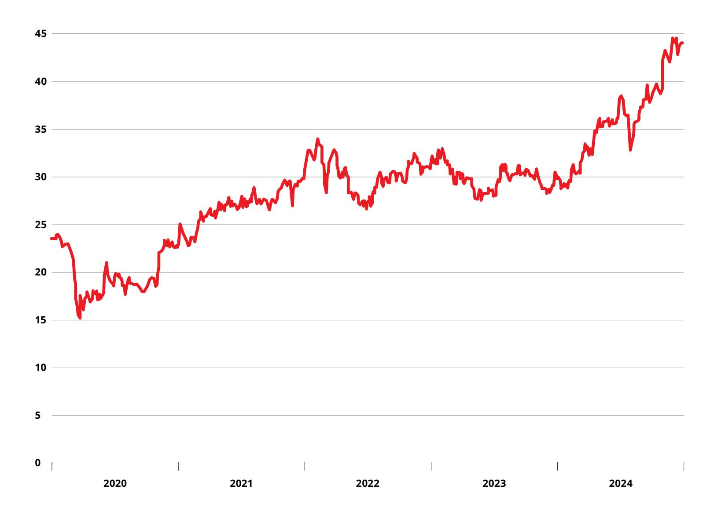

| Share price (SGD)(1)                         | 2020  | 2021  | 2022  | 2023  | 2024  |
|----------------------------------------------|-------|-------|-------|-------|-------|
| High                                         | 24.00 | 29.80 | 33.86 | 32.90 | 44.31 |
| Low                                          | 15.35 | 22.76 | 26.81 | 27.55 | 28.77 |
| Close                                        | 22.76 | 29.69 | 30.84 | 30.37 | 43.72 |
| Average                                      | 19.98 | 26.87 | 30.26 | 29.96 | 35.80 |
| Financial ratios(2)                          |       |       |       |       |       |
| Gross dividend yield (%)(3)                  | 4.0   | 4.1   | 4.5   | 5.8   | 6.2   |
| Price-to-earnings ratio (number of times)(4) | 12.1  | 11.3  | 10.6  | 8.3   | 9.0   |
| Price-to-book ratio (number of times)(5)     | 1.1   | 1.4   | 1.6   | 1.4   | 1.5   |

- *(1) Adjusted for one-for-10 bonus issue announced on 7 Feb 2024*
- *(2) Calculated based on average share price for the calendar year*
- *(3) Based on ordinary dividends for the financial year*
- *(4) Earnings exclude one-time items (5) Based on year-end book value*

# **Financial calendar**

# **2025**

### **10 February**

2024 Full Year Results

# **28 March**

26th Annual General Meeting

### **On or about 16 April**

Payment date of Final Dividend on Ordinary Shares for the Financial Year ended 31 December 2024\*

### **8 May**

2025 First Quarter trading update

### **7 August**

2025 Second Quarter/ First Half Results

# **6 November**

2025 Third Quarter trading update

# **2026**

### **February**

2025 Full Year Results

*\* Subject to shareholders' approval of final dividend at the 26th Annual General Meeting.*

**200** DBS Annual Report 2024 **Making Greater Impact Shareholding statistics 201**

# **Shareholding statistics**

**as at 7 February 2025**

Class of Shares – Ordinary shares

Voting Rights – One vote per share

Total number of issued ordinary shares – 2,839,624,408 (excluding treasury shares)

Treasury Shares – 6,727,062 (representing 0.24% of the total number of issued ordinary shares, excluding treasury shares)

| Size of Shareholdings    | No. of Shareholders | %      | No. of Shares | %*     |
|--------------------------|------------------------|--------|------------------|--------|
| 1 – 99                   | 12,227                 | 12.38  | 384,007          | 0.01   |
| 100 – 1,000              | 39,372                 | 39.86  | 15,465,892       | 0.55   |
| 1,001 – 10,000           | 41,312                 | 41.82  | 120,129,689      | 4.23   |
| 10,001 – 1,000,000       | 5,828                  | 5.90   | 191,076,142      | 6.73   |
| 1,000,001 & above        | 36                     | 0.04   | 2,512,568,678    | 88.48  |
| Total                    | 98,775                 | 100.00 | 2,839,624,408    | 100.00 |
| Location of Shareholders |                        |        |                  |        |
| Singapore                | 94,925                 | 96.10  | 2,819,411,119    | 99.29  |
| Malaysia                 | 2,547                  | 2.58   | 13,339,564       | 0.47   |
| Overseas                 | 1,303                  | 1.32   | 6,873,725        | 0.24   |
| Total                    | 98,775                 | 100.00 | 2,839,624,408    | 100.00 |

# **Twenty largest shareholders (as shown in the register of members and depository register)**

|    | Name of Shareholders                       | No. of Shares | %*    |
|----|--------------------------------------------|------------------|-------|
| 1  | CITIBANK NOMINEES SINGAPORE PTE LTD        | 556,554,101      | 19.60 |
| 2  | MAJU HOLDINGS PTE. LTD.                    | 484,789,855      | 17.07 |
| 3  | DBSN SERVICES PTE LTD                      | 335,329,628      | 11.81 |
| 4  | TEMASEK HOLDINGS (PRIVATE) LTD             | 312,559,831      | 11.01 |
| 5  | RAFFLES NOMINEES (PTE) LIMITED             | 240,692,100      | 8.48  |
| 6  | HSBC (SINGAPORE) NOMINEES PTE LTD          | 237,701,361      | 8.37  |
| 7  | DBS NOMINEES PTE LTD                       | 190,267,001      | 6.70  |
| 8  | BPSS NOMINEES SINGAPORE (PTE.) LTD.        | 26,171,692       | 0.92  |
| 9  | DBS VICKERS SECURITIES (SINGAPORE) PTE LTD | 15,942,927       | 0.56  |
| 10 | UNITED OVERSEAS BANK NOMINEES PTE LTD      | 12,841,521       | 0.45  |
| 11 | LEE FOUNDATION                             | 12,664,094       | 0.45  |
| 12 | PHILLIP SECURITIES PTE LTD                 | 8,587,903        | 0.30  |
| 13 | OCBC SECURITIES PRIVATE LTD                | 8,492,279        | 0.30  |
| 14 | OCBC NOMINEES SINGAPORE PTE LTD            | 8,028,110        | 0.28  |
| 15 | BNP PARIBAS NOMINEES SINGAPORE PTE LTD     | 6,325,693        | 0.22  |
| 16 | DB NOMINEES (SINGAPORE) PTE LTD            | 5,549,021        | 0.20  |
| 17 | IFAST FINANCIAL PTE LTD                    | 5,131,308        | 0.18  |
| 18 | MRS LEE LI MING NEE ONG                    | 5,081,799        | 0.18  |
| 19 | UOB KAY HIAN PTE LTD                       | 4,256,563        | 0.15  |
| 20 | MOOMOO FINANCIAL SINGAPORE PTE. LTD.       | 4,056,962        | 0.14  |
|    | Total                                      | 2,481,023,749    | 87.37 |

*\* Percentage is calculated based on the total number of issued ordinary shares, excluding treasury shares*

# **Substantial shareholders**

|                                    |             | No. of Shares |             |       |
|------------------------------------|-------------|---------------|-------------|-------|
|                                    | Direct      | Deemed        | Total       |       |
| Maju Holdings Pte. Ltd.            | 484,789,855 | –             | 484,789,855 | 17.07 |
| Temasek Holdings (Private) Limited | 312,559,831 | 489,307,724   | 801,867,555 | 28.24 |

- *\* Percentage is calculated based on the total number of issued ordinary shares, excluding treasury shares*
- 1. Maju Holdings Pte. Ltd. ("Maju") is a wholly-owned subsidiary of Temasek Holdings (Private) Limited ("Temasek").
- 2. Temasek, a company wholly-owned by the Minister for Finance, is deemed to be interested in all the ordinary shares held by Maju.
- 3. In addition, Temasek is deemed to be interested in 4,517,869 ordinary shares in which its other subsidiaries have or are deemed to have an interest pursuant to Section 4 of the Securities and Futures Act 2001.

As at 7 February 2025, approximately 71.62% of the issued ordinary shares of DBS Group Holdings Ltd are held by the public and, therefore, Rule 723 of the SGX Listing Manual is complied with.

**202** DBS Annual Report 2024 **Making Greater Impact Notice of Annual General Meeting 203**

# **Notice of Annual General Meeting**

### **DBS GROUP HOLDINGS LTD**

(Incorporated in the Republic of Singapore) Company Registration No.: 199901152M

### **To: All shareholders of DBS Group Holdings Ltd**

NOTICE IS HEREBY GIVEN that the 26th Annual General Meeting ("AGM") of the shareholders of DBS Group Holdings Ltd (the "Company" or "DBSH") will be held at Marina Bay Sands Expo and Convention Centre, Level 4, Roselle and Simpor Ballrooms, 10 Bayfront Avenue, Singapore 018956 on Friday, 28 March 2025 at 2.00 p.m. to transact the following business:

| Ordinary Resolution No. Routine Business     |                                                                                                                                                                                                                                                                                                                                                                                                         |  |  |  |  |
|----------------------------------------------|---------------------------------------------------------------------------------------------------------------------------------------------------------------------------------------------------------------------------------------------------------------------------------------------------------------------------------------------------------------------------------------------------------|--|--|--|--|
| Resolution 1                                 | To receive and adopt the Directors' Statement and Audited Financial Statements for the year ended 31 December 2024 and the Auditor's Report thereon.                                                                                                                                                                                                                                                 |  |  |  |  |
| Resolution 2                                 | To declare a one-tier tax exempt Final Dividend of 60 cents per ordinary share for the year ended 31 December 2024. [2023: Final Dividend of 54 cents per ordinary share, one-tier tax exempt]                                                                                                                                                                                                       |  |  |  |  |
| Resolution 3                                 | To approve the amount of SGD 5,015,463 proposed as non-executive Directors' remuneration for the year ended 31 December 2024. [2023: SGD 4,790,622]                                                                                                                                                                                                                                                  |  |  |  |  |
| Resolution 4                                 | To re-appoint Messrs PricewaterhouseCoopers LLP as Auditor of the Company and to authorise the Directors to fix its remuneration.                                                                                                                                                                                                                                                                    |  |  |  |  |
| Resolution 5 Resolution 6 Resolution 7 | To re-elect the following Directors, who are retiring under Article 99 of the Company's Constitution and who, being eligible, offer themselves for re-election: (a) Mr Olivier Lim Tse Ghow (b) Dr Bonghan Cho (c) Mr Tham Sai Choy Key information on Mr Lim, Dr Cho and Mr Tham can be found on pages 185, 186, 188 and 208 to 213 respectively of the 2024 Annual Report. |  |  |  |  |
| Ordinary Resolution No. Special Business     |                                                                                                                                                                                                                                                                                                                                                                                                         |  |  |  |  |
|                                              | To consider and, if thought fit, to pass the following Resolutions which will be proposed as ORDINARY RESOLUTIONS:                                                                                                                                                                                                                                                                                   |  |  |  |  |
|                                              |                                                                                                                                                                                                                                                                                                                                                                                                         |  |  |  |  |
| Resolution 8                                 | That Ms Tan Su Shan be and is hereby appointed as a Director of the Company pursuant to Article 105 of the Company's Constitution. Key information on Ms Tan can be found on pages 208 to 213 of the 2024 Annual Report.                                                                                                                                                                          |  |  |  |  |

| Ordinary Resolution No. Special Business |                                                                                                                                                                                                                                                                                                                                                                                                                                                                                                                                                                                                                                                                                                                                                                                                                                                                                                                                                                                                                                                                                                                                                                                                                                                                                                                                                                                                                                                                                                                                                                                                                                                                                                                                                                                                                                                                                                                                                                                                                                                                                                                                                                                                                                                                                                                                                                                                                                                                                  |  |  |  |
|------------------------------------------|----------------------------------------------------------------------------------------------------------------------------------------------------------------------------------------------------------------------------------------------------------------------------------------------------------------------------------------------------------------------------------------------------------------------------------------------------------------------------------------------------------------------------------------------------------------------------------------------------------------------------------------------------------------------------------------------------------------------------------------------------------------------------------------------------------------------------------------------------------------------------------------------------------------------------------------------------------------------------------------------------------------------------------------------------------------------------------------------------------------------------------------------------------------------------------------------------------------------------------------------------------------------------------------------------------------------------------------------------------------------------------------------------------------------------------------------------------------------------------------------------------------------------------------------------------------------------------------------------------------------------------------------------------------------------------------------------------------------------------------------------------------------------------------------------------------------------------------------------------------------------------------------------------------------------------------------------------------------------------------------------------------------------------------------------------------------------------------------------------------------------------------------------------------------------------------------------------------------------------------------------------------------------------------------------------------------------------------------------------------------------------------------------------------------------------------------------------------------------------|--|--|--|
| Resolution 9                             | provided that: (1) the aggregate number of shares to be issued pursuant to this Resolution (including shares to be issued in pursuance of Instruments made or granted pursuant to this Resolution) does not exceed 50% of the total number of issued shares (excluding treasury shares and subsidiary holdings) of the Company (as calculated in accordance with paragraph (2) below), of which the aggregate number of shares to be issued other than on a pro rata basis to shareholders of the Company (including shares to be issued in pursuance of Instruments made or granted pursuant to this Resolution) shall not exceed 10% of the total number of issued shares (excluding treasury shares and subsidiary holdings) of the Company (as calculated in accordance with paragraph (2) below); (2) (subject to such manner of calculation and adjustments as may be prescribed by the Singapore Exchange Securities Trading Limited ("SGX-ST")) for the purpose of determining the aggregate number of shares that may be issued under paragraph (1) above, the percentage of issued shares shall be based on the total number of issued shares (excluding treasury shares and subsidiary holdings) of the Company at the time this Resolution is passed, after adjusting for: (i) new shares arising from the conversion or exercise of any convertible securities or share options or vesting of share awards which were issued and are outstanding or subsisting at the time this Resolution is passed; and (ii) any subsequent bonus issue, consolidation or subdivision of shares, and, in paragraph (1) above and this paragraph (2), "subsidiary holdings" has the meaning given to it in the Listing Manual of the SGX-ST; (3) in exercising the authority conferred by this Resolution, the Company shall comply with the provisions of the Listing Manual of the SGX-ST for the time being in force (unless such compliance has been waived by the SGX-ST) and the Constitution for the time being of the Company; and (4) (unless revoked or varied by the Company in general meeting) the authority conferred by this Resolution shall continue in force until the conclusion of the next Annual General Meeting of the Company or the date by which the next Annual General Meeting of the Company is required by law to be held, whichever is the earlier. |  |  |  |
| Resolution 10                            | That authority be and is hereby given to the Directors of the Company to allot and issue from time to time such number of new ordinary shares of the Company as may be required to be allotted and issued pursuant to the DBSH Scrip Dividend Scheme.                                                                                                                                                                                                                                                                                                                                                                                                                                                                                                                                                                                                                                                                                                                                                                                                                                                                                                                                                                                                                                                                                                                                                                                                                                                                                                                                                                                                                                                                                                                                                                                                                                                                                                                                                                                                                                                                                                                                                                                                                                                                                                                                                                                                                      |  |  |  |
| Resolution 11                            | That: (a) for the purposes of Sections 76C and 76E of the Companies Act 1967 (the "Companies Act"), the exercise by the Directors of the Company of all the powers of the Company to purchase or otherwise acquire issued ordinary shares of the Company ("Ordinary Shares") not exceeding in aggregate the Maximum Percentage (as hereafter defined), at such price or prices as may be determined by the Directors from time to time up to the Maximum Price (as hereafter defined), whether by way of: (i) market purchase(s) on the Singapore Exchange Securities Trading Limited ("SGX-ST") and/ or any other securities exchange on which the Ordinary Shares may for the time being be listed and quoted ("Other Exchange"); and/ or (ii) off-market purchase(s) (if effected otherwise than on the SGX-ST or, as the case may be, Other Exchange) in accordance with any equal access scheme(s) as may be determined or formulated by the Directors as they consider fit, which scheme(s) shall satisfy all the conditions prescribed by the Companies Act, and otherwise in accordance with all other laws and regulations and rules of the SGX-ST or, as the case may be, Other Exchange as may for the time being be applicable, be and is hereby authorised and approved generally and unconditionally (the "Share Purchase Mandate");                                                                                                                                                                                                                                                                                                                                                                                                                                                                                                                                                                                                                                                                                                                                                                                                                                                                                                                                                                                                                                                                         |  |  |  |

**204** DBS Annual Report 2024 **Making Greater Impact Notice of Annual General Meeting 205**

| Ordinary Resolution No. | Special Business                                                                                                                                                                                                                                                                                                                                                                                                                                                                                                                                                                                                                                                                                                                                |  |  |  |
|-------------------------|-------------------------------------------------------------------------------------------------------------------------------------------------------------------------------------------------------------------------------------------------------------------------------------------------------------------------------------------------------------------------------------------------------------------------------------------------------------------------------------------------------------------------------------------------------------------------------------------------------------------------------------------------------------------------------------------------------------------------------------------------|--|--|--|
|                         | unless varied or revoked by the Company in general meeting, the authority conferred on the Directors of the Company pursuant to the Share Purchase Mandate may be exercised by the Directors at any time and from time to time during the period commencing from the date of the passing of this Resolution and expiring on the earliest of:                                                                                                                                                                                                                                                                                                                                                                                           |  |  |  |
|                         | (i) the date on which the next Annual General Meeting of the Company is held;                                                                                                                                                                                                                                                                                                                                                                                                                                                                                                                                                                                                                                                                |  |  |  |
|                         | (ii) the date by which the next Annual General Meeting of the Company is required by law to be held; and                                                                                                                                                                                                                                                                                                                                                                                                                                                                                                                                                                                                                                  |  |  |  |
|                         | (iii) the date on which purchases and acquisitions of Ordinary Shares pursuant to the Share Purchase Mandate are carried out to the full extent mandated;                                                                                                                                                                                                                                                                                                                                                                                                                                                                                                                                                                                    |  |  |  |
|                         | (c) in this Resolution:                                                                                                                                                                                                                                                                                                                                                                                                                                                                                                                                                                                                                                                                                                                      |  |  |  |
|                         | "Average Closing Price" means the average of the closing market prices of an Ordinary Share over the last five market days on which transactions in the Ordinary Shares on the SGX-ST or, as the case may be, Other Exchange were recorded, immediately preceding the date of the market purchase by the Company or, as the case may be, the date of the making of the offer pursuant to the off-market purchase, and deemed to be adjusted, in accordance with the listing rules of the SGX-ST, for any corporate action that occurs during the relevant five-day period and the date of the market purchase by the Company or, as the case may be, the date of the making of the offer pursuant to the off-market purchase; |  |  |  |
| Resolution 11           | "date of the making of the offer" means the date on which the Company announces its intention to make an offer for the purchase or acquisition of Ordinary Shares from Shareholders, stating therein the purchase price (which shall not be more than the Maximum Price calculated on the basis set out below) for each Ordinary Share and the relevant terms of the equal access scheme for effecting the off-market purchase;                                                                                                                                                                                                                                                                                                     |  |  |  |
|                         | "Maximum Percentage" means that number of issued Ordinary Shares representing 3% of the issued Ordinary Shares as at the date of the passing of this Resolution (excluding treasury shares and subsidiary holdings (as defined in the Listing Manual of the SGX-ST)); and                                                                                                                                                                                                                                                                                                                                                                                                                                                                 |  |  |  |
|                         | "Maximum Price" in relation to an Ordinary Share to be purchased or acquired, means the purchase price (excluding related brokerage, commission, applicable goods and services tax, stamp duties, clearance fees and other related expenses) which shall not exceed:                                                                                                                                                                                                                                                                                                                                                                                                                                                                      |  |  |  |
|                         | (i) in the case of a market purchase of an Ordinary Share, 105% of the Average Closing Price of the Ordinary Shares; and                                                                                                                                                                                                                                                                                                                                                                                                                                                                                                                                                                                                                  |  |  |  |
|                         | (ii) in the case of an off-market purchase of an Ordinary Share, 105% of the Average Closing Price of the Ordinary Shares; and                                                                                                                                                                                                                                                                                                                                                                                                                                                                                                                                                                                                            |  |  |  |
|                         | (d) the Directors of the Company and/ or any of them be and are hereby authorised to complete and do all such acts and things (including executing such documents as may be required) as they, he and/ or she may consider expedient or necessary to give effect to the transactions contemplated and/ or authorised by this Resolution.                                                                                                                                                                                                                                                                                                                                                                                            |  |  |  |

By Order of the Board

### **Marc Tan**

Group Secretary DBS Group Holdings Ltd

6 March 2025 Singapore

### *Notes:*

*Format of Meeting* 

*(1) The AGM will be held, in a wholly physical format, at Marina Bay Sands Expo and Convention Centre, Level 4, Roselle and Simpor Ballrooms, 10 Bayfront Avenue, Singapore 018956 on Friday, 28 March 2025 at 2.00 p.m.. Shareholders, including CPF and SRS investors, and (where applicable) duly appointed proxies and representatives will be able to ask questions and vote at the AGM by attending the AGM in person. There will be no option for shareholders to participate virtually.*

*Printed copies of this Notice of AGM and the accompanying proxy form will be sent by post to members. These documents will also be published on the Company's website at the URL <https://www.dbs.com/investors/agm-and-egm/default.page> and the SGX website at the URL [https://www.sgx.com/securities/](https://www.sgx.com/securities/company-announcements) [company-announcements](https://www.sgx.com/securities/company-announcements).* 

### *Appointment of Proxy(ies)*

- *(2) (a) A member who is not a relevant intermediary is entitled to appoint not more than two proxies to attend, speak and vote at the AGM. Where such member's instrument appointing a proxy(ies) appoints more than one proxy, the proportion of the shareholding concerned to be represented by each proxy shall be specified in the instrument.* 
  - *(b) A member who is a relevant intermediary is entitled to appoint more than two proxies to attend, speak and vote at the AGM, but each proxy must be appointed to exercise the rights attached to a different share or shares held by such member. Where such member's instrument appointing a proxy(ies) appoints more than two proxies, the number and class of shares in relation to which each proxy has been appointed shall be specified in the instrument.*

*"Relevant intermediary" has the meaning ascribed to it in Section 181 of the Companies Act 1967.*

*A member who wishes to appoint a proxy(ies) must complete the instrument appointing a proxy(ies), before submitting it in the manner set out below.* 

- *(3) A proxy need not be a member of the Company. A member may choose to appoint the Chairman of the Meeting as his/ her/ its proxy.*
- *(4) The instrument appointing a proxy(ies) must be submitted to the Company in the following manner:*
  - *(a) if submitted personally or by post, be lodged with the Company's Polling Agent, Boardroom Corporate & Advisory Services Pte. Ltd., at 1 Harbourfront Avenue, #14-07 Keppel Bay Tower, Singapore 098632; or*
  - *(b) if submitted electronically, be submitted via email to the Company's Polling Agent, Boardroom Corporate & Advisory Services Pte. Ltd., at [DBSAGM2025@boardroomlimited.com,](mailto:DBSAGM2025%40boardroomlimited.com?subject=)*

*and in each case, must be lodged or received (as the case may be), by 2.00 p.m. on 25 March 2025, being 72 hours before the time appointed for holding the AGM.*

### *(5) CPF and SRS investors:*

- *(a) may vote at the AGM if they are appointed as proxies by their respective CPF Agent Banks or SRS Operators, and should contact their respective CPF Agent Banks or SRS Operators if they have any queries regarding their appointment as proxies; or*
- *(b) may appoint the Chairman of the Meeting as proxy to vote on their behalf at the AGM, in which case they should approach their respective CPF Agent Banks or SRS Operators to submit their votes by 5.00 p.m. on 18 March 2025.*

### *Submission of Questions*

- *(6) Shareholders, including CPF and SRS investors, may submit substantial and relevant questions related to the resolutions to be tabled for approval at the AGM in advance of the AGM:*
  - *(a) by post to the Company's Polling Agent, Boardroom Corporate & Advisory Services Pte. Ltd., at 1 Harbourfront Avenue, #14-07 Keppel Bay Tower, Singapore 098632; or*
  - *(b) via email to the Company's Polling Agent, Boardroom Corporate & Advisory Services Pte. Ltd., at [DBSAGM2025@boardroomlimited.com](mailto:DBSAGM2025%40boardroomlimited.com?subject=).*

*When submitting questions by post or via email, shareholders should also provide the following details: (i) the shareholder's full name; (ii) the shareholder's address; and (iii) the manner in which the shareholder holds shares in the Company (e.g., via CDP, CPF, SRS and/ or scrip), for verification purposes.* 

*All questions submitted in advance must be received by 2.00 p.m. on 14 March 2025.*

- *(7) The Company will address all substantial and relevant questions received from shareholders by the 14 March 2025 deadline by publishing its responses to such questions on the Company's website at the URL [https://www.dbs.com/investors/agm-and-egm/](https://www.dbs.com/investors/agm-and-egm/default.page) [default.page](https://www.dbs.com/investors/agm-and-egm/default.page) and the SGX website at the URL [https://www.sgx.com/](https://www.sgx.com/securities/company-announcements) [securities/company-announcements](https://www.sgx.com/securities/company-announcements) at least 48 hours prior to the closing date and time for the lodgement/ receipt of instruments appointing a proxy(ies). The Company will respond to questions or follow-up questions submitted after the 14 March 2025 deadline either within a reasonable timeframe before the AGM, or at the AGM itself. Where substantially similar questions are received, the Company will consolidate such questions. Consequently, not all questions may be individually addressed.*
- *(8) Shareholders, including CPF and SRS investors, and (where applicable) duly appointed proxies and representatives can also ask the Chairman of the Meeting substantial and relevant questions related to the resolutions to be tabled for approval at the AGM, at the AGM itself.*

### *Access to Documents*

- *(9) The 2024 Annual Report and the Letter to Shareholders dated 6 March 2025 (in relation to the proposed renewal of the share purchase mandate) have been published and may be accessed at the Company's website as follows:*
  - *(a) the 2024 Annual Report may be accessed at the URL <https://www.dbs.com/investors/financials/group-annual-reports> by clicking on the hyperlinks "Making Greater Impact" or "PDF" under the "2024" section of "Group Annual Reports"; and*

*(b) the Letter to Shareholders dated 6 March 2025 may be accessed at the URL [https://www.dbs.com/investors/agm](https://www.dbs.com/investors/agm-and-egm/default.page)[and-egm/default.page](https://www.dbs.com/investors/agm-and-egm/default.page) by clicking on the hyperlink "Letter to Shareholders dated 6 March 2025" under "6 March 2025".*

*The above documents may also be accessed at the SGX website at the URL [https://www.sgx.com/securities/company](https://www.sgx.com/securities/company-announcements)[announcements.](https://www.sgx.com/securities/company-announcements) Members may request for printed copies of these documents by either (a) completing and submitting the Request Form sent to them by post to the Company c/o Tricor Barbinder Share Registration Services (a division of Tricor Singapore Pte. Ltd.); or (b) submitting the request via email to the Company c/o Tricor Barbinder Share Registration Services (a division of Tricor Singapore Pte. Ltd.), at [DBS-request@vistra.com](mailto:DBS-request%40vistra.com?subject=), with "Request for Printed Copies of 2024 Annual Report and/ or Letter to Shareholders dated 6 March 2025" as the subject of the email, and stating their name, mailing address, the manner in which the member holds shares in the Company (e.g., via CDP, CPF, SRS and/ or scrip) and (where applicable) their CDP securities account number, in each case, by 5.00 p.m. on 14 March 2025.* 

# **Personal data privacy:**

By submitting an instrument appointing a proxy(ies) and/ or representative(s) to attend, speak and vote at the AGM and/ or any adjournment thereof, a member of the Company (i) consents to the collection, use and disclosure of the member's personal data by the Company (or its agents or service providers) for the purpose of the processing, administration and analysis by the Company (or its agents or service providers) of proxies and representatives appointed for the AGM (including any adjournment thereof) and the preparation and compilation of the attendance lists, minutes and other documents relating to the AGM (including any adjournment thereof), and in order for the Company (or its agents or service providers) to comply with any applicable laws, listing rules, take-over rules, regulations and/ or guidelines (collectively, the "Purposes"); (ii) warrants that where the member discloses the personal data of the member's proxy(ies) and/ or representative(s) to the Company (or its agents or service providers), the member has obtained the prior consent of such proxy(ies) and/ or representative(s) for the collection, use and disclosure by the Company (or its agents or service providers) of the personal data of such proxy(ies) and/ or representative(s) for the Purposes; (iii) agrees to provide the Company with written evidence of such prior consent upon reasonable request; and (iv) agrees to indemnify the Company in respect of any penalties, liabilities, claims, demands, losses and damages as a result of the member's breach of warranty.

# **Explanatory notes**

# **Routine Business**

# **Ordinary Resolution 2:**

# **Declaration of final dividend on ordinary shares**

Resolution 2 is to approve the declaration of a final dividend of 60 cents per ordinary share. Please refer to page 101 of the Capital Management and Planning section in the 2024 Annual Report for an explanation of DBSH's dividend policy.

### **Ordinary Resolution 3:**

### **Non-executive Directors' remuneration for 2024**

Resolution 3 is to approve the payment of an aggregate amount of SGD 5,015,463 as remuneration for the non-executive Directors of the Company for the year ended 31 December 2024 ("FY2024"). If approved, each of the non-executive Directors (with the exception

of Mr Chng Kai Fong) will receive 70% of his or her Directors' fees in cash and 30% of his or her Directors' fees in the form of share awards granted pursuant to the DBSH Share Plan. The share awards will not be subject to a vesting period, but will be subject to a selling moratorium whereby each non-executive Director will be required to hold the equivalent of one year's basic retainer for the duration of his or her tenure as a Director, and for one year after the date he or she steps down as a Director. The actual number of shares to be awarded will be determined by reference to the volume-weighted average price of a share on the SGX-ST over the 10 trading days immediately prior to (and excluding) the date of the forthcoming AGM, rounded down to the nearest share, and any residual balance will be paid in cash. The Director's fees for Mr Chng Kai Fong will be paid in cash to a government agency, the Directorship & Consultancy Appointments Council.

Please refer to pages 47, 48, 62 and 63 of the Corporate Governance Report in the 2024 Annual Report for more details on the non-executive Directors' remuneration for FY2024.

# **Ordinary Resolutions 5, 6 and 7:**

# **Re-election of Directors retiring under Article 99**

- (a) Mr Olivier Lim Tse Ghow, upon re-election as a Director of the Company, will remain as Chairman of each of the Board Risk Management Committee and Board Technology Committee, and as a member of each of the Board Executive Committee and Nominating Committee, and will be considered independent. In addition, Mr Lim will remain as the Lead Independent Director.
- (b) Dr Bonghan Cho, upon re-election as a Director of the Company, will remain as a member of each of the Board Risk Management Committee, Board Technology Committee, Compensation and Management Development Committee and Nominating Committee, and will be considered independent.
- (c) Mr Tham Sai Choy, upon re-election as a Director of the Company, will remain as Chairman of each of the Audit Committee and Nominating Committee, and as a member of each of the Board Risk Management Committee and Board Sustainability Committee, and will be considered independent.

# **Special Business**

# **Ordinary Resolution 8:**

### **Appointment of Director pursuant to Article 105**

Resolution 8 is to appoint Ms Tan Su Shan as an additional Director of the Company pursuant to Article 105 of the Company's Constitution. Ms Tan will be considered an executive and non-independent Director.

## **Ordinary Resolution 9: Share Issue Mandate**

Resolution 9 is to empower the Directors to issue shares of the Company and to make or grant instruments (such as warrants or debentures) convertible into shares, and to issue shares in pursuance of such instruments, up to a number not exceeding in total 50% of the total number of issued shares (excluding treasury shares and subsidiary holdings) of the Company, of which the number of shares that may be issued other than on a *pro rata* basis to shareholders must not exceed 10% of the total number of issued shares (excluding treasury shares and subsidiary holdings).

For the purpose of determining the aggregate number of shares that may be issued, the percentage of issued shares shall be based on the total number of issued shares (excluding treasury shares and subsidiary holdings) of the Company at the time that Resolution 9 is passed, after adjusting for (a) new shares arising from the conversion or exercise of any convertible securities or share options or vesting of share awards which were issued and are outstanding or subsisting at

the time that Resolution 9 is passed; and (b) any subsequent bonus issue, consolidation or subdivision of shares. As at 7 February 2025 (the "Latest Practicable Date"), the Company had 6,727,062 treasury shares and no subsidiary holdings.

# **Ordinary Resolution 10: DBSH Scrip Dividend Scheme**

Resolution 10 is to empower the Directors, should they choose to apply the DBSH Scrip Dividend Scheme (the "Scheme") to a qualifying dividend, to issue such number of new ordinary shares of the Company as may be required to be issued pursuant to the Scheme to members who, in respect of a qualifying dividend, have elected to receive scrip in lieu of the cash amount of that qualifying dividend. If the Directors should decide to apply the Scheme to a qualifying dividend, the current intention is that no discount will be given for the scrip shares.

### **Ordinary Resolution 11:**

### **Renewal of the Share Purchase Mandate**

Resolution 11 is to renew the mandate to allow the Company to purchase or otherwise acquire its issued Ordinary Shares, on the terms and subject to the conditions set out in the Resolution.

The Company may use its internal or external sources of funds or a combination of both to finance its purchase or acquisition of the Ordinary Shares. The amount of financing required for the Company to purchase or acquire its Ordinary Shares, and the impact on the Company's financial position, cannot be ascertained as at the date of this Notice as these will depend on, *inter alia*, the number of Ordinary Shares purchased or acquired and the price at which such Ordinary Shares were purchased or acquired.

Based on the existing issued and paid-up Ordinary Shares as at the Latest Practicable Date and excluding any Ordinary Shares held in treasury, the purchase by the Company of 3% of its issued Ordinary Shares will result in the purchase or acquisition of 85,188,732 Ordinary Shares.

Assuming that the Company purchases or acquires 85,188,732 Ordinary Shares at the Maximum Price, in the case of both market and off-market purchases, of SGD 46.62 for one Ordinary Share (being the price equivalent to 5% above the average closing prices of the Ordinary Shares traded on the SGX-ST over the last five market days on which transactions were recorded immediately preceding the Latest Practicable Date), the maximum amount of funds required is approximately SGD 4.0 billion.

The financial effects of the purchase or acquisition of such Ordinary Shares by the Company pursuant to the proposed Share Purchase Mandate on the financial statements of the Group and the Company for the financial year ended 31 December 2024 based on these and other assumptions are set out in paragraph 2.7 of the Letter to Shareholders dated 6 March 2025 (the "Letter").

Please refer to the Letter for further details.

# **Additional information on Directors seeking election and re-election (as at 7 February 2025)**

| Name of Director                                                                                                                                                      | Olivier Lim Tse Ghow                                                                                                                                                                                                                                                                                                                                                                                                     | Bonghan Cho                                                                                                                                                                                                                                                                                                                                                                                                              | Tham Sai Choy                                                                                                                                                                                                                                                                                                                                                                                                     | Tan Su Shan                                                                                                                                                                                                                                                                                                                                                                                                                                                                                                                       |  |  |
|-----------------------------------------------------------------------------------------------------------------------------------------------------------------------|--------------------------------------------------------------------------------------------------------------------------------------------------------------------------------------------------------------------------------------------------------------------------------------------------------------------------------------------------------------------------------------------------------------------------|--------------------------------------------------------------------------------------------------------------------------------------------------------------------------------------------------------------------------------------------------------------------------------------------------------------------------------------------------------------------------------------------------------------------------|-------------------------------------------------------------------------------------------------------------------------------------------------------------------------------------------------------------------------------------------------------------------------------------------------------------------------------------------------------------------------------------------------------------------|-----------------------------------------------------------------------------------------------------------------------------------------------------------------------------------------------------------------------------------------------------------------------------------------------------------------------------------------------------------------------------------------------------------------------------------------------------------------------------------------------------------------------------------|--|--|
| Date of appointment                                                                                                                                                   | 7 November 2017 26 April 2018 3 September 2018                                                                                                                                                                                                                                                                                                                                                                     |                                                                                                                                                                                                                                                                                                                                                                                                                          |                                                                                                                                                                                                                                                                                                                                                                                                                   | 28 March 2025 (subject to shareholders' approval)                                                                                                                                                                                                                                                                                                                                                                                                                                                                                 |  |  |
| Date of last re-appointment (if applicable)                                                                                                                        | 31 March 2022                                                                                                                                                                                                                                                                                                                                                                                                            | 31 March 2022                                                                                                                                                                                                                                                                                                                                                                                                            | 31 March 2022                                                                                                                                                                                                                                                                                                                                                                                                     | Not applicable                                                                                                                                                                                                                                                                                                                                                                                                                                                                                                                    |  |  |
| Age                                                                                                                                                                   | 60                                                                                                                                                                                                                                                                                                                                                                                                                       | 60 65                                                                                                                                                                                                                                                                                                                                                                                                                 |                                                                                                                                                                                                                                                                                                                                                                                                                   | 57                                                                                                                                                                                                                                                                                                                                                                                                                                                                                                                                |  |  |
| Country of principal residence                                                                                                                                        | Singapore                                                                                                                                                                                                                                                                                                                                                                                                                | Republic of Korea                                                                                                                                                                                                                                                                                                                                                                                                        | Singapore                                                                                                                                                                                                                                                                                                                                                                                                         | Singapore                                                                                                                                                                                                                                                                                                                                                                                                                                                                                                                         |  |  |
| The Board's comments on this appointment (including rationale, selection criteria, board diversity considerations, and the search and nomination process) | The Board had considered the Nominating Committee's recommendation and assessment of (i) Mr Lim's experience, skillsets, contributions and commitment in the discharge of his duties as a Director of DBS Group Holdings Ltd, as well as (ii) the size, composition and diversity of skillsets of the Board, and is satisfied that Mr Lim will continue to contribute meaningfully to the Board. | The Board had considered the Nominating Committee's recommendation and assessment of (i) Dr Cho's experience, skillsets, contributions and commitment in the discharge of his duties as a Director of DBS Group Holdings Ltd, as well as (ii) the size, composition and diversity of skillsets of the Board, and is satisfied that Dr Cho will continue to contribute meaningfully to the Board. | The Board had considered the Nominating Committee's recommendation and assessment of (i) Mr Tham's experience, skillsets, contributions and commitment in the discharge of his duties as a Director of DBS Group Holdings Ltd, as well as (ii) the size, composition and diversity of skillsets of the Board, and is satisfied that Mr Tham will continue to contribute meaningfully to the Board. | The Board had considered the Nominating Committee's recommendation and assessment of (i) Ms Tan's experience, skillsets and contributions, as well as (ii) the size, composition and diversity of skillsets of the Board, and is satisfied that Ms Tan, who will be replacing Mr Piyush Gupta as the Group CEO, will be able to commit sufficient time to the discharge of her duties as a Director of DBS Group Holdings Ltd, and her background and experience will complement the Board's current skillsets. |  |  |
| Whether appointment is executive, and if so, the area of responsibility                                                                                            | Non-Executive                                                                                                                                                                                                                                                                                                                                                                                                            | Non-Executive                                                                                                                                                                                                                                                                                                                                                                                                            | Non-Executive                                                                                                                                                                                                                                                                                                                                                                                                     | Executive. Ms Tan will be appointed as Group Chief Executive Officer.                                                                                                                                                                                                                                                                                                                                                                                                                                                             |  |  |
| Job Title (e.g. Lead ID, AC Chairman,                                                                                                                                 | Lead Independent Director                                                                                                                                                                                                                                                                                                                                                                                                | Non-Executive and Independent Director                                                                                                                                                                                                                                                                                                                                                                                   | Non-Executive and Independent Director                                                                                                                                                                                                                                                                                                                                                                            | Deputy Group Chief Executive Officer (current)                                                                                                                                                                                                                                                                                                                                                                                                                                                                                    |  |  |
| AC Member etc.)                                                                                                                                                       | Chairman of the Board Risk Management Committee                                                                                                                                                                                                                                                                                                                                                                       | Member of the Board Risk Management Committee                                                                                                                                                                                                                                                                                                                                                                         | Chairman of the Audit Committee Chairman of the Nominating Committee                                                                                                                                                                                                                                                                                                                                           | Chief Executive Officer (from 28 March 2025)                                                                                                                                                                                                                                                                                                                                                                                                                                                                                      |  |  |
|                                                                                                                                                                       | Chairman of the Board Technology Committee                                                                                                                                                                                                                                                                                                                                                                               | Member of the Board Technology Committee                                                                                                                                                                                                                                                                                                                                                                                 | Member of the Board Risk Management Committee                                                                                                                                                                                                                                                                                                                                                                     |                                                                                                                                                                                                                                                                                                                                                                                                                                                                                                                                   |  |  |
|                                                                                                                                                                       | Member of the Board Executive Committee Member of the Nominating Committee                                                                                                                                                                                                                                                                                                                                            | Member of the Compensation and Management Development Committee Member of the Nominating Committee                                                                                                                                                                                                                                                                                                                 | Member of the Board Sustainability Committee                                                                                                                                                                                                                                                                                                                                                                      |                                                                                                                                                                                                                                                                                                                                                                                                                                                                                                                                   |  |  |
| Professional qualifications                                                                                                                                           | Bachelor of Engineering (First Class Honours), Civil Engineering, Imperial College, London, UK                                                                                                                                                                                                                                                                                                                        | Ph.D and MS in Computer Science, specialising in Artificial Intelligence, University of Southern California, USA Bachelor of Science in Computer Science and Statistics, Seoul National University, South Korea                                                                                                                                                                                              | Bachelor of Arts (Honours) in Economics, University of Leeds, UK Fellow – Institute of Chartered Accountants in England and Wales – Institute of Singapore Chartered Accountants – Singapore Institute of Directors                                                                                                                                                                                   | Master of Arts in Politics, Philosophy & Economics, University of Oxford, UK IBF Distinguished Fellow, Institute of Banking and Finance Singapore                                                                                                                                                                                                                                                                                                                                                                           |  |  |
| Working experience and occupation(s) during the past 10 years                                                                                                      | Held various roles at CapitaLand Limited, including Senior Vice President of Strategic Corporate Development, Group CFO, Group Chief Investment Officer, before retiring as Group Deputy CEO in 2014. Mr Lim currently serves as a Director/ Chairman of various companies. Please refer to his present directorships provided below for further information.                                    | January 2014 to December 2015 Executive Vice President & Chief Innovation Officer, Samsung Fire & Marine Insurance, Seoul, Korea Dr Cho is currently the Chief Executive Officer of Equalkey Corporation.                                                                                                                                                                                                 | KPMG Singapore from 1 October 1990 to 31 July 2017, including the following roles: Managing Partner – 2010 to 2016 Chairman, KPMG Asia Pacific – 2013 to 2017 Mr Tham currently serves as a Director of various companies. Please refer to his present directorships provided below for further information.                                                                                       | DBS Bank Ltd. from 2010 to current, including the following roles: Deputy Chief Executive Officer – 7 August 2024 to current date Managing Director, Head of Institutional Banking Group – 2019 to 2024 Managing Director, Head of Consumer Banking & Wealth Management – 2010 to 2018                                                                                                                                                                                                                                |  |  |

| Name of Director                                                                                                                                                                                                                          | Olivier Lim Tse Ghow                                                                                                                                                                                                                                                                                                                                                                                            | Bonghan Cho                                                                                                                                                                                    | Tham Sai Choy                                                                                                                                                                                                                                                                                                                                                                              | Tan Su Shan                                                                                                                                                                                                                                                                                                                                                                                                                                       |  |
|-------------------------------------------------------------------------------------------------------------------------------------------------------------------------------------------------------------------------------------------|-----------------------------------------------------------------------------------------------------------------------------------------------------------------------------------------------------------------------------------------------------------------------------------------------------------------------------------------------------------------------------------------------------------------|------------------------------------------------------------------------------------------------------------------------------------------------------------------------------------------------|--------------------------------------------------------------------------------------------------------------------------------------------------------------------------------------------------------------------------------------------------------------------------------------------------------------------------------------------------------------------------------------------|---------------------------------------------------------------------------------------------------------------------------------------------------------------------------------------------------------------------------------------------------------------------------------------------------------------------------------------------------------------------------------------------------------------------------------------------------|--|
| Shareholding interest in the listed issuer and its subsidiaries                                                                                                                                                                        | Yes 169,812 ordinary shares in DBS Group Holdings Ltd                                                                                                                                                                                                                                                                                                                                                        | Yes 17,541 ordinary shares in DBS Group Holdings Ltd                                                                                                                                        | Yes 120,631 ordinary shares in DBS Group Holdings Ltd                                                                                                                                                                                                                                                                                                                                   | Yes 1,219,746 ordinary shares in DBS Group Holdings Ltd 325,967 share awards (unvested) granted under the DBSH Share Plan                                                                                                                                                                                                                                                                                                                   |  |
| Any relationship (including immediate family relationships) with any existing director, existing executive officer, the issuer and/or substantial shareholder of the listed issuer or of any of its principal subsidiaries | Nil                                                                                                                                                                                                                                                                                                                                                                                                             | Nil                                                                                                                                                                                            | Nil                                                                                                                                                                                                                                                                                                                                                                                        | Nil                                                                                                                                                                                                                                                                                                                                                                                                                                               |  |
| Conflict of interest (including any competing business)                                                                                                                                                                                | Nil                                                                                                                                                                                                                                                                                                                                                                                                             | Nil                                                                                                                                                                                            | Nil                                                                                                                                                                                                                                                                                                                                                                                        | Nil                                                                                                                                                                                                                                                                                                                                                                                                                                               |  |
| Undertaking (in the format set out in Appendix 7.7) under Rule 720(1) has been submitted to the listed issuer                                                                                                                       | Yes                                                                                                                                                                                                                                                                                                                                                                                                             | Yes                                                                                                                                                                                            | Yes                                                                                                                                                                                                                                                                                                                                                                                        | Yes                                                                                                                                                                                                                                                                                                                                                                                                                                               |  |
| Other Principal Commitments* Including Directorships                                                                                                                                                                                      | * "Principal Commitments" has the same meaning as defined in the Code of Corporate Governance 2018.                                                                                                                                                                                                                                                                                                             |                                                                                                                                                                                                |                                                                                                                                                                                                                                                                                                                                                                                            |                                                                                                                                                                                                                                                                                                                                                                                                                                                   |  |
| Past (for the last 5 years)                                                                                                                                                                                                               | 1. DBS Foundation Ltd., Director 2. Banyan Tree Holdings Limited, Director 3. PropertyGuru Group Limited, Chairman 4. Certis CISCO Security Pte. Ltd., Chairman 5. Frasers Property Australia Pty Ltd, Chairman 6. NorthLight School, Director 7. JTC Corporation, Board Member 8. Securities Industry Council, Member 9. Singapore Management University, Member, Board of Trustees | 1. AMO Labs Pte. Ltd., Member, Advisory Board                                                                                                                                                  | 1. Accounting and Corporate Regulatory Authority, Board Member 2. Housing and Development Board, Board Member 3. Singapore Institute of Directors, Chairman 4. Keppel Offshore & Marine Ltd, Director                                                                                                                                                                             | 1. PT Bank DBS Indonesia, President Commissioner 2. AETOS Holdings Pte Ltd, Director 3. Singapore Management University, Member, Board of Trustees 4. Mapletree North Asia Commercial Trust Management Ltd. (the Manager of Mapletree North Asia Commercial Trust), Director 5. MPACT Management Ltd. (the Manager of Mapletree Pan Asia Commercial Trust), Director 6. The Central Provident Fund (CPF) Board, Board Member |  |
| Present                                                                                                                                                                                                                                   | Other listed companies: 1. StarHub Ltd., Chairman 2. Raffles Medical Group Ltd, Director Other principal commitments: 3. DBS Bank Ltd., Director 4. Singapore Tourism Board, Chairman 5. MoneyOwl Private Limited, Director                                                                                                                                                                   | Other listed companies: Nil Other principal commitments: 1. DBS Bank Ltd., Director 2. Equalkey Corporation, Founder & Chief Executive Officer 3. Tmoney Co., Ltd., Director | Other listed companies: 1. Keppel Ltd., Director Other principal commitments: 2. DBS Bank Ltd., Director 3. DBS Bank (China) Limited, Director 4. DBS Foundation Ltd., Director 5. Nanyang Polytechnic, Board Member 6. Mount Alvernia Hospital, Board Member 7. Singapore International Arbitration Centre, Director 8. E M Services Private Limited, Chairman | Other listed companies: Nil Other principal commitments: 1. Weybourne Holdings Pte. Ltd., Director 2. EvolutionX Debt Capital Pte. Ltd., Director                                                                                                                                                                                                                                                                                     |  |

# **Information required under items (a) to (k) of Appendix 7.4.1 of the SGX-ST Listing**

**Manual**

# **Name of Director Olivier Lim Tse Ghow Bonghan Cho Tham Sai Choy Tan Su Shan**

There is no change to the responses previously disclosed by Mr Olivier Lim under items (a) to (k) of Appendix 7.4.1 of the SGX-ST Listing Manual which were all "No". The Appendix 7.4.1 information in respect of Mr Lim's appointment as Director was previously announced on 7 November 2017.

Mr Lim was appointed as an independent Director of DBS Group Holdings Ltd and DBS Bank Ltd on 7 November 2017 ("DBS Director"). DBS is a financial institution regulated in multiple jurisdictions, and may from time to time be subject to various public or non-public regulatory actions which have different degrees of materiality. These can vary from regulatory requests for information as part of normal supervisory activity, to production orders by law enforcement, to formal regulatory investigations or penalties. To the best of Mr Lim's knowledge and belief, none of these actions which occurred since he was appointed as a DBS Director have any bearing on his suitability for re-election.

There is no change to the responses previously disclosed by Dr Bonghan Cho under items (a) to (k) of Appendix 7.4.1 of the SGX-ST Listing Manual which were all "No". The Appendix 7.4.1 information in respect of Dr Cho's appointment as Director was previously announced on 24 April 2018.

Dr Cho was appointed as an independent Director of DBS Group Holdings Ltd and DBS Bank Ltd on 26 April 2018 ("DBS Director"). DBS is a financial institution regulated in multiple jurisdictions, and may from time to time be subject to various public or non-public regulatory actions which have different degrees of materiality. These can vary from regulatory requests for information as part of normal supervisory activity, to production orders by law enforcement, to formal regulatory investigations or penalties. To the best of Dr Cho's knowledge and belief, none of these actions which occurred since he was appointed as a DBS Director have any bearing on his suitability for re-election.

There is no change to the responses previously disclosed by Mr Tham Sai Choy under items (a) to (k) of Appendix 7.4.1 of the SGX-ST Listing Manual which were all "No". The Appendix 7.4.1 information in respect of Mr Tham's appointment as Director was previously announced on 31 August 2018.

Mr Tham was appointed as an independent Director of DBS Group Holdings Ltd and DBS Bank Ltd on 3 September 2018 ("DBS Director"). DBS is a financial institution regulated in multiple jurisdictions, and may from time to time be subject to various public or non-public regulatory actions which have different degrees of materiality. These can vary from regulatory requests for information as part of normal supervisory activity, to production orders by law enforcement, to formal regulatory investigations or penalties. To the best of Mr Tham's knowledge and belief, none of these actions which occurred since he was appointed as a DBS Director have any bearing on his suitability for re-election.

There is no change to the responses previously disclosed by Ms Tan Su Shan under items (a) to (k) of Appendix 7.4.1 of the SGX-ST Listing Manual which were all "No".

The Appendix 7.4.1 information in respect of Ms Tan's appointment as Director was previously announced on 6 March 2025.

This page is intentionally left blank

# **PROXY FORM**

# **DBS GROUP HOLDINGS LTD**

Signature or Common Seal of Member(s)

(Incorporated in the Republic of Singapore) Company Registration No.: 199901152M

### **IMPORTANT:**

- *1. The Annual General Meeting ("AGM") will be held, in a wholly physical format, at Marina Bay Sands Expo and Convention Centre, Level 4, Roselle and Simpor Ballrooms, 10 Bayfront Avenue, Singapore 018956 on Friday, 28 March 2025 at 2.00 p.m.. There will be no option for shareholders to participate virtually.*
- *2. Please read the notes overleaf which contain instructions on, inter alia, the appointment of a proxy(ies).*
- *3. This proxy form is not valid for use and shall be ineffective for all intents and purposes if used or purported to be used by CPF and SRS investors.*
- *4. CPF and SRS investors:*

- *(a) may vote at the AGM if they are appointed as proxies by their respective CPF Agent Banks or SRS Operators, and should contact their respective CPF Agent Banks or SRS Operators if they have any queries regarding their appointment as proxies; or*
- *(b) may appoint the Chairman of the Meeting as proxy to vote on their behalf at the AGM, in which case they should approach their respective CPF Agent Banks or SRS Operators to submit their votes by 5.00 p.m. on 18 March 2025.*
- *5. By submitting an instrument appointing a proxy(ies) and/ or representative(s), the member accepts and agrees to the personal data privacy terms set out in the Notice of AGM dated 6 March 2025.*

# **Annual General Meeting**

|            | *I/ We (*NRIC/ Passport/ Co. Reg. No )                                                                                                                                                                                                                                                                                    |                                                       |     |         |         |
|------------|---------------------------------------------------------------------------------------------------------------------------------------------------------------------------------------------------------------------------------------------------------------------------------------------------------------------------|-------------------------------------------------------|-----|---------|---------|
|            | of                                                                                                                                                                                                                                                                                                                        |                                                       |     |         |         |
|            | being a *member/ members of DBS Group Holdings Ltd (the "Company") hereby appoint:                                                                                                                                                                                                                                        |                                                       |     |         |         |
| Name       | Address                                                                                                                                                                                                                                                                                                                   | NRIC/ Passport Number Proportion of Shareholdings (%) |     |         |         |
|            |                                                                                                                                                                                                                                                                                                                           |                                                       |     |         |         |
| *and/ or   |                                                                                                                                                                                                                                                                                                                           |                                                       |     |         |         |
|            |                                                                                                                                                                                                                                                                                                                           |                                                       |     |         |         |
|            |                                                                                                                                                                                                                                                                                                                           |                                                       |     |         |         |
|            | as *my/ our proxy/ proxies to attend, speak and vote for *me/ us and on *my/ our behalf at the 26th AGM of the Company to be held at Marina Bay Sands Expo                                                                                                                                                                |                                                       |     |         |         |
|            | and Convention Centre, Level 4, Roselle and Simpor Ballrooms, 10 Bayfront Avenue, Singapore 018956 on Friday, 28 March 2025 at 2.00 p.m. and                                                                                                                                                                              |                                                       |     |         |         |
|            | at any adjournment thereof in the following manner:                                                                                                                                                                                                                                                                       |                                                       |     |         |         |
| No.        | Ordinary Resolutions                                                                                                                                                                                                                                                                                                      |                                                       | For | Against | Abstain |
|            | Routine Business                                                                                                                                                                                                                                                                                                          |                                                       |     |         |         |
| 1          | Adoption of Directors' Statement, Audited Financial Statements and Auditor's Report                                                                                                                                                                                                                                       |                                                       |     |         |         |
| 2          | Declaration of Final Dividend on Ordinary Shares                                                                                                                                                                                                                                                                          |                                                       |     |         |         |
| 3          | Approval of proposed non-executive Directors' remuneration of SGD 5,015,463 for FY2024                                                                                                                                                                                                                                    |                                                       |     |         |         |
| 4          | Re-appointment of PricewaterhouseCoopers LLP as Auditor and authorisation for Directors to fix its remuneration                                                                                                                                                                                                        |                                                       |     |         |         |
| 5          | Re-election of Mr Olivier Lim Tse Ghow as a Director retiring under Article 99                                                                                                                                                                                                                                            |                                                       |     |         |         |
| 6          | Re-election of Dr Bonghan Cho as a Director retiring under Article 99                                                                                                                                                                                                                                                     |                                                       |     |         |         |
| 7          | Re-election of Mr Tham Sai Choy as a Director retiring under Article 99                                                                                                                                                                                                                                                   |                                                       |     |         |         |
|            | Special Business                                                                                                                                                                                                                                                                                                          |                                                       |     |         |         |
| 8          | Appointment of Ms Tan Su Shan as a Director pursuant to Article 105                                                                                                                                                                                                                                                       |                                                       |     |         |         |
| 9          | General authority to issue shares and to make or grant convertible instruments subject to limits                                                                                                                                                                                                                          |                                                       |     |         |         |
| 10         | Authority to issue shares pursuant to the DBSH Scrip Dividend Scheme                                                                                                                                                                                                                                                      |                                                       |     |         |         |
| 11         | Approval of the proposed renewal of the Share Purchase Mandate                                                                                                                                                                                                                                                            |                                                       |     |         |         |
|            |                                                                                                                                                                                                                                                                                                                           |                                                       |     |         |         |
|            | If you wish your proxy/ proxies to cast all your votes For or Against a resolution, please tick with "√" in the For or Against box provided in respect of that                                                                                                                                                            |                                                       |     |         |         |
|            | resolution. Alternatively, please indicate the number of votes For or Against in the For or Against box provided in respect of that resolution. If you wish your proxy/ proxies to Abstain from voting on a resolution, please tick with "√" in the Abstain box provided in respect of that resolution. Alternatively, |                                                       |     |         |         |
|            | please indicate the number of shares that your proxy/ proxies is/ are directed to Abstain from voting in the Abstain box provided in respect of that                                                                                                                                                                      |                                                       |     |         |         |
|            | resolution. In any other case, the proxy/ proxies may vote or abstain as the proxy/ proxies deem(s) fit on any of the above resolutions if                                                                                                                                                                                |                                                       |     |         |         |
|            | no voting instruction is specified, and on any other matter arising at the AGM.                                                                                                                                                                                                                                           |                                                       |     |         |         |
|            | Voting will be conducted by poll.                                                                                                                                                                                                                                                                                         |                                                       |     |         |         |
| Dated this | day of 2025.                                                                                                                                                                                                                                                                                                           |                                                       |     |         |         |
|            |                                                                                                                                                                                                                                                                                                                           |                                                       |     |         |         |
|            |                                                                                                                                                                                                                                                                                                                           | No. of Ordinary Shares held                           |     |         |         |

Contact number/ email address of Member(s)

**IMPORTANT: PLEASE READ NOTES OVERLEAF.**

*\* delete as appropriate*

### Notes:

- (1) Please insert the total number of ordinary shares ("Ordinary Shares") held by you. If you have Ordinary Shares entered against your name in the Depository Register (maintained by The Central Depository (Pte) Limited), you should insert that number of Ordinary Shares. If you have Ordinary Shares registered in your name in the Register of Members (maintained by or on behalf of the Company), you should insert that number of Ordinary Shares. If you have Ordinary Shares entered against your name in the Depository Register and Ordinary Shares registered in your name in the Register of Members, you should insert the aggregate number of Ordinary Shares.
- (2) (a) A member who is not a relevant intermediary is entitled to appoint not more than two proxies to attend, speak and vote at the AGM. Where such member's instrument appointing a proxy(ies) appoints more than one proxy, the proportion of the shareholding concerned to be represented by each proxy shall be specified in the instrument.
  - (b) A member who is a relevant intermediary is entitled to appoint more than two proxies to attend, speak and vote at the AGM, but each proxy must be appointed to exercise the rights attached to a different share or shares held by such member. Where such member's instrument appointing a proxy(ies) appoints more than two proxies, the number and class of shares in relation to which each proxy has been appointed shall be specified in the instrument.

"Relevant intermediary" has the meaning ascribed to it in Section 181 of the Companies Act 1967.

A member who wishes to appoint a proxy(ies) must complete the instrument appointing a proxy(ies), before submitting it in the manner set out below.

- (3) A proxy need not be a member of the Company. A member may choose to appoint the Chairman of the Meeting as his/ her/ its proxy.
- (4) The instrument appointing a proxy(ies) must be submitted to the Company in the following manner:
  - (a) if submitted personally or by post, be lodged with the Company's Polling Agent, Boardroom Corporate & Advisory Services Pte. Ltd., at 1 Harbourfront Avenue, #14-07 Keppel Bay Tower, Singapore 098632; or
  - (b) if submitted electronically, be submitted via email to the Company's Polling Agent, Boardroom Corporate & Advisory Services Pte. Ltd.,

and in each case, must be lodged or received (as the case may be), by 2.00 p.m. on 25 March 2025, being 72 hours before the time appointed for holding the AGM.

- (5) Completion and submission of the instrument appointing a proxy(ies) by a member will not prevent him/ her from attending, speaking and voting at the AGM if he/ she so wishes. The appointment of the proxy(ies) for the AGM will be deemed to be revoked if the member attends the AGM in person, and in such event, the Company reserves the right to refuse to admit any person or persons appointed under the relevant instrument appointing a proxy(ies) to the AGM.
- (6) The instrument appointing a proxy(ies) must be under the hand of the appointer or of his/ her attorney duly authorised in writing. Where the instrument appointing a proxy(ies) is executed by a corporation, it must be executed either under its seal or under the hand of an officer or attorney duly authorised.
- (7) A corporation which is a member may, in accordance with Section 179 of the Companies Act 1967, authorise by resolution of its directors or other governing body such person as it thinks fit to act as its representative at the AGM.
- (8) The Company shall be entitled to reject the instrument appointing a proxy(ies) if it is incomplete, improperly completed, illegible or where the true intentions of the appointer are not ascertainable from the instructions of the appointer specified in the instrument appointing a proxy(ies) (including any related attachment). In addition, in the case of members whose Ordinary Shares are entered against their names in the Depository Register, the Company may reject any instrument appointing a proxy(ies) if such members are not shown to have Ordinary Shares entered against their names in the Depository Register as at 72 hours before the time appointed for holding the AGM, as certified by The Central Depository (Pte) Limited to the Company
- (9) For purposes of the appointment of a proxy(ies) and/ or representative(s), the member(s)' and the proxy(ies)' or representative(s)' full name and full NRIC/ passport number will be required for verification purposes, and the proxy(ies)' or representative(s)' NRIC/ passport will need to be produced for sighting at registration at the AGM. This is so as to ensure that only duly appointed proxy(ies)/ representative(s) attend, speak and vote at the AGM. The Company reserves the right to refuse admittance to the AGM if the proxy(ies)' or representative(s)' identity cannot be verified accurately.

2ND FOLD HERE

Postage will be paid by addressee. For posting in Singapore only.

**BUSINESS REPLY SERVICE PERMIT NO. 09452** 

-------------------------------------

**DBS GROUP HOLDINGS LTD** C/O BOARDROOM CORPORATE & ADVISORY SERVICES PTE. LTD. 1 HARBOURFRONT AVENUE, #14-07 KEPPEL BAY TOWER SINGAPORE 098632

1ST FOLD HERE

# **Corporate** information

### **Board of Directors**

Peter Seah

Chairman

**Piyush Gupta** 

Chief Executive Officer Olivier Lim

Lead Independent Director

**Chng Kai Fong Bonghan Cho** 

**David Ho** 

**Punita Lal** 

**Judy Lee** 

**Anthony Lim** 

Tham Sai Choy

### **Nominating Committee**

**Tham Sai Choy** 

(Chairman)

**Olivier Lim** 

Lead Independent Director

**Chng Kai Fong** 

**Bonghan Cho** 

**Punita Lal** Peter Seah

**Board Executive Committee** 

Peter Seah

(Chairman)

**Anthony Lim Olivier Lim** 

# **Audit Committee**

Tham Sai Choy

(Chairman)

**Chng Kai Fong** 

**David Ho** 

**Punita Lal Judy Lee** 

**Peter Seah** 

**Board Risk Management Committee (BRMC)** 

**Olivier Lim** 

(Chairman)

**Bonghan Cho** 

**Judy Lee** 

**Anthony Lim** 

**Peter Seah Tham Sai Choy**  **Board Technology Committee** 

**Olivier Lim** 

(Chairman) **Bonghan Cho** 

**Chng Kai Fong** 

**Peter Seah** 

**Ajey Gore** 

(Non-Director Member)

**Marc Massar** 

(Non-Director Member)

**Compensation and Management Development Committee** 

**Anthony Lim** 

(Chairman)

**Bonghan Cho** 

**David Ho** 

**Punita Lal** Judy Lee

**Peter Seah** 

**Board Sustainability Committee** 

**Piyush Gupta** 

(Chairman)

**Chng Kai Fong David Ho** 

**Judy Lee** 

**Tham Sai Choy** 

**Ben Caldecott** 

(Non-Director Member)

**Group Secretary** 

Marc Tan

**Group Executive Committee\*** 

**Piyush Gupta** 

Chief Executive Officer

Tan Su Shan

Deputy CEO & Institutional Banking

**Chng Sok Hui** Chief Financial Officer

Han Kwee Juan

Singapore

**Eugene Huang** 

Chief Information Officer

**Lim Him Chuan** 

Strategy, Transformation, Analytics &

Research **Andrew Ng** 

Global Financial Markets

**Sebastian Paredes** 

Hong Kong & North Asia

Shee Tse Koon

Consumer Banking/ Wealth Management

**Soh Kian Tiong** 

Chief Risk Officer

# **Group Management Committee\***

**Includes the Group Executive** Committee and the following:

**Ginger Cheng** 

China

**Philip Fernandez** 

Corporate Treasury **Derrick Goh** 

Audit

**Lam Chee Kin** 

Legal & Compliance

Lee Yan Hong Human Resources

Lim Chu Chong

Indonesia

**Lim Soon Chong** 

Global Transaction Services

Jimmy Ng Operations

Ng Sier Han

Taiwan

Karen Ngui

Strategic Marketing & Communications Sanjoy Sen

Consumer Banking

**Surojit Shome** 

Registrar

India

**Tricor Barbinder Share** 

**Registration Services** 

9 Raffles Place, #26-01 Republic Plaza Tower I Singapore 048619

Tel: (65) 6236 3333

Auditor

PricewaterhouseCoopers LLP

7 Straits View, Marina One East Tower, Level 12

Partner in charge of the Audit

Yura Mahindroo

Singapore 018936

Appointed on 1 April 2022 (DBS Group Holdings Ltd and DBS Bank Ltd.)

**Registered Office** 

12 Marina Boulevard

Marina Bay Financial Centre Tower 3

Singapore 018982 Tel: (65) 6878 8888 Website: www.dbs.com

**Investor Relations** 

Email: investor@dbs.com

\* All designations are as at 31 December 2024.

# **Asia's Safest, World's Best**

**World's Best Corporate/ Institutional Digital Bank Global Finance**

**World's Best for High Net Worth Euromoney**

**World's Best Bank for Real Estate Euromoney**

**World's Best Bank for Sustainable Finance Global Finance**

**Asia's Safest Bank (16th consecutive year) Global Finance**

