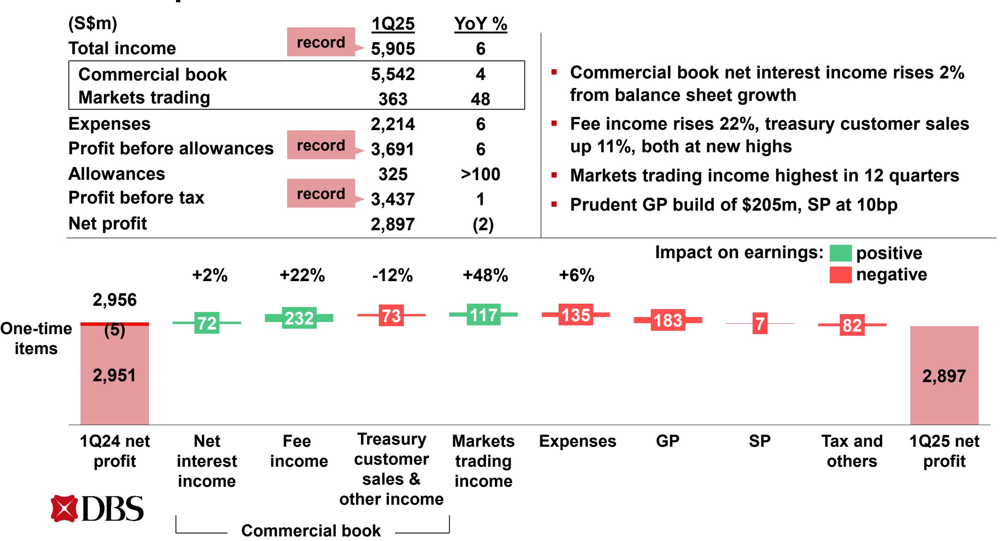
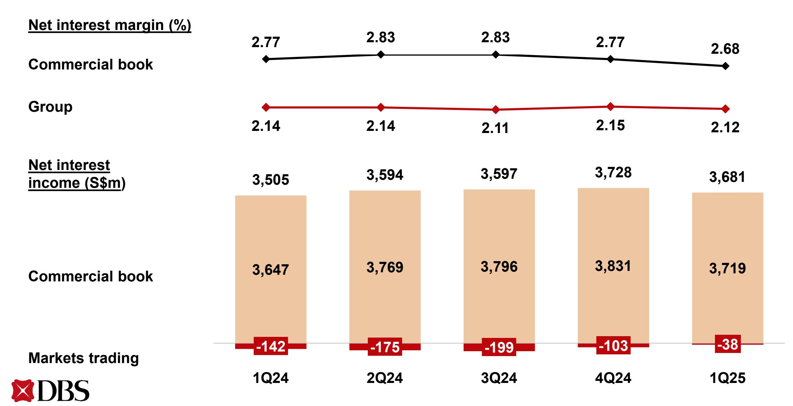
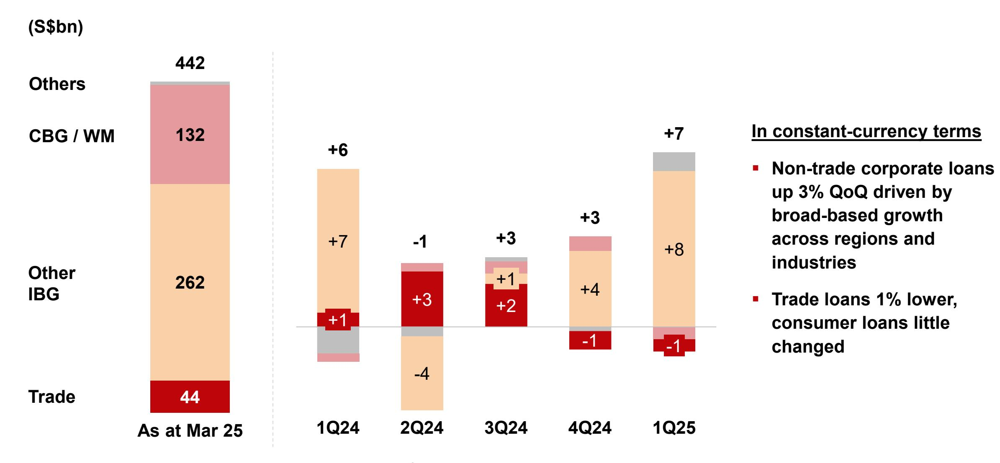
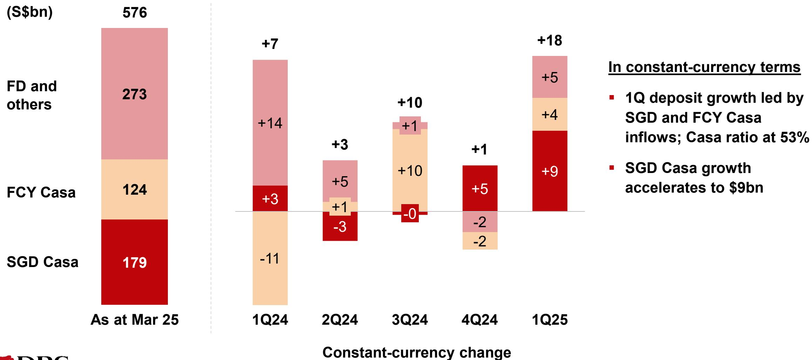
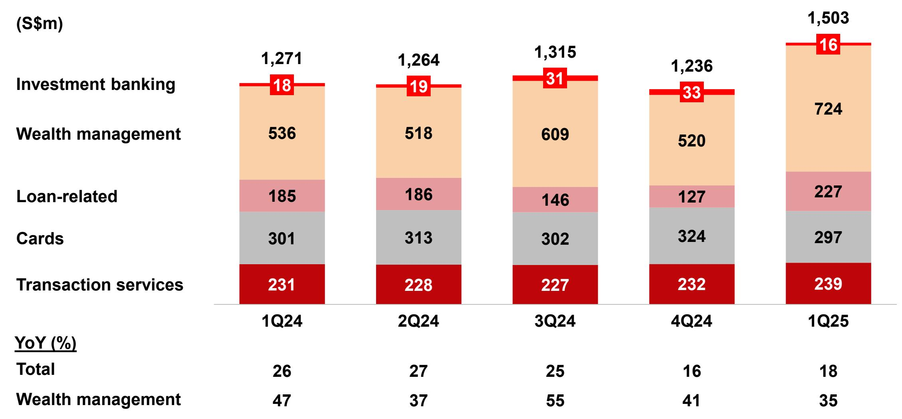
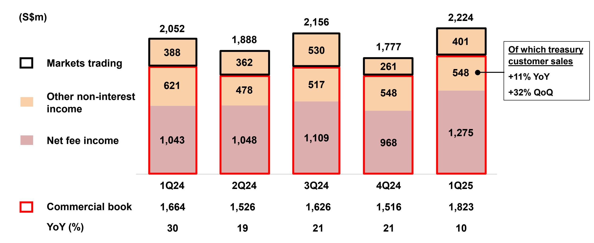
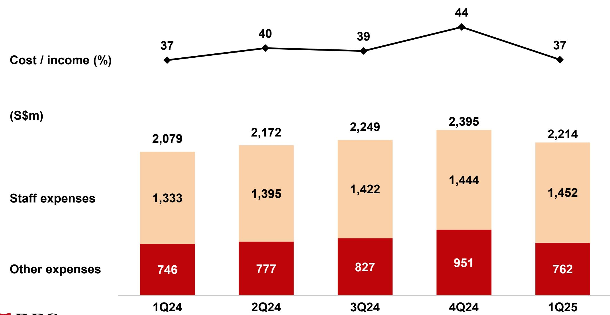
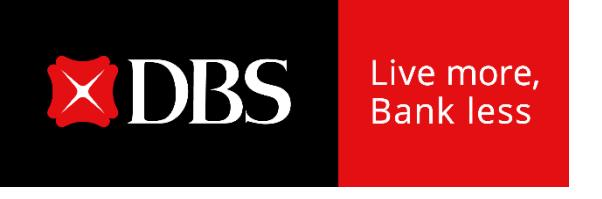

# **Record quarterly income and pre-tax earnings**

**DBS Group Holdings 1Q 2025 financial results May 8, 2025**

#### **Highlights**

**1Q total income up 6% YoY to record \$5.91bn, pre-tax profit of \$3.44bn at record despite GP build Net profit 2% lower at \$2.90bn due to 15% global minimum tax, ROE at 17.3%**

- Commercial book total income up 4% YoY to \$5.54bn
  - o NII rises 2% as balance sheet growth more than offsets nine-basis-point decline in NIM
  - o Record fee income and treasury customer sales driven by wealth management
- Markets trading income highest in 12 quarters

#### **1Q net profit up 10% QoQ**

Total income rises from broad-based business growth in commercial book and markets trading

#### **Balance sheet remains strong**

- Asset quality resilient. NPL ratio stable at 1.1%, SP at 10bp
- GP of \$205m taken as prudent measure to strengthen GP reserves
- Allowance coverage rises to 137% and to 230% after considering collateral
- Transitional CET1 ratio at 17.4%, fully phased-in at 15.2%

**1Q total dividend of 75¢ per share, comprising 60¢ ordinary dividend and 15¢ Capital Return dividend**

## **1Q net profit declines 2% YoY**

### **1Q net profit rises 10% QoQ**

# **1Q group net interest income up 1% day-adjusted QoQ, NIM declines 3bp from lower interest rates**

#### **Loans up 2% QoQ led by non-trade corporate loans**

#### Deposits up 3% QoQ from Casa inflows

# **1Q fee income at record with wealth management and loan-related fees at new highs**

Gross fee income

#### **Record quarterly Wealth Management income, AUM at new high**

# **1Q commercial book non-interest income up YoY and QoQ from record fee income and treasury customer sales**

### **1Q expenses up 6% YoY, cost-income ratio stable at 37%**

# **NPA declines 3% QoQ due to lower new NPA formation and higher upgrades**

| (S\$m)                               | 1Q24  | 2Q24  | 3Q24  | 4Q24  | 1Q25  |
|--------------------------------------|-------|-------|-------|-------|-------|
| NPAs at start of period              | 5,056 | 5,221 | 5,077 | 4,680 | 5,036 |
| IBG and others                       | 75    | (152) | (214) | 81    | (146) |
| New NPAs                             | 317   | 191   | 452   | 338   | 159   |
| Upgrades, settlements and recoveries | (196) | (308) | (491) | (208) | (236) |
| Write-offs                           | (46)  | (35)  | (175) | (49)  | (69)  |
| CBG / WM                             | 43    | 5     | (23)  | 101   | 19    |
| Translation                          | 47    | 3     | (160) | 174   | (48)  |
| NPAs at end of period                | 5,221 | 5,077 | 4,680 | 5,036 | 4,861 |
| NPL ratio (%)                        | 1.1   | 1.1   | 1.0   | 1.1   | 1.1   |

#### **1Q SP at 10bp**

| (S\$m)                 | 1Q24 | 2Q24 | 3Q24 | 4Q24 | 1Q25 |
|------------------------|------|------|------|------|------|
| IBG and others         | 5    | (11) | 43   | 106  | (14) |
| Add charges for        | 54   | 50   | 168  | 124  | 168  |
| New NPLs               | 45   | 29   | 147  | 88   | 65   |
| Existing NPLs          | 9    | 21   | 21   | 36   | 103  |
| Subtract charges for   | 49   | 61   | 125  | 18   | 182  |
| Upgrades               | 0    | 15   | 1    | 1    | 119  |
| Settlements            | 40   | 38   | 75   | 16   | 33   |
| Recoveries             | 9    | 8    | 49   | 1    | 30   |
| CBG / WM               | 96   | 100  | 110  | 113  | 117  |
| SP charges for loans   | 101  | 89   | 153  | 219  | 103  |
| Other credit exposures | 14   | 8    | (33) | 9    | 8    |
| Total SP charges       | 115  | 97   | 120  | 228  | 111  |
| SP / loans (bp)        | 10   | 8    | 14   | 20   | 10   |

# **General allowance of \$205m taken as prudent measure, allowance coverage ratio rises to 137%**

| (S\$m)                            | 6,527  | 6,550  | 6,323  | 6,514  | 6,650  |
|-----------------------------------|--------|--------|--------|--------|--------|
| GP                                | 3,927  | 3,981  | 3,955  | 3,969  | 4,159  |
| SP                                | 2,600  | 2,569  | 2,368  | 2,545  | 2,491  |
|                                   | Mar 24 | Jun 24 | Sep 24 | Dec 24 | Mar 25 |
| Total allowance reserves as % of: |        |        |        |        |        |
| NPA                               | 125    | 129    | 135    | 129    | 137    |
| Unsecured NPA                     | 223    | 227    | 242    | 226    | 230    |

### **Strong CET-1 and leverage ratios**

| (%)                  |        |        | 18.8   | 18.6   | 18.6   |
|----------------------|--------|--------|--------|--------|--------|
|                      |        |        | 0.9    | 0.9    | 1.0    |
|                      |        |        | 0.7    | 0.7    | 0.2    |
|                      | 16.2   | 16.2   |        |        |        |
| Tier 2               | 0.9    | 0.8    |        |        |        |
| Additional Tier 1    | 0.6    | 0.6    | 17.2   | 17.0   | 17.4   |
| Common Equity Tier 1 | 14.7   | 14.8   |        |        |        |
|                      |        |        |        |        |        |
|                      | Mar 24 | Jun 24 | Sep 24 | Dec 24 | Mar 25 |
| RWA (S\$bn)          | 378    | 386    | 338    | 352    | 352    |
| Leverage ratio (%)   | 6.5    | 6.5    | 6.8    | 6.7    | 6.5    |
|                      |        |        |        |        |        |
| Fully phased-in      |        |        |        |        |        |

# **1Q total dividend of 75¢ per share, comprising 60¢ ordinary dividend and 15¢ Capital Return dividend**

**(S¢ per share) 38 54 60 44 54 15 44 54 49 60 2023 2024 2025 175 222 75 Ordinary Capital Return 1Q 2Q 3Q 4Q**

#### **In summary**

**Strong start to the year with broad-based business growth led by wealth management, ROE above 17% despite global minimum tax**

**General allowance reserves strengthened in light of heightened macroeconomic risks and market volatility** 

**Remain nimble to capture opportunities while prudently managing risks**

**Strong capital and liquidity positions provide solid foundation to continue supporting customers through uncertainty**

# **Record quarterly income and pre-tax earnings**

**DBS Group Holdings 1Q 2025 financial results May 8, 2025**